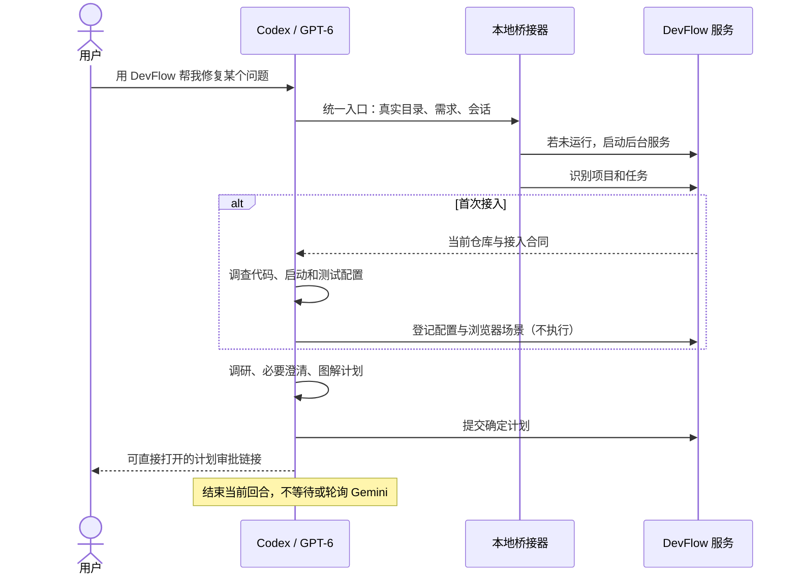

# DevFlow 入口与运行方式修正

日期：2026-09-11。本文替代原设计中的 Windows 账户隔离、人工接入和手动串联工具要求。控制台现已取消通行密钥和配对，用户已恢复完整测试；结果见 [本轮验证报告](../test/免登录改版验证报告.md)。

## 用户如何开始

日常唯一的对话入口是：**在业务项目的 Codex 新任务说“用 DevFlow 帮我……”**。用户不需要指定内部 Skill、MCP 工具、数据结构或启动命令。短说明见 [使用与恢复指南](../guide/使用与恢复指南.md)。

自动触发依据 Codex 的 Skill 描述匹配；主入口 `devflow` 显式开启 `allow_implicit_invocation`。内部规划、接入、执行、浏览器验收、复核规范仍保留，但不再是用户操作步骤。普通不提 DevFlow 的任务不会被全局接管。官方机制见 [Skill 自动选择](https://learn.chatgpt.com/docs/build-skills)。

## 源码入口与配置

| 组件 | 当前职责 |
|---|---|
| `packages/skills/devflow/SKILL.md` | 自然语言入口，按服务返回阶段选择内部规范 |
| `packages/entry/src/intake.ts` | 项目识别、首次接入、会话绑定、新建/继续与幂等 |
| `devflow_start` | 返回项目、工作流、路径、基线、配置哈希、下一步和审批链接 |
| `devflow_register_project` | 保存调查出的配置和固定浏览器动作，不执行项目命令 |
| `packages/bridge/src/planner.ts` | 本地 stdio MCP；每次工具请求前确保服务已运行，凭证在程序内部处理 |
| `packages/service/src/launcher.ts` | 按安装目录启动、识别已有实例、并发启动锁、直接打开工作台 |
| `scripts/install-windows.ps1` | 当前用户安装/更新入口，同步依赖并构建 |
| `scripts/setup.mjs` | 备份并更新自己的 Skill/MCP 配置，复用本机 OpenTabs |
| `scripts/stop-devflow.ps1` | 仅在 PID、创建时间、程序与安装入口均匹配时停止旧服务 |
| `打开 DevFlow.vbs` | 隐藏终端并打开控制台；不要求用户保留命令窗口 |

个人 Codex 配置改为 stdio 启动 `dist/packages/bridge/src/planner.js`，并将 `cwd` 固定为 DevFlow 安装目录。业务项目的真实目录作为工具参数传入，不能与服务 cwd 混淆。安装器只替换 `[mcp_servers.devflow]` 和其子节；其他服务器及个人配置原样保留，并备份到个人 Codex 目录的 `devflow-backups/<时间>/`。配置语义见 [本地 MCP 进程](https://learn.chatgpt.com/docs/extend/mcp?surface=cli)。

## 多项目与 worktree

根据实际 Git `common_dir` 匹配仓库，同时把当前 checkout 的真实路径保存为该工作流的 `entry_context.roots`。执行前再次核对来源仓库，使用相应基线，不把另一个 worktree 的文件路径当作本任务的路径。

同一会话、项目与当前 checkout 共同决定续接绑定。新 Codex 会话创建独立任务，明确“新需求”会创建新工作流；用户明确继续但有多个候选时，才按可读名称澄清。不能用全局最近一次项目/任务代替上下文。幂等键重试返回原工作流的当前状态。

任务 ID、批准版本、执行 run、Gemini 会话、测试快照、环境版本及资源租约仍各自独立。多个项目/多个 worktree 可并行；同一写目录、共享数据、浏览器场景和模型并发槽位由原调度器协调。

## 首次适配与验证顺序

原先 `execute` 在启动 Gemini 之前就要求环境启动成功，首次接入存在循环依赖。现在环境准备在 `freeze` 内执行：先阻止受控写操作，停止旧环境，运行 fixture、分配临时端口、启动服务并核对前后端目标，然后冻结快照。

准备中的 fixture 和服务纳入本 run 的停止集合；用户停止时取消后续启动、停止准备进程并等待清理，不能留下仍在写测试数据的后台任务。环境变更会使旧证据失效。此处身份响应头用于识别目标服务实例，与 Windows 账户无关。

## 完全取消 Windows 账户隔离

已移除身份池配置、运行时隔离门槛、账户登录/切换 API、密码保存、ACL 授权脚本和隔离记录导入命令。控制器、agy、测试进程和 Codex 统一使用当前 Windows 用户，使用原来的官方登录配置。

Windows Host 保留 Job Object、进程树停止、控制器互斥和进程归属查询。Hook、文件 Broker、审批版本、快照、证据和提交检查继续负责流程约束；不把这些能力描述为 OS 账户级沙箱。默认状态目录 `.devflow`、缓存、凭证和本机配置均从 Git 排除。

## 控制台与恢复

去掉手工登记项目、填写工作流参数和导入计划 JSON 的日常按钮；“如何开始新任务”只显示一句话示例。审批链接直接选中对应任务。直接进入工作台，无配对、注册、登录或通行密钥；批准和验收仍绑定页面所展示的计划版本与代码快照。

后台服务独立于原 Codex 对话存活。每次工具调用都可以唤醒服务；启动锁损坏后按时间回收。安装器在停止旧服务之前持有维护文件锁并等待正在启动的进程交接；桥接器在维护期间拒绝启动，避免更新时重新占用 Host。维护锁随进程退出释放，崩溃遗留的文件在下次打开时回收。端口属于其他程序或不匹配的旧服务时拒绝接管。服务重新启动后读取原数据库，对中断运行进入恢复状态，用户打开原任务点击“继续这个任务”。不复制工作流、不清空状态、不盲重试不确定的写请求。

## 保留的原始要求

- GPT-6 负责研究、确定方案、图解和独立代码复核；Gemini 3.7 Flash High 负责执行及测试。
- 复杂任务三文档，普通任务一文档；进度勾选需要真实实现及当前快照的证据。
- 单元、集成、E2E、OpenTabs 真实浏览器测试按批准合同执行；不适用情况必须明确说明并审批。
- 先问清业务问题，计划不含未决项或备选方案；严格限制修改范围，优先局部修复。
- agy 输出由后台持续接收、持久化和推送，用户可实时观察和停止；GPT-6 不监工。
- 人工验收后独立复核，检查质量、SOLID、遗漏、回归和安全；失败形成新的修复计划再审批，通过后自动本地提交。
- 发布由用户另行通知；可选执行器保持非默认，本轮不扩展 Cursor 功能。

## 当前验证状态

用户随后要求取消通行密钥、恢复完整测试并提交。现已验证免登录入口、批准和验收闭环、真实模型与 MCP 信息传递、实时日志、进程停止、并行环境及本机服务启停；具体用例、原始结果与适用边界见 [本轮验证报告](../test/免登录改版验证报告.md)。历史暂停期间的报告不替代本轮证据。

控制台信任当前 Windows 用户及其本机程序；同源校验阻止外部网页跨站操作，不提供独立的人类身份认证。内部模型令牌与作用域门禁保留，用户无需管理它们。
