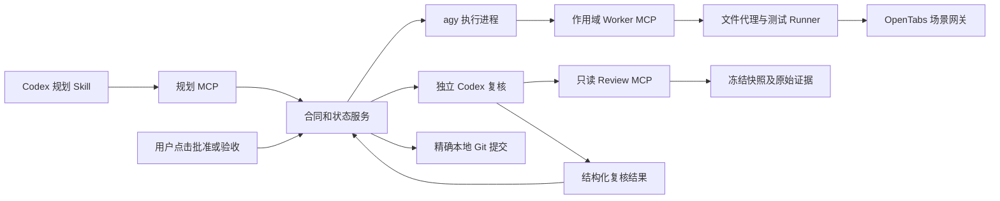

# 实施接口与原计划对应

> 历史记录（2026-09-11）：本文既有测试数字和复核结论属于先前版本。Windows 专用账户与通行密钥要求现已取消，完整测试已恢复；最新结果见 [免登录改版验证报告](../test/免登录改版验证报告.md)。

2026-09-11。原详细计划保留作为需求基线；本文件记录真实联调后确定的接口细节，运行合同以 `packages/contracts`、MCP tools/list 和 `examples/schemas` 为准。

| 原计划意图 | 当前实际实现 |
|---|---|
| 规划/调研上下文、决策记录 | 4 个 planner MCP；decisions 随版本化计划提交，get_workflow 获取当前成果 |
| 执行者分角色读写 | 9 个 worker MCP；绑定 run 的短期令牌；工具名见使用指南 |
| 计划/任务包/材料分页 | execute_context 的 section/id/offset；大响应 response_id 分页，避免 agy 转存不可读取的临时文件 |
| 模型自由串联浏览器工具 | 项目预先登记固定 recipe，devflow_run_check 调用 Browser Gateway；每个动作验证结果和来源 |
| OpenTabs Gateway 端点 | 本机实际工具发现与验证是 9515/mcp；不使用计划阶段的假定 /mcp/gateway 路径 |
| 复核者只读材料 | Codex 保持 read-only，附带 4 个 devflow_review MCP；只读冻结文件和哈希绑定的原始证据 |
| 通用业务 JSON Schema | Zod 严格校验；Codex 输出另转换为兼容的封闭对象 Schema，仓库键按本次项目展开 |
| 人工批准/验收 | 本机按钮直接确认，绑定当前版本/快照；MCP 没有批准或提交工具 |
| 全局后台调度 | 单个状态目录的 Windows Mutex + SQLite outbox + 进程登记与资源租约 |
| 运行回调 | Host 读取 stdout/stderr，控制器持久化后 WebSocket 推送；GPT-6 不查询执行进度 |
| 测试失败后的实施循环 | 真实失败报告保存，旧证据失效，回到原批准范围的 EXECUTING，重新 freeze 与完整检查 |
| 提交恢复 | 每仓稳定 commit 意图 + update-ref CAS + index 修复；部分成功重试不重复提交 |

## 信息与身份边界

`devflow_review_context` 分页返回计划、项目命令、任务声明、证据、Skill、diff、快照和工作区。`devflow_review_read_file` 只读冻结清单中的文件并验证真实 hash；`devflow_review_search` 查找冻结文件中的上下游引用；`devflow_review_evidence` 只读本次登记的证据并验证 hash。不存在写入、执行 shell、人工批准或提交能力。

复核模型处理的是可审查数据，不继承 Gemini 会话。源码和计划中的嵌入指令不能改变复核角色。报告未覆盖完整需求、相关代码或真实证据时必须 incomplete，状态机拒绝提交。

## 与全面验收的区别

测试证据与用户本人实操分别记录；Windows 专用账户、ACL、身份切换及通行密钥要求已取消。使用当前用户身份运行本机平台，不宣称操作系统级隔离。

原计划 57 项是复合验收合同，并不等于自动测试函数数量。多个测试覆盖同一合同，或只覆盖合同的一部分，均应按实际证据记录；不能用函数总数替代用户验收。
