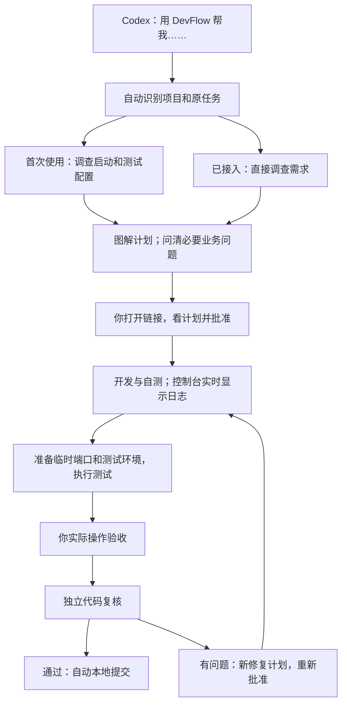

# DevFlow 怎么用

> 2026-09-11 修订：控制台已取消登录、配对和通行密钥。用户已恢复完整测试，当前结果见 [本轮验证报告](../test/免登录改版验证报告.md)。
>
> 面向执行模型的「指定计划权威规则」已迁至 [执行约定](执行约定.md)，效力不变。
>
> 正式安装包发布后，普通用户通过一行安装使用成品，**不需要回到源码目录执行构建**。当前为开发预览：源码构建与启动见 [开发指南](../development/开发指南.md)；安装目标态、更新与恢复入口见 [安装与升级](安装与升级.md)。

## 平时只需要一句话

在 **Codex 打开你要修改的业务项目，新建任务**，说：

> 用 DevFlow 帮我修复客户列表筛选的问题。

不用记住 Skill 名称、MCP 工具名，不用填写 JSON，也不用先手动登记项目。普通 Codex 任务仍按普通任务处理；提到“用 DevFlow”才进入这个流程。

新任务默认在选定项目的现有工作区执行，保留所有暂存与工作区修改；只有明确勾选或指示新建 worktree 时，才会在项目目录 `<source_root>/.worktrees/<任务ID>/<仓库ID>` 下创建工作树，自动通过 Git 本地 exclude 忽略，任务完成不自动删除。
需求计划、审查结论与测试证据归属项目（`docs/plan/`、`docs/process/`、`docs/test/evidence/`），平台仅作引用与缓存。
同模型各角色续接同一 CLI 主会话；可在工作台查看精确会话 ID 与经过安全转义的原 CLI 手动续接命令，支持一键停用自动调度进行手动接管。

复杂任务有计划、开发进度、测试进度三份文档；普通任务合并到一份。计划没有未决项或让执行模型自行选择的方案。能局部修就局部修。单元、集成、E2E、现有 OpenTabs 真实浏览器测试均在计划中安排，不适用的情况要写清并由你批准。

## 打开控制台

双击安装目录中的 **打开 DevFlow**（Windows 预览入口为“打开 DevFlow.vbs”）。后台服务已经运行时直接打开；没有运行时先启动再打开，不需要留着终端窗口。Codex 连接 DevFlow 时也会自动启动服务。

打开后直接进入工作流总览。没有账号、登录、配对码或通行密钥；看完计划后点击“批准当前计划”，实际操作通过后点击“验收通过，启动复核”。旧版已配对过也无需解绑或重建数据。

服务运行后也可打开 [控制台](http://localhost:4810)。只打开这个网页地址本身不会启动已经停止的后台服务，因此重启电脑后优先双击“打开 DevFlow”。

## 你在控制台做什么

| 场景 | 操作 |
|---|---|
| 计划写好 | 打开 Codex 给出的链接，先看图和修改范围，再批准 |
| 模型正在执行 | 看实时日志与底部子 Agent 工作卡；方向不对用任务页“暂停”或工作卡“暂停全部” |
| 需要给正在执行的任务补充说明 | 直接在侧栏常驻输入框发送；只读提问在开头写 `/btw` 或 `/side`，浮窗不是整页弹窗 |
| 自动测试完成 | 打开页面给出的测试地址，实际操作 |
| 原需求没有做好 | 点击反馈，说明操作和结果，选择“原需求尚未做好” |
| 想增加需求 | 反馈中选择“我想增加或改变需求”，回到 Codex 继续规划 |
| 实操通过 | 确认验收，服务自动安排独立代码复核 |
| 复核有问题 | 查看新的修复计划，批准后继续 |
| 复核通过 | 自动在本地提交代码；发布仍需你另行下指令 |

执行期间，原对话结束当前回合，不监控、不反复查状态。实时日志由后台程序接收并推送到页面。暂停后服务会返回完成、部分成功或处理中，不会把未确认退出的子会话显示成已经全部停住。附件单个不超过 20MiB，普通 JSON 仍是 8MiB；文件正文只走专用上传且须为 `application/octet-stream`。

旧的“指导或提问”按钮、“临时提问”Tab 和整页历史弹窗已经去掉，请用常驻输入框与输入框上方的非模态浮窗。

## 电脑重启或任务中断

2026-09-15 起，构建和启动错误支持原任务自动修复；需要你介入时，直接在执行侧栏常驻输入框发送指导。命令授权在同一侧栏批准或拒绝，等待期间释放模型名额。具体操作见 [授权、指导和自动修复](使用指南.md#授权指导和自动修复)。子 Agent、附件限制和临时提问见 [使用指南](使用指南.md#我发现问题了怎么办)。

1. 双击“打开 DevFlow”。
2. 在左侧找到**原来的项目和任务**。
3. 若显示“需要恢复检查”，点击 **继续这个任务**。系统核对进程和批准记录后恢复未完成项，不重做已完成或已取消的子 Agent；不重新建项目，不重新建任务。用户主动暂停后，旧额度定时重试不会自动继续。
4. 若显示“提交需要恢复”，使用页面的提交恢复操作，继续原快照。

计划、进度和历史日志保存在本机 `.devflow` 状态目录。不要删除它来解决启动问题。停止的旧进程、失效登录或有变化的计划会给出具体提示；服务重启不会把旧测试结论自动算作新代码通过。

需要在 Codex 继续时说“用 DevFlow 继续刚才的筛选修复”。同一项目存在多个任务且无法从当前对话确定时，它会用任务名称让你确认，不会随便接到最后一次任务上。

应用本身的安装、更新与灾难恢复见 [安装与升级](安装与升级.md) 与 [安装与恢复](安装与恢复.md)。参与开发时的源码构建与测试见 [开发指南](../development/开发指南.md)。

## 首次安装与以后更新

**普通用户（发布后）：** 使用一行安装命令装好成品，打开工作台完成工具与模型设置即可；打开、更新和恢复都不需要回到源码目录。详见 [安装与升级](安装与升级.md)。正式安装包尚未发布前，本节不提供可执行的用户安装命令。

**开发者源码安装（非用户默认路径）：** `scripts/install-windows.ps1` 是**开发者源码安装**兼容入口，会在当前 Windows 用户下同步依赖、编译并更新本机 Skill 与 Codex MCP 配置，备份原配置；它按进程路径与创建时间核对本安装的旧服务再停止，不会按进程名杀掉其他 Node 程序。该脚本**不再作为普通用户默认入口**。

开发者源码安装可带 PlannerTool、PlannerModel、PlannerEffort、ExecutorTool、ExecutorModel、ExecutorEffort；发布安装对应 `--planner-tool` 等参数。`--tools` / SelectedTool 只分发客户端和 Skill，不代替这两个默认角色。升级会保留已有默认配置、任务 spec 和授权记录；只有你这次明确给出新的默认参数才会更新。

安装器不启动业务任务来检测模型；无交互安装缺登录或未完成默认配置时，服务可安装成功并提示「模型设置待完成」。

系统默认只有规划、执行两槽；审查等三项覆盖在任务里设置。保存后下次派发生效，当前轮不换。首次授权验证成功后跨任务复用，不是每轮验证。不能自动换更合适的模型。目录成功、登录成功、访问成功、业务验证成功互相独立。

所有程序使用你当前的 Windows 用户及已有 agy/Codex 官方登录。**不创建账户、不切换账户、不修改账户 ACL、不要求管理员、不增加新的订阅登录。** 进程管理与 Windows 凭据由 Node 运行时实现（不再使用旧 Go Host）。

开发者接口、配置字段和历史修正细节见 [入口与运行方式修正](../design/DevFlow入口与运行方式修正.md)（历史设计文档）。

## 关于旧版的 SQLite 实验性警告（历史）

旧版配对命令中的 `ExperimentalWarning: SQLite is an experimental feature` 来自 Node 的实验性数据库接口。它表示接口升级兼容性风险，不能据此判断配对失败或数据损坏。当前源码已改用固定版本的 `better-sqlite3` 驱动，原数据库继续沿用，无需重新初始化或安装数据库服务。此次调整的数据库读写、事务回滚和备份恢复已有测试覆盖；详情见 [SQLite 驱动稳定性调整](../design/SQLite驱动稳定性调整.md)。

<!-- 原“程序调度的正式计划逐项复核”条款已由 docs/plan/DevFlow轻量调度边界审计与整改计划-20260918.md 替代：平台不再调度独立自查或核验测试证明，执行完成后直接进入两阶段代码质量审查。 -->
