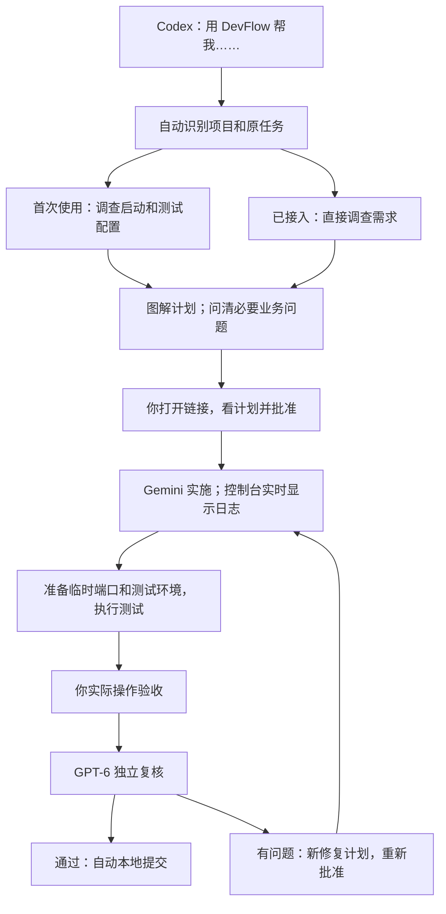

# DevFlow 怎么用

> 2026-09-11 修订：控制台已取消登录、配对和通行密钥。用户已恢复完整测试，当前结果见 [本轮验证报告](../test/免登录改版验证报告.md)。

## 平时只需要一句话

在 **Codex 打开你要修改的业务项目，新建任务**，说：

> 用 DevFlow 帮我修复客户列表筛选的问题。

不用记住 Skill 名称、MCP 工具名，不用填写 JSON，也不用先手动登记项目。普通 Codex 任务仍按普通任务处理；提到“用 DevFlow”才进入这个流程。

如果需要指定工作目录，用自然语言补一句“就在当前目录做”或“开一个新 worktree”。没有指定时采用新 worktree，计划中会说明；本次 DevFlow 自身修正遵循用户要求，使用当前目录。

复杂任务有计划、开发进度、测试进度三份文档；普通任务合并到一份。计划没有未决项或让执行模型自行选择的方案。能局部修就局部修。单元、集成、E2E、现有 OpenTabs 真实浏览器测试均在计划中安排，不适用的情况要写清并由你批准。

## 打开控制台

双击项目目录中的 **打开 DevFlow.vbs**。后台服务已经运行时直接打开；没有运行时先启动再打开，不需要留着终端窗口。Codex 连接 DevFlow 时也会自动启动服务。

打开后直接进入工作流总览。没有账号、登录、配对码或通行密钥；看完计划后点击“批准当前计划”，实际操作通过后点击“验收通过，启动复核”。旧版已配对过也无需解绑或重建数据。

服务运行后也可打开 [控制台](http://localhost:4810)。只打开这个网页地址本身不会启动已经停止的后台服务，因此重启电脑后优先双击“打开 DevFlow”。

## 你在控制台做什么

| 场景 | 操作 |
|---|---|
| 计划写好 | 打开 Codex 给出的链接，先看图和修改范围，再批准 |
| Gemini 正在执行 | 看实时日志；发现方向不对点击停止 |
| 自动测试完成 | 打开页面给出的测试地址，实际操作 |
| 原需求没有做好 | 点击反馈，说明操作和结果，选择“原需求尚未做好” |
| 想增加需求 | 反馈中选择“我想增加或改变需求”，回到 Codex 继续规划 |
| 实操通过 | 确认验收，服务自动安排 GPT-6 独立复核 |
| 复核有问题 | 查看新的修复计划，批准后继续 |
| 复核通过 | 自动在本地提交代码；发布仍需你另行下指令 |

Gemini 执行期间，原 Codex 对话结束当前回合，不监控、不反复查状态。实时日志由后台程序接收并推送到页面。

## 电脑重启或任务中断

2026-09-15 起，构建和启动错误支持原任务自动修复；需要你介入时，可在执行侧栏输入指导并继续。命令授权在同一侧栏批准或拒绝，等待期间释放模型名额。具体操作见 [授权、指导和自动修复](使用指南.md#授权指导和自动修复)。

1. 双击“打开 DevFlow”。
2. 在左侧找到**原来的项目和任务**。
3. 若显示“需要恢复检查”，点击 **继续这个任务**。系统核对进程和批准记录后恢复；不重新建项目，不重新建任务。
4. 若显示“提交需要恢复”，使用页面的提交恢复操作，继续原快照。

计划、进度和历史日志保存在本机 `.devflow` 状态目录。不要删除它来解决启动问题。停止的旧进程、失效登录或有变化的计划会给出具体提示；服务重启不会把旧测试结论自动算作新代码通过。

需要在 Codex 继续时说“用 DevFlow 继续刚才的筛选修复”。同一项目存在多个任务且无法从当前对话确定时，它会用任务名称让你确认，不会随便接到最后一次任务上。

## 首次安装与以后更新

维护者完成安装后，日常使用不需要这些步骤。

双击 **安装或更新 DevFlow.cmd**。安装程序在当前 Windows 用户下完成依赖、编译、个人 Skill 和 Codex MCP 配置，并备份原配置。它先按进程路径与创建时间核对本安装的旧服务，再停止它；不会按进程名杀掉其他 Node 程序。

安装结束后**重启 Codex 一次**加载新的入口。更新后打开原工作台即可，项目和工作流状态保留。需要 Node 22.23.2+ 与 .NET 10 构建环境；这台开发机已有本地构建工具。安装器不执行测试或真实模型调用。

所有程序使用你当前的 Windows 用户及已有 agy/Codex 官方登录。**不创建账户、不切换账户、不修改账户 ACL、不要求管理员、不增加新的订阅登录。** Windows Host 只用于管理和停止子进程树。

开发者接口、配置字段和此次修正细节见 [入口与运行方式修正](../design/DevFlow入口与运行方式修正.md)。

## 关于旧版的 SQLite 实验性警告

旧版配对命令中的 `ExperimentalWarning: SQLite is an experimental feature` 来自 Node 的实验性数据库接口。它表示接口升级兼容性风险，不能据此判断配对失败或数据损坏。当前源码已改用固定版本的 `better-sqlite3` 驱动，原数据库继续沿用，无需重新初始化或安装数据库服务。此次调整的数据库读写、事务回滚和备份恢复已有测试覆盖；详情见 [SQLite 驱动稳定性调整](../design/SQLite驱动稳定性调整.md)。
