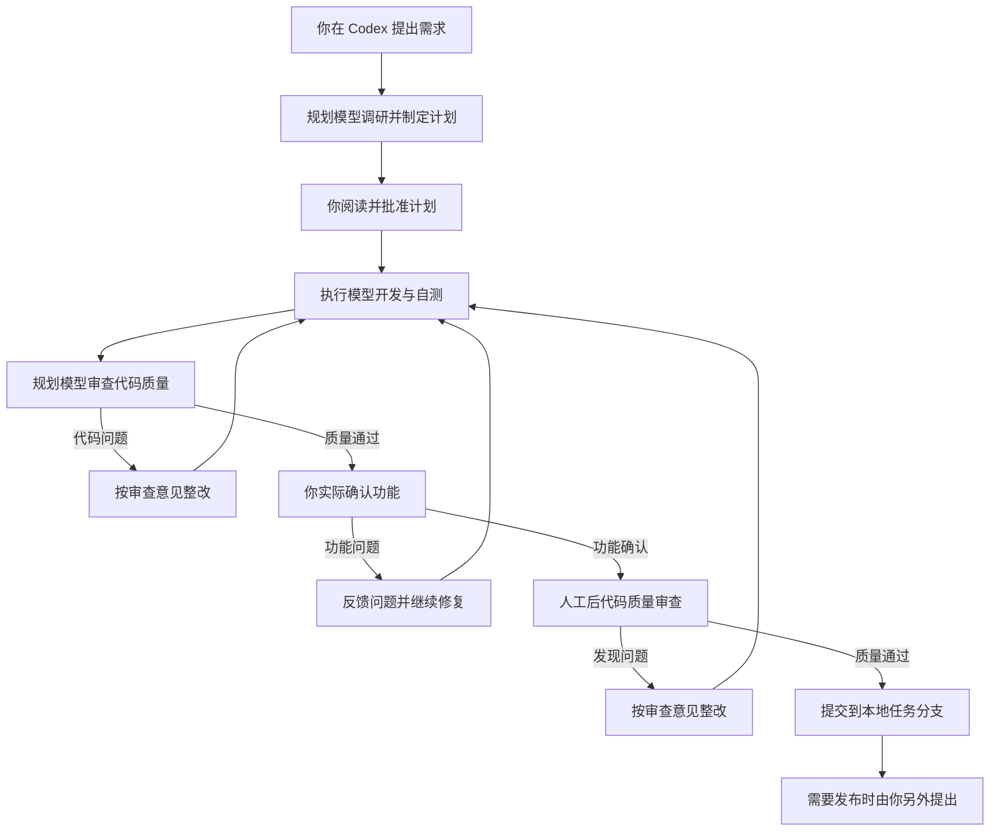

# DevFlow 使用指南

<!-- devflow-plan-authority:v1 -->
## 指定计划为执行依据，禁止执行模型另建计划

当你已经提供计划或整改文档并说“按这份文档完整执行”时，执行模型必须直接依照原文及正式修订开发、自测，不应再创建 implementation_plan.md、客户端计划工件或局部实施计划来替代它。进度记录只能引用原任务编号，记录做了什么、验证结果及剩余项，不能删减范围或改写验收条件。

若原计划确实不可实施，执行模型应说明具体章节和代码冲突，交规划模型修订原计划；不能自行换方案。最终仍按原文全部要求复核，包括实际流程、异常处理和回归；不能只对照执行模型自己的清单宣布完成。

DevFlow 帮你把一个开发需求从计划推进到代码提交。你在 Codex 中提出需求，在这个工作台查看计划、掌握进度、反馈问题和验收结果。

## 从哪里开始

在 Codex 中打开你要修改的业务项目，新建任务，直接描述需求：

> 用 DevFlow 帮我修复客户列表筛选的问题：选择负责人后列表没有变化。

也可以提出新功能：

> 用 DevFlow 给订单列表增加导出功能，只导出当前筛选结果。

你不需要记住任何工具名称，也不用手动登记项目。第一次使用某个项目时，Codex 会先了解项目如何启动、测试和使用数据，遇到不能从项目中确定的问题再向你询问。

说明期望行为、遇到的问题、必须保持的功能即可。如果有相关截图或文档，可以一起提供。需要独立开发目录时说“这次用独立工作区”；希望直接修改当前目录时说“在当前目录继续”。安排会写进计划供你查看。

## 打开工作台

双击安装目录中的“打开 DevFlow”，或者在服务运行时访问 http://localhost:4810 。无需登录或配对。

再次打开会复用已有服务。关闭网页不会停止开发；想停止当前任务，请使用任务页面的“暂停”。电脑重启后重新双击“打开 DevFlow”，从左侧找到原任务继续。

## 工具与模型、任务归档

工作台顶部的「设置」包含「默认模型」与「归档」两个选项卡：

- **默认模型**：支持配置规划、执行、复核三个阶段的全局默认模型（复核阶段可选择“同规划”或单独选择工具、模型与思考强度）。
- **归档**：支持对已归档任务进行搜索、查看详情或一键恢复。将任务移入归档仅隐藏其在左侧列表的可见性，不会中断正在执行的任务，也不会删除或改动工作目录、Git 分支与 worktree。當某项目下所有任务均已归档时，该项目在左侧栏自动收起，恢复任务后自动重新显示。

任务页面右上角固定双行展示该任务的「规划」与「执行」配置，并根据当前真实运行职责高亮对应行；若独立复核模型与规划配置不同，将在旁侧显示紧凑的「复核中」标识，不会偷换规划行内容。

修改系统默认只影响之后新建的任务。修改已有任务时，打开该任务的「工具与模型」；任务配置和本次修复处理者可以独立调整。

点「保存，下次派发生效」后，当前正在跑的一轮继续用原来的配置；新配置从下一次派发开始。平台不会因为目录里出现别的模型就自动换掉你的选择。

某个工具/账号/模型第一次授权验证成功后，之后的任务会复用，不需要每轮再验证。下面四件事不是一回事：

- 目录成功：能列出模型。
- 登录成功：对应客户端已登录。
- 访问成功：该模型已通过授权验证。
- 业务验证成功：当前任务的测试和你的验收通过。

安装时 `--tools` 只决定给哪些客户端分发 Skill，不会当成默认规划或执行角色。无交互安装如果还没完成模型设置，服务可以装好，但会提示「模型设置待完成」，需要打开工作台把默认配置验证并保存。

## 授权、指导和自动修复

- **等待操作授权**：执行过程侧栏会自动展开，显示命令、参数、工作目录和申请原因。确认后点击“批准本次操作并继续”，或填写意见后点击“拒绝并告知模型”。决定仅针对这一次具体操作，系统续接原任务、原会话。关闭页面或重启服务不会丢失待授权请求。
- **执行中需要调整方向，或任务异常中断**：执行过程侧栏底部有常驻输入框，直接写明问题后发送（Enter 发送，Shift+Enter 换行）。不再使用“指导或提问”按钮，也不再切换“临时提问”Tab。平台结束旧轮次、核实进程退出后续接，不需要新建 Agent。扩大需求范围仍要修改计划并重新批准。只读了解进度时，在输入开头写 `/btw` 或 `/side`（见下文临时提问）。
- **构建、服务启动和测试失败**：执行模型读取真实错误，修复后重新启动服务并运行检查。同一错误连续发生时调用规划模型诊断；诊断接口故障不会直接要求用户解释技术日志，执行模型会继续排查。同一错误连续六轮仍未解决时保留现场，工作台提供“继续自动排查”，无需填写技术说明。改变批准范围仍需重新批准计划。
- **模型额度暂时不足**：本轮提供方明确返回额度恢复时间时，工作台显示预计自动继续时间；到点后续接原任务。恢复额度或切换执行器账号后，点击顶部“立即重试”即可取消旧等待并立即续接，不必填写指导。点击“暂停自动继续”可取消定时续接。历史会话错误不会覆盖已完成的新轮次结果；没有明确恢复时间时不猜测。
- **实现与完成说明**：工作台展示执行模型本轮完成说明、规划模型代码质量结论和你的功能确认。执行结果只有完成、需要规划澄清、需要你补充信息三种；审查结论只有通过、需要改代码、需要你补充信息三种。报告附件缺失显示未提供，不推断没测试，也不伪造平台认证。功能是否正常只能由你实际确认。审查提问后你的回答会回到这次代码审查。
- **通用人机交互弹窗（操作协助与业务提问）**：涉及前端的任务，执行模型使用真实浏览器自动核验页面与数据。普通与身份无关的页面会自动免密进入，无需你重复登录。确需你亲自完成登录、扫码或确认业务歧义时，工作台会弹出清晰的交互窗口：
  - **操作请求**：按提示在测试浏览器页面中完成操作（如登录或扫码），完成后点击“我已完成，继续”，模型会自动复查页面现场并继续后续链路。弹窗关闭或稍后处理仅收起窗口，任务保持等待；网络异常可安全重试。
  - **业务提问**：单选或补充说明后提交，回答会直接送回当前执行任务并续接。
- **排队**：工作台区分“正在准备工作区”和“等待执行名额/工作目录/测试资源”，显示占用者。独立工作目录可以并行；同一工作目录写入仍须互斥。

若已授权命令执行期间断电，结果会标记为未知；模型先检查实际效果，需要重试时重新申请，避免重复产生外部效果。

左侧按项目列出需求。点击需求可查看对应计划、任务、测试和执行过程；“工作流总览”显示全部需求；本指南始终位于左侧底部。

## 一个需求如何推进

规划模型负责理解需求、制定计划和代码质量审查；执行模型按批准计划实施和测试。执行模型工作时不需要你一直保持对话等待。你可以直接在工作台看它正在做什么，发现方向不对就停止或反馈。平台负责调度，不核验测试证明。

## 阅读和批准开发计划

计划准备好后，Codex 会给你任务链接，也可以从左侧打开该需求。进入“开发计划”，先看目标、流程图和修改范围，再查看模块、细项任务及测试安排。

重点确认：

- 要实现的行为是否符合预期，是否遗漏必须保留的功能。
- 是否只修改这次需求需要的范围。
- 是否涉及数据变化、依赖调整或独立工作区。
- 如何测试，以及你最后需要实际操作检查什么。

审批区提供三个入口：

- **批准当前计划**：打开审批确认弹窗，可按需填写针对本版计划的**附加执行指令**（例如特定目录边界、兼容要求或实施禁令）。附加执行指令与本版计划哈希绑定并原子保存，自动注入后续实施、自测、修复及代码复核上下文，同时在工作台「概览」的「本版审批附加执行约束」卡片中展示。确认后正式启动开发执行。
- **驳回并修正**：填写问题和修改要求，规划模型在原任务中提交新版，再等你批准。
- **计划问答**：就具体章节向规划模型提问，可查看历史回答并继续追问。问答不会修改计划或改变审批状态。

批准的是你当前看到的这份计划；计划改过以后需要重新查看并批准。

复杂需求会同时提供开发计划、开发进度和测试进度文档。普通需求可以集中在一份计划中。你不需要自己维护复选框。

### 提示“项目代码已更新”怎么办

如果任务尚未开始开发，主工作区的代码就与制定计划时不同，任务会先暂停并提供“处理代码更新”。打开后能看到原来的代码版本、当前版本、最近更新及本地未提交的修改。

- **确认使用当前代码并继续**：确认这些更新不影响原计划。系统记录本次选择，保持任务范围和验收要求，使用当前主工作区开始执行。
- **按当前代码重新规划**：可补充要求，让规划模型结合更新修正计划。新计划仍需你批准。

主工作区直接执行不会因此变成独立工作树。已有未提交内容会保留；查看或确认后代码再次变化，系统会要求重新核对。已经开始开发的任务保留已有执行记录，通过计划调整处理，不会用此入口覆盖执行现场。

## 如何看进度

“代码变更”默认列出本次修改的文件。点击文件可打开具体差异，新增和删除内容分别标记。页面显示实际分支与任务开始前的提交，比较的是这次任务造成的变化。冻结测试后显示对应测试版本的差异。

“代码复核”显示最终复核结论、发现的问题和相关文件。

“测试环境”显示前端、后端能否访问，以及数据来自任务独立目录还是外部共享测试资源。使用同一共享资源的任务需要排队。平台按照项目计划启动环境，不会默认为每个项目安装全套中间件。

数据脚本只打印成功不代表数据已经准备好；页面会分别显示服务健康检查和本版本集成测试的结果。服务未通过健康检查、环境已释放或所需集成测试未通过时，不提供验收页面入口。具体数据依赖和覆盖范围仍可从计划与测试结果中查看。

## 我发现问题了，怎么办

执行方向明显偏离时，点击任务页的“暂停”，或工作卡上的“暂停全部”。两者都只暂停**当前主会话及其子 Agent**，不会停其他任务或独立临时提问。提交后服务立即返回受理结果：全部确认退出为完成，部分会话仍待确认为部分成功，尚未全部确认为处理中。页面不会把“部分成功”显示成已经全部停住。已经写入的代码和过程记录保留。

点击“反馈问题”，描述你做了什么、实际结果和希望得到的结果：

> 在客户列表选择负责人张三后，仍能看到李四负责的客户。期望只保留张三负责的记录。

“原需求尚未做好”会在原计划范围内继续修复；“我想增加或改变需求”会回到重新规划。新增范围需要看过新计划后再批准。

你也可以回到原对话说明需求变化。不要为了同一处问题反复新建需求，否则会产生相互独立的工作流。

### 子 Agent 工作卡

执行过程面板底部会列出当前主会话下正在工作的子 Agent。首次出现时自动展开；右上角 × 只收起卡片，不会停止任务。点进某个子 Agent 后，日志只属于这一层，可用面包屑返回。子会话视图没有输入框、加号、发送按钮或临时提问浮窗。

各编程助手对子 Agent 的发现、暂停和附件能力并不相同。界面按实际探测显示；未知能力会标明未知，不能据此认为八种工具都已完整支持子 Agent。

### 附件

常驻输入左下角 “+” 可上传本地文件、添加工作区引用，也支持拖入文件和粘贴图片。限制：

- 单个文件不超过 20MiB，单条消息合计不超过 100MiB。
- 普通接口的 JSON 请求仍是 8MiB 上限。
- 文件正文只通过专用上传接口发送，且 Content-Type 必须是 `application/octet-stream`；不要把大文件塞进普通 JSON。

文件处于就绪状态后才能发送。目标助手若不支持该类附件，发送会明确失败，草稿保留。

### 临时提问

在输入开头写 `/btw` 或 `/side` 加空格，再写问题，即进入只读临时提问。不要再找“临时提问”Tab 或整页弹窗。提问浮窗锚在输入框上方，没有遮罩，一次只看一条，可用 ‹ 1/N › 按当前项目历史切换。Esc 或 × 只关掉显示，不会取消正在回答的问题；要取消必须点“取消本次提问”。关闭后仍可从“临时提问 N”入口重新打开。

临时提问不打断主执行，也不会改正式反馈记录。需要把某条回答变成正式意见时，使用浮窗里的转正式反馈，并确认作用的是标明的原任务。

## 如何验收

看到“等待你的验收”后，打开“测试环境”的地址，按计划中的验收场景实际操作。重点检查你关心的功能、异常输入和必须保留的原有功能。

发现问题就反馈，修复后重新验收。确认符合要求后点击验收通过，平台再启动独立代码复核。

测试通过不替代你的实际验收。独立复核还会检查遗漏、上下游影响、代码质量及安全问题。复核发现问题时，会形成修复计划供你阅读；通过后才提交本地代码。

## 失败、中断和恢复

发生错误时，先看任务页面的具体原因。模型登录失效需要先在对应官方应用完成登录；测试环境启动失败需要根据提示解决端口、配置或服务问题。

电脑或服务重启后，从左侧进入原任务，使用“继续这个任务”。平台会先核实旧进程已经退出，再恢复已批准的工作，并尽量续上未完成的子 Agent；已经完成或已取消的子任务不会重做。之前的修改和计划保留，相关测试会重新检查。用户主动暂停后，旧的额度定时重试不会再自动拉起该会话树。

不要通过重新接入项目、删除工作目录或清空数据库解决普通中断。遇到无法理解的问题，把页面的错误详情发给 Codex，并说“帮我处理这个 DevFlow 任务的恢复问题”。

## 同时推进多个需求

不同项目可以同时工作。同一项目的多个需求建议使用独立工作区，各自有分支和测试地址，避免相互覆盖。

工作台会管理临时端口和环境；某个共享测试资源被占用时，对应任务可能排队。请使用该任务“测试环境”中提供的地址，避免在另一个任务的页面上验收。

停止一个任务不会表示其他任务也需要停止。每个需求分别批准、查看进度和验收。

## 提交以后

看到“已提交”表示代码已提交到本地任务分支，不代表已经上线。需要推送、合并或发布时，在 Codex 中明确提出相应操作。

如果后续发现问题，可以在原任务中说明背景并发起修复；新的代码变化仍会经过计划、实施、测试、验收和复核。

## AGY 账号与额度管理

DevFlow 提供独立的 AGY 账号管理页面和工作流接入。账号操作默认关闭；启用必须具备受支持的 Windows 认证辅助程序、进程隔离能力，以及已验证的官方 CLI 身份和双额度适配。当前仓库尚未取得真实官方双额度及交互登录命令合同，生产适配会明确显示能力未验证，不能据此认为账号切换已经可用。

### 1. 独立管理入口与工作台抽屉
- **工作台入口**：在工作台左侧导航栏底部点击“👥 AGY 账号”即可唤出账号管理抽屉。
- **独立管理页面**：在浏览器直接访问 `/accounts`（或使用命令 `pnpm run open:accounts`）进入全屏独立账号工作台。即使工作流服务未启动，也可通过 `pnpm run start:accounts` 独立运行账号服务。

### 2. 账号录入与安全凭据
- **录入当前登录会话**：若你已经在终端或官方应用登录了某个账号，点击“录入当前账号”并设置别名，系统将通过 Windows 凭据管理器读取并保护该账号快照。
- **登录新账号**：只有安装了已验证的官方登录命令及受管窗口适配后，才会打开登录窗口。否则页面说明能力缺失，不清除现有登录。账号需要身份、授权及周/五小时额度均实际核验后才完成录入；零额度记为等待，未知额度记为待补测。
- **安全保障**：所有备用凭据均通过 Windows Generic Credentials 与用户范围 DPAPI 本地加解密，绝不保存明文密码或 Cookie，严禁自制刷新令牌逻辑。

### 3. 一键切换与工作流自动接管
- **一键自动选号**：先按本地快照排除不可用账号，再按周余额排序；只对选中的候选逐一联网核验。倒计时归零仅表示待核验，不会把实测余额改成 100%。
- **手动指定切换**：目标不可用则失败并恢复原身份，不会擅自改选其他账号。外部 AGY 或桌面进程仍运行时会等待退出，页面支持取消。
- **工作流接管**：受管任务的当前结构化额度/认证错误可触发同一个切换事务。原进程和子进程确认退出、候选核验成功后才恢复原角色与会话；用户停止、修改策略或状态变化会使旧恢复失效。普通 429、网络故障和模型回答中的错误文字不会直接触发切号。

### 4. 日间维护与夜间免打扰
- 点击顶部“维护检查”可打开维护面板，查看全部账号的 24 小时刷新验证状态与夜间可用候选。
- 已验证的官方适配可供手动串行维护；页面刷新及倒计时不会联网查询备用账号。刷新令牌未提供到期信息时显示未知，不能保证夜间授权绝不失效。

<!-- 原“程序调度的正式计划逐项复核”条款已由 docs/plan/DevFlow轻量调度边界审计与整改计划-20260918.md 替代：平台不再调度独立自查或核验测试证明，执行完成后直接进入两阶段代码质量审查。 -->
