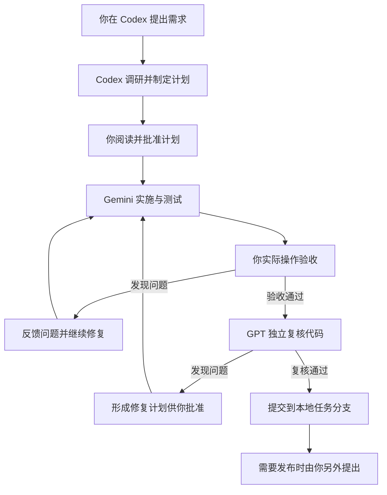

# DevFlow 使用指南

DevFlow 帮你把一个开发需求从计划推进到代码提交。你在 Codex 中提出需求，在这个工作台查看计划、掌握进度、反馈问题和验收结果。

## 从哪里开始

在 Codex 中打开你要修改的业务项目，新建任务，直接描述需求：

> 用 DevFlow 帮我修复客户列表筛选的问题：选择负责人后列表没有变化。

也可以提出新功能：

> 用 DevFlow 给订单列表增加导出功能，只导出当前筛选结果。

你不需要记住任何工具名称，也不用手动登记项目。第一次使用某个项目时，Codex 会先了解项目如何启动、测试和使用数据，遇到不能从项目中确定的问题再向你询问。

说明期望行为、遇到的问题、必须保持的功能即可。如果有相关截图或文档，可以一起提供。需要独立开发目录时说“这次用独立工作区”；希望直接修改当前目录时说“在当前目录继续”。安排会写进计划供你查看。

## 打开工作台

双击安装目录中的“打开 DevFlow”，或者在服务运行时访问 http://localhost:4810 。无需登录或配对。

再次打开会复用已有服务。关闭网页不会停止开发；想停止当前任务，请使用任务页面的“停止执行”。电脑重启后重新双击“打开 DevFlow”，从左侧找到原任务继续。

左侧按项目列出需求。点击需求可查看对应计划、任务、测试和执行过程；“工作流总览”显示全部需求；本指南始终位于左侧底部。

## 一个需求如何推进

Codex 负责理解需求、调研、制定计划和最终复核；Gemini 负责按批准计划实施和测试。Gemini 工作时不需要你一直保持 Codex 对话等待。你可以直接在工作台看它正在做什么，发现方向不对就停止或反馈。

## 阅读和批准开发计划

计划准备好后，Codex 会给你任务链接，也可以从左侧打开该需求。进入“开发计划”，先看目标、流程图和修改范围，再查看模块、细项任务及测试安排。

重点确认：

- 要实现的行为是否符合预期，是否遗漏必须保留的功能。
- 是否只修改这次需求需要的范围。
- 是否涉及数据变化、依赖调整或独立工作区。
- 如何测试，以及你最后需要实际操作检查什么。

内容需要调整时，在原 Codex 任务里说明。确认后点击“批准计划”。批准的是你当前看到的这份计划；计划改过以后需要重新查看并批准。

复杂需求会同时提供开发计划、开发进度和测试进度文档。普通需求可以集中在一份计划中。你不需要自己维护复选框。

## 如何看进度

顶部阶段导航显示需求正在调研、等待批准、开发、测试、等待验收、复核还是提交。

“当前工作”显示正在实施的细项和最近操作。“最近进展”展示任务完成、服务就绪、测试结束等变化。需要你处理的失败或验收操作会单独提示。

“已完成任务”按细项统计，模块只负责分组。例如“对象管理”下面可以包含字段保存、类型校验、编辑页面等多个细项；展开模块即可逐项查看。模型提交实现结果后，平台检查预先约定的完成条件与实际文件，满足条件后才计入完成。需要返工的项目会重新打开。

“已通过测试”按计划中的测试用例统计。同一项重复运行不会多算一次。你可以分别查看单元测试、集成测试、浏览器自动测试与真实浏览器验收。未运行、跳过、失败或需要复测的项目不会计入通过数。

旧计划如果只登记了大工作包，会明确显示工作包数量和“尚未建立细项清单”。补齐细项后会给你新的清单确认，不会把一个工作包直接算成几十个已完成任务。

## 看执行过程和代码变更

“执行过程”按时间展示模型回复、正在修改的内容、服务准备和测试结果。相同操作会更新状态；普通服务日志放在对应记录的详情中。打开详情可以排查问题，日常只看摘要即可。

“代码变更”默认列出本次修改的文件。点击文件可打开具体差异，新增和删除内容分别标记。页面显示实际分支与任务开始前的提交，比较的是这次任务造成的变化。冻结测试后显示对应测试版本的差异。

“代码复核”显示最终复核结论、发现的问题和相关文件。“测试环境”提供本次任务可访问的地址以及服务状态。

## 我发现问题了，怎么办

执行方向明显偏离时，点击“停止执行”。平台会终止当前任务的受管执行进程，已经写入的代码和过程记录保留。

点击“反馈问题”，描述你做了什么、实际结果和希望得到的结果：

> 在客户列表选择负责人张三后，仍能看到李四负责的客户。期望只保留张三负责的记录。

“原需求尚未做好”会在原计划范围内继续修复；“我想增加或改变需求”会回到重新规划。新增范围需要看过新计划后再批准。

你也可以回到原 Codex 对话说明需求变化。不要为了同一处问题反复新建需求，否则会产生相互独立的工作流。

## 如何验收

看到“等待你的验收”后，打开“测试环境”的地址，按计划中的验收场景实际操作。重点检查你关心的功能、异常输入和必须保留的原有功能。

发现问题就反馈，修复后重新验收。确认符合要求后点击验收通过，平台再启动独立代码复核。

测试通过不替代你的实际验收。独立复核还会检查遗漏、上下游影响、代码质量及安全问题。复核发现问题时，会形成修复计划供你阅读；通过后才提交本地代码。

## 失败、中断和恢复

发生错误时，先看任务页面的具体原因。模型登录失效需要先在对应官方应用完成登录；测试环境启动失败需要根据提示解决端口、配置或服务问题。

电脑或服务重启后，从左侧进入原任务，使用“继续这个任务”。平台会先核实旧进程已经退出，再恢复已批准的工作。之前的修改和计划保留，相关测试会重新检查。

不要通过重新接入项目、删除工作目录或清空数据库解决普通中断。遇到无法理解的问题，把页面的错误详情发给 Codex，并说“帮我处理这个 DevFlow 任务的恢复问题”。

## 同时推进多个需求

不同项目可以同时工作。同一项目的多个需求建议使用独立工作区，各自有分支和测试地址，避免相互覆盖。

工作台会管理临时端口和环境；某个共享测试资源被占用时，对应任务可能排队。请使用该任务“测试环境”中提供的地址，避免在另一个任务的页面上验收。

停止一个任务不会表示其他任务也需要停止。每个需求分别批准、查看进度和验收。

## 提交以后

看到“已提交”表示代码已提交到本地任务分支，不代表已经上线。需要推送、合并或发布时，在 Codex 中明确提出相应操作。

如果后续发现问题，可以在原任务中说明背景并发起修复；新的代码变化仍会经过计划、实施、测试、验收和复核。
