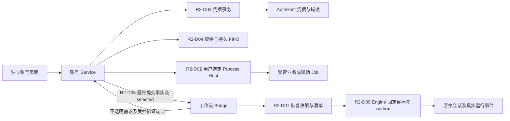
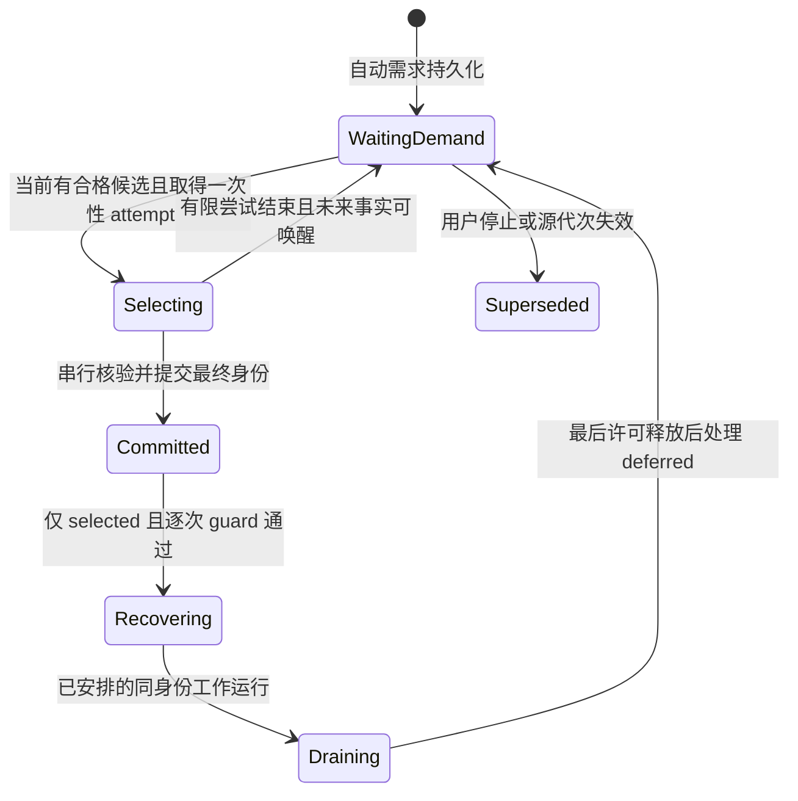
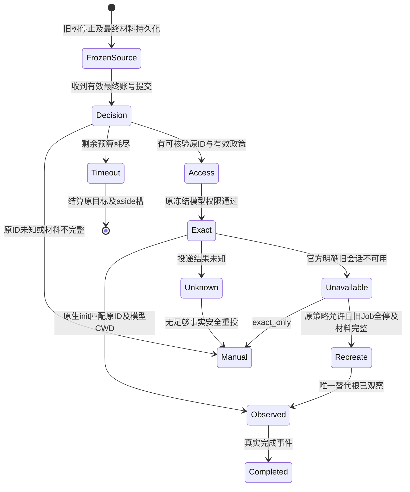
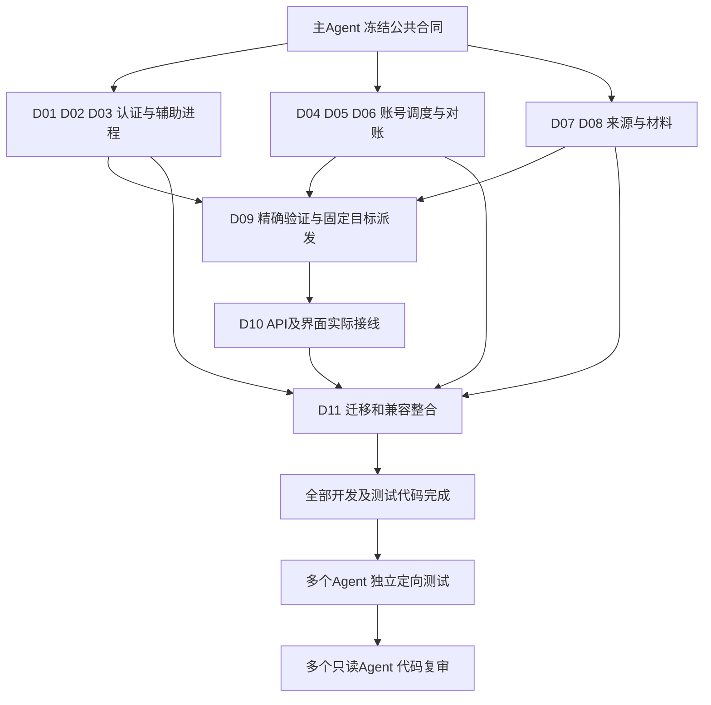

# AGY 账号第二轮复核与详细整改计划

> **后续用户范围更正（2026-09-21）：** 账号只使用全局五小时/周额度，不要求模型额度池映射；本地任务通过现有 CLI 会话续接，不要求云会话迁移或官方跨账号迁移接口。本文中冲突的多池、迁移门禁及独立恢复执行器设计不再作为本期要求。请以[最新轻量化范围修正与代码复核](./AGY账号轻量化范围修正与本轮代码复核-20260921.md)为准；以下原文保留作历史，不要求继续扩建这些设计。

日期：2026-09-21。版本：R2.0。代码复核结论：**changes_required**。

本轮已有修复生效，但还不能认为账号管理和工作流恢复已经完整可用。上一轮 CR10（手动失败不得自动重试）、CR16（报告统一评估时刻）已关闭；其他 27 项仍有实现缺口。另有几处新增回归：等待项释放操作占位后失去唤醒入口、正常停止域重启被标阻断、合法回滚被误判外部换号、恢复决策不允许启动时仍派发，以及 staged 文件恢复后工作树内容错误。本文给出下一轮的确定改法，保留已经修好的逻辑。

本轮主审和三个子 Agent 只读核查了当前源码及上下游，没有修改产品代码、重新运行产品测试、操作真实账号、提交或推送。执行者已完成测试的声明不作为本轮追查对象；以下结论来自当前代码的实际分支、持久化键和调用关系。未接入生产的新函数，其缺陷明确标为“接线前必须修正”，不声称已在用户环境发生。

## 1. 执行依据与不可削减范围

### 1.1 基线和正式文件

仓库及工作目录固定为 `C:\Code\system-handle`；分支 `main`，审查 HEAD 为 `004b2ea153a80f94007765e996d936db56d74c1c`。审查对象包括该 HEAD 上现有 38 个 tracked 文件的未提交修改（1995 行新增、203 行删除）、AGY 新增源码和必要的未改动调用方。新增源码包括 AuthHost 元数据及 Job 文件、capabilities、recovery-batch、recovery contracts、辅助 Job runner、workspace checkpoint。其他工作树的会话重构不视为当前目录已实现。

| 文件 | 版本 / SHA-256 | 本文关系 |
|---|---|---|
| [原开发计划](./DevFlow-AGY账号自动切换与额度管理开发计划-20260920.md) | v3.1 / `43C56F9A1BD4F18016E34CDAF2E91F6A7D37E37044B40A4551FAC9FA762EC87E` | 用户需求、独立模块和完整验收依据 |
| [功能补全与恢复修复计划](./DevFlow-AGY账号功能补全与恢复修复计划-20260921.md) | v1.0 / `B45B71C854FC805CB3350B212D10318EC17EA3CA92F7E56BF89201C41EF51355` | AGF 详细设计继续有效 |
| [上一轮 29 项复核意见](./AGY账号整改代码复核意见-20260921.md) | 2026-09-21 / `EDFF9196F66BE8DEB309DE5D2A604B3DD8ED6384FBB5F01263B7F2E427ACF777` | CR01–CR29 原问题事实及范围 |
| 本文 | R2.0 | 更新关闭状态，补齐确定调用链，修正本轮回归 |

完整保留原 `AC-R01–R19、AC-D00–D17、AC-U01–U20、AC-I01–I28、AC-E01–E23、AC-L01–L06、AC-H01–H08`，以及 `AGF-F01–F12、AGF-D00–D12、AGF-U01–U15、AGF-I01–I24、AGF-E01–E14`。本文的 `R2-D* / R2-U* / R2-I* / R2-E*` 是整改与定向验证增量，不能替换或删减上述编号。

执行模型直接按这些文档实施，禁止另建 `implementation_plan.md`、客户端实施计划或局部方案后按自己的版本开发。仅可维护“执行进度（非计划）”：原编号→实际文件/行为→测试情况→状态与未完成原因。发现技术事实冲突时提供原章节、当前代码和最小冲突位置，由规划角色正式修订；范围内普通修复不重复申请业务批准。

现有用户修改、配置、真实数据、凭据、其他计划和工作树全部保留。禁止通过 reset、清库、覆盖配置、改旧用例预期或全仓格式化消除问题。后续提交只能使用本任务白名单，不把所有未提交文件整体暂存。

### 1.2 本轮继续固定的行为

1. **独立模块**：无 DevFlow 工作流也能配置、启停、逐个官方登录、补测及页面手动切换。用户指定 B 失败则终结；“自动帮我选”仍是一次手动请求，不产生未来自动切号。工作流自动切换只来自受信任的额度/认证错误和原有自动切换授权。
2. **串行身份活动**：同一认证域最多一个身份联网，备用账号不批量探测或保活；页面查询和倒计时只是本地投影。所有旧业务树、辅助 CLI、callback 均确认停止后，才能改变活动凭据。正常业务允许同身份并发。
3. **真实能力**：没有经过审查的官方版本/字段/命令合同就保持 unverified 或 unsupported。AuthHost 可用不等于 CLI 登录、双额度、模型调用或跨账号会话恢复可用；fixture、版本输出、普通 SUCCESS 字段都不能授予业务能力。
4. **恢复不改变任务语义**：原冻结模型、effort、订阅来源、角色、审查阶段、逻辑轮次、任务分配、工作区权限与剩余执行预算保留。账号变化只允许受控身份 scope 变化，不能默认新建会话、换模型或重发副作用未知的原 prompt。
5. **现有宿主边界**：继续使用用户配置选中的 C# 或 Go Process Host。AuthHost 负责凭据/DPAPI/域锁，不承担模型进程运行。账号核心不 import Engine 或 ModelAccessService；full 通过端口装配工作流能力，accounts 保持独立。

## 2. 逐项复核结果与定位

以下行号以本轮未提交源码为准；后续编辑后以函数和分支定位。`partial` 表示已有有效修复，但整项不可关闭。`open` 表示主要链路仍缺失。所有外部合同缺失只阻塞其依赖能力，不掩盖内部实现问题。

| 原编号 / 优先级 | 状态 | 当前事实、剩余问题及主要位置 | 整改任务 |
|---|---|---|---|
| CR01 / P1 | partial | identity 新增部分校验；`apps/api/src/account-service-bootstrap.ts:51–56` 仍将任意文件摘要、硬编码 `1.2.7/login` 装配为已验证合同，生产 parser 仍无完整 pools | D01 |
| CR02 / P1 | open | bootstrap 创建 runner 未注入原生执行路径；`packages/process/src/agy-account-job-runner.ts:272–298` 默认 stopped，取消后不等 taskkill；`account-probe.ts:257` 仍直接 spawn。新增 AuthHost Job 也有缺陷，见 N01/N02 | D02 |
| CR03 / P1 | partial | 空输出/显式错误已拒绝；`packages/adapters/agy/src/account-probe.ts:236–243` 仍接受孤立 `status:SUCCESS` 和其他 CLI envelope，未核本次 init/model/CWD | D01、D09 |
| CR04 / P1 | partial | A/B 邮箱不一致已拒绝；`enrollment.ts` 及 `ports.ts:AccountProbeOptions` 仍无完整 operation、epoch、credential revision、来源绑定及结束复核 | D03 |
| CR05 / P2 | partial | `enrollment.ts:173` 已先保存 pending 账号；installed ref/目标引用仍到 `service.ts:1712` 才更新，quota 期间取消或崩溃不能按 journal 收尾 | D03、D05 |
| CR06 / P2 | partial | 错类型 refresh 保留未知，Node 不再默认 verified；`auth_metadata.go:104` 仍仅看字段存在认定格式，`enrollment.ts:163` 缺元数据仍补 refresh=false | D03 |
| CR07 / P2 | partial | `service.ts:1848` 有 capability_check 分支，但仅读 Host 布尔值；真实受控调查及脚本→操作→辅助 lease/Job 链仍缺 | D01、D02 |
| CR08 / P1 | partial | 新 availability 修了窗口缺失及 reset 到期资格；`switch-operation.ts:172–193` 仍全量求交，`recovery-batch.ts:198` 和 demand 仓储无生产调用，未实现 selected/deferred 排空 | D04 |
| CR09 / P1 | partial | 两个分支释放 pending；`service.ts:1426–1429、1473–1476` 释放后 tick 找不到等待；初始等待仍用旧 deadline，耗尽分支仍充值，见 N03 | D04 |
| CR10 / P1 | **closed** | `network_wait` 后续自动等待已限定 workflow trigger；手动失败不再进入该定时分支。保留这项修复，并覆盖完整手动链回归 | 保留；D04 回归 |
| CR11 / P1 | partial | cleanup 错误不再吞掉；`service.ts:1179–1193` 却对未取锁 stopped 域调用强制持锁 reconciler；`reconcile.ts:31–62` 仍缺真实归属/停止/活动 ref 校验 | D05 |
| CR12 / P1 | partial | 新增投递前锁/ref 校验；`service.ts:1498–1544` 仍只核一次且读取安装中间态，合法 restored=A 却比较 B；startup 仍缺完整 guard | D05 |
| CR13 / P1 | open | `service.ts:66–74、762–771`、`ports.ts:133–140`、Bridge occupancy 仍未贯通每个 source 的 night policy；严格夜间首次许可和混合消费者不正确 | D04、D06 |
| CR14 / P1 | partial | selector 新增 metadata gate；`maintenance.ts:40–100` 仍无真实刷新生产者，`last_refresh_verified_at` 无有效写入闭环，旧证明来源不能验证 | D06 |
| CR15 / P2 | partial | wait 新增白名单过滤；`wait-policy.ts:29–48` 仍缺 night/cooldown/Retry-After/capability，未统一完整资格 | D04 |
| CR16 / P2 | **closed** | 维护报告 selection、刷新年龄和展示使用同一个 evaluationTime。保留修复，新增准入逻辑仍必须用实际 now | 保留；D06 回归 |
| CR17 / P1 | partial | `service.ts:1925–1939` 仅检查 before.state=ready，并放入通用 rollback，覆盖原错误；没有逐目标恢复/接替需求，等待后仍可能继续投递 | D05、D06 |
| CR18 / P1 | open | Bridge 已调用 coordinator，但 `agy-workflow-bridge.ts:612–632` 不检查 decision，按源 Run 写 continuation；`core/conversation-lineage.ts:83` 按新 Run 读，exact 恢复未接通 | D07、D09 |
| CR19 / P1 | open | `agy-workflow-recovery.ts:143` 重写 revision=1；仍无固定 target Run、原子 intent/outbox、投递去重和 unknown 状态推进 | D07、D09 |
| CR20 / P1 | open | `agy-workflow-bridge.ts:494–496` 只改 Store.get 的 JSON 副本；coordinator 按 commit 时刻计费，`engine.ts:2282、2889` 恢复仍给完整时限 | D07、D09 |
| CR21 / P1 | partial | 普通模型权限错误误判已修、部分终态可释放槽；Bridge `:569` 取不存在的 run.aside_id/session_id，且新 aside 分支绕过控制检查，自身错误仍被 purpose 排除 | D07、D09 |
| CR22 / P1 | partial | Bridge 有快照调用，却从 Run 上不存在的 cwd/workspace_dir 取目录、硬编码 storage、只改副本；coordinator `:85–93` 用 0/1/空数组伪造 source，恢复忽略 success=false | D07、D08 |
| CR23 / P2 | partial | observer 新增内存代次/游标；Bridge `:90–94` 仍拒绝所有终态后的 spawn，丢弃合法新代次；持久游标不参与权威排序 | D08 |
| CR24 / P2 | partial | NUL 输出、非 Git、index/worktree 分层已有实现；`agy-workspace-checkpoint.ts:205–208` 又 trim 路径、按 cwd 还原 repo 相对路径，正式目录直接覆盖、缺稳定性和 diff 摘要 | D08 |
| CR25 / P1 | partial | 新增部分 hash/词法检查；同文件 `:348–355` 先写 untracked，staged 仅 apply --cached，工作树不更新；缺 base/批准范围和 reparse 校验，见 N08 | D08 |
| CR26 / P1 | partial | 候选 B 的缓存 scope 计算已调整；新 `core/model-access-service.ts:678` 无生产调用，默认用 --version 授权模型且 lease 查询错误，见 N07。Bridge 仍未接 owned 验证 | D09 |
| CR27 / P2 | partial | full-only 注册和新记录按 workflow 查询已修；`agy-recovery-checkpoint.ts:135` 旧数据回退猜错 manifest 键，非空部分索引会遮蔽剩余记录，两份进度非原子 | D10、D11 |
| CR28 / P1 | partial | 接口新增可选 CAS/请求字段；`agy-workflow-recovery.ts:199` 忽略 requestId、删 workflow 单键、停源 Run，调用不存在的 engine.stopRun，API 未传备用 stopper，却返回成功 | D09、D10 |
| CR29 / P2 | partial | 账号页面新增 Host/授权信息，维护报告字段改善；`agy-account-routes.ts:340` 每次 GET 启动 Host且 quota=true，工作流页面没有 recovery 列表/预算/FIFO 接线 | D10 |

### 2.1 新增或本轮明确暴露的反例

这些编号不新增业务范围，均归属于原 CR；执行回执需同时保留两类编号。

| 编号 | 触发 → 当前结果 | 修正后必须满足 |
|---|---|---|
| N01 / CR02 | 给 runner 接入新 AuthHost 对象→`auth-host.ts:288–300` 四个 Job RPC 不传 realm_id→`main.go:175` 一律拒绝；runner 吞 create/assign 错继续启动 | 删除这条错误宿主路线，使用选定 Process Host；原生创建/归属建立失败时禁止 CLI 启动 |
| N02 / CR02 | `job_windows.go:161–181` 先删句柄，再 terminate/query；未知 Job 或 QueryInformation 失败也 true；先 spawn 后 assign 还有逃逸窗口 | 停止未知不得升级成功；由原生 Host 原子 suspended→assign→resume，持久归属可对账 |
| N03 / CR09 | 自动等待保存后清 pending_operation_id；tick 只查 pending→永远无人唤醒 | demand 独立持久，tick 消费到期一次性事实并创建新的有限 attempt |
| N04 / CR11 | desired=false 的干净 stopped 域重启→不取锁却调用强制持锁 reconcile→blocked | 干净 stopped 保持 stopped；残留工作通过 cleanup_only 取锁，不启用业务 |
| N05 / CR12 | B 探测完成或失败后合法恢复 A→guard 用 installed B ref→external_change；事件还取 B epoch | switched/restored 各自持久化最终 account/ref/epoch，事件只来自最终事实 |
| N06 / CR18 | 无可核验原会话 ID 或 remaining=0→coordinator 返回 manual_required→Bridge 只看 continuation 仍 resume | decision 是启动门禁；manual、preserved、superseded 不得创建可执行派发 |
| N07 / CR26 | 尚未接线 helper 默认执行 CLI --version，exit0 就写任意 frozen 模型 verified；用 lease_id 查 operation，查不到仍放行 | 无真实候选验证器则受阻；真实 lease/operation/ref 全程校验，必须调用冻结模型并核本次官方结果 |
| N08 / CR25 | base 文件 A，源仅 staged=B→restore --cached 后 index=B、工作树=A，却 success；另有 B→C unstaged 时 apply 失败且已有写入 | 在获准干净隔离目录 staged 同时恢复 index/worktree，再恢复 unstaged；全部验证后发布，不部分覆盖原目录 |
| N09 / CR28 | 取消一个恢复项→清整个 workflow retry/wait；实际目标没有停止，仍返回 cancelled=true | 仅撤销该 recovery 的目标/投递/等待；真实停止未确认不宣称已取消 |

## 3. 唯一目标结构与持久合同

账号核心只知道 consumer、demand、账号资格、资源和最终提交事实。workflow/aside/逻辑轮次/会话决策留在 Bridge、coordinator 和 Engine。不得把整个恢复对象塞进账号核心以绕开边界。

### 3.1 本轮需要定稿的内部数据

在现有 `contracts/agy-account.ts、contracts/agy-recovery.ts、agy-accounts/ports.ts` 上扩展，沿用现有 Store 实体存储，不引入第二套数据库。下表是行为合同，内部字段命名可适配现有风格，但内容和约束不能删。

| 合同 | 必须保存 / 校验的事实 | 权威写入方 |
|---|---|---|
| CapabilitySnapshot / adapter entry | CLI 真实版本与摘要、adapter revision、各能力的 verified/unverified/unsupported、已审查命令/解析器、Host 协议版本、来源与理由；无秘密原文 | D01 注册表及受控调查；API 只投影 |
| AuxiliaryLease / owned Job | lease ID、operation ID、realm、controller/storage lineage、候选账号或登录阶段、reserved epoch、credential ref/revision、用途、允许命令摘要、Job ID、阶段/撤销/停止确认 | D02 资源协调器；Host 证实进程事实 |
| BoundObservation | operation/lease、实际 account/subject、credential revision、epoch、调用 ID、CLI/adapter fingerprint、观察时间、解析完整性；与请求关联，不仅信输出声明 | D01/D03，发布前后检查持久归属 |
| RecoveryDemand | 稳定 consumer/source/logical-generation key、first_wait_at、fairness_key、opaque source ref、完整 pool/model/allowlist/night 配置/policy、source/control revision、授权来源、状态/等待原因 | Bridge 提供业务事实，D04 持久调度 |
| SelectionRound / Attempt | round ID、budget/consumed/remaining、attempted accounts、可信 reset/wake key、已消费事实；attempt 有单次 deadline，demand 可长期存在 | D04；事务更新，等待不充值 |
| RecoveryBatch | batch ID/revision、anchor、选中账号、selected/deferred demand IDs、候选资格版本、draining/active/completed；不复制业务状态 | D04 |
| FinalAccountCommit | operation ID、outcome=switched/restored、最终 account/ref/revision/epoch、control generation、旧 Job 集合和提交时间、selected batch 引用 | D05 安装或回滚回读成功后一次写入 |
| SourceCheckpoint | 实际源 Run/role/model/round/aside/原生 ID/工作区/最后子事件/控制与策略版本，以及停止后冻结的执行预算；不可用字段明确 incomplete | D07/D08；停止后的唯一不可变源 |
| RecoveryManifest / Intent / Progress | manifest 不可变；intent 唯一 recovery+target generation，固定 target_run_id/delivery_id、决策、来源与目标绑定；progress CAS 递增，记录实际投递和原生观察 | coordinator 决策，Engine 事务安排与运行回写 |
| RefreshEvidence | 同身份同代次自然到期前后、非交互业务/辅助请求、有效许可、已验证协议、expiry 前进、最新完整凭据 capture 完成、证据版本 | D06 观察器；时间字段是该事实的投影 |

### 3.2 两个不能混合的状态机

这是自动需求状态；手动请求失败安全收尾后直接终结，不进入 WaitingDemand。等待不占据一个数小时的切号 operation，也不拥有旧身份的联网许可。

安排恢复不等于原生已恢复；网络失败、普通 403、无权限或 ID 未观察到都不是“旧会话已不存在”。

## 4. 文件级整改任务

任务中的路径均相对 `C:\Code\system-handle`。允许新增下文点名的内部模块；已有同职能模块优先局部扩展。每项开发包含对应测试代码；运行测试按第 7 节统一阶段执行。

### R2-D01：真实能力注册、精确解析与受控诊断

关联 CR01/03/07；承接 AGF-D00/D01；认证 Agent 负责。与 D02、D04、D07 的独立部分并行；实际 CLI 调查依赖 D02 屏障。

**文件及入口**：`apps/api/src/account-service-bootstrap.ts`（公共装配由主 Agent 合入）、`packages/adapters/agy/src/account-capabilities.ts、account-probe.ts、quota-parser.ts`、`scripts/probe-agy-account-capabilities.ts`；新增同目录 `account-capability-registry.ts`。`service.ts:capability_check` 由账号核心负责人接线。

1. 删除生产 `createVerifiedUsageAdapter(fingerprint, "1.2.7")` 和直接授予 `login` 的装配方式。计算摘要只负责识别本机二进制；使用真实版本+摘要+adapter revision 匹配经审查条目。registry 可为空；未知版本返回每项受阻原因。fixture parser 只存在测试装配，不能通过改名成为生产合同。
2. 一条 adapter 合同确定官方 identity、usage、login、最小模型调用及成功/错误事件解析。保留身份独立读取；usage 必须完整包含真实五小时/周窗口、重置和模型池映射，单位及 remaining/used 方向明确。缺一个必需字段就不让账号进入候选，不补 100%、0 或推算重置。
3. 模型成功判据固定为“本次调用匹配的初始化 + 明确成功终态 + 正常退出 + 无冲突/错误”。校验实际账号、冻结模型、CWD、调用关联及协议来源；孤立 SUCCESS、其他 CLI 格式、上轮缓存输出、只有 --version、成功后错误均拒绝。解析器不能自行写权限缓存，交 D09 在归属复验后发布。
4. `capability_check` 分为纯信息快照和明确授权的真实调查。纯信息可发现二进制/Host 协议，不动凭据、不联网。真实调查创建持久 operation/auxiliary lease，经 D02 停止屏障运行固定用途命令；调查只豁免“所调查能力已 verified”的循环前置条件，其余锁、取消、身份、旧 Job 和白名单均保留。
5. 调查脚本调用内部 service 的该操作，不再自行 execFile 调账号接口；不接受任意 shell 文本。未经确认的参数先从官方公开帮助/合同取得；无法取得则记录 blocked_external。敏感原始输出留在批准的隔离取证位置，文档/页面只写字段语义和脱敏事实。
6. CLI 升级或摘要不匹配使相关命令/参数/解析能力及依赖该协议的临时 probe 结论失效，保留同身份既有模型授权事实；未知版本先阻止执行，模型权限是否需要重验沿用原缓存规则，不能把协议升级当账号授权被撤销。GET capabilities 不执行调查。只有真实合同完成才登记 verified，不能由“调查命令 exit0”自动登记。

**输出/验收**：生产启动只能装配已知合同；unknown 可安全展示但不能清活动凭据进入猜测登录。R2-U01/U02、I01、E01。官方双额度确实不提供时，受阻范围为对应录入/调度/实机验收，独立内部任务继续完成。

### R2-D02：在用户选定 Process Host 中管理所有辅助进程

关联 CR02/07、N01/N02；承接 AGF-D02。认证 Agent 负责。不得把“给当前 runner 注入 AuthHost 并补 realm 参数”当最终修法。

**文件**：`packages/process/src/agy-account-job-runner.ts、agy-account-processes.ts、manager.ts`，`host/devflow-host/main.go、process_windows.go、process_posix.go`，`host/DevFlow.WinHost/Program.cs`，`packages/agy-accounts/src/login.ts、ports.ts、auth-host.ts`，`host/devflow-auth-host/main.go、job_windows.go、job_unsupported.go`；现有安装脚本只按 D11 增量兼容。两个 Host 共用同一受版本约束的协议。

1. 在现有 Process Host `run/doctor/job-status` 上扩展辅助模式：用途 login/identity/usage/model_probe/capability_check，固定 Job ID 与持久 lease 上下文，交互登录模式及结构化完成事件。复用配置指向的 hostExecutable，不能另选隐藏 Go Host。
2. 由原生 Host 一次执行 suspended create→设置命名 Job/kill-on-close→assign→resume；任一步失败终止尚未运行的子进程并返回失败。移除 TS spawn 后 assign 的追认模式、cmd/start 包装及无 Host 默认 fullyStopped=true。辅助探测也经该 runner，不直接 spawn AGY。
3. 交互登录由原生 Host 创建独立可见控制台，CLI stdin 接该交互控制台，Host 控制 IPC 与登录终端分离，完成事件通过专用受管管道关联；不能仅设 windowsHide=false 后仍继承空/关闭 stdin。按官方登录完成合同与浏览器/callback关联，不把窗口关闭当成功。只对用户发起的登录显示窗口，业务 probe 与后台 helper 保持隐藏。浏览器本身是用户程序，不作为可随意杀死的对象；本操作拥有的 CLI/callback 后代必须可确认归属和停止。
4. 启动前事务保存 lease 与 Job 归属；输入必须包含 realm、operation、lease、用途和命令摘要，与持久值逐项匹配。实际授权依据是服务持有的锁、有效 lease 和 IPC 所有权，不是调用者传入几个字符串。取消/管道 EOF/超时先撤销 lease，再请求停止整 Job，等待真实停止确认后释放身份屏障。
5. 查询错误、权限拒绝、未知归属、停止超时均返回未确认，保留日志与屏障。不得先删除句柄/归属再查询。命名 Job 不存在只有在持久 owned lineage、原生 kill-on-close 生命周期和进程盘点共同证实旧树消失时才可收尾；单个未知 ID 不足以证明停止。PID 需带创建时刻，防复用误判。
6. 从 AuthHost API 和 Go action 分派移除本轮新增的 Job 管理实现及字段；其凭据/锁/元数据职责保持。若删除未跟踪 Job 文件，仅删明确本次新增的两个文件，保留现有 vault/lock/credential 修复。停止确认算法由 Process Host 实现，不复制其中“query 出错视作零进程”的错误分支。
7. 同一域业务 permit 和辅助 lease 共享切换屏障；辅助操作占用时禁止另一身份请求。ProcessManager 最终准入仍必须验证令牌，不能仅在高层页面防并发。完整停止结果供登录/录入/切换/维护/模型验证/诊断共同使用。

**输出/验收**：C# 和 Go 两种配置下真实后代未停都无法换号；独立服务重启能按持久归属清理。R2-U03、I02/I03、E02。不能以当前会话临时目录隔离 Windows Credential Manager，实机认证仍按 AC-L 独占授权窗口进行。

### R2-D03：录入与认证元数据的事务边界

关联 CR04/05/06；承接 AGF-D03/D04。认证 Agent 负责 enrollment/login/helper，账号核心负责人拥有 service/repository 公共改动；依赖 D01/D02 合同。

**文件**：`packages/agy-accounts/src/enrollment.ts、login.ts、auth-host.ts、ports.ts、repository.ts、service.ts`，`host/devflow-auth-host/auth_metadata.go、main.go、vault_windows.go`（capture 幂等索引与原包原子保存），`contracts/agy-account.ts`。

1. 登录后 identity 校验成功再 capture 完整凭据原包。调用 helper 前先持久保存 capture intent/幂等请求 ID，绑定 realm、operation、用途和预期凭据代次；AuthHost 在其原子保存的受保护 vault 元数据中记录请求摘要→ref/revision，同请求同内容重试返回同一结果、不同内容拒绝，不再次生成随机孤儿包。即使 helper 成功但 RPC 响应丢失或 Node 尚未提交数据库就崩溃，reconcile 也能按原请求找回结果。capture 成功后，通过 service 提供的同步事务回调同时保存 pending 账号、secret ref/revision、operation installed ref、target account/epoch 和阶段；事务成功后才 await usage。不能 enrollment 单独先 put 账号，service 数秒后才补 journal。取消可终止后续 quota，但不能先丢弃未对账 capture intent；需要清理时仍按 D05 的归属和停止条件处理。
2. 每个 identity/usage 观察绑定实际 operation+lease+account+epoch+credential revision+调用 ID+协议来源。await 前后都重新校验持久上下文、取消和活动项；邮箱比较保留，但以已验证稳定身份与操作来源共同防串号。错身份冻结操作并保留诊断，不污染预期账号快照。
3. quota 成功且双窗口完整时更新快照：零额度属于录入完成/等待；未知或错误属于 pending_quota，不进自动候选。quota 取消/崩溃保留已 capture 的账号，按 journal 安全恢复原活动身份；再次补测复用授权，不无意义重登。
4. 原包加密保存不依赖能否理解其内部格式。metadata 只有匹配已验证编码/版本/字段类型和语义时才 verified；`access_token:null`、空 refresh、无版本任意 JSON 不能证明支持刷新。未知安全字段一律 null/unrecognized，Node 不补 refresh=false。
5. 把 credential revision 和 metadata source/version 存在账号记录中；重新 capture 不沿用不相容旧 metadata/refresh proof。到期时间不等于授权必将失效，未知也不等于已过期；两者在 DTO 中分开。

**输出/验收**：身份核实及 capture 后任何取消/崩溃点都可恢复 journal，且 pending 授权不丢。R2-U04/U05、I04/I05、E03/E04；重复账号更新、误登录、重认证与删除回归保留。

### R2-D04：持久 FIFO、统一资格和可唤醒长等待

关联 CR08/09/13/15、N03；保留 CR10 修复。承接 AGF-D05/D06。账号核心 Agent 负责；Bridge 数据源由恢复负责人接线。

**文件**：`packages/agy-accounts/src/recovery-batch.ts、selector.ts、wait-policy.ts、repository.ts、service.ts、switch-operation.ts、ports.ts`，`contracts/agy-account.ts`；Bridge 的 occupancy/demand 入口由 D07 负责人单人维护。

1. 统一 `evaluateAccountForDemand(account, frozenPolicy, evaluationTime)`，selector、batch、wait、permit、maintenance report 全部调用它。输入必须含 pool/model keys、allowlist、auth/capability、cooldown、Retry-After、night policy 和策略版本。输出分开：当前可获得许可、允许选中后串行复测、所有排除原因、最早可信唤醒时间。未知额度不能直接取得许可；实测零且 reset 已到只可进入核验候选。
2. Bridge 为每个 source/logical generation 建稳定 opaque demand，重试保持 first_wait_at；新切号 operation 不改变排队年龄。主任务和 aside 分别建项，携带各自冻结约束。账号核心不解释 workflow/Run 的具体结构，通过 consumer 端口检查 source 是否有效。
3. 对当前本地可选需求构建候选集合。若共同候选存在，按所有选中需求涉及池的**最小周余额降序**、上次使用时间升序、账号 ID 稳定排序；否则按 first_wait_at→fairness_key→demand ID 选最早就绪 anchor，再取该账号可满足的其他 demand 为 selected，其余 deferred。required_model_keys 必须参与评估，strict 必须检查有效 proof 来源。选中后只激活这一个账号串行核验，不并行探测候选池。
4. 实际候选核验失败/额度为零时保存本次真实观察，重新规划并排除该轮已试账号。FIFO 分批只适用于工作流自动需求：持久 batch 保存 selected/deferred，自动 switch 不再对全部占用约束求交，最终只投递 selected。手动指定 B 必须满足本次必须保全/恢复的全部受管约束；不满足则 target_unavailable，不能改选或改成只恢复兼容子集。手动“自动帮选”也按本次全部必要约束选一个账号，失败终结；不创建后续 FIFO 自动执行意图。
5. active batch 不抢占已经运行的同身份工作。只有存在**当前有可执行候选**的 deferred 才进入 draining，阻止后来业务继续占住该批；最后 permit 释放、批次成员取消或变无效时触发重新规划。单纯未来重置/未知授权的 deferred 不得永远封锁新业务。工作流原有资源锁/容量规则保留。
6. 统一 `enterDomainWait`：先完成本次身份事务安全收尾，再在同步事务中保存 demand/round/remaining/tried/wake facts、终结有限 attempt并清 pending。初始无候选、网络退避、激活后实测耗尽都走此入口。若旧 Job/凭据仍未确认安全，保持 blocked operation，不提前释放屏障。
7. tick 扫描有效 demand 的 due wake，而非只读 realm.pending_operation_id；启动恢复、账号补测成功、手动启用、最后 permit 释放同样发出本地重新评估事件。消费 wake key、更新 round 和创建去重 attempt 在一事务中完成；再次核查 source/control/自动授权后才运行。
8. 长等待没有 300 秒切号 deadline；每次 attempt 使用 round 剩余有限预算。普通网络重试消耗同轮预算，不能清空已试集合补满；同一个 reset fact 只消费一次。可信的新重置周期允许新有限轮次，来源可为先前实测保存的 reset 已到或新的官方观察，不能用 Date.now 改写一份相同事实制造新周期。无可信时间显示待介入，不短周期空转。
9. 对单账号，所有时间性阻塞取 max；仅无未知/永久阻塞且有可信时间的账号参与跨账号 min。手动失败保留终态，不建自动 demand/wake；原有工作流需求独立存在，不能借它让同一个手动 request 未来继续执行。

**输出/验收**：互斥 B/D 白名单能依次运行；等待数小时不受旧 deadline 影响，不丢唤醒、不无限充值。R2-U06/U07/U08、I06/I07/I08、E05/E06。所有资格只读本地，候选才串行核验。

### R2-D05：cleanup-only 与最终提交事实

关联 CR11/12/17、N04/N05；承接 AGF-D06。账号核心 Agent 负责。依赖 D02 真实 Job 确认；可先完成持久状态和 guard 的纯逻辑。

**文件**：`packages/agy-accounts/src/service.ts:reconcileStartup/rollbackOperation/deliverConsumers`、`reconcile.ts、repository.ts、ports.ts、switch-operation.ts`，`packages/process/src/agy-account-processes.ts`，Bridge 接收最终事件处。

1. startup 先本地分类：desired=false 且无 pending/journal/lease/未确认 owned Job 的域维持 stopped；有残留工作则进入专用 cleanup 生命周期获取域锁。不能调用普通 start 改 desired=true；也不能未持锁调用强制持锁 reconciler 后把正常 stopped 标 blocked。
2. cleanup 通过 controller/storage lineage、operation、持久 Job/lease 和实际活动凭据 ref 确认归属。只允许处置本操作 before/installed/target 的可核验现场；先确认旧树停止、无无法归属的同域活动，再恢复 backup。遇外部换号/归属未知/失锁停止清理并保留 journal，绝不无条件写 backup。
3. 恢复 backup 后回读确认；同步保存最终 active account/ref/credential revision 和新 epoch、操作收尾状态，再释放资源。失败保留 blocked 和恢复材料；不能清 pending 伪造已取消。desired=false 时不投递任何业务恢复。
4. switched 和 restored 分支各自在真实回读成功后写不可变 `FinalAccountCommit`。后续投递及重启只使用该事实，不优先取 op.target/install 中间字段。恢复 A 的事件必须是 A/refA/恢复后 epoch，不能仍带 B。记录缺失时只能对账恢复确定事实，不能取当前任意 realm 拼接一个新 commit。
5. 每个消费者每次异步投递前后分别执行 commit guard：desired/service state/control generation/取消、域锁、operation及最终事实、当前 realm account/ref/epoch、真实活动项、原操作旧 Job 已停、selected demand 有效。前一 consumer await 期间停止或外部换号，后一 consumer 不得继续。消费者内最终 Run/permit 准入再检查代次，封住异步检查与实际启动间的竞态。
6. 已恢复的新业务 Job 与原操作旧 Job 分开标记；guard 只要求旧树已停止，不能要求所有新业务也归零而阻断同一 selected 批后续目标。重复 delivery 使用相同 commit/recovery IDs，消费者 CAS 去重；不再换一次账号。
7. `rollbackOperation` 只负责凭据和事务收尾，不修改原业务错误、判断 before 账号是否合格或决定恢复范围。返回结构化 `restored/blocked` 与最终事实；调用者明确区分“凭据已安全恢复”和“业务目标可恢复”。维护后的资格由 D06 处理，waiting 分支必须立即结束本次投递。

**输出/验收**：干净 stopped 重启不误阻断；停止中崩溃安全清理；A→B→A 维护不报外部改动；投递重试尊重当前控制。R2-U09/U10、I09/I10/I11、E07。

### R2-D06：真实刷新证据、夜间准入与维护收尾

关联 CR13/14/17；保留 CR16。承接 AGF-D04/D05/D10。账号核心 Agent 负责，与认证 Agent 约定 observation/capture 回调；依赖 D03/D04/D05。

**文件**：`packages/agy-accounts/src/maintenance.ts、selector.ts、service.ts、ports.ts`，Bridge occupancy/permit 及 `contracts/agy-account.ts`。

1. 逐 source 冻结夜间配置（timezone/start/end/strict/证据年龄）和策略版本，通过 usage request→permit、occupancy→demand→batch→恢复全部传递，不冻结源 Run 当天计算出的绝对起止时刻。每次评估用同一时间工具按当前评估日重新计算夜间边界，兼容等待数日、跨午夜和时区规则。混合 normal/strict 不能以触发者策略代表其他消费者；首次运行也须走同一准入。报告使用已修统一 evaluationTime=max(now,下次夜间起点)，实际许可永远按 now；夜间结束按配置计算，不是 now+24h。
2. 在真实业务 permit 或持久 auxiliary lease 下观察官方非交互请求。只有旧 access expiry 自然到达、同 account/epoch/credential lineage、旧新 metadata 版本可验证、请求成功且无交互、expiry 前进、最新完整凭据 capture 成功时写 `RefreshEvidence`，再投影 last_refresh_verified_at。普通“成功请求”或人工重新登录不产生自动刷新证明。
3. 观察结束重新核验许可和活动项；capture 失败/身份变更/未知格式都不发布成功。业务运行中的更新仅捕获同一活动身份，不触发换号；辅助续期仍串行。没有可信元数据合同则保持 proof unknown，不把旧无来源时间戳与新 metadata 合并成 strict 合格。
4. 白天维护按本地报告展示已过期 access、可自动刷新证据、授权需要人工、未知长期有效期；用户选择串行检查才激活账号。页面刷新和后台定时不得轮询所有备用账号。无法预知的上游撤销如实显示未知，不能承诺夜间永不到期。
5. 维护结束先使用 D05 最终 restored 事实，然后对每个待恢复 demand 用 D04 完整资格检查。原账号合格者可恢复；不合格且已有自动接替授权者留在持久队列触发串行选号；其余明确等待。保留原网络/耗尽原因，不由通用 rollback 覆盖为 before_account_not_eligible，也不返回 void 后继续恢复全部消费者。

**输出/验收**：刷新时间存在真实生产写入链，strict 资格可解释；维护回滚与业务恢复分开。R2-U11、I12/I13、E08，保留 CR16 的单时刻计算回归。

### R2-D07：冻结真实源、逐目标决策和剩余预算

关联 CR18/19/20/21/22、N06；承接 AGF-D07。恢复 Agent 负责 runtime 相关模块，主 Agent 负责 contracts/core 共享文件；依赖 D04 demand 和 D05 最终提交合同，材料由 D08 提供。

**文件**：`packages/runtime/src/agy-workflow-bridge.ts、agy-workflow-recovery.ts、agy-recovery-checkpoint.ts、profile-runtime.ts、runtime.ts`，`packages/contracts/src/agy-recovery.ts、feedback.ts、index.ts`，`packages/asides/src/service.ts`；Engine 接线统一交 D09。

1. 在真实 Run 启动绑定中持久保存实际 CWD、Workspace 引用、完整冻结 invocation、source identity/epoch、原生会话关系和控制/计划/策略版本。数据取自 `profile-runtime.ts` 实际 invocation 和 Store workspace 记录，不读 Run 上当前不存在的 cwd/workspace_dir。aside 以真实 `aside_session.run_id` 找到原问题，在新 Run 创建时显式保存其关联，迁移期反查必须唯一。
2. prepareSwitch 只保存保全准备记录；停止确认后吸收最后原生事件、最终子状态与 D08 最终快照，再事务冻结 SourceCheckpoint。Store.get 是 JSON 副本，任何修改都必须显式 put/事务保存；禁止只赋值 `chk.frozen_consumed_ms/workspace_checkpoint_ref`。不可变 checkpoint 的重复创建必须比较同内容摘要，冲突拒绝，不能 catch 后继续覆盖。
3. source 的 logical round、assignment、repair batch、review phase、child IDs 和各版本均来自实际历史事实，禁止默认 0/1/[]。缺字段先尝试现有权威记录关联；不能唯一还原则标 incomplete/manual_required。不能从 workflow 当前 conversation 随便补给另一角色或 aside。现有主目录的 conversation-lineage 与 agy_subagent 是应核实的来源，不假定其他工作树已有接口。
4. 预算按实际执行片段的单调时钟计量，业务总 budget 来自原 Run 已批准 timeout。停止时持久 `execution_budget_ms/consumed_ms/remaining_ms/frozen_at`；后续等待账号/排队/人工认证不扣，重复回调不充值。崩溃缺精确片段时用可证实的耗时上界保守计算，无法确定则 manual_required。remaining<=0 为超时终结，不创建可执行目标。
5. 最终 commit 后仅对 selected source 建不可变 manifest（operation:source:logical-work）；目标账号不提前混入 source。coordinator 先决定 preserve/superseded/manual/wait/exact/recreate，再由明确可执行决策进入 D09。Bridge 删除“只要有 continuation 就旧 retry/resumeApproved”的支路，禁止一边 coordinator 决策、一边旧派发独立进行。
6. aside 自身的可信账号错误也能产生 source demand；普通 MODEL_ACCESS_REQUIRED 继续走原访问权限处理，不再误判账号等待。waiting_account 保留原问题、原只读会话和全局 aside 槽；取消、预算终结或确定不可恢复时结算并释放，其他可恢复等待不晋升下一问题。恢复前与主目标一样校验 control/plan/policy/问题状态，不把 aside 放在 CAS 前特殊放行。
7. wait、pending model retry 的账号恢复信息按 source/recovery 存，不以 workflow 单键覆盖多个目标。旧 workflow retry 的兼容投影只能指向已核实的那个 source；恢复/取消不能删除其他主任务或 aside 的记录。完整 checkpoint/progress owner 由 D10 的单一索引规则承接。
8. 子目标已 completed/cancelled 保留结果，不重复执行；未知观察完整性保留 manual/waiting dependency。父根收到确定材料清单后依靠官方原生能力接替，平台不伪造逐子会话命令。根启动成功不能把整棵树全部标 completed。

**输出/验收**：恢复决策实际控制启动，来源无伪造默认，aside 不丢问题，等待不改变执行预算。R2-U12/U13、I14/I15、E09/E10。是否可跨账号 exact resume 由已验证外部合同决定，不能用本地键值测试替代。

### R2-D08：权威事件顺序与可验证工作区恢复

关联 CR22/23/24/25、N08；承接 AGF-D08。恢复 Agent 负责，Bridge 由同一负责人协调。可与 D04/D05 并行开发。

**文件**：`packages/adapters/agy/src/subagent-observer.ts`，`packages/runtime/src/agy-workflow-bridge.ts:observeNativeEvent/confirmStopped`、`agy-recovery-checkpoint.ts、agy-workspace-checkpoint.ts、profile-runtime.ts`；仅对已证实字段修改现有 `native-record-source.ts`。

1. 事件排序在持久 `agy_subagent` 权威写入处完成：比较 source epoch、generation、协议定义的 cursor，重复忽略、旧代次拒绝、同代次终态不被迟到 spawn 降级；合法新代次 spawn 能初始化新状态。observer 内存缓存仅优化，不决定最终事实；重启加载持久游标。cursor 不保证数值/字典序时按 adapter 合同解释，不猜排序。未知事件保留 observation_incomplete，不能默认 complete。
2. 从实际受管 process spec/Workspace 保存工作区归属、repoRoot、worktreeRoot、base、批准路径、读写权限和 logical target；每个目标单独记录。增量快照按原 AGF 最长每 5 秒合并本地变化，旧 Job 停止后最终快照；通过 `config.storage_root` 写 `<storage_root>/agy-recovery/<safe-workflow-key>/<sha256(source-checkpoint-id)>/`，原含冒号 ID 不进入文件名。
3. Git 路径以 `git rev-parse --show-toplevel` 得到的 repoRoot 解析；使用 NUL 输出完整保留路径，不 trim、不按行拆、不把子目录 cwd 当 repoRoot。采用 `git diff --cached --binary --full-index <base>` 保存 base→index，`git diff --binary --full-index` 保存 index→worktree；路径过滤覆盖 tracked/untracked，保留 binary/delete/rename 事实。已批准范围外及秘密配置不复制到 diff；所需变更被排除时记录不完整原因，不声称全量保全。
4. 非 Git 也使用同一允许范围、摘要和大小限制。拒绝/记录符号链接及 reparse point，不跟随越界；每文件默认 64 MiB、每目标 512 MiB，包含 diff 与内容总和。无法读取、超限、来源身份变化或采集时持续修改均记 incomplete，不截断后 success。
5. 先在同一 storage 卷的新临时目录采集；记录采集前后 HEAD/index 身份、路径集合和有关文件摘要，检查两层 diff 来自同一个稳定源状态。对每个 diff/内容/manifest 写大小和 SHA-256，再校验全部引用，最后原子 rename 发布到尚不存在的最终目录。已存在同 ID 同摘要复用；不同摘要报冲突。增量用不同版本目录及原子指针，不能覆盖已经冻结的 source 材料。
6. 原工作区仍在且与冻结事实一致时直接续用，不 apply；有用户新修改时不 reset/覆盖。确需重建材料时，仅在该任务已经批准的干净隔离目标中恢复，先验证 base、所有摘要/长度、允许路径、磁盘目标归属和冲突。沿实际父目录逐级检查链接/reparse，不能只做字符串 `startsWith/..` 检查；不安全目标直接拒绝，禁止借 junction 写出授权目录。
7. 确定恢复顺序：在干净 base 上 `git apply --index` 应用 index.diff，使 index 和工作树同时达到源 index；再 `git apply` 应用 worktree.diff；最后恢复允许的 untracked 内容和删除事实。先在私有隔离构建目录完成全部层次并比对预期最终 index/tree/文件摘要，再发布可用目标；任何失败不得修改用户原工作区或返回 success。禁止当前“先写 untracked，再 --cached，再失败留下半成品”的顺序。
8. 调用者必须检查 `{success, complete, conflicts, workspaceRef}`，失败终止自动恢复，持久记录原因。原 CWD 丢失、没有官方同会话迁移合同，即使材料已重建也不能 exact resume；只有原策略允许且官方明确旧会话不可用时才交 D09 recreate。材料恢复成功不自动扩大工作区批准范围。

**输出/验收**：staged-only、staged+unstaged、二进制、删除、前导空格文件、子目录 cwd、非 Git、junction、部分失败都有确定结果。R2-U14/U15/U16、I16/I17、E11。原目录和秘密文件保护是实现要求，不靠用户运行前手工清理。

### R2-D09：真实模型验证、固定目标和 Engine 派发闭环

关联 CR03/18/19/20/21/26/28、N06/N07；承接 AGF-D07/D09。**主 Agent 独占修改 core/Engine、SDK 和 profile-runtime 公共接线**，其他 Agent 提交接口需求。依赖 D01/D02/D04/D05/D07/D08 的合同。

**文件**：`packages/core/src/model-access-service.ts、model-identity.ts、model-retry.ts、run-profile.ts、conversation-lineage.ts、engine.ts`，`packages/runtime/src/agy-workflow-recovery.ts、agy-workflow-bridge.ts、profile-runtime.ts、runtime.ts、recovery.ts`，`packages/adapters/sdk/src/invocation.ts`、`packages/adapters/agy/src/handoff.ts`，`contracts/agy-recovery.ts、index.ts`。相关本来存在的会话逻辑以当前主目录为准，不引用其他工作树未合入接口。

**A. 候选验证在实际账号事务内完成。**

1. 删除 `verifyFrozenForAccountRecovery` 的 --version 默认验证分支。没有真实受控 verifier 时返回 capability_unverified/waiting_access，不能返回 verified。full 组合根通过 Bridge 注入仅内部 owned verifier；accounts 独立路径用 D01 同模型 adapter，经同一 D02 runner。用 production 调用链证明接口被消费，不能只新增函数和测试。
2. lease_id 必须查询独立 AuxiliaryLease，再按其 operation_id 查询真实操作；缺一即拒绝。核验 realm、用途、controller lineage、阶段/取消、候选 account、reserved epoch、credential ref/revision、身份观察、锁和 actual active 项。VerifiedCandidateIdentity 只由验证通过的内部上下文生成；HTTP/模型输出不能传 identity override，普通主动模型验证仍走现有 withModelVerification。
3. 在持有 coordinator 的候选阶段，调用不再重入同一队列的 owned 路径；请求前、结果后和缓存发布前重新核验 lease/identity。缓存键可使用已核实候选 B，不能取尚未 commit 的 realm A，也不能提前更新 committed active。保留本轮修好的 managed account scope 算法，但不信任一个结构体本身就是有效许可。
4. 使用原 FrozenInvocation 的 executable/fingerprint、精确 model/access key、effort、provider/订阅来源；当前 profile 只能用于校验，不可覆盖原可执行路径。最小请求在安全随机空临时目录、只读无工具、无 MCP/业务 token/业务 resume、最长 60 秒中执行，使用本次官方初始化及成功终态。Job 全停且归属未变化才写既有 ModelAccessRecord；网络未知不伪装成功，也不误记整账号额度耗尽。
5. 同一有效缓存按原校验规则复用，包括 CLI/adapter/账号/来源/模型和有效期；不能只判断 status=verified。模型尚未在 B 验证但原授权和冻结模型依据充分时，可作为“选中后受控验证”的候选，不能被 D04 永久排除造成验证永不发生；失败则只影响 B/该模型，保留其他可用目标。

**B. 决策、目标 ID 与实际启动只有一条路。**

6. coordinator 根据 immutable source+final commit+selected eligibility 生成恢复决策。普通 source 不创建可执行 continuation；只有 exact/recreate 且预算、材料、权限和控制均通过才进入安排。continuation 以 **target_run_id** 为主键，并在内容中包含 recovery/source/target generation、原 ID、冻结摘要、目标 identity、workspace/permission、remaining；不能再以 sourceRunId 写、新 Run 读。
7. 同步 Store 事务创建/复用同一个 recovery intent、固定 target Run、continuation、delivery ID、progress 和现有 `dispatch_run` outbox。键为 recovery_id+target_generation，重复回调返回原 target；不可 catch 任意写入异常当成幂等。禁止在事务里 await Host/网络。source Run 保留历史，不修改为 B 或重置状态。
8. 目标 Run 增加明确内部 `recovery_pending` 状态和 recovery_id，预存原 profile/frozen/role/round/assignment/aside 绑定；它只表示已安排，不计作已运行、不持业务 permit、不消耗执行预算。现有 Run.started_at 必填可沿用记录建立时刻，但必须另存 actual_execution_started_at；预算仅消费 Host 证实的实际执行片段。梳理 Engine、runtime/recovery、展示和活跃统计对状态的判断，不能把 pending 当丢失运行而启动普通恢复。
9. **扩展当前 `Engine.consumeOutbox()`**：它目前只消费 dispatch/dispatch_run。在处理普通 purpose 或生成新随机 Run 之前，识别经 schema 验证的 account_recovery payload，按固定 target 进入 typed 内部处理。载荷含 recovery_id、target_run_id、delivery_id、原 purpose/aside 关联；不新增无人消费的 outbox kind。普通 dispatch_run/merge_conflict/aside 继续走原路径。
10. 该内部处理沿用 Engine 的容量、workspace 写锁、工作流阶段及 aside 槽校验。不可用则保留同一 pending target；可用时重新 CAS 用户控制、source/计划/策略/模型冻结摘要、batch资格、commit epoch，然后将目标转运行、设置 deadline=实际开始+remaining，走原 runtime 对应 purpose。主队列 dispatch 在有效账号恢复占位期间不能另建随机普通 Run；原普通账号等待处理也不再派一次任务。
11. 在启动前持久 claim/delivery 阶段；提交成功但未启动的明确事实可继续同一个 target。启动/发送后崩溃先查该 target 的 Process Host Job、process record 和 native session/init/event；不能因 outbox 未 delivered 就再发原 prompt。无法判断是否已产生副作用时 delivery_unknown，保留现场和一次性人工处置，不新建 target 绕过去。
12. `beginRunConversation` 首先消费与本 target 绑定的受信 continuation：exact 显式使用原 ID，校验只改变授权 account scope，模型/effort/provider/CWD/权限不变；禁止落入 fingerprint 变化→prepare/new-project，禁止 --continue 最近会话。实际 init 不匹配立即停止并保留 unknown/manual 事实。
13. recreate 仅在已验证官方合同明确旧会话不可用、原策略允许、旧 Job 全停、材料完整和固定目标代次允许时发生；记录 replaces/replaced-by。无 ID、普通403、网络超时、模型没权限不触发重建。同一代次只生成一次新根，实际新 ID 才写入权威 lineage。
14. aside 恢复使用原 aside_session 及 source 冻结绑定，固定 target，不重新 submitQuestion，不重置 ASIDE_TIMEOUT_MS；成功/失败/取消结算原问题。主目标同样不重新路由模型或增加质量/功能修复轮次。progress 的 running_observed/completed 只由匹配 target 的真实事件推进。

**C. 提供可真实停止单目标的内部端口。**

15. 新增 typed `cancelAccountRecoveryTarget(recoveryId, targetRunId, expectedGeneration)` 的 Engine 内部入口，供 D10 注入使用；不要调用当前并不存在的 engine.stopRun。尚未派发者只撤销自己的 intent/outbox；运行者写目标停止意图、撤销 permit 的执行资格，但保留资源占用及身份屏障直到 Job 全停。当前 `runtime.ts:stop` 还会停止整个 workflow 的 environments，必须在本轮新增 Run 局部停止入口/作用域：只停此 target 与其独占的准备、浏览器、检查进程；共享环境依据持久实际引用保留，最后拥有者退出才释放。通过该入口等待对应 Job 停止并结算 target/aside；不能直接调用旧 runtime.stop 或会暂停整个 workflow 的通用 stop 冒充单目标取消。
16. 停止失败或无法确认留下 cancel_requested/stopping 进度，不显示 cancelled=true；后续 reconcile 按相同 target继续确认，不重新投递。取消与 native 完成竞态通过 revision/目标代次和权威终态处理；先完成者保留 completed，其他分支不抹掉完成证据。

**输出/验收**：最小模型请求实际发生在 B；缓存归属 B；exact、超时、unknown、取消和 aside 均控制真实 target/Job。R2-U17/U18/U19、I18/I19/I20/I21、E09/E10/E12。未经外部合同验证时仅关闭内部实现缺陷，真实跨账号会话能力仍受阻。

### R2-D10：单一恢复索引、真实取消与页面投影

关联 CR27/28/29、N09；承接 AGF-D10。界面/API 由主 Agent 在共享装配完成后处理，或委派只修改下列非共享文件的独立 Agent；依赖 D07/D09 稳定 DTO/内部端口。

**文件**：`packages/runtime/src/agy-recovery-checkpoint.ts、agy-workflow-recovery.ts`，`apps/api/src/agy-account-routes.ts、server.ts`；新增 `apps/api/src/agy-workflow-recovery-routes.ts`；`packages/presentation/src/agy-accounts.ts`，`apps/web/src/components/AgyAccountsPanel.tsx、AgyMaintenancePanel.tsx、AsideHistoryDialog.tsx`；新增同目录 `AgyRecoveryPanel.tsx`，在 `apps/web/src/interactions.tsx:TaskInteraction` 的 WorkflowActivity 相邻区域接线，确保该函数提前返回的活动视图也可显示恢复信息。

1. recovery progress 继续使用 canonical `agy_recovery_progress[recovery_id]`；workflow 索引只保存 recovery ID/归属/版本引用，不存第二份可变 progress。canonical 与索引同一事务写入；列表从索引读取 canonical，稳定排序。迁移旧数据必须遍历真实 manifest→source checkpoint→workflow 关系，不能猜 `${checkpoint_id}:root` 或 `manifest_${run}`，不能因为索引非空就停止补齐。错误归属不返回给另一个工作流。
2. 保留本轮已实现的 full-only 路由注册，将恢复路由移到专用文件、依赖 typed RecoveryQuery/Cancel 端口。accounts-server 不初始化 Engine、不注册 workflow 恢复 API，也不因导入路由引入运行副作用。
3. GET 列表返回安全 DTO：recovery/source/target ID、logical work/角色、selected/deferred、decision/state、reason、revision、预算、workspace 完整性、投递状态和最后观察时间。不要输出 credential ref、原包、原始敏感日志或业务 prompt；未知与未执行明确显示。
4. 取消接口 body 使用 strict schema，request_id 和 expected_revision 必填。先检查稳定归属及已记录请求，再 CAS：尚无可执行 target 的 manual/wait 等记录通过 canonical recovery→manifest→source 校验 workflow；已有 target 才额外要求 target/recovery/source 关系存在且一致。preserved/completed 返回真实终态，不凭空创建 target。无法确定归属的孤儿记录不得跨工作流取消。同 request_id+相同请求摘要重放返回原结果，不能被旧 revision 拦成不幂等；同 ID 不同内容返回冲突。事务记录请求及该 recovery 的取消意图，只撤销自身需求/wait/outbox/continuation/target retry，无 target 时也能终止有效等待。
5. 事务外调用 D09 typed stopper，返回“已请求停止/停止中/已取消/已完成”的实际状态；未确认停止用 202，不统一 cancelled=true。API 和 coordinator 不吞停止异常，持久可重试原因。取消 A 的恢复不得删除 B 的 pending_model_retry 或工作流全局 wait。
6. capabilities GET 仅读 D01 的本地 CapabilitySnapshot；不每次 spawn Host，不硬编码 quota_inspection_supported=true。按身份/双额度/模型调用/登录/元数据/原生恢复分别展示 verified、unverified、unsupported、版本与原因。Host 信息可显示为依赖事实，不替业务能力。
7. AgyAccountsPanel 显示五小时和周余额、分别重置/快照时刻、候选排名/排除原因、授权和刷新状态；待补测不当满额、reset 到点显示待核验。页面操作包括手动自动选、指定账号、启停、录入/补测/串行维护，失败原因来自服务终态。
8. AgyRecoveryPanel 接入真实 workflow 恢复列表，展示 source→target、原角色/模型/会话策略、FIFO批次/等待、剩余预算、材料不完整、delivery_unknown、安排与原生实际状态。按项取消带 revision/request ID，冲突刷新本地状态，不替用户取消全部。AsideHistoryDialog 展示原问题的 waiting_account 和实际恢复进度。
9. 维护面板保留 evaluationTime 修复及未知期限显示；页面 15 秒刷新/operation 轮询只读取本地 DTO，不触发账号探测、续期或切换。前端 formatter 必须有实际调用，不以新增未使用函数作为完工。

**输出/验收**：旧记录可见、部分索引不漏项、单目标取消真实且隔离；full/accounts 行为分别正确。R2-U20/U21、I22/I23、E01/E05/E08/E12/E13。

### R2-D11：兼容迁移、资源隔离与定向整合

关联所有未关闭 CR；承接 AGF-D11/D12、全部 AC-L/H。主 Agent 负责，其他 Agent 提供所负责实体的迁移逻辑和测试代码。

**文件边界**：上述 repository/reconcile/checkpoint/Engine 的启动迁移点；现有安装/doctor/package 脚本中与 AGY Host 能力直接相关的分支；说明仅写原 docs/guide、docs/plan、docs/test 对应文件。不改全局配置默认值，不升级无关依赖。

迁移先读取、校验并分类，采用带 schema_version 的可重入 Store 事务；不得通过清库解决旧记录。保存升级前隔离备份和迁移版本，保留不可变历史。旧 reader 不理解新结构时阻断该能力，不能自动降级成旧切换器。

| 旧数据 / 故障现场 | 确定迁移或启动行为 |
|---|---|
| 旧 capability/模型 verified 无可信 adapter 来源 | 保留历史，撤销作为自动准入依据的资格；明确待核验，不伪造 source version |
| metadata unknown 或旧 refresh 时间无证据 | 不解释为没有 refresh，也不授予 strict；重新获取真实证据后再投影 |
| capture 响应丢失或 pending 账号已保存但 journal ref 未同步 | 新 capture intent按幂等ID向helper找回同一结果；旧记录只在operation/account/secret revision/实际活动项可唯一关联时补journal，否则blocked，保留原包与pending账号 |
| waiting operation 清 pending，或保留过期 deadline | 从有效 source/控制/策略/原自动授权唯一重建 demand和剩余 round；旧 deadline 不当长期等待期限，不补满预算；不确定 manual |
| 手动终态仍留 retry_at | 清除该手动请求的自动唤醒资格，保留结果和历史；不删除独立工作流需求 |
| desired=false 干净域 / 有残留域 | 分别保持 stopped / 进入 D05 cleanup-only；不创建业务恢复 |
| switched/restored 旧记录没有最终事实 | 结合 journal、actual ref/epoch、owned Job 唯一对账后补 final commit；无法区分安装态/回滚态时 blocked |
| workflow 单键 wait 或 aside 缺正向 source关联 | 使用真实 Run、aside_session.run_id 和控制代次唯一关联；拆为逐 source；歧义保留旧数据并 manual，不广播给所有 Run |
| 旧 source checkpoint 填了 0/1/空数组默认或没有预算来源 | 按历史权威事实核验；不修改已冻结假记录冒充原件，另记 validation_status/修订来源；无法补全者不得自动派发 |
| 按 source key 写的旧 continuation、无 target 的 progress | 先查是否已 dispatch/产生 Job/native副作用；确定未发送且 source有效才建一次新 intent；未知则 delivery_unknown，不直接重发 |
| progress 部分索引或双份副本不同 | canonical 为准，通过真实 manifest/source 关系补只读索引；CAS 保存版本，不让旧副本覆盖新进度 |
| 旧 workspace snapshot 无 diff hash/来源稳定性证据 | 保留材料但标 legacy_unverified；原工作区尚在可安全重采，丢失则 manual，不直接 apply |

安装继续保留用户选定 Host、配置、storage_root、data 和账号域；C#/Go 的新协议版本分别 doctor 检查。不自动重写当前原生客户端登录。版本不兼容时关闭对应操作并给出原因，不能悄悄切宿主。发布前后均需保留独立 accounts 启动路径及普通非 AGY 工作流行为。

**输出/验收**：迁移可重复、历史不丢、现有工作区不变，所有受影响旧功能通过明确目标验证。R2-I24、E14，以及第 7 节原 AC/AGF 回归。

## 5. 开发依赖、职责与合并边界

箭头是公共合同或运行整合的实际依赖。API/界面、迁移和测试代码可在合同确定后提前并行编写，不必等所有上游实现才开始；只有依赖真实能力的实机路径等待该能力。

| 负责人 | 开发与测试代码责任 | 文件所有权和交接 |
|---|---|---|
| 主 Agent / 集成人 | 公共 schemas/ports 定稿、D09、D10、D11，跨模块接线和去重 | 独占 `contracts/*、core/*、adapters/sdk/*、api bootstrap/server`。其他人只提交所需接口片段；合入后通知定向回归 |
| 认证 Agent | D01/D02/D03；registry/parser、两 Host、runner、enrollment/helper | 独占认证/Process Host 文件；service/repository 的 capture 事务回调交账号 Agent；probe→ModelAccess 的内部调用交主 Agent |
| 账号核心 Agent | D04/D05/D06；资格、demand、batch、wait、final commit、refresh | 独占 `agy-accounts/service、repository、selector、switch、reconcile、wait、maintenance、recovery-batch`；不修改 Engine/Bridge |
| 恢复 Agent | D07/D08；source/manifest、Bridge、workspace/subagent、aside服务 | 独占 runtime AGY 恢复模块与相关 observer/asides；D09 所需 Bridge/profile-runtime 改动由本 Agent按主 Agent合同合入，避免双人同改 |

只有 4 个并行槽时先用以上四个角色；D10 界面可由完成独立范围的 Agent 接手，仍保持同一文件单写者。不得让多人各自新增一个“总协调器”。共享文件变动后由所有者一次整合，受影响负责人只定向回归其入口。

开发工作目录固定当前 checkout；如确需隔离分支/工作树，由主 Agent保存当前未提交补丁和新增文件后显式复制正确基线，不从 HEAD 创建空树假定已有本轮改动。测试为每个目标分配 `.cache/agy-r2/<target-id>/` 下的 SQLite/storage/构建产物/报告目录、独立端口和 browser context；不复用当前运行服务或生产数据库。真实 Windows 凭据域无法靠 storage 目录隔离，只有授权的实机目标占用该域；其余用 Host/CLI 边界替身或独立测试 Windows 用户。

## 6. 失败与恢复规则

| 失败类别 | 持久状态与后续行为 | 禁止的兜底 |
|---|---|---|
| CLI合同未知 / 官方字段缺失 | 对应 capability unverified/unsupported；依赖目标 blocked_external，独立内部开发继续 | 猜登录命令、伪造双额度或把 fixture 当官方样本 |
| 旧 Job 停止未确认 / 外部进程归属未知 | blocked，保留 lease/journal/凭据现场；先解决归属 | taskkill 请求已发就换号、query 出错当零 |
| 候选身份或凭据代次不一致 | 冻结本操作，不发布 usage/模型缓存 | 把结果改名归预期账号、继续下一个身份 |
| 普通网络/Retry-After | 手动终结；自动安全收尾后进入同轮有限等待 | 无限补满预算、批量探测备用账号 |
| 所有账号未来才可用 | 持久 demand、可信 retry_at 或待介入；释放安全收尾后的 attempt占位 | 数小时保留旧切号 deadline、清 pending 后无人唤醒 |
| 合法 restored A | 最终事实是 A/新 epoch；逐 demand 重评资格 | 用 installed B 判断外部改动、无条件恢复全部 |
| 用户停止/改控制代次/取消原问题 | 对应 intent superseded/cancel_requested；只停止自己目标 | 旧 commit 补投递复活、删除别人的 wait |
| remaining=0 / 材料缺失 / 原 ID 未核实 | timeout/manual_required，不派发 | 完整新 timeout、新根自动接替 |
| 会话发送结果未知 | delivery_unknown，查固定 Run/Job/native事实 | 重发原 prompt 或新生成 target |
| 快照/恢复失败 | 保存 incomplete/conflict，原目录保持；不启动依赖它的任务 | 部分写入后 success、覆盖用户新修改 |

错误应使用稳定 code/reason 和关联 ID，页面显示可行动原因；不能把所有分支压成“切换失败”或捕获后静默继续。诊断不输出 token、refresh token、密码、secret raw 或包含它们的命令行。

## 7. 测试责任与完整验收

**先完成正式计划中的全部开发任务，包括功能实现、端到端接线、异常与边界处理及测试代码，再进入单元、集成和 E2E 测试阶段。将独立测试目标分配给多个子 Agent 并行执行，各子 Agent 每条命令只指定一个测试类、文件或用例，并负责相关问题的定位、修复和重跑。某个目标失败不阻塞其他无关目标；不同测试层之间不设固定先后顺序。仅有真实依赖或共享资源冲突的目标需要协调、隔离或局部串行。禁止无筛选的全量命令、全库通配符和一次拼接多个测试目标；受影响回归也按独立目标分派并行，不因局部修改重跑整个套件。**

此处“全部”指本文 R2-D01–D11 的开发与测试代码整合范围。流程为：全部开发及测试代码完成→多个子 Agent并行负责独立单元/集成/E2E目标→各自定位、修复和定向重跑→主 Agent汇总。审查角色不再次运行它们或审计执行声明。具体测试文件和命令由执行者落实，以下 ID、触发和预期不可删。

### 7.1 单元目标

| ID | 责任组 | 必测触发与预期 |
|---|---|---|
| R2-U01 | 认证 | 任意 hash/硬编码版本/空 registry 不授予登录或usage；已审查精确条目才装配；升级失配阻断未知协议但保留同身份授权事实 |
| R2-U02 | 认证 | 空/孤立SUCCESS/其他CLI结果/错误与成功并存/错init模型CWD/旧调用均拒绝；完整本次官方序列才成功 |
| R2-U03 | 认证 | 创建/assign/query/terminate失败、未知Job、取消竞态不返回fullyStopped；lease缺失/错域/撤销拒绝启动 |
| R2-U04 | 认证 | capture intent幂等、helper成功响应丢失及DB未提交可找回同ref；pending/journal同事务；取消安全收尾，错账号/epoch/revision拒绝 |
| R2-U05 | 认证 | access_token=null、空/错类型refresh、未知编码、缺metadata保持unknown；原包保存与解析解耦 |
| R2-U06 | 账号 | 五小时/周缺失、实测0、reset已到、模型/白名单/night/cooldown/Retry-After由同一评估器给一致结果 |
| R2-U07 | 账号 | B/D互斥需求、共同候选、最低周余额排序、first_wait/fairness_key稳定且同时间公平、required_model_keys/strictproof参与FIFO |
| R2-U08 | 账号 | clear pending后到期仍可唤醒、相同wake只一次、有限round不充值；手动指定/自动选失败均无未来执行 |
| R2-U09 | 账号 | desired=false干净域不取业务锁不blocked；有残留走cleanup；未知现场不restorebackup |
| R2-U10 | 账号 | restored A事件只用A/refA/新epoch；每consumer前后失锁/停止/外部换号拒绝后续投递，区分新旧Job |
| R2-U11 | 账号 | 刷新proof缺任一事实不写成功；旧无来源时间不进strict；报告统一evaluationTime，许可用now；等待数日重算夜间绝对边界 |
| R2-U12 | 恢复 | manual/timeout/preserved/superseded无可执行派发；源真实role/round/child/版本保留，未知不补默认 |
| R2-U13 | 恢复 | 片段执行预算持久化；等待不扣、重试不充；aside真实关联、取消释放槽、等待不晋升 |
| R2-U14 | 恢复 | 持久epoch/generation/cursor排序，重启迟到终态不覆盖新代次，合法新spawn不被旧terminal丢弃 |
| R2-U15 | 恢复 | NUL前导空格路径、子目录cwd、非Git、binary、超限、tracked秘密、采集中变化正确保全或incomplete |
| R2-U16 | 恢复 | staged-only最终index和worktree都为B；staged B+unstaged C正确分层；hash/base/junction/冲突拒绝且无用户目录部分写入 |
| R2-U17 | 主 Agent | --version不能verified；真实lease查operation且前后匹配；B键不取A，profile不可覆盖frozen，缓存完整校验 |
| R2-U18 | 主 Agent | 同recovery代次重复回调同target/outbox；target-key continuation命中；pending不算运行、不扣预算 |
| R2-U19 | 主 Agent | exact不prepare、无ID不recreate、官方不可用且政策允许才替代；未知投递不重发；普通非账号恢复逻辑不变 |
| R2-U20 | 主 Agent | canonical+索引原子、部分索引补齐、真实manifest关系回填；跨workflow/orphan记录不错误归属 |
| R2-U21 | 主 Agent | 取消request摘要去重先于CAS重放；旧revision冲突、同ID不同body、strict字段、目标隔离和stopping DTO正确 |

### 7.2 集成目标

集成必须覆盖 production 组合根/调用方，不仅直接调用新纯函数。外部替身只放在真实 CLI/AuthHost/Process Host 协议边界；真实原生进程树测试使用无账号的专用 fixture 可独立执行。

| ID | 责任组 | 调用链与预期 |
|---|---|---|
| R2-I01 | 认证 | bootstrap→registry→identity/usage/model parser；未知合同阻止登录清凭据；capability script→持久诊断操作实际接通 |
| R2-I02 | 认证 | C# Host配置→独立可见控制台可真实输入且IPC分离/隐藏probe fixture→后代/callback→取消；全树确认前无凭据mutation |
| R2-I03 | 认证 | Go Host同等终端输入场景，增加Node/Host EOF与重启owned Job对账；不得落到AuthHost Job或cmd/start |
| R2-I04 | 认证 | login→identity→capture intent/helper→pending+journal→quota：覆盖helper成功但响应/DB提交丢失、零、失败补测、取消及各断点重启 |
| R2-I05 | 认证 | 真实helper格式边界与脱敏输出、Node未知透传；错账号/过期epoch观察无法更新存储 |
| R2-I06 | 账号 | 两工作流互斥B/D需求→FIFO selected→新permit排空→最后许可释放→下一批，deferred未被丢弃 |
| R2-I07 | 账号 | 初始耗尽/激活后耗尽/网络等待三分支→结束attempt→维护可进入→重启/到期单次唤醒，无充值 |
| R2-I08 | 账号 | 首次strict permit、跨日长等待与混合normal/strict占用，selector/wait/report/恢复约束一致；手动B不满足全部约束则终结，不套FIFO |
| R2-I09 | 账号 | desired=false干净重启及停止中崩溃cleanup；外部身份、PID复用、失锁、backup失败保留blocked日志 |
| R2-I10 | 账号 | switched B及restored A完整事件路径→Bridge接收正确epoch；独立模式无消费者也能正常结束维护 |
| R2-I11 | 账号 | 首次commit回调失败后重试，前一consumer await期间停止/换号，后一目标不得复活；新业务Job不误挡同批 |
| R2-I12 | 账号 | 活动业务permit/aux lease自然过期→官方非交互更新→完整capture→proof写入；身份变化/交互/失败不写 |
| R2-I13 | 账号 | 串行维护结束原账号部分目标不合格→合格者恢复、已授权者持久接替、未授权者等候，原失败原因不覆盖 |
| R2-I14 | 恢复 | ProcessManager停止→最后native子事件→最终workspace→source持久化→commit→决策，新增真实最后结果不丢 |
| R2-I15 | 恢复 | 主Run和aside同时账号等待，独立source/预算/控制；aside自身错误也暂停，取消一个不删另一个wait |
| R2-I16 | 恢复 | 实际Workspace/CWD与非默认storage_root→增量和最终快照→重启读取，证明生产调用非读取不存在字段 |
| R2-I17 | 恢复 | 临时目录重建binary/index/unstaged/untracked后完整比对；任一层失败无用户工作区覆盖，原CWD丢失不自动exact |
| R2-I18 | 主 Agent | B候选持有lease→owned ModelAccess真实最小调用→B既有缓存→commit→FrozenInvocation准入；无队列重入死锁 |
| R2-I19 | 主 Agent | transaction保存fixed target+intent+continuation+dispatch_run→现有consumeOutbox→同一target实际启动，普通dispatch不重复抢跑 |
| R2-I20 | 主 Agent | 事务前/事务后启动前/发送后结果未知三个崩溃点，重复commit和重启保持单一target；unknown不重发prompt |
| R2-I21 | 主 Agent | exact ID/模型/CWD匹配、官方unavailable策略、remaining deadline、aside原问题结算；目标取消停止真实Job且不暂停其他目标或释放其共享环境 |
| R2-I22 | 主 Agent | full恢复列表及旧部分索引迁移可见，accounts-only不注册workflow API且不创建Engine |
| R2-I23 | 主 Agent | HTTP strict request/CAS/重复取消/跨workflow/停止失败202，canonical进度和目标事实一致，不删workflow单键 |
| R2-I24 | 主 Agent | D11各旧数据分类迁移执行两次，历史/配置/凭据/其他任务不变；C#/Go安装选择和普通启动回归 |

### 7.3 真实浏览器 E2E 目标

浏览器连接实际前端、后端和隔离 SQLite，通过真实页面操作；不能把所有业务 API 拦截成固定 JSON。CLI/认证端的替身不代表官方实机能力已通过。下列每个目标独占端口/storage/context/报告目录。

| ID | 责任组 | 完整用户流程及预期 |
|---|---|---|
| R2-E01 | 认证 / 主 Agent | 独立accounts启动→配置→能力逐项展示→未知合同无法登录；刷新页面仅本地读取，不启动Host或探测 |
| R2-E02 | 认证 | 用户发起逐个登录→官方fixture交互窗口→取消且后代延迟退出→页面保持停止中→全停后安全收尾 |
| R2-E03 | 认证 | identity/capture成功、额度失败→显示授权已存待补测→补测完成；零额度显示0和等待，不重登 |
| R2-E04 | 认证 | 两账号依次录入、重复/误身份/重认证，手动指定B失败终结；页面自动帮选也是一次性请求 |
| R2-E05 | 账号 | 两工作流不同白名单→页面显示selected/deferred和排队理由→第一批结束后第二批运行，额度展示来自各自快照 |
| R2-E06 | 账号 | 自动额度错误→数小时未来等待→服务可维护/重启→模拟时钟到可信reset后只唤醒一次，手动失败无定时执行 |
| R2-E07 | 账号 | 停止服务→重启保持stopped；中断切换后cleanup可解释；合法维护恢复A不误报external_change |
| R2-E08 | 账号 | 夜间报告同一evaluationTime、未知有效期与proof来源→用户选择串行维护→原账号资格变化后部分恢复/部分等候 |
| R2-E09 | 恢复 / 主 Agent | 工作流根账号受限→固定target→原生会话ID/模型/角色/剩余预算连续；manual/timeout在页面明确且无运行 |
| R2-E10 | 恢复 / 主 Agent | 主任务和aside同时等待→取消一个问题→另一个恢复；原问题内容/会话/槽位不丢，不额外生成问题 |
| R2-E11 | 恢复 | 非默认storage、临时工作区binary/untracked/staged变化→材料完整恢复；冲突或原CWD丢失提示阻断且不覆盖 |
| R2-E12 | 主 Agent | 单目标取消、旧revision冲突、重复请求、停止失败、native完成竞态及delivery_unknown展示，其他目标继续 |
| R2-E13 | 主 Agent | 旧恢复记录/部分索引迁移后列表完整，展开source/target/预算/材料和实际native进度，根运行不假报全部完成 |
| R2-E14 | 主 Agent | 普通非AGY工作流、普通手动模型验证/重试、原aside排队、普通暂停恢复、已有工作区与安装配置保持 |

### 7.4 必须保留的原回归和实机边界

继续按原 AGF 第 6 节及原开发计划完整覆盖：账号启停、录入/补测/维护/删除、无候选/外部改动/失锁、独立和 full 两种组合根、FrozenInvocation 和 ModelAccess 旧路径、普通会话/工作区恢复、aside 排队取消，以及 SDK 原生启动/停止行为。现有 `tests/integration/agy-account-safety.test.ts、agy-account-switch.test.ts` 和 selector/service/waits 的相关单元目标分别执行；不要用“新用例通过”删旧分支，也不无筛选重跑全库。

AC-L01–L06 与 AC-H01–H08 全部保留。实机身份/双额度/重置/模型池、官方登录、自然自动刷新、A→B→A、根与子工作恢复必须在用户可介入且明确允许真实账号操作的窗口验证；一个 Agent独占当前 Windows 认证域。此前批准应用 Go 安全补丁并隔离测试不等于批准读取、清除或切换真实凭据。本轮没有执行这些操作。

若官方事实不支持某能力，交付记录准确写“内部实现完成但该能力 blocked_external”，列出依赖的 AC/AGF 项并保持开关关闭；不得声称全功能可用，也不得因此停止可独立完成的本地实现和测试代码。

## 8. 复审与交付

完成开发及定向测试后，再由多个只读子 Agent按认证/原生资源、账号调度/对账、工作流/材料、API/界面边界并行复审；只检查代码遗漏、正确性、边界、可维护性及本轮回归。主审核对生产调用者、跨模块条件和共因后统一结论，不逐项代执行者重跑测试或追查其报告。

最终回执至少包括：CR01–CR29 的逐项状态、N01–N09 是否消除、R2-D01–D11 实际实现文件、定向验证结论、仍受外部合同阻塞的能力及对应验收编号。CR10/CR16 维持关闭的同时说明回归结果；其他项不能只写“已按建议修复”。没有生产调用、仅有类型/工具函数、fixture成功或页面固定状态的功能仍不算完成。

交付必须能从真实入口追踪到以下结果：

- accounts 独立启动后可安全按能力配置/录入/补测/一次性手动切换，且没有 workflow 依赖和备用账号批量请求。
- workflow 可信额度错误形成持久需求，经统一资格/FIFO/有限attempt完成串行切号；等待可唤醒、停止可清理、回滚事实正确。
- 只有 selected 且当前有效的目标按原冻结模型/角色/会话策略/工作区/剩余预算进入固定 Run，真实 init 和最终事件推进状态。
- 单目标取消真实生效、材料失败不覆盖用户文件、崩溃后未知投递不重复发送；页面忠实展示能力和恢复边界。

本轮交付仅为这份正式整改文档。保留所有现有源码与测试修改，等待用户交由执行 Agent按本文及原计划实施。
