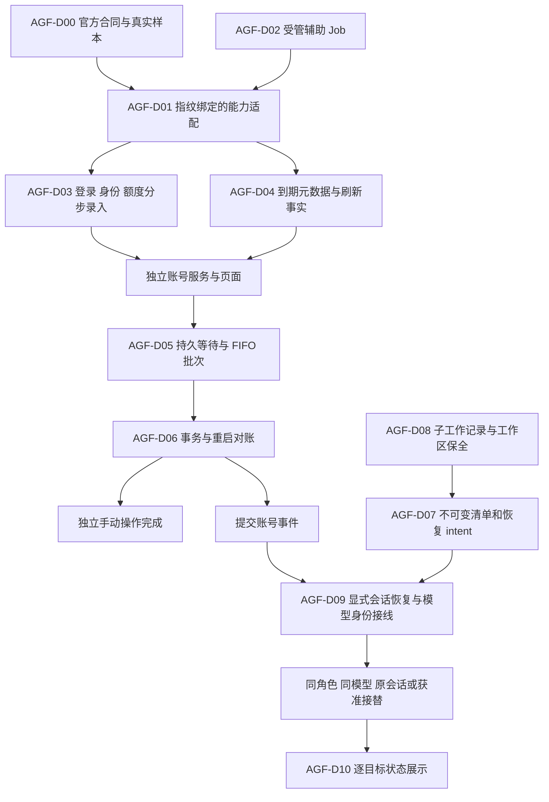
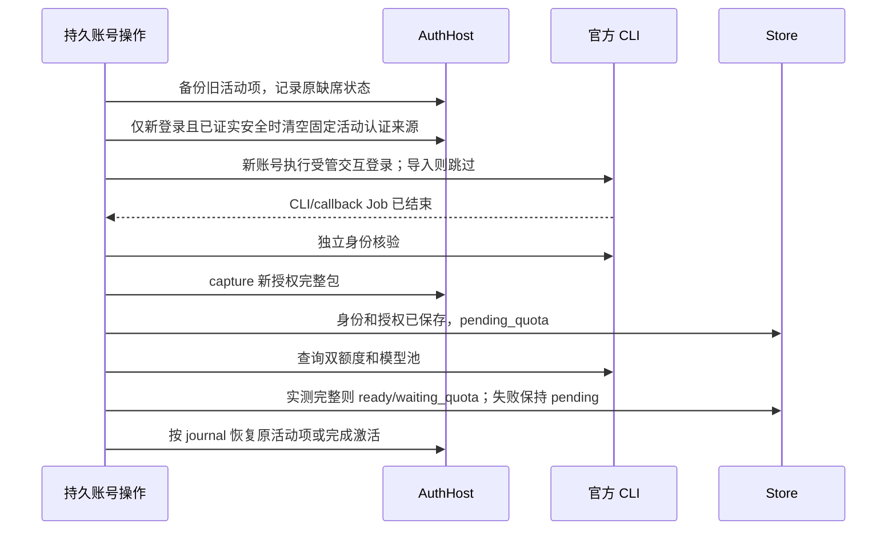
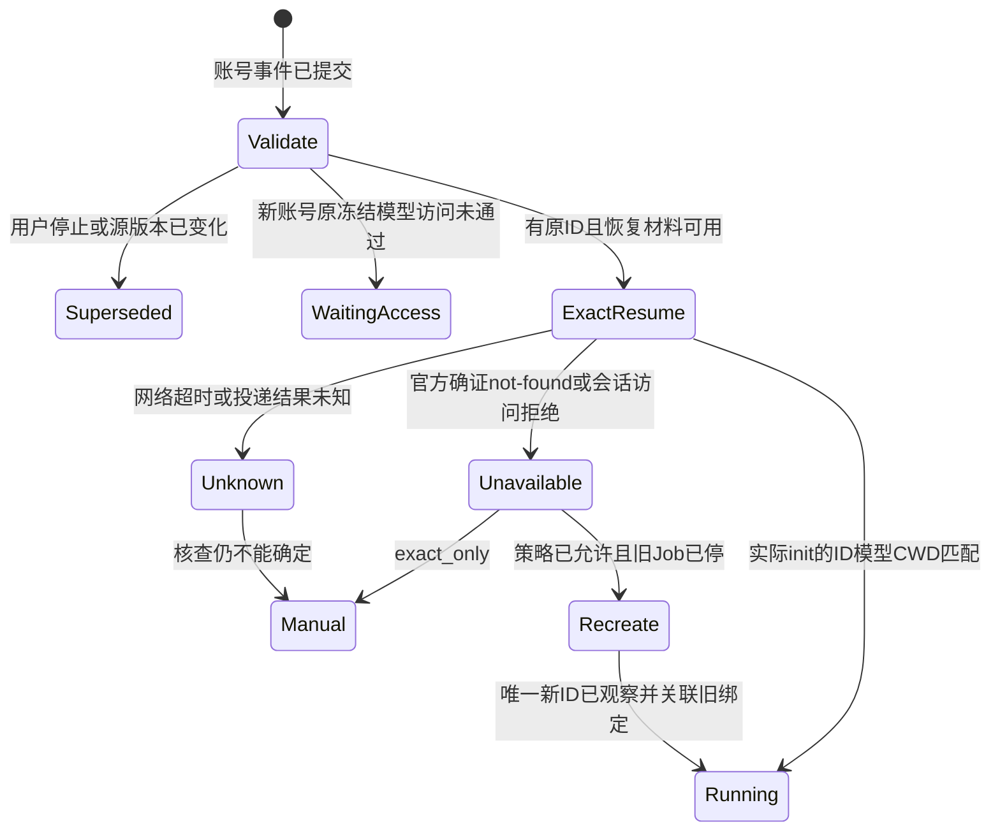
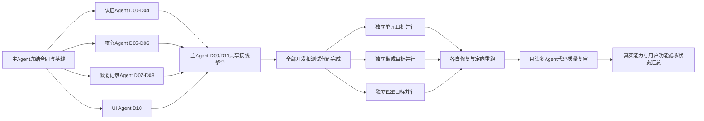

# DevFlow AGY 账号功能补全与恢复修复计划

版本：v1.0。日期：2026-09-21。状态：**修复设计已交付；本文各项开发、测试及实机验收尚待执行**。

本次只调查并编写计划，没有修改产品代码、运行产品测试、操作真实凭据或启动工作流。此前的隔离测试通过记录，不等于本文新增缺口已经修复。

## 1. 执行依据与交付目标

本文是用户明确要求的正式补全和整改文件，与 [原 AGY 开发计划 v3.1](./DevFlow-AGY账号自动切换与额度管理开发计划-20260920.md) 共同构成实施依据。原 `AC-R01–R19`、`AC-D00–D17`、`AC-U01–U20`、`AC-I01–I28`、`AC-E01–E23`、`AC-L01–L06`、`AC-H01–H08` 全部保留；本文用 `AGF-F*` 标识具体缺口、`AGF-D*` 标识修复任务、`AGF-U/I/E*` 标识新增定向验证。

优先级：用户后续明确指令 > 本文对缺口的具体修复设计 > 原 v3.1 其余条款。本文不重做已经实现的独立服务、基础界面、域锁和账号事务，不以“功能保持禁用”代替完成业务功能。原计划末尾的状态更正及 [代码复核记录](../test/AGY账号代码复核与验证记录-20260920.md) 是事实记录，不是新的实施路线。

**两种使用形态必须分别交付：**

- **独立账号管理**：零项目、零工作流也能配置、启动、逐一官方登录、初始化额度、手动自动选号或指定账号切换。外部 CLI 先退出，新启动后使用新账号；不接管外部 CLI 的任务、子 Agent 或会话。
- **DevFlow 工作流**：当前受管运行发生确证额度/认证故障后，按本地快照串行选择账号；保持原模型、强度、角色、工作区、逻辑轮次和剩余执行预算，按明确恢复决策续接根会话，并保存全部已识别未完成子工作的去向。

**外部能力约束没有消失。** 当前尚未取得官方 CLI 完整身份、双窗口额度与重置、登录完成、跨账号会话恢复的实机合同。AGF-D00 必须先取得事实。若官方接口确实不提供必要字段，依赖该字段的生产路径停止开发接通并报告阻塞；不猜字段、不接私有额度端点、不改为 API key 计费、不把单窗口重命名为双窗口。接口、纯算法、持久化、UI 与隔离测试代码等独立任务继续。不得宣称通过一份计划就能保证上游具有未证实能力。

执行模型直接按这两份文档实施，禁止另建 `implementation_plan.md`、客户端局部计划或替代方案。只允许在 `docs/process/` 维护标明“执行进度（非计划）”的记录：原编号→实际文件→测试状态→未完成原因。外部事实与设计冲突时，提交原章节、具体输出/代码位置及影响，暂停相关部分交规划角色修订，不自行降低验收。

### 1.1 当前基线和工作区

| 项目 | 调查值与要求 |
| --- | --- |
| 开发目录 | `C:\Code\system-handle`；基于执行时实际工作树继续 |
| 本次 HEAD | `004b2ea153a80f94007765e996d936db56d74c1c` |
| 已提交 AGY 基础 | `b60d9dc`；后续 `63b5d11` 已修复模型冻结配置与账号恢复的部分衔接，必须保留 |
| 原 v3.1 SHA-256 | `43C56F9A1BD4F18016E34CDAF2E91F6A7D37E37044B40A4551FAC9FA762EC87E` |
| 当前未提交内容 | `.tmp-wf-query.cjs` 为原有 AD 状态；另有子 Agent、工作区及 CLI 持久会话计划。不能覆盖或纳入本功能提交 |
| 安全边界 | 不 reset/clean，不修改真实账号或已有任务，不重启现用服务；真实验证另安排明确账号和可介入时段 |

执行前读取 `git status --short`、已暂存/未暂存 diff、`git worktree list --porcelain`。上述 SHA 只用于识别调查版本，不能要求恢复旧快照。若选择隔离工作树，使用 `zxw/` 分支前缀并从已包含当前合法提交的基线建立；不丢弃未提交内容。

### 1.2 与其他计划的接口边界

1. 模型配置已合入：复用 `FrozenInvocation`、`stageAccountModelRunRetry`、`ModelAccessService`、`run-profile.ts`、`conversation-lineage.ts`，不能另建模型配置或访问缓存中心。
2. [CLI 持久会话修复计划](./DevFlow项目工作区与CLI持久会话代码质量修复计划-20260921.md) 在另一实现工作树中整改，主目录当前没有已合入的统一 `session_binding`、conversation tree/control 服务。**不能把计划中的接口当作已存在代码调用。** 本文当前根绑定通过现有 `conversation-lineage.ts` 接入；后续合并统一会话实现时，由共享文件负责人把同一账号恢复决策接入该唯一权威绑定，不双写第二套根/子树。
3. 普通身份/模型变化禁止串会话；本计划仅增加经过核验的 `reason=account_switch` 精确续接例外。该例外带 source/target 身份和原会话，不放宽普通指纹相等规则。
4. DevFlow 仍负责根调用调度、绑定、材料保存和展示。子 Agent 由官方父模型组织；本计划不增加逐子启动器、业务阶段、测试证明门槛或模型监督器。

## 2. 当前代码缺口清单

以下均由当前源码和必要上下游确认；文件以仓库相对路径表示，执行按函数定位，不依赖行号。

| 问题 | 事实、触发与影响 | 主要落点 | 修复任务 |
| --- | --- | --- | --- |
| AGF-F01 | 生产组合根未注入 `VerifiedUsageAdapter`；usage 恒为未验证。官方命令参数和成功判据仍硬编码，模型探测判据还与现有 AGY `event/result.status` 协议不一致 | `apps/api/src/account-service-bootstrap.ts`；`adapters/agy/src/account-probe.ts` | D00/D01/D03 |
| AGF-F02 | `OwnedLoginJobPort` 无实现，Enrollment 无登录器注入；probe 直接 spawn/kill 父进程，不确认后代退出 | `agy-accounts/src/login.ts`、`service.ts`；`account-probe.ts`；两个 Windows Process Host | D02/D03 |
| AGF-F03 | 录入先 await quota，再 capture；quota 报错时新授权未保存，无法实现“授权保留、待补测而不重登” | `enrollment.ts:capture` | D03 |
| AGF-F04 | helper 不输出安全到期元数据，`last_refresh_verified_at` 无真实写入链路；严格夜间池无法取得合格账号 | `host/devflow-auth-host/main.go`；`auth-host.ts`；`maintenance.ts` | D04 |
| AGF-F05 | 只将全部占用白名单求交、池求并，无 FIFO anchor/批次；互不相容任务拖成全域等待 | `switch-operation.ts:execute`；`ports.ts`；`selector.ts` | D05 |
| AGF-F06 | 初始无候选的 wait 保留约 300 秒操作 deadline，数小时后醒来先超时；等待计算未完整接收白名单、夜间、冷却/Retry-After | `service.ts:driveOperation/assertOperation`；`wait-policy.ts` | D05/D06 |
| AGF-F07 | 启动跳过 desired_enabled=false，停止中崩溃难以清理；committed/recovering 对账直接返回，补投递前未复核实际活动项 | `service.ts:reconcileStartup/deliverConsumers`；`reconcile.ts` | D06 |
| AGF-F08 | 账号恢复更新 accountScope→调用指纹变化→`beginRunConversation` 返回 undefined→`adapter.prepare` 新建会话；`exact_only` 未控制实际启动方式 | `core/model-retry.ts`、`run-profile.ts`、`conversation-lineage.ts`；`profile-runtime.ts`；`sdk/invocation.ts` | D07/D09 |
| AGF-F09 | checkpoint 和 recovery coordinator 仅存信息/返回原 Run 数组，缺恢复 intent、目标 Run、投递去重、执行结果未知处理；账号模型探测布尔值没有打通既有精确访问缓存 | `agy-recovery-checkpoint.ts`、`agy-workflow-recovery.ts`、`agy-workflow-bridge.ts` | D07/D09 |
| AGF-F10 | wait 用 workflow_id 单键，主运行与 aside 可覆盖；aside 分支删除整条 wait，账号中断按普通失败 expired；恢复新 Run 获得完整时限 | `agy-workflow-bridge.ts`；`packages/asides/src/service.ts`；`core/engine.ts` | D07/D09 |
| AGF-F11 | 子事件缺 cursor/generation/工作区/产物；迟到 spawn 可覆盖终态；workspace_checkpoint_ref 没有生成者，未保全二进制和 untracked | `subagent-observer.ts`；`agy-recovery-checkpoint.ts` | D08 |
| AGF-F12 | night 策略未贯穿许可及全部消费者；报告缺未知有效期/最近访问/刷新时间，用 now+24h 代替夜间结束；恢复/能力 UI 不能展示上述细分状态 | `selector.ts`、`service.ts`、`maintenance.ts`；账号及运行 UI | D04/D05/D10 |

已实现并必须保留：当前用户固定认证域互斥、长驻 AuthHost、DPAPI/ACL/原始凭据完整包、备份失败不清空、停止确认、串行候选、显式目标不 fallback、请求去重、局部配置更新深层合并、人工停止优先、账号故障不计代码质量修复、accounts/full 共用账号服务。

## 3. 目标调用链与能力分层

独立手动切号只要求 identity/usage/login/credential/job 能力，不依赖子会话恢复。工作流自动切号还要求每个受影响目标的恢复能力和材料可确定；不能让“界面能打开”或者“helper 编译成功”代表整套能力就绪。

内部新增 `AgyAccountCapabilities` 安全投影，逐项记录 `identity`、`dual_quota`、`interactive_login`、`noninteractive_auth`、`auth_metadata`、`owned_aux_job`、`exact_resume`、`confirmed_session_unavailable`、`subagent_observation`、`workspace_preservation`；状态固定为 `verified / unverified / unsupported`，带原因及 CLI/Host/parser revision。`unverified` 与 `unsupported` 不混用。页面、API、执行端消费同一投影，不用一个总布尔值掩盖缺项。

能力验证材料不是每次业务派发的测试证明要求；运行时只检查已装配适配器、版本绑定、实际资源和对应能力。

## 4. 文件级修复任务

### AGF-D00：取得官方能力合同，区分研究事实和业务验收

关联：AC-D00、AC-L01–L06；解决 F01/F02/F04/F08/F11 的外部前提。输入为本机配置指向的 CLI、原能力历史报告、官方文档和可介入的真实账号环境。负责人为认证 Agent。

修改 `scripts/probe-agy-account-capabilities.ts`；新增 `docs/test/AGY官方能力合同-<实际验证日期>.md`，真实脱敏 fixture 放 `tests/fixtures/agy-accounts/official/<version>/`，原合成 fixture 明确保留 synthetic 身份。

固定调查顺序：

1. 纯信息阶段只读取可执行文件路径、摘要、`--version/--help` 与 Host doctor；失败记 unverified，不记“不支持”。不扫描/导出真实凭据。
2. 先实现 D02 最小诊断 Job 及 `OperationKindSchema`/service 中的内部 `kind=capability_check` 受理分支，再将真实采集移到这一持久操作。它仅豁免“正在调查的提供方能力必须已验证”条件，绝不豁免实机授权、域锁、旧 Job 退出、外部进程检查、固定命令白名单、取消及恢复。诊断不要求已知模型池，也不授予业务执行许可；未知身份绑定 operation 而非伪造账号。CLI 脚本是本地开发入口，不开放任意命令 HTTP API，禁止直接 execFile 绕过屏障。D00 的纯信息阶段→D02 最小底座→D00 真实采集是调查依赖，不是先伪造生产适配器来打破循环。
3. 一次仅对明确选中的活动账号采集；分别记录身份字段、双窗口数值与单位、实际 reset 时基、模型池映射、登录命令及完成/取消时序、模型成功/权限/限流/网络错误、会话恢复错误、子事件和临时工作区生命周期。记录输入参数与退出码，但敏感参数/URL/原始认证响应不进入正文或 fixture。
4. **身份来源必须能独立于双额度查询失败而判断。** 邮箱/subject 只采用官方结构化身份结果；不得用用户输入、alias、Windows username 或模型回复代替。
5. `/usage` 文档只确认交互 TUI 查询，并未给出本需求完整双窗口机器合同。历史 `agy -p "/usage" ...` 只是未证实探针，不得直接封装为生产支持。先实测其命令语义和字段；若不成立，记录明确阻塞及影响，不自行新增浏览器抓取、私有 API、模型解析文本或其他候选路线。
6. 核实 Credential Manager 固定目标与额外磁盘认证来源的优先级；不能证明唯一活动来源则 `credential_source_ambiguous`。不复制整套 `.gemini`。
7. 核实登录 callback 的拥有关系。系统默认浏览器可能是已有进程，不属于可强杀对象；取消必须结束本操作 CLI/callback 并证明不会迟到写凭据，不能靠关闭整个浏览器保证。
8. 自然刷新观察不修改 token 或系统时钟。跨账号会话调查包含显式旧 ID 成功、确证不可用、网络失败/结果未知，并核对 init 的真实 ID、模型和 CWD。

输出是一份按能力逐项的事实合同，含已验证样本来源、CLI/Host 指纹、字段语义和未支持范围。脚本不能自动给未知解析器授予 `verified=true`；适配器必须由实现代码装配并经实机验证。研究原型可用于调查，但不能冒充最终 AC-L 验收。

**停止条件：** 没有官方双窗口/identity 合同则不接通 D01 的对应生产 parser；没有 login/子事件/跨账号会话合同则仅阻断相应功能。D05/D06 等纯算法和持久化继续。没有真实验证窗口时记录“待执行实机验证”，不要求用户为了计划编写现在操作账号。

### AGF-D01：完整版本适配器与能力注入

关联：AC-D01/D04/D12；依赖 D00 已确认字段，D02 运行端口。修改/新增：

- 新 `packages/adapters/agy/src/account-capabilities.ts`：能力描述和经审查的版本适配器工厂。
- `account-probe.ts`、`quota-parser.ts`、`failure-fact.ts`、`protocol.ts`：统一身份/usage/模型响应协议。
- `packages/agy-accounts/src/ports.ts`：`probeIdentity`、额度观察、结构化失败、安全元数据及辅助调用结果。
- `apps/api/src/account-service-bootstrap.ts`：解析实际 CLI 和 Host，按摘要装配适配器、runner、login，accounts/full 共用。

适配器固定包含 CLI 版本/摘要、parser revision、identity/usage/login/model-access 的固定参数构造器、响应解析器、明确的错误分类。外部 HTTP 不得提交可执行文件、自由 args、parser 或“能力已验证”字段。官方没有说明的参数不由 UI 拼装。

`probeIdentity` 与 `probeUsage` 分离：后者返回每 pool 的两窗口事实；保留数值 0，缺项为 missing/unsupported，不能把 used 当 remaining。每个观察带账号标识、operation/epoch、CLI 摘要、采集时刻及 parser revision；写入前再次核验操作/身份，过时观察不得覆盖最新索引。

模型最小调用必须核对实际 model、独立临时 cwd、会话初始化、当前调用成功终态和退出码。复用已验证 AGY 协议，不能沿用其他 CLI 的 `type/result.is_error`。CLI 摘要改变使参数/解析能力及依赖该协议的临时 probe 结论失效；保留既有同身份模型授权记录，不把 CLI 小版本升级解释为账号授权失效。未知新版本阻止执行，重新验证的是 CLI 能力；只有真实身份、权限或已有访问缓存规则要求时才失效授权事实。历史额度可展示但标旧版本，不能凭它启用切换。

输出：有真实合同的版本可装配；未知版本精确说明缺项。保留 synthetic parser 只用于测试，不能换标签后用作生产。

### AGF-D02：受管辅助 Job 与官方交互登录终端

关联：AC-D02/D03/D04/D07/D13/D16；依赖共享端口，不依赖 Engine。负责人为原生认证 Agent。

新增 `packages/process/src/agy-account-job-runner.ts`，实现非交互 probe 和 `OwnedLoginJobPort`；修改 `ports.ts`、`login.ts`、`service.ts`、`packages/process/src/manager.ts`（仅必要协议支持）、`host/DevFlow.WinHost/Program.cs`、`host/devflow-host/{main.go,process_windows.go,process_posix.go}`。不得替换用户配置的 Host。

1. 辅助 Job 与业务 Run 使用不同许可种类：新增内部 `AgyAuxiliaryLease`，含 realm、operation、control_generation、epoch、usage_kind、expected credential ref 和 lease_id。由已持有域屏障的协调器签发，启动前 CAS；不为新账号伪造 Run/Workflow/已知 account_id。
2. probe 使用随机临时 cwd、隐藏窗口、受管输出；login 使用**用户可见的新控制台**，stdin 保持交互。Windows 两种 Host 均先挂起创建、加入命名 Job、再恢复；控制器协议管道与用户交互终端分离，普通业务调用默认行为不变。
3. 登录、identity、usage、模型验证复用同一辅助执行槽；相同操作可以顺序调用，不能同时启动两个不同账号的请求。业务可以在同账号并行，但安装下一账号前必须确认全部旧业务/辅助 Job 已结束。
4. Abort、超时、stdout/stderr/control pipe 失联均撤销 lease 并终止拥有的 Job；仅 `ActiveProcesses=0` 等实际确认可返回 fully_stopped。父进程 close 或 child.kill 成功不足以证明整树退出。
5. 未确认停止保持阻断，不清理关键日志、不回滚/覆盖活动凭据，不开始下一候选。只处理本实例拥有的 Job，不杀外部 CLI 或浏览器。
6. doctor 分别报告 `owned_aux_job` 和 `interactive_login`；任一 Host 缺能力则该操作不可用，不要求全局切换到另一 Host。POSIX 明确不支持本期账号功能，保留原执行行为。

输出：独立模式可使用的真实辅助执行器和取消合同。两 Host 分别编译、隔离测试；安装器分发新协议但不修改现用进程。

### AGF-D03：录入、重新认证与补测闭环

关联：AC-R01/R02/R16/R17，AC-D03/D16；依赖 D01/D02。

修改 `enrollment.ts`、`service.ts` 构造/操作驱动、`login.ts`、`account-service-bootstrap.ts` 及录入 API/组件。service 接收显式依赖，不再默默构造无能力 login launcher。

固定顺序：

身份未能核实：只保留 operation 内加密恢复引用，不生成可用账号、不用 expectedEmail 填身份；记录 `identity_unverified`。身份已核实但额度失败：授权和身份必须留存 pending_quota；再次补测复用授权，不重新登录。两个实测余额包含 0 时允许完成录入，但等待相应额度。

重认证的期望 identity 来自已持久账号而非客户端任意值；实际登录到另一人则拒绝改绑并按原事务回滚。重复 subject/规范化邮箱合并同一账号、增加 revision，不丢弃历史。更新凭据不等于验证刷新成功。

仅 D00 已确认需要且安全时，新登录才在备份后清空固定活动来源，以免静默继续旧账号；capture_current 不清空。保留现有 enroll/reauth 的 900 秒截止时间与取消保护，不把普通 switch 的 300 秒时限套给它，也不因切换内部阶段重置总截止时间。取消/超时后先确认拥有的 CLI/callback 已停止，再由 service 的同一 journal 回滚。回滚不能在 login/enrollment 里另建第二套事务。夜间非交互验证发现 auth_required 就退出并标 reauth_required；绝不打开登录窗口等用户。

输出：四条入口（login、capture_current、reauth、probe）在 accounts/full 中一致可用，失败记录能够续办；没有真实合同的入口明确禁用。

### AGF-D04：安全认证元数据、刷新事实与夜间健康

关联：AC-R10/R11，AC-D02/D04/D11；依赖 D00 元数据合同、D02 受管调用。

修改 `host/devflow-auth-host/main.go`，新增 `auth_metadata.go`；修改 Node `auth-host.ts`、`contracts/src/agy-account.ts`、`service.ts`、`selector.ts`、`maintenance.ts`、展示 DTO。

helper 内依据已验证凭据格式只解析允许元数据：access expiry、明确提供的 refresh expiry、refresh 凭据是否存在、格式解析状态。完整原字节包仍原样保存/恢复，任何解析错误不得损坏它。Node/API/日志不得取得 token、密码、完整 JSON 或 token 摘要。

`has_refresh_credential` 支持 unknown（用 null），增加 `metadata_status=verified|unverified|unrecognized`。所有旧元数据（包括 true、false、expiry、last_refresh_verified_at）若无可信来源，则保留历史值但资格迁为 unknown/unverified，不用于 strict 准入；不能报告“确定没有刷新凭据”，也不能继续信任旧伪健康记录。新有效 Observation 才能恢复对应已验证资格。refresh 没有到期字段保持 `refresh_expiry_source=not_provided`；禁止推算永久、固定六个月或七天。

新增内部 `AgyRefreshObservation`，绑定 account、epoch、辅助 lease 或有效业务 usage_permit、CLI/parser、请求前后安全元数据及结果。长运行自然刷新可使用原业务许可归属，不要求另开辅助请求。仅同时满足以下事实才写 `last_refresh_verified_at`：

1. 同一已核实活动身份，期间无登录/账号代次变化；
2. 先前观察的 access 到期已自然经过（含允许时钟偏差）；
3. 官方无交互请求成功，新的 access expiry 明确推进；
4. capture 新完整凭据成功，来源/版本仍有效。

普通调用成功只更新 `last_authenticated_request_at`。revision 增长、维护成功、access 尚未到期或单纯 exit=0 都不能设置刷新已验证。没有自然刷新事实就保持待验证；不得强制过期、篡改 token、设置备用账号保活定时器。长运行账号由已验证凭据更新事件或本地安全元数据观察积累事实，不额外给备用账号发请求。

把夜间约束带到 usage request、occupancy、等待项和每次恢复资格判断。使用唯一时间工具 `nightWindow` 返回明确时区的本夜/下一夜起止 UTC；按真实本地日期求边界，消除秒偏移。DST 重复时刻固定取较晚结束点，不存在时刻向后移到首个有效时刻；测试同时覆盖 Asia/Shanghai 和 DST 时区，不固定加 12/24 小时代替。

严格池要求刷新证据在资格评估时刻未超过配置年龄，且已知 refresh expiry 晚于整段夜间结束。实际准入取当前时刻；日间预报取下一夜间开始，已经入夜则取当前时刻，界面展示评估时刻。未知 expiry 可在近期刷新证明合格时入池，但显示未知。normal 不自动升级为 strict；strict 不被其他 normal 消费者稀释。

本地报告补 `evaluated_night_start/end`、unknown expiry、最近访问/刷新证明、快照时刻、候选依据/排除原因；到期分组与 selector 使用同一夜间结束边界。保留现有一天一次本地报告和用户主动串行维护，不增加后台联网。维护结束先检查原账号对待恢复目标是否合格；不合格时只按已有自动授权进入 D05，其他目标保持等待。

### AGF-D05：FIFO 分批调度、统一可用性和长等待

关联：AC-R04/R06/R11/R13，AC-D05/D06/D07；依赖共同合同，可与原生接入并行开发。负责人为账号核心 Agent。

新增 `packages/agy-accounts/src/recovery-batch.ts`；修改 `selector.ts`、`wait-policy.ts`、`repository.ts`、`service.ts`、`switch-operation.ts`、`ports.ts`、账号合同。**核心不新增 Workflow/Run 类型依赖。**

新增持久 `AgyPendingDemand`：`demand_id, revision, demand_generation, consumed_wake_key, consumer_id, opaque_recovery_ref, first_wait_at, fairness_key, source_revision, policy_revision, settings_revision, control_generation, required_model_keys, required_pool_ids, allowed_account_ids, night_pool, status, wake_at, last_reason`。Bridge 用稳定 consumer/source Run key + logical generation 建立 demand_id，不含会随新 attempt 改变的 operation_id；用 workflow_id + source_run_id 提供不透明排序键。source 被明确替换才增加 demand_generation，重试不增加。业务版本、计划和角色放在 opaque 恢复引用，校验归 Bridge。

新增 `AgyRecoveryBatch`：`batch_id, operation_id, revision, anchor_demand_id, selected_demand_ids, deferred_demand_ids, candidate_account_ids, committed_account_id, status`。repeat error 不重置 first_wait_at。工作流正常结束、人工取消或旧 source superseded 使对应 demand 失效。

`evaluateAccountAvailability()` 作为 selector、wait、permit 和报告共用纯函数，输入完整冻结约束；输出 local eligible、阻塞原因、可信 wakeAt。每账号对全部阻塞条件取 max，每池跨账号取 min。禁用、白名单外、未知 reset、未验证池/权限等不贡献虚假唤醒；cooldown/Retry-After 与窗口 reset 一并考虑。reset 到时只是待核验，历史 0 仍显示 0。

`planRecoveryBatch()` 固定算法：

1. Bridge 先确认需求仍有效，核心过滤失效/取消项；尝试全部需求的共同本地候选。
2. 没有共同候选时，按 first_wait_at、fairness_key、demand_id 排序，取**至少有本地可核验候选**的最早需求作为 anchor。更早但当前无资格者保留 first_wait_at 和 wakeAt，不拖死可以运行的需求。这是对原 §7.1 的明确细化：采用“就绪需求 FIFO”，source 仍有效并不等于当前可运行；无资格项恢复就绪后按原等待顺序重新参与。
3. 按 anchor 的约束和原周余额排序选择候选；同一时刻只激活核验这一个账号，自动候选失败仍按原有限循环顺序尝试下一名。再逐项评估其他需求，满足全部模型/池、白名单、night 策略者加入 selected，其余 deferred。不能继续用全部池并集否决 anchor。
4. 自动故障场景先阻止新 admission 并保全/停止全部旧身份使用者；**只恢复 selected**。deferred 持久等待。当前批次有有效业务许可时不为下一批抢占；最后一个许可释放、当前身份确证不可用或用户手动操作后重新规划。
5. 为防后到任务无限占满活动账号，存在**当前可运行**的 deferred 批次时设置 drain 门槛，不再准入晚于其中最早者的新业务需求；正在运行者继续，已选批次正常排空后转下一批。只有无候选/需人工处理的 deferred 时不设置该门槛。无需中断正常业务来强制时间片。
6. 手动 explicit 仍只选择指定账号；不满足所有本次必须保全/恢复的受管约束时安全收尾并终结为 target_unavailable，不把手动操作隐式改成 FIFO 自动轮换。所有 manual 失败（有无工作流均如此）直接结束，不为这次手动意图写未来自动唤醒项；外部进程等待仍沿用原有 300 秒上限。已有独立自动需求不因此被删除，但不能借它改写手动指定目标。

统一 `enterDomainWait`：业务自动等待保存在 demand，不让数小时 waiting 长期占住 `realm.pending_operation_id`。完成当次安全收尾后终结有限 operation attempt 为 waiting/deferred 结果，释放操作占位但保持 AGY 业务资格保护；用户仍能执行补测/维护/取消。下一次可信唤醒为同一 demand 创建新的去重 attempt。

计时分为 `attempt_started_at/attempt_deadline_at` 和需求 `wake_at`，另持久化 `selection_round_id/reset_fact_key/round_budget_ms/round_consumed_ms/round_remaining_ms/attempted_account_ids`。同一选号轮次总预算沿用 switch_timeout；网络重试、投递重试、同一恢复条件下重新创建 operation 都共用剩余预算和已尝试集合，不获得新的 300 秒。长期额度等待不扣业务/操作执行时间；只有先前可信 reset 到时产生的新 wake key，或新官方额度/重置信息，才允许开启一个新的有限选号轮次，不能用本地时钟不断制造新轮次。demand_id/generation 不因额度窗口改变而重置。

每个 `{demand_generation,reset_fact_key,wake_at}` 仅唤醒一次；到点观察仍为零且 reset 未推进，不形成每 5 秒联网循环，保留等待并显示 `reset_not_confirmed`，等待新的可信时间或用户补测。预算耗尽没有自动充值权；手动 deadline、外部退出等待不能延长。这里的账号操作预算与 D07 的业务 Run 预算独立保存。

输出：不相容白名单/模型池可分批、可重启、无饥饿式插队；未知额度不变满额、人工停止优先、没有轮询全部账号。

### AGF-D06：崩溃对账、停止中清理与提交投递

关联：AC-R08/R13/R19，AC-D06/D10/D16；依赖 D05 状态合同。修改 `reconcile.ts`、`service.ts:reconcileStartup/driveOperation/deliverConsumers/close`、`repository.ts`；组合根只调整必要启动顺序。

| 持久现场 | 确定处理 |
| --- | --- |
| desired_enabled=false，无未完成操作/许可 | 保持 stopped，不获运行资格、不联网 |
| desired_enabled=false，但有本 controller/storage lineage 未清理 journal/owned lease | 使用 cleanup_only 模式取得域锁，确认持久归属、Job/凭据，只收尾/安全回滚/结算取消；不准入、不选号、不恢复业务。不能依赖重启后已清空的内存 ever-owned 集合 |
| queued/quiescing/capturing | 核对原 control generation、实际 Job、外部进程及 before 引用；有效才从原阶段继续，不能因重启认定已停 |
| install_intent/installed_unverified/verifying | 实际项与 before/target 对比。匹配 before 可幂等继续；匹配 target 重新核验；均不匹配 external_change，不覆盖 |
| rollback_required | 当前项仍属本操作才能恢复；回读并增加 epoch。原本无凭据恢复为真实缺席，不伪造空包 |
| committed/recovering | 重新核验域锁、实际活动项、commit account/epoch/ref、旧 Job 已结束；一致只补投递，不再换号。不一致冻结并阻止恢复 |
| 长期 demand waiting | 保留首次等待时间、wakeAt、source/策略/控制版本；只做本地校验，不统一改 queued，不自动联网 |
| cancelled/completed/failed | 不重放。必要 journal 清理不能改原结果 |

每次异步边界后再次检查 operation/control/settings/epoch。取消/停止意图先于阶段恢复；即使实际凭据匹配 target，cleanup_only 也不能继续正常选号或业务恢复。它使用专门的清理 guard，不复用要求 running/desired_enabled=true 的普通 operation guard。恢复锁只赋予本 storage/controller lineage 的持久归属清理权；无法证明 Job 归属则冻结，不能凭旧数据库 PID 强杀外部进程。

消费者回执以 operation + consumer + delivery revision 去重；消费方已经建好 D07 intent 即可确认“已安排”，不要求等待业务完成。投递失败保留原 commit；重试前再次核验真实活动项。停止意图覆盖旧自动 wait，cleanup_only 不能被复用成隐式重新启动服务。

核心对账只处理账号资源；普通工作流 `RECOVERY_REQUIRED` 和历史用户暂停保持现有语义。只有能够关联到仍有效账号恢复 intent 的目标，才交 D09 补投递。

### AGF-D07：按 source Run 建立恢复清单、进展和预算

关联：AC-R09/R14，AC-D08/D09；依赖冻结合同，可与 D02/D05 并行。主 Agent 负责共享 runtime/core 文件。

修改 `agy-recovery-checkpoint.ts`、`agy-workflow-recovery.ts`、`agy-workflow-bridge.ts`、`core/model-retry.ts`；新增专用 `packages/contracts/src/agy-recovery.ts` 并从 index 导出。**业务恢复合同不放入账号核心 ports**。

源检查点、目标 manifest 与可变 progress 分开：

- 停止确认后冻结不可变 source checkpoint，记录 source account/epoch、原完整 FrozenInvocation、profile、purpose/routing_role/review phase、logical round/assignment/repair batch、原根 conversation、父子结构、目标/结果引用、控制/计划/策略版本、workspace checkpoint、recreation_policy、剩余预算。此时目标账号尚可能变化，不能把它写死在源检查点。
- 最终账号 commit 后创建不可变 recovery manifest，键固定 `operation_id:source_run_id:logical_work_id`，引用 source checkpoint 并记录最终 target account/epoch。候选改选/核验记录独立保存，不反复重写不可变历史。
- progress 含 revision、decision、target_run_id、delivery_id、state、last_native_cursor、reason、started/completed_at。状态为 `preserved / resume_pending / recreate_pending / waiting_dependency / waiting_access / delivery_pending / delivery_unknown / running_observed / manual_required / superseded / completed`。
- `pending_model_retry.account_recovery` 增加 recovery_id、operation_id、manifest revision、source/target epoch 和显式 continuation；原 Run 不修改。只替换目标身份 scope，不从后来保存的 spec 重新取模型/effort。

等待从 `agy_account_wait[workflow_id]` 迁为逐 source Run 项；操作保存恢复 item_id 列表，不再以工作流单键作为唯一恢复凭据。兼容读取旧记录时，仅当 source Run、版本、epoch 可唯一确认才生成新项；有歧义转 manual_required，保留旧记录不删除历史。

在停止前写保全准备记录；确认所有 owned Job 退出后吸收最终原生事件与 D08 最终快照，再冻结 source checkpoint；账号 commit 后才冻结目标 manifest。不能先生成不可变清单后丢弃退出前发生的 completed/cancelled。

预算：从原 Run 实际执行起点/既有 timeout 推导 `execution_budget_ms/consumed_ms/remaining_ms`，停止确认时冻结；恢复启动只分配 remaining。等待账号、用户认证和队列时间不消耗执行预算；重复恢复不充值，remaining<=0 保持 TIMEOUT。单个执行片段按单调时钟计量；崩溃后无法确定已耗时范围则保守扣除可确认上界或 manual_required，不默认整轮新预算。

aside 单独保存问题、只读用途、原会话/会话项和有效控制版本；账号中断设 waiting_account，不转 expired、不晋升下一问题、不覆盖主任务。修改 `packages/contracts/src/feedback.ts`、`packages/asides/src/service.ts` 的 submitQuestion/promoteNextQueued/cancelSession/settleRun、实际 aside Run 创建/结算点及 `AsideHistoryDialog.tsx`。waiting_account 仍占原全局 aside 槽，取消才释放并允许下一问题晋升；恢复关联原问题，不重新提交或充值预算。人工取消照常终结。

输出：全部受影响 source Run 和已识别子工作均有唯一恢复项；已完成/取消者 preserved，未知者 manual_required，不用“根已恢复”替代整棵树结果。

### AGF-D08：子工作观察、工作区保全与可重用材料

关联：AC-D08/D09，AC-R09；依赖 D00 事件与工作区合同、D07 manifest。修改 `subagent-observer.ts`、Bridge 的 `observeNativeEvent`、`native-record-source.ts`（仅有已证实元数据）；新增 `packages/runtime/src/agy-workspace-checkpoint.ts`。

事件记录保存 logical_id、native_session_id、parent_id、generation、source event cursor、目标引用、角色、真实 workspace、产物/后台命令引用、terminal 状态、observation completeness。使用 operation epoch + generation + cursor 幂等；旧代次/旧序号不覆盖新记录，completed/cancelled 不被迟到 spawn 降为 unknown。未知格式保留最小“观察不完整”事实，不猜 ID 或解析模型叙述当命令事实。

当前主目录尚无统一 conversation tree，先沿用唯一 `agy_subagent` 记录并扩展。未来合入统一树时迁移这个权威源、只保留只读兼容投影，禁止长期双树。父子、孙节点关系必须保留。

工作区固定方案：

1. 优先使用原持久工作区，绝不为了切号删除、移动或 reset。每个受管临时工作区识别真实 repo/worktree root、base commit、批准写入范围、实际所属逻辑工作和允许的保全路径。
2. 大材料保存在 `<storage_root>/agy-recovery/<safe-workflow-key>/<sha256(source-checkpoint-id)>/`，原包含冒号的 ID 只存索引，不直接用作 Windows 文件名。正文只存引用。采用 file manifest + 内容文件的原子目录写入；tracked 用含 binary 的 Git diff 并记录 index/worktree 两层差异，untracked 逐文件复制允许范围，保留删除/重命名/二进制事实。依赖目录、构建缓存、凭据、配置秘密及越界路径不复制；链接/reparse point 只记类型和目标，不跟随越界。
3. 单文件上限默认 64 MiB、单目标总量默认 512 MiB；超限/读取失败/快速变化均记具体未保全路径并 manual_required，不截断后声称成功。限制可由本地配置显式调整，不由模型忽略。
4. 原生事件确定该工作区可能写入后，按本地变更合并触发增量快照（同目标最长每 5 秒一次）；无变化不复制。停止前先保存已有稳定材料，Job 确认退出后做最终扫描。源宿主会自动清理而无法保证最后变化被保存的目标不可无人重建。
5. 恢复前比较原路径、base 与最终文件摘要。原路径仍完整优先续用；原路径缺失且快照完整时，只在任务已有获准隔离工作区内建立恢复副本。用户已有新修改时不覆盖、不 `git apply --force`，转明确冲突处理。没有可证明安全的新目录则 manual_required。新目录副本只表示材料保全，不自动获得 exact resume 资格；原 CWD 无法恢复且没有已验证的同会话 CWD 迁移合同，exact_only 必须暂停。只有会话确证不可用且原策略允许接替时，才可在获准恢复目录创建替代根。

恢复父模型收到确定性清单和材料引用，自己调用官方原生工具续接/接替未完成子工作；平台不发明 `manage_subagents` shell 命令、不逐子启动、不自动重放提交/发布/迁移等结果未知副作用。只有真实事件才能把目标标为 running_observed。

### AGF-D09：显式根恢复、精确模型访问与幂等派发

关联：AC-D07/D09/D10，AC-R09/R14/R18；依赖 D01/D05–D08。共享文件主 Agent 单人合并，不能由多个 Agent 同改 `engine.ts/profile-runtime.ts`。

修改 `agy-workflow-recovery.ts` 为唯一账号恢复决策器；接 `model-retry.ts`、`run-profile.ts`、`conversation-lineage.ts`、`profile-runtime.ts`、`runtime.ts`、`runtime/recovery.ts`、`adapters/sdk/src/invocation.ts`、`agy/handoff.ts`、Engine 及 aside 接线。

新增 `AccountRecoveryContinuation`：`recovery_id, manifest_revision, decision, original_conversation_id, source/target account epoch, frozen_invocation_digest, workspace_ref, permission_scope, remaining_budget_ms`。只能由受信任内部决策器生成，API/模型输出不能指定任意 decision。

根恢复状态机：

1. **禁止身份指纹变化后自动走 prepare。** 普通调用仍使用现有 fingerprint 规则；账号恢复先消费显式 continuation，在精确续接时直接使用原 conversation ID，核验只变更了获准账号 scope，模型/effort/可执行文件/provider/CWD/权限不变。init 不匹配立即阻断。禁止 `--continue` 最近会话回退。
2. `exact_only` 原 ID 不可用或没有可核验原 ID时 manual_required。仅在 D00 对应错误合同已验证、明确 old-session-unavailable、旧 Job 全停、材料完整且冻结策略为 recreate 时创建一个接替根，并保存 replaces/replaced-by 关联。网络、普通 403、模型无权访问、超时、账号变化本身不能当作旧会话不可用。无原 ID 且未证实创建结果也不能猜测重建。
3. 精确账号模型验证接通现有 `ModelAccessService`：增加仅内部的 `verifyFrozenForAccountRecovery(frozen, profile, auxiliaryLease, recoveryRef)`，使用原冻结参数在候选账号上做一次最小调用，写同一访问缓存；不能从当前下拉目录重新解释原模型别名、换 effort、换 provider。缓存有效即复用，不为每轮或每个备用账号重复验证。
4. 原计划已包含“选中候选且缓存失效时验证原模型”的自动行为；开启 workflow auto-switch 继续明确包含这一受控验证。只允许原已选定模型/强度/订阅来源，不扩展到其他模型、API key、credits/付费 fallback。缺少用户原先选择并验证的冻结依据、计费来源变化或需交互认证时 waiting_access，不能 seedVerified 冒充真实成功；旧账号 auth_invalid 已使 A 缓存失效不等于撤销用户原模型选择，不能因此禁止验证 B。
5. 不能在持有账号 coordinator 的候选验证回调里再调用会重入 `withModelVerification()` 的路径，避免队列自锁。D02 auxiliaryLease 是当前操作已拥有资格的证明；内部 owned-verify 执行实际请求，入口和结束都核验 lease/身份。候选尚未 commit 时，使用仅内部 `VerifiedCandidateIdentity`（lease、已核验账号、保留 epoch、credential revision、身份观察引用）计算 B 的同一访问缓存键；不能读取仍指向 A 的 committed realm 来归属结果，也不能提前修改 committed active 字段。HTTP 不得提供这个身份 override。主动模型验证继续走现有 `withModelVerification`，不得获得 owned bypass。

   最小验证继承现有模型计划的限制：空临时目录、不携带业务会话 resume/MCP token、只读且禁用工具、超时不超过 60 秒；验证结束后 Job 全停才继续账号事务。候选身份核验失败或 lease 失效的结果不发布为 verified。
6. 核心只接收不透明验证项及成功/拒绝结果，不 import `ModelAccessService/Engine`。full 由 Bridge 注入验证适配；accounts 用 D01 的同模型最小 probe。已验证模型失败仅影响对应账号-模型，不能当整账号周额度用尽。
7. 建恢复 intent 与分配固定 target_run_id/调度 outbox 在一个同步 Store 事务中完成，不在事务里 await。唯一键为 recovery_id + target generation；投递前 CAS 用户控制、source Run、plan/hash、policy/settings、epoch、批次资格。重复账号回调返回同一个 target Run。目标创建后崩溃先查 Run/Job/native 事实；结果未知标 delivery_unknown，不重新发送原 prompt。
8. `onAccountCommitted` 只处理 D05 selected items；deferred 留队列。接替、原角色恢复都保留原 FrozenInvocation、routing role、review phase、assignment、repair batch 和 logical round；账号等待不触发代码修复、质量计数或旧 quota timer。
9. 不确定历史重启仍保留 RECOVERY_REQUIRED；只对仍有效且投递未开始的账号恢复 intent 自动继续。用户已经暂停、继续新轮、改策略或结束任务，则 superseded，不覆盖新意图。后续统一会话实现先合入时，以其唯一权威 store 承接同一 continuation，并在同一事务保存来源绑定、目标身份绑定和所有权关联，保留旧历史；不继续把 native_conversation 当第二权威源。普通身份变化不能复用账号恢复例外。

输出：实际启动命令和会话绑定受恢复策略控制，原角色/模型与会话连续性都经验证，不能仅测试“恢复后 profile 没变”。

### AGF-D10：独立页面、工作流恢复展示和维护结果

关联：AC-D11/D12/D16/D17；依赖固定 DTO，可与核心实现并行。

修改 `apps/api/src/agy-account-routes.ts`、`agy-account-policy-routes.ts`、必要工作流详情投影、`packages/presentation/src/agy-accounts.ts`、`AgyAccountsPanel/Enrollment/MaintenancePanel/WorkflowPolicy/RuntimeAccount.tsx`、`CurrentRuntime.tsx`、`RuntimeFailureNotice.tsx`（按实际调用点接入，不创建同名替代组件）。

1. /accounts 零工作流可读 capability 缺项、录入进度、pending 补测、真实双额度/重置、串行操作及外部占用。GET、页面轮询、倒计时归零保持零上游网络请求。
2. 增加只读 capability DTO，不返回 secret_ref、credential fingerprint、原始命令输出或认证 URL。API 错误固定 code/message + 脱敏原因。
3. 本地额度始终显示“上次实测”和 observed_at；reset_due 显示“预计重置，待核验”；不得把旧 0 改 100%。显示 FIFO 队列位置、等待原因、当前批次和预计唤醒，不显示不可证实倒计时。
4. 认证健康分别展示 access 到期、refresh 有效期未知/已知、最后访问、最后刷新证明、今晚严格池资格。access 到期不等于需要重登。
5. 恢复 UI 区分“账号已切换”“恢复已安排”“实际运行已观察”“目标完成/需处理”；每个根/子目标显示 resume/recreate/preserved/manual、关联旧/新会话、工作区缺失和剩余预算。未知投递不显示“自动重试成功”。
6. `recreate_after_confirmed_unavailable` 仅在 D09 对应能力具备后可选；exact_only 始终真实生效。已有策略意图保留，能力失效只限制执行不偷偷改用户设置。
7. 停止管理、取消操作、取消某个恢复目标使用既有 human/同源校验与请求去重/CAS；新增只读恢复列表 `/api/workflows/:id/agy-recoveries` 和人操作 `/api/workflows/:id/agy-recoveries/:recovery_id/cancel`，仅 full 注册。取消单个目标不得清除整个工作流其他目标。

输出：两种模式都能解释成功、等待、取消与未验证能力，独立页不依赖工作流 API。

### AGF-D11：兼容迁移、安装与说明

关联：AC-D10/D13/D14/D16。依赖合同和组合根完成；负责人为主 Agent，可分派独立安装文件。

修改 `contracts/config.ts` 必要新增字段、`repository.ts` 的版本兼容读取、`scripts/build-auth-host.mjs`、两个 Process Host 构建/分发、`packages/installer/src/{main,upgrade}.ts`、`scripts/{setup.mjs,release/build-release.mjs}`、`compatibility.json`、两份使用指南。

- 增量迁移加 schema revision；旧 quota 无当前 capability 证明只展示历史，不自动激活；旧 auth 未知不变 false；旧 wait 按 D07 单义迁移；迁移可重复，遇到不完整记录保留并提示，不删用户历史。
- 保留 models、host 路径、并发、timeouts、已存账号/工作流策略及 enabled 意图。不得为启用新功能静默替换 Host、登录来源、模型或计费来源。
- helper/Host 版本不兼容时只关闭对应能力；安装检测不登录、不切号、不发模型请求。更新 required/digest 与 accounts/full 入口；不提交本地 exe、原始/未审脱敏/含秘密输出。允许经字段白名单脱敏并审查的真实协议 fixture 提交，用于可复现回归。
- 指南分别说明独立手动操作、工作流自动切换、日间维护、FIFO、exact/recreate、未知授权寿命和未完成目标处理。不得声称所有账号实时余额、绝对免验证、整夜必不失效或独立模式能热切正在运行的外部 CLI。

### AGF-D12：整合验证、独立复审与交付

关联：AC-D14/D15、全部 AC-L/H。依赖本修复范围所有开发与测试代码完成。

主 Agent 整合接口和共享文件，按 §6 分派定向测试；各执行 Agent 自行定位修复和重跑受影响目标。然后按认证/核心/恢复/API 与安装四个范围做独立只读代码质量复审；复审检查遗漏、正确性、边界与维护性，不追查测试声明或代跑验证。

交付分别列出独立功能、工作流功能、实机能力和人工验收状态。任何 required 能力仍 unverified、任何目标只能依靠未实现接口时，不得写“全部完成”。用户确认功能后保留原第二道质量复核及交付流程；不自动推送、发布或重启现用服务。

## 5. 关键不可变规则与迁移决定

1. 跨账号请求只串行；同账号并行业务不被降成单执行器。所有 credential 安装之前必须确认旧身份全部受管使用者已停，外部进程只等不杀。
2. 手动指定 B 失败不能换 C；自动选中的候选核验失败才按有限候选规则继续。没有受管工作时不生成业务 Run/recovery manifest。
3. 核心状态与业务状态分离：账号 commit 成功不意味着所有恢复目标完成，某目标权限不足不撤销已提交账号、不重切一次。
4. `night_pool`、白名单、模型/effort、控制意图均按 source Run/需求冻结；用户明确继续新轮才读取新配置。把恢复 source policy 当最新 policy 覆盖同样不允许。
5. 模型目录可见不是调用权限，mock probe 不是真实能力，任何 `seedVerified` 只允许测试。
6. 恢复材料是资料，不是能覆盖用户指令的高优先级提示。不得自动重放已完成或结果未知的远程副作用。
7. 根/子工作区事实无法完整取得时如实 manual_required。不能通过另建监督模型、让模型声称“已保全”或要求测试证明来补数据缺口。
8. 保留原请求去重和同步事务约束；外部调用不得包入 SQLite 同步 transaction，迁移不清空操作日志。

## 6. 测试责任与受影响旧功能

**先完成正式计划中的全部开发任务，包括功能实现、端到端接线、异常与边界处理及测试代码，再进入单元、集成和 E2E 测试阶段。将独立测试目标分配给多个子 Agent 并行执行，各子 Agent 每条命令只指定一个测试类、文件或用例，并负责相关问题的定位、修复和重跑。某个目标失败不阻塞其他无关目标；不同测试层之间不设固定先后顺序。仅有真实依赖或共享资源冲突的目标需要协调、隔离或局部串行。禁止无筛选的全量命令、全库通配符和一次拼接多个测试目标；受影响回归也按独立目标分派并行，不因局部修改重跑整个套件。**

这里“全部”指本文 D00–D11 的开发、跨模块接线及测试代码。D00 为确定技术可行性的受控采集不等于正式测试阶段；能力受阻可继续独立开发，但不能删掉受阻条目后声称全量通过。

本次三层均适用，无豁免。下面场景是稳定业务编号；具体测试文件/命令由执行者基于代码落实。一个参数化测试目标可承载相关边界，但不能修改旧断言掩盖回归。

### 6.1 单元目标

| 新编号 | 场景和必需结果 | 原验收映射 |
| --- | --- | --- |
| AGF-U01 | 官方脱敏 parser：余额0、缺项、重复窗口、used/remaining、非300/10080周期、未知版本保持未验证 | AC-U01–03 |
| AGF-U02 | 模型探测正确AGY envelope、实际模型/会话错误、权限拒绝不能误判成功 | AC-U08 |
| AGF-U03 | 辅助 lease 撤销/旧epoch/旧helper输出、输出超限及中断不能继续写凭据 | AC-U09 |
| AGF-U04 | 刷新事实：普通成功/未到期/revision改变均不等刷新；自然到期+新expiry+身份成功才合格 | AC-U10 |
| AGF-U05 | UTC/本地跨午夜、精确秒、DST边界、unknown expiry、strict/normal不混淆 | AC-U11 |
| AGF-U06 | FIFO无共同候选、稳定同时间排序、最老不可运行不阻塞其他人、后到不能插队 | AC-U04–07 |
| AGF-U07 | 同一账号全部阻塞取max、全池取min；不允许账号/未知reset/冷却/Retry-After | AC-U12 |
| AGF-U08 | 长wait不消耗attempt、同wake只唤醒一次、reset未证实不形成5秒循环 | AC-U12 |
| AGF-U09 | root决策exact/recreate/manual；只有官方会话确证不可用+已授权才recreate | AC-U14 |
| AGF-U10 | 子事件游标/代次去重、迟到spawn不降终态、孙节点不平铺 | AC-U13 |
| AGF-U11 | 文件清单binary/untracked/删除/rename、越界链接、敏感排除、超限标缺失 | AC-U13 |
| AGF-U12 | 剩余预算多次切号单调递减，等待不扣，零预算TIMEOUT | AC-U14 |
| AGF-U13 | UI DTO未知/0/reset_due区别，逐能力/逐恢复目标脱敏 | AC-U15 |
| AGF-U14 | 核心不依赖Engine/Run；独立模式能力不被会话恢复缺失全局禁用 | AC-U17/U20 |
| AGF-U15 | explicit不fallback、手动无未来唤醒、HTTP不能伪造aux lease/恢复decision | AC-U18/U19 |

### 6.2 集成目标

使用真实 Store、service、API、Bridge 和相应 Host 测试组件。外部提供方使用严格协议替身时明确标注；不得全链路 mock 后声称事务或系统凭据验收通过。

| 新编号 | 场景和必需结果 | 原验收映射 |
| --- | --- | --- |
| AGF-I01 | 登录→独立identity→capture→quota；quota失败仍可补测不重登；身份未核实不入池 | AC-I01/I02 |
| AGF-I02 | 误登录另一账号、重复录入、取消、callback迟到、原项不存在的回滚 | AC-I01/I11 |
| AGF-I03 | C#辅助Job：挂起入Job、用户控制台、后代未退出不换身份、取消及管道故障 | AC-I05–I08/I23 |
| AGF-I04 | Go辅助Job：同I03；单独验证，不复用C#通过结论 | AC-I05–I08/I23 |
| AGF-I05 | login/usage/model共槽，候选间无请求重叠，页面GET零网络 | AC-I03/I04 |
| AGF-I06 | A只准B、C只准D，FIFO只恢复合格批；最后许可释放才换下一批，重启顺序不变 | AC-I04/I18/I26 |
| AGF-I07 | 初始耗尽与激活后实测耗尽两条路径都能数小时后醒一次；人工stop/策略变更使旧wait失效 | AC-I18/I19 |
| AGF-I08 | install_intent前后、installed_unverified、commit前后、ack前后逐点崩溃，幂等且无重复切号/恢复 | AC-I10/I12 |
| AGF-I09 | desired=false停止中崩溃走cleanup_only；提交后外部改身份不补业务投递 | AC-I10/I12/I28 |
| AGF-I10 | 元数据unknown、自然刷新、最新原始包捕获、误归属epoch被拒绝，旧伪健康记录不得沿用 | AC-I17 |
| AGF-I11 | 首次许可、恢复许可、normal/strict混批全用同一夜间准入 | AC-I21 |
| AGF-I12 | 维护取消恢复原账号；原账号不合格只走已授权批次或等待，不盲目恢复 | AC-I21 |
| AGF-I13 | 真实adapter启动参数验证：切号改变accountScope后exact_only仍携原conversation，绝无无ID prepare | AC-I13/I15/I19 |
| AGF-I14 | 明确not-found允许recreate才新根；网络/普通403/超时/旧ID未明均不新建 | AC-I15/I16 |
| AGF-I15 | 原冻结模型/effort/role/批次保持；新账号权限验证写同一缓存，内部owned路径不队列自锁 | AC-I09/I19/I20 |
| AGF-I16 | 两次账号commit、ack丢失、Engine重启只产生一个target Run；覆盖Run持久化未spawn、spawn后未init、结果已存但ack丢失三个断点，未知状态不改generation重发 | AC-I12/I16 |
| AGF-I17 | 主Run+aside同workflow并存，逐项暂停/恢复/取消互不覆盖，不错误expired或晋升 | AC-I13/I19 |
| AGF-I18 | 多层子Agent完成/取消/中断、停止后的最终事件合并，无重复逻辑工作 | AC-I13/I14 |
| AGF-I19 | 原临时worktree消失、二进制/untracked保存、源变化冲突、安全目录重建、超限/不完整阻断 | AC-I14 |
| AGF-I20 | 多次切号/等待/重启不能重置原剩余timeout，未知外部副作用不重放 | AC-I16/I19 |
| AGF-I21 | 新字段幂等迁移、旧wait单义转换/歧义保留、无来源旧refresh健康不得用作strict资格、安装保留Host/models/并发/策略 | AC-I23/I24/I28 |
| AGF-I22 | API human/同源/模型bearer拒绝、严格PATCH/CAS、敏感字段不出DTO、独立页无Engine | AC-I22/I24 |
| AGF-I23 | 手动指定失败不改选；外部CLI等待/取消/超时，不强杀、不热切 | AC-I25/I27 |
| AGF-I24 | 其他工具运行/旧quota timer/网络恢复/人工停止/质量计数不受AGY恢复影响 | AC-I19/I20/I26 |

### 6.3 Web E2E 目标

真实浏览器连接真实应用、后端、隔离 SQLite；禁止拦截全部业务 API 返回固定 JSON。提供方替身只位于认证/CLI 外部边界；这些 E2E 不替代 AC-L 的真实账号验证。每个目标独立端口、storage、browser context、报告和输出目录，不复用当前生产服务。

| 新编号 | 用户完整路径和可观察结果 | 原验收映射 |
| --- | --- | --- |
| AGF-E01 | 零项目打开/accounts→配置→启停；缺哪个能力显示哪个原因，不请求workflow API | AC-E01/E18/E23 |
| AGF-E02 | 逐一录入→登录等待→成功/取消/错误账号；quota失败pending→补测→刷新页面仍保存 | AC-E02/E03 |
| AGF-E03 | 自动选号与指定目标两入口、显式失败不fallback、当前已最优无假切换 | AC-E04/E19/E20 |
| AGF-E04 | 外部CLI仍在→等待→退出→完成；取消/超时不突然切换 | AC-E22/E23 |
| AGF-E05 | 双额度、快照时刻、reset_due和unknown准确；页面刷新与倒计时不增加提供方请求 | AC-E05/E11 |
| AGF-E06 | 本地日间报告→用户串行检查→取消/恢复；未知expiry和未验证refresh分别显示 | AC-E08/E09 |
| AGF-E07 | 夜间严格池排除不合格账号，auth失效换候选/等待，绝不弹登录终端 | AC-E10/E12 |
| AGF-E08 | 工作流确证quota→切号→exact resume；展示真实旧会话ID/原模型/角色，源码产物保留 | AC-E06/E07/E13 |
| AGF-E09 | exact_only确证不可用→暂停；已选recreate时唯一接替根关联，网络错误不新建 | AC-E07/E16 |
| AGF-E10 | 两白名单不相容工作流分批；页面展示deferred，当前批结束后下一批运行 | AC-E12/E21 |
| AGF-E11 | 根+子孙/aside部分完成部分取消，逐目标状态/材料缺失/未知投递真实展示 | AC-E07/E14/E16 |
| AGF-E12 | 人工暂停/取消/改配置后旧恢复失效；源预算耗尽显示TIMEOUT | AC-E12/E15 |
| AGF-E13 | full/accounts入口复用、模式冲突提示、升级后配置和账号数据保留 | AC-E17/E18/E23 |
| AGF-E14 | 原模型设置/冻结选择、非AGY任务、旧恢复页及两道质量流程回归 | AC-E13–E17/E21 |

### 6.4 必須保留的现有定向回归

因为修改触及合同、服务、模型恢复、进程与公共 UI，以下真实已有目标纳入责任，不能只验证新测试：

- 核心：`agy-account-contracts/selector/waits/service` 单元；`agy-account-safety/switch` 集成。
- 认证：`agy-auth-host-pipes/agy-enrollment-safety/agy-login-safety/agy-quota-parser/agy-failure-fact` 单元。
- 运行：`agy-account-workflow-bridge`、`agy-account-model-recovery`、`agy-model-verification`、`model-runtime-boundaries`、`legacy-model-configuration` 集成；`agy-account-repair/agy-account-turn-boundary/current-turn` 单元；`process` 集成。
- 界面/安装：`agy-accounts-standalone/agy-account-install/devflow-v2-installer` 集成；`agy-account-client/presentation/config/release/service-mode` 单元；`agy-accounts-browser.spec.ts` 及受影响的 `model-settings/model-switch` 浏览器目标。

这里使用文件主名便于阅读，执行者必须解析到仓库实际完整测试文件。每条命令仍只运行一个目标；例如直接运行 `node node_modules/vitest/vitest.mjs run tests/integration/agy-account-model-recovery.test.ts --maxWorkers=1`。Go 用唯一 `-run '^TestName$'`，Playwright 用一个文件或明确单用例。类型检查、构建分别执行；不要用无筛选 pnpm test/全仓通配符代替。

### 6.5 真实验证与人工验收

AC-L01–L06 由一个指定 Agent 独占当前 Windows 认证域，在用户可介入且明确允许真实账号测试的窗口执行。不同测试 Windows 用户才有不同 SID；单换 temp storage 不隔离 Credential Manager。本计划编写及此前仅修 Go 补丁的批准，不视为实际登录/切号授权。

| 原编号 | 实机通过条件 |
| --- | --- |
| AC-L01 | 原场景保留：两个已授权账号 A→B→A，逐个 identity/usage/同模型最小调用，身份/epoch一致、每步旧进程结束；追加逐一登录/导入、重复/误账号/取消，结束恢复约定活动账号 |
| AC-L02 | 两账号目标模型双窗口及reset与官方界面一致；额度查询失败保留pending，未知不参与自动选择 |
| AC-L03 | 原场景保留：同 A 多个并行任务，受控切 B，根和全部后代真实停止，B 首次请求晚于 A 最后活动结束、单域只切一次；追加外部进程/外部身份变化保护 |
| AC-L04 | 原场景保留：一个根和三个子（一完成、两中断），保留工作区/产物/原任务编号、完成项不重做、嵌套恢复；追加原ID跨账号续接、确证不可用策略分支及不完整保全逐目标报告 |
| AC-L05 | access自然过期后官方无交互刷新，capture更新，已有授权被撤销时夜间不弹交互；未知refresh寿命不编造 |
| AC-L06 | 零工作流独立手动自动选号/指定切换；退出外部CLI后完成、新启动显示目标身份，取消/失败恢复正确 |

不通过实际耗尽全部额度制造样本。缺少提供方可安全触发的真实异常时，记录该边界尚未实测，结合隔离测试说明，不编造 AC-L 通过。

用户按原 AC-H01–H08 确认业务效果；执行模型不能代签人工验收。恢复可能写代码的实机测试使用一次性项目及允许范围，不能用真实 CRM/生产业务任务做试验。

## 7. 开发、测试、复审分工与依赖

并发槽不足时复用已完成子 Agent；任务顺序由真实接口/文件依赖决定，不把无关模块强制串行，也不重复派发全仓实现。

| 责任 | 允许修改边界 | 共享与隔离要求 |
| --- | --- | --- |
| 主 Agent | contracts、ports、组合根、Engine/runtime共享调用点、D09/D11整合 | 首先冻结合同；共享文件由指定编辑者独占，按阶段显式交接，不同时按函数分区编辑。汇总冲突，不替每组重跑测试 |
| 认证 Agent | D00–D04 适配器、AuthHost、两个Host辅助模式、login/enrollment、独立刷新事实判定模块及测试 | 向核心交付冻结元数据/Observation端口，不同时编辑service/selector/maintenance。真凭据调查只预约一个域窗口；Go/C#输出写各自 `.cache/agy-repair/<agent>/`，不覆盖运行exe |
| 核心 Agent | 独占service/selector/wait-policy/reconcile/maintenance/recovery-batch，完成D04核心接线及D05/D06和测试 | 接入认证Agent提供的端口；主Agent需要改service时先显式交接，不同时编辑。不得import Engine、模型服务或任意runtime类 |
| 恢复记录 Agent | D07/D08 checkpoint/observer/workspace material及测试 | 不和主Agent同时改Bridge；以冻结输入输出交付，根派发统一由主Agent接线 |
| UI Agent | D10组件、DTO投影、独立API及测试；独立安排可复用空闲Agent | 不修改模型配置选择含义；自用端口、storage、浏览器输出 |
| 测试 Agent A/B/C | 各自明确的单元/集成/E2E目标及相关修复文件 | 全部开发整合后并行。单目标命令；失败不阻塞无关目标；通过且未受后续修改影响者不重复跑 |
| 独立审查 Agent A/B/C | 只读认证、核心、恢复/API/安装调用链 | 检查实现遗漏、正确性、边界、可维护性；不追查测试报告，不运行测试；主审去重并统一结论 |

隔离环境每组独立 temp SQLite、端口、Host Job 名、假凭据库、cwd 和报告。临时 storage 不能隔离固定 SID mutex；普通隔离测试使用包内 fake credential/mutex backend，或仅测试构建可用的专用 nonce mutex，不获取生产固定域锁、不访问真实 Credential Manager/DPAPI 用户数据，也不给生产程序新增可配置绕锁入口。真实认证域只在 AC-L 授权窗口使用。E2E 可分配 14839 起的空闲端口，冲突时选择已确认空闲的下一端口并同步配置，不停止占用者。依赖使用项目既有锁文件，不升级依赖、不复制其他工作树 node_modules；缺库时按已锁版本安装。

允许实施阶段细化局部函数写法；不允许改关键算法、队列公平性、冻结模型语义、能力来源或验收标准。出现必须改变这些选择的真实事实，提交冲突给规划角色，而不是自行创建第二份计划。

## 8. 原需求关闭条件与交付回执

| 原需求 | 本文闭环任务 | 关闭条件 |
| --- | --- | --- |
| AC-R01/R02 | D00–D03 | 官方逐一登录、授权保留、双额度初始化全部有真实链路 |
| AC-R03/R04/R05 | D01/D05/D10 | 真实池和双窗口，本地排序/可信等待，仅选中候选串行查询 |
| AC-R06/R07/R08 | D02/D05/D06/D09 | 单活动域、明确错误、操作与业务投递分别幂等 |
| AC-R09 | D07–D09 | 原会话策略真实生效，全部未完成逻辑目标有可解释恢复去向，成果/预算保留 |
| AC-R10/R11 | D04/D10 | 官方按需刷新、未知寿命如实报告、白天串行维护及夜间受控候选 |
| AC-R12/R13 | D05/D06/D10 | 双额度与等待/恢复可见，人工停止使旧自动意图失效 |
| AC-R14/R15 | D07/D09/D11 | profile/legacy/aside和模型冻结兼容，其他工具及质量计数不回归 |
| AC-R16/R17 | D01–D03/D10/D11 | 零工作流完整使用；指定目标不fallback；安装/入口可用 |
| AC-R18/R19 | D02/D05/D06/D09 | 工作流可信错误接入同事务；外部CLI不强杀、不恢复、不宣称热切 |

交付回执必须列：基线和实际变更、各 AGF-D 与原 AC-D 对应状态、已验证目标与实际结果、仍未验证能力/未恢复目标、真实凭据是否操作及最后活动账号恢复结果（不写账号秘密）、人工验收状态。未完成项不能用“只差用户验收”概括，尤其不能把缺 production adapter 或恢复执行器写成仅待测试。

提交使用明确逐文件白名单并核对 staged diff，不包含原暂存临时文件、其他计划、凭据/真实原始输出、node_modules、exe、数据库和恢复材料。用户授权提交时可 scoped commit；没有推送/发布/生产重启授权时不执行这些动作。

## 9. 官方依据与证明边界

本次核对日期 2026-09-21。以下仅用于确定已公开行为，不是本机能力验收：

- [官方 Installation & Auth](https://antigravity.google/docs/cli/install/)：本地会读取系统安全凭据，缺登录时走官方交互认证。不能据此断言每种保存格式/取消回调都已验证。
- [官方 Model Quotas](https://antigravity.google/docs/cli/commands/usage/)：`/usage` 打开交互额度面板并刷新当前信息；页面没有给出本需求完整双窗口及机器输出合同，因此不能直接证明现有 headless probe 可用。
- [官方 Headless mode](https://antigravity.google/docs/cli/headless/)：有程序化调用和会话交互接口；生产 parser 必须绑定真实安装版本样本。
- [官方 Resume](https://antigravity.google/docs/cli/commands/resume/)：有显式会话 ID 入口；最近会话快捷方式存在回退到新会话的行为，不适合 exact_only。页面不保证跨账号续接。

## 10. 交给执行 Agent 的启动说明

> 请完整读取 `docs/plan/DevFlow-AGY账号自动切换与额度管理开发计划-20260920.md` v3.1 和 `docs/plan/DevFlow-AGY账号功能补全与恢复修复计划-20260921.md` v1.0，以当前实际工作树实施 AGF-D00–D12，并保留原 AC-R/D/U/I/E/L/H 编号。先核对基线和未提交内容；禁止 reset/clean、另建 implementation_plan.md 或替代路线。按正文冻结接口并组织多个子 Agent 并行开发。优先落实真实官方能力，已知缺失处不猜协议；没有生产合同的路径保持禁用并报告受阻编号，其他独立任务继续。保留独立零工作流账号模块与可选工作流接入，不引入第二套模型/会话权威存储。重点修复 exact_only 静默新根、FIFO/长期wait、停止中重启清理、刷新事实、辅助Job整树停止、逐Run恢复/aside/预算和工作区保全。全部开发、接线及测试代码完成后，多子 Agent 每条命令一个独立单元/集成/E2E目标并行测试，各自修复和定向重跑，再做只读并行代码质量复审。真实凭据测试按明确授权的账号和时段串行，隔离测试不代替实机与人工验收。回执逐项说明完成/阻塞，不把安全拒绝或页面可见当作业务完成，不自动推送、发布或重启用户服务。
