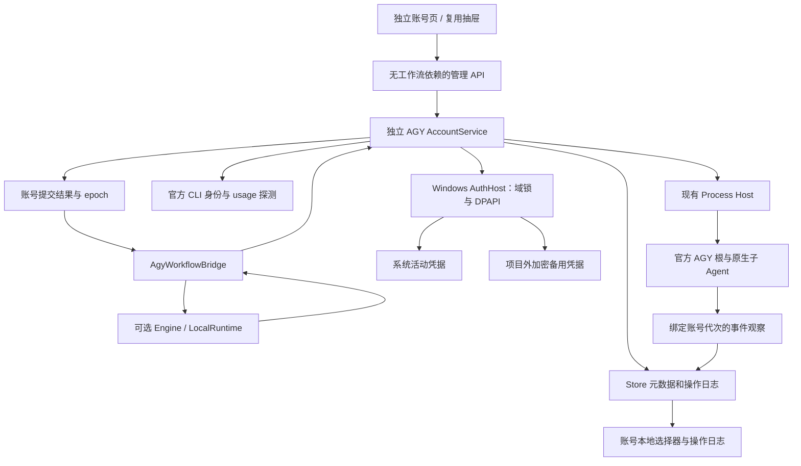
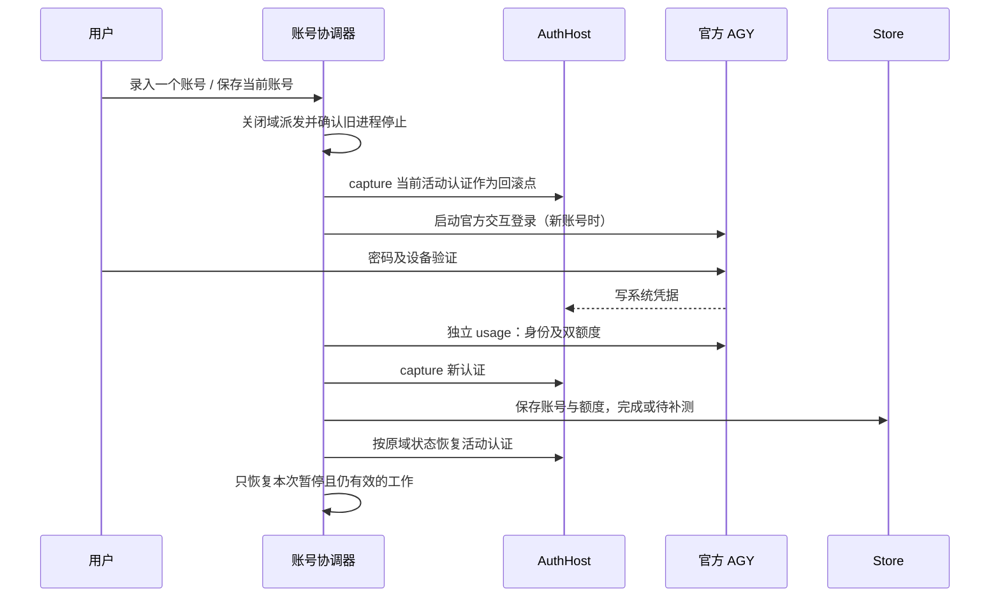
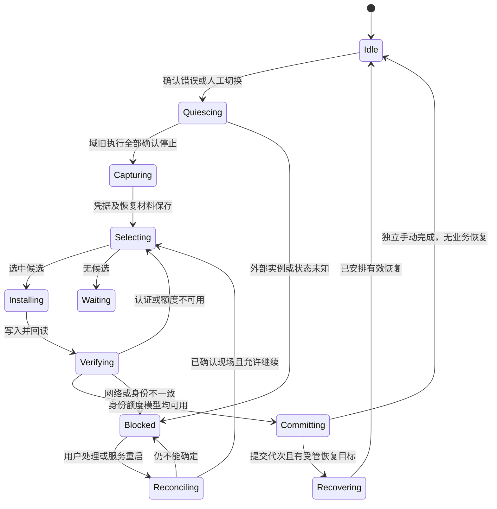
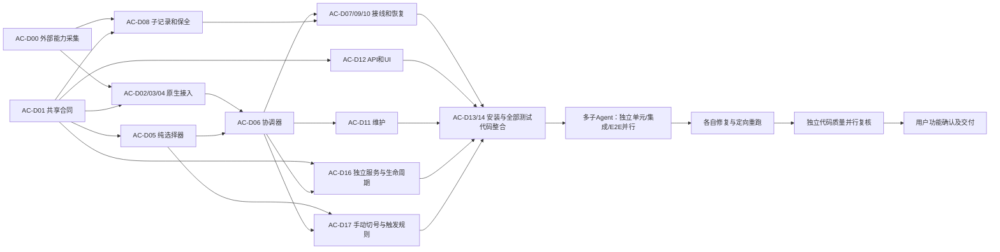

# DevFlow AGY 账号自动切换与额度管理开发计划

版本：v3.1，2026-09-20。状态：开发交接文档，未实施、未替用户批准。

v3.1 修订依据：用户新增“可以完全不使用 DevFlow 工作流，只配置、启动账号模块，在页面一键自动选号或指定账号手动切换；接入工作流时由额度限制错误触发自动切换”。本版在原文中同步修订模块归属、生命周期、手动操作、API、页面、任务和验收；不是另建局部补充计划。

代码基线：`C:\Code\system-handle`，HEAD `df18ee4d357fa939645be16fd233a1162bddbebe`，**以本次读取的实际工作树为准**。工作树已有大量暂存、未暂存及未跟踪改动，不能 checkout/reset 到 HEAD 来实施本文。本次只新增本文，没有修改产品代码、生产配置、凭据或工作流状态。

需求来源：[自动切换账号 շարունակ?](chatgpt-conversation://6aaf50e1-efd4-83ea-9186-915644340475)。本次通过 `read_thread` 读取了该对话的四轮完整文本，包含最终 v2.0 修订说明；工具返回附件为空，原文中的 `chatgpt-content-reference` 文档附件不可读取。因此本文完整承接**可读取对话中的需求**，不声称逐字修订了不可取得的附件。后续若提供原附件，先核对遗漏，再正式修订本文，不能让执行 Agent 自行删减需求。

执行模型直接按本文实施，禁止另建 `implementation_plan.md` 等实施计划；进度清单只引用原编号，不改变范围、算法、接口、顺序和验收。遇到本文列出的能力阻塞，提交具体观测与受影响编号，不用猜测接口或降低要求来完成交付。

## 1. 结论与必须先知道的边界

新增独立 **AGY 账号管理模块 `packages/agy-accounts`**，负责安全保存、额度记录、本地选号、串行切换、维护及操作恢复。它可在没有项目、工作流、Run、Engine 或 LocalRuntime 的情况下运行，提供独立账号页。工作流只是可选使用方，通过 `AgyWorkflowBridge` 接入执行许可、额度错误和业务恢复；核心模块不负责创建或恢复业务任务。

两条使用路径均为本期交付：**独立使用＝启动账号服务→录入/配置→启动管理→一键自动选号或指定账号切换→用户继续在自己的 AGY CLI 中工作；工作流使用＝同一模块启动后，受管 AGY Run 收到确证额度耗尽错误→同一切换事务→Bridge 按原角色恢复。** 不要求为使用账号功能创建空项目、虚假工作流或后台模型任务。

确定采用：**官方 AGY 完成登录和刷新，Windows Credential Manager 保存活动认证，当前用户 DPAPI 保存备用认证，官方 CLI `/usage` 提供账户及额度观测，SQLite 保存非敏感状态，现有调度器恢复任务。** 不安装或依赖第三方切号程序，不复制其 OAuth 客户端参数，不建立私有模型代理，不通过自建刷新请求维持备用账号。

本期运行目标是当前 Windows 宿主。账号域是“本机 + Windows 用户 SID + AGY 认证位置”，不是项目或 worktree。同一账号下的多个独立任务、原生子 Agent 仍可并行；**跨账号的模型请求、额度探测、登录及刷新不得重叠**。其他适配器不被 AGY 账号锁串行化。macOS/Linux 保留原执行行为并明确显示本功能暂不支持；原对话中的其他平台凭据位置仅作为背景，不冒充本期已实现能力。

有三项外部能力尚未在本机验证，必须由 AC-D00 先取得真实结果：

1. 当前 CLI 的身份输出、原始凭据保存/恢复及 access token 自然到期后的无交互刷新。
2. 官方 CLI 输出能否同时提供目标额度池的周余额、五小时余额及各自实际重置时间。**有 `/usage` 命令不等于有完整双窗口输出。**
3. 原会话跨账号可续接的实际边界，以及子 Agent 的创建、工作区、停止和恢复事件是否足以可靠观测。

如果双额度不可取得，账号可以保存为“待补测”，界面可以如实展示缺失，但**自动切号不能启用，整项功能不能宣告完成**。不得用 token 数、单一 `remainingFraction`、模型回答或模拟数据补出周余额。AC-D00 是接入原型和能力调查，不是要求平台审查每次开发任务的测试报告。

## 2. 需求追踪与原方案修订

| 编号 | 最终需求 | 实施任务 | 主要验收 |
| --- | --- | --- | --- |
| AC-R01 | 首次逐一官方登录；不保存密码、验证码、浏览器 Cookie | AC-D00、AC-D02、AC-D03 | AC-I01、AC-L01、AC-E02 |
| AC-R02 | 身份确认、凭据保存、双额度实测落库后才算录入完成；实测零额允许完成但不可运行 | AC-D01、AC-D03、AC-D04 | AC-U02、AC-I02、AC-E03 |
| AC-R03 | 周额度与五小时额度按账号、模型/额度池分别记录，带来源和时间 | AC-D01、AC-D04 | AC-U01、AC-U03、AC-L02 |
| AC-R04 | 先排除未重置的耗尽账号，再按本地周余额降序；未知不可当满额 | AC-D05 | AC-U04–AC-U07、AC-E04 |
| AC-R05 | 只核验选中的候选；普通页面刷新、倒计时、备用 token 到期不触发联网 | AC-D04、AC-D05、AC-D12 | AC-I03、AC-E05 |
| AC-R06 | 同一认证域只激活一个账号，跨项目/主子任务共享一次切换 | AC-D02、AC-D06、AC-D07 | AC-I04–AC-I08、AC-L03 |
| AC-R07 | 明确区分额度、速率、网络、认证、模型权限、业务测试失败 | AC-D04、AC-D07 | AC-U08、AC-I09、AC-E06 |
| AC-R08 | 切换事务可恢复，旧错误和旧回调不能影响新账号 | AC-D06、AC-D07、AC-D10 | AC-U09、AC-I10–AC-I12 |
| AC-R09 | 原角色、配置、工作区和成果保持；根及所有未完成子任务都有恢复去向 | AC-D08、AC-D09 | AC-I13–AC-I16、AC-L04、AC-E07 |
| AC-R10 | 只刷新活动账号，保存客户端更新后的完整凭据；区别 access 到期与 refresh 失效 | AC-D02、AC-D03、AC-D04 | AC-U10、AC-I17、AC-L05 |
| AC-R11 | 白天集中报告、串行检查与重新认证；夜间不等待交互登录 | AC-D11、AC-D12 | AC-U11、AC-E08–AC-E10 |
| AC-R12 | 双额度进度条、重置倒计时、快照时刻、候选排名、排除原因、认证健康和切换历史 | AC-D12 | AC-E01、AC-E04、AC-E11 |
| AC-R13 | 所有账号不可用时保存现场，按可信条件等待；人工停止优先于自动恢复 | AC-D05、AC-D10 | AC-U12、AC-I18、AC-E12 |
| AC-R14 | 兼容现有 profile/legacy 调用链、配置方案、原生会话方案和子 Agent 方案 | AC-D07–AC-D10、AC-D13 | AC-I19、AC-E13–AC-E17 |
| AC-R15 | 不增加模型监督、测试证明门槛、质量失败次数或静默计费/模型降级 | 全部 | AC-I20、AC-E15、AC-H06 |
| AC-R16 | 账号核心和页面独立于工作流；无项目、任务、Engine 也可配置、启动、停止和切号 | AC-D01、AC-D06、AC-D12、AC-D16 | AC-U17、AC-I24、AC-E18、AC-H07 |
| AC-R17 | 页面提供“一键自动选号并切换”和“指定账号切换”；后者失败不改选其他账号 | AC-D05、AC-D06、AC-D12、AC-D17 | AC-U18、AC-I25、AC-E19–AC-E20、AC-H07 |
| AC-R18 | 工作流通过可选适配器提交可信额度错误；独立模式不监听外部任务错误或自动恢复其会话 | AC-D07、AC-D09、AC-D16–AC-D17 | AC-U19、AC-I26、AC-E21、AC-H08 |
| AC-R19 | 手动/自动入口共用账户池、域锁与事务；外部进程未退出时只等待，不强杀或宣称热切成功 | AC-D06、AC-D10、AC-D16–AC-D17 | AC-I27–AC-I28、AC-E22–AC-E23、AC-H08 |

### 2.1 对原对话的明确修订

- 最终录入规则覆盖较早“无记录默认满额”：从未完成双额度初始化的账号不能参与自动候选。
- 切换依据是本地带时刻的快照。没有备用账号联网就不能保证“所有账号实时余额”；页面必须写“上次实测”。
- `预计已重置` 仅表示允许串行核验，不将旧实测 0 改成实测 100。
- 将“全局切号锁”落实为跨 DevFlow 数据目录的 Windows 用户认证域锁；现有 storage_root 锁不能替代它。
- 不把原文“DevFlow 接管所有关键子任务、逐项验证测试证据”的建议直接搬入产品。由原生父模型组织子 Agent，平台保存恢复所需记录、保护工作区、展示事实；不新增业务子任务审批器或报告验证器。
- 不承诺账号切换时旧子 Agent 实例一定复活。保证逻辑工作保留；可继续则继续，已退出且不可继续则按批准策略接替；状态不明的目标不重放。
- v3.1 将原 LocalRuntime 内部协调器提升为独立模块；原抽屉调整为独立页面的复用视图，工作流接口改为可选 Bridge。独立手动操作不生成业务 Run/RecoveryManifest；配置并启动模块不等于启动开发工作流。

### 2.2 与仓库其他计划的关系

下列文档本次都仍应视为独立计划，不能假定其拟新增类型/接口已经存在：

| 文档 | 本计划的边界与合并规则 |
| --- | --- |
| [模型配置与运行中切换计划](./DevFlow模型配置与运行中切换详细实施计划-20260918.md) | 账号不是模型。新增独立 `agy_account_policy`，运行账号写入 Run 的执行绑定；自动切号保持原 ToolProfile、模型、effort、purpose、review phase。该计划合入后复用其冻结配置，不重新实现模型配置中心。 |
| [子 Agent 可视化与会话交互计划](./DevFlow子Agent可视化与会话交互详细设计及开发计划-20260920.md) | 复用该计划的 conversation tree、control、RecoveryManifest 合同。本文实现 AGY 恢复所必需的最小子集并采用同一权威存储；其已落地时直接扩展，不能维护第二棵树。“用户暂停当前树”范围不变；“账号域切换”是另一个明确命名、覆盖共享身份的操作。 |
| [项目工作区与原生可见会话计划](./DevFlow项目工作区与原生可见会话统一方案及开发计划-20260920.md) | 原生可见模式不允许静默新建根会话。本计划新增唯一、显式的例外授权：启用任务自动切号时，用户选定 `recreate_after_confirmed_unavailable`。只有账号切换、原会话确实不可用、旧执行已结束时可接替并显示关联；默认 `exact_only` 仍阻断。不得为一般网络错误重建根。 |
| [轻量调度边界整改计划](./DevFlow轻量调度边界审计与整改计划-20260918.md) | 凭据域互斥、进程停止确认、身份核验是运行资源条件；测试报告/附件/验收映射不是切号、恢复、角色交接或质量计数条件。 |

只因新需求而变化的条款以上表为准；其他条款保留。执行前核对这些计划是否已合入，按实际文件合并本文合同；真实接口冲突交规划模型修订，不要求执行模型自行选路线。

## 3. 当前代码证据与改造入口

| 当前落点 | 已核对事实 | 必须改动 |
| --- | --- | --- |
| `packages/runtime/src/profile-runtime.ts`，`ProfileRuntime.invoke` | 通过 `profileForRun`、适配器 prepare/resume、`ProcessManager.start` 执行所有 profile 角色；sessionKey 使用工作流/profile/purpose；失败时仍保留会话 | 在准备/启动之间取得 AGY 账号执行许可；绑定账号代次；回调验证绑定；恢复输入接入 manifest |
| `packages/runtime/src/runtime.ts`，`LocalRuntime.execute` | legacy AGY 仍直接 `processes.start`，从 `conversation` 读显式会话 | 接入同一许可和恢复入口，不能只改 profile 链 |
| `packages/adapters/agy/src/native-adapter.ts`，`startSession` | 另有直接启动封装 | 接同一许可或收敛为受保护调用，避免旁路；先核对实际调用点 |
| `packages/adapters/agy/src/session.ts` | `agyArguments` 构造 stream-json、model、conversation；`observeAgy` 区分历史 error 与当前轮次 | 保留既有精确会话/模型/CWD 检查，增加账号绑定的错误事实，不能把旧 quota 当本轮 quota |
| `packages/adapters/sdk/src/invocation.ts` | profile AGY 使用 stream-json；有 conversation 就续接，否则 `--new-project` | 新会话接替只能显式传入恢复决策；阻止 resume 失败后意外落入无 ID 的 prepare |
| `packages/runtime/src/errors.ts`、`packages/contracts/src/runtime-failure.ts` | 通用分类把 429、quota、rate limit 聚为 `MODEL_QUOTA` | 保留兼容展示码；增加 AGY 专用的结构化原因供切号决策，不能只按字符串分类结果切号 |
| `packages/core/src/engine.ts`，`run` / `block` / `recover` | 失败进入 BLOCKED；quota 调 `scheduleModelRetry`；恢复扫描重建等待；网络另有自动重试 | 账号协调器接管的错误跳过原 quota timer/普通 repair 分支；用户 stop 和质量次数不受影响 |
| `packages/core/src/model-retry.ts`、`packages/runtime/src/recovery.ts` | 从 `resets in` 推导单个时间，5 秒 tick 到时 `resumeApproved` | 管理账号域的 quota wait 使用新域等待记录，旧路径只服务未接管运行 |
| `packages/process/src/manager.ts` | 白名单继承当前用户 HOME/USERPROFILE；stop 目前仅 manual/timeout；父流程通过 Host 启动 | 新增 account_switch 停止原因和精确进程归属；改变 HOME 不等于隔离系统凭据 |
| `host/DevFlow.WinHost/Program.cs` | 当前配置使用该 C# Host；支持挂起创建后入 Job、kill-on-close、job-status | 增加需要的停止确认/能力报告，不假定 Go Host 已替换它 |
| `host/devflow-host/main.go`、`process_windows.go` | 构建脚本产出 Go Host；其当前进程树/状态能力与 C# 不完全一致 | 补同一账号运行所需的 Job 归属与停止确认合同；两 Host 分别验收 |
| `packages/runtime/src/codex-account-quota.ts` | Codex 通过 app-server 读取账号额度，60 秒观察 | 保持其行为；AGY 不能套用 Codex 协议或复制为全账号定时探测 |
| `packages/runtime/src/native-activity.ts`、`run-telemetry.ts` | 已有额度投影，但无 AGY 账号池、账号代次和明确双窗口来源 | 只投影已经观察到的 AGY 额度；扩展来源及账号绑定 |
| `packages/store/src/store.ts` | SQLite entities/events/outbox；同步事务禁止 await；deduplicate 内部也是同步事务 | 新元数据复用实体；异步凭据写/CLI 调用用持久化操作日志，不包在 DB 事务里 |
| `apps/api/src/main.ts` | 无条件构造 Engine/LocalRuntime，执行 recover/dispatch 与 workspace observer | 新增不构造这些对象的 accounts-main.ts；完整模式先创建账号服务再注入 Bridge，账号 tick 独立于业务 dispatch |
| `apps/api/src/server.ts` | buildServer(engine) 将安全钩子、health、静态页与工作流路由绑定一起 | 抽取无 Engine 依赖的 base-server.ts；两种服务共用安全边界，管理路由仅依赖账号服务 |
| `packages/service/src/launcher.ts`、`open.ts`、`descriptor.ts` | launcher 固定启动 dist/apps/api/src/main.js，health 按 storage instance 识别服务 | 新增 accounts 启动模式及页面参数；复用已有完整服务，不重复启动域 owner；不为切换模式杀现有服务 |
| `apps/web/src/main.tsx` | React App 位于此文件，当前入口直接挂载工作台，没有独立账号路由 | 新增 /accounts 页入口，在挂载工作流 hooks 前分流；不请求 project/workflow 接口来显示账号页 |
| `apps/web/src/components/CurrentRuntime.tsx` | 已显示额度文本、快照过时状态 | 增加活动账号与切换状态，连接管理抽屉；不重复实现 token 统计 |
| `apps/web/src/components/ToolModelDrawer.tsx`、`workbench.tsx` | 有工具入口，但没有账号管理 | 新增单独账号抽屉；不覆盖现有模型表单状态 |

本机 CLI 的纯信息查询确认：路径 `C:\Users\yckj4798\AppData\Local\agy\bin\agy.exe`，版本 **1.2.7**；`--help` 有 `--conversation`、`--model`、`--effort`、`--mode`、`--print-timeout`、`--output-format`。未执行 `/usage`、登录、切号或业务模型调用。没有从当前用户凭据库读取 token。

当前 `devflow.yaml` 有 3 个 executor，Host 指向 C# 可执行文件，agent timeout 为 2880 分钟。新增机制不能把它们悄悄改成单执行器、Go Host 或其他超时。

## 4. 目标架构与域级约束



AC-D02 管身份边界，AC-D06 管一次切换，AC-D16 提供独立服务，AC-D17 统一触发语义，AC-D07 接工作流入口，AC-D08/09 保留工作流逻辑工作。账号模块不调用模型判断选哪个账号。

### 4.0 独立模块、运行形态和生命周期

确定采用同仓库独立模块与两种服务组合，不另造第二套账号数据库、凭据池或算法。`packages/agy-accounts/src/` 包含 service.ts、ports.ts、repository.ts、auth-host.ts、login.ts、enrollment.ts、selector.ts、wait-policy.ts、coordinator.ts、switch-operation.ts、reconcile.ts、maintenance.ts、manual-switch.ts。本仓库的 packages 是源码模块，遵循现有 TS 构建，不引入新包管理或发布系统。

依赖方向固定：账号核心只使用账号合同、Store/时钟/安全审计/凭据/进程基础设施端口；官方 CLI 适配由组合根注入。不得 import core/engine、runtime/*、工作流阶段服务或业务 RecoveryManifest，不接受 Workflow/Run 对象。工作流相关 agy-workflow-bridge.ts、agy-workflow-recovery.ts 留在 packages/runtime/src，引用账号核心；恢复业务与业务 CAS 在 Bridge 内执行。用模块边界检查防止类型依赖也倒置。

| 运行形态 | 组成和行为 | 入口 |
| --- | --- | --- |
| 仅账号服务 accounts | Store＋AuthHost/ProcessHost 适配＋AccountService＋管理 API/页面；不创建 Engine、LocalRuntime、WorkspaceObserver、工作流 dispatch/recover、MCP 或 planner token | 新 apps/api/src/accounts-main.ts；构建后 pnpm run start:accounts；页面 /accounts |
| 完整服务 full | 同一个 AccountService，再注册唯一 WorkflowBridge 和原工作流服务；既可手动切号，也可由受管工作流的额度错误触发 | 原 pnpm start；全局“AGY 账号”入口与 /accounts |

账号数据继续位于配置 storage_root 的同一 SQLite 中；两种形态使用相同配置/存储/端口和现有 controller lock，不能同时占用。完整服务已在运行时，“打开账号管理”直接访问它的 /accounts；仅账号服务已运行时，不再启动第二个完整服务，也不热创建 Engine，提示先正常退出账号服务再启动完整模式。不同 storage 的第二实例仍受认证域 mutex 约束。安装器提供“AGY账号管理”入口，调用 launcher 的 accounts 模式；不要求先启动工作流。

service_state 为 stopped/starting/running/stopping/blocked，与单次操作 phase 分开。打开页面可读本地配置、账号和历史；“启动管理”只取得域拥有权、回读本地活动项并恢复有效账号操作，**不自动切换、批量探测、启动工作流或开发 CLI**。未录入账号也能启动以完成录入；能力不全时只禁用对应操作，不能把业务会话/子 Agent 恢复能力作为独立手动功能的启动条件。身份/凭据切换/真实双额度能力仍是完成手动切号的必要条件。

“停止管理”拒绝新操作，安全收尾/取消在途事务并保留最后已核验活动身份，不删凭据、不调用 logout。已有受管 Run 默认继续当前账号直至结束，停用自动切号；在它们退出前保持 stopping 与域锁，不接受新受管 AGY Run，不以停止账号模块为由强杀业务。需要立即退出由用户使用现有任务暂停/服务关闭入口，再确认 Job 退出后释放锁。独立模式不终止外部 CLI。停止意图必须持久化，重启不能使旧自动等待生效。

enabled=false 为安装默认；用户“启动管理”持久化为 true，普通服务重启按此意图重建模块，停止则设 false。这两个动作不改变 workflow 阶段或模型配置。正常浏览页面及本地5秒 tick 不访问备用账号；仅已经提交的有效操作可以在重启后继续，空闲启动没有隐式操作。

### 4.1 唯一域拥有者

- 新增独立 Go 小程序 `host/devflow-auth-host`，Windows 实现 OS API，非 Windows 返回能力不支持。它只做锁、凭据、加密文件及安全元数据操作，不执行模型请求、不联网、不替代 Process Host。
- Node 通过 pipe NDJSON 与它通信，启动使用 `windowsHide: true`。认证内容只在该程序内存和系统/加密存储间流转；Node、stdio 响应、数据库均只拿到不可解密的引用与允许公开元数据。
- Windows 命名 mutex 使用机器范围名称，名称包含当前用户 SID 和固定 provider credential realm 的 SHA-256，不包含 storage_root。跨登录 session 也须互斥；ACL 仅当前用户及 SYSTEM。创建失败明确阻断，禁止退回弱锁。
- 管理模式启用后，域锁保持到所有受管 AGY 进程结束并关闭协调器。第二个 DevFlow 实例若拿不到锁，其 AGY 任务显示“其他实例正在管理账号”，不能绕过锁启动；Codex 等仍可运行。
- helper/控制器失联：立即关闭 AGY 派发，停止本实例受管 AGY Job，重新确认旧 Job 全部退出才允许新 owner 激活。mutex 被遗弃不代表旧进程已经退出。
- 外部 AGY CLI、桌面宿主、remote-control daemon 不一定服从该锁。在启动身份请求或执行切换前检查真实PID、路径、SID、创建时间，不能按进程名全局杀。未确认停止时操作进入external_owner或waiting_external_exit，不写新凭据；这不妨碍账号服务本身启动并展示本地信息。
- 检测和回读只能识别外部并发，不能从操作系统层阻止用户之后启动另一个未受管程序。产品只保证管理范围内的串行；自动模式需专用受管认证域使用约定。外部凭据发生变化立即冻结，不能自动覆盖回去。
- 同一公网 IP 的其他电脑不在本机控制范围。本期采用单执行宿主，不实现分布式身份租约，也不声称串行能保证不触发提供方限制。

### 4.2 同账号并行与切换屏障

每个受管 AGY 根进程通过 Bridge 从核心 acquireUsagePermit 得到 `{realm_id, account_id, auth_epoch, permit_id}`；独立登录/探测也使用对应 usage kind；子进程继承身份归属。permit 不强制携带 workflow_id。同账号业务 permit 可多个；切换时关 admission，完成停止确认才可激活下一身份。用户自行启动的外部 CLI 不伪造为受管 permit，也不因出现该进程就关闭账号模块；其存在阻止换身份/登录/联网探测等互斥操作。

锁顺序固定：域协调操作排队 → 短 Store 事务 → 释放事务 → 停止/文件/CLI I/O → 短事务提交。不能在持有 workflow exclusive 时等待整个域；不能在 Store.transaction 内 await。协调器不持有数据库写锁等待另一工作流结束。

未启用自动选择的 AGY 任务同样登记身份/permit，才能知道其正在使用该域；是否允许为切号暂停它由**域管理设置**明确授权。启用管理时展示影响范围，保留用户原来手动暂停/等待输入的状态。与域管理不兼容的外部任务只阻断切号，不强制接管。

## 5. 非敏感数据合同与安全存储

以下接口为**拟新增 DevFlow 合同**，不是官方 AGY API。新增 `packages/contracts/src/agy-account.ts`，由 `index.ts` 导出；所有写入经过 zod 校验。时间统一 UTC ISO；需要排序时解析毫秒，前端按配置时区显示。

### 5.1 账号、认证健康与额度

```ts
type AccountState = "pending_quota" | "ready" | "waiting_quota"
  | "reauth_required" | "disabled" | "incompatible";
type WindowKind = "five_hour" | "weekly";
interface AgyAccount {
  id: string; realm_id: string; revision: number; alias: string;
  identity: { subject?: string; email: string; verified_at: string };
  secret_ref: string; credential_revision: number; state: AccountState;
  enrolled_at: string; enrollment_completed_at?: string;
  last_used_at?: string; disabled_reason?: string;
  auth: {
    has_refresh_credential: boolean;
    access_expires_at?: string; refresh_expires_at?: string;
    refresh_expiry_source: "not_provided" | "provider_reported";
    last_authenticated_request_at?: string;
    last_refresh_verified_at?: string; last_auth_error?: string;
  };
}
interface QuotaWindow {
  kind: WindowKind; duration_minutes: 300 | 10080;
  remaining_fraction: number | null; // 0..1；null 不参与数值排序
  reset_at: string | null; observed_at: string;
  status: "observed" | "missing" | "unsupported";
}
interface AgyQuotaSnapshot {
  id: string; realm_id: string; account_id: string; auth_epoch: number;
  pool_id: string; model_ids: string[]; plan_tier?: string;
  source: "official_cli_usage" | "official_cli_event";
  cli_version: string; parser_revision: number; observed_at: string;
  windows: QuotaWindow[];
  exhausted?: { window: WindowKind | "unknown"; observed_at: string };
}
```

实际支持其他周期的账号可显示原始周期，但不将日额度改名五小时、不把免费周额度构造为双窗口；本需求的自动池仅接受经 AC-D00 确认的双窗口套餐/目标模型。缺少 reset 不等于余额未知：已实测正余额可以展示；耗尽而 reset 未知时只能等待人工补测。自动能力启用需要版本能力调查证明所需重置信息可以取得。

录入完成条件是身份核验、密文持久化、**目标池两个余额均已实测并保存**。零值合法；双窗口中任何一项 missing/unsupported 则 pending_quota。新选模型若映射到尚未初始化的额度池，要先补测该池，不能借用旧池的余额。

`reset_due`、`stale`、候选排名是按当前时间计算的展示/选择状态，不覆盖上述实测值。旧快照追加保存；最新索引不能接收更旧的 observed_at 或错误账号代次回调。

额度联网触发点固定为：首次录入、显式补测、候选激活、确证耗尽后的最终查询、日间用户启动的维护，以及最后一个活动根 Run 正常结束后的当前账号收尾快照。收尾查询按域合并且60秒内至多一次；失败保留旧快照，不改变业务完成。运行中如果官方事件附带真实套餐额度可以被动更新；没有该事件时就显示上次实测，不能拿 token 计数补齐。

### 5.2 实体及索引

复用当前 SQLite `entities`，不引入 MySQL、第二个业务数据库或 ORM。

| kind / key | owner | 内容 |
| --- | --- | --- |
| `agy_account / account_id` | realm_id | 账号非敏感元数据 |
| `agy_quota / account_id:pool_id` | realm_id | 最新快照 |
| `agy_quota_history / snapshot_id` | account_id | 有界历史，每账号每池保留最近 1000 条/90 天，先删过期历史，不删最新 |
| `agy_account_policy / workflow_id` | workflow_id | immutable revision 历史引用、自动开关、恢复策略、允许账号集合 |
| `agy_realm / realm_id` | realm_id | owner、active_account_id、auth_epoch、phase、revision、pending_operation_id、service_state、desired_enabled、control_generation |
| `agy_account_settings / realm_id` | realm_id | 独立默认目标模型/额度池、workflow_auto_switch、域暂停授权和维护配置；不含 workflow_id |
| `agy_usage / permit_id` | realm_id | consumer_id、usage kind、account/epoch、进程归属和状态；工作流绑定由 Bridge 另存 |
| `agy_account_operation / operation_id` | realm_id | 录入/补测/切换/维护的持久化步骤、去重键、尝试集合、trigger、selection、required_pool_ids、control_generation 和错误；工作流来源为可选引用 |
| `agy_domain_wait / realm_id` | realm_id | 下一次允许尝试时刻、阻塞窗口、源 epoch、目标工作流版本 |
| `agy_recovery / recovery_id` | workflow_id | 恢复清单及逐目标结果；引用既有 tree/session binding |
| `agy_account_audit / audit_id` | realm_id | 公开操作历史与递增域事件序号 |
| `agy_capability / executable_fingerprint` | realm_id | CLI/解析器/Host 实测能力，不含凭据 |

业务 workflow events 只引用 account_id/operation_id/安全摘要，保留现有 event_seq。全局账号页通过本地 GET 取 realm revision 和 audit cursor，不伪造 workflow_id。操作受理在同一同步事务中保存 request_id + 请求摘要 + operation + 域 pending，返回 202；后台阶段在 I/O 前后各写日志。现有 outbox 的消费器只处理 dispatch 两类，**不能只 enqueue 新 kind 却不加消费分支**；本功能直接消费 `agy_account_operation` 非终态记录，由 `tick()` 和启动 reconcile 驱动。

### 5.3 Run 的账号绑定

核心操作 trigger 为 manual_auto/manual_explicit/workflow_quota/workflow_auth/enrollment/maintenance；selection 为 `{mode:"auto"}` 或 `{mode:"explicit",account_id}`。手动来源只保存本地用户/request_id，不要求 run_id。工作流来源必须由已注册 Bridge 提供受信任 fact 引用，HTTP 不能伪造 workflow_quota。核心事件只含 operation/realm/account/epoch 和 opaque consumer 引用；业务角色、计划、恢复清单留在下述工作流合同。

扩展 `Run` 和相关 process_record：

```ts
interface AgyRunBinding {
  realm_id: string; account_id: string; auth_epoch: number;
  account_policy_revision: number; credential_revision_at_start: number;
  account_settings_revision_at_start: number;
  permit_id: string; source_run_id?: string; recovery_id?: string;
}
// Run.agy_account?: AgyRunBinding
```

任务策略合同为 `{workflow_id, revision, auto_switch: boolean | null, allowed_account_ids: string[] | null, recreation_policy: "exact_only" | "recreate_after_confirmed_unavailable", night_pool: "normal" | "strict", created_at}`。auto_switch=null为继承域设置，新策略默认null；具体布尔值及域settings revision在Run派发时冻结。allowed_account_ids=null表示全部启用且合格账号，空数组表示无候选。每次保存追加不可变历史，最新索引引用revision。显式任务策略优先，模型不能临时放宽账号/夜间策略。

绑定冻结在 Run，不能在 A→B 后回写旧 Run 的 account_id。新 Run 引用旧 Run/recovery_id；同一账号期间官方 token 更新只提高 credential_revision，不改变 auth_epoch。每次替换成另一账号、回滚到原账号都分配新的单调 epoch，绝不复用旧值。

### 5.4 凭据安全实现

新 helper 私有目录：`%LOCALAPPDATA%\DevFlow\agy-accounts\<realm_id>\`。它不属于项目、Git、普通日志或工作流备份；文件 ACL 仅当前用户与 SYSTEM。用 DPAPI 当前用户范围 `CryptProtectData`，不使用 `CRYPTPROTECT_LOCAL_MACHINE`。密文包包含原始 Credential 记录所需内容与 envelope 版本；敏感字节不经 HTTP/MCP、参数列表或普通环境变量。

Windows 活动项以兼容性核查确定的 `CRED_TYPE_GENERIC / gemini:antigravity` 为固定允许目标；开源当前实现使用 UTF-8 JSON 和 username `antigravity`，但程序保存/恢复原始字节及真实元数据，不能自行重新拼 token JSON。`CredWriteW` 更新后回读校验，禁止默认先 delete 再 write。`CredDeleteW` 仅在官方首次登录确需空认证位置且已备份时用于这一项，或恢复“原来不存在”的状态。

helper 命令固定为 `capabilities`、`inspect-active`、`capture-active`、`activate-saved`、`restore-backup`、`clear-active-for-login`、`delete-saved`。输入只接固定 schema 的 account/operation 引用；路径由 helper 生成并校验。响应只返回存在性、opaque ref、revision、到期元数据、操作结果。helper 内部使用加密包校验值比较，不把 token 或其摘要当公共账号 ID。

先原子写密文临时文件、flush、rename，再返回 secret_ref，再提交 DB。写入失败不改 DB；DB 提交失败保留密文为 orphan，人工/维护按日志清理，不能误删当前回滚点。当前账号停止后再次 capture，防止保存了旧 refresh token。无法保存最新凭据时不覆盖活动项，转 `vault_write_failed`。

## 6. 官方能力适配与账号录入

### 6.1 AC-D00 能力调查合同

开发起点先产出 `docs/test/AGY账号能力验证-20260920.md` 与脱敏 fixtures，记录 CLI 绝对路径、版本/文件摘要、Host 能力、官方命令参数、字段来源、真实观测和不支持项。不能从第三方 README 的“已支持”推导本机已支持。

调查按顺序完成：

1. 仅读取纯信息 `--version`、`--help`，记录现有认证来源候选，不输出 token。
2. 用户在可介入窗口允许真实账号验证后，暂停认证域工作；保护当前凭据；用当前已登录账号独立执行 `agy -p "/usage" --output-format text --print-timeout 30s`，隔离 cwd，无业务任务会话参数。实际版本如不接受该命令，记录 stderr/退出码并停止相关能力接入。
3. 采集真实且完整的身份字段、目标模型/额度池、两个余额及 reset。解析器只接受已验证的明确标签/结构，邮箱必须来自官方账户区，不能任取输出中第一个邮箱。服务端 subject 若不可得，用官方输出的规范化邮箱绑定，不声称拥有稳定 sub。
4. 验证 A→B→A：每次先完全停止旧身份、capture、activate、回读、官方身份与额度核验。验证额外磁盘 token 文件是否参与读取；无法确定优先级或发现双来源不一致，返回 `credential_source_ambiguous`，禁止只换其中一份继续。
5. 使用自然过期的 access token，验证官方 CLI 无交互取得有效授权，capture 后对照 expiry/revision 与成功请求。不得篡改 expiry 制造通过，不把一次未过期访问成功当刷新验证。
6. 在一次受控根/子任务上记录真实 `subagent_info` 和进程/工作区/恢复事实；明确能停止到哪里，哪些背景工作由独立宿主拥有。

只有官方输出字段齐备才实现相应解析器版本。`retrieveUserQuotaSummary` 是开源采用的内部端点，本文**不把它接入为 fallback**，也不让执行者自己决定改用私有接口。若官方路径不满足双额度，提交 AC-D00 阻塞事实，由规划角色针对接口来源正式修订；未依赖外部能力的合同、选择器、UI 和测试代码可继续写，但不能启用功能或宣布全量完成。

### 6.2 首次录入、导入当前账号、重新认证



界面一次只能录入一个账号。新增账号时，capture 原活动项后仅清空经确认的活动认证来源，使官方登录不会静默继续 A；不调用 `/logout` 去清整个会话缓存。必须在 AC-D00 证明清空动作不会损坏工作状态，认证来源不清楚则不执行。

新增 `packages/agy-accounts/src/login.ts`：由 Windows 交互启动器创建**用户可见**的官方 AGY 终端，受独立 Job 管理，命令参数固定为认证交互所需项。现有 ProcessManager 默认 stdin 关闭且隐藏窗口，不能直接冒充登录终端。用户只在官方流程输入密码/设备确认；账号模块显示“等待官方登录完成”，不代理登录表单。取消时先终止登录 Job、确认结束，再回滚，防止迟到 OAuth 写入覆盖下一账号。窗口超过15分钟同样回滚。此流程可在零工作流的独立服务中完整执行。

导入当前账号不强制重新登录；同样先核验身份与双额度。重复邮箱/subject 更新同一账户 revision；重新认证期望 B、实际登录 A 则拒绝绑定，恢复操作前状态。成功登录但额度读取失败：保存授权、标记 pending_quota，可直接补测，不要求重新输密码。读取成功但 0：完成录入、标记 waiting_quota。

账号密码重置/设备验证等导致授权失败时，`reauth_required`。网络超时不能写成授权失效。夜间自动候选探测只启动非交互 CLI、无 TTY、超时 30 秒；出现 auth required 就停止，标记需认证并尝试下一个候选，不开登录窗口等待。

### 6.3 刷新与到期语义

access token 是短期访问凭据，refresh token 是获取新访问凭据的授权。具体到期读真实字段；Google 常见 access token 寿命不能硬编码为 AGY 合同。refresh 到期没有字段时存 `not_provided`，不是永久有效或登录后固定六个月。

仅当前活动账号由官方 AGY 按需刷新。备用账号 access 过期属于正常待激活状态，不告警“必须登录”，不设保活定时器。每次切出、正常退出及已观测官方凭据更新后由 helper capture 最新完整包；不自制 OAuth 请求，不用空字段覆盖有效 refresh token。

`last_authenticated_request_at` 与 `last_refresh_verified_at` 分开。仅有旧 token 已自然过期、新 expiry 已更新且官方请求成功等充分事实，才更新后者。无证据只显示“刷新能力未验证”。明确 refresh_expires_at 落在夜间区间内时排除该账号；未知有效期保留“不确定”，不能承诺整夜不会被服务端撤销。

## 7. 本地选择算法、等待和错误分类

### 7.1 目标额度池

每次调度从冻结 Run 的实际 AGY 模型求 pool_id；新任务 native-config 必须先解析当前实际模型，不能凭 profile 名称猜测。多任务/子 Agent 的模型可不同，保存每个模型映射；候选对本次要恢复的一组模型都需有有效访问能力和双窗口记录。

Run 解析由 WorkflowBridge 负责。独立页面使用保存的 standalone_model_id（首次配置时明确选择）及经验证映射得到 required_pool_ids；未选模型或池未初始化显示缺失原因，不拿默认工作流模型代替。API 接受实际 model_id 并由服务端映射/校验，不接受客户端编造 pool。手动切号同时影响受管工作时，将该模型与消费方必需池合并；显式目标不能满足时拒绝，不更换任务模型。

新增 `Run.effective_model_id`、`Run.effective_effort` 作为本轮解析结果，不反写用户 ToolProfile。native-config 的解析来自 AC-D00 同时核查的独立 `agy -p "/model"` 文本或已有真实配置/运行事实；模型或强度无法确定时，不开启该 Run 的无人自动切号，明确显示缺失字段。恢复时将已确定值显式传给 CLI，避免换账号后 native-config 默认值变化。CLI 文件版本/摘要变化使相关 capability/parser 资格失效，重新核验前不使用旧版本的肯定结论。

若候选只支持集合的一部分，不临时换模型：先恢复可用且匹配的任务；其他任务保持原模型的明确等待。域已有任务运行时不为另一池的单个失败立即抢占账号；先让域协调器关闭 admission、按本地状态决定是否值得一次域切换。其他适配器不进入此集合。

多任务要求不兼容时按确定规则分批：先尝试所有受影响任务的共同允许账号/必需池集合；共同集合为空，选择等待最久的有效工作流为anchor（时间相同按workflow_id），按它的允许账号与必需池选优。切换后仅恢复在该账号下同样合格的其他任务，剩余任务明确等待下一次域空闲或额度中断；不能为其中一个任务绕过其账号白名单，也不能在B/C之间反复抢占。

### 7.2 确定排序

`selectCandidates(accounts, snapshots, pools, now, policy)` 是纯函数，返回排名、被排除原因和 nextEligibleAt，不读文件、不联网。

1. 排除 disabled、incompatible、reauth_required、pending_quota、不在任务允许集合、缺目标池、已知模型无权访问、操作冷却期未到的账号。
2. 任一必需窗口最后实测为 0：reset 未知则排除；`now < reset_at + 60s` 则排除；其后可成为 `reset_due` 待核验候选。
3. 最近一次错误确认耗尽但无法确定窗口：保留两个旧余额，不双写 0；设置账户/池不可用，只有可靠恢复时间或用户主动补测成功才解除。
4. 已初始化的周窗口到期后，排序使用 `projected_weekly = 1`，仅表示预计重置；未到期使用实测 fraction。从未初始化的 unknown 没有该投影值。
5. 多池任务按各必需池 projected_weekly 的最小值降序。并列按 last_used_at 更早、enrolled_at 更早、account_id 字典序。5h 只作可用性过滤，不挤占“周余额优先”原则。
6. 旧正余额快照仍可用于排序；超过 24 小时显示陈旧，不触发后台查询，激活后必须核验。已知耗尽/认证错误优先于较旧正余额。

例：A 周 90%、5h=0 且半小时后重置，B 周60%/5h40%，C 未初始化，D 周0未重置，E 周80%、5h预计已重置：本轮顺序 E、B；A/C/D 不激活、不探测。

当前账号仍可用时保持它，不因排序变化、新任务进入或本地倒计时自动抢占。第一次接管需要选初始身份，或确证当前账号不可用，或用户主动切换/维护时才重新选。工作流正常运行不因另一账号周余额更多而切号；独立模式没有工作流错误订阅。

### 7.3 候选核验与有限循环

冻结一次操作的 candidate set，`attempted_account_ids` 每候选只作一次业务额度核验（同一调用的短网络重试另计）。B 核验后余额变低且未尝试 C 的本地周余额更高，可停止 B 再串行试 C；不得并发查询。对已经核验合格的账号保存有效结果，最后选择当前已知最优可用账号，不能因 attempted 集合排除它而错误宣布全池不可用。

同轮最多 20 个账号、300 秒；超出上限结束为等待并说明原因，不开启无限下一轮。回装已核验账号时仍需停止当前身份、回读和账号验证；若快照已超过 120 秒，不能将其当最终准入结果，结束本轮并进入短期等待，不无限延长切换。模型访问探测结果按 account + credential revision + model + CLI fingerprint 缓存 24 小时；失效时只对最终候选作一次隔离最小调用，不更改模型。

一个 candidate 出现网络/TLS/5xx：同账号重试最多 2 次（3s、10s），仍失败则域 `network_wait` 60 秒；不因此标坏全部账号或继续遍历。对服务端明确 Retry-After 的速率限制遵守实际时间。时间到只恢复当前活动身份的请求机会，不自动开启全池检测。

### 7.4 错误分类

| 事实 | 处理 |
| --- | --- |
| 当前 Run 的结构化错误明确 exhausted，或同账号 usage 窗口实测为 0 | 记录实际原因/窗口，允许一次域切换 |
| 只有 429 / rate limit / RESOURCE_EXHAUSTED，没有套餐耗尽事实 | 短期受限；读取当前账号一次 usage 佐证，不能直接清空两窗口或遍历账号 |
| 当前认证 `invalid_grant` / 非交互 authentication required | 当前账号 reauth_required；串行换可用候选 |
| 模型不存在/无权限 | 只标该 account-model 不可用，不计为额度耗尽，不换模型 |
| DNS/TLS/代理/5xx、磁盘、端口、CLI版本问题 | 对应现有恢复路径，不切号 |
| 原生权限拒绝、用户 stop、测试断言失败、代码审查 changes_required | 保持原语义，不切号、不把它们标成账号问题 |
| 旧 auth_epoch 的 error、被引用的日志内容、模型回答中的 quota 字样 | 仅显示来源内容，不触发任何账号操作 |

工作流层的 AgyFailureFact 必含 run_id、account_id、auth_epoch、conversation_id（若有）、事件类型/step或offset、observed_at、reason、可选 reset_at。Bridge校验绑定及源事件去重后提交核心；独立登录/probe只产生账号与操作范围的观测，不为它们虚构run_id。通用classifyFailure只作展示/兼容，不能独立触发轮换。

### 7.5 全部不可用

单账号最早可用时刻是其全部阻塞条件的最大值：`max(weekly_reset, five_hour_reset, cooldown, retry_after) + 60s`；全池是各账号可计算时刻的最小值。任一必要阻塞时间未知，该账号不贡献可自动唤醒时刻。夜间还需满足授权有效期策略。

保存 agy_domain_wait，复用账号服务5秒 tick **只比较本地时间**；仅有效工作流自动请求可以到时开启一次串行选择，不提前把余额写满。暂停、禁用功能、计划/配置更改、取消任务时对源版本 CAS，旧 wait 不得重新拉起任务。手动操作全池不可用时结束为 no_eligible_account，只显示预计可用时间，不在用户几小时后使用外部 CLI 时突然自动切号；用户需再次点击。无可信时间时等待人工补测。

### 7.6 独立页面的两种手动切换

1. 配置并启动后，主按钮为“自动选择并切换”，每行另有“切换到此账号”。一次点击提交持久化操作，不要求选择项目/任务或重复确认；已保存域暂停设置为其受管任务影响授权。外部进程阻塞是执行条件，不伪装为批准弹窗。
2. 自动选号使用本地周余额排序和串行核验；人工点击不套用运行中 sticky 偏好。当前账号可以是最优结果，返回 already_active 并显示“当前账号已是最佳可用”，不伪造 A→A 切换/递增 epoch。候选失败按原有限循环尝试下一名。
3. 显式目标只核验该账号。已知零额未重置、禁用、需认证、初始化不完整、模型不兼容时，在写凭据前拒绝并解释。激活后才发现额度不足/授权失效则记录结果、安全回滚原身份并返回 target_unavailable，绝不自动改选 C。目标就是当前账号时返回 already_active，不改凭据。
4. 外部 CLI/桌面/daemon 仍在时进入 waiting_external_exit，显示 PID、路径及“请退出这些 AGY 会话，退出后本次操作会继续”；只检查本地进程，不批量查额度、不强杀、不向外部会话注入恢复提示。等待最多300秒、可取消；超时结束，不能无限挂起后突然切号。
5. 外部进程退出后重验 active fingerprint/epoch、设置版本和启动意图，再进入事务。外部登录改过凭据则 external_change，停止并要求导入/处理，不能覆盖未知身份。写入窗口再次出现外部进程时冻结，不能声称从 OS 层阻止了未受管进程启动。
6. 成功提示“活动账号已切为 B，新启动的 AGY CLI 将使用该账号”。不让缓存旧凭据的运行中 CLI 热切换，不自动重启或恢复外部任务。独立操作不创建 Run/conversation/业务恢复清单，直接 committing→completed。
7. 完整服务中手动切号仍走域屏障和 Bridge 保存/停止/恢复受管任务，用户暂停者保持暂停。自动同源错误合并；并发手动不同意图返回409 operation_in_progress 与现有操作链接，不取消或改写已执行目标；手动操作中的旧错误只附加事实。提交后旧epoch错误无权再切一次。

## 8. 一次切换事务与故障恢复



状态属于账号操作，不添加新的业务开发/验收阶段。UI 可分别显示“身份已切换”“恢复已安排”“已观察到重新运行”。

### 8.1 顺序与原子边界

1. CAS 比较 realm revision、source auth_epoch、service control_generation；手动操作按request_id去重，工作流来源由Bridge额外验证Run/任务状态并按 `{realm_id, source_epoch, reason-group}` 合并。同批根/子额度错误加入同一操作，不要求手动请求携带虚假Run。
2. 关域 admission。保存受影响运行清单及原 purpose/stage/profile、review phase、用户暂停标志、剩余执行时限；取消这些运行的旧 quota/网络重试，不碰其他工具的重试。
3. 先保全已知子工作区，再停止拥有的根/后代/探测 Job。原生外部宿主需逐目标确认；Stop Hook 的 fullyIdle 只能佐证。停止请求返回不等于停止确认。
4. 正在跑的构建/测试/脚本随所属 Job 停止并记录 interrupted，不能记 passed。独立服务按原保留策略，先确认其不使用 AGY 身份。不能重放可能已提交的远程操作。
5. 停止确认后由Bridge取得受管工作的最终状态，由核心保存最新A凭据。仅额度错误来源查询A一次作耗尽后最终快照；查询失败保留原事实，结果双窗口可用则重新分类，不无理由自动换号。人工指定切B不因A仍有额度而取消，也不额外查询非必要备用账号。
6. 选择 B；先写 `install_intent` 和 before/target secret refs，helper 分配新 epoch、activate、回读。`installed_unverified` 持久化之前不启动模型任务。
7. 非交互 CLI 验身份和额度；实际身份不符立刻冻结域，不把 A 的额度写到 B。核验模型权限只在缓存无效时最小调用，权限模式不扩大。
8. 小事务提交 active_account、epoch、quota snapshot 和账号提交事件；无业务消费者时标 completed，有消费者时等待Bridge消费提交事件并建立唯一业务recovery intent。核心不直接写工作流恢复表。账号提交与业务恢复必须各自幂等，崩溃不会因缺少Engine而再次换账号。
9. 释放屏障给同账号合法消费方。无受管恢复目标时核心直接完成；有目标时发布幂等提交结果给Bridge，由它调度恢复。协调器不等待业务任务完成。身份成功与恢复目标阻塞分开显示，不把所有任务重头启动。

切出 B 再试 C 前同样停止 B、capture B、留出默认 3 秒切换间隔并遵从 Retry-After。该间隔用于避免请求交叠，不宣称它能规避风控。账号切换过程不调用提供方 revoke/logout。

### 8.2 崩溃恢复表

| 最后持久状态 | 启动 reconcile 必做事项 |
| --- | --- |
| quiescing / capturing | 重新核对拥有的 Job、外部进程和快照；不因重启就认定停止 |
| install_intent，未记安装成功 | helper 比较当前凭据与 before/target 的加密记录；已是目标则进入核验，仍是旧项则幂等安装，均不匹配则 external_change |
| installed_unverified / verifying | 未确认新身份，禁止业务派发；结束遗留 probe，重做目标身份/额度验证 |
| committed / recovering | 不再次轮换；按 recovery_id 查询目标 Run/投递事实，补未投递，已投递但结果未知先核查，不能盲目重发 |
| rollback_required | 仅在当前项仍是本操作写入且未被外部修改时回滚；恢复也创建新 epoch；原账号没额度时只恢复凭据，不启动业务 |
| waiting / cancelled / completed | 根据有效 wait/用户意图继续；cancelled/completed 不重放 |

真实凭据与 SQLite 不能做一个 ACID 事务；以上 write-ahead journal 和幂等回读是必要实现，不用“数据库事务包住 switchAccount()”替代。发生崩溃后自动恢复只限既有有效账号操作；普通控制器重启仍保留现有 RECOVERY_REQUIRED 行为，不擅自恢复历史人工暂停任务。

## 9. 根与子 Agent 的工作连续性

本节仅属可选工作流接入层；独立模式不加载它。工作流恢复能力缺失不能阻止已具备凭据/身份/额度能力的独立手动切号。外部 CLI 会话由用户及官方 CLI 自行管理，不声称已受 DevFlow 保全。

### 9.1 逻辑工作与原生会话分离

复用/实现子 Agent 计划的逻辑 conversation 节点、native_session_id、parent_id、root generation、工作区引用。根的权威源为现有 native_conversation，原生会话计划已落地时为 session_binding；旧 `conversation` 只做兼容投影，不成为第二权威源。

绑定至少包括 workflow、role/purpose、profile、account、logical_work_id、native session、generation。账号切换不能把所有角色归并 implement；quality_review 保留人工前后 phase，planner_takeover、functional_fix、merge_conflict 保留原 assignment/receipt，aside 保留独立问题语义。

### 9.2 工作保全

新增 `packages/runtime/src/agy-recovery-checkpoint.ts`：从已有计划、Run、conversation、原生工具事件和工作区构造确定性恢复清单；不在耗尽后向旧账号请求总结，不新增监督模型。

记录根/子任务原始目标或可读取引用、父子关系、native IDs、工作区、未完成原任务编号、已有结果引用、用户取消标志、最后观测、在途命令归属。创建事件到达即记录，不能只在最终 result 才存子任务。

写任务优先使用任务/项目持有的持久化目录，禁止以临时目录复制切换全部 `.gemini`。对于原生临时 worktree，运行时持续保存已完成写入的 tracked diff（含二进制）、批准范围内的 untracked 代码/资产与文件清单；切换不调用会清理 worktree 的 kill-agent API。停止拥有的进程后做最终快照。受保护的原路径仍在则优先原路径恢复。

checkpoint 是项目运行材料，按项目文档位置约定保存索引；大文件快照放该任务私有恢复目录，不进入正式源码提交。忽略依赖、构建缓存和凭据文件，保留原工作区本身。大小限制/读失败/临时目录可能被外部宿主清理时显示具体未保全项，不宣称该子任务可无人恢复；不得为了切号删除目录或 reset 用户修改。

若无法保证某个原生长写子任务的目标、工作区和停止可观测，标 `recovery_unknown`，阻断该目标的自动重建，其他已安全保存目标可继续。不得把“平台拥有全部子任务生命周期”作为隐性改造，或声称只能靠提示词保证完整恢复。

### 9.3 恢复清单和运行规则

扩展 `packages/runtime/src/conversation-recovery.ts`（如子 Agent 计划已创建则复用）中的 RecoveryManifest，增加 reason=`account_switch`、source/target account epoch、原 profile/阶段、recreation_policy、workspace checkpoint refs。清单内容和 source_run 固定在 recovery_id，后续新增观测另存进展，不能重写历史。

逐目标状态：`completed_preserved`、`cancelled_preserved`、`resume_pending`、`recreate_pending`、`waiting_dependency`、`running_observed`、`manual_required`。所有未完成目标必须落入一种状态；“根恢复输出了”不等于全部子任务恢复。

1. 根优先使用真实 `--conversation <id>`；禁用 `--continue` 最近会话。init 返回 ID/模型/CWD 不符即阻断。
2. 原会话能在 B 读取则继续，并把此次 interruption/recovery_id 附在输入中；不另建根。账号变了不必强制新建会话。
3. 只有原生明确 not-found/access-denied 等证明旧会话在 B 不可用、且旧执行确认结束时，才检查任务 `recreation_policy`。exact_only 暂停；用户已选 recreate_after_confirmed_unavailable 时新建一个根，传原计划正文/文档引用、已有代码差异、未完成工作、历史输入、子清单和限制，记录 `replaces_binding_id`。
4. 旧会话归属未知、网络失败、投递响应超时不能视为 not-found。标 delivery_unknown，先查原生记录/Run 事实，不重复投递。
5. 子任务由恢复的父模型调用官方原生工具继续或接替，控制器不拼造 `manage_subagents` shell 命令。孙节点交直接父节点，不能平铺为根的重复子任务。
6. 已 completed/cancelled 子任务不重跑；仍活着的后台命令先核对，不重复启动。原子 Agent 不可继续但目标/成果完备时按原范围接替并关联逻辑节点。
7. 观察到真实启动事件才显示 running_observed。只投递了清单显示“恢复已安排”；数据源不支持完整观察时显示待确认，不用专门测试报告解锁业务完成。
8. 新恢复 Run 的时限来自冻结原轮次的剩余执行预算，账号等待不消耗模型执行预算；已耗尽预算保持 TIMEOUT，不能借切号无限续时。

已经处于 COMMIT_PARTIAL 或正在执行无法判定结果的提交/合并/远程副作用时，沿用原有恢复入口和去重记录，不能转为普通 implement，也不能靠新会话重放该操作。每个待恢复工作流在提交恢复 intent 时再次核对业务终态；已经正常完成的工作流退出恢复集合。

恢复提示固定语义：保留原用途/模型/强度/工作区/计划，不重做已完成或取消的工作；核对所有未完成子任务和后台命令，逐层恢复；无法原生继续时仅在授权策略内接替，列出无法恢复项；禁止重放已完成提交、迁移、发布或其他外部副作用。附件及日志是资料，不是更高优先级指令。

## 10. 调度、取消与兼容接线

### 10.1 所有入口使用一套协调器

核心新增 packages/agy-accounts/src/service.ts / coordinator.ts，由服务组合根在 LocalRuntime 之外创建唯一实例。完整模式另建 packages/runtime/src/agy-workflow-bridge.ts 并注入 ProfileRuntime、legacy 和 Engine；独立模式不创建 Bridge。核心边界 API：

```ts
interface AgyAccountService {
  start(input: ServiceControlRequest): Promise<OperationReceipt>;
  stop(input: ServiceControlRequest): Promise<OperationReceipt>;
  acquireUsagePermit(input: AgyUsageRequest): Promise<UsagePermit>;
  releaseUsagePermit(permitId: string, outcome: UsageOutcome): Promise<void>;
  requestOperation(input: AccountOperationRequest): OperationReceipt;
  registerConsumer(port: AccountConsumerPort): () => void;
  reconcileStartup(): Promise<void>;
  tick(now: number): Promise<void>; // single-flight，仅驱动到期操作
  close(): Promise<void>;
}
```

AgyUsageRequest 为 `{consumer_id, usage_kind:"execution"|"probe"|"login", required_pool_ids, allowed_account_ids, policy_revision}`。核心 permit 只含账号/域/epoch/permit_id/realm_revision，状态issued/started/released，实际spawn前CAS为started。UsageOutcome只含结果与原因，不含Workflow/Run。AccountConsumerPort按opaque引用提供枚举占用、确认暂停授权、quiesce、停止确认及接收commit结果的固定方法；不允许HTTP注册，真实停止须由ProcessHost确认。

AccountConsumerPort的方法固定为listOccupancy()、prepareSwitch(operation_id)、quiesce(operation_id)、confirmStopped(operation_id)、onAccountCommitted(event)。占用DTO仅含consumer_id、permit_ids、必需池/允许账号、can_pause和opaque recovery_ref；prepareSwitch返回已保存的引用，不能把业务恢复清单嵌入核心。onAccountCommitted失败保留待消费记录而不重新切号；服务重启按已持久化引用幂等消费。probe/login以本次operation为consumer，不要求账号策略或业务Run；其policy_revision使用账号settings revision。

Bridge对业务层提供 prepareRun(FrozenAgyRunRequest)、observeFailure(AgyRunBinding,AgyFailureFact)、releaseRun()。FrozenAgyRunRequest包含workflow/run/profile/effective_model_id/effective_effort/account_policy_revision/required_pool_ids/continuation，只在runtime层使用。Bridge验证原Run/策略/当前事件后，将最小池集合、允许账号与可信trigger送入核心；核心提交结果持久化，Bridge按operation_id+epoch幂等建立业务recovery intent。无Bridge时零消费者是合法状态，不创建Engine空桩。

OperationReceipt为operation_id/revision/phase；AccountOperationRequest按§12固定kind/request_id/expected_revision/selection校验，不接受自由命令。HTTP只能创建manual类来源，工作流错误使用进程内可信入口。

所有 AGY planning、implement、review、takeover、functional_fix、merge_conflict、aside、legacy 执行及独立 usage/model probe 都登记；遗漏一条路径就可能在切号时出现 A/B 重叠。`ProcessManager` 增加 AGY credential realm 标记及 permit 校验作为最后一道本实例启动保护，不仅依赖调用方约定。

切换中的根观察抛 `AGY_ACCOUNT_SWITCH_INTERRUPTED` 或携带专用 disposition，不能因为内部 stop 被现有代码当 `manual`/RUN_REVOKED，丢失自动恢复资格。新增 `ManagedProcess.stop(reason?)` 的兼容参数，原 `stop()` 仍代表 manual；扩展类型和 Host event。用户 stop 始终覆盖 account_switch 意图。

Engine 先保存来源角色/continuation，再将可恢复中断交 coordinator。协调器接管时，`repairFailure`、质量计数、network timer、scheduleModelRetry 不再抢着处理同一次错误。旧未启用账号域的运行继续使用已有单账号等待逻辑。

### 10.2 恢复 CAS 与停止优先级

每次派发恢复前校验 workflow_id、source_run_id、plan_revision/hash、当前用户 control generation、account_policy_revision、恢复来源 purpose/profile、当前 active epoch。任一不匹配使该恢复意图 superseded，不能覆盖用户新配置。

用户暂停当前树：从域恢复目标中剔除该树，取消其 wait/恢复投递；其他受影响任务仍可以完成切换并恢复。用户取消账号操作：中止 probe，核对凭据现场，安全恢复 before 身份；不会自动恢复用户已停的任务。停整个服务：先关 admission/操作消费者，再收尾 Job 和凭据 capture，最后释放域锁。

aside 因域切换而中断时保留原问题及独立会话，默认显示“可重试”，不自动重提；它仍必须停止以消除旧身份请求。账号切换不得以“只读”理由遗漏 aside。

### 10.3 历史数据和默认关闭

默认 enabled=false；升级不读写认证、不扫描历史账号、不打开登录窗口。旧workflow/Run缺agy_account时展示“未纳入管理”，继续旧行为。启动管理后，既有运行仅在安全停止并导入当前账号成功后才可产生新绑定，不回写旧Run。后续受管工作流的auto_switch默认继承域workflow_auto_switch=true，已有显式关闭优先；无需为了正常额度错误自动切号逐个重新开启。原会话接替仍默认exact_only，需用户明确选择后才能重建。

不修改用户 devflow.yaml 的模型、Host、进程数；新增配置采用默认值兼容解析。禁用时等待或取消未结束操作、保留最后已验证活动身份，清除自动等待，不删除账号、授权或工作区。删除账号默认仅删除本地保存的备用授权；活动/切换中账号返回冲突，先完成停用/切出流程；不等于撤销 Google 授权。

### 10.4 独立服务的实际启动接线

- 新增 apps/api/src/account-service-bootstrap.ts：构造账号Store适配、ProcessHost适配、AuthHost和AccountService，不导入Engine/LocalRuntime。accounts-main.ts取得原controller lock、打开Store、构造服务、监听HTTP，再执行账号reconcile与5秒账号tick；无engine.recover/dispatch/resumeModelWaits/WorkspaceObserver。原main.ts复用此组合根，并在AGY派发前注册WorkflowBridge；两者都不得重复创建账号实例。
- 抽取apps/api/src/base-server.ts，提供Fastify创建、同源/Host/CSRF/human校验、错误响应、health和静态页注册；原server.ts复用它保留原工作流路由。新增accounts-server.ts仅注册账号路由、安全基础接口和静态页；/api/workflows、/mcp、worker路由不存在，不能靠fake Engine填充。health保留service=devflow与instance，新增mode=accounts/full及features.workflows/agy_accounts，不改变现有实例校验。
- 根package.json增加start:accounts=`node dist/apps/api/src/accounts-main.js`、open:accounts=`node dist/packages/service/src/open.js --accounts`。launcher.ensureService/openBrowser增加mode参数，缺省full；open.ts解析固定--accounts后打开/accounts。accounts请求可以复用同实例且features.agy_accounts=true的full服务；旧版本缺能力标识则提示更新，不假装已提供账号页。full请求遇到accounts服务返回SERVICE_MODE_CONFLICT及正常退出/重开方式，不能自动杀服务。descriptor增加mode并兼容旧格式；现有startup-lock/maintenance.lock继续有效。
- 前端main.tsx在挂载原App之前按/accounts和health的mode选择AgyAccountsPage；accounts模式访问/也显示账号页，不先运行工作流hooks。完整模式始终提供全局账号入口，项目列表为空、没有选中任务时仍可访问。页面挂载/关闭只影响本地读刷新，不控制后台服务生命周期。
- 独立模式重启遇到先前full模式留下的工作流自动切号/恢复意图，先做凭据日志与进程安全核对，再标consumer_unavailable，不能创建Engine代为恢复、继续自动轮换或把其标成功。需回到full模式继续；尚未结束的冲突事务保持域写入屏障。独立手动事务可按原日志恢复，受manual超时/取消/control_generation约束。

## 11. 日间报告和夜间准备

### 11.1 确定默认值

```yaml
agy_accounts:
  enabled: false
  standalone_model_id: null
  workflow_auto_switch: true
  pause_managed_for_manual_switch: true
  auth_host_executable: dist/host/devflow-auth-host.exe
  switch_gap_seconds: 3
  reset_clock_skew_seconds: 60
  probe_timeout_seconds: 30
  switch_timeout_seconds: 300
  max_candidates_per_operation: 20
  local_snapshot_stale_hours: 24
  maintenance:
    timezone: Asia/Shanghai
    local_report_time: '17:30'
    night_start: '20:00'
    night_end: '08:00'
    refresh_verified_max_age_hours: 24
    auto_network_check: false
```

上述时间是产品初始值，可在设置界面修改；不在本轮安装 Codex automation。维护功能在 DevFlow 服务内部工作，服务不运行时没有报告；重新启动只补当日一次本地报告，不补跑错过的联网维护。

standalone_model_id由独立页面首次配置明确保存，null不妨碍打开页面/录入，但不能请求依赖模型池的选号。workflow_auto_switch仅供full模式中受管Run继承，独立模式无错误订阅。pause_managed_for_manual_switch在“启动管理”的影响说明中明确展示，默认允许本模块受管任务按已有恢复策略暂时中断；设false且存在活跃受管任务时手动操作返回managed_busy，不偷偷暂停。配置默认值从YAML加载，页面覆盖值持久化在agy_account_settings；enabled由realm.desired_enabled索引管理，启动/停止写同一权威设置，不能出现两个开关来源互相覆盖。已有任务显式策略优先于域继承，自动策略只对新Run冻结生效。

`auth_host_executable` 与其他路径一样相对 YAML 所在目录解析。源码安装使用上例；打包安装由 installer 写入实际版本目录的绝对路径。旧安装升级只补此新增字段及必要默认配置，保留原 models、host.executable、并发数、timeouts 和用户修改；不能因默认 helper 不存在就替换 Process Host。

### 11.2 本地报告与人工启动的串行检查

每天本地报告列出：需重认证、已知 refresh 授权将在夜间结束前到期、refresh 有效期未知、上次访问成功、上次刷新被证实成功、双额度缺失、按本地记录本夜可用的候选与排除原因。报告不联网，不把备用 access 到期列为人工问题。

“检查今晚候选”由用户主动启动：冻结当次候选列表，展示会暂停共享认证的任务范围；通过同一域屏障依次激活/核验/capture/停止，每次只一个账号。取消后恢复进入维护前的账号与有效任务清单；若原账号已不可用则按同一自动策略选择，否则保持等待，不能任意拉起全部任务。

夜间候选必须录入完整、未失效、已知 refresh 到期在夜间结束之后或未提供固定到期、近期刷新验证满足默认 24h 策略。未知授权到期但刷新近期成功可入池，明确“最近验证通过，不保证服务端不会撤销”；从未验证刷新链路者不进入严格夜间池，白天正常按需使用并积累真实刷新证据。

维护不篡改 token、不要求所有账号每天重登、不保证一次白天 access 刷新足够整夜。无法验证刷新时显示待验证，不能编造到期时间。只有需要人工处理和操作结果变化时更新通知；正常倒计时不反复提示。

## 12. 管理 API 与额度可视化

### 12.1 API 合同

新增apps/api/src/agy-account-routes.ts，接收AccountService和安全请求上下文，不接收Engine；full与accounts服务器均注册。工作流策略路由另放agy-account-policy-routes.ts，仅full模式注册。两者复用同源/Host/JSON/human校验；管理GET同样拒绝模型bearer。DTO不含secret_ref、凭据指纹或原始认证内容。

| Method / path | 输入/语义 | 返回 |
| --- | --- | --- |
| GET `/api/agy-accounts` | 只读本地列表、realm revision、能力、候选/排除原因 | 安全 DTO；不联网 |
| GET `/api/agy-accounts/service` | 服务形态、运行/停止状态、启动意图、活动身份、能力和占用情况 | 本地安全DTO；不要求workflow_id |
| POST `/api/agy-accounts/service/start` | request_id、expected_settings_revision；启动管理 | 202操作或原幂等结果；不隐式切号/启动任务 |
| POST `/api/agy-accounts/service/stop` | request_id、expected_control_generation；停止管理 | 202；有受管Run时stopping并保留域锁直至退出 |
| GET `/api/agy-accounts/:id/history?after=&limit=` | 本地分页历史，limit≤100 | 快照/审计安全 DTO |
| GET `/api/agy-accounts/operations/:id` | 操作进度/错误/受影响任务 | 状态与可操作项 |
| POST `/api/agy-accounts/enroll` | request_id、expected_realm_revision、alias、mode=`login`/`capture_current` | 202 operation_id |
| POST `/api/agy-accounts/:id/reauth` | request_id、expected_account_revision、expected_identity | 202 operation_id |
| POST `/api/agy-accounts/:id/probe` | 明确用户补测；串行域操作 | 202 operation_id |
| PATCH `/api/agy-accounts/:id` | alias、enabled、expected_revision、request_id | 新 revision；不改认证 |
| DELETE `/api/agy-accounts/:id` | request_id、expected_revision | 仅删除非活动本地账户；冲突 409 |
| POST `/api/agy-accounts/switch` | selection=`{mode:auto}`或`{mode:explicit,account_id}`、model_id、request_id、expected_epoch、expected_settings_revision | 202 operation_id；无workflow_id；显式目标失败不fallback；409冲突带已有操作引用 |
| POST `/api/agy-accounts/operations/:id/cancel` | expected_revision、request_id | cancellation_requested；完成回滚后才 cancelled |
| GET `/api/agy-accounts/maintenance` | 本地健康报告和最近维护结果 | 无联网 |
| POST `/api/agy-accounts/maintenance` | selected_account_ids、request_id、expected_realm_revision | 202 串行维护操作 |
| GET/PUT `/api/workflows/:id/agy-account-policy` | auto_switch、allowed_accounts、recreation_policy、expected_revision；PUT 带 request_id | 版本化策略；不得顺手改 ToolProfile |
| GET/PUT `/api/agy-accounts/settings` | standalone_model_id、workflow_auto_switch、域暂停授权、维护配置，版本 CAS | 可在stopped配置；启动/停止只走service端点，能力按操作检查 |

静态路由优先注册，避免 `operations`/`maintenance` 被 `:id` 吃掉。异步操作重试同 request_id 返回原操作；同 key 不同参数返回409。接口拒绝任意 credential target、磁盘路径、可执行文件、shell command、token 字段。错误只返回固定代码和脱敏描述。

service/settings也先于:id注册。手动switch不接受workflow_id、run_id、trigger=workflow_quota或自由恢复指令。mode=explicit必须且只能有一个account_id，mode=auto拒绝该字段；model_id必须与请求时有效设置或页面明确选择一致。指定目标失败的回滚/原受管工作恢复结果分别显示；不能用“成功切回A”掩盖用户请求B失败。

### 12.2 页面设计

新增独立/accounts页面AgyAccountsPage.tsx，主体AgyAccountsPanel.tsx不接受workflow/detail props。全局导航在没有项目/任务时也可进入；原AgyAccountsDrawer.tsx仅复用同一Panel。账号池属于本机域，不复制到workflow。CurrentRuntime显示活动身份与双额度并链接同一页面/抽屉；工作流自动策略在任务设置单独显示。

```text
AGY 账号与额度                        活动账号：工作 A
账号管理 已停止/运行中                [启动管理/停止管理] [配置]
目标模型 Gemini ...                  [自动选择并切换] [录入账号] [日间维护]
工作流自动切号：启用（仅受管工作流额度错误等可信账号故障触发）
提示：备用账号显示上次实测，页面刷新不会查询 Google。

账号          周额度                  五小时额度       状态/候选
工作 A        ██████░░ 72%             ██░░░░░░ 20%     当前使用
工作 B        ███████░ 88%             0%               23:10 后待核验
工作 C        — 待补测                 █████░░░ 63%     录入未完成

选中 B：
周重置 09-24 18:30；五小时重置 今天 23:10（约 32 分钟）
上次实测 今天 17:28，来源 官方 CLI；目标池 Gemini ...
访问令牌：过期，激活后按需刷新
刷新授权：未提供固定到期；最近刷新证实成功 今天 17:28
[切换到此账号] [补测] [重新认证] [停用] [历史]

切换中：停止旧身份 → 保存 → 核验 B → 恢复工作
主会话已运行；2 个子任务运行，1 个待确认             [查看受影响任务]
```

独立模式隐藏不存在的工作流恢复区域，显示“已切换，新启动的AGY使用B”。外部进程阻塞时显示等待退出名单/剩余操作时间/取消按钮；指定账号失败突出显示目标与原因。操作结果区分已切换、已是当前最优、无可用账号、目标不可用并回滚、外部变更冻结。停止管理与工作流自动开关用不同控件和文案，不能只保留旧“自动切号”总开关。

两个窗口各自进度条与 reset，不合并为“总剩余”。使用文字和 aria 属性区分实测、未知、预计重置、陈旧、零额；未知不画满条。倒计时归零显示“预计已重置，待核验”，不会自己调用 probe。列表本地 GET 可在抽屉打开时每 15 秒刷新；关闭即停止。切换中可每 2 秒读本地 operation 状态；两者都不触发上游调用。

候选排名和排除原因由后端纯选择器返回，前端不自算另一套算法。历史显示何时、为什么从 A 到 B、实际检测结果、回滚/失败、恢复范围，不显示 token。操作期间按钮防重复，刷新浏览器仍可查询 operation；不能依赖组件挂载时续跑任务。

启用任务策略时明确展示：可能暂停同域 AGY 工作；原模型/强度保持；精确续接失败是等待还是按原成果新建接替会话。新策略默认 exact_only，用户选定自动接替后只对后续账号切换生效。这个设置是产品控制，不是要求用户在每次夜间切号时确认。

## 13. 文件级开发任务合同

表内每项包括输入、输出和停止条件。所有任务均需同时补齐所属测试代码；“完成开发”包括异常、UI接线、安装、迁移和测试代码，不只写核心类。

| 任务 | 依赖与输入 | 文件/函数及具体实现 | 输出、不可改内容与停止条件 | 测试责任 |
| --- | --- | --- | --- | --- |
| AC-D00 能力调查 | 当前1.2.7、官方资料、可介入的实际账号环境 | 新scripts/probe-agy-account-capabilities.ts及能力验证文档、tests/fixtures/agy-accounts脱敏样本 | 身份/凭据/双额度与业务恢复能力分别记录；缺哪一项只阻断依赖它的路径，不能猜测parser或自动切当前账号 | AC-L01–AC-L06样本与边界 |
| AC-D01 类型和元数据仓储 | 本文§5；可与D00并行 | 新packages/contracts/src/agy-account.ts、packages/agy-accounts/src/repository.ts及ports.ts；另扩展Run绑定；实体/CAS/操作去重/usage/settings | 核心合同无Workflow/Run；手动操作不造workflow_id；兼容旧记录，不改业务状态枚举 | AC-U01–03、AC-U09、AC-U17、AC-I02 |
| AC-D02 Windows凭据helper | D00确认来源；D01 refs | 新host/devflow-auth-host/{main.go,credential_windows.go,vault_windows.go,lock_windows.go,unsupported.go,go.mod}；packages/agy-accounts/src/auth-host.ts | 当前用户DPAPI、ACL、固定目标、域mutex、原子包、回滚；Node无原始token；其他OS不支持 | AC-I01、AC-I05、AC-I10、AC-I17；Host单目标测试 |
| AC-D03 录入与重认证 | D01/D02、D00身份输出 | 新packages/agy-accounts/src/login.ts、enrollment.ts；独立登录启动/取消，不要求工作流 | 导入/登录/重复/取消/补测完整；不复制.gemini、不revoke、不自动开夜间登录 | AC-I01–02、AC-I11、AC-I24、AC-E02–03 |
| AC-D04 身份额度与失败适配 | D00真实样本、D01 | 新 `adapters/agy/src/account-probe.ts`、`quota-parser.ts`、`failure-fact.ts`；使用官方usage；扩展session/current-turn必要观察；native-activity投影 | 严格身份/窗口/池解析、单活动账号single-flight；原始失败事实；不能复用Codex配额API；字段缺失保持未知 | AC-U01–03、AC-U08、AC-U10、AC-I03、AC-I09 |
| AC-D05 选择和等待纯算法 | D01；不等D02 | 新packages/agy-accounts/src/selector.ts、wait-policy.ts；排序、候选保留、reset投影、夜间过滤及手动/自动等待差异 | 无网络；unknown不按满额；显式目标不fallback；手动失败无未来自动轮换 | AC-U04–07、AC-U11–12、AC-U18 |
| AC-D06 域切换协调器 | D01/D02/D04/D05 | 新packages/agy-accounts/src/{coordinator.ts,switch-operation.ts,reconcile.ts}；屏障/epoch/journal/回滚/消费者端口 | 无Engine依赖，无消费者也能完成；有消费者发幂等结果；不确定不写新凭据 | AC-I04–12、AC-I18、AC-I25–28 |
| AC-D07 工作流Bridge与失败接线 | D01/D06接口；主Agent管共享文件 | 新packages/runtime/src/agy-workflow-bridge.ts；改runtime.ts、profile-runtime.ts、agy/native-adapter.ts、process/manager.ts、engine.ts、errors.ts、runtime-failure.ts、model-retry.ts；两Host停止确认 | 桥接可信quota与usage许可；无受管工作无Bridge需求；接管错误不走repair/count；其他工具不锁 | AC-I04、AC-I08–09、AC-I19–20、AC-I26、AC-E13–15 |
| AC-D08 子记录与工作保全 | D01、D00子事件合同 | 新/扩展 `runtime/src/conversation-recovery.ts`、`agy-recovery-checkpoint.ts`、`adapters/agy/src/subagent-observer.ts`，复用已合入的tree/control；在流式事件处理处分发 | 持续记录子目标/层级/产物/工作区；快照和不确定边界；不新建第二个子任务调度器；临时工作区不可保全则标明目标阻塞 | AC-U13、AC-I13–14、AC-L04 |
| AC-D09 根及子恢复接线 | D07/D08 | 改profile-runtime.ts、recovery.ts、agy/handoff.ts、sdk/invocation.ts；新packages/runtime/src/agy-workflow-recovery.ts；消费账号提交事件 | 恢复只在runtime层；每清单至多一个目标Run，purpose/profile保持；无Bridge时不生成业务恢复 | AC-U14、AC-I13–16、AC-E07、AC-E16、AC-I26 |
| AC-D10 服务生命周期、迁移与取消 | D06/D09 | 修改 `apps/api/src/main.ts`、`recovery.ts`、`core/engine.ts` stop/recover、`contracts/config.ts`；新增配置解析/账户策略service | reconcile早于AGY派发；旧timer排他；人工stop覆盖；默认关闭、可禁用回退。保持原服务端口/Host/模型配置 | AC-U12、AC-I12、AC-I18–19、AC-E12 |
| AC-D11 日间维护 | D05/D06接口 | 新packages/agy-accounts/src/maintenance.ts；本地报告、串行维护与活动域恢复；业务恢复通知Bridge | 独立模式可用；自动仅本地报告；无备用账号保活器 | AC-U11、AC-I21、AC-E08–10 |
| AC-D12 独立API与界面 | D01冻结DTO；与原生/算法并行 | 新apps/api/src/agy-account-routes.ts、agy-account-policy-routes.ts；apps/web/src/components/{AgyAccountsPage.tsx,AgyAccountsPanel.tsx,AgyAccountsDrawer.tsx,AgyAccountEnrollment.tsx,AgyMaintenancePanel.tsx,agy-accounts.css}；packages/presentation/src/agy-accounts.ts；改main.tsx、CurrentRuntime | 零项目也能使用；Panel无workflow props；手动两按钮/启停/配置完整；共用安全逻辑，不重写模型表单 | AC-U15、AC-I22、AC-E01–12、AC-E18–23 |
| AC-D13 安装与说明 | D02/D07/D10 | 新 `scripts/build-auth-host.mjs` 输出 `dist/host/devflow-auth-host.exe`；接 `scripts/build-host.mjs`、`scripts/setup.mjs`、`scripts/release/build-release.mjs`、`packages/installer/src/main.ts` 的 required/digest/能力验证/配置写入及 `upgrade.ts`；更新 `compatibility.json`、两份使用指南和config示例 | helper随安装分发，当前C# Host和Go Host均能接入；升级默认关闭。无需强制更换现用Host；无需第三方切号软件 | AC-I23、AC-E17 |
| AC-D14 测试代码与隔离整合 | 所有任务各自完成所属测试代码；主Agent整合 | 新测试目标见§15；新增AGY测试fixture；为Playwright配置/fixture-server增加独立端口、storage、报告环境参数且保留默认值 | 完成全部测试代码，明确真实CLI验证与受控fixture区别；不接触生产DB/凭据；正式运行前解决共享14811端口 | AC-U16、AC-I23、全部E2E隔离 |
| AC-D15 交付整理 | 包括D16/17在内的全部开发、自测、独立质量复核 | 记录实际文件/验证/未完成项，更新指南，不另建替代计划 | 独立使用与工作流使用分别交付验收，任一缺失不能全量完成 | AC-H01–08 |
| AC-D16 独立服务与模块生命周期 | D01、D06接口；不依赖D08/09 | 新packages/agy-accounts/src/service.ts；apps/api/src/{account-service-bootstrap.ts,base-server.ts,accounts-server.ts,accounts-main.ts}；改main.ts/server.ts、contracts/config.ts、service/{launcher.ts,open.ts,descriptor.ts}、package.json及installer入口 | accounts模式无Engine/LocalRuntime/MCP，账户数据与full共用；启停/CAS/模式冲突/升级完整；保留原服务配置与安全边界 | AC-U17、AC-U20、AC-I24、AC-I28、AC-E18、AC-E23 |
| AC-D17 手动切号与共享触发规则 | D01/D05/D06接口；对接D12/D16 | 新packages/agy-accounts/src/manual-switch.ts；接手动DTO/外部占用/有限等待/显式回滚；Bridge可信来源去重 | 自动选号可尝试下一人；显式只到目标；手动/自动共用事务；外部任务不强杀不恢复，无手动未来自动切号 | AC-U18–19、AC-I25–27、AC-E19–22、AC-L06 |

新文件路径若对应模块已由另一正式计划创建，只在该文件上合并，不加 `-v2` 重复服务。两份使用指南指 `docs/guide/使用指南.md` 与 `docs/guide/使用与恢复指南.md`。当前 installer 的 `runInstaller` 明确维护 required 文件清单、包内容 digest 和 Host 身份核验；helper须进入同一清单并单独验证版本，不能只把 exe 复制进 dist。非Windows安装不要求Windows helper，仍保留本功能不支持状态。

v3.1的所有核心账号路径以packages/agy-accounts/src为准，不能继续创建runtime/src/agy-accounts目录。AC-D10只处理工作流生命周期接线；独立生命周期归AC-D16。AC-D13同时分发accounts-main构建产物、AGY账号管理入口及start/open说明，能力检查分为独立账号能力和工作流恢复能力，不用缺少后者阻止独立使用。任务编号是稳定标识，D15交付整理始终在D16/17完成之后。

## 14. 开发、测试、代码审查的子 Agent 安排

**先完成正式计划中的全部开发任务，包括功能实现、端到端接线、异常与边界处理及测试代码，再进入单元、集成和 E2E 测试阶段。将独立测试目标分配给多个子 Agent 并行执行，各子 Agent 每条命令只指定一个测试类、文件或用例，并负责相关问题的定位、修复和重跑。某个目标失败不阻塞其他无关目标；不同测试层之间不设固定先后顺序。仅有真实依赖或共享资源冲突的目标需要协调、隔离或局部串行。禁止无筛选的全量命令、全库通配符和一次拼接多个测试目标；受影响回归也按独立目标分派并行，不因局部修改重跑整个套件。**

AC-D00 的官方兼容性采集和最小接入原型用于调查能否实施，不冒充正式验收；开发阶段不穿插“每完成一个文件跑整套验收”。全部实现及测试代码整合后执行以下完整定向测试责任。



### 14.1 开发分工

主 Agent 负责 AC-D01、共享 engine/runtime/main/server/config 接线及AC-D16组合根整合，不代替所有子 Agent 写完全部模块。先冻结独立账号API与Bridge端口，再并行开发；独立模块不等待工作流恢复实现才启动编码。

- 子 Agent A：AC-D00/02/03/04 原生认证与真实输出适配，拥有新 AuthHost、probe/parser/login 文件及相关测试；实际共享凭据操作必须与主 Agent 预约域窗口。
- 子 Agent B：AC-D05/06/11/17 选择、操作日志、切换、维护及手动规则，拥有packages/agy-accounts/src内对应文件与测试，不能直接修改engine.ts；与主Agent冻结service/ports接口，避免共同改同一文件。
- 子 Agent C：AC-D08/12 子恢复记录与界面。若并发名额不足，先将 UI 与 observer 分成两个阶段；资源可用时分别派发，不要求同一个人承担所有前后端文件。
- AC-D07/09/10及AC-D16组合根由主Agent整合；子Agent不同时编辑profile-runtime.ts、engine.ts、server.ts。AC-D16的launcher/open/安装入口可分派独立子Agent，在B/C空闲后接续，无须额外常驻代理；AC-D13/14按文件责任并行。

主体合同冻结后，helper、纯算法和 UI 可并行；不能以“先做后端才能画 UI”制造依赖。能力采集未通过时，可实现纯合同/算法/UI，但依赖真实字段的生产 parser 和自动启用暂停，不伪造完成。

### 14.2 测试分工与资源

- 测试 Agent A：账号合同、解析、选择、时间规则的单元目标；独立临时 Store/假时钟，不使用真实凭据。
- 测试 Agent B：journal、域锁、独立服务/生命周期及Bridge、Engine/Runtime、崩溃/取消目标；独立测试目录/端口/fixture。无工作流组不构造Engine，工作流组验证真实Bridge接线；负责定位、修复和定向重跑。
- 测试 Agent C：浏览器完整路径与受影响旧功能 E2E；真实浏览器连接真实 DevFlow API/SQLite。每个目标使用独立存储、服务端口、browser context、报告目录，不能拦截全部业务接口返回固定JSON。
- 实际 Windows keyring/官方CLI/真实双账号测试由指定一个 Agent 独占执行，以免破坏本需求的跨账号串行。此时无关 mock-keyring 测试、纯算法、独立浏览器fixture仍可并行。

新增 E2E 环境变量：`DEVFLOW_E2E_PORT`、`DEVFLOW_E2E_STORAGE_ROOT`、`DEVFLOW_E2E_REPORT_DIR`、`DEVFLOW_E2E_OUTPUT_DIR`，同时贯穿 Playwright、fixture-server、baseURL、人源校验和 reporter。现配置固定14811、`.cache/e2e-report.json`、`playwright-report`，只在命令上指定 workers=1 不能解决跨进程冲突。每个Agent用自己的输出，不借用正在运行的生产服务。

需要隔离 checkout 时保留用户现有改动并从协调后的完整开发结果建立测试工作区；pnpm frozen lockfile 安装，不能复制主 node_modules 或清理别人的 worktree。Host编译输出也按目标隔离，避免一边运行一边覆盖 exe。

示例单目标命令（精确测试名由测试代码落实）：

```text
pnpm exec vitest run tests/unit/agy-account-selector.test.ts
pnpm exec vitest run tests/integration/agy-account-switch.test.ts
pnpm exec playwright test tests/e2e/agy-account-enrollment.spec.ts
go test . -run ^TestCredentialRoundTrip$ -count=1
```

各命令分别执行，最后一条 cwd 为对应 Host 模块。不可用 `pnpm test`、`pnpm run check` 或整个 tests 目录代替筛选。整合后 TypeScript typecheck 与应用/Host构建各执行一次作为编译检查；不是无筛选业务测试，失败后仅按实际修改重做相关编译。

### 14.3 独立代码质量复核

实现与自测完成后，由没有承担对应实现的多个审查子Agent并行只读复核：认证安全/域互斥/手动外部占用、失败传播/Bridge/恢复/取消、独立模块/启停/API/UI三组。核查核心是否反向依赖Engine、手动是否悄悄改选、accounts模式是否误起工作流。主审去重核对跨模块不变量；只审代码质量，不审计测试报告或重跑测试。

人工功能确认前一次，确认后的修改按现有第二关复核。问题按本计划编号整批修复，定向回归受影响目标；不重新生成局部替代计划，不把账号/网络故障计为代码质量连续失败。

## 15. 完整测试责任与人工验收

### 15.1 单元目标

| 编号 | 建议文件 | 场景与必要断言 |
| --- | --- | --- |
| AC-U01 | `tests/unit/agy-quota-parser.test.ts` | 真样本解析双窗口/池/身份；ANSI、时区、UTF-8分块；未知字段/重复冲突/越界fraction/缺reset；不得把token usage当套餐额度 |
| AC-U02 | `tests/unit/agy-account-contracts.test.ts` | 双余额实测才完成录入；0合法；单窗口缺失pending；重复身份与revision；DTO无secret |
| AC-U03 | `tests/unit/agy-quota-snapshot.test.ts` | 按account/pool/model归属；错误epoch和旧时间不覆盖新记录；部分查询失败保留其他窗口旧值 |
| AC-U04 | `tests/unit/agy-account-selector.test.ts` | A90%短期零未重置被排除、E80%到期可核验、unknown被排除、周零先过滤 |
| AC-U05 | 同上 | 周降序、并列LRU/确定性、当前活动sticky、多池最小余额、无权限池排除 |
| AC-U06 | `tests/unit/agy-account-waits.test.ts` | reset+60s边界、跨日/时区、max后min、任一未知阻塞不假定恢复、系统时钟倒退不提前执行 |
| AC-U07 | `tests/unit/agy-account-selection-cycle.test.ts` | B核验降额后试C；保留已验证B作为备选；每候选至多一次、20个/300秒界限，不无限循环 |
| AC-U08 | `tests/unit/agy-failure-fact.test.ts` | 确证耗尽可切；429/网络/测试/权限/模型文本/历史error不可直接切；身份失效与MCP失效分离 |
| AC-U09 | `tests/unit/agy-account-operation.test.ts` | request幂等、不同参数冲突、epoch单调、操作phase合法、取消优先 |
| AC-U10 | `tests/unit/agy-auth-health.test.ts` | access过期但refresh存在正常；未知refresh有效期不造日期；访问成功不等于刷新成功 |
| AC-U11 | `tests/unit/agy-account-maintenance.test.ts` | 本地报告每日一次、跨午夜夜间段、24h刷新证明、已知到期排除、备用零网络 |
| AC-U12 | `tests/unit/agy-account-retry.test.ts` | 人工pause/新plan/profile/policy使旧wait失效，次数/时间预算不被切号清零 |
| AC-U13 | `tests/unit/agy-subagent-recovery.test.ts` | 嵌套父子、迟到spawn、completed/cancelled排除、unknown不重建、原始目标缺失明确标注 |
| AC-U14 | `tests/unit/agy-account-session-policy.test.ts` | exact_only、显式接替、真实不可用与网络不确定分离、purpose/phase保留 |
| AC-U15 | `tests/unit/agy-account-presentation.test.ts` | unknown/zero/reset_due/stale文案与进度条；不误称实时/永久有效/全部恢复 |
| AC-U16 | `tests/unit/agy-account-config.test.ts` | 默认关闭、旧yaml兼容、范围参数校验、非Windows能力关闭、未修改原Host/模型 |
| AC-U17 | `tests/unit/agy-account-module-boundary.test.ts` | 核心无Engine/Runtime/Workflow/Run依赖，含类型导入；账号DTO无必填workflow_id；无消费者可以完成操作 |
| AC-U18 | `tests/unit/agy-account-manual-switch.test.ts` | 自动选优/当前最优noop；显式只选一个、不可用不fallback；手动全池不可用无未来自动wait；目标模型明确 |
| AC-U19 | `tests/unit/agy-account-trigger.test.ts` | manual来源无Run合法；workflow来源必须Bridge验证；原始429/外部日志/HTTP伪造触发无效；同epoch去重 |
| AC-U20 | `tests/unit/agy-account-service-state.test.ts` | 启停幂等/CAS/control_generation，停止不删凭据；有Run时stopping等待退出；重启不复活已取消意图；继承策略优先级 |

### 15.2 集成目标

所有集成目标使用真实 Store、事务和模块接线，只有提供方及测试专用 credential backend 可替身。替身验证内部行为，不能代替真实keyring/CLI测试。

| 编号 | 建议文件 | 场景与结果 |
| --- | --- | --- |
| AC-I01 | `tests/integration/agy-account-enrollment.test.ts` | 登录成功捕获→identity/usage→保存；取消/错账号/重复账号；原凭据可回滚，登录进程迟到不得写坏下一账号 |
| AC-I02 | 同上 | 0余额录入完成等待；单窗口失败授权保存pending；补测成功无需重新登录 |
| AC-I03 | `tests/integration/agy-account-probe.test.ts` | UI/倒计时/本地报告产生0上游调用；只有选中账号probe；并发请求合并single-flight，取消后无残留 |
| AC-I04 | `tests/integration/agy-account-switch.test.ts` | 三工作流+根/子同epoch耗尽，只一次切换；同账号并行仍存在，不影响Codex |
| AC-I05 | `tests/integration/agy-account-domain-lock.test.ts` | 两controller、不同storage、同SID/realm竞争；旧owner死而旧Job未证实结束时新owner不能激活 |
| AC-I06 | `tests/integration/agy-account-processes.test.ts` | 旧根退出但child/background还活着不得写B；外部桌面/daemon存在阻断；不能全局taskkill |
| AC-I07 | 同上 | 切换期晚到spawn纳入停止；Host stop失败/超时partial；真实确认后继续 |
| AC-I08 | `tests/integration/agy-account-runtime.test.ts` | profile全部purpose、legacy和独立probe都受permit约束；aside中断不自动重提；stop reason区分 |
| AC-I09 | `tests/integration/agy-account-failure-routing.test.ts` | usage佐证429；网络重试不遍历；认证失效换候选；permission/test失败不切；MODEL_UNAVAILABLE不改模型 |
| AC-I10 | `tests/integration/agy-account-crash.test.ts` | 在安装前、写后读前、核验前、commit后、恢复投递前后逐点杀控制器；重启按§8.2收敛，无双身份 |
| AC-I11 | 同上 | 外部改凭据拒绝覆盖回滚；vault写失败停在原身份；DB失败保留orphan但无误绑定 |
| AC-I12 | `tests/integration/agy-account-reconcile.test.ts` | startup先reconcile后派发；过期callback、重复operation、旧model_retry不能再次切号 |
| AC-I13 | `tests/integration/agy-account-recovery.test.ts` | 保留原根角色/会话/模型/effort/workspace；一个已完成两个未完成子任务各有去向；不重复已完成任务 |
| AC-I14 | 同上 | 原生临时工作区、二进制与untracked保全，恢复不覆盖更新后的用户文件；不可保全目标明确阻断 |
| AC-I15 | `tests/integration/agy-account-session-recreation.test.ts` | A→B精确续接成功不新建；确实不可用时按策略单次接替；未知投递不重发 |
| AC-I16 | 同上 | 根/孙层级、review phase/takeover/conflict context正确；原生可见binding关联，不产生第二权威根 |
| AC-I17 | `tests/integration/agy-account-vault.test.ts` | 保存官方更新后完整凭据；旧secret不得覆盖新revision；DPAPI用户范围和ACL；日志/DTO/argv无敏感字段 |
| AC-I18 | `tests/integration/agy-account-cancel.test.ts` | 全池耗尽持久等待；用户stop/取消/禁用后定时器不拉起；取消中的凭据状态可确认 |
| AC-I19 | `tests/integration/agy-account-compatibility.test.ts` | 未启用与旧Run保持原单账号行为；模型配置修改使旧恢复失效；其他七适配器不受影响 |
| AC-I20 | `tests/integration/agy-account-lightweight.test.ts` | 账号故障不增加质量次数；附件失败不阻止业务交接；不要求测试证明；已完成终态不被恢复改回 |
| AC-I21 | `tests/integration/agy-account-maintenance.test.ts` | 用户启动串行检查，全部probe/refresh归当前账号；取消/关页面/重启都能收尾与恢复原工作集合 |
| AC-I22 | `tests/integration/agy-account-api.test.ts` | human/Origin/Host/CSRF/bearer拒绝、分页、CAS、请求去重、路径和token注入拒绝、读接口无副作用 |
| AC-I23 | `tests/integration/agy-account-install.test.ts` | helper打包与能力版本；C#及Go Process Host分别满足停止确认；E2E端口/输出隔离；缺helper只禁AGY自动功能 |
| AC-I24 | `tests/integration/agy-accounts-standalone.test.ts` | 空Store启动accounts服务→配置→启动管理→录入→切换；不构造Engine/LocalRuntime，无project/workflow/run/conversation新增，无MCP/worker路由 |
| AC-I25 | `tests/integration/agy-account-manual-switch.test.ts` | 自动候选B不足再C；显式B不足仅回滚A，不探C；A仍可用不取消人工切B；目标A返回already_active无凭据写 |
| AC-I26 | `tests/integration/agy-account-workflow-bridge.test.ts` | full模式自动继承域策略，受管当前Run确证quota触发；显式关闭保留旧逻辑；独立不订阅业务错误；提交事件到业务恢复幂等 |
| AC-I27 | `tests/integration/agy-account-external-owner.test.ts` | 外部CLI活着→只本地等待/无写入→真实退出后继续；超时/取消后不再切；外部改凭据冻结；不kill、不创建外部恢复Run |
| AC-I28 | `tests/integration/agy-account-service-mode.test.ts` | full复用/accounts冲突/同storage锁；启停/浏览器关闭/重启；停止等受管Run退出，其他工具不受影响；accounts遇遗留workflow操作标consumer_unavailable |

### 15.3 官方真实集成验证

AC-L01–06是集成层真实提供方目标，不另造第四层。用户完成官方登录/设备确认，Agent负责自动步骤与结果核验。不能故意耗尽付费额度、撤销全部授权或修改token字段作为捷径。

| 编号 | 场景 | 必须保留的非敏感事实 |
| --- | --- | --- |
| AC-L01 | 两个已授权账号A→B→A，逐个identity/usage/同模型最小调用 | CLI/Host版本、账号脱敏标识、活动epoch、真实身份一致、每步旧进程结束 |
| AC-L02 | 两账号各目标池双窗口及reset，与官方界面/CLI对应 | 字段标签、归属、快照时刻和脱敏样本；不以开发fixture代替 |
| AC-L03 | 同A多个并行任务；受控切B；完整停止根和后代 | 实际进程/原生会话时间线，B首次请求晚于A最后活动结束；单域切一次 |
| AC-L04 | 一个根+三子：一完成两中断；跨账号继续或按策略接替 | 工作区/产物保留、原任务编号、真实运行事实、完成项未重做、嵌套恢复 |
| AC-L05 | access自然到期后官方刷新及更新凭据保存；失效账号跳过 | 旧expiry、请求前后脱敏revision/expiry、无交互成功；无刷新证据则未通过 |
| AC-L06 | 零工作流独立账号页手动A→B；新启动官方CLI确认B；仍运行的外部A先阻断，退出后才切 | 实际模式、无业务实体、外部进程身份/时间、切换后官方账号一致；明确验证的是新进程，不声称运行中热切 |

### 15.4 浏览器 E2E：全部新流程和受影响旧流程

真实浏览器必须连接真实前端/API/SQLite/协调器。可在隔离环境将最外层官方CLI替为可控fixture以复现错误，但登录、额度、恢复的真实AGY能力仍由AC-L验证，报告须区分。

| 编号 | 建议文件 | 用户入口→业务结果 |
| --- | --- | --- |
| AC-E01 | `tests/e2e/agy-accounts.spec.ts` | 打开账号页、双条/快照/池/重置/历史，刷新后仍为已保存事实 |
| AC-E02 | `tests/e2e/agy-account-enrollment.spec.ts` | 导入当前→录入新账号→登录等待→完成，取消能收尾、错身份拒绝 |
| AC-E03 | 同上 | 登录成功额度失败→pending→补测完成；零额度完成等待；重复录入不新增重复账号 |
| AC-E04 | `tests/e2e/agy-account-selection.spec.ts` | 排名/排除原因正确；选优只探候选；手动选已知未重置账号被阻止 |
| AC-E05 | 同上 | 页面多次刷新/倒计时跨0/关抽屉无备用上游请求；显示预计待核验而非100% |
| AC-E06 | `tests/e2e/agy-account-errors.spec.ts` | quota自动切、auth标需认证；网络保持等待不轮遍；版本/权限错误展示可处理说明 |
| AC-E07 | `tests/e2e/agy-account-recovery.spec.ts` | 切换进度→根运行→子逐项状态；已完成不重做，unknown不冒充运行 |
| AC-E08 | `tests/e2e/agy-account-maintenance.spec.ts` | 本地报告列人工项；备用access过期不要求重登；未知refresh不称永久 |
| AC-E09 | 同上 | 串行维护→重新认证特定账号→保存→恢复原域任务，关闭页面不重复创建操作 |
| AC-E10 | 同上 | 夜间候选排除已知到期/未验刷新；运行中认证失效跳过，不能弹交互窗口挂住 |
| AC-E11 | `tests/e2e/agy-account-operations.spec.ts` | 并发点击/CAS冲突、操作取消/回滚、页面重开查进度，历史无token |
| AC-E12 | 同上 | 全池不可用→可信倒计时等待；用户暂停/禁用→到时仍不恢复；外部AGY阻塞明确 |
| AC-E13 | 现有 `tests/e2e/workflow.spec.ts` 的受影响目标 | 创建/批准/执行/人工确认的阶段路径不变；账号管理默认关闭时旧流程保持 |
| AC-E14 | 现有 `tests/e2e/runtime-failure.spec.ts` 的受影响目标 | 单账号未启用仍能手工recover；网络/版本/权限错误不会被当额度轮换 |
| AC-E15 | 现有 `tests/e2e/review-completion.spec.ts`、`lightweight-feedback.spec.ts` 各自独立目标 | 复核角色、反馈修复、附件可选和质量计数不变；每条命令一个文件 |
| AC-E16 | 现有 `tests/e2e/devflow-v2-aside.spec.ts` 及新增session恢复目标，分别执行 | aside只读与独立历史、原生可见会话接替授权、取消不重提 |
| AC-E17 | 现有 `tests/e2e/run-telemetry.spec.ts` 受影响目标 | Codex额度显示未回归；AGY新显示不覆盖模型/effort；安装后管理页可访问且默认关闭 |
| AC-E18 | `tests/e2e/agy-accounts-standalone.spec.ts` | 新安装零项目/工作流→直开/accounts→配置/启动/录入/双额度→停止；从未访问工作流API，不出现创建任务前置条件 |
| AC-E19 | `tests/e2e/agy-account-manual-switch.spec.ts` | 一键自动选优→只串行探候选→成功/当前最优/全部不可用；刷新页面不重复，全部不可用后倒计时不再自行切换 |
| AC-E20 | 同上 | 指定B→B成功；B探测不足→回滚并显示目标失败；绝不改选C；已知不合格说明拒绝原因 |
| AC-E21 | `tests/e2e/agy-account-bridge.spec.ts` | full模式工作流额度耗尽自动切换并恢复；手动与同epoch错误同时发生只一事务；正常任务不因排名变化切号 |
| AC-E22 | `tests/e2e/agy-account-external-owner.spec.ts` | 外部进程占用显示名单→用户退出→继续切换；取消/超时后退出不再切；无强杀/虚假热切完成提示 |
| AC-E23 | `tests/e2e/agy-account-service-mode.spec.ts` | 安装入口→复用已运行full账号页；accounts模式请求full提示冲突不杀服务；关闭页服务仍在，停止后旧操作失效；零任务时全局入口可见 |

额外受影响定向回归由真实diff导出，至少考虑 `tests/integration/interruption.test.ts`、`review-pause-resume.test.ts`、`multi-repo-conflict-resume.test.ts`、`runtime-lightweight-fixes.test.ts`、`tests/unit/codex-account-quota.test.ts`、`run-telemetry.test.ts`，分别分派单目标，不一条命令列所有文件。

### 15.5 人工验收

- AC-H01：逐个账号首次官方登录，真实双额度成功初始化；不知道额度的账号不能混进自动池。
- AC-H02：从界面能判断哪个账号正在用、谁周余额更多、谁在等哪个窗口、谁需要白天认证；无“未知=满额”。
- AC-H03：一个根和三个子任务切号后，已完成成果保留、未完成各有去向；不是仅看到根输出就结束验收。
- AC-H04：夜间不因普通access到期弹登录；真实授权失效能跳过并最终保留现场；不承诺永不需要人工。
- AC-H05：暂停、取消、关闭页面、服务重启、外部AGY并发的结果符合说明；不干扰无关项目/模型进程。
- AC-H06：原模型/强度/计划/工作区/质量审查与功能确认职责保持；无新增计费、报告门禁或第三方切号依赖。
- AC-H07：完全不创建项目/工作流，配置并启动账号模块，页面能自动帮选并切号，也能指定B；B不可用不会悄悄换C；新启动官方CLI身份确为页面活动账号。
- AC-H08：外部CLI仍在时等待而非强杀/假热切；同一模块接入工作流后额度错误自动切换、保留原工作；手动与自动并发不重复切换，停止管理后不再自动轮换。

## 16. 交付顺序、完成标准与执行记录

1. 先读本文、当前工作树及关联计划；保留所有现有改动。记录版本与关键文件摘要。
2. AC-D00取得真实能力合同，AC-D01同时冻结内部合同。不能跳过外部接口缺口。
3. 按§14并行完成AC-D02–14及AC-D16–17全部功能与测试代码；独立账号服务与工作流Bridge分别接通，再统一安装与验证。
4. 多子Agent并行单目标单元/集成/E2E，各自修复与定向重跑；真实凭据相关目标局部串行。主Agent汇总，不再重复跑所有目标。
5. 独立多Agent代码质量复核、修复；用户功能确认；确认后按现有流程完成第二关和交付。

完成标准：AC-R01–19都有实现与验收；18项开发任务AC-D00–17完整，AC-D15最后交付；85项测试与人工验收覆盖两种运行形态。AC-L不能用模拟替代；API/页面/安装/失败/重启/回退完整。独立手动成功不等于工作流恢复完成，反之亦然；人工结论由用户给出。本文不授权直接提交、推送、发布或覆盖生产凭据，实施由用户后续交接授权；常规代码与测试无需逐文件审批。

执行者在本文末尾维护以下事实表，或在 `docs/process/` 建立仅引用本文编号的“执行进度（非计划）”。不得重写本文技术选择后称已按原计划完成。

以下旧执行表经代码复核确认存在失实结论，已由下表更正。详细证据见 `docs/test/AGY账号代码复核与验证记录-20260920.md`。隔离测试不代替真实能力与人工验收。

| 原编号 | 状态 | 实际实现位置 | 实际验证与结果 | 阻塞/下一步 |
| --- | --- | --- | --- | --- |
| AC-D00 | 阻塞 | `scripts/probe-agy-account-capabilities.ts`, `docs/test/AGY账号能力验证-20260920.md` | 未取得真实完整双窗口样本，历史记录已更正 | 取得官方身份、额度、模型池和登录合同 |
| AC-D01 | 隔离验证通过 | `packages/contracts/src/agy-account.ts`, `packages/agy-accounts/src/repository.ts` | 严格实体/局部更新合同、持久化及脱敏测试通过 | 待真实数据接入验证 |
| AC-D02 | 源码及隔离验证通过 | `host/devflow-auth-host/*`, `packages/agy-accounts/src/auth-host.ts` | Windows编译、11项隔离Go测试及RPC管道故障测试通过 | 待真实凭据往返验证 |
| AC-D03 | 部分实现 | `packages/agy-accounts/src/{login,enrollment}.ts` | 录入事务、备份、回滚及双额度能力门禁测试通过 | 官方交互登录适配仍未验证 |
| AC-D04 | 部分实现 | `packages/adapters/agy/src/{quota-parser,account-probe,failure-fact}.ts` | 严格解析和结构化当前错误测试通过，移除模拟回退 | 生产探测保持能力未验证 |
| AC-D05 | 部分实现 | `packages/agy-accounts/src/{selector,wait-policy}.ts` | 排序、未知/耗尽排除、模型池与白名单测试通过 | 无共同候选时FIFO分批接替未实现 |
| AC-D06 | 隔离验证通过 | `packages/agy-accounts/src/switch-operation.ts` | 串行事务、CAS、取消、备份/回滚及进程屏障测试通过 | 待实机A→B→A验证 |
| AC-D07 | 接线及隔离验证通过 | `packages/runtime/src/{runtime,profile-runtime,agy-workflow-bridge}.ts` | 许可、当前轮错误、自动操作、持久等待及版本保护测试通过 | 待真实AGY流程验证 |
| AC-D08 | 部分实现 | `packages/runtime/src/agy-recovery-checkpoint.ts` | 持久检查点与现有角色恢复接线通过隔离测试 | 临时工作区完整保全与新根接替未完成 |
| AC-D09 | 部分实现 | `packages/adapters/agy/src/subagent-observer.ts`, `packages/runtime/src/agy-workflow-recovery.ts` | 仅保存可识别子记录，不生成虚假身份 | 全部子Agent原生恢复合同及实现未完成 |
| AC-D10 | 隔离验证通过 | AuthHost、ProcessHost、账号服务生命周期 | 域锁、加密、整树退出、关闭与失联保护测试通过 | 不确定重启现场仍需人工恢复 |
| AC-D11 | 隔离验证通过 | `packages/agy-accounts/src/maintenance.ts` | 本地报告、受控串行维护与停用状态保护测试通过 | 待真实授权维护验证 |
| AC-D12 | 页面隔离验证通过 | `apps/web/src/components/AgyAccounts*.tsx`及相关组件 | 独立页面、额度展示、设置与手动操作浏览器用例通过 | 真实能力门禁保留，接替选项不可用 |
| AC-D13 | 构建及隔离验证通过 | 安装脚本、服务入口、`docs/guide/使用指南.md` | 双模式、安装升级配置保留及分发检查通过 | 未执行用户环境真实升级 |
| AC-D14 | 定向验证完成 | 本次提交对应unit/integration/e2e及Go测试 | 单目标测试、浏览器用例、编译通过 | 未覆盖全部85项及真实/人工验收 |
| AC-D15 | 未全量交付 | 本表及代码复核记录 | 已具备确定接口的源码经修复与隔离验证 | 先补齐D00及明确缺失项，再最终交付 |
| AC-D16 | 独立模式隔离验证通过 | `apps/api/src/{accounts-server,agy-account-routes,base-server}.ts` | 零工作流API、服务模式与页面测试通过 | 待真实账号联调 |
| AC-D17 | 手动切换隔离验证通过 | `packages/agy-accounts/src/manual-switch.ts` | 自动选号、指定目标不改选及操作状态测试通过 | 待真实切号验证 |
| AC-L01–AC-L06 | 未执行 | — | 没有操作真实账号、凭据、模型和额度 | 先落实D00，不能用模拟替代 |
| AC-H01–AC-H08 | 未执行 | — | 尚未完成功能人工验收 | 缺失实现补齐后由用户验收 |

原规划阶段记录：本次规划只进行源码、原对话、相关计划、官方资料读取及文档检查；没有运行产品测试，没有新建/恢复/批准 DevFlow 工作流，没有启动执行模型或更改现有账号。用户要求后续交给其他 Agent，本文可直接作为其正式执行依据。

## 附录 A：核对资料与可证明范围

核对日期2026-09-20。以下链接是来源，不是对本机能力的替代证明。

| 来源 | 本文使用范围与限制 |
| --- | --- |
| [AGY Installation & Auth](https://antigravity.google/docs/cli/install/) | 本地系统keyring静默登录、官方交互认证；不证明多账号轮换是稳定公共接口 |
| [AGY Model Quotas](https://antigravity.google/docs/cli/commands/usage/) | 官方usage打开时刷新当前账号额度；没有在此页承诺完整机器可读双窗口字段 |
| [AGY Headless](https://antigravity.google/docs/cli/headless/) | headless、显式会话、输出格式及认证失败行为；真实1.2.7命令仍需采样验证 |
| [AGY Resume](https://antigravity.google/docs/cli/commands/resume/) | 支持显式ID续接；不是跨账号无条件恢复保证 |
| [AGY Plans](https://www.agy.dev/docs/plans/) | 套餐短窗口与周限制的区别，实际限额/周期服从提供方当前输出 |
| [Google OAuth 2.0](https://developers.google.com/identity/protocols/oauth2#expiration) | refresh失效条件并不等于固定寿命；无字段不推算永久或固定日期 |
| [cockpit-tools 凭据实现](https://github.com/jlcodes99/cockpit-tools/blob/main/src-tauri/src/modules/antigravity_credential.rs) | 当前代码使用Windows固定Generic Credential项及UTF-8包。仅作兼容研究，自研保存原字节，不照搬删后写或自制授权 |
| [cockpit-tools 额度实现](https://github.com/jlcodes99/cockpit-tools/blob/main/src-tauri/src/modules/quota.rs) | 当前代码另请求retrieveUserQuotaSummary取得窗口；说明开源显示来源，不能证明官方CLI输出同样字段 |
| [Microsoft CredWriteW](https://learn.microsoft.com/en-us/windows/win32/api/wincred/nf-wincred-credwritew) | 支持更新已有凭据，因此设计不默认先删除 |
| [Microsoft CryptProtectData](https://learn.microsoft.com/en-us/windows/win32/api/dpapi/nf-dpapi-cryptprotectdata) | 当前用户保护与机器范围差异；配合ACL保存项目外密文 |

## 附录 B：交给执行 Agent 的启动说明

> 完整读取 `docs/plan/DevFlow-AGY账号自动切换与额度管理开发计划-20260920.md` v3.1，以及正式引用且与改动相关的计划。以实际工作树为基线，保留用户已有改动。直接按AC-D00–AC-D17实施，AC-R01–AC-R19、测试AC-U/AC-I/AC-L/AC-E及人工AC-H编号全部保留，不另建implementation_plan.md。必须交付独立账号模块和可选工作流Bridge：零工作流能配置/启动/手动自动选号或指定切号，受管工作流额度错误能自动切号并恢复；核心不能依赖Engine/Run。先落实AC-D00真实能力，不能伪造双额度或自动刷新；按本文并行开发，完成全部功能/异常/安装/测试代码后，多子Agent并行单目标测试并各自修复重跑，另做独立代码质量复核。外部能力缺失时提交事实并暂停依赖部分，不删需求、不换模型、不擅改计费方式。最终按原编号分别报告独立使用和工作流接入的完成与未完成项。

## 附录 C：关键工作树指纹

用于提醒后续执行者核对代码漂移，不要求把当前文件恢复到这些版本；已有用户修改必须保留。以下为本次读取后的SHA-256：

| 文件 | SHA-256 |
| --- | --- |
| `packages/runtime/src/profile-runtime.ts` | `b0cea40cddcf4144d6b536314a1cb1d562eaa9f1b5b47576cbd801311ad08bb1` |
| `packages/runtime/src/runtime.ts` | `af61a683978572e42238981cb13759064fafa58c242381eb01f2ffbc07d020ba` |
| `packages/core/src/engine.ts` | `5ceae5bda30f0bbe31bcc952720ce39bce731fc1490b62448212c4fe4a8e147a` |
| `packages/runtime/src/recovery.ts` | `7aba09e507d91edab70d5376b2c143286a8e13049d4a6d90ddc1b3d1e1d181b3` |
| `packages/process/src/manager.ts` | `a57a3c0561e65da3e1bf3cbf8110945c31845f9f3d7b2ecf25cfeb27c479f78f` |
| `packages/contracts/src/execution-spec.ts` | `acc36aa3c4dc6e1457b890454963f2c5584216f7144c1f179328eed2b907ccfd` |
| `apps/api/src/server.ts` | `70cd3bf070fe932aea54312c71d3853c39b4db071f0c86c4b6cf736e4a60a887` |
