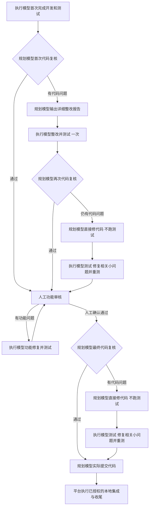

# DevFlow MiMo Code 与轻量工作流代码质量复核及完整修复计划

日期：2026-09-23。状态：复核完成，修复未开始。

## 1. 复核结论与边界

**当前实现存在 10 项需要修复的相关代码问题，不能判定本次工作流改造已完成。** 其中 8 项 P1 影响核心流程、交付或运行边界；2 项 P2 影响配置职责一致性和 MiMo 可用性探测。主要问题在纯路由函数与 Engine、Runtime、Git 之间的接线，并非单独的流程图或提示文案问题。

需求依据为 [原详细开发计划](C:/Code/system-handle/docs/plan/DevFlow-MiMo-Code接入与轻量工作流调整详细开发计划-20260922.md)，以用户随后明确的规则为准：**规划模型修代码不跑测试；执行模型测试期间的相关小修改不再次复核，人工前直接交人工，人工后直接交规划模型提交。**

本次覆盖 MiMo 适配器及调用参数、策略 2 路由、报告交接、模型角色绑定、运行恢复、旧任务迁移和规划提交收尾。比较本次改造与 `4aa5a39` 的相关变更，并阅读必要上下游及当前未提交文件。开始复核时 HEAD 为 `531982b`，期间工作区另有界面合并，复核收尾时 HEAD 为 `5ef1527`；本文问题位置以实际读取的工作区文件为准。界面改版、账号池治理及技术栈精简不在本报告扩展范围内。

复核方式：调用链阅读、隔离内存 Store/Engine/Runtime 夹具、临时真实 Git 仓库与 worktree、MiMo v0.1.14 官方代码核对。没有调用付费模型、操作真实任务、变更真实仓库提交或修改生产配置；没有运行完整构建、全量测试或真实多模型端到端流程。下面的复现结果证明对应代码行为，不代表整个系统验证通过。

### 1.1 轻量调度原则

1. DevFlow 只保存角色结果、任务上下文、会话、调度位置和展示材料，并按确定规则派发下一角色。
2. 代码质量由规划模型判断；测试由执行模型完成并自行报告；功能由人工判断。平台不读测试日志、不扫描代码来判断是否通过、不审计模型是否真的跑过测试。
3. `code_changed`、`function_impact`、附件存在与否、报告结构完整性均不得增加复核、测试或人工确认关卡。
4. Run 归属、重复事件去重、在途运行冻结、停止状态、Git 操作错误和工作区归属属于调度及资源操作的一致性处理；不能扩展成业务、代码或测试质量校验器。
5. 本报告提出的回归测试用于修复 DevFlow 自身代码缺陷，不进入用户任务运行时，也不作为其他模型提交结果的证明工具。

## 2. 修复后必须实现的完整流程

`G → H` 和 `L → M` 没有代码复核节点。测试期间修改了相关代码也保持这两条直达路径。平台不计算“小修改”的行数或规模；职责由提示词约束。模型遇到无法继续的问题报告需要协助，继续保留当前用途和阶段。

| 用途 | 绑定的配置 | 本轮职责 | 正常下一步 |
| --- | --- | --- | --- |
| `implement`，首次开发 | executor | 开发并完成必要测试 | 首次质量复核 |
| `implement`，首次质量整改 | executor | 按本轮详细报告整改并测试 | 第二次质量复核 |
| `quality_review`，人工前 | planner | 只复核相关代码质量 | 首次失败给 executor；整改后再失败给 planner；通过交人工 |
| `planner_takeover` | planner | 修代码、阅读自查，不跑测试/构建/lint/typecheck | executor_test |
| `executor_test`，人工前 | executor | 测试、相关修复、重测 | 直接人工审核 |
| `functional_fix` | executor | 修人工反馈、测试，交人工复测 | 人工审核 |
| `quality_review`，人工后 | planner | 最终相关代码复核 | 通过直接提交；有问题直接规划修复 |
| `executor_test`，人工后 | executor | 测试、相关修复、重测 | 直接 planner_commit |
| `planner_commit` | planner | 实际执行任务范围内 Git 提交 | 已授权本地集成和收尾 |

人工前只有一次执行模型质量整改机会；功能反馈轮次不消耗或重置它。人工后不再发给执行模型做“质量报告整改”，而是规划修复后交执行测试。无问题的复核直接进入下一步。

## 3. 确认问题总表

| 编号 | 优先级 | 确认问题 | 直接后果 |
| --- | --- | --- | --- |
| Q01 | P1 | 规划修复/提交进入调度器不接收的状态 | 出队后没有 Run，工作流停住 |
| Q02 | P1 | 首次整改任务上下文没有写入，完成标记及报告交接断开 | 重复派执行整改，下一模型拿不到本轮报告 |
| Q03 | P1 | 新用途职责未接 Runtime，提交结果字段未贯通 | 规划修复被要求测试、规划提交被禁止提交 |
| Q04 | P1 | 新 Git 集成方法只写成功回执，不执行集成 | 主工作区未更新，任务却显示已提交 |
| Q05 | P1 | planner_commit 完成分支绕过当前 Run 与失败检查 | 过期/失败回调触发当前任务收尾 |
| Q06 | P1 | 恢复目标与实际派发丢失用途 | 测试/提交恢复成普通开发，角色和下一步错误 |
| Q07 | P2 | 策略 2 仍使用第三组角色覆盖和旧整改选模 | 实际模型不符合 planner/executor 两组配置 |
| Q08 | P1 | 迁移方法没有生产调用，且错误识别“整改已完成” | 旧任务留在旧流程，或迁移后提前跳过首次整改 |
| Q09 | P1 | MiMo 定义只读 agent 但没有选择它 | 规划/复核没有获得声明的原生只读权限 |
| Q10 | P2 | MiMo 未接现有授权可用性探测实现 | 现有手动探测直接报不支持的工具 |

以下位置均为复核时行号；修复时用函数名定位，避免因其他已合入修改而误改。

## 4. 问题证据与确定修法

### Q01：规划修复、规划提交无法进入实际执行

位置：[engine.ts:3906](C:/Code/system-handle/packages/core/src/engine.ts:3906) 的 `dispatchPolicy2AfterReview`、同文件 `applyPolicy2Action`、[engine.ts:2779](C:/Code/system-handle/packages/core/src/engine.ts:2779) 的 outbox 消费、[engine.ts:3122](C:/Code/system-handle/packages/core/src/engine.ts:3122) 的 `dispatch`，以及最终通过分支约 4298 行。

触发：人工前第二次质量失败、人工后质量失败、最终复核通过或最终执行测试完成。

原因：分支先把 workflow 改为 `PLANNER_TAKEOVER` 或 `COMMITTING`，再入队；消费者和 dispatcher 只接受 `QUEUED / REVIEW_QUEUED / PLANNING`。dispatcher 会删除不符合状态的 queue，outbox 却已标记 delivered。`run()` 的激活也只接受 QUEUED/REVIEW_QUEUED。

隔离复现：调用实际动作派发方法后执行 `engine.dispatch()`，两种动作分别停在 PLANNER_TAKEOVER/COMMITTING，均 `runCount=0, queued=false`。

修复：统一经过现有 `QUEUED → EXECUTING` 启动所有写用途，stage 用于显示 planner_takeover、executor_test、functional_fix、planner_commit；实际用途来自持久化的 dispatch context。`COMMITTING` 留给规划模型已提交后的 Git 收尾。保留历史状态的读取兼容，不增加另一套 scheduler。把 `applyPolicy2Action` 与 `dispatchPolicy2AfterReview` 合为一个动作落地入口，统一状态、派发上下文、outbox、queue 的事务写入。入队不等于完成派发；建立 Run 与消费对应派发上下文必须能幂等恢复。

### Q02：整改上下文既不能标识“一次机会”，也没有交给下一模型

位置：[engine.ts:3853](C:/Code/system-handle/packages/core/src/engine.ts:3853) 的 `commitPolicy2RepairDecision`、[engine.ts:2068](C:/Code/system-handle/packages/core/src/engine.ts:2068) 的 `dispatchPolicy2AfterImplement`、[profile-runtime.ts:444](C:/Code/system-handle/packages/runtime/src/profile-runtime.ts:444) 的 `executeMaterials`、[quality-flow.ts:73](C:/Code/system-handle/packages/core/src/quality-flow.ts:73)。

原因一：策略 2 跳过原 `writeRepairAssignment`；首次派发只带 `repair_kind=quality`，没有可与完成 Run 关联的整改 assignment。完成时用 `executor_repair_completed || planner_repairs_only` 推断“本轮是否质量整改”；首次整改开始时两个值都为 false，完成后仍为 false。再次失败仍得到 executor_repair。

原因二：报告被 publish 到 project_document，但新分支没有写入下一轮使用的 repair_assignment/repair_state；executeMaterials 只从后二者取正文，也没有绑定本次报告的定位信息。即使模型可能偶然找到落盘材料，正式输入仍缺少本轮报告。用同一 plan_revision 重复发布还会覆盖同 ID 的报告实体，不能唯一定位每次整改。

隔离复现：报告实体已保存，但下一轮 `repair_assignment=null`、`repair_instructions=null`，输入不含报告正文；首次整改 completed 后再次 changes_required 仍派 executor_repair。

修复：复用 `QualityRepairAssignment` 建立每次报告交接，保存 assignment_id、source_review_id、phase、planner、instructions 及绑定的执行 Run。首次质量整改的 `implement` Run 必须携带其 assignment_id/repair_kind；只在该 Run 报告 completed 且属于当前任务后设置 `executor_repair_completed=true`。不检查它是否真的测试。报告正文直接进入模型材料，展示归档失败不阻塞交接；历史报告按 review/assignment 独立保留，不用计划版本充当报告版本。规划直接修复也接收对应报告及范围。

### Q03：新职责函数是未接线代码，提交消息也没有完整传递

位置：[role-boundaries.ts:7](C:/Code/system-handle/packages/core/src/role-boundaries.ts:7)、[profile-runtime.ts:264](C:/Code/system-handle/packages/runtime/src/profile-runtime.ts:264)、[profile-runtime.ts:444](C:/Code/system-handle/packages/runtime/src/profile-runtime.ts:444)、[profile-runtime.ts:1773](C:/Code/system-handle/packages/runtime/src/profile-runtime.ts:1773)、[engine.ts:1818](C:/Code/system-handle/packages/core/src/engine.ts:1818)、[waiting-context.ts:31](C:/Code/system-handle/packages/core/src/waiting-context.ts:31)。

原因：`roleBoundaryInstructionsFor()` 没有生产调用。所有 execute 用途仍收到“完成全部开发任务及测试代码”“直接交代码审查”“不得自行提交 Git”。恢复指导也按旧规划/执行/整改分类，未覆盖 planner_commit 和 executor_test 的独立语义。新增 `PlannerCommitResult.repositories` 只定义了类型，ExecutionCompletion 和记录调用没有保存它，`completePlannerCommit` 读取不到该字段。

隔离复现：对 planner_takeover、executor_test、planner_commit 调用实际 executeMaterials，三者均包含“完成全部开发任务及测试代码”和“不得自行提交 Git”。

修复：按冻结的 policy+purpose 生成唯一职责材料，首次和恢复共用；将当前泛化 instructions/execution_order 替换成按用途组合，不能只在旧段落后追加互相矛盾的提示。planner_takeover 明确不运行测试及静态检查；executor_test 明确完成后直达；planner_commit 明确实际提交任务范围代码且保留他人工作。正常交付及原生结果接收均保留 repositories 等用途相关结果，写入 completion，再交收尾。输出 schema 用作模型生成指导，接收仍沿用宽容结果规范化，不建立新证明门禁。

### Q04：Git 集成成功回执与实际行为不符

位置：[delivery-coordinator.ts:212](C:/Code/system-handle/packages/git/src/delivery-coordinator.ts:212) 的 `integrateCommittedDelivery` 和 [engine.ts:1986](C:/Code/system-handle/packages/core/src/engine.ts:1986) 的 `completePlannerCommit`。

原因：受管 worktree 分支创建 manager 但没有使用，未执行合并/快进/清理，只记录 candidate_commit，随后无条件 COMMITTED。回执还把任务工作树根与任务分支写成 source_root/target_branch。`rev-parse` 失败被吞掉：existing_workspace 仍记 success，worktree 记 partial 后仍进入 COMMITTED。Engine 没有调用既有 `applyCommitOutcome` 收尾。

隔离真实 Git 复现：source/main 有基线，任务 worktree 创建实际新提交，调用方法后得到 `receipt=success, state=COMMITTED`，但主仓库 HEAD 仍为基线、没有任务提交，工作树仍在。

修复：从旧 executeDelivery 中拆出消费已有提交的机械集成段，供新入口复用；不调用旧生成候选提交、质量门禁或测试证据路径。existing_workspace 不重提代码，只记录已完成提交和操作结果；new_worktree 使用登记的 source_root/source_branch，将规划模型已有提交集成到授权目标。Git 命令失败不得转换为成功。按仓库保存完成情况，部分成功只重试未完成项；正确调用统一收尾，清理失败进入 CLEANUP_PENDING 并保留提交成功事实。不得删除用户工作树、外部分支或未提交改动。

提交消息中若有仓库/commit 信息应直接保留；若需要现有 Git 元数据定位集成对象，只做实际 Git 操作所必需的读取，不增加“必须有新 HEAD”“必须提供提交证明”之类审核。确无变更可以正常表达无须新提交，不能凭一个空字符串伪造集成成功。

### Q05：过期或失败的规划提交回调可以进入收尾

位置：[engine.ts:2197](C:/Code/system-handle/packages/core/src/engine.ts:2197) 的 `finalizeNativeDelivery`。

原因：planner_commit 特判在 `w.run_id === runId`、Run 状态和 exit_code 判断之前返回，绕过了其他执行用途已有的保护。已留下 completion、随后进程失败或被新 Run 替代的旧提交回调仍可修改当前 workflow。

隔离复现：当前 run_id=current；旧 Run old 的 purpose=planner_commit、status=failed、exit_code=1，存在旧 completion；`finalizeNativeDelivery(key, 'old')` 仍调用 completePlannerCommit。此复现替换了集成方法为调用记录，未执行真实 Git。

修复：用途分流之前统一执行现有任务/Run 归属、停止及失败状态处理；用 workflow+run+已接收完成消息绑定收尾幂等记录。过期回调不改变当前状态。提交已经发生但回调丢失时恢复原提交收尾，不能重新派一轮开发或重复提交。这是事件一致性保护，不验证代码质量或测试真实性。

### Q06：恢复运行后用途丢失

位置：[recovery.ts:41](C:/Code/system-handle/packages/runtime/src/recovery.ts:41)、[recovery.ts:330](C:/Code/system-handle/packages/runtime/src/recovery.ts:330)、[engine.ts:3302](C:/Code/system-handle/packages/core/src/engine.ts:3302)。

原因：resolveResumeTarget 的广泛 EXECUTING/BLOCKED 分支先于 planner_commit；运行中的 planner_commit 恢复为 QUEUED/execute。executor_test 虽保留 stage，但 target 没有带回 purpose；run() 只读一次性 pending_dispatch_purpose，否则根据旧 assignment 推成 planner_takeover 或 implement，而该 pending 记录在首轮启动时已删除。只恢复 stage 无法恢复语义。

复现：planner_commit 的 prior_state=EXECUTING 时恢复目标是 QUEUED/execute；executor_test 返回 QUEUED/executor_test，但没有用途字段，后续源码确定会走上述默认用途选择。后者未在本轮拉起真实模型，结论限于恢复与派发数据链。

修复：恢复先取绑定的原 Run/冻结 invocation/dispatch context，再按其用途恢复；显式返回 purpose、phase、assignment_id、repair_kind、逻辑轮次和源 Run，并写回与 Q01 相同的派发入口。stage 仅显示，禁止作为用途真源。暂停恢复、额度重试、网络重试、澄清续接及服务重启共同保留用途；同一任务同一模型继续绑定原会话，不猜最新会话。planner_commit 分为“模型提交尚未完成”和“已有提交待集成”两种现有操作位置，后者只恢复收尾。

### Q07：策略 2 未隔离历史高级角色覆盖

位置：[run-profile.ts:211](C:/Code/system-handle/packages/core/src/run-profile.ts:211) 的 `resolveRoutingRole`、同文件 `resolveFreshPreview`（约 508 行）和 `resolveTaskRole`（约 612 行）。

原因：quality_review 仍映射 reviewer，首次质量整改仍映射 review_fixer，功能修复映射 functional_fixer；显式覆盖及 user-repair assignment 仍能先于两组配置生效。该路径未根据 quality_policy_version 分流。

隔离复现：策略 2 的 planner 配置为 planner，历史 reviewer 显式覆盖为 third-model；quality_review 预览实际返回 reviewer/third-model。

修复：在统一预览/绑定层按策略 2 用途得到 planner 或 executor，再解析对应组配置。策略 2 不应用历史 reviewer/review_fixer/functional_fixer 或跨职责 repair_model_assignment；保留它们的原始数据供历史回放。首次派发、预览、换模恢复保持同一规则；已有在途冻结 Run 不改。UI 同步隐藏无效选择，调整对应职责组模型仍可用。策略 1 行为保持兼容。

### Q08：迁移未接入口且完成识别失真

位置：[quality-policy-migration.ts:65](C:/Code/system-handle/packages/core/src/quality-policy-migration.ts:65)，结合 Engine 派发/结果接收和 runtime recovery。

原因：生产源码只存在 `migrateWorkflowQualityPolicy` 定义，没有调用。直接调用时，repairDone 判断“存在任意 completed implement 且当前有 executor quality assignment”，没有关联这次 assignment 的完成 Run；原始开发完成也会被当成首次整改完成。STOPPED 又被视为 terminal_readonly，无法按计划在继续时迁移。当前回执不足以恢复变更前的调度记录。

隔离复现：只有初次开发 completed 和尚未执行的首次整改 assignment，迁移后 `executor_repair_completed=true`。

修复：接入下一派发/恢复边界和在途旧 Run 完成后的下一动作计算边界，禁止批量改写正在执行的冻结 Run。依据 assignment_id/current_attempt_run_id/consumed_completion_run_id 与历史事件识别实际位置，不用“任意 implement 完成”推断整改。STOPPED 是可恢复状态，继续时迁移；已结束任务只读。保留人工问题及确认状态；已有规划修复完成应衔接执行测试。迁移前保存原 workflow、flow、assignment、待派发上下文及受影响 outbox 的值，幂等迁移后生成唯一下一动作。无法从历史调度元数据唯一恢复的位置进入现有待输入状态，不扫描代码或测试日志补证。

### Q09：MiMo 原生只读 agent 没有被选中

位置：[invocation.ts:214](C:/Code/system-handle/packages/adapters/sdk/src/invocation.ts:214)。

原因：MIMOCODE_CONFIG_CONTENT 定义 devflow-review 及其只读权限，但调用参数只有 `run --format json ...`，没有 `--agent devflow-review`，配置也没有 default_agent。定义 agent 本身不会让原生 CLI 使用它。

外部依据：MiMo v0.1.14 [run.ts](https://github.com/XiaomiMiMo/MiMo-Code/blob/v0.1.14/packages/opencode/src/cli/cmd/run.ts#L549) 对未传 agent 返回 undefined；[agent.ts](https://github.com/XiaomiMiMo/MiMo-Code/blob/v0.1.14/packages/opencode/src/agent/agent.ts#L512) 使用默认 agent，默认表包含可写 build。结合本地参数可确认本次只读配置未被选中；未声称本轮真实模型已经越权写文件。

隔离复现：quality_review 参数没有 --agent，配置 default_agent=null。

修复：按用途明确传入原生 agent：只读规划/复核等选择 devflow-review；执行写用途选择 devflow-executor；规划修复/提交选择 devflow-planner。配置限定当前子进程，续接同样显式选择当前职责 agent，不修改用户全局设置。只读边界使用原生权限实现；未支持的原生子会话能力继续如实显示 unsupported，不以另一 CLI 偷换实现。核对声明权限所用原生工具名，未声明能力不扩大权限。

### Q10：现有手动模型探测不支持 MiMo

位置：[model-access-service.ts:438](C:/Code/system-handle/packages/core/src/model-access-service.ts:438) 的 fallbackAccessProbe、同文件 prepareAccessProbe，以及 [mimo/adapter.ts:13](C:/Code/system-handle/packages/adapters/mimo/src/adapter.ts:13)。

原因：fallback switch 没有 mimo-code；适配器也未提供 prepareAccessProbe，继承的基类不补此能力。因此进入既有探测 API 的 MiMo 请求无法发起。

隔离复现：调用 `prepareAccessProbe(mimoSelection, 'mimo', isolatedRoot, mimoAdapter)`，立即抛 `CLI_PARAMETER_UNSUPPORTED`，没有调用模型。

修复：在 MiMo adapter 提供现有接口的探测实现，复用同一模型选择及进程级权限配置，在隔离目录中用明确 agent 和准确 provider/model 发起最小请求，正常归一化返回及错误。只有用户主动调用现有探测入口时执行；不得新增自动探测门禁、测试审计或每次派发都探测。保留现有账号/提供方/模型缓存隔离与脱敏约定，目录能列出模型不等于已经授权可用。

## 5. 隔离复现记录及判断限制

执行入口为临时诊断脚本，使用 `node --import tsx` 调用本地源码；Store 为内存库，Git 仓库位于系统临时目录。最初受限环境启动 esbuild 返回 spawn EPERM，经允许的工具执行后完成。没有修改产品代码，也没有创建测试真实性证明工具。

| 观察 | 实际结果 | 对应问题 |
| --- | --- | --- |
| planner_repair 调度 | PLANNER_TAKEOVER，0 个 Run，queue 被移除 | Q01 |
| planner_commit 调度 | COMMITTING，0 个 Run，queue 被移除 | Q01 |
| 一次整改完成后的再次失败 | completed 标记仍 false，再次 executor_repair | Q02 |
| 报告保存后生成下一轮材料 | 文档存在，assignment/instructions 均 null，正文未进入输入 | Q02 |
| 三种用途的 executeMaterials | 均要求全部开发测试并禁止提交 | Q03 |
| 临时真实 Git 集成 | 回执 success、状态 COMMITTED，source HEAD 没更新 | Q04 |
| 旧失败 planner_commit 回调 | 进入被替换为记录函数的收尾方法 | Q05 |
| planner_commit 恢复目标 | QUEUED/execute | Q06 |
| executor_test 恢复目标 | 有 stage，无 purpose；继续分析实际 run() 默认分支 | Q06 |
| policy2 + reviewer 显式覆盖 | 使用 third-model | Q07 |
| 仅初次开发完成的旧任务迁移 | 错写 executor_repair_completed=true | Q08 |
| MiMo 只读调用参数 | 无 --agent/default_agent | Q09 |
| MiMo 探测入口 | CLI_PARAMETER_UNSUPPORTED | Q10 |

复现调用了实际 Engine 私有动作和 Runtime 材料生成方法以隔离各缺陷；它们不是 HTTP→真实 CLI 的完整端到端验收。真实 Git 场景只证明当前集成实现的缺失，不代表已验证所有冲突或清理路径。未将既有进度文档、测试数量或静态断言作为“功能完成”的依据，也不据此指控模型测试声明失实。

## 6. 实现边界与最小数据契约

### 6.1 只保留一个动作落地入口

继续使用现有 quality_flow 四字段，不建立另一套质量状态机。纯函数 nextQualityAction 负责选择动作；Engine 的唯一落地入口负责以下同一事务内操作：

1. 绑定源 Run/源 review 与当前逻辑事件，重复事件返回已生成的后续动作。
2. 写入本轮需要的 flow 和 assignment 正文/定位关系。
3. 写 workflow 的待执行状态与显示 stage。
4. 用现有 outbox/queue/pending_dispatch_purpose 保存下一 Run 的完整用途上下文。

派发上下文最少包含：dispatch_id、source_run_id、purpose、phase、repair_kind、assignment_id、logical_round_id。复用已有字段/实体，缺的才补；它们用于恢复和关联，不要求模型回传一套校验账本。启动事务保存冻结 Run 后标记本次派发已消费；崩溃恢复复用该关联，避免双 Run 或丢用途。

| 动作 | 待派发状态 | Run purpose | 角色 |
| --- | --- | --- | --- |
| quality_review | REVIEW_QUEUED | quality_review | planner |
| executor_repair | QUEUED | implement + repair_kind=quality | executor |
| planner_repair | QUEUED | planner_takeover | planner |
| executor_test | QUEUED | executor_test | executor |
| functional_fix | QUEUED | functional_fix | executor |
| planner_commit | QUEUED | planner_commit | planner |
| human | HUMAN_PENDING | 无 | 人工 |

### 6.2 结果接收与交接

先处理当前 Run 归属/停止/重复消息，再规范化模型声明，再按冻结用途推进。完成声明的接收不依赖附件归档。首次整改 completed 由 assignment 关联识别；executor_test completed 只根据冻结 phase 决定 human/planner_commit。

保留规划提交结果 repositories；不因换用普通执行结果容器而丢字段。报告正文、规划修复摘要、建议执行的相关回归点进入下一轮输入；报告作为上下文使用，不在平台审查内容完整性。未知/需要协助的结果复用现有澄清流程，并保留用途，不重新默认成 implement。

### 6.3 Git 收尾及失败恢复

规划模型负责实际任务提交。平台只操作已有授权目标：existing_workspace 记录完成；new_worktree 集成已有提交。每仓库收尾记录保存真正的 source_root、source_branch、已有 commit 和操作状态。

集成失败进入现有 COMMIT_PARTIAL；成功仓库不重做。清理失败进入 CLEANUP_PENDING，只重试清理。冲突交给模型处理：需要改代码时由规划模型处理相关修改，交执行模型测试；测试修改后继续规划提交/收尾，保持不再质量复核的规则。不能借用旧 executeDelivery 重新生成任务提交或启动旧质量复核链。仅清理本任务且满足已有安全条件的受管资产。

## 7. 文件级实施任务与顺序

每项完成后在本表勾选，并记录修复提交及实际验证范围；此处全部待执行。顺序为 F01 → F02 → F03 → F04 → F05 → F06 → F07 → F08。

| 任务 | 关联 | 修改文件/边界 | 明确完成条件 |
| --- | --- | --- | --- |
| [ ] F01 统一策略 2 派发 | Q01、Q02 | [engine.ts](C:/Code/system-handle/packages/core/src/engine.ts)、[quality-flow.ts](C:/Code/system-handle/packages/core/src/quality-flow.ts)、[quality.ts](C:/Code/system-handle/packages/contracts/src/quality.ts) | 所有动作进入真实 Run；两处重复落地逻辑收敛；首次整改 assignment 与正文关联；完成一次后再次失败必定规划接管 |
| [ ] F02 固定职责与消息 | Q03、Q07 | [run-profile.ts](C:/Code/system-handle/packages/core/src/run-profile.ts)、[profile-runtime.ts](C:/Code/system-handle/packages/runtime/src/profile-runtime.ts)、[role-boundaries.ts](C:/Code/system-handle/packages/core/src/role-boundaries.ts)、[execution-guidance.ts](C:/Code/system-handle/packages/core/src/execution-guidance.ts)、[waiting-context.ts](C:/Code/system-handle/packages/core/src/waiting-context.ts)、[round-intent.ts](C:/Code/system-handle/packages/core/src/round-intent.ts)、[contracts/index.ts](C:/Code/system-handle/packages/contracts/src/index.ts) | planner/executor 绑定唯一，启动/恢复材料一致；提交结果贯通；不残留互斥指令 |
| [ ] F03 保留恢复上下文 | Q06 | [recovery.ts](C:/Code/system-handle/packages/runtime/src/recovery.ts)、[conversation-recovery.ts](C:/Code/system-handle/packages/runtime/src/conversation-recovery.ts)、[model-retry.ts](C:/Code/system-handle/packages/core/src/model-retry.ts)、Engine 与已有 continuation 契约 | 暂停、配额/网络重试、澄清、重启均恢复原用途/phase/assignment/冻结模型/会话；不得回普通开发 |
| [ ] F04 修复提交收尾 | Q04、Q05 | [delivery-coordinator.ts](C:/Code/system-handle/packages/git/src/delivery-coordinator.ts)、[git.ts](C:/Code/system-handle/packages/git/src/git.ts)、Engine completion/commit outcome | 过期回调不推进；真实集成更新授权源仓库；失败不伪成功；已有提交不重复，清理单独恢复 |
| [ ] F05 接入可靠迁移 | Q08 | [quality-policy-migration.ts](C:/Code/system-handle/packages/core/src/quality-policy-migration.ts)、Engine/恢复边界 | 在途不改；安全边界迁移有回执可恢复；旧人工问题不丢；整改完成基于实际绑定 |
| [ ] F06 修复 MiMo 原生调用 | Q09、Q10 | [invocation.ts](C:/Code/system-handle/packages/adapters/sdk/src/invocation.ts)、[mimo/adapter.ts](C:/Code/system-handle/packages/adapters/mimo/src/adapter.ts)、[model-access-service.ts](C:/Code/system-handle/packages/core/src/model-access-service.ts) | 原生 agent 显式选择；Pro/Flash 正确传参并支持精确续接；现有手动探测可执行，不新增运行门禁 |
| [ ] F07 同步产品显示 | Q01、Q07、Q08 | [CurrentRuntime.tsx](C:/Code/system-handle/apps/web/src/components/CurrentRuntime.tsx)、[RepairModelPicker.tsx](C:/Code/system-handle/apps/web/src/components/RepairModelPicker.tsx)、[run-observation.ts](C:/Code/system-handle/packages/presentation/src/run-observation.ts)，必要时已有配置视图 | 显示真实用途/模型/等待原因；策略 2 不提供无效角色覆盖；历史记录仍能显示 |
| [ ] F08 完成相关回归与交接 | 全部 | 第 8 节列出的测试文件及 [原执行进度文档](C:/Code/system-handle/docs/process/DevFlow-MiMo-Code接入与轻量工作流调整执行进度-20260922.md) | 实际测试与未验证范围清楚；流程满足第 2 节；更新本文进度，不把计划勾选等同完成 |

F02 复用 core 中现有 execution-guidance 实现，不新建重复的职责模块；Runtime 的首次与恢复入口都消费该实现。

不要把这次修复扩展成新验证框架、模型监督服务、统一状态机重写或全仓提示词治理。对旧策略只修共享的明确错误；策略 2 行为在 policy 分支内落地。

## 8. 回归设计与验收

### 8.1 主链路测试

将 [quality-policy-v2.test.ts](C:/Code/system-handle/tests/integration/quality-policy-v2.test.ts) 扩展为真实 Engine+Store+假 Runtime 的集成测试。假 Runtime 只返回预定模型结果，必须经过真实调度、运行、结果接收、人工反馈和后续派发；不能手工设置 executor_repair_completed 来替代真实完成路径。

| 用例 | 场景 | 必须观察到的结果 |
| --- | --- | --- |
| A01 | 首次开发后首次复核通过 | 直接 HUMAN_PENDING，无整改/补测 Run |
| A02 | 首次复核失败 | executor 的一次整改 Run 收到当前完整报告 |
| A03 | 首次整改后复核通过 | 直接人工，无规划修复 |
| A04 | 首次整改后仍失败 | planner_takeover 一次，之后 executor_test；不存在第二次 executor 质量整改 |
| A05 | 人工前执行测试声明改过代码、function_impact=changed | 直接人工，无额外质量复核或确认节点 |
| A06 | 人工反馈功能问题，修复并复测 | functional_fix 使用 executor；人工确认前不进入最终质量复核 |
| A07 | 人工确认通过且最终复核通过 | planner_commit 实际派发，无额外测试 Run |
| A08 | 最终复核有问题 | planner_takeover → executor_test → planner_commit |
| A09 | 最终测试声明改过代码 | 仍直接 planner_commit，无额外复核或人工确认 |
| A10 | 两阶段的 needs user/planner、未知意图 | 保留用途/phase，走现有协助；不会误判 completed |
| A11 | 同一事件/完成回调重复送达 | 唯一后续 Run，整改标记不重复推进 |
| A12 | 报告展示文件写失败/附件缺失 | 正文仍交下一角色，完成和路由不被附件阻塞 |

### 8.2 运行材料、角色和恢复

在相关单元/集成测试中直接拦截实际 ProfileRuntime 输入和冻结 Run，不只断言常量函数返回值。

| 用例 | 场景 | 结果 |
| --- | --- | --- |
| B01 | 三种新职责初次/恢复输入 | 规划修复不跑测试；执行测试不要求再审；规划提交允许实际 Git 提交 |
| B02 | 策略 2 带全部历史角色覆盖/repair assignment | 仍按用途固定使用 planner/executor；策略 1 保持原语义 |
| B03 | planner_takeover、executor_test、planner_commit 暂停后继续 | 新 Run purpose、phase、assignment、冻结配置与原上下文一致 |
| B04 | 配额/网络重试、服务重启、结果澄清续接 | 不退回 implement；保持准确原生会话绑定 |
| B05 | 派发上下文写入/Run 建立前后中断 | 恢复后不丢派发、不重复 Run |
| B06 | 新 Run 已替代旧 Run，旧失败回调到达 | 不调用集成，不修改当前状态 |
| B07 | planner_commit 返回 repositories | 经接收、completion 保存后完整交给 Git 收尾 |

优先扩展 [model-routing.test.ts](C:/Code/system-handle/tests/unit/model-routing.test.ts) 及已有恢复测试；新增文件仅限缺少对应行为夹具时。提示生成需要断言冲突指令不存在，避免“同时包含正确与错误段落”也通过。

### 8.3 真实临时 Git 行为

在 [planner-commit.test.ts](C:/Code/system-handle/tests/integration/planner-commit.test.ts) 使用临时仓库，不用纯路由结果替代 Git 操作。

| 用例 | 场景 | 结果 |
| --- | --- | --- |
| C01 | existing_workspace 已有规划模型提交 | 平台不再生成任务提交；保留无关 index/工作区内容 |
| C02 | new_worktree 已提交，源分支可快进 | 源分支包含提交，回执 source_root/target_branch 正确 |
| C03 | 多仓库其中一个集成失败 | 成功记录保留，COMMIT_PARTIAL，仅恢复失败仓库 |
| C04 | Git 命令失败/仓库不可用 | 不产生 success 回执或 COMMITTED 假结果 |
| C05 | 已提交但断连/结果重放 | 原提交与集成幂等，不重复 commit |
| C06 | 集成成功但清理失败 | CLEANUP_PENDING，提交成功事实保留；只重试本任务清理 |
| C07 | 合并冲突需要代码修复与测试 | 按规划修复→执行测试→规划提交/收尾恢复；无旧质量门禁 |
| C08 | 无须新提交、已有外部改动或工作树 | 不强迫空提交，不覆盖/删除外部资产 |

### 8.4 迁移、MiMo 与界面

| 用例 | 场景 | 结果 |
| --- | --- | --- |
| D01 | 旧任务初次开发完成、首次整改待开始 | 不标记整改已完成，保留唯一一次机会 |
| D02 | 旧任务确已完成一次整改、之后再次失败 | 接规划修复，不延续三轮规则 |
| D03 | 旧任务 STOPPED、等待人工、功能问题待复测 | 继续时正确迁移，人工问题及位置不丢 |
| D04 | 旧 Run 正在执行/正在提交集成 | 不改冻结 Run 或 Git 操作；下个安全边界处理 |
| D05 | 重复迁移、迁移后重启、恢复旧快照 | 单一调度结果；历史材料和会话保留 |
| D06 | MiMo 各用途首次/续接参数 | 明确 agent；准确 provider/model；续接只用目标 session |
| D07 | MiMo 只读 agent 的原生权限配置 | 只读 agent 被实际选择，原生写工具被权限拒绝；无全局配置污染 |
| D08 | MiMo Pro/Flash 的手动探测 | 现有入口能运行且错误有明确分类，不新建自动门禁 |
| D09 | workbench 展示及人工反馈 | 角色/模型/用途符合真实 Run；修复后仍由人工确认功能 |

扩展 [quality-policy-migration.test.ts](C:/Code/system-handle/tests/integration/quality-policy-migration.test.ts)、[cli-invocation.test.ts](C:/Code/system-handle/tests/unit/cli-invocation.test.ts)、已有 model-access 测试和 [quality-policy-v2.spec.ts](C:/Code/system-handle/tests/e2e/quality-policy-v2.spec.ts)。MiMo 原生权限、会话和真实账号调用须在独立临时项目中验证；没有运行就标明未验证，不能用静态参数测试替代原生行为结论。

验收执行顺序：相关单元与 Engine 集成 → 临时真实 Git → typecheck/build → 指定浏览器回归 → 独立项目原生 MiMo 路径。检查失败若来自无关既有变更，记录精确边界，不顺手扩展修复范围。无需在同一变更已通过且没有新疑点时反复全量重跑。

## 9. 迁移、上线与回滚执行方案

1. 开始修复前记录当前相关文件、在途任务和已存在工作区；不 reset、清理或接管其他开发修改。只提交这次修复的明确文件白名单。
2. 完成 F01–F07 后先用隔离 Store 和临时项目验证新流程；发布时保留现有任务/会话/计划/报告/配置/凭据和工作树。
3. 对新建任务使用策略 2；旧任务只在第 Q08 节规定边界迁移，不在启动时整库改版本，也不打断原生运行。
4. 对已经卡在 PLANNER_TAKEOVER/COMMITTING 且没有新 Run 的任务，根据原待派发用途和事件重新建立一次派发；不能仅凭 state=COMMITTING 判断模型已提交。若已有规划提交和集成记录，则从其真实未完成操作继续。
5. 对已误记 COMMITTED 的任务，单独恢复本地集成操作位置及错误回执；不得重新触发人工功能审核或模型开发。先保留原记录，利用已有仓库与提交信息完成原授权收尾，不覆盖外部修改。
6. 回滚应用版本前，暂停新派发并让在途操作到达可恢复边界；保留策略 2 新用途的任务处于暂停。旧二进制不能直接把新用途当 implement 启动。
7. 只对尚未产生后续 Run/Git 操作的迁移任务恢复迁移前调度快照；已经向前执行的任务保留新上下文，由兼容版本继续。不得全库回滚抹掉之后的人工反馈和提交。
8. 回滚不执行 Git reset、删工作树或删除会话；已完成的提交与集成独立保留。仅有清理未完成时继续清理恢复，不重做质量流程。

## 10. 最终完成标准

- [ ] Q01–Q10 均有对应代码修复及本次相关行为验证，无以文档变更替代接线实现的情况。
- [ ] 图中的两条测试直达路径通过实际 Engine 调度验证；无测试后自动复核/自动人工重确认。
- [ ] 规划修复不跑测试、规划提交实际提交；执行模型职责和人工职责明确且输入一致。
- [ ] 原生 MiMo Pro/Flash 模型选择、明确 agent、会话续接和手动探测均报告真实验证范围。
- [ ] 恢复/重复回调/迁移不丢用途，不改在途冻结配置，不吞掉报告正文。
- [ ] Git 集成的回执与实际操作一致，部分失败和清理失败可恢复，保留用户其他工作。
- [ ] 未增加代码、测试、报告或模型声明的运行时质量校验；平台保持轻量调度与展示。

本文件是修复计划，不表示上述修复已经实施或验证通过。
