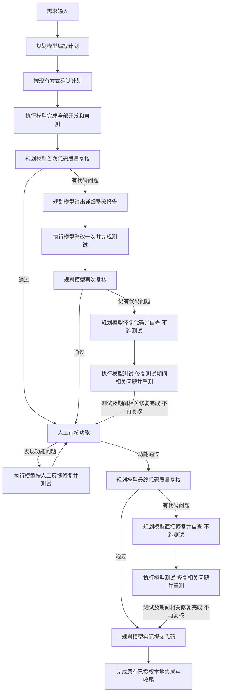

# DevFlow MiMo Code 接入与轻量工作流调整详细开发计划

编写日期：2026-09-22  
核对基线：`C:\Code\system-handle`，`main`，`4aa5a39`。  
状态：计划已编写，产品改动尚未实施。本文合并需求说明、设计、文件级实施任务、迁移回滚及验收要求，后续执行直接在本文记录进度。

## 1. 本次目标与确定结论

本次只实施两组产品变更：

1. 新增独立的 **MiMo Code** 工具适配器，支持选择 **MiMo V2.6 Pro**、**MiMo V2.6 Flash**，接入现有模型配置、原生会话、任务派发、暂停恢复和过程展示。
2. 调整代码开发完成后的职责和顺序：**执行模型开发和测试 → 规划模型复核 → 首次有问题交执行模型整改一次 → 再次有问题由规划模型修代码、执行模型测试 → 人工验功能 → 执行模型修功能并测试 → 规划模型最终复核，有问题直接修代码、执行模型测试 → 规划模型提交代码**。

**核心原则：DevFlow 是极轻量调度和展示工具，不参与任何代码、功能、测试、整改报告或交付证据校验。** 它按模型的明确结果和人的明确操作安排下一项工作，不自己判定工作质量。

“首次整改一次”指执行模型收到第一次质量整改报告后，完成该报告的修复与自测，再接受一次规划复核。第二次复核仍有代码问题就接管，不是累计两份整改报告交执行模型各修一轮，也不是把旧阈值从 3 改成 2。

**2026-09-22 流程修订：规划模型修复后的执行测试，即使包含单元测试暴露问题所需的小范围代码修改，修复并测好后也不再进入代码复核。人工前直接交人工审核；最终质量修复后的测试完成直接交规划模型提交。不得因测试期间改了代码而自动追加规划复核或人工重确认。** 首次开发及首次质量整改完成后的既定规划复核仍保留。

“规划模型直接修复”指规划模型实际编辑代码；“规划模型提交”指规划模型通过原生工具实际执行 Git 提交。不能把规划模型生成修复建议、提交消息，随后让其他角色修代码或让平台代提交，算作实现要求。

本计划新增流程称为 `quality_policy_version = 2`，默认模板升为 revision 7；这里的 policy version 与现有 `native-v2` 执行协议不是同一个版本号。

## 2. 已核对的现状与本次改动范围

### 2.1 当前源码事实

| 已核对位置 | 当前行为 | 本次处理 |
| --- | --- | --- |
| `packages/contracts/src/execution-spec.ts` | 支持 8 个适配器，没有 MiMo Code | 加入 `mimo-code`，不把 MiMo 冒充成 `opencode` |
| `packages/core/src/templates/default-template.ts` | 默认模板 revision 6，`max_executor_rejections: 3` | 新模板表达一次执行整改、规划修复、执行测试和规划提交 |
| `packages/core/src/quality-coordinator.ts` | 首次发现不计数，完成执行整改后再次不通过才计数；3 次触发接管；人工前后都用这一套 | 新策略用明确的阶段和一次整改是否完成来路由；人工后有问题直接由规划修复 |
| `packages/core/src/run-profile.ts` | `planner_takeover` 绑定 planner；质量整改和功能整改有高级角色覆盖 | 新策略固定两个职责组，新增执行测试、规划提交用途 |
| `packages/core/src/engine.ts` 的 `finalizeNativeDelivery()` | 普通执行交付统一流向质量复核；规划接管仍沿实施通道 | 按用途分别处理实施完成、规划修复完成、执行测试完成、功能修复完成 |
| `packages/core/src/engine.ts` 的 `accept()` | 人工通过后进入 `after_human` 复核 | 保留正常人工验收；新策略不追加质量修复后的自动功能重确认 |
| `packages/core/src/engine.ts` 的 `receiveReview()` | 最终复核通过后由 `GitDeliveryCoordinator.executeDelivery()` 或 `git.commit()` 提交 | 新策略改为派发 `planner_commit`；平台不再代做候选提交 |
| `packages/core/src/role-boundaries.ts` | 已有代码质量职责收敛和禁止测试真实性审计的共享提示词 | 继续使用，并补充规划修复不跑测试、所有测试归执行模型 |
| `packages/skills/devflow*` 中的职责文档 | 仍有“三次接管”“两阶段独立计数”等表述 | 统一更新，防止代码与模型收到的指令冲突 |

本机当前 PowerShell 的 `Get-Command mimo` 未找到命令。这只能说明当前命令搜索路径没有发现 MiMo Code，不能证明其他目录未安装。本文未安装 CLI、未读取登录凭据、未调用 MiMo 模型。

### 2.2 本次改变什么

- 增加工具与两款模型的接线。
- 改变人工审核前质量整改的接管时点。
- 将规划修复和测试拆成两个角色轮次。
- 功能整改完成后先回人工确认，人工确认后再做最终质量复核。
- 人工审核后的质量问题直接由规划修复。
- 规划修复后的执行测试及相关小范围修改完成后直接进入下一步，不新增代码复核回路。
- 将最终实际提交归给规划模型。
- 同步状态文案、Skill、恢复路由和相关测试。

### 2.3 保留什么

- 需求输入、规划、已有计划确认方式、原工作区选择方式。
- 原生模型会话和过程展示；同任务同工具同模型在现有会话边界允许时继续使用原会话。
- 已有模型配置冻结、账号隔离、暂停恢复、用户主动切换模型能力。
- 人工对功能是否可接受的决定权。
- 原有受管工作区生命周期、已授权的本地集成方式和资源释放。

不借本次改造重写全部历史协议、重做聊天界面、引入第三个监督模型、新增流程审计系统、开发 MiMo 多账号自动切换或重写 AGY 账号管理。

## 3. 改造后的完整工作流程

### 3.1 完整流程图



图中“测试完成”均指执行模型明确报告必要测试及期间相关问题修复完成，不由 DevFlow 运行命令、分析日志或核验真实性。T、U 均无返回规划复核的边；T 直接到人工审核，U 直接到规划提交，不根据测试期间是否修改代码另分路线。

### 3.2 分步职责与直接通过路径

| 步骤 | 负责人 | 工作内容 | 通过后 | 发现问题后 |
| --- | --- | --- | --- | --- |
| 0. 规划和确认 | 规划模型、用户 | 沿用现有计划流程 | 首次开发 | 按现有方式补充需求或计划 |
| 1. 首次开发及自测 | 执行模型 | 完成本需求全部实现、必要接线和相关测试；修好测试期间问题 | 首次质量复核 | 自行修复与重测；真实外部阻塞按原恢复机制处理 |
| 2. 首次质量复核 | 规划模型 | 阅读本任务相关代码，判断实现遗漏、逻辑、边界、安全和必要维护性 | 直接人工审核 | 写详细整改报告，交执行模型 |
| 3. 唯一一次执行质量整改 | 执行模型 | 落实全部有效代码问题，主动补齐同目标必要遗漏，完成测试 | 第二次质量复核 | 同一整改轮内继续；运行失败不消耗新的整改机会 |
| 4. 第二次质量复核 | 规划模型 | 核查原代码问题及修复相关回归 | 直接人工审核 | 规划模型接管代码修复 |
| 5. 规划质量修复 | 规划模型 | 实际修改代码，阅读修改后的代码完成自查；不运行测试 | 执行测试 | 同一规划修复工作内继续处理 |
| 6. 执行测试 | 执行模型 | 运行必要测试；处理测试期间本任务相关问题，完成小范围修改并重测 | 人工前直接交人工；人工后直接规划提交；均不再复核 | 可修问题自行修复；真实设计冲突交规划澄清；环境问题保留测试阶段恢复 |
| 7. 人工功能审核 | 用户 | 实际判断功能效果，提出问题并确认修复 | 最终质量复核 | 执行模型修功能并测试，再回人工确认 |
| 8. 最终质量复核 | 规划模型 | 复核当前最终代码 | 直接规划提交 | 直接规划修代码，再交执行测试；执行修完测完直接规划提交 |
| 9. 规划提交 | 规划模型 | 仅提交本任务范围内代码；处理已有本地交付上下文 | 原有集成收尾 | 提交操作失败重试本用途；需修代码则修复并交执行测试，完成后直接恢复规划提交 |

### 3.3 四条必须跑通的典型路径

**全程通过：** 开发和自测 → 首次复核通过 → 人工功能通过 → 最终复核通过 → 规划提交。不得为了“走完整流程”空跑整改、额外测试或额外复核。

**执行整改后通过：** 开发和自测 → 首次复核有问题 → 详细报告 → 执行整改及测试 → 再次复核通过 → 人工 → 最终复核 → 规划提交。

**规划接管：** 首次复核有问题 → 执行整改及测试 → 再次复核仍有问题 → 规划修复不测试 → 执行测试、修复测试发现的相关小问题并重测 → 直接人工 → 最终复核 → 规划提交。

**人工后仍有问题：** 人工反馈 → 执行修功能及测试 → 人工确认问题全部修复 → 规划最终复核有代码问题 → 规划直接修复 → 执行测试、完成期间相关修改并重测 → 直接规划提交。

### 3.4 闭环中的确定规则

1. **接管保持生效。** 人工前一旦进入规划接管，当前质量报告由规划模型修复，不因暂停、换账号或模型重试而退回执行质量整改；后续测试暴露的相关小问题仍由执行模型修复，不送回规划复核。
2. **人工后直接规划修。** `after_human` 不读取旧失败次数决定修复人。最终复核只要给出代码问题，就由规划修复。
3. **测试阶段不是只读。** 执行模型可以修复运行测试暴露的本任务相关代码、配置和测试问题，并自行重测。这不算又获得一次质量整改报告机会。
4. **测试期间的相关小修改不复核。** 执行模型为修好单元测试等相关测试问题而修改实现、配置、脚本或测试源码后，自行重测并完成本轮。人工前直接交人工审核；人工后直接规划提交。平台不扫描 diff，也不以文件数、行数或风险评分判定修改大小并添加关卡。
5. **规划修复内部自查足够。** 规划模型完成修复时确认自己发现的代码问题已解决，随后交执行模型测试。执行模型是否在测试期间继续修改代码，都不触发一个新的规划复核轮。该规则适用于 `planner_takeover → executor_test`，不取消首次开发和首次质量整改之后本来就有的规划复核。
6. **功能修复必须回人工。** 执行模型宣布修完不能关闭人的问题或代替人工验收；人确认全部问题修复后才进入最终质量复核。
7. **最终测试完成直接提交。** 最终质量修复之后，执行模型修完测试期间相关问题并完成测试，下一步唯一是 `planner_commit`；不再安排代码复核，也不因修改或功能影响字段自动追加人工重确认。
8. **说明材料不驱动额外关卡。** 是否修改代码、修改范围和功能影响可以写在执行摘要中，供用户查看；不是测试完成后的分流条件，缺少这类字段也不补问、不阻塞。
9. **提交轮不顺手改代码。** 若提交阶段发现确需修改代码，先退出提交路径进入相应修复与测试。Git hook 自动修改源码也按代码变化处理，不能带着未测修改直接提交。
10. **新增业务另走原需求变更机制。** 本流程处理当前需求的质量和功能整改，不把新增需求自动塞入无限修复循环。

## 4. 轻量边界：平台只认结果，不判断结果是否真实

### 4.1 各方拥有的判断权

| 判断事项 | 判断者 | DevFlow 做什么 |
| --- | --- | --- |
| 代码是否有质量问题、修复是否合理 | 规划模型 | 保存结论、展示报告、派发下一角色 |
| 测试范围、运行方式、是否通过、测试中问题是否修好 | 执行模型 | 保存完成/阻塞声明，不执行或解析测试 |
| 功能是否满足预期、人工问题是否关闭 | 用户 | 记录用户操作并继续调度 |
| 测试期间改了什么代码、相关影响是什么 | 实际修改代码的模型 | 作为摘要展示，不据此添加复核或重确认 |
| CLI 是否启动、连接是否中断、原生会话是否可恢复 | 运行时和原生工具 | 展示运行事实并使用原有恢复路径 |

模型与人对结果负责，DevFlow 对派发对象、阶段、会话归属和状态保存负责。

### 4.2 明确禁止的实现

- 不新增或复活 `EvidenceValidator`、测试真实性校验、覆盖率门槛、执行账本、报告签名和哈希证明链。
- 不扫描代码或测试报告来决定“完成/通过/应该接管”。
- 不要求整改报告包含固定数量的问题、字段、测试案例或附件才能流转。
- 不因为附件缺失、归档失败、测试日志缺失而退回执行或增加质量失败次数。
- 不让规划模型、其子 Agent 或执行模型制作脚本证明测试真的跑过。
- 不为分离规划修复与执行测试引入命令监控器；通过用途路由、原生权限配置和共享提示词明确职责。
- 不根据测试修复的文件数、行数、diff、风险或功能影响决定“再审一次”；执行模型完成该测试轮后按人工前/后阶段直接进入下一步。
- 不在两角色切换前插入“平台验证”“监督模型验收”“再做一次计划逐项证明”。
- 不把 CLI 正常退出等同于测试成功，也不把完整 JSON 输出等同于代码质量通过；必须来自对应角色的结果意图。

现有 JSON 解码、任务身份识别、取消信号、会话归属、重复消息去重、排队和写锁用于把消息送到正确任务，继续沿用。它们不产生业务通过结论，也不得扩展成新的代码或测试验证链。

如模型结果缺少路由所需意图，仅在同角色同会话补问“这轮完成、需要用户还是受外部阻塞”；不得要求重新开发、重新复核或补齐证明材料。自然语言描述明确但附件不完整时照常流转。

### 4.3 开发本工具时可以测试工具本身

第 12 节中的单元、集成和真实 CLI 测试，是实施本次 DevFlow 改造时的开发验证，不作为以后每个被调度项目的运行关卡。不要把这些测试包装成产品内的常驻审计能力。

## 5. MiMo Code 接入设计

### 5.1 官方事实、来源和能力边界

本次查阅了小米官方仓库及官方模型文档。官方仓库给出 npm 包 `@mimo-ai/cli`、命令 `mimo`；官方 V2.6 公告给出 Pro 和 Flash。本次选用已发布的 **MiMo Code v0.1.14** 作为首个兼容基线；真实接入验收仍必须在所用机器上完成，不能将官方源码等同于本机联调成功。

- [官方 MiMo Code 仓库与安装说明](https://github.com/XiaomiMiMo/MiMo-Code)
- [官方 v0.1.14 发布版本](https://github.com/XiaomiMiMo/MiMo-Code/releases/tag/v0.1.14)
- [官方 V2.6 系列公告](https://mimo.mi.com/docs/zh-CN/news/latest/v2-6)
- [官方 v0.1.14 run 命令源码](https://github.com/XiaomiMiMo/MiMo-Code/blob/v0.1.14/packages/opencode/src/cli/cmd/run.ts)
- [官方 models 命令源码](https://github.com/XiaomiMiMo/MiMo-Code/blob/main/packages/opencode/src/cli/cmd/models.ts)
- [官方 CLI 环境变量定义](https://github.com/XiaomiMiMo/MiMo-Code/blob/v0.1.14/packages/opencode/src/flag/flag.ts)
- [官方深度思考说明](https://mimo.mi.com/docs/zh-CN/quick-start/usage-guide/text-generation/deep-thinking)

官方 CLI 源码存在 `run`、JSON 事件输出、显式模型参数和按 session ID 续接；模型目录输出包含 `provider/model`，详细模式附带模型元数据。实现直接使用这些原生接口，不新建 API 聊天循环。

### 5.2 固定标识与配置原则

| 项目 | 本次规定 |
| --- | --- |
| DevFlow adapter ID | `mimo-code` |
| 展示名 | `MiMo Code` |
| 原生命令 | `mimo`；Windows 兼容实际安装产生的 `.exe/.cmd/.ps1` 包装 |
| 默认 profile ID | `profile-mimo-code` |
| Pro 逻辑模型名 | `mimo-v2.6-pro` |
| Flash 逻辑模型名 | `mimo-v2.6-flash` |
| 实际 CLI 模型 token | 从当前 CLI 模型目录选中的完整 `provider/model` 原样保存和派发 |
| 默认思考强度 | `native-default`；仅在真实目录及 CLI 确认支持时展示可选 variant |
| 凭据归属 | MiMo 原生登录或原生 provider 配置；DevFlow 只保存配置引用和脱敏身份 |

不能把显示名称作为模型参数；不能猜 provider 前缀。若目录中多个 provider 都提供同名模型，设置页显示完整来源供用户选择，并冻结该条目。不存在目标模型时说明当前来源不可用，不降级到 V2.5、Preview、Ultraspeed 或其他工具。

两款模型都可作为规划或执行模型。新增后不覆盖用户现有默认工具和模型；可在设置中组合 Pro 规划、Flash 执行，但不自动更换现有任务配置。

### 5.3 适配器实现路径

新增 `packages/adapters/mimo/src/adapter.ts`、`model-configuration.ts`、`conversation-source.ts`。继承通用 `BaseNativeAgentAdapter`，复用通用启动、文本流和错误处理设施；MiMo 的产品身份、配置名、事件解释和会话来源独立实现。

MiMo 源码目录沿用 `opencode` 名称不代表两种产品可以共用身份、登录目录、数据库、环境变量或 session ID。不得把 `mimo-code` 转成 `opencode` 再走现有 adapter。

实现命令形态如下，其中尖括号是说明用占位符，实际使用独立 argv 参数，不拼接 shell 字符串：

```text
mimo --version
mimo run --help
mimo models --verbose
mimo run --format json --model <目录中的完整provider/model>
mimo run --format json --model <同一已冻结模型> --session <已绑定session-id>
```

提示词优先通过 stdin 传递，避免中文、换行、引号和 Windows 命令行长度问题。仅在实际存在且用户选择 variant 时附加 `--variant`。新任务不能用 `--continue`，避免接续别人的最近会话。

### 5.4 必须完成的接线

1. 在 `SupportedAdapters`、默认二进制映射、adapter registry、模型目录 parser、model selection、frozen invocation 和 UI 工具列表加入 MiMo。
2. 模型目录解析支持“模型行 + 多行 JSON 元数据”的实际格式，不能简单按行截取后丢失 variant 和 provider 信息；提供脱敏真实输出 fixture。
3. 通过官方 `MIMOCODE_CONFIG_CONTENT` 注入本轮角色指令及原生 agent 权限，作用域仅为受管子进程；保留原生 provider 和登录配置，使用配置合并回归用例覆盖 v0.1.14 行为，不能向 MiMo 注入 `OPENCODE_CONFIG_CONTENT`。通过 `MIMOCODE_DISABLE_AUTOUPDATE` 固定在途 CLI 行为，升级仅在后续启动边界生效。
4. 质量复核采用原生只读 agent；规划修复、执行开发、执行测试、规划提交使用能够完成相应工作的原生 agent。角色用途明确写入提示词。
5. 对 headless 模式的权限请求使用原生工具已有的授权方式。工作区内已授权操作由作用域配置表达；不得全局默认加入 `--yolo` 或关闭所有权限。若原生工具仍要求互动，展示需要操作的事实并按原会话恢复。
6. 模型目录可列出与账号实际可调用是两件事。沿用 `listed/unknown/verified` 展示语义；正常任务派发不为了“认证通过”额外跑一次模型探针。已有手动连接测试如扩展到 MiMo，必须独立于工作流主链。
7. 账号、provider、endpoint、模型和 executable 的隔离沿用现有设计；不能因为两个工具接入同一个 provider 就共享授权缓存。

### 5.5 原生会话、展示与停止恢复

- 使用 MiMo 原生事件里的 session ID，绑定到本任务、工具、模型和工作区；不按“最新会话”或时间相近猜测关联。
- 同一执行模型的实施、首次整改、测试、功能修复，在兼容的原生权限与会话边界下续接执行侧会话。规划侧复核、修复、提交同理；权限类别不兼容时保留 lineage 并建立明确的新绑定。
- Pro 切 Flash 或 Flash 切 Pro 创建相应新绑定并传递必要任务上下文，不拿旧模型会话冒充新模型会话。
- 输出映射为已有 `AgentEvent`、Run 状态和原生会话入口，不新增一套 MiMo 聊天记录系统。文本、工具活动和 usage 字段仅按真实事件提供。
- 第一版走受管 CLI 子进程；停止复用现有任务进程树控制，不为了接入 MiMo 常驻额外 server。恢复使用明确 session ID。
- TUI 的启动入口沿用用户主动打开原生会话的行为；不因工作台显示状态就自动弹出窗口。
- 原生子 Agent 树、图片/文件输入、消息注入、细粒度子会话停止各自按实际实现填写 capability。未实现的功能显示不支持，不阻塞基本文本开发链，也不宣称与 OpenCode 完全等价。
- 适配器不能使用非目标会话的终止事件结束当前 Run；分清模型出错、进程退出、任务明确完成和输出中断。

## 6. 角色、用途和结果契约

### 6.1 固定两组角色

| Run purpose | 新策略角色 | 是否修改代码 | 是否跑测试 |
| --- | --- | --- | --- |
| `planning` | planner | 按现有规划边界 | 否 |
| `implement`，首次实施 | executor | 是 | 是 |
| `implement`，首次质量整改 | executor | 是 | 是 |
| `quality_review` | planner | 本轮只复核 | 否 |
| `planner_takeover`，两阶段质量修复共用 | planner | 是 | **否** |
| `executor_test`，新增 | executor | 可修测试暴露的相关问题 | **是** |
| `functional_fix` | executor | 是 | 是 |
| `planner_commit`，新增 | planner | 本轮只执行提交工作，不顺手修代码 | 否 |

`planner_takeover` 保留现有用途名以缩小改动，人工后在 UI 显示“规划模型质量修复”，不用“三次失败接管”文案。

新策略内 reviewer、review_fixer、functional_fixer 不再成为第三组独立职责：复核/质量修复/提交绑定 planner；开发/首次质量整改/测试/功能修复绑定 executor。历史 `roleOverrides` 原值保留供旧策略回放和回滚，新策略设置页明确显示“本流程使用规划与执行两组配置”，不展示会无效的高级角色覆盖按钮。用户仍可调整 planner/executor 本身；在途 Run 保持冻结配置。

`RepairModelPicker` 在新策略不能把规划质量修复改派给执行配置，或把执行测试改派给规划配置。需要换工具/模型时编辑对应职责组或使用原有运行恢复选项，并保持该 Run 的工作职责不变。

### 6.2 最小结果消息

复用已有结果接收通道，不再建一套交付 API。Run 用途由调度器保存，模型只报告本轮结果，不自行指定任意下一节点。

```ts
// 下面是需要表达的语义；接入现有 round-intent / output schema。
type CodeReviewResult = {
  verdict: "passed" | "changes_required" | "need_user";
  summary?: string;
  repair_document?: string; // 可直接传正文；附件路径只是展示补充
  function_impact?: "none" | "changed" | "uncertain";
};

type PlannerRepairResult = {
  status: "completed" | "need_user" | "need_planner";
  summary?: string;
  // completed 表示规划模型已修复并阅读代码自查，不表示测试完成。
};

type ExecutorTestResult = {
  status: "completed" | "need_user" | "need_planner";
  summary?: string;
  // completed 表示必要测试及期间相关修复已完成；平台不核验。
  // 根据已保存 phase 直接去人工或规划提交，不根据代码变更分流。
};

type PlannerCommitResult = {
  status: "completed" | "need_user" | "need_planner";
  repositories?: Array<{ repo_id: string; commit: string }>;
  summary?: string;
  // 已有原生 Git 操作记录可供展示；没有附件不阻塞。
};
```

类型是通信约定，不是证明材料规范。模型输出 `need_user` 或进程故障时保留原用途；类型不明时复用同会话意图补问。新测试结果不要求 `code_changed`、`function_impact`；兼容收到这些历史字段时只展示，不据此补问、扫描 Git diff、追加复核或人工重确认。

报告中已明确说明仍有测试失败、未解决环境阻塞时不能归一成 `completed`。对含糊矛盾的意图向原模型补问，不设计测试日志解析器。平台不判断模型所述结果是否符合真实世界。

### 6.3 详细复核报告要求

首次质量问题报告应使执行模型直接修复，包含：

1. 本次复核范围及明确结论。
2. 每项问题的文件/符号/必要行号、触发条件、当前行为及应有行为。
3. 原因和后果，与当前需求或改动的关系。
4. 最小确定修复方法、涉及文件、接口/状态/异常处理要求。
5. 必须保留的行为、禁止的无关修改和真实设计冲突。
6. 建议执行模型关注的回归场景；测试具体执行由执行模型负责。

这些是**规划模型的写作职责**。平台保存和展示正文，不检查六项是否齐全，不根据问题数量或严重级别擅自改变模型结论。无必需修改的问题就通过，建议项不得伪装成阻塞问题。后续规划直接修复时记录简要修复说明，无需再生成交给执行者照做的长整改报告。

## 7. 轻量路由与最小状态设计

### 7.1 不新增顶层状态机

沿用 `QUEUED / EXECUTING / REVIEW_QUEUED / REVIEWING / HUMAN_PENDING / COMMITTING` 等现有生命周期。新增的是两类 Run 用途和对应显示阶段，不新增“平台校验中”“证据核验通过”等状态。

新增 `packages/core/src/quality-flow.ts`，集中提供纯函数 `nextQualityAction(context, result)`。它只能读取本任务的路由上下文和本轮角色结果，不读文件系统、Git diff、测试记录、附件、模型 API 或宿主调用账本。实际写状态和入队仍由 Engine 执行。

### 7.2 持久化路线

`Workflow` 增加可选 `quality_policy_version`，缺省代表历史策略。新 Run 冻结同一版本，确保在途任务不被软件更新改写职责。

在现有 Store 通用实体中新增每工作流一个 `quality_flow` 记录，不增加 SQL 业务表：

```ts
type QualityFlow = {
  workflow_id: string;
  phase: "before_human" | "after_human";
  executor_repair_completed: boolean;
  planner_repairs_only: boolean;
};
```

- `phase`：质量流程处于人工前还是人工后；人工功能整改中的运行用途仍是 `functional_fix`。
- `executor_repair_completed`：唯一那轮质量整改是否明确完成；初次开发、测试修复、功能修复和进程重试都不修改它。
- `planner_repairs_only`：规划是否已经接管；进入 `after_human` 时也置 true。
- 测试完成后直接由 `phase` 决定去向：before_human 去人工，after_human 去规划提交。无需新增 `after_test`、代码变更标志或功能重确认状态。

当前 pending Run、review、assignment、completion ID、model binding 继续用既有记录；不复制一套进程账本。新策略的质量路由以 `quality_flow` 为唯一数据源，旧 `plan_check_review_intent` 只作兼容投影，不能各读各写产生双重状态。

旧 `QualityGate` 及其 fingerprint、三次失败记录只用于历史策略和历史展示。策略 2 的人工通过、后继派发、提交和本地集成不能再调用旧 `assertPassed()`，也不能调用 `PlanSelfCheckCoordinator`、证据 validator 或交付快照证明逻辑当作放行条件。完成消息直接进入新路由；旧任务数据兼容读取不等于继续执行旧校验。

### 7.3 转移规则表

| 当前节点与结果 | 状态更新 | 唯一下一动作 |
| --- | --- | --- |
| 首次 implement 明确完成 | 保持 before_human，执行整改标志 false | planner quality_review |
| before_human review passed | 记录模型通过结论 | human |
| before_human review changes_required，未完成执行整改且未接管 | 建立首次质量 repair_assignment | executor implement |
| 首次质量 implement 完成 | executor_repair_completed = true | planner quality_review |
| before_human review changes_required，已完成执行整改或已接管 | planner_repairs_only = true | planner_takeover |
| planner_takeover 完成 | 保留人工前后阶段 | executor_test |
| before_human executor_test 完成，包含测试期间相关代码修复 | 保存本轮完成，不新增复核 | human |
| 人工提交功能问题 | 建立既有 functional issue/feedback 批次 | executor functional_fix |
| functional_fix 完成 | 问题标记待人工复测，不自动关闭 | human |
| 人工确认功能通过 | phase = after_human；planner_repairs_only = true | planner quality_review |
| after_human review changes_required | 保留 after_human | planner_takeover |
| after_human review passed | 记录通过，冻结提交调度上下文 | planner_commit |
| after_human executor_test 完成，包含测试期间相关代码修复 | 结束本轮修复/测试，不新增复核或人工重确认 | planner_commit |
| 任一轮 need_user / 运行故障 / 停止 | 保存原用途与上下文 | 等待输入或按原用途恢复 |

人工后某次最终复核 passed 不能清掉尚待执行的测试任务；实际顺序由当前 Run 与下一动作保持，平台不靠全文扫描历史报告推断已测。

`executor_test` 的正常完成转移只有 `human` 和 `planner_commit` 两种，不存在 `quality_review` 或自动功能重确认分支。执行模型明确报告真实设计冲突、需用户输入或环境阻塞时，沿用原用途处理；不能仅因存在代码修改就把完成结果改成阻塞。

### 7.4 一次入队与恢复

- 在同一 Store transaction 中保存本轮结果、更新 `quality_flow`、保存 next action 和写 outbox；沿用既有 scheduler/outbox。
- 沿用 `workflow_id + source_run_id + next purpose` 的稳定派发标识。相同完成回调只创建一次后继任务，重复质量结论不产生第二轮整改。
- 暂停、崩溃、账号恢复后从已保存 next action 继续，不仅按 `repair_assignment.planner` 猜用途。
- `executor_test` 恢复仍是测试，完成后仍直接去人工或规划提交；`planner_commit` 恢复仍是提交；不能退回 implement，也不能因恢复发现修改记录而插入复核，更不能回到三次接管算法。
- 运行期间新人工反馈进入已有反馈队列，在下一派发边界处理。提交尚未启动时有新反馈就先处理反馈；提交已开始时保存反馈并明确显示，不冒称反馈已包含于该提交。
- 分支上只做消息归属和重复派发保护，不扫描报告和代码来重建真实性。

## 8. 规划提交与现有 Git 收尾的衔接

### 8.1 提交由谁执行

最终质量条件满足后，Engine 将工作流置 `COMMITTING` 并派发新的 `planner_commit` Run。规划模型收到当前任务范围、工作区、目标分支、人工确认摘要及本次已完成的修复说明，通过原生 CLI 的 Git 工具执行候选提交。

新策略下 `receiveReview()` 不再调用 `GitDeliveryCoordinator.executeDelivery()` 的“生成候选提交”部分，也不调用 `git.commit()` 替规划模型提交。

规划模型负责识别本任务变更，只暂存本任务路径，保留他人修改和已有 index 内容；不使用 `git add -A` 把整个工作区变化一并纳入。不新增平台 diff 审核器来代替它判断提交范围。

“提交代码”默认指本地 Git commit。是否推送、创建 PR 或发布沿用用户已有明确指令；这次流程改造不扩大为自动 push 或部署。

### 8.2 复用与拆分边界

将现有 Git 交付拆为两部分：

1. 历史策略保留 `executeDelivery()` 原行为。
2. 新策略走规划提交；规划返回候选提交后，调用新增 `integrateCommittedDelivery()`，复用已有受管 worktree 的已授权本地集成与清理，不再生成第二次候选提交。

候选 SHA 是定位 Git 操作对象的信息，不是代码质量证明。Git 自身对象存在性、工作区归属、分支操作冲突等错误按操作失败处理，不触发质量不通过，也不引入证据哈希、测试检查或提交内容审计。新 `integrateCommittedDelivery()` 直接消费规划提交结果及既有工作区元数据，不能回调 `executeDelivery()`、`ensureCommitSnapshot()`、旧 `QualityCoordinator.assertPassed()` 或候选提交生成方法。

对于 `existing_workspace`，规划模型已在目标工作区完成提交就直接进入既有完成收尾；不要再走生成同内容提交的分支。多仓库逐仓保存规划模型报告的结果，后续失败保留已经完成的仓库，恢复时由规划模型按真实 Git 状态继续，不重复创建提交。

### 8.3 Git 冲突和失败

- 凭据、锁、hook、身份未配置等导致提交操作失败：原提交阶段恢复，不回质量整改计数。
- 规划模型不主动执行测试命令。Git commit 触发仓库原有 hook 时保持该仓库原行为，不替用户关闭 hook；hook 的自动动作不替代此前执行模型的测试阶段。hook 失败涉及测试相关小问题时由执行模型修复并重测，完成后直接恢复规划提交，不追加规划复核。
- 集成冲突需要修改代码时，由规划模型处理相关代码修复，交执行模型测试并修复期间相关小问题；完成后直接由规划模型完成后续提交。执行测试之后不自动增加代码复核或人工重确认。
- 多仓集成发生部分成功：保留已有候选、receipt 和工作区，不重建全部工作区、不覆盖外部提交。
- 清理失败只标记已有 `CLEANUP_PENDING`，不否认规划提交已经成功，也不重新跑开发测试。

## 9. 文件级实施任务

以下路径均相对仓库根目录；标为“新增”的文件是本计划拟创建的文件，其余路径已按当前仓库结构核对。任务按顺序执行，不实施无关重构。

| 任务 | 文件边界 | 必须实现的内容 | 完成依据 |
| --- | --- | --- | --- |
| D01 契约与模板 | `packages/contracts/src/execution-spec.ts`、`model-routing.ts`、`index.ts`、`quality.ts`；`packages/core/src/templates/default-template.ts`；相关 schema 导出 | `mimo-code`；策略版本；两新 Run 用途；最小结果类型；模板 revision 7 | 类型可表达全部新路径，旧记录仍可读 |
| D02 MiMo 基础 adapter | 新增 `packages/adapters/mimo/src/adapter.ts`、`model-configuration.ts`、`conversation-source.ts`；`packages/adapters/sdk/src/index.ts`、`registry.ts`、`launch.ts`、`invocation.ts` | 产品发现、Windows 启动、JSON 流、独立配置、明确 session 恢复 | 脱敏 fixture 与进程集成用例通过 |
| D03 模型目录与冻结配置 | `packages/core/src/model-catalog-service.ts`、`model-access-service.ts`；SDK `model-selection.ts`、`frozen-invocation.ts`、`probe-terminal.ts`；`packages/contracts/src/model-catalog.ts` | 两模型目录与完整 provider token；MiMo variant；账号/工具隔离；不增加每轮授权探针 | 配置保存、派发和重试都保留同一选定模型 |
| D04 新质量路由 | 新增 `packages/core/src/quality-flow.ts`；修改 `quality-coordinator.ts`、`engine.ts`、`waiting-context.ts`、`round-intent.ts` | 一次执行整改、规划接管、分离测试；测试期间小修改不复核，测试完成按阶段直达人工或规划提交 | 第 7.3 节每条路由都有行为测试 |
| D05 角色路由与恢复 | `packages/core/src/run-profile.ts`、`model-switch-service.ts`、`repair-model-service.ts`、`execution-spec-view.ts`、`execution-spec-service.ts`；`packages/runtime/src/profile-runtime.ts`、`recovery.ts`、`conversation-recovery.ts`、`cli-dispatch.ts`；SDK `interface.ts`、`resume-instructions.ts` | 两角色绑定；purpose 枚举与白名单；测试和提交续跑；冻结策略与原生会话 | 新用途不丢失、不串会话、不误走 implement |
| D06 规划实际提交 | `packages/core/src/engine.ts`；`packages/git/src/delivery-coordinator.ts`；`packages/runtime/src/profile-runtime.ts`；`packages/core/src/role-boundaries.ts` | planner_commit 运行；已提交候选的集成入口；部分提交恢复；停用新策略平台自动 commit | 本地临时仓库证实是规划 Run 发起提交，平台不生成第二次提交 |
| D07 反馈与人工确认 | `packages/core/src/functional-issues.ts`、`feedback-service.ts`、`delivery-feedback.ts`、`engine.ts`；已有工作流 HTTP/MCP 入口 | 功能修复回人工；人工后最终复核；移除新策略自动功能重确认路由 | 人确认前不能自动关闭功能问题；最终执行测试完成直接规划提交 |
| D08 角色提示与 Skill | `packages/core/src/role-boundaries.ts`、`execution-guidance.ts`、`review-completion.ts`；`packages/runtime/src/profile-runtime.ts`；`packages/skills/devflow*/SKILL.md` 和角色/计划/整改合同引用 | 删除新策略三次接管指令；规划不测试；执行测试修复责任；报告不是平台门禁 | 首次、续接、补问、重试入口语义一致 |
| D09 API 与工作台 | `apps/api/src/model-routes.ts`；`apps/web/src/components/ModelProfileEditor.tsx`、`ModelSettingsDrawer.tsx`、`ToolModelDrawer.tsx`、`RepairModelPicker.tsx`、`ConversationStatusBar.tsx`、`CurrentRuntime.tsx`；`apps/web/src/workbench.tsx` | MiMo 工具和两模型；新节点角色/状态；高级覆盖兼容显示；人工入口 | 浏览器能看懂谁修、谁测、谁提交；不出现证明材料提示 |
| D10 迁移与运维 | 新增 `packages/core/src/quality-policy-migration.ts`；`create-workflow.ts`、`engine.ts`；已有安装/更新入口和相关 guide | 新任务默认策略；旧任务边界迁移；备份与回滚；同步实际加载的 Skill | 无任务、会话、历史报告或配置丢失 |
| D11 自动测试 | 现有 quality/routing/recovery/feedback/adapter 用例及第 12 节新增用例 | 验证本次变更与轻量边界，修复受影响旧断言 | 定向回归、类型检查、构建和相关浏览器用例通过 |
| D12 真实验收与文档交付 | 新增 `tests/live/mimo-workflow.ts`；本计划进度表；相关 guide | 两模型真实调用与恢复；真实完整路径；记录已测和未测边界 | 真机验收可复现，不能以 fixture 替代 |

实施前使用 `rg` 定位同一概念所有入口，包括 API/MCP schema、runtime 的 purpose 白名单、会话恢复、暂停树、模型配置继承和 UI 文案。不要只修改表内某一处而遗漏同类入口；补齐在本计划中记录实际文件。

重点禁忌：只改默认模板参数、只改 `quality-coordinator.ts` 的 3、只添加模型下拉选项、只修改一个 Skill，均不能算完成。

## 10. 模型提示词与工作台文案

### 10.1 共享职责提示

- **规划复核：** 只判断本任务相关代码质量；默认接受自测说明；不核验测试真实性；无必需修改的问题即通过；首次失败给可执行报告。
- **规划修复：** 修复本轮所有有效代码问题并阅读代码自查；不运行测试、构建、lint、typecheck 或测试证明脚本；可以修改相关测试源码；把相关回归关注点交执行模型。
- **执行测试：** 负责必要测试、构建和静态检查；修复测试暴露的本任务相关小问题并重测，完成后直接交人工或规划提交；修改说明写入摘要即可，不请求新一轮规划复核，不做测试真实性证明。
- **执行功能修复：** 落实人工问题、测试、交人工复测；不能代人关闭问题。
- **规划提交：** 当前用途只提交本任务代码；不重新开一轮泛化审核、不顺手修代码、不主动跑测试；必要代码改动转入修复链。

这些提示必须覆盖新会话、原会话续接、runtime resume、同会话补问、模型重试、计划冲突澄清、Git 冲突恢复。历史上下文中的“三次整改”“规划接管后完整测试”“测试改了代码就再复核”不覆盖当前用途指令。

### 10.2 最小 UI 改动

沿用现有进度区和原生会话入口，仅增加准确标签：首次开发与自测、首次质量复核、执行质量整改、整改后复核、规划质量修复、执行测试、人工功能审核、功能修复、最终质量复核、规划提交。

每个节点展示角色、工具/模型、当前状态及模型摘要。分开表达“执行模型报告测试完成”“规划模型报告质量通过”“人工确认功能通过”，不显示“DevFlow 已验证测试通过”。

去掉新策略的“第 N/3 次质量失败”提示。MiMo 的“已安装/目录可列出/实际调用结果”分别展示；不能用绿色已接入暗示两模型都真实验收通过。

## 11. 兼容、迁移、生效和回滚

### 11.1 存量任务的唯一迁移路线

1. 新建任务直接使用模板 revision 7 和策略 2。
2. 已完成、已取消的任务只读保留历史，不回放、不重审。
3. 正在执行模型 Run 的旧任务不改其冻结用途、模型、提示和会话。该 Run 正常结束后，在下一派发边界迁移；暂停任务在恢复派发前迁移。
4. 已进入实际 Git 提交/集成中的任务按原操作完成或恢复，避免切换到新用途重复提交；收尾不回头补一个形式上的 planner_commit。
5. 其他排队、待人工或待输入任务在无活跃 Run 的安全边界迁移并保留当前等待内容。迁移是软件升级中的确定规则，不新增逐任务人工批准关卡。

| 旧任务位置 | 新策略映射 |
| --- | --- |
| 首次开发尚未完成 | before_human，未完成执行质量整改 |
| 首次质量报告已出，尚未完成任何质量整改 | 保留一次执行质量整改及其原报告 |
| 有已完成的执行质量整改，正在等待复核 | executor_repair_completed = true；复核仍有问题就规划修复 |
| 已有至少一次整改后复核失败，正排队下一次执行质量整改 | 改为规划修复；不继续旧第二、第三次执行整改 |
| 已接管，或接管 Run 刚完成 | planner_repairs_only = true；旧接管即使曾跑测试，迁移后的下一步由执行模型承担测试职责 |
| 等待人工功能验收 | 保留人的问题状态和等待状态；人工通过后进入 after_human |
| 功能修复已完成待人复测 | 回人工，不先插入一次质量复核 |
| after_human 任何质量整改阶段 | 质量修复直接规划，测试归执行 |
| 旧流程因测试修改代码或功能影响而自动排队复核/重确认，且本次测试已报告完成 | before_human 直接人工；after_human 直接规划提交，不迁入新的复核关卡 |

迁移只读已有 Run/assignment/用户操作元数据识别位置，不读代码、证据目录或测试日志。历史失败计数和 `human_reconfirmation_required` 等旧自动关卡记录保留用于历史展示，但不再驱动策略 2；用户实际新增的反馈和明确提问继续正常处理。若旧数据无法唯一判断当前用途，则保留现场为可恢复状态并展示缺少的调度信息，不猜测“测试已通过”或“人工已确认”。

### 11.2 Skill 生效

仓库中 `packages/skills` 是源文件，用户实际加载目录可能不同。现有 `skills <destination>` 命令不覆盖已有目录，不能执行一次后就宣称更新已生效。

实施时先识别配置的实际安装目标，备份本次涉及的 DevFlow Skill；以本次源文件逐个更新受管目标并记录版本。保留用户自定义片段，不覆盖整个技能目录。新策略下 runtime 始终注入当前角色职责，避免原会话旧上下文继续执行三次接管。

### 11.3 发布前后

- 用现有一致性备份机制备份本次会改的状态，不打印凭据和完整登录响应。
- 完成独立测试后构建。软件重启沿用原服务方式；不得为升级杀掉不属于本任务的 CLI 进程。
- 仅更新任务路由、适配器、提示和受管技能，保留 `.devflow` 中既有任务数据、登录、模型配置和原生会话。
- 升级后抽查新建任务、待人工任务、质量整改待恢复任务三种状态；检查的是调度软件行为，不要求业务项目提供证明包。

### 11.4 回滚

迁移每任务记录原策略版本、原路由记录和 migration receipt。回滚停止派发新用途，等待或暂停本次新增 Run，再恢复受影响的路由配置与对应软件/Skill 版本，不回退用户代码、不删除 MiMo 会话、不改凭据。

已经产生新的规划修复、测试或提交记录时不能把整库还原成升级前快照。保留历史结果，将尚未结束的新用途任务留在可恢复状态；可继续用已修复版本完成或显式迁回相应旧节点。已完成 Git 提交不自动 reset/revert。

MiMo 配置回滚时保留 profile 数据并显示当前版本不支持，不能自动替换成 OpenCode 或其他模型。Git 部分成功、外部提交和未清理工作区继续保留原现场。

## 12. 测试与验收矩阵

### 12.1 自动测试范围

保留并调整现有 `tests/unit/devflow-v2-quality.test.ts`、`model-routing.test.ts`、`model-catalog-adapters.test.ts`、`cli-invocation.test.ts`、`frozen-invocation.test.ts`，以及 `tests/integration/devflow-v2-quality-flow.test.ts`、`model-runtime-boundaries.test.ts`、`cli-dispatch-recovery.test.ts` 和人工反馈/Git 收尾用例。

新增 `tests/unit/quality-flow.test.ts`、`mimo-model-configuration.test.ts`、`mimo-conversation-source.test.ts`，`tests/integration/quality-policy-v2.test.ts`、`planner-commit.test.ts`、`quality-policy-migration.test.ts` 和 `tests/e2e/quality-policy-v2.spec.ts`。测试使用隔离 Store、临时仓库、假模型事件和受管测试进程，不操作真实任务库。

| 编号 | 场景 | 必须得到的结果 |
| --- | --- | --- |
| F01 | 开发、两次必要质量复核、人工均通过 | 直接规划提交；无空整改、无多余测试轮 |
| F02 | 首次质量问题，执行整改后复核通过 | 恰好一次执行质量整改，随后人工 |
| F03 | 执行整改后第二次复核仍有问题 | 立即规划修复；无第二轮执行质量整改 |
| F04 | 第一次质量复核就通过 | 不设置“已消耗一次整改”假计数 |
| F05 | 人工后第一次质量复核有问题 | 直接规划修复，不套用人工前一次机会 |
| F06 | 规划修复完成 | 下一轮 executor_test；规划提示不要求测试 |
| F07 | 执行测试完成且未改代码 | 人工前直接人工；人工后直接规划提交，无额外复核 |
| F08 | 人工前执行测试中修改了相关代码并测好 | 直接人工，断言未派发 quality_review |
| F09 | 执行测试失败但可自行修复 | 同用途继续修复/测试，不增加质量失败次数 |
| F10 | 人工反馈功能问题 | 执行修复及测试后回人工，不能自动关闭问题 |
| F11 | 最终质量修复后的执行测试中修改了相关代码并测好 | 直接 planner_commit，断言未派发 quality_review 或自动人工重确认 |
| F12 | 测试完成结果含历史 code_changed/function_impact 字段，或没有这些字段 | 均只按 phase 直达人工或规划提交；不按字段或修改大小另加关卡 |
| F13 | 同一完成结果投递两次、进程重启后重放 | 后继只派发一次，状态与角色一致 |
| F14 | 规划修复/执行测试/规划提交分别暂停恢复 | 恢复原用途、原阶段和冻结模型，不串会话 |
| F15 | 测试/附件/报告内容缺失或归档报错，但角色已明确完成 | 不阻塞、不升级接管、不追加证明任务 |
| F16 | 结果缺少完成意图 | 原角色同会话补问最小信息，不补问代码变更证明、不扫代码、不重跑 |
| F17 | 新反馈与提交派发竞态 | 提交前处理已到达反馈；提交中到达的反馈明确保留 |
| F18 | 调整模型默认配置和角色覆盖 | 新策略职责不被旧覆盖改派；在途 Run 冻结不变 |
| G01 | 规划提交临时仓库 | 真实产生本次提交；新策略平台 commit 分支不执行 |
| G02 | 提交前工作区有其他人的改动和暂存内容 | 无关内容保留，不被平台清理或自动纳入 |
| G03 | 提交成功后进程断连、重试 | 规划按实际 Git 状态恢复，不重复同一逻辑提交 |
| G04 | 多仓部分提交或本地集成失败 | 保留成功结果，只恢复未完成操作 |
| G05 | hook 或冲突解决造成代码变化，相关修复和执行测试完成 | 直接恢复规划提交，测试后无自动规划复核或人工重确认 |
| G06 | 清理失败 | 保留提交成功事实，进入原收尾恢复 |
| M01 | MiMo 未安装、路径错误、输出不兼容 | 清楚报运行能力问题，不换其他 CLI |
| M02 | Pro 与 Flash 各自保存配置并派发 | 完整 provider/model 准确传递，无默认模型替换 |
| M03 | verbose 模型目录含 JSON、中文或 variant | 模型与元数据正确关联，不把上下文窗口文字当模型 |
| M04 | MiMo 与 OpenCode 存在相同 provider/model | profile、登录来源、session、授权缓存互不串用 |
| M05 | Windows 中文目录、空格、长提示词、npm 包装器 | 可启动；不发生 shell 插值或参数丢失 |
| M06 | JSON 事件分块、error、无文本、非目标 session 结束 | 无误报完成；恢复锚点正确 |
| M07 | 不支持某个显式 variant 或目标模型 | 明确不支持；不静默降级 |
| M08 | CLI 目录可列出，但真实调用报授权/额度错误 | 只展示真实失败，不标记模型验证通过 |
| C01 | 旧任务在首次整改、第二次排队、人工后、提交中分别升级 | 按第 11 节映射，旧历史完整 |
| C02 | 已迁移任务又暂停、回滚或新版本重启 | 不重复迁移，不丢路由、不自动回滚用户代码 |

F15 除检查结果外，应断言新链路没有调用证据 validator、测试 runner、覆盖率 parser 或报告完整性检查。该断言验证 DevFlow 的边界，不在业务运行时新增监控器。

### 12.2 执行命令

按任务先执行对应测试文件；集成后执行以下范围，出现失败先区分本次回归、旧测试预期需更新和无关环境问题：

```text
pnpm run typecheck
pnpm exec vitest run tests/unit/quality-flow.test.ts tests/unit/mimo-model-configuration.test.ts tests/unit/mimo-conversation-source.test.ts tests/unit/devflow-v2-quality.test.ts tests/unit/model-routing.test.ts tests/unit/cli-invocation.test.ts tests/unit/frozen-invocation.test.ts
pnpm exec vitest run tests/integration/quality-policy-v2.test.ts tests/integration/planner-commit.test.ts tests/integration/quality-policy-migration.test.ts tests/integration/devflow-v2-quality-flow.test.ts tests/integration/model-runtime-boundaries.test.ts tests/integration/cli-dispatch-recovery.test.ts
pnpm run build
pnpm exec playwright test tests/e2e/quality-policy-v2.spec.ts tests/e2e/model-settings.spec.ts tests/e2e/model-switch.spec.ts tests/e2e/lightweight-feedback.spec.ts
```

既有适配器至少跑相应 registry、model catalog、model routing 和恢复回归，防止扩充 union 后其他工具被漏处理。测试路径如在实施中合并，及时更新本文命令，不能留下不可执行的占位测试名。

### 12.3 真实外部能力验收

使用专用临时示例仓库和用户已配置的 MiMo 登录进行，记录 CLI 实际版本、模型完整 ID、会话 ID 的脱敏关联、结果及限制，不记录 API Key/token。

必须实际观察：

1. Pro 与 Flash 分别完成一次受控任务；至少真实读写一个示例文件，证明不是仅列出目录或回一句文字。
2. 每个模型至少一次按明确 session ID 续接，能读懂上轮上下文；停止后恢复不串任务。
3. 一次用 MiMo 作执行模型、既有规划模型作规划的完整主流程；一次 MiMo 作规划模型的质量修复及提交流程。
4. 一次“执行整改后仍被规划指出代码问题 → 规划修 → 执行测并修好期间相关小问题 → 直接人工”的真实路径，观察没有追加规划复核。
5. 一次真实人工功能反馈 → 执行修及测 → 人工确认 → 最终复核发现问题 → 规划修 → 执行测试及相关小修改 → 直接规划提交，观察最终测试后没有追加质量复核或人工重确认。

账号、网络、额度或 CLI 不具备条件时记录具体阻塞；代码测试可以单独完成，但总交付不能写“MiMo 真实接入已通过”。未支持能力按不支持展示，不能借其他工具替跑冒充 MiMo。

## 13. 交付顺序与进度记录

实施顺序固定为：**契约和路由 → MiMo 基础接入与模型冻结 → 新用途运行与恢复 → 人工反馈闭环 → 规划提交与 Git 收尾 → Skill/UI → 存量迁移 → 自动回归 → 真实联调 → 文档收尾**。

先完成路由单元用例再接 Engine；先确保规划修复不会走“开发完成即进复核”的旧入口，再接执行测试。最终提交必须在完整职责链跑通后验收，不用修改 UI 文案代替真实责任转移。

| 项目 | 当前状态 | 后续记录内容 |
| --- | --- | --- |
| 现状与官方资料调查 | 已完成 | 基线 4aa5a39，官方 MiMo CLI 与 V2.6 来源见第 5 节 |
| 本详细计划 | 已完成 | 本文；仅规划，没有产品实现改动 |
| 2026-09-22 用户澄清后的流程修订 | 已完成 | 删除测试修改后的复核回路及自动功能重确认；同步流程图、契约、路由、迁移、Skill 要求与验收用例 |
| D01–D03 | 未开始 | 实际文件、目录 fixture、模型参数与 CLI 版本 |
| D04–D07 | 未开始 | 状态转移、恢复、人工闭环与真实提交行为 |
| D08–D10 | 未开始 | 实际加载 Skill、UI、迁移和回滚演练 |
| D11 自动回归 | 未开始 | 执行命令、通过范围、失败与未覆盖项 |
| D12 真实联调 | 未开始 | 两模型、原生会话和真实全流程；阻塞如实列出 |

最终交付必须同时回答：接入了什么工具和模型；新完整流程是什么；旧三次规则在哪里退场；规划修复如何不跑测试；测试中相关小修改完成后如何直接进入人工或规划提交且不再复核；人工如何保持功能验收权；是谁实际提交；平台是否仍偷偷校验证据。每一项以对应实现和本次开发验证说明，不能仅引用本计划宣称已完成。
