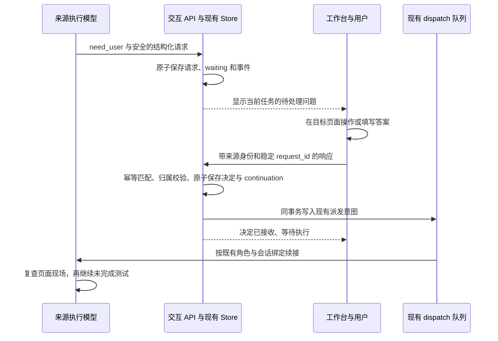
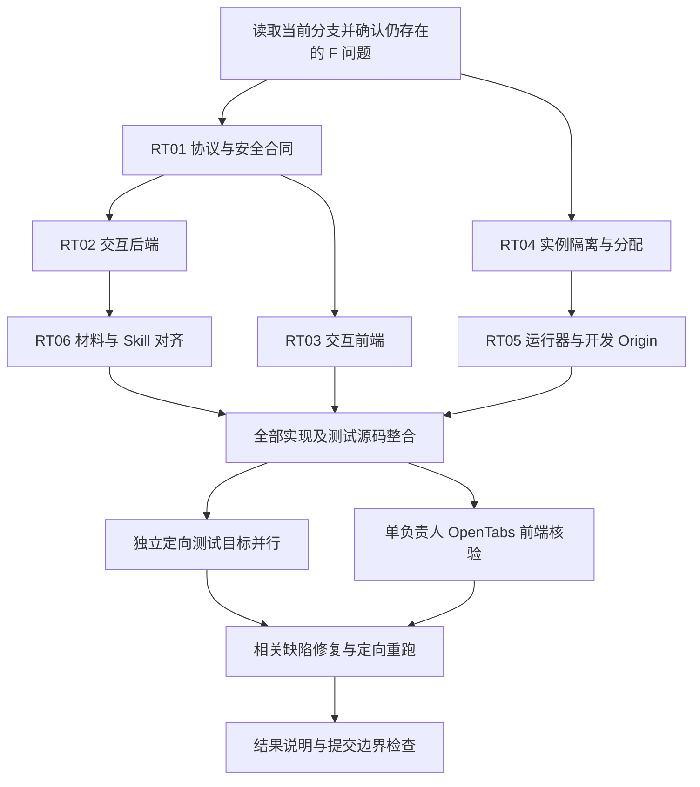

# DevFlow：OpenTabs、人机交互与 worktree 隔离整改开发计划

> 日期：2026-09-24  
> 仓库：`zephyrw/dev-flow`  
> 审查分支：`feat/opentabs-human-interaction`  
> 审查提交：`ab588667d96c0a39bc808e99cce8d1f1231f4697`  
> 比较基线：`1150e7ab88ac9a486406a1eca5bd81abce0928e2`  
> 原计划：`docs/plan/DevFlow_OpenTabs_Human_Interaction_Worktree_Plan.md`（见 [C23]）  
> 用途：供另一个执行 Agent 直接修复；不是重新设计 DevFlow，也不是测试执行真实性审计。

## 0. 审查结论与执行边界

**当前分支需要整改，建议修复本文件确认的问题后再合并。** 本次比较包含一个提交、54 个变更文件；主要沿人机交互的请求、落库、回答、续接链，以及本地实例的分配、启动、测试、退出链核查。以下列出 **15 项代码问题，其中 8 项 P1、7 项 P2**。[C00]

本次为源码与调用链审查，**没有执行仓库测试、构建、真实模型调用或 OpenTabs 实机验证**。下文“复现场景”是依据现有代码给出的确定输入和执行路径，不宣称这些场景已在用户电脑上实测。提交说明中的测试结论不作为本次代码正确性的证明，也不以缺少报告、截图或工具调用记录作为问题。

P1 表示会影响核心交互正确性、敏感信息保护或实例隔离，优先修复；P2 表示确认存在的兼容、可用性或边界实现问题，仍属于本次原计划范围。没有把无关历史问题、格式偏好和泛化重构列入整改。

### 0.1 已有正确方向应保留

- `ProfileRuntime.executeMaterials` 已向执行用途注入新的测试与浏览器 Skill，`executor_test`、`functional_fix` 等用途有对应材料选择逻辑。不要回退为只改 Markdown、不接实际运行入口。[C12][C13]
- 本地认证参考已经区分匿名、最小权限开发会话与真实身份验证。DevFlow 普通工作台不需要增加一套新的账号登录或全局免密旁路。[C14][C10]
- 新交互复用了 `need_user`、`WAITING_INPUT` 和现有 continuation；应修复其一致性，而不是另建人工审批调度器。[C01][C03]
- 可提交通用端口覆盖代码和忽略规则；实际端口、绝对路径、数据库、浏览器会话仍应留在本地。

### 0.2 不可突破的边界

**测试方法仍由执行模型按 Skill 落实。** 不新增浏览器验证 workflow 状态，不扫描 diff 强制增加测试关卡，不检查截图、报告、OpenTabs 调用次数，不建立证明账本、签名、探针或测试真实性审计系统。

本次允许加强请求归属、幂等、事务、安全显示和本地进程所有权；这些是功能正确性，不是测试卡控。规划／复核模型继续只审代码；实际自测、构建和 OpenTabs 核验交执行模型。用户回答不是测试通过声明，也不是改变正式计划范围的自动批准。

不得顺手修改账号轮换、额度策略、归档、安装产品化、模型路由策略或其他任务的业务。必要接线保留既有行为，不全仓格式化、不擅自升级依赖、不修改主工作区分支、不重写共享提交历史。

## 1. 问题索引

| 编号 | 优先级 | 确认的问题 | 主要修复位置 |
|---|---|---|---|
| F01 | P1 | 人工响应未绑定当前等待上下文，旧请求可影响错误轮次；会话标识使用错误 | 交互服务、Engine、会话归属解析 |
| F02 | P1 | 回答、回执、continuation 与调度入队不在同一事务 | 交互服务、Store 事务调用 |
| F03 | P1 | 幂等键不校验问题和响应内容，重用键会返回错误成功 | 交互服务、回执结构 |
| F04 | P2 | 问题与答案没有语义校验，可产生无法回答的问题或接受无效回答 | 交互合同、交互服务、UI |
| F05 | P1 | 目标 URL 中的凭据、认证查询参数与片段原样落库和展示 | 交互合同、归一化、UI |
| F06 | P2 | 旧等待兼容与结构化求助内容传递不完整 | current 查询、Engine、continuation |
| F07 | P1 | 弹窗草稿与请求 ID 未按问题隔离，可能向新问题提交旧答案 | UserInteractionDialog |
| F08 | P2 | 待处理请求刷新只依赖状态变化，失败后无恢复；异步回调可串任务 | TaskInteraction、交互 API |
| F09 | P2 | 新弹窗的焦点恢复路径失效，模态键盘约束未实现 | AppDialog、新弹窗挂载方式 |
| F10 | P1 | 开发与测试复用同一运行目录；实例登记与释放所有权不完整 | worktree-env、worktree-run、测试 helper |
| F11 | P1 | 分配锁同步忙等并强删活锁，登记文件写入也不安全 | worktree-env |
| F12 | P2 | 端口排除仅覆盖固定默认值和登记，漏掉主工作区自定义保留端口 | worktree-env、环境 Skill |
| F13 | P2 | 实际启动缺少绑定失败重试和实例身份就绪确认 | worktree-run |
| F14 | P1 | 停止只向包装进程发信号便释放资源，失败还可能返回成功退出码 | worktree-run、已有进程生命周期工具 |
| F15 | P2 | 开发 Origin 放行未绑定隔离数据实例，Fetch Metadata 放宽过大 | main、server、base-server |

原计划 R01–R15、A01–A25 继续有效。本文件 F 编号对应已确认代码问题；后文 RC 编号是针对这些问题的回归场景，不是平台必填证明字段。

---

## 2. 逐项缺陷与确定修复方向

### F01｜P1｜旧人工请求能够影响错误的等待轮次

**位置与事实。** `UserInteractionService.respondInteraction` 只验证记录属于 workflow、记录状态为 pending，以及提交的 `source_run_id` 与记录相同；并未验证当前 workflow 状态、当前 `WaitingContext.interaction_id`、当前计划、来源轮次或会话代数。随后直接读取“此刻的 waiting”并调用 `engine.resumeFromWaiting`。该 Engine 方法使用 `[w.state]` 作为迁移来源，并不是一个独立的“必须仍在原等待轮次”校验。[C01][C03]

此外，Engine 的请求创建把 `run.conversation_id` 直接传为 `rootConversationId`，没有通过会话树取得 UI 根节点，且没有填入 `sourceGeneration`。原生 CLI 会话 ID 与 UI 会话树根 ID 不能混用。[C03][C04]

**触发路径。** 轮次 A 产生请求 A；用户通过既有指导入口继续、更换来源上下文，或任务进入另一等待；旧请求 A 仍为 pending。旧页面再次提交 A，其 `source_run_id` 与旧记录匹配，但服务却把答案交给当前 waiting B。即使最终没有启动两个进程，这也已经是错误答案与续接目标绑定。

**修复要求。**

1. 新请求从真实 Run、现有会话树／绑定服务取得来源身份，分别保存 UI 根 ID、代数和原生会话 ID；不能填猜测值或把 generation 缺失默认为 0。
2. 回应新记录时验证：workflow、interaction、来源 Run、计划版本、UI 根与代数、当前 waiting 的关联均相符；当前状态确实允许回应这一次等待。来源 Run 的冻结职责与 dispatch context 为续接依据。
3. 将上述检查放在 F02 的事务内；已完成的同一请求重试先走 F03 的幂等回执，不因新代数而拒绝合法重放。
4. 删除“当前 waiting 缺失就把答案作为任意普通 feedback 自动发送”的兜底。无法确认来源时返回明确的过期／冲突信息，保持已有任务状态不变。
5. 普通指导、明确取消、替换计划或合法改变等待来源时，同步处理旧交互记录：消费为该问题的答案，或将旧问题标记 superseded。不能继续将历史 pending 当作 current。
6. `getCurrentInteraction` 按当前等待归属返回，而非只按创建时间寻找最后一条 pending。旧数据按 F06 的兼容规则处理。
7. 复核发出的求助回到复核来源；执行求助回到其原 execution purpose。不得因解决本项而统一重派 implement，或改变用户的冻结模型配置。

**完成标准：** 旧页面、旧计划、旧根、错误代数、另一个等待轮次的答案均不能改变当前工作流；合法回答只续接原归属。对应 RC01–RC03。

### F02｜P1｜“已回答”与“能够继续执行”存在持久化断点

**位置与事实。** `respondInteraction` 先写 interaction，再写 receipt，然后调用 `resumeFromWaiting` 或 `feedback`。注释写着同一事务，但该路径没有 `store.transaction`。路由也未包事务；`Store.put` 是独立数据库写入。现有 Store 已提供同步事务和持久化 outbox，可以复用。[C01][C05][C06]

**触发路径。** 回答和回执写入成功后，续接过程抛异常，或进程在写入 continuation／队列前退出。记录已 answered，重试先读到回执就返回 success，不再创建续接。用户看到提交成功，但任务未恢复。

**修复要求。**

- 使用现有 `Store.transaction`／`deduplicate`，原子完成“校验当前归属 → 保存决定 → 保存稳定回执 → 保存 continuation → 按原调度路径入队 → 记录状态事件”。取消分支也必须原子保存记录与回执。
- `resumeFromWaiting` 当前为同步方法，可在确认其调用链仅做数据库／同步状态操作后复用；若有副作用混杂，仅抽出必要的“准备 continuation 并入队”部分，不重写调度器。
- 事务内禁止 `await`、CLI 调用、浏览器操作或模型派发。提交后由已有 dispatch/outbox 机制消费。HTTP 回执表示“回答已接收、续接已排队”，不谎称模型已实际开始。
- 任一事务内写入失败，所有决定和派发意图回滚，用户可以用同一请求安全重试。
- 对本分支可能已产生的“answered + receipt，但无有效续接”的旧记录，提供局部恢复逻辑：核对来源和已保存的人类决定后补回原续接；来源已变则明确过期。不能扫描所有历史任务一律自动恢复。

**完成标准：** 落库任一点失败不会留下“不可重试、又未排队”的中间状态；重启后只恢复一次合法 continuation。对应 RC04–RC05。

### F03｜P1｜幂等键重用会返回与本次请求无关的成功

**位置与事实。** receipt 使用 `${workflowId}:${request_id}` 作键；命中时直接返回当前路径查出的 interaction，不比较回执中的 `interaction_id`，也不比较 action、choice、answer 或来源字段。[C01]

**触发路径。** 对问题 A 用请求 ID K 回答成功；之后对问题 B 或不同答案继续使用 K。接口返回 success，但可能既没回答 B，也没接受修改后的答案。当前 UI 的 F07 会进一步增加这类错误发生的机会。

**修复要求。**

1. 幂等请求的规范化内容必须包含 workflow、interaction、来源身份和完整决定内容。空白规范化应在生成指纹前统一完成。
2. 同一键、同一内容重放返回同一个持久化结果；同一键、不同问题或不同内容返回 `IDEMPOTENCY_CONFLICT`，不写任何状态。
3. 用不同键再次回答已经处理的问题，返回明确“已处理”，不重复派发。
4. 回执返回其实际绑定的问题与原决定，不把路径中新查到的另一条记录伪装成成功结果。
5. 优先复用 Store 现有 `deduplicate` 的内容校验机制；不要建立新的签名或证明系统。

**完成标准：** 同键同内容、同键不同内容、同键跨问题、多客户端不同键竞争的语义明确，最多一个决定生效。对应 RC06。

### F04｜P2｜请求和响应只检查字段类型，没有检查能否回答及答案是否合法

**位置与事实。** 输入 Schema 允许 `kind=question`、`allow_free_text=false`，同时没有任何 choices；UI 此时既无文本框也无选项，提交按钮永久禁用。响应端又接受与 kind 不符的 action、未定义的 choice、空回答；未知 choice 被直接当成文字传给模型。[C02][C01][C07]

**修复要求。**

- 操作型与问题型采用明确的语义约束。问题必须有可读问题正文，并至少有一种答案渠道；关闭自由输入且无有效选项的对象不能作为有效问题发布。
- 对字符串先 trim 再做非空／长度检查，选择 ID 唯一；纯空格不算问题或答案。
- 服务器验证 action 与请求类型匹配：操作型接受 confirm 或 cancel；问题型接受 answer 或 cancel。choice 必须属于当前问题；不允许自由输入时不能仅靠任意文本满足回答。
- 问题型 answer 至少提供合法选项或允许的非空文字。非法内容不得写 answered、不得入队。
- 前端禁用逻辑和后端保持一致，textarea 上限与服务端一致，但前端校验不能代替服务器校验。
- 格式错误的可选模型交互内容应安全降级为可回答的通用文本问题，不让 `need_user` 消失；`completed` 的无关损坏附件仍不得引入等待关卡。

**完成标准：** 每个发布的问题都可作答；无效响应明确失败且无状态副作用。对应 RC07–RC08。

### F05｜P1｜认证 URL 被原样持久化并显示

**位置与事实。** `UserInteractionTargetSchema.url` 只限制 http(s) 协议和长度，不去除 userinfo、查询参数和 fragment。交互服务原样保存 request，UI 将该 URL 同时作为 href 与显示文本。[C02][C01][C07]

**触发路径。** 模型提交带用户名密码、OAuth `code`、`access_token` 等参数或片段的目标 URL，内容进入交互实体并展示。这里确认的是敏感内容进入新的持久化／显示面，不夸大为已被外部攻击者获取。

**修复要求。**

1. 在解析入库之前统一处理 target URL，至少删除 username、password、query、fragment；存储与 UI 只保留不含凭据的页面位置。对认证回调或无法确认安全的定位，优先仅保留 origin 和非敏感 tab 定位。
2. 移除参数后的地址不能再标为“完整登录链接”。需要参数的登录流程让用户返回已打开的标签页处理，不将一次性授权 URL 当作普通附件或请求字段保存。
3. 对旧记录提供安全的读取投影并定向清理已存的敏感 target 字段；只改 UI 不足以解决落库问题。不要把原始值打印到迁移日志。
4. 对错误降级文本、resume_note 和 connection_hint 做长度限制及已知凭据模式脱敏；Skill 明确不提交密码、验证码、Cookie、token 或原始认证回调。
5. 继续限制安全协议和 React 文本渲染，不引入任意 HTML。不要声称通用字符串过滤能识别所有未知秘密。

**完成标准：** 使用合成的凭据样本验证：新实体、API 返回、页面链接和相关错误日志均不包含这些认证实值；用户仍能找到正确的待操作标签页。对应 RC09。

### F06｜P2｜旧等待与结构化求助在展示／续接时丢失内容

**位置与事实。**

- current 查询只查 `user_interaction` 实体，已有 `WaitingContext` 但无新实体的旧任务返回 null。[C01][C05]
- 执行意图解析遇到损坏的可选交互对象会整体丢弃；Engine 的降级只传 summary 与顶层 unresolved_questions，未利用 notes 或安全可读的问题内容。[C08][C03]
- review 求助创建未传结构化 `user_interaction`；fallbackQuestions 只把第一问放进弹窗。[C04][C01]
- 新记录中的 question、message、resume_note 未被合并进当前 WaitingContext 的问题／原文；现有 continuation 只传旧字段。在重建原生会话的恢复场景中，可能只剩摘要和“我已完成”，没有此次结构化请求的完整背景。[C03][C09][C13]

**修复要求。**

- 为旧 `need_user` waiting 提供稳定兼容视图；ID 由已存在的来源身份确定，不能每次 GET 创建一个随机问题。GET 可保持纯读取，首次合法响应在事务中建立对应记录并再次验证归属。
- 统一“安全解析／降级”函数，保留有用的 summary、notes、原问题，不因单个无效选项丢掉全部求助。没有结构化信息时使用可自由回答的通用问题，避免把所有业务提问降级成只需确认的操作。
- review 与 execute 复用同一安全规范化，只改变真实来源职责，不改变原来的角色路由。
- 一个请求仍只占一个主等待位置；多个已有问题可安全组合展示及回答，不静默截成第一问，也不新增多个子 Agent 并行占用 workflow waiting 的系统。
- `WaitingContext` 继续只关联 interaction ID；构造 continuation 材料时读取该请求的安全快照，提供原问题、选择项、用户决定和 resume_note。不要复制两套互相竞争的状态。
- 模型没有原会话可续接时，沿现有恢复路径传完整材料；若来源身份无法解析则明确需要恢复，不猜测会话或伪称原会话已续接。

**完成标准：** 旧任务可见可答；损坏显示材料可安全降级；执行和复核的新建／恢复会话都获得原问题和答案。对应 RC10–RC12。

### F07｜P1｜弹窗的答案草稿和幂等 ID 没有绑定问题身份

**位置与事实。** `UserInteractionDialog` 的 effect 虽依赖 `interaction?.id`，但打开状态下只有 requestIdRef 为空才生成新值。问题 A 换为 B 而弹窗保持打开时，原请求 ID、选项和文本不会清除。关闭弹窗时又全部清空，因此“稍后处理”会丢草稿。[C07]

**触发路径。** 同一组件由问题 A 切到 B，用户看到 B 的标题但保留 A 的选项／回答，提交时目标改成 B。网络错误后用户修改答案或点击取消，也可能在不同决定上继续使用旧请求 ID。

**修复要求。**

1. 以 `(workflowId, interactionId)` 作为草稿和提交状态的唯一键。不同问题绝不复用选择、回答、错误或请求 ID。
2. “稍后处理”、Esc、遮罩和关闭只收起，不回答、不取消、不清空该问题草稿。任务切换仍按问题归属保留草稿；敏感凭据本来就不应填入该表单。
3. 每次提交创建不可变的请求快照。相同快照的网络重试复用相同 request_id；修改 action／choice／answer 后创建新请求，不能以相同键发送另一份内容。
4. 请求发出后保存其 workflow、interaction 和本次 attempt 身份。旧请求完成只能更新自身记录，不能清空／关闭已切换的问题 B。
5. 将关闭和获取下一个请求的职责放在一个明确入口。避免 `onResponded` 打开下一条后，旧 `handleSubmit` 又无条件调用 `onClose` 把它关掉。
6. 收起中的请求也要保留其发送中／已接收状态；不能重复触发决定。服务端仍以 F01–F04 为最终边界。

**完成标准：** A/B 切换无答案串用；收起重开保留草稿；网络重试正确；旧响应不能关闭新问题。对应 RC13–RC15。

### F08｜P2｜待处理请求无法可靠随事件和网络恢复更新

**位置与事实。** `TaskInteraction` 的新查询 effect 只依赖 `w.id`、`w.state`、dismissedInteractionId；错误被静默忽略。状态保持 `WAITING_INPUT` 时，首次获取失败、其他窗口取消或请求变化都不会必然重新查询。`onResponded` 的额外异步请求也没有任务切换保护。[C15][C16]

**修复要求。**

- 用现有工作流事件／事件游标机制触发该资源失效刷新，涵盖 request-created、responded、cancelled、superseded；同一 workflow 状态值没变，也必须更新显示。
- 持久化决定后发出适量通用交互事件，沿用 Store 事务提交后发布机制；不创建浏览器监控服务或模型轮询任务。
- 请求状态按 workflow 查询键隔离。任务切换立即停止显示旧任务 modal，取消或忽略旧 GET 的结果；手动响应后的 refresh 同样使用来源身份校验。
- GET 失败显示可理解的错误和重试入口，保留已知状态而非假装没有请求；网络恢复／窗口重新聚焦可做一次刷新，不无限紧密轮询。
- 已收起的同一个请求在普通刷新时不反复弹出。其他任务只显示待处理提示，不抢当前任务焦点。
- 已接收但尚未运行的回答显示“已接收／排队”，不要根据 HTTP 200 自行显示“模型已恢复”。

**完成标准：** 同状态更新、临时网络失败、多窗口响应、快速切任务均能收敛到正确的当前请求。对应 RC16–RC17。

### F09｜P2｜新模态弹窗关闭时焦点恢复路径失效

**位置与事实。** `UserInteractionDialog` 在关闭时直接不渲染 `AppDialog`，但 AppDialog 恢复焦点放在 `isOpen=false` 的 effect 分支；被直接卸载时该分支不会执行，cleanup 只重置 body overflow。现有 AppDialog 也没有 Tab／Shift+Tab 约束或背景 inert，只处理 Escape；本次只增加了唯一标题 ID。[C07][C17]

这是原计划要求的新交互键盘行为未完成，不要求全站重做 UI。W3C 的模态模式要求焦点停留在活动弹窗内，并在关闭后回到合理位置。[E02]

**修复要求。**

- 修复关闭与卸载两种路径的焦点恢复，清理延迟 focus 定时器；原触发元素已不存在时选择合理的任务内焦点，而不是聚焦已卸载节点。
- 在现有 AppDialog 中补齐焦点循环与背景不可交互处理，动态禁用／移除按钮也不能让焦点逃逸。不要把包含 portal 的整个 body 设置 inert 而同时禁用弹窗自身。
- 统一当前活动模态管理；已有计划审批／设置弹窗打开时，新请求先显示待处理提示，避免多个全局 Escape 监听器同时关闭不同窗口。
- body 滚动锁要恢复先前值，并尊重仍然活动的模态；不能一个窗口卸载便解锁另一个。
- 人工交互的收起继续采用 F07 的保留草稿语义，不因共用容器要求用户丢弃答案。

**完成标准：** 键盘可完成整个交互；Tab 不进入背景；关闭／卸载后焦点恢复；其他既有弹窗不回归。对应 RC18。

### F10｜P1｜实例隔离未贯穿目录、数据库、登记和释放

**位置与事实。** `runTest` 直接复用 `readInstanceConfig()`，把开发实例的 `run_dir` 传成 `DEVFLOW_TEST_RUN_DIR`。`loadTestInstanceConfig` 因此将测试 SQLite 指向 `<run_dir>/state/devflow.sqlite`，与开发 API 的 `storage_root` 下数据库相同。[C18][C19][C20]

更重要的是，`tests/e2e/fixture-server.ts` 在启动时会尝试删除 `instance.sqliteFile` 及其 `-wal`、`-shm` 文件。用新运行器在已有开发实例旁启动此 E2E，可能删除开发数据文件；文件系统不允许删除时，也会造成启动失败。不能把这一风险仅描述为报告互相覆盖。[C24]

另外，`reservePorts` 的默认 runDir 对同 worktree 的所有实例都相同；登记替换只比较 instance_id，未连同规范化 worktree 身份判断。`releasePorts` 不验证 manifest 属主，固定删除调用者默认目录下的 instance.json，自定义 runDir 又不会按实际位置清理。[C18]

**整改前注意：不要在保留有用开发数据的实例旁，用当前 worktree-run test 启动 E2E。先修隔离，保留必要数据副本；不要为测试此缺陷使用用户真实数据库。**

**修复要求。**

1. 交互式 dev 实例与每次 test invocation 使用不同 instance ID、目录、端口和生命周期。测试不读取并继承 dev 的 state/config。
2. 采用明确布局：交互式实例位于 `.cache/devflow-local/dev/<instance-id>/`；每个测试位于 `.cache/devflow-local/tests/<target-id>/<invocation-id>/`。一个小型本地指针可指向当前 dev，但它不是所有测试共享的 manifest。
3. registry 主键为“规范化 worktree 身份 + instance ID”，每个条目保存 runDir、manifest 路径和资源归属。同名 instance ID 出现在其他 worktree，不得覆盖其条目。
4. reserve、read、release 均校验身份和目录归属。release 只删除匹配条目的 manifest；自定义 runDir 使用记录内实际路径；未知 ID、其他实例 ID 不得删除当前实例的文件。
5. 所有运行目录必须在允许的本地临时范围内；拒绝主服务数据、真实认证目录和与其他活动实例重叠的目录，处理路径大小写、真实路径及链接边界。不能让任意 `--run-dir` 覆盖用户数据。
6. 夹具的破坏性初始化只能作用于显式标识为测试且本次拥有的目录。路径相同但来源为 dev 或所有者不符时，在删文件前拒绝。不要靠“测试端口不是 4810”推断数据库安全。
7. 一个测试结束只释放本次测试实例；dev 和其他测试持续运行。临时数据库、manifest 和运行 YAML 不提交。

**完成标准：** dev + 两个并行 test invocation 的端口、数据库、报告、manifest 全部独立；E2E 初始化不会触及 dev 数据；释放一个不破坏其他实例。对应 RC19–RC21。

### F11｜P1｜分配锁会阻塞事件循环并在超时后删除仍被持有的锁

**位置与事实。** FileLock.acquire 使用同步 busy wait；超时后直接 `rmdirSync` 并重新 mkdir，没有核对持有者。reservePorts 持锁期间又等待异步端口探测；锁释放不核对 token。登记使用直接 writeFileSync，JSON 损坏时被当成空登记继续分配。[C18]

**触发路径。** 同一 Node 进程并发调用两个 reservePorts：第一个在异步探测时让出执行，第二个同步忙等，阻塞第一个完成；第二个到期删掉第一个的锁，之后两个操作可能同时进入临界区。独立进程的较慢分配也可能被同样夺锁。写入中断后的半截 JSON 又会让后续操作遗忘所有登记。

**修复要求。**

- 将等待改为异步、有上限的让出执行，不在主事件循环中忙等。
- 锁内保存随机所有权 token、创建者身份与时间等必要信息；release 只释放自己仍持有的那一把锁。
- 不以时间经过作为删除活锁的充分条件。超时可明确失败；安全回收陈旧锁前要确认原所有者不再持有，并以原子步骤避免删除后来者的新锁。无法确认时不强夺。
- 登记文件先校验结构，再用同目录临时文件与原子替换写入。JSON 损坏时保留原件并报错／按可验证本地 manifest 恢复，不能静默清空。
- registry 与实例配置生成失败时，只回滚本次新增条目；不损坏已有实例。为多文件提交保留可辨识的本地准备／提交记录或等价的最小恢复标记，不建立新服务。
- 分配进程 PID 与真正的服务进程 PID 分开记录；`reserve` CLI 结束不代表它保留的端口可以自动回收。

**完成标准：** 同进程并发不锁死／夺锁，跨进程分配不重复，超时不删除活锁，登记写入中断可安全处理。对应 RC22–RC24。

### F12｜P2｜只排除三个固定默认值，未排除主工作区的自定义保留端口

**位置与事实。** reservePorts 排除 5173、4810、14811 和已有 registry 条目；不读取 worktree 列表、主工作区配置，也没有使用原配置中的 frontend/backend 范围。即使主工作区预定的自定义端口当前未监听，也可能被分配给新 worktree。[C18]

**触发路径。** 主工作区配置后端端口为候选范围内的一个非默认值，暂时关闭；新 worktree 将其选为可用端口，主工作区再次启动冲突。预先探测操作系统监听只能避免“已占用”，无法保护“已约定但暂未运行”的端口。

**修复要求。**

1. 使用 `git worktree list --porcelain` 与 common-dir 识别当前、主工作区和兄弟 worktree。规范化路径，不能只靠分支名或 instance_id。
2. 排除集合包含：产品默认值、主工作区可读取的配置／本地实例清单、其他未释放实例、同 worktree 其他实例、调用者明确提供的保留端口，以及实际监听占用。
3. 优先使用已配置的候选池；允许辅助服务按明确参数请求端口。调试 inspector、独立 HMR、preview 等只有实际启动时才需要分配，不人为新增监听器。
4. 不执行未知 worktree 中的配置脚本来“发现端口”。优先读已有 JSON/YAML/manifest 或明确的参数；仅存在于过去终端环境、无任何记录的自定义值无法凭空推断，应由 Skill 在首次登记时补入本地保留集合。
5. 前后端代理、baseURL、WebSocket 和实际使用的主机名一并传递；保留原主工作区默认值，不将实例实值写入受跟踪文件。

**完成标准：** 暂停状态的主工作区自定义保留端口仍不可分配；兄弟实例、同 worktree 并行实例、必要辅助端口均不冲突。对应 RC25。

### F13｜P2｜预分配成功被当成启动就绪，没有处理真实绑定竞态

**位置与事实。** runDev 使用已有 manifest 后立即启动 API 和 Vite，未验证 manifest 新鲜度、工作区归属、实际服务身份，也没有健康就绪检查或实际 bind 失败后的重分配。命令依赖当前 cwd，而非明确设置实例 worktree 根目录。[C19]

**触发路径。** reserve 的探测 socket 已关闭，另一进程先占用端口，真正服务得到 EADDRINUSE；运行器只退出而不换端口。或者旧 manifest 被继续使用，运行器打印“隔离环境”但无法确认浏览器连接的是哪个实例。

**修复要求。**

- 启动前校验当前根目录、registry 与 manifest 的身份；不能把发现一个 JSON 文件等同于已有可用环境。
- 子进程显式设置 `cwd=instance.worktree_path`；命令／配置通过参数数组与既有跨平台入口传递，不依赖从仓库根目录手动执行。
- 按依赖启动：API 实际绑定并验证 `/api/health` 中的实例标识和运行来源后，再使用对应 backend port 启动／确认前端代理。HTTP 200 本身不足以判断归属。[C10]
- 真正的 EADDRINUSE 走有上限重试：停止并确认本次已启动子进程退出，撤销本次失败登记，重新分配并完整重建代理、Origin、测试配置，再启动；不结束外来占用者。
- 其他启动错误应原样报告，不将所有错误伪装成端口冲突循环重试。调试环境就绪状态是本地脚本信息，不写成新的 workflow 状态。
- 输出实际验证过的 frontend/backend 地址与失败原因；不要在健康确认前宣称“已启动成功”。

**完成标准：** 绑定竞态能够安全重试；陈旧／错误实例不能被当成成功；从 worktree 子目录调用仍使用正确 cwd。对应 RC26–RC27。

### F14｜P1｜停止未等待真实服务结束，失败退出可能被改写为 0

**位置与事实。** runDev cleanup 对 `pnpm`／shell 包装进程调用 kill 后立即释放端口登记并 `process.exit(0)`，没有等待目标服务与子孙进程结束。cleanup 可重入，spawn error 没有统一处理。runTest 没有自己的信号转发与释放流程，`code ?? 0` 会把信号退出视作成功；runDev 的非零子进程退出也调用最终返回 0 的 cleanup。[C19]

Node 的 `killed` 仅表示信号已发送，不表示进程已退出；不能据此认定服务停止。包装进程退出也不保证所有后代进程退出。[E01]

**修复要求。**

1. 采用一个幂等的 cleanup Promise，记录最初退出原因，SIGINT、SIGTERM、spawn error 和子进程退出共用同一清理路径。
2. 启动时保留本次拥有的真实进程关系。优先复用仓库已有可独立使用的进程生命周期能力；不能为此接入 workflow 调度或新建守护服务。
3. 只对本次拥有的进程树发出停止请求，等待退出／close；必要时在合理宽限后对已确认的同一进程树升级终止。Windows 包装入口与 POSIX 进程组分别正确处理，不使用按名称杀所有 node/pnpm 的命令。
4. 进程停止确认之后再释放本实例登记和 manifest。无法确认退出时保留可恢复的本地记录，输出明确错误，不能假称资源已释放。
5. 子进程非零退出保持失败语义；信号中断明确为中断或非零退出，不能当成功。一个必要服务意外正常退出也要结束组合环境，不留下半个“成功运行”的环境。
6. runTest 无论成功、失败、启动异常还是用户中断都走自己的 finally／清理逻辑，只释放其新建测试实例，不触碰仍在使用的 dev 实例。
7. 处理带空格路径、Windows `.cmd` 入口及参数边界；不要将任意命令参数拼成未经处理的 shell 字符串。

**完成标准：** 停止 A 后 A 的真实监听全部退出，主工作区／B 正常；失败与中断不会得到 0；连续停止不会重复释放别人的资源。对应 RC28–RC30。

### F15｜P2｜开发 Origin 例外没有验证隔离实例，且扩大了跨站请求范围

**位置与事实。** createBaseServer 依据 `NODE_ENV !== production`、`DEVFLOW_LOCAL_DEV=1` 和一个 hostname 为 localhost／127.0.0.1 的 URL 放行开发 Origin；main 没有验证此时 storage_root 是否仍指向正常主服务数据。Fetch Metadata 又在存在任意 devFrontendUrl 时接受 same-site、cross-site，而不要求请求自身带匹配的 Origin。[C10][C11]

**准确边界。** 写请求仍要求精确允许的 Origin 和 JSON，WebSocket 也仍检查 Origin，因此不能把现状描述成“任意网站都可写 API”。确认的问题是：原计划要求的隔离实例前置条件没有落实，且无 Origin 的跨站请求过滤被扩大。

**修复要求。**

- main 传递开发入口前核对显式开发模式、非 production、回环绑定、当前隔离实例身份和允许的数据根。不能仅凭两个环境变量就把正常 `.devflow` 数据实例当隔离测试环境。
- developmentFrontendOrigin 只接受精确的 http(s) origin：禁止凭据、路径、查询、片段和任意本机端口通配；与本次实例清单一致。生产模式忽略／拒绝开发放宽。
- 正常 Vite 同源代理不需要无条件放行 cross-site。保持 Fetch Metadata 默认边界；确有适配需求时也必须同时匹配明确的开发 Origin，不能对缺少 Origin 的跨站请求放宽。
- 保留 Host、Content-Type、CSRF、WebSocket Origin 和 humanCheck 的模型令牌限制。不要通过改写 Origin 伪装同源来规避服务器检查。
- 所有放行仍只是本地双端口调试能力，不扩展为业务权限旁路。

**完成标准：** 精确隔离开发入口可写、可接事件流；主数据目录、production、外部／兄弟 Origin、跨站无 Origin 请求均不获得该例外。对应 RC31–RC32。

---

## 3. 目标实现合同：修薄接线，不增加工作流层级

### 3.1 人工响应的最小原子边界

以下为设计伪代码，函数名可按现有项目命名落实；不得复制为新的完整消息调度框架。

```ts
// HTTP 层完成既有 human / Origin / CSRF 检查。
const input = parseAndNormalizeHumanResponse(body);

const receipt = store.deduplicate(
  `interaction-response:${workflowId}:${input.request_id}`,
  canonicalDecisionEnvelope(workflowId, interactionId, input),
  () => {
    // deduplicate 已开启同步事务。先命中相同内容回执，再检查当前状态。
    const current = requireBoundCurrentInteraction(workflowId, interactionId, input);
    validateAnswerAgainstQuestion(current.request, input);

    if (input.action === 'cancel') {
      saveCancelledDecision(current, input);
      emitInteractionChangedAfterCommit(current);
      return acceptedReceipt(current, 'cancelled');
    }

    saveAnsweredDecision(current, input);
    const answer = composeSafeAnswerWithOriginalQuestion(current, input);
    // 只调用已有同步 continuation / enqueue 链；这里不能运行模型或 await。
    engine.resumeFromWaiting(workflowId, answer, current.waiting);
    emitInteractionChangedAfterCommit(current);
    return acceptedReceipt(current, 'queued');
  },
);
```

“queued” 是响应处理状态，不新增 workflow 状态。真正执行仍由现有队列／dispatch 完成。收到成功回执只意味着决定与恢复意图已持久化；UI 用已有运行状态展示实际执行情况。

问题创建也应将“请求实体、waiting 关联、状态转移、通用事件”放入同一同步事务。对同来源重复提交相同内容返回原请求；同来源不同内容不静默覆盖用户已看到的问题。合法的新轮次替换旧等待时，按来源关联将旧记录 superseded。

### 3.2 交互身份及返回数据

现有 UserInteractionRecord 的字段优先复用，只补当前实现确实缺失的信息。至少区分：

| 身份 | 来源 | 用途 |
|---|---|---|
| workflow_id | 真实当前任务 | 防止跨任务回应 |
| source_run_id / source_plan_revision | 当前来源 Run / 计划 | 防止旧问题影响新轮次 |
| UI root_conversation_id / source_generation | 现有会话树解析结果 | 防止旧根／代数回应 |
| native conversation/session identity | 已有绑定及 continuation | 正确恢复原生会话，不与 UI ID 混用 |
| interaction_id | 服务端生成或稳定旧等待兼容 ID | 唯一问题身份 |
| request_id + 规范化响应内容 | 用户本次提交 | 幂等重放与冲突检测 |

新请求字段不能由模型随意指定后续 workflow、角色或模型。当前查询返回已校验的来源快照供 UI 提交；不能在前端以当前选中任务的身份覆盖请求自己的来源。

取消只取消这次求助并保留暂停，不自动派发模型，不代替人工验收。通过既有指导入口显式继续时按其原语义恢复，并清理／保留正确的交互历史。

### 3.3 本地环境与测试实例边界

```text
<worktree>/.cache/devflow-local/
  current-dev.json                    # 可选：仅指向交互式 dev 实例
  dev/<dev-instance-id>/
    instance.json
    devflow.runtime.yaml
    state/
  tests/<target-id>/<invocation-id>/
    instance.json
    devflow.runtime.yaml
    state/
    reports/
    browser/

<git-common-dir>/devflow-local/
  ports.json                         # 规范化 worktree + instance-id 归属
  allocation.lock/                   # 短时、带所有权的本地锁
```

目录和具体命名可做最小适配，但这三个约束不可改变：**dev 与 test 分开；每次并行测试独立；释放按实际归属。** 当前默认前端、后端、测试端口不因本次整改改变；通用环境变量支持继续保留。

端口不能靠哈希或探测一次就保证终身无冲突；最终以实际 bind 成功与实例身份为准。同一浏览器的 Cookie 也不能只靠端口分隔；继续遵守原 Skill 的会话隔离和最小权限策略。

### 3.4 不引入新调度的时序



图中 API 不识别页面是否登录，也不判断截图、布局或测试是否通过。是否需要真实登录、怎样操作浏览器与怎样判断结果，仍归执行模型。

## 4. 文件级实施任务与分工

执行 Agent 开始前重新读取当前分支：如果 HEAD 已前进，只修仍存在的问题，记录已经解决的 F 编号；不得将本次审查快照覆盖回较新实现。原计划要求与本文件修复边界同时有效，不另建替代 implementation_plan.md。允许在同目标、授权范围内做必要的参数传递、接线、资源释放与回归源码补齐。

### RT01｜交互协议与安全归一化

**对应：** F04、F05、F06，以及 F01/F03 的字段合同。

**文件：** `packages/contracts/src/user-interaction.ts`、`packages/contracts/src/index.ts`、`packages/core/src/round-intent.ts`；需要共享时新增一个小型交互归一化模块，避免服务、Engine、前端各自实现不同规则。

**输入：** 原结构化输出、旧 need_user 形式和原计划的通用交互要求。

**输出：** 可回答的两种请求、合法响应语义、安全 target 投影、可用于旧等待的稳定表示；新增字段通过实际原生输出解析入口，不因类型拼装丢失。严格生成 schema 与宽容接收语义要区分：坏的可选显示附件不得抹掉明确的 need_user，也不能让 completed 变成等待。

**不可改：** 现有外层执行意图、角色分类、已批准计划语义、生产鉴权。

### RT02｜交互持久化、归属、幂等与续接

**对应：** F01–F03、F06。

**文件：** `packages/core/src/user-interaction-service.ts`、`packages/core/src/engine.ts`、`packages/core/src/waiting-context.ts`、`apps/api/src/routes/user-interactions.ts`；必要接入已有会话树／会话绑定、普通指导和状态事件入口。

**依赖：** RT01 先确定接口即可并行实现，不必等待所有文件完成。

**实现顺序：** 来源身份解析 → current 有效性 → 原子决定与幂等 → 安全 continuation 材料 → 普通指导／取消／新计划的旧请求处理 → 旧等待兼容。

**输出：** 当前问题只接受其当前合法用户响应；成功决定与现有调度入队不可分割；错误不留下不可恢复状态；复核与执行恢复归属不变。

**不可改：** 不增加新的模型或浏览器调度器，不在响应事务内启动 CLI，不自动更换模型或重跑已经完成的测试。

### RT03｜人机交互前端与必要模态行为

**对应：** F07–F09，同时使用 RT01/RT02 的合同。

**文件：** `apps/web/src/components/UserInteractionDialog.tsx`、`user-interaction-api.ts`、`user-interaction.css`、`apps/web/src/interactions.tsx`、`AppDialog.tsx`；仅必要时补一个按问题身份管理草稿／请求的 hook。

**输出：** 草稿与请求 ID 独立；收起不丢回答；异步结果不跨任务；当前请求可随事件和网络恢复更新；键盘、焦点和关闭语义完整。

**接口约定：** API 返回“已接收／排队／取消”与实际运行状态分开。前端不得自行把 confirmed 映射为 completed，不得替用户点击真实人工确认。

**不可改：** 不重做工作台整体布局，不把已有计划审批、操作授权或用户向模型提问混成同一个业务状态。

### RT04｜本地实例模型、端口登记与分配锁

**对应：** F10–F12。

**文件：** `scripts/dev/worktree-env.ts`、`tests/helpers/test-isolation.ts`、`tests/e2e/fixture-server.ts`；必要的类型／本地辅助模块，以及原有忽略规则。

**输出：** dev/test/并行实例独立的 runDir 与资源归属；安全的短时分配锁；原子登记与失败清理；主工作区自定义保留端口得到保护；任何破坏性测试初始化只触及本次测试目录。

**注意：** 测试 fixture 的删除保护是为了防止误删业务数据，不是验证“执行模型是否真的测试”的证明探针。

**不可改：** 不把临时值写入 `.gitignore` 无法保护的受跟踪配置；不随意删除旧 registry、主数据、认证目录、他人进程或整个 `.cache`。

### RT05｜本地运行器启动、退出与开发入口边界

**对应：** F13–F15，并消费 RT04 的实例合同。

**文件：** `scripts/dev/worktree-run.ts`、`apps/api/src/main.ts`、`server.ts`、`base-server.ts`；必要的 Vite 参数接线及可复用的现有进程辅助。

**输出：** 正确 cwd、实际实例就绪校验、有限 bind 重试、可靠的进程树停止、真实退出码、隔离数据前提下的精确开发 Origin。

**不可改：** 主服务默认端口／数据目录语义、生产安全检查、现有账户与模型调度。不要为本地 CLI 引入一个新的常驻服务。

### RT06｜Skill、运行材料、安装资源的相关对齐

**对应：** F06、F10、F12–F15 的使用约束，以及原 R09/R12/R15。

**文件：**

```text
packages/skills/devflow-execute/references/user-interaction.md
packages/skills/devflow-execute/references/worktree-local-environment.md
packages/skills/devflow-test/SKILL.md
packages/skills/devflow-test/references/local-auth-strategy.md
packages/skills/devflow-test/references/real-browser-verification.md
packages/core/src/execution-skill-materials.ts
packages/runtime/src/profile-runtime.ts
packages/adapters/agy/src/handoff.ts
```

仅修改与修复直接相关的字段说明、命令和资源引用；现有正确规则不重写。保持六个顶层 Skill，沿用递归分发，不复活已退役的旧 browser-accept Skill。

执行／测试入口必须携带完整安全的人工请求背景；用户答复后先复查页面，不能以确认替代真实登录事实。环境文档明确每次 test invocation 独立，不再推荐复用 dev 的 runDir。临时配置仍不得提交、合并或打包进生产。

### RT07｜整合、定向测试与本次前端真实浏览器回归

**依赖：** RT01–RT06 的功能实现、接线、异常处理和测试代码全部完成并整合后，再进入正式测试阶段。

独立开发模块可分给多个子 Agent 并行实现；共享合同和 Engine 等公共文件指定唯一整合负责人。测试时按独立文件／类／用例分配并行目标，每条命令一个明确目标；失败目标由对应负责人修复并定向重跑。一个失败不阻塞无关目标，只有真实资源依赖才局部串行。

完成后只记录实际修复、实际执行结果和剩余问题。不要为了证明测试声明编写额外核验器、签名、报告账本或截图审计系统。

### 4.1 推荐并行责任划分

| 负责人 | 独占修改范围 | 与他人接口 |
|---|---|---|
| A：协议与交互后端 | RT01/RT02；contracts、服务、Engine 交互段 | 向 B 提供 current/response 合同；与整合者协调 runtime |
| B：前端交互 | RT03；dialog、hook、TaskInteraction | 只按确定合同消费，不替后端补错误路由 |
| C：本地环境 | RT04/RT05；分配、运行器、开发 Origin | 与整合者约定 main/server 接线 |
| 主 Agent／整合者 | RT06、公共文件整合与最终差异检查 | 不重复重跑所有子 Agent 已通过且未受影响的目标 |

只有一个可独立目标或客户端不支持子 Agent 时，说明实际能力，不虚构并行；浏览器共享连接时指定一个操作者，其余非浏览器目标仍可并行。



---

## 5. 定向回归场景

以下是修复具体代码问题所需的验证目标，不要求平台逐项收集、认证或阻塞。可复用已有测试文件；无需按 RC 编号新建 32 个文件。

### 5.1 人工响应、兼容与恢复

| 编号 | 场景与操作 | 预期 | 对应问题 |
|---|---|---|---|
| RC01 | A 的旧请求仍在旧窗口；当前 waiting 已改为 B；提交 A | 返回过期／冲突，B 的状态、答案和队列不变 | F01 |
| RC02 | 错 workflow、source Run、计划版本、UI 根或 generation | 各自拒绝；无记录、continuation、队列副作用 | F01 |
| RC03 | execute、executor_test、functional_fix、review 各自合法求助后回答 | 回到原职责、工作区、正确会话绑定；不统一重派 implement | F01 |
| RC04 | 在决定、回执、continuation、队列写入处分别模拟持久化异常 | 整体回滚；同一响应可重试；不留下 answered 未排队 | F02 |
| RC05 | 回答已原子提交但尚未派发时关闭并重开存储／服务 | 现有恢复链只派发一次；取消不派发 | F02 |
| RC06 | 相同键相同内容重放、同键不同答案／问题、不同键竞争同问题 | 合法重放返回原结果；冲突拒绝；最多一个决定生效 | F03 |
| RC07 | 无选项且禁止自由文本的问题；空白标题／正文；重复 choice | 安全归一化为可回答问题或明确拒绝无效输入；不出现死表单 | F04 |
| RC08 | question 收 confirm、未知 choice、空 answer、禁用自由文本时只填文本 | 服务端拒绝无效决定且不续接；合法选择和文字正常 | F04 |
| RC09 | 合成 URL 含 userinfo、OAuth code、token、fragment；再查询及展示 | 新存储和返回中无这些实值；旧记录安全投影／定向清理 | F05 |
| RC10 | 旧 waiting 无交互实体，重复刷新后回答 | 稳定同一问题，可答且只续接一次；来源不明时不猜测 | F06 |
| RC11 | 损坏的可选对象有安全 message/question；旧输出仅 notes；多个问题 | 保留必要求助内容并可回答，不能只显示泛化完成按钮 | F06 |
| RC12 | 结构化 question / resume_note 在 review 与新建恢复会话中传递 | 原问题、选项、回答和下一步均进入安全恢复材料 | F06 |

这里的异常注入只是验证数据库事务和错误处理，不是对模型测试执行记录做真实性取证。涉及 Store 的一致性用真实临时 Store 验证；可以替代外部付费模型边界，但不能把本次交互服务本身全部 mock 后据此判断链路正确。

### 5.2 前端交互

| 编号 | 场景与操作 | 预期 | 对应问题 |
|---|---|---|---|
| RC13 | 输入 A 回答，稍后处理、关闭、重开，再切到 B | A 草稿保留，B 不继承 A 的选项／文字／request_id | F07 |
| RC14 | 响应已接收但网络失败；同内容重试；随后改变内容或取消 | 同快照重试复用键；不同决定不复用键；无错误成功 | F07/F03 |
| RC15 | A 请求响应延迟期间打开 B／切换任务；A 回调之后到达 | 不关闭 B、不清空 B 草稿、不将 A 结果写入 B | F07/F08 |
| RC16 | 首次 current GET 失败，但 workflow 保持 WAITING_INPUT | 显示可重试错误；网络恢复／手动重试取得真实问题 | F08 |
| RC17 | 另一窗口取消／响应／替换请求而 workflow 状态值未变 | 原窗口刷新到真实记录，不继续显示可提交旧问题 | F08 |
| RC18 | 用 Tab、Shift+Tab、Esc 完成交互；卸载和多个弹窗竞争 | 焦点不逃逸，关闭后恢复正确位置，不同时关闭别的弹窗 | F09 |

### 5.3 环境与资源生命周期

| 编号 | 场景与操作 | 预期 | 对应问题 |
|---|---|---|---|
| RC19 | dev 写入一条临时样本数据，再启动 E2E fixture | E2E 不能删除／替换 dev SQLite/WAL/SHM；dev 样本仍在 | F10 |
| RC20 | 同 worktree 并行两个 test invocation，并保留 dev | 三套必要端口、state、报告和 manifest 独立 | F10 |
| RC21 | 不同 worktree 使用相同短 instanceId；自定义 runDir；错误 ID release | 不覆盖／删除另一实例；按实际所有权释放正确目录 | F10 |
| RC22 | 同一 Node 进程并发 reserve；两个独立进程并发 reserve | 不同步忙等卡住；不同时持锁；登记无丢失／重复 | F11 |
| RC23 | 分配持锁超过等待阈值；另一申请超时 | 活锁不被删；原所有者正常完成并释放自己的锁 | F11 |
| RC24 | registry JSON 损坏；替换／manifest/YAML 写入失败 | 不清空其他预留；保留可恢复数据；只撤销本次资源 | F11 |
| RC25 | 主工作区自定义端口暂未监听，另有兄弟和同工作区实例 | 所有已约定端口进入排除，候选池遵守配置 | F12 |
| RC26 | 探测后抢占候选端口，再执行真正启动 | 有限重试，代理／Origin 同步更新，不结束抢占者 | F13 |
| RC27 | 陈旧 manifest、错误 worktree、同端口错误服务、从子目录调用 | 不误报就绪；使用正确 cwd 和实例身份 | F13 |
| RC28 | dev A 与 dev B 并行，停止 A；包装进程下有服务子进程 | 只停止 A 所有拥有的服务；A 真正退出后才释放 | F14 |
| RC29 | API/Vite/test 非零退出、被信号终止、spawn error、重复停止 | 不返回假成功；幂等清理；无遗留或误删资源 | F14 |
| RC30 | 测试成功／失败／中断后清理，同时 dev 继续运行 | 只释放本次测试；dev 配置、端口、数据保持可用 | F14/F10 |
| RC31 | 合法隔离开发前端执行写请求并接收 WebSocket；另用兄弟 Origin | 本实例成功，兄弟／外部被拒绝；不放宽 human 权限 | F15 |
| RC32 | production、主数据根、非法开发 URL、跨站且无 Origin | 不启用开发例外，原安全边界保持 | F15 |

文件删除、进程停止与端口竞争的测试必须使用临时目录、自己启动的进程和合成数据。不得用主服务真实数据复现 F10，不得为验证停止逻辑结束用户的真实模型会话。

### 5.4 建议复用的测试文件

```text
tests/unit/user-interaction.test.ts
tests/unit/user-interaction-continuation.test.ts
tests/unit/user-interaction-ui.test.tsx
tests/unit/worktree-local-environment.test.ts
tests/unit/worktree-config.test.ts
tests/unit/execution-skill-materials.test.ts

tests/integration/user-interaction.test.ts
tests/integration/user-interaction-recovery.test.ts
tests/integration/worktree-local-environment.test.ts
tests/integration/local-dev-origin.test.ts

tests/e2e/user-interaction.spec.ts
tests/e2e/worktree-browser-isolation.spec.ts
```

这些是当前分支存在的实现位置索引，不代表本次已运行它们，也不要求为了证明已有结果而全部重跑。由执行 Agent 按实际修复影响选择独立目标；必要时新增专门的 runner 生命周期测试文件，而非把所有逻辑塞进单一大测试。

### 5.5 本次整改必须保留的 OpenTabs 核验

本次改动影响真实前端交互，因此执行模型除相关自动测试外，还要通过其原生 OpenTabs 工具完成以下操作，**不能让 workflow 强制判定完成**：

1. 在已修复隔离运行器启动的测试工作台中打开操作型、选择型、文本型求助；普通工作台直接访问，不要求用户先登录模型厂商。
2. 按真实 UI 顺序输入、收起、重开、切换任务、提交、返回及刷新，观察 pending、已接收／排队、取消等实际显示。
3. 核对表单内容、按钮状态、错误提示和所属任务，与实际持久化响应一致；错误来源／过期问题不得在页面上假显示为成功。
4. 实际查看关键截图：正文溢出、长选项、窄屏、错误态、滚动、模态层级和键盘焦点；通过 DOM／脚本／CDP 相关观察能力读取页面可见值与状态，不只检查接口 200。
5. 分别打开两个隔离实例，操作 A、刷新 A，再查看 B；检查请求／实时更新没有指向主工作区或 B。不要通过直接写前端内部 state 来制造正确页面。
6. 用明确的隔离夹具模拟人类响应来验证机制；真实业务任务中的人工确认仍由用户本人完成，执行模型不能代点自己发出的真实确认。

真正需要登录的受保护业务场景才请求用户操作；请求前停止登录页敏感采集，确认后由执行模型重新检查页面事实。无法使用 OpenTabs、无法查看截图或缺合适外部场景时如实写明具体受阻范围，不伪称已经验证。

### 5.6 命令与阶段规则

**先完成全部整改实现、接线、异常处理及测试源码，再开始正式测试阶段。** 多子 Agent 可并行执行独立目标；每条命令只指定一个测试文件／类／用例，失败目标自己修复与重跑，不因为一个目标失败重跑无关全库。

下面只是组织示例，实际先确认当前脚本和框架参数。使用环境运行器的命令必须等 RT04/RT05 修好后执行，不能沿用有共享数据库风险的当前实现。

```sh
# 一个明确单元目标。
pnpm exec vitest run tests/unit/user-interaction.test.ts

# 一个明确集成目标。
pnpm exec vitest run tests/integration/user-interaction-recovery.test.ts

# 仅在隔离运行器修复后，为一次 E2E 分配独立测试实例。
pnpm exec tsx scripts/dev/worktree-run.ts test -- pnpm exec playwright test tests/e2e/user-interaction.spec.ts --workers=1
```

类型检查与必要构建由执行模型完成；它们不代替真实业务回归，也不要求规划复核模型重跑。不能因筛选参数错误默默退回 `pnpm test`、`pnpm check` 或全量 E2E。对外部模型允许使用明确的输出 fixture 测试交互传输，但不能声称这等于真实模型已经使用 OpenTabs。

---

## 6. 合并、兼容与交付要求

### 6.1 原需求保持不变

普通本地场景免密优先，但不能全局关闭鉴权或替换整条业务接口；涉及角色、权限、租户和登录生命周期仍走真实鉴权。额外 OpenTabs 核验仍是执行职责，保留用户最终功能确认。

临时端口配置绝不合并。通用环境覆盖、运行器修复、忽略规则和测试源码可以合并；实例 JSON/YAML、端口登记、绝对目录、账号状态、Cookie、认证 URL 和本地数据库不能进入提交。

### 6.2 安全回退与存量处理

修复新交互读取／响应时兼容已有 pending、answered、cancelled、superseded。存量缺身份字段不得推断为任意当前会话；优先从原 Run／绑定恢复，不能确认时呈现明确恢复提示而非自动猜测。

UI 出现问题时可回到既有普通指导入口，但必须维护同一来源下的交互记录，不丢已保存答案。不要清空所有 waiting 或所有 `.devflow` 状态来“修复”。

本地实例目录调整采用局部兼容：旧 manifest 只在确认所有者、无共享／活动冲突后转换；活动的旧实例不自动重启或删除。暂不能确认时保留旧记录并使用新的独立实例目录，不强占旧资源。

### 6.3 执行 Agent 的最终交付格式

在项目内原有过程记录中更新事实进度，不新建替代实施计划。最终提交说明包含：

- F01–F15 各自状态、实际修改文件和关键行为；不存在或已由新提交修好时给出对应代码位置，不盲目重改。
- 实际运行的定向测试目标及结果；未运行、失败、受阻如实区分，不把本计划中的“预期”当作实测结果。
- OpenTabs 实际核验的页面链路、视觉与显示数据结论，以及仍然需要用户处理的明确事项。
- 本任务代码差异、暂存差异与自基线起提交差异没有混入临时环境值／凭据；主工作区未设置临时变量时仍保持原默认行为。

这里的说明供用户了解修复内容，不是供平台审核测试真实性的必填证明合同。缺少截图签名、调用账本或报告哈希不应触发新关卡。

### 6.4 给执行 Agent 的直接指令

完整读取原计划、本整改文档和当前分支真实代码。以本文件确认的问题为边界，按 RT01–RT07 修复，保留现有正确实现。优先处理 F10 的数据目录风险、F01–F03 的响应一致性，以及 F11/F14 的资源生命周期；协议和 UI 可在接口明确后并行开发。

禁止通过增加工作流审核步骤掩盖交互错误；禁止通过“所有请求都重新开会话”“所有测试改串行”“所有页面强制用户登录”“每次启动先杀所有 node”来绕过根因。

用户确认只是一条有明确来源的人类输入；模型仍负责复查现场和执行测试。工作流只维护必要的请求、答案和现有调度，不理解、评判或审计浏览器测试内容。

---

## 附录 A：本次源码依据

以下源码链接均固定到审查提交。问题章节使用文件名和函数名定位，避免将后续分支行号变化误当成另一个版本。原计划作为需求依据，不能替代对当前代码的核查。

[C00]: https://github.com/zephyrw/dev-flow/compare/1150e7ab88ac9a486406a1eca5bd81abce0928e2...ab588667d96c0a39bc808e99cce8d1f1231f4697 "本次比较基线与提交"
[C01]: https://github.com/zephyrw/dev-flow/blob/ab588667d96c0a39bc808e99cce8d1f1231f4697/packages/core/src/user-interaction-service.ts "交互创建、current 查询与响应服务"
[C02]: https://github.com/zephyrw/dev-flow/blob/ab588667d96c0a39bc808e99cce8d1f1231f4697/packages/contracts/src/user-interaction.ts "交互请求、目标 URL、响应合同"
[C03]: https://github.com/zephyrw/dev-flow/blob/ab588667d96c0a39bc808e99cce8d1f1231f4697/packages/core/src/engine.ts#L4471-L4668 "执行求助、waiting 和 resumeFromWaiting"
[C04]: https://github.com/zephyrw/dev-flow/blob/ab588667d96c0a39bc808e99cce8d1f1231f4697/packages/core/src/engine.ts#L4112-L4150 "review 求助创建与关联"
[C05]: https://github.com/zephyrw/dev-flow/blob/ab588667d96c0a39bc808e99cce8d1f1231f4697/apps/api/src/routes/user-interactions.ts "人工交互 HTTP 路由"
[C06]: https://github.com/zephyrw/dev-flow/blob/ab588667d96c0a39bc808e99cce8d1f1231f4697/packages/store/src/store.ts "同步事务、put、deduplicate、outbox"
[C07]: https://github.com/zephyrw/dev-flow/blob/ab588667d96c0a39bc808e99cce8d1f1231f4697/apps/web/src/components/UserInteractionDialog.tsx "交互弹窗状态及提交生命周期"
[C08]: https://github.com/zephyrw/dev-flow/blob/ab588667d96c0a39bc808e99cce8d1f1231f4697/packages/core/src/round-intent.ts "可选交互解析与续接材料"
[C09]: https://github.com/zephyrw/dev-flow/blob/ab588667d96c0a39bc808e99cce8d1f1231f4697/packages/core/src/waiting-context.ts "WaitingContext 与 continuation 构造"
[C10]: https://github.com/zephyrw/dev-flow/blob/ab588667d96c0a39bc808e99cce8d1f1231f4697/apps/api/src/base-server.ts "开发 Origin、请求过滤与 health"
[C11]: https://github.com/zephyrw/dev-flow/blob/ab588667d96c0a39bc808e99cce8d1f1231f4697/apps/api/src/main.ts "配置、存储和开发 Origin 入口"
[C12]: https://github.com/zephyrw/dev-flow/blob/ab588667d96c0a39bc808e99cce8d1f1231f4697/packages/core/src/execution-skill-materials.ts "执行 Skill 材料加载与用途选择"
[C13]: https://github.com/zephyrw/dev-flow/blob/ab588667d96c0a39bc808e99cce8d1f1231f4697/packages/runtime/src/profile-runtime.ts "实际执行材料与恢复入口"
[C14]: https://github.com/zephyrw/dev-flow/blob/ab588667d96c0a39bc808e99cce8d1f1231f4697/packages/skills/devflow-test/references/local-auth-strategy.md "本地免密与真实鉴权策略"
[C15]: https://github.com/zephyrw/dev-flow/blob/ab588667d96c0a39bc808e99cce8d1f1231f4697/apps/web/src/interactions.tsx "TaskInteraction 查询与弹窗接线"
[C16]: https://github.com/zephyrw/dev-flow/blob/ab588667d96c0a39bc808e99cce8d1f1231f4697/apps/web/src/components/user-interaction-api.ts "人工交互前端请求"
[C17]: https://github.com/zephyrw/dev-flow/blob/ab588667d96c0a39bc808e99cce8d1f1231f4697/apps/web/src/components/AppDialog.tsx "通用弹窗 focus 与关闭逻辑"
[C18]: https://github.com/zephyrw/dev-flow/blob/ab588667d96c0a39bc808e99cce8d1f1231f4697/scripts/dev/worktree-env.ts "端口锁、登记、实例生成与释放"
[C19]: https://github.com/zephyrw/dev-flow/blob/ab588667d96c0a39bc808e99cce8d1f1231f4697/scripts/dev/worktree-run.ts "开发／测试运行器和进程清理"
[C20]: https://github.com/zephyrw/dev-flow/blob/ab588667d96c0a39bc808e99cce8d1f1231f4697/tests/helpers/test-isolation.ts "测试目录和 SQLite 路径计算"
[C23]: https://github.com/zephyrw/dev-flow/blob/ab588667d96c0a39bc808e99cce8d1f1231f4697/docs/plan/DevFlow_OpenTabs_Human_Interaction_Worktree_Plan.md "原开发计划与 R/A 编号"
[C24]: https://github.com/zephyrw/dev-flow/blob/ab588667d96c0a39bc808e99cce8d1f1231f4697/tests/e2e/fixture-server.ts#L346-L365 "E2E 启动时清理指定 SQLite 及 WAL/SHM"

## 附录 B：外部技术依据

[E01]: https://nodejs.org/download/release/v22.18.0/docs/api/child_process.html "Node.js 22 child_process：kill/killed、exit/close 与子进程行为"
[E02]: https://www.w3.org/WAI/ARIA/apg/patterns/dialog-modal/ "W3C APG：模态焦点、键盘和背景不可交互"

外部依据仅用于说明进程与模态的通用语义；具体缺陷结论来自本分支源码。没有使用第三方评论替代代码事实。
