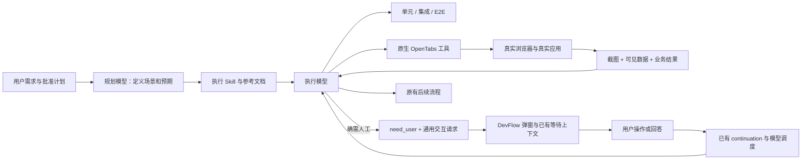
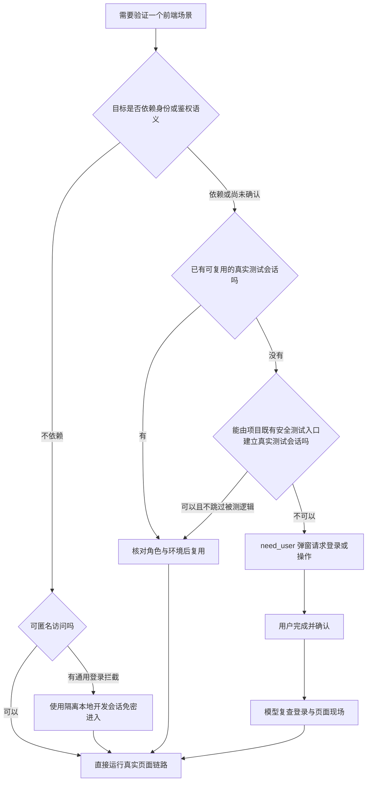
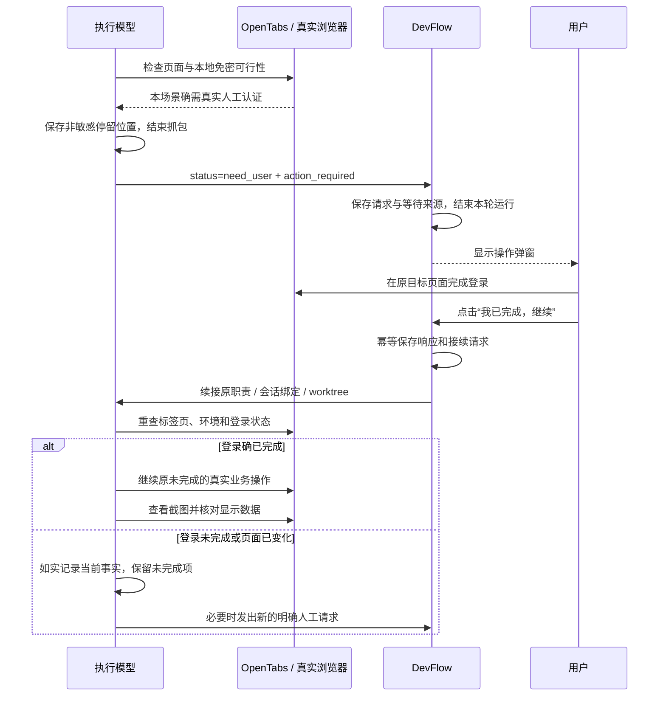
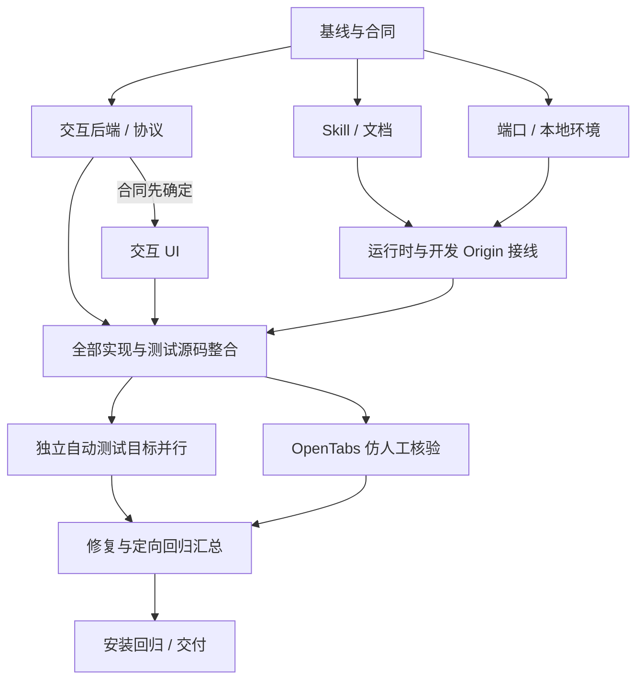

# DevFlow 开发计划：真实浏览器核验、人工交互与 worktree 本地环境隔离

> 文档日期：2026-09-24  
> 目标仓库：`zephyrw/dev-flow`  
> 核查分支：`main`  
> 核查提交：`1150e7ab88ac9a486406a1eca5bd81abce0928e2`  
> 文档用途：交给另一个 Agent 直接实施的完整开发计划，已合并两次需求。  
> 本次交付只包含计划；没有修改仓库、提交代码或运行产品测试。下文“现状”来自源码核查，“目标”是待实施设计。执行前读取最新代码；若相关功能已被其他任务完成，复用并补齐差异，不回退现有改动。

## 0. 一句话目标与不可偏离的方向

**改变执行模型的测试方法，而不是把 DevFlow 改造成测试管理平台。**

涉及前端的任务，在单元、集成、E2E 三层自动测试之外，执行模型必须使用 OpenTabs 操作真实浏览器，按人的操作顺序跑真实业务链路，查看截图、检查布局样式、读取实际显示的数据并核对预期。普通本地场景不应让用户反复登录；只有确实需要人工介入时，才弹窗请求操作或回答问题，收到确认后续接原执行上下文。

新增 worktree 的前端、后端、测试和调试端口均须独立。具体端口、地址、目录与本地会话配置是临时运行数据，不得提交，也不得合并回主工作区。

DevFlow 只负责已有模型调度、材料传递与必要的通用人工交互。**不增加浏览器测试状态机、不增加测试证明门槛、不让规划／复核模型审计执行模型是否真的测试过。**

---

## 1. 范围与需求编号

| 编号 | 本次必须实现的要求 |
|---|---|
| R01 | 有前端影响的任务保留三层自动测试，并额外执行 OpenTabs 仿人工真实浏览器核验；普通 Playwright E2E 不能代替这一轮。 |
| R02 | 从真实页面入口点击、输入、筛选、提交、跳转、刷新，验证业务结果和受影响旧流程，不止做首页冒烟。 |
| R03 | 执行模型实际查看关键截图，检查布局、样式、遮挡、溢出及必要的响应式状态。 |
| R04 | 使用 OpenTabs 的 DOM／脚本／CDP 相关能力，读取页面实际可见的数据、控件状态和必要的网络结果，与预期核对。 |
| R05 | 本地验证的目标与角色、权限、租户、登录状态等无关时，优先匿名访问或免密开发会话，不要求用户登录。 |
| R06 | 涉及真实登录／权限语义时保留真实鉴权链路；确需用户登录、扫码、二次认证或回答业务问题时，暂停相应执行并弹窗。 |
| R07 | 用户操作完成后点确认，系统把响应传回原职责、原任务、原 worktree 的执行上下文；模型重新检查现场后继续。 |
| R08 | 补齐可复用的“请求用户操作”和“向用户提问”弹窗，不把它实现为浏览器专用审批系统。 |
| R09 | 所有测试方法要求写入相关 Skill，规划、首次执行、恢复、测试补跑和功能修复的提示保持一致；不由 workflow 强行卡控。 |
| R10 | 每个新增 worktree 的前后端、E2E 服务器及需要开启的调试端口，与主工作区及其他现存 worktree 不重复。 |
| R11 | 端口对应的 API 代理、WebSocket、HMR、baseURL、重定向及必要的 origin 设置同步变化，防止“前端新、后端旧”。 |
| R12 | 临时配置只存于未跟踪且被忽略的本地位置或进程环境；具体端口、地址、会话和运行目录不得提交、合并或打包进生产构建。 |
| R13 | 多项目、多 worktree 不互相抢标签页、修改共享登录态、串数据、串弹窗或错误恢复会话。 |
| R14 | 保持已有“正式开发与测试代码全部完成后，再按独立目标并行测试；每条命令一个明确目标”的执行规则。 |
| R15 | 安装、更新及原生运行时实际拿到新的 Skill；不能只更新仓库 Markdown，而运行中的执行模型仍收到旧规则。 |

### 1.1 明确不做

不增加独立的测试 Agent 调度服务、浏览器网关重构、截图评分服务、浏览器步骤解释器、截图／报告签名、证明账本、测试真实性审计或新的质量关卡。

不把现有登录、账号额度、授权刷新、归档、全局模型设置、计划审批附加指令等其他任务并入本次开发。与本需求共用的文件可以做必要接线，但不扩大业务范围。

不自动迁移所有历史工作流，不删除历史 `opentabs` 类型和浏览器配置，不让主工作区切换分支，不删除用户的 worktree。

---

## 2. 已核查的仓库现状

以下判断限定于上述提交。源文件索引见附录 A。

### 2.1 测试规范存在明确冲突，不是仅缺一句话

`packages/skills/devflow-test/SKILL.md` 当前强调“自动测试只有单元、集成、E2E 三层”，并写明浏览器工具属于 E2E，不要求另装扩展或重复跑一轮浏览器测试。[S02]

`devflow-execute`、`devflow-plan` 以及执行时传入的 `execution-guidance.ts`、AGY `handoff.ts` 也以三层测试为描述中心。[S03][S04][S05][S06]

**结论：必须修正否定独立浏览器核验的旧描述，同时更新实际提示注入入口。只新增一篇无人引用的 Skill 不够。**

新的统一措辞为：

> 自动测试仍按单元、集成、E2E 三层组织；存在前端影响时，执行模型还必须额外使用 OpenTabs 完成一轮仿人工真实浏览器核验。这是执行职责，不是工作流新增阶段或平台验收门槛。

### 2.2 人工交互已有基础，但不是所需的完整通用弹窗

| 已有实现 | 当前能力 | 本次如何处理 |
|---|---|---|
| `packages/core/src/round-intent.ts` | 识别 `need_user` 等执行意图；用户回答可进入 continuation 材料 | 复用，不新增同义状态 |
| `packages/core/src/waiting-context.ts` | 保存等待来源、职责、轮次、会话、问题及接续上下文 | 增量关联结构化交互请求 |
| `packages/core/src/engine.ts` | `need_user` 可进入 `WAITING_INPUT`，已有等待恢复分支 | 小范围接线，不重写调度链 |
| `packages/core/src/interactions.ts` | 进程命令的请求授权与批准／拒绝 | 保留原语义；不能拿来表示“请用户自己登录” |
| `apps/web/src/interactions.tsx` | 操作授权卡片、会话输入及临时提问入口 | 加入新弹窗入口，不把用户向模型提问误当成模型向用户提问 |
| `apps/web/src/components/AppDialog.tsx` | 通用弹窗容器 | 复用；补必要的唯一标题 ID、焦点与关闭语义 |

源码显示已经有“模型求助—等待用户—续接”的底座，但目前已查路径中没有同时完成结构化操作请求、问题表单、用户完成确认、响应归属与续接的统一弹窗闭环。[S07][S08][S09][S10][S11][S24]

**结论：本次是补齐薄交互层，不是从零建立审批系统。**

### 2.3 已有 OpenTabs 平台网关，不应恢复成新任务的强制入口

`packages/runtime/src/browser.ts` 的 `BrowserGateway` 具有工具发现、固定场景／recipe、浏览器会话及共享资源处理等历史能力；合同中也保留了 `opentabs` 层和 `browser_scenes`。[S12][S13]

**本次新的浏览器核验走“执行模型直接调用其原生客户端可用的 OpenTabs 工具”。不要求先登记 scene，不通过平台循环派发浏览器步骤，不把旧网关变成所有前端任务的必经关卡。**

历史类型和功能兼容保留；新要求主要进入 Skill 正文和执行上下文。

### 2.4 DevFlow 自己的工作台原本不需要业务账号登录

`apps/api/src/base-server.ts` 以本地用户为控制台调用方，保留 Host、Origin、CSRF 和模型令牌边界；不存在普通工作台页面必须先登录某个业务账号的前置条件。[S14]

因此测试 DevFlow 普通 UI 时，直接访问隔离实例即可，**不要为了“统一免密”再添加全局鉴权旁路，更不要让用户先登录 AGY／Codex 才能查看普通页面。**

其他被 DevFlow 开发的业务项目，按第 5 章的规则决定匿名访问、开发会话或真实登录。

### 2.5 端口有部分隔离设施，但日常调试仍有硬编码

`apps/web/vite.config.ts` 当前固定 `5173`，API 代理固定指向 `http://127.0.0.1:4810`，已设置 `strictPort: true`。[S15]

`tests/helpers/test-isolation.ts` 支持 `DEVFLOW_TEST_PORT` 和 `DEVFLOW_TEST_RUN_DIR`，默认测试端口为 `14811`，拒绝使用生产服务端口 `4810`，并提供端口可用性探测；这是可复用的基础，不是完整的所有 worktree 调试方案。[S16]

`packages/contracts/src/config.ts` 支持通过配置文件设置后端端口和存储路径，但 `human_origin` 当前要求与后端服务端口一致。直接把它改为 Vite 前端端口会触发校验错误；只改 Vite 端口也不能完成同源和事件流接线。[S17]

`apps/api/src/main.ts` 从 `DEVFLOW_CONFIG` 加载配置；`playwright.config.ts` 使用隔离 helper，并允许显式启用已有服务复用。[S18][S19]

### 2.6 Skill 安装与不同执行用途需要同步处理

`scripts/install-skills.mjs` 只安装六个允许的 Skill，并会把旧 `devflow-browser-accept` 移至备份。不要复活这个旧目录然后被安装器再次移走。[S20]

本计划把详细规则放在现有 `devflow-test` 和 `devflow-execute` 的 `references/` 下，不新增第七个顶层 Skill。

`ProfileRuntime.executeMaterials` 会按 purpose 区分普通实现与其他职责，不是所有执行测试入口都会收到 `batchExecutionInstructions`。尤其需要检查 `executor_test`、`functional_fix` 和恢复路径，不能只改普通 implement 分支。[S21][S22]

---

## 3. 目标架构与职责边界



图中“何时做什么测试、怎样判定页面正确、是否需要真实登录”都由执行模型按 Skill 判断。平台只理解通用的模型意图和用户响应，不理解页面测试步骤，也不判断截图是否通过。

### 3.1 允许修改的运行时职责

运行时可以传入 Skill、保存模型发出的人工请求、展示请求、接收人类响应并续接正确会话。

运行时不能扫描 diff 来自动添加浏览器关卡，不能根据有无截图、DOM 数据或报告字段拒绝 `completed`，不能检查“用了几次 OpenTabs”，不能替执行模型判断模块是否依赖权限。

参数类型、请求归属、幂等、CSRF 和旧请求失效校验属于交互正确性与安全，不属于测试卡控，应保留。

### 3.2 规划与复核职责不扩大

规划模型把前端用户场景、预期数据、认证条件和受影响回归写进计划正文。复核模型继续审查实现代码的正确性、遗漏、边界与安全，不增加截图审计、报告审计或证明执行过测试的任务。

`planner_takeover` 仍遵守当前不运行测试的职责边界；需要的浏览器回归由随后承担测试的执行模型完成。`planner_commit` 不因此重跑测试。[S22]

### 3.3 记录是执行辅助，不是平台合同

执行模型保留适量截图、场景结果和中断位置，以便自己排障、恢复以及向用户说明结果。可复用现有 `artifacts` 引用，但不新增必须齐全的证明字段、签名或真实性探针。

---

## 4. OpenTabs 仿人工真实浏览器核验

### 4.1 触发范围

只要变更会影响用户在页面上的操作或结果，就需要这一轮核验：组件、布局、样式、路由、表单、状态展示、前后端接线、WebSocket 更新、权限显示、后端接口改动导致的页面行为变化均算前端影响。

纯后端且确认不影响任何页面行为的任务，可在执行记录中说明“不适用”及事实依据。没有浏览器、工具未连接、服务启动失败不是“不适用”，只能记录为环境阻塞，不能标记通过。

普通三层测试不降级、不被替代。OpenTabs 核验不是换一种方式只重跑同一条首页 E2E，而是以真实操作和视觉／显示数据为重点的补充验证。

### 4.2 时序与并行规则

先完成当前正式计划中的全部功能、接线、边界处理及测试代码，再进入测试阶段。独立的单元／集成／E2E 目标按现有规则交给子 Agent 并行执行，每条命令只运行一个明确文件、类或用例。

OpenTabs 核验也在正式开发完成后进行；不强制等待所有不相关自动测试先结束，但被核验页面和对应后端必须是完整、当前、可运行的版本。

共享一个浏览器连接时，对“前台切换—操作—截图”采用单一操作负责人。其他 Agent 可并行跑非浏览器测试。只有实际能够隔离浏览器 profile／连接及相关状态时，才并行操纵多个浏览器。

不要为满足并行要求让多个 Agent 同时抢同一标签页，也不要反过来把所有测试全局串行。

### 4.3 每轮核验步骤

1. **读清验收依据。** 使用用户指定或已批准的原计划，不另写替代实施计划。按原编号列出本轮页面场景、输入、预期值、受影响回归及认证条件。
2. **确认环境身份。** 确认工作目录、前后端端口、API 代理、数据目录和当前构建。不能看到“服务已启动”就默认浏览器连接的是本 worktree。
3. **准备数据与会话。** 用隔离测试数据准备确定输入；按第 5 章选择无交互认证方式。数据准备可以使用项目已有 fixture，但被验证的业务行为必须随后从 UI 触发。
4. **连接工具。** 发现当前原生客户端提供的 OpenTabs 工具及参数 schema，记录本次使用的连接／标签页。不得把文档示例参数当成所有版本通用合同。
5. **从页面入口实际操作。** 导航、展开菜单、点击按钮、填写表单、触发校验、提交、筛选、翻页、返回或刷新。禁用控件、加载状态、取消操作和适用异常路径均需覆盖。
6. **核对业务结果。** 验证操作后实际显示的数据与状态；有持久化要求的场景刷新或重新进入，必要时再观察下游结果，不能只看成功 toast。
7. **查看截图。** 在关键页面及变更相关状态截图，并将真实图片交给执行角色的图像查看能力读取。不能“保存过截图”就写“视觉核验完成”。
8. **读取可见数据。** 使用 DOM／脚本读取显示文本、表单值、禁用状态、位置尺寸等；需要解释数据来源时观察实际网络响应或 WebSocket 消息，不只看 API 状态码。
9. **修复与定向重跑。** 同范围问题由负责 Agent 修复，重跑失败场景及真实受影响目标。不要为补一个截图重复全量测试。
10. **收尾。** 记录实际通过、失败、未执行和阻塞项。关闭自己创建且不再需要的测试标签页，清理自己开启的抓包／模拟设置，保留等待用户登录的标签页；不能清理用户其他页面或会话。

### 4.4 工具使用原则

当前 OpenTabs 官方参考提供标签页操作、截图、脚本、样式检查，以及基于 CDP 的网络与控制台观察能力；其中控制台采集需先启用网络捕获。[E01]

建议发现以下能力，实际名称和参数以本机发现结果为准：

| 目的 | 官方参考中的工具示例 |
|---|---|
| 页面操作 | `browser_open_tab`、`browser_click_element`、`browser_type_text`、`browser_scroll` |
| 视觉与显示数据 | `browser_screenshot_tab`、`browser_get_tab_content`、`browser_execute_script`、`browser_get_element_styles` |
| 链路观察 | `browser_enable_network_capture`、`browser_get_network_requests`、`browser_get_console_logs` |

这里的 CDP 指浏览器调试观察能力；不假设存在名为 `opentabs.cdp` 的通用工具。不得为完成核验绕开 OpenTabs，擅自开放无认证远程调试端口。

DOM／脚本主要用于观察。禁止用脚本调用内部 store、修改 React 状态、直接调用业务保存 API、写 DOM 假造正确显示，再声称完成了用户操作链路。

对于画布或无法通过 DOM 表达的交互，使用本机 OpenTabs 实际提供的相应输入能力；没有能力则说明限制，不能伪造完成。浏览器工具执行操作不等于证明每个事件都是操作系统级输入；验收重点是实际页面路径、交互行为与业务结果。

### 4.5 视觉与数据检查要点

视觉上检查布局层级、间距、对齐、文字截断、横向溢出、按钮遮挡、弹窗层级、滚动区域、空态、错误态、加载态及本次涉及的主题／窄屏。无须为无关设备、主题扩展全站设计审查。

数据检查要同时包含“正确的业务值”和“正确的显示规则”。例如字段与列是否对应、单位与小数格式、日期时区、过滤条件、分页数量、状态标签和详情／列表一致性。

有分页或虚拟列表时，当前 DOM 只有已渲染行不能证明所有记录正确；沿真实分页／滚动路径取样或覆盖要求范围。不能把隐藏节点、旧缓存、骨架屏数字作为实际可见结果。

截图与 DOM 互相补充：DOM 文本正确不代表没被遮挡，截图看起来正常也不代表保存了正确的数据。

### 4.6 登录时的浏览器隐私边界

请求用户输入密码、扫码或二次认证前，停止对该登录页的抓包和截图采集，避免记录密码、验证码、OAuth 回调参数、Cookie 或令牌。只保留非敏感的标签页定位及恢复说明。

用户确认后先重新检查页面 URL、登录完成标志和目标业务页面能否访问，再在业务页恢复必要观察。**用户点“我已完成”不等于系统可直接判定登录成功或测试通过。**

---

## 5. 本地免密模式：避免不必要的用户介入

### 5.1 由执行模型按场景判断，不由 workflow 判断



### 5.2 认证策略优先级

| 场景 | 应采用的策略 | 不允许的做法 |
|---|---|---|
| DevFlow 普通本地工作台 | 直接访问隔离工作台，无需账号登录 | 要求先登录模型厂商才允许测普通布局 |
| 业务页可匿名访问且目标与身份无关 | 匿名访问 | 为测试仪式感要求用户登录 |
| 目标与身份无关，只被通用登录入口拦住 | 本地专用、最小身份的免密开发会话 | 全局关闭权限校验或 mock 整条业务接口 |
| 目标本身涉及角色、租户隔离、用户数据范围、token 过期等 | 使用真实测试身份与真实鉴权路径 | 用所有权限的开发身份冒充角色测试通过 |
| 外部 SSO、扫码、MFA 等确需用户 | 请求用户完成，确认后续接 | 索取密码／验证码写进弹窗答案或日志 |

判断依据不仅看被改文件是否引用角色字段，还要看路由守卫、API 授权、租户过滤、`currentUser` 分支、功能开关和数据所有权等实际调用链。

### 5.3 其他业务项目的免密实现要求

优先复用项目已有的开发认证适配器、测试会话生成能力或测试账号 fixture。没有可用入口时，在任务允许范围内补最小开发会话机制：由本地后端建立固定测试身份的有效会话，页面和后端业务流程仍照常运行。

应满足以下约束：

- 仅开发／测试模式显式启用，仅绑定本机回环地址，并使用隔离数据目录或测试数据库。
- 生产模式禁止启用；不能因为环境变量误带入生产而提供免密入口。新增开发认证能力须有生产不可用的回归测试。
- 身份仅具有场景所需的最小权限。保持正常授权代码运行，不能在统一鉴权函数中写“本地一律允许”。
- 临时会话、密钥、Cookie 和认证状态不进入仓库、用户共享配置或公共截图。
- 不把真实账号登录、角色切换、租户隔离、授权刷新等验收项用开发会话替代。
- 不能从浏览器 `localStorage` 随便塞入假 token，再绕过后端以为自己已经测通。

**本次 DevFlow 代码无需新增业务账号免密入口。其工作台已满足普通本地免登录要求；本次要新增的是其他项目也能遵守的 Skill 规则与测试指导。**

### 5.4 不应打扰用户的例子

调整列表间距、表单布局、普通筛选组件或与身份无关的弹窗：执行模型启动隔离本地实例，匿名访问或自动建立本地测试会话，直接操作并核验。

测试“普通用户不能看到管理员入口”或“不同租户看不到对方数据”：不能套用全权限免密会话；必须使用与预期一致的真实测试身份。

### 5.5 Cookie 不能只靠不同端口隔离

同一主机的 Cookie 不按端口隔离，端口不同不意味着账号会话隔离。[E04]

优先使用独立测试浏览器 profile／连接；本机工具不具备独立 profile 能力时，对本地开发会话采用实例独立的 Cookie 名与服务端会话命名空间，并明确这是避免串扰，不是同一主机不同端口之间的安全隔离。涉及不可信应用或真实身份分隔时必须使用更强的浏览器／主机隔离，不能仅靠改 Cookie 名。

不要在共享真实登录页上并行切账号，也不要执行影响用户其他页面的全站 Cookie 清理。独立窗口不自动等于独立 profile。

---

## 6. 通用人工交互：复用 need_user 的薄扩展

### 6.1 选定方案

使用模型现有最终输出中的 `status: "need_user"`，新增**可选**的 `user_interaction` 内容，统一支持两种请求：

- `action_required`：请用户在浏览器、操作系统或其他界面完成一项操作，然后确认。
- `question`：请用户回答文本问题，或从少量明确选项中选择。

本次不新增专用 `devflow_request_login`，不要求新增通用 MCP 等待工具，不使用无限期阻塞的工具调用。模型输出求助后结束当前回合，已有调度释放模型运行资源；用户回答后通过已有 continuation 机制重新派发正确的执行职责。

**人工请求不是测试通过声明，用户回答也不是 `completed`。**

### 6.2 模型输出结构

新增 `packages/contracts/src/user-interaction.ts`，并从现有 contracts 入口导出。以下是目标结构，具体字段约束由 Zod 落实：

```ts
interface UserInteractionInput {
  kind: "action_required" | "question";
  title: string;               // 1..120 字符
  message: string;             // 1..4000 字符，说明原因和要求
  action_label?: string;       // 如“我已完成，继续”，最大 40 字符
  question?: string;           // question 类型的明确问题
  choices?: Array<{ id: string; label: string }>; // 最多 8 项，ID 唯一
  allow_free_text?: boolean;
  target?: {
    url?: string;              // 仅安全 http(s)，去除凭据和敏感查询参数
    tab_id?: number;
    connection_hint?: string;  // 非敏感定位信息，不包含工具凭据
  };
  resume_note?: string;        // 非敏感的停留位置和下一步，最大 4000 字符
}
```

模型发出的对象不包含可以任意指定的目标 workflow、角色、会话或后续执行命令。绑定信息必须从当前实际运行上下文补齐，不信任模型自己填写的路由字段。

请求示例：

```json
{
  "status": "need_user",
  "summary": "受保护页面需要完成企业单点登录，其余不依赖登录的核验已完成。",
  "user_interaction": {
    "kind": "action_required",
    "title": "请完成浏览器登录",
    "message": "请在刚才打开的测试页面中完成登录。不要把密码或验证码填入这里。完成后点击确认，我会重新检查页面并继续未完成的场景。",
    "action_label": "我已完成，继续",
    "resume_note": "继续原验收项的受保护列表场景；先核对当前账号和目标测试环境，再操作筛选与保存。"
  }
}
```

```json
{
  "status": "need_user",
  "summary": "业务说明没有确定空列表时的默认行为。",
  "user_interaction": {
    "kind": "question",
    "title": "请确认空列表行为",
    "message": "这个问题影响当前需求的业务表现，不能仅由实现细节推断。",
    "question": "无结果时应该显示哪个状态？",
    "choices": [
      { "id": "empty", "label": "空态提示" },
      { "id": "recommended", "label": "推荐内容" }
    ],
    "allow_free_text": true
  }
}
```

普通实现细节仍由执行模型自主决定；不能把新增弹窗变成每一步都问用户的借口。用户回答若改变了已批准的业务范围、设计或验收标准，执行角色仍须通过已有 need_planner 路径申请正式修订；弹窗回答不是绕过计划审批的授权。

### 6.3 持久化与归属

使用现有 `Store` 的通用实体持久化能力，新增一个轻量实体，例如 `user_interaction`，不另建数据库或服务。记录至少包含：

```ts
interface UserInteractionRecord {
  id: string;                      // 由服务端生成
  workflow_id: string;
  source_run_id: string;
  source_plan_revision: number;
  root_conversation_id?: string;   // 使用现有会话树解析方法取得
  source_generation?: number;
  purpose: string;
  role: string;
  request: UserInteractionInput;
  status: "pending" | "answered" | "cancelled" | "superseded";
  created_at: string;
  responded_at?: string;
  response?: {
    request_id: string;             // 客户端稳定的幂等 ID
    action: "confirm" | "answer" | "cancel";
    choice_id?: string;
    answer?: string;
  };
}
```

在 `WaitingContext` 中仅关联 `interaction_id`，不要再复制一套相互竞争的交互状态。

每个实际等待的主执行回合最多一个当前交互请求。子 Agent 需要人工帮助时先汇总给直接父 Agent，由主执行上下文发出请求；不在本次建立多个子 Agent 各自占用工作流等待状态的复杂系统。多工作流各自独立保存，互不影响。

**不要把 UI 会话节点 ID、原生 CLI session ID 和 run ID 混用。** 使用现有会话树、会话绑定和 continuation 解析逻辑确定目标；模型输出里的标签页 ID 只是浏览器定位提示，不能用于模型会话路由。

### 6.4 请求创建与兼容处理

在已有执行结果接收和 `routeExecutionIntent` 的 `need_user` 分支中，调用小型 `UserInteractionService`：

1. 确认仍是当前来源轮次，沿用现有过期轮次防护。
2. 解析可选 `user_interaction`；对标题、选项、URL、文本长度做显示安全校验。
3. 同一来源轮次重复接收同一内容时返回现有记录，不重复弹窗。内容不一致时不能悄悄覆盖用户已看到的问题。
4. 在同一个 Store 事务中保存请求、关联 WaitingContext，并走现有 `WAITING_INPUT` 转移与事件机制。
5. 等待只由 `need_user` 触发，不由服务器分析页面、截图或“测试失败”文字触发。

兼容规则：

- 老模型只返回 `need_user + summary/notes/questions`：生成简洁的文本问题／确认弹窗，仍可回答。
- `user_interaction` 格式错误但明确为 `need_user`：保留已能安全读取的文本，降级到通用文本交互，不丢失求助、不当完成。
- `completed` 中附带损坏的可选交互对象：不因此增加等待关卡；按已有完成意图处理并忽略无关显示材料。
- 旧等待任务没有交互记录：读取已有 WaitingContext，在需要显示时建立稳定的兼容表示；不可因为旧记录缺字段而阻塞恢复。
- 若复核阶段已有 `need_user`，可复用同一展示协议，但响应必须回到复核来源角色，不能统一恢复为 executor。不要为此重做规划协议。

### 6.5 API 与服务接线

新增轻量路由文件：`apps/api/src/routes/user-interactions.ts`，在既有 API 中注册。

```text
GET  /api/workflows/:workflowId/user-interactions/current
POST /api/workflows/:workflowId/user-interactions/:interactionId/respond
```

GET 返回当前请求及必要的状态，不返回认证秘密或完整模型日志。

POST 请求：

```ts
{
  request_id: string;
  source_run_id: string;
  root_conversation_id?: string;
  expected_generation?: number;
  action: "confirm" | "answer" | "cancel";
  choice_id?: string;
  answer?: string;
}
```

服务端对响应执行以下操作：

1. 沿用 human 控制台鉴权、同源与 CSRF 防护。worker 模型令牌不具有人工决定权限。
2. **先查询幂等回执，再校验当前状态。** 已成功响应的同 ID 重试应得到同一结果，不能因续接后 generation 变化而错误返回失败。
3. 校验 workflow、interaction、来源轮次、计划版本与会话归属。不同请求 ID 对同一已回答问题再次决定应明确返回“已处理”，不能再次派发。
4. 在同一事务中保存答案、回执以及可恢复的 continuation 派发意图，复用现有 Store 入队／接续设施。不要只在内存里执行“先保存，再 await 派发”而留下重启丢续接的缝隙。
5. 复用现有反馈／continuation 服务形成输入；不要从后端 HTTP 请求自己的 API。必须确认不是只写入 `feedback_message` 就结束——**答案真正进入恢复材料且模型确实被续接才是闭环。**
6. 沿用现有调度和进程停止确认，避免旧轮次尚未退出就启动第二个相同执行上下文。

交互服务只组装人类回答和续接请求，不选择模型、不执行浏览器、不分析测试内容。不要新增专用“人机交互调度器”。

### 6.6 前端弹窗

新增 `apps/web/src/components/UserInteractionDialog.tsx`，复用 `AppDialog`。在 `TaskInteraction` 或当前统一弹窗承载位置接入，避免重复挂载。

操作型弹窗显示标题、为什么需要帮助、具体步骤、可安全显示的页面位置，以及主按钮“我已完成，继续”。问题型支持一个明确问题、少量选择项和可选补充文本。

关闭语义必须区分：

| 操作 | 结果 |
|---|---|
| 右上角关闭、Esc、点遮罩或“稍后处理” | 仅收起 UI；请求仍 pending，任务仍等待，可重新打开 |
| “我已完成，继续” | 提交确认，按已有调度续接；不把登录／测试标为成功 |
| 问题答案提交 | 提交选项／文字并续接来源上下文 |
| “取消本次请求” | 请求 cancelled，保留暂停和原因；不自动继续，不取消其他任务，不冒充测试通过 |

对取消后的继续操作复用已有用户指导入口。不要把取消按钮实现为“默认答案后继续”。

交互体验要求：

- 当前任务的新请求自动提示一次；其他任务显示待处理标记，不抢走当前输入焦点。
- 刷新页面能恢复 pending 请求；同一请求不能因每次轮询／事件更新而反复弹出。
- 提交中禁用重复操作；网络错误保留输入和稳定 request_id，可安全重试。
- 已保存但尚未派发时显示真实状态，不显示“已继续”；使用已有调度恢复路径重试，不让用户再填同样的答案。
- AppDialog 使用唯一标题 ID，落实焦点约束／恢复和必要的滚动处理；避免堆叠多个模态窗口。只修本次交互需要的基础能力，不顺手重做所有弹窗。
- 文本以安全文本／受限 Markdown 渲染，不执行模型提交的 HTML、脚本或命令。
- 登录地址仅供人点击；限制为安全协议，不把带密码、token、OAuth code 的完整 URL 写入存储或聊天。

### 6.7 完整暂停与续接时序



执行角色返回 need_user 前，应停止或收拢仍在操纵目标浏览器的子 Agent／工具操作，不留下访问登录页的轮询脚本。复用现有必要的会话停止确认，不新增监控服务；其他独立工作流不因此暂停。

暂停时不轮询登录状态，不让规划模型持续查询执行模型，不创建守护任务。已完成的无关测试不因恢复而重跑。

默认续接同一模型和原生会话绑定；若用户显式切换模型、会话已不可用或原生客户端不能续接，复用已有恢复机制提供完整上下文，并明确是重建会话，不能假称“原会话已恢复”。

### 6.8 模型不能自行代点人工确认

Skill 明确禁止执行模型用 OpenTabs 点击自己在真实 DevFlow 控制台发起的人工审批／完成确认，也不能调用 human API 伪造回答。

自动化测试中的隔离 fixture 可以模拟用户点击以验证交互机制，但必须与真实运行分开标记；不能把模拟点击当成用户实际登录或授权。现有本地信任模型不等同于密码学意义上的人类在场证明，本次不新增这类证明系统。

---

## 7. worktree 的端口与临时运行配置隔离

### 7.1 规则范围

新增或使用独立 worktree 前，由执行模型核对所有会启动的本地服务。至少包括前端、后端、E2E fixture server；调试 inspector、独立 HMR／WebSocket、测试 UI、预览服务需要独立监听时也必须分配。

前后端分别拥有独立端口；同一 worktree 的不同服务不能撞号，更不能撞主工作区或其他 worktree。主工作区当前已启动和登记使用的端口都应作为保留项，不以“主服务现在没启动”为理由占用其默认端口。

后端服务同端口承载自己的 HTTP 与 WebSocket、Vite 使用同端口承载 HMR 属于正常复用，不必人为增加监听器。

### 7.2 不把环境管理加入 workflow

新增或复用一个**执行模型通过终端调用的本地脚本**，负责在本机选择端口、生成临时配置、启动指定环境及清理自己创建的资源。它不注册新工作流阶段，不负责判断测试是否通过，不建立长期运行的中央端口服务。

建议新增：

```text
scripts/dev/worktree-env.ts        # reserve / show / release；也供测试 helper 复用
scripts/dev/worktree-run.ts        # dev / test 子进程启动与信号转发
```

二者是本地开发工具，不是 `packages/core` 或 scheduler 中的新资源编排系统。已有等价脚本时直接扩展，不重复创建。

### 7.3 临时文件布局

```text
<worktree>/
  .cache/devflow-local/
    instance.json                 # 本实例端口、路径、进程归属
    devflow.runtime.yaml          # 当前 API 的临时完整配置
    state/                        # 独立 SQLite / 状态数据
    reports/                      # 临时测试输出
    browser/                      # 临时会话、标签页与截图位置

<git-common-dir>/devflow-local/
  ports.json                      # 同仓库各 worktree 的本地端口登记
  allocation.lock/                # 短时文件锁，不是后台服务
```

路径是方案约定，均为本地运行状态，不得提交。使用 `git rev-parse --git-common-dir` 解析共享 Git 元数据目录；linked worktree 的 `.git` 可能是文件，不可假设它是目录。[E06]

通用忽略规则可以提交；每个实例生成的实际内容不能提交。对于用户其他项目，优先使用该仓库已经忽略的本地目录；没有时使用 Git 本地 exclude，避免仅为临时端口污染项目主配置。[E05]

端口登记采用规范化的仓库／worktree 路径识别所有者；Windows 路径大小写、盘符、空格和分隔符必须正确处理。

### 7.4 端口选择算法

1. 读取 `git worktree list --porcelain` 和本地端口登记，识别主工作区、当前 worktree 与兄弟 worktree。
2. 建立排除集合：主工作区的已知默认／当前端口、其他未释放 worktree 的登记端口、当前其他服务端口、系统已占用端口。
3. 取得同仓库短时分配锁。使用原子文件／目录创建，不依赖“先判断文件不存在，再写入”的竞态逻辑；释放时校验所有者。
4. 前后端候选范围优先复用当前配置的 ports.frontend／ports.backend；辅助服务从开发工具明确配置的非特权端口范围选择，范围耗尽时报告而不是占用主工作区端口。分别探测实际监听可用性，包含项目使用的 IPv4／IPv6 行为。通用候选范围可以进入源码，某个实例实际选中的数值不能进入提交。
5. 原子写入登记与实例配置；保存实例 ID、工作目录、端口角色及创建时间。一次分配过程中任何步骤失败都只撤销自己刚创建的记录。
6. 启动服务时明确传入端口，前端保留 `strictPort: true`，不要让 Vite 自动换到另一个未记录端口。[E02]
7. **探测成功不代表端口已永久占有。** 真正启动仍可能遇到 `EADDRINUSE`；此时不杀占用者，释放本次失败登记、有限重试新端口并同步更新整个实例配置。
8. 以实际监听成功为准。若后端端口重分配，前端代理与测试 baseURL 必须重新生成后再继续，不能保留旧目标。
9. 启动后读取已有 `/api/health`，核对实例标识／运行目录等已有信息；不能只检查 HTTP 200。[S14]
10. 正常结束只清理自己启动的进程。释放登记时同步标记／移除当前临时 manifest，不能留下一个显示旧端口仍有效的文件。

哈希 worktree 名字只能帮助选择候选端口，不能代替冲突检查。不同仓库之间至少要通过操作系统实际绑定处理冲突；不要求新增全局守护服务。

陈旧锁或登记不能只因时间过去就盲删，应结合记录所有者是否仍存在、worktree 是否还在使用判断。无法确认时重新选择其他端口并给出信息，不结束陌生进程。

### 7.5 DevFlow 前端配置改法

修改 `apps/web/vite.config.ts`，使本地运行器可通过进程环境注入：

```text
DEVFLOW_WEB_PORT
DEVFLOW_API_PORT
```

这是拟新增的配置接口，不是声称仓库当前已经支持。

默认不传入时仍保留现有主工作区端口 `5173` 与后端代理 `4810`。在 worktree 运行器中必须提供本实例的明确端口，不能回退到默认端口。

要求：

- 对端口解析做整数和范围校验，空值／无效值不能被隐式解析为 0 或 NaN。
- `/api` 的 HTTP 与 WebSocket 代理都从同一实例的后端端口计算。
- HMR 优先使用该 Vite 服务自己的端口；若项目现有配置单独监听，再加入本实例端口清单。
- 用进程环境直接供 Vite 配置读取，避免 `.env.local` 是否被配置阶段加载的歧义；如果选择加载本地 env 文件，显式使用 Vite 对应版本的 `loadEnv` 并固定 env 路径。[E03]
- 不把临时 API 地址通过 `VITE_*` 编译进生产 bundle。应用 API 访问尽量保留相对 `/api`。
- 不为本次需求升级 Vite 主版本。当前仓库使用 Vite 7，配置 API 以兼容版本为准。[S23]

### 7.6 后端配置、Origin 与 WebSocket 的必要接线

利用已有 `DEVFLOW_CONFIG`，让运行器生成 `.cache/devflow-local/devflow.runtime.yaml`，其中后端端口、存储根和 workspace 根均为当前实例值。[S17][S18]

配置内 `human_origin` 保持与后端本机服务端口一致，满足现有 ConfigSchema。不能把前端端口强塞进去绕过校验。

为分离的 Vite 开发入口增加**仅本地开发启动时传入**的精确 origin 选项：

```text
DEVFLOW_LOCAL_DEV=1
DEVFLOW_DEV_FRONTEND_ORIGIN=http://127.0.0.1:<本实例前端端口>
```

拟在 `main.ts → buildServer → createBaseServer` 的 options 传递链中加入 `developmentFrontendOrigin`，不重定义 production `human_origin` 语义。

生效条件必须同时成立：显式本地开发模式、非 production、服务绑定回环地址、实例状态目录已隔离、前端 origin 是当前配置中精确的本机 origin。生产启动不接受这项开发放宽。运行器输出的 URL、浏览器实际访问的主机名和允许的 Origin 必须一致，不能在 localhost 与 127.0.0.1 之间随意混用。

开发模式的允许集合只包含原后端 origin 与这一个本实例前端 origin。Host、写请求 Content-Type、CSRF、WebSocket Origin 和拒绝 worker token 的人类控制台边界继续检查，不能改成通配 `*` 或允许任意 localhost 端口。[S14]

Vite 的 `changeOrigin` 不能被误当成完成了所有浏览器 Origin 与 WebSocket 校验；必须用实际浏览器验证前端入口上的写请求和实时消息。[S15][S14]

若源码已有等效的精确开发 origin 通道则复用，不另加第二个。以上新增配置只是本地双端口调试的必要能力，不涉及业务账号免密。

### 7.7 E2E 与普通调试统一使用实例配置

扩展已有 `tests/helpers/test-isolation.ts`，使新 worktree 运行器能够注入 `DEVFLOW_TEST_PORT` 和 `DEVFLOW_TEST_RUN_DIR`，继续复用已有路径隔离逻辑。[S16]

如果 Playwright 使用独立 fixture server，给它分配独立 E2E 端口；如果明确测试已经启动的本实例真实应用，可以显式复用，但必须核对端口、数据根、工作区身份和代码版本。不能仅因某端口有服务就启用 `DEVFLOW_REUSE_SERVER=1`。

unit／integration 需要临时 HTTP 服务时优先使用框架的临时端口能力；必须把真实监听结果传给调用方，不能假设固定端口。每个并行目标使用独立的数据库、输出目录和必要的端口，不能只隔离前端而共用同一 SQLite。

本次不改 CI 为依赖有头 OpenTabs，也不新增 CI 上“缺真实浏览器截图不准合并”的步骤。

### 7.8 合并边界：代码能力可合并，临时值绝不合并

| 可提交并合并的内容 | 不得提交／合并的内容 |
|---|---|
| 读取环境变量的通用配置代码 | 某个 worktree 的真实分配端口和绝对路径 |
| 本地运行器与端口分配 helper | `instance.json`、本地运行 YAML、端口登记 |
| 不含实际临时值的示例和文档 | 本地认证 token、Cookie、浏览器 profile |
| 通用忽略规则和相关测试源码 | 测试生成的 env、运行状态、临时数据库 |
| 保留原默认值的产品配置 | 把代理目标、回调地址或 HMR 端口永久改成本 worktree 的数值 |

Git 忽略规则不会保护已经被跟踪的文件；不能通过改已跟踪的 `vite.config.ts` 中的数字，再指望 `.gitignore` 排除这些修改。[E05]

禁止使用 `assume-unchanged`、`skip-worktree` 掩盖临时改动，禁止为清理端口执行 `git reset --hard`、清空 index 或覆盖他人修改。

执行／提交 Skill 必须要求检查当前未提交 diff、暂存 diff，以及本任务自基线起的提交差异。临时值一开始就不应进入提交历史，不能只在最终删除一个本地配置文件后就宣称“没有带回主分支”。若发现已误提交，按现有安全提交规则移除或报告，不擅自重写用户共享历史。

正常合并后，主工作区不设置任何 worktree 临时变量时，前端／后端默认值保持原样；也不读取 `.cache/devflow-local` 的旧实例文件。通用环境覆盖能力合并后仍可用于下一次独立调试。

可分享的结果文档使用 `<frontend_origin>`、`<backend_origin>` 等占位说明；包含实际临时地址的运行记录保留在本地。不要为了报告完整，把临时配置附进正式提交。

### 7.9 临时数据目录与工件路径

本次核验用到的本地状态、服务配置与浏览器会话不得污染真实 `.devflow` 数据、真实工具认证目录或主工作区的输出。

已有 `docs/test/evidence/<任务ID>/<轮次>/` 可继续作为证据组织约定，但其中包含环境实值、登录信息或临时配置的内容必须留在本地忽略范围；不要为满足路径约定把敏感或环境绑定材料提交。正式可分享摘要可以单独写入文档，使用相对路径和占位地址。

### 7.10 同一 worktree 内的并行测试

前述 `.cache/devflow-local/` 顶层布局用于一个交互式开发实例。多个子 Agent 在同一个 worktree 内并行测试时，各自使用 `tests/<target-id>/<invocation-id>/` 子目录及不同实例 ID，分别登记端口、数据库和输出位置，不能覆盖交互式开发实例的 `instance.json`。

共享端口登记的主键应是“规范化 worktree 路径 + 实例 ID”，不是只有 worktree 路径。已有、未释放的同 worktree 其他实例也必须进入排除集合。

---

## 8. Skill 和提示词的统一修改

### 8.1 文件策略

保持现有六个顶层 Skill，不新增需要安装器识别的新 Skill 名。新增参考文档如下：

```text
packages/skills/devflow-test/references/
  real-browser-verification.md
  local-auth-strategy.md
  browser-verification-record.md

packages/skills/devflow-execute/references/
  user-interaction.md
  worktree-local-environment.md
```

`devflow-test/SKILL.md` 作为测试方法的主入口，包含核心规则及必读参考链接，不能只留一句“详见参考”而没有触发条件。

`devflow-execute/SKILL.md` 明确前端执行额外核验、免密优先、人工求助与端口临时性，并链接上述参考。`devflow-plan/SKILL.md` 把同样责任落实到后续计划正文。

### 8.2 需要修改的现有 Skill

| 文件 | 需要改动的内容 |
|---|---|
| `packages/skills/devflow-test/SKILL.md` | 删除与独立 OpenTabs 核验冲突的旧规则；增加触发、认证、视觉、数据及阻塞处理；保留三层测试与定向并行规则 |
| `packages/skills/devflow-execute/SKILL.md` | 在首次、恢复、功能修复、测试阶段统一引用新要求；增加工作区端口、临时配置和人工等待规则 |
| `packages/skills/devflow-plan/SKILL.md` | 前端任务计划正文列出独立 OpenTabs 场景、预期、认证策略、端口隔离和受影响回归；不新增平台证明合同 |
| `packages/skills/devflow-project-onboard/SKILL.md` | 登记／调研项目时识别原生启动命令、现有端口覆盖方式、认证依赖和安全的本地测试模式；不创建重型浏览器配置 |
| `packages/skills/devflow/SKILL.md` | 统一入口摘要，强调执行模型自主测试、必要时人机交互；普通 Skill 使用不自动创建 workflow |
| `packages/skills/devflow-review/SKILL.md` | 只修与本次职责边界冲突的表述；明确不审计浏览器测试证明，识别硬编码临时端口属于代码配置问题 |
| `devflow-plan/references/plan-contract.md` | 计划正文模板增加浏览器场景、认证判断、环境隔离；不强制增加 machine-readable 测试字段 |
| `devflow/references/role-and-schedule.md` | 说明额外浏览器核验属于执行职责，暂停只是已有 need_user，不增加质量阶段 |
| `devflow-review/references/repair-document-contract.md` | 涉及前端的有效代码整改保留浏览器回归注意事项；不能产出测试审计／证明任务 |

其他模板中如出现“浏览器测试不再单独执行”“只需三层”等排他性描述，应做语义检查后修正。不能简单全仓替换“只有三层”：三层自动测试这一分类本身仍正确，冲突的是排除独立 OpenTabs 核验。

### 8.3 可直接写入测试 Skill 的核心正文

> **前端真实浏览器核验**  
> 自动测试仍按单元、集成、E2E 三层执行。凡本次变更影响前端展示、交互或页面业务链路，执行模型在完成正式开发后，还必须使用 OpenTabs 操作真实浏览器进行一轮仿人工核验。普通 E2E、接口测试、jsdom、静态截图或 mocked 页面不能替代这一轮。  
> 从真实页面入口按人的顺序点击、输入、提交、切换、刷新并检查结果；覆盖本次需求和真实受影响旧流程。实际查看关键截图，检查布局、样式与遮挡，同时通过页面 DOM／脚本／CDP 相关能力核对用户实际看见的数据和控件状态。不能只保存截图不看，也不能通过修改前端内部状态伪造通过。  
> 本地场景与角色、权限、租户、登录状态无关时，优先匿名访问或使用隔离的免密开发会话，不要求用户登录。免密不能关闭业务授权规则，不能替代真实后端和数据，也不能用于证明登录／权限功能正确。确需真实身份且不能安全自动建立会话时，才请求用户完成登录、扫码或其他必要操作。  
> 用户操作请求使用已有 need_user 与通用交互机制。请求前保存非敏感停留位置、停止登录页采集；本轮结束，不轮询登录或占住模型等待。用户确认后续接原执行上下文，先复查页面与登录事实再继续。执行模型不得代点自己发出的人工确认。  
> 新 worktree 的前后端、测试和调试端口必须与主工作区、其他 worktree 及当前其他实例不同；同步更新代理、WebSocket、HMR 和 baseURL。具体端口、地址、会话及目录只存于本地临时配置，不得提交或合并回主工作区。  
> 以上由执行模型按 Skill 自主落实。DevFlow 不新增浏览器测试状态、不检查截图或调用记录是否齐全、不因缺少测试证明而阻断调度。实际通过、失败、未执行与环境阻塞必须诚实说明，用户功能确认仍保留。

### 8.4 可直接写入 worktree 参考文档的核心正文

> 开始新 worktree 的开发或测试前，读取主工作区和已有 worktree 的运行信息。为当前实例选择并实际绑定不同的前端、后端及必要辅助端口；不能只取固定偏移量或仅依据名字哈希。遇到端口占用重新选择，不结束不属于自己的进程。  
> 使用项目原生的命令参数、进程环境或未跟踪的本地覆盖文件传递端口。前端代理、API 地址、WebSocket、HMR、回调和测试 baseURL 必须指向同一实例。核对实际服务身份和数据目录，不因某个地址返回 200 就认为目标正确。  
> 不得修改被跟踪配置中的默认端口来保存个人 worktree 的临时值。允许提交通用环境变量支持、脚本、忽略规则和测试，但具体实例数值和运行文件一律不提交。提交与合并时检查本任务差异，主工作区默认运行行为必须保持不变。  
> 同一 worktree 内的并行测试也要独立分配实例 ID、端口、数据库与输出目录。不同端口不保证 Cookie 隔离；不要抢用其他 Agent 或用户的真实浏览器会话。

### 8.5 运行时提示必须实际引用 Skill

当前存在三处明确需要同步的提示来源：

- `packages/core/src/execution-guidance.ts` 中的共用执行说明。
- `packages/adapters/agy/src/handoff.ts` 中的首次与恢复交接说明。
- `packages/runtime/src/profile-runtime.ts` 中的 `planMaterials`、`executeMaterials` 和 continuation 输入。[S05][S06][S21]

改法：让这些入口携带相同的 Skill 资源位置和必要的简短提示。详细浏览器规则以 Skill 文件为权威来源，不在三个 TypeScript 字符串里复制三份长规则。

确需整理加载逻辑时新增一个小型 `execution-skill-materials.ts`，只做路径解析、文件读取和材料拼装。参照已有 review skill 资源定位方式处理源码运行、构建后运行和安装目录，不能硬编码本机仓库绝对路径。

覆盖矩阵：

| 执行用途 | 是否传入新的测试／浏览器 Skill |
|---|---|
| implement 首次执行 | 是 |
| 普通执行恢复、用户回答续接 | 是，并保留未完成场景；不要求重做已通过目标 |
| executor_test | 是，即使该分支不携带旧 batch 指令 |
| functional_fix | 是 |
| 执行模型的代码整改与补测 | 是 |
| planner_takeover | 不让规划角色跑测试；保留回归提示交执行角色 |
| quality_review | 只保留角色边界，不要求审计或重跑浏览器验证 |
| planner_commit | 不新增测试；注意临时配置不得提交 |

模型输出的可选 `user_interaction` 必须经过实际原生结果解析、落库、WaitingContext、API 到前端的全链路，不得被某个 `.pick()`、重组对象或只传 summary 的适配层丢弃。

### 8.6 安装、更新与历史引用

复用 `scripts/install-skills.mjs` 的目录递归复制与备份策略，确认新增 `references/` 被复制到实际安装目录，并保持用户的非 DevFlow Skill 不变。[S20]

本次不要重新启用已被安装器退役的 `devflow-browser-accept`。若历史文档还有该名称，更新为现有 `devflow-test` 的真实浏览器参考。

更新根 README／`docs/guide/使用指南.md` 的相关用户说明，解释“普通页面自动免密验证，必要时弹窗协助”，不用展开内部账本或证明机制。

发布／安装产物需要验证对应 Markdown 资源存在且运行时引用可解析。检查当前打包脚本的资源复制点，缺失时最小补齐，不另造发布系统。

### 8.7 不在 DevFlow 工作流内执行时

用户直接在原生客户端使用这些 Skill 执行已有计划时，仍遵守浏览器、免密和端口规则，但不自动创建 DevFlow 工作流。需要人工帮助时使用客户端已有的用户交互能力；没有弹窗能力则清楚说明待操作项并结束本轮，不能假称 DevFlow 已弹窗。

本地项目优先使用自己的启动脚本和配置机制，不要求所有项目为了临时端口都安装 DevFlow 的开发运行器。本计划中的 `scripts/dev/*` 是 DevFlow 仓库自身的可复用实现示例。

---

## 9. 文件级实施任务

以下“新增”路径是本计划设计，不表示仓库已经存在；现有等效能力优先复用。执行前核对最新提交，并保留他人未提交内容。

### T01 — 明确基线、冲突点与共享接口

**范围：** 只读分析当前需求涉及的 Skill、结果协议、等待恢复、会话输入、弹窗和本地启动链。

**输入：** 本计划、最新代码、已有待合并任务。

**输出：** 在 `docs/process/<任务ID>/` 记录“执行进度（非计划）”，按 R01–R15 和 T01–T09 映射实际文件与状态，标出已被其他任务解决的条目。

**必须保留：** 原批准计划、原模型职责、原工作流质量策略。禁止另建 `implementation_plan.md` 替代本计划。

**完成条件：** 确认本次共享合同字段、服务方法与 runtime 接线所有者；没有把不相关业务纳入本任务。

### T02 — Skill 主规则与文档统一

**前置：** T01。

**文件：** 第 8 章所列现有 Skill、参考文档、README 与使用指南相关段落。

**内容：** 实施 R01–R06、R09–R14 的执行规范，清除排他性旧规则，加入可直接使用的场景记录模板和临时配置合并边界。

**输出：** 一套相互一致、可以单独随客户端使用的规则；不要求新顶层 Skill。

**测试责任：** Skill 文案一致性与引用有效性的定向测试；安装副本包含新增参考文档。测试这些文档是否随发布交付，不是测试执行证明。

### T03 — 通用交互合同、持久化与响应闭环

**前置：** T01；先确定与 T04 共用的合同。

**新增建议：**

```text
packages/contracts/src/user-interaction.ts
packages/core/src/user-interaction-service.ts
apps/api/src/routes/user-interactions.ts
```

**修改：**

```text
packages/contracts/src/index.ts
packages/core/src/round-intent.ts
packages/core/src/waiting-context.ts
packages/core/src/engine.ts
apps/api/src/server.ts
```

必要时最小修改现有会话反馈／输入服务，复用其持久化与 continuation 方法；不复制完整消息服务。

**核心：** 可选求助内容归一化、来源绑定、一个当前请求、幂等响应、事务内可恢复派发、旧请求失效、旧格式兼容和取消语义。

**输出：** 模型 `need_user` 可以形成 pending 请求，用户回答能回到原上下文。不会把有损显示材料当作完成／等待的硬门槛。

**测试责任：** U01、U02、I01、I02、A07–A13。

### T04 — 人工操作与提问弹窗

**前置：** T03 合同确定即可并行实现，不必等待后端全部完成。

**新增建议：**

```text
apps/web/src/components/UserInteractionDialog.tsx
apps/web/src/components/user-interaction-api.ts
apps/web/src/components/user-interaction.css
```

**修改：** `apps/web/src/interactions.tsx`、必要的 `main.tsx` 接入点、`AppDialog.tsx` 及对应样式。

**核心：** 两种交互、收起不回答、刷新恢复、同请求只提示一次、草稿保留、禁用重复提交、后台任务不抢焦点、明确请求所属任务。

**输出：** 真实浏览器中可操作且无明显布局／键盘交互问题的 UI。

**测试责任：** U03、I01、E01、A07–A12。

### T05 — worktree 端口与本地环境工具

**前置：** T01，可与 T02–T04 并行。

**新增建议：** `scripts/dev/worktree-env.ts`、`scripts/dev/worktree-run.ts`；必要的单元测试文件。

**修改：** `apps/web/vite.config.ts`、`tests/helpers/test-isolation.ts`、必要的 Playwright 配置接线及 Git 忽略规则。

**核心：** 主工作区和兄弟实例排除、并发分配安全、实际 bind 重试、配置同步、测试数据隔离与仅清理自己的进程。使用现有工具链和 Node 能力，不新增守护服务。

**输出：** 无需修改已跟踪端口数字即可在两个 worktree 同时启动不同前后端；停止一个不会影响另一个或主工作区。

**测试责任：** U04、U05、I03、E02、A14–A20。

### T06 — 开发 Origin 与实际 Skill 注入接线

**前置：** T02 的资源约定、T05 的环境接口。

**修改：** `apps/api/src/main.ts`、`server.ts`、`base-server.ts`，以及 `execution-guidance.ts`、AGY `handoff.ts`、`profile-runtime.ts` 中对应材料注入点。

**核心：** 精确的本地开发前端 Origin；前端写请求和实时事件真正可用；各执行测试用途都能读取新 Skill，`user_interaction` 不被输出适配丢弃。

**边界：** 不改变 production 默认端口、当前模型绑定策略与既有规划／复核职责。新辅助加载模块只负责材料，不负责测试裁决。

**测试责任：** U06、I02、I04、A21–A25。

### T07 — 测试源码及完整接线整合

**前置：** 各模块实现期间同步编写对应测试；正式运行前，T02–T06 的全部实现与测试代码均已完成并整合。

**核心：** 把第 10 章映射为真实测试文件；新需求链路与受影响旧流程分别覆盖。集成测试使用真实 Store 与服务边界，E2E 使用真实 DevFlow 页面／后端／隔离数据库。

**外部依赖：** 可以为 CI 中昂贵或不可用的外部模型提供明确标记的输出 fixture，以测试消息传输和 UI，但不得把它称为真实模型执行过 OpenTabs。不要 mock 本次被测的交互服务、数据库或整条浏览器业务接口。

### T08 — 定向自动测试与 OpenTabs 自身验收

**前置：** T07 完成；正式开发与测试代码已经全部整合。

**核心：** 按独立目标并行测试，各负责人修复并重跑失败目标。OpenTabs 核验由单一浏览器负责人按 A01–A25 执行受影响场景，记录具体完成与阻塞情况。

**不得：** 为证明报告真实性而新增工具；为凑覆盖反复全量重跑；为了演示弹窗向用户索要与场景无关的登录。

### T09 — 安装回归、交付与提交边界

**前置：** T08 形成明确结果。

**核心：** 验证打包／安装后的 Skill 和引用；检查本任务差异无实例临时值、会话或真实数据；向用户提交完成摘要、已知问题及可查看的非敏感工件。

不自行扩大 Git 写权限。处于仅执行角色时按现有流程交接，不擅自提交／合并；授权提交角色按原规则操作。

### 9.1 任务依赖与分工



建议三个并行实现负责人：交互后端与协议、交互 UI、Skill 与本地环境。主 Agent 负责共享的 `server.ts`、contracts 导出和 runtime 文件整合，避免多人同时覆盖相同文件。测试源码可以并行编写，但正式测试遵守完整开发后再执行的要求。

若客户端确实不能创建子 Agent，应明确能力限制，不假装并行。浏览器资源共享时局部串行，不暂停无关测试目标。

---

## 10. 测试计划与验收矩阵

### 10.1 正式测试执行约定

先完成本计划全部功能实现、接线、异常处理及测试代码，再运行正式测试。独立目标可并行，某个目标失败不阻塞无关目标。每条测试命令只指定一个文件、类或用例；失败由对应负责人定位、修复、定向重跑。

`typecheck` 和本任务需要的构建仍由执行模型完成，它们不代替三层测试，也不要求规划模型重跑。

以下测试文件是建议新增或扩展的位置，应与实现一起完成，不是声称已有测试通过。

### 10.2 单元测试

| ID | 建议文件 | 必须覆盖 |
|---|---|---|
| U01 | `tests/unit/user-interaction.test.ts` | 请求两种类型、长度限制、选项重复、非法 URL、纯文本兼容、可选对象损坏后的安全降级 |
| U02 | `tests/unit/user-interaction-continuation.test.ts` | 来源角色与轮次保留、问题和答案进入 continuation、旧等待上下文兼容、completed 不受交互附件影响 |
| U03 | `tests/unit/user-interaction-ui.test.tsx` | 关闭不回答、草稿不丢、重复请求不重复打开、选项／文本校验、网络失败可重试、唯一弹窗标题关联 |
| U04 | `tests/unit/worktree-local-environment.test.ts` | 主工作区排除、兄弟 worktree 排除、同 worktree 多实例排除、端口非法值、并发分配及失败清理 |
| U05 | `tests/unit/worktree-config.test.ts` | 默认端口不变、环境覆盖正确、代理／baseURL 同源配置一致、临时文件不会成为待提交内容 |
| U06 | `tests/unit/execution-skill-materials.test.ts` | 不同执行用途都有正确 Skill 引用、源码／安装路径可解析、规划与复核不被追加测试职责 |

文档测试应验证实际规则和关键引用存在，不要靠大段字符串快照锁死正常措辞调整。UI 的 DOM 单测不能被报告为真实浏览器验证。

### 10.3 集成测试

| ID | 建议文件 | 必须覆盖 |
|---|---|---|
| I01 | `tests/integration/user-interaction.test.ts` | 实际结果接收→Store→WAITING_INPUT→API 读取→回答→continuation／调度接线；确认后只恢复一次 |
| I02 | `tests/integration/user-interaction-recovery.test.ts` | 服务重启、请求重复、成功响应后客户端重试、保存响应与派发间的故障恢复、已过期会话／工作流拒绝 |
| I03 | `tests/integration/worktree-local-environment.test.ts` | 两个临时 worktree 同时分配并监听端口；预占端口重试；真实独立状态目录；停止一个不影响另一个 |
| I04 | `tests/integration/local-dev-origin.test.ts` | 当前前端 Origin 可写与可连接事件流；其他 Origin、模型 bearer 和生产模式仍被拒绝 |

采用真实的临时 Store、真实路由与必要的 HTTP／WebSocket 交互。第三方模型结果可作为输入 fixture，但必须通过真正的结果接收路径，不能直接把数据库改成目标状态后声称链路跑通。

### 10.4 E2E 测试

| ID | 建议文件 | 真实浏览器场景 |
|---|---|---|
| E01 | `tests/e2e/user-interaction.spec.ts` | 操作请求与问题请求渲染；稍后处理、恢复入口、确认／回答、刷新、网络重试、任务切换；页面与后端状态一致 |
| E02 | `tests/e2e/worktree-browser-isolation.spec.ts` | 当前实例前端访问本实例 API；写入本实例后刷新仍存在；另一个实例不可见；实时更新不串实例 |

使用真实应用、后端和隔离数据。可以通过明确的测试 fixture 生成模型求助输入，不能把 mock 掉全部 API 的页面渲染算作完整 E2E。

### 10.5 OpenTabs 独立核验与最终验收

A01–A25 是验收目标，不是新增平台内的测试证据合同。执行模型按事实汇总，不要求 workflow 按编号阻塞或解锁。

| 编号 | 验收操作与预期 | 关联需求 |
|---|---|---|
| A01 | 前端任务的实际执行上下文包含独立 OpenTabs 核验要求；普通 E2E 完成不自动代表该项完成 | R01、R09、R15 |
| A02 | 打开 DevFlow 隔离工作台，验证普通页面不要求 AGY／Codex 或业务账号登录 | R05 |
| A03 | 在适用的业务项目示例中，对身份无关的页面使用匿名／本地免密会话完成真实操作；没有请求用户登录 | R05 |
| A04 | 对依赖角色／租户／登录生命周期的场景不启用全权限 bypass；无法取得真实环境时如实标记未验证 | R06 |
| A05 | 使用 OpenTabs 完成至少一条实际新交互链路，点击、输入、提交、重新进入，确认真实结果 | R02 |
| A06 | 查看关键截图，核对弹窗／表单布局和样式；读取实际可见内容与预期核对，不只看接口 200 | R03、R04 |
| A07 | 执行结果发出 action_required 后出现所属任务的弹窗，当前回合结束，无模型等待轮询 | R06、R08 |
| A08 | 模拟／实际用户确认后，恢复材料携带回答与未完成项；续接的角色、会话绑定、worktree 正确 | R07 |
| A09 | question 弹窗可提交选项和补充文字，执行模型取得原问题和答案而非无上下文的新任务 | R08 |
| A10 | 关闭弹窗或稍后处理不等于回答，不派发模型；重新打开仍是同一请求 | R08 |
| A11 | 页面刷新、服务重启后 pending 请求不丢；成功回答重试不会触发两次运行 | R07、R08 |
| A12 | 两个任务同时有待处理请求时，回答 A 不会恢复 B，后台任务不抢焦点 | R13 |
| A13 | 登录确认只是用户输入；页面未实际登录时执行模型不会把受保护链路标为通过 | R06、R07 |
| A14 | 主工作区保留原默认端口，两个 worktree 的前后端分别使用不重复端口 | R10 |
| A15 | 预先占用候选端口后启动，系统不结束占用者，重新分配并更新所有关联地址 | R10、R11 |
| A16 | 从 worktree A 的页面发起写入，通过 UI 与必要请求观察确认访问的是 A 的后端和数据目录 | R11、R13 |
| A17 | 刷新、HMR 与业务事件流均仍连接当前实例，不指向主工作区或兄弟实例 | R11 |
| A18 | 并行 E2E／integration 目标拥有独立运行目录和所需端口，不共用临时 SQLite 或报告 | R10、R13、R14 |
| A19 | 停止 A 仅清理 A 创建的进程与登记，主工作区和 B 继续正常运行 | R13 |
| A20 | 检查本任务 staged diff 与提交范围：没有具体临时端口配置、绝对路径、token、Cookie 或运行文件进入提交；合并后默认行为不变 | R12 |
| A21 | 当前开发前端 Origin 写请求与 WebSocket 成功；外部／兄弟实例 Origin 不被广泛放行 | R11 |
| A22 | completed 没有截图、浏览器报告或测试调用 ID 时，平台没有新增的 browser gate；执行规范仍由 Skill 承担 | R09 |
| A23 | executor_test、functional_fix 与 need_user 恢复均能拿到当前测试 Skill，不只 implement 生效 | R09、R15 |
| A24 | 安装／更新后新增参考文档存在，实际引用可读，不复活被退役的旧 Skill | R15 |
| A25 | 旧格式 need_user、已有命令授权卡片、计划审批弹窗、普通会话输入仍可用，没有被新弹窗替代或混用 | R07、R08 |

A03、A04 只有在有合适的授权目标业务项目时进行实地核验；没有时，通过隔离示例／测试验证策略机制，并清楚标记范围，不能声称已覆盖所有真实业务系统。

A07–A13 的交互机制可以在明确的测试实例中使用合成请求并模拟确认。真实外部登录仅在本来就需要登录的场景由用户操作，不为了测试弹窗故意制造登录打扰。

### 10.6 命令组织示例

实现本计划的运行器后，可提供如下接口；下列是目标用法，不是当前仓库已存在的命令：

```sh
# 启动当前 worktree 的隔离前后端，打印实际访问地址。
pnpm exec tsx scripts/dev/worktree-run.ts dev

# 为一个明确测试目标注入独立实例环境，不执行隐含全量测试。
pnpm exec tsx scripts/dev/worktree-run.ts test -- pnpm exec vitest run tests/unit/user-interaction.test.ts

# 单个 E2E 文件，使用隔离测试端口与数据目录。
pnpm exec tsx scripts/dev/worktree-run.ts test -- pnpm exec playwright test tests/e2e/user-interaction.spec.ts --workers=1

# 安装器的既有单文件测试。
node --test scripts/install-skills.test.mjs
```

实际运行前核对 package manager 与当前 CLI 参数支持，不允许筛选失效后悄悄退回全量。

运行器使用参数数组启动子进程，避免通过 shell 字符串拼接路径、命令或用户输入；处理 Windows 可执行入口、带空格路径及 Ctrl+C 清理。

不要使用 `pnpm check` 代替定向测试：该脚本目前包含全量测试命令。[S23] `test:live:opentabs` 当前关联旧 BrowserGateway 路径，也不能替代“执行模型亲自使用 OpenTabs 操作”的独立核验。[S12][S23]

### 10.7 不通过／受阻时怎么报告

先修本任务相关代码问题，再定向复测；不因一个页面错误无限重试，不绕开真实鉴权或降低业务断言。

工具不可用、无法查看图片、缺外部账号、服务无法启动等，分别记录为环境／能力阻塞。能自行修复的本地配置问题先自行处理。需要用户操作时通过通用请求说明准确动作，不把普通错误日志丢给用户猜。

普通测试和浏览器核验的“未执行”必须保留；不能因为平台没有 gate 就写“全部完成”。平台按意图调度，诚实履行执行规范是执行模型职责。

---

## 11. 工件与恢复记录模板

在适用的本地测试记录位置保存以下 Markdown 即可，不要求生成新的专用 JSON 验证合同：

```markdown
# 本轮真实浏览器核验记录

任务／原验收编号：
工作区：使用相对位置或本地记录，不公开绝对路径
测试环境：本实例，非主工作区
认证策略：匿名 / 本地开发会话 / 真实测试会话 / 待用户操作
认证判断依据：

## 场景结果
| 原编号 | 用户操作 | 预期 | 实际 | 截图／显示数据摘要 | 结果 |
|---|---|---|---|---|---|

## 视觉发现
本轮实际查看的截图、发现的问题及修复后的结果。

## 页面数据核对
显示文本／表单值／状态与预期如何对应；需要时说明真实请求结果。

## 恢复位置
已经完成的场景：
仍未完成的场景：
停留标签页定位：仅非敏感信息
下一步：

## 资源与清理
仅本实例服务、端口登记、抓包状态与自己创建的标签页。
```

截图不进入测试真实性账本；不必记录每一次鼠标事件，不必为了满足记录格式重跑通过的场景。结果文档的价值是帮助排障和接续，而不是让规划模型逐张审计。

业务页抓包仍可能包含认证头等敏感数据。只在授权的隔离环境观察必要请求，分享前只保留业务字段并脱敏；默认不导出原始 HAR，也不把原始网络缓冲区或认证目录作为附件提交。

---

## 12. 发布、兼容与回退

### 12.1 发布要求

本次数据库变动优先使用已有通用实体存储，不要求全量数据迁移。新的交互显示材料全部可选，旧模型结果、旧 pending 等待和已运行的工作流保持兼容。

发布包含新 Skill 及其引用资源。已运行的长会话在下一次合法派发／恢复时获取当前规则；不要为了更新提示强行中断用户正在执行的任务。

本地运行器只改变开发／测试启动方式；正常安装后的主服务默认端口和配置含义不变。

### 12.2 回退要求

交互 UI 出现问题时可退回现有会话指导入口，保留 pending 请求和答案，不清空用户数据。

若本地双端口调试辅助需要回退，停止当前辅助实例并撤销本实例临时配置，主工作区正常默认启动不受影响。不能通过清空所有 `.devflow` 状态或关闭其他 worktree 服务来回退。

回退不自动废弃新的 Skill 要求。代码能力缺失时如实标记受阻，不把“暂不能自动弹窗”改写成“已完成真实验证”。

### 12.3 本次交付清单

交付应包含源代码、必要的测试源码、统一的 Skill／参考文档、安装与打包接线、本地环境脚本，以及按原编号说明的实际测试结果和已知缺口。

禁止把一次性端口 manifest、运行 YAML、真实浏览器认证状态或原始抓包放入提交。不得顺手添加浏览器质量阈值、报告验签或新的 workflow 状态。

---

## 13. 给执行 Agent 的直接指令

完整读取本计划及其引用的当前代码，直接按 T01–T09 实施。保留原 R01–R15、A01–A25 编号；允许为完成同一目标做必要的参数传递、接线、异常处理和测试补齐，但不得另写替代实施计划或扩展不相关业务。

本次优先级顺序是：**执行测试规则正确 → 普通本地免密不打扰用户 → 必要的通用人工交互闭环 → worktree 环境隔离与临时配置不合并 → 安装后真正生效。**

明确禁止以下偏离：

1. 只改 Skill 文件，却不让实际执行模型读到新规则。
2. 让所有前端测试都必须用户手工登录，或反过来一律关闭鉴权。
3. 用 Playwright E2E／固定 BrowserGateway recipe 代替新增 OpenTabs 仿人工核验。
4. 用户点确认后只保存一条文字，不续接原执行上下文。
5. 前端换了端口但代理仍连主工作区后端。
6. 把 worktree 的临时端口写入受版本控制的默认配置并合并回主工作区。
7. 新增截图证明、测试报告完整性 gate 或规划复核测试真实性审计。

最终按原编号报告已完成、未完成、受阻及实际验证结果；不要以“平台没有硬性拦截”为由把未测页面写成通过。

---

## 附录 A：源码核查索引

以下链接均指向本次核查提交，便于执行 Agent 与后续新代码比较。S09 是较大的 Engine 文件，本次只围绕相关结果接收与等待续接链路做核查，不表示已审计整个项目。

[S01]: https://github.com/zephyrw/dev-flow/commit/1150e7ab88ac9a486406a1eca5bd81abce0928e2
[S02]: https://github.com/zephyrw/dev-flow/blob/1150e7ab88ac9a486406a1eca5bd81abce0928e2/packages/skills/devflow-test/SKILL.md
[S03]: https://github.com/zephyrw/dev-flow/blob/1150e7ab88ac9a486406a1eca5bd81abce0928e2/packages/skills/devflow-execute/SKILL.md
[S04]: https://github.com/zephyrw/dev-flow/blob/1150e7ab88ac9a486406a1eca5bd81abce0928e2/packages/skills/devflow-plan/SKILL.md
[S05]: https://github.com/zephyrw/dev-flow/blob/1150e7ab88ac9a486406a1eca5bd81abce0928e2/packages/core/src/execution-guidance.ts
[S06]: https://github.com/zephyrw/dev-flow/blob/1150e7ab88ac9a486406a1eca5bd81abce0928e2/packages/adapters/agy/src/handoff.ts
[S07]: https://github.com/zephyrw/dev-flow/blob/1150e7ab88ac9a486406a1eca5bd81abce0928e2/packages/core/src/round-intent.ts
[S08]: https://github.com/zephyrw/dev-flow/blob/1150e7ab88ac9a486406a1eca5bd81abce0928e2/packages/core/src/waiting-context.ts
[S09]: https://github.com/zephyrw/dev-flow/blob/1150e7ab88ac9a486406a1eca5bd81abce0928e2/packages/core/src/engine.ts
[S10]: https://github.com/zephyrw/dev-flow/blob/1150e7ab88ac9a486406a1eca5bd81abce0928e2/apps/web/src/interactions.tsx
[S11]: https://github.com/zephyrw/dev-flow/blob/1150e7ab88ac9a486406a1eca5bd81abce0928e2/apps/web/src/components/AppDialog.tsx
[S12]: https://github.com/zephyrw/dev-flow/blob/1150e7ab88ac9a486406a1eca5bd81abce0928e2/packages/runtime/src/browser.ts
[S13]: https://github.com/zephyrw/dev-flow/blob/1150e7ab88ac9a486406a1eca5bd81abce0928e2/packages/contracts/src/index.ts
[S14]: https://github.com/zephyrw/dev-flow/blob/1150e7ab88ac9a486406a1eca5bd81abce0928e2/apps/api/src/base-server.ts
[S15]: https://github.com/zephyrw/dev-flow/blob/1150e7ab88ac9a486406a1eca5bd81abce0928e2/apps/web/vite.config.ts
[S16]: https://github.com/zephyrw/dev-flow/blob/1150e7ab88ac9a486406a1eca5bd81abce0928e2/tests/helpers/test-isolation.ts
[S17]: https://github.com/zephyrw/dev-flow/blob/1150e7ab88ac9a486406a1eca5bd81abce0928e2/packages/contracts/src/config.ts
[S18]: https://github.com/zephyrw/dev-flow/blob/1150e7ab88ac9a486406a1eca5bd81abce0928e2/apps/api/src/main.ts
[S19]: https://github.com/zephyrw/dev-flow/blob/1150e7ab88ac9a486406a1eca5bd81abce0928e2/playwright.config.ts
[S20]: https://github.com/zephyrw/dev-flow/blob/1150e7ab88ac9a486406a1eca5bd81abce0928e2/scripts/install-skills.mjs
[S21]: https://github.com/zephyrw/dev-flow/blob/1150e7ab88ac9a486406a1eca5bd81abce0928e2/packages/runtime/src/profile-runtime.ts
[S22]: https://github.com/zephyrw/dev-flow/blob/1150e7ab88ac9a486406a1eca5bd81abce0928e2/packages/core/src/role-boundaries.ts
[S23]: https://github.com/zephyrw/dev-flow/blob/1150e7ab88ac9a486406a1eca5bd81abce0928e2/package.json
[S24]: https://github.com/zephyrw/dev-flow/blob/1150e7ab88ac9a486406a1eca5bd81abce0928e2/packages/core/src/interactions.ts
[S25]: https://github.com/zephyrw/dev-flow/blob/1150e7ab88ac9a486406a1eca5bd81abce0928e2/packages/core/src/conversation-message-service.ts

| 索引 | 内容 |
|---|---|
| [S01] | 本次核查基线提交 |
| [S02]–[S06] | 当前测试 Skill 与实际执行提示来源 |
| [S07]–[S11] | 结果意图、等待上下文、Engine、交互 UI 与弹窗容器 |
| [S12]–[S13] | 历史浏览器网关及现有合同 |
| [S14]–[S19] | 本地工作台安全边界、硬编码端口与现有隔离能力 |
| [S20]–[S23] | Skill 安装、原生运行、职责边界与 package scripts |
| [S24]–[S25] | 现有命令授权与会话消息接线，避免混用或遗漏恢复 |

## 附录 B：外部技术参考

核查日期为 2026-09-24。工具名称以执行时本机实际发现的 schema 为准；库配置以仓库使用版本为准，不因文档存在新 API 就升级依赖。

[E01]: https://opentabs.dev/docs/reference/browser-tools
[E02]: https://v7.vite.dev/config/server-options
[E03]: https://v7.vite.dev/guide/env-and-mode
[E04]: https://www.rfc-editor.org/rfc/rfc6265
[E05]: https://git-scm.com/docs/gitignore
[E06]: https://git-scm.com/docs/git-worktree

| 索引 | 参考与本计划使用点 |
|---|---|
| [E01] | OpenTabs 官方浏览器工具参考：实际浏览器操作、截图、页面数据与网络观察能力 |
| [E02] | Vite 7 服务配置：明确端口与 strictPort、代理和 HMR 配置 |
| [E03] | Vite 7 环境变量与模式：本地运行配置和构建时变量边界 |
| [E04] | RFC 6265：同一主机 Cookie 不按端口隔离 |
| [E05] | Git ignore：本地忽略规则不能排除已跟踪文件的改动 |
| [E06] | Git worktree：共享与 worktree 专有元数据目录 |
