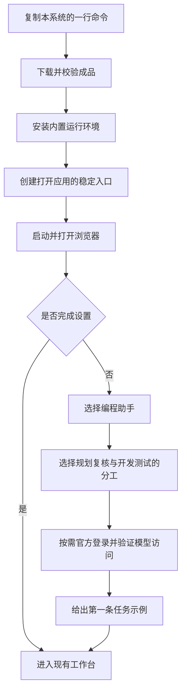
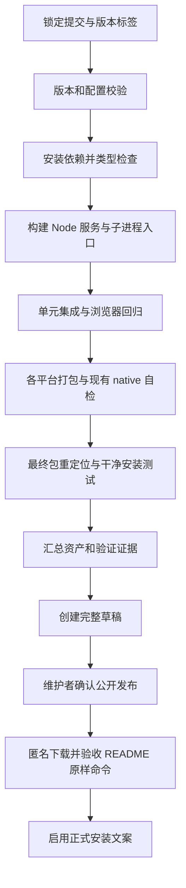
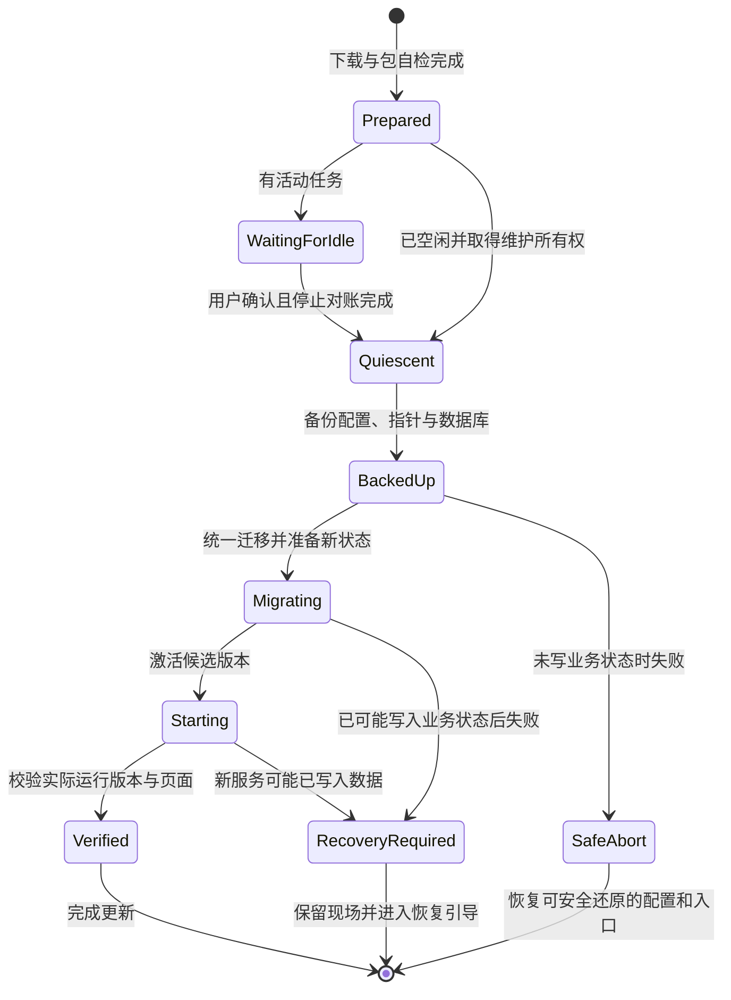

# DevFlow 一行安装与 README 产品化改造计划

## 最终修订版 · 基于 Node 运行时的最新代码

| 项目 | 内容 |
|---|---|
| 文档版本 | 2.0，完整替代上一版计划，不需要与旧版拼接执行 |
| 核查日期 | 2026-09-23 |
| 仓库 | `zephyrw/dev-flow` |
| 代码分支 | `main` |
| 固定基线 | `1150e7ab88ac9a486406a1eca5bd81abce0928e2` |
| 基线提交时间 | 2026-09-23 05:27:58 UTC |
| 对应 CI | DevFlow CI，run `35825395387`，按此提交重新核查 |
| 修订依据 | 最新安装器、发布脚本、启动器、Node 进程运行时、凭据 worker、配置迁移、README、使用指南及发布状态 |
| 验证边界 | 本次完成源码与线上状态核查、原文修订；没有修改远程仓库，没有执行跨平台安装、全量测试或真实模型工作流 |

**本文是可交付执行模型的完整实施计划，不是“已经实现并上线”的说明。** 下文严格区分“代码已实现”“仍需补强”“待新增”和“等待实测”。安装命令是发布后的目标入口，当前不能据此宣称公开安装已可用。

执行时以本文件为唯一改造依据。可以按任务编号记录进度、问题与测试证据，但不得另建一份缩减范围或降低验收要求的计划替代本文。若实施时主分支再次变化，先对照本基线核查差异；已经完成的事项转入回归，不重复开发，不恢复已移除的架构。

---

## 1. 改造目标与不可改变的产品方向

### 1.1 一句话定位

> **DevFlow：极简的模型调度器，也是你的 AI 开发工作流。**
>
> 让擅长思考的模型负责规划与复核，让擅长执行的模型负责开发和测试。你在一个工作台确认计划、查看进度、反馈问题和验收结果，不必在多个模型之间反复搬运任务与反馈。

“极简”首先指用户操作少、路径清楚、能看见正在发生什么，不是强行把内部所有工作塞进单一进程。模型调度指已有编程助手与开发任务的协作，不是新增模型 API 网关，也不是重新开发一个 IDE。

### 1.2 用户交付的完成定义

一个没有下载 DevFlow 源码、没有安装 DevFlow 开发工具链的用户，照 README 执行一行安装命令，即可安装并打开应用。之后只在界面完成自己选择的编程助手接入、必要的官方授权和模型设置，就能按明确示例开始第一条任务。以后打开、更新和恢复都不需要回到源码目录执行构建命令。

**用户得到的是可安装的应用，而不是一个要求他先成为维护者的源码工程。**

### 1.3 本次明确不做

不恢复 Go Host、旧认证 Host、`build:host` 或 `build:auth-host`；不因产品安装而新建 Go、C# 或 .NET 构建路线。不重写现有 Node 进程管理、凭据存储和工作流引擎，不为一行安装增加桌面壳、云后台或新的下载服务。

不改变计划审批、两阶段复核、人工功能确认和本地交付的既有语义；不把“自动工作流”扩展成未经批准自动推送或发布生产。不为宣传兼容性而把“适配器已实现”改成“真实工作流已认证”。

不改写既有账号调度边界：账号录入、登录后的探测、认证刷新和切换继续遵守串行要求；首次录入必须完成要求的五小时与周额度验证；未使用备用账号不能被后台并发探测、刷新或保活。

---

## 2. 与旧计划相比，哪些结论必须纠正

### 2.1 修订对照表

| 旧计划中的描述或任务 | 最新代码事实 | 本版处理 |
|---|---|---|
| 发布包包含 Go Host，需要 Go 编译 | `package.json` 与 Release workflow 已移除 Host 构建步骤；打包脚本不再复制 `dist/host`。[S02][S04][S05] | 删除 Go 构建、Go 安装条件、Go Host 打包任务。 |
| 主进程与认证能力依赖旧可执行 Host | 现在有 Node runner、平台 native 层以及 `credential-worker`；Windows native 层通过 `koffi` 调用系统接口。[S11][S12][S13] | 全文改为 Node 运行时基线；不把“不使用 Go”误写成“不含原生依赖”。 |
| 安装器把版本写死为 `0.2.0` | 已读取 `sourcePackage.version` 并做格式与包身份校验。[S08] | 标为已完成；剩余任务是标签、包、manifest、服务构建身份一致性。 |
| 没有打包原生依赖加载检查 | 发布脚本已从待打包目录加载 `koffi`，并用 `better-sqlite3` 打开内存数据库。[S05] | 复用已有检查，只补充最终压缩包、重定位、干净环境与真实进程能力验收。 |
| 没有安装后 native 自检 | 安装器已用安装目录中的 Node 调用 `getNativeAsync()`，并加载 SQLite；采用清理后的子进程环境。[S08] | 不再新增重复自检；补齐正式包禁用系统 Node 回退、验收覆盖和用户可理解错误。 |
| 升级没有停稳检查和备份 | 已接入控制器锁、`assertQuiescent()`、数据库备份以及配置和版本指针保护。[S08][S09][S14] | 不重做这些模块；补充运行中服务的友好维护交接、事务日志和失败恢复交互。 |
| 配置仍需继续迁移 Host 可执行路径 | 已有统一迁移模块，移除旧 `host` 与 `auth_host_executable`，迁到配置 schema 2，保留备份与输入哈希校验。[S10] | 不再更新旧 Host 路径；复用此迁移并补回归。 |
| 旧服务可能直接冒充新版健康服务 | 启动器已检查 `runtime_backend === node-v1` 和 `runtime_root`，拒绝另一安装目录。[S15] | 删除旧版缺少目录身份检查的结论；保留补充版本/提交身份和自动交接的任务。 |
| CI 必须新增“先构建再做 runtime 测试” | 主 CI 与 Release 已先 `pnpm build`，后执行相关测试。[S03][S04] | 标为已完成，列为不可退回的顺序约束。 |
| 旧提交 Windows 测试、macOS/Linux 构建失败 | 新提交对应新一轮 CI；复查时三平台类型检查和构建均成功，Ubuntu/macOS 单元与集成测试失败，Windows 尚在运行。[S21] | 不继承旧失败状态，不虚构新失败根因；以本提交最终结果设发布门禁。 |
| 一行安装尚无公开成品 | 本次 Releases 列表仍为空，Release workflow 最终仍创建草稿。[S04][S20] | 仍是实际交付缺口。 |
| README 完全与当前架构一致 | README 前面仍写 Go Host 和 Go 环境，末尾却写 Node 与 `koffi`。[S01] | 必须同时纠正事实矛盾和用户视角。 |
| 兼容性说明可以直接沿用 | `compatibility.json` 仍保留 `auth_host_protocol: 2.0.0`、旧 Host 能力名称和旧说明。[S17] | 更新字段含义及消费者；未知能力继续未知，不能直接改成已认证。 |

### 2.2 当前仍存在的产品交付缺口

一行下载脚本仍未形成公开发布入口；没有把普通用户的统一 `devflow` 命令连好；安装器最后主要打印首次设置地址，未接通默认浏览器打开；默认仍选择 Codex 并写客户端配置，模型未就绪仍可能返回 10；README 快速开始依然围绕源码构建。[S01][S06][S07][S08][S16]

这意味着改造重点是**补齐发布、入口与首次体验**，而不是再次迁移运行时。

### 2.3 在线状态的使用规则

本次观测的 CI run 是 `35825395387`，不是旧计划中的运行。核查早期三个平台均已完成依赖安装、类型检查和构建，测试正在进行；随后复查发现 Ubuntu 于 2026-09-23 06:17:57 UTC 完成并失败，macOS 于 06:15:50 UTC 完成并失败，二者失败步骤均为 Unit and integration tests，浏览器回归被跳过。该次复查时 Windows 的同一步骤仍在运行。[S21]

因此，本版没有继承“macOS/Linux 构建失败”的旧结论，而是把最新已确认的测试失败列入 DFP-02。没有读取失败日志并复现前，不把具体原因归咎于 Node、koffi 或某个测试。执行本计划时复核 Windows 最终结果及后续重跑结果，不能将部分步骤成功当作完整通过。

Releases 列表本次返回空。该结论只描述读取时刻，未来发布后应更新；不能把“有发布工作流”“有 Git tag”或“有草稿”写成普通用户已经能下载。

---

## 3. 当前技术基线：复用什么，不再建设什么

### 3.1 组成及发布职责

| 当前组成 | 主要路径 | 本次改造责任 |
|---|---|---|
| API 与本地工作台 | `apps/api/`、`apps/web/` | 首次引导、版本诊断、维护操作入口；保留既有工作流。 |
| Node 进程运行时 | `packages/process/` | 复用进程所有权、runner、控制器锁和环境清理；加入发布级回归，不重写。 |
| 受管 runner | `packages/process/src/runner-entry.ts` | 必须编译进成品；验证启动握手、停止和控制器断开时的行为。 |
| 平台 native 适配 | `packages/process/src/native/` | `koffi` 与 OS/架构匹配；验证真实系统能力，不能只检查 TS 文件存在。 |
| 账号凭据 worker | `packages/agy-accounts/src/credential-worker.ts` 等 | Node 子进程入口；Windows 凭据能力单独验证，不能自动开放账号功能。 |
| 打包与安装 | `scripts/release/`、`scripts/bootstrap/`、`packages/installer/` | 成品完整性、远程入口、安装事务、稳定启动器。 |
| 服务启动 | `packages/service/src/launcher.ts`、`open.ts` | 复用启动、身份检查和打开浏览器，补充产品级入口与降级提示。 |
| 配置迁移 | `packages/contracts/src/config-migration.ts` | 复用 schema 2 迁移，保留哈希校验、备份与用户自定义字段保护。 |

上述能力在代码中存在，不等同于已通过所有系统的真实安装或完整业务验证。[S05][S08][S10][S11][S12][S13][S14][S15]

### 3.2 “不用 Go”的正确表述

开发者构建主要沿用现有 Node、pnpm 与 TypeScript/Vite 路线；Node 与 pnpm 版本继续以 `package.json` 和 CI 的现有锁定值为准，本次不顺带升级工具链。

普通用户获得内置 Node 和生产依赖的成品包，不需要安装 Node、pnpm、Go 或 C/C++ 编译工具来构建 DevFlow。`koffi` 和 `better-sqlite3` 仍是必须正确分发的原生依赖；跨平台包不能把它们漏掉，再要求用户执行 npm/pnpm 安装补齐。

DevFlow 自身依赖、AI 客户端的安装授权、业务项目的 Git/JDK/数据库是三件不同的事。后两者按使用场景检查，不作为打开 DevFlow 界面的前置阻塞。

### 3.3 保持现有安全语义

复用 runner 和平台进程管理，不用 `taskkill /IM node.exe`、`pkill node` 之类全局命令实现停止。进程未知保持未知，不能为让安装继续而假定退出；不能把终止根进程等同于整棵任务进程树已停止。

复用 worker 的受管启动、会话标识与串行调用约束。软件安装期间不读取或切换真实账号、不捕获现用账号凭据、不开展双额度探测。安装完成与账号能力就绪分别展示。[S08][S12][S13][S14]

---

## 4. 目标用户旅程与命令契约

### 4.1 首次使用



默认安装必须无交互地完成“软件可打开”。模型设置在页面中进行，不通过长串 CLI 参数逼用户理解内部角色、MCP、Skill 和配置文件。

### 4.2 一行命令：发布后的目标，不是当前已上线

macOS / Linux 推荐的正式命令形态如下。保留外层 `pipefail`，使下载失败不会被后面的空 Shell 掩盖：

```bash
bash -o pipefail -c 'curl -fsSL https://github.com/zephyrw/dev-flow/releases/latest/download/install.sh | bash'
```

Windows PowerShell 推荐的目标形态：

```powershell
irm -ErrorAction Stop https://github.com/zephyrw/dev-flow/releases/latest/download/install.ps1 | iex
```

这两条命令仅在脚本作为正式 Release 资产发布、且按原样验收后启用。GitHub 提供 latest 资产入口，草稿与预发布不能作为 latest 正式版本。[E01][E02]

PowerShell 入口必须先修订调用契约：当前脚本含 `exit`，不可直接假定适合在用户交互窗口中执行。实现时取消会终止宿主窗口的顶层退出行为；失败抛出终止错误并记录机器可读状态，严格自动化调用在子进程中验证退出码。不得修改全局执行策略或要求关闭系统安全功能。[S07]

同时提供“先下载、审阅后运行”和“固定版本/本地成品安装”的高级路径；默认首页只展示各平台的一条命令，不并列多套互相冲突的主入口。

### 4.3 版本解析只做一次

发布到某个版本的 `install.sh`、`install.ps1` 应带入该版本的不可变标签或可信 manifest 绑定信息。用户访问 latest 得到脚本后，该脚本固定下载同一标签下的 manifest 和成品，不再二次解析 latest，避免安装期间新版本发布导致脚本与包跨版本混用。

本地开发版 bootstrap 可以保留显式 `--version` 等选项，但正式资产不得留下未替换占位符。稳定版不悄悄安装预发布；预发布必须指定版本。

### 4.4 安装参数和返回状态

| 用户目的 | Shell 目标参数 | PowerShell 对应参数 | 约束 |
|---|---|---|---|
| 普通安装 | 无参数 | 无参数 | 装好即打开；客户端和模型可以稍后配置。 |
| 固定版本 | `--version` | `-Version` | 严格匹配标签、版本及平台，不回退 latest。 |
| 指定目录 | `--install-dir` | `-InstallDir` | 支持空格、中文，不改写业务项目目录。 |
| 无浏览器启动 | `--no-open` | `-NoOpen` | 完成服务安装并打印地址。 |
| 严格就绪检查 | `--require-ready` | `-RequireReady` | 仅此模式把未完成工具设置作为非成功状态。 |
| 安装本地完整成品 | `--source` | `-Source` | 不是 clone 仓库自动构建的别名。 |

已有工具与模型参数继续兼容高级使用；普通安装不默认替用户配置 Codex。需要同时修改当前解析器、`tools` 校验和 installer 默认值，使“不指定客户端、稍后设置”成为合法状态，不能只在 UI 隐藏参数而让底层继续报错。[S06][S07][S08]

建议保留现有细分错误码用于诊断；默认安装的成功条件是软件可运行，模型未配置作为 onboarding 状态。内部旧调用依赖退出码 10 的地方必须有兼容测试，不能全局搜索替换掉 10。

### 4.5 日常使用只记住一个命令

```bash
devflow
```

默认语义是打开工作台；`devflow open` 为显式别名。再提供少量管理入口：`status`、`doctor`、`stop`、`update`、`uninstall`。`--help`、`--version` 在配置损坏和数据库不可用时仍应能工作。

Windows 创建开始菜单入口；macOS/Linux 桌面入口采用平台可用方式实现。首发不要求独立桌面壳，不能把桌面封装变成一行安装的阻塞条件。安装后通过绝对路径立即打开，不依赖当前终端的 PATH 已刷新。

---

## 5. 成品包与发布链路

### 5.1 沿用现有 Node 包结构

```text
devflow/
  runtime/
    node 或 node.exe
  dist/
    apps/                         # 编译后的 API
    web/                          # 前端成品
    packages/
      installer/
      service/
      cli/
      process/                    # runner-entry、native 层等
      agy-accounts/               # credential-worker/store 等
      bridge/
      ...                         # 其他实际运行需要的已编译模块
  node_modules/                   # 平台匹配的生产依赖，含 koffi、better-sqlite3
  packages/skills/
  package.json
  pnpm-lock.yaml
  pnpm-workspace.yaml
  build-info.json                 # 待新增，构建身份
  compatibility.json              # 待补入，验证声明与协议元信息
  LICENSE
  THIRD_PARTY_NOTICES
  sbom.json
```

**不包含 `dist/host`，不恢复旧 Host 二进制。** 上述 `build-info.json` 和随包兼容性声明是待补内容；现有打包已包含的内容继续复用。[S05]

生产依赖在 CI 中准备，用户端不得执行 `pnpm install`、`npm rebuild`、`tsc`、`go build` 或其他本地编译来完成成品安装。离线本地包安装也不得暗中联网补依赖。

### 5.2 在现有自检上补齐四层验证

| 验证层 | 当前基础 | 本次补强 |
|---|---|---|
| 构建目录 | 已加载待打包目录的 `koffi` 与 SQLite。[S05] | 保留；补齐完整运行模块清单，不以仅有 package.json 作为 native 成功依据。 |
| 安装目录 | 已用安装后的 Node 调用平台 native 模块和 SQLite。[S08] | 保留；正式包必须有内置 Node，不允许静默回退系统 Node。 |
| 最终归档 | 尚不能从前两项推导归档重定位可靠 | 从实际 tar.gz 解压到全新随机目录，以包内 Node 测试；包含中文/空格路径与权限。 |
| 干净系统 | 构建机本身不是普通用户环境 | 隐藏或移除系统 Node/pnpm/源码访问，验证安装、打开、再启动、更新及平台进程控制。 |

原生进程 smoke 应创建一次性测试子进程与其子进程，验证受管启动、停止、所有权和退出确认。不能只调用 `koffi.load` 就宣称所有任务都能安全终止；也不得用此测试触碰真实 AI 账号。

Windows 的 credential worker 自检应分为入口/协议检查和隔离能力测试。后者可以使用专门测试数据或明确安全的能力操作，不读写真实官方账号目标，不将文件存在时的 `VERIFIED` 混同于账号登录或跨账号续接认证。[S13]

### 5.3 安装复制清单补齐

当前安装器主要复制 `dist`、Skills、`node_modules`、`package.json` 与可选 runtime，未将发布包中的全部许可证/元数据都带入版本目录。[S08]

新增唯一的“运行与合规文件清单”，同时供构建校验、安装复制及测试使用。安装后必须留有许可证、第三方声明、SBOM、构建身份、兼容性信息和收据。收据增加成品摘要、版本与构建提交，不仅依赖少量必需文件内容的组合哈希。

不要为版本目录覆盖增加“强制覆盖同版本”默认开关。同版本同摘要可幂等复用；同版本不同摘要必须拒绝，并提示使用新版本号或独立开发目录。

### 5.4 版本与 manifest

保留已经动态读取包版本的实现。新增构建身份，将以下内容绑定：标签、应用版本、Git 提交、平台架构、Node 版本、native 依赖实际版本、配置/数据兼容范围、运行后端与协议标识。

三种版本不要混用：应用版本来自 package.json；配置 schema 当前为 2；运行后端当前为 `node-v1`。credential worker 当前返回 `3.0.0-node`，它不是应用版本或配置 schema。[S08][S10][S13][S15]

继续生成现有每平台 manifest，另在汇总 job 生成全平台 release manifest，检查没有缺包、重复平台或不同提交混合。manifest 的构建时间不再冒充实际公开发布时间；SBOM 使用锁文件解析后的版本，不把版本范围字符串当成全部实际依赖清单。[S05]

### 5.5 平台范围不扩大承诺

当前 Release 矩阵为 `win32-x64`、`darwin-x64`、`darwin-arm64`、`linux-x64`。保持这四个候选目标，只有验收通过的平台才公开标注成品可用。当前脚本能识别某架构，不代表已经有对应包。[S04][S06][S07]

Windows arm64、Linux arm64 暂不因脚本识别能力自动进入首发范围。架构识别还须拒绝未知和 32 位组合，不能统统映射成 x64。Linux libc、最低系统版本及 macOS 最低系统要求须由实际构建和实测确认；不把 ubuntu-latest 通过写成所有 Linux 发行版可用。

### 5.6 解压与分发保护

沿用 HTTPS 和摘要校验，补充 manifest 的严格格式、大小与平台校验。解压路径检查除了绝对路径和 `..`，还要覆盖符号链接、硬链接和跨根目录写入。不得用“先解压、事后检查”保护用户主目录。

同源 SHA-256 主要保证包与清单一致，不等同于独立的发布者签名。发布签名/证明可以分阶段增加，但不能用此理由跳过当前完整性校验。安装不要求管理员权限；下载中断、磁盘不足或校验失败不得改变现用版本。

构建使用全新 staging，避免 `tsc` 不清理的旧 dist 文件被一起打包。负向清单检查旧 Host 产物与旧路径只针对正式包；历史迁移测试样本可保留，不做无差别文本删除。

### 5.7 CI 与正式发布



保留当前“先 build 再 runtime tests”的顺序。Release 当前只执行单元测试，不能据此绕过本提交的集成与浏览器回归；可以复用共同检查工作流，或严格验证同一提交的完整 CI 成功，但不得看 main 最近一次绿色就算当前标签通过。[S03][S04]

安装脚本作为 Release 资产一并生成上传，不能只发布包和各平台 JSON。草稿可保留为人工闸门；公开发布应是显式步骤。私有草稿中先完成资产级测试，公开后再做匿名网络入口 smoke；公开后失败时恢复此前可用的发布入口并显示故障，不让用户继续复制已知不可用命令。

---

## 6. 安装器与统一启动入口

### 6.1 把安装成功和设置完成分开

沿用 `state.json`，增加明确的结果结构或视图，不另造第二份模型默认配置。软件安装、首次设置、工具能力三个维度分别记录：

| 维度 | 状态例子 | 默认显示 |
|---|---|---|
| 软件 | 下载中、校验中、已安装、启动失败 | DevFlow 本身是否能运行。 |
| 设置 | 未选择工具、待登录、待访问验证、完成 | 下一步操作按钮，不显示成软件安装失败。 |
| 能力 | 客户端已发现、模型可访问、工作流已验证、未知 | 标明验证对象与范围，不用一个绿色标志混淆所有含义。 |

默认成功提示：

> DevFlow 已安装，并已打开设置页面。选择你要使用的编程助手和模型，即可开始。

浏览器未打开时：

> DevFlow 已安装。浏览器未能自动打开，请访问下方地址，或运行 `devflow` 再次打开。

账号能力在非 Windows 或未认证环境不可用时，只限制相应账号功能，不阻止其他工具使用。

### 6.2 安装阶段与幂等性

按“预检—下载校验—新版本 staging—包内自检—必要的维护交接—配置准备—注册入口—目标服务验证—完成展示”实施。首次安装和升级共享基础逻辑，但不能把升级中的用户数据处理简化成直接复制覆盖。

软件未选择客户端时，不进入客户端配置写入循环。保留显式指定客户端的高级安装模式；记录所有由 DevFlow 管理的配置变更，便于更新和卸载时只处理自己的条目。

两个安装器同时操作同一安装根目录，必须互斥。互斥机制复用 `packages/process` 的 native 能力，在操作正式目录前取得安装事务所有权；不要把永久存在的文件当作可无限阻塞的锁，也不要以固定短超时后强删活跃锁来“修复卡住”。

### 6.3 稳定入口与 current.json

稳定入口安装到用户级 bin/系统菜单，不在业务仓库中创建启动文件，也不依赖当前工作目录。它读取安装根目录的 `current.json`，找到选定版本、内置 Node 和配置路径，再启动该版本的用户 CLI。

必须避免一个容易遗漏的循环依赖：**不能要求系统 Node 先解析 current.json，才能找到包里的 Node。** 首发采用随安装维护的轻量 bootstrap：固定启动脚本调用安装目录内的独立引导 Node 与无第三方依赖的 `entry.mjs`，后者解析、验证 current.json，再调度当前版本。该 Node 从已校验成品复制或安全复用，不是让用户另外安装。

引导层只解析指针、验证路径和转发命令，不加载业务数据库、native 模块或模型配置。它与版本目录分开管理，不因清理旧应用版本而失效。引导运行时的升级必须使用临时文件、校验与平台安全替换；Windows 文件正在被占用时延后到退出后的安装阶段，不能强行覆盖。其许可证和版本也纳入收据。

建议安装根目录布局：

```text
<install-root>/
  bootstrap/
    runtime/node 或 node.exe
    entry.mjs
  bin/                            # 稳定的 devflow 包装入口
  versions/<application-version>/ # 完整、不可原地覆盖的应用版本
  current.json                    # 当前应用版本及路径
  devflow.yaml                    # 复用现有配置路径
  state/                          # 复用现有默认状态目录
  state.json                      # 安装状态，不与 state/ 内业务数据混淆
  backup/
  transactions/                   # 待新增：安装/更新事务日志
```

现有自定义 `storage_root` 不被重置为该示例。路径读取必须限制为受信任的安装位置，拒绝异常指针或执行任意外部程序；保留可诊断错误，不偷偷选择另一版本。

### 6.4 PATH 和系统入口

用户 PATH 只追加本应用管理的 bin，不覆盖原值、不重复追加、不默认改管理员级环境。Unix shell 初始化文件由清楚标记的可移除区块管理，保留用户注释与其他设置；Windows 保存用户 PATH 的原有条目。

如果已存在同名非 DevFlow 命令，提示冲突并提供绝对路径入口，不覆盖其他应用。当前终端尚未加载新 PATH 时仍应通过绝对路径自动打开；提示“新终端可直接使用 devflow”，不要把重新开终端当成安装失败。

已有 `writeAccountsLauncher()` 是 Windows 账号入口，不应误认为已经具备完整的跨平台主应用启动器。主入口需要新增，但账号入口继续复用并保持 `--accounts` 的服务模式限制。[S09][S15]

### 6.5 CLI 的最小重构

当前 CLI 默认 help、模块顶层读取配置且导入大量业务模块，帮助中仍要求源码构建。[S16] 调整为先解析命令：

| 命令 | 行为 | 是否允许修改状态 |
|---|---|---|
| 无参数 / `open` | 复用 `openBrowser('full')` 打开工作台 | 仅必要启动，不触发模型任务。 |
| `--help` / `--version` | 输出简短用户帮助及应用构建版本 | 否；不要求配置和数据库有效。 |
| `status` | 显示已安装版本、运行版本、设置状态 | 只读，不为查状态启动模型。 |
| `doctor` | 诊断安装、Node/native、服务、所选客户端 | 默认不登录、不切换账号、不探测额度。 |
| `stop` | 安全停止本应用；活动任务需明确处置 | 只操作本应用拥有的进程。 |
| `update` | 检查并执行第 7 节维护协议 | 涉及版本和数据，遵循事务边界。 |
| `uninstall` | 移除应用管理的入口与软件 | 默认保留项目、任务和用户凭据。 |

原有维护、导出、备份等高级命令保留兼容入口，移入详细帮助，不能删除已有用户流程。轻量命令按需动态导入业务模块，避免配置损坏时连帮助也打不开。

### 6.6 服务识别与浏览器降级

保留 `service`、`instance`、服务模式以及新增已有的 `runtime_backend` / `runtime_root` 检查，不回退为只看端口和 HTTP 200。补充 `application_version`、`build_revision`、`service_protocol_version` 等明确字段，具体命名统一后同时更新服务、安装器和测试。[S15]

对于同一版本目录不同构建的情况，以收据/构建摘要拒绝不明来源覆盖。服务检查不能只验证配置指针变了，必须验证实际运行的构建身份。

端口被其他程序占用时不杀进程。首发默认提供清楚的端口选择与重试；若实现自动换端口，必须同步持久配置、human origin、桥接连接和打开地址后才生效。不要只改变浏览器 URL。无桌面环境保持本机回环绑定，不为方便访问默认暴露 `0.0.0.0`。

---

## 7. 升级与恢复：在现有保护上补齐交接

### 7.1 已有能力必须保留

`runInstaller()` 已调用控制器锁、进程/lease 停稳检查、SQLite 备份及统一配置迁移。新版本可能写入业务状态后，代码明确禁止直接回滚数据库或降级。[S08][S09][S10]

这不是“升级模块从零开发”。本次补强的是如何让普通用户通过一个入口完成安全交接，以及失败后怎样看懂并恢复。

### 7.2 运行中服务的维护交接

当前安装器直接获取控制器锁；当服务持锁运行时，安全拒绝有意义，但普通用户不应被要求手工查 PID、杀进程、重新拼启动命令。[S08][S14]

新增合作式维护流程：先预下载并校验候选包，不修改当前状态；确认当前服务确属本安装；请求进入维护准备。若有运行或即将派发的任务，页面显示“等待任务结束后更新”或“暂停并更新”，用户做出明确选择。禁止新派发后，等待本应用的进程退出和资源对账；只有全部确认后才停止服务并转交控制器锁。

**锁顺序必须明确：不能让更新器先抢服务持有的控制器锁，再要求该服务完成停止，形成死锁。** 安装事务所有权用于防止两个安装器；运行控制器所有权在服务退出后交接。两者职责不同，复用 native 原语，不建立第二套互相竞争的工作流控制器。

维护标记需要可验证的事务身份、阶段和过期恢复条件。安装器释放锁与目标服务取得锁的交接期间，其他启动器不得抢先启动旧版本；现有 `maintenance.lock`、startup lock 和 native controller lock 应统一编排，不复制 Windows `FileShare.None` 的假设到所有平台。[S15][S19]

### 7.3 升级状态机



### 7.4 事务日志和恢复边界

在 `transactions/` 记录事务 ID、源/目标版本与摘要、原配置与指针摘要、备份路径、阶段、是否可能发生新版本持久写入、受管理客户端配置变更。不要记录账号密钥、模型令牌或原始凭据。

| 失败阶段 | 默认处理 |
|---|---|
| 下载、摘要、native 自检失败 | 不碰当前版本和数据库；清理本次临时目录，提供重试。 |
| 配置准备失败，尚未写业务状态 | 按备份与文件哈希恢复本事务拥有的变更；用户并发修改过的文件不覆盖。 |
| 开始构造新版本 Store 或启动新服务后失败 | 保留当前状态与备份，标记需要恢复；禁止自动拷回旧数据库掩盖新写入。 |
| 客户端配置部分写入 | 按参与者收据与前后哈希恢复或继续，不能留下入口指向不存在的版本。 |
| 进程状态/资源租约无法确认 | 阻止升级并提供对账操作；不把 unknown 批量改成 exited。 |

可提供修复当前版本、导出诊断、重试目标服务、审查后按匹配快照恢复的入口。不能承诺任何失败都自动无损降级。首次安装失败也应清理本事务创建的空配置和指针，但不删除此前存在的用户数据。

### 7.5 配置迁移与旧数据

复用 `dryRunMigration()` / `applyMigration()`。迁移要保留用户配置和注释、校验输入哈希、备份后原子写入；不得手写第二套删除旧字段的正则脚本。遇到不合法或自定义历史 Host 设置，按现有验证政策明确报告，不静默接受或恢复旧架构。[S10]

从使用旧 Host 的历史本地版本迁入 Node 版本时，先确认旧进程与资源已停止。当前没有公开 Release，不代表用户没有本地历史数据，因此提供隔离的历史配置与数据库夹具测试，而不是假造一个不存在的已发布旧包。

不要自动删除或转换凭据保险库。账号存储结构若另有迁移需求，必须由已有账号模块负责并单独验证；不把 schema 2 配置迁移等同于全部账号数据迁移。

### 7.6 更新与卸载后的保留规则

成功更新保留至少一个已知可用应用版本及本次必要备份；旧版本清理必须确认没有进程、桥接配置或引导层引用它。应用入口、账号入口和客户端桥接都以当前受管理版本为准，不再维护旧 Host 的 exe 路径。

卸载默认只移除本应用拥有的程序、PATH 区块和系统入口，保留任务数据、业务项目与账号保险库。清除任务数据或账号记录应分别明确选择，并先解释范围；永远不删除用户项目目录来“清理工作区”。

---

## 8. 首次设置与日常体验

### 8.1 三步向导，复用已有模型设置

默认流程是“连接工具—选择分工—验证并开始”。向导复用现有模型目录、访问验证和 defaults 保存服务；新增的只是引导状态及展示，不维护另一套 planner/executor 配置，不替任务覆盖配置做默认回写。

**连接工具。** 自动发现只做本地可执行程序与非敏感状态检测。用户选择需要的助手后，展示将配置哪些接入内容，再安装对应 Skill/MCP。没找到的助手显示安装指引，用户可以先进入工作台；不得默认给所有八种工具修改配置。

**选择分工。** 首屏只显示“规划与复核”和“开发与测试”。允许同一工具承担两者，也允许组合。模型、思考强度和能力来自当前客户端/账号的实际发现与验证；不把某个模型版本写死为全体用户可用的默认值。高级覆盖沿用现有位置，不堆到首次安装。

**验证并开始。** 登录成功与模型访问验证成功分别展示。官方登录/设备确认由用户完成，不向 DevFlow 提交密码。验证失败保留所选内容，提供重新验证，不要求重装软件。

### 8.2 不额外消耗用户模型额度

仅发现 CLI 版本不应发起真实模型任务；需要调用模型的访问测试必须说明并在用户选择后进行。已验证配置按既有作用域复用，不每次打开应用或每个任务重复验证。

额度显示继续使用快照及其采集时间，未知保持未知。首次账号录入需要真实双额度验证的规则保持不变；不能把“只展示本地快照”用于绕过录入门禁，也不能为刷新页面而同时激活备用账号。

### 8.3 设置完成后的第一步

现有指南以“在 Codex 打开项目并提出需求，工作台看计划、进度与验收”为主路径。[S18] 本次沿用已验证的实际入口，不因重写 README 假设所有规划工具或网页直接提交需求都已完整可用。

完成页给出可复制示例：

> 在 Codex 中打开你要修改的项目，然后输入：
>
> 用 DevFlow 帮我修复客户列表筛选的问题：选择负责人后，列表没有变化。请先给我计划，等我确认后再开始修改。

如果用户所选工具没有经过该入口的真实验证，应明确提示当前状态，并给出已验证路径；不要在选择页允许一条看似完整的路线，到完成页才无说明地强制跳回 Codex。

### 8.4 日常状态都配一个明确行动

| 场景 | 面向用户的表达与操作 |
|---|---|
| 模型设置未完成 | “应用已就绪，还需要选择模型” → 完成设置。 |
| 未发现所选客户端 | “没有找到此编程助手” → 安装指引 / 重新检测。 |
| 模型无权访问 | 保留设置，说明授权问题 → 官方登录 / 重新验证。 |
| 正在执行 | 显示真实过程、当前阶段 → 停止或反馈。 |
| 正在停止 | 显示处理中；全部确认退出后才显示已停止。 |
| 当前任务排队 | 显示原因和占用者，不只显示内部 lease 名称。 |
| 更新被阻止 | “仍有任务或进程未停止” → 查看任务 / 等待 / 对账。 |
| 更新后需要恢复 | 说明数据已保留 → 修复当前版本 / 查看备份与诊断。 |

实时可见、人工可控、多任务互不干扰等现有能力继续回归；不为安装极简而删除暂停、授权、反馈和验收操作。

---

## 9. README 产品化重写

### 9.1 首页先回答六个问题

这是什么？替用户省掉什么操作？怎么装？第一条任务怎么开始？支持什么且需要什么？遇到问题去哪里？

先讲用户收益，再给安装入口与真实演示。不要以“跨平台通用工作流平台”“全生命周期协同”“具名互斥”“进程组”“原生模块”开头。运行时迁到 Node 不是首页新的主卖点。

### 9.2 信息架构

```text
产品名称与一句话定位
真实工作台截图或短演示
立即开始：当前可用的平台与一行安装
第一个任务：可复制的具体例子
从需求到验收：用户版流程图
核心收益：模型分工、自动交接、实时可控、问题续修
工具与系统支持：已验证范围和详细链接
常见问题：账号、费用、数据、项目环境、更新
使用指南 / 反馈入口
开发与贡献 / 许可证
```

README 控制在用户首次理解与开始使用所需的篇幅。详细计数规则、恢复政策和接口约束继续存在于专门文档，不删业务要求，只调整展示层次。

### 9.3 功能表达转换

| 现有技术表达 | 对用户应该讲的好处 | 细节放哪里 |
|---|---|---|
| Host、mutex、flock、runner | 任务过程看得见，需要调整时可以停止 | 运行时与排障文档。 |
| 多模型角色与 Skill/MCP 分发 | 按所长分工，减少手工传话与复制结果 | 工具接入说明。 |
| 两阶段复核与精确失败计数 | 开发后有复核，发现问题继续整改，你保留最终确认 | 完整工作流规则。 |
| Git index、worktree、staged/unstaged | 聚焦本次修改，交付前可以看清改了什么 | 工作区与交付安全文档。 |
| 临时问题槽位、排队和幂等 | 开发中也能临时提问，不必另开正式需求 | 临时提问使用指南。 |
| MIME 和请求大小上限 | 需要时说明附件格式与大小 | 附件帮助。 |
| pnpm build/typecheck/test | 普通用户不需要先构建应用 | 开发指南。 |

避免“绝对不破坏”“保证无缺陷”“所有模型无损续接”“一定省钱”等无法普遍保证的承诺。可以说明分工减少操作、便于选择模型，但没有对照证据时不写节省百分比。

### 9.4 推荐正文文案

以下是 README 的可采用正文；安装区、截图和支持矩阵须在真实版本验收后填入，不得用不存在的资源冒充上线。

> # DevFlow
>
> **极简的模型调度器，也是你的 AI 开发工作流。**
>
> 让擅长思考的模型负责规划与复核，让擅长执行的模型负责开发和测试。
>
> 不必在多个模型之间反复复制需求、计划和错误日志。DevFlow 把这些步骤连接起来，让你在一个工作台确认计划、查看进度、反馈问题和验收结果。
>
> ## 少做交接，多关注结果
>
> **模型各司其职。** 选择谁负责规划与复核，谁负责开发与测试，任务衔接交给 DevFlow。
>
> **同一个需求持续推进。** 从计划确认到开发、测试和复核，发现问题就在原任务中继续处理，不必重新整理背景。
>
> **看得见，也能控制。** 查看 AI 正在做什么，方向不对就停止并反馈；需要授权和功能确认时，由你决定。
>
> ## 开始使用
>
> 按你的系统执行安装命令。安装后会打开工作台，按照页面提示连接编程助手、选择模型并完成必要授权。不需要下载 DevFlow 源码或自行构建。
>
> ## 试试第一个任务
>
> 在当前已验证的编程助手入口中打开你的项目，输入：
>
> “用 DevFlow 帮我修复客户列表筛选的问题：选择负责人后，列表没有变化。请先给我计划，等我确认后再开始修改。”
>
> 在工作台确认计划后，继续查看开发与测试过程。发现问题可反馈修复，功能符合预期后再确认验收。

正文中的“当前已验证入口”在真正发布时应替换成具体工具名称和实际操作，不能把含混占位符留给普通用户。

### 9.5 用户版流程图


这张图简化展示，不改变人工前/人工后复核的真实规则，也不代表平台为测试证明背书。

### 9.6 发布前后使用两种状态，不误导用户

发布前的安装区应写“当前为开发预览，正式安装包尚未发布”，把源码运行放在开发指南链接后，而不是称其为普通用户快速开始。可以展示产品价值和真实演示，但不能把未来安装命令标为可用。

发布并完成匿名安装验收后，才替换成第 4 节的命令，显示实际版本、平台范围和后续 `devflow` 打开方式。此切换必须和 release 证据关联，不能只合并一份看起来漂亮的 README。

### 9.7 截图与 FAQ

截图来自实际版本：优先展示模型分工设置和一个可理解的任务进度/验收界面，隐藏账号、用户路径、业务数据和令牌。不生成概念界面来冒充已实现功能；本计划不附虚构截图路径。

FAQ 应明确：DevFlow 不赠送第三方模型账号或额度；能否复用订阅以相应工具的实际授权为准。应用本地运行不等于云端模型调用时项目内容绝不外发。安装 DevFlow 不需要构建源码，真实项目可能仍需要 Git、语言运行时和数据环境。关闭浏览器不等于停止任务；生产发布和代码推送保持既有授权边界。

### 9.8 文档分层与历史文字清理

`docs/guide/使用指南.md` 开头目前是面向执行模型的“指定计划权威规则”。将它移到执行约定/对应 Skill 的明确位置，并更新引用；人类指南从第一条任务开始。规则本身保留，不因搬家而削弱。[S18]

README 前部的 Go Host、Go 环境要求必须删除；其余文档中历史架构、迁移说明、测试夹具可以保留并标“历史”。开发指南和普通用户指南不再指向同一套源码安装脚本。`scripts/install-windows.ps1` 可保留兼容入口，但应明确“开发者源码安装”，不能再作为用户默认入口。[S01][S19]

---

## 10. 兼容性与能力声明修订

### 10.1 先纠正旧协议字段，不自动提高验证等级

`compatibility.json` 仍使用旧认证 Host 字段和旧能力名称；这与当前 Node credential worker 已不一致。[S17] 实施时先检索字段消费者，再迁移 schema、读取方、测试和文档。

目标声明至少分开应用构建、运行后端、runner 协议、credential worker 协议、平台安装验证和真实工具工作流验证。不能把当前 `runtime_backend: node-v1` 当成所有这些项目共同的版本号。

`credential-worker` 的能力响应是 `3.0.0-node`；旧 `auth_host_protocol: 2.0.0` 不能继续作为当前能力认证依据。旧 `doctor`、`job-status` 字符串等若属于旧 Host 接口，应按新实现提供的能力模型替换，而不是在 Node CLI 上伪造旧命令。[S13][S17]

### 10.2 四种验证分开记录

| 验证类型 | 能证明什么 | 不能证明什么 |
|---|---|---|
| 包构建和 native 加载 | 某系统架构的包可生成，依赖能加载 | 不能证明完整安装、进程生命周期或账号可用。 |
| 安装与工作台 smoke | 可以安装、启动、打开页面、重新打开 | 不能证明真实模型能完成任务。 |
| 工具访问验证 | 指定工具/账号/模型可被实际访问 | 不能证明全部角色、子 Agent 和恢复能力。 |
| 真实工作流验证 | 指定版本和组合完成了规定任务路径 | 不能推广为所有平台和所有模型均支持。 |

验证证据包含：应用提交、平台、工具版本、模型标识、测试日期、测试类型、结果和可检查的报告位置。未经测试的组合保持 `unverified`；仅有替身测试的项目不标 `live_workflow_verified: true`。

当前八种工具均为适配已实现、真实工作流未认证。这个状态可以通过实测逐项更新，但不能通过 README 美化直接升级。[S17]

---

## 11. 文件级改造清单

下列“新增建议”是目标路径，不表示当前已经存在。若仓库已有等价模块，直接复用并统一引用，不另建同功能实现。Node 进程和凭据模块默认只增回归；除真实失败定位要求外，不改变其既有安全逻辑。

| 路径 | 类型 | 具体处理 |
|---|---|---|
| `README.md` | 修改 | 产品定位、用户收益、安装状态、第一条任务、验证范围；移除 Go 和开发者快速开始。 |
| `docs/guide/使用指南.md` | 修改 | 以人类使用步骤开头；执行约定迁移并保留；统一启动、设置和恢复入口。 |
| `docs/guide/使用与恢复指南.md` | 审核后修改 | 与成品版一致，不再默认要求用户回源码目录。 |
| `docs/guide/安装与升级.md` | 新增建议 | 一行安装、固定版本、本地包、支持条件、更新和恢复。 |
| `docs/guide/客户端兼容性.md` | 新增或归并 | 按构建和证据展示工具、角色、平台支持。 |
| `docs/development/开发指南.md` | 新增或归并 | Node/pnpm 开发构建、先构建后测试、当前 native 运行时；不保留 Go 构建要求。 |
| `CONTRIBUTING.md` | 新增或归并 | 开发指南与贡献流程入口，避免 README 被实现细节重新占满。 |
| `docs/assets/` | 增加真实素材 | 当前工作台和分工设置的截图/演示，脱敏。 |
| `package.json` | 小范围修改 | 保持工具链锁定；按需加入发布校验脚本，不恢复任何 Host 构建命令。 |
| `scripts/release/build-release.mjs` | 补强 | 复用现有包清单和 native 加载检查；加入构建身份、安装脚本资产、最终包测试入口。 |
| `scripts/release/verify-release.mjs` | 新增建议 | 标签/版本/提交一致、文件清单、native 依赖、旧产物排除、manifest 校验。 |
| `scripts/release/assemble-release.mjs` | 新增建议 | 汇总各平台 manifest，产出统一发布清单和固定版本 bootstrap。 |
| `scripts/release/smoke-install.*` | 新增建议 | 从最终归档执行安装、重定位、生命周期和更新测试。 |
| `scripts/bootstrap/install.sh` | 修改 | 固定版本、严格成品模式、可选客户端、参数与错误处理、无浏览器模式。 |
| `scripts/bootstrap/install.ps1` | 修改 | 参数对齐、固定版本、不终止交互窗口、临时目录清理、架构识别。 |
| `scripts/install-windows.ps1` | 保留兼容并澄清 | 标为源码开发入口；其维护锁与新运行时协调，不作为用户主页入口。 |
| `packages/installer/src/main.ts` | 补强 | 复用动态版本、自检、备份；分离安装/设置，延后客户端配置，补元数据复制与主入口。 |
| `packages/installer/src/upgrade.ts` | 补强 | 复用停稳检查和备份，加入合作式维护、事务记录、恢复入口及客户端变更收据。 |
| `packages/installer/src/launchers.ts` | 新增建议 | 稳定 bootstrap、PATH、主应用系统入口、账号入口复用。 |
| `packages/installer/src/transaction.ts` | 新增建议或归并 | 安装/更新阶段日志、锁交接和可恢复错误；不另造业务调度状态机。 |
| `packages/cli/src/main.ts` | 修改 | 默认打开、用户命令、轻量解析与按需加载；保留高级命令兼容。 |
| `packages/service/src/launcher.ts`、`open.ts` | 补强 | 保留 node-v1/root 校验，补目标构建验证、维护交接、浏览器降级。 |
| API 健康接口与维护路由 | 现有实现中修改 | 输出构建身份；新增受保护的维护准备/状态/安全退出协调，不绕过来源与权限保护。 |
| 现有模型 routes/defaults 服务 | 复用并补接口 | 向导复用模型目录、访问验证、配置保存，不产生第二份默认值。 |
| `apps/web/src/components/FirstRunSetup.tsx` | 新增建议或复用 | 三步向导、可恢复错误、完成页任务示例。 |
| `packages/contracts/src/config-migration.ts` | 优先不改，补测试 | 复用哈希保护、schema 2 与备份；只修复实测问题，不恢复 Host 字段。 |
| `packages/process/src/` | 优先不改，补测试 | runner、native、控制器锁、进程对账作为安装与升级回归基础。 |
| `packages/agy-accounts/src/` | 优先不改，补测试 | 凭据 worker 和账号串行边界回归；不将软件安装变成账号录入流程。 |
| `compatibility.json` 与消费者 | 修改 | 新运行时/worker 协议元信息与带证据的验证范围；保留未知。 |
| `.github/workflows/ci.yml` | 补强 | 保留 build 在 tests 前；针对最新失败修复并加入本次回归。 |
| `.github/workflows/release.yml` | 补强 | 统一完整检查、成品验证、资产汇总、草稿/正式发布和匿名 smoke。 |
| `tests/unit/`、`tests/integration/`、`tests/e2e/` | 扩充 | 覆盖第 13 节，不把 CI 替身通过等同真实模型认证。 |

旧 `scripts/build-host.mjs`、`scripts/build-auth-host.mjs`、`host/` 中历史文件不再作为待修改的有效构建入口；清理时只处理仍存在且确属过时的引用。禁止为了满足旧文档中的文件表将它们重新创建。

---

## 12. 可执行任务与依赖顺序

### 12.1 任务总表

| 编号 | 交付项 | 依赖 | 完成判定 |
|---|---|---|---|
| DFP-00 | 基线和差异核对 | 无 | 保留本文修订表；当前真实 CI/Release 状态记录；不重复开发已完成能力。 |
| DFP-01 | README 预览版与文档分层 | DFP-00 | 首页用户化，Go 矛盾消除，未发布状态准确，旧执行规则迁移后仍可引用。 |
| DFP-02 | 当前 CI 失败定位与修复 | DFP-00 | 对本提交失败 job 查日志和复现；修复根因，不删断言、不跳测试；三平台所需检查通过。 |
| DFP-03 | Node 成品与构建身份 | DFP-00；验收依赖 DFP-02 | 保留原生加载自检；最终包含全量运行文件和合规信息；版本/提交/平台绑定通过。 |
| DFP-04 | bootstrap 与安装契约 | DFP-03 | 一行下载、严格成品模式、无客户端也可安装、正确退出状态和幂等。 |
| DFP-05 | 稳定入口与 CLI | DFP-03 | 全新机器无需系统 Node 也能解析安装入口；默认打开，帮助/诊断在损坏配置下可用。 |
| DFP-06 | 首次配置与第一条任务 | DFP-04、DFP-05 | 复用模型配置；只操作已选工具；设置完成后给出真实可用路径。 |
| DFP-07 | 维护交接、升级与恢复 | DFP-03、DFP-05 | 原有安全检查保留；服务能合作交接；新状态写入后的失败不盲目降级。 |
| DFP-08 | 兼容性元信息与证据体系 | DFP-00 | 旧 Host 字段和消费者同步迁移，构建/安装/账号/真实任务声明分开。 |
| DFP-09 | 成品回归与真实任务验收 | DFP-02–DFP-08 | 第 13 节关键场景通过，有产物、日志与真实工具证据。 |
| DFP-10 | 正式发布与 README 切换 | DFP-01、DFP-09 | 公开资产齐全，匿名原样安装通过，首页只展示已验证范围。 |

任务可以并行推进，但后续验收不能跳过前置依赖。每项进度记录至少包含修改文件、具体行为、测试证据、未解决问题和是否具备发布条件。

### 12.2 分批合并建议

第一批合并 DFP-01 以及当前 CI 修复，先消除误导性文档，不提前上线安装承诺。第二批完成打包元信息、bootstrap、稳定入口和首次设置。第三批完成升级交接、恢复、兼容性 schema 和成品回归。最后固定候选提交，完成真实任务验收与公开发布，再切换正式 README。

跨批依赖可以调整，但不得将“文档已经写完”当成产品交付完毕，也不得要求所有八种工具、所有架构都通过才允许任何平台发布。先交付真实可用范围，其余明确未验证。

### 12.3 对执行模型的交付要求

按 DFP 编号提交实施和测试结果，不把已经修好的动态版本、native 自检、配置迁移和运行目录校验再次写成“新增完成”。不要仅根据通过类型检查宣布完整实现；安装、升级、UI、协议与实际运行行为都需要对应证据。

如当前代码已经实现了新增建议中的某个模块，复用它并说明对接结果。发现本文与进一步更新的真实代码冲突时，指出具体章节、路径和影响，保持用户体验目标与验收边界，不自行缩小为“只改 README”。

---

## 13. 测试与验收清单

### 13.1 测试分层和测试环境

源码回归保持 `pnpm install --frozen-lockfile` → 类型检查 → `pnpm build` → 单元/集成 → 浏览器回归的顺序，沿用当前 CI。所有需要 runner/worker 的测试都使用已构建入口；不能恢复先测再构建的顺序。

成品 smoke 使用实际归档，换到源码树以外的随机安装目录。干净用户环境不得借用系统 Node、pnpm、源码目录或开发缓存；普通 CI 机器上只清空 cwd 不等于这个条件已满足。Windows/macOS 使用可验证的干净用户/虚拟机环境或受控工具可见性隔离，Linux 根据目标系统做对应隔离。

测试中需要模型账号的部分与普通公共 CI 分离；凭据不进入日志和仓库。公共 CI 的外部 CLI 替身用于调度与异常验证，不代替真实模型认证。

### 13.2 安装与启动

| 编号 | 场景 | 必须结果 |
|---|---|---|
| I-01 | 无源码、系统 Node、pnpm、Go 或编译工具 | README 原样命令完成成品安装并打开页面。 |
| I-02 | 没有任何 AI 客户端 | 软件安装成功，显示首次设置，不报整体安装失败。 |
| I-03 | 没有 Git/业务项目依赖 | 能打开应用；开始真实项目任务时明确指出缺少的条件。 |
| I-04 | 当前用户目录含中文和空格 | 下载、解压、native 加载、runner 启动、快捷方式、CLI 均正常。 |
| I-05 | 包缺失 Node/koffi/SQLite/worker/runner | 明确安装包不完整，不用系统 Node 或在线安装偷偷补齐。 |
| I-06 | 下载中断、超时、错误摘要、磁盘不足 | 未激活不完整版本，旧应用可用，错误可理解且可重试。 |
| I-07 | 归档绝对路径、上级路径、链接逃逸 | 解压前拒绝，不写出 staging 根目录。 |
| I-08 | 不支持架构或缺该平台资产 | 下载成品前说明不支持，不把未知架构当 x64。 |
| I-09 | 安装期间 latest 更新 | 本次脚本、manifest 和包保持同一个版本。 |
| I-10 | 重复安装、并发安装 | 幂等或明确互斥；不重复 PATH，不覆盖配置。 |
| I-11 | 默认端口被其他程序占用 | 不终止无关程序；后续选择的地址与所有连接配置一致。 |
| I-12 | 浏览器不存在/打开失败/无桌面 | 软件可运行，打印地址；无额外网络暴露。 |
| I-13 | 关闭安装窗口或终端 | 应用与正在运行的受管任务不因安装 shell 消失而错误退出。 |
| I-14 | 电脑重启、从任意目录运行 devflow | 无需源码或系统 Node，能重新打开；任务恢复仍遵循既有对账。 |
| I-15 | 配置、current.json 或数据库损坏 | 引导层清楚报错，帮助和版本信息可用，不执行不可信路径。 |
| I-16 | PowerShell 下载/安装失败 | 不关闭原交互窗口；严格脚本模式的失败状态可被调用方识别。 |
| I-17 | 本地成品离线安装 | 不联网安装依赖，不进行模型授权或账号变更。 |

### 13.3 Node 运行时与凭据回归

| 编号 | 场景 | 必须结果 |
|---|---|---|
| N-01 | 每个目标平台从最终包加载 native 与 SQLite | 使用包内 Node，实际数据库读写通过，不仅 import 通过。 |
| N-02 | 创建一次性工具进程及子进程后停止 | 由当前 Node manager 受管；退出确认与资源释放真实一致。 |
| N-03 | runner 握手失败、控制器断开、停止超时 | 按现有策略处理，不误报全部停止，不影响无关进程。 |
| N-04 | 环境中带可污染 Node 的变量 | 保留 cleanProcessEnvironment 防护；不因 bootstrap 重新继承危险注入。 |
| N-05 | 对同一状态目录竞争控制器 | 只能有一个有效控制器；路径别名等情况按既有约束回归。 |
| N-06 | 非 Windows 使用普通工作流 | 不错误加载 Windows 凭据实现；账号功能按范围不可用。 |
| N-07 | credential worker 能力与协议 | 受管启动、正确协议、隔离测试数据；不修改真实账号目标。 |
| N-08 | 账号与额度操作 | 维持串行与双额度录入门禁；安装/doctor 不并发激活备用账号。 |

### 13.4 更新与恢复

| 编号 | 场景 | 必须结果 |
|---|---|---|
| U-01 | 空闲但仍运行旧服务时更新 | 合作式维护交接，不让用户手工查 PID 或杀进程。 |
| U-02 | 有活动任务或待派发任务 | 明确等待/暂停决策，阻止新派发，确认进程与资源后再迁移。 |
| U-03 | 更新器、启动器、服务并发 | 安装事务与控制器锁按规定交接；不死锁、不启动旧版本竞争写库。 |
| U-04 | 相同应用版本不同摘要 | 拒绝覆盖，保持当前版本，提示清楚。 |
| U-05 | 同一个端口运行其他版本目录 | 保留现有 root/backend 拒绝；目标版本和提交验证实际服务。 |
| U-06 | 原配置是 schema 1 | 复用迁移，备份、哈希和注释保护生效；无新 Host 配置生成。 |
| U-07 | 用户同时修改配置或客户端文件 | 检测冲突，不用更新器备份覆盖用户的新修改。 |
| U-08 | 新状态写入前失败 | 安全中止，只还原本事务可还原的配置与入口。 |
| U-09 | Store 构造/数据迁移/新服务启动后失败 | 保留新状态和备份，进入恢复流程；不自动拷旧数据库。 |
| U-10 | 历史进程或 lease 状态未知 | 不升级、不批量篡改记录，提供诊断与对账途径。 |
| U-11 | 清理旧版本 | 引导层、主入口、账号入口、客户端桥接不引用已删除路径。 |
| U-12 | 卸载及可选清理 | 默认保留项目、数据和保险库；额外清理分别明确授权。 |

### 13.5 首次体验与真实任务

| 编号 | 场景 | 必须结果 |
|---|---|---|
| UX-01 | 第一次进入 | 三步向导，可跳过后续设置进入应用，不默认写所有客户端配置。 |
| UX-02 | 两个角色使用相同或不同工具 | 正确复用 defaults，按实际能力列模型，不强迫多工具。 |
| UX-03 | 访问验证失败/刷新页面 | 选择不丢，错误对应明确操作，不要求重装。 |
| UX-04 | 已验证配置后再次打开或新建任务 | 复用正确作用域，不重复无谓消耗模型额度。 |
| UX-05 | 完成页和 README 第一条任务 | 工具入口真实可用，不显示未实现的网页发起能力。 |
| LIVE-01 | 首发至少一个推荐工具组合 | 真实账号走完需求→计划→批准→开发测试→复核→人工确认→最终复核与本地交付。 |
| LIVE-02 | 执行中停止、反馈和再次打开 | 状态一致、记录保留；未知/失败不被包装成成功。 |
| LIVE-03 | 多项目和独立工作目录并行 | 各自的审批、执行、测试与验收不混淆；同目录写入仍安全排队。 |
| LIVE-04 | 额度不足、账号授权失效 | 提示和恢复遵循既有政策，不猜恢复时间，不无限重试或暗中切换所有账号。 |

LIVE 测试需记录实际工具与模型版本。若某功能尚不满足，降低公开支持范围或继续修复，不把测试替身结果写入真实认证字段。

### 13.6 文档和发布

| 编号 | 场景 | 必须结果 |
|---|---|---|
| D-01 | 不懂实现的人只读 README 前几屏 | 能说清产品用途、好处、怎么安装和第一条任务怎么开始。 |
| D-02 | 普通使用路径 | 不要求 Go、源码构建、pnpm、GIT_INDEX_FILE 或手改 YAML。 |
| D-03 | 开发者路径 | Node/pnpm 版本与源码一致，先构建后测试，旧 Host 命令不再被推荐。 |
| D-04 | 文档中的命令、路径、截图、支持声明 | 都指向真实成品与当前功能；无占位版本、假图、过时能力字段。 |
| R-01 | 草稿资产验收 | 全平台清单与实际资产完全匹配，同一提交、同一标签。 |
| R-02 | 公开后的匿名安装 | 不依赖维护者登录或私有 token；复制 README 命令即可下载并打开。 |
| R-03 | 正式版升级与首个公开版本 | 首发用隔离旧配置/合成历史夹具验证迁移；后续使用真实上一公开版本升级验收。 |

---

## 14. 最终交付与完成定义

交付内容应同时包含已合并代码、用户版 README 与指南、通过验证的成品资产、平台与工具验证记录、安装/更新/恢复测试证据，以及当前版本的实际使用入口。

**以下任一情况都不能宣布改造完成：** 只改 README；把多条本地构建命令包进一个脚本；只创建草稿未公开；安装借用了维护者环境中的 Node/native 依赖；模型未配置就把整个安装标失败；更新后运行的还是别的构建；只用替身测试却宣传真实工具全面支持。

本版最终目标仍然是：

> 用户不必理解内部进程、原生接口、Skill 分发和工作区机制。复制一行命令，打开应用，选择分工，提出需求，看见过程，保留控制，然后验收结果。

---

## 附录 A：本版核查来源

以下源码全部固定到基线 `1150e7ab88ac9a486406a1eca5bd81abce0928e2`，不是旧版提交。来源证明代码内容，运行能力仍以测试为准。在线 CI 与 Releases 是读取时的快照，执行本计划时必须复核。

### [S01] `README.md`

README 的旧 Go 描述、快速开始与 Node 发布说明。

来源：`https://github.com/zephyrw/dev-flow/blob/1150e7ab88ac9a486406a1eca5bd81abce0928e2/README.md`

### [S02] `package.json`

当前工具链、依赖与已移除的 Host 构建命令。

来源：`https://github.com/zephyrw/dev-flow/blob/1150e7ab88ac9a486406a1eca5bd81abce0928e2/package.json`

### [S03] `.github/workflows/ci.yml`

当前三平台检查，先 build 再单元/集成测试与浏览器回归。

来源：`https://github.com/zephyrw/dev-flow/blob/1150e7ab88ac9a486406a1eca5bd81abce0928e2/.github/workflows/ci.yml`

### [S04] `.github/workflows/release.yml`

当前平台矩阵、Node 构建流程和草稿发布。

来源：`https://github.com/zephyrw/dev-flow/blob/1150e7ab88ac9a486406a1eca5bd81abce0928e2/.github/workflows/release.yml`

### [S05] `scripts/release/build-release.mjs`

Node 成品结构、依赖加载、元数据与资产生成。

来源：`https://github.com/zephyrw/dev-flow/blob/1150e7ab88ac9a486406a1eca5bd81abce0928e2/scripts/release/build-release.mjs`

### [S06] `scripts/bootstrap/install.sh`

Shell 下载、校验、默认工具、参数和系统 Node 回退。

来源：`https://github.com/zephyrw/dev-flow/blob/1150e7ab88ac9a486406a1eca5bd81abce0928e2/scripts/bootstrap/install.sh`

### [S07] `scripts/bootstrap/install.ps1`

PowerShell 下载、校验、参数、退出行为与系统 Node 回退。

来源：`https://github.com/zephyrw/dev-flow/blob/1150e7ab88ac9a486406a1eca5bd81abce0928e2/scripts/bootstrap/install.ps1`

### [S08] `packages/installer/src/main.ts`

重点核查 runInstaller：动态版本、自检、复制、控制器锁、备份、设置状态和失败边界。

来源：`https://github.com/zephyrw/dev-flow/blob/1150e7ab88ac9a486406a1eca5bd81abce0928e2/packages/installer/src/main.ts`

### [S09] `packages/installer/src/upgrade.ts`

assertQuiescent、数据库备份、统一配置迁移与现有账号入口。

来源：`https://github.com/zephyrw/dev-flow/blob/1150e7ab88ac9a486406a1eca5bd81abce0928e2/packages/installer/src/upgrade.ts`

### [S10] `packages/contracts/src/config-migration.ts`

schema 2 迁移、旧字段移除、哈希与备份保护。

来源：`https://github.com/zephyrw/dev-flow/blob/1150e7ab88ac9a486406a1eca5bd81abce0928e2/packages/contracts/src/config-migration.ts`

### [S11] `packages/process/src/native/windows.ts`

Windows koffi 接口；同目录 native/index.ts 按平台加载实现。

来源：`https://github.com/zephyrw/dev-flow/blob/1150e7ab88ac9a486406a1eca5bd81abce0928e2/packages/process/src/native/windows.ts`

### [S12] `packages/process/src/runner-entry.ts`

Node 受管 runner、启动握手与停止行为。

来源：`https://github.com/zephyrw/dev-flow/blob/1150e7ab88ac9a486406a1eca5bd81abce0928e2/packages/process/src/runner-entry.ts`

### [S13] `packages/agy-accounts/src/credential-worker.ts`

受管 Node 凭据 worker、3.0.0-node 能力响应和串行请求处理。

来源：`https://github.com/zephyrw/dev-flow/blob/1150e7ab88ac9a486406a1eca5bd81abce0928e2/packages/agy-accounts/src/credential-worker.ts`

### [S14] `packages/process/src/controller-lock.ts`

当前平台控制器锁及竞争拒绝。

来源：`https://github.com/zephyrw/dev-flow/blob/1150e7ab88ac9a486406a1eca5bd81abce0928e2/packages/process/src/controller-lock.ts`

### [S15] `packages/service/src/launcher.ts`

node-v1/runtime_root 校验、服务启动、维护检查和浏览器打开。

来源：`https://github.com/zephyrw/dev-flow/blob/1150e7ab88ac9a486406a1eca5bd81abce0928e2/packages/service/src/launcher.ts`

### [S16] `packages/cli/src/main.ts`

当前默认 help、顶层配置加载与维护命令。

来源：`https://github.com/zephyrw/dev-flow/blob/1150e7ab88ac9a486406a1eca5bd81abce0928e2/packages/cli/src/main.ts`

### [S17] `compatibility.json`

当前工具与平台验证状态、旧认证 Host 字段。

来源：`https://github.com/zephyrw/dev-flow/blob/1150e7ab88ac9a486406a1eca5bd81abce0928e2/compatibility.json`

### [S18] `docs/guide/使用指南.md`

当前 Codex 入口、模型设置、计划和人工验收流程；核查前 130 行。

来源：`https://github.com/zephyrw/dev-flow/blob/1150e7ab88ac9a486406a1eca5bd81abce0928e2/docs/guide/使用指南.md`

### [S19] `scripts/install-windows.ps1`

仍面向源码的开发安装入口与旧维护编排。

来源：`https://github.com/zephyrw/dev-flow/blob/1150e7ab88ac9a486406a1eca5bd81abce0928e2/scripts/install-windows.ps1`

### [S20] GitHub Releases 列表

本次读取返回空数组，表示本次可见列表中没有公开版本；不是对未来状态的保证。

来源：`https://api.github.com/repos/zephyrw/dev-flow/releases?per_page=20`

### [S21] 最新基线的 CI 状态与步骤

运行：`35825395387`；提交：`1150e7ab88ac9a486406a1eca5bd81abce0928e2`。当前状态按第 2.3 节保存读取时的快照，后续可变化。已确认的是步骤结果，未据此猜测失败根因。

来源：`https://github.com/zephyrw/dev-flow/actions/runs/35825395387`

步骤来源：`https://api.github.com/repos/zephyrw/dev-flow/actions/runs/35825395387/jobs?per_page=10`

### [E01] GitHub 官方：Release 下载入口

用于确认 `/releases/latest/download/<asset>` 的地址形式，不用于替代本仓库实际发布验证。

来源：`https://docs.github.com/en/repositories/releasing-projects-on-github/linking-to-releases`

### [E02] GitHub 官方：Release 状态

用于确认草稿、预发布、正式发布与 latest 的区别。

来源：`https://docs.github.com/en/rest/releases/releases`

---

**执行基线提醒：本计划已经移除对 Go Host 的建设要求，也已经将新代码中完成的动态版本、自检、配置迁移、升级保护和运行目录校验改为复用项。后续工作的核心是把这些能力连接成用户可以安装、打开、配置、更新和恢复的应用。**
