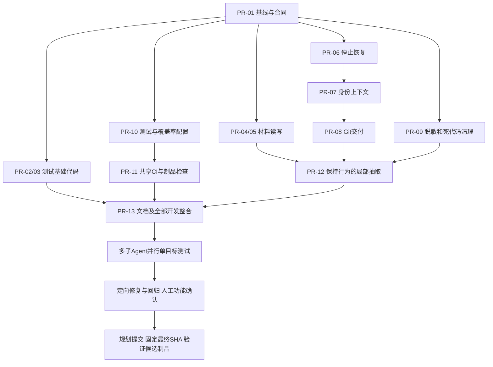
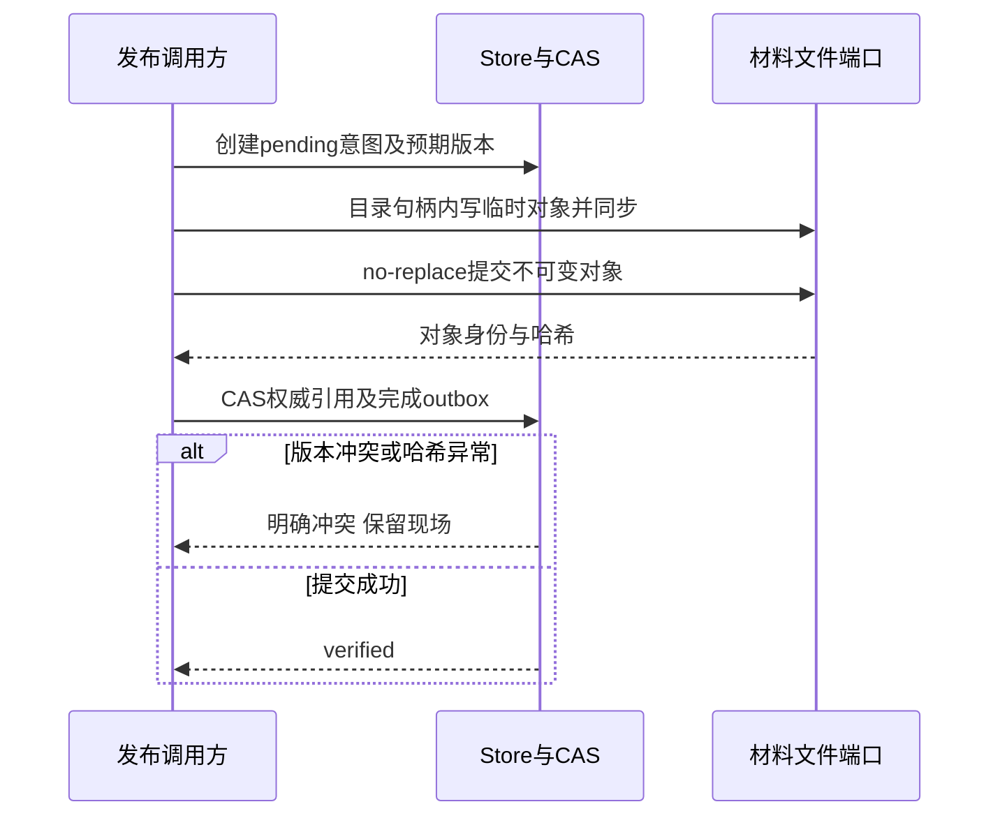
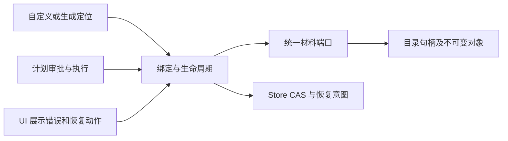

# DevFlow 代码复核、CI 故障分析与整改开发计划

> 仓库：`zephyrw/dev-flow`  
> 代码基线：`8f9d304fcff0f04ca9545cd5b1822f3f29f3b139`  
> 审计日期：2026-09-28，本文 Actions 时间统一采用 UTC。  
> 当前版本：正式执行修订 v1（2026-09-28）；工作流 `wf-39b43a87-9f21-4dcc-8abc-be7b2495956f`。  
> 交付性质：本轮只核查并修订计划，未修改产品代码、未运行产品测试、未推送或发布。  
> 原始审查报告已原样保存在 [原始审查报告](wf-39b43a87-9f21-4dcc-8abc-be7b2495956f/原始审查报告.md)，文件字节 SHA256：`67de7c12770136735f76b66c56fca0e62a57c4e1fc7bfd22934053aa3a51bb6b`。  
> F01–F20、PR-01–PR-13 全部保留；本文件为正式执行依据，第 13 章补足实施合同及勘误，发生描述歧义时以第 13 章为准。计划可执行性核查不等于修复或实机验收已通过。

---

## 0. 结论与阅读说明

**当前基线不建议发布。主要原因不是代码无法编译，而是三平台回归测试全部失败、部分关键状态机与材料安全规则存在问题，并且发布门禁不能充分证明待发布版本的质量。**

不能把当前问题简化成“补一个类型字段”或者“修改几个测试预期”。前一轮类型错误已经消失；最新一轮已经进入测试，暴露的是平台隔离、测试替身与新协议脱节，以及材料、停止/恢复、账号/模型绑定等不同层次的问题。

本报告给出三个直接判断：

1. **代码有可取的架构基础，但模块内职责集中、跨层依赖和协议变更传播过大。** 不能整体判定为符合 SOLID，也不应因为有大文件就断言五项原则全部违反。
2. **测试数量不少，但不能据此认定覆盖完整。** 当前缺少可核验的覆盖率结果、需求覆盖矩阵和成功执行的三平台完整回归；E2E 在本轮 CI 中被跳过。
3. **没有取得可确认“真实密钥已被推送”的证据，但也没有完成全历史秘密扫描。** 已确认的文本脱敏覆盖不足，以及新增命令、工作目录和工具结果记录，构成需要优先闭环的数据暴露风险；这不等于已经发生泄露事件。

### 0.1 本次实际完成了什么

通过 GitHub 连接器核对了审查基线、近期提交、仓库结构、重点源文件，以及前后两轮 CI 的状态和日志；重点覆盖：

- 根配置、CI / Release、发布构建和安装升级相关代码。
- 核心编排、停止/恢复、人工交互、材料定位/发布/读取、幂等与事件脱敏。
- AGY 账号选择和相关失败链路、存储、API 与部分前端/模型契约。
- 三个平台本轮测试日志，按共同根因归类，而不是把每条失败当成独立业务缺陷。

### 0.2 证据边界——不能把本报告当作“全仓无遗漏证明”

**本次并未逐行读完仓库所有文件、所有分支和所有历史提交。** 部分大文件只核查了关键范围、函数及其相关调用；测试日志也不是生产行为的完整证明。

容器拉取仓库时发生 GitHub 域名解析失败，因此没有获得可运行的本地完整副本；本次没有在本地执行项目测试、采集覆盖率、运行秘密扫描器或验证真实浏览器。CI 的执行结果来自 GitHub 已运行的任务，不是本地复现结果。仓库外的账号授权、分支保护设置、全部历史附件及不可达历史对象，也不在已证实范围内。

这些缺口均列入后面的执行与验收任务。**已确认的问题可以直接修复；尚未证实的根因必须先用确定性测试固定，不能凭推测改坏新逻辑。**

### 0.3 证据等级与优先级

| 标识 | 含义 | 执行要求 |
|---|---|---|
| A：源码确认 | 源码顺序、条件或配置直接支持结论 | 先编写最小回归并修复；统一测试阶段验证旧缺陷与修复结果 |
| B：测试确认 | 日志确认失败，但是否产品缺陷及具体根因仍需分辨 | 固定新业务契约，定位首次偏离点 |
| C：条件性风险 | 存在危险窗口或防护不足，真实可达性/触发条件尚未完整验证 | 补调用链、边界及对抗测试后闭环 |
| H：历史已修复 | 旧运行失败，但审查基线相关阶段已通过 | 保留回归，不重复算作当前阻断 |

优先级是本项目的整改排序，不是漏洞 CVSS 分数：

- **P1**：阻断发布，或涉及材料完整性、进程所有权、账号身份、错误状态迁移、敏感数据等关键风险。
- **P2**：应在本轮稳定化中解决的维护性、兼容性或质量保障问题。
- **P3**：文档及体验一致性问题。

本次没有证据支持将某项定性为“已发生的 P0 安全事故”。

---

## 1. GitHub Actions：当前到底因为什么失败

### 1.1 最新审查运行：三平台类型检查和构建通过，Test 阶段失败

运行：**CI #7，Run ID `36373660224`**，提交即本文基线。[C1]

| 平台 | Job ID | 安装 / 类型检查 / 构建 | 测试文件结果 | 测试用例结果 | E2E 步骤 |
|---|---:|---|---|---|---|
| Linux | `108774985432` | 均通过 | 41 失败、185 通过；合计 226 | 77 失败、1453 通过、3 跳过；合计 1533 | 跳过 |
| Windows | `108774985223` | 均通过 | 44 失败、182 通过；合计 226 | 78 失败、1454 通过、1 跳过；合计 1533 | 跳过 |
| macOS | `108774985470` | 均通过 | 69 失败、157 通过；合计 226 | 193 失败、1337 通过、3 跳过；合计 1533；另有 1 个未处理拒绝 | 跳过 |

来源为各平台 Vitest 最终摘要及 Job 步骤状态。[C1][C2][C3][C4]

注意：

- 2026-09-28 重新通过 GitHub 连接器读取三个 Job 的原始日志，checkout SHA 均为本文基线。上表已纠正原稿 Windows/macOS 计数；旧的 921 用例及 95/36 失败文件数字作废。
- 本次重取的三个日志没有检出 EPERM/scandir。原稿关于“大量 EPERM”的描述没有被这些日志支持，F13 改为代码清理生命周期风险，仍需定向实机确认。
- 失败文件数不等于独立产品缺陷数，也不是覆盖率。
- 同一逻辑在三个平台失败，也不能计算成三个独立缺陷。
- 本轮 E2E 被跳过，**不是 E2E 通过**。Test 阶段提前失败时，也不能假定配置中的后续测试命令都已经完成。

本次重取日志中的 Vitest 摘要时间：Linux 03:32:54、Windows 03:37:05、macOS 03:33:06，均为 2026-09-28 UTC；这些是测试摘要时间，不是 Job 完成时间。[C2][C3][C4]

### 1.2 前一轮失败：类型字段不匹配，但已不是当前根因

运行 **CI #6，Run ID `36368826596`** 的类型检查报错：[C5]

```text
apps/web/src/components/AccountsPanel.tsx(356,20)
TS2339: Property 'model_id' does not exist on type 'AgyQuotaPoolObservationDto'
```

这是前端消费字段与 DTO 契约不一致。前一轮因类型检查失败，后续构建/测试没有形成完整质量结果；最新基线三平台类型检查已通过，所以这属于 **H：历史已修复的首层阻断**。

应保留 DTO 与组件消费契约测试，但不能把当前失败继续归因于这一条错误，更不能认为修复它就完成了整改。

### 1.3 当前失败的共同根因分组

| 分组 | 已观察到的证据 | 根因判断 | 修复方向 |
|---|---|---|---|
| 平台专用测试没有正确隔离 | 非 Windows 环境出现 `spawn cmd.exe ENOENT`；Windows 专用行为断言在不适用环境执行 | 平台选择/测试启动器问题已明确 | 将原生平台用例与跨平台契约用例拆开 |
| Windows 测试资源生命周期 | 本次原始日志未检出原稿所称 EPERM；代码有吞 cleanup 异常和共享测试根目录的风险 | 不将 EPERM 当成本次 CI 已确认根因；由定向资源测试确认 | 独立临时目录、关闭资源、等待退出，清理失败必须可见 |
| 测试替身没有跟上接口 | `this.repository.putRecord is not a function` | 测试 fake 缺失新增方法 | 共享、强类型测试替身和 adapter 契约测试 |
| 测试前置条件落后于身份/模型新规则 | 预期进入恢复/合并分支，实际先收到 `MODEL_ACCESS_REQUIRED`、`SESSION_IDENTITY_UNRESOLVED` 等 | 可能是新防护生效，而 fixture 仍按旧流程构造 | 构造满足新规则的前置状态；另测前置校验本身 |
| 停止/恢复/会话代数状态不一致 | `pending` / `completed`、`STOPPING` / `STOPPED`、恢复 202 / 429，以及 `STOP_UNCONFIRMED` 等不一致 | 真实失败明确，但包括异步契约变化与潜在竞态两部分 | 定义停止完成条件；用可控时序重现，而非直接改状态 |
| 材料兼容与定位 | `NO_WORKSPACES`；多仓库选择、原材料缺失等用例失败 | 部分已有源码级对应缺陷，见 F01–F04 | 固化权威材料、版本及目标仓库规则 |
| 会话/模型/结果上下文 | 旧模型变默认模型、旧失败轮次被消费等 | 身份快照与当前上下文绑定需验证 | 统一上下文围栏和快照契约 |
| Git 交付与工作树 | 状态显示 `COMMITTED`，测试读取的目标内容仍为旧内容；冲突保留行为与旧断言不同 | 既可能是错误提交目标，也可能是测试读错 worktree/分支 | 同时断言目标仓库、分支、SHA 与文件内容 |
| 外部 CLI / 只读能力 | `codex` 不存在、Kimi `READ_ONLY_UNSUPPORTED`、Claude 只读参数断言失败 | 不能让普通 CI 依赖开发者真实安装/授权；也不能把拒绝执行当成 bug | fake CLI 跑契约；真实 CLI 另设可控冒烟任务 |
| 未处理的异步失败 | macOS 有 1 个 unhandled rejection，`precommit-runtime.test.ts:461` 的 rejects 收到 resolved | 需分清已退役 proof 语义、有效迟到结果围栏与 Promise 所有权 | 在触发时注册并等待观察，保留有效上下文校验，不恢复已退役证明平台 |

这几组必须分开处理。**把测试批量改成当前返回值，会同时掩盖实际缺陷和破坏有效防护。**[C2][C3][C4]

### 1.4 不应作为“修复”的做法

不得使用下列方式把 CI 染绿：

- 删除失败测试，普遍增加 `.skip`，或给 Test / Release 添加 `continue-on-error`。
- 用 `as any`、关闭类型检查来绕过 DTO 或接口变化。
- 一律延长超时、反复重跑，替代进程退出与资源释放的正确实现。
- 为通过旧测试关闭身份、模型访问、只读能力或显式目标选择校验。
- 在未确认根进程树退出时直接将所有子任务标为 `STOPPED`。
- 因材料丢失而直接返回旧文本，假装仍持有原始审核材料。

---

## 2. 问题总表

以下 20 项是治理项，不等于 20 个已被运行时利用的漏洞。证据等级和触发边界必须一并阅读。

| ID | 问题 | 优先级 | 证据 | 对应任务 |
|---|---|---|---|---|
| F01 | 未接入 helper 的 verified/fallback 顺序错误，实际读取入口需统一核查 | P1 | A，生产影响边界见第 13 章 | PR-04 |
| F02 | 多工作区目标不明确时回退到第一项 | P1 | A | PR-04 |
| F03 | 材料“检查后写入”不等于跨进程防覆盖 | P1 | A/C | PR-05 |
| F04 | 历史材料读取兼容分支被 `NO_WORKSPACES` 提前阻断 | P2 | A | PR-04 |
| F05 | 材料路径校验不能完整证明文件系统边界 | P1 | A/C | PR-05 |
| F06 | 停止/恢复完成条件、代数与迟到子进程存在回归风险 | P1 | B/C | PR-06 |
| F07 | 账号许可、恢复身份与冻结模型存在测试回归 | P1 | B | PR-07 |
| F08 | 原生进程退出、IPC 断开与孤儿进程清理存在失败 | P1 | B | PR-06 |
| F09 | 等待/继续执行上下文可能消费旧轮次结果 | P1 | B | PR-07 |
| F10 | 交付状态与实际目标提交内容缺少统一证明 | P1 | B | PR-08 |
| F11 | 脱敏规则未覆盖全部敏感输入形态，结构化日志扩大风险面 | P1 | A/C | PR-09 |
| F12 | 旧幂等助手先执行后记账，并吞持久化异常 | P2 | A/C | PR-09 |
| F13 | 测试清理吞异常、目录隔离风险；原稿 EPERM 归因未获支持 | P1 | A/C，实机待确认 | PR-02 |
| F14 | 平台测试混跑与真实 CLI 环境依赖 | P1 | B | PR-02 |
| F15 | 多处测试替身、前置状态和断言落后于协议 | P1 | A/B | PR-03 |
| F16 | 测试存在未处理 Promise 拒绝 | P2 | B | PR-03 |
| F17 | 覆盖率证据和完整发布质量门禁不足 | P1/P2 | A | PR-10、PR-11 |
| F18 | 发布标签与 package 版本缺少一致性断言 | P2 | A/C | PR-11 |
| F19 | 核心模块职责过多，依赖和契约复用不足 | P2 | A/分析 | PR-12 |
| F20 | README 与 Node 原生运行时现状不一致 | P3 | A | PR-13 |

---

## 3. 已确认的材料、文件和持久化问题

### F01：原始材料已经丢失，fallback 分支却可能先返回文本

**位置：** `packages/core/src/project-materials.ts` → `readProjectMaterialByLocator`。[S01]

在目标文件不存在时，代码先判断材料是 pending 或存在 `fallbackPendingContent`，再判断材料记录是否为 verified。其关键顺序可概括为：

```text
文件不存在
  → pending 或传入 fallback 文本：返回 pending 内容
  → 否则，verified 材料：返回冲突
```

这里的问题不是“所有 fallback 都不安全”，而是 **一个已经 verified 的权威材料，在原文件缺失且调用方传入非空 fallback 时，会先命中前面的分支**。该 helper 在当前代码中仅被导入而没有生产调用；实际审批读取使用 `readPlanMaterial`。因此必须同时核查实际入口，不能仅由 helper 缺陷推断已经发生错误审批。

**影响：** 审核依据和展示内容可能不再是原来验证过的材料；随后审批或执行可能建立在降级替代文本上。

**固定修复规则：**

1. 先按材料生命周期和权威性分类，再考虑 fallback。
2. 已 verified 的材料，只接受其绑定文件、标识与校验结果；缺失、身份不匹配或哈希异常均返回明确冲突。
3. pending 材料才允许返回 pending 内容；历史兼容记录只能进入独立、显式的 legacy 读取分支。
4. 冲突不能被上层 `catch` 转为“成功读取空文本/旧文本”；UI 必须展示恢复材料或重新生成的动作。

**验收：** verified 文件缺失 + 有 fallback 仍失败；verified 文件被替换仍失败；pending 可读取待发布内容；真实 legacy 仍可兼容读取。审批/执行不得消费冲突结果。

### F02：多仓库/多工作区选择存在静默默认第一项的问题

**位置：** `resolveMaterialLocator`。[S01]

当前选择链条中，显式偏好、主仓库标记等条件都未能唯一定位时，最终仍可能落到 `workspaces[0]`；无效的偏好工作区也可能继续走回退选择，而不是明确拒绝。

**影响：** 多仓库任务可能把计划、材料写到错误 worktree。数组顺序不是业务上的主仓库授权，顺序变化还会改变行为。

**固定修复规则：**

- 明确指定目标：必须属于当前项目/工作流并存在，否则拒绝；不能静默回退。
- 未指定目标且只存在一个合法工作区：可以使用该工作区。
- 多个合法工作区：以正式 `Project.primary_repo_id` 定位且必须恰好匹配一个工作区；不存在或不唯一则要求显式选择。禁止依赖 Workspace 上未声明的 `is_primary/primary` 字段。
- 将选定的仓库/工作区纳入材料定位和读写校验，不只依赖 kind、revision 或数组位置。

**验收：** 交换数组顺序不改变结果；无效目标不能落到其他仓库；两个主仓库标记必须报错；读取和发布均不能跨工作流/仓库串用材料。

### F03：原子替换与“不覆盖他人修改”是两个不同保证

**位置：** `publishProjectMaterialSafely`；`packages/core/src/util.ts` → `atomicWrite`。[S01][S03]

当前路径包含存在性/哈希等检查，然后调用原子写入助手。`atomicWrite` 使用随机临时文件、`openSync(..., "wx", 0o600)`、写入/同步后 `renameSync` 到目标。

`wx` 只保证临时文件创建时不覆盖同名文件，**不保证最后的目标文件不会被 rename 替换**。因此，先检查目标、再写入目标，在另一个进程或外部编辑器同时修改的条件下仍存在时间窗口。

这不是已证实的生产丢数据事故；它是源码可见的保证不足。单线程 JavaScript 也不能排除另外一个进程或编辑器。

**固定修复设计：**

1. 新材料采用不可变版本文件：一个材料版本对应一个不可变物理对象。
2. 发布对象使用“目标已存在则失败”的提交方式；禁止以覆盖式 rename 实现新版本的 no-clobber 语义。
3. 数据库用材料版本/修订号 CAS 切换权威指针，并记录发布事务/恢复状态。
4. 既有面向用户的文件继续视为受保护输入：检测到外部修改则产生冲突，不自动覆盖或偷偷迁移。
5. 文件创建成功、DB 提交失败，以及 DB 有 pending、文件未创建，均由可重入恢复流程收敛；不能留下“显示成功、实际未发布”的状态。

**验收：** 两进程争用同一版本只有一个成功；在检查和提交之间插入外部修改不能丢失修改；进程在每个持久化边界崩溃后可恢复；恢复重复执行不生成多个权威版本。

### F04：历史材料读取的 fallback 在无工作区时不可达

**位置：** `packages/core/src/plan-review.ts` → `readPlanMaterial`。[S02]

没有 `targetPath` 时，会先调用 `resolveMaterialLocator`。后者在没有 workspaces 时抛出 `NO_WORKSPACES`，导致后面的历史 plan / project document 文本兼容逻辑没有机会执行。Linux/macOS 日志存在对应链路失败。[C2][C4]

**修复：** 将“读取已知历史文本”和“定位受工作区约束的权威文件”分为两个明确分支。只有确实没有权威文件记录的 legacy 数据允许兼容读取；新材料和 verified 文件丢失绝不能借此降级。

**重要边界：** 允许阅读历史文本不等于允许在无工作区时写文件、批准执行或启动 Agent。读兼容与执行准入必须分别判断。

### F05：路径校验存在语义与文件系统边界缺口

**位置：** `project-materials.ts` 的自定义路径处理、材料定位及读写边界。[S01]

本次可见的问题包括：部分处理先去掉前导 `/` 再判断绝对路径；使用 `..` 子串判断会误伤普通文件名；生成路径和自定义路径的校验链不完全一致；词法上的路径在工作区内，也不意味着经符号链接解析后的实际目标仍在工作区内。

**证据边界：** 本次没有完整证实所有外部参数都能到达这些分支，不把它定性为已验证的远程任意文件读写漏洞。

**固定修复规则：**

- 在保留原始输入的情况下先拒绝绝对路径、盘符路径、UNC、空路径和不允许的路径段，再做规范化。
- 按路径段判断 `..`，不用简单的子串拒绝替代规范化。
- 路径必须属于已绑定工作区的允许材料目录；生成路径与自定义路径走同一个安全边界。
- 对已存在文件及父目录做实际路径/链接检查；将 Windows 大小写、分隔符、junction/reparse point 行为纳入测试。
- 防护必须落在打开/发布文件的实际边界；只在 HTTP 参数验证一次不够。

**验收：** 绝对路径、目录穿越、符号链接跳出、跨仓库引用失败；合法包含两个点但不是父目录段的名称不被误拒；路径错误不泄露完整敏感目录或原文。

---

## 4. 状态机、账号和交付：已观察到回归，需要契约驱动修复

### F06：停止/恢复行为必须区分“请求已发出”和“进程树已退出”

**位置：** `packages/core/src/conversation-control.ts`、相关 Conversation/Recovery 测试。[S04][C2][C4]

观察到 pending/completed、STOPPING/STOPPED 不一致、恢复 202/429 不一致，以及迟到进程、新代数和旧子进程未确认退出的失败。

当前实现已有根会话停止、进程树确认、冻结/代数保护等设计，不能因为旧测试失败就删除这些约束。`CV3-F05` 的 root-only 停止方向应当保留，不恢复“向每个子会话盲目发原生 stop”。

一个需要以确定性测试验证的窗口是：先收集迟到 spawn，再等待外部停止结果，期间又出现新关联进程。**本次没有证明所有失败都由该窗口引起**，但新进程是否被最终确认覆盖，是必要的不变量。

**固定契约：**

```text
接受 stop 请求
  → 阻止旧 generation 再派发
  → 标记 STOPPING
  → 对受控根进程树发停止请求
  → 处理/确认停止期间出现的受控进程
  → 确认目标 generation 的受控进程均已退出
  → 才能完成停止并允许恢复
```

- 超时或无法确认时保持阻断和可诊断状态，不伪装 STOPPED。
- 新 generation 的迟到回调不得改写旧 generation 结果，反之亦然。
- 恢复必须读取权威停止确认，不能只看 UI 状态或单个根 PID 的退出。
- HTTP 接受态、正在停止态、可恢复态、身份不一致态必须有稳定错误码与前端映射。

### F07：冻结模型、账号身份和执行许可应是一份一致快照

**观察：** 执行许可前的 runtime 身份不匹配测试未按预期拒绝；恢复重试次数不一致；冻结模型变成默认模型；恢复接口成功/冲突状态不一致。[C2][C4]

**不能直接下的结论：** 不能仅凭这些测试断言已经发生跨账号执行或额度误用。部分 fixture 尚未满足新身份契约，必须先分离环境前置失败。

**修复契约：**

- 复用 `FrozenInvocation`、`DispatchContext`、`SessionBinding`、`AgyUsagePermit`，补齐会话、run、generation、provider、模型、账号/授权版本的关联；不另建平行快照系统。
- 默认模型只在创建绑定时解析；同一绑定的继续、恢复、重试不得被全局默认覆盖。保留用户显式 next_tool_change 和经验证 account_recovery 的下一轮重绑定，不能把合法切换一并禁止。
- 实际运行时身份与快照不一致则拒绝执行，并展示重新验证/重新授权动作。
- 账号登录、双额度探测、切换和切换后验证保持跨账号串行；不能用后台并发探测修复测试。
- 首次录入必须完成五小时与周额度探测；切换要受额度、重置时间、有效授权和核验结果约束。
- 切换失败保持明确失败状态或恢复先前可用上下文；不得显示切换成功但运行时仍使用另一身份。

**已有优点：** `selector.ts` 已包含启用/授权/额度新鲜度、冷却、周额度等筛选逻辑。本次没有足够证据断言这个选择器整体错误，重点应放在状态快照与执行许可接缝。[S08]

### F08：原生进程与孤儿进程测试失败，需要核实资源所有权

日志包括 IPC 断开后进程仍存活的超时、原生停止确认不满足预期，以及 pre-commit/阻塞流程长时间不结束。[C2][C4]

**修复契约：**

- 启动时记录可核验的所有权信息，不能仅按可复用的 PID 或进程名称杀进程。
- 测试控制根、子进程、派生进程和 IPC 断开，分别验证回收。
- STOP 请求、信号发送、进程退出、句柄关闭是不同事件；不得混为一个成功布尔值。
- 测试退出时等待所创建资源全部结束，不能依靠 CI Job 最终销毁机器代替应用清理。
- 不能为了清理失败扩大到杀死系统同名 CLI 或别的 worktree 的进程。

### F09：继续执行不能消费其他轮次的等待上下文

`round-result-routing.test.ts` 中存在无需再次澄清却消费旧失败轮次/旧 intent-clarification 的失败。[C2][C4] 相关上下文读取位于 `waiting-context.ts` 等路径。[S05]

**修复契约：** 所有“等待/继续/恢复”的输入必须明确绑定 workflow、task/run、generation、计划版本与当前状态；仅按工作流取最近记录，或接受旧失败 run 的输出，都不能作为继续执行的依据。

**验收：** 构造同一工作流的旧失败轮、新成功轮、旧回调迟到、刷新重试和跨会话消息，只有绑定当前轮次的输入生效。无需澄清的新请求不得被旧澄清状态劫持。

### F10：`COMMITTED` 必须能证明提交到了正确目标

日志存在“状态为 COMMITTED，但测试读取的文件仍是旧内容”的情形。[C2][C4] 这既可能是实际交付错误，也可能是测试误读主工作区而没有读任务目标分支，不能直接认定所有 COMMITTED 都是假成功。

**固定验收对象：** 执行测试共同断言 `repo/worktree + target branch + commit SHA + expected content`。policy2 由 planner_commit 实际提交，平台集成已冻结 candidate 并核对 Git 引用关系；不新增业务内容或测试真实性证明平台。existing_workspace 成功状态为 COMMITTED，托管 worktree 集成成功为 COMPLETED，不统一改名。

冲突工作树保留、显式选择要求等安全行为要保留。禁止为通过旧“自动清理”断言而删掉包含冲突证据或用户变更的 worktree。

---

## 5. 安全与隐私审查

### 5.1 当前能确认与不能确认的内容

**未确认：** 本次未取得足以确认真实 API key、refresh token、私钥或账号密码已推送到仓库的证据。不能据此宣布“没有敏感信息”。

**已确认：** 当前 `redact` 的字符串匹配范围有限；最新提交增加的结构化工具步骤包含 `command`、`cwd`、`result_text` 等潜在敏感载体。[S03][S15]

`.gitignore` 已排除部分环境、数据库、日志及运行时目录，但它只能影响未跟踪文件的后续加入，不是已跟踪内容或历史记录的安全证明。[S14]

### F11：现有脱敏规则不足以保护所有命令和工具结果

**位置：** `packages/core/src/util.ts` → `redact`、`publicEvent`；最新结构化工具步骤提交。[S03][S15]

现有字符串规则主要覆盖 Bearer 和类似 `token=...`、`password:...` 的键值形态。`publicEvent` 有递归处理与敏感字段处理，这是已有防护；不能说“没有任何脱敏”。

但空格分隔的 CLI 参数、部分认证文本、私钥块以及工具结果里的不规则文本，不能仅凭现有两类正则获得完整保护。例如下面是**人工构造的测试文本，不是真实秘密**：

```text
tool --password DEVFLOW_AUDIT_ONLY_7F2
```

它没有 `=` 或 `:`，不能靠现有 password 键值规则自动匹配。若这样的字符串进入普通 `command` 字段，仅判断字段名是否含 password 也无法保证脱敏。

**影响边界：** 本次没有完整追踪每个字段从 CLI 到数据库、事件和导出的所有路径。因此结论是“脱敏覆盖存在明确缺口，新增记录路径需要逐点验证”，不是“已经证实数据库中保存了真实密码”。

**固定修复设计：**

1. 在采集/持久化前统一脱敏，而不只是前端展示时隐藏。
2. 建立结构化 `SecretRedactor`：敏感键、命令参数、认证头、URL 凭据和原始文本分别处理。
3. 对账号登录、授权码交换、2FA、环境变量导出等高风险步骤采用字段白名单；不保存不必要的原始输入输出。
4. 对 `cwd`、命令行和结果正文做长度限制、路径最小化及可见性控制；可诊断信息与原始秘密分离。
5. DB、SSE/WebSocket、UI、日志、错误对象、测试附件、导出和发布制品，使用同一套敏感样本验证。
6. 脱敏后的摘要保留 command ID、退出码、阶段、耗时等诊断价值，避免把所有结果都替换成无用黑盒。

**验收：** 合成秘密不得出现在数据库、事件包、浏览器展示、导出文件和 CI artifact 中；正常命令和错误信息仍可诊断。

### F12：旧幂等助手的效果与回执不是原子边界

**位置：** `packages/core/src/idempotency.ts`。[S06]

该助手存在先执行效果、再持久化回执的顺序，且保存失败被吞掉。假如被用于外部副作用，持久化异常、并发请求或进程崩溃后可能再次执行。

**边界：** 本次没有证实该助手仍被所有关键写操作使用，不能把风险泛化到整个应用。尤其 `user-interaction-service.ts` 已有事务、持久化去重和 run/版本/generation 校验，是应保留并复用的正向实现。[S07]

**修订后的整改：** 当前 packages/apps/tests 搜索未发现该助手的活跃调用，PR-09 核对导出和动态加载后删除未使用入口即可，不为死代码建设通用 outbox 系统。有效 DB 写入继续复用 Store.deduplicate/transaction；确有活跃外部副作用时只修该路径现有的可恢复操作及幂等键，不能声称 DB 事务提供外部 exactly-once。

**验收：** 同键并发只产生一个有效操作；提交成功但响应丢失可重放同一结果；外部执行后崩溃可判断已执行状态；不能吞掉持久化错误并返回成功。

### 5.2 必须补做的敏感信息检查范围

| 检查对象 | 必须检查的内容 | 本次状态 |
|---|---|---|
| 当前已跟踪文件 | 配置、测试 fixture、示例、截图、日志、脚本、授权缓存 | 仅定向检查，未全量扫描 |
| 所有可获取分支和标签历史 | 已删除文件、旧环境变量、授权信息和意外提交 | 未执行全历史扫描 |
| 提交元数据 | 真实邮箱、员工标识、公司信息、提交消息 | 未完成全量审查 |
| Actions 日志与 artifacts | raw command、异常上下文、环境变量、测试附件 | 读取了失败日志，未做完整秘密扫描 |
| Release 制品 | 错打包的 `.env`、DB、账号目录、私钥、缓存、内部路径 | 未下载并逐个检查历史制品 |
| Issue / PR / 附件 | 手工贴出的诊断日志、截图、账号信息 | 未完成 |
| 运行时数据 | 本地账号库、导出包、审计事件、错误报告 | 未接触用户真实数据，不应为审查上传真实凭据 |

### 5.3 执行 Agent 的扫描步骤

使用固定版本的扫描器，记录版本和规则版本；先保存到工作树之外的私有目录，输出必须脱敏，不要把扫描发现的秘密再次提交进仓库。以下命令基于 Gitleaks 官方 `git` / `dir` 模式，**是待执行方案，不是本次已执行结果**。[D1]

```bash
# 仅在隔离审查 clone 中执行；不会推送、重写历史或改用户主仓 refs。
git fetch --all --tags

gitleaks version

# 将目录放在仓库外，并限制权限。
AUDIT_DIR="$(mktemp -d "${TMPDIR:-/tmp}/devflow-security.XXXXXX")"
# 使用当前用户已有的私有临时目录，不修改用户 ACL；POSIX 新目录权限按当前策略核对。

# 全部本地可见 refs 的历史；扫描结果使用脱敏输出。
gitleaks git --log-opts="--all" --redact=100 \
  --report-format json --report-path "$AUDIT_DIR/history.json" .

# 当前目录扫描是补充，不替代历史扫描。
gitleaks dir --redact=100 \
  --report-format json --report-path "$AUDIT_DIR/current.json" .
```

实现自动化时，两个扫描都必须运行并分别记录退出码；命中与工具执行失败都不能被吞掉。完整获取 PR refs、下载历史制品、扫描提交元数据需独立纳入任务，不能把 `--all` 理解成能扫描远端所有不可达/已删除对象。

白名单只能针对经人工确认的合成 fixture 或特定指纹，不能把整个 tests、docs、日志目录排除。个人标识和公司路径还需要专门规则及人工核验，不能只依赖默认密钥正则。

### 5.4 如发现真实泄露，按这个顺序处理

**先吊销/轮换真实凭据，再清理当前文件、日志及制品，最后评估历史重写。** 只删最新文件不能使已暴露凭据失效。

历史重写、force push、删除 Releases/Artifacts 属于额外破坏性操作，须单独审批。即使清理主仓库历史，也不能保证外部 fork、缓存或第三方副本已经消失。报告只记录类型、位置和脱敏指纹，不粘贴原始秘密。

---

## 6. SOLID、复用性与可读性评价

### 6.1 整体判断

**不是“没有架构”，而是“有分包和抽象，但核心编排、协议兼容和边界职责仍集中”。** `engine.ts`、API `server.ts`、AGY accounts 服务等承担较多不同层面的变化；近期协议调整引发多处 fixture 和跨模块失败，显示维护成本偏高。[S09][S10][S11][C2][C3][C4]

不能仅用行数判断设计好坏。真正需要处理的是：同一个模块同时受状态规则、持久化、CLI 行为、Git、模型设置和 API 呈现等不同原因驱动而变化。

### 6.2 分原则评价

| 原则 | 评价 | 本次依据 | 整改方向 |
|---|---|---|---|
| S：单一职责 | 需要重点改善 | 核心编排与具体服务/持久化/流程细节集中；API 文件承担多类功能 | 按停止、恢复、材料、交付、账号许可等用例拆分，而不是机械按行数拆文件 |
| O：开闭原则 | 有扩展基础，但跨层变更传播偏大 | provider/runtime 有抽象；模型、会话协议变化仍影响较多调用方与测试 | 能力契约和 adapter 集中封装；避免核心状态机理解每家 CLI 的参数细节 |
| L：里氏替换 | 证据不足以直接定性违反 | fake 缺方法证明测试替身漂移，不足以证明所有生产实现不满足替换性 | 对生产 adapter 与测试 fake 运行同一契约测试 |
| I：接口隔离 | 有改善空间 | 部分调用依赖宽服务/存储能力；测试为一个操作需构造大量上下文 | 使用面向用例的小端口，减少无关方法依赖 |
| D：依赖倒置 | 核心区域需改善 | `Engine` 可见具体 Git、调度、认证等依赖与装配/业务混合 | 应用用例依赖窄端口，具体实现放在 composition root 装配 |

以上是基于可见关键模块的设计分析，不是全仓静态扫描评分。

### 6.3 应当保留的设计

- `user-interaction-service.ts` 已有事务、幂等回执、run 与计划版本/会话代数等保护。
- 账号选择器已有授权、额度快照、冷却及可用性筛选。
- 停止流程强调受控根进程树和退出确认，而非仅发送停止请求。
- 材料系统已有版本、状态、校验与恢复设计雏形；应补足边界，而非退回随意读取字符串。

### 6.4 具体重构目标

以下是职责映射，不是强制新增服务清单：优先复用现有 ConversationControlService、ConversationRecovery、ModelAccessService、AgyAccountService、waiting-context 和 GitDeliveryCoordinator；仅提取重复的纯规则及必要端口：

```text
CompositionRoot
  ├─ ConversationStopService
  ├─ ConversationResumeService
  ├─ ExecutionPermitService
  ├─ WaitingContextResolver
  ├─ MaterialPublicationService
  ├─ DeliveryService
  └─ SecretRedactor

Pure domain rules
  ├─ stop/recovery transition rules
  ├─ execution-context identity checks
  ├─ material authority/version rules
  └─ delivery acceptance rules

Ports / Adapters
  ├─ owned-process controller
  ├─ material and workflow repositories
  ├─ provider session adapter
  ├─ Git delivery adapter
  └─ filesystem publication adapter
```

核心状态转换应尽量是可直接测试的纯逻辑，I/O 放在边界。使用明确的状态联合类型/结果类型，减少一组可选字段拼出非法状态。新模块不应为了“抽象”增加只有一个转发方法的无意义层级。

**顺序：先固定契约并完成对应行为修复与回归代码，再作保持行为的局部抽取；所有 PR 开发整合后统一测试。禁止重写整个 Engine。**

---

## 7. 测试覆盖：不能说完整，应该怎样补齐

### 7.1 目前缺少的证据

根 `vitest.config.ts` 未配置完整覆盖率采集/门槛；已核查 CI / Release 也未形成覆盖率质量证据。[S12][S13][S16]

因此本报告不提供虚构的“覆盖率百分比”。通过用例数量、失败用例比例、文件数，都不等于行/分支覆盖率，更不等于需求覆盖率。

正式采集时必须明确包含未被测试导入的业务源文件，否则可能只对已执行文件生成看起来很高的覆盖率。覆盖率配置应依据仓库锁定的 Vitest 版本实现，不在修复业务失败时顺手升级主版本。[D2]

### 7.2 必须建立的需求覆盖矩阵

| 领域 | 正常路径 | 异常/边界路径 | 并发/恢复路径 |
|---|---|---|---|
| 任务与归档 | 创建、展示、归档、恢复展示 | 归档不改磁盘目录和业务状态；过滤与设置页一致 | 归档期间事件、刷新与重启 |
| 模型设置 | 全局规划/执行/复核配置；单任务临时覆盖 | 不支持模型/思考强度、旧配置迁移 | 已运行任务冻结值不被新全局配置覆盖 |
| 计划审批 | 通过、拒绝、额外执行指令 | 修订号过期、重复提交、权限/状态不符 | 双击、刷新、响应丢失、旧审批迟到 |
| 人工交互 | 输入、确认、恢复 | 错 run/计划版本/generation、过期请求 | 同键并发、事务失败、重复回调 |
| 停止与恢复 | 根进程树停止后恢复 | 无法确认、超时、权限不足、身份冲突 | 迟到 spawn、旧回调、新 generation、重启恢复 |
| 账号 | 首次录入双额度、串行切换、切后核验 | 授权失效、额度未重置、探测失败 | 禁止跨账号并发；中断后状态一致 |
| 材料 | 发布、读取、审核 | verified 丢失、哈希变化、非法路径、多仓库歧义 | 竞争写入、外部修改、FS/DB 中间崩溃 |
| CLI / 模型能力 | 每个 adapter 的声明能力 | 不支持只读、身份无法绑定、可执行文件不存在 | 超时、流式输出、退出与中断竞争 |
| 工作树与端口 | 创建、隔离、运行和合并 | 端口占用、脏工作树、目标冲突 | 多项目/多 worktree 同时运行互不影响 |
| Git 交付 | 正确目标仓库/分支/SHA/内容 | 冲突、用户修改、提交失败 | 重试不重复提交、不误删证据 |
| 安全 | 正常日志仍可诊断 | 所有敏感形态、路径越界、非授权上下文 | 秘密不进入持久化/事件/导出/附件 |
| 安装/升级 | 全新安装、一行安装、启动 | 下载失败、校验失败、版本不匹配 | 中断恢复、升级回滚、旧数据迁移 |
| 前端真实浏览器 | 页面主流程、弹窗与状态变化 | 错误提示、重复点击、断线重连 | 多标签页、刷新、后端重启 |

这些是整改验收要求，并不代表上表每一项目前都缺失；执行 Agent 要把它们映射到已有测试，补缺口而不是重复造测试。

### 7.3 分层执行与门槛

- **纯单元测试：** 不依赖真实 CLI 授权、系统全局目录或固定端口；状态规则采用参数化案例。
- **集成测试：** 真实临时数据库/文件系统和受控子进程；测试相互隔离。
- **原生平台测试：** 只在对应平台跑原生能力；共享业务契约仍在三平台运行。
- **E2E：** 构建后真实服务、真实浏览器验证；保存已脱敏的 trace/截图/视频和失败信息。
- **真实 provider 冒烟：** 与普通 CI 分离，不把真实账号凭据作为 PR 测试前置条件。

本轮固定采用显式业务源码 include 的全仓覆盖率报告和关键决策分支回归，先测真实基线；原稿 90/85 与 80/75 仅保留为长期参考，不作为未经测量即可启用的数字门槛，也不新增 diff-coverage 平台。不能为了数字排除难测业务模块。CI 的测试失败/E2E/版本检查是发布质量要求，不是 DevFlow 调度新增证据校验。

对于关键状态机，覆盖率数字之外必须有不变量、可控竞态和故障注入测试。100% 行覆盖也不能证明不存在竞态。

### 7.4 符合现有 DevFlow 工作方式的浏览器验证

涉及前端的整改，除了单元与 E2E，还必须进行真实浏览器操作核验。与角色、权限和登录身份无关的本地模块，使用严格限定为本地开发/测试环境的免密测试入口；不要要求用户替 Agent 完成这些验证，也不能把测试免密入口暴露到生产模式或外部网络。

每个新 worktree 使用独立前后端端口，与主工作区和其他 worktree 不冲突。临时端口和测试专用配置放在本地忽略配置/环境变量中，**不能合并回主工作区的公共默认配置**。验证完成后关闭该 worktree 创建的进程。

---

## 8. 测试基础设施和发布问题详解

### F13：测试资源隔离与清理错误可见性需要补齐

本轮重新读取的 #7 Windows 日志没有检出 EPERM/scandir，原稿的该项日志归因撤回。静态核查发现测试辅助工具和原生测试存在 cleanup 异常吞掉、共享目录风险（第 13 章给出路径）；修复具体生命周期问题并实机验证，不能凭空定位为 Windows 句柄故障。

**固定整改：** 每个测试独立 `mkdtemp`；资源注册统一 teardown；先停止并等待进程，再关闭 DB/流/监听器，最后删除目录。失败时输出已脱敏的资源登记、未退出 PID、目录属性和时间线。Windows 可使用有上限的清理重试，但重试失败必须使测试失败，不能静默遗留。

### F14：平台隔离与外部 CLI 必须显式建模

在不支持的平台调用 `cmd.exe` 是确定的测试选择错误；依赖全局 `codex` 则让普通 CI 受开发者机器安装状态影响。[C2][C4]

按 native 平台选择测试，同时保留跨平台 adapter 契约。普通测试使用仓库管理的 fake CLI，可控制输出、退出码、时间、IPC 和子进程；所有身份/许可行为由 fixture 明确建模，不使用真实账号来“修绿”。

严格 5000ms 门槛出现 5009ms 等失败，不应简单改成更大魔法值；先区分是否测试 deadline 逻辑。逻辑用可控时钟，真实进程测试用事件确认和合理的总超时。

### F15：测试漂移反映共享契约缺失

典型信号包括 repository 新增 `putRecord` 后 fake 缺方法，以及 MCP 工具数、默认超时、最大轮次等变化引发旧断言失败。[C2][C3][C4]

**固定整改：** 用强类型 fixture builder 建立最小合法状态；生产 adapter 与 fake 共用契约测试；测试断言业务能力而不是脆弱的总数快照。仅当产品确实承诺固定数量时才保留精确计数。

只读能力尤其要保留 fail-closed：Kimi 不支持相应组合而拒绝执行，可能是正确行为。Claude 缺少预期只读约束参数则需要核验实际保护机制，不能仅删参数断言了事。

### F16：未处理 Promise 拒绝必须清零

本轮重取 macOS 日志报告 1 个 unhandled rejection，指向 `tests/integration/precommit-runtime.test.ts:461`：期待 CHECK_SUPERSEDED 拒绝，实际 Promise resolved。原稿所指 `generic-cli-system-promptfile.test.ts` 不存在于该 SHA；该定位及 PROMPT_TOO_LARGE 归因撤回。PR-03 核对测试契约，PR-07 核对有效 run/轮次围栏；不能只修改断言或复活退役的证明审计功能。[C4]

测试应在触发失败前建立 promise 的拒绝观察，并完整 await；超时/清理过程中产生的 Promise 也要有所有者。不能全局安装空 rejection handler，不能把预期错误 catch 后直接忽略。

### F17：发布门禁与覆盖率不足

当前 Release 流程没有以完整集成测试/E2E 作为同一待发布版本的显式门禁；根覆盖率配置也没有形成可核验报告。[S12][S13][S16]

**固定设计：** CI 与 Release 共用同一份质量检查入口。Release 构建/发布的 SHA 必须就是通过完整检查的 SHA；不能只查“main 最近一次成功”或只依赖 tag 名。失败日志/报告仍应保存，但 artifact 先脱敏，且不得因为质量失败仍发布正式版本。

### F18：标签版本与制品版本可能分离

`build-release.mjs` 使用 `package.json` 版本生成制品/manifest，没有看到与 tag 版本相等的强制断言。[S17]

**风险场景：** tag 写成另一个版本，构建仍使用 package 版本，可能出现 Release 名称、下载地址和 manifest 不一致。未确认历史上已发生此事故。

**固定整改：** tag 触发发布时断言 tag 与规范化 package 版本完全一致；手工发布显式解析目标版本并做同样检查。测试故意制造不一致，必须在发布任何正式附件前失败。

### F19 / F20：重构与文档必须放在正确阶段

在关键行为和 CI 稳定后再实施第 6 章的职责拆分。README 仍出现 Go Host/Go ≥1.24 相关要求，而当前项目已转向 Node 原生运行时，容易误导安装。[S18]

安装文档必须从干净机器实际执行验证，不是只把 “Go” 字样替换成 “Node”。用户版与贡献者源码启动指南要分离，并明确安装、升级、卸载、数据目录和故障排查。

---

## 9. 完整整改开发计划

### 9.1 执行顺序与依赖

开发依赖与测试执行分开；箭头仅表示真实接口依赖，不要求等待上游测试通过才编写下游代码。



互不重叠的模块可以在独立 worktree 并行，但同一状态机/数据库契约由一个明确负责人合并，避免多个 Agent 同时修改核心协议。

### 9.2 所有任务的共同约束

1. 从明确 SHA 建立修复分支，记录实际执行基线；如 main 已变化，先比对新增差异，不将本文行文当成最新代码的自动证明。
2. 保留用户人工审批、执行期附加指令、真实输出可见性、手动停止、账号串行、worktree 隔离等行为。
3. 每个缺陷先编写回归或最小可控复现，再修改实现；全部开发和测试代码整合后统一执行测试，在该阶段通过隔离旧基线/故障注入证明回归能捕获缺陷。测试契约变更注明旧预期为何不再正确。
4. 不删除安全校验，不跳过失败测试，不以扩大重试/延时替代根因修复。
5. 每个 PR 附影响范围、数据兼容性、回滚方式、测试结果和残余风险；没有验证的项明确写未验证。
6. 不在报告、截图、提交消息或工具输出中传播真实凭据。

### PR-01：建立可追溯的失败基线与 CI 证据

**目标：** 让每个后续修复可验证，不在多平台日志中反复猜测。

**修改范围：** `.github/workflows/ci.yml`；新增测试报告汇总脚本和整改状态文档，具体新增文件不得混入业务逻辑。

**开发步骤：**

- 保存基线 SHA、Node/pnpm/测试工具版本、OS、测试命令和最终退出码。
- 输出每个平台的 JUnit/机器可读报告、失败首因、suite hook 错误、unhandled rejection 与超时摘要。
- 矩阵使用不因一个 OS 失败而取消其他 OS 的策略；报告上传在失败时也执行。
- 失败 artifacts 按第 5 章脱敏，不能上传账号目录、数据库原件或环境变量全集。
- 将 #6 类型错误标记为历史已修复；将 #7 当前失败按本报告分组，避免重复计数。

**验收：** 任意一个失败可定位到 SHA、平台、命令、首个错误与测试；一个平台失败不丢另外两平台证据；日志不含合成秘密。

**回滚：** 仅回退报告层改动，不修改业务行为或放松测试门禁。

### PR-02：修复平台测试选择与资源清理

**覆盖：** F13、F14。

**修改范围：** 原生 Windows Host / IT-09 测试、通用 CLI fixture、测试临时目录和 teardown 工具；相关测试配置。

**开发步骤：**

- 将 Windows 原生命令测试标注为 Windows 专用，Linux/macOS 不启动 `cmd.exe`。
- 把共享行为保留在跨平台测试中，不整文件粗暴跳过所有断言。
- 统一使用独立临时目录和显式资源登记，消除复用固定目录。
- teardown 顺序为停止服务/子进程 → 等待退出 → 关闭 DB/流/监听器 → 删除目录。
- 增加 Windows EPERM 诊断和有界重试；失败保留脱敏信息，不假报清理成功。
- 普通 CI 使用受控 fake CLI，不依赖 runner 上真实 codex/agy/其他 provider 的登录状态。

**验收：** 三平台目标测试重复执行不产生目录冲突；不适用 OS 不启动原生命令；结束后无受控孤儿进程；清理故意失败时 CI 能准确报错。

**回滚：** 可回退测试工具实现，但不能恢复跨平台误执行或用全局目录替代隔离。

### PR-03：修复契约测试、fixture 与异步断言

**覆盖：** F15、F16，以及后续状态机测试的前置条件。

**修改范围：** AGY repository fake、会话身份/模型访问 fixture、CLI 系统提示文件测试、MCP/默认参数和只读能力契约测试。

**开发步骤：**

- 为新增 repository 方法补齐强类型 fake，移除掩盖接口错误的宽泛类型断言。
- 新建可复用 fixture builder，显式设置 identity、模型许可、run/generation、计划版本与工作区。
- 使“测试后续业务分支”的用例满足必要前置条件；单独验证缺少这些条件时正确拒绝。
- 对工具数、默认参数、root-only stop、计划审查阶段变化逐项记录新契约，区分预期变更与真实缺陷。
- 对每个 provider 固定只读能力契约；不支持时拒绝，有支持时证明实际执行受限。
- 修复 Promise 拒绝捕获时机，确保启动失败、超大提示和清理失败均被 await。

**验收：** 无 `putRecord is not a function`；没有因 fixture 缺身份而误报下游逻辑失败；unhandled rejection 为 0；只读防护没有弱化。

**回滚：** 新共享 fixture 可逐套件迁移；不回退生产身份校验来兼容旧 fake。

### PR-04：修复材料权威性、读取兼容与目标工作区

**覆盖：** F01、F02、F04。

**修改范围：** `project-materials.ts`、`plan-review.ts`、材料相关单元/集成测试。

**开发步骤：**

- 实现 verified / pending / legacy 三类明确读取路径，verified 丢失先报冲突。
- 将 legacy 无工作区读取与新材料文件定位分离，但保持执行/写入的工作区准入。
- 删除多工作区 `workspaces[0]` 静默回退；显式选择无效必须拒绝。
- 材料读写统一校验工作流、仓库/工作区、版本、run/round 与材料标识的合法组合。
- 错误类型区分“找不到权威材料”“版本冲突”“目标不明确”，前端不能统一当作空内容。

**必测案例：** verified 丢失 + fallback、内容被替换、无工作区历史记录、无效 preferred、双主仓、多仓顺序变化、跨项目材料 ID。

**验收：** 所有材料回归通过；旧数据可阅读但不绕过执行准入；没有错误仓库写入；原始材料丢失不被悄悄降级。

**回滚：** 数据兼容迁移保持可读，不覆盖旧文件；功能回滚也必须保留 verified fail-closed 和显式目标规则。

### PR-05：实现安全的材料发布与文件系统边界

**覆盖：** F03、F05。

**修改范围：** 材料发布/恢复、文件系统端口、`atomicWrite` 的调用语义、并发与故障注入测试。

**开发步骤：**

- 明确区分“允许替换的普通原子写”与“材料不可覆盖发布”，禁止共用含糊语义。
- 新版本写不可变对象，目标存在即失败；DB 使用 revision CAS 切换权威指针。
- 旧的用户可编辑材料遇外部修改返回冲突，不自动覆盖。
- 建立统一路径策略，在实际文件 I/O 边界校验实际目录归属和链接行为。
- 补齐 FS / DB 分段失败的恢复记录及可重入 reconciliation。

**必测案例：** 双进程竞争、检查后外部修改、父目录链接切换、目标存在、写后 DB 失败、DB pending 后进程退出、恢复执行两次。

**验收：** 三平台不存在静默覆盖；崩溃恢复后只有一个权威版本；所有越界案例被拒绝；旧材料仍可审阅。

**回滚：** 保留新增对象和版本映射，不用回滚脚本删除可能仍被引用的材料；兼容读可回退，安全写约束不退化。

### PR-06：修复停止/恢复、代数围栏与进程回收

**覆盖：** F06、F08。

**修改范围：** `conversation-control.ts`、原生进程控制 adapter、恢复流程与相关状态机测试。

**开发步骤：**

- 先写清 stop 请求接受、STOPPING、停止确认和可恢复的状态表。
- 用 barrier/deferred 控制 stop await 期间迟到 spawn、旧回调、进程退出顺序。
- 对同一 generation 的受控进程建立可核验停止集合；最终完成前确保没有遗漏的受控进程。
- 保留 root-only stop 和实际进程树退出确认，不逐个盲停子会话。
- 统一恢复准入和稳定错误码；重启恢复重新验证权威状态。
- 处理 IPC 断开、根退出但子仍在、PID 复用、权限失败，避免误杀其他任务进程。

**验收：** 关键可控竞态重复执行至少 100 次无不变量破坏；三平台原生场景通过；无旧 generation 越权写入；未退出不能恢复；无受控孤儿进程。

**回滚：** 状态协议及持久化字段保持向后可读；失败优先停留在可诊断阻断状态，而不是回退到宽松恢复。

### PR-07：统一执行快照、账号身份和等待上下文

**覆盖：** F07、F09。

**修改范围：** AGY accounts 服务、执行许可与会话 identity、`waiting-context.ts`、模型配置解析及恢复/结果路由。

**开发步骤：**

- 复用现有 FrozenInvocation/DispatchContext/SessionBinding/许可类型，只修复缺失关联，将默认解析限制在新绑定创建阶段。
- 启动/恢复/继续统一校验 provider、model、账号/授权版本、run 与 generation。
- 为所有 waiting/result 消费路径加入同一套当前上下文校验。
- 账号录入、双额度探测、切换、切后核验保持串行；失败状态可解释、可恢复。
- 核对现有前端的默认配置与冻结任务显示；只修复已确认的错误映射或误导文案，不额外创建双配置面板。

**验收：** 修改全局默认不改变旧任务；错误 runtime 身份无法取得许可；旧失败轮结果不影响新轮；账号切换失败不显示成功；无跨账号并发探测。

**回滚：** 快照字段采用兼容读取；旧记录通过显式迁移/重新验证进入新流程，不能凭默认值静默补身份。

### PR-08：修复交付状态与 Git 目标一致性

**覆盖：** F10。

**修改范围：** Git 交付与 worktree 管理、相关 workflow/integration 测试。

**开发步骤：**

- 在交付操作前冻结目标 repo、worktree、branch；结果记录真实 commit SHA。
- 进入 COMMITTED 前核验目标提交与预期变更，不以任意仓库的命令成功代替。
- 修正测试读取目标，不能固定读取主工作区 `HEAD` 来评价另一 worktree 的交付。
- 保留冲突工作树和用户未提交内容；清理必须明确证明归属和安全。
- 验证临时测试端口、账号缓存和调试文件没有混入交付 diff。

**验收：** 状态、目标分支、SHA、文件内容一致；失败提交不能显示 COMMITTED；冲突不丢证据；重试不生成重复/错误提交；多个 worktree 互不污染。

**回滚：** 不自动 reset 用户分支、不自动删 worktree；错误交付采用明确恢复记录和人工可见的处理方式。

### PR-09：敏感信息闭环与统一持久化幂等

**覆盖：** F11、F12，以及全历史扫描缺口。

**修改范围：** `util.ts`、工具步骤采集/保存/事件、`idempotency.ts` 的活跃调用、秘密扫描 CI 配置。

**开发步骤：**

- 追踪 command/cwd/result_text 从采集到持久化、传输、UI 和导出的每条路径。
- 建立统一脱敏服务与合成样本库，高风险授权步骤使用白名单日志。
- 对当前已跟踪文件、完整可获取历史、提交元数据、日志/制品分别扫描并人工判定。
- 确认旧幂等入口无调用/导出依赖后移除；活跃路径复用已有事务/可恢复操作，移除实际可达的吞异常成功路径。
- 新增 CI 增量秘密扫描；全量历史扫描保留独立执行与审计记录。

**验收：** 合成秘密不出现在任何输出端；扫描结果区分真实泄露/合成测试/误报；无凭据二次扩散；幂等并发和崩溃测试通过。

**回滚：** 脱敏升级失败可收紧为少记录，不回退成明文记录；不自动历史重写。真实凭据轮换不可通过代码回滚撤销。

### PR-10：建立覆盖率、完整回归和真实浏览器验收

**覆盖：** F17 的测试部分、第 7 章。

**修改范围：** `vitest.config.ts`、测试 scripts、CI、浏览器测试与测试文档。

**开发步骤：**

- 使用与仓库 Vitest 版本匹配的 coverage provider，明确源码 include/exclude，报告包含未覆盖文件。
- 为单元/集成/E2E 生成独立报告，明确发现范围，避免名称叫 unit 实际混跑且无法解释。
- 把需求矩阵映射到已有测试，补齐未覆盖状态/错误分支和组合场景。
- 采集全仓基线，显式包含未导入业务源码，验证关键决策分支；不在没有基线时启用原稿建议的百分比门槛。
- 全部开发整合后，按明确发现清单逐文件运行三平台测试；每条测试进程命令仅一个文件/类/用例。涉及前端再执行真实浏览器与 OpenTabs 仿人工核验。
- 实施 worktree 独立端口、本地免密测试边界和进程清理。

**验收：** 同一提交三平台零测试失败、零 unhandled rejection；E2E 实际执行通过；覆盖率报告可打开且含未测源码；新增关键分支具备明确测试。

**回滚：** 报告格式可调整，不能回退到不运行 E2E 或忽略失败；门槛调整必须附真实基线说明，不能为个别失败临时放宽。

### PR-11：发布版本一致性与安装升级可靠性

**覆盖：** F17 的发布部分、F18。

**修改范围：** `.github/workflows/release.yml`、CI 共享质量入口、`build-release.mjs`、installer manifest/upgrade 与安装测试。

**开发步骤：**

- CI 与 Release 调用同一质量检查入口，验证发布 SHA 等于已通过检查的 SHA。
- 标签版本、package 版本、manifest、资产文件名和下载路径必须一致，不一致提前失败。
- 正式附件只在质量和制品检查通过后发布；失败的构建不形成可误用正式版本。
- 全新机器验证安装、启动、升级、卸载；分别验证校验失败、下载中断和升级回滚。
- 扫描制品内容，禁止携带授权缓存、真实 DB、`.env`、内部日志和测试临时端口配置。
- 只读核对 GitHub 分支保护/规则配置并给出所需状态检查名称；改变仓库设置、推送、触发正式发布另需明确授权。本轮不假定它们已启用。

**验收：** 错误 tag 版本、未通过质量的 SHA、校验失败制品均不能正式发布；三平台安装冒烟通过；旧数据升级可恢复。

**回滚：** 保留上一可用安装版本和兼容数据迁移；不能通过绕过质量门禁“紧急恢复发布”。

### PR-12：契约与修复代码确定后的 SOLID 增量重构

**覆盖：** F19。

**修改范围：** `engine.ts`、API `server.ts`、AGY accounts 服务；第 6.4 节拟新增的窄职责模块。

**开发步骤：**

- 以现有状态/契约测试与本轮新增回归代码固定行为；禁止因重构更改业务预期，整合后统一执行 characterization tests。
- 优先抽取材料、停止/恢复、执行许可、等待上下文、交付等已经明确的用例边界。
- 纯状态规则与 I/O 分离；核心依赖小端口，具体 adapter 在装配入口连接。
- 强化跨模块 DTO/result 类型，取消由多组 optional 字段拼出的不合法状态。
- 让 fake 与生产 adapter 使用相同接口和契约测试，减少复制实现。
- 每次只迁移一个边界，不同时改变业务行为和存储协议；全体开发完成后测试涵盖重构后的最终代码。

**验收：** 原有质量门禁保持全绿；核心规则可以脱离真实 CLI/数据库测试；新增 provider 不需要修改无关状态规则；不存在循环依赖；无“大文件拆成多个仍相互依赖的大文件”的形式重构。

**回滚：** 每个边界独立可回退；重构不得依赖不可逆数据迁移。

### PR-13：用户文档、运行手册与最终交付

**覆盖：** F20，以及整轮整改交付。

**修改范围：** README、贡献指南、测试/安全/发布说明及项目 Skill 中相关约束。

**开发步骤：**

- 删除过时 Go Host 运行要求，用户版说明围绕安装和使用，源码贡献流程独立。
- 从干净机器逐条执行安装文档，补齐升级、卸载、数据目录、备份和常见故障。
- 固化真实浏览器验证、worktree 端口隔离、账号串行、审批后执行、失败证据等开发要求。
- 汇总每个 F-ID 的任务变更、回归测试、最终 CI 和残余风险。PR-编号是工作项，不自动授权创建远端 PR。PR-11/12 整合后的最终 SHA 执行完整质量入口，构建四架构候选制品并验证安装。
- 明确本轮是否完成全历史秘密扫描、覆盖率采集和真实 provider 冒烟，不以“完成审计”四字代替证据。

**验收：** 文档命令在三平台验证；不要求已移除的 Go 环境；任务与证据一一对应；没有未说明的跳过、暂存失败或安全例外。

---

## 10. 最终验收清单

### 10.1 发布前硬门禁

- [ ] 所有 P1 项完成源码修复或经契约测试证实为非缺陷，并记录证据；不能只标记“已看过”。
- [ ] 同一最终 SHA 的 Linux、Windows、macOS 类型检查、构建、完整测试通过。
- [ ] Test 失败数为 0；suite hook 错误和 unhandled rejection 为 0。
- [ ] E2E 实际运行成功；前端变更有真实浏览器操作证据。
- [ ] verified 材料丢失不 fallback；多仓库歧义不默认选第一项。
- [ ] 材料竞争发布与外部修改不会静默覆盖；路径边界测试通过。
- [ ] 未确认进程退出不能恢复；迟到 spawn / generation 竞争测试通过。
- [ ] 账号/模型快照一致，切换和额度探测始终串行。
- [ ] COMMITTED 与真实目标 repo、branch、SHA、内容一致。
- [ ] 合成秘密不落盘、不进入事件、不出现在 CI/制品中。
- [ ] 当前内容与可获取历史秘密扫描完成，所有命中有人工作出结论。
- [ ] 覆盖率报告包含未测试源码，关键需求矩阵具备测试映射。
- [ ] Release 校验同一 SHA 的完整质量结果，标签/manifest/制品版本一致。
- [ ] 干净机器安装、升级、失败回滚通过；文档与实际行为一致。

### 10.2 每个修复 PR 的最小交付格式

```markdown
## 基线与范围
- 基线 SHA：
- 修复后的 SHA：
- 对应 F-ID / PR-ID：
- 修改文件与行为：

## 问题证据
- 原失败 CI / 最小复现：
- 已确认根因：
- 保留的新业务/安全契约：

## 修复与测试
- 新增回归：
- 单元 / 集成 / 原生平台 / E2E：
- 覆盖率与关键分支：
- 真实浏览器证据（涉及前端时）：
- worktree / 端口 / 残留进程检查：

## 安全与回滚
- 敏感信息检查：
- 数据兼容与恢复：
- 回滚步骤：
- 尚未验证的范围及影响：
```

### 10.3 不应混为一谈的最终结论

“编译通过”“单元测试通过”“所有回归通过”“覆盖率达标”“未检出秘密”“可以安全发布”是六个不同结论，需要不同证据。整改完成后的说明必须逐项给出，不允许用其中一项替代其余五项。

---

## 11. 证据与源码索引

所有源码链接固定在审查 SHA，不随 main 后续移动。文中定位使用路径与函数名；没有取得可靠源码行号的地方不编造行号。测试日志中的行号属于当次运行，后续修复可能改变。

### 11.1 Actions 证据

- **C1** [CI #7：运行与三平台 Job 状态](https://github.com/zephyrw/dev-flow/actions/runs/36373660224)
- **C2** [CI #7：Linux Job 与失败日志](https://github.com/zephyrw/dev-flow/actions/runs/36373660224/job/108774985432)
- **C3** [CI #7：Windows Job 与失败日志](https://github.com/zephyrw/dev-flow/actions/runs/36373660224/job/108774985223)
- **C4** [CI #7：macOS Job 与失败日志](https://github.com/zephyrw/dev-flow/actions/runs/36373660224/job/108774985470)
- **C5** [CI #6：历史类型检查失败](https://github.com/zephyrw/dev-flow/actions/runs/36368826596)

### 11.2 已核查重点源码、配置与整改定位

- **S01** [`packages/core/src/project-materials.ts`](https://github.com/zephyrw/dev-flow/blob/8f9d304fcff0f04ca9545cd5b1822f3f29f3b139/packages/core/src/project-materials.ts) — 材料定位、读取、发布；重点核查前 410 行相关逻辑。
- **S02** [`packages/core/src/plan-review.ts`](https://github.com/zephyrw/dev-flow/blob/8f9d304fcff0f04ca9545cd5b1822f3f29f3b139/packages/core/src/plan-review.ts) — `readPlanMaterial` 及其兼容读取顺序。
- **S03** [`packages/core/src/util.ts`](https://github.com/zephyrw/dev-flow/blob/8f9d304fcff0f04ca9545cd5b1822f3f29f3b139/packages/core/src/util.ts) — `redact`、`publicEvent`、`atomicWrite`。
- **S04** [`packages/core/src/conversation-control.ts`](https://github.com/zephyrw/dev-flow/blob/8f9d304fcff0f04ca9545cd5b1822f3f29f3b139/packages/core/src/conversation-control.ts) — 停止、根进程确认、状态收敛与恢复准入。
- **S05** [`packages/core/src/waiting-context.ts`](https://github.com/zephyrw/dev-flow/blob/8f9d304fcff0f04ca9545cd5b1822f3f29f3b139/packages/core/src/waiting-context.ts) — 继续执行上下文。
- **S06** [`packages/core/src/idempotency.ts`](https://github.com/zephyrw/dev-flow/blob/8f9d304fcff0f04ca9545cd5b1822f3f29f3b139/packages/core/src/idempotency.ts) — 旧幂等助手效果/回执顺序。
- **S07** [`packages/core/src/user-interaction-service.ts`](https://github.com/zephyrw/dev-flow/blob/8f9d304fcff0f04ca9545cd5b1822f3f29f3b139/packages/core/src/user-interaction-service.ts) — 事务、去重和上下文保护。
- **S08** [`packages/agy-accounts/src/selector.ts`](https://github.com/zephyrw/dev-flow/blob/8f9d304fcff0f04ca9545cd5b1822f3f29f3b139/packages/agy-accounts/src/selector.ts) — 账号选择与额度/授权筛选。
- **S09** [`packages/core/src/engine.ts`](https://github.com/zephyrw/dev-flow/blob/8f9d304fcff0f04ca9545cd5b1822f3f29f3b139/packages/core/src/engine.ts) — 重点核查核心装配、依赖与相关编排入口，不代表逐行审完全部实现。
- **S10** [`apps/api/src/server.ts`](https://github.com/zephyrw/dev-flow/blob/8f9d304fcff0f04ca9545cd5b1822f3f29f3b139/apps/api/src/server.ts) — API 装配与相关入口的定向检查。
- **S11** [`packages/agy-accounts/src/service.ts`](https://github.com/zephyrw/dev-flow/blob/8f9d304fcff0f04ca9545cd5b1822f3f29f3b139/packages/agy-accounts/src/service.ts) — 整改目标索引；本次主要依据相关 CI 失败、调用契约及账号选择器代码，不作为对整个服务实现的逐行审计结论。
- **S12** [`vitest.config.ts`](https://github.com/zephyrw/dev-flow/blob/8f9d304fcff0f04ca9545cd5b1822f3f29f3b139/vitest.config.ts) — 测试与覆盖率配置。
- **S13** [`.github/workflows/ci.yml`](https://github.com/zephyrw/dev-flow/blob/8f9d304fcff0f04ca9545cd5b1822f3f29f3b139/.github/workflows/ci.yml) — 三平台质量流程。
- **S14** [`.gitignore`](https://github.com/zephyrw/dev-flow/blob/8f9d304fcff0f04ca9545cd5b1822f3f29f3b139/.gitignore) — 忽略规则，仅证明后续跟踪策略，不能证明历史无秘密。
- **S15** [审查基线提交：结构化工具步骤信息](https://github.com/zephyrw/dev-flow/commit/8f9d304fcff0f04ca9545cd5b1822f3f29f3b139) — `command`、`cwd`、`command_id`、`exit_code`、`result_text` 相关新增记录。
- **S16** [`.github/workflows/release.yml`](https://github.com/zephyrw/dev-flow/blob/8f9d304fcff0f04ca9545cd5b1822f3f29f3b139/.github/workflows/release.yml) — 发布测试与制品门禁。
- **S17** [`scripts/release/build-release.mjs`](https://github.com/zephyrw/dev-flow/blob/8f9d304fcff0f04ca9545cd5b1822f3f29f3b139/scripts/release/build-release.mjs) — 版本/manifest/制品构建。
- **S18** [`README.md`](https://github.com/zephyrw/dev-flow/blob/8f9d304fcff0f04ca9545cd5b1822f3f29f3b139/README.md) — 用户安装与运行说明。
- **S19** [`packages/installer/src/manifest.ts`](https://github.com/zephyrw/dev-flow/blob/8f9d304fcff0f04ca9545cd5b1822f3f29f3b139/packages/installer/src/manifest.ts)；[`upgrade.ts`](https://github.com/zephyrw/dev-flow/blob/8f9d304fcff0f04ca9545cd5b1822f3f29f3b139/packages/installer/src/upgrade.ts)；[`main.ts`](https://github.com/zephyrw/dev-flow/blob/8f9d304fcff0f04ca9545cd5b1822f3f29f3b139/packages/installer/src/main.ts) — 安装升级定向检查，main 仅核查部分范围。
- **S20** [`apps/api/src/base-server.ts`](https://github.com/zephyrw/dev-flow/blob/8f9d304fcff0f04ca9545cd5b1822f3f29f3b139/apps/api/src/base-server.ts) — 服务基础边界；本文未认定其存在已验证的外网未授权执行漏洞。
- **S21** [`packages/store/src/store.ts`](https://github.com/zephyrw/dev-flow/blob/8f9d304fcff0f04ca9545cd5b1822f3f29f3b139/packages/store/src/store.ts) — 存储与事务相关范围。
- **S22** [`package.json`](https://github.com/zephyrw/dev-flow/blob/8f9d304fcff0f04ca9545cd5b1822f3f29f3b139/package.json) — 版本与测试/构建命令。

### 11.3 工具官方文档

- **D1** [Gitleaks 官方仓库与命令说明](https://github.com/gitleaks/gitleaks) — 用于拟定 git/dir 扫描与脱敏输出方案；不代表已经对本仓库运行扫描。
- **D2** [Vitest Coverage 官方指南](https://vitest.dev/guide/coverage.html) — 用于拟定覆盖率 include、报告和门槛方案；实施时匹配仓库锁定版本。

---

## 12. 给执行 Agent 的最后要求

**优先修复“会做错事”的问题，再修复“无法稳定证明正确”的问题，最后处理模块组织和文档。**

这个项目已经有较多安全围栏和复杂工作流。整改的目标不是退回一个简单但不安全的实现，也不是把现有测试统一修改成当前返回值。目标是：权威材料不被替代，执行身份不串用，进程退出有证明，交付目标可核验，敏感信息不扩散，并让这些约束在三平台测试与发布流程中持续生效。

最终提交必须附上第 10 章的证据。未完成全历史扫描、真实浏览器或某类原生能力验证时，应保留明确限制，不能写成“全仓复核通过”。


<!-- Evidence reference definitions -->
[C1]: https://github.com/zephyrw/dev-flow/actions/runs/36373660224
[C2]: https://github.com/zephyrw/dev-flow/actions/runs/36373660224/job/108774985432
[C3]: https://github.com/zephyrw/dev-flow/actions/runs/36373660224/job/108774985223
[C4]: https://github.com/zephyrw/dev-flow/actions/runs/36373660224/job/108774985470
[C5]: https://github.com/zephyrw/dev-flow/actions/runs/36368826596
[S01]: https://github.com/zephyrw/dev-flow/blob/8f9d304fcff0f04ca9545cd5b1822f3f29f3b139/packages/core/src/project-materials.ts
[S02]: https://github.com/zephyrw/dev-flow/blob/8f9d304fcff0f04ca9545cd5b1822f3f29f3b139/packages/core/src/plan-review.ts
[S03]: https://github.com/zephyrw/dev-flow/blob/8f9d304fcff0f04ca9545cd5b1822f3f29f3b139/packages/core/src/util.ts
[S04]: https://github.com/zephyrw/dev-flow/blob/8f9d304fcff0f04ca9545cd5b1822f3f29f3b139/packages/core/src/conversation-control.ts
[S05]: https://github.com/zephyrw/dev-flow/blob/8f9d304fcff0f04ca9545cd5b1822f3f29f3b139/packages/core/src/waiting-context.ts
[S06]: https://github.com/zephyrw/dev-flow/blob/8f9d304fcff0f04ca9545cd5b1822f3f29f3b139/packages/core/src/idempotency.ts
[S07]: https://github.com/zephyrw/dev-flow/blob/8f9d304fcff0f04ca9545cd5b1822f3f29f3b139/packages/core/src/user-interaction-service.ts
[S08]: https://github.com/zephyrw/dev-flow/blob/8f9d304fcff0f04ca9545cd5b1822f3f29f3b139/packages/agy-accounts/src/selector.ts
[S09]: https://github.com/zephyrw/dev-flow/blob/8f9d304fcff0f04ca9545cd5b1822f3f29f3b139/packages/core/src/engine.ts
[S10]: https://github.com/zephyrw/dev-flow/blob/8f9d304fcff0f04ca9545cd5b1822f3f29f3b139/apps/api/src/server.ts
[S11]: https://github.com/zephyrw/dev-flow/blob/8f9d304fcff0f04ca9545cd5b1822f3f29f3b139/packages/agy-accounts/src/service.ts
[S12]: https://github.com/zephyrw/dev-flow/blob/8f9d304fcff0f04ca9545cd5b1822f3f29f3b139/vitest.config.ts
[S13]: https://github.com/zephyrw/dev-flow/blob/8f9d304fcff0f04ca9545cd5b1822f3f29f3b139/.github/workflows/ci.yml
[S14]: https://github.com/zephyrw/dev-flow/blob/8f9d304fcff0f04ca9545cd5b1822f3f29f3b139/.gitignore
[S15]: https://github.com/zephyrw/dev-flow/commit/8f9d304fcff0f04ca9545cd5b1822f3f29f3b139
[S16]: https://github.com/zephyrw/dev-flow/blob/8f9d304fcff0f04ca9545cd5b1822f3f29f3b139/.github/workflows/release.yml
[S17]: https://github.com/zephyrw/dev-flow/blob/8f9d304fcff0f04ca9545cd5b1822f3f29f3b139/scripts/release/build-release.mjs
[S18]: https://github.com/zephyrw/dev-flow/blob/8f9d304fcff0f04ca9545cd5b1822f3f29f3b139/README.md
[S19]: https://github.com/zephyrw/dev-flow/blob/8f9d304fcff0f04ca9545cd5b1822f3f29f3b139/packages/installer/src/manifest.ts
[S20]: https://github.com/zephyrw/dev-flow/blob/8f9d304fcff0f04ca9545cd5b1822f3f29f3b139/apps/api/src/base-server.ts
[S21]: https://github.com/zephyrw/dev-flow/blob/8f9d304fcff0f04ca9545cd5b1822f3f29f3b139/packages/store/src/store.ts
[S22]: https://github.com/zephyrw/dev-flow/blob/8f9d304fcff0f04ca9545cd5b1822f3f29f3b139/package.json
[D1]: https://github.com/gitleaks/gitleaks
[D2]: https://vitest.dev/guide/coverage.html


## 13. 正式执行合同与本地核查修订（v1）

### 13.1 当前事实、勘误和未验证边界

2026-09-28 在 Windows 主仓库核查，HEAD 与审查 SHA 一致。已读取完整原稿、材料读写/审批调用链、停止恢复/身份/Git 交付接缝、日志持久化、CI/Release/安装/测试配置；三名只读子 Agent 按独立范围审查，主 Agent 汇总并重新读取 GitHub #7 三平台原始日志。没有运行产品测试、真实 provider、浏览器、安装或秘密扫描。本节中的“确认”仅指对应的源码或历史日志事实。

| 原编号 | 修订及执行约束 |
|---|---|
| F01 | helper 缺陷成立，但没有实际生产调用；统一 project-materials 与 plan-review 的真实读取链，不能只修闲置 helper。 |
| F02/F04 | 主仓仅认 Project.primary_repo_id；legacy 定义为既无显式绑定又无候选权威材料。材料记录丢失、pending、conflict 都不是 legacy。 |
| F03/F05 | 复用现有 Store.transaction/compareAndSwap；新增不可变发布所需字段、目录句柄端口及恢复逻辑，禁止实现全新事务框架。缓存哈希、FS 哈希与权威绑定都要检查。 |
| F06–F10 | 保持待确定性复现的 B/C 分类；修接缝，不推倒已有状态、身份及 policy2 交付协议。 |
| F11 | conversation-service.toActivityPayload 原文进入 Store.event 的落盘链可达，Store.publicEvent 在输出时才脱敏；因此须在活动落盘前治理，不仅改 UI。未检查真实用户 DB，不声称已泄露。 |
| F12 | 全仓 packages/apps/tests 未找到 executeIdempotent/IdempotencyService 活跃调用；确认无导出/动态调用后移除死入口，不为其建新 outbox 平台。 |
| F13 | 本次重取日志没有 EPERM/scandir；原稿“大量 EPERM”及 921 用例结论撤回。清理吞异常与共享目录问题由代码支持，运行影响待复现。 |
| F14/F15 | hook.test.ts 无条件 cmd.exe 及日志 putRecord 缺失确实存在；从具体堆栈定位 fake，不能给所有 AGY fixture 统一加绕过。 |
| F16 | macOS 1 个未处理拒绝，precommit-runtime.test.ts:461；原稿不存在文件及 3 次拒绝定位撤回。 |
| F17/F18 | CI 已有 fail-fast:false、always 上传；Release 目前生成 draft，且只跑 unit。补足完整质量/版本/制品验证，保留 draft，不擅自正式发布。 |
| F19/F20 | 多个原拟新增服务已有实现，改为收敛职责；README 写 Go ≥1.24，非 1.22，pnpm test 也不是包含 E2E/live 的完整命令。 |

原稿未在本地完成的事项完整保留为 PR-01/02/03/05/06/07/08/09/10/11/13 的执行任务。源码确认、历史 CI 失败、隔离实机通过、真实 provider 通过、最终 SHA 发布合格分别记录，互不替代。任何待验证项不能因计划已审批而自动算通过。

### 13.2 工作区、权限与现有工作保护

- 复用当前工作流，不新建；执行采用 new_worktree，基线为本文件开头 SHA。只使用冻结 ExecutionSpec，不自动改工具、模型、思考强度或当前 Run。
- 独立工作区必须在主仓库的 `.worktrees/` 下；由正式工作流建立/登记。执行前核对返回根目录、分支、仓库 common_dir 与基线。不要在主工作区切换分支、reset 或 stash 用户修改。
- 本轮调查看到他人正在修改 `packages/adapters/agy/src/account-probe.ts`、`packages/core/src/execution-session-store.ts`、`tests/unit/cli-session-binding.test.ts`，并新增 `tests/unit/agy-model-access-cache.test.ts`、`tests/live/agy-session-reuse.ts` 及独立会话修复文档。启动执行时重新清点；不复制、覆盖或将它们当成本计划成果。PR-07 若碰同一逻辑，先与该工作完成版本核对；隔离开发可继续，集成冲突必须保留并交规划处理。
- 原稿为未跟踪文件，不能假定 git worktree 会带入。执行交接须携带本正式全文及原稿引用，校验正文 LF 规范化 SHA256；正文优先从项目文件读，工作流 markdown 为同版交接副本。禁止另建 implementation_plan.md 替换本计划。
- 允许修改范围限 contracts/core/runtime/process/git/store/相关 adapters、agy-accounts、presentation、API/Web、installer 的直接相关文件，tests、相关 scripts、CI/Release、依赖锁及 docs。第 13.4 表给出实际责任边界，不等于允许在这些目录全仓重构。
- `.git` 内部、用户 `.agents/.codex`、主实例 `.devflow`、真实账号数据库、凭据、其他工作区/进程及无关未提交文件受保护。正常 Git 提交/工作区管理使用正式工具，不直接编辑 Git 内部数据。
- 本轮授权的是计划修订；实现、测试按审批后流程派发。推送、创建远端 PR、正式发布、改分支保护、轮换真实凭据、删除远端制品或重写历史需另行明确授权。“PR-xx”只是原任务编号。
- 复用现有 worktree-env/worktree-run 的实例隔离；服务、数据库、构建输出、报告、浏览器会话分别归属任务，各测试独立临时目录。不能给并行用例配置同一 DEVFLOW_TEST_RUN_DIR/DB。临时端口仅存本地忽略配置，不提交。
- 只读调查/安全扫描不修改用户已有 ACL、系统用户、登录状态或全局 CLI 设置；真实 provider 测试只在隔离且已授权的测试环境进行。

### 13.3 分工、顺序及停止条件

先完成正式计划中的全部开发任务，包括功能实现、端到端接线、异常与边界处理及测试代码，再进入单元、集成和 E2E 测试阶段。将独立测试目标分配给多个子 Agent 并行执行，各子 Agent 每条命令只指定一个测试类、文件或用例，并负责相关问题的定位、修复和重跑。某个目标失败不阻塞其他无关目标；不同测试层之间不设固定先后顺序。仅有真实依赖或共享资源冲突的目标需要协调、隔离或局部串行。禁止无筛选的全量命令、全库通配符和一次拼接多个测试目标；受影响回归也按独立目标分派并行，不因局部修改重跑整个套件。

上述规则适用于 PR-01–PR-13 的本轮完整开发；PR-10/11 包含测试设施代码，可先开发，测试执行统一在整合后。PR-12 在相关行为契约及修复代码固定后作局部抽取，不能等一轮验收后又修改代码却沿用旧绿色结果。文档草稿在开发阶段完成，执行结果于测试后填写。

| 执行分工 | 任务/文件归属 | 协作接口 |
|---|---|---|
| 主 Agent | PR-01、共享 contracts/store/engine/API 装配、PR-13；维护文件占用表并整合 | 先冻结材料类型、stop receipt、运行绑定及错误码；共同文件一次只能有一个编辑者 |
| 子 Agent A | PR-04/05 材料实现及其测试，随后 PR-12 材料边界 | 只提交窄读写端口，不编辑他人 runtime/CI |
| 子 Agent B | PR-06/07/08 状态/身份/Git 及其测试，随后相关 PR-12 | stop receipt 与绑定接口由主 Agent 合并，身份和交付可按无共享文件部分再次分派 |
| 子 Agent C | PR-02/03/10/11 测试辅助、CI/制品；PR-09 脱敏另按独立路径分派 | .github/package/lock 由一人整合；安全采集入口与 B 的 conversation 文件修改需交接 |
| 测试阶段 | 各子 Agent 领取一个或多个独立目标，每条进程命令一个目标 | 数据库/端口/输出独立；Windows 原生、浏览器、真实账号仅因实际资源冲突局部串行 |
| 代码复核 | 多个只读 Agent 按材料、状态/交付、安全/CI 分派 | 主审汇总去重并检查跨模块影响；不重跑测试、不审计测试声明 |

PR-04 → PR-05 是材料定位/绑定接口依赖；PR-06 → PR-07 是恢复准入接口依赖；PR-07 → PR-08 是当前 run/purpose 绑定依赖；PR-10 → PR-11 是共享质量入口依赖。测试 fixture 的完成影响整合测试，不阻止其他模块的独立业务开发。PR-12 依赖被抽取模块实现完备，PR-13 最终汇总依赖其余任务。不得用任务依赖强制所有开发串行。

停止条件：语义与原计划冲突、需要扩大公共接口/授权范围、同文件其他 Agent 未交接、权威材料无法关联、未知进程所有权、真实账号/OS 能力不足，只暂停相关目标并给出具体事实；其他独立工作继续。缺 Linux/macOS、权限或工具不能记作不适用/通过，不能通过改变测试预期或放宽身份规则消除阻塞。

策略 2 保留：执行开发及自测 → 规划代码复核 → 首轮执行整改/测试 → 次轮仍有问题由规划修复且不跑测试、执行模型测试 → 用户功能确认 → 人工后代码复核/必要修复测试 → 规划实际 Git 提交。平台只调度、展示状态与文档引用；覆盖率、日志报告及 CI 发布检查不进入新增平台证据审计关卡。

### 13.4 13 个任务的落地合同

下列路径相对仓库根；新文件属于本计划拟新增。共同输入为本全文、冻结基线及当前合法契约；各任务保留原第 9 章有效验收，并受本章勘误约束。所有任务的通过标准详见第 13.7 节 AC 编号。

| 任务 | 具体文件/函数与确定实现 | 输出、兼容/回滚、停止边界 |
|---|---|---|
| PR-01 | .github/workflows/ci.yml；scripts/ci/run-targets.mjs（新增单目标清单运行入口）；docs/process/本工作流。沿用 fail-fast:false/always，追加 Vitest JUnit/JSON 的脱敏上传。汇总仅用于执行诊断。重新核对所有历史根因对应的实际测试路径。 | 失败定位与合法测试清单；不建证明校验器。报告层可回退，不能吞退出码。远端日志失效只阻断对应历史结论。 |
| PR-02 | tests/helpers.ts、tests/helpers/test-isolation.ts、tests/fixtures/isolation.ts、tests/integration/hook.test.ts、node-native-primitives.test.ts、tests/unit/agy-account-service.test.ts。复用隔离工具；cmd.exe 仅 Windows quoting 分支，其余共享用例跨平台。资源先停/等退出再关闭连接和删目录；有界清理失败必须失败。 | 每用例独立 DB/目录/受控 PID。不得杀同名系统进程。未知所有权保留现场。清理工具可局部回滚但不重新吞错。 |
| PR-03 | tests/fixtures/agy-accounts、tests/unit/agy-enrollment-safety.test.ts:10–12 的 repository fake（原日志 enrollment.ts:126 调用 putRecord）、实际身份/模型/CLI 测试、tests/integration/precommit-runtime.test.ts。使用真实窄接口或强类型 fake；满足前置身份再断言下游行为；Promise 观察与 await 成对。 | 合法 fixture 和协议回归。旧 proof 测试先对当前契约判断是否退役，不盲删、不恢复平台证明功能。其他有效围栏必须保留。 |
| PR-04 | project-materials.ts、plan-review.ts/readPlanMaterial、plan-approval-service.ts、engine.ts 的规划/整改提交、source-change.ts、profile-runtime.ts 及材料 UI 错误映射。统一读取裁决；材料 status 先于文件存在；显式目标合法性优先；legacy 只读。 | 本轮绑定的材料可读、错误明确；verified 缺失/变化、conflict 不得成功审批。旧无绑定且无候选记录可读，不能无 workspace 执行。保持旧文件，回滚不降级权威性。 |
| PR-05 | project-materials.ts 发布/reconcile、contracts 的 ProjectMaterialSchema、project-asset-migration.ts、store 现有 CAS；新增 core/material-filesystem.ts 及 process/native/material-filesystem-{windows,posix}.ts 窄 OS 端口。实现第 13.5 节单一路线。 | 协议 v2 增量对象/指针/outbox；不批量搬迁旧原稿。停写后可回退兼容读，不能让旧 writer 覆盖新对象。平台能力缺失明确受阻，不用覆盖 rename 降级。 |
| PR-06 | conversation-control.ts/reconcile/assertResumeReady/applyStopResults；runtime/conversation-recovery.ts、recovery.ts；process/manager.ts、process-protocol.ts、runner-entry.ts、native/windows.ts/posix.ts。await stop 后再次吸收同代受控进程并收敛；STOPPED 字段不能绕过权威退出确认。 | 绑定 root/run/attempt/generation 的停止回执，旧回调无权写新代。复用 PID+创建时间及 unknown/not_owned。root-only stop 保留，错误返回可诊断阻断。回滚不得宽松恢复。 |
| PR-07 | run-profile.ts、model-access-service.ts、model-identity.ts、execution-session-store.ts、agy-accounts/service.ts、waiting-context.ts、两处 runtime recovery、engine.ts/readWaitingContext/receiveRoundResult。复用 FrozenInvocation/DispatchContext/SessionBinding/AgyUsagePermit；检验 permit 发出至实际启动之间 auth_epoch/realm 变化。 | 同绑定冻结默认、合法下一轮显式切换和账号恢复均可用；waiting 校验 source-run continuation 链，不能强制旧等待 run 等于新 run。历史无法证明身份需重验，不猜默认。UI 只修现有错误展示。 |
| PR-08 | engine.ts 的 planner_commit 路由；git/delivery-coordinator.ts 的 policy2 integrateCommittedDelivery、非 policy2 lightweight executeDelivery、manager.ts，以及 engine.ts legacy 直接 git.commit 后迁移 COMMITTED 的分支。冻结候选/目标，回执重用和 ff-only 后重新核验目标引用/祖先关系；测试读取绑定仓库 SHA 内容。 | existing_workspace 为 COMMITTED，managed worktree 集成为 COMPLETED；多仓部分失败保留逐仓结果。禁止复接 QualityCoordinator 证明链。失败不 reset、不自动删工作树、不用最新提交替代冻结 candidate。 |
| PR-09 | 新增 presentation/secret-redactor.ts（纯文本与结构化规则），util.ts 保留兼容委托；presentation/tool-summary.ts、adapters 各 conversation-source、core/conversation-service.ts 在保存活动/事件前脱敏；审查 export/API 映射及 idempotency.ts 无用入口。 | 合成秘密各输出端不泄露，正常命令摘要可诊断；禁止修改真实执行参数及凭据库数据。退化时少记录，不回滚明文。扫描范围与处理按第 13.6 节。 |
| PR-10 | vitest.config.ts、package.json/pnpm-lock.yaml（只增与 Vitest 4.1.11 匹配 coverage provider）、playwright.config.ts、tests/e2e、tests/live、scripts/ci/run-targets.mjs。显式发现 unit/integration/node:test/E2E，各进程一个目标；逐目标覆盖率产物隔离并合并，include 未导入源码。 | 第 7.2 全矩阵映射；真实后端/浏览器+受控 provider 与真实 provider 分开。原 scripts/devflow/verify.mjs 的多目标/局部 integration 列表不能作为完整验收入口。 |
| PR-11 | 新增 .github/workflows/quality.yml 供 ci.yml/release.yml 调用；scripts/release/build-release.mjs、installer/manifest.ts/download.ts/upgrade.ts/main.ts、bootstrap/install.ps1/install.sh。对明确 ref/SHA 完成 source-quality 后构建四架构候选，再执行 artifact-validation；版本链全等、扫描包白名单、安装失败回滚。 | 保持 draft。所有质量 job 失败/取消/跳过不得进入 release draft 制品发布；远端正式发布另授权。回滚保留前版安装及数据兼容，不能绕过检查。 |
| PR-12 | 已有材料、ConversationControlService、ConversationRecovery、ModelAccessService、waiting-context、GitDeliveryCoordinator；engine/API/AGY service 只抽取重复纯规则与装配。 | 不强制新增 7 个同名包装服务、不改业务/DB 协议、不改公共 API。已明确相关行为及回归代码后局部抽取；按边界回退，无循环依赖。 |
| PR-13 | README.md、docs/guide、docs/test、docs/process/本工作流；仓库内维护的相关开发说明（不写用户全局 Skills）。记录真实安装命令及失败处理，汇总 F-ID→PR-ID→结果。 | 规划提交本任务文件；最后代码/打包变更后固定最终 SHA，三 OS 完整质量和四架构制品/安装验收只认该版本。未获授权推送时本地提交与待 CI 验证分列，不假称最终 GitHub 绿色。 |

PR-03 的 putRecord 失败已定位到 agy-enrollment-safety.test.ts 的局部 repository fake，其通过 unknown 强转成 AgyAccountRepository，却缺少 enrollment.capture 所需 putRecord；修窄接口/完整合法 fixture，不能修改产品身份规则。

### 13.5 材料读写与恢复的具体方案（PR-04/05）

1. **绑定与兼容。** 权威主键绑定 workflow/repo/workspace、根目录身份和独立 material_binding_generation、kind/revision 及各 kind 适用的 run/round。material_binding_generation 仅在 root/repo/归属迁移时改变，不能使用会被 execution_base 等普通更新递增的 Store 记录 version 作为长期身份；Store version 仅作短事务 CAS 围栏。按 kind 明确必填维度：plan 绑定 revision，生成型计划有 run 时绑定 run，无 round 时用规范 N/A；review/repair 按实际来源绑定对应 run/round；process 等不适用维度用规范 N/A 并参与键计算。新协议不能因非适用字段为空误判 legacy；迁移必须从现有 PlanRecord、Run、workspace 和材料唯一关系推导，歧义返回 conflict。不能仅按 kind+revision 取第一条。迁移旧材料记录采用惰性增量映射，保留原 ID/路径/哈希，不覆盖或移动用户原件。
2. **哈希。** v1 source_hash 沿用现有 LF 规范化 UTF-8 SHA256；v2 保存 hash_scheme 与 content_hash/object_hash，规范正文先转 LF，计算并保存实际不可变对象字节哈希。校验旧材料先选其声明协议，不能静默把 CRLF 兼容算法改为 byte hash。design_ref 仍与规范化正文对应。
3. **发布。** 用 Store.compareAndSwap 在短同步事务中创建唯一发布意图，记录 operation_id、expected material CAS version、root 身份/material_binding_generation、目标对象名、正文哈希与 pending。不在 SQLite 事务中 await 文件 I/O。对象位于对应允许材料目录中以版本/操作标识命名的独立文件；临时文件与最终对象同卷，写完 fsync 后以 no-replace 硬链接发布，绝不覆盖 rename。
4. **幂等。** EEXIST 仅在已持久化同 operation_id、同绑定与同对象哈希时作为恢复重放，否则冲突。最终对象不被业务直接发现，验证文件/路径身份与哈希后，在一个 DB 事务中 CAS 更新权威指针并完成 material outbox。CAS 失败保留非权威对象供诊断，不擅删、不覆盖当前引用。
5. **恢复。** 对 pending 分别处理未写文件、临时文件写完、对象已发布但 DB 未提交；重读意图、当前绑定版本和缓存哈希，再重入发布。缓存损坏、workspace root 迁移/绑定 generation 改变、文件哈希不同或指针已前进均返回明确冲突。已 verified 原件丢失不得从缓存自动“修复成功”。
6. **统一读口。** readPlanMaterial、source-change、profile-runtime、审核及执行入口使用同一裁决；conflict 先拒绝，即使文件存在；verified 校验绑定和内容；pending 只可展示同版本正文且不能审批/执行；legacy 只读。engine 原吞发布异常路径须保存 pending/conflict，保留模型完成事实与修复入口，不能伪装审批就绪。
7. **路径。** 原始输入先拒绝绝对、盘符相对、UNC、设备路径、ADS、空路径、父目录段；合法 `a..b.md` 可用。自定义路径、配置目录、生成路径、读取、发布、恢复、迁移全部经过同一端口。逐段拒绝 symlink/junction/reparse point，校验根目录身份及允许材料目录，不输出完整敏感绝对路径。
8. **竞争边界。** 仅 realpath/lstat 后再 open 无法承担父目录替换保证。固定使用现有 koffi 基础上的窄原生目录句柄能力：POSIX 逐段 openat/no-follow 与 linkat；Windows 逐段目录句柄、拒绝重解析、句柄相对创建及不替换硬链接。每个平台 lazy-load、句柄 finally 释放，使用真实 ABI/系统错误码；不支持能力的文件系统返回明确 unsupported 并保留 pending，禁止降级到不安全写入。实现时用本机 OS 官方接口定义校对结构，不混用 Linux/macOS 常量。
9. **威胁模型。** 授权边界是已绑定的工作区根目录身份和其下实际目录；不承诺能防住拥有相同 OS 用户权限的恶意进程直接改任意文件/DB。对并发父目录链接重定向，测试要求不跟随到攻击目标、不覆写目标原件且不提交错误权威指针；根目录被整体迁移须使绑定 generation/身份检查失效。不能拿两次 realpath 检查冒充目录句柄实现。
10. **回滚。** 停止本任务写入，保留新对象及原记录，使用 v2 兼容读版本回退功能；不运行不理解 v2 的旧 writer，不删除可能被引用对象。project-asset-migration 同步更新映射与 material_binding_generation，迁移失败恢复原绑定；未知归属停在 conflict。





上述图只说明材料边界，不增加 DevFlow 测试真实性校验。

### 13.6 安全、运行上下文和发布的补充约束

**停止/恢复。** stop 请求接受仅进入 STOPPING；派发围栏先冻结旧 generation。reconcile 在 stop await 后及完成前重新吸收当前同代受控 attempt；只对本代集合收敛。assertResumeReady 不能因为 workflow.STOPPED 提前绕过未确认记录。PID 必须同时匹配创建时间/launcher 所有权；unknown/not_owned 不等于已退出。处理根退出子仍活、IPC 断开、DB 回写失败与重启。100 次重复仅是压力补充，主要用 barrier/deferred 固定窗口。

**身份/等待。** 既有冻结类型是权威契约；ModelAccessService 与 AGY realm revision/auth_epoch/OS lock 保持。继续消费 waiting 时校验 workflow、source-run/合法 continuation 链、purpose、会话及版本代数；不得把当前 workflow 的任意最近记录当本轮输入。合法账号恢复允许经核验重新绑定账号但保留所需模型与用途；未核验不可发 permit。首次录入和双额度探测、切换及切后验证串行，真实测试不得占用或切换用户正在使用的账号。

**脱敏。** SecretRedactor 是无 I/O 的纯规则，输入敏感键、空格或等号 CLI 参数、Bearer/Basic 认证、URL userinfo/query、私钥块、嵌套 JSON、截断流文本以及平台路径；高风险登录/2FA 步骤只留事件类型、状态、时间、command ID 等白名单。边界是“用于展示/诊断的副本”进入 DB/事件前，不改执行命令、运行凭据或权限快照。不能向 Store.put 全局套 redact 破坏业务身份。长度裁剪前先消除秘密，流式秘密跨分片需有界保留/白名单处理，避免前片段落盘。旧日志只审查、限制展示/导出；删除历史 DB 或重写业务事件不在本轮自动权限内。

**扫描。** PR-09 在隔离 clone/私有临时目录记录扫描器固定版本与规则、扫描范围及退出码，当前已跟踪内容与完整可获取 refs 都扫描；不以 --all 等同服务器全部历史。只读拉取已授权 branches/tags/PR refs，不在用户主仓库执行 --prune。提交元数据、Actions logs/artifacts、Release 包、可访问 Issue/PR 附件分别枚举；无法获取、已过期/已删除对象标明边界。每一种扫描无论其他扫描是否命中都要运行并汇总；结果只含位置、规则和脱敏指纹，原始凭据不打印/不上传。发现真实凭据先通知用户安排吊销，再进行经授权清理；不自行删远端、改 ACL 或重写历史。

**覆盖率。** 固定 @vitest/coverage-v8 与项目 Vitest 4.1.11 同版本，安装时核实包可获取并冻结 lockfile，不顺手升级。全仓源码 coverage 来自 Vitest unit/integration 的单目标原始覆盖率，使用该版本支持的合并能力汇总；node:test/Playwright 的结果独立报告，不直接并入 Vitest 原始格式或相加百分比。未覆盖源码保留零覆盖，如另采浏览器覆盖率独立呈现。各目标输出目录隔离，不能让并行目标覆盖报告。源码 include 覆盖 apps/packages 活跃业务（含未导入文件），仅排除声明、生成物、测试自身。目标发现含 node:test 的 scripts/install-skills.test.mjs；stage-certification 只在确认其仍属于活跃安装行为时纳入，不能恢复退役平台证明规则。真实失败不会因暂时没有百分比硬门槛而被忽略。

**CI 与发布。** quality.yml 的 source-quality 接收显式 ref，checkout 后输出实际 SHA；CI 与 Release 共用此入口。后续 build checkout 精确输出 SHA，不重新解析可变分支，并核对 tag peeled commit 等于该 SHA。每个测试子进程恰好一个已枚举目标，汇总任一非零退出即失败；共享 runner 不因首个失败漏掉其他独立目标。固定顺序为 source-quality（类型/应用构建/按目标 unit、integration、node:test、应用 E2E/coverage）成功 → 候选打包 → artifact-validation（四架构版本/扫描/安装/故障回滚）成功 → 上传对应 draft 附件。候选包安装不作为打包前 source-quality 的依赖，避免循环；任一阶段失败/取消/skipped 都不能发布草稿附件。候选包覆盖 Windows x64、Linux x64、macOS x64/arm64；检查 package/tag/manifest/component/asset/URL/git_revision 一致，安装器拒绝不一致，不只在 workflow 中检验。用隔离 source/候选包验收安装升级回滚，精确候选远程资产尚未可访问时，真实一行下载测试保留待验证，不先发布正式版本来完成测试。

**旧项目登记配置。** 本工作流继承的 portable-console 浏览器场景和 verify.mjs 命令仅为历史配置，不能代表本轮范围；native-v2 acceptance 使用本节明确场景及原生单目标命令，不执行那组固定三文件 integration 列表来冒充全覆盖，不改全局项目配置来迁就本任务。

### 13.7 稳定验收编号、完整场景和环境条件

以下 AC 是本次新增的稳定验收索引，与原 F/PR 编号对应；一个 AC 的每个分支都应映射到既有或新增独立目标，不得仅保留标题。新需求和受影响旧流程均覆盖；每条测试命令一个文件/类/用例。native-v2 合同将 OpenTabs 场景登记为 e2e，但正文保留额外仿人工核验责任，不因为 API 已退役 opentabs 层而省略真实操作。

| AC | 层 | 关联任务 | 场景与通过标准 |
|---|---|---|---|
| AC-01 | integration | PR-01 | 一个目标失败仍保留其他独立结果；SHA/平台/目标/退出码对应；注入合成秘密后报告不含原文；保持已有 fail-fast/always 行为。 |
| AC-02 | unit | PR-02/03 | fixture 符合 Repository/identity/许可接口，缺前置条件拒绝，合法前置进入目标分支；无宽泛 any 绕过。 |
| AC-03 | integration | PR-02 | 对应 OS quoting、非 Windows 不调用 cmd.exe；用例独立目录/DB/端口；受控退出/句柄关闭后清理；故意清理失败必须可见，不误杀其他 worktree。 |
| AC-04 | integration | PR-03/07 | precommit-runtime 的迟到结果按现行契约处理；拒绝观察及时且 await，零未处理拒绝；不复活已退役测试证明审计。 |
| AC-05 | unit | PR-04 | verified 丢失+fallback/内容变化拒绝，conflict+文件存在仍拒绝；pending 同版本仅展示；无记录无绑定 legacy 可读。 |
| AC-06 | integration | PR-04 | 无 workspace 的 legacy 可读但不能写/审批执行；显式 preferred 无效、无主/多匹配主仓拒绝；交换数组顺序结果不变；跨 workflow/repo/run 材料拒绝。 |
| AC-07 | integration | PR-04/05 | 真实计划发布失败成为 pending/conflict，API/UI 不展示可执行审批；修复材料后原版本校验一致；正常审批、拒绝、重复/过期审批及附加指令不回归。 |
| AC-08 | integration | PR-05 | 双进程同版本竞争只形成一个权威引用；目标存在异内容拒绝；用户原件外部修改不丢失；CAS 冲突不覆盖。 |
| AC-09 | integration | PR-05 | 意图/临时文件/对象/DB 各边界终止进程后恢复两次；缓存篡改与哈希/绑定变化拒绝；没有显示成功但对象缺失。 |
| AC-10 | integration | PR-05 | 三 OS 目录句柄边界：盘符/UNC/ADS/父目录/链接/Windows junction 拒绝；合法 a..b 可用；barrier 替换父目录不能重定向写入攻击目标；不支持能力明确受阻。 |
| AC-11 | integration | PR-05 | v1 CRLF 与历史材料兼容，v2 对象字节哈希一致；工作区迁移与回滚更新唯一绑定；不批量搬文件、不删除仍可能被引用的对象。 |
| AC-12 | unit | PR-06 | barrier 覆盖 stop await 期间迟到 spawn、旧回调遇新 generation、同 request 重放；未确认不能恢复，STOPPED 字段不能跳过证明；压力重复不替代不变量断言。 |
| AC-13 | integration | PR-06 | 各 OS 受控根/子/派生进程、IPC 断开、PID 复用、权限失败、DB 回写失败与重启恢复；仅本所有权集合可停止；root-only 契约不变。 |
| AC-14 | unit | PR-07 | 修改全局默认不改当前冻结值；显式下一轮工具切换仍可用；provider/model/purpose/账号版本冲突拒绝，不能给旧数据猜身份。 |
| AC-15 | integration | PR-07 | 真实隔离 DB 中许可发出后 auth_epoch/realm 改变拒绝启动；账号恢复经核验再绑定；录入双额度、切换、探测串行，失败不报成功。 |
| AC-16 | integration | PR-07 | 旧失败轮、旧澄清、新成功轮、旧回调、合法 continuation 链、刷新重试；只消费本轮有效来源，无需澄清的新请求不被旧状态劫持。 |
| AC-17 | integration | PR-08 | 覆盖 policy2 集成、非 policy2 lightweight 和 legacy 直接提交三路径：候选、目标分支/ref/内容一致；已有回执重试、ff-only 后 ref 变化、错误仓库候选、部分仓失败、撤销 Run；状态符合两种 workspace 合同。 |
| AC-18 | integration | PR-08 | 脏主仓/冲突工作树保留，重试不重复提交，用户内容/其他任务不被清理；仅任务 diff 交付，无临时端口/账号缓存。 |
| AC-19 | unit | PR-09 | 敏感键、CLI 空格/等号、认证头、URL、私钥、嵌套与分片样本脱敏；command ID/退出码/正常诊断保留，执行参数不被改写。 |
| AC-20 | integration | PR-09 | 合成秘密经过 adapter→activity→DB/event→API/SSE/WS/导出及制品检查不落原文；旧日志输出兜底脱敏；不修改真实凭据库。 |
| AC-21 | integration | PR-09 | 死幂等入口确认无调用/导出再删除；有效写操作同键同载荷重放、异载荷冲突、事务失败不返回成功；只测试活跃副作用恢复协议。 |
| AC-22 | integration | PR-09 | 当前内容、可获取 refs/元数据、Actions/Release/可访问附件分域扫描；版本/范围/退出码明确，命中分类，人工作出秘密/fixture/误报判断；缺权限或过期对象明确列出。 |
| AC-23 | integration | PR-10 | 目标发现包含 Vitest、活跃 node:test、Playwright；各进程单目标、报告不互覆盖；全仓 coverage 含未导入源码且可读；无凭空宣称覆盖率达标。 |
| AC-24 | e2e | PR-04/06/07/08/10 | 真实 Chromium+真实应用/DB+受控 provider：创建任务→计划查看/审批/拒绝/附加指令→运行→停止/恢复→人工输入→交付；刷新后结果持久化，各错误分支可见。 |
| AC-25 | e2e | PR-07/10 | 受影响旧流程：归档只影响显示、不改磁盘/业务状态；筛选/设置、默认模型/任务覆盖、不支持思考强度、双击、断线重连、多标签页/后端重启一致。 |
| AC-26 | e2e | PR-04/06/07/08/10 | 额外 OpenTabs 仿人工操作真实入口；查看 DOM 与关键截图，确认材料错误、冻结值、STOPPING/恢复阻断、账号失败及交付内容可解释；免密仅本地隔离场景，不绕过业务授权。 |
| AC-27 | e2e | PR-03/06/07/10 | 已授权真实 provider 冒烟：真实启动/只读能力/停止恢复/账号绑定及额度；不能用 fake 成功替代。确需登录走现有 need_user，停止采集登录秘密。无环境记受阻。 |
| AC-28 | integration | PR-11 | tag/package/manifest/component/asset/URL/SHA 不一致、质量失败/取消/跳过和校验损坏，全部在发布附件前拒绝；成功路径沿用 draft。 |
| AC-29 | e2e | PR-11/13 | Windows x64、Linux x64、macOS x64/arm64 的候选制品新装、启动、升级、卸载、下载中断、校验失败、回滚；保留用户数据，无账号 DB/.env/私钥混包。 |
| AC-30 | unit | PR-12 | 抽取后的纯规则不依赖 CLI/DB，原契约不变；窄接口使 fake 与生产 adapter 同契约；无循环依赖、无装饰性包装。 |
| AC-31 | integration | PR-01/10/11/12/13 | 包含 PR-11/12 的最终 SHA 三平台完整质量成功，所有目标零失败/零未处理拒绝；如后续代码改变则结果不能冒充新 SHA 通过。 |
| AC-32 | e2e | PR-13 | 干净环境按文档操作，区分用户安装与贡献者开发；文档不要求 Go、不把 pnpm test 称包含 E2E/live；真实远程一行安装使用可访问精确资产，尚不可用明确待验。 |

测试文件优先复用 project-materials、project-material-ownership、plan-review、conversation-control/recovery、process、node-native-primitives、frozen-invocation、model-defaults、native-model-identity、round-result-routing、planner-commit-git、native-delivery、devflow-v2-installer 及现有 E2E。缺失分支在原职责文件补充，不能靠新增空报告或另建审计平台满足 AC。

### 13.8 实机补验、迁移交付与完成判定

- 当前可用事实仅为 Windows 仓库、Node/pnpm 命令及 GitHub 只读日志连接；本轮 PATH 未找到 gh/gitleaks，不据此猜测其他终端或机器授权状态。执行时先核验隔离运行条件。
- Windows 本机负责对应原生句柄、进程、junction、安装候选与真实浏览器；Linux/macOS 由可用原生机器/已授权 runner 负责，不能用 Windows mock 或 WSL 推断 macOS 通过。macOS x64/arm64 都要覆盖对应候选包。
- 不因 PR CI 无真实账号而跳过受控测试，也不向 PR runner 注入用户真实账号；真实 provider/额度测试独立于普通 CI，复用已有已授权测试身份并避免串扰。
- 计划提交不启动这些验证。实现阶段外部资源缺失时先完成可执行部分，并将 AC-10/13/22/27/29/31/32 中受影响项明确保留为受阻。全部源码完成不等于最终验收完成。
- 迁移遵循新增可选字段/版本协议、惰性唯一映射、旧材料原位保留；应用回滚须支持已写出的新协议，备份只针对隔离测试副本/授权数据，不读取或打包真实凭据。
- 最终交付由规划角色实际提交本任务变更，排除私有扫描输出、缓存、端口和无关文件。未授权远端推送时保留本地提交，并明确最终 GitHub CI/远程资产验证尚待授权条件，不能宣布可正式发布。
- 完成逐项分类：已修复且验收通过、经当前契约确认非缺陷、仍待验证、环境受阻。P1 未关闭、真实必要能力未验或最终 SHA 质量未通过，不写“全部完成/全仓安全/可发布”。
- 本文件及工作流正文是唯一正式执行版本；执行进度仅引用原 F/PR 与 AC，不另建实施方案、不修改验收口径。必要参数、接线、资源释放与边界测试在同目标、必需、允许范围内由执行模型主动补齐；扩大架构/公共契约或权限边界才交规划修订。

本轮核对了 [Node 文件系统官方说明](https://nodejs.org/api/fs.html)、[Vitest 覆盖率说明](https://vitest.dev/guide/coverage.html)、[Gitleaks 官方命令说明](https://github.com/gitleaks/gitleaks)。这些用于核对工具/文件接口限制，不构成本仓库实机通过证据。
