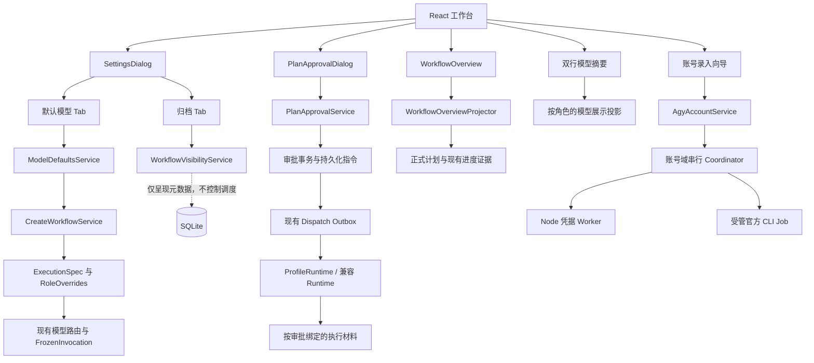
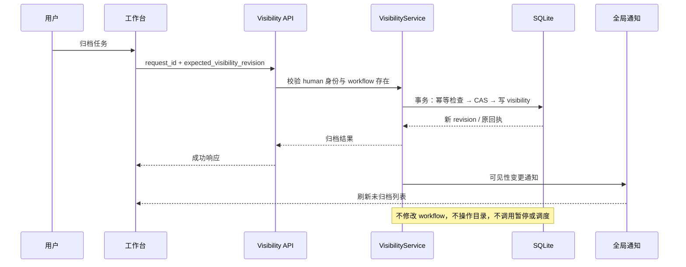
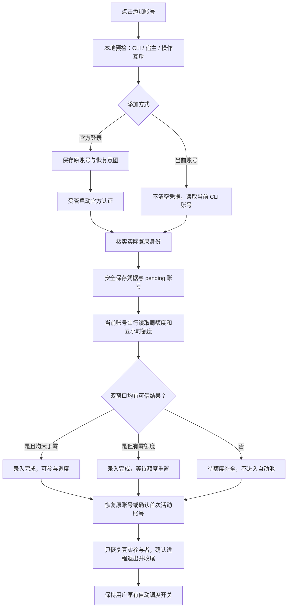
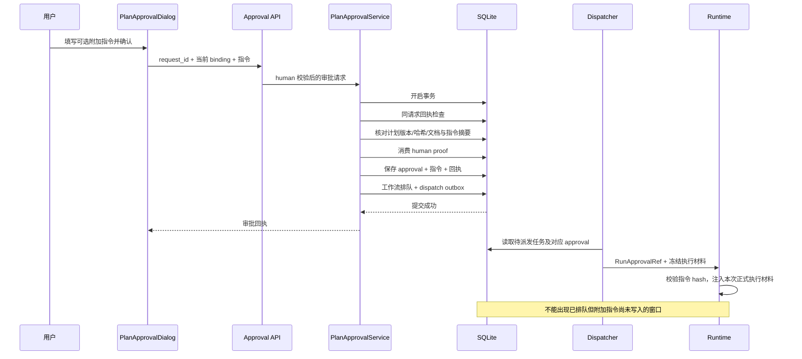
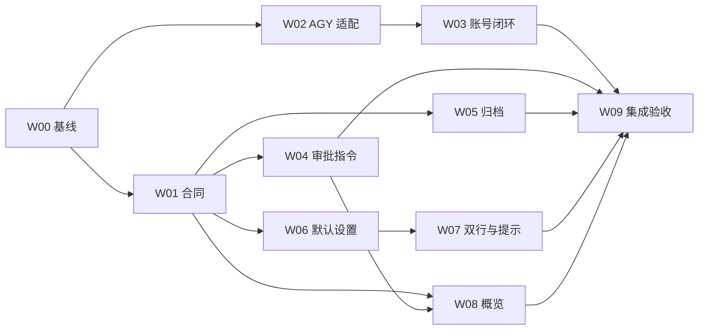

# DevFlow 工作台升级与关键链路修复：完整开发计划

> 交付对象：负责实施的开发 Agent。  
> 文档日期：2026-09-23。  
> 仓库：`zephyrw/dev-flow`，分支：`main`。  
> 核查基线：`1150e7ab88ac9a486406a1eca5bd81abce0928e2`。  
> 本文是开发与验收计划，不是已完成修复报告。本文新增的文件、接口与类型均为拟议实现；标为“现有”的符号来自上述提交。

---

## 0. 给执行 Agent 的开始指令

请基于当前代码实施本计划，不要另起项目，不要引入 Go、独立账号切换工具或统一模型 API 网关。沿用现有 TypeScript、Node、React、Fastify、SQLite，以及 Node 凭据 worker、受管进程、模型路由、工作流审批与恢复体系。[S01] [S02] [S20]

开始前记录实际 `HEAD`，对比本文基线。如果仓库有新提交，逐项核对相关实现，保留已经修好的代码，不能把本文列出的历史现象机械地重新实现一遍。不要重置用户工作区，不要清理历史工作树，不要覆盖其他并行任务。

实施的完成条件是：需求从界面、接口、持久化、运行时到恢复链路贯通，自动化测试通过，并对依赖 Windows 和真实 AGY 的部分提供单独的本机验收证据。只有界面截图、mock 返回成功或 TypeScript 检查通过，都不能代表账号添加链路已经修复。

### 0.1 本次核查的证据边界

已通过 GitHub 读取当前分支提交、账号服务、账号适配器、设置与模型路由、工作流审批、部分运行时、工作台与概览等相关代码；同时核对了 AGY 官方安装、认证、命令参考与额度面板文档。具体来源见附录 A。

本次没有连接用户本机的 DevFlow 服务、Windows 凭据管理器或 AGY 会话。尝试获取本地仓库副本时，运行环境无法解析 GitHub 域名，因此没有运行该仓库的 typecheck、Vitest、Playwright 或真实登录测试。本文严格区分“源码确认”“由条件可推导的缺陷”“本机待验证”，不得在实施报告中将这些描述改写为已经实测通过。

### 0.2 优先顺序

先建立可复现基线和数据保护，再修账号链路与审批指令，随后完成归档、默认模型和工作台展示，最后做跨链路与兼容性验收。共享合同应先落地，前后端实现可在隔离 worktree 中并行，集成后必须重新验证。

---

## 1. 需求总表与不可变约束

| 编号 | 用户需求 | 交付结果 |
|---|---|---|
| R01 | 支持任务归档，菜单不再显示，目录与状态不变 | 独立的归档元数据、归档/恢复接口、侧栏过滤、归档管理 |
| R02 | 左下角设置不是单纯模型弹窗 | “设置”弹窗含“默认模型”“归档”两个一级 Tab |
| R03 | 明确默认设置；全局也有规划、执行、复核 | 三阶段默认配置、与任务级相同的选择和继承规则、真实路由生效 |
| R04 | 修复 AGY 两种添加方式 | 本机当前账号导入、官方交互登录、身份与双额度确认、失败恢复贯通 |
| R05 | 右上角两行模型显示，当前模型文字高亮 | 大脑图标的规划侧、执行图标的执行侧；保留现有文本格式；真实角色驱动高亮 |
| R06 | 黄色提示去掉时间和“查看执行过程” | 精简提示条；侧栏关闭时原有独立打开入口保留 |
| R07 | 概览专业化，不再是长文字加任务记录 | 背景、调研结果、主要任务、主要测试项；有可信进度才显示图形 |
| R08 | 计划通过时可附加给执行模型的指令 | 审批弹窗、原子保存、绑定计划、执行注入、暂停/重试/换号恢复保留 |
| R09 | 一并核查其他代码缺陷 | 缺陷清单、复现条件、修复位置、回归测试与未验证事项 |

### 1.1 归档对象的确定解释

本轮的“任务”对应 `Workflow`，即左侧项目分组下面的具体任务条目，不是计划中的一个 work item，也不是整个 Git 仓库。一个任务归档后，只隐藏这个任务；同项目其他未归档任务保持可见。一个项目分组下没有任何未归档任务时，该空分组也不出现在侧栏。

本轮不增加“批量归档整个项目”的隐式级联操作，不调用 GitHub 仓库归档功能，不修改 `Project` 的仓库路径或项目配置。设置中的归档 Tab 能看到所有已归档工作流，并能恢复。

### 1.2 必须保持的边界

- **归档只是可见性变更。** 不暂停、不恢复、不取消、不完成、不改变工作流阶段；不移动或删除目录、分支、worktree、日志、证据和会话；不释放现有资源占用。
- **全局默认只影响之后创建的任务。** 不能覆盖已有任务的 execution spec，更不能改变正在运行的 frozen invocation。
- **账号活动跨账号严格串行。** 登录、额度查询、认证刷新、凭据切换走同一个受控账号域；不得后台并发探测或保活备用账号。
- **首次录入双额度是硬条件。** 周额度与五小时额度都得到可信结果，才算录入完成；未知不等于 100%。额度为零是“已识别但待额度”，不等于登录失败。
- **审批指令不是越权通道。** 不能绕过计划范围、文件权限、测试、安全约束或人工验收，不能因一句话自动放开 shell 或网络权限。
- **不同任务仍然隔离。** 项目、worktree、审批、附加指令、模型覆盖、会话、测试证据不得串用。工作流可以并行，但共享 AGY 账号域切换必须串行。
- **保留当前质量流程。** 本轮补齐模型配置和材料传递，不借机改写验收前/后的质量关卡顺序，也不增加规划模型的后台轮询。

---

## 2. 当前代码结构与改造方向

### 2.1 已存在的能力，不应重复开发

`ModelConfigTabs` 已经认识 `planner`、`executor`、`reviewer`、`review_fixer`、`functional_fixer`，支持“同规划/同执行”和“单独选择”。任务级 `ExecutionSpec` 已有 `roleOverrides.reviewer`；运行时也有 `resolveRoutingRole` 和冻结调用配置。缺口主要在全局默认合同及创建任务时的传递，不是从零建立第三种角色。[S07] [S08] [S09] [S10]

账号部分已有 `AgyAccountService`、串行 coordinator、durable operation、临时域锁、凭据 worker、受管 Job runner、录入状态及恢复桥。不能用前端去掉报错、强行启动自动调度或直接复制明文 token 来代替修复。[S12] [S13] [S14] [S15] [S20] [S21]

审批已有计划版本与哈希绑定、human proof、`approval` 记录、队列和 dispatch outbox。附加指令应扩展这条原子链路，不应审批后再调用一次普通聊天接口补发文本。[S22] [S23]

概览所需的大部分结构化基础已经存在：`NativePlan` 的 `design_ref.summary`、`modules`、`work_items`、`acceptance_items`；旧计划的 `decisions`、`tasks`、`tests`；详情接口中的任务和测试证据视图。应做统一投影，而不是在 React 中凭文字猜完成度。[S03] [S24] [S25] [S26] [S33]

### 2.2 目标模块图



---

## 3. 代码核查结果：已确认缺陷与待验证风险

### 3.1 源码确认或条件可推导的问题

| ID | 优先级 | 发现与触发条件 | 依据 | 实施要求 |
|---|---|---|---|---|
| D01 | P0 | `agy_executable` 默认值是 `agy`，bootstrap 却直接 `existsSync(cliPath)`；命令在 PATH 可用、当前目录不存在同名文件时，不装配登录 launcher 和 usage adapter | `config.ts`、`account-service-bootstrap.ts` [S11] [S12] | 统一可执行文件解析，先得到实际路径再检查/指纹绑定 |
| D02 | P1 | bootstrap 用写死的 `unverified/false` 生成宿主能力快照；另一方面 evaluator 又把“有 CLI 版本”直接算成身份、双额度、模型能力 verified；可用性展示与真实验证混为一谈 | [S12] [S18] | 区分 detected/supported/verified，真实宿主响应参与统一快照构建 |
| D03 | P0 | 自动调度 stopped 时手动录入已放行，但非 switch 操作会为所有已注册 consumer 保存恢复引用；`deliverConsumers` 又要求 realm 为 running。完整应用注册 workflow consumer，即使没有受影响任务，也存在无法最终完成的条件路径 | `executeAccountOperation`、`deliverConsumers`、`AgyWorkflowBridge.constructor` [S13] [S14] [S21] | 以真实参与者与恢复意图决定投递；无参与者直接收尾。先写集成复现，不能简单删除所有 running 检查 |
| D04 | P1 | `probeUsage` 的 CLI 参数声明 `--print-timeout 30s`，通用 execute 的默认宿主超时只有 15000ms；未显式传 timeout 的录入探测可能先被宿主终止 | `account-probe.ts` [S16] | 统一超时预算，宿主预算覆盖 CLI 超时和受管清理余量 |
| D05 | P1 | `parseModelAccessOutput` 发现 init 但没有 model 时不会拒绝；存在成功 result 就可成功，不能证明实际使用了请求模型 | [S16] | 缺少模型证据必须 unknown/unverified；别名按明确映射匹配，不能靠“退出成功”认定 |
| D06 | P1 | 全局模型设置遇到冲突后，“重新载入”只更新 revision，没有加载远端 profile；旧草稿可能带着新 revision 再次覆盖他人配置 | `ModelSettingsDialog.handleReload` [S04] | 真正重新载入，或显示明确差异供用户确认；不得暗中推进 CAS 基线 |
| D07 | P1 | 页面“下载 Markdown”链接指向 `/documents/plan`，对应接口正常路径返回 JSON 文档对象，不是 Markdown 下载响应 | `main.tsx` 与文档 GET 路由 [S03] [S27] | 增加明确下载格式参数/专用下载路由，设置正确 MIME 和文件名 |
| D08 | P1 | 文档读取失败时计划回退查 `${key}_r${revision}`，而 `submitPlan` 写入 `${key}-${revision}`；该回退路径会漏掉该写入路径产生的实际计划 | [S22] [S27] | 通过统一计划读取函数回退，不在路由再拼一套主键 |
| D09 | P1 | `main.tsx` 的本地状态中文表没有覆盖合同中的部分状态，如 `QUALITY_REVIEW`、`DELIVERY_VERIFYING`、`PLANNER_TAKEOVER`、`PAUSED`；直接查表可能显示空标签 | `States`、`labels` 和 header/card [S03] [S26] | 统一状态展示函数，覆盖合法状态和未知值回退 |
| D10 | P1 | 通用 `/approve` 只收 binding，没有 request_id 和整条请求的回执重放；审批成功但响应丢失后，同一点击重试会落入“计划已变化/无待审批计划” | [S22] [S23] | 新审批链路提供端到端幂等，不重复入队；兼容空指令旧请求 |
| D11 | P1 | 录入组件收到 202 操作回执即关闭弹窗；HTTP 受理与身份/双额度完成不在一个明确的用户流程中，失败难以定位 | `AgyAccountEnrollment.submit` [S19] | 留在进度向导，直到录入完成/待额度补全/失败，允许关闭后再查看操作 |

D03 属于源码条件可推导的缺陷，不等于已经在用户机器复现。必须使用“完整应用已注册 workflow consumer + automation off + 两种录入模式”的测试证实；仅独立账号服务、没有 consumer 的 mock 不足以覆盖它。

### 3.2 明确的功能缺口

| ID | 缺口 | 现有位置 |
|---|---|---|
| G01 | 任务归档元数据、接口、归档列表与侧栏过滤缺失 | `server.ts` 的列表路由、`main.tsx` 的侧栏与总览 [S03] [S28] |
| G02 | 默认模型只有规划/执行；后端合同也只有两个 profile | `ModelSettingsDialog`、`ModelDefaultsSchema`、`ModelDefaultsService` [S04] [S05] [S06] |
| G03 | 创建任务缺省使用全部 inherit role overrides，不能表达独立的全局复核默认 | `resolveCreateProfiles` [S10] |
| G04 | 右上角只能显示一份当前 observation，没有两个角色的稳定配置摘要 | `CurrentRuntime` [S29] |
| G05 | 黄色提示条仍渲染 time 和 attention action，包括执行过程入口 | `main.tsx` [S03] |
| G06 | 概览只是完整需求折叠块与任务记录，没有业务信息结构 | `CentralWorkspace` [S03] |
| G07 | 审批接口、approval 记录、执行材料没有专门的审批附加指令合同 | [S22] [S23] [S30] |

### 3.3 必须本机验证，禁止写成已确认根因

**V01：截图中的 `account_service_not_running` 与当前源码不完全一致。** `acceptOperation`、`assertOperation`、`driveOperation` 已将 enroll 当成手动 one-shot。不能笼统地说“必须先开启账号自动调度”。先核对实际 PID、监听端口、启动入口、构建提交、存储根目录，以及 Network 面板究竟哪个请求返回这个错误；可能存在旧 dist、旧服务或其他调用链，但当前尚无现场证据。[S13] [S14] [S31]

**V02：官方交互登录的真实 CLI 合同。** 当前 launcher/runner 里有 `args: ["login"]`。官方文档说明本机启动 `agy` 会尝试读取系统 keyring，缺少会话时打开浏览器；本次查到的参考文档没有证明用户安装版本一定支持 `agy login` 子命令。必须读取本机该版本的 `--help`，并完成受管交互测试。不能因为类型名叫 `VerifiedLoginCommand` 就认定经过验证，也不能据文档未提及断言所有版本均不支持。[S12] [S15] [S17] [S34] [E01] [E02]

**V03：`/usage` 的非交互输出格式。** 官方文档确认 `/usage` 是交互面板命令，但不能据此证明 `agy -p /usage --output-format text` 一定返回当前 parser 所需的 `Account:`、`Weekly quota:`、`5-Hour quota:`。parser 自己也注明它描述的是标注夹具格式。必须采集当前版本真实、脱敏的输出建立适配证据。[S16] [S32] [E03]

**V04：Windows 宿主与用户身份。** Node 凭据 worker 是否已构建、koffi 是否可载入、DevFlow 与 CLI 是否同一 Windows 用户/会话、实际 Credential Manager 是否有该 CLI 的凭据，都需要本机验证。浏览器、IDE 或另一 Windows 用户已登录，不足以证明当前 DevFlow 进程可读到相同的 CLI 凭据。[S20] [E01]

**V05：真实双额度来源。** 不允许把按模型展示的余额自动推断为账号全局的周/五小时额度。只有实际输出明确表达这两个窗口，才进入双额度完成状态；缺一个就保持待补全，显示具体缺项。[S16] [S32]

---

## 4. 开发前的版本、数据与现场核对

### 4.1 基线操作

```bash
git status --short
git rev-parse HEAD
git log -5 --oneline
node --version
pnpm --version
```

当前基线 `package.json` 声明 Node `>=22.23.2`、pnpm `11.7.0`。执行时以实际拉取提交为准，不擅自把主版本降级。[S02]

建立隔离开发 worktree；不要在正在执行业务任务的 DevFlow 自身工作树上启动破坏性试验。SQLite 迁移前使用仓库现有备份机制，或在确认没有写者时备份；不要只复制仍在写入的主数据库文件而漏掉 WAL 中的数据。

### 4.2 AGY 现场诊断的采集内容

新增/复用本机诊断视图，显示以下**非敏感**信息：前端 build id、后端 commit/version、API 端口、controller mode（full/accounts）、启动时间、当前存储实例标识、实际解析的 CLI 路径及来源、CLI 版本与指纹、credential worker 是否就绪、账号域状态、最近 operation_id 与阶段。

如果复用现有 health/descriptor，只增加缺失字段，禁止再建立平行的一套服务身份定义。仓库已有 `recordController`，主应用通过 `bootstrapAccountService` 并注册 workflow bridge。[S31]

仅允许本机 human-authorized 接口读诊断。复制诊断默认隐藏邮箱、完整用户目录、凭据内容、authorization URL 中的 code/state 等敏感参数。

### 4.3 先建立基线结果，再开始修复

运行现有 typecheck、unit/integration、build，记录已有失败。后续失败必须区分基线问题和本轮回归。不得因为已有失败而把相关断言删掉，不得把真实账号用例换成固定成功字符串后声称完成。

---

## 5. 任务归档：只改可见性，不改执行

### 5.1 用户交互

在工作流标题右侧与侧栏任务条目的更多菜单提供“归档任务”。首次操作出现确认说明：

> 归档后，这个任务将从侧栏和工作流总览隐藏。文件、目录、执行状态和记录均保留。若任务仍在运行，它会继续执行。可在“设置 → 归档”中查看或恢复。

运行中的任务也允许归档，但必须明确显示“仍在运行”，不能自动帮用户暂停。已经暂停的任务归档后仍暂停；恢复归档也不能触发继续开发。

归档成功后，当前界面切到同项目最近一个未归档任务；没有则返回工作流总览。不能先从本地删掉条目再不处理服务端失败。恢复后刷新列表但不强制启动、切换会话或打开新目录。

### 5.2 数据合同

新增 `packages/contracts/src/workflow-visibility.ts`，复用 Store 的实体机制；独立于 `Workflow.state` 和工作流业务 `version`。

```ts
export interface WorkflowVisibility {
  schema_version: 1;
  workflow_id: string;
  revision: number;
  archived: boolean;
  archived_at: string | null;
  restored_at: string | null;
  updated_at: string;
}
```

建议实体 kind 为 `workflow_visibility`，id 为 workflow_id，scope 为该 workflow_id。没有记录时投影为 `archived:false, revision:0`，不要求批量改写所有旧任务。

恢复归档时设置 archived=false，保留最近一次 archived_at，并更新 restored_at；不要删除这条元数据。再次归档时更新 archived_at，并将 restored_at 置空。保留单调递增的 revision，避免归档/恢复/再次归档出现 ABA 冲突。历次归档/恢复通过独立操作回执和事件记录保留，列表显示最近一次归档信息。

**归档/恢复本身不得写入的内容：** workflow 原始 JSON（包括 `state`、`stage`、`version`、`updated_at`、`run_id`）、审批、计划、execution spec、调度记录、workspaces、运行配置、测试证据、会话及账号状态。正常执行同时推进产生的变化应与归档调用区分，不能用“运行后全库不变”这种错误测试方法。

### 5.3 服务与接口

新增 `WorkflowVisibilityService`，提供 `read`、`setArchived`、`listArchived`。写操作内部事务完成幂等记录、CAS 与元数据写入；事务提交后沿现有通知机制触发列表刷新。

```http
PUT /api/workflows/:id/visibility
Content-Type: application/json
```

```json
{
  "request_id": "一个 UUID",
  "expected_visibility_revision": 0,
  "archived": true
}
```

成功响应包含 `workflow_id`、`visibility`、`changed`、`request_id`。相同 request_id 和正文重试返回原回执，不重复写入；相同 request_id 换正文返回 `IDEMPOTENCY_CONFLICT`。CAS 失败返回 `VISIBILITY_REVISION_CONFLICT`。同一状态的新请求是可识别的 no-op，不伪造新的归档时间。

建议新增：

```http
GET /api/archives?project_id=...&q=...&limit=50&cursor=...
GET /api/workflows?visibility=visible
GET /api/workflows?visibility=archived
GET /api/workflows?visibility=all
```

为了避免破坏现有 CLI/MCP/API 调用者，无参数 `/api/workflows` 暂时保留旧的“全部”语义；Web 侧每个列表调用显式传 `visibility=visible`。核心 `Engine.list()` 以及 scheduler、recover、resource occupancy 一律继续读取完整工作流，不做归档过滤。详情 GET 仍可通过 ID 访问归档任务，不自动恢复可见性。

### 5.4 设置中的归档 Tab

弹窗内提供任务标题/项目搜索、项目过滤、归档时间倒序、分页。每行显示：任务标题、项目、当前实际状态、归档时间、恢复按钮、查看按钮。详情区域按需展示 workflow_id、源目录、worktree、分支与计划版本；目录只读，不提供清理按钮。

当前状态读取最新 workflow，不把归档时的状态快照当成现在。对“后台仍在运行”的记录显示醒目标识。空列表显示“暂无归档任务”；加载中、网络失败、无匹配结果分开处理。

### 5.5 多窗口与通知

现有页面会因全局通知重新请求项目与工作流列表，新增可见性变更应复用这一刷新通道。[S03] 如果引入 `WorkflowVisibilityChanged`，该事件不得成为 runtime 恢复/重试触发器。

两个窗口分别归档和恢复时，以 visibility revision 为准；迟到的旧回执只能触发重新读取，不能覆盖新状态。Web detail cache 不能只凭 workflow.version 忽略归档元数据更新。



---

## 6. 全局设置与三阶段默认模型

### 6.1 信息架构

一级标题统一为“设置”。一级 Tab 为“默认模型”和“归档”。默认模型 Tab 的标题为“默认模型设置”，说明为：

> 这些配置用于之后新建的任务。已有任务继续使用自己的工具与模型配置；修改已有任务请进入该任务的“工具与模型”。

默认模型中包含“规划”“执行”“复核”三个阶段 Tab。每个阶段均复用 `ModelProfileEditor`，保持工具、模型、思考强度、native-default/not-applicable、可用性提示与临时修改处一致。[S07]

复核提供“同规划”和“单独选择”。独立选择时必须展示完整的工具、模型、思考强度，而不是只加一个模型下拉框。

任务级已有的“代码整改/功能修复”等高级覆盖继续保留；不因为全局只有三个阶段就删掉它们。

### 6.2 组件拆分

新增 `SettingsDialog.tsx` 作为外层；把原 `ModelSettingsDialog` 的编辑主体抽为 `DefaultModelsPanel.tsx`。归档独立为 `ArchivedWorkflowsPanel.tsx`。不要把整套归档逻辑塞进 ModelSettingsDialog 的模型状态中。

外层管理 tab 和关闭行为；各 panel 保持自己的数据与 loading/error。切换一级 Tab 不丢失未保存模型草稿。模型保存按钮只出现在模型 Tab，归档恢复是即时操作，不需要点“保存设置”。关闭包含未保存模型草稿时沿用 AppDialog 的 dirty 确认。统一 aria-label 为“设置”，不再叫“全局模型设置”。

### 6.3 后端合同：扩展默认，不重造路由

`ModelDefaultsSchema` 当前是 v1 且只有两个 profile；建议升级为 v2，增加一个 `reviewerBinding: RoleBinding`。不要再添加一个独立字段后让它与 `roleOverrides.reviewer` 各自生效。[S05]

```ts
export interface ModelDefaultsV2 {
  schema_version: 2;
  revision: number;
  plannerProfile: ToolProfile;
  executorProfile: ToolProfile;
  reviewerBinding: RoleBinding; // inherit => 跟随规划；explicit => 独立复核
  updated_at: string;
  source: "legacy-import" | "initial-setup" | "user";
}
```

HTTP 命名延续现有 snake_case：`planner_profile`、`executor_profile`，新增 `reviewer_binding`。读响应中的 defaults 仍按当前持久化 DTO 风格映射。必须同时更新客户端类型、Zod schema、readiness、pending draft 与接口测试。现有 API 的读写解析及草稿校验均需要一起调整。[S35]

全局接口不接受任意 `role_overrides`，维持原有边界，只显式开放 `reviewer_binding`。兼容 v1 写请求时：已有 v2 默认中的 reviewerBinding 必须保留，不能因旧客户端少传一个字段就重置成 inherit。

### 6.4 创建任务时的映射

```ts
const defaultOverrides = {
  ...inheritRoleOverrides(),
  reviewer: deepClone(defaults.reviewerBinding),
};
const roleOverrides = input.role_overrides
  ? RoleOverridesSchema.parse(input.role_overrides)
  : defaultOverrides;
```

这是数据映射示意，不应直接绕开已有 profile 规范化、权限与可用性检查。用户在创建界面明确传入的任务级 overrides 优先。沿用 `source_defaults_revision` 记录采用的默认版本；创建重试继续使用首次准备的 pending spec，不受此后全局默认变化影响。[S10]

全局“复核同规划”映射为 `{mode:'inherit'}`；之后任务单独调整规划时，复核仍跟随任务规划。全局“复核单独选择”映射为该任务的 explicit reviewer；全局后续修改不能影响这份已捕获配置。

必须核查所有任务创建入口：Web `CreateWorkflowModal`、`/api/workflows` 的新建与旧分支、CLI/bridge/MCP 中调用创建服务的入口。不能只修一个按钮，其他入口继续退回双模型。

### 6.5 保存、核验与并发

保存时对三个阶段中真正独立的有效 profile 做验证；相同完整 profile 语义哈希只核验一次，按顺序执行。验证 AGY 配置只能针对当前合法账号域，不得为全局设置批量切换所有账号。

区分三个 revision：全局 defaults_revision、任务 spec_revision、实际 run 的绑定版本。不要把全局保存成功提示写成“当前任务模型已更新”。

修复 D06：冲突时保留本地草稿和原基线。提供“载入远端并放弃草稿”以及清晰的差异确认流程；若暂不实现三方合并，只允许真实载入后重新编辑。不得只把 revision 改成新值后继续提交旧草稿。错误码优先识别 `DEFAULTS_VERSION_CONFLICT`，不能把所有 409（包括幂等冲突、账号占用）都提示成配置已更新。

### 6.6 迁移与历史配置

读 v1 默认时补 `reviewerBinding: inherit`，保留原始两个 profile。建议在服务启动的单独幂等迁移步骤落盘 v2，并对 defaults revision 做一次明确递增，生成迁移回执，避免旧客户端拿着迁移前 revision 覆盖新结构。迁移必须幂等；缺省值补齐不得访问模型或账号网络。

历史任务的 `ExecutionSpec` 不做批量迁移，不用全局默认重新推导旧任务。v1 pending drafts 可以转换为“复核继承”的草稿，但其 expected revision 必须重新检查，不可静默保存。

---

## 7. AGY 添加账号：完整修复路线

### 7.1 将四件事分开

必须在代码和界面里区分：

1. DevFlow HTTP 服务是否在运行。
2. 本机 CLI 与安全宿主是否能够执行账号操作。
3. 是否开启“自动账号调度”。
4. 某个账号是否已完成身份与双额度录入。

手动添加账号不依赖自动调度开启。自动调度关闭时，允许单次受控录入，完成后保持自动调度关闭。不要通过设置 `desired_enabled=true` 或 `workflow_auto_switch=true` 偷偷绕过门禁。

### 7.2 修复 CLI 解析与来源优先级

复用 SDK 已有的工具可执行文件解析能力；先确认它是否覆盖 AGY 的同一套配置与安全约束，再提炼公共 resolver。bootstrap、usage probe、login launcher、model discovery、process host 必须使用同一个解析结果，不能一处运行 PATH 中的 A、另一处给 cwd 下的 B 算指纹。

规则如下：

- 用户明确指定绝对/相对文件路径：按配置文件目录等现有路径基准解析；路径失效就明确报错，不偷偷换另一个同名程序。
- 用户明确指定命令名：在 DevFlow 实际进程环境的 PATH 中解析，不用 `existsSync('agy')` 代替。
- 没有明确配置时：按既定优先级读取 `AGY_CLI_PATH`、PATH 和官方标准安装目录。必须区分“schema 注入的默认命令名”与“用户显式自定义路径”，不能因为默认字符串存在而使环境变量永远失效。
- 得到真实路径后校验存在、可执行、版本、指纹，输出解析来源。包含空格、中文、盘符和 symlink 的路径要测试。
- `.cmd`/脚本 shim 按已有受管启动器规范处理。不能把未经转义的路径/参数拼成 shell 字符串，也不能 hash shim 后把另一个目标二进制误认为同一文件。
- CLI 更新导致指纹变化时，失效旧的能力与模型访问证据，重新做有界本地发现；正在运行的旧 frozen invocation 不被强行改写。

官方安装目录只是 fallback 依据，不是唯一允许的安装位置。[E01]

### 7.3 能力快照：解决假阳性与假阴性

新增统一 builder，输入包括 resolver 结果、实际 `authHost.capabilities()`、经过版本适配的登录/usage 合同与最近有效观察。bootstrap 和 capability-check 均调用它，不能只替换 host 字段而保留旧 supported 结论。

建议内部至少区分：`unavailable`（前提缺失）、`detected`（发现组件）、`supported`（该版本有实现合同）、`verified`（有实际证据）。外部兼容现有三态时，增加明确的 `evidence_kind` 与 `checked_at`，不得把检测到版本映射成身份/额度 verified。

**避免循环依赖：** 启动登录只要求本地 CLI 合同、可交互受管 Job、安全宿主与域锁可用；不要求先已认证、已有额度，否则首次登录永远进不去。导入当前账号要求当前凭据可读取，随后再串行核验身份和双额度。

GET 账号列表与能力页不触发后台账号探测；真实额度刷新只来自明确录入/刷新/切换操作或既有当前使用账号的授权逻辑，不轮询备用账号。

### 7.4 修复官方登录启动

不要直接将 `["login"]` 当成所有版本都支持的命令。实施 Agent 应对本机实际二进制记录 `--version`、`--help` 和认证流程，选择一个有证据的 `LoginStrategy`：已确认的登录子命令，或官方 TUI 首次认证流程。具体版本合同必须落成测试夹具和适配器，不要求用户手工改源码。

受管登录必须满足：有用户可见的交互入口；同一操作能够取消和超时；CLI 及其必要子进程归属清楚；登录窗口退出不是唯一的成功依据，结束后还要独立验证身份与额度。不要结束用户其他浏览器进程，不把“启动了浏览器”当成“已登录”。

已有账号 A 时，登录 B 需要先安全保存 A，确认相关任务停妥、域锁有效后再执行允许的认证变更。失败恢复不能依赖 React 是否仍然挂载。禁止在未通过安全前提时清空本机活动凭据。

### 7.5 两条用户链路



确定活动身份的规则：导入当前账号后仍保持该账号活动；已有活动 A 时登录并保存 B，默认恢复 A，不把“添加”等同于“切换”；首次没有活动账号时，成功登录的 B 可成为已记录的活动账号，但只有双额度完成才可进入自动调度。失败/取消恢复原活动身份，原来为空则恢复为空。任何阶段身份不一致时冻结操作，不猜测归属。

### 7.6 双额度完成合同

录入成功的语义必须拆开：

| 结果 | 用户显示 | 自动调度资格 |
|---|---|---|
| 身份失败或无凭据 | 尚未添加成功，明确错误与重试入口 | 无 |
| 凭据与身份已保存，额度缺失 | 已保存授权，待完成额度核验 | 无 |
| 双额度有效，某窗口为零 | 账号已添加，等待额度重置 | 当前不可选 |
| 双额度有效，余额均大于零 | 账号已添加，可用 | 还须满足既有模型/策略/新鲜度条件 |

窗口至少包含 kind、duration、remaining_fraction、observed_at、reset_at 及来源。余额必须是有限数且在 `[0,1]`；同窗口出现冲突重复值不能任选一个；无余额不能变成 0 或 1。重置时间未提供时显示“未知”，不能虚构“7 天后/5 小时后”；额度为零且重置时间未知的账号不得按猜测时间自动唤醒。

将 `pending_quota` 与 `enrollment_completed_at` 的含义贯彻到服务、DTO、UI、selector。保留凭据以避免再次登录，但不能给用户显示“全部添加成功”。[S15]

### 7.7 修复 one-shot 收尾与恢复门禁

对 D03 先构造测试：full 模式注册 `AgyWorkflowBridge`，无活动运行，账号 automation 关闭，发起录入，驱动 tick 至结束。断言操作必须到终态，`pending_operation_id` 清空，临时锁释放，automation 仍关闭。

修复方法：consumer 只有实际受影响的占用/恢复任务时才成为参与者。`prepareSwitch` 返回的恢复引用需表达是否有恢复工作；空参与者不要求 realm.running。已经保存的旧空引用兼容收尾，避免旧卡住操作永远无法恢复。

确有参与者时，按保存的运行 generation、run_id、原恢复意图和当前停止 fence 决定是否恢复。不能为使回执成功而自动开启全局调度，也不能忽略用户在录入期间发出的暂停/停止。未确认进程树退出时维持 blocked，保留责任与锁，不启动下一账号操作。

建议在 operation 中增加有版本的 control intent（例如 `manual_one_shot` / `automation`）和参与者恢复状态，而不是在多个函数复制一组 `kind === enroll || ...`。具体 schema 应兼容现有旧记录。

### 7.8 超时与错误合同

统一 operation deadline、CLI print timeout、宿主 timeout 和 cleanup timeout。示例策略：CLI usage 30 秒时，宿主至少为该值加固定清理余量；具体数值从现有 settings 派生。不能仍保留宿主默认 15 秒先于 CLI 30 秒的路径。用户取消和网络超时分开记录。

错误 DTO 建议包含 `code`、中文 `message`、`operation_id`、`phase`、`retryable`、可安全展示的 `details`。前端不直接把原始错误码作为唯一文案。

| 错误 | 主文案 | 后续动作 |
|---|---|---|
| CLI 未解析到 | 未找到 AGY CLI，请检查安装或可执行文件位置 | 查看诊断、重新检测 |
| 登录合同未验证 | 当前 AGY 版本的登录方式尚未完成适配核验 | 显示版本及适配诊断，不能虚假放行 |
| credential worker 未构建 | 账号组件未正确构建或安装 | 修复构建/安装；不要求启用自动调度 |
| 外部 AGY 占用 | 其他 AGY 进程正在使用账号，请先结束该会话 | 展示脱敏进程信息，不能擅自杀进程 |
| 网络失败 | 无法完成官方额度查询，授权已保留 | 重试当前账号 |
| 双额度缺项 | 尚未取得周额度或五小时额度，账号暂不参与自动切换 | 显示具体缺失项 |
| 进程停止未确认 | 登录进程尚未确认退出，为保护账号暂时停止后续操作 | 受控恢复，不并行重试 |

### 7.9 录入向导界面

复用 AppDialog，显示步骤：检查环境 → 登录/读取当前账号 → 核实身份 → 读取双额度 → 保存与恢复。202 表示“已受理”，不是成功终态。前端通过 operation_id 读取持久操作状态，使用现有事件或有界轮询；不要让每次页面刷新重新创建一笔录入操作。

重复点击沿用同一 request_id；正文变化才生成新请求。关闭窗口后操作可以继续，账号页应能重新进入当前操作详情；“取消操作”必须走后端取消接口，不只是卸载弹窗。网络响应未知时先查询回执，不立即重启第二个官方登录。

---

## 8. 审批通过时附加执行指令

### 8.1 用户体验

将“批准计划”改为打开 `PlanApprovalDialog`。弹窗展示：计划标题、第几版、计划摘要、审批将启动的执行配置、可选的多行“附加执行指令”。底部按钮为“取消”和“批准并开始执行”。空指令仍允许快速通过，不强迫用户填写。

建议提示：

> 这些指令会随本次已批准计划交给执行模型，在后续开发、相关测试、修复和恢复时继续遵循。它们不能改变计划范围或跳过必要的安全与验收要求；需要改方案请使用“驳回并修正”。

示例只作为 placeholder，不自动写入真实内容：

```text
尽量复用已有组件，不引入新的大型依赖。
完成一组功能后先跑对应测试，再继续下一组。
遇到已存在的测试失败请单独记录，不要通过删断言让测试变绿。
```

文本长度上限建议 20000 字符，与现有反馈表单量级一致。显示字数、保留换行。Enter 换行，Ctrl/Cmd+Enter 可作为明确提交快捷键，中文输入法 composition 期间不提交。切换任务不能将草稿带给另一任务。

草稿按 workflow_id + plan_revision + plan_hash 存在会话级存储；计划更新时保留原草稿但提示“计划已变化，需重新核对”，不能自动把它批准给新版本。

### 8.2 审批附加指令不是普通 feedback

不要把文本直接追加到全局 `w.feedback`，也不要审批成功后再异步调用 feedback API。这样会有“计划先启动，附加指令后到达”的竞态，并可能触发不需要的重规划或修复逻辑。现有普通反馈本身包含状态转换行为，不应复用成静默的审批注释。[S22]

### 8.3 合同设计

新增 `packages/contracts/src/plan-approval.ts`。使用一个规范化函数处理 CRLF、首尾空白与长度校验，正文规范化后计算 hash；不要压缩段落内部空白或删除用户代码块。

```ts
export interface ApprovedExecutionInstructions {
  schema_version: 1;
  text: string;
  text_hash: string;
  scope: "approved-plan";
}

export interface PlanApprovalRecordV2 {
  schema_version: 2;
  workflow_id: string;
  plan_revision: number;
  revision: number; // 兼容现有 approval.revision，须与 plan_revision 相同
  plan_hash: string;
  document_hash: string | null;
  request_id: string;
  approved_at: string;
  proof?: string; // 现有服务端证明引用；不向前端暴露，不重新签发
  execution_instructions: ApprovedExecutionInstructions;
}

export interface RunApprovalRef {
  approval_id: string;
  plan_revision: number;
  plan_hash: string;
  instructions_hash: string;
}
```

`approval` 实体沿用现有按 workflow 与计划版本定位的记录，不另做一份无法追溯的“最新指令”。扩展时保留现有 revision、proof 等仍被其他调用者读取的原字段，明确 plan_revision 与 revision 的一致性约束；不可直接用示意接口覆盖整个旧记录并丢掉证明关系。允许已识别为旧版的 approval 没有 instructions，兼容读取为“无额外执行指令”。不要为历史任务猜测用户当时想说什么。

### 8.4 统一审批接口

扩展现有 `/api/workflows/:id/approve`，新增 v2 请求，同时对仅 `{binding}` 的旧空指令请求保留兼容解析。

```json
{
  "schema_version": 2,
  "request_id": "一个 UUID",
  "binding": {
    "workflow_id": "wf-example",
    "action": "approve",
    "version": 12,
    "plan_revision": 3,
    "plan_hash": "当前计划哈希",
    "snapshot_id": null,
    "environment_revision": 1,
    "extra": {
      "execution_instructions_hash": "规范化正文的哈希"
    }
  },
  "execution_instructions": {
    "text": "复用现有组件；不要删除失败测试的断言。",
    "scope": "approved-plan"
  }
}
```

服务端重新规范化并计算 hash，不信任客户端 hash。human proof 必须绑定当前计划与指令 hash。`Engine.approve` 目前直接与 `binding(key,'approve')` 的空 extra 比较，因此要同步扩展这个比较逻辑，而不是只在 API 顶层多收一个字段。[S22]

文档级 `/documents/:documentId/approve` 必须进入同一个 `PlanApprovalService`，统一文档、计划、附加指令、幂等与调度行为。bridge/CLI/MCP 中的人工审批入口也必须检查并统一，不保留能够绕开新合同的第二条路径。原来的人工授权约束保持不变，执行模型不能替用户签发 approval。

### 8.5 原子操作与幂等



幂等检查优先于“当前已不在 PLAN_PENDING”的状态门禁。同一 request_id、同一正文重试返回既有回执；同 request_id 改指令拒绝；不同 request_id 重复批准已经通过的同版计划应返回清晰冲突，不能二次入队。

审批事务失败时，不得出现指令已保存而计划未通过的“有效审批”；也不得消费掉 proof 后留下无法恢复的半笔操作。dispatch 只在提交后由现有 outbox 驱动。审批成功但网络丢包时，通过同请求重放确认，不重新点击成另一笔。

### 8.6 真正传给模型

新增 `ExecutionInstructionService` 或等价的小型纯模块，按 RunApprovalRef 解析材料，复用到：

| 路径 | 必须携带的语义 |
|---|---|
| 首次 implement | 执行遵循该版审批附加指令 |
| 同版计划的 executor_test | 与测试职责有关的指令，仍保留角色边界 |
| functional_fix、review_fixer | 同一审批范围的约束持续有效 |
| planner_takeover 实际执行修复 | 仍遵守用户批准的实施约束，不因工具不同丢失 |
| merge_conflict | 适用的实施约束随材料携带，不能扩大冲突解决范围 |
| 暂停后续跑、失败重试 | 使用原 approval ref，不仅依赖 CLI 自己记忆 |
| AGY 换号后恢复、会话重建 | 恢复包中保存指令引用和 hash，重新注入相同内容 |
| 原生子 Agent | 主任务交接材料要求继承；DevFlow 创建/恢复的子会话明确传递，不声称可控制不可观测的原生内部行为 |
| 代码复核 | 作为只读验收依据提供，不当作允许复核模型越权实施的命令 |

现有主要注入位置是 `ProfileRuntime.executeMaterials`、`reviewMaterials`、continuation/recovery 材料组合，以及兼容 runtime 的执行输入。优先将解析逻辑集中到共享函数，避免首次执行有字段、恢复另拼材料遗漏。[S30]

建议正式材料中的结构为：

```ts
{
  approved_execution_instructions: {
    approval_id,
    plan_revision,
    plan_hash,
    text,
    text_hash,
    scope: "approved-plan"
  }
}
```

带有 RunApprovalRef 的运行遇到 approval 不存在、归属不符、版本或指令 hash 不一致时必须阻止派发并显示可恢复错误；不得降级成空指令继续执行。只有明确的旧版无指令记录可以走兼容读取。

需要同时有清晰的自然语言材料分节，不能只是把 JSON 存库却没有放进 adapter 最终输入。测试通过 fake adapter 捕获实际 PreparedInvocation/输入材料断言，而不是只测 database 字段存在。

### 8.7 版本、冲突与展示

新计划版本须重新审批。旧附加指令默认不自动成为新计划的生效指令；可在弹窗中预填并明确显示来源，只有用户确认才重新绑定。执行中更改补充指令不在本次审批入口内完成，仍走正式反馈和安全暂停/恢复机制，不修改正在执行的不可变材料。

本轮同版审批指令属于持续约束，而非每次重试都要重复实施一次的待办命令。材料中标注“已生效约束，不要求重做已完成工作”，避免换号后重复迁移或重复执行有副作用步骤。

在概览增加“执行约束”摘要卡（只有非空时显示），计划页展示完整正文与所属审批版本；执行历史记录“已载入审批附加指令”及 hash/版本，不要求复制敏感正文到每条日志。复核报告必须能注明检查过哪些附加要求，无法验证的要求标记为待确认。

---

## 9. 右上角两行模型显示

### 9.1 视觉规格

保留 `formatRuntimeDisplay` 的 `工具 · 模型 (思考强度)` 格式和现有轻量外观，不做两张大卡片。两行纵向排列，图标统一使用本项目 SVG 图标风格；上行大脑，下行执行/播放图标。图标设为装饰元素，按钮提供完整 aria-label。

```text
[脑图标]  Codex · GPT-6 Astra (high)       [额度]
[执行图标] AGY · 所选执行模型 (high)
```

示例文字只是布局示意，实际内容必须来自任务配置或当前运行观察，不能写死这些模型名。

当前实际使用的那一行，其模型文字高亮且加粗；另一行正常弱化，不用整块高饱和背景。暂停、结束、无活动 run 时不伪造“正在使用”。断线时给出“状态待确认”的语义，不能把旧 observation 永久当当前。

### 9.2 两行始终代表规划与执行，不偷换成复核

上行固定代表规划配置，下行固定代表执行配置。不能在进入复核阶段后，悄悄将上行换成独立复核模型；那会让大脑图标的含义随阶段变化，与用户希望同时辨认规划/执行两个模型的要求不一致。

高亮用当前主 run 的真实角色与完整模型选择共同决定，不只比较 modelId 文本：

- 当前主 run 路由为 planner：上行使用本次 run 的实际观察/冻结请求配置并高亮；下行显示任务执行配置。
- 当前主 run 路由为 executor：下行使用本次 run 的实际观察/冻结请求配置并高亮；上行显示任务规划配置。
- 当前主 run 为 reviewer：两行内容不变。若 reviewer 继承规划，或其完整执行选择与规划一致，可高亮上行；tooltip 必须说明“当前用于复核”。如果复核使用独立且不同的配置，两行都不冒充当前模型；在现有额度/状态入口旁显示紧凑的“复核中”标识，tooltip 和可访问说明展示实际复核工具、模型、强度。
- 当前主 run 为 review_fixer/functional_fixer：同理，仅当实际配置与执行行一致时高亮执行行；配置不同则保留两行，使用紧凑的“整改中/修复中”标识说明实际配置。planner_takeover 仍按现有 routing_role=planner 处理。
- 规划与执行恰好使用同名或相同配置时，普通规划/执行阶段仅高亮实际职责对应行；复核继承规划时优先上行，避免两个都亮。

上行点击始终打开规划 Tab，下行点击始终打开执行 Tab。独立复核/修复的紧凑状态标识可打开其对应 Tab。不新增固定第三行，不把默认设置改动当作当前实际运行。

“完整执行选择一致”至少比对规范化后的 adapter、模型选择/真实模型、reasoning、provider/account scope 和必要的 native profile；用项目已有的语义规范化，不比较 profile.id，也不能仅凭显示名称相同就认为一致。缺少可信 scope 时不做跨角色的确定性匹配，保留“状态待确认”的说明。

### 9.3 数据优先级

角色对应的活动行优先使用属于本工作流当前主 run、且 generation/绑定一致的真实 observation；实际模型未被观察到时，显示 requested/frozen profile 并在 tooltip 说明“按请求配置显示，实际模型尚未确认”。如果同一角色的新配置尚未作用于当前 run，行内继续展示该 run 的有效选择，tooltip 额外展示下一轮待生效配置，不能把新草稿冒充实际模型。

非当前行使用任务 `resolved_roles` / ExecutionSpec；不能用当前 global defaults 覆盖旧任务。不存在 runtime observation 时，两行仍能用配置显示；不存在明确配置时显示“未配置”，而不是消失或猜测一个模型。[S08] [S29]

后台旁路提问、历史 run、用户在执行面板查看的子会话，不得随意改写主工作流右上角的当前职责。需要展示子会话模型的既有位置继续独立展示。

### 9.4 额度逻辑

保留现有 QuotaPopover 的严格窗口识别与 stale 语义，不因两行展示把一个账号的额度复制给另一个工具。额度必须绑定 account scope、adapter、model/pool、run/observation 来源。

优先保留一个小额度按钮，指向当前实际活动模型；若当前是不同于两行配置的独立复核模型，按钮的 tooltip/标题明确注明“当前复核模型额度”，不能让用户误以为是规划余额。无活动 run 时可以显示明确标为历史快照的最后有效额度，不能新发账号网络探测；信息不足显示“暂无可信额度”。不要单击右上角就触发备用账号批量刷新。[S29]

### 9.5 测试真值表

| 场景 | 上行 | 下行 | 高亮与辅助说明 |
|---|---|---|---|
| planning 活动 | 实际规划/请求规划 | 任务执行配置 | 上行 |
| implement 活动 | 任务规划配置 | 实际执行/请求执行 | 下行 |
| reviewer 与规划选择一致 | 任务规划配置 | 任务执行配置 | 上行；说明当前用于复核 |
| 独立且不同的 reviewer 活动 | 任务规划配置，不替换 | 任务执行配置 | 两行不高亮；紧凑“复核中”入口说明实际模型 |
| functional_fixer 与执行一致 | 任务规划配置 | 任务执行配置 | 下行；说明当前用于功能修复 |
| functional_fixer 为独立不同配置 | 任务规划配置 | 任务执行配置，不替换 | 两行不高亮；紧凑“修复中”入口说明实际模型 |
| 同一个模型承担两个角色 | 规划角色配置 | 执行角色配置 | 仅实际职责对应行，不同时亮 |
| STOPPED/COMPLETED | 任务规划配置 | 任务执行配置 | 无活动高亮 |
| 无 observation、已有 spec | 任务规划配置 | 任务执行配置 | 无；若有可信当前 run，可说明仅按请求显示 |
| 断线 | 最后可信内容及未知状态 | 配置/最后可信内容 | 不宣称实时活动 |
| 正在浏览历史子会话 | 主任务规划配置/有效调用 | 主任务执行配置/有效调用 | 不被历史浏览抢占 |

---

## 10. 黄色提示条精简

提取 `WorkflowAttentionBanner` 或在既有区域做局部改造。黄色提示条保留图标与中文说明，删除其中的 `<time>`；删除其“查看执行过程”及兜底跳转到右侧执行面板的按钮。[S03]

右侧执行面板关闭时，上方操作区已有的“执行过程”按钮继续保留；打开时不重复显示。右侧历史日志中的时间、其他审计/归档时间、本次未指定删除的紧凑活动摘要不受影响。

注意当前 attention action 不止“查看执行过程”，还可能是审批、来源变化、人工验收或输入指导。不能为了删除一个冗余按钮，把唯一的业务操作入口也删除。采用结构化 `action_kind`：`open_execution` 不在 banner 渲染；真正必要的审批/恢复操作保留在上方操作区或专门的交互卡。不要仅靠比较中文按钮文本来判断类型。

对用户手动暂停导致的重复提示，沿用现有 `local_console` 过滤意图；完善为结构化 reason/source 判断，不依赖字符串里是否含“你在控制台暂停”。不要把真实 blocker 一并隐藏。

---

## 11. 概览重设计：从长文本改为业务摘要

### 11.1 信息结构

删除整个“任务记录”子模块，运行历史仍留在右侧执行面板与现有历史入口，不能迁移成另一个默认展开的日志卡。

概览采用以下布局：

```text
┌────────────────────────────────────────────────────────────┐
│ [目标图标] 任务目标                                          │
│ 一到三行摘要，表达为什么做、最终要达到什么                     │
│ 项目 / 当前阶段 / 计划版本                         查看完整计划│
├────────────────────────────┬───────────────────────────────┤
│ [背景图标] 背景与约束        │ [调研图标] 调研结果             │
│ 真实问题、边界、已知限制     │ 关键发现、已确定方案、待决问题  │
├────────────────────────────┼───────────────────────────────┤
│ [任务图标] 主要任务          │ [测试图标] 主要测试项           │
│ 简明任务清单 + 有依据的状态  │ 场景、预期结果 + 证据状态        │
├────────────────────────────┴───────────────────────────────┤
│ 有有效数据时显示：任务状态分布 / 测试状态分布                  │
│ 非空时显示：本版审批附加执行约束                              │
└────────────────────────────────────────────────────────────┘
```

右侧执行面板开启时用自适应两列，窄屏转一列。不能把固定 50% 宽度的大空卡撑满页面。推荐基于主内容容器宽度，而不只是浏览器宽度做布局，避免右栏展开后信息挤压。

每卡标题配独立语义图标；颜色由现有 design tokens 驱动，文字状态、图例和数值同时存在，不能只靠颜色传达。首屏不默认展开原始长需求，不自动呈现所有文件路径。

### 11.2 不增加“打开概览就调用模型总结”

新增 `WorkflowOverviewProjector` 作为确定性数据投影。GET 概览不调用模型、不访问账号网络、不改变审批，不重新扫描整个文件系统。优先复用 engine 已有的任务与证据结果；将一次请求内重复的 plan/任务统计共享计算。[S24] [S25]

本轮不为旧计划强加新的必填 JSON 字段。新规划 prompt 约定正文提供“背景与目标”“调研结论”“主要实施任务”“主要测试与验收”标准章节，既有结构化 work_items/acceptance_items 仍是任务/测试清单权威来源。

旧计划回退通过 Markdown AST 按已知标题抽取对应小节，不用正则暴力切段生成虚假语义。未识别到“调研结果”就显示“当前计划未提供结构化调研摘要”，提供查看完整计划入口，不能把原始需求改称已经完成的调研结论。

### 11.3 各区域的数据来源

| 区域 | 优先来源 | 回退 | 禁止行为 |
|---|---|---|---|
| 任务目标 | native `design_ref.summary` | 明确目标章节；否则请求的有界原文摘要 | 把 title 重复多次当摘要 |
| 背景 | 当前正式计划的背景章节 | 请求原文中明确可引用的背景，标注来源 | 推测业务背景、凭空补“行业现状” |
| 约束 | plan scope 与明确约束段落 | 原始需求的明确限制 | 展示 token、内部凭据或所有技术日志 |
| 调研结果 | 当前计划 `decisions` 与调研/结论章节 | 无内容则明确空态 | 把 unresolved_decisions 当已经确认 |
| 主要任务 | native work_items/modules；旧计划 tasks | 无计划时显示“计划尚未生成” | 从聊天里数“完成”出现次数 |
| 主要测试项 | native acceptance_items；旧计划 tests | 明确测试章节，且只作为计划清单 | 把已设计场景显示为已通过测试 |
| 执行约束 | 当前有效 approval 的附加指令 | 空则隐藏 | 将其他任务或旧审批正文混入 |
| 进度 | `taskStatus`、`testProgress` 的同版有效证据 | 不足则不显示进度图 | 用 elapsed time、阶段序号伪造百分比 |

### 11.4 DTO

建议新增纯读取的 `/api/workflows/:id/overview`，或在既有 detail 中增加同一投影的 `overview` 字段。最终实现选择一个权威投影，不在前后端各计算一套。

```ts
export interface WorkflowOverviewView {
  schema_version: 1;
  workflow_id: string;
  plan_revision: number;
  plan_hash: string | null;
  view_revision: string; // 内容/证据/审批摘要的稳定版本，不只使用 workflow.version
  goal: TextSection;
  background: TextSection;
  findings: FindingView[];
  unresolved: string[];
  tasks: OverviewTaskView[];
  tests: OverviewTestView[];
  progress: {
    tasks: ProgressView | null;
    tests: ProgressView | null;
  };
  execution_constraints: {
    approval_id: string;
    text: string;
    text_hash: string;
  } | null;
}
```

以上 `TextSection`、`FindingView` 等是拟新增 DTO，不是仓库已有类型。具体字段必须包含来源与缺失状态，和已有 task/evidence 合同映射，不另造业务状态机。

TextSection 建议包含 `status: available|missing|unstructured`、`summary`、`items`、`source_ref`。来源限定当前计划、请求或审批的同工作流材料；source_ref 用内部对象 ID/相对引用，不接受任意外部 URL 或绝对路径读取。

### 11.5 进度口径

“有进度”定义为：有明确统计对象、非零分母，且这些对象存在可信状态或可追溯执行证据。真实的“0/N 待开始”可以显示；没有清单/没有状态依据时，不制造 0%、0/0 或灰色空进度卡。

任务区区分“已开展”“开发完成”“已交付/验证完成”。尤其 native-v2 的“工作包已开展”不能更名成“开发已完成”；用户截图的 8/8 已开展与 0/8 已交付可以同时成立，不应强行合成一个 100%。[S25]

测试区区分“计划场景”“执行过的测试命令次数”“有报告证据的通过场景”。原生执行自测 N 次，不等于 N 个验收项通过。只按同 plan_revision、有效证据和已有失效规则统计；历史曾通过但现在待复测应单列，不算当前通过。[S24] [S25]

默认使用横向分段条、小型状态统计和清单状态图标，不引入大型图表库。不把同一份明细图再复制到顶部，顶部 DeliveryStrip 保留紧凑摘要，两处共用统计结果。

### 11.6 清单长度与细节展开

任务和测试默认显示重要/未完成条目及有限数量，例如前 6 项，显示“查看全部 N 项”跳转现有任务/测试 Tab。排序规则明确：阻塞/失败优先，其次进行中，再待开始，完成项后置；同时保持依赖/原计划顺序的可解释性。

背景与调研每卡限制首屏摘要长度，完整内容使用展开或定位到计划对应章节。完整需求保留为低优先级入口，不再占据主卡大段文字。

### 11.7 缓存、更新与隔离

投影缓存 key 至少包含 workflow_id、plan_hash/plan_revision、任务/证据变更版本、approval instructions hash、投影版本。对任务证据失效、审批、计划更新、交付变化与恢复做定向失效；纯 token 流事件不要每条重新构建 overview。

summary 加载与完整 detail 到达的顺序不能把最新 overview 覆盖成旧内容。使用独立 view_revision 或显式结果身份检查，不能只比较 workflow.version。切换任务时 AbortController + workflow_id 校验防止迟到响应串页。

---

## 12. 其他缺陷的具体修复要求

### 12.1 D05：模型验证必须与实际模型一致

增加纯函数测试：只有 init/result、无 model 的输出不能返回 verified；明确错误、混杂日志、多个冲突模型、最终实际模型与请求不符均不能通过。模型别名只有来自 adapter/catalog 的明确规范化映射才允许匹配。

`parseModelAccessOutput` 接收的 accountId/cwd 目前没有形成对应验证；不能通过机械比较一个没有输出的字段来“补齐”。账号/工作区身份应由受管调用上下文与可信 session identity 验证，模型输出只能承担它能够证明的部分。无法确认时返回 unknown，保留原因，而不是伪造 false/true 二元确定性。[S16]

### 12.2 D07/D08：计划文档查看与下载

保留 JSON 读取接口供界面，新增 `?format=markdown&download=1` 或专用 `/download` 子路由。成功时输出真正的计划 Markdown、`text/markdown; charset=utf-8`、正确 Content-Disposition；正文从当前明确绑定的正式计划材料读取，不能 `JSON.stringify(plan)` 冒充 Markdown。

修正页面下载链接，同时覆盖有 project_document、只有历史 PlanRecord、native design_ref 引用、材料缺失与哈希不匹配的场景。回退读取调用 `engine.plan` / `readPlanMaterial` 等现有权威函数，不再在路由拼错误主键。

文档 hash 不匹配属于需确认的真实错误，不应在 catch 中一律退回其他版本再让用户以为下载的是当前已批准计划。归档任务仍能下载原文，不触发恢复归档。

### 12.3 D09：统一状态展示

把局部 labels 提炼到 presentation，建立覆盖 `States` 的映射或具有明确 alias 的投影。给合法但较新状态补齐中文标签、颜色类别与说明。未知值显示“状态待识别”并可在技术详情看到原值，不显示空白，不当作成功。

单元测试遍历合同中的全部 States，检查标签非空；页面测试覆盖 QUALITY_REVIEW、PLANNER_TAKEOVER、PAUSED 等截图没有出现但代码合同允许的状态。

### 12.4 AGY 能力与 parser 的真实夹具

将测试用说明格式和经过验证的官方输出适配分开命名。生产不能仅因为识别到了一个版本号，就启用所有能力为 verified。记录真实 CLI 版本、输出格式、采样时间、适配器版本和脱敏方式；测试匿名样例必须保留字段布局，不伪造本来没有的 weekly/five_hour 信息。

如果实际版本没有当前要求的可读取双额度，功能显示“授权已保留、双额度适配待完成”，明确未通过真实验收，不能通过返回满额或删除双额度门禁完成本任务。

### 12.5 扩展审查清单

完成上述修复后，对受影响代码继续核查：遗漏的创建/审批入口、DTO 与 strict schema 不一致、旧版本读写降级、错误码被吞掉、空数组/缺失字段崩溃、异步请求串页、重复提交、取消与真正进程结束混淆、恢复路径丢材料、归档错误介入调度。

新发现的问题另记 `docs/reports/devflow-workbench-audit.md`，必须包含代码位置、触发条件、影响、证据级别和测试。没有证据的怀疑进入“待验证”，不能为凑数量写成漏洞；与本轮无关的重大架构改写不顺手进行。

---

## 13. 文件级修改清单

### 13.1 合同与核心服务

| 路径 | 操作 | 内容 |
|---|---|---|
| `packages/contracts/src/workflow-visibility.ts` | 新增 | 归档/恢复合同、CAS 请求、列表 DTO |
| `packages/contracts/src/plan-approval.ts` | 新增 | 审批附加指令、v2 请求/回执、RunApprovalRef |
| `packages/contracts/src/workflow-overview.ts` | 新增 | 概览只读投影合同 |
| `packages/contracts/src/model-routing.ts` | 修改 | 默认模型 v2、reviewer binding、兼容解析 |
| `packages/contracts/src/index.ts` | 修改 | 导出新合同；Run 必要的可选审批引用 |
| `packages/core/src/workflow-visibility-service.ts` | 新增 | 独立可见性持久化，不触碰 workflow 状态 |
| `packages/core/src/plan-approval-service.ts` | 新增 | 所有人工审批入口共用，原子性与幂等 |
| `packages/core/src/execution-instructions.ts` | 新增 | 指令规范化、hash、运行材料读取和绑定校验 |
| `packages/core/src/workflow-overview.ts` | 新增 | 正式计划、任务和证据投影 |
| `packages/core/src/model-defaults-service.ts` | 修改 | v1/v2 迁移、三阶段默认、readiness/save |
| `packages/core/src/create-workflow.ts` | 修改 | 默认 reviewer 映射、捕获默认 revision |
| `packages/core/src/engine.ts` | 局部修改 | 审批协调、Run 指令引用、详情投影接入；不得加入归档状态 |
| `packages/core/src/execution-spec-view.ts` | 按需修改 | 为双行模型提供统一 role view，不重写路由 |
| `packages/presentation/src/workflow-status.ts` | 新增 | 统一状态中文与样式语义 |
| `packages/presentation/src/role-runtime.ts` | 新增 | 双行摘要与当前职责投影 |

新增路径是本计划建议命名；实际仓库若已有职责相同模块，应复用并在交付映射中说明。禁止同一职责同时保留两套实现。

### 13.2 API 与账号链路

| 路径 | 修改内容 |
|---|---|
| `apps/api/src/routes/workflow-visibility.ts`（新增） | 可见性写操作、归档列表、human 校验 |
| `apps/api/src/server.ts` | 显式列表过滤、注册新路由、统一审批入口、文档下载修复 |
| `apps/api/src/model-routes.ts` | 三阶段默认解析、pending draft、readiness 与兼容 |
| `apps/api/src/account-service-bootstrap.ts` | 真实 CLI 解析、统一能力快照、可诊断初始化 |
| `apps/api/src/agy-account-routes.ts` | 真实 actions_available、操作回执、诊断字段与错误映射 |
| `packages/agy-accounts/src/service.ts` | one-shot 参与者、收尾与取消恢复；保持自动调度意图 |
| `packages/agy-accounts/src/enrollment.ts` | 双额度完成语义、pending 与错误保留 |
| `packages/agy-accounts/src/login.ts` | 经过证据确认的 LoginStrategy，不假定命令 |
| `packages/adapters/agy/src/account-probe.ts` | resolver 结果复用、超时、模型实证校验 |
| `packages/adapters/agy/src/account-capability-registry.ts` | detected/supported/verified 分离、统一 snapshot builder |
| `packages/adapters/agy/src/quota-parser.ts` | 对应真实 CLI 输出的适配与严格缺项处理 |
| `packages/process/src/agy-account-job-runner.ts` | 登录可交互性、受管停止与统一超时预算 |
| `packages/agy-accounts/src/auth-host.ts` | 仅在诊断/能力等必要位置修改；保留安全 worker 边界 |
| `packages/runtime/src/agy-workflow-bridge.ts` | 实际参与者恢复意图、审批材料引用随恢复保留 |
| `packages/runtime/src/profile-runtime.ts` | 新建/继续/测试/修复/复核材料的指令注入 |
| `packages/core/src/execution-guidance.ts` | 共享恢复指导接入审批约束，避免重复执行 |

### 13.3 Web

| 路径 | 修改内容 |
|---|---|
| `apps/web/src/main.tsx` | 只接线：新设置、归档动作、审批弹窗、概览与提示条；尽量移出新逻辑 |
| `apps/web/src/components/SettingsDialog.tsx`（新增） | 两个一级 Tab 和 dirty 管理 |
| `apps/web/src/components/DefaultModelsPanel.tsx`（新增） | 三阶段全局默认主体 |
| `apps/web/src/components/ArchivedWorkflowsPanel.tsx`（新增） | 归档查询、查看、恢复 |
| `apps/web/src/components/WorkflowArchiveAction.tsx`（新增） | 更多菜单/确认交互 |
| `apps/web/src/components/PlanApprovalDialog.tsx`（新增） | 审批版本、可选执行指令、幂等提交 |
| `apps/web/src/components/WorkflowOverview.tsx`（新增） | 概览布局，不自行计算业务完成度 |
| `apps/web/src/components/WorkflowAttentionBanner.tsx`（新增） | 无时间、无冗余执行入口的提示 |
| `apps/web/src/components/CurrentRuntime.tsx` | 两行职责展示、真实高亮、额度归属 |
| `apps/web/src/components/ModelConfigTabs.tsx` | 复用/补充可访问性，不另写全局选择器 |
| `apps/web/src/components/model-api.ts` | 三阶段 DTO、错误分类、请求取消 |
| `apps/web/src/components/AgyAccountEnrollment.tsx` | 录入向导，202 不等于完成 |
| `apps/web/src/components/AgyAccountsPanel.tsx` | 持久操作入口、待额度补全、diagnostics |
| `apps/web/src/components/agy-api.ts` | 结构化错误与幂等请求标识 |
| `apps/web/src/workbench.tsx` | 共享进度投影；保持“开展/交付/测试”语义 |
| `apps/web/src/components/*.css`、`style.css` | 新组件局部样式，响应式和 focus 状态 |
| `docs/guide/使用指南.md` | 新设置、归档、三模型默认、审批附加指令、账号错误说明 |

本轮不把 README/一行安装方案整体重写；仅修复这些功能必要的安装诊断或文档说明，避免与其他并行改造任务相互覆盖。

---

## 14. 分阶段实施任务包

### W00：基线、现场诊断与失败夹具

**依赖：无。** 记录 HEAD、运行基线命令、保护现有数据库/工作区。复现默认 `agy` 命令发现失败；复现完整 app 中 automation off 的 one-shot；捕获审批丢响应重试行为；记录真实 AGY CLI 输出合同。

**交付：** 基线报告、诊断字段、D01/D03/D10 的失败测试。真实账号测试只能在用户授权的本机进行。

### W01：共享合同与迁移

**依赖：W00。** 定义归档独立 revision、默认模型 v2、审批 v2/RunApprovalRef、概览 DTO。定义兼容规则与错误码；补齐 schema export。

**交付：** 合同测试、v1 默认/历史 approval 的迁移测试、不改变旧 workflow JSON 的测试。

### W02：账号发现、能力与真实命令适配

**依赖：W00，必要的 W01 合同。** 修 D01、D02、D04、D05；实现 resolver 共用；核对 LoginStrategy；保存脱敏 usage 夹具。

**交付：** PATH/路径/指纹测试、能力快照测试、timeout 测试、模型验证严格性测试、真实 CLI 适配记录。

### W03：账号 one-shot、录入与 UI 闭环

**依赖：W02。** 修 D03、D11；保持关闭自动调度时可录入；双额度完成门禁、取消与恢复、无参与者直接收尾；前端进度向导。

**交付：** full/accounts 两种模式的集成测试，Windows 两种录入方式的人工验收记录。未完成真实验证不得标记账号链路 Done。

### W04：审批附加指令端到端

**依赖：W01。** 统一所有审批入口、原子写入指令与审批、幂等回执；运行输入与恢复包绑定；PlanApprovalDialog。

**交付：** 首次执行、暂停恢复、失败重试、换号恢复、子会话交接、计划变化、重复请求与跨任务隔离测试。

### W05：任务归档与归档管理

**依赖：W01。** 独立 visibility service、API、侧栏/总览过滤、空项目隐藏、设置归档 panel。

**交付：** 归档不改变状态/目录/调度的断言、多窗口 CAS、重启持久化与恢复测试。

### W06：三阶段默认模型与设置壳

**依赖：W01，可与 W04/W05 并行。** 外层 SettingsDialog、复核默认、创建任务映射、D06 冲突修复、所有创建入口回归。

**交付：** 独立复核默认真实用于后续新任务；已有任务不变；设置和临时修改相同行为。

### W07：双行模型与黄色提示

**依赖：W06 的合同，不必等待所有 UI。** 角色展示投影、两行组件、高亮与额度归属、提示条删冗余、状态映射 D09。

**交付：** 第 9.5 节真值表测试、右栏开/关 E2E、不同状态视觉截图。

### W08：概览投影与可视化

**依赖：W01、W04 的指令读取合同。** native/leaf/legacy 三种计划数据映射、Markdown 结构化摘要、可信进度、空态、独立版本缓存。

**交付：** 没有任务记录卡、不是长文本墙、无假进度、旧计划可显示、执行指令归属明确的页面和测试。

### W09：文档缺陷与全链路验收

**依赖：W03–W08。** 修 D07/D08，更新指南，检查遗漏入口。运行完整回归、并行任务隔离、重启恢复、生产构建 smoke，整理缺陷关闭清单与残余风险。

**交付：** 变更说明、测试报告、真实账号记录、迁移/回滚说明、UI 对照截图。不要以“还有待验证的真实登录”同时写“所有需求已完成”。



---

## 15. 自动化测试矩阵

以下测试文件均为建议新增名称，实施时可按现有目录约定拆分，但必须保留每个测试场景对应关系。

### 15.1 归档

文件：`tests/unit/workflow-visibility.test.ts`、`tests/integration/workflow-visibility.test.ts`、`tests/e2e/workflow-archive.spec.ts`。

| ID | 场景 | 核心断言 |
|---|---|---|
| AR01 | 旧任务无 metadata | 默认可见，revision=0，不自动写库 |
| AR02 | 归档已暂停任务 | 只变化 visibility；state/stage/run/spec/目录不变 |
| AR03 | 归档运行中任务 | 不调用 stop、不移出 scheduler、不释放资源；提示继续运行 |
| AR04 | 归档同项目一个任务 | 仅该任务隐藏，其他仍在 |
| AR05 | 项目最后一个可见任务归档 | 空项目分组隐藏 |
| AR06 | 从设置恢复 | 条目恢复，任务仍保持原执行状态 |
| AR07 | 连点/网络重试 | 同 request_id 一次写入；不同正文冲突 |
| AR08 | 两窗口归档/恢复 | CAS 和迟到回执不覆盖新 revision |
| AR09 | 重启/刷新页面 | 归档状态持久化，当前归档任务不自动回菜单 |
| AR10 | 内部运行和恢复扫描 | Engine.list/recover/scheduler 仍包含归档任务 |
| AR11 | 归档详情/下载 | 可访问，不自动取消归档 |
| AR12 | 分页搜索 | 全部归档最终可到达，无重复/漏页 |

对目录不变的验证使用隔离临时仓库和受控 watcher；同时监控不应调用的 Git/FS 操作。不要在真实用户工作树中做删除/恢复试验。

### 15.2 默认模型和显示

文件：`tests/unit/model-defaults-v2.test.ts`、`tests/integration/default-reviewer-routing.test.ts`、`tests/unit/role-runtime-view.test.ts`、`tests/e2e/settings-models.spec.ts`。

| ID | 场景 | 核心断言 |
|---|---|---|
| MD01 | v1 读取/迁移 | 规划执行保留，复核 inherit，迁移幂等 |
| MD02 | 保存三个不同工具/模型 | round trip 保留工具、模型、reasoning 全部语义 |
| MD03 | 复核同规划 | 改任务规划后任务复核跟随 |
| MD04 | 独立默认复核 | 新建任务 resolved reviewer 为该 profile |
| MD05 | 改全局默认 | 旧 execution spec、活动 run 不变 |
| MD06 | 任务显式 override | 覆盖全局默认，不丢失高级修复角色 |
| MD07 | 旧客户端写入 v2 | 缺少 reviewer 字段不清空已有独立复核 |
| MD08 | 保存冲突 | 真正重载或显式确认，不暗换 revision 覆盖 |
| MD09 | 重复 profile 核验 | 去重且串行，不轮询备用账号 |
| MD10 | 设置 Tab 切换 | dirty 草稿保留；归档操作不依赖模型保存 |
| HD01 | 规划/执行/复核活动 | 真值表逐项验证；规划/执行行含义固定，独立复核不偷换上行 |
| HD02 | 两阶段模型同名 | 只高亮实际职责，不同时高亮 |
| HD03 | 暂停/结束/断线 | 不宣称旧 run 仍实时运行 |
| HD04 | 首次无 observation | 两行配置仍显示 |
| HD05 | 额度匹配 | 无跨账号、跨模型、跨工具串用 |
| HD06 | 看历史子会话 | 不抢占主任务右上角职责 |
| HD07 | 状态枚举覆盖 | 所有 States 均有非空中文展示 |

### 15.3 AGY

文件：`tests/unit/agy-cli-resolution.test.ts`、`tests/unit/agy-capability-evidence.test.ts`、`tests/integration/agy-enrollment-one-shot.test.ts`、`tests/e2e/agy-enrollment.spec.ts`。

| ID | 场景 | 核心断言 |
|---|---|---|
| AG01 | 默认命令 `agy` 只在 PATH | 得到正确实际路径，不再 existsSync 命令名失败 |
| AG02 | 明确路径无效 | 明确错误，不悄悄执行另一个 AGY |
| AG03 | 路径空格/中文/shim | 参数边界正确、指纹对象一致 |
| AG04 | CLI 更新 | 旧能力证据失效，不能沿用旧 verified |
| AG05 | CLI 已发现但未登录 | 登录可进入，identity/usage 不假装 verified |
| AG06 | 自动调度关闭 + full 模式 | 导入可结束，不修改自动调度开关 |
| AG07 | 自动调度关闭 + accounts 模式 | 行为与 full 模式一致 |
| AG08 | 注册了无占用 consumer | 无需 running 即可最终收尾 |
| AG09 | 有实际参与者 | 按恢复意图与 run fence 恢复，不复活用户停掉的任务 |
| AG10 | 登录成功/取消/超时 | 身份及凭据恢复正确，所有 Job 停止确认 |
| AG11 | 双额度缺一 | pending_quota、无 enrollment_completed_at、自动池排除 |
| AG12 | 双额度已知但有零余额 | 录入完成待额度，非登录失败 |
| AG13 | 输出格式不识别 | 无伪造 Account/余额，无假成功 |
| AG14 | usage 需要超过15秒 | 有统一预算，不被旧默认提前终止 |
| AG15 | 模型 init 无 model | unknown/unverified，不返回 verified |
| AG16 | 同时提交两笔录入 | 串行或显式 operation_in_progress，绝不并发认证 |
| AG17 | 响应丢失/重复点击 | 同 operation 恢复查询，不打开第二个登录 |
| AG18 | 停止未确认 | blocked 且不释放安全责任，不启动下一账号 |
| AG19 | 界面关闭/重新打开 | 操作状态可找回，202 不当录入成功 |
| AG20 | 请求全局设置/概览/归档 | 不引发备用账号网络请求 |
| AG21 | 凭据为空时首次登录 | 成功身份可登记活动；失败恢复为空 |
| AG22 | worker 未构建/非Windows | 精确降级，其他工作台功能仍可使用 |

真实账号测试单独记录，不运行在公共 PR 默认 CI 中。普通自动化使用 fake auth host/fake CLI，但 fake 的输入输出须覆盖真实格式和失败分支；不可把 fake 全成功等同于 Windows 验收。

### 15.4 审批指令

文件：`tests/unit/approval-instructions.test.ts`、`tests/integration/plan-approval-v2.test.ts`、`tests/integration/approval-instruction-delivery.test.ts`、`tests/e2e/plan-approval.spec.ts`。

| ID | 场景 | 核心断言 |
|---|---|---|
| AP01 | 空指令通过 | 保持原审批体验与权限 |
| AP02 | 非空多行/中文/代码块 | 规范化一致，文本不丢、不被当HTML执行 |
| AP03 | 超长/非法正文 | 前后端一致拒绝，审批不提交 |
| AP04 | 同请求重试 | 同回执，只有一次入队 |
| AP05 | 同请求改正文 | 幂等冲突 |
| AP06 | 当前计划变化 | 拒绝旧版本；草稿保留供核对 |
| AP07 | 伪造指令 hash | 服务端重算后拒绝 |
| AP08 | 审批中途故障 | approval/指令/outbox 原子，无半笔有效审批 |
| AP09 | 首次真实材料构建 | fake adapter 捕获最终输入中有正确正文与绑定 |
| AP10 | 暂停恢复/失败重试 | 指令仍在，不重新解释成要重做所有工作 |
| AP11 | AGY 换号/会话重建 | 同 approval_ref 和 instructions_hash |
| AP12 | 后续修复与执行接管 | 约束不因工具/角色改变丢失 |
| AP13 | 代码复核材料 | 以只读验收依据提供，权限不升级 |
| AP14 | 新计划版本 | 未经再次确认不沿用旧生效指令 |
| AP15 | 两任务并行 | A 的正文不出现在 B 的输入或页面 |
| AP16 | 旧 approval / 旧API | 空指令兼容，不伪造历史内容 |
| AP17 | 文档审批入口 | 与通用审批相同绑定和幂等 |
| AP18 | 附加要求越过 scope | 不能扩大路径/命令权限，模型停下申请变更 |
| AP19 | 取消弹窗/中文输入法 | 不误提交、不默认审批 |
| AP20 | 已绑定指令记录缺失/被改/跨任务 | 阻止派发，不降级成空指令执行 |

### 15.5 概览与其他回归

文件：`tests/unit/workflow-overview.test.ts`、`tests/integration/plan-document-download.test.ts`、`tests/e2e/workflow-overview.spec.ts`。

| ID | 场景 | 核心断言 |
|---|---|---|
| OV01 | 无计划 | 有目标/背景可用信息和明确空态，没有假调研/假进度 |
| OV02 | native-v2 | 正确读取 summary/work_items/acceptance_items |
| OV03 | legacy/leaf-v1 | 正确回退 decisions/tasks/tests，不崩溃 |
| OV04 | 无统计分母 | progress=null，进度模块不渲染 |
| OV05 | 可信 0/N 待开始 | 允许真实0进度，不当缺失 |
| OV06 | 8/8 已开展、0/8交付 | 不显示开发完成100% |
| OV07 | 自测次数与计划用例不同 | 两者不混算 |
| OV08 | 证据变旧或计划变化 | 不计入当前通过，显示待复测 |
| OV09 | Markdown 无相应章节 | 显示缺失/未结构化，不幻觉摘要 |
| OV10 | 长需求/路径/列表 | 首屏不过载，可展开或跳到详细Tab |
| OV11 | XSS/恶意Markdown链接 | 无脚本执行、无任意路径读取 |
| OV12 | 任务快速切换/迟到响应 | 不串页，不旧覆盖新 |
| OV13 | 日志token高速刷新 | 不每条重建概览、不触发模型调用 |
| OV14 | 右栏开启/关闭/窄屏 | 布局可用、无横向溢出 |
| UI01 | 黄色条 | 无time、无“查看执行过程”按钮 |
| UI02 | 右侧面板关闭 | 独立“执行过程”入口仍有效 |
| UI03 | 审批/指导/恢复场景 | 必要业务入口仍可到达 |
| DOC01 | Markdown 下载 | MIME/正文/文件名正确，不下载JSON |
| DOC02 | 只有历史PlanRecord | 统一读取不再主键错配 |
| DOC03 | 文档hash错误 | 明确失败，不偷偷返回别版 |

---

## 16. 手动验收脚本

### 场景 A：归档完全不动任务

准备同项目两个任务、另一项目一个任务，其中一个运行、一个暂停。记录暂停任务的 state/stage/run_id、目录与分支；归档它，确认条目隐藏、其他任务正常。到设置归档 Tab 查看并恢复，确认状态、目录与分支原样。再归档一个运行任务，确认有“仍会运行”提示，运行不因归档暂停；恢复不产生额外运行轮次。

### 场景 B：三阶段默认真的进入路由

在默认模型分别选择规划 P、执行 E、复核 R，且至少 R 与 P 不同。创建新任务，读取任务 execution spec/resolved roles；通过一次受控流程确认 review run 绑定 R。再修改全局默认，确认已有任务仍保持原配置。检查任务临时修改入口仍有一致的三阶段选择和原有高级修复角色。

### 场景 C：两条 AGY 录入都可用

保持自动调度关闭，使用本机当前已登录 CLI 账号导入，观察预检、身份、双额度、保存与收尾；不得手工先开启自动调度。关闭 DevFlow 再启动，记录仍在。

随后在授权条件下使用官方登录录入第二个账号，观察真实浏览器/CLI 交互，完成后确认旧活动账号恢复且新账号保留。再做一次取消或可控超时，确认不残留卡死 pending、不产生两个并发账号操作、不丢原凭据。

### 场景 D：附加指令跨恢复仍生效

使用小型测试仓库，计划通过时填写一个可验证且不越权的指令，例如“本轮新增的测试名称必须带某个唯一前缀”。观察正式执行输入包含该指令。中途暂停后恢复；再模拟可控 retry/account recovery，检查后续材料仍有相同 approval_ref/hash。对照文件变化与测试证据确认模型确实遵循；区分“材料已送达”与“模型行为已遵循”两个验收维度。

### 场景 E：概览在真实缺数据时也诚实

分别打开无计划任务、已有计划未开始任务、进行中任务、测试失败任务、待复测任务、完成任务。检查背景/调研/任务/测试卡内容来源；没有“任务记录”卡；没有 0/0 或空进度条；没有把自测次数当通过场景；原始长需求在次级入口可查看。

### 场景 F：完整生产构建

不能只跑 Vite 热更新。完成 `pnpm run build`，按现有启动方式运行编译后 API 与静态前端，验证 credential-worker 构建产物、默认模型迁移、归档列表和审批弹窗都可工作。核对前后端 build id 对应同一提交，避免再次用旧服务验证新源码。

---

## 17. 命令、报告与 CI 边界

当前仓库 scripts 已提供以下命令，执行时核对实际提交没有改名。[S02]

```bash
pnpm install --frozen-lockfile
pnpm run typecheck
pnpm run test:unit
pnpm run test:integration
pnpm run build
pnpm run test:e2e
```

`pnpm run check` 当前组合为 typecheck、test、build，可以作为集成检查，但不能据此声称覆盖真实 AGY 登录或 Windows 凭据恢复。Playwright 需要相应浏览器和运行服务条件，缺失时必须记为未执行，不伪装成通过。

建议最终交付报告为 `docs/reports/devflow-workbench-upgrade-2026-09-23.md`，内容包含：基线与最终 SHA、W00–W09 状态、D/G/V 对照、每条测试命令和退出码、真实 CLI 版本与脱敏证明、UI 截图、迁移结果、未完成项。

测试过程中禁止向仓库提交 token、refresh token、keyring 原文、浏览器授权码、真实完整账号库或未脱敏账户截图。真实账号验收在本机或经过明确授权的手动流程进行，不能把登录和扣额度测试放入公开 PR 的自动工作流。

---

## 18. 数据迁移、发布与回滚

### 18.1 迁移策略

归档 metadata 是新增独立实体，没有数据时可见；不需要改变 Workflow 状态枚举。默认模型有单独 v1→v2 幂等迁移。审批记录与 RunApprovalRef 采取兼容读取，历史记录解释为空附加指令；不补写虚构审批人或正文。概览仅为投影，不改已批准计划内容/hash。

迁移失败应停止受影响功能的写入并显示可诊断错误，而不是部分开启新 UI。启动自动探测不得触发真实登录/额度消耗，账号初始化只做允许的本地能力准备。

### 18.2 发布顺序

先发布能兼容旧数据和旧空指令请求的后端合同，再发布前端；本地一体化发行包应保证静态资源、API、credential worker 同版。设置/归档/概览中的新字段对旧读取路径友好，但不能用兼容性为理由默默丢掉 reviewer 或附加指令。

### 18.3 回滚边界

归档模块关闭可回到显示全部，但不能因此清除归档记录。默认模型 v2 需要回滚时，要先确认目标版本能读取 v2；否则只能在停止写入、完成备份后做显式兼容转换，不能让旧版本覆盖掉独立复核设置。

对于已经批准非空附加指令的任务，不能回滚到完全不理解这些约束的 runtime 后继续执行；这会静默丢失用户批准条件。应保留兼容解析层，或在回滚前安全暂停这些任务并明确提示，等待支持版本恢复。

账号失败恢复以 operation journal 和真实进程/凭据状态为准。发布回滚不等于把数据库里账号状态随便改成 ready；不能因为版本回退而绕过未确认退出的安全阻塞。

---

## 19. 最终验收清单

- [ ] 归档只写独立可见性，侧栏/总览隐藏，设置中可查看/恢复。
- [ ] 归档与恢复不改执行状态、不改目录/分支、不暂停或启动任务。
- [ ] 同项目其他任务不受影响，空项目分组不占菜单。
- [ ] 设置有“默认模型”和“归档”两个一级 Tab；默认语义明确。
- [ ] 全局规划、执行、复核三阶段配置可保存、回读，并真正用于新任务。
- [ ] 已有任务与活动 run 不被全局默认修改。
- [ ] D06 配置冲突不会通过偷换 revision 覆盖远端设置。
- [ ] 默认 `agy` 命令路径发现正常；实际版本/端口/构建可诊断。
- [ ] 关闭自动调度时，full/accounts 两种模式均能完成手动录入。
- [ ] 官方登录与当前账号导入都通过真实 Windows 验收，而非只通过 mock。
- [ ] 周/五小时额度缺失不会变成满额，不进入自动池。
- [ ] 录入操作可取消、可找回、可收尾，不把202当全部成功。
- [ ] 所有跨账号网络操作仍串行，没有后台备用账号探测/保活。
- [ ] 审批弹窗可填可不填附加指令，版本绑定和幂等正确。
- [ ] 审批和指令保存/入队原子，实际运行材料确实含指令。
- [ ] 暂停、重试、换号和会话重建保留同版审批指令。
- [ ] 指令不越权、不串任务，新版计划需重新确认。
- [ ] 右上角规划/执行两行固定、图标明确、当前选择正确高亮；独立复核另有紧凑说明，不偷换规划行。
- [ ] 黄色提示无时间和冗余执行按钮；必要业务入口仍存在。
- [ ] 概览不再有任务记录卡，背景/调研/任务/测试信息可识别。
- [ ] 没有可信进度就不显示图形；开展、交付、测试次数与通过数不混算。
- [ ] 下载的计划是真正 Markdown，历史计划回退主键问题已修复。
- [ ] 合法状态均有中文展示，未知状态不空白、不误判成功。
- [ ] 生产构建、迁移、并行工作流、重启恢复和文档均完成验证。
- [ ] 最终报告列出已验证与未验证事项，没有用“编译通过”代替端到端成功。

---

## 附录 A：源码与官方资料索引

以下源码全部以本文冻结提交为准。正文中的 S 编号指向真实读取过的文件；新文件清单不是现有文件存在性的声明。函数名优先于行号作为定位锚点，因为后续提交会移动行号。


### A.1 仓库源码

同一文件因不同核查路径出现多个编号，编号对应不同定位符，不代表不同版本。这里列明的是相关模块的静态核查范围，不声称逐行审计了仓库所有文件。

| 来源 | 已读取文件/资源 | 主要定位符与证据用途 |
|---|---|---|
| [S01] | 仓库核查提交 | 冻结基线；读取 main 时指向该提交。 |
| [S02] | `package.json` | Node/pnpm 要求、运行与测试 scripts、TypeScript/React/Fastify/SQLite/koffi 依赖。 |
| [S03] | `apps/web/src/main.tsx` | CentralWorkspace、侧栏/总览、Settings 入口、CurrentRuntime、attention-strip、批准按钮与文档下载链接。 |
| [S04] | `apps/web/src/components/ModelSettingsDialog.tsx` | GLOBAL_TABS、verifyDraft、handleSave、handleReload。 |
| [S05] | `packages/contracts/src/model-routing.ts` | ModelDefaultsSchema、ExecutionSpecGetResponseSchema、ActiveRunSummarySchema。 |
| [S06] | `packages/core/src/model-defaults-service.ts` | getOrImport、save、parseDefaults、commitSave 与 defaults revision。 |
| [S07] | `apps/web/src/components/ModelConfigTabs.tsx` | 角色 Tab、继承/独立选择、ModelProfileEditor 复用。 |
| [S08] | `packages/contracts/src/execution-spec.ts` | ToolProfileSchema、RoleBindingSchema、RoleOverridesSchema、ExecutionSpec。 |
| [S09] | `packages/core/src/run-profile.ts` | resolveRoutingRole、readEffectiveSpec、bindProfile、frozen invocation。 |
| [S10] | `packages/core/src/create-workflow.ts` | loadCreateDefaults、resolveCreateProfiles、pending spec 与新任务创建。 |
| [S11] | `packages/contracts/src/config.ts` | models.agy_executable 默认命令名、账号自动调度配置及 legacy config。 |
| [S12] | `apps/api/src/account-service-bootstrap.ts` | CLI 路径检查、usage/login 装配、初始 capability snapshot。 |
| [S13] | `packages/agy-accounts/src/service.ts` | acceptOperation、assertOperation、driveOperation：手动 one-shot 放行与临时域锁。 |
| [S14] | `packages/agy-accounts/src/service.ts` | executeAccountOperation、deliverConsumers、driveOperation：参与者、恢复投递与收尾。 |
| [S15] | `packages/agy-accounts/src/enrollment.ts` | capture、enrollCurrentAccount、enrollNewAccount、pending_quota 与双窗口完成判定。 |
| [S16] | `packages/adapters/agy/src/account-probe.ts` | probeIdentity、probeUsage、execute、parseModelAccessOutput。 |
| [S17] | `packages/process/src/agy-account-job-runner.ts` | create、startLoginJob、start、runAuxiliaryProbe 与受管退出。 |
| [S18] | `packages/adapters/agy/src/account-capability-registry.ts` | evaluateCapabilitySnapshot、CLI 存在性与能力标记。 |
| [S19] | `apps/web/src/components/AgyAccountEnrollment.tsx` | submit 接受异步操作回执后关闭弹窗、错误展示。 |
| [S20] | `packages/agy-accounts/src/auth-host.ts` | resolveCredentialWorker、DevFlowAuthHost、受管 worker 协议与锁。 |
| [S21] | `packages/runtime/src/agy-workflow-bridge.ts` | constructor 注册 workflow consumer、运行身份与账号恢复。 |
| [S22] | `packages/core/src/engine.ts` | submitPlan、binding、approve、feedback、transition、scheduler/outbox。 |
| [S23] | `apps/api/src/server.ts` | 通用 /api/workflows/:id/approve 的 strict 请求与 human proof。 |
| [S24] | `packages/core/src/engine.ts` | summary/detail、plan 读取、taskStatus/testProgress 与证据聚合。 |
| [S25] | `apps/web/src/workbench.tsx` | DeliveryStrip 中 native/leaf、开展/交付、用例/执行次数的不同口径。 |
| [S26] | `packages/contracts/src/index.ts` | States、PlanSchema、旧任务/测试/decisions 与原生字段兼容。 |
| [S27] | `apps/api/src/server.ts` | /documents/:documentId GET、plan 回退、文档级 approve。 |
| [S28] | `apps/api/src/server.ts` | /api/projects、/api/workflows 列表路由与现有 human 保护。 |
| [S29] | `apps/web/src/components/CurrentRuntime.tsx` | visibleRunObservation、formatRuntimeDisplay、quota bucket 与 stale 逻辑。 |
| [S30] | `packages/runtime/src/profile-runtime.ts` | planMaterials、executeMaterials、reviewMaterials 调用、merge conflict 和恢复指导接入点。 |
| [S31] | `apps/api/src/main.ts` | bootstrap、attachAccountService、reconcileStartup、tick、recordController。 |
| [S32] | `packages/adapters/agy/src/quota-parser.ts` | parser 的夹具合同注释、Account/Weekly/5-Hour 严格文本规则。 |
| [S33] | `packages/contracts/src/native-plan.ts` | NativePlanSchema、design_ref、modules、work_items、acceptance_items。 |
| [S34] | `packages/agy-accounts/src/login.ts` | AgyLoginLauncher.available、指纹检查、交互超时与退出确认。 |
| [S35] | `apps/api/src/model-routes.ts` | parseDefaultsWriteBody、defaultsReadiness、pending_draft 的现有双模型合同。 |

### A.2 AGY 官方资料

访问日期：2026-09-23。网页会更新，实施时以安装版本的真实输出与同版本官方合同交叉验证。以下资料用于确认公开文档描述的认证/交互方式，不能替代用户本机登录或双额度实测。

| 来源 | 官方资料 | 本文采用的事实与限制 |
|---|---|---|
| [E01] | Antigravity CLI — Install / Sign in | 启动 CLI 的认证入口与系统 keyring、标准安装目录；不能据此证明任意版本都支持独立 login 子命令。 |
| [E02] | Antigravity CLI — Command reference | 区分 CLI 启动选项与交互 slash 命令；命令名存在不等于 headless 调用已验证。 |
| [E03] | Antigravity CLI — Usage | /usage、/quota 的交互额度面板；不证明当前 -p /usage 返回本文 parser 所需的确切文本格式和双窗口数据。 |

### A.3 需求与设计决策来源

用户提供的五张截图与文字需求是界面调整依据；本轮补充的审批附加指令要求已经并入 R08 和 W04。任务按 Workflow 归档、无进度时隐藏图形、规划/执行两行固定、默认设置只影响新任务等边界已在正文明确。

本文的新增 DTO、模块拆分、接口参数、布局和测试用例是拟议设计，不是对当前仓库已有实现的描述。另一 Agent 可调整等价的模块名称，但不能削弱约束、删掉验收场景或把待验证事项改写成通过。

---

## 附录 B：交付给执行 Agent 的验收报告模板

```markdown
# DevFlow 本轮实施验收报告

## 基线与范围
- 本文计划版本/基线 SHA：
- 实际开始 SHA / 最终 SHA：
- 执行环境与 AGY CLI 版本：
- 保留的用户工作区及并行任务：

## 需求闭环
| R 编号 | 修改文件与关键实现 | 自动化证据 | 本机/界面证据 | 状态 |
|---|---|---|---|---|

## 缺陷关闭
| D/G/V 编号 | 复现条件 | 结论与修复 | 回归测试 | 仍待确认事项 |
|---|---|---|---|---|

## 命令结果
| 命令 | 退出码 | 通过/失败/未执行 | 报告位置 |
|---|---|---|---|

## 迁移与回滚
记录新增元数据、默认配置版本、旧审批兼容、并行任务和重启恢复结果。

## 真实账号链路
分别记录 capture_current 与官方登录；区分 HTTP 受理、身份保存、双额度完成、原身份恢复和操作收尾。
不得粘贴凭据、token、授权码或未脱敏账号数据库。

## 尚未完成
列出未完成的具体环节、原因和下一步验证方法。mock 通过不能填作真实登录通过。
```

[S01]: https://github.com/zephyrw/dev-flow/commit/1150e7ab88ac9a486406a1eca5bd81abce0928e2
[S02]: https://github.com/zephyrw/dev-flow/blob/1150e7ab88ac9a486406a1eca5bd81abce0928e2/package.json
[S03]: https://github.com/zephyrw/dev-flow/blob/1150e7ab88ac9a486406a1eca5bd81abce0928e2/apps/web/src/main.tsx
[S04]: https://github.com/zephyrw/dev-flow/blob/1150e7ab88ac9a486406a1eca5bd81abce0928e2/apps/web/src/components/ModelSettingsDialog.tsx
[S05]: https://github.com/zephyrw/dev-flow/blob/1150e7ab88ac9a486406a1eca5bd81abce0928e2/packages/contracts/src/model-routing.ts
[S06]: https://github.com/zephyrw/dev-flow/blob/1150e7ab88ac9a486406a1eca5bd81abce0928e2/packages/core/src/model-defaults-service.ts
[S07]: https://github.com/zephyrw/dev-flow/blob/1150e7ab88ac9a486406a1eca5bd81abce0928e2/apps/web/src/components/ModelConfigTabs.tsx
[S08]: https://github.com/zephyrw/dev-flow/blob/1150e7ab88ac9a486406a1eca5bd81abce0928e2/packages/contracts/src/execution-spec.ts
[S09]: https://github.com/zephyrw/dev-flow/blob/1150e7ab88ac9a486406a1eca5bd81abce0928e2/packages/core/src/run-profile.ts
[S10]: https://github.com/zephyrw/dev-flow/blob/1150e7ab88ac9a486406a1eca5bd81abce0928e2/packages/core/src/create-workflow.ts
[S11]: https://github.com/zephyrw/dev-flow/blob/1150e7ab88ac9a486406a1eca5bd81abce0928e2/packages/contracts/src/config.ts
[S12]: https://github.com/zephyrw/dev-flow/blob/1150e7ab88ac9a486406a1eca5bd81abce0928e2/apps/api/src/account-service-bootstrap.ts
[S13]: https://github.com/zephyrw/dev-flow/blob/1150e7ab88ac9a486406a1eca5bd81abce0928e2/packages/agy-accounts/src/service.ts
[S14]: https://github.com/zephyrw/dev-flow/blob/1150e7ab88ac9a486406a1eca5bd81abce0928e2/packages/agy-accounts/src/service.ts
[S15]: https://github.com/zephyrw/dev-flow/blob/1150e7ab88ac9a486406a1eca5bd81abce0928e2/packages/agy-accounts/src/enrollment.ts
[S16]: https://github.com/zephyrw/dev-flow/blob/1150e7ab88ac9a486406a1eca5bd81abce0928e2/packages/adapters/agy/src/account-probe.ts
[S17]: https://github.com/zephyrw/dev-flow/blob/1150e7ab88ac9a486406a1eca5bd81abce0928e2/packages/process/src/agy-account-job-runner.ts
[S18]: https://github.com/zephyrw/dev-flow/blob/1150e7ab88ac9a486406a1eca5bd81abce0928e2/packages/adapters/agy/src/account-capability-registry.ts
[S19]: https://github.com/zephyrw/dev-flow/blob/1150e7ab88ac9a486406a1eca5bd81abce0928e2/apps/web/src/components/AgyAccountEnrollment.tsx
[S20]: https://github.com/zephyrw/dev-flow/blob/1150e7ab88ac9a486406a1eca5bd81abce0928e2/packages/agy-accounts/src/auth-host.ts
[S21]: https://github.com/zephyrw/dev-flow/blob/1150e7ab88ac9a486406a1eca5bd81abce0928e2/packages/runtime/src/agy-workflow-bridge.ts
[S22]: https://github.com/zephyrw/dev-flow/blob/1150e7ab88ac9a486406a1eca5bd81abce0928e2/packages/core/src/engine.ts
[S23]: https://github.com/zephyrw/dev-flow/blob/1150e7ab88ac9a486406a1eca5bd81abce0928e2/apps/api/src/server.ts
[S24]: https://github.com/zephyrw/dev-flow/blob/1150e7ab88ac9a486406a1eca5bd81abce0928e2/packages/core/src/engine.ts
[S25]: https://github.com/zephyrw/dev-flow/blob/1150e7ab88ac9a486406a1eca5bd81abce0928e2/apps/web/src/workbench.tsx
[S26]: https://github.com/zephyrw/dev-flow/blob/1150e7ab88ac9a486406a1eca5bd81abce0928e2/packages/contracts/src/index.ts
[S27]: https://github.com/zephyrw/dev-flow/blob/1150e7ab88ac9a486406a1eca5bd81abce0928e2/apps/api/src/server.ts
[S28]: https://github.com/zephyrw/dev-flow/blob/1150e7ab88ac9a486406a1eca5bd81abce0928e2/apps/api/src/server.ts
[S29]: https://github.com/zephyrw/dev-flow/blob/1150e7ab88ac9a486406a1eca5bd81abce0928e2/apps/web/src/components/CurrentRuntime.tsx
[S30]: https://github.com/zephyrw/dev-flow/blob/1150e7ab88ac9a486406a1eca5bd81abce0928e2/packages/runtime/src/profile-runtime.ts
[S31]: https://github.com/zephyrw/dev-flow/blob/1150e7ab88ac9a486406a1eca5bd81abce0928e2/apps/api/src/main.ts
[S32]: https://github.com/zephyrw/dev-flow/blob/1150e7ab88ac9a486406a1eca5bd81abce0928e2/packages/adapters/agy/src/quota-parser.ts
[S33]: https://github.com/zephyrw/dev-flow/blob/1150e7ab88ac9a486406a1eca5bd81abce0928e2/packages/contracts/src/native-plan.ts
[S34]: https://github.com/zephyrw/dev-flow/blob/1150e7ab88ac9a486406a1eca5bd81abce0928e2/packages/agy-accounts/src/login.ts
[S35]: https://github.com/zephyrw/dev-flow/blob/1150e7ab88ac9a486406a1eca5bd81abce0928e2/apps/api/src/model-routes.ts
[E01]: https://antigravity.google/docs/cli/install/
[E02]: https://antigravity.google/docs/cli/reference/
[E03]: https://antigravity.google/docs/cli/commands/usage/
