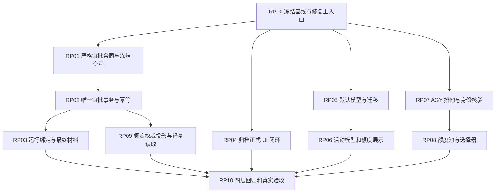
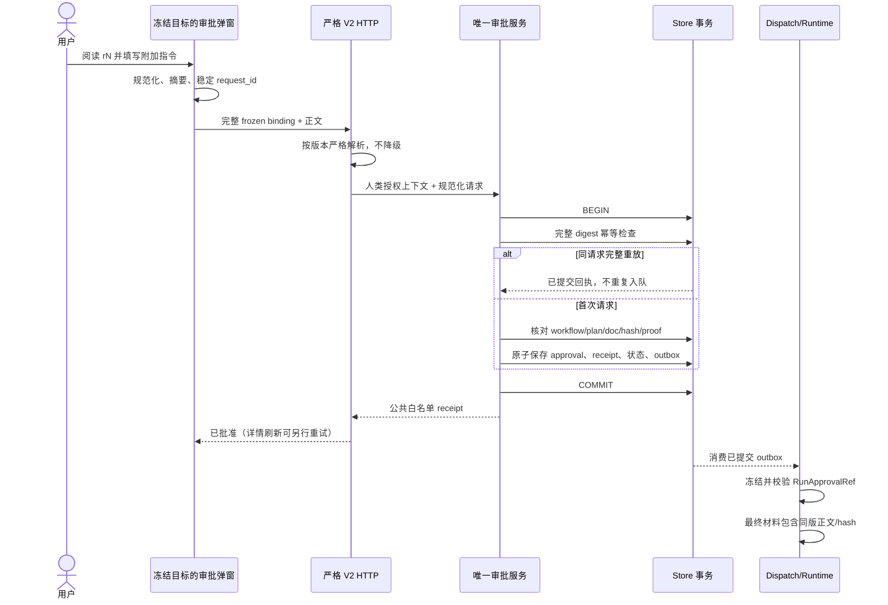
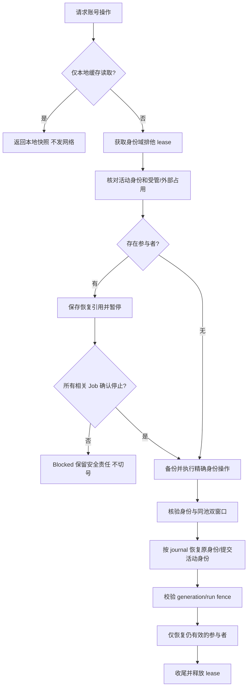

# DevFlow 工作台升级分支：代码质量审查与整改开发计划

> 审查日期：2026-09-24  
> 仓库：`zephyrw/dev-flow`  
> 待整改分支：`feat/workbench-upgrade-20260923`  
> 冻结审查提交：`97e23e7afa2397cf26a7998f4c53f7e995177b64`  
> 对比父提交：`1150e7ab88ac9a486406a1eca5bd81abce0928e2`  
> 文档用途：交给执行 Agent 做增量整改、回归与交付，不是要求重写整个项目。

## 0. 结论与执行边界

**当前提交不建议直接合并或作为已验收版本发布。** 已确认主页面未导入组件的阻断问题，并发现归档列表、非空审批指令、默认复核模型到新任务的传递、双行模型数据、账号排他控制、额度池选择和概览证据投影等跨层接线缺陷。部分单个组件或 helper 已实现，但正式页面→API→持久化→调度→最终模型输入的完整路径仍有断点。

本报告列出 **19 项源码缺陷**，并单列交付/测试缺口与真实环境待验证项。下文每个结论有具体定位和修复验收，不应把同一问题的多个反例当作互不相关的多个任务重复实现。

本次未修改远程分支。执行 Agent 应基于上述 feature 分支创建修复分支，保留已实现且正确的功能；不退回旧版界面、不删除安全门禁、不用删断言或硬编码“通过”换取绿灯。

### 0.1 已做与未做

| 项目 | 本次实际结果 |
|---|---|
| GitHub 分支、提交及主要变更源码读取 | 已通过连接器读取并冻结 SHA；同时对照上一版需求与计划 |
| 关键链路静态审查 | 已检查工作台接线、归档、审批、模型默认/运行展示、AGY、概览与相关测试 |
| 隔离逻辑验证 | 已执行 8 个检查：1 个正常控制样本、7 个缺陷观察；其中 5 个直接执行与 GitHub blob 相同的指令校验模块，2 个是准确对象构造/比较表达式的隔离复现 |
| Git clone / 依赖安装 | clone 因运行容器不能解析 github.com 失败；没有得到完整本地仓库，也没有安装仓库依赖 |
| 仓库 typecheck / build / Vitest / Playwright | **未运行**；不能将静态发现或隔离检查说成全套测试结果 |
| Windows 原生进程、凭据、真实 AGY 登录与双额度 | **未运行**；不得根据 fake host/fixture 宣称已打通 |
| OpenTabs 真实浏览器验收 | **未运行**；执行 Agent 必须补齐 |
| GitHub Actions | 查询此分支 runs 返回 0；CI 配置只触发 main push 或面向 main 的 PR。此事实不证明开发者从未本地测试，也不代表工作流本身坏了。[S29] |

隔离检查环境：Node `v22.16.0`、全局 TypeScript `5.8.3`。它们只用于局部模块转译和逻辑实验，不是仓库声明的完整构建环境。执行仓库测试时须遵循锁文件和 CI 的 Node `22.23.2`、pnpm `11.7.0` 配置，并核对 package.json。

### 0.2 证据等级

- **源码确认：** 已有真实文件及可追踪调用链，能定位确定性错误；尚不等于完成系统实测。
- **隔离复现：** 在受控内存 Store/表达式上实际触发已描述行为。复现范围明确，不能替代浏览器、数据库或真实 CLI。
- **真实环境待验证：** 缺少 Windows/官方登录/运行证据，属于验收门禁，不伪装成已复现缺陷。

## 1. 必须保持的需求与安全不变量

归档对象是 Workflow/任务，不是删除整个仓库项目。归档只写独立可见性元数据，隐藏菜单/总览条目及空项目分组；不改变 workflow.state/stage/version、run、执行配置、计划、审批、目录、Git 分支、工作树、资源占用或调度。归档运行中任务仍会运行；设置归档 Tab 能查阅与恢复。

设置保留“默认模型”和“归档”两个一级 Tab；默认模型包含规划、执行、复核，并清楚说明仅用于新任务。任务级临时修改入口保持独立，保留已有修复角色覆盖能力。用户草稿在一级 Tab 切换时不得丢失。

审批附加指令是用户批准该版计划的持续约束，不是随意一条聊天消息。批准、指令保存、human proof、receipt 与排队须原子；首次执行、相关测试/修复和同版恢复携带同一绑定。指令不能扩大路径/命令权限、跳过验收或使复核角色获得写权限。

AGY 身份操作严格按身份域串行。默认自动调度关闭时仍能手动录入，但跨账号激活、认证刷新、额度查询必须遵循真实进程/凭据排他条件。仅本地快照读取可无网络完成；不得轮询备用账号来“刷新界面”。首次双窗口未核验成功不进入自动调度，不能把未知额度设为满额。

右上角保留规划/执行两行固定职责；独立复核/修复另有紧凑标识。实际运行、下次配置、历史 observation 和不同账号的额度不能混淆。概览只展示有依据的背景/结论/任务/测试与进度，不能把开展当完成或过期证据当当前通过。

黄色提示不重新加入时间和冗余“查看执行过程”；右栏关闭时独立的执行过程入口仍保留。其它业务所需审批、指导和恢复操作仍可到达。

## 2. 缺陷总表

优先级：P0 为当前构建/启动阻断；P1 为本轮核心功能或身份/审批/结果完整性缺陷，合并前必须解决；P2 为可用性、准确展示和性能缺陷，也属于本轮验收范围。

| ID | 级别 | 问题 | 证据 |
|---|---|---|---|
| F01 | P0 | 主页面使用未导入的 ToolModelDialog，阻断工作台启动 | 源码确认 |
| F02 | P1 | 归档数据已落库，但实际侧栏和总览没有使用可见性过滤 | 源码调用链确认 |
| F03 | P1 | 填写非空审批指令后，前端空哈希占位值导致服务端拒绝审批 | 源码确认＋表达式隔离复现 ISO-06 |
| F04 | P1 | 审批弹窗显示的对象没有被提交回调锁定，存在错任务/错版本审批与重试失配 | 源码调用链确认 |
| F05 | P1 | 审批接口的非严格 union 会把非法 V2 指令静默降级成旧版空指令请求 | 源码合同确认 |
| F06 | P1 | 审批幂等摘要遗漏版本绑定，且两个审批入口的 proof 约束不一致 | 源码确认＋表达式隔离复现 ISO-07 |
| F07 | P1 | RunApprovalRef 校验只比较存储字段，没有验证正文和实际运行目标 | 精确源码模块隔离复现 ISO-01～ISO-05 |
| F08 | P1 | 审批附加约束没有覆盖所有实际材料构建路径 | 源码路径确认；全路径运行待验收 |
| F09 | P1 | 默认复核模型能保存，但从实际新建弹窗创建任务时会被重置为同规划 | 源码调用链确认 |
| F10 | P1 | 双行模型组件期待 execution_spec，但正式详情接口没有给它 | 源码调用链确认 |
| F11 | P2 | 当前模型高亮和额度归属没有严格使用活动运行事实 | 源码条件确认 |
| F12 | P1 | AGY probe 被错误归类为只读，跳过停机检查后仍切换凭据 | 源码调用链确认；Windows 复现必须用隔离测试 |
| F13 | P1 | 新的额度池解析和选择逻辑把任意池当 global，并忽略目标模型覆盖 | 源码调用链确认 |
| F14 | P1 | JWT 解码和本地 email 被当作已验证身份，并用于覆盖账号记录 | 源码确认；不等同于证明可绕过 Google 服务端认证 |
| F15 | P1 | 概览读取审批约束使用了错误实体名和主键，保存后显示不到 | 源码确认 |
| F16 | P1 | 概览重新发明了证据统计口径，可能把旧环境测试显示为当前通过 | 源码确认；具体生产数据需集成回归 |
| F17 | P2 | 设置一级 Tab 切换会卸载默认模型面板并丢失草稿 | 源码 React 生命周期确认 |
| F18 | P1 | 默认模型迁移改变了调用语义，却没有递增版本和更新时间 | 源码确认 |
| F19 | P2 | summary 接口先构造完整 detail，失去了原本的轻量读取意义 | 源码结构确认；未声称测得延迟数值 |

## 3. 缺陷详解与关闭标准

### F01 · P0 · 主页面使用未导入的 ToolModelDialog，阻断工作台启动

**证据：** 源码确认。来源：[S01]。

**定位：** `apps/web/src/main.tsx` 的顶部 imports 与文件尾部 `<ToolModelDialog ... />`。对整份文件检索该标识符，只有 JSX 使用，没有导入或本地定义。

**触发与后果：** 正常渲染 App 就会求值该组件标识符；`isOpen=false` 不会阻止标识符求值。按当前源码会产生未定义标识符的类型错误；跳过类型检查的前端构建也存在运行时 `ReferenceError`。这不是“点击后弹窗打不开”这么轻的问题。这里没有声称已运行仓库 `tsc`，结论来自完整文件的符号缺失。

**整改：** 恢复真实 `ToolModelDialog` 导入并保留任务级配置入口；检查本次抽组件过程中是否还有未导入/未定义引用。不要删除该 JSX 或把任务工具按钮改为打开全局默认设置来消除错误。

**验收：** typecheck、生产 build 均通过；在生产构建中打开总览与已有任务无 `pageerror`；点击右上角规划、执行、独立复核和“工具与模型”，打开当前任务对应角色配置。只改当前任务时，全局默认保持不变。

### F02 · P1 · 归档数据已落库，但实际侧栏和总览没有使用可见性过滤

**证据：** 源码调用链确认。来源：[S01]、[S02]、[S03]、[S04]。

**定位：** `main.tsx` 的首次加载、`refresh()`、notifications 更新全部请求 `api("/workflows")`；`server.ts` 无 visibility 时按兼容合同返回全部。侧栏仍 `projects.map(...)`，没有过滤空项目分组。

**后果：** 归档后刷新列表仍返回该任务，条目不会稳定从菜单消失；项目最后一个可见任务归档后仍显示空分组。独立 metadata 的实现方向正确，缺的是正式页面读链路。

**整改：** 增加一个统一的 Web 列表加载器，所有 Web 菜单/总览调用显式传 `visibility=visible`；不要改变无参数 API、`Engine.list()`、scheduler/recovery 的“全部任务”语义。项目导航由可见任务集合派生，已归档详情仍能经归档面板打开，不自动恢复。

同时修复归档异步交互：GET visibility 失败应直接报错，不默认 revision=0 继续 PUT；按完整 payload 保留 request_id；迟到的 A 归档回调只在当前仍选中 A 时清空选择，不能把用户刚打开的 B 关闭。归档 receipt 摘要应覆盖 expected_visibility_revision，参数变化必须形成新请求。

**验收：** 两窗口、刷新、重启、恢复后再归档均正常；归档/恢复前后 workflow 实体、业务 version、run、spec、目录、分支和调度队列保持原样。活动任务明确提示仍继续运行，不能为了隐藏而调用 stop。

### F03 · P1 · 填写非空审批指令后，前端空哈希占位值导致服务端拒绝审批

**证据：** 源码确认＋表达式隔离复现 ISO-06。来源：[S01]、[S02]、[S11]。

**定位：** `main.tsx::approve()` 在非空正文时发送 `extra.execution_instructions_hash = ""`；`PlanApprovalService.approve()` 将 binding 与“真实正文摘要的 extra”或“空 extra 对象”做整对象比较。

**结果：** `{execution_instructions_hash:""}` 既不是包含真实 SHA-256 的对象，也不是 `{}`。空字符串虽绕过前一个 truthy 判断，后面的完整 binding 比较仍失败，抛 `BINDING_CHANGED`。因此空指令和非空指令不是同一条可用链路。隔离比较已经确认此不等式；尚未运行真实 HTTP/浏览器。

**整改：** 按本文第 5 节的唯一 V2 合同实现：前端按同一规范化规则计算真实摘要，后端重新计算并核对，human proof 绑定该摘要。不能通过删掉 hash 比较、忽略 extra 或强制使用旧空 binding 来“修好”。

**验收：** 真实页面填写中文、多行、空行、代码块与首尾空白，批准成功且入队一次；持久正文、摘要、最终执行材料一致。错误摘要明确拒绝，不能提示成泛化的“计划变化”。

### F04 · P1 · 审批弹窗显示的对象没有被提交回调锁定，存在错任务/错版本审批与重试失配

**证据：** 源码调用链确认。来源：[S01]、[S10]。

**定位：** 弹窗传入 `planApprovalTarget` 的 id/version/plan_revision/hash，但 `onApprove` 最终调用主页面 `approve()`；该函数读取的是执行时最新的 `selected` 和 `detail.workflow`，不是冻结目标。每次提交又新建 `crypto.randomUUID()`。

**触发：** 弹窗打开后实时刷新使 r1 变为 r2，或当前选择因其他操作变为另一任务；弹窗仍显示旧目标，但提交使用新对象。响应丢失后重试会创建另一请求，无法重放已提交回执。

**整改：** 定义不可变 `ApprovalTarget` 和 `ApprovalDraft`。提交函数显式接受冻结目标，不闭包读取全局 selection/detail；目标变化时标记 stale、禁用批准并保留文本供重新核对。相同规范化完整 payload 的重试复用 request_id；修改正文/目标后才换新 ID。将 executorProfileDescription 从真实 execution spec 构造，不读取不存在的 `workflow.role_overrides.executor`。

**验收：** 弹窗 r1、后台 r2 时只能拒绝旧目标，不能自动批准 r2；打开 A 的弹窗后切换到 B，B 不产生 approval；超时重试只有一个审批和一个 dispatch。刷新失败不应把已批准误报成重新审批失败。

### F05 · P1 · 审批接口的非严格 union 会把非法 V2 指令静默降级成旧版空指令请求

**证据：** 源码合同确认。来源：[S02]。

**定位：** `/api/workflows/:id/approve` 使用两个非 strict `z.object` 的 union：第一个接受 V2 指令，第二个只要求 binding。第二个会剥离其余字段。

**触发：** 发送合法旧式空 extra binding，但 `schema_version=2` 且正文超过 20000 字符、scope 非法或 instructions 类型错误。第一个分支失败后，第二个仍可能仅保留 binding 而成功；调用服务时正文变成空字符串。这里的结论是 schema 语义和后续取值的确定性推导，未运行该 HTTP 请求。

**整改：** 先按版本分支再执行各自 strict schema；声明 V2 的请求永远不回退到 V1。V1 只允许旧合同字段并明确无附加指令；V2 必须要求 request_id、完整绑定和严格指令对象。超长、错误类型、未知字段、无效 scope 必须 4xx 且零副作用。

**验收：** 非法 V2 请求不得写 approval/proof receipt/outbox；不得清掉用户指令后批准。把 API 负向测试放在真实 Fastify 路由上，不只测单独 Zod schema。

### F06 · P1 · 审批幂等摘要遗漏版本绑定，且两个审批入口的 proof 约束不一致

**证据：** 源码确认＋表达式隔离复现 ISO-07。来源：[S11]、[S13]、[S32]。

**定位：** `PlanApprovalService` 的 requestDigest 只有 workflowId、documentId 和 instructionsText，没有 binding、计划版本/hash、文档 revision/hash、expectedVersion。服务又允许非空指令使用默认空 extra binding。`Engine.approve()` 仍保留第二份审批实现，按调用者 extra 构造 expected binding，并不把 options.instructions 与该 extra 严格绑定。

**后果：** 相同 request_id、相同正文但不同计划目标会命中旧 receipt，返回旧批准结果；不同入口可对同一审批条件采用不同的完整性检查。文档审批还把 feedback_cursor 固定写 0，损失原审批的反馈游标语义。审批响应模型包含内部 proof 字段，公共 DTO 应去掉；已消费 proof 的暴露不等于可复用登录凭据，不应夸大。

**整改：** 只保留一个具有权限校验的审批事务核心；Engine/API/文档入口做兼容适配。digest 对完整规范化语义请求计算，包括所有冻结目标字段、指令正文摘要、文档/反馈绑定，不包含瞬态 proof 值。重放检查在状态校验前，但仅完全相同 payload 可重放。非空指令必须由绑定摘要的 proof 覆盖；不允许 empty-binding OR 绕过。内部 proof 不进入公开 DTO。

**验收：** 同请求同正文换 plan hash/revision、document hash/revision 或预期版本均冲突；同原请求在已排队后重放成功且不重复消费 proof/排队。通用、文档、内部兼容调用得到一致语义和审计记录。

### F07 · P1 · RunApprovalRef 校验只比较存储字段，没有验证正文和实际运行目标

**证据：** 精确源码模块隔离复现 ISO-01～ISO-05。来源：[S12]、[S13]。

**定位：** `verifyAndResolveExecutionInstructions()`。

已在与 GitHub blob 完全匹配的 138 行模块上确认：修改正文但保留旧 text_hash 会被接受；随便换 approval_id 会被接受并出现在 payload；currentPlanRevision/currentPlanHash 换成新计划仍接受旧引用；run.plan_revision 与 ref 不一致也通过；新格式审批记录无 ref 时直接走兼容分支读取正文。该函数的 currentPlanHash 参数没有参与校验。

**整改：** 校验真实 record ID、workflow 归属、run/ref/approval 的计划版本和正式 hash，以及根据规范化正文重新计算的 SHA-256。不能只检查“ref.hash 等于 record.hash”。生产派发时还要校验本次可执行目标的批准计划；历史只读展示需单独 API，不能共用放宽后的派发校验。V2 新运行缺 ref 是完整性错误；只有明确识别出的旧格式运行/审批才能走空指令兼容路径。

**验收：** 以上五类反例全部拒绝、无模型进程启动，返回稳定 FlowError 错误码；正确同版恢复正常。中断恢复不能靠生成新指令记录或补一个任意 ref 掩盖缺失。

### F08 · P1 · 审批附加约束没有覆盖所有实际材料构建路径

**证据：** 源码路径确认；全路径运行待验收。来源：[S14]。

**定位：** 仅 `executeMaterials` 与 `reviewMaterials` 新增约束读取；`resolveMergeConflict()` 单独创建 materials，直接 invoke，没有加入 approved_execution_instructions 或正文。`continuationMaterials()` 的意图澄清分支还会覆盖 instructions 字符串，需要检查结构化约束是否确实进入最终适配器输入。

**后果：** 主开发收到的用户约束不代表合并冲突修复也收到。已有 API/Helper 测试不能证明暂停、换号、会话重建、legacy runtime、子 Agent 和不同 purpose 都完整交接。此项不宣称这些路径全部已实测失败，确认的是至少 merge-conflict 材料路径漏接。

**整改：** 建立统一、不可被后续对象展开覆盖的材料装配步骤：先获得冻结 RunApprovalRef，经 F07 校验后把约束加入 typed materials；每个执行类 purpose 和最终适配器入口都检查附件。复核仅作为只读验收依据。legacy 路径选择明确适配或阻止带 V2 约束的任务走不支持路径，不能静默继续。

**验收：** 用 fake adapter 捕获最终 argv/stdin/HANDOFF 输入，而非手工调用 helper；逐项覆盖 implement、executor_test、functional_fix、review_fixer、planner_takeover、merge_conflict、quality_review、重试及换号恢复。同任务同版摘要不变，不串另一任务。

### F09 · P1 · 默认复核模型能保存，但从实际新建弹窗创建任务时会被重置为同规划

**证据：** 源码调用链确认。来源：[S07]、[S08]。

**定位：** `CreateWorkflowModal.applyDefaults()` 只接收 planner/executor/revision，并 `setOverrides(inheritOverrides())`；它忽略 `getModelDefaults()` 返回的 reviewerBinding。提交时总是发送这份 role_overrides。后端 `resolveCreateProfiles()` 明确以请求中的 role_overrides 优先，只有缺省时才用默认 reviewer。

**触发：** 全局默认规划 P、执行 E、独立复核 R；直接用 Web “新建”而不手动重新选 R。生成的 reviewer 变成 inherit(P)。这正是用户要求的三阶段默认链路未闭环。

**整改：** 使用共享 defaults→draft/spec 映射函数，创建弹窗完整载入 reviewerBinding，继承/独立选择语义与任务临时修改一致；区别“用户明确选 inherit”与“没有提供 override”。不能让后端无条件覆盖用户明确选择来修复前端漏字段。

**验收：** 真实 Web 创建后读 persisted spec/resolved_roles，并让一次受控 review run 实际绑定 R；修改全局默认后旧任务仍保持原冻结配置。API 省略 override 与用户显式 override 两条路径都回归。

### F10 · P1 · 双行模型组件期待 execution_spec，但正式详情接口没有给它

**证据：** 源码调用链确认。来源：[S01]、[S02]、[S13]、[S15]、[S16]。

**定位：** `projectRoleRuntime()` 从 detail.execution_spec / workflow.execution_spec / detail.planner_profile 等字段取配置；`Engine.detail/summary` 和正式详情 HTTP 响应没有这些字段。`CurrentRuntime` 自身不加载 execution spec。main 中唯一 `getExecutionSpec` 调用只在 STOPPED 状态读取 resume label，并没有把返回值补入 detail。

**后果：** 只有活动 observation 可以补出当前模型，另一行或暂停后的两行会显示未配置，即使任务已有完整 spec。手工在单测 fixture 填 execution_spec 可以遮蔽正式 API 断线。

**整改：** 定义明确的 `WorkflowDetailResponse`/`RuntimeRolesView`，由服务端复用执行配置解析服务提供只读 resolved roles 与当前 frozen run；summary 也提供轻量配置摘要。或增加独立 typed 请求并处理加载/失效/乱序，但不能从缺失字段猜。消除相关路径的 any，并使客户端组件参数与真实 API schema 共享。

**验收：** 直接使用生产 buildServer 返回的 DTO 渲染组件，不额外手填 spec。无 observation、暂停、等待批准、归档详情、刷新均显示正确规划/执行配置；未知状态应显示“加载中/不可用”，不能错误声称未配置。

### F11 · P2 · 当前模型高亮和额度归属没有严格使用活动运行事实

**证据：** 源码条件确认。来源：[S15]、[S16]。

**定位：** `role-runtime.ts` 的活动判定主要依赖 workflow 非终态和 run_id，没有完整要求当前 Run 为 running；PLAN_PENDING 不是其暂停/终态，已完成规划 Run 可以被高亮。`isProfileEquivalent` 只比较部分字段，把非 explicit reasoning 都折叠为空值，未纳入 provider/account/executable 等实际调用语义。部分 reviewer/fixer 判断用可编辑配置而非当前冻结调用。

**后果：** 用户可能看到已经结束的模型仍“当前”；同名模型但不同账号/提供者可能被认为同一配置。断线/暂停时 quotaTarget 默认指向规划，而组件仍读上一 observation 的 quota，存在标签与实际来源不一致的路径。

**整改：** 活动高亮以当前 task/run/conversation fence + Run.status + 实际 observation/frozen invocation 为准；pending spec 只标“下次生效”。语义等价比较复用路由层，不把 native-default 与 not-applicable 混为一类。额度与其来源 run/adapter/account/model/pool 整体绑定；无法证实时只显示未知或明确标记的历史来源，不挪给另一行。

**验收：** 规划完成等待批准不高亮为运行；两行同名仅实际职责高亮；独立复核显示 compact badge；断线、停止、provider 切换、账号切换及 pending revision 均无错误高亮或额度串用。

### F12 · P1 · AGY probe 被错误归类为只读，跳过停机检查后仍切换凭据

**证据：** 源码调用链确认；Windows 复现必须用隔离测试。来源：[S18]、[S24]。

**定位：** `executeAccountOperation()` 的 `isReadOnlyEnrollOrProbe` 把所有 `op.kind === "probe"` 及 capture_current 放进豁免分支，跳过消费者占用、quiesce、confirmStopped、受管进程确认和活动凭据一致性检查。但 probe 的后续分支仍对目标账号调用 `activateSaved()`，变更 auth_epoch 并查询、恢复凭据。

**触发：** 受管模型进程仍使用账号 A 时，手动查询账号 B 额度。进程的网络执行不因 account coordinator 串行排队而自动暂停；它可能与 B 的凭据激活重叠。仅检查 external processes 不能覆盖已登记的 managed processes。

**整改：** 删除基于操作名称的“probe 只读”豁免，按真实副作用统一获得身份域排他权。跨账号探测必须保存参与者→暂停→确认整个受管进程/Job 停止→核对旧凭据→激活目标→验证→恢复→提交→按 fence 恢复参与者。capture_current 若执行认证型 usage/refresh，同样需要明确可并存条件；不能跳过凭据一致性检查。纯读取本地缓存才是真正只读。

保留自动调度关闭仍可手动录入的需求：零参与者 one-shot 可独立收尾，不需要把 desired_enabled 改 true。修复不能退回“先打开自动调度才能添加账号”。

**验收：** 受管 A 活跃时 probe B，activateSaved 在所有相关进程确认停止前调用次数必须为 0；停止不确定时 blocked、不释放锁、不启动下一账号；取消/外部变更/跨窗口/full+accounts 竞争都保持串行和原凭据。

### F13 · P1 · 新的额度池解析和选择逻辑把任意池当 global，并忽略目标模型覆盖

**证据：** 源码调用链确认。来源：[S19]、[S21]、[S22]、[S23]。

**定位：** parser 按池名猜 `gemini-*` 或 `*`，顶层 windows 优先取 Gemini Models；selector 把遇到的第一份 snapshot 额外挂到 global，并在 required pool 为 global 时直接放过模型覆盖。重复窗口行没有拒绝，取 `.find()` 的第一项。enrollment 将不同池的窗口拼入 allWindows 判断完成，后续无匹配池时还能构造全局回退。

**后果：** 当真实数据分别报告不同模型池时，目标模型已耗尽却可能使用另一池余量评估；倒换快照顺序会改变结果。第一份 global 别名可能保持旧快照而忽略后来的新余额。不能把“界面有两个数字”当成“目标执行模型的双额度已确认”。

**整改：** 建立经同版本真实输出证据支持的 quota scope 模型。官方确证共享时才允许 global；否则保留 pool_id、明确 model coverage 与未知状态。两个窗口必须来自同账号、同凭据代次、同有效池/同次 observation，不跨池拼装。按 observed_at 和稳定序列选择每池最新事实；重复或矛盾窗口拒绝，未知 reset 不编造。不要为了通过测试一律写成 global / * / 100%。

**验收：** Gemini 有余额而目标 Claude/GPT 池为零必须排除；快照输入顺序不影响结果；同池新零余额覆盖旧非零；重复 Weekly/Five Hour、未知模型覆盖、缺一窗口均不进入自动执行池。只有本地快照读取时不得顺便轮询备用账号。

### F14 · P1 · JWT 解码和本地 email 被当作已验证身份，并用于覆盖账号记录

**证据：** 源码确认；不等同于证明可绕过 Google 服务端认证。来源：[S19]、[S20]。

**定位：** `auth-metadata.ts` 只 Base64URL 解码 JWT payload，没有做签名、issuer/audience/有效期/主体校验；也接受本地 JSON 的 email。满足若干字段存在条件就设 metadata_status=verified。`enrollment.capture()` 优先信任 active.auth.email，注释称“已签名的身份”，随后写 identity.verified_at 和 last_authenticated_request_at，并按 email 匹配、保存既有账号的新 secret_ref，独立 usage 核验在之后。

**风险边界：** 后续 usage 仍会核对其返回邮箱，不能据此断言任意伪造账号都能登录或立即 ready；但本地未认证 claim 已经被标为 verified，并可能在远端失败/不一致前覆盖旧已验证账号的凭据引用。

**整改：** 将 decoded/local metadata 与 authenticated identity 分开。未经验证的 claim 仅作候选展示/提示，不写已认证时间。优先复用能给出本次真实身份的官方验证结果；若确需 JWT 验证，必须有可信 key/iss/aud/时间/主体的完整合同，不自行把 decode 命名为 verify。候选凭据先保存到独立 pending enrollment；与现有账号合并、替换其 secret_ref，须等主体一致且核验成立后原子提交。失败保留新候选但保护旧账号，不能丢失授权。

**验收：** 无签名/错误签名/过期/错误 issuer、本地 email 与远端主体冲突、远端失败均不会产生新的 identity.verified_at 或覆盖旧 ready 账号。仅 JWT 解码成功不算真实登录验收。

### F15 · P1 · 概览读取审批约束使用了错误实体名和主键，保存后显示不到

**证据：** 源码确认。来源：[S11]、[S13]、[S25]。

**定位：** 审批真实写入 `store.put("approval", `${workflowId}-${revision}`, ...)`；`workflow-overview.ts::resolveExecutionConstraints()` 却读取 `store.get("plan_approval", `${workflowId}:${revision}`)`。

**后果：** 新建的审批附加指令无法经概览展示；两个键都不一致。不能因为 unit test 人工向错误表写了 fixture 而认为生产链路已通。

**整改：** 抽一个权威 ApprovalRepository/reader，审批、runtime、overview 共用 canonical ID 与读模型。概览读取时验证 plan hash、正文摘要与归属；不新建 plan_approval 影子副本来补 UI。公共摘要只暴露用户正文和必要绑定，不返回 proof。

**验收：** 走正式审批 HTTP 写入，再调用真实 workflow detail，execution_constraints 正确显示同版正文/hash；旧版、无指令、已换计划、缺失/错误记录返回明确空态或完整性错误，不显示别版内容。

### F16 · P1 · 概览重新发明了证据统计口径，可能把旧环境测试显示为当前通过

**证据：** 源码确认；具体生产数据需集成回归。来源：[S25]、[S26]、[S27]。

**定位：** `buildTests()` 只按 item/test ID 和 plan_revision 选数组最后一项，不使用 `latestEvidence/progressEvidence` 的时间、snapshot、environment、stale 条件，也不读取已有 test_progress.cases。原 `testProgress()` 明确校验这些事实。

**反例：** 同计划版本、旧 environment_revision 的 status=passed 证据，概览直接 passed；主测试进度应 stale。更晚的失败证据不保证位于数组最后时也可能取错。带 stale 状态的证据在该投影中可能退回 pending，丢失“曾通过待复测”含义。这里不把“测试项数”和“计划 case 数”强行当同一分母，应分别命名。

附带来源缺陷：旧 decisions 合同是 question/answer/source，新代码却读 decision/title/summary 和 rationale/reason，真实旧决策会丢失；Markdown 按正则逐行扫描，不识别 fenced code，示例里的“## 调研结论”可被当真实章节，并一律标 confirmed；view_revision 摘要只含汇总计数，同数量任务交换状态时可能不变。

**整改：** 复用权威证据投影，定义 native acceptance、legacy tests、case 执行三个清晰层级；状态使用 passed/failed/stale/pending 的真实来源，不凭布尔字段近似。旧 decisions 按正式 schema 映射。Markdown 使用 AST 或明确已测试的 fenced-code-aware 解析，章节提取标注来源/未验证属性，不把所有文本断言为事实。view_revision 对实际对外投影语义计算，而非只对计数。

**验收：** 同计划旧环境、旧 snapshot、stale、证据乱序、较新失败、相同计数但条目状态变化、native 8/8开展0/8交付全部准确；代码块假标题不进入调研；缺数据不造进度。

### F17 · P2 · 设置一级 Tab 切换会卸载默认模型面板并丢失草稿

**证据：** 源码 React 生命周期确认。来源：[S05]、[S06]、[S33]。

**定位：** SettingsDialog 按 activeTab 条件挂载 DefaultModelsPanel，而草稿完全保存在该子组件内部。切换归档后卸载，切回重新从服务端载入；父组件的 isDirty 不保存草稿。子组件“取消”直接调用 onClose，也绕过 AppDialog 内部关闭确认。

**整改：** 将三角色草稿、基线 revision、request_id、dirty/保存中状态提升到稳定容器或独立 store；也可保持面板挂载并使用可访问的 hidden 切换。所有关闭入口使用统一 requestClose，保存期间避免切 Tab 卸载导致迟到回调关闭新面板。归档查询和恢复不能依赖草稿保存。409 按具体错误码分类，不把所有冲突都称为默认版本冲突。

**验收：** 改三角色→切归档→恢复一项→切回，草稿原样保留；Esc、叉号、取消和切换目标都遵循相同丢弃确认；服务器冲突重载的是完整远端配置，不仅换 revision。

### F18 · P1 · 默认模型迁移改变了调用语义，却没有递增版本和更新时间

**证据：** 源码确认。来源：[S09]。

**定位：** migrateLegacyExecutorModel 将 legacy-import 的旧执行模型替换为新模型；getOrImport 将其写回，但保留 defaults.revision、profile.revision、updated_at。

**后果：** 同一个 defaults revision 对应了两个不同模型，破坏 CAS 和 source_defaults_revision 溯源。迁移前打开的旧表单仍可用相同版本覆盖迁移后配置。source=legacy-import 本身也不能严格证明原配置是用户从未选择过的“自动预填值”，因此不能把型号字符串相等当成完整迁移授权。

**整改：** V1→V2 结构迁移与模型型号升级分开；前者保留原有 planner/executor 语义，只补 reviewer inherit。型号升级必须有明确产品策略或用户确认；采用持久、事务、幂等的迁移编号和单调 revision，更新语义变化的 profile revision 与时间。旧任务/Run 冻结内容不可跟着重写。新建配置默认值可更新，但不是静默改存量记录的理由。

**验收：** 重复 GET 不重复迁移；迁移前旧 revision 写入被拒；用户自定义/导入配置不被误改；旧 run/ref 不变；无法兼容的回滚在暂停写入、备份后显式处理。

### F19 · P2 · summary 接口先构造完整 detail，失去了原本的轻量读取意义

**证据：** 源码结构确认；未声称测得延迟数值。来源：[S02]、[S13]、[S25]。

**定位：** `/api/workflows/:id?view=summary` 先执行 engine.detail(key,false) 取 overview，再 engine.summary(key)。detail(false) 仍会加载事件、runs、evidence、任务、文档和概览；false 只关闭部分文件检查，不代表轻量。前端随后又发完整 detail 请求。

**风险：** 首屏会重复聚合，而不是先显示轻量状态。大事件历史和高频刷新下出现额外数据库/CPU 成本；具体耗时必须压测，本审查没有给出未经测量的毫秒结论。

**整改：** 为 summary 提供真正轻量的 typed 摘要（workflow、当前 run/config、可信缓存版 overview revision），禁止在 summary 内调用 detail。概览可独立端点或按 plan/evidence/approval 语义版本缓存；不随每条 token 重建。缓存失效按真实领域数据变化，不靠 workflow.version 单字段。

**验收：** 单测用 spy 断言 summary 不调用 detail；集成统计读取集合/查询次数；大任务基准记录修改前后首屏与完整详情延迟。任务切换和迟到响应不能串页。

## 4. 实施顺序与任务包

### 4.1 建议分支与前置操作

先核对远端 feature 分支 HEAD。若不再是本报告 SHA，先比较新增提交，把已修问题标为“已由新提交解决并回归”，不要机械重复修改。不要把主分支另一批功能的当前状态误当这次 feature 的审查对象。

建议基于 feature 新建 `fix/workbench-upgrade-quality-20260924`。使用新的 worktree；保留主工作区未提交修改，不做 reset、clean、stash、删除现有 worktree 或自动合并。所有测试只使用受控临时仓库、测试数据库与 fake host，除非进入明确授权的真实账号验收。

每个任务包必须交付：修改文件列表、缺陷复现、回归用例、实际执行命令和退出码、未执行原因。不能仅写“Wxx 完成”或把新组件已生成当功能已完成。

### 4.2 任务依赖



可并行的是隔离的开发工作包，不是同一身份域的 AGY 登录/额度/切号。共享的 contracts、main.tsx、server.ts、engine.ts 由明确集成人负责，先合并合同再实现两端，避免同文件并行互相覆盖。

### RP00：基线、构建和测试入口（关闭 F01，建立后续基线）

**修改：** `apps/web/src/main.tsx`；必要时补充现有 E2E 的生产启动 smoke，用明确文件名记录。

恢复 ToolModelDialog 导入，先跑 typecheck/build 和最小启动，再开始其它缺陷的真实链路回归。记录原分支基线的失败与本次引入的失败，不将所有旧测试失败直接豁免。修改前检查 `.github/workflows/ci.yml` 与锁文件，使用仓库约定工具版本。

**完成条件：** 生产页面可启动；任务级工具配置、全局设置、创建弹窗、归档入口、批准弹窗都可到达。F01 修复不是其它缺陷已关闭的证据。

### RP01：审批 HTTP 合同与冻结的前端提交（F03、F04、F05）

**修改：** `packages/contracts/src/plan-approval.ts`、`apps/api/src/server.ts`、`apps/web/src/components/PlanApprovalDialog.tsx`、`apps/web/src/main.tsx`。建议新增一个共享前端 `plan-approval-api.ts`，不要继续把 schema/hash/请求重试分散在 App 内。

实现第 5 节的严格 V2 请求，明确 legacy 兼容。对冻结目标创建完整 draft，统一正文规范化，真实计算 hash；稳定 payload 对应稳定 request_id；按细分错误码展示。目标过期时只保留草稿供审阅，不把用户打开的 r1 自动替换成 r2 并批准。提交与刷新解耦：已收到批准 receipt 后，详情刷新失败应提示“已批准，详情待刷新”。

**完成条件：** 通过真实 HTTP 和实际组件交互而不是只测 helper；非空正文可批准，非法正文零副作用，跨任务/换版/重试不误批准。

### RP02：统一审批事务和完整请求绑定（F06）

**修改：** `packages/core/src/plan-approval-service.ts`、`packages/core/src/engine.ts`、`packages/core/src/document-service.ts` 与所有现有审批调用方。建议新增/抽取 `ApprovalRepository`，复用实体名 approval 和现有主键；不另设影子表。

把两个审批实现收敛为一个域操作；公共 HTTP 仍经过 human 检查，内部调用不能自行绕过证明。将规范化完整 binding、文档绑定、反馈游标、指令正文/hash 纳入幂等摘要。事务中一次完成 proof 消费、审批记录、状态流转和 outbox；事务提交后才触发 dispatch。失败注入验证无半笔记录。公共 response 通过白名单 DTO，不返回 proof。

**完成条件：** 所有批准入口语义一致；同请求完整重放唯一，目标字段改变即冲突；审批/指令/outbox 原子；旧空指令用户体验兼容。

### RP03：RunApprovalRef 与最终调用材料（F07、F08）

**修改：** `packages/core/src/execution-instructions.ts`、`packages/core/src/engine.ts`、`packages/runtime/src/profile-runtime.ts`；沿实际调用图检查其它 runtime/recovery/child handoff，按必要范围修改，报告中列出。

实现第 6 节的严格绑定不变量。不要仅增加字段存在判断；应重新计算正文摘要，并把 run/ref/approval/实际计划对应起来。将约束材料装配纳入最终 invocation 检查，覆盖 merge-conflict 等独立路径。新建 run、retry、resume、账号恢复和会话重建共用绑定读取；旧运行兼容必须显式识别版本。

测试 fake adapter 捕获真实生成的 HANDOFF/stdin/argv 指向材料。对于任何绕过新材料层的 legacy 路径，要么补接，要么明确阻止带非空 V2 约束任务继续，不允许静默降级。

**完成条件：** ISO-01～05 反例成为仓库真实回归并拒绝；整条审批→dispatch→invoke 流程读取正确约束；模型遵循行为与“材料已送达”分别验证。

### RP04：归档读写闭环与异步导航（F02）

**修改：** `main.tsx`、`WorkflowArchiveAction.tsx`、`ArchivedWorkflowsPanel.tsx`、`workflow-visibility-service.ts`、现有 visibility routes。建议把 Web 列表请求和导航派生抽成 typed hook/service。

统一 visible 列表，不动 Engine.list。空项目分组由 visible tasks 派生；归档详情可读；恢复后新 revision 正确回读。修复异步 callback 捕获、GET 失败、幂等摘要和错误 DTO。归档列表从真实 Project/Workspace 补充项目名、分支/目录信息，不读不存在的 workflow.branch；分页应稳定排序并验证 cursor 非负，必要时用 `(archived_at, workflow_id)` 游标，不无限加载全部信息。

**完成条件：** 归档的“只改变可见性”经 DB/Git/进程 spy 验证；两窗口、刷新、重启、快速切任务、归档面板分页完整可达。

### RP05：三阶段默认、创建接线、草稿及版本迁移（F09、F17、F18）

**修改：** `CreateWorkflowModal.tsx`、`DefaultModelsPanel.tsx`、`SettingsDialog.tsx`、`model-api.ts`、`create-workflow.ts`、`model-defaults-service.ts`、必要的 model routing contract。

抽取 defaults→draft/spec 的共享映射，保留 reviewerBinding 和原有修复 overrides，建立字段完整 round-trip 测试。提升默认草稿到不会被 Tab 切换卸载的位置，统一关闭和保存期间的行为。结构迁移不夹带模型升级；需要的语义迁移有 ID、备份和单调版本，不修改已有任务。

**完成条件：** Web 新建的真实 review run 使用独立默认 R；临时修改任务不回写全局；同规划与单独选择均正确；草稿切 Tab 保留；迁移后旧 CAS 被拒，重复启动幂等。

### RP06：运行角色 DTO、活动高亮与额度归属（F10、F11）

**修改：** `engine.ts` 或独立读模型服务、`server.ts`、`role-runtime.ts`、`CurrentRuntime.tsx`、`model-display.ts` 必要的语义函数及类型。

正式接口返回组件真正使用的配置数据；复用已有 resolved_roles / active_run / pending_roles，避免第三套猜测。优先可单测的纯投影，但输入必须等于正式 API schema。高亮按真实活动 Run；额度绑定完整来源，历史/断线独立标识。独立 reviewer 不偷换 planner 行。

**完成条件：** 无 observation 时两行仍显示配置；已结束/待审批不假装运行；相同 model 名、不同账号/提供者、pending spec、独立 reviewer 都正确。

### RP07：AGY 副作用分类、排他流程和可信身份（F12、F14）

**修改：** `agy-accounts/src/service.ts`、`enrollment.ts`、`auth-metadata.ts`、必要的 ports/contracts、`agy-workflow-bridge.ts`。严格控制公开 DTO 和日志脱敏。

恢复对真实 credential mutation/认证 probe 的排他流程；无参与者 one-shot 保持自动调度关闭，避免重新引入旧录入卡死。将本地 claim、候选凭据、远端已认证身份分开，候选失败不能破坏既有 ready 账号。系统已持有 lease 并不代表所有模型网络请求都暂停，必须验证真实占用。

**完成条件：** fake process host 先确认 call ordering；Windows 受控账户再验证真实 Job/凭据时序；任何停止不明、外部变更或取消不越过排他屏障。

### RP08：额度合同、快照和自动选择（F13）

**修改：** `quota-parser.ts`、`account-probe.ts`、`selector.ts`、`enrollment.ts`、相关 quota DTO/视图，必要时复用 shared window validator。

用可追溯的 CLI 版本和脱敏原始输出固化格式；保留 scope，清除任意 pool→global 和无证据 wildcard 放行。统一 latest snapshot、双窗口、reset/unknown 与零余额规则；纯本地展示不产生网络。保留本轮已经修复的 usage CLI/host 超时预算一致性，不退回 15 秒截断。

**完成条件：** 不同模型池、乱序/重复/过期快照都不误选择；未知保持未知；real CLI parser fixtures 与 fake fixtures 区分来源。

### RP09：概览权威读取、证据投影和轻量 summary（F15、F16、F19）

**修改：** `workflow-overview.ts`、`progress.ts` 的复用接口（不破坏原语义）、`engine.ts`、`server.ts`、`WorkflowOverview.tsx`、必要合同。

统一审批读源；直接复用可信 evidence/case projection；补 legacy/native 数据映射，明确待复测，章节提取不读代码块假标题。view_revision 对实际可见数据计算；设计缓存失效条件。summary 不调 detail，避免首屏重复完整读取。

**完成条件：** 生产审批记录能展示；过期通过不会变当前通过；开展/交付/case/test execution 分母明确；长文本和窄屏可用；无新 LLM 调用或备用账号探测。

### RP10：完整回归、生产构建、真实浏览器与 Windows 验收

**修改：** 现有 unit/integration/e2e/live 测试和报告；CI 仅在需要时调整，不自行触发用户真实登录或扣额。

补齐第 8 节测试矩阵，保留原测试并增强断言，消除“手工塞正确数据”遮蔽真实接线的 fixture。打开指向 main 的 PR 可触发现有 CI；也可经项目约定增加手动 workflow_dispatch。不能把 feature push 未运行 CI 说成 CI 已通过。

必须运行编译后 API＋静态前端，不只 Vite；用 OpenTabs 操作实际页面验证完整链路。真实 AGY 登录必须在用户授权的 Windows 环境做，失败/未执行如实保留。所有工作包的 P0/P1 未关闭前不能发布。

## 5. 审批合同和事务的确定实现要求

### 5.1 V2 请求

下面为整改后的合同示意，需在共享 Zod schema 中落实，不能仅作为文档存在。严格区分空指令和非法指令；V2 的空正文也使用 SHA-256(规范化空串) 并在 binding 中明确绑定。

```ts
interface PlanApprovalRequestV2 {
  schema_version: 2;
  request_id: string; // 新 V2 使用 UUID；legacy ID 通过明确的 V1 适配处理
  binding: {
    workflow_id: string;
    action: "approve";
    version: number;
    plan_revision: number;
    plan_hash: string;
    snapshot_id: string | null;
    environment_revision: number;
    extra: { execution_instructions_hash: string };
  };
  execution_instructions: {
    text: string;
    scope: "approved-plan";
  };
}
```

正文规范化规则必须唯一：沿用已确认的换行/trim 策略，前后端结果逐字节一致；不擅自折叠正文内部空白或重排代码块。字符/UTF-8 字节长度限制要有明确区别，拒绝超限而不是截断后审批。浏览器 hash 只作一致性校验，服务端必须重新计算。

版本校验不依赖“提交时重新读取最新计划再批准”。HTTP 请求使用用户当时看到的 frozen binding，服务器比对当前任务和正式计划；不匹配就让用户核对。

### 5.2 原子边界



事务不能在中间 await 外部模型、登录或网络。业务状态变化、receipt 和 outbox 应同一事务；外部 dispatch 在提交之后调用并正确记录异步错误。授权 proof 不能由模型调用普通 helper 就自动获得；沿用现有人类权限边界。

### 5.3 幂等摘要

至少覆盖 workflow_id、action、预期 workflow version、plan_revision/hash、document_id/revision/hash（有则包含）、反馈游标、environment/snapshot 绑定、规范化正文和正文摘要。字段缺省与 null 的归一化统一，不能同一输入在客户端/服务端得到不同语义。

相同 ID 的不同 payload 返回专门的幂等冲突，不提示为“重新载入默认配置”。旧 receipt 只对应旧操作，前端不能将其中的旧 workflow 快照覆盖当前更高 version 的详情。

## 6. 运行材料与审批数据的一致性

建议审批读取统一提供两类明确接口：`readForDisplay()` 只读摘要；`resolveForDispatch()` 严格验证并返回不可变绑定。不要用一个“尽力回退”函数兼顾两者。

派发时应同时成立：

```text
approval.workflow_id == run.workflow_id == expectedWorkflowId
approval.id == run.approval_ref.approval_id == canonicalApprovalId
approval.plan_revision == run.plan_revision == ref.plan_revision
approval.plan_hash == authorizedPlan.hash == ref.plan_hash
SHA256(normalize(approval.instructions.text))
  == approval.instructions.text_hash == ref.instructions_hash
run 的本次 dispatch target 与 authorizedPlan 对应
```

上述最后一条应从现有调度/continuation fence 获得，而不是简单永远信任“当前最新计划”。合法历史只读查看不派发；合法同版恢复继续使用旧已批准版本；新计划的执行不能拿旧 ref 蒙混通过。

建议稳定错误码：`APPROVAL_REFERENCE_MISSING`、`APPROVAL_RECORD_MISSING`、`APPROVAL_OWNER_MISMATCH`、`APPROVAL_PLAN_MISMATCH`、`APPROVAL_INSTRUCTIONS_TAMPERED`。错误时不启动模型、不吞异常回退成空正文，不把原任务标为完成。

原指令正文应进入最终材料的独立字段及有边界的提示分节。即使 intent clarification 覆盖通用 instructions，也不得覆盖结构化批准约束。复核读取同一内容作为只读验收依据；不是向复核发出修改代码的授权。

## 7. AGY 安全修复设计

### 7.1 不再用“probe”这个名字推断只读

| 操作 | 是否可能使用/改变活动身份 | 必要门禁 |
|---|---|---|
| 展示本地账号/额度快照 | 否 | 只读 Store，不访问 CLI/网络 |
| 读取本地 CLI version/help | 通常是本地能力准备 | 受管进程、明确命令、超时；不混入认证探测 |
| capture_current + official usage | 可能认证或刷新，需按实际 CLI 合同处理 | 域 lease、凭据一致性、占用策略；不能默认与模型调用并行 |
| probe 某备用账号 | 是：需要 activateSaved | 停止相关消费者、确认进程退出、备份、激活、验证、恢复 |
| 交互登录/reauth/switch | 是 | 完整独占操作及取消/恢复日志 |



只读/写入分类必须能由具体 action 声明并被测试。跨 worktree 的多个 DevFlow 实例不能因数据库目录不同就各自认为独占：身份域锁应基于真实 Windows 用户/凭据作用域；沿用现有宿主设计并验证，不另起一套松散 JS mutex 取代 OS 互斥。

### 7.2 身份与额度证据

记录应区分：本地 claim（未验证）、已完成官方授权、本次远端身份核验、双额度观察、凭据安全保存和录入最终完成。`metadata_status` 若仅表达字段可解析，应改名或补充明确的身份置信度，不能被 UI/selector 当认证成功。

额度窗口与 `account_id + credential_revision/auth_epoch + scope/pool + observed_at` 绑定。代码确认可共享的 global 才是 global；不得根据“模型名字看起来像 Gemini”推导账号级额度。初次录入双窗口缺一仍为 pending_quota；已知零额度为 waiting_quota，不应误报登录失败。未知 reset 不能猜“5 小时后”或“下周同一时间”。

### 7.3 不损害原登录态

新授权失败时保存候选凭据供用户后续验证是允许的，但候选不可覆盖旧已验证账号身份。已知旧凭据、待核验新凭据与正式活动凭据用明确 journal 区分，取消和 crash recovery 依据真实状态执行，不只重置 DB phase。

任何未确认停止、外部身份变化或恢复失败都要阻断下一次激活，并给出可执行的中文错误信息。不得把底层字符串原样当成全部用户体验；诊断详情可以保留错误码、request/operation ID、版本和脱敏路径。

## 8. 必须补齐的测试矩阵

以下测试文件名可沿仓库约定合并，但测试 ID 和断言必须保留在最终报告。新增文件均为整改建议，不能假称当前分支已存在这些覆盖。

### 8.1 启动、归档与默认设置

| ID | 测试层 | 场景与必须断言 |
|---|---|---|
| BO01 | typecheck/build | 主页面所有 JSX 标识符可解析，生产构建成功 |
| BO02 | Playwright/OpenTabs | 总览与任务页无 pageerror，所有本轮入口可打开 |
| AR01 | unit/integration | 缺 visibility 默认可见，read 不写 workflow |
| AR02 | integration | 归档/恢复只改 visibility、receipt，不改业务 version/状态/run/spec |
| AR03 | Playwright/OpenTabs | 同项目一项归档只隐藏该项；最后一项归档隐藏空组 |
| AR04 | integration | Engine.list、恢复扫描、scheduler 包含已归档任务 |
| AR05 | Playwright/OpenTabs | 刷新、重启、另一窗口均保持可见性；归档详情可看不自动恢复 |
| AR06 | integration | 同 ID 不同完整 payload 冲突；同 payload 重放唯一 |
| AR07 | Playwright | A 归档请求延迟后切到 B，A 回调不关闭 B |
| AR08 | integration | GET visibility 失败不继续默认 revision=0 的写入 |
| AR09 | integration/UI | 恢复后再归档正确；分页跨页搜索无重复/漏项 |
| MD01 | unit/integration | 默认 reviewerBinding 读写完整，旧写省略不清空 |
| MD02 | Playwright＋integration | P/E/R 不同；Web 新建后 persisted spec 与实际 review run 使用 R |
| MD03 | integration | 显式 reviewer inherit 优先于全局独立 R，不被服务端覆盖 |
| MD04 | integration | 修改全局默认不改变旧任务、活动 run 和 frozen invocation |
| MD05 | UI | 任务级工具修改与全局默认分离，角色入口定位正确 |
| MD06 | UI | 编辑三角色→归档 Tab→返回，草稿/dirty/revision 保留 |
| MD07 | UI | 取消、Esc、叉号统一关闭确认；保存中切 Tab 不误关闭 |
| MD08 | integration | 结构迁移不更换模型语义；语义迁移版本单调且幂等 |
| MD09 | integration | 迁移前旧 revision 写入拒绝；重复 GET 不反复迁移 |
| MD10 | unit/UI | version conflict、idempotency conflict、account busy 不是同一错误提示 |

### 8.2 审批、指令与恢复

| ID | 测试层 | 场景与必须断言 |
|---|---|---|
| AP01 | HTTP＋UI | 空指令按明确 V1/V2 路径成功，旧体验不退化 |
| AP02 | HTTP＋UI | 非空中文/多行/代码块成功，前后端规范化 hash 相同 |
| AP03 | HTTP | 非空正文的空 hash/错误 hash 拒绝且无排队 |
| AP04 | HTTP | V2 超长、错误类型、未知 scope 不回退 V1 |
| AP05 | HTTP | V2 未知字段和缺 request_id 明确拒绝 |
| AP06 | integration | 同请求完整重放只产生一个 approval/dispatch |
| AP07 | integration | 同 ID 改计划 revision/hash、binding version 或文档 revision/hash 均冲突 |
| AP08 | UI | 弹窗 r1 后服务器 r2，不自动批准 r2；文本保留待核对 |
| AP09 | UI | 弹窗 A 后选择 B，B 不能被该回调批准 |
| AP10 | HTTP＋UI | 响应丢失重试同 ID；批准成功但刷新失败不重复批准 |
| AP11 | integration | 通用、文档、内部审批入口 proof/digest 语义一致 |
| AP12 | integration | proof 消费/approval/receipt/outbox 任一步注入故障整体回滚 |
| AP13 | integration | 文档反馈游标、hash 与 revision 正确保留 |
| AP14 | integration | 公共审批 DTO 不返回内部 proof |
| RI01 | unit/integration | 改正文保留旧 text_hash：拒绝（ISO-01） |
| RI02 | unit/integration | 错 approval_id：拒绝（ISO-02） |
| RI03 | integration | 当前执行目标新计划、旧 ref：拒绝（ISO-03） |
| RI04 | unit/integration | run.plan_revision 与 ref 不同：拒绝（ISO-04） |
| RI05 | integration | 新 V2 run 缺 ref：阻断；明确旧格式运行才兼容（ISO-05） |
| RI06 | integration | 缺 record、跨 workflow、错误 plan hash/owner：不启动适配器 |
| RI07 | integration | 审批→真实 dispatch→fake adapter 的最终材料正文/hash/ref 一致 |
| RI08 | integration | implement、executor_test、functional_fix、review_fixer 均携带 |
| RI09 | integration | planner_takeover、merge_conflict 均携带 |
| RI10 | integration | quality_review 只读验收材料包含约束，权限不提升 |
| RI11 | integration | pause/resume、失败重试、AGY 恢复、会话重建绑定保持 |
| RI12 | integration | intent clarification 不覆盖结构化约束；子 Agent 正确交接 |
| RI13 | integration | 两任务并行材料不串；legacy 不支持时明确阻断而非空约束 |
| RI14 | live | 唯一可验证指令被实际执行遵循；与“材料已送达”分开记录 |

### 8.3 AGY 排他、身份和额度

| ID | 测试层 | 场景与必须断言 |
|---|---|---|
| AG01 | integration | managed A 活跃时 probe B，确认退出前 activateSaved=0 |
| AG02 | integration | quiesce/confirmStopped 失败，blocked 且无下一账号认证 |
| AG03 | integration | capture_current 遇活动凭据不一致不污染 before_account 的 secret |
| AG04 | integration/live | 自动调度关闭、零占用 consumer：full/accounts 都可 one-shot 收尾 |
| AG05 | integration | 真实参与者恢复按原 run/generation；用户已暂停的任务不复活 |
| AG06 | integration | 同时提交 login/probe/switch/refresh 跨账号始终串行或显式 busy |
| AG07 | integration/live | 取消、超时、外部进程/身份变更、crash recovery 保留原凭据 |
| AG08 | integration | 未确认停止不能释放身份域安全责任 |
| AG09 | unit/integration | 仅本地 JSON email/JWT decode 不产生已认证身份时间 |
| AG10 | integration | 错误/过期/无签名 JWT、远端主体不同不覆盖已有 ready 账号 |
| AG11 | integration | 候选凭据保存成功但 usage 失败：pending、原账号可用、无假完成 |
| AG12 | parser | 独立池数据不生成无证据 global/wildcard |
| AG13 | selector | 目标池零余额、其它池有余量：目标任务不可用 |
| AG14 | selector | 同池新零快照覆盖旧非零；输入排列不改变结果 |
| AG15 | parser | 同周期重复/矛盾窗口、未知格式、缺一窗口均保持未知/拒绝 |
| AG16 | enrollment | 双窗口不可跨池/跨账号/跨凭据代次拼装完成 |
| AG17 | selector | reset 缺失不推断已重置；已知零余额为等待而非登录失败 |
| AG18 | HTTP＋UI | 202 是受理，不是录入完成；pending_quota 清晰显示且不进自动池 |
| AG19 | integration | 读取归档/概览/设置/本地账号列表不触发备用账号网络 |
| AG20 | live Windows | PATH/空格/中文/明确无效路径和 worker 构建产物一致性 |
| AG21 | live Windows | 本机已登录导入成功，关闭自动调度不变 |
| AG22 | live Windows | 官方登录成功/取消/可控超时，旧身份恢复、新身份候选正确留存 |

真实 Windows/账号用例不放入公共 PR 无人值守默认 CI；只能在授权环境下单独执行。假 CLI 用于自动化边界验证，不代表官方登录格式真实可用。

### 8.4 双行模型、概览与性能

| ID | 测试层 | 场景与必须断言 |
|---|---|---|
| HD01 | HTTP＋组件 | 使用真实 detail DTO，无人工补 spec，正确显示两行 |
| HD02 | UI | 无 observation、待批准、暂停、归档详情仍展示配置 |
| HD03 | unit/integration | 已完成 run 不高亮为运行；只有实际 routing role 活跃 |
| HD04 | unit/UI | 两行同名模型、不同 provider/account、reasoning mode 不错误等价 |
| HD05 | UI | pending spec 不冒充活动 frozen run；独立 reviewer compact badge 正确 |
| HD06 | unit/UI | 额度标签与真实 run/adapter/account/model/pool 一致 |
| HD07 | UI | 断线/暂停/历史 observation 不串给规划默认模型 |
| OV01 | integration | 正式审批写入后 overview 从 approval canonical key 读取约束 |
| OV02 | integration | 换计划不显示旧约束；错误 hash/owner 不展示为已批准 |
| OV03 | unit/integration | 同计划旧 environment/snapshot passed 只算 stale，不算当前通过 |
| OV04 | unit | 证据乱序、更新失败、重复 report 选对最新权威事实 |
| OV05 | UI | 8/8开展0/8交付，不能显示完成100% |
| OV06 | integration | test case、验收项、执行次数分母各自清晰，不混算 |
| OV07 | unit | legacy question/answer/source 正确提取 |
| OV08 | unit | fenced code 假标题/嵌套列表/未知章节不产生 confirmed 调研结论 |
| OV09 | unit | 任务状态互换但汇总数不变，view_revision 仍变化 |
| OV10 | UI | 无计划、缺统计、合法0/N、长需求与窄屏/右栏开关均正确 |
| PF01 | integration | summary 不调用 detail；受控读取数量和延迟有记录 |
| PF02 | UI | 快速 A→B、延迟响应、连续 token 流不串页/不反复完整重算 |
| UI01 | UI/OpenTabs | 黄色条无 time/冗余按钮，独立执行过程入口仍有效 |
| UI02 | UI | 原计划下载、审批/指导/恢复按钮和其它页面回归 |

## 9. 现有测试为什么没有覆盖这些问题

`tests/integration/w04-plan-approval-end-to-end.test.ts` 直接调用 PlanApprovalService，使用原 proof 的默认 binding；随后手工创建带正确 approval_ref 的 Run，最后调用 helper。它验证了“服务可保存＋helper 可读”，没有走浏览器生成的空摘要占位请求，也没有经过真正的 engine dispatch/final adapter，所以既看不到 F03，也不能证明 F08 已覆盖。[S28]

整改时保留这类模块测试的价值，但不能把它命名/报告为已经完成用户完整链路验收。应新增更高层用例，而不是只在同一个 mock Store 中追加更多“构造正确字段”的断言。默认复核、header 和 overview 同理：必须让真实 DTO 从 API 流入组件，不能人为补出缺失字段或向不存在的实体名写测试记录。

现有 CI 三平台包含 typecheck、build、test 和 Playwright；feature push 未触发 CI 与配置一致。[S29] 本轮应建立可以在合并前获得这些结果的流程，不能凭提交消息中的 W01-W09 完成描述判断可发布。

## 10. OpenTabs 与真实环境验收操作要求

### 10.1 本地工作区、端口与测试数据隔离

先枚举主工作区、已有 worktree 和系统当前占用端口，再为本次 worktree 的 API、前端、浏览器测试服务分配不同端口。仅检查一个固定端口当前空闲不够：分配与启动之间也可能冲突，需使用已有端口租约/锁和启动失败重试策略。

临时 DEVFLOW_CONFIG、数据库、日志、测试凭据与运行目录位于 worktree 本地忽略文件或仓库外专用路径；不要把本机端口写进共享 vite/config/example 作为永久配置。确认实际 Vite 代理和 API human_origin 指向该 worktree，不串主工作区。提交前检查暂存区，不得把临时端口、token、用户目录、账号库及 cookie 合并回去。

不依赖角色/登录态的普通工作台验证，使用安全的本地测试身份/已有 loopback human 机制或项目明确支持的测试模式，不要求用户反复人工登录；禁止为此关闭生产权限、允许任意来源，或绕过 AGY 的真实官方认证。

### 10.2 实际浏览器链路

OpenTabs 逐步操作：生产构建启动→总览→已有任务→模型两行/临时修改→设置三个默认角色→Web 新建→计划非空指令审批→检查执行材料与概览→归档→刷新→设置归档恢复→暂停/继续→检查最终状态。不要使用控制台直接改 state、数据库预先填目标值来代替这些 UI 操作。

涉及真正官方登录/敏感授权时，暂停自动操作，显示清晰提示，等待用户完成后点击确认；确认之后仍需读取 CLI/宿主的真实状态验证成功，不能仅以用户点击按钮作为授权证据。不得收集或输出用户密码、2FA、授权码或 refresh token。

记录页面 URL 的脱敏形式、服务 build SHA、操作步骤、截图/trace、关键请求、最终断言与结果。缺少 OpenTabs 能力时标注未执行，不把 Playwright 的结果换个名字当 OpenTabs。

### 10.3 Windows 账号验收必须关闭的风险

真实环境确认安装版本支持何种 login/usage 调用；`["login"]` 和 `-p /usage` 在代码里存在，不足以证明官方版本支持其全部输出/交互合同。先获得真实且脱敏的版本/help/usage 证据，再决定适配策略。保持命令明确、受管、可取消，不执行模型拼接的 shell。

同时复核本次分支对 `packages/process/src/manager.ts` 与 `agy-account-processes.ts` 的原生进程修改：用 Windows Job 退出、后代残留、CIM 权限失败、外部进程检测的回归证据证明安全性。本报告没有在 Windows 上执行这些代码，不直接给它们“已正确”的结论。

## 11. 其它待验证事项（不冒充已复现缺陷）

| ID | 待验证项 | 必须交付的证据 |
|---|---|---|
| V01 | 当前官方 AGY login/usage 与 parser 真实兼容性 | 安装版本、明确调用方式、脱敏原始输出、success/cancel/timeout 结果 |
| V02 | Windows 原生 Job/凭据恢复和多实例身份域互斥 | 有受管/外部占用及停止失败的时序、原身份最终状态 |
| V03 | 分支新增多适配器官方 seed/思考强度列表 | 逐适配器区分静态候选、已发现目录、真实 access verified；不要把候选目录展示当用户实际有权限。若能力来自猜测，标 unknown 并安排独立适配器合同测试 |
| V04 | ModelProfileEditor 新 portal 下拉与模态焦点/键盘 | Tab/Esc、选择后焦点、滚动/缩放/窄屏，不能因 portal 破坏用户操作 |
| V05 | 旧 approval/run/spec、不同 runtimeFlavor 与恢复数据 | 可迁移矩阵、真实序列化 fixture、失败隔离和回滚验证 |
| V06 | 大事件/任务历史性能 | 同规模前后基准，summary 与 detail 查询量、缓存更新正确性 |

这些项目没有数据时应保持“未验证”。不得为了完成清单伪造 fixture 来源或宣称已经在用户电脑验证。

## 12. 数据修复、升级与回滚

### 12.1 先备份，再判断影响范围

在隔离副本中验证迁移；对用户现有数据库只做明确授权后的、可恢复的变更。扫描并输出脱敏统计，区分正常旧记录与本分支生成的不一致记录。不能为了让 UI 正常直接把 workflow/approval/账号状态全部重置。

归档 metadata 保留，不补写到 workflow.state。默认模型结构版本迁移和型号变化分离，记录迁移 revision。若历史记录已经同 revision 被改语义，不能凭当前值伪造原始值；应记录“来源不确定”并要求明确确认策略。

审批 record 的真实正文、摘要或引用不一致时阻止相关新派发，保留原记录供核对。不能自动重算 hash 然后把未经重新批准的正文变成合法记录；只有用户重新审批或明确受控修复能改变批准依据。

AGY 本地 claim 标成 verified 的历史条目不自动后台轮询全部账号。先降低不被远端证据支撑的身份置信度，再按用户选择在串行流程中核验；保留旧可信凭据和候选，不随意删除授权。

### 12.2 升级顺序

先落共享合同和后端兼容读取，再前端接线，再最终 runtime 绑定和完整验收；一体化包确保 API、静态资源、credential-worker 和测试观察的 SHA 一致。发布报告记录实际 build SHA，而不是仅复制 Git 分支名。

回滚到不理解 V2 批准约束的版本前，相关任务必须安全暂停并保留兼容层；不能回滚后无约束继续执行。账号处于停止未确认/恢复未完成时不进行粗暴版本切换或 DB phase 改写。

## 13. 命令与交付证据

以下为执行 Agent 应运行的仓库流程；本次审查没有在当前环境运行这些仓库命令。

```bash
# 在正确分支、独立 worktree、匹配 Node/pnpm 版本的环境中
pnpm install --frozen-lockfile
pnpm run typecheck
pnpm run build
pnpm run test:unit
pnpm run test:integration
pnpm run test:e2e
```

根据 package.json 和现有 live 测试入口补上 OpenTabs/Windows 验收。不要把真实账号步骤放到无授权的公共 CI。应报告每个命令的退出码和原始报告位置，失败测试名称与原因逐一记录；未执行写未执行，不写通过。

建议最终交付 `docs/reports/workbench-upgrade-remediation-20260924.md`，并附 requirement→finding→commit→test ID 的追踪矩阵。

```markdown
# DevFlow 工作台升级整改验收报告

## 基线
- 审查 SHA：97e23e7afa2397cf26a7998f4c53f7e995177b64
- 实际修复起点 / 最终 SHA：
- Node / pnpm / OS / CLI 版本：
- 独立 worktree、端口、数据目录（脱敏）：

## 缺陷关闭
| ID | 实际根因 | 修改文件/提交 | 回归测试 ID | 结果 | 尚未验证 |
|---|---|---|---|---|---|

## 命令记录
| 命令 | 退出码 | 通过/失败/未执行 | 报告路径 |
|---|---|---|---|

## 真实 UI / OpenTabs
操作步骤、截图、页面 build SHA、API 结果、关键状态断言。

## 真实 AGY
capture_current 与官方登录分别记录；双额度、原身份恢复、取消/超时、Job 确认与自动调度开关。

## 迁移与回滚
备份、迁移 ID/revision、不一致记录处理、回滚边界。

## 未完成
具体未验证项及原因；不得用 mock/编译通过替代。
```

### 最终发布门禁

F01～F19 有明确关闭结果或经用户认可的范围调整；所有 P0/P1 必须关闭。必须看到非空指令从真实页面进入最终模型输入、独立默认 R 从真实新建进入 review run、归档刷新后仍隐藏且状态/目录不变、AGY 两种录入和排他恢复有真实 Windows 证据。生产构建、自动化回归、OpenTabs 与数据迁移四部分不能互相替代。

## 附录 A：本次隔离复现说明

证据包包含 `execution-instructions.ts`、`run-isolated-checks.cjs`、`isolated-results.json` 和说明。模块内容是从本次 GitHub 读取结果复制到隔离目录的源码，计算 Git blob SHA-1 为 `b45ac71ce04fc3eea41b8860c29682c581b24b83`，与连接器返回值相同，避免把重写逻辑误当原代码。

五项绑定校验反例直接执行该模块的 `verifyAndResolveExecutionInstructions`，Store 只返回受控内存记录；其余两项验证前后端 binding 对象及服务 requestDigest 的表达式，未执行 HTTP。转译用 TypeScript transpileModule，不等于仓库 tsc；没有调用真实 CLI、凭据管理器或浏览器。

结果是“已观察到旧实现接受了不应接受的输入”或“前后端比较确定失败”，不是“修复已通过”。执行 Agent 必须将这些反例迁入真实仓库测试并改变预期为拒绝错误输入/接受合法请求。

复现可用安装了 TypeScript 的 Node 环境运行：

```bash
node run-isolated-checks.cjs
```

## 附录 B：源码来源索引

所有源码链接固定到审查 SHA；定位优先用函数名，后续修复可能改变行号。本索引是实际检查相关文件的证据范围，不声称逐行审计全仓所有代码。上一版完整计划已按本会话提供的文件读取；本报告已重述执行必需约束，可独立交给执行 Agent。

| 编号 | 路径 | 定位用途 |
|---|---|---|
| [S01] | `apps/web/src/main.tsx` | 入口导入、归档列表请求、approve、CurrentRuntime 与审批弹窗接线 |
| [S02] | `apps/api/src/server.ts` | 列表过滤、summary/detail、审批 HTTP 合同、通知 |
| [S03] | `packages/core/src/workflow-visibility-service.ts` | 独立 visibility、幂等摘要、归档列表投影 |
| [S04] | `apps/web/src/components/WorkflowArchiveAction.tsx` | 归档读取/写入/异步回调 |
| [S05] | `apps/web/src/components/SettingsDialog.tsx` | 默认模型面板条件挂载与 Tab 切换 |
| [S06] | `apps/web/src/components/DefaultModelsPanel.tsx` | 组件内草稿、重载、保存及错误处理 |
| [S07] | `apps/web/src/components/CreateWorkflowModal.tsx` | applyDefaults、role_overrides 与创建请求 |
| [S08] | `packages/core/src/create-workflow.ts` | resolveCreateProfiles：显式 override 优先于默认 reviewer |
| [S09] | `packages/core/src/model-defaults-service.ts` | migrateLegacyExecutorModel、getOrImport、revision |
| [S10] | `apps/web/src/components/PlanApprovalDialog.tsx` | 冻结目标 props、草稿、onApprove 回调 |
| [S11] | `packages/core/src/plan-approval-service.ts` | approve：binding、幂等、human proof、记录和排队 |
| [S12] | `packages/core/src/execution-instructions.ts` | verifyAndResolveExecutionInstructions；已核对 blob 的隔离验证对象 |
| [S13] | `packages/core/src/engine.ts` | approve、RunApprovalRef、summary/detail、计划记录主键 |
| [S14] | `packages/runtime/src/profile-runtime.ts` | executeMaterials、reviewMaterials、resolveMergeConflict、continuationMaterials |
| [S15] | `packages/presentation/src/role-runtime.ts` | 任务配置投影、活动职责和等价比较 |
| [S16] | `apps/web/src/components/CurrentRuntime.tsx` | 两行/独立角色/额度展示接线 |
| [S17] | `apps/api/src/account-service-bootstrap.ts` | 路径解析、login 装配、实际宿主能力 |
| [S18] | `packages/agy-accounts/src/service.ts` | executeAccountOperation、probe 激活、串行队列、投递及收尾 |
| [S19] | `packages/agy-accounts/src/enrollment.ts` | 身份信任、pending 保存、额度完成判断 |
| [S20] | `packages/agy-accounts/src/auth-metadata.ts` | JWT payload 解码、email、metadata_status |
| [S21] | `packages/adapters/agy/src/quota-parser.ts` | 表格格式、重复窗口、模型池和顶层 windows |
| [S22] | `packages/adapters/agy/src/account-probe.ts` | quota capability、超时、模型/身份探测 |
| [S23] | `packages/agy-accounts/src/selector.ts` | global 别名、required_model_ids、snapshot 选择 |
| [S24] | `packages/runtime/src/agy-workflow-bridge.ts` | 真实 consumer 的 runs、暂停/恢复与账号身份 fence |
| [S25] | `packages/core/src/workflow-overview.ts` | 审批约束读取、测试状态、Markdown 章节、view_revision |
| [S26] | `packages/core/src/progress.ts` | latestEvidence、progressEvidence、currentEvidence、testProgress |
| [S27] | `packages/contracts/src/index.ts` | 原有 PlanSchema、decisions/tasks/tests、状态与导出 |
| [S28] | `tests/integration/w04-plan-approval-end-to-end.test.ts` | 测试直接调用服务并手工构造 run，而非最终适配器输入 |
| [S29] | `.github/workflows/ci.yml` | push 仅 main、PR 目标 main，三平台检查及测试 |
| [S30] | `packages/adapters/agy/src/executable-resolver.ts` | 新 CLI 路径解析器 |
| [S31] | `packages/adapters/agy/src/account-capability-registry.ts` | 基础支持与有证据 verified 区分 |
| [S32] | `packages/core/src/document-service.ts` | 文档归属、revision/hash 及审批回执 |
| [S33] | `apps/web/src/components/AppDialog.tsx` | 关闭确认与直接 onClose 的差异 |

[S01]: https://github.com/zephyrw/dev-flow/blob/97e23e7afa2397cf26a7998f4c53f7e995177b64/apps/web/src/main.tsx
[S02]: https://github.com/zephyrw/dev-flow/blob/97e23e7afa2397cf26a7998f4c53f7e995177b64/apps/api/src/server.ts
[S03]: https://github.com/zephyrw/dev-flow/blob/97e23e7afa2397cf26a7998f4c53f7e995177b64/packages/core/src/workflow-visibility-service.ts
[S04]: https://github.com/zephyrw/dev-flow/blob/97e23e7afa2397cf26a7998f4c53f7e995177b64/apps/web/src/components/WorkflowArchiveAction.tsx
[S05]: https://github.com/zephyrw/dev-flow/blob/97e23e7afa2397cf26a7998f4c53f7e995177b64/apps/web/src/components/SettingsDialog.tsx
[S06]: https://github.com/zephyrw/dev-flow/blob/97e23e7afa2397cf26a7998f4c53f7e995177b64/apps/web/src/components/DefaultModelsPanel.tsx
[S07]: https://github.com/zephyrw/dev-flow/blob/97e23e7afa2397cf26a7998f4c53f7e995177b64/apps/web/src/components/CreateWorkflowModal.tsx
[S08]: https://github.com/zephyrw/dev-flow/blob/97e23e7afa2397cf26a7998f4c53f7e995177b64/packages/core/src/create-workflow.ts
[S09]: https://github.com/zephyrw/dev-flow/blob/97e23e7afa2397cf26a7998f4c53f7e995177b64/packages/core/src/model-defaults-service.ts
[S10]: https://github.com/zephyrw/dev-flow/blob/97e23e7afa2397cf26a7998f4c53f7e995177b64/apps/web/src/components/PlanApprovalDialog.tsx
[S11]: https://github.com/zephyrw/dev-flow/blob/97e23e7afa2397cf26a7998f4c53f7e995177b64/packages/core/src/plan-approval-service.ts
[S12]: https://github.com/zephyrw/dev-flow/blob/97e23e7afa2397cf26a7998f4c53f7e995177b64/packages/core/src/execution-instructions.ts
[S13]: https://github.com/zephyrw/dev-flow/blob/97e23e7afa2397cf26a7998f4c53f7e995177b64/packages/core/src/engine.ts
[S14]: https://github.com/zephyrw/dev-flow/blob/97e23e7afa2397cf26a7998f4c53f7e995177b64/packages/runtime/src/profile-runtime.ts
[S15]: https://github.com/zephyrw/dev-flow/blob/97e23e7afa2397cf26a7998f4c53f7e995177b64/packages/presentation/src/role-runtime.ts
[S16]: https://github.com/zephyrw/dev-flow/blob/97e23e7afa2397cf26a7998f4c53f7e995177b64/apps/web/src/components/CurrentRuntime.tsx
[S17]: https://github.com/zephyrw/dev-flow/blob/97e23e7afa2397cf26a7998f4c53f7e995177b64/apps/api/src/account-service-bootstrap.ts
[S18]: https://github.com/zephyrw/dev-flow/blob/97e23e7afa2397cf26a7998f4c53f7e995177b64/packages/agy-accounts/src/service.ts
[S19]: https://github.com/zephyrw/dev-flow/blob/97e23e7afa2397cf26a7998f4c53f7e995177b64/packages/agy-accounts/src/enrollment.ts
[S20]: https://github.com/zephyrw/dev-flow/blob/97e23e7afa2397cf26a7998f4c53f7e995177b64/packages/agy-accounts/src/auth-metadata.ts
[S21]: https://github.com/zephyrw/dev-flow/blob/97e23e7afa2397cf26a7998f4c53f7e995177b64/packages/adapters/agy/src/quota-parser.ts
[S22]: https://github.com/zephyrw/dev-flow/blob/97e23e7afa2397cf26a7998f4c53f7e995177b64/packages/adapters/agy/src/account-probe.ts
[S23]: https://github.com/zephyrw/dev-flow/blob/97e23e7afa2397cf26a7998f4c53f7e995177b64/packages/agy-accounts/src/selector.ts
[S24]: https://github.com/zephyrw/dev-flow/blob/97e23e7afa2397cf26a7998f4c53f7e995177b64/packages/runtime/src/agy-workflow-bridge.ts
[S25]: https://github.com/zephyrw/dev-flow/blob/97e23e7afa2397cf26a7998f4c53f7e995177b64/packages/core/src/workflow-overview.ts
[S26]: https://github.com/zephyrw/dev-flow/blob/97e23e7afa2397cf26a7998f4c53f7e995177b64/packages/core/src/progress.ts
[S27]: https://github.com/zephyrw/dev-flow/blob/97e23e7afa2397cf26a7998f4c53f7e995177b64/packages/contracts/src/index.ts
[S28]: https://github.com/zephyrw/dev-flow/blob/97e23e7afa2397cf26a7998f4c53f7e995177b64/tests/integration/w04-plan-approval-end-to-end.test.ts
[S29]: https://github.com/zephyrw/dev-flow/blob/97e23e7afa2397cf26a7998f4c53f7e995177b64/.github/workflows/ci.yml
[S30]: https://github.com/zephyrw/dev-flow/blob/97e23e7afa2397cf26a7998f4c53f7e995177b64/packages/adapters/agy/src/executable-resolver.ts
[S31]: https://github.com/zephyrw/dev-flow/blob/97e23e7afa2397cf26a7998f4c53f7e995177b64/packages/adapters/agy/src/account-capability-registry.ts
[S32]: https://github.com/zephyrw/dev-flow/blob/97e23e7afa2397cf26a7998f4c53f7e995177b64/packages/core/src/document-service.ts
[S33]: https://github.com/zephyrw/dev-flow/blob/97e23e7afa2397cf26a7998f4c53f7e995177b64/apps/web/src/components/AppDialog.tsx
