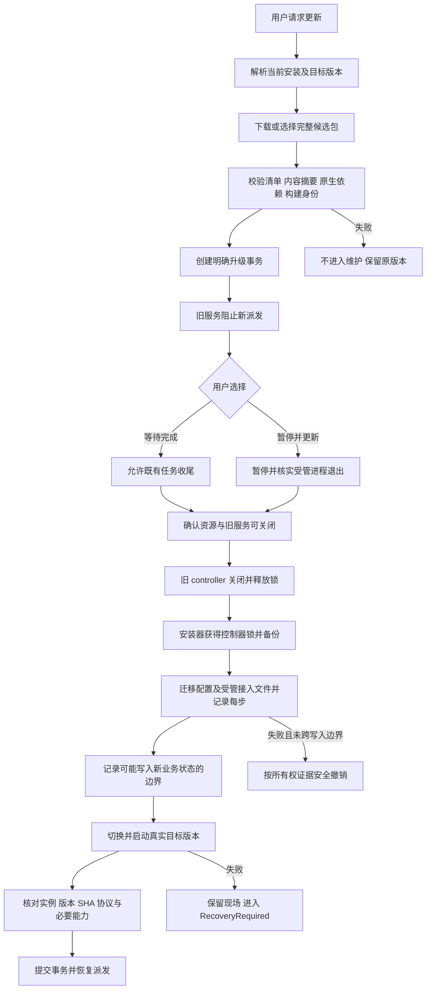

# DevFlow 产品化分支代码审查与整改文档

> 审查对象：`feat/productize-one-line-install`  
> 固定提交：`928370d0d4b845ed0f2e310e3996c6454416190f`  
> 结论：**存在阻断安装、升级和首次使用的确定性代码问题，不应将此提交认定为产品化交付完成，也不建议直接发布给普通用户。**

## 0. 文档用途、基线与证据边界

| 项目 | 内容 |
|---|---|
| 仓库 | `zephyrw/dev-flow` |
| 审查分支 | `feat/productize-one-line-install` |
| 固定审查提交 | `928370d0d4b845ed0f2e310e3996c6454416190f` |
| 对照计划基线 | `1150e7ab88ac9a486406a1eca5bd81abce0928e2` |
| 对照文档 | 《DevFlow 一行安装与 README 产品化改造计划》最终修订版 2.0 |
| 审查日期 | 2026-09-24 |
| 当前技术边界 | Node 运行时、`koffi`、`better-sqlite3`、受管 runner、Windows credential worker；不恢复 Go / 旧 Host 构建路线 |
| 本次操作 | 读取分支代码、核对跨模块调用、查询此 SHA 的 Actions 状态、执行关键表达式及构建配置的隔离验证；未修改仓库 |
| 交付用途 | 交由执行 agent 逐项修复并补充真实回归；本文不表示代码已经修复 |

### 0.1 本次实际完成了什么

重点核对了发布脚本及清单、Shell / PowerShell bootstrap、安装器、稳定入口、CLI、升级事务、维护接口与后台启动逻辑、首次设置界面、模型 API、README 和相关测试。审查围绕“最终发布包经过真实入口能否完成用户旅程”，不以提交消息、代码注释或函数名称作为完成证明。

附带的 `evidence/reproduce-core-contracts.mjs` 执行了 8 项**源码关键表达式／最小配置夹具的隔离验证**，结果保存在 `evidence/results.json`。这些验证印证具体接口矛盾，**不是直接执行完整仓库测试，不是跨平台安装验收，也不是修复后的回归测试**。

本地隔离环境为 Linux、Node `v22.16.0`，配置夹具使用 TypeScript `5.8.3`；它们与项目规定的 Node `>=22.23.2`、TypeScript `~5.9.2` 不同。因此本文没有据此宣称本项目的 `pnpm typecheck`、`pnpm build` 或全量测试通过／失败。完整源码下载受到当前运行环境网络限制，未在此环境进行完整构建；Windows、macOS、真实账号和 OpenTabs 用户链路也未实测。[S01]

查询审查 SHA 的 Actions 接口时返回 `total_count: 0`。这表示**本次查询没有找到该 SHA 的 workflow run**，不表示维护者从未本地测试，也不表示某次旧 SHA 的测试可以覆盖本次提交。当前 CI 的 push 触发仅覆盖 `main`，对目标为 `main` 的 PR 另有触发。[S25][S26]

### 0.2 证据分类与优先级

- **A：静态确定。** 已读代码路径或生产者／消费者直接矛盾，不依赖猜测外部服务。
- **B：隔离验证。** 在临时目录执行了对应关键逻辑或最小配置夹具；适用边界如上。
- **C：需完整场景验证。** 已识别具体风险与触发条件，但尚未在真实安装、系统或账号环境复现。

本文使用 **P1：发布前必须修复**，包括核心用户路径阻断、错误完成状态或用户数据／无关资源的安全风险；**P2：本轮应补齐**，包括参数语义、平台入口和说明一致性问题。P1 不等于已经发生线上事故。

**前面的阻断会掩盖后面的阻断。** 例如，当前 manifest 解析先失败，不代表 `.mjs` 模板遗漏或升级候选缺依赖可以忽略。修复必须打通整条链路，而不是只修“第一个报错”。

---

## 1. 总体判断与应当保留的成果

README 的主叙事已经明显转向用户收益；默认不替用户选择客户端、安装状态与模型设置状态拆分、构建身份、稳定入口、维护事务等方向也正确。已有原生依赖加载自检和“不确定进程状态不可直接改成已退出”的保护应继续保留。[S02][S04][S09][S12]

**主要问题是：多个模块分别实现了各自的契约，却没有在最终入口上对齐。** 典型表现包括：

| 接缝 | 当前矛盾 |
|---|---|
| 打包清单 → 打包校验 | 清单要求存在的 native `package.json`，又被校验器判为非法 |
| 打包清单 → 安装器 | 发布方使用 `{os, arch}`，安装器只接受 `{platforms}` |
| TypeScript 构建 → 稳定入口 | 安装时读取 `.mjs` 模板，但正式构建没有相应复制步骤 |
| bootstrap → 安装器 | 开关在外层解析，却没有传给内层安装器 |
| 稳定入口 → CLI | 同时提供了安装根与版本根，CLI 却将安装根当运行文件根 |
| CLI → UpgradeManager | 调用顺序和参数对象与真实实现不一致，被 `any`／类型断言遮蔽 |
| 维护接口 → 调度器 | 返回“已阻止新派发”，却没有接通真实调度门禁 |
| 升级候选 → 目标服务 | 候选复制主动跳过生产依赖，启动验证又允许不执行 |
| 设置界面 → 已保存配置 | 保存失败仍写入“首次设置完成”并关闭向导 |

建议按本文逐项整改，**不能通过删除校验、吞掉错误、降低状态门槛或增加 mock 来使结果看起来成功**。

## 2. 整改事项总表

| 编号 | 优先级 | 问题 | 主要定位 | 证据 |
|---|---|---|---|---|
| R01 | P1 | 运行清单在生成、校验、安装与摘要计算之间不兼容 | `runtime-files.json`、`release-lib.mjs`、`runtime-files.ts`、installer `main.ts` | A+B |
| R02 | P1 | 稳定入口模板不进入干净构建产物 | `tsconfig*`、`entry-template.mjs`、`launchers.ts` | A+B |
| R03 | P1 | 正式 bootstrap 版本占位符未绑定，标签一致性检查不完整 | `injectReleaseBindings`、两套 bootstrap、`build-release.mjs` | A+B |
| R04 | P2 | `no-open`／`require-ready` 未透传，就绪判断和打开结果错误 | bootstrap 与 `runInstaller` | A+B+C |
| R05 | P1 | 安装根与版本根混用，已安装 CLI 的版本、诊断、停止和更新解析错误 | `entry-template.mjs`、CLI `installationRoot` | A+B |
| R06 | P2 | Windows PATH 注册没有真正执行，其他平台入口未完整适配 | installer `main.ts`、`launchers.ts` | A+C |
| R07 | P1 | `devflow update` 未形成真正的更新流程，参数和结果契约错误 | CLI `commandUpdate`、`UpgradeManager` | A |
| R08 | P1 | 升级候选丢失依赖；未启动目标服务也可以标记升级成功 | `prepareCandidate`、`copyTreeShallow`、`runUpgradeStateMachine` | A+B |
| R09 | P1 | 维护模式没有阻止真实后台派发，也没有完成控制器交接 | `base-server.ts`、`server.ts`、`main.ts`、maintenance routes | A+C |
| R10 | P1 | SafeAbort 恢复证据记录过晚，部分修改无法正确撤销 | `upgrade.ts`、`transaction.ts` | A+C |
| R11 | P1 | 停止服务的跨平台与进程身份校验不完整 | CLI `commandStop`、`descriptor.ts` | A+C |
| R12 | P1 | 卸载可能删除非本应用入口，且没有完成停机及程序卸载 | CLI `commandUninstall`、入口收据与保留策略 | A+C |
| R13 | P1 | 首次向导“完成”不等于接入成功、验证成功或保存成功 | `FirstRunSetup.tsx`、现有模型 API／客户端安装能力 | A+C |
| R14 | P1 | bootstrap 更新先删除旧运行时，忙文件延迟替换没有保存候选 | `installBootstrapRuntime` | A+C |
| R15 | P1 | 新增发布验证脚本未接入 workflow，测试没有覆盖真实模块组合 | CI / Release、bootstrap 与升级测试 | A |
| R16 | P2 | README／UI 的已验证声明与证据不一致，测试含个人机器路径 | README、向导、兼容性说明、bootstrap 测试 | A |

---

## 3. 逐项整改要求

### R01 · 统一运行清单的语义与消费者，修复成品安装的首要阻断

**定位**：[S03][S04][S05][S06][S09]。关键函数为 `validateRuntimeFiles`、`parseRuntimeFilesManifest`、`requiredEntries`、`computeContentDigest` 与 `runInstaller`。

**已确认问题**：

1. 实际发布清单将 `node_modules/koffi/package.json` 和 `node_modules/better-sqlite3/package.json` 标为 `category: native, required: true`。`validateRuntimeFiles()` 又明确把没有 `any_of` 的 native `package.json` 记入 missing。**即使实际原生模块可以正常加载，校验器仍会拒绝这份清单。** 打包调用链在生成 tar 前执行该校验。
2. 发布清单中的平台条件是 `required: {"os":["win32"]}` 或 `{os, arch}`，安装器解析器却只接受 `required: {platforms: string[]}`。解析发生在平台过滤之前，所以不是“仅 Windows 条目被跳过”就能解决，而是整个清单直接被拒绝。
3. 发布校验器支持 `any_of`，安装器将条目转换为 `{path, category, required}` 时丢弃了该字段，随后只检查 `entry.path`。满足替代 native 路径的包会被误判缺文件。
4. 清单末尾还包含 `dist/packages`、`dist/apps`、`dist/web`、`packages/skills`、`node_modules` 等目录。安装器把所有 required 路径放入 `critical`，再逐一 `readFileSync()` 计算摘要。**目录不是可直接按文件读取的内容；Linux 隔离验证得到 `EISDIR`。**
5. 清单要求的 `pnpm-lock.yaml`、`pnpm-workspace.yaml` 被构建包携带，但 installer 的硬编码根文件复制列表没有复制它们，造成“源包满足清单，安装目录不满足同一清单”。

**影响**：标准发布包在打包验证或安装解析阶段即被阻断。只修字段名仍会继续撞上目录摘要与替代路径问题。

**整改要求**：

- 建立唯一的清单规范，明确 `schema_version`、`path`、`kind: file|directory`、平台条件、替代路径及可选性；构建和安装不得各自发明不同字段。
- 优先复用目前已发布在代码中的 `{os, arch?}` 与 `any_of` 表达，或同时迁移所有消费者；禁止只改一侧。平台判断必须同时考虑 OS 与 CPU 架构。
- package metadata 可以列为普通应用／元数据条目；native 要求由真实二进制路径、平台选择和实际加载能力验证满足。保留 native 检查，不能为了放行而删掉它。
- 统一解析、平台筛选、`any_of` 解析后的实际路径集合、复制集合和摘要规则。目录摘要应对目录内允许的文件进行规范化排序与递归计算，或先将目录展开为明确文件清单；不能读取目录字节。
- 以相同算法生成、保存和复核内容摘要；定义时间戳、收据本身等可变文件是否排除，不能因一次重试更新时间戳而导致同内容被认定为不同构建。
- 安装后对目标目录再次执行同一套清单验证，而不只检查下载后的源目录。
- 不猜测 `better-sqlite3` 在目标版本的 native 布局；从真实安装结果和模块加载路径确认。不能用测试里手工创建的空 `.node` 文件代替实际模块。

**验收**：四个承诺平台分别用真实生成的 `runtime-files.json` 验证真实包，再安装到新目录。另测 primary 路径缺失但 `any_of` 另一项存在、原生模块缺失、OS 正确但架构错误、目录条目、锁文件遗漏、同内容二次安装、内容变更拒绝覆盖。附录 E01/E02/E03 是当前矛盾的隔离验证，不是最终验收替代品。

### R02 · 将稳定入口模板作为必需运行资源交付

**定位**：[S07][S08][S01][S04]。`ENTRY_TEMPLATE_PATH` 指向编译模块旁的 `entry-template.mjs`；`installBootstrapRuntime()` 会读取它。

**已确认问题**：当前构建命令只有 `tsc -p tsconfig.build.json && vite build ...`。TypeScript 配置没有开启 JavaScript 输入复制，也没有独立的 `.mjs` 资源复制步骤。模板存在于源码 `packages/installer/src/entry-template.mjs`，正式包主要复制 `dist/packages`，没有将这份源码模板专门复制进去；运行清单也未要求该模板。因此，干净构建不会自动满足安装器要求的模板路径。

**触发结果**：上游清单问题修复后，安装可在 `installBootstrapRuntime()` 报“缺少 bootstrap/entry.mjs 模板”。本地最小 TypeScript 配置夹具确认 `.ts` 正常输出而相邻 `.mjs` 未复制；完整项目仍须用项目工具链重跑。

**整改要求**：新增明确的资源构建步骤，把模板复制到安装器实际读取的位置，或生成稳定入口字符串资源，但只能维护一份模板。把模板和必要资源加入正式清单及目标目录校验。`pnpm build` 本身必须产出完整运行资源，不能依赖开发者提前手工复制或已有脏 `dist`。

**验收**：删除 `dist` 后完整构建，验证模板存在于构建目录、最终 tar、安装目录；移除模板时构建／发布验证必须提前明确失败。不能靠在测试夹具中单独创建模板掩盖产品构建遗漏。

### R03 · 修正发布脚本版本绑定，并与真实 Git 标签严格对应

**定位**：[S04][S05][S10][S11]。`injectReleaseBindings()`、`validateBootstrapAssets()`、`resolve_version_once()` / `Resolve-DevflowVersionOnce`。

**已确认问题**：两套 bootstrap 使用 `__DEVFLOW_RELEASE_TAG__`，release-lib 仅替换及检查 `@TAG@`、`@VERSION@`、`@DEVFLOW_TAG@`、`@DEVFLOW_VERSION@`。实际占位符没有被替换，检查器也看不到它。构建调用方没有把 `bindingsApplied: false` 当作错误。

结果是标称“已绑定版本”的正式安装脚本仍可能走开发版 `latest` 查询路径；从旧版本 Release 获取脚本后，默认安装的可能是另一个版本。显式传入 `--version` 可以绕开部分问题，但不能证明默认正式入口已实现版本固定。附录 E04 已验证该替换表达式保持原字符串不变。

此外，构建脚本以 `v + package.json.version` 自行生成标签，没有在 tag workflow 中对照实际触发标签。给旧 package 版本打另一个 `v*` 标签时，应在最开始拒绝，而不是发布一个自报身份与 Release 位置不同的包。[S04][S24]

**整改要求**：

- 唯一管理模板占位符；构建必须断言实际完成绑定，并断言正式脚本没有任何未替换占位符。缺少任一 bootstrap 资产也必须失败，不是“存在才检查”。
- 注意原脚本还用同一个占位符字面量判断是否开发副本。**不能简单全局替换后，把判断条件一起替换成正式标签，导致正式标签又被识别为占位符。** 模板绑定点和开发模式检测必须分离。
- 正式资产默认使用自身绑定标签；只有明确的开发入口才允许一次性解析 latest。脚本、manifest 和 archive 在一次操作中必须绑定同一标签与摘要。
- tag workflow 严格验证 `GITHUB_REF_NAME === build_tag === 'v' + application_version`，并核对构建提交为实际 checkout SHA。测试构建与正式发布必须有明确模式，不能模糊放宽。
- 对外下载名、component.name、下载 URL、tag 与 OS/arch 必须精确对应，不能只做字符串包含检查。

**验收**：用生产 `build-release.mjs` 生成脚本，运行实际生成文件，模拟 latest 在脚本取得后切换；确认仍获取自身版本。增加标签不符、占位符遗漏、缺少安装脚本、manifest 与资产名不符的负向测试。

### R04 · 对齐 bootstrap 参数、就绪判定与自动打开语义

**定位**：[S09][S10][S11]。两套 bootstrap 的内层参数构造、`runInstaller` 的 `toolsReady` 及浏览器结果处理。

**已确认问题**：

- Shell 接收 `--require-ready`、`--no-open`，PowerShell 接收对应开关，但构造 Node 安装器参数时没有传入它们。
- 内层默认“软件装好即返回 0”，外层的严格模式只会检查内层是否返回 10，所以真实设置未就绪时严格模式可能仍返回 0。
- `no-open` 只抑制外层开浏览器；内层未收到开关，仍可能尝试打开。内外层都负责打开，又存在重复打开及 URL 解析不一致。
- `let toolsReady = tools.length === 0`，后续只有失败时改为 false，没有成功时置 true。显式选择工具时，即使所有探测成功，最终仍为 false。附录 E08 已隔离验证。
- 内层完成时动态导入的是安装器源目录旁的 service launcher，而不是已经验证的目标版本入口；此前正确配置只传给了另一个子进程，不能据此推断当前进程导入的 launcher 使用同一配置。该次打开存在路径／配置错位，需要在真实安装中验证。
- 安装日志没有可靠区分“没有请求打开”“打开失败”和“成功打开”；调用返回对象而不抛异常的情况也不应直接显示成功。

**整改要求**：开关沿 Shell/PowerShell → installer → stable entry 全链路保留。默认模式与严格模式只在一个明确边界映射退出码，不能多层再次猜测。工具列表的初始 all-ready 值与每个被选角色都要正确聚合。自动打开只由一个组件执行，使用已激活的目标入口及已验证 URL；返回结构区分 `requested/opened/url/error`，浏览器不可用不破坏软件安装成功状态。

**验收**：真实安装器在未配置状态下，默认返回 0、严格模式返回 10；选定工具全部通过后严格模式返回 0；任一失败保持未就绪。`no-open` 下 OS 打开命令调用次数必须为 0；正常成功最多一次；浏览器缺失显示真实状态；自定义 YAML 地址不能回退到 4810 冒充正确入口。

### R05 · 严格区分安装根、版本根、数据根

**定位**：[S07][S13]。稳定入口已经传入 `DEVFLOW_INSTALL_ROOT` 和 `DEVFLOW_VERSION_ROOT`，但 CLI 的 `installationRoot()` 优先返回前者，并被用于读取应用文件。

**已确认问题**：正式布局中，`current.json` 在安装根，`package.json`、`build-info.json` 和 `dist/**` 在 `versions/<version>`。因此经稳定入口运行 CLI 时，版本读取、必需文件诊断、停止命令的 entry 对照和更新的 source 选择会查错目录。附录 E06 已确认同一布局下安装根没有版本包的 `package.json`。

**整改要求**：

- 建立共用 `InstallationContext`：`installRoot` 仅用于版本指针、事务、bootstrap；`versionRoot` 用于包与编译文件；`configPath` 明确传入；`storageRoot` 必须从配置读取，不假设为安装根。
- CLI 默认通过稳定入口或受验证的 current pointer 获取上下文。源码模式也使用明确规则，不用“依次向父目录找 package.json”来猜运行模式。
- `--version` 输出已安装构建身份；`status` 区分已安装版本与运行版本；`doctor` 核对相同安装实例，而不是任意 200 响应。
- 修复 `--help/--version` 在配置文件缺失时先被 bootstrap 阻断的问题。帮助与安全诊断可以在业务配置缺失时工作；指针不可信时不得执行不可信目标，但应提供稳定层自带的修复说明。
- 路径边界校验应包括实际解析后的符号链接／junction 目标；不能只用字符串目录前缀证明目标可信。

**验收**：从任意 cwd 执行安装后的真正 `bin/devflow`，核对版本、doctor 文件路径和 status；不允许调用源码 `tsx` 作为替代。增加自定义安装根、数据根、中文空格路径、配置缺失、指针损坏、符号链接越界、同一端口另一安装实例等场景。

### R06 · 完成真实的平台入口注册

**定位**：[S08][S09]。Windows 安装路径调用 `appendWindowsUserPath()` 时，传入的是安装根而不是 `bin`；读取的是当前进程 PATH，写入回调为空函数。PowerShell bootstrap 没有补上注释声称由它负责的注册操作。

**影响**：即使前面安装完成，Windows 新终端也不会因此获得有效的 `devflow` 命令。`registerUserPathWindows()` 只是检测冲突并返回 `changed: false`，不能算已注册。

非 Windows 分支统一生成 Linux `.desktop` 文件；macOS 没有对应的原生应用入口。`.desktop` 的 `Exec=` 直接拼路径，没有处理空格路径的桌面文件语法。Shell PATH 也只按 OS 写固定 rc 文件，不能宣称所有 shell 已支持。

**整改要求**：Windows 写入用户级 PATH 的实际接口必须实现，追加值为 `layout.binDir`，保留原值与变量展开语义，不把机器级 PATH 复制到用户 PATH。验证并提示同名命令冲突；记录本次新增的 PATH 项和入口收据。macOS、Linux、Windows 分别定义支持的入口，至少满足 README 对相应平台的承诺；不支持的桌面入口不要伪装已创建。对 shell 特殊字符及桌面 Exec 参数使用对应语法转义，而不是把 JSON 字符串转义直接当 shell 转义。

**验收**：真正启动一个新的 Windows shell 执行 `devflow --version`；检查用户 PATH 而非测试回调。中文／空格路径的开始菜单、macOS 入口、Linux 桌面入口均要真实点击。已有同名非 DevFlow 命令不得覆盖或静默抢占；重复安装不得重复写 PATH。

### R07 · 重接 `devflow update`，去掉掩盖接口不匹配的适配层

**定位**：[S13][S12]。`commandUpdate()` 与 `asUpgradeMaintenanceApi()`。

**已确认的调用断点**：

```text
CLI：requestMaintenance()
  → 实现要求已有 beginUpgradeTransaction 记录，但 CLI 没有创建
CLI：prepareCandidate({ sourceDir: 当前目录, targetVersion: 当前版本 })
  → 没有检查远端版本或获取新发布包
CLI：runUpgradeStateMachine({ targetDir, digest })
  → 实现要求 { sourceDir, targetVersion, ... }
CLI：无条件打印“更新完成”
  → 实现可能返回 safe_abort / recovery_required，并不一定抛异常
```

此外，CLI 创建 manager 未提供真实 `storageRoot` 与 `serviceOrigin`，默认会去安装根查数据库和维护标记，而实际数据通常位于 `state/` 或自定义路径。

**整改要求**：

- CLI 只做参数解析和结果展示，调用一个真实的、强类型的更新服务；不要用 `any` 重定义一份假的维护接口。
- 真正实现检查版本、用户选择目标／通道、下载或接收已验证本地成品；没有更新应明确返回 `no_update`，不能拿当前安装根冒充新版本来源。
- 准备与校验候选在维护前执行；明确传入 transaction ID、installRoot、storageRoot、configPath、期望构建身份。不要寻找“最近一个事务”作为本次事务身份。
- 统一 Shell 重装升级、CLI 更新与以后 UI 更新的核心流程。当前 `runInstaller()` 仍直接争抢运行中的 controller lock，未调用新维护流程，也必须接入或明确区分仅首次安装。
- 对结果做穷尽分支处理：只有 verified 才显示完成并返回 0；safe_abort、recovery_required、blocked 均保留对应状态与恢复动作。不得依赖是否抛异常判断成功。

**验收**：从真实 V1 安装执行 `devflow update` 升到真实 V2；核对请求的是 V2、实际运行的也是 V2。测试无更新、下载失败、维护失败、候选无效、返回而非抛出的失败结果、自定义数据根。必须有一条测试从真实 CLI 到真实 manager，而非两侧各自 mock 对方接口。

### R08 · 升级候选必须完整，成功必须有真实目标启动证据

**定位**：[S12]。`prepareCandidate()`、`copyTreeShallow()`、`runUpgradeStateMachine()`。

**已确认问题**：

- `copyTreeShallow()` 明确跳过所有 `node_modules`，导致升级目标缺少生产依赖与 native 模块。附录 E05 证实该复制逻辑会保留 runtime 却丢弃依赖。
- 候选摘要只覆盖 `package.json`、`build-info.json`、`compatibility.json`，不覆盖真正执行的 `dist` 与依赖。它与首次安装器的 productDigest 又是另一套算法。同版本内容检查无法形成统一含义。
- 直接创建正式版本目录后递归复制，没有 staging → 校验 → 原子激活；中断会留下半成品目录，并影响重试。
- 默认指针 Node 路径是 `targetDir/node/node.exe`，而既有布局是 `runtime/node` 或 `runtime/node.exe`。
- 将内容 digest 写成 `build_revision`，混淆“构建提交”和“内容摘要”。
- `startTargetService` 是可选回调，缺失时仍进入 verified、提交事务；即使提供回调，也未强制同时存在并匹配版本、提交、协议及实例信息。新增 launcher 身份校验也只在返回字段为 string 时比较，字段缺失不能被当作已验证。[S14]

**整改要求**：候选准备与首次安装共用成品验证、复制和摘要实现；完整携带生产依赖，保持真实可加载状态。先 staging、自检、核对内容身份，再原子进入 versions。应用版本、Git SHA、artifact digest、config schema 与各协议版本分离。目标启动和健康验证在生产路径中必须执行，不能是默认可省略的测试注入点；缺字段、旧服务、不同实例、不同内容都不应 verified。

**验收**：真实候选包重定位后能独立启动 SQLite/native/runner。修改 `dist` 而不改元数据时，摘要必须变化或校验失败。模拟复制中断、缺依赖、错误 Node 路径、没有启动回调、健康接口缺字段／返回旧构建，全部拒绝成功。首次安装后的收据必须可直接用于相邻版本升级与幂等检查。

### R09 · 将维护状态接入真实调度与控制器交接

**定位**：[S15][S16][S17][S18][S12][S19][S14]。

**已确认问题**：`createBaseServer()` 提供维护钩子，但 `buildServer()` 没有传入 `onMaintenancePrepare` 或 `onMaintenanceQuiesce`。接口写入标记后返回 `block_new_dispatch: true`，真实 `apps/api/src/main.ts` 的定时器仍继续调用 `engine.dispatch()`、`resumeModelWaits()` 和账号 tick。

目前维护保护位于 HTTP onRequest，拦截大部分写请求，排除 `/api/maintenance` 与 `/api/worker/`；这会同时拦住正常暂停／反馈／部分完成协议请求以及 `/mcp`，却无法阻止已入队任务被内部调度。不能把“写接口受限”当作“后台任务停止派发”。

升级 manager 等待的主要是 process_record 与 lease 状态，并没有实际安排旧 controller 退出。旧服务持有 controller lock 直到关闭，升级随后申请同一锁会失败；直接 installer 路径也保留了运行中争锁逻辑。`waitForQuiescent` 的 pause-and-update 分支没有与 wait 分支一致的超时退出条件。[S09][S12]

维护状态还有所有权及恢复问题：

- 通过“最新事务文件”寻找本次事务，现有 marker 可以被另一操作更新而不核对 transaction ID。
- 请求维护的 HTTP 失败／不成功响应被忽略，后续仍可能按本地 marker 推进。
- marker 的默认存放位置可与真实 storageRoot 不同。
- `launcher.assertNotUpdating()` 仍用“maintenance.lock 可打开就删除”的旧逻辑，而新的 marker 文件是普通可打开文件；它没有读取维护事务的新语义。
- API 按过期时间把 marker 视为不生效；如果新版本已经写过状态，不能仅因时间过去就允许正常写操作重新进入。

**整改要求**：

1. 在引擎真正的派发／恢复入口接入维护状态，维护确认必须与禁止后续新派发的事实同步。覆盖排队任务、额度恢复、辅助模型操作等所有可能创建新工作轮次的入口。
2. 区分“新任务入口”与“既有任务结束、暂停、取消、必要反馈、恢复诊断”。后者必须在正确授权和事务上下文中仍能完成，避免维护把自己锁死。不能全量豁免所有 MCP 写操作，也不能全量封禁既有任务完成协议。
3. 显式维护交接：旧服务确认停止接收新派发 → 按用户选择等待或暂停 → 确认受管进程及资源状态 → 旧 controller 有序关闭并释放锁 → installer 取得锁。不要删锁或放宽所有权检查。
4. 所有维护操作携带明确 transaction ID 与实例身份；只有所属事务可续期、更新、清理。网络失败、非 2xx、身份不符不得按准备完成处理。
5. 明确 timeout、取消和用户再次打开的行为；pause-and-update 也必须有超时和可诊断退出。unknown 状态继续阻断，不得批量改成 exited。
6. 标记过期仅触发恢复核查，不自动证明安全。RecoveryRequired 在重新核对版本、进程和数据状态前不能恢复普通写入。统一替换旧 maintenance.lock 的删除逻辑。

**验收**：用真正 `buildServer(engine)` 与真实调度器测试，先放入可运行的排队任务，再请求维护；等待多个 tick 后仍不得产生新的执行进程。既有任务能完成／暂停并释放资源。分别测试空闲但仍运行的服务升级、活动任务等待升级、暂停升级、用户取消、超时、旧事务 marker、新实例抢占、API 503、错误 storageRoot、维护过程中重启、RecoveryRequired 后时间过期。不能只测试单独的 `createBaseServer()` 或 mock 回调。

### R10 · 让 SafeAbort 的恢复记录在修改发生时就可靠落盘

**定位**：[S12][S19]。`runUpgradeStateMachine()`、`recordTransactionPhase()`、`restoreTransactionOwnedChanges()`、`restoreOwnedFile()`。

**准确结论**：项目已经有恢复函数，`failUpgradeTransaction()` 在 safe_abort 分支也会调用恢复。问题不是“完全没写恢复”，而是**失败时恢复函数未必拿得到前面真实修改的所有权证据**。

**已确认问题**：配置迁移后，没有立即记录 `config_digest_after`；受管客户端修改只放进局部 `clientChanges` 数组，直到指针写入后的 starting 阶段才写入事务。若第二个客户端修改失败或指针切换失败，第一个客户端的已完成修改、配置迁移的 after hash 可能尚未持久化。恢复函数会拿到空列表或空 hash，不能正确恢复本事务修改，却仍归入 SafeAbort。

另外，`restoreOwnedFile()` 的所有权判断含 `(created && beforeHash == null)`，这会把后来出现在同一路径的文件也当作本事务创建的文件，而不是要求当前内容匹配本事务记录的 after hash。state-machine catch 中对 newly-created config/pointer 的额外删除同样缺少内容／事务归属检查。

**整改要求**：

- 每个受管文件修改都按“记录 intent 与 before hash／备份 → 执行原子写入 → 记录 after hash 与完成状态”推进；失败恢复要识别中间状态，不依赖整个批次做完才落盘。
- 配置、指针、客户端接入文件分别记录；新建文件也只有在内容及所有权匹配时才能删除。用户并发修改必须保留并标为 conflict／user_modified_preserved。
- SafeAbort 成立的条件是未进入可能写业务状态阶段，且本次受管修改已经恢复或准确报告需要人工处理的冲突；不能把“没有切换数据库”简单等同于“什么都没有改变”。
- 进入可能写新状态阶段后保留 RecoveryRequired，不自动恢复旧数据库。恢复动作必须关联这次事务的版本、备份与数据兼容范围。
- 首次安装与更新共用事务记录和恢复实现，避免 `runInstaller()` 自己维护另一套不完整回滚逻辑。

**验收**：故障注入覆盖迁移后、第一客户端写入后、第二客户端写入中、指针写入前后、目标服务启动后；逐项对比原配置／已改客户端文件。并发修改任意文件后触发失败，不能覆盖或删除用户新内容。重启后读取事务应足以解释和恢复，不依赖原进程内存。

### R11 · 安全停止必须核对真实进程，并支持所有承诺平台

**定位**：[S13][S20][S17]。

**已确认问题**：

- `recordController()` 在非 Windows 直接返回，不生成 `controller-process.json`；CLI stop 却只靠这份文件确定运行服务。Linux/macOS 正常启动后也可能显示“没有正在运行的服务记录”。
- 进程 entry 比较只比较磁盘记录里的字符串，不证明当前 PID 仍是原进程。读取进程创建时间后的“不匹配”分支没有任何拒绝／终止逻辑；异常被忽略后继续发送终止信号。
- `processAlive()` 对非 ESRCH 的错误也返回 false，权限不足／无法确认会被错误展示为已退出。
- 未先查询活动任务或完成有序关闭，直接 `process.kill(pid, 'SIGTERM')`。Node 官方文档说明，在 Windows 上该调用的信号模拟会无条件终止目标进程，不能依赖应用注册的 SIGTERM 回调完成完整的异步清理。[EXT1]

**影响**：可能停不下来、误报停止成功，或在 PID 复用等条件下误终止无关进程。最后一种是具备具体触发条件的风险，**本次没有对真实机器演示误杀**。

**整改要求**：跨平台生成或查询可信服务身份，包含实例、进程开始身份与握手信息。优先让本实例通过受保护本地协议执行有序 shutdown，排空／停止所拥有的工作并确认。需要 OS 级终止时，必须在使用前用现有 native 能力核对真实进程身份；身份未知则拒绝，不根据进程名批量结束。Windows 不能把 process.kill(SIGTERM) 当优雅退出。停止成功需要确认 controller、受管进程和资源状态，而不只看一个 PID 不存在。

**验收**：真实 Windows/macOS/Linux 服务均可停止；另外起一个无关进程，模拟陈旧记录和 PID 指向它时必须拒绝发送终止操作。权限不足、创建时间不符、记录损坏应显示 unknown／conflict。活动任务时有清楚等待或暂停确认，不静默强杀。测试应使用隔离的无害子进程，不能触及用户真实工作进程。

### R12 · 卸载以收据和所有权为准，不能删除保留过的冲突入口

**定位**：[S13][S08][S19]。

**已确认问题**：Unix 安装发现已有非本应用 `~/.local/bin/devflow` 时，会将它记为冲突并保留。`commandUninstall()` 却无条件删除同一路径。这是明确的安装／卸载所有权不一致：用户原本的同名入口存在被删除的路径。

同时，CLI uninstall 只移除部分入口，不请求服务停止、不卸载版本与 bootstrap 程序、不处理完整 PATH／账号管理入口；`planUninstallRetention()` 虽定义了另一份策略，实际 CLI 没有消费它。`includeTaskData` 分支用 `keep.pop()` 而不是按路径移除指定保留项，在 workspace／vault 也加入列表时会移除错误对象；此辅助策略在真正接入之前也需修正。[S19]

**整改要求**：

- 安装收据记录每个创建的入口、符号链接目标、原有内容和本次内容 hash，以及新增 PATH 项。卸载只删除本实例创建且当前仍匹配的资源。
- 冲突时未创建的入口永远不进入删除集；已被用户改写或改向其他应用的入口保留并说明。
- 使用与更新共用的安全停机流程，停止后再清理可卸载程序，Windows 正在占用的 bootstrap 文件由安全的后置清理流程处理。
- 默认保留业务项目、任务数据、用户账号凭据和诊断／恢复所需记录。明确列出将删除与保留的内容；清除数据必须额外确认。
- 保留策略按资源 ID／规范路径过滤，不使用数组顺序表达特定资源归属。用户自定义数据根位于版本目录内部时，先阻止误删并要求处理冲突。

**验收**：安装前创建一个不同内容的同名命令，安装保留它，卸载后字节完全不变。另测用户改写入口、两个安装实例、开始菜单与 PATH、进程仍在运行、默认保留数据、显式数据清除。必须从真正 `devflow uninstall` 调用验证，不只是测试 retention helper 返回了一个漂亮清单。

### R13 · 首次向导必须产生真实接入结果，失败不能标记完成

**定位**：[S21][S22][S23][S09]。

**已确认问题**：

1. `handleFinish()` 捕获保存错误后不显示、不重试，`finally` 无条件设置 `devflow.first_run_completed=true`、调用 onCompleted 并关闭。后端拒绝保存或网络错误时，用户仍看到“已经走完流程”。
2. “跳过”也设置同一 completed 标记；UI 提示关闭与系统配置就绪没有独立状态。
3. 验证只覆盖 planner，executor 没有对应验证。安装器默认不配置任何客户端是正确变化，但向导“连接工具”只是改 React state，没有调用客户端配置／Skill 安装操作，首次安装到接入成功的链路因此没有闭合。
4. 工具和默认模型是硬编码列表／字符串，未使用已有 `getModelTools()`、`getAdapterModels()`、`discoverTools()` 等真实目录能力。用户选择另一客户端后，旧 modelId、executableRef、providerConfigRef、reasoning 等信息可能继续继承。
5. 声称可直接开始、已验证端到端的文案，没有与实际访问状态／兼容性证据绑定。设置草稿与安装状态也没有形成可靠服务端事实来源。

**整改要求**：

- 把步骤分成“发现与选择 → 授权后接入配置 → 选择模型 → 验证各使用角色 → 成功保存 → 开始使用”。可以允许跳过并浏览工作台，但明确标记 pending，不能当 ready。
- 复用真实工具／模型目录与既有设置组件，未知工具不伪造已安装，未知模型／强度不伪造可用。不要为了初始化方便固定默认模型版本。
- 更换 adapter 时重建或严格归一化 ToolProfile，清除不适用于新工具的 executable/provider/scope/options/reasoning。`modelSelection`、`selectionKind` 必须与用户实际选择一致。
- 工具接入是用户明确批准的本地配置写入，调用真实 ClientInstaller 或其受保护服务接口，记录结果与恢复信息；不默认改未选择工具，也不依赖用户手工执行隐藏命令补洞。
- 对每个不同的实际配置执行访问验证，去重后串行／按既有约束进行；AGY 账号相关行为继续跨账号串行，初次录入要求双额度成功，禁止后台并发探测备用账号。
- 保存失败保留表单，展示具体错误与重试入口；revision 冲突要求重新载入／合并，不能吞掉。只有后端成功响应并可读回时标记 saved。
- 区分 `wizard_dismissed`、`draft_saved`、`client_connected`、`access_verified`、`ready`；完成状态以服务端可核对事实为准，localStorage 只控制提示是否关闭。

**验收**：从“没有选客户端、没有接入配置”的真实新安装开始，完整完成向导后，核对 MCP/Skill 写入、已选模型配置和下一次派发。模拟保存 409/422/500、断网、执行模型未验证、模型目录为空、切工具、关闭后重开、跳过后刷新；所有失败不得显示已保存或已就绪。通过界面观察的状态必须与后端、文件及实际下一次任务一致。

### R14 · bootstrap 自身升级必须可恢复，不能先破坏稳定入口

**定位**：[S08][S09]。`installBootstrapRuntime()`。

**已确认问题**：当前先复制候选临时文件，再删除既有 `bootstrap/runtime/node`，然后 rename。若删除成功而 rename 失败，稳定入口将缺失，之前可用版本也可能无法通过入口启动。注释写“验证复制二进制”但这段没有真正启动临时副本核验。

Windows 文件忙时，defer 分支写入一个空 `node-pending.bin`，随后删除候选临时文件；没有保留要替换的实际 Node 内容与对应校验信息。这并不是可执行的延迟替换方案。安装器又在完成目标 native 自检、旧服务维护交接之前修改 bootstrap，因此一次后续失败可波及原来正常的入口。

**整改要求**：

- bootstrap 使用独立版本化或可恢复的文件切换策略，候选先验证，再以支持平台的方式激活；不先删除唯一可用入口。
- Windows 不能替换当前使用中的程序时，保留经过校验的候选及其路径、摘要、目标版本，交给受控后置进程处理；完成前继续用兼容的旧 bootstrap，不能只放空标记假装安排成功。
- 模板与 Node 的兼容性成对记录，修改也纳入事务；失败能够继续打开旧版或至少进入真实诊断／修复入口。
- 稳定入口、版本入口启动前统一处理敏感 Node 环境变量和受信任路径。现有 runtime 启动已使用 cleanProcessEnvironment，新增入口不应形成额外的环境注入旁路。

**验收**：文件忙、无权限、磁盘不足、候选运行时无法执行、rename 失败、更新进程被中断，各场景原有入口不得消失。延迟更新后实际 Node 字节／版本发生预期变化，不只是 marker 存在。测试真实 Windows 锁文件行为，不能仅 mock 为成功。

### R15 · 把发布门禁和真实模块组合测试接入入口

**定位**：[S24][S25][S26][S27][S28]。

**已确认问题**：Release workflow 仍仅 typecheck、build、test:unit、build-release、上传资产、创建草稿。新增的 `release:verify`、`release:assemble` 及成品 smoke 相关能力未进入该发布调用链；integration 和 UI 回归也未成为同 SHA 发布门禁。草稿可以保留，但不能把草稿生成当成最终用户已可安装。

`assemble-release.mjs` 默认允许部分平台，正式发布必须显式严格校验声明的平台集合。CI 的 push 只匹配 main；本次 SHA 查询没有 workflow run，不能拿 main 的历史结果证明此分支质量。

现有 bootstrap integration 测试使用手写的 `mockInstallerBundle`，让假安装器直接返回固定退出码。这能测试外层处理，却无法发现“真实内层从未收到严格模式开关、默认始终返回另一状态”。这些测试还直接指定某个开发者机器上的 PowerShell 路径，没有按三平台选择正确工具／跳过策略。[S27]

**整改要求**：

- PR 或明确的手动工作流必须能验证审查分支；在对外发布前运行与待发布 SHA 对应的完整门禁，不用其他 SHA 的绿灯替代。
- 保持 typecheck → build → runtime 单元／集成测试的顺序。修正 `package.json` 的 check 聚合命令仍先测试再构建的不一致，避免新环境依赖旧 dist。[S01]
- 真实生成最终包后进行归档安全检查、解压、跨目录安装、稳定 CLI 执行、重复安装、V1→V2 升级、失败恢复以及界面验收。构建工作目录与用户安装目录分离，不从源码目录借依赖。
- 正式 Release job 必须调用 verify、严格 assemble，并核对标签、SHA、所有声明平台资产。四个平台重复生成的安装脚本应校验字节一致或只由一个汇总 job 生成，不能在合并下载中默默覆盖冲突。
- 发布前 artifact 验证与发布后的匿名真实 URL 安装分成两个步骤；需要凭据取得草稿用于验收时，凭据不得进入最终脚本。是否显式发布由维护者决定，本次整改不授权自动发版。
- 保留针对网络、损坏包、失败状态的 mock 测试，但新增真实生产者／消费者串联测试。不要通过把 real manager 替换为同签名假对象来“验证”CLI 对接。
- Windows 专用测试按平台执行并发现真实 PowerShell，其他系统运行对应 Shell 套件；PowerShell 7 可跨平台测试时明确依赖 pwsh，不把 powershell.exe 硬套到 Linux。移除个人用户目录。

**验收**：保存对应提交的 workflow 链接、test report、最终资产摘要和安装 smoke 日志。任一真实门禁失败，发布阶段不得继续；人工只改兼容性标记或把错误改为 warning 不算通过。当前发现的 R01/R02/R03/R07 必须至少各有一个使用生产配置和真实接口的集成测试，证明不是各写一套互不相容夹具。

### R16 · 让用户说明与实际能力保持一致

**定位**：[S02][S21][S23][S27]。

**已确认问题**：README 一方面写 Codex 为“已验证的使用入口”，另一方面又说明真实工作流未认证；首次向导更直接写“已验证端到端工作流支持”。这种表达会让用户混淆“文档当前以此为示例”“发现客户端”“模型访问成功”和“真实任务已通过”。

工具清单也有多份静态来源：当前合同的 SupportedAdapters 为 9 项，README 仍用“八种”，首次向导列 6 项。这不能简单靠把三个地方都改为同一个数字解决，应由真实适配与验证信息生成。测试文件中出现个人电脑绝对路径，也违背可移植性与公开仓库信息最小化要求。

**整改要求**：保持“极简模型调度器＋AI 开发工作流”的用户叙事，不改回架构说明。未经真实任务验收只写“当前示例入口／适配实现”，不要写端到端已认证；为已认证组合提供日期、提交、平台、工具版本和测试结果。系统支持、工具支持、模型访问和账号调度能力分开表示。截图必须来自实际运行版本并脱敏；安装、停止、更新和卸载文案必须与最终命令语义一致。清理公开测试中的个人机器路径，但不要未经授权改写 Git 历史。

**验收**：README、向导、兼容性说明逐项对照同一版本证据；一个未认证组合不能通过静态文案呈现为已认证。干净环境根据文档执行时不依赖作者的用户名、盘符、源代码目录或全局包缓存。

---

## 4. 修复时统一的接口与状态约定

下面是为解决上述接缝问题设定的约束，不要求重建一套应用架构。已有模块可保留，公共合同必须由所有入口共同使用。

### 4.1 安装上下文：不再猜目录

建议在已有 contracts／installer 模块中归并等价类型：

```ts
interface InstallationContext {
  installRoot: string;   // current.json、bootstrap、versions、事务
  versionRoot: string;   // 当前受验证版本的 package、dist、runtime
  configPath: string;    // 明确配置路径
  storageRoot: string;   // 由配置解析出的业务数据根
  workspaceRoot: string;
  nodePath: string;      // 当前版本／bootstrap 的受验证 Node
}
```

解析顺序固定为可信 bootstrap／显式安装参数 → 受验证 current pointer → 配置中的数据根。业务版本读取禁止重新把 installRoot 当 versionRoot。各路径有不同用途，不因为字符串都能传入就可相互替代。

同一类型用于 CLI、安装器、升级器、诊断和卸载；文件路径规则与清单规则各维护唯一实现。测试可以注入临时目录，但不能注入与生产不同形状的 manifest。

### 4.2 构建身份：四件事分开保存

| 字段 | 含义 | 禁止替代关系 |
|---|---|---|
| `application_version` | 应用版本 | 不用 runner／worker 协议版本代替 |
| `build_revision` | 源代码提交 SHA | 不把包摘要写在这里 |
| `artifact_digest` / `content_digest` | 包字节／规范化内容的摘要 | 算法、覆盖集和用途必须定义，不与 Git SHA 混用 |
| `service_protocol_version` 等 | 服务、runner、credential worker 的各自协议 | 不因为都出现 version 就共用一个常量 |

安装收据、current pointer、包 manifest、服务 health 必须相互可验证。缺失身份应产生明确的不可验证状态，不能因为缺失而跳过比较后返回成功。

### 4.3 升级入口只调用一个强类型流程

以下是目标调用顺序，不是当前代码已实现的状态：



核心结果应为具有明确判别字段的联合类型。例如 verified、no_update、blocked、safe_abort、recovery_required；CLI 对每一种都必须显式处理。函数存在、调用没抛异常、返回了对象、health 端口可连，都不能替代 verified 的成立条件。

事务 ID 从创建处一路显式传递，禁止任何入口“找到最近一次事务就当本次事务”。不要让 `requestMaintenance()` 暗中读取全局最近状态来推断身份。

### 4.4 升级期间服务必须做到的三种区别

**停止新派发，不等于立即杀掉所有任务。** 等待模式允许既有任务完成；暂停模式通过当前任务控制接口停止，并保留恢复记录。

**工作进程退出，不等于控制器退出。** 安装器在旧 controller 仍持有独占锁时不能修改其数据；应先完成有序交接。

**安装器退出，不等于事务可以自动清理。** 某些失败已经可能迁移数据，超时后也必须保留恢复门禁与匹配版本信息。

### 4.5 首次设置完成条件

```text
向导关闭 ≠ 配置保存
配置保存 ≠ 客户端接入
发现客户端 ≠ 官方登录成功
官方登录成功 ≠ 所选模型访问通过
模型访问通过 ≠ 完成真实开发任务认证
```

默认允许用户关闭向导继续浏览应用，但不可创建假的 ready 或 silently-success 状态。前端“完成”的文案应与后端最终状态一致；用户跳过不是异常，更不是已验证。

---

## 5. 文件级落点与执行依赖

### 5.1 优先复用的现有能力

保留 `getNativeAsync()`、受管 runner、进程身份／退出观察、`ConfigSchema` 与配置迁移、现有模型目录／访问服务、`ClientInstaller`、统一的用户操作授权与任务暂停流程。改善它们的接入方式，不在各入口拷贝一份功能相似但合同不同的实现。

模型配置若已经被其他分支扩展，接入最新统一合同；不要为了本次首次向导恢复旧版字段，也不要单独发明另一套 reviewer／executor 选择状态。独立的其他产品需求不应在这次质量整改中随意扩大范围。

### 5.2 修改范围

| 范围 | 现有文件 | 主要整改 |
|---|---|---|
| 清单与资源 | `scripts/release/runtime-files.json`、`release-lib.mjs`、`packages/installer/src/runtime-files.ts`、`tsconfig.build.json`、资源构建步骤 | R01/R02，统一 schema、完整资源、递归摘要与原生校验 |
| 正式安装脚本 | `scripts/bootstrap/install.sh`、`install.ps1`、`build-release.mjs` | R03/R04，绑定真实版本、开关透传、正确状态与打开行为 |
| 安装与稳定入口 | installer `main.ts`、`launchers.ts`、`entry-template.mjs` | R04/R05/R06/R14，根目录、PATH、入口资源与安全更新 |
| CLI | `packages/cli/src/main.ts` | R05/R07/R11/R12，真实 update/stop/uninstall，穷尽结果处理 |
| 升级与恢复 | `packages/installer/src/upgrade.ts`、`transaction.ts` | R07/R08/R09/R10/R12/R14，完整候选、事务、交接与恢复 |
| 服务生命周期 | `packages/service/src/launcher.ts`、`descriptor.ts`；API main/server/base-server/maintenance routes；实际调度入口 | R08/R09/R11，可靠身份与维护控制 |
| 首次设置 | `FirstRunSetup.tsx`、main 中的提示开关、现有 model-api／设置组件及受保护接入接口 | R13，真实接入、目录、验证、保存与待办状态 |
| 质量门禁 | `.github/workflows/ci.yml`、`release.yml`、真实包 smoke 与相关 tests | R15，严格同 SHA 验证与用户入口测试 |
| 用户说明 | README、安装与恢复文档、compatibility 数据及向导文案 | R16，与实际交付和证据同步 |

新增文件仅在复用现有实现仍无法保持清晰边界时引入；禁止再出现各分工目录中的第二份 manifest schema、UpgradeMaintenanceApi 或版本根解析逻辑。

### 5.3 推荐执行顺序

| 批次 | 工作 | 合入本次整改分支前的最低验证 |
|---|---|---|
| B1 | R01/R02/R03；同时开始 R15 的测试接线 | 从干净源码生成完整包；真实 manifest 被构建与安装同时接受；正式脚本固定版本 |
| B2 | R04/R05/R06，首次安装与稳定入口 | 真正运行安装后的 devflow；默认／严格／不打开开关；新 shell 与菜单入口 |
| B3 | R07/R08/R09/R10/R14；R11 安全停止基础 | 真实 V1→V2、维护交接、失败注入、安全恢复；不能默认假启动 verified |
| B4 | R12 卸载、R13 首次设置、R16 文档 | 无关入口不变、服务已停；真实 UI 保存／验证失败可见、接入实际生效 |
| B5 | R15 完整发布门禁与最终整合回归 | 以最终整合 SHA 重新生成成品并运行所有用户入口，不沿用子分工自测结果 |

可并行处理 README、UI 和不同平台测试，但公共 schema、安装上下文和升级合同应由一个集成人维护；其他分工直接引用。不能用临时 `as any`、方法名探测、可选回调默认为成功来跨过尚未集成的模块。

---

## 6. 最终验收矩阵

### 6.1 真实成品链路

每个对外承诺平台都运行相应安装测试。Windows/macOS/Linux 共四个候选组合应按实际声明执行；某组合没有通过，就不能宣传该组合已提供正式支持。

| 编号 | 场景 | 期望结果 | 关联 |
|---|---|---|---|
| A01 | 删除 dist 后构建真实发布包 | 包含 mjs 模板、完整运行文件、生产依赖、许可证与清单 | R01/R02 |
| A02 | 在无系统 Node/pnpm 的新用户环境安装 | 使用包内 Node，无源码 clone、无本地编译 | R01/R02/R05 |
| A03 | 实际正式脚本运行期间 latest 变化 | 所有后续下载仍属于脚本绑定版本 | R03 |
| A04 | 不匹配标签、平台、native、摘要或缺关键资源 | 明确失败；不关闭校验，不破坏旧安装 | R01/R03/R08 |
| A05 | 默认未配置／严格就绪／no-open | 返回值与开关语义正确，打开次数可验证 | R04 |
| A06 | 任意 cwd 执行 bin/devflow 的各命令 | 正确解析 active version 和配置，诊断不误报根目录 | R05 |
| A07 | 新终端和真实系统菜单启动 | 使用真实安装入口，中文空格路径正常 | R06 |
| A08 | 同版本同内容再次安装，旧服务正在运行 | 幂等并正确复用／交接，不报无意义争锁错误 | R05/R09 |
| A09 | 不同内容冒用同一版本 | 内容校验拒绝覆盖；不只比较三份元数据 | R01/R08 |
| A10 | V1 数据、配置、自定义客户端接入升级 V2 | 实际运行 V2，依赖完整，用户配置和数据保留 | R07/R08/R10 |
| A11 | 升级返回 safe_abort/recovery_required | CLI 非成功；界面不显示更新完成 | R07/R10 |
| A12 | 维护期间有排队任务和额度恢复条件 | 不产生新派发，既有任务能完成或按用户要求暂停 | R09 |
| A13 | 旧 controller 运行但没有工作任务 | 可有序交接，不死等自己需要的锁 | R09/R11 |
| A14 | 迁移、客户端写入、指针切换或启动失败 | 根据写入边界正确 SafeAbort／RecoveryRequired | R10 |
| A15 | 陈旧 PID、PID 复用、身份未知、权限不足 | 不误杀，不把 unknown 当 exited | R11 |
| A16 | 无关同名命令、用户改写入口后卸载 | 无关文件内容不变，默认保留项目／数据／凭据 | R12 |
| A17 | bootstrap 忙、rename 失败、进程中断 | 旧入口或可靠修复入口仍存在，候选不凭空丢失 | R14 |
| A18 | 最终 SHA 的发布链路 | 所有真实门禁被实际调用，失败阻止后续发布 | R15 |

真实包安装环境应与构建环境隔离，不能只在 CI 构建机的原仓库目录运行应用。允许测试 harness 自带解释器或浏览器工具，但**应用进程本身**必须使用最终包内运行时与依赖；通过进程命令行、工作目录、加载路径和日志核对。

### 6.2 首次设置与前端真实浏览器验收

除单元、集成和 Playwright E2E 外，使用 **OpenTabs 操作真实浏览器**验证此次受影响的向导、默认设置、错误提示、重新打开、维护状态和操作按钮。不得把接口调用、静态截图或仅 Playwright 结果当作这一步已完成。

至少覆盖：新安装→进入向导→选择真实发现工具→接入配置→选择实际模型→分别验证→保存→刷新→实际任务使用该配置；另测跳过、保存失败、executor 未就绪、重复提交、配置版本冲突、维护中暂停／关闭状态、更新失败提示。

核对 DOM／脚本／CDP 读取到的用户可见值、控件状态、提示文字和实际截图。截图必须由执行者实际查看，关键状态要与后端和配置文件比对；不能仅留下截图文件便宣布验证通过。

本地验证不依赖角色、权限或登录信息时，使用已有匿名访问或隔离免密测试会话，不要求用户为无关页面反复登录。确实依赖真实账号、官方授权、二次验证等信息时，才暂停并弹窗提示用户操作；用户完成后点击确认再继续。不得为了“免密测试”关闭生产授权或绕过第三方安全验证。相关暂停交互应复用既有机制，不新增与本次修复无关的重型工作流管控。

### 6.3 多 worktree 与环境保护

本次修复创建独立 worktree 时，前端、后端、调试、E2E、HMR／WebSocket 端口均须避开主工作区及其他已存在 worktree。启动前检测冲突，baseURL、代理、Origin、回调地址与实际端口同步。

临时端口、测试根目录、运行时 manifest 与会话标识属于本地工作数据，应放在 ignored 配置或进程环境中；**不得提交，更不得合并回主工作区默认端口配置**。结束只停止本实例资源，不能为了清理测试而删除其他 worktree 文件或结束所有 node 进程。

### 6.4 测试证据最低字段

每项记录：整改编号、最终 commit、OS/arch、实际 Node／客户端版本、所测最终包摘要、命令或 UI 操作、输入条件、预期与实际结果、退出码、日志位置、截图位置、是否 mock、是否真实账号。失败必须保留完整关键错误，不能只写“失败了再试通过”。

发布验证中使用无害本地测试项目，任何生产发布、真实消息发送或不可逆操作均仍需原有授权。本次审查没有授权 agent 自动打 tag、发布 Release、合并分支或改写历史。

---

## 7. 执行 agent 的交付规范

**按 R01–R16 原编号逐项交付，不另建缩减版计划替代本文。** 本文是对原最终计划的质量整改补充，不撤销原计划中尚未完成的用户体验、发布或验收要求。 可以维护进度，但每条必须写明：修复文件／函数、采取的实现、提交、验证命令和结果、尚未验证的平台与原因。已在后续代码中解决的条目须用新代码与回归证据关闭，不能仅写“应该已修”。

每个 P1 必须有至少一个针对根因的回归，以及一个真实入口的集成验证。新增测试应引用生产合同和真实最终产物；可以在外部网络／模型边界用替身，但内部模块之间不能全部互相 mock。

以下处理不予验收：

- 删除 native／manifest／版本校验以放行；将错误全部 catch 后返回成功。
- 将开始维护写 marker 等同于已经停止派发，将发出 SIGTERM 等同于已安全停止。
- 为满足接口而使用 `as any` 传入错误形状，或把启动验证回调默认省略。
- 为方便升级覆盖同版本不同内容，或把 unknown process 批量更新为 exited。
- 在新版本可能写入数据后自动覆盖数据库以伪装回滚成功。
- 保存失败标记设置完成、修改兼容性布尔值冒充真实验证、用固定退出码假安装器证明完整安装。
- 为通过测试跳过失败用例、恢复已移除的 Host 构建链，或提交本地 worktree 临时端口。

修复结束时提供一份总览，分开列出“已实现且已验证”“已实现但缺少真实平台／账号验证”“未完成或阻塞”。只有在最终整合提交上完成相应验收，才能宣称本次产品化交付完成。

## 8. 最小验证结果与使用方法

交接包结构：

```text
DevFlow_整改交接包_928370d0/
  DevFlow_产品化分支代码审查与整改文档_928370d0.md
  evidence/
    README.md
    reproduce-core-contracts.mjs
    results.json
```

| 证据 | 验证对象 | 本次结果 |
|---|---|---|
| E01 | `{os}` 条目与安装器 `{platforms}` 判定 | 消费者拒绝实际生产者条件形状 |
| E02 | native package.json 与发布校验条件 | 两项真实清单条目均会被对应条件拒绝 |
| E03 | 把目录作为文件读取计算摘要 | Linux 返回 EISDIR |
| E04 | 正式 tag 替换与实际 placeholder | 原占位符残留，现有 token 扫描不报告 |
| E05 | 升级候选复制函数 | runtime 保留，node_modules 被跳过 |
| E06 | bootstrap 环境下 CLI 根选择 | 选择安装根而不是含 package 的版本根 |
| E07 | 未开启 JS 输入的最小 TS 构建 | TS 文件输出，旁边 MJS 资源未复制 |
| E08 | 有显式工具且所有探测成功 | toolsReady 仍为 false |

运行方式：

```bash
node evidence/reproduce-core-contracts.mjs evidence/local-results.json
```

除显式指定的结果 JSON 外，该脚本只在临时目录创建并清理夹具，不联网、不操作真实账号、不停止真实服务、不修改用户仓库。E07 需要 PATH 中存在 `tsc`；缺失时会明确失败。**脚本固化了被审查逻辑，用于解释缺陷，不会自动随着修复后的仓库改变，不能用它替代针对生产代码的新回归。** 最终验收必须执行第 6 节的真实流程。

---

## 9. 固定源码与外部依据

下列源码均固定于本次审查 SHA，不使用可漂移的分支地址。文中用“文件＋函数”定位，避免把工具输出的 JSON 行号冒充仓库源代码行号。执行者可直接在固定提交中搜索相应函数。在线运行状态是本次查询快照，之后可能变化。交付前复查分支，HEAD 仍为本文固定提交。

### [S01]

`package.json`  
`https://github.com/zephyrw/dev-flow/blob/928370d0d4b845ed0f2e310e3996c6454416190f/package.json`


### [S02]

`README.md`  
`https://github.com/zephyrw/dev-flow/blob/928370d0d4b845ed0f2e310e3996c6454416190f/README.md`


### [S03]

`scripts/release/runtime-files.json`  
`https://github.com/zephyrw/dev-flow/blob/928370d0d4b845ed0f2e310e3996c6454416190f/scripts/release/runtime-files.json`


### [S04]

`scripts/release/build-release.mjs`  
`https://github.com/zephyrw/dev-flow/blob/928370d0d4b845ed0f2e310e3996c6454416190f/scripts/release/build-release.mjs`


### [S05]

`scripts/release/release-lib.mjs`  
`https://github.com/zephyrw/dev-flow/blob/928370d0d4b845ed0f2e310e3996c6454416190f/scripts/release/release-lib.mjs`


### [S06]

`packages/installer/src/runtime-files.ts`  
`https://github.com/zephyrw/dev-flow/blob/928370d0d4b845ed0f2e310e3996c6454416190f/packages/installer/src/runtime-files.ts`


### [S07]

`packages/installer/src/entry-template.mjs`  
`https://github.com/zephyrw/dev-flow/blob/928370d0d4b845ed0f2e310e3996c6454416190f/packages/installer/src/entry-template.mjs`

`tsconfig.build.json`  
`https://github.com/zephyrw/dev-flow/blob/928370d0d4b845ed0f2e310e3996c6454416190f/tsconfig.build.json`

`tsconfig.json`  
`https://github.com/zephyrw/dev-flow/blob/928370d0d4b845ed0f2e310e3996c6454416190f/tsconfig.json`


### [S08]

`packages/installer/src/launchers.ts`  
`https://github.com/zephyrw/dev-flow/blob/928370d0d4b845ed0f2e310e3996c6454416190f/packages/installer/src/launchers.ts`


### [S09]

`packages/installer/src/main.ts`  
`https://github.com/zephyrw/dev-flow/blob/928370d0d4b845ed0f2e310e3996c6454416190f/packages/installer/src/main.ts`


### [S10]

`scripts/bootstrap/install.sh`  
`https://github.com/zephyrw/dev-flow/blob/928370d0d4b845ed0f2e310e3996c6454416190f/scripts/bootstrap/install.sh`


### [S11]

`scripts/bootstrap/install.ps1`  
`https://github.com/zephyrw/dev-flow/blob/928370d0d4b845ed0f2e310e3996c6454416190f/scripts/bootstrap/install.ps1`


### [S12]

`packages/installer/src/upgrade.ts`  
`https://github.com/zephyrw/dev-flow/blob/928370d0d4b845ed0f2e310e3996c6454416190f/packages/installer/src/upgrade.ts`


### [S13]

`packages/cli/src/main.ts`  
`https://github.com/zephyrw/dev-flow/blob/928370d0d4b845ed0f2e310e3996c6454416190f/packages/cli/src/main.ts`


### [S14]

`packages/service/src/launcher.ts`  
`https://github.com/zephyrw/dev-flow/blob/928370d0d4b845ed0f2e310e3996c6454416190f/packages/service/src/launcher.ts`


### [S15]

`apps/api/src/base-server.ts`  
`https://github.com/zephyrw/dev-flow/blob/928370d0d4b845ed0f2e310e3996c6454416190f/apps/api/src/base-server.ts`


### [S16]

`apps/api/src/server.ts`  
`https://github.com/zephyrw/dev-flow/blob/928370d0d4b845ed0f2e310e3996c6454416190f/apps/api/src/server.ts`


### [S17]

`apps/api/src/main.ts`  
`https://github.com/zephyrw/dev-flow/blob/928370d0d4b845ed0f2e310e3996c6454416190f/apps/api/src/main.ts`


### [S18]

`apps/api/src/routes/maintenance-routes.ts`  
`https://github.com/zephyrw/dev-flow/blob/928370d0d4b845ed0f2e310e3996c6454416190f/apps/api/src/routes/maintenance-routes.ts`


### [S19]

`packages/installer/src/transaction.ts`  
`https://github.com/zephyrw/dev-flow/blob/928370d0d4b845ed0f2e310e3996c6454416190f/packages/installer/src/transaction.ts`


### [S20]

`packages/service/src/descriptor.ts`  
`https://github.com/zephyrw/dev-flow/blob/928370d0d4b845ed0f2e310e3996c6454416190f/packages/service/src/descriptor.ts`


### [S21]

`apps/web/src/components/FirstRunSetup.tsx`  
`https://github.com/zephyrw/dev-flow/blob/928370d0d4b845ed0f2e310e3996c6454416190f/apps/web/src/components/FirstRunSetup.tsx`


### [S22]

`apps/web/src/components/model-api.ts`  
`https://github.com/zephyrw/dev-flow/blob/928370d0d4b845ed0f2e310e3996c6454416190f/apps/web/src/components/model-api.ts`


### [S23]

`packages/contracts/src/execution-spec.ts`  
`https://github.com/zephyrw/dev-flow/blob/928370d0d4b845ed0f2e310e3996c6454416190f/packages/contracts/src/execution-spec.ts`

`compatibility.json`  
`https://github.com/zephyrw/dev-flow/blob/928370d0d4b845ed0f2e310e3996c6454416190f/compatibility.json`


### [S24]

`.github/workflows/release.yml`  
`https://github.com/zephyrw/dev-flow/blob/928370d0d4b845ed0f2e310e3996c6454416190f/.github/workflows/release.yml`


### [S25]

`.github/workflows/ci.yml`  
`https://github.com/zephyrw/dev-flow/blob/928370d0d4b845ed0f2e310e3996c6454416190f/.github/workflows/ci.yml`


### [S26]

本次固定 SHA 的 Actions 查询，返回 `{"total_count":0,"workflow_runs":[]}`：

`https://api.github.com/repos/zephyrw/dev-flow/actions/runs?head_sha=928370d0d4b845ed0f2e310e3996c6454416190f&per_page=10`


### [S27]

`tests/integration/bootstrap-install.test.ts`  
`https://github.com/zephyrw/dev-flow/blob/928370d0d4b845ed0f2e310e3996c6454416190f/tests/integration/bootstrap-install.test.ts`


### [S28]

`scripts/release/assemble-release.mjs`  
`https://github.com/zephyrw/dev-flow/blob/928370d0d4b845ed0f2e310e3996c6454416190f/scripts/release/assemble-release.mjs`


### [EXT1] Node.js 官方进程信号说明

`https://nodejs.org/api/process.html#signal-events`

只用于支撑 Windows 上 `process.kill` 信号模拟不是应用级优雅关闭协议这一语义；本文不把当前官方文档页面的 Node 版本当成项目已经采用的版本。

---

**最终完成标准：不是“代码中出现了对应函数”，而是用户通过最终发布包的真实入口，能够安装、打开、接入模型、运行任务、安全更新、失败恢复和卸载，并且结果与界面提示一致。**
