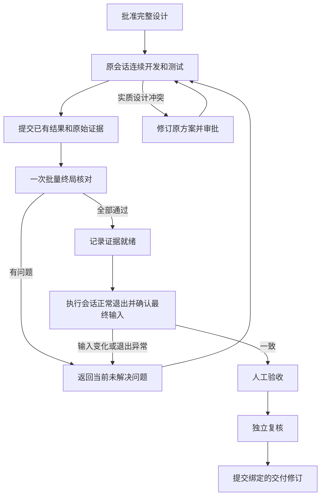

# DevFlow 原生执行改造审核与整改计划

日期：2026-09-16\
审核目录：`C:/Code/system-handle`\
审核基线：`e8f5dfc135d24ca4337a0888df13392595e333c8`（main）及审核时的未提交修改。\
对照方案：[DevFlow 原生执行与终局核验改造方案](DevFlow原生执行与终局核验改造方案.md)。

## 1. 审核结论

**审核不通过，当前代码不能作为“完整改造完成”提交。**

已经加入 native-v2 名称、工作包、交付清单、报告导入和核验类，但实际宿主接入、证据有效性、后续验收和资源优化没有形成完整链路。有些问题会拒绝真实交付；有些问题会把未经验证的结果标成通过。

本次按用户要求只审核并编写整改计划，未修复实现、未提交项目代码、未启动或恢复真实开发工作流。新增文件仅为本计划和审核证据。仓库同时包含路径迁移、pnpm 迁移、此前进度修复等修改，不把全部工作区差异都归因于本次原生模式改造。

### 实测结果

| 检查 | 实际结果 | 证明范围 |
| --- | --- | --- |
| TypeScript 类型检查 | 退出码 0 | 类型层面通过 |
| 现有 Vitest 单元及集成测试 | 38 个文件、141 项全部通过，144.62 秒 | 现有测试覆盖的行为通过 |
| 隔离缺陷复现 | R1–R10 均得到文中列出的异常行为；R11 检查了 3 份已有 AGY 日志 | 直接调用当前生产类，使用临时仓库和临时数据库 |
| 真实 AGY 日志格式抽查 | 3 份日志分别包含 2、35、198 条 tool 类型 step_update；新读取器均得到 0 条执行事实 | 当前读取器未处理实际宿主事件格式；不代表这些工具步骤全部是测试 |
| 生产构建、浏览器 E2E、付费模型真实执行 | 本次未执行 | 不能据此声称完整交付通过；整改后必须补齐 |

现有新增“原生执行成功”集成测试手工注入 `NativeRunRecordReader`，手工生成报告，只断言进入 HUMAN_PENDING 和存在 task_proof；它没有经过真实 AGY 日志解析，也没有继续点击人工验收、独立复核和提交。因此 141 项测试全绿与本次发现的问题并不矛盾。

### 审核证据

- [隔离复现源码](../test/evidence/native-review-20260916/reproduce.mjs)
- [隔离复现实际输出](../test/evidence/native-review-20260916/reproduction.jsonl)
- [检查命令与结果](../test/evidence/native-review-20260916/checks.json)
- [审核基线、工作区状态与 50 个相关文件的 SHA-256](../test/evidence/native-review-20260916/reviewed-files.json)

复现脚本里的成功报告、宿主执行事实是**有意构造的审核夹具**，用于验证校验器是否错误放行，不能当成业务测试通过证据。R11 只读取少量已有日志并输出事件计数，没有导出日志内容。复现命令：

```powershell
Set-Location C:\Code\system-handle
node --import tsx docs/test/evidence/native-review-20260916/reproduce.mjs
```

脚本仅在系统临时目录创建夹具；其中 Git 初始化和基线提交也只发生在临时仓库。

## 2. 必须保持的职责边界

1. **规划模型负责完整设计。** 明确架构、技术栈、表和字段、数据库文件与迁移管理、类与接口、模块逻辑、异常和事务、测试框架、测试层次、数据生命周期、业务场景和预期结果。
2. **执行模型负责完成实现和全部必要测试。** 使用宿主原生编辑、终端、浏览器工具，自主决定样例值、fixture、测试函数名、断言及命令参数，并自行调试。
3. **DevFlow 负责整体调度及结果核对。** 接收已有事实与报告，检查来源、版本、映射和范围，统一更新完成状态，衔接人工验收及独立复核。
4. **DevFlow 不再运行第二套测试。** 缺证据时返回原因给原执行会话；不能通过程序重跑、模拟退出码或伪造报告补齐。
5. 架构等实质设计冲突交由规划模型修订；普通实现错误和测试参数调整由执行模型处理。
6. 取消逐任务开始/声明、逐文件代理和逐工具权限进程，不取消整体范围、同会话恢复及最终交付真实性检查。

## 3. 缺陷清单

P1：阻断正确交付、错误放行或改变既有工作流行为，提交前必须修复。\
P2：明确违反方案、影响兼容性或无法证明资源目标，完整改造交付前同样必须解决。

### F01 / P1：宿主执行事实读取不支持实际 AGY 事件，未知退出码还会被当成成功

**位置**

- `packages/evidence/src/native-run-records.ts:36`，fromString；
- 同文件约第 78 行的 `item.result?.exit_code ?? 0`、第 102 行的 `item.exit_code ?? 0`；
- 同文件第 127 行附近 verify；
- 对照 `packages/adapters/agy/src/protocol.ts:71` 和 `session.ts:113`。

**问题与复现**

- 读取器只识别 tool_call/tool_result/command_execution，实际适配器处理的是 step_update，工具信息位于 step_update.tool_info。
- R1：按实际协议形状构造的工具完成事件解析为 0 条事实；R11 的实际日志也全部得到 0 条事实。
- R2：工具结果写着“Process still running”，没有退出码，仍得到 exit_code=0、valid=true。
- R3：真实事实为临时目录下的 `echo hello`，交付声明为 `pnpm test`，仅复用调用 ID 就得到 valid=true。verify 没有比较命令、工作目录或时间。

**整改**

实现有版本识别的 AGY 原始事件适配，覆盖同步命令、异步进程和后续状态查询、失败、取消、超时、重复步骤更新。事实使用 workflow/run/conversation/tool-call/process 的明确关联；step state=DONE 不能直接等同于测试进程成功退出。退出码缺失必须为 unknown。

核对宿主事实中的命令、规范化 cwd、运行轮次、实际完成状态及退出码。没有宿主事实的字段保存为“模型声明”，不能作为事实字段的降级来源。宿主记录保存来源文件及事件位置，业务工作区不能覆盖其权威副本。

**验收**

真实协议脱敏夹具能提取正确事实；无退出码、运行中、查询错进程、命令/目录不符、跨轮次、取消和失败全部拒绝。模型自报 0 不能改变宿主结果。异步测试最终成功能被正确接纳。

### F02 / P1：终局成功没有接通进度、人工验收、独立复核和提交

**位置**

- `packages/core/src/engine.ts:1155` 附近 deliver 成功分支；
- 同文件 `taskStatus():810`、`accept():543`、`verifyEvidence()`；
- `packages/runtime/src/workspace-observer.ts:88` 附近仍只读取旧证据。

**问题与复现**

deliver 写入 `workflow-task` 的简单 task_proof，而旧读取器使用 `workflow-revision-task`、文件哈希、claim、evidence 和 snapshot。新交付没有创建这些后续流程依赖的数据，也没有提供 native-v2 专用读取入口。

R4：返回 accepted、状态 HUMAN_PENDING；run 仍为 running，snapshot_id=null，任务却显示 pending/not_run。随后调用人工验收直接报 `NOT_FOUND: snapshot undefined 不存在`。现有文件观察器也无法据新交付证据判断后续改动应失效。

**整改**

建立统一的“当前有效交付”读取服务，为 native-v2 的任务进度、详情、人工验收、独立复核和提交提供同一结果；旧模式走兼容读取器。禁止通过填充缺字段的旧 task_proof 掩盖问题。

交付核验成功先记录“证据就绪”；等待当前执行进程正常结束、确认最终输入未变化，再开放人工验收。保持当前运行令牌与轮次校验；停止、异常退出和旧轮次回调不能推动状态。

为后续阶段建立不可变的交付修订及多仓输入/差异绑定。人工验收、复核、提交都绑定同一修订，代码变化即失效。可以扩展现有 Snapshot 作为兼容引用，但不能恢复逐测试 Git freeze 或重复测试。

**验收**

完整走通“交付→执行退出→进度更新→人工验收→复核→临时仓库提交”；通过前不能显示完成。运行未结束不能验收；交付后改代码、异常退出、旧回调、重复交付都不能跳过门禁。

### F03 / P1：指纹在交付时才生成，不能证明报告对应当前代码

**位置**

- `packages/evidence/src/delivery-importer.ts:45`；
- `packages/evidence/src/validator.ts:201`；
- `packages/contracts/src/index.ts:345` 的交付清单；
- `packages/workspace/src/fingerprint.ts:17`、第 71 行及第 98 行附近。

**问题与复现**

导入器先扫描当前工作区，校验器立即再扫描同一工作区。对比双方都是交付时状态，没有测试执行时的输入记录。清单也没有验证批次或测试时指纹的字段。

R5：生成报告后修改 app.txt，独立指纹对比明确发现变化，deliver 仍 accepted。\
R8：修改 .mvn/jvm.config 和 vitest.config.json，新指纹仍不变；文件列表甚至为空。

实现还会跳过所有点目录、按文件名误排除配置，吞掉读取错误，缺少明确的符号链接策略；另一方面，对未排除的大型构建目录、数据库文件可能进行整目录读取。既可能漏输入，也可能制造多余 IO。

**整改**

引入验证批次，把测试时输入、实际命令、报告及最终代码建立时序关系。批次开始/结束的指纹必须有宿主记录可追溯；终局核对最终输入。不能用交付时补生成的指纹替代测试时指纹。

优先使用宿主已有快照；缺少这项能力时，执行模型在验证批次边界通过原生终端调用只读输入采集器。采集器仅读取输入，不启动、包装或调度测试，不增加每个工具/每个用例的拦截。无法建立这条关系时明确判证据不完整。

按批准的输入规则纳入业务和测试源码、框架配置、锁文件、迁移、构建脚本及影响结果的环境版本。明确排除实际产物和报告路径，不能按“点目录”或“vitest*.json”粗略排除。读取失败报错；链接必须检查实际目标边界。模块依赖决定复用范围。

**验收**

测试后修改源码、测试断言、配置、锁文件或迁移都能使相关证据失效；相同输入的有效证据可复用。报告/日志变化不使源码失效；配置隐藏目录不得漏检；读取失败不得成功。指纹计算次数与验证批次有关，与用例数量无关。

### F04 / P1：验收映射没有检查引用关系，缺实现和设计冲突仍通过

**位置**

- `packages/evidence/src/validator.ts:79` 的 validExecutions；
- 同文件第 132 行附近 mapping.find；
- `packages/core/src/engine.ts:1157` 为所有任务写 proof。

**问题与复现**

validExecutions 集合建立后没有使用。映射只要 case_id 或 scene_id 能碰上就可能匹配，不要求属于正确的验收项；test_execution_id 不检查存在及有效性，也不检查报告归属。implementations 和 plan_conflicts 完全不参与有效性判断。

R6 同时提交空 implementations、错误 requirement_id、不存在的 test_execution_id，以及未实现所需架构的 plan_conflicts，仍 accepted；保存的通过结果甚至引用 NONEXISTENT-CALL。

**整改**

使用严格关联链：

`验收项 ID + 场景 ID → 测试执行 ID → 该执行产生的报告 ID → 报告中的用例 ID`。

每个引用都须存在、属于当前有效交付或允许复用的批次、与仓库和版本匹配。一个案例覆盖多个业务场景只能显式建立多条有依据映射，不能模糊匹配。检查实现位置存在且覆盖必需任务；未完成项和未解决的设计冲突阻止完成。实现记录本身不等于业务正确，语义充分性仍由最终复核判断。

**验收**

分别覆盖空实现、遗漏任务、虚假路径、错误验收项、跨报告、不存在执行、失败执行、重复/含糊案例及设计冲突，逐项拒绝；使用与业务编号不同的测试名称，只要精确映射就应通过。

### F05 / P1：整体范围校验缺失，多仓项目只验证第一个工作区

**位置**

- `packages/core/src/engine.ts:1115`；
- `packages/contracts/src/index.ts:347` 至交付清单结束；
- `packages/evidence/src/delivery-importer.ts:32`。

**问题与复现**

deliver 固定取 workspaces[0]；清单没有仓库绑定，也没有相对批准基线检查整体变更范围。safePath 只保护报告读取路径，不能替代最终代码范围检查。

R9：方案只批准 app.txt，增加 unapproved.txt 后仍 accepted。多仓项目也无法证明第二个仓库的实现和测试有效。

**整改**

交付实现、批次、执行和报告都携带 repo_id；按工作流已验证的 workspace 绑定解析实际根。终局统一检查所有仓库的基线、分支/工作树身份、实际变更、受保护路径、依赖及接口变更权限。区分任务开始前就存在的用户修改，不能把它们当成执行器成果或擅自提交。

这些检查放在交付边界，不恢复每次编辑的文件代理。范围外变化统一返回原会话；禁止自动删除或覆盖同事修改。

**验收**

新增/删除/重命名范围外文件、第二仓库漏实现/漏报告、路径逃逸、工作树换绑、已有用户修改均有对应测试。合法多仓交付能通过并分别绑定各仓差异。

### F06 / P1：工作包没有提供真实工作区，恢复可能继续使用旧方案正文

**位置**

- `packages/adapters/agy/src/handoff.ts:9`、buildFullHandoff、buildResumeHandoff；
- `packages/runtime/src/runtime.ts:439` 至第 489 行；
- 同文件第 535–538 行。

**问题与复现**

交接包只有相对任务路径，没有仓库实际根和范围绑定。启动 cwd 及 --add-dir 都是 DevFlow 容器目录，不能从精简交接确定应修改哪份业务工作树。

恢复只更新 handoff.json，不更新 HANDOFF.md，不传设计差异；甚至没有 design_file。R10：plan_revision=2，磁盘仍是 revision 1 old design。第一次从旧模式续接时可能根本没有 HANDOFF.md。当前恢复还把全部历史 feedback/issues 再次加入，没有解决状态和版本过滤。

**整改**

交接包显式列出 repo_id、真实 root、基线/工作树身份、整体范围及设计文件摘要。单仓默认 cwd 指向实际执行工作区；多仓交接提供明确目录表，宿主项目授权与这些实际根一致。元数据目录单独提供。

保存交接设计版本及哈希。同版本恢复只传新增反馈；方案变化则更新完整设计文件，并提供上一版本到当前版本的差异及受影响模块；初次恢复缺正文时补交完整包。沿用 conversation_id，不用新会话掩盖问题。

**验收**

模型能从工作包唯一确定真实工作目录；C 盘迁移后不再引用 D 盘根。恢复后的正文与计划哈希一致；旧会话迁移、缺正文、同版本恢复和设计修订均有真实交接测试。

### F07 / P1：旧计划会被静默切换模式，新旧工具边界也没有隔离

**位置**

- `packages/runtime/src/runtime.ts:436`；
- `packages/core/src/engine.ts:450`、deliver；
- `packages/mcp/src/tools.ts:27`；
- `packages/bridge/src/worker.ts:24`。

**问题**

runtime 将没有 task_model 的历史计划视为 native-v2，submitPlan 却把它按旧合同检查。旧合同的运行方式被静默改变。两种模式共用全部 worker 工具；native-v2 仍能调用 run_check/freeze/逐项工具，旧工作流也没有被阻止调用 deliver 进入另一套完成路径。

**整改**

统一模式解析：历史缺省值始终为 legacy；leaf-v1 保持兼容；只有明确批准 native-v2 才进入新路径。在原工作流提交迁移版本，保留会话、代码、暂停状态、审批和历史；不得因部署自动恢复任务。

MCP 工具发现和服务器端执行都按模式过滤。native-v2 保留终局交付、冲突及必要的大阶段状态/授权入口；不暴露受管编辑、逐项声明、freeze、run_check。仅隐藏工具描述不足以防止直接调用，处理函数也须检查模式和轮次。

**验收**

缺省旧计划、leaf-v1、native-v2 三类分别回归；直接调用错误模式工具被明确拒绝；迁移前后保持同一 workflow/conversation，暂停任务不被自动执行。

### F08 / P2：依赖报告文件名猜解析器，正常 E2E 报告会被拒绝

**位置**

- `packages/evidence/src/validator.ts:95`；
- `packages/contracts/src/index.ts:363`。

**问题与复现**

XML 才选 JUnit；路径带 playwright 才选 Playwright；其他都按 Vitest。R7：合法 Playwright JSON 放在 .reports/e2e.json，得到 EMPTY_REPORT 和 CASE_NOT_FOUND_IN_REPORT。报告格式应该由事实清单明确声明并校验，不能靠名称猜测。

**整改与验收**

报告实体具有独立 ID、format、repo_id、path、test_execution_id、hash、生成批次。显式选解析器并验证结构。报告叫 result.json、e2e.json 或任意合法名字都能正确解析；格式谎报、空报告、损坏报告必须拒绝。覆盖多项目/参数化案例、同名案例定位和失败/跳过/未执行状态，不能用标题碰撞消除必需场景。

### F09 / P2：资源优化多数尚未接入，Token 指标也没有落地

**位置**

- `packages/runtime/src/runtime.ts:61`、第 558–570 行；
- `packages/adapters/agy/src/session.ts:126`；
- `packages/contracts/src/config.ts:34`、`devflow.yaml:16`；
- `apps/web/src/main.tsx:1843`、第 1862 行；
- `packages/core/src/engine.ts:1278`；
- `packages/core/src/util.ts:78`；
- `packages/core/src/buffered-sink.ts`。

**实际状态**

- BufferedEventSink 只有 import，没有接入运行时；实际 stdout 每块 appendFileSync，每个 AgentEvent 又写数据库。
- 并发默认仍为 executors=3、heavy_tests=2、live_environments=6。
- 前端仍按 50ms/150ms 合并刷新；文件观察器仍按逐路径 150ms 读取文件，且只认识旧证据。
- stop 仍固定 services_retained=true。
- RunUsage 只有类型，未见生产写入；publicEvent 仍把含 token 的键抹为 REDACTED，把 reasoning 键过滤，不能据此量化 Token 改善。
- 指纹导入和校验会连续全目录计算两遍。

这些是当前代码连接关系的结论。**本次没有测出 CPU/IO/Token 的实际改善比例，也没有证据证明 Token 已降低或原来翻倍的确切归因。**

**整改**

把缓冲器接入真实 stdout/诊断链路；日志一份，数据库只存有界摘要、偏移和关键状态。报告按内容哈希去重，重复交付不重复复制。关键状态及时持久化；结束等待全部在途写入。

缓冲器实现串行写队列、包含在途数据的字节上限、背压和错误传播；使用 Buffer 或 StringDecoder，保证跨块中文 UTF-8 不损坏。当前 close 只等待当前缓存、并不等待先前 void flush，不能直接接上就算完成。

新配置默认 1 个执行器、1 套活动环境；已有明确配置保留并给出可见迁移项，不能配置文件和默认值不一致。前端 500ms 合并普通输出，关键状态即时更新。原生模式观察器只维护有界脏标记，在交付边界按依赖批量核验；页面读取不扫描源码。

暂停保留现场并停执行；停止关闭该工作流拥有的进程及服务，保留环境需明确选择。Token 从宿主真实 usage 提取，计数白名单保存，密钥继续脱敏；宿主缺值显示 unavailable。

**验收**

以固定输出回放测量写入次数、数据库增长、缓存峰值和退出刷盘；测试中文跨块、慢磁盘、写失败、停止中断。核对实际默认并发和页面刷新频率。相同工作包对比额外进程、工具/交接次数、文件哈希次数及真实 usage，原始数据不足不能宣布性能达标。

### F10 / P2：交付文件入口缺少当前轮次绑定及幂等性

**位置**

- `packages/core/src/engine.ts:1552` 至第 1573 行；
- `packages/evidence/src/delivery-importer.ts:41`；
- `packages/contracts/src/index.ts:345`。

**问题**

文件入口尝试容器下固定文件和全局 workspace_root 下固定文件，没有定位当前业务工作区。它只 JSON.parse，不像 MCP 入口那样做 DeliveryManifestSchema 校验。清单没有 workflow/run/revision 身份；导入器直接盖上当前身份，之后身份比较几乎成为自比。

每次导入都生成新的交付 ID、复制报告和创建问题；未解决问题没有稳定去重/关闭逻辑。恢复可能重复发送旧问题，增加 IO 和上下文。

**整改与验收**

两种入口共享同一校验管线。固定交接位置由 handoff 提供，限定当前 run，不再扫描全局同名文件。清单携带 schema_version、submission_id、workflow_id、run_id、conversation_id、plan_revision、plan_hash；服务器逐项对照权威状态。

使用 submission_id + manifest_hash 幂等；相同 ID 不同内容报冲突。报告内容寻址归档。问题使用稳定业务键，记录首次/最近出现和解决批次，只把当前未解决问题传入恢复包。覆盖旧文件、并发重试、崩溃恢复、两任务同名清单和格式错误，失败原因不能吞掉。

### F11 / P2：规划合同和技能说明仍有互相矛盾的要求，设计冲突没有完成流转

**位置**

- `packages/skills/devflow-plan/references/plan-contract.md:6` 及测试合同段；
- `packages/contracts/src/index.ts:49` 起 TaskSchema/TestSchema；
- `packages/skills/devflow-execute/SKILL.md`；
- `packages/core/src/engine.ts:1211` reportConflict。

**问题**

新增说明要求精简索引、测试名称由执行者决定；同一合同又要求旧任务长正文及“用例 ID 必须与实际报告完全一致”。Schema 只扩展 task_model 枚举，仍没有独立 native 设计引用合同。执行技能混放旧逐项测试/冻结流程，运行时又暴露旧工具，容易把执行器带回原流程。

reportConflict 只保存事件和 issue，没有明确的设计待修订状态及处置；清单中的计划冲突还被忽略，不能保证进入规划修订再返回原会话。

**整改与验收**

按模式提供独立合同/技能段和 Schema。native-v2 使用确定设计正文及 design_ref，场景使用稳定业务 ID；旧字段只用于旧模式兼容。验收索引规定框架、层次、数据策略和结果，不锁定样例值及测试函数名。

reportConflict 关联当前计划、受影响模块及原始证据；实质冲突进入 REPAIR_RESEARCH_REQUIRED，保留原会话，显示待修订原因。修订批准后发送计划差异并续接；普通实现错误留给执行者自主修复。不存在自动反复规划或重复测试循环。

## 4. 目标数据合同

继续使用现有 SQLite entities/events，不另建业务数据库。新增及修订结构如下，字段必须实际用于校验，不能只声明类型。

| 实体/合同 | 必需绑定 | 关键规则 |
| --- | --- | --- |
| NativePlan | mode、revision、hash、完整 markdown、模块/任务/验收索引、design_ref、仓库范围 | 稳定场景 ID 与真实测试名称分离；引用和依赖都存在 |
| Handoff | workflow/run/conversation、plan_revision/hash、真实 workspace 列表、设计版本、交接版本 | 初次完整；续接按版本提供差异 |
| VerificationBatch | batch_id、repo/input_manifest、宿主开始/结束记录、环境版本 | 明确测试执行时输入及时间范围；缺证据不能补成成功 |
| HostExecution | run/conversation、tool_call_id、process_id、实际命令/cwd、时间、完成状态、可空 exit_code、日志位置 | 事实和模型声明分开；unknown 不等于 0 |
| Report | report_id、format、repo/path、content_hash、execution_id、batch_id | 从同一份读取字节计算摘要并归档，防止读完后另一次 copy 获得不同内容 |
| Delivery | submission_id、manifest_hash、workflow/run/revision、输入/执行/报告引用、实现及未完成项 | 幂等接收，严格身份和引用校验 |
| AcceptanceResult | requirement_id、scene_id、具体执行/报告/案例关联、输入修订、结果 | 业务场景严格定位，允许显式一对多映射 |
| DeliveryIssue | 稳定 issue_key、模块/场景、原因、open/resolved、发现/解决交付 | 批量返回；修复后关闭；历史保留 |
| DeliveryRevision | plan、全部仓库输入、差异、有效证据集、执行已结束标记 | 人工验收、复核及提交共同绑定 |
| RunUsage | 宿主来源、input/output/cache/reasoning、采集时间 | 来源缺失保留空值，不估造数据 |

InputManifest 记录输入规则版本、repo_id、模块及依赖、文件摘要和生成批次；不能只存一张没有仓库和时序的文件表。

## 5. 状态与后续阶段的具体实现



- 在执行结束前，UI 显示“证据就绪，等待执行结束”，不开放验收。
- 拒绝交付时把所有错误一次返回；不删除实现，不创建另一工作流。
- 每次交付使用当前提交结果加允许复用的既有有效证据，缺什么补什么。
- 人工验收绑定 DeliveryRevision；独立复核查看真实代码差异、测试源码和业务断言充分性。报告全绿不自动替代复核。
- 原生路径后续阶段统一调用新证据读取服务，不能某阶段又读取空的旧 evidence。
- 提交前校验修订仍有效，并保留已有用户修改；不触发程序二次运行测试。

## 6. 按依赖顺序执行的整改工作包

### A. 固化边界、模式与缺陷回归

**文件范围：** contracts、plans/validate、skills、mcp/tools、bridge/worker、新增审核回归测试。\
落实 F07、F11 的模式分流和业务 ID 定义；把 R1–R10 改写为能稳定失败的自动回归。保持旧工作流暂停及历史不变。\
**完成条件：** 明确三个模式的解析和入口边界；新计划不再锁定测试函数名；回归测试准确命中现有缺陷。

### B. 原生工作区及会话交接

**文件范围：** adapters/agy/handoff、native-adapter、project、runtime/execute。\
落实 F06；选择 AgyNativeAdapter 作为唯一原生启动实现，runtime 调用它，避免留下未使用的同名类和重复逻辑。项目授权使用真实根；工作包目录与代码工作区清晰分离。\
**完成条件：** 跨模块原生编辑和测试可用，初次与续接工作包正确，设计变更同步且会话 ID 保留。

### C. 执行事实、验证批次和报告导入

**文件范围：** evidence/native-run-records、delivery-importer、workspace/fingerprint、contracts。\
落实 F01、F03、F08、F10；引入真实 AGY 脱敏夹具、严格身份、未知状态、批次指纹、显式格式、单份归档和幂等性。\
**完成条件：** 原始执行到报告的来源链可追溯；旧报告、错轮次及缺事实不能通过；导入启动测试进程次数为 0。

### D. 终局校验、整体范围和问题闭环

**文件范围：** evidence/validator、core/engine、workspace/git 边界检查。\
落实 F04、F05；校验所有仓库、实现覆盖及精确映射，管理当前未解决问题和局部证据复用。\
**完成条件：** R5/R6/R9 转为拒绝，合法多仓及不同案例名映射可通过；一次返回完整问题集。

### E. 进度、人工验收、复核和提交

**文件范围：** core/engine、core/progress、runtime/workspace-observer、API/detail、web/panels。\
落实 F02；使用统一交付读取服务，等待执行退出；打通不可变交付修订、验收、复核和临时仓库提交。\
**完成条件：** 完整流程集成与 UI 操作通过；任何阶段的输入变化都能阻断旧证据使用。

### F. 日志、资源、Token 与停止语义

**文件范围：** core/buffered-sink、adapters/agy/session、runtime、store/events、config、devflow.yaml、web/main、usage 展示。\
落实 F09；真实接入批量写、背压、单份原始数据、低频刷新及资源默认值；补齐暂停/停止/保留环境的实际行为。\
**完成条件：** 性能基准达标、退出可靠刷盘，既不丢日志也不无限增长；真实 usage 可追溯。

### G. 旧工作流兼容、文档及完整交付验收

保留 D→C 迁移结果、pnpm 工作流、旧模式及用户已有修改。更新说明为最终实现。执行第 7 节全部验收，记录原始结果，重新独立审核。\
**完成条件：** P1/P2 均有已通过的对应验收；真实原生 smoke 完成后，才能提出提交。不得为了通过审核修改原验收要求或删减必需测试。

## 7. 验收矩阵

| 编号 | 场景 | 必须得到的结果 |
| --- | --- | --- |
| T01 | AGY 同步、异步命令及恢复后的 step_update | 正确归属当前会话/轮次/进程 |
| T02 | 退出码缺失、运行中、失败、取消、超时 | 不能当成成功 |
| T03 | 调用 ID 相同但命令/cwd/轮次不符 | 拒绝并指出不一致字段 |
| T04 | 测试后修改源码、测试或公共配置 | 对应证据失效 |
| T05 | 修改隐藏配置、锁文件、迁移；输入读取失败 | 发现变化或报告证据不完整 |
| T06 | 只有报告/日志变化，输入相同 | 不制造源码变化误报 |
| T07 | 空实现、缺任务、假路径、未解决设计冲突 | 拒绝交付 |
| T08 | 错验收项、不存在执行、跨执行/报告、含糊用例 | 拒绝，引用关系明确 |
| T09 | 业务场景 ID 与测试函数名不同 | 正确映射后通过 |
| T10 | 合法 Vitest/JUnit/Playwright 任意文件名 | 按声明格式解析；失败/跳过不放行 |
| T11 | 范围外新增/删除/重命名、第二仓库漏项 | 拒绝；原用户修改得到保护 |
| T12 | 同交付重复、并发重试、旧清单、格式错误 | 幂等/拒绝，不能重复复制或吞掉错误 |
| T13 | 一个模块修复，其他输入未变 | 复用有效证据，只补受影响部分 |
| T14 | 核验通过但执行仍运行或异常退出 | 不开放人工验收 |
| T15 | 交付→退出→进度→人工验收→复核→提交 | 同一交付修订完整走通 |
| T16 | 任一后续阶段代码变化或过时回调 | 阻断旧证据，提示具体原因 |
| T17 | 正确 C 盘工作树、方案修订、缺正文恢复 | 目录与正文版本正确，同会话续接 |
| T18 | legacy/leaf-v1/native-v2 工具互调 | 模式隔离，旧合同行为保留 |
| T19 | 暂停、停止、重启、迁移 | 无擅自恢复；拥有的资源按语义关闭 |
| T20 | 高频输出、慢写入、中文跨块、写失败、退出 | 顺序正确、背压有效、字节完整、错误可见 |
| T21 | 摘要/页面刷新及日志回放 | 不扫描源码，不重复保存完整原始输出 |
| T22 | 真实原生开发 smoke | 跨模块开发及测试由模型完成，DevFlow 导入时启动测试次数为 0 |
| T23 | 性能和真实 usage 对照 | 有来源和测量口径，不能用模拟数据宣布改善 |

自动验收分层执行：类型检查 → 针对性回归 → 全量单元/集成 → 生产构建 → Playwright UI E2E → 隔离原生模型 smoke → 独立代码复核。调用项目已安装工具，保留 pnpm 的依赖与锁文件约束。

原生 smoke 至少包括：完整设计读入、实际业务工作区修改、单元和集成/E2E 测试真实执行、一次失败后自主修复、批量交付、人工验收、独立复核，以及只向临时仓库提交。宿主记录和原始报告必须能被审核者复核。不要把手工构造的 reader 夹具标记为“真实原生执行”。

## 8. 资源目标与测量口径

- 固定输入、同一机器、同一并发、记录冷/热缓存条件；把迁盘带来的改善与程序改动分开。
- 高频输出回放保持字节数相同。普通日志按 500ms 或 64KiB 批量持久化；关键状态例外单独计数。持久化次数不能仍与输入 chunk 数一一对应。
- 数据库不保存完整原始输出副本；报告相同内容只归档一次。用实际文件写入计数、字节数和数据库增长验证。
- 缓冲字节上限覆盖待写和在途部分；压力结束后内存回落，无未结束写任务。
- 原生执行没有逐工具新增 PowerShell/Node 权限进程；批次输入采集单独计数，不按用例重复整仓扫描。
- Token 分列模型输入、输出、缓存、推理和 DevFlow 交接信息；同版本续接不重发全文和已解决问题。没有宿主 usage 时明确缺测，不按文字长度估造。
- 同时记录 CPU、工作集内存和磁盘写入；目标及实测数据写进测试记录。不能仅凭新类存在、配置注释或测试通过声明卡顿已解决。

## 9. 交付与提交条件

整改完成时逐项列出 F01–F11 的实现位置、对应 T 编号、测试结果和仍有的限制。所有证据绑定新的审核基线；不能沿用本次通过计数代表修改后的代码。

本次审核发现问题，因此**不提交当前代码**。待上述修复与验收完成，再进行独立审核；审核通过后按用户授权提交明确核验过的改动，保留其他未纳入提交的用户修改。
