# DevFlow 工作流详细开发计划

> 2026-09-11 修正：用户明确取消 Windows 账户级隔离。当前采用本人 Windows 用户、统一自然语言入口和自动接入；以下相关章节已修订。安装/运行以 [使用指南](../guide/使用与恢复指南.md) 和 [入口修正](../design/DevFlow入口与运行方式修正.md) 为准。控制台登录、配对及通行密钥要求也已取消；当前测试结果见本轮验证报告，原验收数字属于历史版本。

版本：1.0 需求基线 · 编写日期：2026-09-11 · 状态：已获用户实施授权，源码与真实联调已开展

需求依据：[配置AI开发工作流工具](chatgpt-conversation://6aa34e40-d424-83ea-937d-7a3c9eaadf81) 的全部三轮讨论。本文将已确定要求落实为开发合同，不把原会话中的示例代码当作已经实现的功能。

配套文档：[开发进度](../process/DevFlow工作流开发进度.md) · [测试计划与进度](../test/DevFlow工作流测试计划与进度.md) · [使用指南](../guide/使用与恢复指南.md) · [实施接口对应](../design/实施接口与原计划对应.md)。下文保留开发前的需求合同；真实 agy/OpenTabs/Codex 联调确定的工具名、分页机制、端点与 Schema 兼容性以实施接口对应文档和源码合同为准。未完成的人工验收及 Windows 受管安装不会标成通过。

## 阅读导航

| 想了解什么 | 阅读位置 |
|---|---|
| 整体如何运转、GPT-6 何时介入 | [第 1—3 节，先看图](#1-交付目标与固定决策) |
| 每个流程为什么不会跳步或串任务 | [第 4—6 节](#4-状态机和不可跳过的条件) |
| worktree、端口、数据库和浏览器如何隔离 | [第 7—8 节](#7-工作区多项目并行和恢复) |
| 实际怎样调用 agy、接收日志、停止与恢复 | [第 9 节](#9-agy-调用响应日志停止和恢复) |
| 测试、人工验收、独立复核、自动提交 | [第 10—12 节](#10-测试真实进度与人工验收) |
| 需要哪些 Skill、MCP 和配置文件 | [第 13—15 节](#13-skill-文件模板和报告规则) |
| 按什么顺序开发、每项做什么 | [第 16 节](#16-模块目录开发顺序和原子任务) |
| 如何验收、安装、恢复、交接 | [第 17—19 节](#17-验证策略与整体交付条件) |
| 原生能力的核实来源 | [第 20 节](#20-核实资料与来源) |

## 1. 交付目标与固定决策

### 1.1 最终使用体验

你在 Codex 桌面向 GPT-6 提出需求；GPT-6 完成调查、必要确认和图解计划。你批准具体版本后，本地 DevFlow 启动 agy 中的 Gemini 3.7 Flash（High）。你在本地控制台实时查看工具活动、代码差异和测试日志，随时停止并反馈。自动验证结束后，你实际操作验收；只有你验收通过，DevFlow 才启动新的 GPT-6 会话独立复核。复核无阻塞问题且证据一致时，自动提交本地任务分支。

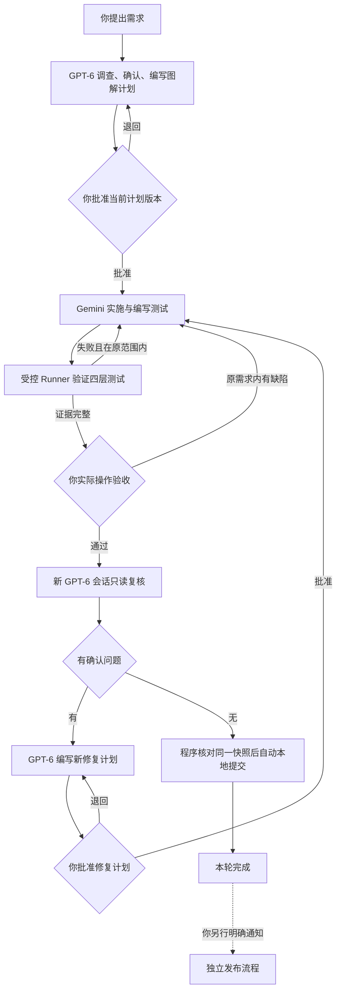

图 1：自动测试完成只通知你验收，此时 GPT-6 仍未启动。原范围外的新事实进入暂停状态，由你明确返回规划入口处理。

### 1.2 第一版选型

| 项目 | 固定决定 | 理由与交付边界 |
|---|---|---|
| 对话入口 | Codex 桌面，GPT-6 Astra | 使用已购买订阅；不建设聊天客户端 |
| 规划与复核模型 | `gpt-6-astra`，默认 `high` | 复核必须新会话；不与 Gemini 共享隐式上下文 |
| 执行模型 | agy CLI，`gemini-3.7-flash-high` | 固定模型，逐轮启动；不自动降级或转 API |
| 常驻服务 | Node.js 22.23.2 + TypeScript，单实例控制器 | 与本机运行时一致；升级必须经过兼容检查 |
| HTTP 与 MCP | Fastify + MCP TypeScript SDK v2 | HTTP MCP 对接 Codex；stdio 桥接 agy 到常驻服务 |
| 状态持久化 | SQLite，WAL，单写入队列；文件保存大证据 | 面向一台电脑，无需部署数据库服务器 |
| 实时界面 | React + Vite 本地网页；可在 Codex 浏览器面板打开 | 支持日志、Diff、图解审批；不增加桌面壳 |
| 事件推送 | WebSocket；HTTP 按序补读历史 | 普通程序推送；不用模型轮询 |
| Windows 管理 | 小型 .NET 10 Windows Host 辅助进程 | 管理 Job Object、进程归属和句柄；仅使用当前 Windows 用户 |
| 执行权限 | MCP 受控文件工具 + 命令注册表 + 隔离测试身份 | 不向模型开放任意 shell；详见第 6 节 |
| 自动测试 | Vitest、真实临时 Git 仓库与进程集成测试、Playwright | 仓库接入后沿用该仓库已有测试体系 |
| 真实浏览器验收 | 复用现有 OpenTabs，经 DevFlow 浏览器网关协调 | 不重新安装，不覆盖现有全局配置 |
| 人工审批 | 本机控制台直接确认 + 版本/快照校验 | 记录用户选择的准确对象，拒绝陈旧页面和重复提交 |
| 最终提交 | 自动提交任务分支；多仓库逐库记录结果 | 不自动 push、merge、rebase 或发布 |
| Cursor / Grok 4.6 | 保留执行器接口；第一版禁用 | 用户主动启用时才开展独立接入与模型核实任务 |

MCP SDK v2 的包名是 `@modelcontextprotocol/server`、`@modelcontextprotocol/client`，不混用旧版教程的导入路径；首个基础任务锁定实际安装版本和 lockfile。[官方 SDK](https://raw.githubusercontent.com/modelcontextprotocol/typescript-sdk/main/README.md)

### 1.3 全部需求追踪

| 编号 | 用户要求 | 落实位置 |
|---|---|---|
| R01 | GPT-6 做入口、调查、计划与独立复核 | §3、§9、§11、§13 |
| R02 | Gemini 3.7 Flash High 实施与测试 | §9、§14 |
| R03 | 使用现有订阅，不偷偷换模型或 API 计费 | §9.5、§14.1、§18 |
| R04 | 复杂任务、问题排查生成计划/进度/测试三份文档 | §13.5、配套两份文档 |
| R05 | 普通任务只用一个详细计划，但流程相同 | §4.1、§13.5 |
| R06 | 计划包含核心思路、精确到执行者可以照做的原子任务 | §13、§16 |
| R07 | 调研时确认所有已知决策，正式计划无未决方案 | §4.1、§13.2 |
| R08 | 优先局部修改，禁止借机全部重构 | §6、§11、§13 |
| R09 | 计划及新修复计划都需人工批准 | §4—5、§11 |
| R10 | 真正完成后才能勾选，报告由证据生成 | §10、§13.5 |
| R11 | 单元、集成、E2E、OpenTabs 真实 UI 验收 | §10、测试文档 |
| R12 | 自动测试后先由用户实操，有问题直接给 Gemini | §3、§4.3、§10.4 |
| R13 | 用户验收通过后 GPT-6 才介入，不持续监控 | §3、§9、§11 |
| R14 | 复核正确性、质量、SOLID、漏改、回归与安全 | §11.2 |
| R15 | 发现问题就修复计划—批准—执行—测试—实操—复核循环 | §4、§11 |
| R16 | 通过即自动本地提交；发布只能另行通知 | §12 |
| R17 | 实时看到公开输出、工具、服务日志与 Diff；能停止 | §9、§15 |
| R18 | 明确 MCP、Skill、服务的职责差异与配置 | §2、§5、§13—14 |
| R19 | 支持新 worktree 或现有目录，多仓库前后端 | §7 |
| R20 | worktree 临时端口与前后端目标一致，配置不入库 | §8 |
| R21 | 同项目不同 worktree、不同项目同时执行 | §7.3、§17 |
| R22 | 复用 OpenTabs，争用浏览器按场景加锁 | §8.4、§10.3 |
| R23 | 图解先行，多流程图/时序图，避免只有文字 | 本文图 1—13、§13.2 |
| R24 | 错误、额度、失联、迟到事件、重启不导致假成功 | §4.4、§7.4、§9.5 |
| R25 | 各分支验证不代表合并后验证，整合另起流程 | §12.4 |
| R26 | 可选 Cursor Grok 4.6 执行器 | §1.2、§9.6 |

“100% 完成”定义为：已批准任务、必需测试和验收条件全部有当前版本证据，没有未解决的确认问题。它不等于证明软件永远无缺陷。语义判断由模型复核与人工验收承担，程序不能仅靠 Schema 判断代码正确。

### 1.4 本次调查已核实的事实

| 检查 | 结果与限制 |
|---|---|
| 原会话 | 已读取三轮完整用户要求及相关回答，不只采用缓存预览 |
| 当前项目 | `D:/Code/system-handle` 尚无源码和项目级 AGENTS.md，按新项目规划 |
| Codex CLI | `0.152.0`；本地帮助确认 `exec`、`--json`、`--output-schema`、`--sandbox read-only`、`--ignore-user-config` |
| GPT-6 | 本地模型缓存含 `gpt-6-astra` 与 `high` 推理配置；账户可用性以你的确认作为前提 |
| agy CLI | `1.1.27`；本地帮助确认 `--model`、`--effort`、`--conversation`、`--output-format stream-json`、`--print-timeout` |
| agy 模型查询 | 本次受限进程报告日志目录拒绝访问、登录态不可用，未获得有效账户模型列表；不据此判断你的订阅或日常登录失效 |
| Gemini 标识 | 官方 Headless 文档列出 `gemini-3.7-flash-high`；实施时运行身份必须实际验证 |
| 工具链 | Node `22.23.2`；Git `2.49.0.windows.1` |
| OpenTabs | 按你的要求复用现有安装；本次没有访问浏览器标签、读取密钥或改动配置 |

以上是调查事实。后文的启动验证是明确的工程验收任务，失败就停止相应功能，不构成让执行者自行选择方案的未决项。

## 2. Skill、MCP、Workflow 各自负责什么

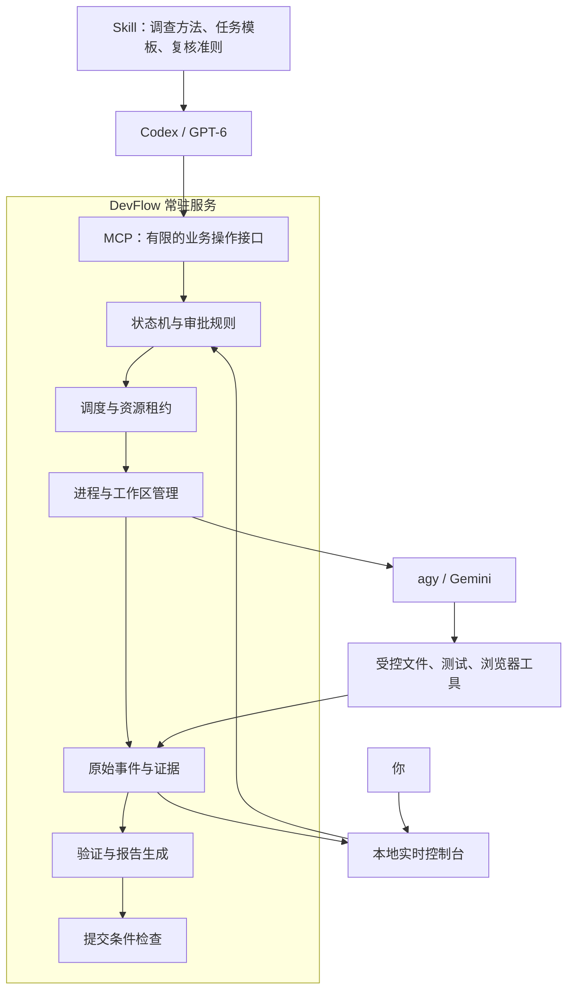

图 2：MCP 只负责传输调用，工作流规则必须写在服务端。Skill 可以附脚本，但仅写一句“不要越界”没有文件隔离效果。

| 层 | 负责 | 权威来源 |
|---|---|---|
| Skill | 调研、图解、拆解、复核方法；何时交接并结束回合 | 受保护的规则版本 |
| MCP | 工具发现、参数校验、角色鉴权、短请求 | 请求中的身份和服务端绑定 |
| Workflow | 合法状态迁移、审批版本、排队、恢复、提交条件 | 持久状态与事务 |
| agy Adapter | 启动指定模型、解析事件、记录会话、取消进程 | 进程与原始事件 |
| Runner / Browser Gateway | 真正运行检查和浏览器操作 | 当前快照的原始证据 |
| Markdown | 供人审批、查看任务及测试进度 | 状态库派生，不反向成为执行事实 |

## 3. 从用户发起到提交的完整时序

### 3.1 规划交接、执行与自动验证

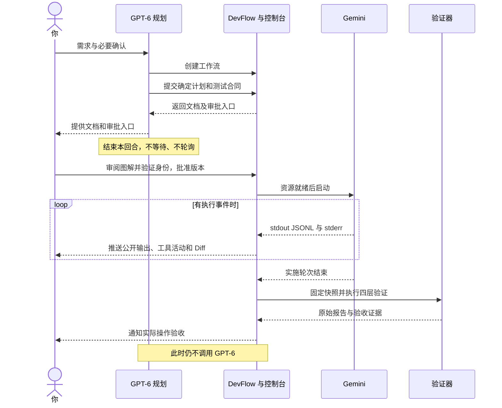

图 3A：验证器包括 Runner，以及取得场景锁后由 Gemini 操作的 OpenTabs 阶段；它们的资源分配见第 9 节。

### 3.2 人工反馈、独立复核与提交

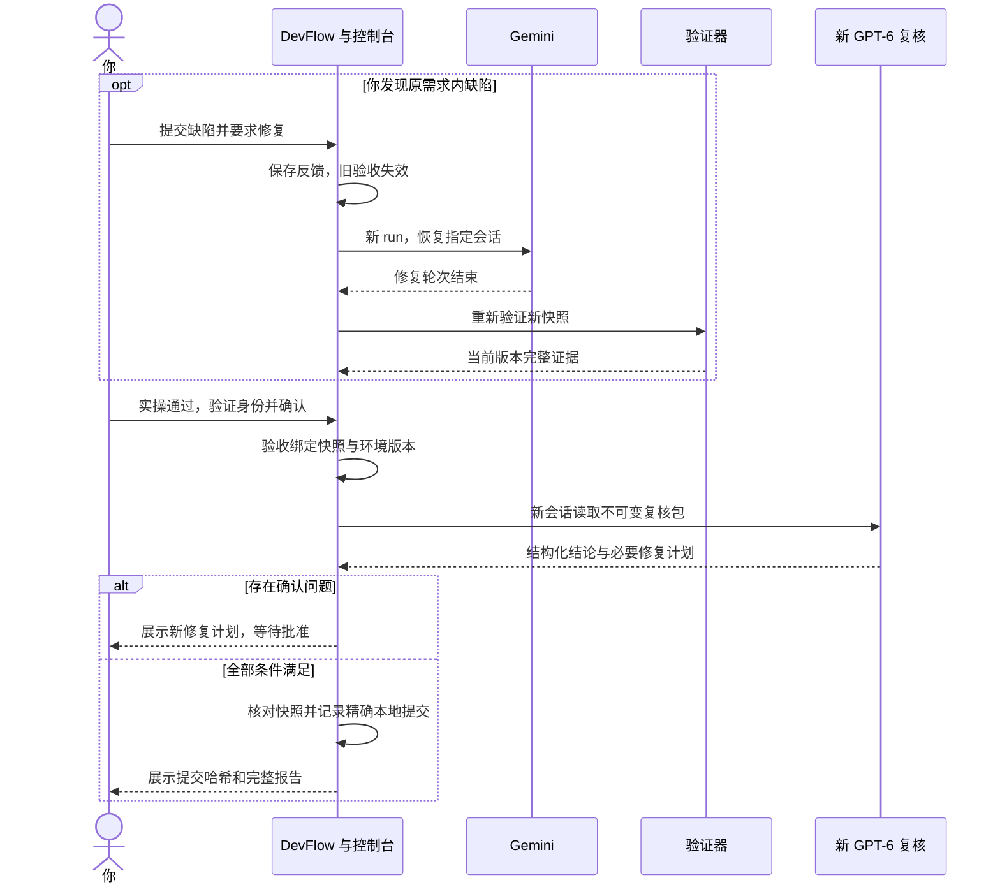

图 3B：控制器有进程健康检查和资源调度计时器；这些是本地程序，不消耗 GPT-6 推理回合。MCP 通知不承担唤醒原桌面会话的功能，自动复核由 `codex exec` 完成。[Codex 非交互执行](https://developers.openai.com/codex/noninteractive/)

## 4. 状态机和不可跳过的条件

### 4.1 任务分类与计划冻结

只要属于问题排查，或包含跨模块/跨仓库、数据变更、并发、权限、多个验收场景中的任一项，就标记 `complex`，生成三份文档。其余局部、根因和边界清楚的任务标记 `simple`，计划中内嵌进度与测试区。分类与原因写入计划，审批后不能为了少做测试而降级。

规划者可自行决定常规实现细节，但必须在提交前解决影响行为、范围、数据和验收标准的已知问题。决策记录包括问题、最终答案、来源、时间和受影响任务。`unresolved_decisions` 必须为空；动态端口等按明确算法分配的运行值不属于未决方案。

计划合同由服务端统一解析生成：计划正文、任务 DAG、测试目录、修改边界、基线、配置摘要、Skill 哈希。UTF-8、LF、规范 JSON 排序后计算 `plan_hash`。Markdown 的派生进度区不参与这个哈希；正文和静态测试要求始终参与。

### 4.2 主状态与执行阶段

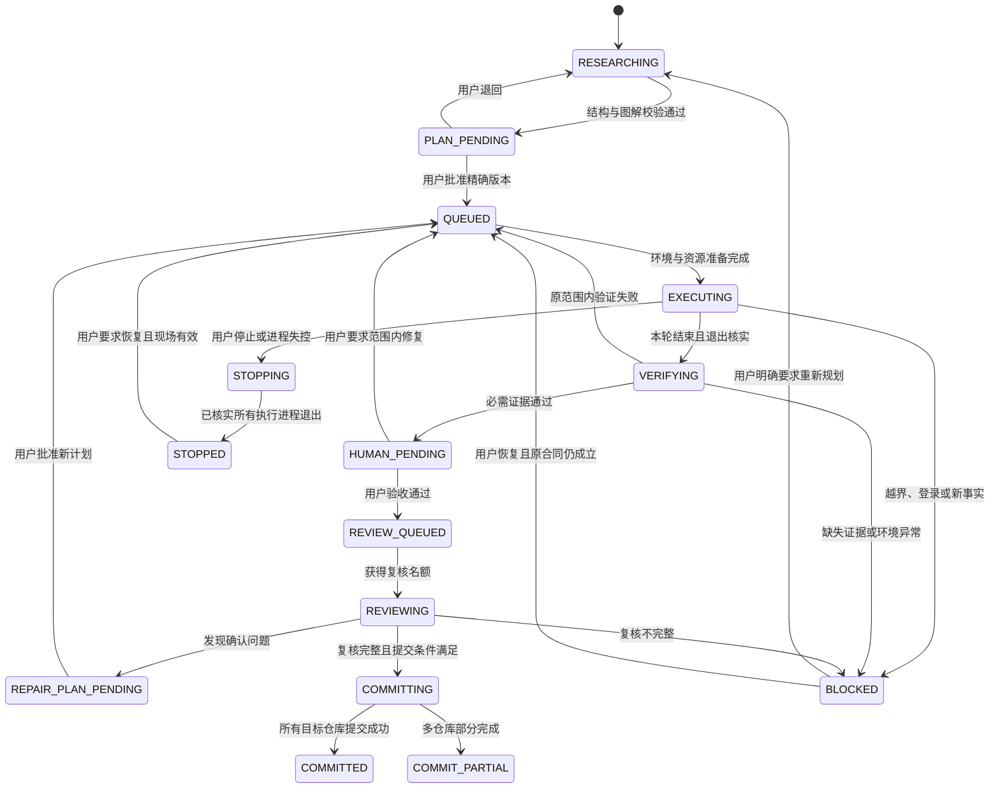

图 4：主状态单独保存；`stage` 区分 `implementation / automated_tests / browser_acceptance / review`，避免把“等待浏览器”误当成失败。`QUEUED` 记录所需资源和恢复位置。任何活动状态在服务失联后进入 `RECOVERY_REQUIRED`，完成现场核查后才回到明确阶段。

| 事件 | 强制检查 | 结果 |
|---|---|---|
| `PLAN_SUBMITTED` | 决策清零；图能解析；任务/测试编号存在；范围与基线完整 | `PLAN_PENDING` |
| `PLAN_APPROVED` | 用户凭证；当前 revision/hash；配置和基线一致 | 入队，不在 HTTP 请求内长时间执行 |
| `RUN_STARTED` | 有效审批、工作区锁、独占会话、资源租约、Hook 自检 | `EXECUTING` |
| `AGENT_TURN_FINISHED` | init 身份一致；唯一终局结果；进程及子进程核实 | 仅结束模型轮次 |
| `VERIFICATION_PASSED` | 测试发现集合、报告、快照、环境、退出码全部匹配 | `HUMAN_PENDING` |
| `HUMAN_ACCEPTED` | 用户验证；当前快照和环境；相关代码未变 | 只入复核队列 |
| `REVIEW_PASSED` | 范围完整；复核清单全部完成；问题已处置；快照一致 | 尝试提交条件检查 |
| `REPAIR_PLAN_SUBMITTED` | 问题有证据；新版本静态合同；不覆盖旧计划 | 等待新批准 |
| `SOURCE_CHANGED` | 对比内容而非仅 mtime | 旧测试、实操验收和复核失效 |
| `COMMIT_CONFIRMED` | Git tree、父提交与提交意图一致 | 记录本地 commit SHA |

### 4.3 反馈与修复规则

人工反馈必须绑定 workflow、run、snapshot。选择“停止并按反馈继续”先撤销旧运行令牌、停止进程、记录现场，然后创建新 run。原任务缺陷、批准路径和验收条件均未变时，恢复原 Gemini 会话修复，不调用 GPT-6。

出现新增业务、公共 API 改动、依赖升级、允许路径扩大或根因推翻时，一律 `BLOCKED/SCOPE_CHANGE`。界面显示证据和“返回 Codex 重新规划”入口；不自动调用 GPT-6。用户主动发起的新规划属于新的明确介入。

复核发现确认问题则由该 GPT-6 复核轮次输出修复计划。能依据现有事实确定局部修复时，直接提交新版本供审批；存在必须询问用户的问题时先进入 `REPAIR_RESEARCH_REQUIRED`，不展示含未决项的可批准计划。

### 4.4 状态迁移算法

每个写请求必须经过相同步骤：鉴权 → 校验上下文 → 检查幂等键 → 比较 `expected_version` → 校验状态和资源 → 事务写新状态、事件和 outbox → 提交事务 → 异步消费 outbox。外部进程启动、文件系统和 Git 不能伪装成数据库原子事务。

消费 outbox 必须幂等。启动前建立 `launch_intent`；Host 以 `run_id` 去重启动，完成后登记进程；重启时先查询 Host 已存在的 Job，绝不因消息重投再开一个执行器。旧版本/旧 run 的消息仍保存审计，但不能推进新状态。

## 5. 身份、审批、MCP 与内部接口

### 5.1 身份和通用上下文

业务身份固定为 `project_id → workflow_id → plan_revision → run_id`；每个 workflow 可以关联多个 `workspace_id`。`conversation_id` 属于具体适配器和 workflow；`snapshot_id` 表示跨仓库内容清单。MCP session ID 仅是通信会话，不替代上述业务主键。

```json
{
  "schema_version": 1,
  "request_id": "req-0001",
  "idempotency_key": "wf-101-submit-r01",
  "project_id": "crm",
  "workflow_id": "wf-101",
  "plan_revision": 1,
  "expected_version": 7
}
```

写入操作增加与该阶段相符的 `run_id / snapshot_id / environment_revision`。服务端从令牌取角色和可访问工作流，不接受客户端提交 `role=human`。创建 workflow 时服务端生成 ID；读接口必须明确 ID，列表分页默认 20、最大 100。

### 5.2 模型可以调用的 MCP 工具

下面所有 `devflow_*` 工具均需开发；不存在通用 `set_state`、`approve_plan`、`accept_for_user`、`commit` 或任意 shell 工具。

| 工具 | 调用者 | 主要入参 | 输出与限制 |
|---|---|---|---|
| `devflow_list_projects` | 规划者 | cursor、limit | 可访问项目、登记仓库和配置版本 |
| `devflow_create_workflow` | 规划者 | project、标题、需求、复杂度、工作区策略、幂等键 | 服务端 ID、`RESEARCHING`、版本；不启动代码修改 |
| `devflow_get_context` | 规划/执行/复核 | workflow、材料类型、分页 | 仅返回本角色需要的合同、地址和摘要 |
| `devflow_record_decision` | 规划者 | 问题、确定答案、来源 | 仅调研阶段可用；模型记录不能代替人工审批 |
| `devflow_submit_plan` | 规划者/修复规划 | 通用上下文、正文、tasks、tests、scope、decisions | 异步校验 operation ID；完成后返回版本、hash、文档地址 |
| `devflow_get_workflow` | 规划者/用户查询 | workflow、include、cursor | 只读快照；Skill 禁止监工循环 |
| `devflow_get_artifact` | 所有模型按角色 | workflow、artifact_id、offset、limit | 受限文件内容；不能传任意磁盘路径 |
| `devflow_fs_list` | 执行者 | workspace、relative_path、cursor | 限定目录树，隐藏凭证和控制文件 |
| `devflow_fs_read` | 执行者 | workspace、path、行区间 | 文件内容、SHA-256；大文件分页 |
| `devflow_fs_search` | 执行者 | workspace、query、glob、limit | 安全调用搜索库，参数不交给 shell |
| `devflow_fs_apply_patch` | 执行者 | run、workspace、变更数组、原内容 hash | 原子文件变更、最新 hash；仅获批路径 |
| `devflow_request_check` | 执行者 | run、已登记的 command_id、task_ids | 返回 check_id；由 Runner 决定执行方式 |
| `devflow_get_check` | 执行者 | check_id、cursor | 有限结果读取；长测试可结束模型阶段再恢复 |
| `devflow_report_task` | 执行者 | run、task_id、实现说明、证据引用 | 记录声明；不直接勾完成 |
| `devflow_report_blocker` | 执行者 | run、类别、事实、证据 | 保存阻塞并停止相关执行；不自动改计划 |
| `devflow_browser_list_tools` | 浏览器验收执行者 | run、scene_id | 获准工具的真实 Schema |
| `devflow_browser_call` | 浏览器验收执行者 | run、scene、tool_name、arguments | 锁、URL、标签身份检查后转发 OpenTabs |

复核输出由可信 Codex Adapter 收集，不要求复核模型持有可写状态 MCP。所有工具定义 `inputSchema`、`outputSchema`、`structuredContent`；适当设置只读/幂等提示，但服务端仍独立鉴权。错误包含 `code、message、retryable、current_version、next_action`，不返回密钥或完整堆栈。

### 5.3 人工控制 API

| 方法与路由 | 请求关键字段 | 行为 |
|---|---|---|
| `POST /api/human/challenges` | action、workflow、当前版本及内容 hash | 签发一次性、60 秒有效挑战 |
| `POST /api/workflows/:id/approve` | revision、plan_hash、challenge/assertion | 校验用户验证后批准合同 |
| `POST /api/workflows/:id/reject-plan` | revision、reason | 原审批失效，返回规划 |
| `POST /api/workflows/:id/stop` | run_id、mode | 撤销能力并停止；安全停止可使用用户会话，不额外弹验证 |
| `POST /api/workflows/:id/feedback` | snapshot、文本、task_ids、action | 记录反馈；恢复执行须绑定最新状态 |
| `POST /api/workflows/:id/resume` | 原因、run/snapshot、challenge/assertion | 确认现场后恢复原批准合同 |
| `POST /api/workflows/:id/accept` | snapshot、environment_revision、验收项、assertion | 冻结验收事实，创建一次复核请求 |
| `POST /api/workflows/:id/environment/stop` | environment_revision | 明确关闭该任务环境，区别于停止模型 |
| `GET /api/workflows/:id/events` | after_seq、limit | 分页补读已落盘事件 |
| `GET /api/workflows/:id/diff` | snapshot、workspace、path | 返回明确版本差异 |

鉴权失败为 401/403；状态或幂等冲突为 409；Schema/范围无效为 422；限流为 429；依赖不可用为 503。异步操作返回 202 与 operation ID；普通读请求 200。模型侧 MCP 将同类错误转换成结构化工具错误，不混淆 JSON-RPC 传输错误和业务拒绝。

### 5.4 人工批准的可信边界

控制台只监听 `127.0.0.1:4810`，人工页面使用 `http://localhost:4810`。打开即用，不注册、不配对、不登录、不使用 Windows Hello 或 WebAuthn。批准、验收按钮提交页面上实际展示的 action、workflow_id、version、plan_revision、plan_hash、snapshot_id 和 environment_revision；服务端与当前状态逐项绑定校验后记录确认并迁移状态。

Host、Origin、Fetch Metadata 和同源 JSON 请求校验继续保留，WebSocket 握手必须带同源 Origin。MCP 的内部令牌不能用于控制台操作，MCP 不暴露批准和验收工具。信任当前 Windows 用户及其本机进程：同源限制用于阻止外部网页跨站调用，不构成独立的人类身份认证或恶意本机程序隔离。

模型令牌只能访问自己的 MCP 路由，不能访问人工 API。控制台凭证不注入 agy、Runner 或浏览器任务包；CSRF 防护、HttpOnly/SameSite cookie、严格 CSP、Markdown 去 HTML、Mermaid strict 模式共同保护页面。即使模型绕到批准页面，也缺少用户验证。CLI/系统管理员本身被攻破不在“提示词失误”防护承诺内。

## 6. 最小修改与 Windows 权限边界

### 6.1 固定采用受控工具执行

Windows 第一版由 Gemini 调用 DevFlow 文件工具读写业务文件，调用已批准的 command ID 运行检查。agy 内建 shell、原生写文件、内建浏览器操作和无关 MCP 一律禁止。这样范围校验发生在写入之前，执行者无法借 `python -c` 或改一条 shell 命令绕过路径清单。

受控文件工具不把计划局限成“能改哪些路径”：同时保存允许的行为、公共协议、依赖变化策略和最大变更提示阈值。文件总量/行数阈值只用于触发检查，不把小 diff 自动等同于语义范围正确。

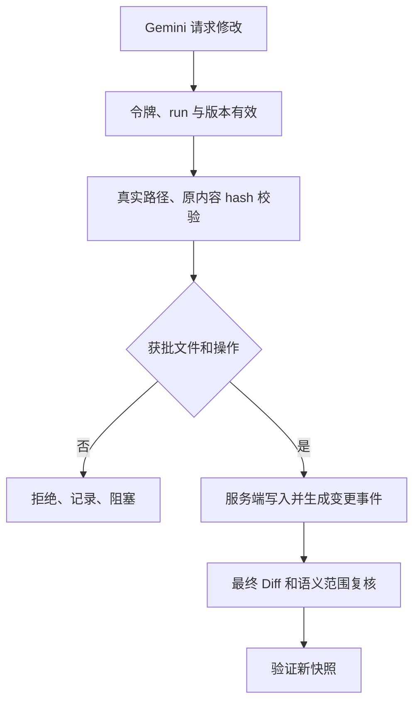

图 5：路径检查不能只用字符串 `startsWith`。Windows 大小写、盘符、UNC、设备路径、junction、symlink、硬链接、ADS 和目录穿越都要处理。

文件 Broker 固定规则：只收相对路径；拒绝 `..`、绝对路径、冒号和设备前缀；使用文件句柄取得最终路径与卷/文件标识；拒绝 reparse point 和多硬链接写入；逐级确认父目录；不存在的新文件检查最近存在的父目录；校验旧 hash；同目录写临时文件并原子替换；再读取 hash。范围外修改保持原状并报告，不能自动回滚用户文件。

### 6.2 当前用户与工作流资源边界

控制器、agy、测试服务和 Codex 复核统一使用当前 Windows 用户。Windows Host 仅创建受管进程并加入 Job Object，负责按任务停止进程树和服务互斥；不创建或切换身份。使用既有官方登录，不抽取订阅 token。

每个工作流仍有独立工作目录、分支、令牌、批准版本、快照、日志、端口与数据命名空间。服务端按工作流检查权限、范围、状态和证据，浏览器按场景租约独占。控制数据默认保存在安装目录 `.devflow`，从 Git 排除。

这是一套本人电脑上的开发流程控制，不提供 Windows 用户权限边界。不能宣称同一用户运行的任意程序无法访问其他文件；流程规则由服务端、Hook、文件 Broker、快照和复核执行。

取消原 Runner 身份池、ACL 安装、密码保存、身份切换及相关启用探针。并行上限只控制进程、环境和资源数量，不再分配 Windows SID。

### 6.3 Hook 与命令执行规则

`PreToolUse` 对全部工具做默认拒绝，仅允许文件 Broker、登记检查、任务报告和浏览器网关；读取 Skill 也通过受控材料工具提供。Hook 输入字段按照 agy 的 `toolCall.name / toolCall.args`，输出 `decision / reason`，不套用别家 CLI 格式。[agy Hooks](https://www.antigravity.google/docs/hooks/)

Hook 只是防误用层。真正受控操作再次验证令牌、状态、路径、资源；Hook 超时不能成为允许信号。启动时用无害的禁止写入探针验证 Hook 生效，未通过即阻止执行。

检查命令用 `executable + args[] + cwd + env_allowlist + timeout` 注册。模型只能传 command ID 与批准的枚举参数；不能追加 shell 片段。使用 `shell:false`；Windows 的 `.cmd/.ps1` 包装器不能直接假设可 spawn，Node 工具优先解析为 `node.exe + npm-cli.js` 等真实入口；Maven 等包装器仅由固定、受审查的 Host 适配器调用，禁止模型插入自由文本。

安装、构建、测试本身也可能执行第三方脚本，所以在受限 Runner 身份完成。基础镜像/工具链下载只发生于明确的安装步骤；每个业务任务禁止修改控制器、Hook、Skill、包管理策略和 CI 安全设置，除非新计划已精确批准这些范围。

## 7. 工作区、多项目并行和恢复

### 7.1 工作区策略

每个项目登记一个或多个仓库，记录绝对路径、规范化 common Git directory 和允许基线。任务提交时明确选择 `new_worktree` 或 `existing_workspace`；默认新 worktree。前后端分仓库时分别记录 baseline SHA、分支、路径和最终 commit SHA。

创建新工作区采用 `git worktree add -b devflow/<workflow-id>/<repo-id> <absolute-path> <baseline-sha>` 的参数数组；不使用强制 checkout，不共享任务分支。目录固定为 `D:/DevFlow/worktrees/<project-id>/<workflow-id>/<repo-id>`，全部子路径从服务端生成的 ID 构造。首次安装可把根目录登记为其他磁盘，之后不能由模型修改。

已有工作区只有满足以下规则才准入：它是登记的任务分支、没有另一个写入者、没有来源不明的脏文件、批准基线一致。存在用户未提交改动就阻塞并展示清单，不自动 stash、reset、清理或混入提交。用户要求纳入现有改动时，先记录基线差异并重新生成合同及审批。

创建前后通过 `git worktree list --porcelain` 核验实际归属。仓库根目录与 `.git` 文件指向都检查；拒绝 worktree 嵌套到另一个活动工作区。`git worktree lock` 不是执行锁，真正的写入锁由 DevFlow 管理。[Git worktree](https://git-scm.com/docs/git-worktree)

### 7.2 生命周期

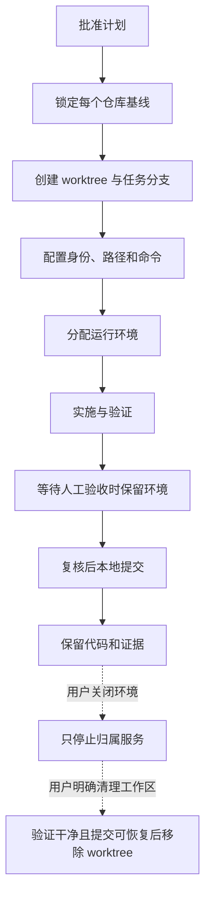

图 6：自动提交不触发目录删除。首次创建失败需逐项补偿，只回收本次已登记且未投入执行的租约，保留出错现场。

### 7.3 并行资源调度

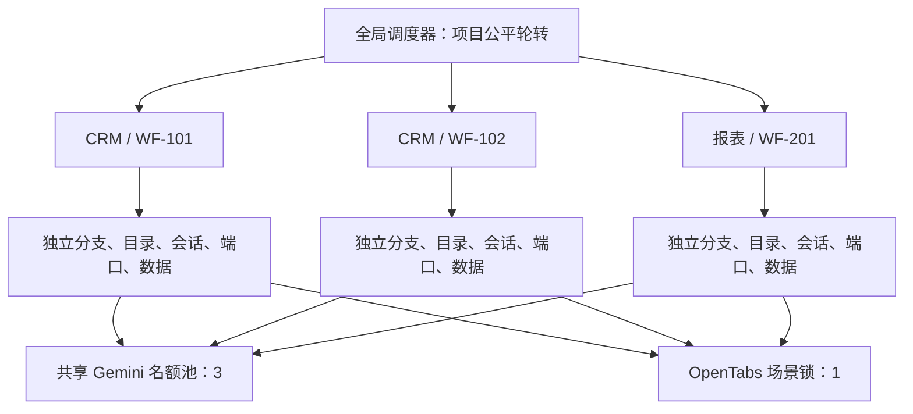

图 7：数值是本机调度上限，不代表订阅承诺并发。排队按项目轮转，同项目内优先用户反馈修复，再按创建时间；等待每 10 分钟提升一次优先级以防饥饿，不抢占正在执行的任务。

| 资源 key | 容量/模式 | 释放时点 |
|---|---|---|
| `workspace:<canonical-volume-file-id>` | 写入独占；同目录只一个写者 | 该轮停止核实后；验收/复核期保持冻结标记 |
| `repo-admin:<common-git-dir>` | 独占短锁 | worktree、ref 更新等管理操作结束 |
| `conversation:<adapter>:<id>` | 一个会话同时一个轮次 | 轮次彻底退出 |
| `executor:agy` | 3 | 模型结束；测试/浏览器排队不占用 |
| `reviewer:codex` | 1 | 复核轮次结束 |
| `test:heavy` | 2 | 重型测试进程退出 |
| `environment:slot` | 6 | 服务及身份全部释放；等待人验收不释放 |
| `port:<protocol>:<bind-address>:<port>` | 独占 | 所属服务确认退出后 |
| `browser:opentabs-main` | 全场景独占 | 自动场景或人工实操明确结束后 |
| `external:<resource-id>` | 无法隔离时独占 | 完整测试阶段结束 |

同一检查需要多个资源时，按资源 key 排序、事务申请；未拿全不启动，不占模型名额空等。短锁与长期环境租约分开。跨项目依赖必须登记所用服务版本；不能连“对方最新环境”。

### 7.4 租约、停止和重启

租约包含 owner、run、Host boot ID、fencing token、取得时间、心跳时间。服务每 5 秒更新心跳，失联超过 30 秒进入 `SUSPECT`，不会直接把写入权交给别人。必须核实旧 Job/进程退出或失去全部写入能力后才释放。

Host 使用 Windows Job Object，区分执行 Job、每个服务 Job 和测试 Job；创建进程先挂起，加入禁 breakaway 的 Job 后恢复，避免启动早期子进程逃逸。进程记录 PID、创建时间、可执行文件、用户 SID、run 和 Job 标识，PID 复用不视为同一进程。[Windows Job Objects](https://learn.microsoft.com/en-us/windows/win32/procthread/job-objects)

重启控制器时先恢复 SQLite/outbox，再向 Host 对账活动 Job。仍存活且日志可续读时可重新接管；Host 也已退出时，按 Job 策略确认子进程终止，标记中断并保留现场。没有终局结果不判成功；不重放数据库写操作、不自动重复测试或模型回合。

暂停、额度不足、待人工验收只影响对应 workflow。禁止按 `agy.exe`、`node.exe`、`java.exe` 名称批量结束进程；禁止把工作流 A 的错误释放流程 B 的端口。

## 8. 临时端口、前后端连接和浏览器隔离

### 8.1 唯一运行清单

每个环境生成不可由模型修改的 `runtime-manifest.json`，写入受保护运行目录，通过 MCP 提供只读版本。例中的端口是已分配后的值，运行时由固定端口池算法产生。

```json
{
  "schema_version": 1,
  "project_id": "crm",
  "workflow_id": "wf-101",
  "environment_revision": 1,
  "snapshot_id": "snap-001",
  "workspaces": [
    {"id": "ws-api", "repo_id": "api", "root": "D:/DevFlow/worktrees/crm/wf-101/api"},
    {"id": "ws-web", "repo_id": "web", "root": "D:/DevFlow/worktrees/crm/wf-101/web"}
  ],
  "services": {
    "api": {"workspace_id": "ws-api", "port": 18081, "base_url": "http://127.0.0.1:18081", "identity": "wf-101:api:snap-001"},
    "web": {"workspace_id": "ws-web", "port": 15173, "base_url": "http://127.0.0.1:15173", "api_target": "http://127.0.0.1:18081"}
  },
  "data_namespace": "crm_wf101",
  "browser_resource_id": "opentabs-main",
  "test_account_ref": "crm-qa-user",
  "manifest_hash": "由服务端对除本字段外的规范内容计算"
}
```

服务启动器、测试 Runner、Gemini、OpenTabs 和用户“打开环境”按钮都从这份清单读取 URL，不允许各自使用硬编码 `5173/8080`。清单只保存凭证引用，真实秘密从受保护存储注入进程。

### 8.2 端口分配和身份验证

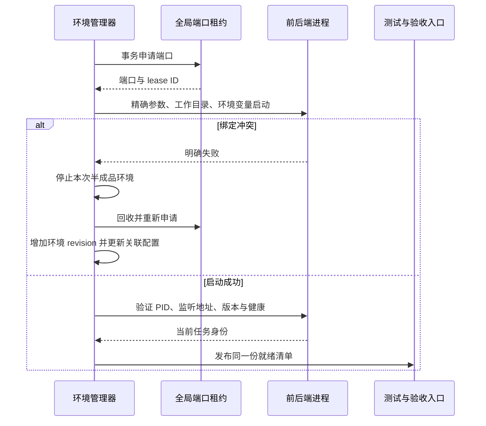

图 8：租约只能协调 DevFlow 内部，外部进程仍可能抢占端口。最多重试 5 次，仍失败就阻塞，不杀占端口的陌生进程。Vite 开启 `strictPort`，禁止静默换端口。[Vite server options](https://vite.dev/config/server-options.html#server-strictport)

“HTTP 200”不是环境身份验证。启动器必须核对进程归属、实际监听 socket、启动 cwd、构建产物 hash。新接入的演示工程提供仅开发环境启用的身份接口/页面标记；现有项目无标记时，环境接入任务明确新增最小适配，不能静默改生产协议。

前端至少验证一次实际 API 请求目的地，不能只检查页面端口。静态构建记录注入配置 hash；后端启动对照 manifest；健康通过后才显示“可验收”。热更新导致源文件变化时环境 revision 或 snapshot 随之变化，旧人工验收立即失效。

### 8.3 配置和数据隔离

| 类型 | 确定规则 |
|---|---|
| 前后端端口 | 由启动参数/环境注入；不修改每个任务的业务配置文件 |
| Vite 代理 | 开发配置显式读取 `DEVFLOW_API_TARGET`；该变量不是 Vite 内建变量 |
| Spring Boot 示例 | 用 `--server.port=<allocated>` 与测试 profile 覆盖；启动器登记实际 jar 和 Java 路径 |
| 数据库 | 每 workflow 独立测试库或 schema，独立凭证；接入合同指定初始化/清理命令 |
| Redis | 独立实例优先；已有隔离条件时固定 key prefix；不得 `FLUSHALL` |
| 消息队列 | topic/consumer group 使用 workflow 命名空间；禁止消费生产消息 |
| 注册中心/Nacos | 独立 namespace/group；测试实例不注册到生产发现范围 |
| 定时任务 | 默认关闭；需要验证时独立队列和数据，并在合同中打开 |
| 上传/缓存/报告 | 各 workflow 独立路径；只读共享依赖缓存需锁或内容寻址 |
| 容器 | 名称/网络/volume 使用工作流命名空间；控制器负责，不给模型 Docker socket |

如果无法隔离既有外部依赖，在项目配置中声明资源锁，串行运行相关测试。运行配置缺少隔离策略时，预检失败，不把共享生产数据库当默认测试目标。

### 8.4 OpenTabs 与用户实操

不同端口不能隔离同主机 Cookie，因此 OpenTabs 固定按完整场景独占：取得锁 → 核对目标环境和账号 → 准备测试态 → UI 操作 → 采集证据 → 清理本场景测试态 → 释放锁。Playwright 使用每个 workflow 独立 BrowserContext，后端数据仍单独隔离。[Playwright 隔离](https://playwright.dev/docs/browser-contexts)

用户点击“开始实操”后保留浏览器锁，期间暂停本资源所有模型浏览器操作。用户离开控制台不会自动释放；界面显示占用者和“结束实操”按钮。不会为了新任务而关闭等待用户验收的服务。

Browser Gateway 持有现有 OpenTabs 凭证，执行者只拿 workflow 能力令牌。校验 scene、tab ID、导航目标和页面来源；拒绝控制台 `4810`、生产站点与其他 workflow 地址；重定向或新标签出现后重新核对。通用 JS 执行若无法限制目标就不开放，按真实工具发现能力生成白名单。使用 `/mcp/gateway` 的 `opentabs_list_tools` / `opentabs_call`，不臆造工具名称。[OpenTabs MCP](https://opentabs.dev/docs/reference/mcp-server)

## 9. agy 调用、响应、日志、停止和恢复

### 9.1 执行包与轮次划分

一个轮次只负责一个确定阶段。包内包含 `plan.md、tasks.json、tests.json、scope.json、runtime-manifest.json、feedback.json、executor-policy.md、package-manifest.json`。每项带内容 hash，全部只读；启动提示要求先核对包和 workflow ID，再报告理解与本轮 task IDs。模型日志中的“理解”不等于审批。

阶段固定为：实施与测试编写 → 自动测试 → OpenTabs 验收。Gemini 可请求短检查；正式长测试由 Runner 完成，模型结束回合、释放名额。失败时控制器用失败证据恢复 Gemini，成功则排浏览器资源。浏览器锁到位后才启动 Gemini 的浏览器验收轮次，完成后再次退出。

```typescript
// 拟开发适配器伪代码；包路径、executable、env 来自受保护配置。
const args = [
  '--model', 'gemini-3.7-flash-high',
  '--effort', 'high',
  '--output-format', 'stream-json',
  '--print-timeout', '60m',
  '-p', handoffPrompt
];
if (savedConversationId) args.push('--conversation', savedConversationId);
const child = spawn(agyExecutable, args, {
  cwd: managedTaskContainer,
  env: buildExplicitAgentEnvironment(run),
  shell: false,
  windowsHide: true,
  stdio: ['ignore', 'pipe', 'pipe']
});
// Windows 正式实现通过 Host 创建并加入 Job 后才恢复进程。
```

`--model / --effort / --conversation / --output-format / --print-timeout` 已由本机帮助核实；模型 slug 同时见官方文档。`managedTaskContainer` 是受保护工作流容器，项目材料通过 MCP 访问，不能把本任务的 `.agents` 配置写进业务提交。[agy Headless](https://www.antigravity.google/docs/cli/headless/)

### 9.2 输出从哪里来

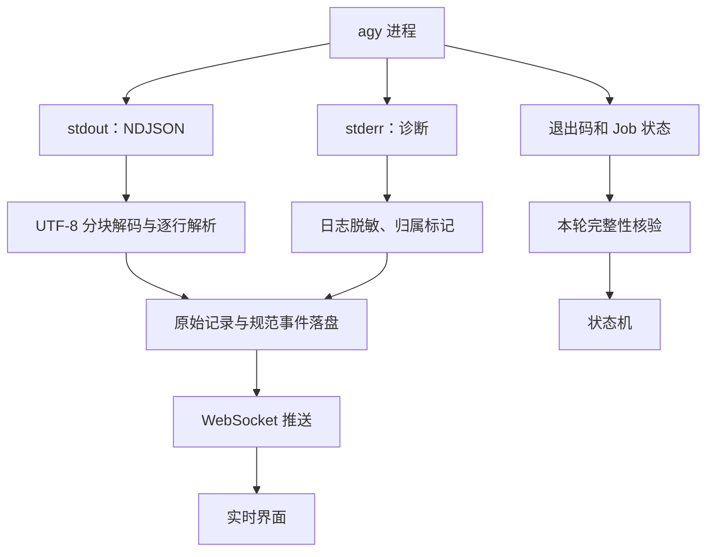

图 9：进程管道是本地异步流，不是 agy 回调 HTTP webhook，也不是 GPT-6 轮询。不能等进程结束再一次性读 stdout。[Node 子进程](https://nodejs.org/api/child_process.html)

解析 `init / step_update / result`，保留 CLI 原始 envelope，归一化成 `RunInitialized、PublicTextDelta、ToolStarted、ToolFinished、AgentResult、ProcessExited`。init 中 `conversation_id、cwd、model` 与预期不符立即阻塞；模型信息未被输出时不能假称已经核对，启动探针须建立版本兼容规则。

流解析必须处理分块跨中文字符、半行、多行一块、CRLF、末尾未换行、stderr 穿插、超长单行、无效 JSON 和未知事件。单行默认上限 4 MiB，超过则归档原始片段并标记协议错误，不能截断后伪装解析成功。未知事件可保存，但不能推进状态。`result.status=SUCCESS` 与退出 0 只是模型轮次成功，还要确认唯一结果、会话一致和全部进程退出。

每条规范事件包含 `project_id、workflow_id、run_id、event_seq、occurred_at、received_at、source、type、payload_ref`。`event_seq` 在 workflow 内单调递增，事务生成；界面按序去重，断线后用 `after_seq` 补读。原始工具输出不保证每项都逐字实时可见；正式服务和测试日志由 Runner 独立采集。只显示公开响应与工具活动，不要求模型提供私有思考过程。

### 9.3 暂停、立即停止与反馈

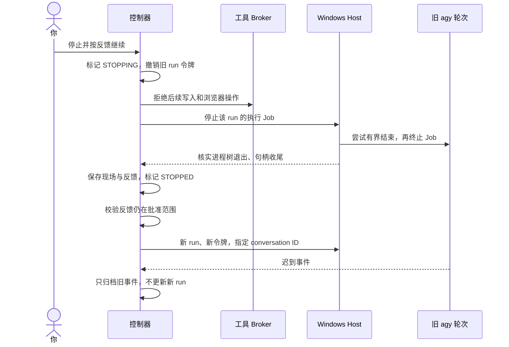

图 10：“本步结束后暂停”只允许当前 Broker 操作收尾，拒绝后续操作；最多等待 10 秒，超时转立即停止。“立即停止”立即撤销能力，Host 先给予最多 5 秒退出机会，再终止 Job，并在确认前持续显示 STOPPING。不能声称 agy 支持任意 stdin `cancel/control_request`。

停止模型默认保留前后端服务；“关闭任务环境”是独立操作。停止不撤销已写文件、外部请求或数据库修改，不自动 `reset --hard`。有未完成文件替换/数据库操作时报告影响范围，按批准恢复脚本清理测试数据。

恢复必须绑定明确 conversation ID，禁止 `--continue` / 最近会话。缺少可恢复会话时创建新会话，重新提供完整包及现场，记录关联旧 run；不能默默复用其他任务记忆。会话漂移、截断或上下文不足也走显式重建，不改变模型。

### 9.4 执行器接口

`ExecutorAdapter` 固定提供 `probeCapabilities、startTurn、decodeEvent、stopTurn、resumeTurn、collectTerminalResult`。`TurnSpec` 包括模型、effort、任务包 hash、cwd、令牌句柄、会话和超时；结果包括终局状态、真实会话、原始事件引用和退出事实。

额度统计来自 CLI 公开 usage，仅用于显示已知消耗，不推算未知套餐剩余额度。调度器限制本地并发，不伪造厂商限额。交互权限被拒绝但最终结果成功的情况仍须由测试证据门槛拦截。

### 9.5 故障政策

| 故障 | 固定处理 |
|---|---|
| 认证失败、模型不可用、额度耗尽 | `BLOCKED`，释放模型名额、保留现场，通知用户处理；不自动换模型/账户/API |
| 启动失败、执行器崩溃、结果缺失 | 标记中断；核实旧进程，用户恢复后继续 |
| 10 分钟无公开输出 | 记录停滞提示并检查进程/CPU/子任务；不能直接推断模型卡死 |
| 单轮 60 分钟总时限 | 进入停止流程，保留现场；需用户明确恢复 |
| 连续 3 次同一失败且无有效进展 | 暂停对应工作流，展示三轮证据 |
| Hook/MCP/Browser Gateway 不可用 | 拒绝相关操作，结束轮次，不放宽权限 |
| 磁盘空间不足/证据写入失败 | 停止接收新写任务，阻止推进成功状态 |
| 控制台断线/关闭 | 后台继续；重连恢复事件；不让 GPT-6 接手监控 |
| 测试环境崩溃 | 当前验收不可用；修复环境后增加 revision、重新验证 |

### 9.6 Cursor / Grok 可选扩展

第一版只交付接口、禁用配置和拒绝自动 fallback 的测试，不安装或调用 Cursor。后续用户明确启用 Grok 4.6 时，先通过 Cursor 官方 CLI 实际模型列表确认 slug、订阅路径、流式协议、恢复与取消能力，再创建独立已批准接入计划。适配器必须复用同一状态机、权限、证据和提交条件，不能绕过 Gemini 执行时的约束。未验证 slug 不写成可执行配置。

## 10. 测试、真实进度与人工验收

### 10.1 测试合同

每条测试保存 `test_id、requirement_ids、task_ids、layer、fixture、steps、expected_assertions、command_id、expected_case_ids、timeout、report_parser、applicability`。测试发现集合在执行前从合同和测试清单确定；不得仅以 discovered_count 大于 0 判通过。

| 层次 | 必须证明什么 | 必需证据 |
|---|---|---|
| 单元测试 | 分支、边界、错误路径、状态不变量 | 用例发现列表、结构化报告、退出码、覆盖信息 |
| 集成测试 | 真实进程/Git/持久化/MCP/服务交互 | 临时仓库、实际命令和依赖实例、结果报告 |
| E2E | 从入口到结果的完整可重复用户流程 | Playwright 报告、trace、截图、独立 context |
| OpenTabs | 真实已运行页面上的点击/输入/呈现/持久化 | 工具调用轨迹、目标身份、截图、控制台/网络观测 |
| 人工验收 | 你操作后确认业务结果 | 用户验证、验收项、snapshot、environment revision |

四层默认全部必需；文档等明确无对应运行行为的任务，可在调研阶段列出某层不适用的证据，由计划审批一次批准。Gemini 无权运行时跳过、降级或临时标注 N/A。DevFlow 本身是完整应用，本计划四层全部适用。

### 10.2 防止虚假完成

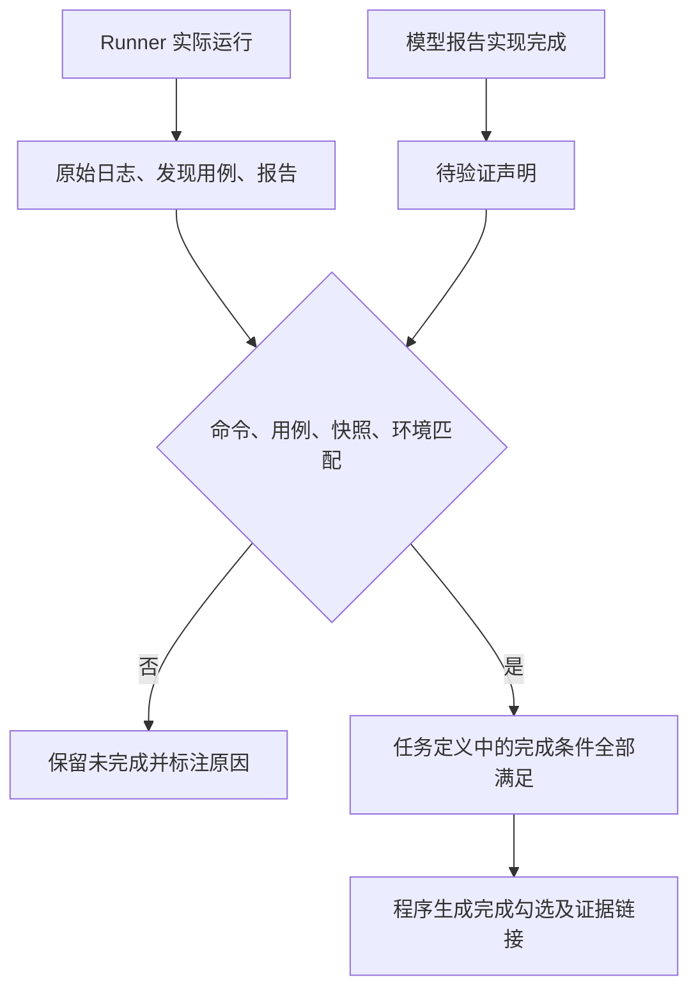

图 11：报告由证据导出。执行者可提交实现声明，不能修改进度真值。每个 `[x]` 都必须能回溯到其完成定义及当前证据。

正式检查前停止模型写入，冻结快照并在只读源文件上运行；报告输出到新的 check 专属目录。Runner 记录预期报告文件、check nonce、开始/结束时间、进程身份、命令与 cwd。旧报告不因改 mtime 变成新报告；必须位于本轮新目录，内容结构、用例集合、退出事实均有效。归档后由控制器计算 hash，Runner 失去修改归档的权限。

禁止把“命令成功但 0 用例”“全部 skip”“缺少必需用例”“删除断言”“降低阈值”“屏蔽失败配置”“过期截图”算通过。前五类中的命令和报告事实可程序判断；断言是否有效还需代码审查，不能宣传为仅靠自动校验即可防所有伪造。

任务状态为 `not_started / running / implemented / verified / blocked / stale`。最终勾选仅对应 `verified`；证据失效后重新变为未勾选并显示 stale，历史通过记录保留。所有生成文档带 `state_version、plan_revision、snapshot_id、generated_at`。

### 10.3 OpenTabs 真实验收步骤

一个场景至少包含：读取 manifest → 核验页面/服务身份 → 核验测试账号 → 从 UI 点击和输入 → 对照预期展示 → 保存数据 → 刷新/重新进入确认持久化 → 检查相关控制台错误及失败请求 → 截图和操作记录 → 退出本场景并释放锁。

直接通过 API 写入再截图不等于完成 UI 操作验收。Fixture 数据可通过受控初始化脚本准备，但被验收的行为必须实际由 UI 触发。OpenTabs 输出缺少某种观测能力时，先明确报告缺口，不能编造 console/network 证据。其真实工具 Schema 和插件版本在启动预检采集并存档。

### 10.4 人工验收与直接修复

用户验收页显示工作流标题、计划版本、代码快照、真实环境 URL、测试摘要和逐步实操清单。开始实操取得浏览器资源；用户提交缺陷时附当前截图/步骤和实际结果。原需求内缺陷直接恢复 Gemini；完成后必须重跑受影响检查，第一版采用保守策略：源码、测试、依赖或运行配置变化后四层全量重跑，再次请用户实操。

只有修改独立的运行日志或派生进度显示不会使业务代码快照变化。控制器本身的 UI、Schema、配置和文档模板如果是本任务被修改的产品文件，就属于源码快照，不可排除。

## 11. GPT-6 独立复核和修复闭环

### 11.1 触发与材料

用户 `HUMAN_ACCEPTED` 产生唯一 `review_request_id`，通过 outbox 入队。控制器只在该事件后启动新的 `codex exec`，不恢复规划者或 Gemini 会话。复核任务包含：批准计划/决策/范围；每仓库 baseline；不可变源码树、真实 diff；相关调用者和依赖代码；全部测试代码及原始证据；OpenTabs 轨迹；用户验收记录；历史修复问题及本轮处置。

```powershell
# 原生命令示例；文件和运行环境由 DevFlow 创建后才能执行。
codex exec --model gpt-6-astra --sandbox read-only --json `
  --ignore-user-config `
  -c 'model_reasoning_effort="high"' `
  --output-schema 'D:/DevFlow/reviews/review-001/review.schema.json' `
  --output-last-message 'D:/DevFlow/reviews/review-001/result.json' `
  --cd 'D:/DevFlow/reviews/review-001/input' -
```

完整提示词由 stdin 输入；生产代码不拼 PowerShell 字符串。用 `--ignore-user-config` 避免继承无关的可写 MCP，认证仍由官方 CLI 保存的认证提供；实际二进制/Node CLI 入口由 doctor 登记，不直接把 `codex.ps1` 当 exe。复核只读目录与宿主保存结果目录分开；模型工具不得写出代码更改。[Codex 非交互模式](https://developers.openai.com/codex/noninteractive/)

读取大仓库时按 manifest 枚举文件和 diff 分片，维护 coverage ledger。任何 diff 被截断、相关文件没读、检查未完成都返回 `incomplete`，不能以“暂无发现”代替通过。

### 11.2 复核范围

| 检查维度 | 必须检查的内容 |
|---|---|
| 需求正确性 | 每条要求和验收项是否落实，遗漏分支和负向路径 |
| 回归与影响 | 调用方、公共模块、配置默认值、其他正常路径是否受影响 |
| 代码质量 | 命名、职责、重复、错误处理、可读性、项目规范 |
| SOLID | 职责是否混杂、依赖方向、接口契约、扩展点是否过度；不以风格优化扩大重构 |
| 并发与一致性 | 事务、锁、竞态、幂等、陈旧状态、重复消费、恢复 |
| 安全 | 身份与权限、路径/命令注入、秘密泄露、信任边界、浏览器操作、依赖风险 |
| 测试有效性 | 断言是否真实验证需求、是否削弱测试、mock 是否掩盖集成问题 |
| 漏改 | 文档、配置、调用位置、跨仓库合同、版本和兼容性 |
| 性能与资源 | 无界队列、内存、日志、进程泄漏、过度重试 |

### 11.3 结构化输出合同

```json
{
  "schema_version": 1,
  "review_request_id": "review-001",
  "workflow_id": "wf-101",
  "plan_revision": 1,
  "snapshot_id": "snap-001",
  "verdict": "pass",
  "coverage": {
    "all_changed_files_reviewed": true,
    "all_requirements_checked": true,
    "upstream_downstream_checked": true,
    "security_checked": true,
    "tests_validity_checked": true
  },
  "findings": [],
  "unresolved_questions": [],
  "repair_plan": null,
  "commit_message": "fix(customer): 修复分页筛选条件丢失"
}
```

此 JSON 只展示通过结果形状，不表示实际已复核。Schema 规定 `verdict=pass|findings|incomplete`，所有对象 `additionalProperties:false`；finding 必须有 `id、severity、repo_id、path、line、trigger、evidence、consequence、relation_to_change、disposition`。

确认属实且由本次引入/涉及本次范围的问题全部阻止提交，包括低严重度真实缺陷；不以“只是 P3”默认忽略。误报必须写理由和证据；无关历史问题及非必需风格建议单独报告，不偷塞进本轮修复。用户选择扩大范围时走新计划。

### 11.4 修复计划版本

每次确认问题生成 `r02、r03…`，保留旧文件。新修复合同包含问题复現/触发证据、精确改法、路径清单、受影响测试、回归范围、旧问题对应新任务和关闭条件。技术实现沿用已批准框架，能局部修复就不能重构全局。

新计划批准后，Gemini 实施 → 四层验证 → 用户实操 → 新 GPT-6 复核，循环条件与首轮一致。复核者不直接修代码。重复 3 次同一问题没有有效进展时暂停展示证据，不无限消耗额度。

## 12. 快照与自动提交

### 12.1 同一版本的定义

`snapshot_id` 是 manifest 的内容 hash，覆盖每个仓库 baseline SHA、规范 Git tree hash、源码、测试、依赖锁文件、运行相关配置，以及所有新增、删除、重命名、二进制文件和允许的 submodule 指针。未跟踪文件先分类；无法确认是否属于结果时阻止冻结，不悄悄遗漏。

生成目录、机密、运行日志和 DevFlow 派生进度可在批准合同内排除，但源文件、测试配置、断言、依赖不能因匹配宽泛 ignore 而被遗漏。Git attributes、CRLF、clean filter 影响规范内容：冻结时生成规范 tree 并核对与实际测试文件的一致性；未知过滤器必须先登记，不能到提交时才改变字节。

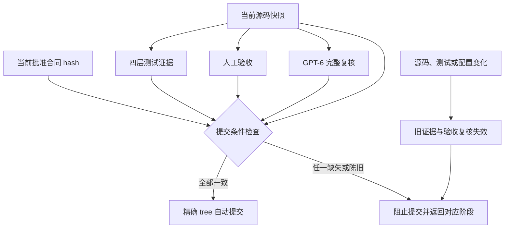

图 12：commit SHA 不能代替未提交工作区内容 hash。复核通过后再修改一行，也必须重新验证。

### 12.2 提交算法

1. 获取 workflow/工作区写锁和 Git 管理短锁，停止所有可能修改源文件的受管进程；核验源文件和当前 HEAD。
2. 再次确认当前计划已批准、全部任务 verified、四层必需证据及人工验收/复核都绑定当前快照，没有确认问题。
3. 从批准路径和完整变更清单构建临时 index，明确加入新增/修改/删除文件；禁止 `git add .`。原工作区 index 不作为可信来源，也不覆盖用户暂存内容。
4. `write-tree` 得到 tree，必须等于冻结和复核的 tree。准备 `commit_intent`，包含每仓库 parent/tree、作者、消息、时间及幂等 ID。
5. 提交前检查与格式化作为已批准 Runner 检查提前执行；若 hook 修改文件，回到新快照验证。最终用受控 `commit-tree` 创建精确对象，再用 `update-ref <task-branch> <new> <expected-old>` 做比较更新，避免未审查 hook 在最后改变 tree。
6. 只有目标分支/HEAD 与预期一致才更新索引映射并记录完成。失败保留提交对象和意图；禁止 amend、reset、强推或重置用户工作区。项目需要签名或强制 hook 时必须在接入合同中实现等效检查并验证签名，缺少所需身份则阻止自动提交。
7. 重启恢复先判断目标 ref 是否已指向预期 commit、tree/parent 是否相同；已提交只补记状态，不重复提交。不能只查提交消息中的 workflow ID。

采用 `commit-tree` 是为了提交确定 tree；必须完整执行项目原有必需检查并公开记录，不能用它绕过仓库要求。提交消息按本地 `commit` Skill 规范：`type(scope): 中文动词主题`，保留计划/复核关联信息。自动提交不再另问“是否提交”，这是用户已确定的流程。

### 12.3 文档自引用与多仓库提交

计划正文及批准时静态任务/测试目录可随任务提交；实时进度、最终 commit SHA 和事件归档由控制器保存，映射到 docs 的派生文档单独管理。最终 SHA 不写回正在创建的同一个 tree，从而避免“写 SHA → tree 变化 → 旧审核失效”的循环。普通任务一个文件的派生区在冻结前生成固定版本，提交完成信息只在控制台/外部归档呈现。

多仓库没有本地跨仓库 Git 原子提交。先给所有仓库计算并记录提交意图，再逐库创建对象和 CAS 更新 ref。部分完成进入 `COMMIT_PARTIAL`，显示每个仓库状态；只有所有快照和基线仍一致才可恢复剩余提交，不删除已完成提交，不标整个 workflow 成功。

### 12.4 整合与发布边界

两个 worktree 各自通过后，仅自动提交各自任务分支。用户明确要求整合时登记独立 `integration` workflow，固定目标基线和源 commit，解决冲突后的新 tree 重新走计划、测试、实操和复核。不得沿用源分支结论，也不静默 pull/rebase 到新主分支。

发布不在自动状态机里。用户之后明确说“发布某版本”才创建发布操作合同并核对环境和 commit；发布凭证独立管理，Gemini 执行器没有发布权限。本文没有授权立即安装、部署、推送或发布。

## 13. Skill 文件、模板和报告规则

### 13.1 需要开发的 Skill

| Skill | 使用者和触发 | 固定输入 | 固定输出 |
|---|---|---|---|
| `devflow-plan` | Codex GPT-6；用户发起需求/排查/重新规划 | 需求、项目上下文、真实代码和调查证据 | 确定计划、任务、测试、范围、图解、审批入口 |
| `devflow-execute` | agy Gemini；控制器发起已批准执行轮次 | 只读执行包、当前阶段、旧现场和反馈 | 代码变更、测试、任务声明或具体阻塞 |
| `devflow-browser-accept` | agy Gemini；已获得浏览器场景锁 | 场景、运行清单、测试账号引用 | 真实 UI 操作及证据，不修改产品源码 |
| `devflow-review` | 新 Codex GPT-6；人工验收后 | 不可变复核包 | 结构化结论、逐项覆盖账、必要修复计划 |
| `devflow-project-onboard` | Codex GPT-6；用户登记新项目 | 仓库结构、启动/测试命令、依赖与环境 | 确定的项目运行配置及最小适配计划 |

源码统一存 `packages/skills/<name>/SKILL.md`，模板和参考文件随包版本化。Codex 安装目标为当前用户 `.agents/skills/<name>/`，安装器只添加 DevFlow 名称，不覆盖其他 Skill；同名冲突返回差异，不能覆盖未知版本。业务仓库不复制整套全局配置。Codex 的本地 Skill 搜索目录和 frontmatter 格式见[官方 Skill 文档](https://developers.openai.com/codex/skills/)。

agy 执行包总是显式附上执行 Skill 正文和 hash，不依赖 CLI 是否自动发现某个目录。即使自动 Skill 扩展不可用，执行方法也不会丢失。内建 Skill/斜杠命令若能引入额外工具或规则，受管执行器启动自检必须阻止。

已有 `doc-location` 用于保持项目文档分类；`commit` 用于提交消息；`mcp-builder` 用于接口开发方法；`openai-docs` 用于核对 Codex 原生能力。它们不代替 DevFlow 的业务规则。`neat-freak` 可在明确的交接整理任务中使用，不能删除审计历史或未经计划修改其他文档。第一版不把安全插件独立扫描当作提交硬依赖，安全审查要求直接写进 `devflow-review`。

### 13.2 `devflow-plan/SKILL.md` 完整基础正文

下面正文是拟安装内容，非本次会话的执行指令。实现时保留规则含义，工具名与第 5 节完全一致。

````markdown
---
name: devflow-plan
description: 为 DevFlow 调查需求或缺陷，产出确定的图解计划、任务与测试合同并交给用户审批
---

# 目标
以 GPT-6 读取真实代码和证据，形成执行者无需自行选择技术方案的计划。

## 开始
1. 读取项目规则、登记的运行配置、基线和真实需求。
2. 使用 devflow_create_workflow 建立明确项目/工作流身份。
3. 复杂需求或任何问题排查采用三文档；普通局部任务采用单文档。
4. 只调查和规划，不修改产品代码，不替用户批准，不自行启动执行器。

## 调研
1. 复现问题，记录预期、实际、步骤、日志、代码位置和测试基线。
2. 沿调用链检查直接调用方、被调用方、配置和共享模块。
3. 确认 worktree 策略、前后端仓库、环境依赖、数据与浏览器隔离。
4. 涉及业务行为、范围或验收取舍的已知疑问先询问用户并保存最终答案。
5. 常规实现细节由你基于证据确定，不把选择题留给 Gemini。

## 图解优先
先给简短结论，再依次提供：现状/根因流程图、目标关键时序图、修改边界图、任务依赖图。
有状态迁移时补状态图，有数据关系变化时补关系图。
普通任务至少一张能说明核心改法的图；每图只解释一个问题。
关键节点关联任务和验收编号，图下写结论、证据和必须保持的行为。
调用计划校验器解析并渲染 Mermaid，检查图文一致。

## 执行合同
每个任务必须写：ID、需求、前置依赖、输入、文件/函数、核心算法、输出、不可改内容、测试 ID、停止条件。
优先局部修改；禁止全仓格式化、无关升级、顺手重构和扩大公共接口。
单元/集成/E2E/OpenTabs 默认必需，不适用必须在调研中说明并进入计划审批。
测试必须写明实际操作、输入、预期断言、测试数据、命令与报告格式。
正式合同不得保留未决业务问题、让执行者自行选择的备选方案或空白验收条件。

## 提交与交接
通过 devflow_submit_plan 提交正文、静态任务、测试、范围、决策与基线。
结构校验失败就修正文档；不得把校验失败当作直接实现代码的授权。
向用户给出文档、计划 hash/revision 和审批入口，然后结束回合。
不循环调用状态工具，不 wait agy，不创建监工定时任务。
仅用户主动要求重新规划/查询时再次介入；自动复核由用户验收事件触发。
````

### 13.3 执行与浏览器 Skill 正文

````markdown
---
name: devflow-execute
description: 在 DevFlow 已批准合同内执行明确任务，提交真实变更和证据声明
---

1. 首先调用 devflow_get_context，读取当前 run 的批准计划、Skill、任务、范围、测试与环境清单。
2. 核对 workflow、revision、package hash、阶段和 task IDs；不匹配就报告阻塞。
3. 按 DAG 顺序实施，仅使用受控文件工具与已登记 check ID。
4. 修改前读取文件并取得 hash；变更必须符合允许路径和既定核心算法。
5. 不修改冻结计划、进度真值、控制配置、权限、共享仓库状态或发布凭证。
6. 编写有效回归测试，先证明目标失败能被测试捕获，再实施局部修复。
7. 检查命令由 Runner 执行；禁止把文字总结或旧报告当作通过证据。
8. devflow_report_task 仅提交实现声明，程序验证后才会勾选。
9. 当前计划不可行、需要新增范围、协议/依赖/数据变化时提交 blocker 并停止。
10. 用户反馈在原范围内则按反馈修复；仍需重跑验证，不绕过人工验收。
11. 明确报告本轮实现、检查、未完成项与阻塞；不直接提交、不推送、不发布。
12. 本轮结束释放模型资源；不要自己循环等待长测试或浏览器资源。
````

````markdown
---
name: devflow-browser-accept
description: 在获得场景租约后通过现有 OpenTabs 验证真实 UI 操作并采集可核对证据
---

1. 读取当前场景、snapshot、环境 revision、URL 和测试账号引用。
2. 从 devflow_browser_list_tools 读取真实工具 Schema，再调用 devflow_browser_call。
3. 每次切换页面检查 workflow 标记、账号、tab ID 和允许 origin。
4. 按步骤点击、输入、提交、刷新并检查结果；后端 API 调用不能替代 UI 验收动作。
5. 对照场景断言收集截图、工具轨迹和可用的 console/network 证据。
6. 不进入 DevFlow 审批页面，不批准自己的工作，不导航其他任务或生产系统。
7. 用户接管、场景租约撤销或身份不符时立即停止操作。
8. 证据不够就报告缺口；不修改源码，不虚构通过，不扩大场景。
````

### 13.4 复核 Skill 正文

````markdown
---
name: devflow-review
description: 在人工验收后独立审查确定代码快照，输出可验证结论和必要修复计划
---

1. 确认人工验收记录、计划 hash、源码 snapshot 和环境证据一致。
2. 从真实 diff 开始，枚举所有新增/修改/删除/重命名文件，并查相关上下游。
3. 逐条检查业务、异常、边界、并发、事务、权限、安全、回归、测试有效性与文档配置。
4. 检查 SOLID 与项目规范；避免以抽象美感要求不必要的全局重构。
5. 每个问题说明文件/行、触发条件、依据和后果，区分确认缺陷、误报、历史问题和非必需建议。
6. 不修改源码，不运行不受控仓库脚本，不替用户补人工验收记录。
7. 输出完整 coverage ledger；缺文件、截断或没完成检查就返回 incomplete。
8. 当前改动存在确认问题时，给出确定的局部修复计划和任务/测试映射。
9. 修复决策缺少必要用户信息时先列调查问题，不生成可批准的未决合同。
10. 仅在全部必需检查完成且无确认阻塞问题时返回 pass。
11. 按 review.schema.json 输出，提交权限仍由 DevFlow 服务掌握。
````

项目接入 Skill 的基础正文如下；它不能默认某项目一定是 Spring Boot + Vue。

````markdown
---
name: devflow-project-onboard
description: 调查新项目的真实运行方式，确定仓库、环境隔离和测试配置并生成可审批接入合同
---

1. 读取用户指定仓库及项目规则，登记单仓/多仓、真实 Git common directory 与基线。
2. 从实际配置、脚本和代码定位技术栈；不假设前后端框架或默认端口。
3. 查明启动、构建、单元、集成和 E2E 命令及真实报告格式。
4. 确定命令入口、参数数组、cwd、环境变量和依赖，不允许任意 shell 文本。
5. 明确数据库、缓存、消息、注册中心、定时任务及外部服务的测试隔离规则。
6. 明确动态端口、前端 API 目标和运行身份标记的最小接入修改。
7. 确定 OpenTabs 真实场景、测试账号引用、用户实操清单与共享浏览器锁。
8. 对业务行为和环境归属的已知疑问先询问用户，随后形成唯一确定配置。
9. 生成 project.yaml、命令注册表、场景目录及需要的最小代码适配计划。
10. 提交用户审批，批准后才能执行适配；不得重装 OpenTabs 或覆盖个人模型配置。
11. 接入后运行 doctor 和实际检查，将版本、命令和环境证据写入接入报告。
````

### 13.5 文档目录、模板和版本

```text
业务项目/
  docs/
    plan/<workflow-id>/r01/调研与开发计划.md
    process/<workflow-id>/r01/开发进度.md
    test/<workflow-id>/r01/测试计划与进度.md
    plan/<workflow-id>/r02/修复开发计划.md
    process/<workflow-id>/r02/开发进度.md
    test/<workflow-id>/r02/测试计划与进度.md
```

不沿用原会话 `docs/devflow/...` 示例路径，统一遵循本机文档分类规范。普通任务只有 `docs/plan/<workflow-id>/r01/详细开发计划.md`，包含静态合同和标记明确的派生进度区；控制器仍保存完整结构化状态。

复杂任务计划固定段落：摘要 → 问题/根因证据图 → 目标时序 → 范围图 → 确认决策 → 基线/环境 → 任务 DAG → 原子任务 → 四层测试合同 → 停止条件 → 审批版本。进度按任务列出定义、状态、证据、阻塞与最近更新；测试文档逐项列出环境、步骤、预期、结果和证据。

控制器是 Markdown 输出唯一写入者；用户在编辑器改正文视为新草稿，不反向修改已批准合同。非法图、无效链接、重复 ID、孤立任务、缺失测试映射都拦截。Mermaid 语法校验加实际渲染测试；语法正确后还需检查图解是否讲清真实方案。[Mermaid 使用与解析](https://mermaid.js.org/config/usage.html)

## 14. 配置文件与逻辑数据合同

### 14.1 DevFlow 自定义全局配置

以下 YAML 是需要开发解析器的 DevFlow 配置，不是 Codex 或 agy 原生设置。`devflow validate-config` 必须拒绝未知字段和非法组合；启动时保存有效配置 hash，正在运行的 workflow 不跟随配置热变更。

```yaml
schema_version: 1
server:
  bind: 127.0.0.1
  port: 4810
  human_origin: http://localhost:4810
  mcp_path: /mcp/planner
  websocket_path: /api/events/live
storage:
  root: C:/ProgramData/DevFlow
  sqlite_file: C:/ProgramData/DevFlow/state.sqlite
  journal_mode: WAL
  single_writer: true
workspace:
  root: D:/DevFlow/worktrees
  default_mode: new_worktree
  dirty_existing_workspace: block
models:
  planner: {adapter: codex_desktop, model: gpt-6-astra, effort: high}
  executor: {adapter: agy_cli, model: gemini-3.7-flash-high, effort: high}
  reviewer: {adapter: codex_cli, model: gpt-6-astra, effort: high, fresh_session: true}
  cursor_executor: {enabled: false, requested_model_label: Grok 4.6}
  silent_fallback: false
  api_billing_fallback: false
scheduler:
  executors: 3
  reviewers: 1
  heavy_tests: 2
  live_environments: 6
  browser_scenes: 1
  fairness: project_round_robin
  feedback_priority: true
  aging_minutes: 10
ports:
  frontend: {start: 15173, end: 15272}
  backend: {start: 18081, end: 18180}
  bind_retries: 5
  strict_binding: true
approvals:
  method: local_confirmation
  login_required: false
  bind_plan_hash: true
  bind_snapshot_and_environment: true
policy:
  executor_native_shell: deny
  executor_native_write: deny
  executor_native_browser: deny
  write_via_broker: true
  runner_identity: per_environment_windows_sid
  scope_expansion: block_and_replan
  dependency_change: require_explicit_plan_scope
verification:
  layers: [unit, integration, e2e, opentabs]
  human_acceptance: required
  progress_source: verified_evidence
  zero_expected_cases: fail
  all_skipped: fail
  stale_evidence: fail
  invalidate_on_source_change: all_layers_and_acceptance_and_review
timeouts:
  mcp_short_seconds: 30
  agent_turn_minutes: 60
  idle_notice_minutes: 10
  graceful_stop_seconds: 5
  pause_boundary_seconds: 10
  heartbeat_seconds: 5
  suspect_after_seconds: 30
  repeated_failure_limit: 3
git:
  auto_commit: true
  target: task_branch
  exact_tree_required: true
  auto_push: false
  auto_merge: false
  auto_rebase: false
release:
  automatic_trigger: false
  explicit_new_user_instruction: true
retention:
  raw_logs_days: 30
  failed_run_logs_days: 90
  evidence_days: 180
  audit_and_approvals: retain_until_user_deletes
  unfinished_workflows: never_auto_delete
```

二进制路径通过 doctor 解析后存入 `toolchain.lock.json`，记录版本、绝对路径和 hash；不在 YAML 中猜测其他电脑的安装路径。配置更新只影响新合同；安全配置撤销可以立即终止旧令牌。提升权限、扩大路径或更换模型必须新批准。

### 14.2 项目配置示例

下面是拟交付的 Node/Vite 演示项目适配配置；不是当前空目录的实测启动命令。接入实际项目时按接入 Skill 生成同类配置并执行验证。

```yaml
schema_version: 1
project_id: devflow-demo
display_name: DevFlow 验收演示工程
repositories:
  - id: app
    registered_path_ref: demo-app-repository
    baseline_policy: explicit_commit
    branch_prefix: devflow
runtime:
  services:
    api:
      workspace: app
      cwd: api
      command_id: demo_api_start
      port_pool: backend
      env:
        PORT: ${runtime.api.port}
        DEVFLOW_WORKFLOW_ID: ${workflow.id}
        DEVFLOW_SNAPSHOT_ID: ${snapshot.id}
        DATA_DIR: ${environment.data_dir}
      health_path: /health/devflow
    web:
      workspace: app
      cwd: web
      command_id: demo_web_start
      port_pool: frontend
      env:
        DEVFLOW_WEB_PORT: ${runtime.web.port}
        DEVFLOW_API_TARGET: ${runtime.api.base_url}
        DEVFLOW_WORKFLOW_ID: ${workflow.id}
  data:
    isolation: directory_per_workflow
    fixture_command_id: demo_fixture_reset
checks:
  unit: {command_id: demo_unit, parser: vitest_json, minimum_cases: 1}
  integration: {command_id: demo_integration, parser: vitest_json, minimum_cases: 1}
  e2e: {command_id: demo_e2e, parser: playwright_json, minimum_cases: 1}
  opentabs: {scene_catalog: demo-browser-scenes.json, resource: opentabs-main}
scope_defaults:
  protected: [.git, .agents, .codex, .github/workflows]
  repository_wide_formatting: deny
  public_api_changes: require_explicit_plan_scope
```

`${...}` 是 DevFlow 的受限变量语法，只能解析登记字段，不能执行表达式、访问任意环境变量或 shell。渲染后保存实际值和 hash；保密值仅注入进程，不出现在报告中。演示场景的最低用例数只防 0 测试，正式通过仍需合同中的 expected case IDs 全部发现并通过。

命令注册表项形状：

```json
{
  "id": "demo_web_start",
  "executable_ref": "node",
  "args": ["${workspace.app}/web/node_modules/vite/bin/vite.js", "--host", "127.0.0.1", "--port", "${runtime.web.port}", "--strictPort"],
  "cwd": "${workspace.app}/web",
  "env_allowlist": ["DEVFLOW_API_TARGET", "DEVFLOW_WORKFLOW_ID", "PATH", "SystemRoot", "TEMP"],
  "timeout_seconds": 120,
  "lifecycle": "service",
  "identity": "environment_runner"
}
```

服务项的 timeout 是启动就绪时限，不能在 120 秒后自动杀死等待人工验收的服务。测试项则使用执行总时限。所有 argv 从确定模板生成；不支持用户文本注入命令参数模板。

### 14.3 Codex 原生 MCP 配置

下列内容加入用户 `C:/Users/yckj4798/.codex/config.toml` 的新增 DevFlow 节；安装器先备份并合并，不覆盖其他 MCP。仅在服务已开发并成功启动后配置。

```toml
[mcp_servers.devflow]
url = "http://127.0.0.1:4810/mcp/planner"
bearer_token_env_var = "DEVFLOW_CODEX_TOKEN"
startup_timeout_sec = 20
tool_timeout_sec = 30
enabled_tools = [
  "devflow_list_projects",
  "devflow_create_workflow",
  "devflow_get_context",
  "devflow_record_decision",
  "devflow_submit_plan",
  "devflow_get_workflow",
  "devflow_get_artifact"
]
```

这是 Codex 原生配置语法，指向的 DevFlow 服务和工具需要开发。令牌由安装器生成，不在本文或 Git 中放真实值；环境变量必须存在于启动 Codex 桌面的进程环境，不能只在某个无关终端临时设置。安装验收检查实际连接和工具发现。[Codex MCP](https://developers.openai.com/codex/mcp/)

### 14.4 agy 原生配置与受管桥接

在每个受管任务容器的 `.agents/mcp_config.json` 中生成：

```json
{
  "mcpServers": {
    "devflow_worker": {
      "command": "C:/Program Files/nodejs/node.exe",
      "args": ["C:/ProgramData/DevFlow/app/dist/worker-bridge.mjs"]
    }
  }
}
```

上例是 agy 原生 stdio MCP 配置；脚本属于 DevFlow。桥接进程从受管 agy 进程继承 `DEVFLOW_RUN_TOKEN、DEVFLOW_WORKFLOW_ID、DEVFLOW_RUN_ID、DEVFLOW_BASE_URL`，不会把秘密写进 args、项目文件或模型上下文。桥接只转发允许的工具和结构化参数，stdout 只输出 MCP 协议，日志走 stderr。[agy MCP 配置](https://www.antigravity.google/docs/mcp/)

以下原生权限字段用于说明受管执行需要达到的限制，不作为第一版对个人 settings 的写入操作。第一版固定由后面的受保护项目 Hook 和服务端 Broker 执行这些限制，安装器不修改个人全局权限：

```json
{
  "permissions": {
    "allow": ["mcp(devflow_worker/*)"],
    "deny": ["command(*)", "unsandboxed(*)", "write_file(*)", "read_url(*)", "execute_url(*)"],
    "ask": []
  }
}
```

agy 当前文档将权限设置放在 `~/.gemini/antigravity-cli/settings.json`。不假设某个未核实的 `--settings` 或每工作流 home 参数存在；受保护项目 Hook 完整执行默认拒绝，逐项实际探针验证。如果全局插件或 Hook 优先级使这套固定边界不能成立，阻止受管执行并报告兼容性失败，不切换到宽松执行方式。[agy 权限](https://www.antigravity.google/docs/cli/permissions/)

项目 `.agents/hooks.json` 的固定配置：

```json
{
  "devflow-policy": {
    "enabled": true,
    "PreToolUse": [
      {
        "matcher": "*",
        "hooks": [
          {
            "type": "command",
            "command": "\"C:/Program Files/nodejs/node.exe\" \"C:/ProgramData/DevFlow/app/dist/agy-policy-hook.mjs\"",
            "timeout": 5
          }
        ]
      }
    ]
  }
}
```

Hook 从 stdin 解析原生 camelCase 输入，调用控制器有限策略接口，返回如 `{"decision":"deny","reason":"RUN_REVOKED"}`。它不能把模型提供的路径拼入 shell，不能输出 token。Hook/bridge 和任务容器由当前用户管理，受控请求再次校验工作流、run 和权限。禁止同时暴露直接 OpenTabs 连接，否则会绕开共享浏览器场景锁。

### 14.5 OpenTabs 连接配置

控制器保存的自定义引用如下；用户现有 agy/Codex OpenTabs 配置保持原样，只在受管执行环境中限制直连。

```yaml
schema_version: 1
opentabs:
  resource_id: opentabs-main
  transport: streamable_http
  endpoint: http://127.0.0.1:9515/mcp/gateway
  credential_ref: existing-opentabs-local-secret
  scene_lock: required
  managed_clients_must_use_gateway: true
  expose_control_console: false
```

端点来自现有配置的核验结果；9515 是官方默认值而非强制重设。秘密引用由本机设置流程映射到现有凭证，禁止在日志打印。复用扩展和现有服务，只验证连接、工具发现和测试场景能否运行。

### 14.6 数据合同与持久化约束

这是逻辑数据合同，不引入业务数据库建表 SQL。SQLite 迁移由版本化 migration 文件实现，启用 foreign key 和 WAL，繁忙超时 5 秒；通过单写入队列避免模型并发请求长时间占用事务。

| 实体 | 必需内容 | 唯一性/不变量 |
|---|---|---|
| Project / Repository | ID、登记根、common dir、配置 hash | 规范化仓库唯一；没有全局 current project |
| Workflow | project、类型、状态、stage、state_version | 状态修改 CAS，版本单调增加 |
| PlanRevision / Task / TestDefinition | revision、合同 hash、DAG、静态验收 | workflow+revision、revision+task/test ID 唯一 |
| Approval / HumanAcceptance | 主体、签名验证摘要、合同/快照、时间 | challenge 一次性；旧版本不能复用 |
| Workspace / Environment | baseline、分支、真实目录、manifest | 不重叠活动写目录；环境 revision 单调 |
| Run / ConversationBinding | adapter、model、run、会话、执行包 | 活动会话独占；run 不可跨 workflow |
| ResourceLease / Process | owner、fencing、SID、Job、PID/创建时间 | 锁归属与释放核实 |
| Snapshot / CheckRun / Evidence | 树、文件清单、命令、报告、hash | evidence 绑定 check+snapshot+environment |
| Review / Finding | 覆盖清单、结论、位置、处置和修复关联 | pass 不得有未处置确认问题 |
| Event / Outbox / RequestDedup | 序号、事件、投递、请求 hash | workflow+seq 唯一；幂等键同键异参拒绝 |
| CommitIntent / CommitResult | 每仓库 parent/tree/commit、阶段 | 同一意图恢复，不重复提交 |

大文件先写临时归档、flush、校验 hash 后原子移动，再事务登记 metadata；事务失败时孤儿文件由后台只清理未引用临时对象。不得出现数据库写“通过”但报告尚未落盘。备份同时包含 SQLite 一致快照与被引用的内容地址证据；运行中不直接复制 WAL 数据库主文件当作完整备份。

## 15. 实时控制台与可观察性

默认页面按项目分组展示 workflow 卡片：标题、状态、当前阶段、等待资源、模型、最近活动和需要用户动作。每个工作流详情显示图解计划、执行记录、代码差异、自动测试、服务日志、真实浏览器验收和复核报告。

| 视图/动作 | 必须呈现的行为 |
|---|---|
| 审批页 | 先图解、后任务细节；明确版本、范围、测试要求和新增风险；图支持放大 |
| 执行流 | 公开文本增量、工具名称和结果、可定位文件变化；长日志虚拟滚动 |
| Diff | 按仓库/文件展示；标注允许范围、二进制、新增、删除和过大修改 |
| 停止 | 始终明确 workflow/run；STOPPING 时禁重复恢复，显示停止事实 |
| 反馈 | 附 task ID、快照、现象和期望；“保存反馈”和“停止后继续”是不同动作 |
| 测试 | 展示 discovered/passed/failed/skipped、预期用例缺口和证据链接 |
| 环境 | 按清单打开正确前后端，展示就绪/失效、账号与浏览器占用者 |
| 复核 | 显示覆盖账、确认问题、新修复计划以及为何未提交 |
| 完成 | 每仓库本地提交哈希、被审核 tree、完整文档；不显示虚假的已发布 |

WebSocket 只传状态和索引，重日志分页拉取；每用户鉴权且每消息校验 workflow 范围。慢客户端不会堵塞 agy stdout 读取：原始流优先落盘，界面合并文本增量，保留序号以便补读。日志 UI p95 延迟目标为本机事件接收到展示不超过 1 秒。

通知由状态变化驱动，只在需批准、待验收、阻塞、失败、停止完成、提交完成时发送本地通知；不每分钟总结，不建立 GPT-6 定时任务。状态未变保持安静。错误页同时显示原因、保留现场和唯一适用的恢复动作，禁止泛化“自动重试”导致重复副作用。

## 16. 模块目录、开发顺序和原子任务

### 16.1 拟开发目录

```text
system-handle/
  apps/api/                 # HTTP、MCP、人工控制与事件服务
  apps/web/                 # 本地实时控制台
  packages/contracts/       # 共用 Schema、状态枚举
  packages/core/            # 状态机、审批、反馈、修复、失败政策
  packages/store/           # SQLite、事务、outbox、备份
  packages/plans/           # 合同校验、hash、Mermaid
  packages/workspace/       # 文件 Broker、路径与范围
  packages/git/             # worktree、基线、精确提交
  packages/scheduler/       # 公平队列与资源租约
  packages/runtime/         # 服务、端口、清单、隔离
  packages/process/         # Windows Host 客户端
  packages/bridge/          # agy stdio MCP 桥接
  packages/adapters/agy/     # Gemini 进程与协议
  packages/adapters/codex/   # GPT-6 新会话复核
  packages/handoff/          # 只读执行包与恢复
  packages/snapshots/        # 规范 tree 与代码冻结
  packages/runner/           # 实际命令运行
  packages/evidence/         # 报告解析与校验
  packages/browser/          # OpenTabs 网关与场景
  packages/reports/          # 三文档与派生进度
  packages/recovery/         # 重启对账
  packages/skills/           # 五个 Skill
  packages/templates/        # 计划/进度/测试模板
  packages/cli/              # doctor、安装、配置与备份入口
  host/DevFlow.WinHost/      # Windows 原生进程与 Job Object
  examples/demo/             # 独立演示前后端和验收场景
  tests/{unit,integration,e2e,fixtures}/
  docs/{guide,design,plan,process,test}/
```

这些路径是实现合同中的拟新增位置，不代表文件已经存在。文件名可因一个任务内部的合理拆分增加同模块辅助文件，但跨模块扩展、职责变化和新增产品功能仍须修订计划。TypeScript strict、明确错误类型、领域层不依赖 HTTP/CLI/UI；Adapter 不直接绕过核心状态机写业务状态。

### 16.2 里程碑与依赖图

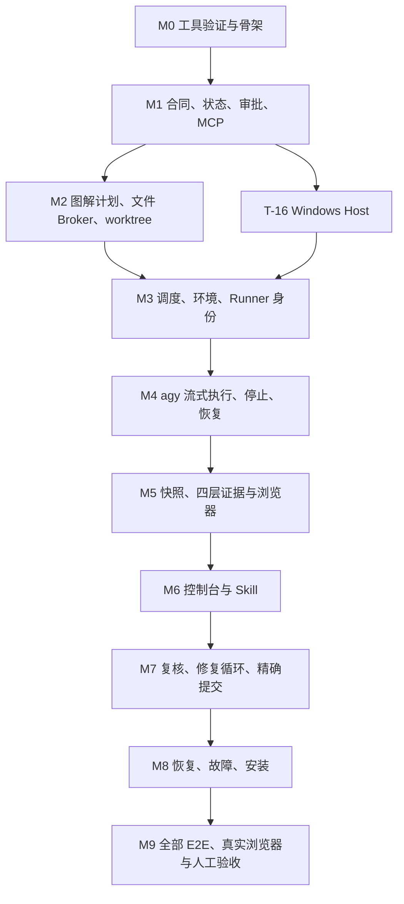

图 13：按依赖拓扑执行，不按编号机械运行。T-16 是 M3 的前置基础，可在状态层完成后先实现。图表示模块依赖，不授权执行者自行创建额外模型团队；每个 workflow 一个写入执行轮次。

| 里程碑 | 交付门槛 |
|---|---|
| M0 | 指定模型与本机工具能力有实测证据，项目可编译 |
| M1 | 没有审批无法执行，跨 workflow 访问拒绝，状态持久且幂等 |
| M2 | 计划可读且图可渲染，文件越界在写入前被拦截 |
| M3 | 同仓/跨仓工作区、端口、数据、SID/进程归属明确 |
| M4 | 真实 Gemini 能执行受控任务、实时显示、停止与恢复 |
| M5 | 四层验证证据可核对，假成功与旧报告被拒绝 |
| M6 | 用户可以理解计划并实际操作全过程 |
| M7 | 人工验收后才复核，缺陷循环及自动本地提交成立 |
| M8 | 重启、配额、磁盘、断线与安装有确定恢复路径 |
| M9 | 真实订阅模型与浏览器完成整套流程，用户验收通过 |

估算为一位熟悉 TypeScript/Windows 的开发者约 25—40 个工作日，实际取决于 Windows 运行身份与现有项目接入情况；这是实施量级估算，不是模型必然完成时限。先完成端到端演示闭环，再接业务仓库，不能把只跑通模拟器的版本标成完整交付。

### 16.3 原子任务明细

每项任务完成前要记录修改文件和证据。下表中的测试编号在配套测试文档有操作与断言；所有任务当前均未实施。任务内部先完成对应有意义的测试，再检查真实结果，不能为勾选而删除失败用例。

#### T-01：核实实际运行能力

- 里程碑/依赖：M0；无。
- 输入依据：本文相关模块合同，以及前置任务的实际产物与证据。
- 修改位置：`packages/cli/src/doctor.ts；docs/guide/兼容性基线.md`。
- 核心实现：读取本机版本、解析真实 exe/Node 入口；在实际运行身份验证指定模型、stream-json、会话恢复、Hook 拒绝与 OpenTabs 工具发现。保存脱敏 fixture 和 toolchain.lock.json。
- 范围与停止条件：不得自动改订阅、升级 CLI、覆盖个人配置；无法验证就报告具体失败并停止依赖阶段。
- 完成定义：真实能力报告完整；不能把 help 或模拟输出当账户调用成功。
- 必需验证：IT-01。

#### T-02：建立项目与固定工具链

- 里程碑/依赖：M0；T-01。
- 输入依据：本文相关模块合同，以及前置任务的实际产物与证据。
- 修改位置：`package.json；package-lock.json；apps/；packages/；host/`。
- 核心实现：建立 npm workspaces 与 TypeScript strict；创建 API、web、core、adapter、CLI、WinHost 包；锁定兼容版本，提供 build/typecheck/test 脚本。
- 范围与停止条件：不建设桌面壳、远端集群或第二执行器；不使用漂移的 latest 运行安装。
- 完成定义：干净机器按锁文件安装、编译成功；未知配置测试通过。
- 必需验证：UT-01。

#### T-03：定义配置及业务 Schema

- 里程碑/依赖：M1；T-02。
- 输入依据：本文相关模块合同，以及前置任务的实际产物与证据。
- 修改位置：`packages/contracts/src/{config,workflow,plan,review}.ts`。
- 核心实现：落实 §4、§5、§14 所有枚举/字段；通用上下文与状态迁移表唯一来源；生成 JSON Schema 供 MCP/UI/CLI 共用。
- 范围与停止条件：禁止任意状态更新字段；动态端口与静态业务决策分开。
- 完成定义：缺字段、非法状态和未知字段均有可定位错误；Schema 与示例一致。
- 必需验证：UT-01,UT-02。

#### T-04：实现状态持久化与事务

- 里程碑/依赖：M1；T-03。
- 输入依据：本文相关模块合同，以及前置任务的实际产物与证据。
- 修改位置：`packages/store/src/{migrations,repository,transaction}.ts`。
- 核心实现：建立逻辑实体迁移、foreign key/WAL、单写入队列；状态 CAS 与事件序号同事务；保留历史计划和证据关联。
- 范围与停止条件：不得用 Markdown 勾选当数据源；不得长事务等待模型。
- 完成定义：并发陈旧写拒绝，重启保留合同，迁移可回放。
- 必需验证：UT-02,UT-03,IT-02。

#### T-05：实现 outbox 与幂等副作用

- 里程碑/依赖：M1；T-04。
- 输入依据：本文相关模块合同，以及前置任务的实际产物与证据。
- 修改位置：`packages/core/src/{outbox,launch-intent,idempotency}.ts`。
- 核心实现：同键保存请求 hash 和结果；outbox 消费前核查启动意图；Host 按 run_id 去重。注入事务后崩溃并恢复。
- 范围与停止条件：不能声称数据库事务覆盖启动进程和 Git；同键异参返回冲突。
- 完成定义：重复请求/消费只产生一个模型 Job。
- 必需验证：UT-03,IT-02。

#### T-06：实现可信人工审批

- 里程碑/依赖：M1；T-03,T-04。
- 输入依据：本文相关模块合同，以及前置任务的实际产物与证据。
- 修改位置：`apps/api/src/human/；packages/core/src/approvals.ts`。
- 核心实现：本机直接打开、按钮确认；绑定 action、workflow、内容和版本；保留同源检查、陈旧页面和重复提交拒绝。
- 范围与停止条件：模型不能持有人工接口权限；测试虚拟 authenticator 仅测试环境可用。
- 完成定义：错版本/错内容/重放均拒绝；真实用户验证可批准。
- 必需验证：UT-04,IT-03,E2E-05。

#### T-07：实现角色 MCP 和 API

- 里程碑/依赖：M1；T-03,T-04。
- 输入依据：本文相关模块合同，以及前置任务的实际产物与证据。
- 修改位置：`apps/api/src/mcp/；apps/api/src/routes/；packages/bridge/`。
- 核心实现：按 §5 注册有限工具、结构化入出参、角色/workflow 令牌和分页；HTTP 请求只入队或短操作；stdio 日志走 stderr。
- 范围与停止条件：不增加 approve/commit/set_state/任意 shell 工具。
- 完成定义：Codex/agy 可发现本角色工具，跨任务请求全部拒绝。
- 必需验证：UT-05,IT-03。

#### T-08：实现计划校验和图解渲染

- 里程碑/依赖：M2；T-03,T-07。
- 输入依据：本文相关模块合同，以及前置任务的实际产物与证据。
- 修改位置：`packages/plans/src/{validate,hash,mermaid,render}.ts`。
- 核心实现：静态合同规范化 hash；校验未决项、DAG、任务/测试引用和分类；Mermaid parse 后实际渲染；图过大给明确拆分提示。
- 范围与停止条件：不以关键字扫描代替语义审查；派生进度不能影响静态批准 hash。
- 完成定义：合法计划得到可批准版本，坏图/孤立引用/环均被拦截。
- 必需验证：UT-06,E2E-08。

#### T-09：实现文件读与真实路径策略

- 里程碑/依赖：M2；T-03,T-07。
- 输入依据：本文相关模块合同，以及前置任务的实际产物与证据。
- 修改位置：`packages/workspace/src/{path-policy,read,search}.ts；host/PathResolver.cs`。
- 核心实现：通过原生句柄核实卷/路径；拒绝穿越、设备路径、ADS、reparse 与保护文件；搜索参数结构化，输出分页。
- 范围与停止条件：不能只有 startsWith；不允许读取控制凭证。
- 完成定义：合法读搜索可用，跨目录/卷混淆与隐私路径拒绝。
- 必需验证：UT-07,IT-04。

#### T-10：实现受控补丁与前置范围检查

- 里程碑/依赖：M2；T-09。
- 输入依据：本文相关模块合同，以及前置任务的实际产物与证据。
- 修改位置：`packages/workspace/src/{patch,scope,change-events}.ts`。
- 核心实现：逐文件比较原 hash；检测写/删/改名权限；原子替换并复算 hash；写出审计和失效事件。
- 范围与停止条件：不允许模型改审批/Skill/Hook/.git；不自动回滚范围外用户变更。
- 完成定义：合法补丁生效，冲突不覆盖，禁止路径保持原内容。
- 必需验证：UT-07,IT-04。

#### T-11：实现 worktree 与基线管理

- 里程碑/依赖：M2；T-04,T-09。
- 输入依据：本文相关模块合同，以及前置任务的实际产物与证据。
- 修改位置：`packages/git/src/{repositories,worktrees,baselines}.ts`。
- 核心实现：登记 common git dir；按明确 baseline 建任务分支；支持单仓和前后端双仓；已有目录先验脏状态和分支。
- 范围与停止条件：不 force/stash/reset，不把 git worktree lock 当写锁。
- 完成定义：同仓两个 worktree 独立，脏目录拒绝且原文件不变。
- 必需验证：IT-05。

#### T-12：实现公平资源调度

- 里程碑/依赖：M3；T-04,T-05,T-11。
- 输入依据：本文相关模块合同，以及前置任务的实际产物与证据。
- 修改位置：`packages/scheduler/src/{queue,leases,fairness}.ts`。
- 核心实现：按项目轮转、修复优先与老化；多资源排序申请；执行/测试/浏览器/环境身份槽分开；fencing 防旧 owner。
- 范围与停止条件：旧进程未确认退出不重新授予写锁；等待浏览器不占模型名额。
- 完成定义：三项目资源竞争无死锁/饥饿，超限明确排队。
- 必需验证：UT-08,IT-06,E2E-04。

#### T-13：实现端口租约和清单

- 里程碑/依赖：M3；T-12。
- 输入依据：本文相关模块合同，以及前置任务的实际产物与证据。
- 修改位置：`packages/runtime/src/{ports,manifest,templates}.ts`。
- 核心实现：按端口池分配、真实绑定验证、最多五次重试；渲染受限变量；环境 revision 与清单 hash 保持一致。
- 范围与停止条件：不得杀陌生占端口进程；不支持任意变量表达式。
- 完成定义：并发分配不重复；抢占后所有依赖 URL 一起更新。
- 必需验证：UT-09,IT-06。

#### T-14：实现前后端启动与身份检查

- 里程碑/依赖：M3；T-13,T-16。
- 输入依据：本文相关模块合同，以及前置任务的实际产物与证据。
- 修改位置：`packages/runtime/src/services.ts；examples/demo/{api,web}/`。
- 核心实现：准备小型列表/保存演示应用；启动注入端口、API target、数据目录；健康核验 PID/socket/cwd/build；验证实际请求。
- 范围与停止条件：演示工程行为独立于用户业务仓库；启动时限不同于服务存活时间。
- 完成定义：双环境页面/API/数据目标一致，停止模型后服务仍在。
- 必需验证：UT-09,IT-07,BROWSER-04。

#### T-15：实现当前用户下的环境与数据命名空间

- 里程碑/依赖：M3；T-12,T-16。
- 修改位置：`packages/runtime/src/environment.ts`、`packages/process/src/manager.ts`。
- 核心实现：使用当前用户登录；按工作流分配数据目录、端口、fixture 和共享数据资源锁。
- 范围：不创建 Windows 用户，不保存账户密码，不调用身份切换 API，不配置账户 ACL。
- 完成定义：并行任务不串目录、端口或数据；停止只影响所属进程。
- 验证计划：IT-04,IT-07；本轮按用户要求暂停执行。

#### T-16：实现 Windows Host 和进程注册

- 里程碑/依赖：M3；T-02,T-04。
- 输入依据：本文相关模块合同，以及前置任务的实际产物与证据。
- 修改位置：`host/DevFlow.WinHost/；packages/process/src/host-client.ts`。
- 核心实现：实现受保护 IPC；挂起创建进程、加入 Job 后启动；区分执行、测试和各服务 Job；记录 PID+创建时间+Job。
- 范围与停止条件：不按进程名批量操作；不允许 breakaway；Host 不接收模型自由 shell。
- 完成定义：父子孙归属可查，控制器可按 run 接管和查询 Job。
- 必需验证：IT-08,IT-15。

#### T-17：实现 agy 适配器与流解析

- 里程碑/依赖：M4；T-01,T-07,T-16。
- 输入依据：本文相关模块合同，以及前置任务的实际产物与证据。
- 修改位置：`packages/adapters/agy/src/{launch,decode,result}.ts`。
- 核心实现：固定模型/effort、参数数组和任务容器；UTF-8 逐行 NDJSON；保存原始流，解析 init/step/result 并核实实际会话。
- 范围与停止条件：不等待退出后才读日志；不把 result SUCCESS 当测试成功。
- 完成定义：分块、异常和真实事件兼容；身份不符阻塞。
- 必需验证：UT-10,UT-11,IT-09。

#### T-18：实现停止、暂停与失效令牌

- 里程碑/依赖：M4；T-10,T-16,T-17。
- 输入依据：本文相关模块合同，以及前置任务的实际产物与证据。
- 修改位置：`packages/core/src/cancellation.ts；host/JobController.cs`。
- 核心实现：STOPPING 先撤销令牌；有界收尾后终止 Job；核实结束再释放写锁；保留服务；迟到事件仅归档。
- 范围与停止条件：停止不等于回滚；不能旧进程未停就开启新轮。
- 完成定义：目标执行进程树被终止，其他流程/服务不受影响。
- 必需验证：UT-11,IT-08,BROWSER-03。

#### T-19：实现任务包与明确会话恢复

- 里程碑/依赖：M4；T-08,T-17,T-18。
- 输入依据：本文相关模块合同，以及前置任务的实际产物与证据。
- 修改位置：`packages/handoff/src/{bundle,conversation,resume}.ts`。
- 核心实现：hash 化只读任务包；绑定当前阶段/任务/反馈；按明确 conversation 恢复；不可恢复则显式新会话重建包。
- 范围与停止条件：禁用最近会话恢复；不共享不同 workflow 的聊天记忆。
- 完成定义：执行者获得完整材料，恢复事件明确关联旧 run 和新 run。
- 必需验证：IT-09。

#### T-20：实现规范代码快照

- 里程碑/依赖：M5；T-10,T-11。
- 输入依据：本文相关模块合同，以及前置任务的实际产物与证据。
- 修改位置：`packages/snapshots/src/{manifest,git-tree,freeze}.ts`。
- 核心实现：覆盖新增/删除/改名/二进制/依赖/配置；处理 attributes/CRLF；冻结源码并计算跨仓 manifest；变化触发全部证据失效。
- 范围与停止条件：不只看 git diff；不漏未跟踪文件；运行日志与产品文件精确区分。
- 完成定义：测试内容、复核内容与规范 tree 可核对，变化可靠识别。
- 必需验证：UT-12,IT-10。

#### T-21：实现受控测试 Runner

- 里程碑/依赖：M5；T-15,T-20。
- 输入依据：本文相关模块合同，以及前置任务的实际产物与证据。
- 修改位置：`packages/runner/src/{commands,checks,collect}.ts`。
- 核心实现：执行登记命令和枚举参数；隔离身份、总时限、新报告目录/nonce；收集 stdout/stderr、退出及发现用例。
- 范围与停止条件：禁止模型自由 command；不在用户验收环境执行破坏性 fixture。
- 完成定义：正式单元/集成/E2E 命令可运行并关联唯一 check。
- 必需验证：UT-13,IT-10。

#### T-22：实现证据解析和通过判定

- 里程碑/依赖：M5；T-21。
- 输入依据：本文相关模块合同，以及前置任务的实际产物与证据。
- 修改位置：`packages/evidence/src/{vitest,junit,playwright,gate}.ts`。
- 核心实现：解析目标项目报告，核对 expected IDs、计数、skip、退出、快照、环境、hash；归档后撤销 Runner 写权限。
- 范围与停止条件：不得靠模型说通过或报告 mtime 判真；测试语义仍交独立复核。
- 完成定义：缺失、过期、全跳过和零用例全部拦截。
- 必需验证：UT-13,IT-10,E2E-06。

#### T-23：实现进度和测试报告生成

- 里程碑/依赖：M5；T-08,T-22。
- 输入依据：本文相关模块合同，以及前置任务的实际产物与证据。
- 修改位置：`packages/reports/src/{progress,tests,versions}.ts`。
- 核心实现：从状态及完成定义渲染单/三文档；每个勾附证据，stale 自动取消当前勾；旧计划/旧证据不覆盖。
- 范围与停止条件：不能把人工编辑勾选导入真值；最终 SHA 不造成 snapshot 自引用。
- 完成定义：文档与状态一致，历史可追踪，无虚假完成。
- 必需验证：UT-14,E2E-06,BROWSER-07。

#### T-24：实现 OpenTabs Browser Gateway

- 里程碑/依赖：M5；T-07,T-12,T-13。
- 输入依据：本文相关模块合同，以及前置任务的实际产物与证据。
- 修改位置：`packages/browser/src/{opentabs,policy,scenes}.ts`。
- 核心实现：复用现有 MCP；发现真实工具 Schema；scene/tab/origin/租约检查后转发；操作及结果归档。
- 范围与停止条件：执行者不持 OpenTabs 密钥，不可直接连接，也不可操作审批页。
- 完成定义：拒绝错环境和无租约操作，真实场景工具可用。
- 必需验证：UT-15,IT-11。

#### T-25：实现浏览器验收阶段与实操接管

- 里程碑/依赖：M5；T-19,T-22,T-24。
- 输入依据：本文相关模块合同，以及前置任务的实际产物与证据。
- 修改位置：`packages/core/src/browser-stage.ts；examples/demo/scenes/`。
- 核心实现：取得场景锁后启动 Gemini 浏览器轮次；UI 操作/刷新持久化断言；用户接管全场景锁，结束后释放。
- 范围与停止条件：不让模型占名额等待资源；不可用 API 替代被验收 UI 行为。
- 完成定义：自动浏览器与人工实操不交错，缺证据不通过。
- 必需验证：IT-11,BROWSER-01,BROWSER-02,BROWSER-04。

#### T-26：实现项目概览与任务页面

- 里程碑/依赖：M6；T-07,T-12。
- 输入依据：本文相关模块合同，以及前置任务的实际产物与证据。
- 修改位置：`apps/web/src/{projects,workflows,routing}/`。
- 核心实现：项目分组、状态/阶段、资源等待、需用户动作；路由以 workflow ID 定位，显示当前合同和环境。
- 范围与停止条件：不使用模糊 current_task，全局视图不得串明细。
- 完成定义：三任务同时展示且点击进入正确内容。
- 必需验证：UT-19,E2E-04。

#### T-27：实现实时事件、Diff 与日志界面

- 里程碑/依赖：M6；T-17,T-23,T-26。
- 输入依据：本文相关模块合同，以及前置任务的实际产物与证据。
- 修改位置：`apps/web/src/{events,diff,logs}/；apps/api/src/events/`。
- 核心实现：WebSocket 推送、按 seq 去重补读、虚拟列表、分别显示模型/测试/服务日志；大 diff 分页与快照定位。
- 范围与停止条件：慢 UI 不阻塞模型管道；不输出凭证；不展示编造私有思考。
- 完成定义：断线后补齐不重复，p95 本机事件展示延迟 ≤1 秒。
- 必需验证：UT-19,E2E-02,E2E-07。

#### T-28：实现审批、停止、反馈和验收 UI

- 里程碑/依赖：M6；T-06,T-08,T-18,T-25,T-26。
- 输入依据：本文相关模块合同，以及前置任务的实际产物与证据。
- 修改位置：`apps/web/src/{approvals,feedback,acceptance}/`。
- 核心实现：先图后细节；版本和 hash 可见；用户验证；STOPPING 的真实状态；反馈路由原范围修复；实操清单与验收快照绑定。
- 范围与停止条件：不能前端乐观更新成已停/已通过；不自动代勾用户验收。
- 完成定义：用户完整操作不跳步；反馈与新修复批准独立。
- 必需验证：E2E-01,E2E-02,E2E-03。

#### T-29：实现 Skill 包和文档模板

- 里程碑/依赖：M6；T-08,T-19。
- 输入依据：本文相关模块合同，以及前置任务的实际产物与证据。
- 修改位置：`packages/skills/；packages/templates/；packages/cli/src/install-skills.ts`。
- 核心实现：实现 §13 五个 Skill；模板与工具名一致，安装与版本 hash；执行包显式携带正文；提供计划 linter。
- 范围与停止条件：不覆盖其他 Skill；不把安全建议当自动扩范围授权。
- 完成定义：技能内容、模板与生成文档一致，角色边界清楚。
- 必需验证：IT-18,E2E-08。

#### T-30：实现 Codex 新会话复核适配器

- 里程碑/依赖：M7；T-20,T-22,T-28,T-29。
- 输入依据：本文相关模块合同，以及前置任务的实际产物与证据。
- 修改位置：`packages/adapters/codex/src/{review,decode,schema}.ts`。
- 核心实现：只响应唯一 HUMAN_ACCEPTED review_request；启动只读新会话和 stdin 材料；解析 JSONL/result；覆盖账和 Schema 严格核验。
- 范围与停止条件：验收前 0 自动 GPT-6 回合；不用 MCP 通知猜测原桌面任务唤醒。
- 完成定义：仅人工验收后启动一次指定模型，缺材料返回 incomplete。
- 必需验证：UT-16,IT-12。

#### T-31：实现问题处置与修复计划循环

- 里程碑/依赖：M7；T-08,T-19,T-30。
- 输入依据：本文相关模块合同，以及前置任务的实际产物与证据。
- 修改位置：`packages/core/src/{findings,repair-plans}.ts`。
- 核心实现：确认问题映射修复任务/测试；r02 不覆盖 r01；批准后恢复 Gemini；重新测试实操复核；必要问题先调研。
- 范围与停止条件：复核模型不改源码；无关历史建议不强塞本轮；不跳过新批准。
- 完成定义：一次完整修复循环可以追溯问题关闭证据。
- 必需验证：UT-16,E2E-03,BROWSER-06。

#### T-32：实现提交前严格条件检查

- 里程碑/依赖：M7；T-20,T-22,T-30,T-31。
- 输入依据：本文相关模块合同，以及前置任务的实际产物与证据。
- 修改位置：`packages/git/src/commit-gate.ts`。
- 核心实现：核对同合同/快照、全部任务/测试/实操/复核、无问题、范围合规、HEAD 未变；生成可解释缺失条件。
- 范围与停止条件：任一条件缺失不得提交；不把低级真实缺陷自动忽略。
- 完成定义：逐项破坏条件都被拒绝，当前完整合同可进入提交意图。
- 必需验证：UT-17,IT-13。

#### T-33：实现精确 Git 提交与多仓恢复

- 里程碑/依赖：M7；T-11,T-32。
- 输入依据：本文相关模块合同，以及前置任务的实际产物与证据。
- 修改位置：`packages/git/src/{commit-intent,commit-tree,ref-update}.ts`。
- 核心实现：临时 index/write-tree 比较；预检 hook 提前；commit-tree 和 CAS ref；保存每仓 commit 结果；部分失败恢复。
- 范围与停止条件：不 add .、amend、push、merge、reset；不跳过项目强制检查。
- 完成定义：实际 commit tree 等于审核 tree；重复事件无重复提交；部分状态可见。
- 必需验证：IT-13,IT-14,BROWSER-08。

#### T-34：实现重启对账和孤儿进程恢复

- 里程碑/依赖：M8；T-05,T-12,T-16,T-18。
- 输入依据：本文相关模块合同，以及前置任务的实际产物与证据。
- 修改位置：`packages/recovery/src/{reconcile,jobs,leases}.ts`。
- 核心实现：恢复数据库后对照 Host boot/Job/PID 创建时间；SUSPECT 不抢锁；按现有进程接管或标中断；运行输出补读。
- 范围与停止条件：不得仅靠租约超时猜进程死；不自动重放数据库副作用。
- 完成定义：杀任一组件后不双启动、不误成功、不伤其他流程。
- 必需验证：UT-18,IT-15,E2E-07。

#### T-35：实现限额、错误策略与本地通知

- 里程碑/依赖：M8；T-17,T-27,T-34。
- 输入依据：本文相关模块合同，以及前置任务的实际产物与证据。
- 修改位置：`packages/core/src/failure-policy.ts；apps/web/src/notifications/`。
- 核心实现：分类认证/额度/超时/无输出/重复失败/依赖不可用；状态改变才通知；记录下一步；禁用所有自动模型/计费 fallback。
- 范围与停止条件：无输出只提示停滞，不捏造故障；普通健康检查不调用 GPT-6。
- 完成定义：所有异常落在确定分支，用户能据此恢复，未变状态安静。
- 必需验证：UT-18,IT-16。

#### T-36：实现证据备份和保留策略

- 里程碑/依赖：M8；T-04,T-22,T-34。
- 输入依据：本文相关模块合同，以及前置任务的实际产物与证据。
- 修改位置：`packages/store/src/{backup,retention,restore}.ts`。
- 核心实现：一致数据库备份加引用证据；保存未完成工作流和审批；只清理到期可删对象；磁盘不足停止新写入。
- 范围与停止条件：不自动删除 worktree/用户源码；恢复前验证 hash 和版本。
- 完成定义：备份可恢复完整合同/证据，引用中数据不误删。
- 必需验证：UT-20,IT-16。

#### T-37：实现安装、连接配置与使用指南

- 里程碑/依赖：M8；T-01,T-07,T-16,T-29。
- 输入依据：本文相关模块合同，以及前置任务的实际产物与证据。
- 修改位置：`packages/cli/src/{install,config,doctor}.ts；docs/guide/`。
- 核心实现：打包当前兼容构建；配置服务身份、Host、MCP、Skill、本机访问限制；备份合并个人配置；明确 OpenTabs 复用与登录验证。
- 范围与停止条件：不在本计划阶段安装；实际安装依用户实施授权，不读取/打印秘密。
- 完成定义：幂等安装可启动真实控制台，保留原 MCP/Skill；卸载只移本组件。
- 必需验证：IT-17。

#### T-38：完成确定性 E2E 与并行故障验收

- 里程碑/依赖：M9；T-25,T-28,T-31,T-33,T-34,T-35。
- 输入依据：本文相关模块合同，以及前置任务的实际产物与证据。
- 修改位置：`tests/e2e/；tests/fixtures/；docs/test/`。
- 核心实现：用 fixture 模型覆盖正常闭环、原范围反馈、复核修复、三流程并发、审批越权、证据失效、重启和文档分类。
- 范围与停止条件：fixture 只证明程序行为，不能作为真实订阅模型互通证据。
- 完成定义：E2E-01—08 全部通过并保存 trace，失败不改门槛。
- 必需验证：E2E-01,E2E-02,E2E-03,E2E-04,E2E-05,E2E-06,E2E-07,E2E-08。

#### T-39：完成真实 OpenTabs UI 验收

- 里程碑/依赖：M9；T-37,T-38。
- 输入依据：本文相关模块合同，以及前置任务的实际产物与证据。
- 修改位置：`docs/test/真实浏览器验收记录.md；examples/demo/`。
- 核心实现：按 BROWSER-01—08 在真实浏览器操作控制台/演示页面；记录目标身份、截图、请求、结果和控制台异常。
- 范围与停止条件：不以 Playwright 截图冒充 OpenTabs；审批由用户执行；不操作生产数据。
- 完成定义：所有真实场景满足断言，证据可追溯且不串任务。
- 必需验证：BROWSER-01,BROWSER-02,BROWSER-03,BROWSER-04,BROWSER-05,BROWSER-06,BROWSER-07,BROWSER-08。

#### T-40：真实模型闭环、用户验收与独立复核交付

- 里程碑/依赖：M9；T-39。
- 输入依据：本文相关模块合同，以及前置任务的实际产物与证据。
- 修改位置：`docs/guide/使用与恢复指南.md；docs/test/最终验收报告.md`。
- 核心实现：真实 GPT-6 规划与 Gemini 实施演示缺陷；完成四层验证后用户实操，再启动真实 GPT-6 复核；问题走修复循环，最后受控本地提交。
- 范围与停止条件：Bootstrap 阶段未完成的 DevFlow 不能给自己签发成功，先用可审查外部证据记录；不自动发布。
- 完成定义：HUMAN-01—03 通过，真实模型记录和最终 tree/commit 一致，无未解决确认问题。
- 必需验证：HUMAN-01,HUMAN-02,HUMAN-03。

## 17. 验证策略与整体交付条件

配套测试文档列出 20 项单元、18 项集成、8 项 E2E、8 项 OpenTabs 和 3 项人工测试，共 57 项。核心要求是验证程序真正拒绝不合法行为，而不只是检查它能走通正常路径。

### 17.1 必须演示的三流程场景

创建 CRM/WF-101 和 CRM/WF-102 两个同仓 worktree，再创建报表/WF-201。分别批准三个不同合同，同时运行三个 Gemini 轮次。打开三套日志和页面核对身份；停止 WF-101，WF-102 与 WF-201 继续。WF-102 完成验证后等待你实操，期间其环境仍可用且不调用 GPT-6。你验收 WF-102 后只启动它的 GPT-6 复核。然后模拟 WF-101 迟到 result、端口抢占、浏览器排队和控制器重启，其他任务不受状态污染。

### 17.2 Bootstrap：DevFlow 如何验证自己

最初 DevFlow 尚不存在，T-01—T-37 的计划批准和证据由现有 Codex、CLI、文件报告及用户操作完成；不能让未完成的服务给自己的测试打勾。核心闭环完成后，在专用演示仓库使用新服务测试。生产控制实例固定 4810；测试 DevFlow 自身 UI 时使用独立测试实例 14810、独立状态目录和演示数据，绝不指向管理真实任务的 4810。

用于 DevFlow 自身验收的 OpenTabs 场景可以访问登记的测试实例 14810；通用业务工作流仍拒绝访问管理实例的审批页面。BROWSER-01 的图解/审批页观察发生在测试实例，真正批准必须由用户完成。Playwright 的虚拟 authenticator 和 fixture 模型只能在专用测试构建/配置启用，正式安装发现这些模式即拒绝启动。

T-40 采用真实订阅模型完成一次可控缺陷修复，证明不是只有 fixture 能运转。用户实操通过以后，再由新 GPT-6 会话复核最终版本和证据；发现问题就生成新修复计划循环。真实环境或账户不可用时如实标记未完成，不能借模拟测试宣布全部交付。

### 17.3 性能和可靠性目标

| 指标 | 验收方法与目标 |
|---|---|
| 模型监工调用 | 从交接至人工验收前，自动 GPT-6 调用次数为 0 |
| 实时输出 | 本机收到事件到可见 p95 ≤ 1 秒；慢客户端不丢原始记录 |
| 短请求 | 状态/控制类本机请求 p95 ≤ 500 ms；图渲染、启动和测试异步入队 |
| 停止权限 | stop 请求接受后立即撤销 run 能力；进程确认前不显示已停 |
| 并行 | 3 个执行器、2 个重测试、6 个保留环境按上限正确排队 |
| 日志容量 | 10 万条事件的详情页可分页/虚拟滚动，无整批塞入 DOM |
| 断线 | 对照事件序号补齐，重复传递无重复状态变化 |
| 重启 | 存储和 Host 核对后无双启动、无错误释放写锁、无假成功 |
| 提交 | 每个已提交 tree 与对应测试、验收、复核快照完全一致 |

性能数字是产品目标，尚未实测。吞吐不足时优化事件传输与存储，不能以减少证据或跳过检查来满足指标。

## 18. 安装、配置、运行与故障操作计划

### 18.1 安装与统一入口

1. 当前 Windows 用户双击“安装或更新 DevFlow.cmd”；依赖、前后端编译、Host 编译、个人 Skill 和 MCP 配置由安装器处理，原配置备份。已有本安装服务经 PID、程序路径和创建时间核对后停止。
2. 安装器不创建/切换 Windows 用户、不修改账户 ACL、不启动测试或模型。复用既有 agy/Codex 登录和 OpenTabs 配置。
3. 首次安装后重启 Codex 加载统一入口。以后在业务项目说“用 DevFlow 帮我……”，无需记内部 Skill 和工具名。
4. MCP stdio 桥接按需启动后台服务；控制台也可由“打开 DevFlow.vbs”双击启动和打开，直接进入工作台，无配对或登录。
5. 服务根据实际仓库、worktree 和会话识别项目。未接入时同一回合自动调查并登记配置，然后为原需求生成计划，端口适配等并入这次计划。
6. 用户批准后才实施。代码适配完成后再启动环境并冻结测试快照；正式交付仍需要后续真实测试与用户验收。本轮测试已暂停。

### 18.2 日常操作

| 用户动作 | 系统结果 |
|---|---|
| 在 Codex 提出任务 | GPT-6 调查并提交图解计划 |
| 在控制台批准 | 精确批准版本，资源满足后开始 Gemini |
| 打开执行页 | 直接看公开日志、工具和 Diff，不需要唤醒 GPT-6 |
| 停止/反馈 | 只作用于所选 workflow，现场保留；原范围反馈给 Gemini |
| 自动验证完成 | 本地通知用户，保留环境等待实操 |
| 验收通过并复核 | 创建一次新的 GPT-6 只读复核 |
| 复核发现问题 | 新修复计划等待批准，不偷偷改代码 |
| 复核通过 | 程序检查后自动本地提交并展示 SHA |
| 另行要求整合/发布 | 新的明确操作合同，不由完成事件自动触发 |

### 18.3 故障操作表

| 提示 | 用户/运维操作 | 程序恢复条件 |
|---|---|---|
| `AUTH_REQUIRED` | 在官方 CLI 实际运行身份内登录，再点恢复 | 能力探针通过；仍使用原模型 |
| `QUOTA_EXHAUSTED` | 等额度恢复或用户另行指定后续策略 | 不自动跨账户或 API 计费 |
| `SCOPE_CHANGE` | 把证据带回 Codex 重新规划 | 新合同已批准 |
| `PORT_CONFLICT` | 查看端口池与归属；扩池属于配置变更 | 新环境 revision 验证一致 |
| `BROWSER_BUSY` | 查看占用 workflow，等待或结束自己的实操 | 取得完整场景租约 |
| `EVIDENCE_MISSING/STALE` | 查看缺失项并按当前版本重跑 | expected IDs 与快照匹配 |
| `RECOVERY_REQUIRED` | 打开现场与对账结果，处理未知存活进程 | 旧写入权已确认撤销，恢复不重复启动 |
| `COMMIT_PARTIAL` | 查看逐仓库提交结果，处理变动仓库基线 | 其余仓库仍对应已审快照才能继续 |
| `DISK_FULL` | 按保留清单回收非活动临时日志或扩容 | 证据可以可靠写入后恢复 |

### 18.4 不变的配置边界

计划文档、全局默认配置、项目配置、每轮运行清单、实际有效配置五者分别有 hash。不能把模型手写的 project.yaml 自动视为已批准配置；接入/变更先验证，再纳入合同批准。服务升级不覆盖运行中计划和证据，旧适配器协议版本仍保留到对应 workflow 结束或明确迁移。

## 19. 开发完成定义与交接

交付完成同时满足：40 项开发任务达到各自定义；57 项测试完成并有当前证据；真实 GPT-6/Gemini/OpenTabs 贯通；用户实际验收；新会话 GPT-6 全面复核；无未解决确认问题；最终本地提交 tree 与验收和复核一致。

交接包包含安装包及 hash、锁文件、五个 Skill、MCP/项目/工作流配置模板、命令与错误码说明、示例工程、测试目录和报告、Windows 权限说明、恢复/备份指南、当前限制与实际验证版本。文档放入相应 docs 分类；密钥、个人登录和运行数据库不提交业务仓库。

本计划中的全部业务规则和架构选择已给定。实施者仍须执行兼容性探针和实际验收；如果事实推翻既定方案，就停止相应步骤、展示事实并由 GPT-6 在用户发起后修订计划，不能在执行中悄悄改方案。新业务项目的地址、端口值、真实凭证和实际 baseline 由登记/分配流程提供，它们是受规则约束的运行输入，不是留给 Gemini 的方案选择题。

当前交付状态：完成规划文档及初始进度/测试合同，未安装 DevFlow、未实施源码、未运行其中的产品测试、未创建提交或发布。

## 20. 核实资料与来源

原生功能以 2026-09-11 阅读的官方文档和本地 CLI 帮助为依据。DevFlow 接口、配置、状态、身份和提交算法是本文设计，引用不表示厂商已经实现了这些规则。

| 依据 | 本文使用范围 |
|---|---|
| [Codex MCP 配置](https://developers.openai.com/codex/mcp/) | HTTP MCP、令牌环境变量、超时与工具列表 |
| [Codex Skill](https://developers.openai.com/codex/skills/) | SKILL.md 与本地发现目录 |
| [Codex 非交互执行](https://developers.openai.com/codex/noninteractive/) | exec、JSONL、结果 Schema、独立复核 |
| [GPT-6 Astra 官方模型页](https://developers.openai.com/api/docs/models/gpt-6-astra) | 模型名称；不以 API 价格说明订阅额度 |
| [agy Headless](https://www.antigravity.google/docs/cli/headless/) | 模型 slug、指定会话、事件流、非交互权限与结束结果 |
| [agy Hooks](https://www.antigravity.google/docs/hooks/) | PreToolUse 原生字段与 Hook 配置 |
| [agy Permissions](https://www.antigravity.google/docs/cli/permissions/) | 允许/询问/拒绝及匹配优先级 |
| [agy Sandbox](https://www.antigravity.google/docs/cli/sandbox/) | 当前列举 Linux/macOS，不把 Windows 强隔离视为已验证 |
| [agy MCP](https://www.antigravity.google/docs/mcp/) | mcp_config.json、stdio、serverUrl 与 headers |
| [MCP TypeScript SDK](https://raw.githubusercontent.com/modelcontextprotocol/typescript-sdk/main/README.md) | v2 分包、工具 Schema、HTTP/stdio |
| [MCP 传输规范](https://modelcontextprotocol.io/specification/2025-11-25/basic/transports) | JSON-RPC 传输、HTTP/stdio 概念；实现按所锁 v2 SDK 协商协议版本 |
| [OpenTabs MCP Server](https://opentabs.dev/docs/reference/mcp-server) | 现有 gateway、工具发现与调用、鉴权引用 |
| [Node child_process](https://nodejs.org/api/child_process.html) | 参数数组、管道、异步事件与 Windows 包装器边界 |
| [Windows Job Objects](https://learn.microsoft.com/en-us/windows/win32/procthread/job-objects) | 进程树管理、停止与归属 |
| [Git worktree](https://git-scm.com/docs/git-worktree) | 多工作区、共享仓库部分和 lock 边界 |
| [Git commit-tree](https://git-scm.com/docs/git-commit-tree) / [update-ref](https://git-scm.com/docs/git-update-ref) | 精确 tree 创建提交与预期旧 ref 比较更新 |
| [Vite 服务配置](https://vite.dev/config/server-options.html) | strictPort、proxy 和启动参数适配 |
| [Spring Boot 外部配置](https://docs.spring.io/spring-boot/reference/features/external-config.html) | 接入示例中命令行覆盖配置 |
| [Playwright 隔离](https://playwright.dev/docs/browser-contexts) | 独立 browser context |
| [Mermaid 使用文档](https://mermaid.js.org/config/usage.html) | parse 与渲染校验 |
| 本地 `codex --version / exec --help`、`agy --version / --help`、模型缓存 | §1.4 所列实测 CLI 能力与版本 |

本地规则参考：[文档位置规范](C:/Users/yckj4798/.codex/skills/doc-location/SKILL.md)、[MCP 开发技能](C:/Users/yckj4798/.codex/skills/mcp-builder/SKILL.md)、[OpenAI 文档技能](C:/Users/yckj4798/.codex/skills/.system/openai-docs/SKILL.md)、[提交规范](C:/Users/yckj4798/.codex/skills/commit/SKILL.md)。后续接入项目的 AGENTS.md 和测试规范同样纳入调查，但不能覆盖用户已确定的批准、最小修改、真实验收和不自动发布要求。

本次文档验证：14 张 Mermaid 图已解析并在独立临时浏览器中实际渲染；7 段 JSON、3 段 YAML、1 段 TOML 示例通过语法解析；40 项开发任务依赖无环、任务与 57 项验证编号有效；三份文档的代码围栏和相互链接已检查。上述检查只验证规划产物，不代表 DevFlow 实现或产品测试通过。
