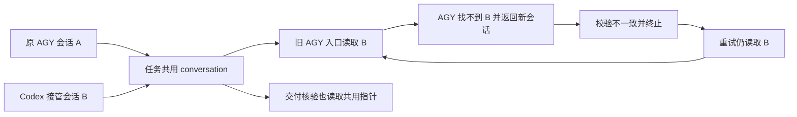
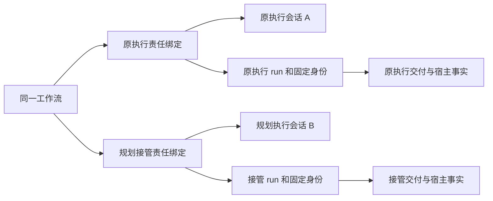
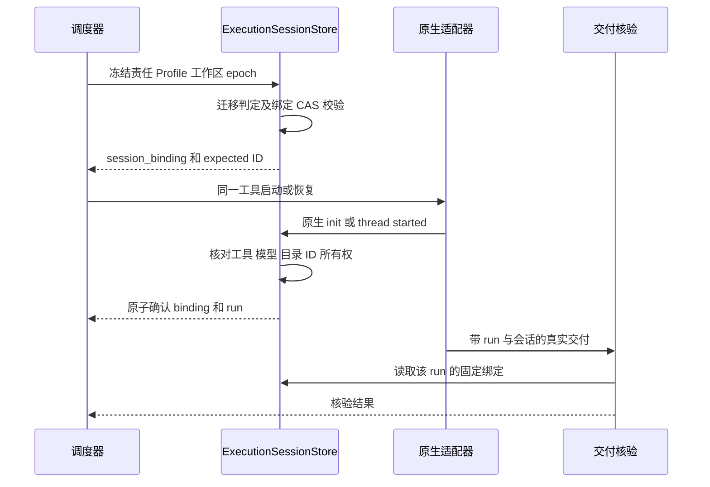
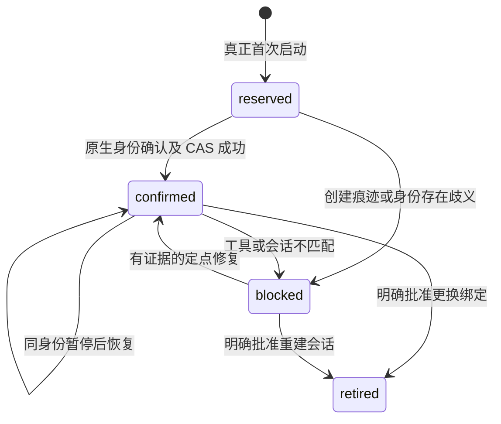
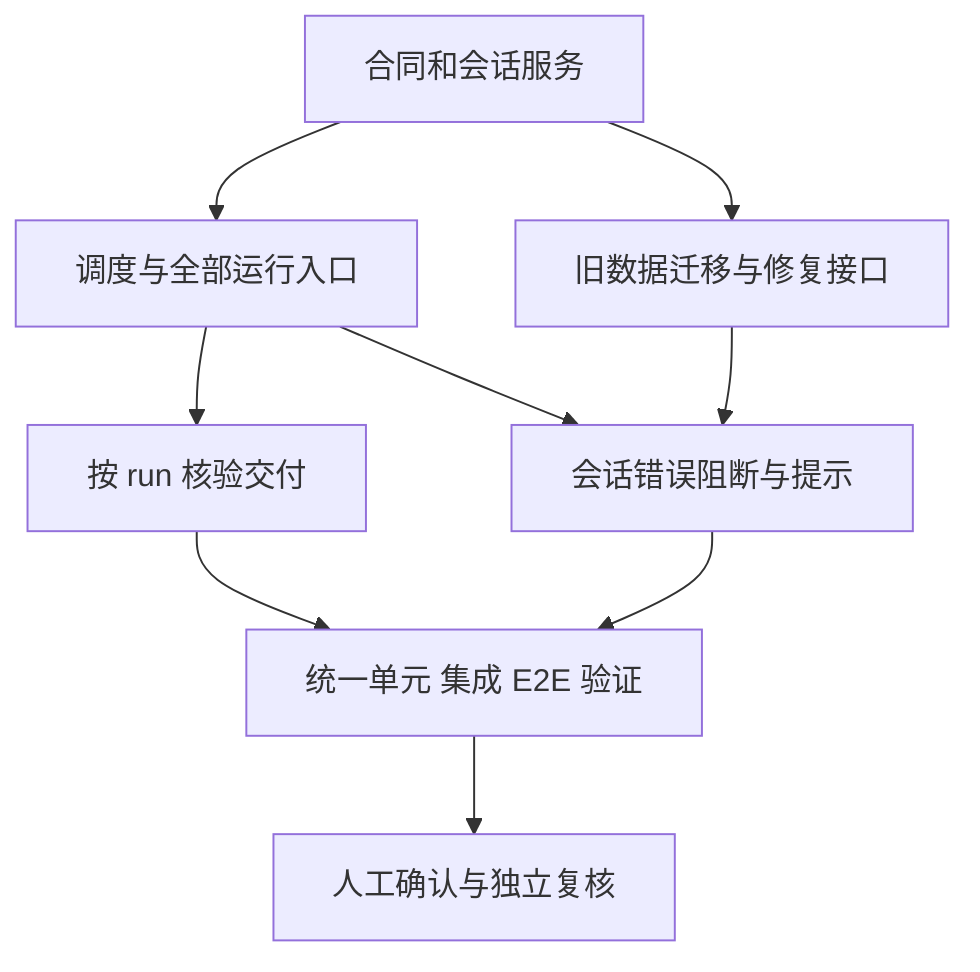
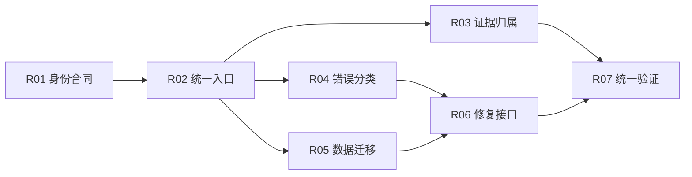

# DevFlow 执行会话隔离与恢复机制整改计划

> 文档版本：1.0，2026-09-17。本文由用户明确要求编写，记录本次恢复结果与后续确定的整改设计。后续产品代码整改尚未实施，本文没有自动登记、批准或替换正在执行的任务计划。

## 1. 结论与本次授权边界

需要统一所有执行入口的会话存储、选择、确认及证据归属。会话必须同时绑定**工具身份**和**执行责任方**；原指定执行模型与规划模型接管执行必须有独立、可恢复的会话。即使两者采用同一工具、同一模型、同一 Profile，也不能共用执行会话。

本次用户授权包含两件事：恢复已有任务；将详细整改计划写入 Markdown。本次实际采取了有备份、事务及状态校验的一次性会话指针修复，并调用正规恢复 API。没有实施本文列出的长期代码改造，没有重新规划原任务，没有重启控制器、覆盖生产 dist 或修改其他任务。

后续实施范围限定为会话身份、执行责任、恢复、证据归属、迁移及其直接依赖。原批准计划的业务范围、两道质量关卡、人工验收、原测试要求及工作区边界继续有效。本文不能用于将原任务的未完成项或被拒绝交付标记为通过。

## 2. 已核验的现场与恢复记录

### 2.1 对象与基线

| 项目 | 已核验事实 |
| --- | --- |
| 任务 | DevFlow 剩余修复与验收（Codex + agy 独立工作树） |
| workflow_id | `wf-a87ff27b-c0a9-4c4a-bbdf-490064362415` |
| 原正式计划 | revision `1`，hash `abd7492337c230af527545189780c5c457d984d4aea838188e1d6127f60fcd6a` |
| 主仓库 | `C:\Code\system-handle` |
| 本次调查主仓库 HEAD | `df18ee4d357fa939645be16fd233a1162bddbebe`；有其他既有未提交修改，不能将 HEAD 当作完整现场快照 |
| 任务工作区 | `C:\Code\system-handle\.devflow\worktrees\project-4b84075106c10a29\wf-a87ff27b-c0a9-4c4a-bbdf-490064362415\main` |
| 原执行身份 | `legacy-executor` / `agy` / `gemini-3.7-flash-high` |
| 原 AGY 会话 | `cdd946fb-6bec-4718-b9ba-973fa2874942` |
| Codex 接管身份 | `legacy-planner` / `codex` / `gpt-6-astra` |
| Codex 接管会话 | `01a0ae52-2cbb-7d30-a875-ec92751534be` |
| 修复前状态 | `BLOCKED / repair_exhausted`，workflow version `170` |
| 本次恢复依据 | 当前没有有效 `repair_assignment`，正常调度选择原 AGY 执行 Profile；不能因为存在 Codex 历史会话便推定仍应由规划模型接管 |

### 2.2 时间线（北京时间）

| 时间 | 事实 |
| --- | --- |
| 17:43:44 | Codex 接管轮交付被拒绝，166 项问题仍需处理 |
| 18:27:07—18:28:31 | 六次 AGY 启动均收到 Codex 会话 ID；每轮原始日志只有一个 `init`，没有实际工具执行 |
| 18:28:31 | 六次恢复失败后进入 `REPAIR_EXHAUSTED` |
| 18:52:22 | 完成目标任务会话行的事务修复；工作流状态、计划及审批保持不变；追加审计事件 `5410 / ConversationBindingRepaired` |
| 18:52:36 | `POST /api/workflows/{id}/recover` 返回 `QUEUED`，version `172` |
| 18:52:39 | 正常调度进入 `EXECUTING`，version `173`，新 run `run-b0595eb4-ce26-47a3-bcd3-46435ea805d2` |
| 18:54:27 观察 | AGY `init` 返回原会话 `cdd946fb…`；工具步骤 1369、1371 已完成工作包和交付问题读取，1373 正在执行 `pnpm run build`；Codex 接管会话仍保留 |
| 19:13:24 后续观察 | 当前运行记录出现 `MODEL_CONNECTION_FAILED`，事件 5684 显示网络重试第 5/10 次并重新排队；事件 5683 的会话仍为 `cdd946fb…`，没有再次串用 Codex ID；`/api/health` 返回 ok=true |

这证明本次跨工具会话错绑已解除、任务恢复了实际执行。它不证明构建通过、完整交付通过或原任务完成；最新观察中出现的是另一项模型连接异常及其自动重试，不能报告为持续顺利运行。后续运行状态以工作台与当轮证据为准。

### 2.3 恢复操作及证据

1. 从原 AGY run `run-e490d4c2-7b1e-44e2-8753-372b6f3e23c8` 的初始化日志核对会话、模型、容器目录及对应 run 的 Profile。
2. 原 AGY 会话文件仍存在：`C:\Users\yckj4798\.gemini\antigravity-cli\conversations\cdd946fb-6bec-4718-b9ba-973fa2874942.db`。在确认无 WAL 后用只读 immutable 连接检查，存在 1366 条历史 steps；没有修改该会话数据库。
3. 在 SQLite `BEGIN IMMEDIATE` 中核对：目标任务仍是 version 170 的暂停现场；无本任务活动租约、未退出的受管进程记录或未派发 outbox；没有有效规划接管指派；原错误绑定和 Codex 独立记录与调查一致。
4. 写入并 fsync 本任务原会话行、原工作流行、Codex 独立会话记录及修复意图备份；以原始 data 和实体 version 做 CAS，仅更新 `conversation[workflow_id]`，补上来源 Profile、run 和执行责任信息。
5. 同一事务追加事实审计事件；没有直接把任务状态改为运行，没有删除失败历史，也没有手工更改验收或审批。
6. 通过正常恢复 API 处理进程核对、恢复状态和调度；确认新进程回到原 AGY 会话且真实工具调用已发生。

备份：`C:\Code\system-handle\.devflow\backups\session-rebind-20260917T105222Z-a87ff27b\binding-before-and-intent.json`。

恢复日志：`C:\Code\system-handle\.devflow\containers\wf-a87ff27b-c0a9-4c4a-bbdf-490064362415\run-b0595eb4-ce26-47a3-bcd3-46435ea805d2.jsonl`。

本次是一次性兼容修复：旧 AGY 入口后续仍会写回仅含 ID 的共用字段。因此不能把此次恢复当作长期缺陷已关闭，也不能在任务已经运行后再次覆盖该字段。回滚必须先停止并核清本任务，且只有当前行仍等于待回滚修复值时才能使用备份；不得覆盖新运行已经确认的会话。

### 2.4 与本次故障区分的已有阻塞

最近一次被拒绝的交付含：149 项验收映射缺失、11 项未完成、4 项宿主执行证据失败、2 项未解决冲突。原记录包含 Vite/Vitest/Go 子进程 `EPERM`、外部平台认证条件不足。原 AGY 历史响应还曾包含 TLS 错误。这些不能靠修会话表消除，应继续由原任务按其正式范围处理，且不能全部解释成 166 个业务代码缺陷。

19:13 后续运行的原始记录同时出现 `tls: bad record MAC`（事件 5682）与 `subscriber fell behind updates, stalled for 5s`（事件 5679，agent 响应订阅中断）。当前平台将该轮归类为模型连接失败；这些记录尚不足以确定网络、CLI 订阅或输出消费哪一环节是首因。本次没有修改代理、账户、TLS 或事件缓冲策略，也没有擅自追加重试轮次。

## 3. 根因、影响与必须保留的行为

### 3.1 缺陷清单

| finding_id | 事实与触发条件 | 根因及影响 | 证据性质 |
| --- | --- | --- | --- |
| SB-F01 | Codex 接管返回后，旧 AGY 恢复读取到 Codex ID | 新旧入口共用 `conversation[workflow_id]`；缺少工具与责任方隔离，导致跨工具恢复 | 本次日志、数据库及生产构建代码共同复现 |
| SB-F02 | `ProfileRuntime.invoke` 用 Profile hash 与 purpose 分组，但原执行、自查、接管用途与实际责任之间没有统一身份合同 | 分组规则散落；接管后的 `plan_self_check` 被归入 `execution`，与 `planner_takeover` 不同；同工具双角色需要显式区分 | 静态确认存在不同分组；本次未将自查分支作为实测故障 |
| SB-F03 | `CONVERSATION_MISMATCH` 被进入自动修复的错误分支接收 | 会话基础设施错误被交给无法成功启动的执行器自行修复，六次空转后只显示笼统暂停原因 | 本次六轮实测 |
| SB-F04 | `NativeValidator.validate` 读取工作流共用会话 ID 作为交付核验依据 | 当前指针会被接管或角色切换覆盖，不能代表被核验 run 的不可变会话身份 | 静态确认；跨轮交付误判风险待专项回归 |
| SB-F05 | 旧 AGY 两处路径写入 `{id}`；部分旧 run 没有 `conversation_id` | 缺工具、Profile、责任与原始证据引用；历史恢复需要拼日志，不能直接安全迁移 | 本次旧数据实测 |
| SB-F06 | 进程退出但旧 run 仍可能保留 `running` | 会话迁移不能只相信历史 run.status；恢复必须结合受管进程、租约与当前所有权核对 | 发现历史 run `run-d2c8054f…` 与已退出 process_record 不一致；不在本次手工改历史状态 |

### 3.2 现状流程

结论：不能只在报错点放宽校验，也不能只往共用记录补一个工具字段而保留互相覆盖的写入模式。入口选择与交付证据必须共同整改。

### 3.3 不变条件

- 继续使用当前系统用户及既有工具登录；不更换账号，不放宽原生权限，不关闭 TLS 校验。
- 会话恢复不能改变原模型选择策略、正式计划 hash、授权、工作区或批准范围。
- 不将运行异常计入质量整改拒绝次数，不由运行失败次数触发规划接管。
- 有效规划接管必须来自当前正式质量流程；历史接管会话存在不代表当前执行权属于规划模型。
- 人工前、人工后质量关卡及程序计划自查继续存在；人工确认不能由测试或模型代签。
- 暂停后不自动继续；明确恢复后沿原任务执行，不新建工作流，不创建后台监工。

## 4. 唯一目标设计

### 4.1 三个概念分别保存

1. **工具身份**：`adapter_id`、`profile_id`、`profile_revision`、固定 Profile 内容摘要、模型选择方式、请求模型、实际模型、工具配置环境引用。
2. **执行责任**：`execution_owner = executor | planner_takeover`。它来自调度决策，在 run 创建时冻结，不能根据最近一次会话的工具名称倒推。
3. **会话用途**：连续开发会话采用 `scope = execution`；规划、独立审查、旁路问答、合并冲突使用各自独立用途，不共享写入型开发会话。

责任方与工具允许任意组合。`executor=codex`、`planner_takeover=agy` 也必须正确；两个责任方使用完全相同的 Profile 仍有两条会话。

### 4.2 逻辑持久化合同

沿用现有 SQLite `entities` 存储，不引入第二套数据库。新增 `session_slot`、`session_binding` 实体与集中服务 `ExecutionSessionStore`；新增 `session_migration` 记录迁移判定及证据。禁止继续将 `conversation` 或 `native_conversation` 作为运行时恢复权威源。

一个连续绑定可以对应多个恢复 run；每个 run 只确认一个会话。交付引用具体 run，不引用工作流当前正在使用的会话。

`session_slot.id = objectHash({workflow_id, execution_owner, scope, scope_id, adapter_id, profile_id, workspace_binding_id, client_environment_id})`。

槽位保存 `active_binding_id`、`generation`、`slot_revision` 和所属任务；每个 `session_binding.id` 使用唯一的 `session-UUID`，另存 `slot_id`、`generation`。首次创建和明确批准重建时，在同一事务中创建新绑定并 CAS 更新槽位；旧绑定保留为 retired，已有 run 仍引用原 binding.id。不能在同一个已确认绑定上直接把 conversation_id 改成另一会话。

- `scope_id`：连续执行固定为 `execution`；规划使用相应规划生命周期 ID；独立审查、旁路问答及合并冲突使用其请求/操作 ID，从而每个独立请求拥有独立会话。
- `workspace_binding_id`：对按 repo_id 排序的既有 workspace.id 集合取 hash。另存 canonical realpath 映射；路径变更必须走显式迁移，不能仅通过字符串替换蒙混过关。
- `client_environment_id`：以固定工具程序解析结果、配置根目录及 Profile 的提供方引用生成无凭据摘要。不是访问令牌；不能保存账号密钥。由适配器解析，不允许模型提供。
- Profile revision 不直接导致静默创建新槽位。记录中保存 revision 和完整配置摘要；发现不兼容时阻断并经现有工具配置变更流程做显式迁移或新建会话决策。

| 字段 | 合同 |
| --- | --- |
| `schema_version` | 固定 `1` |
| `id / slot_id / generation / workflow_id` | 唯一绑定、对应身份槽位、会话代次及所属任务 |
| `execution_owner` | `executor`、`planner_takeover`；非执行用途为 `planner` 或 `independent` |
| `scope / scope_id` | 用途与请求生命周期，按本节规则生成 |
| `adapter_id` | 工具注册表中已支持的 adapter，不能从 ID 格式猜测 |
| `profile_id / profile_revision / profile_hash` | run 冻结的工具配置及摘要 |
| `requested_model / model_selection / observed_model` | 分别存请求值、选择策略与原生报告；未观察到实际模型不能冒填请求值 |
| `workspace_binding_id / workspace_roots` | 实际受管工作区身份与规范路径 |
| `client_environment_id` | 同一工具配置环境的非敏感身份 |
| `conversation_id` | 原生工具的 opaque ID；首次确认前缺省；不限制为 AGY 的 UUID 格式 |
| `status` | `reserved`、`confirmed`、`blocked`、`retired` |
| `binding_revision` | CAS 修订号；会话确认、迁移或状态改变递增 |
| `created_run_id / last_confirmed_run_id` | 首次及最近一次确认身份的运行 |
| `source_evidence` | 来源日志路径/hash、事件序号、来源 run 或迁移记录 ID |
| `created_at / updated_at` | 事实时间 |

run 增加并冻结：`execution_owner`、`session_binding_id`、`session_binding_revision`、`expected_conversation_id`、`dispatch_epoch`；原生初始化通过后写一次 `conversation_id` 与 `session_confirmed_at`。同一个 run 的已确认 ID 不能被后续事件替换。

`dispatch_epoch` 是新建的调度所有权代号，不用会随普通状态更新变化的 workflow.version 代替。每次恢复或重新派发产生新值；只有持有当前写入租约和匹配 epoch 的执行进程可以确认写入型会话。

### 4.3 责任与会话选择表

| 实际用途 | 责任来源 | 连续性 |
| --- | --- | --- |
| implement / functional_fix | 当前有效执行责任 | 恢复该责任方的 `execution` 会话 |
| plan_self_check | 关联的源交付 run.execution_owner；同时验证其与当前有效接管状态一致 | 原执行自查仍用原执行会话；接管自查仍用接管会话 |
| planner_takeover | 当前质量关卡授权的有效接管记录 | 恢复 `planner_takeover + execution` 会话，不能覆盖 executor |
| planning | 固定规划 Profile 与规划生命周期 | 仅恢复同一规划生命周期；不复用开发会话 |
| quality_review | 独立审查请求 | 每次正式审查独立；同一请求中断恢复使用该请求自身会话 |
| aside | 旁路请求 | 独立、只读，不改变活动开发指针 |
| merge_conflict | 正式合并操作和所指派责任方 | 绑定该合并操作；不混入开发或独立审查会话 |

自查源交付属于规划接管，但当前已无有效接管授权时，返回明确的责任状态冲突；不得自动退回原执行会话或自行恢复规划执行权。

### 4.4 启动、确认、恢复时序

算法：

1. 调度器验证计划、授权、有效接管记录、工作区锁与待执行 purpose，创建冻结的 run 和 epoch。
2. `resolveForRun(run)` 读取本责任方的槽位；无记录时先尝试确定性迁移。已有恢复历史但无法证明唯一身份时必须返回迁移阻塞，不能解释成首次启动。
3. 真正首次启动可创建 `reserved` 记录并原子关联槽位，暂不填写 conversation_id。已确认会话则填写 expected ID，适配器只能把这个 ID 传给同一工具。对已存在的 blocked/retired 历史不能当作不存在而自动新建。
4. 子进程启动前检查 adapter、Profile、配置环境、工作区及责任身份；不兼容即不 spawn。
5. 原生 init 验证当前 run/epoch、实际模型（显式模型必须相符）、工作目录及实际会话。已有 expected ID 时必须完全相等。
6. 在一个事务中校验槽位仍指向本 binding、CAS 确认 binding，写 run.conversation_id 与审计事件，再将原生事件交给证据观察器。失去所有权的迟到回调只能记录被忽略原因，不能改会话或推进任务。
7. 新启动尚无有效 init 即退出：保留 reservation 与失败原因。能够证明没有创建会话时可重试；有创建痕迹但归属不明时阻断，不能盲目再新建会话。
8. 正常暂停保留已确认绑定；恢复只更换 run/epoch，保留该责任方会话。切换责任只选择另一槽位，不改旧槽位 ID。

这是绑定状态图，不替代既有工作流状态机。任务暂停不会把已经确认的绑定删除；retired 记录保留历史且不能自动重新启用。

`blocked → confirmed` 只适用于已证明原会话身份未变、阻塞条件已解除的同一绑定。纠正错误 ID 或明确重建会话时创建新代次，并把原绑定置为 retired；不能借“修复”改写已确认 run 的历史会话。

### 4.5 错误分类与恢复策略

| 规范错误码 | 触发条件 | 行为 |
| --- | --- | --- |
| `SESSION_BINDING_MISMATCH` | 工具、责任、Profile、环境、工作区或原生 ID 不匹配 | 立即进入会话恢复待处理状态，保留现场，不自动重试，不计质量整改次数 |
| `SESSION_NOT_FOUND` | 工具明确找不到已有会话 | 不接受 CLI 自动创建的新会话；记录 expected/actual 及来源，等待明确修复或新会话决策 |
| `SESSION_MIGRATION_REQUIRED` | 旧记录来源缺失或有多个冲突候选 | 输出可审查的候选与缺失证据，不选“最后一条” |
| `SESSION_BINDING_STALE` | CAS/epoch/当前任务运行校验失败 | 不更新绑定，不触发再次派发；已失效 run 的事件只入审计 |
| `CONVERSATION_MISMATCH` | 旧 AGY 协议原始错误 | 在运行边界映射为 `SESSION_BINDING_MISMATCH`，保留 original_code，不弱化协议 |

基础设施分类必须先于 `repairFailure` 的执行模型修复分支。通用“继续”按钮不能无条件重新派发同一未解决绑定错误；会话修复完成并验证后，才允许正常恢复流程继续。运行异常和质量整改分别计数。

### 4.6 交付证据归属

`NativeValidator.validate` 改为以被核验 run 的已确认会话、固定绑定、adapter、执行责任、工作区和当前有效性为依据，不读取工作流共用的最新会话。

- `manifest.run_id / conversation_id` 必须与 run 固定身份一致，宿主原始执行事实也必须属于同一 run、会话、工具和工作区。
- 切换到另一个责任方之后，历史记录归属不能被新的当前指针改写；是否接受旧 run 的交付仍由既有当前轮次、计划和输入指纹规则决定。
- 旧 run 未确认会话时，只能通过受控迁移恢复来源绑定；禁止回退到共用指针而“凑齐”核验。
- 模型文本声明、输出的 ID、零用例或旧报告不能作为身份确认或验收通过证据。

### 4.7 旧数据迁移与修复接口

采用**任务静止时的逐任务、幂等迁移**，禁止在服务启动时无条件重写所有任务。

证据优先级为：已具备明确 Profile/责任/来源 run 的 `native_conversation`；已确认原生初始化且有 run/进程/工作区交叉印证的历史运行；有上述完整证据支撑的 legacy `conversation`。单独 `{id}`、ID 外观、最近更新时间和模型自述均不构成迁移依据。

逐条按责任方及用途归组；同一 ID 的连续运行合并为一个候选。排除初始化就发生模型、目录、会话不符的运行，尤其排除本次六轮 CLI 自行生成的新 ID。多个不同 ID 竞争同一槽位且无法证明合法切换时标记 ambiguous，不任选一个。

迁移程序保存候选、来源/hash、拒绝原因、前后值和迁移版本。有效历史规划接管会话予以保留，但没有当前有效接管授权时不能把它设为当前执行责任。历史 run.status 与进程不符时先经进程核对流程确认静止，不能通过删除 run 消除冲突。

新增同源控制台接口，继续采用现有 human、Origin、JSON、当前用户与 worker token 隔离规则：

- `GET /api/workflows/:id/session-bindings`：返回脱敏绑定、责任方、迁移状态、有限候选及游标；不暴露凭据、完整提示词或推理内容。
- `POST /api/workflows/:id/session-bindings/repair-preview`：输入目标责任方；后端解析真实候选并返回 preview_id、workflow_version、slot_revision、binding_revision、candidate_id、证据摘要及影响。
- `POST /api/workflows/:id/session-bindings/repair`：输入 `preview_id`、`candidate_id`、`expected_workflow_version`、`expected_slot_revision`、`expected_binding_revision`、`idempotency_key`；后端重新核对静止、证据/hash、权限与所有权，在事务内备份、CAS 写入、审计；不接受模型提交的任意 conversation_id，也不自动 resume。候选为已存在的正确绑定时修正槽位引用；候选纠正已确认错误 ID 时按新代次创建绑定、保留旧绑定与历史 run，不能就地改写历史身份。
- 原 `/recover` 继续负责恢复与调度，但在派发前调用统一解析器并阻断未解决的会话问题。明确的新会话另走已有工具配置/用户决策流程，不能伪装成同会话修复。

修复请求的同一幂等键与同一输入返回原结果；同键不同输入拒绝。预览过期、任务已恢复、候选文件变更或有未退出进程时拒绝写入。原始数据备份失败就不修改数据。

## 5. 修改边界与实施顺序

共同实施规则：先完整核清 SB-F01—F06 及直接调用链，完成全部实现和测试代码，再统一运行测试。下面的依赖用于组织开发，不允许每改一个文件就启动一轮测试。主工作区已有他人修改，后续实施使用单独 worktree；不得覆盖或提交其他任务改动。

依赖图表示产物前置条件，不表示获准新增子代理或同时运行重测试；全部代码与测试用例完成后才进入 R07。

### SB-R01：建立身份合同与会话服务（关闭 F01、F02、F05）

- 前置/输入：本文件第 4 节、现有 `Run`、ToolProfile、Workspace 与 entities 合同。
- 文件：新增 `packages/contracts/src/session-binding.ts`、`packages/core/src/execution-session-store.ts`；修改 `packages/contracts/src/index.ts` 中 Run 合同及导出。
- 算法：实现 schema、槽位 key、冻结身份、reservation、CAS 确认、兼容性校验与审计；工具 ID 作为 opaque 字符串，密钥不进入记录。
- 输出：`resolveForRun`、`confirmForRun`、`assertForDelivery` 的唯一服务接口；调用方不能自行拼会话键或直接写会话实体。
- 禁止：以 `adapter_id` 替代责任方；将 profile revision 变化自动变成新会话；替换现有数据库。
- 验证：SB-U01—U07、SB-I01—I03。
- 完成/停止：不同责任方同 Profile 仍隔离，跨工具无法确认；若所需 Workspace 身份与实际合同不符，提交精确合同冲突后修订，不临时改成路径字符串键。

### SB-R02：统一调度责任与两条运行入口（关闭 F01、F02、F05）

- 依赖：R01。
- 文件：`packages/core/src/run-profile.ts` 的 bindProfile；`packages/core/src/engine.ts` 的 run 创建/dispatch；`packages/core/src/plan-self-check.ts` 的源交付关联；`packages/runtime/src/runtime.ts` 的 execute；`packages/runtime/src/profile-runtime.ts` 的 invoke；`packages/adapters/agy/src/native-adapter.ts` 的 observeSession；`packages/adapters/agy/src/session.ts` 的 observeAgy；`packages/adapters/sdk/src/base-adapter.ts`、`interface.ts` 的归一化身份传递。
- 算法：创建 run 时冻结责任和 epoch，统一服务选择 expected ID；保留旧 AGY 的运行配置与工作包格式，仅替换会话读写。原生初始化先确认身份，再发布证据/遥测。取消三条运行路径写共用 `conversation` 及旧 `native_conversation` 的行为。
- 输出：旧任务与新 ExecutionSpec 任务均从同一绑定服务恢复；规划接管、自查、人工反馈修复保持责任连续性；独立审查不污染开发会话。
- 禁止：全量重写运行器、切换 CLI、改变 hooks/权限策略、把只读审查变成写入执行。
- 验证：SB-U03—U09、SB-I01—I08、SB-E01—E04。
- 完成/停止：所有会话写入点收敛到服务；若未知 adapter 不能报告可验证身份，明确标记该适配器能力不足并阻断它的恢复认证，不降低所有适配器校验。

### SB-R03：按 run 固定身份核验交付（关闭 F04）

- 依赖：R01、R02。
- 文件：`packages/evidence/src/validator.ts` 的 validate；`packages/evidence/src/native-execution-observer.ts` 的 init/step 归属；`packages/runtime/src/stored-native-record.ts` 的来源 run 身份读取；`packages/contracts/src/index.ts` 的必要证据关联字段。
- 算法：读取 run 的已确认绑定，比对 manifest、宿主事实、adapter、责任、工作区与原有计划/输入指纹；历史 run 不借用当前指针。来源记录中的缺失信息按证据不足拒绝，不用模型声明补全。
- 输出：角色切换不改变历史证据归属；串用会话、工具或 run 的交付被明确拒绝。
- 禁止：删除旧报告、放宽用例覆盖和成功退出要求、将历史数据直接变成新轮次通过证据。
- 验证：SB-U10、SB-I09—I11、SB-E04。
- 完成/停止：生产校验器不再读取 `conversation[workflow_id]`；若历史证据无法迁移，保留原记录并说明缺项，不能推定通过。

### SB-R04：基础设施错误停止空转（关闭 F03）

- 依赖：R01、R02。
- 文件：`packages/contracts/src/runtime-failure.ts`；`packages/runtime/src/errors.ts`；`packages/core/src/repair.ts`；`packages/core/src/attention.ts`；`packages/presentation/src/failure.ts`；`packages/adapters/agy/src/protocol.ts` 仅补充结构化 expected/actual 上下文，不放宽现有比较。
- 算法：第 4.5 节错误优先转为运行阻塞；保留 original_code 与角色工具信息；通用恢复必须经过解析器，不自动 requeue 未修复绑定。
- 输出：一次不匹配只产生一次明确阻塞，无六次空转，无质量整改预算损耗，无自动规划接管。
- 禁止：增大重试次数、删除 expected ID、接受自动新建会话、隐藏根因。
- 验证：SB-U11—U12、SB-I12—I13、SB-E02。
- 完成/停止：同类错误的自动派发次数和质量计数保持不变；其他可重试网络/额度策略不能被无差别禁用。

### SB-R05：可审查、幂等的旧数据迁移（关闭 F05、F06）

- 依赖：R01、R02。
- 文件：新增 `packages/core/src/session-binding-migration.ts`；修改 `packages/runtime/src/recovery.ts` 的静止核对衔接；`packages/core/src/execution-session-store.ts` 的迁移调用；不新增全库启动扫描。
- 算法：按第 4.7 节逐责任方取证；保留旧值与审计，仅在静止、证据完整、候选唯一时迁移；迟到回调不能覆盖；进程核对与 run 状态对账只处理本任务，确认退出后保留中断事实，不能造成功退出。
- 输出：determinate / ambiguous / missing / active 四类迁移结果与来源 hash；可重跑但不重复产生绑定或覆盖新值。
- 禁止：仅凭最新 ID 迁移、把旧 `running` 当作活进程或已死进程、修改活动任务、复制 SQLite 主文件而忽略 WAL。
- 验证：SB-U13—U14、SB-I14—I19、SB-E05。
- 完成/停止：混合新旧数据和冲突候选均有确定结果；证据缺失时停止该任务迁移，其他任务继续可用。

### SB-R06：受控修复接口与工作台提示（关闭 F03、F05）

- 依赖：R04、R05。
- 文件：`apps/api/src/server.ts` 新增第 4.7 节接口；`apps/web/src/components/RuntimeFailureNotice.tsx`；`apps/web/src/interactions.tsx`；`packages/core/src/attention.ts`。保留现有整体布局，不新增旁路执行入口。
- 算法：后端生成候选预览；前端显示“原执行/规划接管、工具、预期与实际会话、来源和修复影响”；提交使用版本/CAS/幂等键；修复与继续为两次明确动作，用户明确要求二者时客户端可顺序办理，不能双击派发多个 run。
- 输出：可读错误、可审查修复、可核对恢复；没有证据的“强制继续”不出现。
- 禁止：让 worker/model bearer 调用控制台修复、回显凭据/推理原文、要求用户手填内部 ID 或 SQL。
- 验证：SB-I20—I22、SB-E02、SB-E05—E06。
- 完成/停止：只读 preview 不改状态，拒绝/过期/重复请求行为可证；没有候选时显示具体缺失证据，不能创建空会话掩盖问题。

### SB-R07：统一验证、发布与回退（逐项复验 F01—F06）

- 依赖：R01—R06 全部实现及测试代码完成。
- 新增测试文件：`tests/unit/execution-session-binding.test.ts`、`tests/integration/execution-session-binding.test.ts`、`tests/integration/session-binding-migration.test.ts`、`tests/e2e/session-binding-recovery.spec.ts`、`tests/live/session-binding-resume.ts`。
- 必须检查并按影响修改的现有测试：`tests/integration/native-failure-takeover.test.ts`、`tests/integration/executor-plan-self-check.test.ts`、`tests/integration/recovery.test.ts`、`tests/integration/native-delivery.test.ts`、`tests/integration/native-permission.test.ts`、`tests/integration/run-telemetry.test.ts`、`tests/e2e/runtime-failure.spec.ts`。生产路径 fixture 如需调整，限定 `tests/fixtures/native-flow.ts`，不能删原有失败断言。
- 输出：第 6 节全部场景映射与原始证据；新增 `docs/test/DevFlow执行会话隔离整改验收记录.md` 记录结果，本文只更新版本/状态，不改验收标准。
- 禁止：在生产 4810 或生产数据库运行测试；用 fixture 的固定 ID 宣称真实 CLI 恢复认证通过；跑完一层就宣布整改完成。
- 完成/停止：遵守第 7、8 节，真实工具认证不可用时标记阻塞，不用替身覆盖缺失事实。

## 6. 验证合同

### 6.1 场景与断言

所有场景使用稳定编号。测试名、真实命令和报告路径在实施回执中逐项映射。下列“原缺陷失败点”属于应被测试捕获的行为，不代表这些新测试已经执行。

| 场景 ID | 层次 | 输入与实际操作 | 必须断言 / 原缺陷失败点 |
| --- | --- | --- | --- |
| SB-U01 | unit | 两任务使用同样的工具/责任/Profile 建 key | 不同 workflow 永不碰撞 |
| SB-U02 | unit | 同任务同 Profile 分别 executor、planner_takeover | 两条绑定；旧共用字段会覆盖 |
| SB-U03 | unit | 同任务 AGY 与 Codex 会话交叉传入 | 启动前拒绝，不能把 ID 传给异工具 |
| SB-U04 | unit | 连续执行、functional_fix、两类自查解析 | 同责任保持同槽位，跨责任独立 |
| SB-U05 | unit | 修改 Profile revision、模型策略或配置根 | 不静默新建/恢复不兼容会话；错误包含具体差异 |
| SB-U06 | unit | 工作区 ID 或 realpath 改变 | 阻断或要求明确迁移；仅路径大小写规范化不误报 |
| SB-U07 | unit | reserved 首次确认、重复相同确认、不同 ID 确认 | 首次原子写入；重复幂等；冲突不覆盖 |
| SB-U08 | unit | 旧 epoch 回调、失效 run、竞争 CAS | 不更新 binding/run；产生可审计拒绝 |
| SB-U09 | unit | 新启动退出前无 init；有疑似建会话痕迹 | 无事实不能标 confirmed；身份不明不能盲目新建 |
| SB-U10 | unit | 将当前会话指针改成另一责任方后核验源 run | 不读取共用指针；源 run 身份不变，其他新鲜度规则保留 |
| SB-U11 | unit | 四类 SESSION 错误及旧 CONVERSATION_MISMATCH | 不入模型修复，不加质量计数、不授权接管 |
| SB-U12 | unit | 正常额度/网络/权限错误 | 保持原有差异化恢复与授权语义 |
| SB-U13 | unit | 单独裸 ID、冲突候选、完整一致证据 | 前两者阻断；完整唯一证据得到确定迁移计划 |
| SB-U14 | unit | native-config 未报告 actual_model | 保留未知，不用 requested_model 冒充观察值 |
| SB-I01 | integration | 真实 Store/Engine/LocalRuntime，旧 AGY 执行后由 Codex 接管再切回 | AGY 恢复参数仍为 A，Codex 槽仍为 B；捕获本次真实根因 |
| SB-I02 | integration | 新 ExecutionSpec 同工具同 Profile 双责任交替 | 会话互不覆盖，原生实际返回 ID 分别相符 |
| SB-I03 | integration | AGY executor + Codex takeover，以及反向组合 | 不硬编码执行工具，Profile 与会话保持一致 |
| SB-I04 | integration | 规划接管交付通过后程序自查 | 自查接回规划执行会话，不另用 executor 或新会话 |
| SB-I05 | integration | 原执行交付后自查及人工反馈修复 | 保持原执行会话；核验两道质量关卡和源交付关联 |
| SB-I06 | integration | 中途暂停、进程已退出、服务重启、正规恢复 | run/epoch 更新，会话不变；暂停时不会自行续跑 |
| SB-I07 | integration | 恢复时原生返回不同 ID 或缺失原会话 | 终止错误进程，仅一次阻断，旧绑定不被新 ID 覆盖 |
| SB-I08 | integration | 独立审查/aside/merge_conflict 与执行并存 | 各请求会话隔离，迟到回调不改活动执行身份 |
| SB-I09 | integration | 真实交付入口提交匹配 run/宿主事实/会话清单 | 有效证据通过身份部分，现有其他门槛正常执行 |
| SB-I10 | integration | 调换清单 run、会话、adapter 或工作区之一 | 分别拒绝；不能借用另一个责任方的真实证据 |
| SB-I11 | integration | 切换责任后提交旧轮次报告 | 按旧轮次/计划/输入指纹规则拒绝，不能靠切换指针使旧证据变新 |
| SB-I12 | integration | 初始化不匹配后多次调度 tick | run 数不继续增加，repair/质量预算不增加 |
| SB-I13 | integration | 会话错误修复后正常 recover | 只派发一次；真实确认后才解除会话阻塞 |
| SB-I14 | integration | 本次混合数据快照的脱敏 fixture | 分别恢复 A/B；排除六个初始化失败新 ID |
| SB-I15 | integration | 迁移时仍有活动进程、租约或 pending outbox | 拒绝迁移，数据无变化 |
| SB-I16 | integration | 旧 run.status=running 但 process_record 已退出，另设活进程反例 | 先对账实际进程；不删除历史或伪造成功，活进程反例必须拒绝 |
| SB-I17 | integration | 相同迁移执行两次、同键不同输入、事务中失败 | 幂等返回、冲突拒绝、失败回滚；其他任务不受影响 |
| SB-I18 | integration | 日志截断、缺失、hash 改变、Profile 不完整 | 返回明确 missing/ambiguous，不择近猜测 |
| SB-I19 | integration | 预览后任务启动或旧回调写入，再提交修复 | workflow version/binding CAS 拒绝；不覆盖新绑定 |
| SB-I20 | integration | 正规同源 JSON 控制台修复、worker token、异源、缺 Origin | 合法用户操作通过；后三类明确拒绝；不以令牌冒充用户 |
| SB-I21 | integration | preview、apply、重复 apply、恢复双击 | preview 只读；apply 一次；恢复单 run；审计包含前后值与证据 |
| SB-I22 | integration | 备份写失败、数据库写失败及接口异常 | 不产生部分绑定、不自动继续、结果不谎报成功 |
| SB-E01 | e2e | 真实浏览器连接隔离真实前后端，任务原执行→接管→暂停→恢复→切回 | 刷新后责任/工具/会话及真实后端状态一致；所有开发数据均保留 |
| SB-E02 | e2e | 浏览器触发错误会话恢复 | 具体错误可见，普通继续不能空转；没有伪称修复中的六连重试 |
| SB-E03 | e2e | 浏览器中断/服务重启后恢复，分别覆盖两责任方 | 各自回到原会话，原计划与工作区不变 |
| SB-E04 | e2e | 正常执行、自查、独立审查、人工反馈修复的现有流程 | 角色切换后交付结果和证据归属正确；未代签人工确认 |
| SB-E05 | e2e | 旧数据修复预览→确认→继续→刷新；再做冲突候选反例 | 可审查、可恢复；冲突明确停止且不改数据 |
| SB-E06 | e2e | 拒绝修复/关闭弹层、过期预览、双击、另一任务持续执行 | 无意外修改/派发，另一任务会话与运行状态不受影响 |
| SB-L01 | e2e/live | 隔离合成仓库，真实已安装 AGY 与 Codex 各自创建/恢复会话，再验证双责任切换 | 保存实际 CLI、请求/实际模型、完整 init、会话 ID、工具开始结束、退出码；不能以 fixture 冒充真实认证 |
| SB-L02 | e2e/live | 真实工具不存在的测试会话 ID，及同工具双责任恢复 | 不接受自动回退新会话；两个责任会话均能分别恢复，负例不产生业务写入 |

集成层可在外部 CLI 边界使用受控进程 fixture，但 Store、Engine、LocalRuntime、API、迁移及校验器必须是真实组件。Web E2E 必须真实浏览器连接真实后端和隔离 SQLite，禁止拦截全部业务 API 返回固定结果。SB-L01/L02 专门承担真实工具认证，不与替身结果混写。

### 6.2 受影响旧功能回归依据

| 旧功能 | 影响依据 | 必需覆盖 |
| --- | --- | --- |
| 历史无 ExecutionSpec 的 AGY 任务 | runtime.ts 的 legacy 分支直接改动 | I01、I06、I14、E01、E03、E05 |
| 新工具配置、多模型任务 | ProfileRuntime、bindProfile 改动 | U02—U05、I02—I05、E01 |
| 暂停、服务重启、用户继续 | epoch/CAS、recovery 与迁移协同 | U08—U09、I06—I08、I15—I19、E03 |
| 计划自查、规划接管、人工反馈修复 | 责任与源交付关联改变 | U04、I04—I05、I12、E04 |
| 交付、报告、宿主执行事实 | validator 身份来源改变 | U10、I09—I11、E04 |
| 原生权限拒绝、额度等待 | 错误分类与恢复分支改变 | U12、现有 native-permission / recovery 回归 |
| 工作台错误提示及授权 | 新接口与提示组件 | I20—I22、E02、E05—E06 |
| 只读审查、旁路问答、合并冲突 | 公共会话服务与用途隔离 | I08、E04、原有 review/aside/merge-conflict 相关回归 |

## 7. 测试环境、证据与发布规则

1. 开发使用独立 worktree，开始时记录 HEAD、已有修改清单及关键文件 hash。正式实现前复核当前源文件，本文附录的行号仅作调查定位，不能覆盖后续他人修改。
2. pnpm `11.7.0`、冻结锁、独立 node_modules；不升级依赖，不复用生产配置或数据。测试端口从空闲的 `14830` 起选择，绝不占用/释放生产 `4810`。
3. 完整实现和测试代码完成后，冻结候选输入，依次执行类型检查、构建、unit、integration、Web E2E、真实 CLI E2E；单 worker 优先，浏览器、重集成和真实模型串行。测试阶段代码保持不变。
4. 类型检查和构建使用项目现有 `pnpm run typecheck`、`pnpm run build`；单元/集成使用现有脚本并加 `--maxWorkers=1`。E2E 启动必须读取隔离配置，不直接复用指向共享服务的默认地址。确切命令与用例映射写入执行回执。
5. 缺陷基线验证在保留的故障版本或隔离 fixture 中完成，证明 I01/I07/I12 能捕获原缺陷；不在当前源码间来回切换做逐文件红绿测试。
6. 证据至少包含 git/输入指纹、环境配置摘要、真实命令/cwd、开始结束时间、退出码、逐用例报告、失败日志；E2E 失败保留 trace/截图。密钥、用户提示词和推理内容不得进入报告。
7. 全部场景必须有通过或明确阻塞原因。零用例、skip、无场景映射、旧报告或只写“通过”不能作为完成证据。真实账号/机器缺失不能用 fixture 代替，不改变其他可执行项的范围。
8. 部署统一会话服务前，确认旧控制器与相关运行器不再写旧会话字段。通过正规暂停等待本实例写入者静止，完成一致性备份后受控更新；不能在其他任务仍运行时覆盖主 dist。本文不授权本轮立即重启生产。
9. 发布后先对静止任务做只读迁移预览，再迁移唯一可证的任务；活动、冲突和证据不足任务保持原样并给出恢复条件。双写过渡不能保留，否则旧写入者可能再次破坏隔离。
10. 原始旧实体保留为审计材料；运行与校验不再回退读取它们。回退代码前暂停写入者，按变更记录逐行 CAS 回滚迁移；已有新运行/新会话时不得恢复旧全库快照覆盖其他任务。

## 8. 完成标准与交接

### 8.1 本次已完成与后续待执行

| 内容 | 状态 |
| --- | --- |
| 定位跨工具会话覆盖及六次空转根因 | 已完成，有日志/数据库/源码依据 |
| 原 AGY 会话回绑、备份及正常恢复 | 已完成，18:54:27 已确认实际工具执行 |
| Codex 接管会话保留 | 已核验 |
| 最新运行限制 | 19:13:24 记录模型连接失败并进入第 5/10 次网络重试；不属于本次会话错绑复发，网络根因未在本整改中判定 |
| 本整改文档 | 已形成；没有自动变更原正式计划 |
| R01—R07 产品代码与测试实施 | 待执行 |
| 长期缺陷关闭、完整认证与原任务验收 | 未完成，不能由本次恢复推定 |

### 8.2 整改关闭条件

- R01—R07 每项输出、代码位置、对应场景和原始报告完整；SB-F01—F06 逐项复验。
- 原指定执行与规划接管会话独立持久化，含工具、Profile、责任、工作区、来源 run；同工具双责任、双工具、重启恢复都通过。
- 所有运行入口及交付校验不再依赖可覆盖的通用会话字段；旧数据不会被静默猜测或在活动任务中改写。
- 会话绑定错误在启动前或首次原生确认时明确阻断，不产生六次空转、不消耗质量整改次数、不擅自切换模型或会话。
- 开发、统一测试、程序计划逐项自查、独立质量审查与人工确认按正式流程执行。用户明确批准本文作为正式实施依据后，登记并引用完整原文；本文自身不代表已经批准或完成实施。
- 执行模型直接按正式引用的本文版本实施，不另建 `implementation_plan.md` 或局部替代计划。进度记录只引用 R/U/I/E/L 原编号，不改变范围、责任模型、迁移规则、接口或验收。

技术事实与本文不一致时，提交具体章节、符号、当前证据及最小影响；由规划角色修订本文完整版本。普通实现细节由执行者处理，不反复请求授权；涉及范围、账户、权限、发布或会话重建的变化必须有相应明确依据。

## 附录 A：源文件定位与调查指纹

以下行号对应本次调查时的主工作区，实施前以符号和 hash 重新核对。

| 文件与位置 | 作用 | SHA-256 |
| --- | --- | --- |
| `packages/runtime/src/runtime.ts:445,489,624,671,683,711` | legacy 路由、共用字段读取、启动/观察及回写 | `c2d915afa6193d3f9dd556709de7d91533cf6f70a69fea7855fb43c18c06caaa` |
| `packages/runtime/src/profile-runtime.ts:461,759,805,825` | 新会话分组及对旧共用字段的覆盖 | `5ee6ad401d5037a25805cc874393de60749de01a79d642fb8d9cb2ea0bff6cdf` |
| `packages/core/src/run-profile.ts:47` | Profile 与规划接管解析 | `fdbbde11a16abe53107d47f63a6ecfc1d7134e5613e6dcb04bba3851fc3a4416` |
| `packages/core/src/repair.ts:10,196,207` | 恢复归属校验与六轮执行恢复计数 | `a3277eaf0f29b072dab7d4796d9692b64ecadcaa3eee748bb0f5e793c9b4bbd1` |
| `packages/evidence/src/validator.ts:78` | 核验读取通用会话 | `d724058958ff5db4931c6f7d6c3ecb0eab3661d106dc2d14fc8996f0d644733f` |
| `packages/adapters/agy/src/protocol.ts:55` | 原生 init 的模型/会话严格校验 | `af090a700ad8eed726e22d458278b55907646c25c7e37285071054d9d7cf9dd6` |

当前运行的 dist 中也已核对存在相同的 legacy 读取和新链路回写路径；本次不以未部署源码单独推断生产行为。附录 hash 是调查证据，不是后续实施候选的测试通过证明。

## 附录 B：文档自身校验

- 已核对本文引用的现有产品及测试文件路径；拟新增文件单独列示，没有把不存在的文件当作既有实现。
- 44 个场景编号唯一且完整：14 个 unit、22 个 integration、6 个 Web E2E、2 个真实工具 E2E。
- 6 个 Mermaid 图均通过解析，并使用隔离的无头 Edge 加载本地 Mermaid 完成非空 SVG 渲染；未访问生产任务页面或用户浏览器会话。
- 上述是文档完整性与图表校验，不能记为 R01—R07 的代码测试或认证通过。
