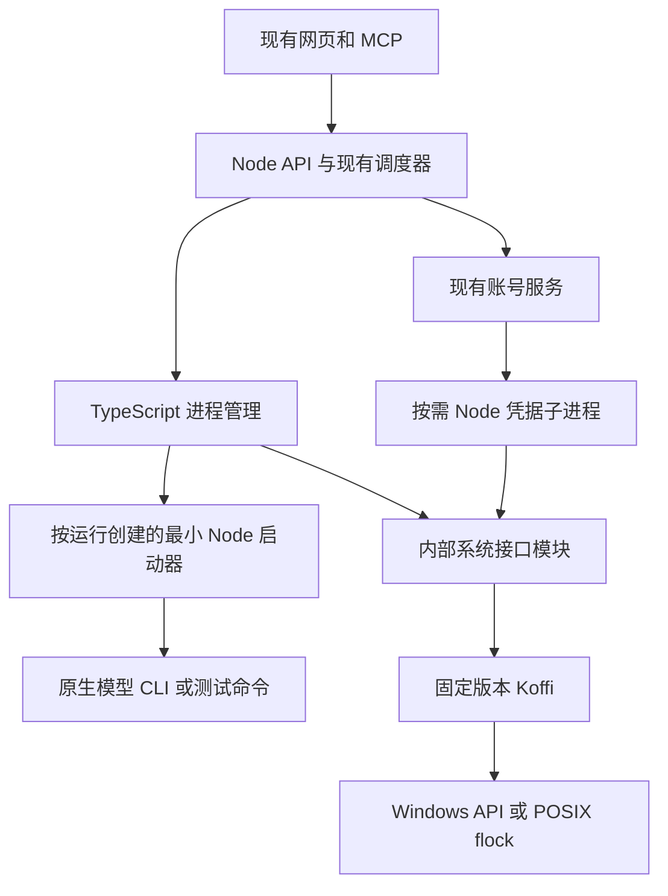

# DevFlow 技术栈精简整改方案与实施计划

日期：2026-09-22  
状态：方案已编写，整改尚未实施。  
检查基线：`8c14ab9f7d336a9cab5415a2348f7bb5f304d6e5`。实施前重新记录 HEAD 和工作区差异，不把此哈希当作届时仍然有效的运行版本。

## 1. 整改结论与最终交付

**移除项目自维护的 Go、C#/.NET 程序，统一以 TypeScript + Node.js 实现 DevFlow。** 本次不是只删除一套重复 Host，也不是继续给既有多语言架构补功能。

最终交付必须同时满足：

1. 任务调度、模型调用、进程管理、账号管理均由项目内的 TypeScript/JavaScript 代码实现。
2. 源码构建、CI、发布和用户安装不再额外安装或分发 Go、.NET SDK/runtime，也不要求本机 C/C++ 编译器；现有系统脚本可使用操作系统已提供的环境。
3. 不再构建、安装、配置或调用 `DevFlow.WinHost.exe`、`devflow-host[.exe]`、`devflow-auth-host.exe`。
4. 保留已有任务、会话、模型配置、工作区、停止/恢复、交互登录和凭据保护能力。不能靠删除这些功能达成“精简”。
5. 系统接口集中在少量内部模块，调用方不再选择 Host 可执行文件；不建设新的宿主平台、驱动注册中心或可配置后端体系。
6. 删除完成后，旧版本只作为整包回退材料存在，不作为新版本的运行时 fallback。

**唯一新增直接依赖：`koffi@3.3.1`。** 它让 Node.js 调用操作系统已有的原生接口，取代项目自行维护、编译、分发 Go/.NET 辅助程序。这仍然是原生依赖，并非“零原生依赖”或“只用 Node 标准库”。其必要范围、成本、验证和失败处理见第 3、4、8 节。现有 `better-sqlite3` 保留，不借机替换数据库。

当前授权范围是编写计划。本文件中的安装依赖、改代码、运行真实账号测试、切换正在使用的服务，均尚未执行。

## 2. 当前事实与整改范围

### 2.1 已检查的实际依赖链

| 位置 | 当前行为 | 整改结果 |
|---|---|---|
| `package.json` | 主服务用 Node 启动；另有 `build:host`、`build:auth-host` | 统一 `pnpm build`，移除两条额外构建入口 |
| `host/DevFlow.WinHost/` | C# 进程、Job Object、控制器互斥 | 对等验证后删除源码和构建项目 |
| `host/devflow-host/` | Go 跨平台进程宿主、锁、状态命令、交互控制台 | Node 进程模块接管后删除 |
| `host/devflow-auth-host/` | Go 凭据、DPAPI、域锁、加密备份和安全元数据 | 隔离的 Node 凭据子进程接管后删除 |
| `packages/process/src/manager.ts` | 默认要求外部 Host，JSONL 控制；另有直接 `spawn` 分支 | 单一 Node 实现，保留现有上层接口语义 |
| `packages/process/src/controller-lock.ts` | 为取得控制器锁单独启动 Host | 在控制器进程内持有系统锁 |
| `packages/process/src/agy-account-job-runner.ts` | 多处自行启动 Host、解析结果、查询 `job-status` | 复用统一进程管理能力 |
| `packages/process/src/agy-account-processes.ts` | 调 Host `doctor/job-status`；用系统 PowerShell 查询外部进程 | 状态查询改内部调用；保留现有只读进程发现逻辑 |
| `packages/agy-accounts/src/auth-host.ts` | 外部认证 EXE 的长驻 RPC 客户端 | 固定 Node 凭据子进程客户端，不接受 EXE 配置 |
| `packages/runtime/src/recovery.ts` | 恢复时再次运行 Host 查询旧 Job | 直接根据登记的 OS 身份核验 |
| `apps/api/src/{main,accounts-main,server,account-service-bootstrap}.ts` | full/accounts 两种入口均传递 Host 路径 | 传统一进程模块和凭据端口 |
| `packages/service/src/launcher.ts` | 启动前要求 Host 文件存在 | 验证 Node 构建产物及必要原生库可用性 |
| `packages/installer/src/`、`scripts/setup.mjs` | 安装、迁移配置、校验两个辅助 EXE | 安装一个 Node 应用及其固定依赖 |
| `.github/workflows/{ci,release}.yml` | 安装 Go、运行 Go 测试、编译 Host | 用 Node 测试覆盖原有系统行为 |
| `components.lock.json`、`toolchains.lock.json` | 将 Go/Host 作为工具链或必装组件 | 删除对应项，按 Node 运行产物记录版本 |

当前 `devflow.yaml` 的进程宿主仍指向 C# 构建产物，认证宿主指向 Go 构建产物。这是配置事实，不等于已检查当前所有运行进程的实际加载版本。

当前发布工作流实际列出 Windows x64、Linux x64、macOS x64、macOS arm64 四个构建目标；工具链锁却列了六个目标。本次不顺带新增平台支持。Windows arm64、Linux arm64不能因库支持或文件生成成功就被标为 DevFlow 已验证。

### 2.2 保留边界

- React、Fastify、SQLite、pnpm、现有模型适配器及其原生 CLI 保留。
- 不改模型路由、角色阶段、质量失败计数、账号选择算法或额度识别规则。
- 不改变同一任务/模型的会话绑定，不重建已有任务，不复制或移动现有工作树。
- 不改变调度并发数、超时、已配置模型、工具、账号功能开关和服务地址。
- 不替换官方登录/刷新，不增加私有 OAuth、模型代理或第三方切号程序。
- PowerShell/sh/cmd 等现有系统安装入口可以保留；不再自建 `.csproj` 或下载 .NET SDK。PowerShell 本身使用系统运行环境，不应被误当成仍在维护一个 DevFlow .NET 应用。
- 不将这次工程验证变成 DevFlow 产品里的新审批阶段或测试证据审核系统。

### 2.3 保护已有工作

计划检查时 `packages/skills/` 下十个 Skill/引用文件已有未提交修改。实施者重新执行 `git status --short`，保存自己的变更白名单，不覆盖、回滚或整目录替换这些文件。

不得清理 `.devflow/`、现有 `dist/`、工作树、会话、凭据目录、全局工具链或共享 pnpm store 来“证明已经不用 Go/.NET”。运行版本与回退产物允许在 Git 管理范围之外留存，源码及新发布包必须清除其运行依赖。

## 3. 确定的目标结构



### 3.1 普通能力直接用 Node

- 子进程启动、输入输出、背压、超时、IPC：`node:child_process` 和标准流。
- 文件、原子替换、哈希、随机引用：`node:fs`、`node:crypto`。
- POSIX 进程组：`spawn({detached:true})` 和 `process.kill(-pgid, signal)`。
- 数据和任务状态：沿用现有 Store，不新增进程数据库、消息队列或网络服务。

### 3.2 原生接口的最小必要范围

| 能力 | 为什么不只换成普通 Node 调用 | 本次接口范围 |
|---|---|---|
| Windows 整组进程退出与崩溃清理 | `child.kill()` 不提供当前 Job Object 的组归属、退出计数和句柄关闭清理语义 | Create/Assign/Query/Terminate/Close Job、必要进程身份查询 |
| Windows 可输入的独立登录控制台 | 现有功能需要官方 CLI 的真实交互窗口，管道或隐藏窗口不能替代 | `CreateProcessW`、挂起/恢复、退出码查询；不实现终端模拟器 |
| 控制器与账号域互斥 | 普通文件存在标记不等价于随进程退出释放的 OS 锁 | Windows 命名 Mutex；POSIX `flock` |
| Windows 原有账号备份 | 现有备份采用当前用户 DPAPI 和 Credential Manager，直接改成普通文件会改变安全和兼容性 | CredRead/Write/Delete/Free、DPAPI、SID/ACL及必要路径检查 |

这些是保留现有功能所需要的 OS 能力，不是继续维护 Go/.NET 的理由。Koffi 只在这些模块内部使用，不暴露“调用任意 DLL/函数”的 API、配置项或 MCP 工具。

### 3.3 新依赖及可行性边界

- 固定 `koffi@3.3.1`，不得使用 `latest`、范围版本或临时换成另一个 FFI 库。
- 官方文档说明支持 Node 16+、提供常用平台预编译包，官方变更记录列出 2026-09-19 发布的 3.3.1；这只能证明有该技术路线，不能代替本项目安装、运行和发布验证。[Koffi 支持范围](https://koffi.dev/)、[版本记录](https://koffi.dev/changelog)
- 在 W01 用现有 Node 22.23.2、pnpm 11.7.0 验证包及目标平台原生子包，记录锁文件 integrity、许可证和安装结果。不安装 Go、.NET、Visual Studio 来补救依赖安装失败。
- 本次编写计划时，直接请求 npm registry 报 `Authentication failed, see inner exception`，没有取得该包的 registry 元数据，也没有安装或运行 Koffi。未进一步确定连接失败原因。W01 必须补齐；不能把请求失败写成“包不存在”，也不能忽略下载验证。
- 使用正常 TLS 校验；网络失败应修复下载链路，不关闭证书校验。预编译包缺失或实际 API 不满足合同时，停止迁移并报告具体失败；不得切回旧 Host 后把本次整改标为完成。
- `pnpm-workspace.yaml` 保留 `better-sqlite3@13.0.3: false` 等已有规则。仅按实际包 manifest 决定该固定版本是否需要安装脚本；不全局开放/禁用原生构建脚本，不允许 fallback 本地编译。
- Koffi 自身含原生二进制，本项目不维护它的 C/C++ 源码，也不新增 native addon 工程。其升级只走正常依赖升级，不引入独立发布流程。

## 4. 必须落实的行为合同

### C01：进程接口及身份

保留 `ProcessSpec`、`ManagedProcess` 的上层用途，以及 `start/stop/close/get`、输入输出、暂停输出、完成回调和停止原因。将构造函数里的 `hostExecutable/requireHost` 删除，依赖由进程模块内部固定选择。

新增的内部类型放在 `packages/process/src/process-protocol.ts`，仅服务此次替换：

```ts
type ProcessIdentity = {
  backend: 'node-v1';
  id: string;                 // 原 spec.id，保留已有业务关联
  attempt_id: string;         // 每次实际启动新生成，防止迟到消息覆盖下一次运行
  pid?: number;               // 模型/命令实际根进程，不填启动器 PID
  launcher_pid?: number;
  creation_time?: string;     // 可验证的 OS 创建身份，不能拿 Date.now 冒充
  job_name?: string;          // Windows，每个实际启动唯一
  pgid?: number;              // POSIX
};
type StopObservation = {
  state: 'running' | 'confirmed_exited' | 'unknown' | 'not_owned';
  active_processes?: number;
  reason?: string;
};
```

- 身份字段追加进已有 `process_record` JSON，不新增数据表或另一个持久化进程注册中心。
- 保留原来 workflow/run/permit/account/auth_epoch 关联。实际 PID、启动器 PID、Job 身份不得混用。
- Job 名使用固定前缀和启动随机标识，不能单靠可复用 PID或业务 ID；尝试创建已存在 Job 必须失败。
- 先登记启动意图，拿到系统身份后补记；完整登记失败就停止本次自建进程，不放行模型执行。
- 重复 `start` 对仍在运行的同一 `spec.id` 保持幂等；新的实际启动使用新的 attempt。迟到的退出、取消、输出事件必须校验 attempt。
- `code: 0` 必须保留。根进程退出、控制管道关闭、停止请求已发送，均不能单独代表整组退出。

### C02：Windows 普通进程启动与停止

普通管道进程不重写 Win32 管道、异步 I/O 或通用进程服务器，采用以下固定顺序：

1. 控制器创建本次 Job，设置 `KILL_ON_JOB_CLOSE`，禁止 breakaway，并持有不向子进程继承的 Job 句柄。
2. 用 `process.execPath` 启动固定的 `runner-entry.js`，采用 Node 原生 IPC 和独立 stdin/stdout/stderr。这个小程序只加载 Node 内建模块，不读取业务项目、不运行用户代码。
3. 启动器只发送带版本及 attempt 的 `ready`，保持 IPC 引用，等待一次性 `start`；没有放行、IPC 断开或启动等待超时就退出。
4. 控制器取得并核验启动器进程身份，将其加入 Job，查询成员关系，持久化本次身份。任何一步失败都清理本次启动器，不发送 `start`。
5. 只有此后，才发送经过验证的 executable/args/cwd/env。启动器用 `spawn` 启动实际工具，其子孙进程按 Windows Job 规则继承归属。启动器回传工具 PID；控制器核验成员关系及创建身份后发布 `started`。
6. 目标命令的标准流直接继承启动器的三条数据管道；IPC 单独承载控制消息。日志字节不转成 JSON、base64 或逐行 RPC，避免增加输出开销。

这是“工具代码执行前已经进入受管 Job”的保证。启动器本身没有使用 `CREATE_SUSPENDED`，因此**不得继续谎报 `suspended_spawn: true`**。所有旧能力消费者统一改查 `containment_before_tool_start`、`kill_on_owner_close`、`job_query`。交互启动采用挂起创建，是另一条明确定义的路径。

实现限制：

- 启动器固定安装路径；`execArgv: []`；清理继承的 `NODE_OPTIONS`、`NODE_PATH`、调试/预加载参数；不继承父进程任意秘密环境变量。目标工具仍按现有环境白名单和明确 ProcessSpec 执行。
- runner 和凭据 worker 在开发、测试、发布时都使用 `pnpm build` 生成的固定 JS 入口。安装根按本模块位置区分源码/`dist` 两种已知布局并验证 DevFlow package 标识，不根据业务 cwd 搜索脚本；不把 tsx loader 或调试参数带入子进程。源码模式缺少或未更新这些构建产物时明确要求先 build，不能加载旧安装里的同名脚本。
- 目标参数用数组，`shell:false`。Windows `.cmd/.bat` 按现有命令解析规则进入明确的系统 shell，不把所有命令统一改为 shell 字符串。
- Stop/timeout/natural-exit 并发只执行一次清理，保留 `manual` 优先于自动原因的现有行为。
- 终止使用 `TerminateJobObject`；在确认 active process count 为 0 后才标记 `confirmed_exited`、释放租约、推进账号切换。查询失败一律 `unknown`。
- 控制器意外退出由最后一个 Job 句柄关闭触发系统清理；正常退出等待实际清理结果。启动器自身异常也必须触发控制器终止 Job。
- 不为停止成功推断模型执行成功。丢失工具真实 exit code 时，结果未知，不默认 0。
- 输出的 `pause/resume` 和背压保留，退出要等待可读管道关闭/排空；不能只等 `exit` 丢失尾部输出。

此顺序须在 W01/W02 用“加入 Job 前不得出现工具副作用”的反例测试证明。Windows Job 支持成员继承、整组终止和最后句柄关闭清理，但具体 Node 启动组合仍须实测。[Windows Job Objects](https://learn.microsoft.com/en-us/windows/win32/procthread/job-objects)

### C03：交互登录与 POSIX

**Windows 交互登录**复用现有 `OwnedLoginJobPort`/`InteractiveLoginJobPort`，在 `native/windows.ts` 内直接调用 `CreateProcessW`：

- 明确传原生 EXE 绝对路径、工作目录、UTF-16 命令行及排序后的环境块。
- `CREATE_SUSPENDED | CREATE_NEW_CONSOLE | CREATE_UNICODE_ENVIRONMENT`；不继承控制器管道句柄；创建后先 Assign Job，再 ResumeThread。
- 保留官方 CLI 自己的控制台输入、浏览器跳转和结束信号；禁止用隐藏管道“模拟成功登录”。
- 不在 API 事件循环上无限等待；用有限、按需的退出查询等待，等待期间可处理取消。结束后释放线程、进程、Job 句柄。
- 登录窗口只有用户启动登录功能时创建。能力检测和普通测试不会打开真实登录窗口或执行登录。

**POSIX 管道执行**仍使用同一个最小 Node 启动器，但实际工具以独立进程组启动；控制器传 stop 或 IPC 断开时，启动器向组发送 SIGTERM，到既有 `stop_seconds` 后仍未退出才 SIGKILL。

- `ESRCH` 可作为该组已不存在的事实；`EPERM`、查询失败为 unknown，不能伪装成功。
- 程序自行 `setsid` 脱离进程组不在该组保证内；不能宣传为 Windows Job 同等级的约束。
- 重启后若登记的组仍存在、身份不能确认，禁止仅凭 PGID 杀进程或释放资源；保留 unknown。旧记录缺少 PGID 时在迁移前由旧服务排空，不猜测补齐。
- macOS/Linux AGY 凭据切换仍维持当前 unsupported 状态；本次不新增跨平台凭据产品功能。

### C04：系统锁与原生接口纪律

- full/accounts 入口对同一状态目录仍互斥，不能加 mode 后缀把它拆成两把互不相干的锁。
- Windows Mutex 获取和释放均在持有它的同一个 Node 线程执行，采用同步、非阻塞等待；不能分别放进 Koffi 异步线程池。`WAIT_ABANDONED` 代表取得锁但需要恢复检查，不是状态已经安全。[ReleaseMutex](https://learn.microsoft.com/en-us/windows/win32/api/synchapi/nf-synchapi-releasemutex)、[Koffi 调用说明](https://koffi.dev/load)
- POSIX 用打开的固定文件描述符持有 `flock(LOCK_EX|LOCK_NB)`；释放锁后关闭 fd。不在持锁时删除再建锁文件，防止不同 inode 形成两把锁。
- 状态目录先规范化；Windows 处理大小写和真实路径，POSIX 不错误地把大小写不同的目录合并。
- 迁移期还必须占有旧 C# 和 Go 对应的控制器锁名：`Local\DevFlowController.<旧hash>`、`Global\<旧hash>`，以及 Go 无前缀 fallback 对应的本地名；POSIX 占有旧 temp flock 文件。锁按固定顺序去重获取，失败释放已取得项。只保留少量锁名兼容代码，不保留可执行 Host。
- 账号域锁继续使用现有固定 SID + 凭据目标的哈希算法、`Global\DevFlowAuth_...` 名称及 ACL，不能把数据库目录或 realm 配置变成绕过同用户凭据互斥的手段。
- DLL/系统库路径和函数声明固定在模块内。BigInt 句柄、指针宽度、结构体布局、调用约定、返回错误码逐项验证，不把 Go/C# 结构体字段大小直接照抄到 JS。
- GetLastError 与对应失败调用在同一线程立即读取；所有成功取得的句柄/内存都有匹配 CloseHandle/CredFree/LocalFree 和失败路径清理。

### C05：账号凭据保护及兼容

保留业务侧 `AuthHostPort` 的方法语义，文件名中的 host 概念不再代表外部 EXE。客户端固定 fork 安装目录内的 `credential-worker.js`，不接受可执行文件路径配置，也不开放端口。

- 每个服务最多一个凭据子进程，按需启动，持锁期间保留；释放锁并结束本次使用后退出。账号功能关闭时不启动。
- 该子进程先等待主进程完成 Windows Job 归属再受理请求。主进程持有其独立清理 Job；父进程退出或 IPC 失效时停止受理并退出。
- 原始凭据仅在这个隔离子进程和 Windows 系统 API 之间使用，不传给 API/调度主进程、不进入 IPC、日志、HTTP/MCP、SQLite 或命令行。旧“Node 无原始 token”要求改为“Node 业务主进程无原始 token”；隔离凭据进程现在也使用 Node。这是明确的实现边界变化，不能在验收中隐去。
- IPC 只传既有 action、引用和安全元数据，客户端同时做响应字段白名单校验；stderr 丢弃原文，只发布结构化错误码。不发送完整原生异常、Credential 对象或解密内容。
- 请求编号和进程 generation 绑定；断管、超时、写入结果未知时清空该 generation 的 pending RPC 并拒绝后续写入，不能重启后盲目重放同一凭据修改。
- 保留备份成功后才能清空活动凭据、写后读回、恢复失败不声称成功、停止未确认不换号、外部 AGY 占用不强杀等既有规则。
- 仍使用固定 Credential Manager target、当前用户 DPAPI、仅当前用户和 SYSTEM 的 ACL；不改加密范围，不换密钥，不导出旧用户明文。

**旧金库格式必须原样兼容：**

1. 保留 `%LOCALAPPDATA%/DevFlow/agy-accounts/<realm>/`、引用正则、`sec_/bak_` 引用、`.bin` 和 `revision` 文件规则。
2. 保留 DPAPI 的无附加 entropy、当前用户范围、禁止 UI 参数。
3. 解密后 JSON 保留原 Go 输出的 `Version/RealmID/AccountID/Revision/Credential` 大小写；`Credential` 下保留 `Exists/Flags/Username/Comment/Persist/TargetAlias/Attributes/Secret`。字节字段使用 Go JSON 对 `[]byte` 的 base64 表示，不能改成 Node Buffer JSON 对象。
4. 保留 envelope version 2。revision 为安全整数且单调，分配必须先持域锁、读取磁盘值、原子写入；损坏或溢出停止修改，不从零开始覆盖。
5. 保留临时文件、限制 ACL、写入、fsync、同目录原子改名、最终 ACL 核验；遇 reparse point/非法引用停止访问。
6. 只在隔离测试中建立旧实现生成的合成包进行双向兼容验证；禁止为了测试读取真实用户凭据。旧 Go reader 对新合成包的读取验证在删除旧源码前完成。
7. secret Buffer 用后尽可能清零，不承诺 V8 字符串和所有内存副本可可靠擦除；禁止为调试开启凭据子进程 inspector 或导出堆快照。

保留系统保护与直接改为普通 Node 文件不是等价方案。[CryptProtectData](https://learn.microsoft.com/en-us/windows/win32/api/dpapi/nf-dpapi-cryptprotectdata)

### C06：状态查询、恢复和能力报告

- `doctor/job-status` 变为内部函数，不为每次查询启动一个 Node CLI，也不再执行旧二进制。
- `AgyAccountProcessHost`、`AgyAccountJobRunner`、runtime recovery 和安装器共享同一事实来源，不能各自解析不同版本输出。
- Windows 查询区分“指定 Job 不存在”“存在且 active=0”“存在且仍有成员”“拒绝访问/失败”；后二者不能返回 stopped。
- 旧 `Local\DevFlow.<id>` 可作为迁移中的只读查询对象。禁止重新创建同名空 Job来伪装旧进程已退出。
- 恢复沿用原 Run 的 frozen invocation、session binding、工作区及人工暂停优先规则。仅替换进程身份查询，不创建新模型会话修饰恢复结果。
- 启动能力检查只创建自有测试 Job/锁及合成数据，不登录、不检查真实秘密、不自动切号。
- 正常启动不反复做平台自测；安装/doctor 运行一次必要检查，运行中直接处理真实 API 错误。业务阶段不增加验证门禁。

### C07：配置与安装合同

- 输出配置升级为 `schema_version: 2`，不再包含 `host` 或 `agy_accounts.auth_host_executable`。保留其它字段和值，包括注释和字段顺序。
- 配置读取层接受旧版本并产生明确迁移诊断，但不把旧路径当作 Node 模块执行，也不忽略未知自定义 Host 的含义。
- 内置 C# 路径、内置 Go 路径及安装清单可确认的旧版本路径自动列入可迁移范围。路径识别要验证解析位置和原安装清单；仅 basename 相同不能视为系统自有。
- 自定义 Host 路径进入 `LEGACY_CUSTOM_HOST_UNSUPPORTED`，迁移 dry-run 列出该非敏感字段；执行者不能静默抹去自定义行为。需核对其用途后，按本计划的 Node 功能合同替换，不为它保留第二种运行后端。
- 旧持久化账号 settings 中的 `auth_host_executable` 只做读兼容/剥离；不要重置账号设置或为了删字段重建所有记录。备份保留原数据以供回退。
- Node、pnpm 的版本沿用 22.23.2、11.7.0；不在此次整改升级框架或批量更新其他依赖。
- 发布包携带 Node、编译后的 JS、生产依赖及当前平台 Koffi/SQLite 原生二进制。发布验证从解压目录运行，不能借用开发目录 node_modules 或旧 EXE。
- 维护锁、启动锁、服务实例/模式校验、SQLite 一致性备份和版本指针切换继续复用既有安装流程。

### C08：复杂度与资源开销

整改效果不能只用“全是 TS”衡量。必须记录下列结果：

| 项目 | 验收要求 |
|---|---|
| 自维护语言/构建工程 | 删除 Go 模块、C# 项目；应用逻辑只有 TS/JS |
| SDK/runtime | 开发和安装不要求 Go/.NET/C++ 工具链 |
| 新直接依赖 | 仅 Koffi 一个；不得再引入 FFI 框架、队列或守护进程管理器 |
| 后端选择 | 无 Host 路径、无 go/dotnet/node 三选一开关、无静默 fallback |
| 空闲进程 | 控制器锁不再产生额外进程；无任务且账号关闭时没有 runner 或凭据子进程 |
| 活动进程 | 每个实际管道运行最多一个 Node 启动器；每服务最多一个凭据子进程；不为状态查询启动子进程 |
| 生命周期 | 本次测试结束后，自建启动器/凭据子进程、Job 句柄、临时资源均回到基线 |
| 资源比较 | 同机、同 Node、同工作负载下测现有配置和新实现；单独统计 DevFlow 管理开销，不能用大型模型 CLI 掩盖回归 |

Node 启动器可能比 Go Host 占用更多内存。W01 先测单任务及 3 个并发合成任务各 5 轮，W07 再测完整服务：空闲内存不得高于原方案 10%；3 并发时 DevFlow 管理进程的总 private bytes 增量不得超过 64 MiB；启动 p95 增量不得超过 300 ms；无忙轮询。这里的阈值是本计划的验收预算，不是已测结果，也不得通过减少原并发数达标。

若资源预算不通过，先在确定的 Node 路线内减少加载、数据复制、子进程寿命和重复查询，未通过前不切换 live。不能为了消除语言数量而交付明显更卡的版本，也不能自动恢复 Go/.NET 为永久方案。

## 5. 文件级实施工作包

执行顺序固定：`W00 → W01 → W02 → W03 → W04 → W05 → W06 → W07 → W08`。所有工作包默认 `not_started`；只有本文件的方案核查为 `done`。各包结束在本节更新实现提交、实际测试和未通过项，不另建第二份实施计划。

### W00：保存基线与建立隔离验证环境

状态：`done`；预计 0.5 人日；已完成。

- 输入：当前 HEAD、工作区状态、本文件、原安装清单和已生效配置。
- 在隔离工作树实施；沿用共享 pnpm store，不拷贝整份 node_modules。分支遵循仓库默认前缀。
- 保存只包含版本、文件白名单、设置字段名、运行状态和测量指标的脱敏基线到 `docs/test/evidence/node-runtime-20260922/`。
- 实际配置/数据库备份放私有备份目录，不放证据目录；此阶段不改 live 配置、不停 live 进程、不获取真实账号域锁。
- 记录原本用到的模型、会话、任务、并发和功能开关；之后以差异检查保证保留。
- 建立仅使用合成命令/假凭据的测试入口。不得把给临时 storage 换路径当作已隔离 Windows 真实凭据域。
- 出口：白名单清晰、隔离环境可启动、已保存旧运行版本的合法回退来源。

### W01：验证唯一新增依赖及核心最小实现

状态：`not_started`；预计 1.5 人日；未通过不得删除旧实现或切换生产路径。

**修改：** `package.json`、`pnpm-lock.yaml`、必要时 `pnpm-workspace.yaml`、`THIRD_PARTY_NOTICES`。

**新增：**

- `packages/process/src/native/windows.ts`：固定 Win32 声明、Job/Mutex/进程身份/交互创建及错误清理，不含业务调度。
- `packages/process/src/native/posix.ts`：固定平台 flock 接口；不建设多后端注册体系。
- `packages/process/src/runner-entry.ts`：只依赖 Node 内建模块的最小启动器。
- `tests/integration/node-native-primitives.test.ts`：在真实 OS 上只操作自建进程、测试 Mutex、合成数据。

**工作：** 冻结并验证 Koffi 预编译安装；证明普通启动 ready/assign/start 顺序、Job 终止/父崩溃清理、合成 DPAPI 往返、Mutex 同线程释放；进行 C08 的初步资源比较。原生库 API 加载成功不等于这些测试通过。

**出口：** AC01–AC04、AC09 初步通过，支持平台依赖可加载，无 SDK fallback；记录资源预算。失败保持旧服务和数据不变，修复此包后再推进。

### W02：统一普通进程和控制器锁

状态：`not_started`；预计 2 人日；依赖 W01。

**新增：** `packages/process/src/process-protocol.ts`。

**修改：**

- `packages/process/src/manager.ts`：按 C01/C02 使用 Node 启动器，去除 Host JSONL/路径分支，统一取消、超时、输出和退出确认。
- `packages/process/src/controller-lock.ts`：改为控制器内直接持锁；实现旧锁名兼容与路径规范化。
- `apps/api/src/main.ts`、`apps/api/src/accounts-main.ts`：使用新锁签名，确保拿锁先于数据库恢复或写状态。
- `packages/runtime/src/runtime.ts`：新构造函数、追加进程身份、保留既有回调和数据关联。

**测试：** 将 `tests/integration/process.test.ts` 改为无需 C# 路径和个人 PowerShell 路径的真实系统测试；新增 `tests/unit/process-protocol.test.ts`、`tests/integration/node-process-lifecycle.test.ts`、`tests/integration/node-controller-lock.test.ts`。

**出口：** AC02–AC10；所有启动失败路径均无模型副作用或残留自建进程。实现期间旧 Host 仅用于隔离对比，不进入新后端 fallback。

### W03：统一交互登录、辅助命令和恢复查询

状态：`not_started`；预计 1.5 人日；依赖 W02。

**修改：**

- `packages/process/src/agy-account-job-runner.ts`：删除重复 spawn/RPC/轮询实现，管道任务统一走 ProcessManager，交互任务使用 C03；保留所有现有辅助 lease、cwd、取消和退出接口。
- `packages/process/src/agy-account-processes.ts`：能力和 Job 查询走内部函数，外部进程发现保留 SID/创建时间/路径校验；禁止扩大停止范围。
- `packages/runtime/src/recovery.ts`：不再 exec Host，读 C01 登记身份，严格区分 stopped/unknown；兼容旧 Job 的只读核验。
- `packages/runtime/src/runtime.ts`、`apps/api/src/account-service-bootstrap.ts`、`apps/api/src/server.ts`：统一共享进程管理对象；accounts 独立入口也有同样的停止确认能力。

**测试：** 修改 `tests/unit/agy-account-processes.test.ts`、`tests/integration/recovery.test.ts`；新增 `tests/integration/node-interactive-process.test.ts`。使用合成交互程序验证控制台输入/取消，真实官方登录留给 AC22。

**出口：** AC11–AC13、AC21；grep/rg 检查所有 `suspended_spawn` 消费者均改成真实的新合同，不能在假对象中直接填 true 让测试通过。

### W04：将凭据辅助程序改为隔离 Node 子进程

状态：`not_started`；预计 2.5 人日；依赖 W03。

**新增：**

- `packages/agy-accounts/src/credential-worker.ts`：固定 action 调度、域锁所有权、请求生命周期及 IPC 字段限制。
- `packages/agy-accounts/src/credential-windows.ts`：Credential Manager、DPAPI、SID/ACL、路径检查；共享既有原生模块约定，不提供任意 DLL 接口。
- `packages/agy-accounts/src/credential-store.ts`：旧 envelope、原子金库、revision；只在凭据子进程载入。
- `packages/agy-accounts/src/auth-metadata.ts`：迁移旧 Go 安全元数据提取逻辑，只输出既有允许字段。

**修改：** `packages/agy-accounts/src/auth-host.ts`、`ports.ts`（仅能力语义必要变更）、`index.ts`、`service.ts` 和 `apps/api/src/account-service-bootstrap.ts`。

**测试：** 更新 `tests/unit/agy-auth-host-pipes.test.ts`；新增 `tests/unit/credential-store-compat.test.ts`、`tests/unit/auth-metadata.test.ts`、`tests/integration/node-credential-worker.test.ts`、`tests/integration/node-credential-os.test.ts`。

OS 凭据测试固定使用本次唯一合成 Credential target、测试 Mutex 和临时金库；测试注入仅在测试入口可用，生产环境变量/配置不能更改固定认证目标或绕过域锁。旧实现的合成往返通过内部测试注入完成，不启动它访问用户的真实 target。

**出口：** AC14–AC20；保留原始凭据隔离、加密兼容和并发安全。隔离测试不代表真实账号切换已通过。

### W05：迁移配置、安装、发布和健康检查

状态：`not_started`；预计 2 人日；依赖 W04。

**新增：** `packages/contracts/src/config-migration.ts`、`scripts/migrate-node-runtime.ts`、`tests/integration/node-runtime-migration.test.ts`。

**修改：**

- `packages/contracts/src/config.ts`、`agy-account.ts`：C07 的 v1 读取兼容、v2 输出和字段剥离；`examples/schemas/config.schema.json` 由现有导出脚本生成。
- `packages/agy-accounts/src/switch-operation.ts`：移除旧 helper 默认路径，不改变账号事务行为。
- `packages/cli/src/main.ts`：init 输出 v2；doctor 直接调用内部能力检查。增加仅供安装器使用的 `doctor --verify-installation`：读取待迁移配置副本、以 readonly 模式打开指定数据库、验证新包模块和合成 OS 对象后退出；不启动调度、调用 engine.recover、注册 token 或执行账号 reconcile。
- `packages/service/src/launcher.ts`：检查 Node 入口/依赖；不检查 Host EXE；保留服务实例、模式和维护互斥。
- `apps/api/src/{main,accounts-main,server,account-service-bootstrap}.ts`：去掉 Host 路径传递和文件存在即 ready 的判断。
- `packages/installer/src/{main,upgrade,components,manifest}.ts`：移除 Host 必装组件、版本查询、路径迁移；接入 Node 运行验证和配置事务。
- `scripts/setup.mjs`、`scripts/install-windows.ps1`、`scripts/bootstrap/{install.ps1,install.sh}`：源码只需 pnpm 安装和构建；保留现有升级保护。
- `scripts/release/build-release.mjs`：移除 `dist/host` 输入；包括 runner、凭据 worker、原生库；发布包自测不能外借依赖。
- `.github/workflows/{ci,release}.yml`、`components.lock.json`、`toolchains.lock.json`、`compatibility.json`：移除 Go/Host 要求；精确记录 Node、依赖、实际平台和能力。保留锁文件位置，修改其含义前同步检查消费者。

**测试：** 修改账号 config/release/install、`devflow-v2-installer`、standalone 用例；新增 `tests/integration/node-release-smoke.test.ts`。

**出口：** AC23–AC27；配置改动可预览、可回退，全新解压包无需 Go/.NET 能独立运行。

### W06：删除旧实现并更新有效说明

状态：`not_started`；预计 1 人日；依赖 W05 及旧格式双向验证已完成。

**删除受版本管理的文件：**

- `host/DevFlow.WinHost/Program.cs`、`host/DevFlow.WinHost/DevFlow.WinHost.csproj`、`host/NuGet.Config`。
- `host/devflow-host/` 全部源码/Go 模块/测试。
- `host/devflow-auth-host/` 全部源码/Go 模块/测试；对应行为测试已迁移到 W01–W04。
- `scripts/build-host.mjs`、`scripts/build-auth-host.mjs`；`package.json` 中对应 scripts。

删除范围是上述 Git 源文件，不递归删除包含正在运行或备份二进制的整个 `host/` 磁盘目录。

**同步修改：**

- `README.md`、`docs/guide/安装与恢复.md`、`使用指南.md`、`使用与恢复指南.md`、`pnpm开发与构建指南.md`。
- `scripts/bench/devflow-v2.mjs`：去掉先 Go 后 C# 的 fallback，基准只运行新的 Node 入口。
- `tests/integration/{check-repair,environments,precommit-runtime}.test.ts`、`tests/e2e/fixture-server.ts` 及 `tests/live/` 中相关入口：移除 C# 路径和 Host 构建前提。
- `.gitignore` 对旧 bin/obj 的规则只有确认不会导致本机旧产物变为待提交文件后才处理；保留忽略规则不是运行依赖。
- 旧有效计划中明确要求 Go/.NET Host 的段落标注“技术实现由本计划取代”，业务验收合同继续有效。历史 archive 和旧证据原样保留，不改写成新实现证据。
- Skill 文件只有在它们仍规定旧构建流程时才做最小修订，并合并已存在的用户修改，不重写整个 Skill。

不删除 `packages/presentation/src/native-progress.ts` 对业务仓库 `go test`/`dotnet test` 的识别；DevFlow 不用这些语言，不代表用户项目不能用。

**出口：** AC28；新运行路径和发布包无旧 Host，Git 历史/历史说明/业务命令识别不计为残留依赖。

### W07：完整回归及资源验收

状态：`not_started`；预计 2 人日；依赖 W06。

- 按第 8 节运行范围测试、类型检查、构建和当前发布平台测试。涉及系统接口的用例不得全部 mock 后声称真实通过。
- 已有模型配置、会话恢复、独立账号页和工作流恢复的测试继续运行，证明底层替换没有改变业务含义。
- 对照 C08 测空闲、单任务、3 并发的管理开销；热身一次后各测五轮，记录 p50/p95、进程数、private bytes/对应平台 RSS、句柄/FD和清理结果，不借用不同负载的历史数字。
- 用合成父/子/孙进程和突然退出覆盖停止链路，不启动付费模型作压力测试。
- 真实官方登录、A→B→A、原会话继续执行，在独立且已获授权的实际账号验收窗口进行。当前编写计划不启动这些测试；也不能将已有登录状态当作全链路已经通过。
- 在本计划和证据记录中分别写 `isolated_passed`、`platform_passed`、`live_passed/not_run`，不合并为一句“全部通过”。

**出口：** 除明确仍未验证的平台/外部能力外，全部验收通过；凡当前在用能力未通过，禁止进入该安装的切换。

### W08：切换在用安装与结束过渡

状态：`not_started`；预计 0.5 人日，另加真实操作窗口；依赖 W07。

- 严格执行第 7 节；先切隔离安装，再切已经排空的在用安装。
- 当前服务不热替换 EXE，不强杀用户任务，不偷偷暂停正在执行的流程。
- 完成两次正常启动/停止、一次正常系统重启后的启动恢复检查；恢复原配置开关，不自动开启原来关闭的账号自动切换。
- 最终记录源码版本、实际运行版本、构建包哈希、配置迁移摘要、未验证能力和回退材料位置。只记录脱敏摘要，不记录凭据或 token。
- 新版本稳定后移除源码中的临时对比入口和旧协议测试适配，不删除用户的旧发布包/私有备份来制造“清理完成”。

总估算约 13.5 人日，包含实现和隔离回归，不包含外部账号可用性、发布平台机器获取和等待在用任务结束的时间；不是承诺完成日期。

## 6. 失败处理必须具体可执行

| 场景 | 处理 | 禁止行为 |
|---|---|---|
| 原生包缺失、架构不匹配 | `NATIVE_DEPENDENCY_UNAVAILABLE`，停止受影响启动/迁移，输出平台与依赖版本 | 自动安装 SDK或偷偷调用旧 Host |
| Job 创建/归属失败 | 清理本次已创建对象，工具不执行，返回具体阶段 | 退回普通无约束 spawn |
| IPC ready/start 超时 | 关闭本次启动器，核验无工具副作用，保持启动失败 | 把启动器 PID当工具已启动 |
| 已发送 stop，无法查询整组退出 | `PROCESS_STOP_UNCONFIRMED`，保留记录/租约，账号切换不继续 | 以根 PID不存在或 kill 返回值当成功 |
| 子进程失联，工具退出码丢失 | 状态 unknown，清理整组后仍不报告工具成功 | 缺省 code=0 |
| 域锁忙/非本线程释放 | 拒绝凭据操作，保留账号状态，清理自己的句柄 | 按 realm 或 temp 路径换把锁继续 |
| 金库损坏、ACL/DPAPI失败、revision溢出 | 拒绝修改活动凭据，保留原文件 | 重建空库、清空账户、改为明文 |
| 凭据写入响应丢失 | 冻结后续修改，先核验/恢复实际状态 | 重试写入后当作同一次成功 |
| 外部 AGY 进程占用 | 显示现有占用状态；只处理自己的进程 | 杀掉用户原生客户端或全部 node/agy |
| 配置在 dry-run 后被修改 | `CONFIG_CHANGED`，中止 apply，重新生成差异 | 用旧快照覆盖用户新设置 |
| 旧自定义 Host | `LEGACY_CUSTOM_HOST_UNSUPPORTED`，明确缺失合同 | 忽略路径或保留永久第二后端 |
| 新包启动/自检失败 | 保持或恢复旧指针和原配置，核验回退服务 | 清库/重建任务来完成启动 |

## 7. 数据迁移、切换与回退

### 7.1 准备可审阅迁移

W05 提供如下入口（这里是待实现的命令合同，目前不能执行）：

```powershell
pnpm exec tsx scripts/migrate-node-runtime.ts --config <配置绝对路径> --dry-run
pnpm exec tsx scripts/migrate-node-runtime.ts --config <配置绝对路径> --apply --expected-sha256 <dry-run返回的哈希>
```

dry-run 必须只读，返回：输入配置 hash、识别出的旧管理路径、准备移除的字段名、保留设置是否一致、旧进程是否全部确认退出、当前版本和目标版本、可应用/拒绝原因。完整配置值和备份内容不打印到日志。

apply 的执行顺序：

1. 新包已在独立安装根构建和验收完成；确认其 Node 入口及原生依赖来自新包。用新包的 `doctor --verify-installation` 对待迁移配置副本和数据库执行只读核验后退出；这不是提前启动一套并行服务。
2. 等现有任务自然结束或由用户明确停止。记录 workflow/run/session/workspace 绑定和未完成事务状态，不自动改为 completed。
3. 使用旧服务已有停止流程完成排空；核验它管理的所有 Job/进程组及凭据事务已经退出。不能仅看 API 端口关闭。
4. 获取维护/启动锁和 C04 控制器兼容锁。若旧控制器仍持锁，退出迁移。
5. 使用 SQLite backup API 保存一致性快照；私有目录保存原 YAML 原始字节、版本指针和必要安装状态。私有备份限制 ACL，不复制凭据明文或改动活动 Credential Manager。
6. 重新校验输入配置 hash，生成 v2 文件；仅移除技术栈字段和修改 schema_version，其余设置逐项比较相等。
7. 写临时配置、同步、原子替换，再更新版本指针。整个窗口持维护锁，不能让 launcher 读到半套状态；失败恢复原始文件和旧指针。
8. 提交切换后正常启动新服务，检查实例 ID、服务模式、Node runtime backend、依赖版本、状态目录一致。实际服务启动就可能产生恢复或业务写入，必须从这一时刻起按“已经接收新业务”的回退规则处理，不能认为健康检查尚未结束就可以覆盖数据库。无需新增产品运行模式或临时调度协议。
9. 不改任务绑定、不迁移金库格式、不重置账号 epoch/revision；旧已确认退出的历史记录保留。缺少身份的未结束记录保持 unknown，拒绝放行新执行。

版本切换只发生在已排空的服务上；迁移不包含“接管仍活着的旧 Host 子进程”。

### 7.2 回退规则

- 新包只读安装核验、配置写入或指针切换阶段失败，且尚未启动正常新服务：确认自建验证进程退出，原子恢复原配置和旧指针，再启动旧版本。
- 此阶段未接收新业务写入，只有确有数据损坏且核验不存在新写入时才恢复 SQLite 快照；不能默认每次失败都还原数据库。新服务只要正常启动过，即进入下一条，哪怕首次健康检查还没成功。
- 新版本已接受任务或账号操作之后：先排空新任务并核验进程，保留当前数据库、会话和金库；利用 W04 证明的旧格式兼容回退代码。不能用安装前数据库覆盖后来产生的任务进度。
- 若某次凭据写入结果未知，先完成既有账号事务对账，再释放域锁或换版本；版本回退不是账号凭据回退操作。
- 原版本读取新产生的最小附加进程字段应忽略未知字段；这一兼容性必须在合成数据上验证。若不能读回，不得在 live 迁移前隐去问题。
- 回退成功要核验旧服务实际加载版本、实例/模式、任务和会话数量/绑定以及设置值；HTTP 200不是唯一标准。
- 回退旧版允许它使用原有 Host；新版本本身不得包含自动回退逻辑或双实现开关。

## 8. 验收用例与验证命令

### 8.1 验收矩阵

| ID | 必须证明的行为 | 验证方式 | 负责工作包 |
|---|---|---|---|
| AC01 | 固定版本预编译依赖在目标 Node 上加载，无 Go/.NET/C++ 编译 | 干净解压/安装环境实测，记录安装日志和包身份 | W01/W05 |
| AC02 | Job 归属前工具没有任何文件/进程副作用 | 注入延迟/Assign失败/IPC超时，观察合成 marker | W01/W02 |
| AC03 | 父/子/孙进程停止后整组清空 | 真实合成进程树，OS 查询成员和退出 | W02 |
| AC04 | 控制器突然退出仍清理 Windows Job | 从外部测试驱动终止测试控制器，核验全部自建成员 | W01/W02 |
| AC05 | 启动器被终止或 IPC失联，根命令失败不报0 | 故障注入，核验 unknown 和残留清理 | W02 |
| AC06 | 大量中文/二进制 stdin/stdout/stderr、尾部数据和背压不丢 | 比较字节长度/hash，暂停再恢复读取 | W02 |
| AC07 | 空格/中文路径、引号、环境大小写、批处理启动正确 | 合成命令；环境中注入假秘密并验证未继承 | W02 |
| AC08 | stop/timeout/exit竞态、同id新attempt不互相污染 | 确定性延迟及真实短进程，不只模拟事件 | W02 |
| AC09 | 同状态目录 full/accounts/旧控制器无法并占 | 多个隔离控制器及旧锁名占用；进程退出后重取锁 | W01/W02 |
| AC10 | POSIX TERM等待后KILL、断管清理与unknown正确 | Linux/macOS 真实组测试，拒绝访问用隔离注入补充 | W02 |
| AC11 | Windows交互控制台可输入、退出/取消覆盖进程树 | 合成交互程序；官方登录另走AC22 | W03 |
| AC12 | Job不存在与拒绝查询严格区分 | 真实空/活动Job及拒绝访问故障测试 | W03 |
| AC13 | 历史进程记录和原会话恢复不被重置 | 旧记录夹具、当前session恢复回归、身份缺失反例 | W03 |
| AC14 | Mutex按用户认证域互斥，崩溃/弃置锁需对账 | 仅测试域，两个独立Node进程真实锁竞争 | W04 |
| AC15 | 旧Go合成金库包Node可读，新Node包旧reader可读 | 同测试用户DPAPI，检查完整记录/base64/revision | W04 |
| AC16 | DPAPI、ACL、reparse拦截、损坏/溢出不覆盖数据 | 合成数据、临时ACL目录、故障注入 | W04 |
| AC17 | 备份失败不清空、写后读回错误不成功、超时不重放 | 假凭据端口加独立测试Credential target验证 | W04 |
| AC18 | 原文不出凭据worker，迟到响应不能污染新worker | 合成秘密扫描IPC/日志/数据库；generation测试 | W04 |
| AC19 | 自动切号、候选串行、外部进程占用等原规则保留 | 原有账号 safety/switch/service 回归 | W04/W07 |
| AC20 | 账号关闭不启worker，释放锁后worker退出，无句柄增长 | 启动/关闭多轮观察实际PID和句柄 | W04/W07 |
| AC21 | 模型配置、frozen invocation、人工暂停和会话续接不变 | 原有model/session/recovery测试 | W03/W07 |
| AC22 | 实际官方登录、A→B→A和原任务/会话继续运行 | 独立真实账号窗口，明确报告已运行/未运行 | W07/W08 |
| AC23 | v1→v2仅删除Host字段，保留注释和业务设置 | 自定义配置/默认路径/并发修改夹具 | W05 |
| AC24 | 旧服务活动、未知Host、身份缺失时拒绝迁移 | 占用锁/活动Job/自定义路径反例 | W05 |
| AC25 | 指针/配置写入中断可回退，已有新业务数据不被覆盖 | 分步骤故障注入及迁移后写入场景 | W05 |
| AC26 | 发布包独立启动full/accounts，不找开发机旧二进制 | 解压到新路径，收窄PATH，实际构造模型合成进程 | W05/W07 |
| AC27 | doctor/health报告真实模块能力，不把文件存在当ready | 故意移走目标原生模块；检查错误和禁止执行结果 | W05 |
| AC28 | 新源码构建和运行链无Go/.NET Host依赖 | 源码/脚本/发布包扫描加无SDK环境运行 | W06 |
| AC29 | C08资源预算和结束后清理通过 | 旧/新同机5轮，独立管理开销与PID/句柄证据 | W07 |
| AC30 | 在用切换后任务/会话/金库/设置保留，重启可恢复 | 切换前后脱敏比较、正常重启后的只读核验 | W08 |

所有矩阵行初始为 `not_run`。标记 passed 必须附对应源码版本、命令/操作、退出码/观测结果和脱敏证据路径；不要求产品运行时读取这些报告。

### 8.2 命令执行规则

以下路径中的新文件在对应工作包完成后才存在。按包逐一执行相关目标；不要在每改一处时重跑全仓测试。

```powershell
pnpm install --frozen-lockfile
pnpm run build
pnpm exec vitest run tests/integration/node-native-primitives.test.ts --maxWorkers=1
pnpm exec vitest run tests/integration/process.test.ts --maxWorkers=1
pnpm exec vitest run tests/integration/node-process-lifecycle.test.ts --maxWorkers=1
pnpm exec vitest run tests/integration/node-controller-lock.test.ts --maxWorkers=1
pnpm exec vitest run tests/integration/node-interactive-process.test.ts --maxWorkers=1
pnpm exec vitest run tests/unit/process-protocol.test.ts --maxWorkers=1
pnpm exec vitest run tests/unit/credential-store-compat.test.ts --maxWorkers=1
pnpm exec vitest run tests/unit/auth-metadata.test.ts --maxWorkers=1
pnpm exec vitest run tests/integration/node-credential-worker.test.ts --maxWorkers=1
pnpm exec vitest run tests/integration/node-credential-os.test.ts --maxWorkers=1
pnpm exec vitest run tests/integration/node-runtime-migration.test.ts --maxWorkers=1
pnpm exec vitest run tests/integration/node-release-smoke.test.ts --maxWorkers=1
```

依赖首次引入由 W01 在隔离工作树执行 `pnpm add --save-exact koffi@3.3.1`，审阅产生的精确锁文件；后续才使用 frozen install。不能先执行 frozen install 再假装新依赖已经存在。

W07 保留以下现有回归（每次一项）：

```powershell
pnpm exec vitest run tests/integration/agy-account-safety.test.ts --maxWorkers=1
pnpm exec vitest run tests/integration/agy-account-switch.test.ts --maxWorkers=1
pnpm exec vitest run tests/integration/agy-account-model-recovery.test.ts --maxWorkers=1
pnpm exec vitest run tests/integration/agy-accounts-standalone.test.ts --maxWorkers=1
pnpm exec vitest run tests/integration/model-runtime-boundaries.test.ts --maxWorkers=1
pnpm exec vitest run tests/integration/cli-session-lifecycle.test.ts --maxWorkers=1
pnpm exec vitest run tests/integration/cli-session-identity.test.ts --maxWorkers=1
pnpm exec vitest run tests/integration/recovery.test.ts --maxWorkers=1
pnpm exec vitest run tests/integration/devflow-v2-installer.test.ts --maxWorkers=1
pnpm exec playwright test tests/e2e/agy-accounts-browser.spec.ts --workers=1
pnpm run typecheck
pnpm run build
```

系统测试只在所需 OS 上执行，其他 OS 的 skip 要写明；不能把 Windows专用测试跳过后的绿灯计为跨平台通过。W07 最后在隔离环境跑一次仓库要求的完整测试；若有无关既有失败，列出精确测试和原因，不能扩散修改范围或冒充全仓通过。

删除检查使用 `rg`，先限定当前实现/脚本/有效说明，再人工区分结果：

```powershell
rg -n 'DevFlow\.WinHost|devflow-auth-host|devflow-host|build:host|build:auth-host|setup-go|DOTNET_ROOT' apps packages scripts .github package.json components.lock.json toolchains.lock.json compatibility.json README.md
git ls-files '*.go' '*.cs' '*.csproj' 'go.mod' 'go.sum'
```

允许命中只有：明确的旧配置读取/拒绝诊断、迁移测试、历史说明引用。它们不得包含加载或执行旧 Host 的路径。对实际旧源文件的删除必须按 W06 白名单进行；不按搜索结果全局删除。

## 9. 计划与实施记录

| 项目 | 当前状态 | 实际结果/证据 |
|---|---|---|
| 当前源码、配置和依赖链检查 | done | 已核对 Node入口、三个辅助工程、消费者、配置、安装与CI |
| 官方接口与依赖文档核对 | done | Node 22.23.2、Koffi、Microsoft公开文档；未等同于项目运行验证 |
| npm包/原生API实际验证 | not_run | registry请求失败；未安装依赖，未运行原生PoC |
| W00 | done | 已创建隔离工作树 `devflow-node-migration`；保存基线到 `docs/test/evidence/node-runtime-20260922/`；创建合成测试配置和命令；记录文件白名单和配置字段审计 |
| W01 | not_started | — |
| W02 | not_started | — |
| W03 | not_started | — |
| W04 | not_started | — |
| W05 | not_started | — |
| W06 | not_started | — |
| W07 | not_started | — |
| W08 | not_started | — |

每次推进追加：工作包、实现提交、变更白名单、已运行用例、失败/未运行项、下一步。方案发生必要修改时在本文件记录原因和受影响合同，不另起一套与本计划并行的“优化方案”。

完成判定：W00–W08 已按范围完成，当前使用的平台/功能验收通过，新发布包不依赖 Go/.NET Host，且在用安装完成可回退迁移。仅完成 TypeScript 改写、删除源文件、静态扫描或合成测试，均不能单独称为整改完成。

## 10. 技术依据

以下仅用于验证系统能力边界；具体 Node 实现、包装层和迁移流程是本计划的设计，必须经第 8 节实测。

- [Node 22.23.2 child_process](https://nodejs.org/download/release/v22.23.2/docs/api/child_process.html)：spawn/fork、独立IPC、标准流、退出和平台差异。
- [Koffi支持范围](https://koffi.dev/)与[版本记录](https://koffi.dev/changelog)：所选依赖、版本及预编译分发依据。
- [Koffi调用说明](https://koffi.dev/load)：同步/异步调用和线程池边界。
- [AssignProcessToJobObject](https://learn.microsoft.com/en-us/windows/win32/api/jobapi2/nf-jobapi2-assignprocesstojobobject)：Job归属与限制。
- [Windows Job Objects](https://learn.microsoft.com/en-us/windows/win32/procthread/job-objects)：成员继承、整组终止和句柄关闭清理。
- [CreateProcessW](https://learn.microsoft.com/en-us/windows/win32/api/processthreadsapi/nf-processthreadsapi-createprocessw)：交互进程创建、命令行和环境。
- [Process creation flags](https://learn.microsoft.com/en-us/windows/win32/procthread/process-creation-flags)：挂起创建和新控制台标志。
- [ReleaseMutex](https://learn.microsoft.com/en-us/windows/win32/api/synchapi/nf-synchapi-releasemutex)：锁的线程所有权。
- [CredReadW](https://learn.microsoft.com/en-us/windows/win32/api/wincred/nf-wincred-credreadw)、[CryptProtectData](https://learn.microsoft.com/en-us/windows/win32/api/dpapi/nf-dpapi-cryptprotectdata)：系统凭据和当前用户保护范围。
