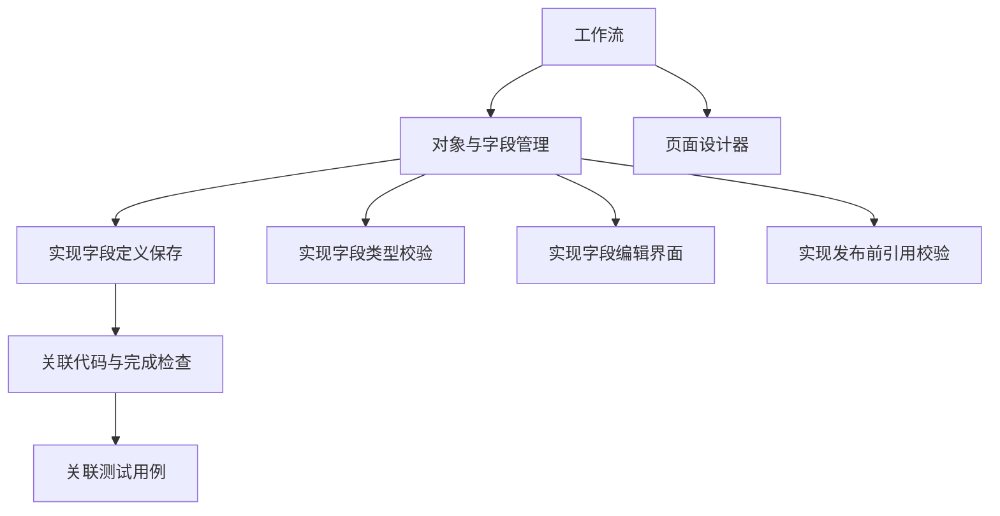
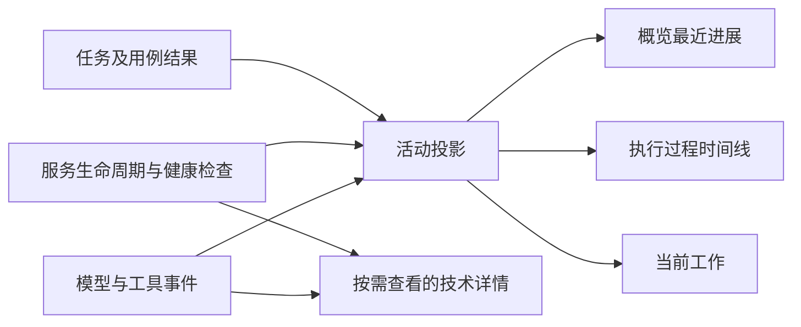

# DevFlow 用户界面与细项进度整改方案

实施记录：界面与进度整改已落实，验证见[整改验证](../test/用户界面与细项进度整改验证.md)。CRM 细项清单已提交第 2 版，等待用户批准后继续执行。下文保留批准时的方案。

状态：整改方案，尚未实施。2026-09-14。

## 1. 已核实的问题

当前页面使用内部运行数据作为产品文案，任务进度与测试进度也未建立一致的用户口径。上轮只修正了部分时间线展示，没有解决概览、服务日志、任务粒度及统计问题。

| 页面内容 | 实际含义 | 整改决定 |
|---|---|---|
| 计划 r1 | 计划修订号 1 | 从主界面删除；计划页的版本历史显示“第 1 版” |
| 环境 v0 | 环境修订计数初始为 0；环境准备成功后推进版本 | 从主界面删除；测试环境显示准备中、可访问或启动失败及实际地址 |
| wf-… | 工作流内部唯一标识，页面进行了截短 | 从主界面删除；排障详情保留可复制完整编号 |
| 执行轮次 2 | 两次执行运行记录，本次是失败运行及恢复运行 | 从交付概况删除；执行历史显示开始、恢复、结束和失败原因 |
| ServiceOutput | 项目服务进程的 stdout/stderr 数据块 | 后端生成有语义的服务活动；普通日志归入相应服务的日志详情 |
| 工作流记录 | 对未适配事件类型的通用回退文案 | 取消通用占位卡片；有实际内容才进入过程，未知事件留在技术详情 |

目前批准计划中有 12 个工作包，例如“对象、字段、值集与可靠发布”“页面设计器、组件与动态业务运行”。每个工作包的 implementation 是一段文本，没有独立子任务编号、状态和完成证据，不能把 12 称为全部细项任务数。

当前计划有 8 个测试执行组，列出 81 个预期测试用例：单元测试 36、集成测试 17、E2E 16、OpenTabs 浏览器验收 12。这是计划清单数量，不表示用例已经实现或运行通过。

当前概览直接使用 events 最后五项的 type，因此显示 ServiceOutput。通过测试项使用历史 passed 报告条数，存在重复计数和引用过期结果的风险。实时输出为每个服务数据块建立卡片，包括空白内容，造成大量无信息卡片。

## 2. 页面信息与布局

任务页面只回答：正在做什么、完成多少、哪里有问题、是否需要我操作。

顶部保留项目、需求名称、简短状态及必要操作。删除固定说明“每一步进展，都对应明确的版本与证据”。

保留七阶段导航与当前活动，删除“执行模型正在实施，完成后自动进入测试”和“阶段位置不代表任务已验证”等固定说明。需要人工操作或异常时才显示动作，例如“后端启动失败：端口被占用”“请验收客户筛选与导出功能”。

概览改为：

1. **进度概况**：已完成任务 X / Y、已通过测试 X / Y；下方显示进行中、失败、待复测等有实际数量的状态。
2. **当前工作**：关联模块、具体细项任务、当前操作；不能仅用最后一条工具事件推断任务正在做什么。
3. **最近进展**：最近五条有业务意义的活动，复用执行过程的同一份数据。
4. **需求摘要**：简短目标和范围；原始长提示词、目录、提交编号和环境约束放到可展开的需求详情。

Tab 文案确定为：概览、开发计划、任务进度、测试结果、执行过程、代码变更、代码复核、测试环境。

示意（X/Y 是布局占位，不是实际进度）：

```text
CRM 低代码开发                       开发中       停止

计划 → 批准 → [开发] → 测试 → 验收 → 复核 → 提交

已完成任务 X / Y                     已通过测试 X / 81

当前工作  对象管理 / 字段校验
          正在补充字段类型校验

最近进展
14:12  字段类型校验已完成
14:10  后端服务已启动
14:09  正在准备测试数据
```

## 3. 细项任务结构与完成口径

确定使用两层结构：模块/工作包 → 可独立执行并验收的细项任务。主计数只统计叶子任务，模块由子项汇总，不叠加到总数。



以上细项仅示意拆分粒度，不作为对当前 CRM 计划的新增要求。

每个细项包含稳定编号、父模块、标题、输入、实现步骤、允许修改路径、依赖、完成条件、关联测试、开始/结束时间及实现证据。内部步骤仍可使用有序文本；不能把每一行文字、每次工具调用、每个修改文件都当成一个完成任务。

实施进度和测试结果分开保存：

- 实施状态：未开始、进行中、待核验、已完成、需修改、受阻。
- 模型提交实现结果后，先进入待核验；由服务检查与该细项相关的改动、产物和预先定义的完成检查，满足条件才进入已完成。
- “已完成任务”表示完成该细项的实现条件；整体测试通过、人工验收及复核另行记录。不能简单把现有 claimed 状态改名为已完成。
- 关联测试失败明确指向该细项需要修改时，转入需修改并从完成数中扣除；测试基础设施故障不自动判定所有实现任务失败。
- 修改依赖或相关源码后，针对受影响细项使完成证明失效并重新核验；无法可靠缩小影响范围时保守失效，不维持虚假的完成数。
- 模块状态由全部子任务计算。展开模块后可查看细项、当前负责人、修改文件和结果。默认定位当前正在执行的细项。

具体工作开始与结束由执行器显式上报 task_id；文件访问和服务输出附加到该任务上下文。服务端拒绝未知、越界和依赖不满足的任务操作。

## 4. 测试统计口径

主卡片按用例统计“已通过测试 X / Y”，本项目当前已有计划分母为 81，不能用 8 个执行组或历史报告条数代替。

用例身份为执行组标识与用例标识的组合。每个计划用例选择当前有效代码、环境和计划下的最新完整结果，重跑不累计。最新失败覆盖先前通过；跳过、未发现、未运行、结果过期均不计通过。历史结果保留在详情。

结果保存到用例级，不仅保存报告汇总数量。单元、集成、E2E、OpenTabs 都提供明确用例清单与结果映射。额外发现的回归用例单独列出，不悄悄改变批准清单的分母；新增计划用例通过计划版本管理纳入。

测试结果页按类型显示通过/总数及失败、未运行、待复测数量。点击失败项直达失败摘要、关联任务及详细日志。主卡片、列表与提交门禁使用相同的当前结果选择函数，避免页面显示通过而门禁仍引用另一份结果。

## 5. 统一执行过程

由普通程序完成事件归并和投影，不为每条日志调用 GPT 或增加持续模型监控。



活动字段包含标题、摘要、状态、来源、所属任务、开始/更新时间、附件、日志详情引用。同一操作从“进行中”更新为“完成/失败”，而不是 stdout 的每一块都新增卡片。

| 内部来源 | 默认展示 |
|---|---|
| 模型对外回复 | Markdown 正文 |
| 文件读取/搜索 | 读取相关源码、文件名；连续同类操作归组 |
| 文件修改 | 正在修改/已修改的任务或文件，可展开差异 |
| FixtureOutput | 正在准备测试数据；确认执行成功后显示完成 |
| 服务启动/健康检查 | 正在启动后端、后端已就绪、后端启动失败 |
| ServiceOutput | 归入对应服务日志；不进入概览刷屏 |
| CheckOutput | 归入正在运行的测试活动 |
| 用例结果 | 已通过 12 / 20、失败用例及原因等真实结果 |
| 未识别事件 | 技术详情保留；默认时间线不显示空卡片或内部类型名 |

服务就绪以健康和环境身份检查结果为准，不从“Starting backend”或普通 stderr 推断成功或失败。空白、仅换行、控制字符和无变化心跳不生成可见进展。长时间无更新显示距上次有效活动的时间；后台服务仍在运行不等于模型仍在执行同一工具。

最近进展按有意义活动的更新时间排序；服务心跳不会挤掉任务完成、测试失败和需要人工处理的消息。恢复运行保留之前活动并插入一次“任务已恢复”，旧运行不会显示正在进行。记录携带明确工作流、运行、任务身份，不混合并行项目。

## 6. 需要同步修改的实现

| 范围 | 修改 |
|---|---|
| contracts / store | 模块、叶子任务、实现证明、用例结果和活动记录；增量迁移与旧记录兼容 |
| core | 统一进度计算、当前结果选择、状态失效、提交前完整性校验 |
| MCP | 细项开始、进展、完成结果接口；必须绑定 task_id，原工具保持受控兼容 |
| runtime / environment | 显式服务与测试生命周期，关联任务，记录用例结果与流式日志 |
| API | 提供同源的进度汇总与活动投影；HTTP 初次加载和 WebSocket 更新一致 |
| web | 按本文重排主页面、任务树、测试列表、过程时间线和技术详情 |
| devflow-plan Skill | 生成模块与细项结构，禁止以跨领域大模块替代全部执行项 |
| devflow-execute Skill | 显式领取并汇报细项，逐项提交实现证明，不批量虚报完成 |
| devflow-review Skill | 按细项及用例追溯遗漏，复核实现证明与实际代码一致性 |
| 文档生成 | 计划、进度、测试文档与页面共用结构化数据，避免两份清单 |

## 7. 当前 CRM 工作流的兼容处理

本轮是方案输出，不修改当前运行状态或其批准计划。

实施时先完成展示和事件投影，旧的 12 项准确显示为“12 个工作包”，细项计数暂显示“尚未建立细项清单”，不伪造任务总数。

随后在当前执行安全停止并核实受管进程退出后，从现有批准计划、需求文档、已修改代码和已生成测试清单提取细项。保留 12 个工作包作为分组，保留工作流、工作区、代码、执行历史及原审批记录，禁止重建任务丢失现场。

输出新旧映射及仅含拆分变化的计划差异，逐项说明旧工作包对应哪些细项，不增加业务范围或借机重构。通过原计划审批入口批准新版本后才切换执行清单。该审批用于确认新的任务与验收清单，界面与日志修复本身无需新增审批。

旧工作包的完成声明不自动传播给所有细项；新细项通过代码与完成条件重新核对，测试结果仅在身份、代码、环境和清单均有效时关联。细项总数在拆分完成后确定，不为追求几十或几百这个数量机械拆分。

## 8. 实施顺序与验收

1. 删除内部标识与固定解释文案，统一主页面信息结构。
2. 实现统一活动投影及服务、测试生命周期事件，消除 ServiceOutput 刷屏和空卡片。
3. 增加结构化细项与用例级结果，统一前后端统计和门禁。
4. 更新规划、执行、复核 Skill 及 MCP，补齐事件关联。
5. 完成旧流程兼容、当前 CRM 清单映射与可审阅差异。
6. 完成自动化回归、真实浏览器和真实 agy 信息传递验证；计划批准后恢复当前工作流。

验收必须覆盖：

- 主页面不出现 r1、v0、wf 编号、执行轮次、ServiceOutput、通用“工作流记录”及用户指出的固定解释语。
- 空白与大量服务日志不产生空卡片，不淹没有价值的任务、测试进展；stderr 普通输出不被误判失败。
- 一个模块含多项细任务时，总数只统计叶子；完成、返工、恢复、重复上报均正确。
- 81 项计划用例重跑不增大分母或重复计数；失败、过期和跳过不计通过。
- 大量任务可按模块展开、筛选状态并定位当前项；不要求用户翻阅几百条完整日志寻找进展。
- HTTP/推送、刷新/重连、多个工作流并行、历史回放使用相同口径。
- 实际调用 agy 验证细项开始、文件修改、任务完成证明、测试结果和失败反馈能够抵达界面，不能仅靠模拟事件证明链路可用。
- 当前工作区已有修改和历史审批保留，迁移前后没有虚增完成数，也没有绕过人工验收或复核提交。
