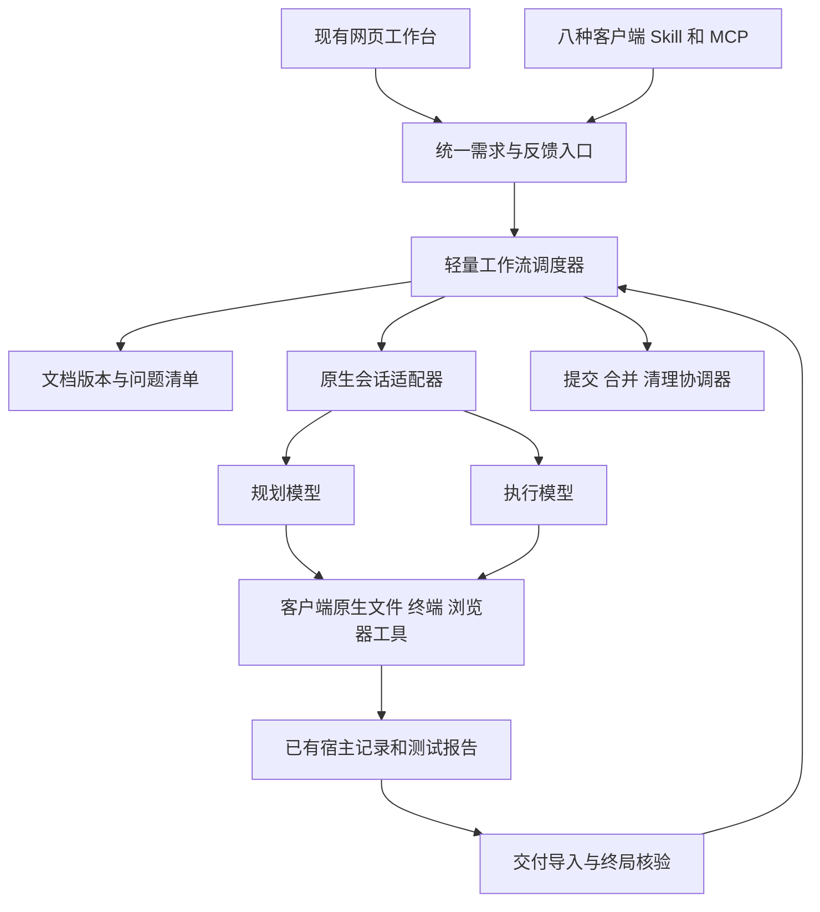
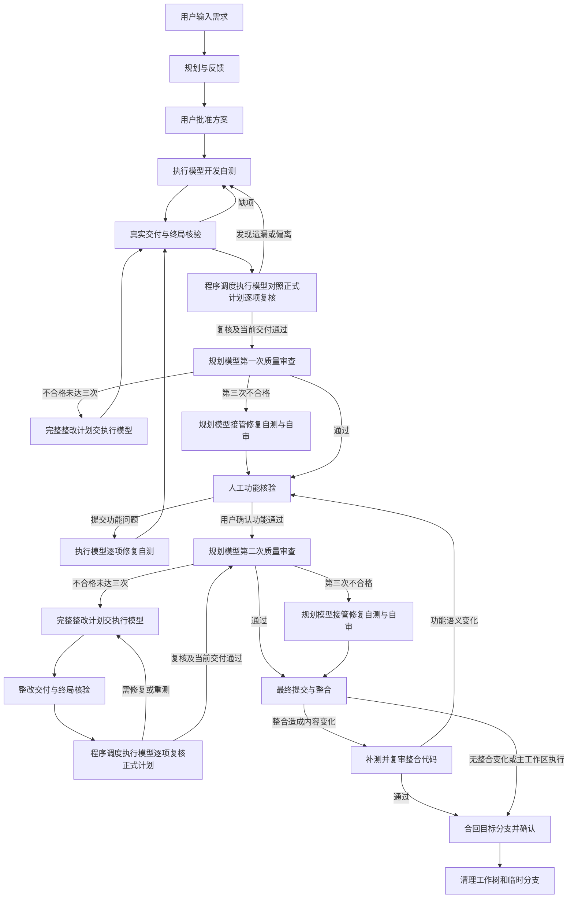
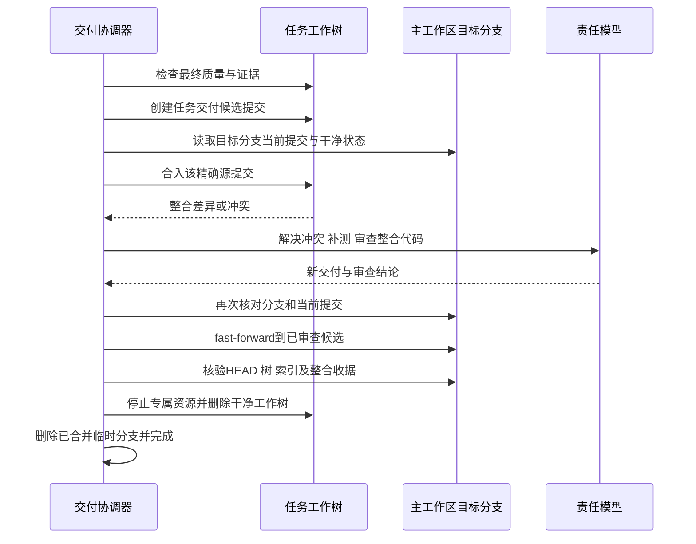

# DevFlow 跨平台通用工作流平台实施方案

> 历史方案。终局核验、独立执行自查和测试证据审计条款已被 [DevFlow轻量调度边界审计与整改计划-20260918](DevFlow轻量调度边界审计与整改计划-20260918.md) 替代。两阶段代码质量审查与三次接管仍然有效。

<!-- devflow-plan-authority:v1 -->
## 指定计划为执行依据，禁止执行模型另建计划

执行模型收到本方案、用户指定的整改文档及其正式引用后，必须完整读取并直接实施，禁止额外创建、重写或更新 implementation_plan.md、客户端计划工件、局部实施/整改计划或其他替代方案来执行。不能先自行重新规划，再把原要求压缩成局部修改范围。规划模型正式产出的整改版本必须关联原计划，保留其未关闭要求；执行模型不得再次改写。

已有进度记录只能标为“执行进度（非计划）”，逐项关联原任务/验收编号、实现位置、真实测试证据和未完成项，不变更技术路线、接口、依赖顺序或验收标准。原文缺失、冲突或不可实施时提交具体事实交规划模型正式修订；暂停受阻部分，可继续明确不受影响的原计划任务。相同工具/模型承担多个角色时也不得自行越过规划修订权限。

交接、恢复、测试和复核都回到原计划及正式修订的完整要求，核对真实成功与适用的拒绝/异常流程；自写清单全部完成、探针不再命中或部分测试通过，不构成全任务完成。本节是提示与交接规则，运行时校验是否已实现须另以代码和测试证明。

版本：2.0　修订日期：2026-09-16　目标版本：DevFlow 1.0.0

状态：供执行模型直接实施的确定设计。本次只交付文档，不创建、恢复或批准 DevFlow 开发工作流。自有源码发布仓库为 https://github.com/zephyrw/dev-flow。

本版完整替代 1.4 及其旧 DevFlow 执行合同。历史文本只作追溯，不再叠加生效。基础是[原生执行与终局核验改造方案](DevFlow原生执行与终局核验改造方案.md)，并纳入[第二轮复核与剩余整改](DevFlow原生执行改造第二轮复核与剩余整改-20260916.md)的回归要求。遇到旧方案与本版矛盾，以本版为准。

## 1. 产品定位与本次硬约束

DevFlow 是用户的本地开发中枢：接收需求、展示中间文档与修改记录、调度模型会话、接收反馈、核对交付、衔接审查及 Git 交付。规划和执行工具使用自身的原生能力完成实际工作。平台必须轻量运行。

本次范围同时包含：

1. Windows、macOS、Linux；六种 OS/CPU 平台安装产物。
2. Codex CLI、Antigravity CLI（agy）、Grok Build、Claude Code、Kimi Code、Qoder CLI、OpenCode、Cursor Agent CLI 八种工具的入口、执行和 Skill 安装。
3. 任一工具独立完成全部阶段；也支持规划、执行分别使用不同工具和各自配置的模型，任务创建后可以明确切换。
4. 网页输入需求后自动创建任务、启动规划模型；保留在规划客户端通过 Skill 发起 DevFlow 的入口。
5. 所有需求和反馈输入框支持 @ 文件及文件夹引用；规划反馈、执行调整、功能问题、临时提问共用同一输入组件。
6. 开发自测后先做代码质量审查，通过后才开放人工功能核验；人工确认后再做一次代码质量审查。
7. 两道质量关卡分别执行三次不合格计数，达到第三次由规划模型接管修复和自审。
8. 独立工作树最终先吸收主工作区目标分支的新提交，解决冲突、验证整合代码，再合回目标分支；确认成功才清理。主工作区执行只提交本任务代码。
9. 在现有手动调整的布局中融合入口。保留导航、栏宽、间距、折叠、主内容与执行侧栏关系，不重做控制台外观。
10. 一行安装平台、选定组件、MCP 和七个 Skill；全部自有源码开源，用户可以自行构建及发布。

明确取消：新任务使用 leaf-v1；逐细项 start/claim；逐文件 FileBroker；每次工具调用启动权限进程；程序代替模型重复运行测试；为进度条追加模型调用；用 AI 持续轮询另一个模型。旧合同只供历史读取和显式迁移。

## 2. 当前基线与实施输入

真实主工作区为 `C:/Code/system-handle`；旧 `D:/Code/system-handle` 不再是有效目录。2026-09-16 调查时主分支 HEAD 为 `e8f5dfc135d24ca4337a0888df13392595e333c8`，工作区存在原生执行改造、pnpm 迁移及界面调整的未提交代码。本次调查过程中还存在并行源码修改，因此该 HEAD 仅是调查标识，不能代表完整实施输入。

执行模型开始时一次性生成交接清单，记录 HEAD、分支、实际源码/配置/测试/锁文件内容摘要、暂存及未暂存状态、未跟踪业务文件和布局基准。以开始时真实工作区为基础，保留已有修改；不 reset、不自动 stash、不把本次输入偷换成旧 HEAD。后续外部变化按范围冲突处理。

依赖沿用当前 `package.json`、`pnpm-lock.yaml`、`pnpm-workspace.yaml`：

- Node.js 基线 22.23.2；pnpm 固定 11.7.0；执行 `pnpm install --frozen-lockfile`。
- TypeScript、Fastify、React/Vite、SQLite/better-sqlite3、Vitest、Playwright 继续沿用当前锁文件版本。
- 不恢复 package-lock.json，不运行 npm install/npm ci，不复制整份 node_modules。
- 跨平台 Host 使用 Go，取代平台绑定的 .NET Host；Go 1.26 系列的构建补丁版本由发布锁定脚本从官方发行索引确定并写入 toolchains.lock.json，后续构建只消费这个精确锁，不在用户安装时解析浮动版本。
- 已存在的 NativeRunRecordReader、DeliveryImporter、EvidenceValidator、WorkspaceFingerprintService、BufferedEventSink 等代码优先修正和复用，不另建平行的同名实现。

原生改造已有代码不等于全部验证完成。第二轮复核的 B01–B08 必须在工作包 N00/N01 中核对：已修复的保留并回归，仍存在的先修，再接入新流程。不得把旧工作树里的“已实现”数量当成有效验收证据。

## 3. 架构与职责



| 组件 | 唯一职责 | 不承担的工作 |
| --- | --- | --- |
| Web/API | 用户输入、文档、问题、阶段、日志展示 | 不执行测试，不在查询时算源码指纹 |
| Engine + Scheduler | 大阶段状态、会话槽位、恢复、反馈游标、交付调度 | 不逐行控制代码编辑和命令调用 |
| NativeAgentAdapter | 启动/续接/停止、模型绑定、原生输出解码、宿主事实 | 不自行改变模型、工具或批准范围 |
| HandoffBuilder | 首次完整工作包、后续版本差异和未解决反馈 | 不反复分页传送整份设计 |
| EvidenceReader/Validator | 读取实际执行事实，核对报告、覆盖与版本 | 不把自报成功当证据，不重新跑一遍测试 |
| QualityCoordinator | 两阶段审查、整改回路、三次接管 | 不为每个提交动作调用额外监工模型 |
| GitDeliveryCoordinator | 精确提交、双向整合、恢复和最终清理 | 不自动推送远端，不代提交无关用户改动 |
| Go Host | 每个会话/服务的进程树生命周期和输出管道 | 不为每个原生工具调用再启动权限子进程 |

继续使用单个本地 Node 服务和 SQLite。Go Host 仅在存在受管会话或服务时工作；无会话时无需常驻轮询进程。日志与文档归档以普通文件保存，数据库保存元数据、版本、偏移和必要状态。无需 Redis、消息中间件、容器集群或额外数据库。

业务范围通过批准方案、明确工作区和原生工具权限表达。实施角色具有该工作区内的原生编辑、终端和浏览器能力；质量审查和临时问答使用只读权限。规划模型接管修复时切换到单独记录的写入角色，而非悄悄给原审查会话加写权限。

## 4. 工具、模型和流程配置

### 4.1 固定八种工具

| ID | 展示名称 | 身份规则 |
| --- | --- | --- |
| codex | Codex CLI | 检查真实 codex CLI，不把桌面界面当后台协议 |
| agy | Antigravity CLI | agy 是正式适配器；沿用其原生会话与项目身份 |
| grok-build | Grok Build | 适配其官方 CLI，不把其他 CLI 内的 Grok 模型算作此工具 |
| claude-code | Claude Code | 复用用户的原生模型/提供商配置 |
| kimi-code | Kimi Code | 按认证版本识别真实发行物和协议，不靠同名可执行文件猜产品 |
| qoder | Qoder CLI | 官方 CLI 及当前认证的启动入口 |
| opencode | OpenCode | 检查真实平台二进制，拒绝 npm 文本占位入口 |
| cursor-agent | Cursor Agent CLI | agent CLI，与 cursor 编辑器命令分开 |

安装发现顺序固定为：用户显式路径 → 受管清单 → 实际用户 PATH → 官方安装目录。检查文件类型、架构、版本、帮助协议与产品指纹。不得照抄本机绝对路径，不能以版本命令能退出就宣称整个适配器通过。

### 4.2 Profile 与角色

Profile 保存 `id / revision / adapterId / executableRef / modelSelection / modelId / providerConfigRef / options / toolsetRef`。modelSelection 只有 `native-config` 和 `explicit` 两种用户配置状态：前者使用工具已有配置；后者传入已认证能力支持的精确模型 ID。不得在核心写死模型名称。

默认模板有两个用户可配置的核心绑定：`plannerProfile`、`executorProfile`。测试默认由执行模型完成；两次质量审查及接管修复使用规划模型。因此默认模板的逻辑 tester 绑定 executor，quality-reviewer 绑定 planner，界面明确展示继承关系。保留通用模板的额外角色扩展能力，但本版交付模板不能通过另一个 reviewer 覆盖用户指定的规划模型。

单工具模式要求所有 AI 角色的 adapterId 相同；允许该工具支持的不同模型 Profile，快速设置默认共用一个 Profile。切回组合模式只修改绑定，不产生第二套调度器。辅助浏览器、Git、测试运行时不计作第二个 AI 工具。

每个 Run 固化工具版本、Profile 修订、请求模型、实际报告模型及证据来源。实际模型缺失显示“工具未报告”；请求与报告明确冲突时阻断，不把推测填为真实模型。

新任务继承已保存默认值，已有任务冻结自己的配置。运行中修改绑定生成修订，在确认当前进程停止后生效；跨工具交接使用设计、代码和反馈文档，不假装共享厂商会话 ID。同一工具能够精确续接时保持会话，否则用明确的新会话及增量工作包继续，并标明原因。

### 4.3 适配器合同

```typescript
interface NativeAgentAdapter {
  probe(input: ProbeRequest): Promise<CapabilityReport>;
  prepare(input: RunContext): Promise<PreparedInvocation>;
  decode(chunk: HostChunk): NormalizedEvent[];
  readExecutionFacts(input: FactCursor): Promise<ExecutionFactPage>;
  resume(input: ResumeContext): Promise<PreparedInvocation>;
  stop(identity: ProcessIdentity): Promise<StopResult>;
}
```

RunContext 必须含 workflow/run/stage/epoch、真实 repo roots、批准范围、Profile 修订、工作包文件、反馈游标和用途。PreparedInvocation 只包含结构化 executable/argv/cwd/env 引用；由 Host 统一启动。业务根必须是真实仓库根，不再把 .devflow 容器目录冒充项目根。

能力标记包括原生编辑、终端、浏览器、精确续接、只读会话、结构化工具事实、异步进程事实、usage、MCP、Skill 加载及更新锁定。字段存在和单元夹具不证明实际能力，须经真实认证。缺少可核验工具事实的版本标记 `EVIDENCE_UNAVAILABLE`，不能伪报支持或改用平台重跑测试。

## 5. 新建任务与 @ 引用

### 5.1 网页与客户端统一创建

网页在现有任务列表顶部增加紧凑“新建任务”按钮，空列表保留同一入口。打开现有风格的对话框，填写工作区、完整需求、引用、规划/执行配置及工作方式，点击“创建并开始规划”。

使用 `CreateWorkflowService` 统一处理网页 POST 和 `devflow_start`：

1. 解析工作区真实路径、仓库身份和当前分支；非 Git 目录允许调研，开始开发前执行明确的 Git 初始化流程。
2. 保存需求和引用修订；生成 workflow、执行配置快照与初始文档。
3. 在同一 SQLite 事务写入规划 Run 的派发 outbox；幂等键重复返回同一任务。
4. 规划模型取得槽位后启动，先读完整需求、引用和项目规则；用户在平台能看到方案草稿和必要澄清。
5. 平台内部完成项目登记与能力检查，用户不填写 project JSON、不接触 token。
6. 客户端入口使用相同服务。已有任务的继续指令显式绑定任务，不按“最近任务”猜测。创建后返回任务链接。

初始工作树在方案批准后才创建；规划先对源工作区只读调查。默认新工作树。用户选择主工作区执行时显示所绑定分支与已有改动概览。

### 5.2 共用输入组件

新增轻量 `RequirementComposer`，基于 textarea、引用标签和浮层；不引入完整在线 IDE、Monaco 或另一套 UI 框架。支持多行、中文输入法、粘贴、草稿恢复、Ctrl/Cmd+Enter 提交，输入法组合期间不触发提交或候选选中。

所有位置一致支持：

- 输入 @ 弹出文件/文件夹候选；键盘选择、搜索、预览、删除引用。
- 相同文件按 repo_id + 相对路径去重；多仓名称前缀避免歧义。
- 可引用未提交、未跟踪、隐藏或 Git 忽略的文件。默认候选排除依赖/产物只是搜索优化；用户显式输入路径或逐级浏览时仍可选择工作区内任何可读文件/文件夹。
- 支持图片、二进制和文档引用：保留类型、路径与原生工具可读能力；不伪装成已抽取文本。
- 显式选择的敏感文件不自动上传到第三方检索服务；仅进入用户选定模型的本地工作包，平台不额外建立云端索引。
- 路径不存在、不可读、重命名或链接越过已绑定工作区时，显示准确原因；不悄悄取消引用。新增工作区需通过用户的工作区选择动作建立绑定。
- 引用只是上下文，不自动扩大代码修改范围；文件内容里的指令不能改变用户需求和工作流权限。

引用结构固定为 `{ref_id, repo_id, relative_path, kind, label, selected_at, resolved_revision, availability}`。消息结构保存纯文字和结构化 refs；@ 标签位置用 ref_id 关联，不靠重新解析空格分词恢复引用。

目录引用保存目录定位，不递归塞入所有文件内容。模型用原生目录/搜索工具按需读；工作包列明目录及已选子项。输入时预览和实际读取版本不同会显示“文件已变化”，规划/开发交接记录实际读取的版本；质量审查时绑定冻结的交付版本。

### 5.3 文件发现与资源限制

候选查询防抖 200ms，返回最多 50 项并带游标。项目路径名缓存上限每项目 8MiB、全局 32MiB、空闲 60 秒过期；不缓存整个文件内容。

首次模糊搜索流式读取 Git 路径索引，达到上限停止并显示结果受限；进一步结果通过路径前缀查询和按层目录浏览获得。显式目录浏览每页 100 项，不遍历子树；因此大目录、被忽略文件及任意深度路径仍可访问。不得用“只返回前 50 项”造成后续文件不可选。

文本预览单次最多读取 256KiB，超出显示“预览截断”；原生模型仍能按需读取完整文件。离开输入框取消未完成查询。没有打开引用输入时，不启动目录扫描或全盘 watcher。

## 6. 规划、反馈与文档版本

规划阶段使用当前 plannerProfile，产出需求调研、完整设计、精简验收索引三个逻辑文档；简单任务可在一个正文内分区。设计必须确定架构、模块、关键接口、数据约束、异常恢复、环境、测试层次和预期结果。具体测试函数名、样例值和原生命令编排由执行模型决定。

界面显示“补充需求”“要求修改方案”“批准此版本并开始”。用户反馈保存为 `FeedbackMessage`，具有 message_id、client_request_id、seq、kind、text、refs、target_document_revision、status、resolved_by_revision。所有消息可靠落库，重复点击不重复派发。

规划进行中收到反馈时，记录为待吸收。工具有经认证的安全输入通道时使用该通道；其余工具在当前原子工具调用结束或正常停止后，以同一会话续接。具体分支由能力报告机械决定，不留给执行模型选择架构。服务只认最新 Run/epoch 的回调，旧响应可以归档，但不能覆盖已推进的方案。

批准绑定文档 revision/hash、ExecutionSpec、输入选择和反馈游标。存在未吸收反馈、当前草稿比用户查看版本更新时，按钮拒绝旧版本并保留用户文本。用户不需要记住内部 hash。

首次交接写一份完整工作包文件，后续仅写方案差异、当前未解决反馈、问题清单与新增报告索引。设计正文按内容哈希存一份；数据库保存引用。进度与测试文档由已有事件和交付结果生成，不追加 AI 总结调用。文档只在内容变化时通过 outbox 原子导出，GET 文档和切换页面不触发重新生成。

新合同为 `native-v2`：设计正文单独存储，结构化索引仅含 requirements、modules、work_items、acceptance_items、dependencies、design_ref、scope 和配置/输入修订。取消每项重复输入长正文、completion_checks 片段和规划期固定函数名称。旧 leaf-v1/legacy 通过单独读取分支兼容，不污染 native 默认提示词。

## 7. 完整状态流程



图中进入下一阶段均要求有效证据且当前模型进程真正结束。P1/P2 只有自审通过才向后推进；失败进入需要指导状态，不强行放行。主工作区执行的 M 是提交确认，Z 为无需工作树清理。

使用一个 workflow.state 加明确 phase/purpose，避免为每个工具建立一套状态机：

| state | phase/purpose | 进入与离开条件 |
| --- | --- | --- |
| PLANNING | initial / revision | 用户需求或已确认设计变更；候选设计就绪后进入 PLAN_PENDING |
| PLAN_PENDING | plan_approval | 用户批准当前版本才派发执行 |
| EXECUTING | implement / quality_fix / functional_fix / integration_fix | 原生连续开发；交付进入 DELIVERY_VERIFYING |
| DELIVERY_VERIFYING | 对应执行用途 | 一次核对全部缺项，缺项返回当前责任模型；证据有效且执行真正结束才推进 |
| EXECUTING | executor_plan_self_check | 成功开发交付后单独调度；完整核对原始及正式整改正文和索引，修复、重测并以当前轮次交付；成功退出后才进入对应质量审查 |
| QUALITY_REVIEW | before_human / after_human | 已有当前有效的执行模型计划复核结果；规划模型只读审查同一交付修订 |
| PLANNER_TAKEOVER | 对应质量阶段 | 第三次不合格；规划模型修复、自测，再启动新的只读自审上下文 |
| HUMAN_VERIFY | functional | 提交问题直接派发执行；只有无未关闭必需问题且核验记录有效才可确认 |
| INTEGRATING | prepare / merge_source / verify_candidate / publish | 两边同步及候选复审，详细规则见第 12 节 |
| COMMITTING | direct / worktree | 提交准确的当前交付内容，保存可恢复提交意图 |
| CLEANUP_PENDING | worktree_cleanup | 合并已成功但清理失败；只重试清理，不再次执行开发/提交 |
| COMPLETED | committed / merged | 提交或整合结果及所需清理已核实 |
| WAITING_INPUT | design / access / exhausted | 缺明确业务信息、外部能力或接管后仍不能完成 |
| PAUSED / STOPPED | 原 phase 保留 | 用户暂停/停止；重启服务不自动恢复 |
| RECOVERY_REQUIRED | 对应未完成事务 | 进程、报告、提交或合并事实无法确认，保留现场 |

状态转换使用 workflow version CAS、run_id、epoch 和事件幂等键。旧 Run 回调、重复交付、重复点击、断线重发只能返回已有结果，不多启一个模型。事件触发调度；无任务时不做周期性全表扫描。

## 8. 两道代码质量审查与三次接管

### 8.1 审查输入与输出

第一次审查在执行模型完成全部开发和自测、终局核验通过、原生执行进程正常退出后自动启动。不得先让人工功能验收。

第二次审查由“确认功能通过”触发，审查最终代码及人工反馈修复的影响。两次都使用当前冻结的规划模型 Profile、新的只读审查上下文；不把执行会话对自身完成的声明当成审查结论。

工作包包括批准设计、变更摘要和实际代码差异、原始测试事实与报告、输入指纹、未解决问题、既有用户修改边界、当前审查阶段及轮次。按需原生读文件，不把全部历史对话重复灌入。

质量检查至少覆盖：需求实现完整性、真实业务逻辑、错误/并发/恢复路径、跨平台行为、数据和资源生命周期、可维护性、必要安全边界、测试真实性及覆盖合理性、主工作区既有布局与行为回归。不得以测试数量、存在同名函数或返回值为 true 代替代码检查。

结果使用 `QualityReviewResult`：

- workflow/run/phase/cycle/input_manifest/plan_revision/feedback_cursor。
- verdict：passed、changes_required、incomplete。
- findings：稳定 finding_id、严重级别、文件位置、证据、影响、原因。
- repair_plan：设计章节、修复目标、确定算法/接口、影响文件/模块、顺序、验收场景、回归要求、保留行为。
- function_impact：none、changed、uncertain；必须说明与已人工确认功能的关系。

有实质问题必须写完整整改文档，不能只输出“请优化”“补测试”。incomplete 表示无法完成审查，不能视为通过，也不增加执行模型质量失败次数。

### 8.1.1 整改文档的确定性与完整性门槛（2026-09-16 补充）

两道质量审查及规划接管都必须执行 [代码整改文档合同](../../packages/skills/devflow-review/references/repair-document-contract.md)。规划模型基于实际代码、调用链和复现证据，为每个稳定 finding_id 给出唯一修复设计；明确仓库/文件/函数、输入输出与字段、算法/状态/事务/幂等/恢复规则、逐步修改顺序及依赖、禁止改动范围与保留行为、正反向验收、受影响旧功能回归、完成和停止条件。不适用项必须说明理由。不得把关键设计、接口、技术路线或验收取舍留给执行模型，也不得提供多个备选方案或待定项。

结构化 repair_plan 与完整正文绑定同一文档版本和 hash；所有阻塞 finding 必须被修复项覆盖。changes_required 缺正文、缺问题映射、缺确定步骤或有效验收时，服务返回 REPAIR_PLAN_INCOMPLETE，保持当前审查上下文要求规划模型补齐；不派发整改 Run，不增加执行模型质量拒绝次数。只有完整有效的质量结果按第 8.2 节计数。

执行模型只决定不影响既定设计和行为的局部写法，按步骤提交逐项修复回执。遇到事实冲突或范围外变更时，将具体证据交规划模型修订完整文档；普通技术问题不重复询问用户。规划模型复审时按原缺陷、验收合同和受影响旧功能回归逐项关闭，不能以测试数量、模型完成声明或字段齐全代替实证。该合同约束可执行性和验证责任，不作未经复验的“一次必然全部修复”保证。

### 8.2 唯一计数语义

2026-09-17 按用户澄清更新：before_human 和 after_human 各有独立 `executor_rejections`，初值为 0。只有执行模型按完整正式整改方案完成实现、测试、有效交付及程序自查后，再次独立复核仍为有效 changes_required，才增加 1 次。计数须关联正式整改方案、完成的执行 Run 和对应复核记录；同次交付重复审查不得重复计数。

“连续三次执行模型代码质量有问题”的语义为：**首次发现问题只派发完整正式整改方案，计数保持 0；第一、第二、第三次完整整改后独立复核仍不通过，分别计 1、2、3 次。第三次整改失败后规划模型接管，不再派发第四次执行模型整改。** 编译、测试、超时、交付核验、自查、网络、额度或环境失败按执行恢复处理，既不计质量整改失败，也不能据此切换规划模型。执行恢复有独立的重试上限，耗尽后保留现场并报告阻塞。

| 当前连续整改失败次数 | 唯一下一步 |
| --- | --- |
| 0（首次发现问题） | 规划模型生成完整整改计划，自动交给执行模型进行第一次整改 |
| 1 | 更新完整整改计划，自动交给执行模型进行第二次整改 |
| 2 | 更新完整整改计划，自动交给执行模型进行第三次整改 |
| 3 | 规划模型接管修改，执行模型退出该阶段的质量整改责任 |

正常范围内的质量整改沿用原批准权限，不要求人工逐轮批准。确需改变业务需求、架构、数据结构或外部接口时，进入方案修订并由用户确认，不能用“质量优化”扩大范围。

阶段通过后清零连续整改失败次数及接管状态，保留历史复核与整改记录；下一道质量关卡从 0 开始。未经通过的阶段不能通过新 epoch 清零失败次数。功能问题修复次数不计入质量审查三次限制。旧版仅由执行失败产生的接管标记，在恢复或下次调度时移除；不能把旧的失败次数推定为三次正式质量整改失败。

### 8.3 规划模型接管

接管前确认执行进程停止并冻结问题清单。以 `purpose=planner_takeover` 启动规划模型的写入会话，使用原生工具修复全部问题、自测、提交原始证据；终局核验后结束写入会话，再启动同一规划 Profile 的新只读上下文完成自审。

审查记录明确为“规划模型修复后的自审”，不冒称由第三个独立工具审计。通过后继续原流程；仍 changes_required 或无法完成时进入 WAITING_INPUT，展示完整剩余问题与已尝试修复。平台不无限自动重启接管会话，不偷偷回退给执行模型；用户给出指导后可继续规划模型修复。

第二阶段的任何修复若 function_impact=changed 或 uncertain，必须将受影响人工场景重新标为待复验。用户只重验受影响功能；有效的未受影响记录保留。用户确认后继续第二阶段，保留其计数和接管归属。

## 9. 人工功能核验与执行过程反馈

### 9.1 功能问题清单

第一次质量通过后，在现有环境/概览区域展示核验地址、场景和“提交问题”“确认功能通过”。用户可持续录入问题并 @ 引用文件/目录、关联截图等附件；平台给出稳定 issue_id。

状态固定为 `open → queued → fixing → ready_for_retest → confirmed`；用户复验失败回到 open，明确记录原因。执行模型只能标为 ready_for_retest；confirmed 必须来自用户实际确认。用户可明确撤回无效问题，保存撤回理由及历史，不由模型自行删除。

每轮执行按创建顺序处理当前未解决清单，只有用户显式调整优先级才变序；一轮一个写入模型会话，逐项说明定位、修复及自测，允许在同一轮中处理共享根因。新到反馈入队，不要求用户等上一条结束才能录入。共享根因的修复同时关联所有问题，不能默默吞并问题。

界面展示每项问题、对应修改、测试结果和“确认已解决/仍有问题”。用户点击总确认时必须没有仍开放的必需问题、没有模型继续写入，且测试证据与当前输入一致。版本冲突时保留草稿并提示刷新，不接受旧页面确认新代码。

功能核验过程中直接修复问题，不为每个小问题再完整规划。超出原功能范围时规划模型补充确定设计，用户确认后再执行。

### 9.2 开发期间调整

保留现有 TaskInteraction 的位置和样式，扩展为“反馈并调整”和“临时提问”两个清晰动作。普通反馈仅记录及交接，不为每条反馈派发完整规划模型。

正式调整使用递增 instruction_seq。执行会话仍运行时先保存反馈，显示待接收；下一安全边界交接，工具不支持输入时正常停止并精确续接。用户可选择当前反馈的“立即调整”，由平台确认停止后再交接。不会一边修改代码一边启动第二个写入模型。

每次恢复只发送 ack_seq 之后的反馈和已变化文档，执行模型确认接收游标后 UI 更新状态。用户调整了需求、验收或结构设计时先回规划阶段，更新设计和相关场景，再由用户确认。既有代码及历史保留。

### 9.3 临时提问 /btw

独立 AsideSession 绑定主任务、当前阶段、当前活动 Profile 和用户引用。执行时问执行模型，规划/审查时问规划模型；角色固定到提问创建时的 Profile 修订。

主流程继续运行。临时会话只读取任务摘要、明确引用和必要只读文件，禁止写文件、执行改变状态的命令、提交计划、改变流程或带入主会话 conversation_id。不会将全部测试日志、历史反馈或主会话密钥复制进去。

每任务最多一个活动提问、三个排队提问；全局最多一个活动 aside，超出显示排队。用户取消只结束该提问，不停主任务。120 秒无完成进入超时并释放资源；不自动反复重试。无提问时零 aside 进程。

结果在现有执行侧栏的临时问答折叠区展示。“转为正式反馈”先让用户编辑选中的文字和引用，再走正常反馈通道；不能自动把答案当命令。主流程未产生交付、反馈或配置变化时，关闭提问不改变其任何版本。

## 10. 原生执行、自测与终局核验

### 10.1 执行方式

执行模型原生读取项目规则和完整工作包，尽早完成依赖、数据库初始化、构建、最小服务启动和页面/接口可访问验证。之后按模块顺序连续编辑、自测及修复，不逐细项办理开始/完成。

模型自行组织项目方案要求的单元、集成、E2E、浏览器及相关回归；测试代码和真实调用均由模型完成。需要调整测试框架、核心验收或数据结构时交给规划模型修订设计；普通 fixture、测试函数名和样例值不需要再次批准。

默认复用已健康的验证服务，服务身份绑定 workflow/repo/数据根。测试结束与人工核验阶段继续复用该环境；用户停止时结束此任务拥有的进程和服务，用户显式选择保留环境才保留。不能因页面刷新重复启动服务或浏览器。

### 10.2 真实证据链

验收场景 → 实际测试案例 → 原生工具调用/子进程 → 对应框架原始报告 → 验证批次输入。

执行记录必须来自宿主原生结构化事实。解析器按八工具认证协议处理同步调用、异步 process_id、后续 status 完成、重复更新和恢复后的历史重放；把工具调用结束与实际子进程结束分开。

禁止从业务 stdout 中任意 code:0、模型自报退出码或“完成”文字推断成功。命令和目录使用实际参数结构比对，不接受 `echo pnpm test` 冒充 `pnpm test`。无法获得权威退出事实显示 unknown，不编造。

VerificationBatch 在模型选择的验证边界建立。通过一次原生只读采集记录参与仓库的业务源码、测试、配置、锁文件、迁移、脚本、环境版本及依赖范围；批次结束复核输入并绑定实际执行与报告。可通过 `devflow evidence begin/end` 的轻量本地命令完成边界采集，这两个命令不运行测试、不设逐工具钩子。模型按顺序调用原生测试。

批次内输入保持不变；发现原生写入或边界摘要不同，受影响测试失效。不能在交付时临时生成“测试时指纹”；mtime 只用于展示，不作为版本正确性判据。一次完整哈希随批次和交付边界发生，不随用例数量发生，不创建测试用临时 Git index。

模块局部变化只失效其输入闭包；公共配置、锁文件和不确定依赖映射使全部相关场景失效。失败/缺失项由原责任模型补测，平台本身不再运行任何测试。

### 10.3 交付清单与核验

清单 schema 明确要求 schema_version、submission_id、workflow_id、run_id、conversation_id、plan_revision/hash、workspace identities、input_manifest_ids、implementations、execution_refs、reports、acceptance_mapping、unfinished_items。

实现映射完整、全部必需场景有唯一可定位的报告案例；同名案例必须加 suite/project/file 等限定，不能靠显示名称碰巧一致。原始报告绑定 repo_id、batch_id、execution_id 和内容摘要。读取到的同一份字节用于哈希与归档，避免先哈希再复制时内容改变。

导入统一 Schema，不能覆盖错误身份后自比。`submission_id + manifest_hash` 保证幂等；同 ID 不同内容报冲突。报告按内容哈希去重，问题按稳定键归并，修复后明确闭环。

EvidenceValidator 一次汇总：身份、会话、计划、范围、多仓输入、宿主事实、命令退出、报告归属、必需场景、跳过/失败、最终指纹、归档摘要、未完成项。Git 不可用、分支/索引变化或快照失败均明确阻断，不回退为相信模型 implementations。

核验通过只说明 evidence_ready。仅收到匹配当前 Run 的真实正常退出，并再次确认最终输入、报告及反馈版本有效，才设置 execution_finished 并推进质量审查。异常退出、旧回调、执行还活着、交付后仍修改代码都不能推进。

进度、两次质量审查、人工确认及最终提交共同使用 `CurrentDeliveryReader` 读取当前有效 DeliveryRevision。失效同时影响所有视图与门槛；不查询“曾经 passed 的交付”冒充当前有效。原生模式的 required_before_commit/required_hooks 关联既有原生事实，不伪造旧 evidence，也不重跑。

### 10.4 原生改造残项的固定处理

| 原复核项 | 本版必须达到的结果 |
| --- | --- |
| B01 宿主事实 | 同步/异步/旧记录隔离；结构化退出事实；参数及 cwd 精确归属 |
| B02 测试输入 | 真正使用测试时 VerificationBatch；修改后保留 mtime 也失效 |
| B03 身份与幂等 | 所有入口同一 Schema；报告确实属于对应执行；重复提交返回同一交付 |
| B04 Git 与多仓 | 所有 repo 独立核验并聚合；Git 异常拒绝；rename 和未跟踪目录正确处理 |
| B05 生命周期与失效 | 执行结束不能硬编码；报告篡改、源码变化同时影响进度和后续阶段 |
| B06 复核与提交 | 统一读取原生证据，实际完整跑到临时仓库提交 |
| B07 资源链路 | 真正串行背压、单份日志、关键事件、真实 usage、停止资源释放 |
| B08 合同与交接 | 精简 native 索引、真实根目录、增量反馈、唯一适配器启动实现 |

## 11. 保留现有布局的界面融合方案

不更换现有页面框架、颜色体系、字体、全局间距或侧栏比例；不新增占用主视口的常驻大面板。`main.tsx / style.css / workbench.tsx / execution-panel.tsx / interactions.tsx / panels.tsx` 中的现有布局先建立截图和几何基准，再局部增加组件。

| 现有位置 | 新能力如何加入 | 必须保留 |
| --- | --- | --- |
| 左侧任务列表顶部 | 一个“新建任务”按钮；弹窗复用现有样式 | 列表位置、搜索、宽度、收起行为 |
| 任务头部操作区 | 当前阶段主动作；其他动作进入已有更多菜单 | 标题、工作区/分支信息和紧凑高度 |
| 现有计划页 | 草稿/批准版本切换、反馈条、版本差异 | 文档阅读宽度、Mermaid、复制/下载 |
| 概览/进度区域 | 显示大阶段、模块交付状态、质量第几次及接管标记 | 现有卡片结构，不扩大为全屏流程图 |
| 执行侧栏 TaskInteraction | 共用输入组件；“反馈并调整/临时提问”切换 | 原生输出位置、拖拽宽度、折叠和独立滚动 |
| 现有测试页 | 原生报告索引、待补项及真实证据状态 | 原有表格、筛选及详细信息交互 |
| 现有复核页 | “功能核验前/功能确认后”分区、整改文档与历史轮次 | 复核页位置，不另建第三个审查大屏 |
| 环境/核验区域 | “提交问题”按钮及内嵌问题列表，修复后逐项复验 | 环境地址、启动信息和访问方式 |
| 当前差异页 | 按任务修复/人工问题/整合候选筛选 | 现有文件树、差异布局和行定位 |
| 任务头部交付状态 | 提交、吸收主分支、合回、清理状态及失败恢复入口 | 不新增常驻底部控制台 |
| 现有设置入口 | 工具模型、辅助工具、安装维护和模板子页 | 设置不挤占开发主内容 |

新增的 @ 候选、反馈编辑和问题详情使用浮层/抽屉，默认关闭；关闭后不改变主栏几何。窄屏沿用现有断点，新动作折入菜单，不新设互相冲突的响应式布局。

验收固定采用当前未修改布局的 1440×900、1920×1080 和 1280×800 截图。冻结样本数据、字体、动画与滚动位置；只屏蔽新增入口及动态文本区域。除明确新增区域外，原主栏/侧栏/文档栏位置和宽高差异不超过 2px，视觉差异像素比例不超过 0.5%；不得扩大屏蔽区覆盖布局变化。现有拖拽、折叠、滚动、Tab 切换和差异查看全量回归。

本轮只修改计划文档，不调整这些界面文件。

## 12. 提交、吸收主工作区、合回与清理

### 12.1 绑定与保护

任务创建时记录每个 repo 的 source_root、common_git_dir、target_branch、base_commit、workspace_mode、execution_branch、初始已有用户修改清单。目标分支是用户主工作区当时所选分支，不写死 main，不自动切到另一个分支。

默认新工作树分支为 `zxw/devflow/<workflow-id>/<repo-id>`，保证唯一。已有旧前缀保留原登记身份。复制源未提交内容时沿用显式输入选择和捕获清单，只带用户确认的文件；平台不能暗中导入源目录后续变化。

开发期间保留“合并主工作区变更”入口及差异预览；普通继续/恢复不自动同步。用户已经授权的最终交付流程会自动吸收目标分支最新已提交内容，不再逐次询问是否需要最终整合。源未提交改动不属于“最新已提交内容”。

### 12.2 独立工作树的唯一整合顺序



执行步骤：

1. 核对两道质量关卡、有效人工功能确认、当前交付、未关闭问题、模型已结束和所有仓库版本。保存 CommitIntent 与 IntegrationIntent，不先改变主工作区。
2. 在任务分支创建仅含任务交付内容的候选提交。内部候选提交不等于已合回完成；主工作区尚未变化。
3. 读取主工作区目标分支当前提交 S、符号分支、索引及工作区状态。主工作区有未提交改动时，保留任务候选和环境，进入“等待主工作区整理”，显示具体路径。不能自动 stash、提交、reset 或覆盖这些改动。用户自行整理后从此步骤继续。
4. 在任务工作树合并精确的 S，不执行远端 fetch/pull。不存在差异时 no-op；分歧时使用普通三方 merge，保存父提交。
5. 有冲突时交给当前责任模型解决：默认执行模型；第二阶段已经发生规划接管则由规划模型继续。提供原设计、双方差异、源变更和现有质量结论；禁止统一选 ours/theirs。业务含义无法确定时才请求用户说明。
6. 整合产生的代码变化使受影响的测试和第二次质量结果失效。责任模型原生补测；规划模型审查完整整合结果及必要原任务变更。质量失败进入第二阶段既有计数回路。若已确认功能的语义改变或影响不明，先重开相关人工场景，用户确认后继续第二次审查。
7. 取得目标分支的整合租约，记录预期旧 HEAD、目标分支身份和已审查候选 C。平台内所有针对该仓库的写操作服从该租约。再次核实 S 未变化、目标工作区干净、当前检出分支未变、S 为 C 的祖先。
8. 若主分支前进，释放整合租约，回第 3 步吸收新版本，不强推、不丢弃新提交。连续 3 次源漂移进入 SOURCE_BUSY，等待用户停止并行写入后继续，不无限占用模型和系统。
9. 在主工作区执行 `git merge --ff-only <C>`；不对正在检出的分支直接裸 update-ref，不使用 reset --hard 发布。ff-only 拒绝分歧，不产生一份未审查的新合并树。
10. 合并后检查目标符号分支、HEAD=C、tree(C) 与已审查输入一致、索引无冲突且任务版本受跟踪文件无意外变化，所有原有目标提交均为祖先。保存 repo 的 IntegrationReceipt。外部 Git/编辑器不受平台租约控制；合并前后发现竞争变化则进入 RECOVERY_REQUIRED，保留工作树，不宣称原子成功或自动覆盖外部改动。
11. 确认所有必需仓库的收据成功，再停止该任务模型、临时会话及服务，释放浏览器。使用 `git worktree remove` 删除干净且身份匹配的工作树，再用 `git branch -d` 删除已合并临时分支。
12. 核验 worktree 登记和目录均不存在、目标临时 ref 不存在，保留文档/质量/合并记录，将任务标为 COMPLETED。清理失败进入 CLEANUP_PENDING，只重试清理，不重新合并。

Git 分支/索引锁解决 Git 自身并发；平台租约协调本平台调度。不能承诺跨任意外部编辑器的全局锁。发生竞争必须保留可恢复事实和明确反馈。

多仓流程逐仓记录准备与发布状态，不冒称多个 Git 仓库原子提交。任一仓发布失败则保存 PARTIAL 结果、停止继续清理，展示已成功仓库；恢复时检查对应 commit 是否已到位，不能重复发布或自动回退用户的新提交。

### 12.3 主工作区执行

执行前记录已有用户改动；只有本任务产生且纳入交付的文件/改动块可以进入提交。预先存在且未经用户明确纳入的改动留在原工作区和索引中。混在同文件且无法安全分离时，列出冲突并阻断提交，不用 git add . 一次吞入所有修改。

提交准备阶段允许一次隔离的临时 index 构造候选树，此临时 index 仅用于 Git 交付，不用于每条测试或页面请求。将获准的任务增量应用于 HEAD，若依赖未纳入的旧改动而不能成立，显示需要用户整理的具体原因。提交后核对工作区剩余差异与保留清单一致。

质量审查通过后提交当前分支，保存收据，任务完成。不创建第二个工作树、不做分支合并、不删除当前分支、不推送远端。

### 12.4 清理与恢复

Git 交付各步骤持久化 intent 和收据，以实际 ref/tree/worktree 为准恢复；写数据库失败后检查 Git 事实，不盲目再创建提交。服务重启不会自动续跑用户暂停的开发任务；已开始的提交/合并事务先恢复事实，再由明确恢复入口继续。

正常完成清理不使用强制删除未提交工作树。删除目标必须在登记的 workspace_root 中、common_git_dir 一致、不是主工作区、不是其他任务工作树。目录链接只解除链接，不递归进入目标；共享 pnpm store 和主工作区 node_modules 永不随任务清理。

用户主动“删除任务”是单独的销毁操作：显示专属对象，停止任务及服务，保存可恢复的源文件/分支和任务记录备份，然后移除指定工作树、临时 ref、任务数据与会话绑定。不得复用“完成清理”的成功收据来伪装被主动取消的任务已完成。

## 13. 轻量运行的硬指标与实现方法

以下为发布验收指标，不是本次已经测得的结果。参考负载：本地 SSD、4 核以上 CPU、16GiB RAM；单任务、一个前台页面，30 分钟日志流；大仓引用场景为 10 万个路径、总文本输入 1GiB。分别测 Windows x64 和 macOS arm64，记录机器和软件版本。

| 指标 | 发布上限或固定行为 |
| --- | --- |
| 无活动任务、关闭页面 | 无模型/浏览器/测试子进程，无源码扫描和指纹计算，无 idle 数据库周期写入 |
| 平台空闲 CPU | 预热后连续 5 分钟平均不超过一个逻辑核心的 1% |
| 平台空闲 RSS | Node 服务与平台 Host 合计不超过 200MiB；不计用户 CLI/数据库/业务服务 |
| 平台活动 CPU | 100KiB/s 输出流下平均不超过一个逻辑核心的 5%，终局哈希阶段单独计量 |
| 平台活动 RSS | 30 分钟日志流不超过 300MiB，且无随日志累计增长趋势 |
| 网页额外内存 | 固定样本的增量 heap 不超过 100MiB；长日志滚动不线性积累 |
| 日志缓冲 | 500ms 或 64KiB 批量刷写；待写+在途总量每 Run 4MiB、全局 16MiB |
| 写入并发 | 每日志流 onFlush 真正串行调用，最大并发 1；错误上报，close 等待完成 |
| 原始日志 | 一份权威文件；滚动分片每份 32MiB，DB 只存索引及关键事件，不再复制整段输出 |
| 页面更新 | 普通输出最多 500ms 合并一次；状态事件及时更新；断线按游标补齐 |
| 列表/文档查询 | 无 Git、无磁盘指纹、无测试进程；已有元数据的 API p95 不超过 200ms |
| UI 输入响应 | @ 缓存命中候选 p95 不超过 150ms；首次大仓索引增量呈现，不阻塞主线程 |
| 指纹 | 每验证批次开始/结束及必要交付边界采集；每次只开一个哈希 worker，流式处理，内存缓冲不超过 32MiB |
| 1GiB 参考输入指纹 | 指定基准机单次完整采集不超过 30 秒；持续磁盘压力时可暂停，不并发叠加扫描 |
| 测试调度 | 模型运行过的测试，平台补跑次数必须为 0 |
| 工具额外开销 | 每次原生工具调用新增权限代理进程数为 0；不要求逐工具/逐文件/逐细项 MCP 上报 |
| 默认并发 | 全局主流程 AI 槽位 1，活动验证环境 1，临时提问槽位 1 |
| 后台自动模型调用 | 无任务、无用户提问、无阶段转换时为 0 |

大输出使用背压，不能无限排 Promise。正在执行的 onFlush 字节也计入额度；写失败立即进入可见阻塞，不能丢掉证据后仍报告成功。权威记录读取在交付时执行可靠 flush 边界，不依赖“等 500ms 应该写完”。

原始日志按现有保留期归档，状态和交付证据单独保留。磁盘不足时暂停新增执行并显示占用对象，不静默删除正在引用的报告。Token 指标读取宿主实际 input/output/cache/reasoning usage，缺失显示 unavailable，不按字符估算冒充；凭证脱敏和 usage 数值分开处理。

性能采样只在显式基准测试或用户打开诊断时开启；常态不为了证明轻量而再跑一个高频监控器。失败必须定位 CPU、RSS、数据库写次数、日志字节与额外进程来源，不能只把缓冲参数写进配置后宣称达标。

## 14. 数据对象、事务与接口

继续使用现有 SQLite entities/events/outbox/dedup，避免第二套业务库。沿用 entities(kind,id) 与 events(workflow_id,seq) 唯一键；新增 outbox(status,created_at) 和 entities(owner,kind) 查询索引。使用 `workflow_id:phase:cycle` 等稳定复合 id，业务关联在事务中校验，不能依赖可选字段“写了但不用”。

| 实体 kind | 必需核心字段 |
| --- | --- |
| workflow | id、project、state、phase、version、epoch、plan_revision、feedback_cursor、active_run、workspace_mode |
| requirement_revision | workflow、revision、text_blob、refs、created_by、parent_revision |
| execution_spec | workflow、revision、planner/executor profiles、derived roles、template_revision、toolsets |
| document_revision | workflow、type、revision、content_hash、file_ref、parent、feedback_cursor |
| feedback_message | workflow、seq、request_id、kind、text、refs、target_revision、status、ack_run |
| functional_issue | workflow、issue_id、created_seq、description、refs、status、fix_delivery、human_result |
| aside_session | workflow、id、profile_revision、context_ref、status、expires_at、output_ref |
| native_run | run、workflow、purpose、epoch、conversation、cwd/repo identities、profile_revision、process_identity、status |
| verification_batch | batch、run、repo输入、module范围、start/end manifest、executions、status |
| delivery_revision | delivery、submission/hash、run、plan、inputs、evidence_ready、execution_finished、status |
| quality_gate | workflow、phase、cycle、executor_rejections、takeover、current_review、passed_input |
| quality_review | review、gate、run、verdict、findings、repair_doc、input、function_impact |
| human_acceptance | workflow、scenario范围、input、feedback_cursor、confirmed_at、validity |
| integration_intent | workflow、repo、source_root、target_ref、expected_source、candidate、stage、attempt、last_error |
| integration_receipt | intent、before/after refs、tree、evidence/review/acceptance refs、verified_at |
| cleanup_intent | workflow、objects、owned_paths、verified_merge_receipts、stage、errors |

JSON schema 显式区分 native-v2 和历史模式，所有入口共用解析器。原始正文/报告不在 entity 和 event 中重复存副本。新增事件只记录 WorkflowCreated、FeedbackReceived/Acknowledged、DocumentPublished、RunStarted/Finished、DeliveryValidated、QualityReviewed、TakeoverStarted、FunctionalIssueUpdated、IntegrationStep、CleanupStep 等关键事实。

写操作均有请求幂等键和 expected_version；事务负责更新实体、关键事件与 outbox。文件导出在事务之后按哈希原子写入；失败重试同一 outbox，不重复创建任务/会话。

固定 API：

| 方法与路径 | 用途 |
| --- | --- |
| POST /api/workflows | 网页创建完整需求，返回任务及规划排队状态 |
| GET /api/workspaces/:id/references | @ 候选与按层浏览；分页、类型及范围限制 |
| POST /api/workspaces/:id/references/resolve | 解析显式路径和可读状态 |
| POST /api/workflows/:id/messages | 统一规划反馈、执行调整和引用提交 |
| POST /api/workflows/:id/plan/approve | 绑定当前设计/配置/输入/反馈游标的确认 |
| GET /api/workflows/:id/documents/:type | 返回已生成版本与内容，不触发导出 |
| POST /api/workflows/:id/issues | 功能问题录入、去重并排队 |
| POST /api/workflows/:id/issues/:issueId/retest | 用户确认已解决或仍有问题 |
| POST /api/workflows/:id/functional/confirm | 用户确认当前有效功能场景 |
| POST /api/workflows/:id/asides | 临时只读提问 |
| POST /api/workflows/:id/asides/:asideId/promote | 用户确认转为正式反馈 |
| POST /api/workflows/:id/reconfigure | 显式停止后应用工具、模型、模板修订 |
| POST /api/workflows/:id/source-sync/preview | 查看源输入和差异，不修改工作树 |
| POST /api/workflows/:id/source-sync/apply | 开发中用户明确同步源版本 |
| POST /api/workflows/:id/integration/resume | 恢复已授权且未完成的最终整合 |
| POST /api/workflows/:id/cleanup/retry | 仅重试失败的清理 |
| DELETE /api/workflows/:id | 用户主动取消并删除指定任务及专属对象 |

MCP 保留统一 `devflow_start`，补充需求/反馈、上下文文件索引、submit_plan、submit_delivery、submit_quality_review、report_conflict 等阶段交接工具。native 执行工具列表中不再暴露强制 start_task/claim_task/apply_files/run_check/freeze。人工批准、功能确认、配置权限和删除操作不向模型自授权开放。

继续使用本地当前用户、回环监听、Host/Origin/CSRF/Fetch Metadata 防护，无 DevFlow 登录、配对或通行密钥。前台用户明确触发的动作与模型后台回调分开鉴权。网页不加载第三方脚本来处理用户源码。

## 15. 跨平台、安装、Skill 与开源

### 15.1 平台与进程

平台产物为 Windows x64/arm64、macOS x64/arm64、Linux x64/arm64；运行基线 Windows 11 24H2、macOS 14、Ubuntu 24.04。八工具完整认证的必需目标为 Windows x64、macOS x64、macOS arm64、Linux x64；额外 ARM 平台只有对应官方原生产物通过认证才可绑定。上游不支持的格子显示 UNSUPPORTED_UPSTREAM，不能更换工具掩盖。

Windows Host 使用 Job Object，创建后纳入 Job 再运行，记录 PID、创建时间、Job 身份，停止覆盖子进程树；POSIX 使用独立进程组、SIGTERM 后 5 秒 SIGKILL，绑定进程组/启动身份。退出不能确认时保持资源记录并进入恢复状态。POSIX 进程组不能宣传为 Windows Job 的同等逃逸约束。

路径保留真实大小写和符号链接语义；使用 canonical root + 仓库 common dir 判断身份，不统一转小写。启动器刷新用户 PATH，Windows 使用真实原生入口及正确 argv，不把 JSON.stringify 当 shell escaping。设置密钥通过引用交给所选 CLI，避免复制到公共配置和日志；平台不额外把账号凭据写进业务测试配置。

安装与数据根采用 Windows LocalAppData、macOS Application Support、Linux XDG。稳定 launcher + current.json 指向版本目录；端口从 4810 起选择回环空闲端口并记录实例描述，不杀其他占用者。不写死 C/D 盘、Edge 路径或开发者账号。

### 15.2 一行安装

正式 release 发布后提供：

```powershell
irm https://github.com/zephyrw/dev-flow/releases/latest/download/install.ps1 | iex
```

```sh
curl -fsSL https://github.com/zephyrw/dev-flow/releases/latest/download/install.sh | sh
```

以上是未来发布入口，本文不声称资产已上线。下载源码后分别执行 `powershell -NoProfile -ExecutionPolicy Bypass -File .\scripts\bootstrap\install.ps1 -Source .` 与 `sh ./scripts/bootstrap/install.sh --source .`。

安装器固定流程：识别 OS/CPU → 锁定 release tag 与清单 → 校验长度/hash → 私有运行时 → 本地向导 → 按用户选定角色计算组件闭包 → 安装选定 CLI/浏览器/Git → 复用或完成官方授权 → 安装 MCP 与七 Skill → 分层自检 → 打开工作台。

单工具只安装所选一种 AI CLI，不能顺带安装全部八种。平台/Host/SQLite 采用预构建包；源码模式自动取得锁定 Node、pnpm、Go 工具链，使用冻结 pnpm 锁文件构建。共享 pnpm store 复用依赖，不往每个 worktree 复制 node_modules；原生依赖的 build 许可保持精确版本控制。

组件清单含精确版本、平台、官方 URL、SHA-256、字节数、许可证、依赖、结构化安装动作、probe、受管文件所有权。发行阶段解析各官方来源并锁定，用户安装只消费精确清单；缺产物/协议认证则阻止发布对应支持声明。现有全局 CLI 可复用，不兼容版本安装独立受管副本，不覆盖用户原配置。

鉴权、付费订阅、系统依赖授权和浏览器扩展加载由用户按官方流程完成。安装器自动打开对应界面并保存 NEEDS_USER_ACTION，可恢复而非假报安装完成。默认浏览器使用 Playwright 管理的 Chromium；OpenTabs 作为用户选择的已有浏览器连接，不再是平台必装条件。

安装状态：DISCOVERED→PLANNED→DOWNLOADED→INSTALLED→CONFIGURED→VERIFIED；下载/校验失败保留阶段。退出码固定为 0 成功、10 需用户动作、20 下载/校验失败、30 配置冲突、40 不支持、50 服务不健康。重复执行不重复安装 Skill/MCP，不清空用户登录和模型设置。

### 15.3 七个 Skill 与客户端集成

唯一源码位于 packages/skills：devflow、devflow-project-onboard、devflow-plan、devflow-execute、devflow-test、devflow-review、devflow-browser-accept。

七 Skill 分别覆盖统一入口、自动接入、完整规划、原生开发、原生测试与证据、两次质量审查/接管、人工浏览器核验。正文不写死模型、OS、CLI 路径；不恢复逐文件代理和逐工具权限进程。devflow-test 是方法指导及证据交接，不意味着强制再开一个测试模型。

ClientInstaller 统一 detect/locateConfig/render/diff/apply/verify/uninstall；每个客户端实现一个配置/资源渲染器。针对原生 Skill 目录或插件包的不同形态生成完整资源、相对引用和 manifest；公共源码不复制八套易漂移正文。通过客户端实际配置和已认证版本确定路径，不能只按 ~/.目录猜安装成功。

安装分四层记录：文件就位、配置解析、MCP initialize/tools/list、新会话实际加载/触发。前两层通过不能冒充后两层通过。安装事务保留 JSONC/TOML 注释和无关字段；同名非受管内容报具体冲突；卸载只删除内容哈希仍匹配的受管文件，共享路径计引用，用户后续修改保留。

### 15.4 发布与维护

自有平台、适配器、七 Skill、安装器、模板、测试和构建脚本 Apache-2.0 开源；第三方 CLI、Git、浏览器保留各自许可证，不能把“平台开源”解释成重授权厂商闭源代码。第三方工具从官方来源安装；发布包不携带个人登录、API Key 或真实会话。

GitHub Release 包含双系统脚本、release.json、components.lock.json、toolchains.lock.json、六平台包、源码包、对应依赖源码材料、SHA256SUMS、SBOM、THIRD_PARTY_NOTICES、compatibility.json 和构建证明。同一 release 绑定同一源码及锁文件；缺必需认证不更新 stable/latest。

更新先下载校验新版本，再排空活动 Run、SQLite 备份、迁移与健康检查，原子切换 current.json。Windows 不覆盖正在运行的二进制。新版本接受业务写入后不自动用旧库覆盖回滚；不兼容回滚进入修复状态并保留数据。卸载默认保留业务仓库、工作树、数据和报告。

本次手动开发只需交付可审核的完整发布候选。对外上传、公开仓库或正式发布由用户单独发起；不能把 release 脚本存在当成安装服务已经发布。

## 16. 实施工作包与修改位置

这是手动交付给执行模型的实施顺序，不是逐细项运行时控制协议。每包完成实际开发和相关自测后继续下一包；不用为每个文件向 DevFlow 申报。关键模块与接口如下。

| 工作包 | 主要文件/类 | 必须实现的内容 | 完成判据 |
| --- | --- | --- | --- |
| N00 基线与原生残项核查 | docs/test；现有 B01–B08/S01–S14 回归；package/pnpm 锁 | 保存当前源码与 UI 基准；确认旧任务已删除；定位实际剩余问题；保留并行原生改造 | 可复现基线、布局样本、问题列表；不混用旧任务证据 |
| N01 可靠原生交付 | evidence/native-run-records.ts、delivery-importer.ts、validator.ts；workspace/fingerprint.ts | 宿主异步事实、验证批次、严格身份、归属、幂等、多仓、失效；新增 CurrentDeliveryReader | 错误事实全部拒绝，完整正常路径可交付 |
| N02 精简合同与状态 | contracts/native-plan.ts、workflow-state.ts、quality.ts、feedback.ts；core/engine.ts | native-v2 分型索引；状态/用途；质量计数；CAS/outbox；历史隔离 | 无 leaf 新依赖，状态转换与幂等模型测试通过 |
| N03 轻量日志与调度 | core/buffered-sink.ts、runtime/runtime.ts、scheduler；store；presentation | 单份日志、串行背压、偏移读取、真实 usage；默认槽位和资源释放 | 第 13 节无逐工具负担与基础资源指标通过 |
| N04 跨平台 Host | host/devflow-host；platform/paths.ts、executable.ts；process/host-client.ts | 六平台进程/锁/身份、路径、真实入口、版本 launcher | 真机停止、重启、目录链接、中文路径和身份复用反例通过 |
| N05 八工具与配置 | adapters/sdk、八个适配器；profiles；contracts/execution-spec.ts | 原生启动/续接/事实读取/只读/接管；Profile、单工具/组合和修订 | 八适配器合同与实际原生 smoke，通过才标支持 |
| N06 统一创建与引用 | core/create-workflow.ts；workspace/references.ts；api/workflow-routes.ts | 网页/MCP 同一创建服务、幂等规划调度、@ 目录/文件分页、真实根解析 | 新任务无需 CLI 手动接入；大仓引用及特殊文件路径可用 |
| N07 文档与规划反馈 | documents/revisions.ts；handoff.ts；core/messages.ts | 版本化设计、反馈游标、完整首次包、后续增量、原子导出 | 旧反馈不丢失、不重复灌入；GET 不写文件 |
| N08 双质量回路 | core/quality-coordinator.ts；runtime/review.ts；bridge/review.ts | 第一次自动审查、第二次审查、完整整改、3 次接管和新上下文自审 | 精确计数、自动派发、不越过功能确认及证据门槛 |
| N09 功能问题与临时问答 | core/functional-issues.ts；asides/service.ts；runtime/feedback.ts | 逐项问题修复、用户复验、持续追加；只读 aside 与正式转入 | 不增加并发写者；旁路不改变主任务；问题只由用户确认 |
| N10 Git 最终交付 | git/delivery-coordinator.ts、integration.ts、cleanup.ts；core/commit.ts | 任务候选、先吸收再合回、整合补测/审查、源漂移、部分提交恢复、清理 | 临时仓库全流程及竞争/崩溃反例通过，主工作区改动保留 |
| N11 现有 UI 融合 | main.tsx、interactions.tsx、workbench.tsx、panels.tsx、execution-panel.tsx；components/RequirementComposer.tsx | 第 11 节入口；状态与问题/文档展示；@ 和 /btw；清理恢复 | 当前布局几何/截图通过，原交互通过，新流程端到端可用 |
| N12 安装与七 Skill | clients/八渲染器；skill-compiler；skills；installer；scripts/bootstrap | 原生配置集成、完整 Skill 资源、组件闭包、双脚本、源码安装 | 全新用户目录幂等安装、实际加载、回滚/卸载保留用户修改 |
| N13 模板与旧数据迁移 | workflow/templates；store/migrations；migrations；settings | 默认 native-development@3；保留旧 ID/历史/暂停；移除当前配置硬编码 | 旧数据可读，新任务全走新版；不自动恢复旧任务 |
| N14 联合认证与开源交付 | tests/certification；scripts/release；.github/workflows；docs/guide | 六平台、八工具、单/组合、性能、UI、真实模型验证、公开源码导出 | 第 17 节矩阵全部有真实结果，完整可构建发布候选 |

顺序固定为 N00→N01→N02→N03→N04→N05→N06→N07→N08→N09→N10→N11→N12→N13→N14。N00/N01 不因其他模块“看起来可用”而跳过。旧工作包映射：P00/P09 的原生修复进入 N00/N01；P01/P03/P06 进入 N02/N05/N08；P02 进入 N04；P04/P05 进入 N05/N12；P07 进入 N05 原生工具集成；P11 进入 N06/N07/N09/N11；P12 进入 N10；P08/P10 进入 N12/N14。旧功能范围保留，旧逐细项控制算法不迁回。

默认模板 `native-development@3` 的阶段和质量门槛固定如第 7 节；模板编辑器允许配置适用角色、文档、工具和批准节点，但不能删掉最终质量、证据与人工功能确认等交付门槛。无需编写可视化全功能 BPMN 设计器，先在现有设置页以结构化表单配置、校验并发布版本。

## 17. 验收合同与测试策略

### 17.1 框架、环境和数据

继续使用当前 Vitest、Playwright 和实际 CLI 认证。单元覆盖纯状态/解析算法；集成使用真实临时 SQLite/Git 仓库、进程与文件；E2E 使用真实构建 API/Web；真实模型 smoke 使用合成小工程和合法账号，不使用生产业务数据。

业务验收编号与实际测试函数名分开。执行模型自行编写具体测试名称、样例和调用，只要映射到下面稳定场景。报告必须来自实际运行，记录原始工具调用、退出码、输入批次、OS/CPU/版本和必要截图。

测试数据每个 case/suite 用独立临时目录与数据库，端口绑定动态分配，报告保存在专属输出目录；测试清理只清理该测试拥有的路径/进程。目录链接反例不能指向用户真实资料。Git 冲突、脏主工作区、分支推进、合并恢复都使用合成仓库。

基础命令由执行模型原生调用：`pnpm typecheck`、`pnpm test`、`pnpm build`、`pnpm test:e2e`、对应 Host 构建与测试。失败后只重跑受影响或尚未完成检查；新增核心逻辑后做一次完整回归。平台不在模型退出后重复这些命令。

### 17.2 稳定场景

| 编号 | 场景与必须断言 |
| --- | --- |
| LF-01 | 网页完整需求创建任务自动进入规划；重复提交只创建一次 |
| LF-02 | 客户端 Skill 创建与网页创建使用同一合同，显式继续不新建平行任务 |
| LF-03 | 规划反馈与方案响应竞争，旧方案不能覆盖新反馈或被旧页面批准 |
| LF-04 | 需求、调整、功能问题、aside 全部支持 @ 文件/文件夹及中文输入法 |
| LF-05 | 未提交/未跟踪/隐藏/Git 忽略文件可显式引用，目录分页能到达后续文件 |
| LF-06 | 路径重命名、删除、大小写、空格、跨仓同名、越界链接正确处理 |
| LF-07 | 首次完整工作包可原生读取；恢复仅传差异和未解决反馈 |
| LF-08 | 开发原生跨模块修改、自测、修复、续接，不调用逐细项或文件代理工具 |
| LF-09 | 完成自测后自动第一次质量审查，不能提前进入人工功能核验 |
| LF-10 | 第一次质量不通过生成完整整改，执行模型修复后复审 |
| LF-11 | 两道关卡独立计数；第三次不合格立即接管，无第四次执行模型派发 |
| LF-12 | 同一结果重复、网络失败、证据不足不增加质量失败次数 |
| LF-13 | 规划接管使用可写会话，随后新只读自审；失败不能假通过 |
| LF-14 | 质量通过后开放功能核验；持续追加多个问题按顺序交执行模型 |
| LF-15 | 模型仅标待复验，用户确认才关闭；仍有问题时不能总确认 |
| LF-16 | 用户确认功能后自动第二次质量审查；质量整改改变功能则重开受影响场景 |
| LF-17 | /btw 不停止主执行、不改代码、不写主指令；用户确认才转为正式反馈 |
| LF-18 | aside 并发、排队、超时与取消准确，未提问时零进程 |
| LF-19 | 工具/模型/Profile 随时显式修改，停止确认后生效，旧 Run 仍保持冻结绑定 |
| LF-20 | 八种工具分别单工具完整流程；Kimi 发起、Claude 实施属于组合认证 |
| LF-21 | 同步/异步宿主事实、进程结束、历史重放及命令参数正确绑定；B01/S01/S14 |
| LF-22 | 测试后改源码/测试/配置/锁并保留 mtime 仍失效；B02/S02/S03 |
| LF-23 | 错工作流/轮次/计划、错误报告归属、重复提交被正确拒绝/去重；B03/S04/S09/S12 |
| LF-24 | Git 不可用、多仓缺报告、rename/目录状态异常不能放行；B04/S05/S10 |
| LF-25 | 执行还活着、异常退出、旧回调、报告篡改、交付失效不能推进；B05/S06/S07/S13 |
| LF-26 | 原生质量审查及提交读到真实报告，含必需构建/检查的完整流程通过；B06/S08 |
| LF-27 | 日志真正串行、背压上限、错误可见、flush 后立即交付、中文分块；B07/S11 |
| LF-28 | native 索引精简、真实业务 cwd、增量恢复、唯一适配器启动；B08 |
| LF-29 | 工作树先合入目标最新已提交代码，冲突正确修复并补测复审，才合回 |
| LF-30 | 合并候选代码变动后不能沿用旧质量/功能结论；未变化证据可复用 |
| LF-31 | 主工作区脏状态不被覆盖/自动提交；源推进/换分支/外部竞争进入重试或恢复 |
| LF-32 | 主工作区执行只提交任务增量，保留原 staged/unstaged 内容，无合并清理 |
| LF-33 | 提交/发布中崩溃恢复不重复提交；多仓部分成功不提前清理 |
| LF-34 | 已确认合并后才删除工作树及已合并分支；清理失败可重试 |
| LF-35 | 清理不跟随 node_modules junction，不删除主工作区、共享依赖或其他任务 |
| LF-36 | 页面和文档读取不扫描源码、不产生 Git/index 写、不启动模型/测试 |
| LF-37 | 第 13 节 CPU/RSS/写入/进程/缓存/大仓引用全部实测，记录原始计数 |
| LF-38 | 三种分辨率保留手动布局及原交互，新入口不挤占内容 |
| LF-39 | 新用户目录一行安装全部选定组件、MCP、七 Skill，实际新会话可触发 |
| LF-40 | 单工具依赖闭包、断网恢复、hash 错误、路径穿越、配置冲突及幂等安装 |
| LF-41 | 升级/回滚/卸载保持用户模型配置、登录和业务数据，native/历史合同隔离 |
| LF-42 | 六平台原生 Host、路径、停止/续接和 Git runtime 均通过实际机器测试 |
| LF-43 | 未报告模型/usage 标未知，上游不支持/缺账号不标通过，不静默换工具 |
| LF-44 | 公开导出完整自有源码、Skill、构建/锁与合成测试，干净目录可重建安装包 |
| LF-45 | 暂停/停止及重启恢复尊重用户状态，普通恢复不偷偷同步主工作区 |
| LF-46 | 权限和阶段工具按 native 模式暴露；worker 不能伪造人工确认或提升自己权限 |

### 17.3 真实认证矩阵

- 六平台分别进行安装、启动、Host 进程树、SQLite、Git 与路径测试。
- 八工具 × 四必需目标（Windows x64、macOS x64、macOS arm64、Linux x64）共 32 个单工具真实闭环；每个闭环覆盖规划、开发、自测、至少一次真实失败修复、两次质量审查、用户核验、提交及相应工作树清理。
- 组合模式固定按八工具表的顺序循环：第 i 个规划，第 i+1 个执行，最后一个配第一个；Windows x64 与 macOS arm64 各 8 组，共 16 组。另加入 Kimi 规划 + Claude 执行作为明确指定场景，两个平台各一次。
- 八种客户端分别做七 Skill 安装/触发、正式反馈、@ 引用工作包、只读 aside、精确续接或明确新会话交接的真实认证。
- 三次质量接管的完整边界使用可控适配器故障注入加真实原生 smoke 验证；不要求付费模型随机制造三次错误，也不把模拟计数测试冒充真实厂商认证。
- 账号/设备/上游能力缺失记录 blocked/unsupported，不计通过。公开支持声明只覆盖实际通过的版本格子，不能用 mock 把整个矩阵刷绿。

完成记录必须分别标明：代码实现、离线测试、真实模型、跨平台认证、安装/Skill 就绪、正式发布。最后一项未获发布指令时保持未发布，不影响已经真实完成的代码交付事实。

## 18. 手动交接、旧任务清理与最终产物

本次旧任务为 `wf-508be4f4-4c5a-453c-9ac6-c6dafe717a08`，名称“DevFlow v1.0 跨平台与八工具通用平台完整开发”。按用户明确要求取消并删除其对应任务、工作树与临时分支；本版不迁移或恢复这个任务。删除操作记录在 [旧任务清理记录](../process/DevFlow旧任务清理与新版计划交接-20260916.md)。

执行模型开始前阅读顺序固定为：本文件 → 原生执行改造基础方案 → 第二轮复核剩余整改 → 当前项目规则及 pnpm 指南 → 当前源码与交接清单。只有本文件定义的新流程有效；旧文档的“终局通过立即人工验收”“人工验收后才唯一一次复核”由本版两道质量关卡替代。

交付产物固定为：

1. 完成的自有源码、八适配器、七 Skill、配置模板和安装器。
2. 原生交付、质量回路、反馈/@/aside、Git 整合清理的完整实现及测试。
3. 保留当前布局的界面与截图/交互回归报告。
4. 真实测试与模型/平台认证报告、资源基准数据、未通过项的准确状态。
5. 可构建的公开源码导出、六平台发行候选及一行安装资产。
6. 更新后的用户指南、配置说明、恢复/清理操作和维护文档。

本次计划没有将旧 88 个细项标为完成，也没有重建 DevFlow 执行任务。接收方须从当前主工作区继续，不能把已取消工作树的备份自动覆盖回新代码。

## 19. 依据与变更优先级

- [原生执行与终局核验改造方案](DevFlow原生执行与终局核验改造方案.md)：职责、原生工具、终局证据及轻量运行基础。
- [原生改造第二轮复核与剩余整改](DevFlow原生执行改造第二轮复核与剩余整改-20260916.md)：B01–B08 和 S01–S14，作为回归来源，是否已修好须以当前代码测试为准。
- [pnpm 开发与构建指南](../guide/pnpm开发与构建指南.md)：当前锁文件和构建基线。
- [Git merge](https://git-scm.com/docs/git-merge)：目标分支的已验证候选使用 ff-only，分歧时拒绝。
- [Git worktree](https://git-scm.com/docs/git-worktree)：工作树登记、删除和分支占用规则。
- [Git update-ref](https://git-scm.com/docs/git-update-ref)：预期旧值与引用事务；不以裸更新检出分支代替工作区整合。

2026-09-16 用户新增要求具有最高产品优先级：原生执行基础、轻量调度、双入口、全阶段反馈与 @ 引用、/btw、两道质量关卡/三次接管、最终先吸收再合回清理，以及保留当前手动布局。本文已将这些要求整合为唯一实施设计。


## 20. 接口落地合同与默认模板

### 20.1 服务入口

下面是新实现的领域接口，不是要求用户填写的表单。所有写接口在内部统一处理 request_id、expected_version、事务和 outbox。

```typescript
type FeedbackKind = "planning" | "execution" | "functional";
type QualityPhase = "before_human" | "after_human";
type RefKind = "file" | "directory";

interface CreateWorkflowInput {
  request_id: string;
  workspace_ids: string[];
  request: { text: string; refs: WorkspaceReference[] };
  execution_spec_revision: string;
  workspace_mode: "new_worktree" | "existing_workspace";
}
interface WorkspaceReference {
  ref_id: string;
  repo_id: string;
  relative_path: string;
  kind: RefKind;
}
interface FeedbackInput {
  request_id: string;
  expected_version: number;
  kind: FeedbackKind;
  text: string;
  refs: WorkspaceReference[];
  target_document_revision: number;
  interrupt_requested: boolean;
}
interface QualityGateKey {
  workflow_id: string;
  phase: QualityPhase;
  cycle: number;
}
interface Services {
  createWorkflow(input: CreateWorkflowInput): Promise<WorkflowSummary>;
  submitFeedback(workflowId: string, input: FeedbackInput): Promise<MessageReceipt>;
  submitDelivery(runId: string, manifest: NativeDeliveryManifest): Promise<DeliveryReceipt>;
  completeNativeRun(runId: string, identity: ProcessIdentity, result: HostExit): Promise<void>;
  reviewDelivery(gate: QualityGateKey, deliveryId: string): Promise<RunReceipt>;
  applyQualityResult(runId: string, result: QualityReviewResult): Promise<WorkflowSummary>;
  confirmFunction(workflowId: string, input: HumanConfirmation): Promise<WorkflowSummary>;
  beginIntegration(workflowId: string, expectedVersion: number): Promise<IntegrationReceipt>;
  resumeIntegration(intentId: string): Promise<IntegrationReceipt>;
  cleanupCompletedWorkspace(intentId: string): Promise<CleanupReceipt>;
}
```

NativeDeliveryManifest 不接收 `passed=true` 或自报 exit_code 作为完成依据；只引用解析器读到的 execution_id、batch_id 和报告。completeNativeRun 只由 Host 生命周期回调调用，worker 无权设置 execution_finished。applyQualityResult 核对审查 Run、只读用途和输入版本；规划模型接管的修复 Run 不能自行伪装成只读审查 Run。

HumanConfirmation 包含当前 workflow version、文档/交付/场景版本与未解决问题游标，只由当前网页用户动作创建。用户创建任务时已经同意默认流程内的质量整改、接管及最终本地整合；这些动作不再逐轮创建人工批准弹窗。

### 20.2 默认模板

```yaml
id: native-development
revision: 3
task_model: native-v2
roles:
  planner: task.plannerProfile
  executor: task.executorProfile
  tester: task.executorProfile
  quality_reviewer: task.plannerProfile
  quality_takeover: task.plannerProfile
flow:
  - planning
  - plan_approval
  - native_implementation_and_self_test
  - delivery_validation
  - executor_plan_self_check
  - quality_before_human
  - human_functional_verification
  - quality_after_human
  - commit_and_integrate
  - cleanup_owned_workspace
quality:
  max_executor_rejections: 3
  first_failed_delivery_counts: false
  takeover: planner
  takeover_self_review: fresh_readonly_session
feedback:
  functional_repair_owner: executor
  human_closes_issues: true
  references: files_and_directories
  aside: isolated_readonly
resources:
  foreground_ai_slots: 1
  live_environments: 1
  aside_slots: 1
```

模板节点代表阶段任务，执行模型在一个阶段内可以进行多次原生编辑和测试。禁止把 native_implementation_and_self_test 展开成每个文件一次派发。模板编译器验证顺序、可达性、终止、质量门槛、人工功能确认及配置继承关系；模板中的 3 是本产品流程的确定规则，不在普通任务设置中允许改成无限重试。

### 20.3 错误与恢复约定

- `VERSION_CONFLICT`：返回最新版本及用户草稿恢复信息；不自动覆盖。
- `REFERENCE_UNAVAILABLE / REFERENCE_OUTSIDE_WORKSPACE`：列明 ref_id 和原因；保留需求草稿。
- `FEEDBACK_NOT_ACKNOWLEDGED`：拒绝批准旧方案或确认旧代码，展示未吸收条目。
- `EXECUTION_NOT_FINISHED / EVIDENCE_INCOMPLETE / EVIDENCE_TAMPERED / INPUT_CHANGED`：停止阶段推进，将完整问题集合交当前责任模型；不增加质量拒绝计数。
- `QUALITY_CHANGES_REQUIRED`：保存完整整改和本次唯一失败计数，按表派发修复或接管。
- `FUNCTION_RETEST_REQUIRED`：仅失效受影响人工场景，保留其他确认。
- `SOURCE_DIRTY / SOURCE_BUSY / TARGET_BRANCH_CHANGED`：保留任务工作树与候选提交，等待源整理或稳定后继续。
- `INTEGRATION_PARTIAL / GIT_FACTS_UNCONFIRMED`：只允许恢复/检查，保留所有未清理对象。
- `CLEANUP_FAILED`：整合成功事实不回滚，显示清理残留及重试入口。
- `UNSUPPORTED_UPSTREAM / EVIDENCE_UNAVAILABLE / MODEL_MISMATCH`：准确标记工具能力或模型问题，不偷偷换工具。

所有恢复从持久状态与实际进程/Git/报告事实共同计算，不以一次 HTTP 200、模型文字或 UI 进度百分比推断完成。

<!-- devflow-executor-plan-self-check:v1 -->
## 程序调度的正式计划逐项复核

native-v2 每轮初始开发、正式整改或用户反馈修复完成后，执行顺序固定为：开发与自测 → 交付核验及执行成功退出 → 程序再次调起执行模型对照正式计划逐项复核 → 修复遗漏/偏离并重新自测、交付核验及成功退出 → 规划模型独立代码质量审查。不得直接开放人工核验或把首次完成自述当成这次复核。人工核验前的质量审查通过后才交用户；人工核验后的整改也不能跳过执行复核。

复核必须重新读原始计划及当前正式批准的整改/修订全文，按原编号关联真实实现、测试和未完成项。使用 AUTHORITATIVE_PLANS.json、HANDOFF.md 与 handoff.json 中程序给出的版本及 self_check.check_ids；正式范围变更引用对应批准修订。禁止创建或使用 implementation_plan.md、客户端计划工件或其他局部计划替代原文。逐项报告属于执行事实记录，不是另一份实施计划。

当前复核轮次的交付清单必须包含 plan_self_check，并符合 plan-self-check.schema.json：绑定请求、源交付、当前 run_id、plan_revision、plan_hash、authority_hash；完整覆盖全部 check_ids，逐项提供代码/测试报告/用例定位，记录发现问题及实际修复证据。遗漏、重复编号、空证据、未解决问题、旧轮次/旧计划/旧输入报告、进程失败均阻断规划审查；代码改动后提交当前轮次有效测试与新交付。正常开发轮次不能自行填报告冒充程序调度。

程序校验报告及当前交付的绑定和完整性，不能保证模型判断语义正确；规划模型仍须独立检查实际代码、测试真实性与原计划覆盖。缺少本轮有效自查报告不得放行。自查不计入任何质量关卡的三次拒绝次数；暂停/停止后不得自行继续，不新增后台轮询，不改变既有界面布局。
