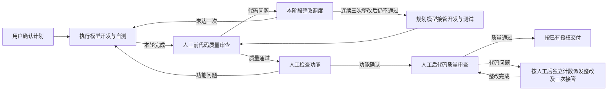

# DevFlow 轻量调度边界审计与整改计划

> 2026-09-18 并行分工补充：开发、测试和代码质量审查均按独立范围使用多个子 Agent 并行推进。互不依赖的开发任务按原计划编号、文件归属和接口边界分工，主 Agent 协调真实依赖、共享代码与结果整合；全部开发和测试代码完成后，再并行测试。代码质量审查按模块、调用链或风险范围由多个只读子 Agent 并行进行，主审汇总去重并检查跨模块交互，不核验测试执行声明或重复跑测试。只有真实依赖或无法隔离的资源冲突才局部串行，无关工作继续。规划模型须把这些分工和依赖写入计划正文；子 Agent 分工不增加平台轮次、质量计数或放行校验。

> 2026-09-18 测试并行修订：全部开发完成后，由多个子 Agent 并行负责独立的单元、集成和 E2E 目标，每条命令只运行一个明确目标，各自定位、修复并重跑；只有真实依赖或共享资源冲突才局部串行。计划正文须写清分工、修改边界与资源隔离。下文“统一测试”只表示进入测试阶段，不授权全量命令或强制无关目标串行。

日期：2026-09-18。状态：已按本计划实施平台轻量化调度与 skill 同步。

## 1. 本次结论与新边界

当前平台仍然承担了交付证明、测试证据核对、审查完整性裁决、整改合同校验和验收证明核验等职责，超出了“调度和展示”。部分校验已经改成不拒绝交付，但计算、存储和向规划模型派发核查责任仍在，因此没有真正轻量化。质量整改计数、连续三次后规划模型接管、两阶段计数及运行身份关联属于正常调度，必须保留；初稿将它们列为删除项是审计判断错误，已按用户澄清纠正。

本次以用户最新要求为整改依据，取代旧方案中与之冲突的终局核验、独立执行自查和测试证据复审规则；不取消原有质量整改调度与三次接管规则：

1. 执行模型必须先完成正式计划中的全部开发任务及测试代码，再统一运行单元测试、集成测试和 E2E 测试，最后提交交付说明。规划模型必须将该顺序明确写入计划文档正文，相关 skill 必须明确要求执行模型遵守。平台默认相信其已测试，不要求它向平台证明测试真实性、完整性或通过率，也不增加过程校验。
2. 执行模型表示本轮完成后，平台直接调度规划模型审查代码质量。规划模型给出修复意见后，平台按既有整改规则派发执行模型；本阶段连续三次完成整改后复核仍不通过，则由规划模型接管开发与测试。
3. 规划模型关注实现遗漏、错误实现、边界/异常、调用链、并发/事务、权限与安全、可维护性；不逐项追查功能有没有测试，不核验原始报告、宿主调用、用例映射、自查证明或测试覆盖表。
4. 规划模型发现“需求规定的分支没有实现”属于代码质量问题；仅发现“没有该分支的测试报告”不属于本次审查问题。阅读测试源码以理解接口不等于开展测试审计，不能由此扩展成补测门禁。
5. 功能是否正常由人工实际确认。规划模型通过只代表代码质量审查结论，平台不能将其或执行模型自述改写成人工验收通过。
6. 平台处理角色路由、两阶段质量整改计数、三次接管、进程/会话、队列、暂停恢复、消息与产物展示。质量判断由规划模型给出，程序依据结论和实际轮次调度；模型无法启动、连接、登录、继续运行或读取必要代码时，处理真实运行故障。
7. 用户暂停、明确授权和人工确认是用户控制；请求身份、重复事件去重、并发归属是调度正确性；它们不应被扩大成代码/测试/文档质量关卡。明确需求或授权缺口由模型向用户说明，平台不通过业务规则猜测是否缺少授权。
8. 首次发现代码质量问题只派发整改方案，计数为 0；执行模型完成一轮整改并报告完成后，规划模型仍给出代码质量不通过，才计一次。同一轮复核或消息重试不能重复计数；通过清零，两阶段独立计数。编译、测试、连接、超时等执行故障不计入代码质量整改失败。程序记录完成事件、阶段、任务/运行/会话身份及关联，不能以测试报告、用例映射或自查证明判定一轮是否有资格被计数。

目标主链路：



箭头之间没有平台业务核验。执行模型内部自查、自测不拆成平台追加轮次。原有人工前、人工后两阶段质量审查及独立计数保留，两阶段都只审代码质量。人工后整改影响功能时沿用原有人工复测安排；程序记录模型报告的影响和人工确认，不自行校验功能或测试真实性。

## 2. 审计范围与事实口径

检查对象包括当前工作区源码和已有未提交修改、编译后的关键入口、6 个源 skill 及 3 个 reference 合同、内置运行提示词、默认模板、MCP/只读复核桥、原生与旧受管执行分支、质量/人工/提交/恢复流程、相关 UI、回归测试和安装分发入口。

同时以只读方式查询 `.devflow/devflow.sqlite` 的工作流、review、quality_review、review_completion 记录，并比较 Codex 与 Antigravity 安装目录下各 6 个 DevFlow skill。未启动模型、业务测试、工作流、迁移或服务重启；本次只新增此审计文档，没有修改产品程序或已安装 skill。

定位中的行号基于本次读取的工作区版本。工作区已有大量 staged/unstaged 修改，不能以 HEAD 代替当前源码，也不能覆盖这些修改。

### 已经松绑的部分，不能误报为仍在强制执行

- [EvidenceValidator](../../packages/evidence/src/validator.ts#L672) 已经使用 `const passed = true`。任务未声明、未完成项、宿主记录错误、测试失败、缺映射等目前生成 issue，但这里不再据此拒绝交付。问题是仍完整核查，并继续传给规划模型。
- [调度入口](../../packages/core/src/engine.ts#L2556) 已经固定 `selfCheck = false`；普通执行交付后直接排队质量审查。不能声称正常路径目前一定多运行一次执行自查。
- `planSelfCheck.queue`、`planSelfCheck.assertPassed` 在产品调用点已无调用，但类、报告校验、特殊轮次分支、提示词、模板及测试仍存在。普通交付携带 `plan_self_check` 仍会被拒绝。
- [native adapter](../../packages/adapters/agy/src/native-adapter.ts#L34) 已取消原生执行的 PreToolUse 拦截；[worker MCP](../../packages/mcp/src/tools.ts#L410) 不向 native-v2 暴露旧的逐项读写、claim、freeze、run_check、finish 工具。这些限制仍属于旧模式，不能算作所有原生调用的现行门禁。
- 当前 native 计划的 `work_items` 分支在 [validatePlan](../../packages/plans/src/validate.ts#L135) 提前返回，因此“四张图、三层齐全”等后续通用检查不对该分支全部执行；相关要求仍在 skill、旧计划分支和其他合同中。

### 编译产物、安装版本和现有记录

- 控制器登记入口为 `C:\Code\system-handle\dist\apps\api\src\main.js`，PID 14700，本次检查进程存在，启动时间为 2026-09-17 22:45:19。关键编译文件同时包含 `selfCheck = false`、validator 始终通过和 `tests_validity_checked` 等旧审查要求。这说明问题并非仅在未编译的草稿中；没有通过注入进程进一步验证其全部内存代码。
- Codex 的 `C:\Users\yckj4798\.codex\skills` 与 Antigravity 的 `C:\Users\yckj4798\.gemini\antigravity\skills` 中各 6 个 skill 均与源码不同，统一换行后仍不同。它们仍有应删除的独立自查、测试真实性复核要求，也包含应保留但需同步准确口径的三次接管规则。Codex 差异明确包含较旧的三次计数规则。
- 只读查询时，两项 CRM 工作流均为 STOPPED，不能借整改擅自恢复。另一个 DevFlow 工作流为 `MODEL_CONNECTION_FAILED`，属于应该保留处理的模型运行故障。
- `wf-27cee89d-f856-4ef4-b40d-3a62cd681073` 的 `review-6723f896-1161-4726-bdd0-18dd6a999e3f` 中，F15 审查原始测试数量、Playwright 和验收映射；F18 审查旧自查/旧报告与计划版本的绑定。这直接证明规划复核已承担测试与交付证明审计。
- `wf-a00f27d8-c8cb-4f26-8470-2af82a7b8fc7` 的两份最近 review 都是 `incomplete` 且 `tests_validity_checked=false`。不能仅据这些字段断言其所有拒绝只由测试引起。
- 两个 CRM 工作流均保存 `review_completion.automatic_attempts=1`，理由包含“质量不合格必须返回完整正式整改计划及逐项整改合同”。证明材料合同确实触发过额外补全轮次；不代表已经达到重试耗尽。
- 以上旧 review 也包含许多具体代码问题。本次只界定复核职责，没有重新验证业务代码，也不把所有旧 finding 一概认定为无效。

## 3. 平台程序的审计清单与保留边界

“硬卡控”表示相应分支仍能拒绝、回退或阻止交接；“仍计算”表示当前不据此拒绝但仍进行业务校验；“残留”表示正常路径已停用但合同或其他分支仍依赖。

| 编号 | 当前行为与影响 | 依据 | 整改 |
|---|---|---|---|
| P01 | 硬卡控：模型正常结束仍必须输出 DeliveryManifest；复杂字段解析失败、没有清单会变成执行未完成。可选测试材料实际混入交接协议。 | [profile-runtime.ts:213](../../packages/runtime/src/profile-runtime.ts#L213)、[engine.ts:2758](../../packages/core/src/engine.ts#L2758)、[index.ts:385](../../packages/contracts/src/index.ts#L385) | 完成通知只保留最小状态和说明；测试记录、报告、映射成为可选展示材料，格式问题不能阻断角色切换。 |
| P02 | 仍计算：导入交付时扫描全部仓库指纹、保存 InputManifest、复制及哈希测试报告、匹配宿主事实并建立 TestExecution。导入器在同步交接链上。 | [delivery-importer.ts:63](../../packages/evidence/src/delivery-importer.ts#L63) | 交接直接记录结果；附件按需读取或异步归档，归档失败仅影响附件展示。移除证明链和整仓输入清单。 |
| P03 | 仍计算：validator 逐项查实现声明和文件存在、设计冲突/未完成项、身份、命令、cwd、起止时间、输入指纹、报告解析/用例状态、验收映射、报告归属、多仓范围/依赖与每仓报告。最终虽始终通过，仍产出大量待核查 issue。 | [validator.ts:105](../../packages/evidence/src/validator.ts#L105)、[validator.ts:233](../../packages/evidence/src/validator.ts#L233)、[validator.ts:401](../../packages/evidence/src/validator.ts#L401)、[validator.ts:525](../../packages/evidence/src/validator.ts#L525)、[validator.ts:672](../../packages/evidence/src/validator.ts#L672) | 从主流程删除整套语义/证明校验，不再把这些 issue 转交规划模型审计。声明中的未完成项和设计疑问原样交接给模型处理。 |
| P04 | 仍计算：观察工具命令开始/结束时扫描工作区与报告目录，比较前后指纹，给报告绑定真实调用，读取 AGY 原生记录。这是过程参与，取消最终拒绝并不会消除成本。 | [profile-runtime.ts:515](../../packages/runtime/src/profile-runtime.ts#L515)、[native-execution-observer.ts:226](../../packages/evidence/src/native-execution-observer.ts#L226)、[runtime.ts:655](../../packages/runtime/src/runtime.ts#L655) | 保留轻量进程/工具事件、耗时、用量和日志展示；移除为证明测试而做的工具级前后扫描和报告归属判定。 |
| P05 | 硬卡控：交付导入后必须生成 Git 快照，再次计算整仓指纹；快照失败或输入不同，交付仍 rejected。 | [engine.ts:1622](../../packages/core/src/engine.ts#L1622) | 交接不冻结并核验代码。差异材料按需生成；无法生成某附件不等于执行未完成。实际仓库不可读作为运行问题处理。 |
| P06 | 硬卡控：执行结束到规划审查之间，仍要求有效 delivery_revision、VERIFYING、verifyEvidence、git.matches，再校验自查字段。 | [engine.ts:1804](../../packages/core/src/engine.ts#L1804) | 用当前有效运行的完成事件直接排队规划模型；保留防止停止后的迟到事件和重复派发的检查。 |
| P07 | 硬卡控：规划模型启动前重复 verifyEvidence 和 git.matches；模型能够运行也会因快照或证据变化启动不了。 | [engine.ts:2545](../../packages/core/src/engine.ts#L2545) | 删除启动前业务证明门槛。交付原计划、最新代码位置与执行总结即可启动。 |
| P08 | 硬卡控：规划结果接收要求快照完全相同、5 个 coverage 布尔值全部为 true、枚举全部变更文件，并再次 verifyEvidence。 | [engine.ts:3141](../../packages/core/src/engine.ts#L3141)、[engine.ts:3214](../../packages/core/src/engine.ts#L3214) | 平台记录模型结论并路由；删除 tests_validity_checked、coverage 全真及逐文件账本门禁。质量漏审属于模型职责。 |
| P09 | 混合职责：QualityCoordinator 接受结论时关联计划、游标、cycle，同时重新 requireValidDelivery 并核对 passed_input_fingerprint；后者使材料漂移阻断交接。 | [quality-coordinator.ts:56](../../packages/core/src/quality-coordinator.ts#L56)、[quality-coordinator.ts:175](../../packages/core/src/quality-coordinator.ts#L175) | 保留服务端维护的计划/阶段/轮次关联、运行归属与去重，防止旧结果串入当前任务；删除测试交付有效性、报告及整仓指纹证明前提。cycle 本身属于调度信息，不作为应删除对象。 |
| P10 | 硬卡控：verifyEvidence 和 CurrentDeliveryReader 会重复核对归档报告是否存在及哈希；缺失、不一致仍挡审查/人工/交付。没有报告和已登记报告后来缺失是两种不同分支。 | [engine.ts:1230](../../packages/core/src/engine.ts#L1230)、[current-delivery.ts:133](../../packages/evidence/src/current-delivery.ts#L133)、[current-delivery.ts:157](../../packages/evidence/src/current-delivery.ts#L157) | 删除报告认证职责。资料读不到只显示读不到，不要求补跑测试或重新交付。 |
| P11 | 硬卡控：同时使用 ReviewSchema 和 QualityReviewResultSchema，两套结论必须一致；每个修复项要求 reproduction、逐函数允许修改、算法/前后条件/事务/幂等、验收用例、回归、完成证据等；平台还校验步骤 DAG、finding 全覆盖、正文 SHA-256/章节/下一版本。 | [index.ts:217](../../packages/contracts/src/index.ts#L217)、[quality.ts:54](../../packages/contracts/src/quality.ts#L54)、[engine.ts:2951](../../packages/core/src/engine.ts#L2951) | 合并成一个精简审查结果；缺陷位置、原因、影响、修复意见足够，详细设计按实际需要写。删除平台对整改正文的完备性裁决。 |
| P12 | 硬卡控：修复意见必须变成完整 Plan 再校验。native 索引要求模块/工作项/验收项双向关联和精确路径；其他计划分支还卡三层、豁免、图数量、图类型、TODO/待定字样。 | [validate.ts:9](../../packages/plans/src/validate.ts#L9)、[validate.ts:231](../../packages/plans/src/validate.ts#L231)、[engine.ts:2973](../../packages/core/src/engine.ts#L2973) | 原范围修复直接发送代码审查意见，免于重新生成全量 Plan。计划正文、图解和索引用于表达与展示，不作为角色切换质量门槛。 |
| P13 | 硬卡控：材料不合合同触发两次自动补全，超过后 REVIEW_COMPLETION_EXHAUSTED。模型未崩溃也会因为字段或覆盖表被阻断。 | [engine.ts:2706](../../packages/core/src/engine.ts#L2706)、[review-completion.ts:57](../../packages/core/src/review-completion.ts#L57) | 删除材料补全状态机。仅无法辨认路由意图时在原会话询问最小状态，不要求重审或完整重写整改材料。 |
| P14 | 保留的正常调度（纠正初稿误判）：记录真实整改轮次和规划模型代码质量结论，连续三次整改后仍不通过则由规划模型接管；维护两阶段独立计数、takeover、任务/运行/会话身份关联及去重。 | [quality-coordinator.ts:86](../../packages/core/src/quality-coordinator.ts#L86)、[quality-coordinator.ts:118](../../packages/core/src/quality-coordinator.ts#L118)、[quality-coordinator.ts:260](../../packages/core/src/quality-coordinator.ts#L260)、[repair.ts:10](../../packages/core/src/repair.ts#L10) | 保留三次接管流程。首次发现计 0，完成整改后的代码质量不通过才计数，同一轮不重复计，通过清零。程序依据已关联的完成与审查事件计数，不核验测试或自查证明；执行故障另行恢复，不混入质量次数。移除的是证据依赖，不能删除计数、接管及防串任务机制。 |
| P15 | 残留且部分仍硬卡：独立计划自查虽不再调度，validateDelivery 仍拒绝普通轮次携带自查；特殊轮次仍校验全部 check_ids；authorities 在普通执行/审查材料生成时仍核验历次正文/hash。 | [plan-self-check.ts:27](../../packages/core/src/plan-self-check.ts#L27)、[plan-self-check.ts:135](../../packages/core/src/plan-self-check.ts#L135)、[profile-runtime.ts:227](../../packages/runtime/src/profile-runtime.ts#L227)、[profile-runtime.ts:352](../../packages/runtime/src/profile-runtime.ts#L352) | 删除独立自查调度、报告及证明字段。原计划和正式修订仍完整传递，历史正文作为资料读取，不能以自查合同再设门槛。 |
| P16 | 硬卡控：人工确认前仍跑快照、测试证据、质量指纹、功能问题状态、环境 ready 与健康检查。人工按钮实际上依赖平台验证器。 | [engine.ts:652](../../packages/core/src/engine.ts#L652)、[runtime.ts:105](../../packages/runtime/src/runtime.ts#L105) | 人工直接记录当前功能确认及问题。服务健康可显示，不能以平台测试/健康认证否决人工操作；用户确认不代替模型质量结论。 |
| P17 | 原有两阶段审查包含人工后 after_human，终审整改影响功能时回人工复测。阶段安排本身是调度；其中附带的测试证明、acceptance_carry 证明核验才需清理。 | [engine.ts:739](../../packages/core/src/engine.ts#L739)、[engine.ts:3262](../../packages/core/src/engine.ts#L3262) | 保留原有两阶段及各阶段独立计数，不再以轻量化为由删除第二阶段。两阶段规划模型都只审代码质量；功能影响由模型说明、功能正常由人工确认，平台不再核验报告或自动派生人工通过。 |
| P18 | 半移除后的流程缺口：markReadyForRetest 和 functional_retest_ready 唯一产品写入点仍在 PLAN_SELF_CHECK_STAGE 分支；普通执行固定走 before_human；人工问题关闭却要求 ready_for_retest/current delivery。 | [engine.ts:1881](../../packages/core/src/engine.ts#L1881)、[engine.ts:1938](../../packages/core/src/engine.ts#L1938)、[functional-issues.ts:52](../../packages/core/src/functional-issues.ts#L52)、[server.ts:503](../../apps/api/src/server.ts#L503) | 修复完成通知直接更新“待人工复测”；代码审查结束正常回人工。移除对停用自查分支和有效证据版本的依赖。此为静态调用链确认的风险，本次未跑现场复现。 |
| P19 | 过程控制：修改、反馈、修订等会清除 snapshot/acceptance、作废所有有效交付和 review；文件观察器根据路径/hash 将证据置失效。 | [engine.ts:831](../../packages/core/src/engine.ts#L831)、[workspace-observer.ts:70](../../packages/runtime/src/workspace-observer.ts#L70) | 保存历史陈述和最新修改事实，让下一模型判断影响；不自动把文件变化解释为必须重测/重审/重交付。 |
| P20 | 硬卡控及返工：恢复执行也 invalidate，要求当前审批/项目配置一致；repairNativeFailure 把交付、测试等错误引向“真实修复+统一测试+新交付”，执行累计 6 轮/规划 3 轮进入耗尽。 | [recovery.ts:146](../../packages/runtime/src/recovery.ts#L146)、[repair.ts:225](../../packages/core/src/repair.ts#L225) | 恢复原会话和原角色；仅对真实模型运行故障做有界重试。删除由平台业务校验触发的修复预算和重测指令。 |
| P21 | 最后又卡一次：本地提交前 required_before_commit/required_hooks 要求匹配当前交付、调用命令、exit 0 和报告路径，否则 HOOK_EVIDENCE_MISSING。 | [engine.ts:3326](../../packages/core/src/engine.ts#L3326) | 删除平台模拟的测试证明门禁。执行模型负责项目检查；真实 Git 操作失败按原原因展示，不能绕过仓库或用户明确配置的保护。 |
| P22 | 交付混合证据验证与正常阶段关系：GitDeliveryCoordinator 要求 valid delivery、after_human 通过和 acceptance 绑定；吸收主分支后又强制“补测→自查→终审”，由 needsVerification 触发。 | [delivery-coordinator.ts:91](../../packages/git/src/delivery-coordinator.ts#L91)、[engine.ts:3422](../../packages/core/src/engine.ts#L3422)、[engine.ts:3598](../../packages/core/src/engine.ts#L3598) | 移除测试证据验证和程序追加自查前提；保留原有代码质量结论、人工确认与交付的调度关联。实际合并冲突交给模型处理，模型完成必要修改和测试后给出代码质量交接；不由程序规定全套重验。保留已有文件、索引和工作树归属保护。 |
| P23 | 审查读取仍被平台限制：只读桥只能读冻结快照登记文件，每次校验 hash；搜索逐文件读取最多 30 项；报告也必须登记并核验 hash。ProfileRuntime 还在只读轮次前后比较整仓指纹，变化就作废结论，不能区分其他写入者。这些检查可能把正常上下游调查变成材料缺口。 | [bridge/review.ts:100](../../packages/bridge/src/review.ts#L100)、[bridge/review.ts:131](../../packages/bridge/src/review.ts#L131)、[runtime.ts:1274](../../packages/runtime/src/runtime.ts#L1274)、[profile-runtime.ts:498](../../packages/runtime/src/profile-runtime.ts#L498)、[profile-runtime.ts:830](../../packages/runtime/src/profile-runtime.ts#L830) | 使用模型原生只读仓库能力和正常搜索；保持客户端只读权限与仓库访问边界，不实施逐文件证明或以全仓变化作废结论。移除强制报告读取/核验工具依赖，分页仅用于实际大文件展示。 |
| P24 | 重复技术冻结：派发执行、重试审查、接收修复和提交都核对 plan/config/baseline/hash；配置变化可能要求重做计划，即使与代码质量无关。 | [engine.ts:2557](../../packages/core/src/engine.ts#L2557)、[engine.ts:3003](../../packages/core/src/engine.ts#L3003)、[engine.ts:3321](../../packages/core/src/engine.ts#L3321)、[engine.ts:3472](../../packages/core/src/engine.ts#L3472) | 服务端维护所选仓库、Profile、当前请求身份；配置变化作为交接信息。范围变更是否需用户决定由模型依据用户授权处理，不重复以整份配置 hash 决定是否能切换。 |

## 4. 规划过度复核及相关 skill / 提示词清单

| 编号 | 当前要求 | 依据 | 整改 |
|---|---|---|---|
| S01 | review skill 专设“测试质量复核”：重新从 diff 核对三层覆盖、测试实现/断言强度、真实浏览器/后端/数据，逐项检查 expected_case_ids→acceptance_mappings→宿主记录→报告；缺证据不得 pass。 | [devflow-review:25](../../packages/skills/devflow-review/SKILL.md#L25) | 整节删除。审查代码有无实现遗漏与边界缺陷，默认接受执行模型已自测的说明。 |
| S02 | review 先核对自查/hash/snapshot/环境和人工确认，再写完整 coverage ledger；review-contract 把 tests_validity_checked 与无漏测绑定。 | [devflow-review:13](../../packages/skills/devflow-review/SKILL.md#L13)、[review-contract:14](../../packages/skills/devflow-review/references/review-contract.md#L14) | 删除测试与交付证明前置核查。审查输出具体代码质量结论，记录读过什么可选，不作为放行证明。 |
| S03 | test skill 同时约束开发与质检；明确“平台核验报告和覆盖”“质检模型复核真实测试、断言和报告，证据不足补齐”。 | [devflow-test:15](../../packages/skills/devflow-test/SKILL.md#L15)、[devflow-test:46](../../packages/skills/devflow-test/SKILL.md#L46) | 测试职责只给执行模型；平台与规划复核不消费测试证明合同。保持执行模型诚实报告真实测试情况。 |
| S04 | repair-document-contract 要求每项缺陷都交出完整唯一设计、精确步骤、正反向用例、修复前失败点、回归与完成证据，复审逐项复现/复验；缺字段禁止派发。 | [repair-document-contract:16](../../packages/skills/devflow-review/references/repair-document-contract.md#L16) | 保留有依据的代码问题和可执行修复意见，按问题复杂度写必要设计；删除测试复验合同、八类字段一刀切和派发门槛。 |
| S05 | execute skill 的原生交付仍要求宿主记录、原始报告、完整用例映射和核验通过，再等程序自查；恢复指导又要求新交付证据。 | [devflow-execute:39](../../packages/skills/devflow-execute/SKILL.md#L39)、[execution-guidance.ts:3](../../packages/core/src/execution-guidance.ts#L3)、[handoff.ts:14](../../packages/adapters/agy/src/handoff.ts#L14) | 改为完成开发和自测后说明结果，直接交代码审查。报告可附，不为调用 ID、清单或 hash 重跑测试。 |
| S06 | plan/onboard 强制三层与不适用审批、覆盖表、全部场景 ID、唯一到算法/字段的细节、固定图解数量、报告配置；普通技术调整也容易重新进入规划合同。 | [devflow-plan:26](../../packages/skills/devflow-plan/SKILL.md#L26)、[plan-contract:16](../../packages/skills/devflow-plan/references/plan-contract.md#L16)、[devflow-project-onboard:11](../../packages/skills/devflow-project-onboard/SKILL.md#L11) | 保留完整需求、明确设计、范围和人工验收目标；必须保留单元/集成/E2E 测试责任，并由规划模型在正文明确“全部开发任务完成后统一测试”。移除程序对这些材料的交接门槛，具体测试命令由执行模型落实；文档深度按任务需要。接入只登记真实仓库与运行需要。 |
| S07 | 6 个 skill 重复混写独立计划自查、全部 check_ids、空证据/旧报告阻断，以及原有两阶段审查与三次规划接管；review/repair reference 也重复旧自查要求。 | [devflow:47](../../packages/skills/devflow/SKILL.md#L47)、[devflow-execute:89](../../packages/skills/devflow-execute/SKILL.md#L89)、[devflow-plan:66](../../packages/skills/devflow-plan/SKILL.md#L66)、[devflow-project-onboard:23](../../packages/skills/devflow-project-onboard/SKILL.md#L23)、[devflow-review:43](../../packages/skills/devflow-review/SKILL.md#L43)、[devflow-test:50](../../packages/skills/devflow-test/SKILL.md#L50) | 删除独立自查与测试证明阻断条款，保留两阶段独立计数、三次接管及准确的轮次定义；共享一份职责与调度说明，避免副本失配。完整遵守原计划继续保留，不能借简化偷减功能。 |
| S08 | 内置 reviewInstructions 直接要求“真实原始测试证据”“必须读取 delivery_materials 与 evidence”“独立核查验收项”；运行时又注入测试/执行 skill、旧自查、全部交付/issue 与严格输出 schema。改个人 skill 不会消除这些要求。 | [review-materials.ts:18](../../packages/runtime/src/review-materials.ts#L18)、[review-materials.ts:53](../../packages/runtime/src/review-materials.ts#L53)、[profile-runtime.ts:327](../../packages/runtime/src/profile-runtime.ts#L327)、[runtime.ts:1227](../../packages/runtime/src/runtime.ts#L1227) | 改共享提示词和两个运行入口。审查包只包含原需求/正式设计、代码位置/diff、已有代码问题和本轮执行总结；不默认注入测试审计材料。 |
| S09 | 适用范围混写：devflow-execute 明确也适用于用户单独指定计划的普通任务，但引用的测试与交付规则含 DevFlow 上下文；缺少“复用测试规范/本地脚本不等于启动工作流”的明确边界，容易造成误用或误述。 | [devflow-execute:3](../../packages/skills/devflow-execute/SKILL.md#L3)、[devflow-execute:9](../../packages/skills/devflow-execute/SKILL.md#L9)、[devflow-test:15](../../packages/skills/devflow-test/SKILL.md#L15)；下文 CRM 实例 | 普通任务使用项目原生测试命令或本地脚本；仅用户要求或已处于真实 DevFlow 交接上下文才使用工作流调度。不得因目录名含 devflow、读取测试 skill 或执行已有计划就创建/恢复工作流，亦不得声称平台启动测试。实际执行方式按终端命令报告。 |

执行模型必须测试。需要纠正的是平台/复核角色重复检查，以及把测试证明写成过度机械化的交接格式。按用户补充，先完成全部开发任务及测试代码，再统一运行单元、集成和 E2E 测试，是必须保留的模型执行要求；规划模型须写入计划正文，skill 须明确要求执行模型遵守。禁止边开发边逐功能测试，或把单个文件/模块当作完整轮次。测试发现问题后先整批分析与修复再重测；平台不为该顺序增加关卡，也不能将普通恢复或材料问题强制变成全量重测。

### CRM 普通 agy 任务出现“通过 DevFlow 框架”的实际来源

只读核对用户指定的 `Execute Low Code Plan`，会话 `8f06c1b7-e4cd-4297-9d4d-2b9ddf2a3c9e`，项目 `C:/Code/crm`。2026-09-18 09:36:52，agy 通过原生 `run_command`，在 `C:/Code/crm/crm` 执行 `$env:PYTHONPATH="scripts/devflow"; python scripts/devflow/run.py integration`；09:37:08 随后输出用户看到的提示。现存转录中的 `tool_calls` 未检出 DevFlow MCP 工具调用。证据：[原生命令记录](C:/Users/yckj4798/.gemini/antigravity/brain/8f06c1b7-e4cd-4297-9d4d-2b9ddf2a3c9e/.system_generated/logs/transcript_full.jsonl:1732)、[对应提示](C:/Users/yckj4798/.gemini/antigravity/brain/8f06c1b7-e4cd-4297-9d4d-2b9ddf2a3c9e/.system_generated/logs/transcript_full.jsonl:1734)。这是本地测试脚本的调用，不是 DevFlow 平台启动工作流。

直接依据是该任务的[正式执行计划](C:/Code/crm/crm/docs/plan/agy接手登录与低代码模块完整开发执行计划_2026-09-18.md:558)：明确允许复用 `scripts/devflow/run.ps1`，或按清单直接运行 Maven/Vitest，并明确“脚本只是本地执行工具，不等于恢复 DevFlow 任务”。计划第 21.2 节要求修正既有 integration 入口的漏收集。agy 于步骤 1735 将其改为全目录收集 `*IntegrationTest.java`，当前正好有 32 个测试类，再在步骤 1743 启动；“32 个模块”实际将测试类数误称为模块数。[收集与 Maven 调用](C:/Code/crm/crm/scripts/devflow/run.py:232)

已安装的执行 skill 要求使用原生终端及 Vitest/JUnit/Playwright 等框架，没有规定所有集成测试必须由 DevFlow 平台代跑。该任务的现存显式文件读取工具记录也没有 skill 读取，不能把这次提示归因为某份 skill 实际被加载。S09 是静态规则的适用范围问题；这次已证实的直接原因是项目脚本名称和模型表述混淆。整改时明确普通任务与工作流的边界，测试脚本可继续复用；建议文案为“已启动 CRM 的 32 个集成测试类，正在等待结果”。不因这个命名问题重建测试工具或恢复旧工作流。

## 5. 旧分支与一致性问题

| 编号 | 当前行为与影响 | 依据 | 整改 |
|---|---|---|---|
| L01 | legacy/leaf-v1 仍执行 start_task/claim/DAG 前置/精确路径/expected_hash/代码片段检查/恒真测试扫描。 | [mcp/tools.ts:410](../../packages/mcp/src/tools.ts#L410)、[progress.ts:216](../../packages/core/src/progress.ts#L216)、[test-quality.ts:7](../../packages/core/src/test-quality.ts#L7) | 旧记录可读；后续执行统一走轻量路径，删除旧逐项门禁对新轮次的影响。 |
| L02 | 旧 Runner 代跑测试、freeze/finish、快照一致性、三层证据核验；一次失败可要求所有检查重跑。 | [runtime.ts:827](../../packages/runtime/src/runtime.ts#L827)、[runtime.ts:1101](../../packages/runtime/src/runtime.ts#L1101)、[engine.ts:1311](../../packages/core/src/engine.ts#L1311)、[mcp/tools.ts:556](../../packages/mcp/src/tools.ts#L556) | 平台不再执行业务测试。历史证据仅展示；已登记命令作为执行模型参考。 |
| L03 | 旧 PreToolUse 默认拒绝原生工具，每步经 worker policy 检查；原生路径虽已取消，桥、文案和兼容安装仍留存。 | [hook.ts:8](../../packages/bridge/src/hook.ts#L8)、[native-adapter.ts:34](../../packages/adapters/agy/src/native-adapter.ts#L34) | 统一去掉工作流业务工具拦截；保留客户端自身权限与用户授权，不以其他工具绕过明确拒绝。 |
| L04 | 环境/浏览器成为验收门槛：UI 将有数据依赖项目的入口与集成测试通过绑定；平台持有浏览器验收锁，接入还要求端口/运行身份适配。 | [workbench.tsx:159](../../apps/web/src/workbench.tsx#L159)、[workbench.tsx:216](../../apps/web/src/workbench.tsx#L216)、[server.ts:1090](../../apps/api/src/server.ts#L1090)、[devflow-project-onboard:16](../../packages/skills/devflow-project-onboard/SKILL.md#L16) | 展示地址、模型报告的启动情况和可选健康状态；不凭集成测试证明隐藏人工入口。仅保留实际共享资源所需的租约，不把租约作为业务验收证明。 |
| D01 | 默认模板仍声明 delivery_validation→executor_plan_self_check→before_human→human→after_human；独立自查声明与当前 `selfCheck=false` 不一致，其中两阶段与三次接管是原有正常调度。 | [default-template.ts:3](../../packages/core/src/templates/default-template.ts#L3)、[create-workflow.ts:192](../../packages/core/src/create-workflow.ts#L192) | 模板、类型、状态机、展示同步去除证据核验及独立自查，保留两阶段代码质量审查、独立计数和三次接管；不能只改 YAML 当成实际生效。 |
| D02 | 原生 taskStatus 将全部 acceptanceResults 通过与是否实现绑定；缺映射会使开发显示 pending。当前无映射报告的 evidence 投影也仍使用 passed 标签，容易让“接收材料”看起来是“验证通过”。 | [engine.ts:1037](../../packages/core/src/engine.ts#L1037)、[engine.ts:3978](../../packages/core/src/engine.ts#L3978)、[panels.tsx:92](../../apps/web/src/panels.tsx#L92)、[activity.ts:165](../../packages/presentation/src/activity.ts#L165) | 分别展示执行模型完成说明、代码审查结论、人工功能确认。报告附件缺失显示未提供，不推断没测试，更不伪造平台认证。 |
| D03 | 源 skill、两种客户端各 6 个安装副本、运行时引用的内置资源不一致。只改一处会被另一份继续引导或后续更新覆盖。 | [review-materials.ts:9](../../packages/runtime/src/review-materials.ts#L9)、[installer.ts:26](../../packages/clients/src/installer.ts#L26)、[install-skills.mjs:12](../../scripts/install-skills.mjs#L12) | 源文件统一后通过既有安装分发更新所有实际安装客户端；检查 reference/agents 文件；保留备份及非 DevFlow 用户配置。 |
| D04 | README、使用指南、原生终局核验/跨平台实施计划仍规定自查、两关、真实测试证据；自动测试也有旧门禁断言和过时用例名称。 | [README:9](../../README.md#L9)、[使用指南:38](../guide/使用指南.md#L38)、[executor-plan-self-check.test.ts:18](../../tests/integration/executor-plan-self-check.test.ts#L18)、[devflow-v2-quality-flow.test.ts:175](../../tests/integration/devflow-v2-quality-flow.test.ts#L175)、[native-delivery.test.ts:177](../../tests/integration/native-delivery.test.ts#L177) | 当前规范重写；旧计划标记被本计划哪些职责条款替代，历史保留。重写平台回归预期，不能为了旧测试通过把已删除门禁加回来。 |

本表覆盖平台 P01—P24、skill/提示词 S01—S09、兼容分支 L01—L04、一致性 D01—D04。它们是审计位置及职责边界，不代表同等数量的独立运行关卡。P14 纠正为必须保留的调度；P17 保留两阶段安排，仅清理附带的证明核验。

## 6. 确定的整改方案

### R1. 精简交接协议与职责，先形成一个实现口径

对应 P01、P08、P11、P12、S01—S09。

平台自行提供 workflow/run/session/role 等身份，不让模型复制 hash、revision、cycle 或宿主 ID 证明自己。模型输出仅表达本轮意图，推荐约定如下；这些是路由状态，不是业务校验合同：

```json
{
  "status": "completed",
  "summary": "本轮实现与自测结果",
  "notes": "遗留事项或需要下个角色关注的内容",
  "artifacts": []
}
```

执行侧状态仅需“本轮完成 / 需规划澄清 / 需用户输入”；审查侧仅需“质量通过 / 需要修改 / 需用户输入”。问题和修复说明以正文为主，可附文件与行号，不强制逐项算法/测试/证据 schema。

测试摘要和报告可选。没有附件、附件格式不同、场景未映射、报告读不到、声明存在未完成项，都不能被平台转为 `DELIVERY_REJECTED`。未完成说明交给规划模型判断代码遗漏或计划冲突，平台不自行解决语义矛盾。

模型明确本轮完成后直接交接；如果完全没有可辨认的阶段意图，平台保留原文，在原会话补问一句当前状态。这属于通信未完成，不能要求重审、重测或重写详细整改合同，更不能伪造完成。

调度器的队列容量、实际资源互斥、运行归属、停止后结果去重继续保留，属于平台本职；具体依据为 [scheduler.ts:63](../../packages/scheduler/src/scheduler.ts#L63) 和 [run-profile.ts:78](../../packages/core/src/run-profile.ts#L78)。客户端认证、权限、进程控制及安全文件读取也保留。需要删的是它们附带的业务证据前提，不能将轻量化实施为删除认证、覆盖用户数据或取消停止控制。

### R2. 重接执行↔审查↔人工状态流

对应 P06—P09、P13—P18、D01。

在 Engine 中以单一完成事件接通执行到审查；以规划模型的代码质量结论接通修复或人工。移除 VERIFYING 业务核验阶段、独立计划自查阶段和 review_completion 补材料阶段。保留 before_human/after_human 两阶段、各阶段独立计数与连续三次整改后规划接管；不能将正常调度误删为卡控。

计数仅依赖本阶段真实整改完成事件与随后规划模型的代码质量结论：首次发现为 0，三次完整整改后分别不通过则为 1、2、3，第三次直接规划接管，不派发第四次执行模型整改；通过后清零。保留当前任务/运行/阶段/轮次关联和重复结果去重。报告缺失、测试失败、原生工具或连接故障不构成一次代码质量整改失败，也不作为补齐计数或提前接管的理由。

保留明确的停止/等待用户、模型运行失败、排队和执行中状态。队列核对运行归属、当前阶段与整改轮次、是否已经停止、是否重复处理，以及按既有次数应派发哪一角色；不得调用测试、报告、snapshot、coverage 或质量合同校验器。

功能修复完成时更新已有问题为待人工复测，规划模型审查其代码修改后进入人工。人工确认后按原流程进入人工后代码质量审查；该阶段仍默认相信执行模型已测试，不复核测试证明。后续修复影响功能时沿用人工复测安排，不让程序自行认证功能正确或生成新的人工通过。

正式计划内修复以审查意见直接交接；业务需求确实变化时，由模型形成必要修订并向用户说明，不让程序以路径表或缺失字段替用户作决策。

### R3. 从主调用链删除证明计算，而非设为永远通过

对应 P02—P05、P10、P15、P19、P23。

清理 `EvidenceValidator`、`DeliveryImporter`、`CurrentDeliveryReader`、`PlanSelfCheckCoordinator` 的控制用途；删除工具事件上的 captureInputs/captureReports 证明链；删除模型切换处 `verifyEvidence`、`git.matches` 和全量文件哈希扫描。

保留数据模型兼容读取历史报告。新的附件服务只处理读取、大小限制、安全路径、日志脱敏和展示，不解释测试是否真实完成。附件处理不得位于调度事务的必经路径，失败也不得触发模型修复。

差异视图按需从仓库读取，不因用户查看进度重复扫仓。文件事件可以更新“观察到修改”，不能触发全局证据失效、自动重测或卡审查。

### R4. 清理恢复、提交与兼容流程中的旁路关卡

对应 P20—P24、L01—L04。

模型连接/认证/额度/超时/崩溃等保留原会话与运行原因，按真实可重试条件处理；业务资料问题不纳入运行失败次数。暂停、恢复、查看日志不能使已经记录的执行/审查/人工事实被删除。

提交/合并仍保护用户原有 staged/unstaged 内容、任务工作区归属和具体文件操作；移除平台对测试命令/原始报告/第二次审查的重复要求。真实 Git 冲突由模型处理，平台展示冲突和处理状态。不能为“轻量”绕过用户明确要求或仓库实际执行的保护。

legacy/leaf-v1 保留历史读取和资料兼容，新轮次转为同一轻量调度。不再保留“新模式轻量、恢复旧任务又回旧门禁”的长期双轨行为。迁移时原需求、任务编号和用户确认仍保留，不让用户重新编写计划。

### R5. 一次性同步 6 个 skill、reference 和内置提示词

对应 S01—S08、D03。

修改范围：`packages/skills/devflow*`；3 个 reference 合同；各 skill 的客户端元数据；`execution-guidance.ts`、`review-materials.ts`、`profile-runtime.ts`、`runtime.ts`、`adapters/agy/src/handoff.ts`、`bridge/review.ts`；对应导出的 schema、MCP 描述和默认模板。

统一的审查指令应明确：

> 你负责代码质量。依据原需求和正式设计检查当前实现有无遗漏、逻辑与边界错误，以及维护性问题。默认接受执行模型已完成自测的说明，不核验是否测试、测试覆盖表、原始报告、宿主调用或自查证明，不为这些材料提出补测整改。发现代码问题时一次性汇总位置、原因、影响和可执行修复意见；没有代码质量问题则给出通过结论。功能效果由用户实际确认。

规划与执行 skill 必须共同要求：规划模型在每份开发计划/正式整改文档中写明开发与测试顺序，执行模型先完成整个正式计划的全部开发任务及测试代码，再统一运行单元测试、集成测试和 E2E 测试。阶段安排和依赖应体现“全部开发 → 统一测试”，不得按单个功能、模块或文件交替安排；仅引用 skill 或列测试清单不算把顺序写入计划。正式整改先完成该轮完整整改范围，再统一测试。

计划正文统一使用以下约定：“先完成正式计划中的全部开发任务，包括功能实现、端到端接线、异常与边界处理及测试代码，再进入单元、集成和 E2E 测试阶段。将独立测试目标分配给多个子 Agent 并行执行，各子 Agent 每条命令只指定一个测试类、文件或用例，并负责相关问题的定位、修复和重跑。某个目标失败不阻塞其他无关目标；不同测试层之间不设固定先后顺序。仅有真实依赖或共享资源冲突的目标需要协调、隔离或局部串行。禁止无筛选的全量命令、全库通配符和一次拼接多个测试目标；受影响回归也按独立目标分派并行，不因局部修改重跑整个套件。”

此次补充已写入 devflow、devflow-plan、devflow-execute、devflow-test 的源 SKILL.md 及 plan-contract.md。后续轻量化清理必须保留此要求，同步到安装副本和内置交接提示词；删除测试证明链、强制独立自查、程序验收声明和不必要的交接表格。平台不核验该执行顺序，规划质量复核不追查测试是否执行。

另需统一 skill 的适用范围：用户单独要求按计划开发时，可复用“全部开发后统一测试”的方法，但默认通过客户端原生终端运行项目测试工具；不因 skill 名称或脚本目录含 devflow 而启动/恢复工作流或提交 DevFlow 交付合同。只有用户要求使用 DevFlow，或任务已经由平台实际交接时，才套用其调度上下文。进展说明使用实际命令及结果，不把本地测试脚本称为“平台已启动测试”。两阶段计数、三次规划接管及身份关联仍作为工作流调度规则统一保留。

安装更新必须覆盖当前实际存在的 Codex/Antigravity 两份副本及其 reference。使用既有安装流程保留备份；不改写非 DevFlow 的用户配置。运行时生成的 HANDOFF、materials、schema 是本轮工件，旧工件不继续作为新轮次规范。

### R6. 展示统一为来自三个责任方的结果

对应 P16、L04、D02、D04。

保留当前布局基础，改数据来源和文案：

| 内容 | 事实来源 | 展示规则 |
|---|---|---|
| 开发与自测 | 执行模型本轮说明 | 展示已完成/进行中/遗留说明及可选报告；不根据附件缺失推断漏测。 |
| 代码质量 | 规划模型结论 | 展示通过、需要修改与代码问题；不展示“测试真实性核验通过”。 |
| 功能正常 | 人工确认 | 仅用户实际确认可标记通过；模型完成与报告通过均不代签。 |
| 运行状态 | 进程/队列/会话事件 | 展示等待、运行、停止、认证/连接等真实错误。 |

测试数字如果保留，标注为模型提供或报告解析所得；解析仅用于展示，失败/缺失不反向控制任务。环境链接不与集成测试证据绑定。历史自查与旧核验记录折叠为历史材料，不再显示为当前必经关卡。

### R7. 迁移现有状态、文档和分发

对应全部跨版本残留。

实施前核对现有并行修改；在独立变更边界整合已做的松绑，不能用回滚旧实现的方法重新引入门禁。部署迁移前停止平台写入并冷备数据库及 WAL/SHM/journal、已登记工作区/会话/配置；范围只针对本次平台状态，不能清理其他工作。

迁移只移除业务证明关卡的控制作用，保留历史记录、原计划、反馈、交付、审查原文、两阶段有效整改计数及合法接管归属。STOPPED、WAITING_INPUT、WAITING_AUTHORIZATION 等用户状态保持，不自动恢复。旧自查待执行转成保留原状态的待交接信息，待用户已有的恢复动作发生后使用新流程。正在运行的会话不强行换 Profile，不重建任务。不得为轻量化清零正常计数或取消已成立的三次接管。

更新 README、使用指南和当前有效实施说明；旧计划保留为历史，并注明终局核验、自查和测试审计条款被本次职责边界替代，两阶段代码质量调度与三次接管仍然有效。源 skill、构建产物、安装副本和下一轮交接包同时更新后才算部署完成。

### R8. 由执行模型验证平台改造，规划模型只审代码

以下是本次平台实现需要覆盖的回归场景，属于执行模型验证职责，不成为未来业务工作流的门禁或规划模型逐项验收清单。

| 场景 | 应观察到的行为 |
|---|---|
| 执行模型完成，未提供报告、映射、宿主记录或自查字段 | 直接且仅一次调度规划模型。 |
| 执行结果附带不同格式/过期/缺失的报告路径，或附件读取失败 | 展示资料状态，仍正常交接，不派发补测。 |
| 审查明确通过，没有 coverage ledger、tests_validity_checked、hash 或 quality 双合同 | 进入人工功能确认。 |
| 审查指出功能漏实现/空值边界错误，并给普通文字修复意见 | 直接交执行模型修复，不要求完整 Plan、SHA 或正反向测试合同。 |
| 同一个完成通知重复送达，或停止后才收到迟到结果 | 不重复启动，不擅自恢复用户停止的任务。 |
| 模型真实连接失败、登录失效、超时或崩溃 | 显示真实原因，恢复原角色/会话，不冒充完成。 |
| 人工反馈→执行修复→代码审查→人工复测 | 问题可进入待复测并由人工关闭；不依赖已删除的自查分支。 |
| 人工通过 | 按原流程进入 after_human 代码质量审查；两阶段分别计数，均不审计测试证明。 |
| 首次代码质量不通过 | 派发整改方案，失败计数保持 0。 |
| 三次完成整改后的代码质量复核分别不通过 | 本阶段计数依次为 1、2、3；第三次由规划模型接管，不再派发第四次执行模型整改。 |
| 同一整改重复复核/结果重传，或模型连接失败 | 不重复计数；运行故障不混入代码质量整改次数。 |
| 某阶段代码质量通过 | 清零本阶段连续计数，保留历史记录和另一阶段独立状态。 |
| 普通 agy/Codex 任务调用项目 scripts/devflow 下的测试脚本 | 使用原生终端运行，不创建/恢复 DevFlow 工作流，不提交工作流交付合同，不误述为平台代跑。 |
| 暂停/恢复和版本升级 | 保留历史、用户状态、工作区和配置；不自动清空交付或回到全量重测。 |
| 主分支变化或真实合并冲突 | 保留用户数据，按实际冲突交接模型；无程序规定的证据重验链。 |
| 有数据库项目无平台集成测试证明 | 人工仍能看到真实环境地址及状态，不被隐藏入口。 |
| 旧 leaf-v1/native-v2 工作流恢复 | 使用统一轻量路径，历史材料仍可读。 |
| 源 skill 与已安装副本更新 | 两客户端下一轮均使用新职责边界，reference/内置提示词无旧门禁。 |

先完成全部相关代码与测试调整，再运行受影响的单元/集成测试及一轮代表性的真实浏览器流程，最后做一次必要的综合检查。检查性能时测角色切换耗时、文件扫描次数、报告读取次数、额外模型轮次及日志/材料体积；不预设或编造节省百分比。

规划模型复核本次改造时只检查代码实现是否遵守上述职责、是否漏接状态、是否有并发/恢复/维护性问题，不重新审计执行模型有没有跑完这张表。

实施依赖：R1 确定最小交接与职责；R2/R3/R4 配套完成路由和移除；R5/R6 同批同步入口及展示；R7 完成状态/文档/分发迁移；R8 由执行模型验证，最后交代码质量审查与人工实际检查。不可仅修改 skill、仅设置 validator 永远通过，或仅删除自查队列就宣布完成。

## 7. 本次交付边界

已按本计划完成平台轻量化调度、skill/提示词同步、测试预期调整和安装分发准备。平台主链路按执行完成事件直接进入两阶段代码质量审查；删除独立自查、测试证明、coverage/快照哈希和材料补全门禁；保留队列、停止去重、Git 工作区保护、计划身份关联、两阶段独立计数与三次接管。功能是否正常仍由人工确认。

源 skill 更新后需通过既有安装流程同步 Codex 与 Antigravity 安装副本。未自动恢复已暂停工作流，也没有把旧测试结果当成本次整改验证。
