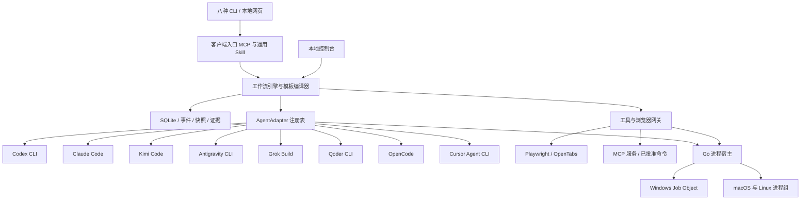
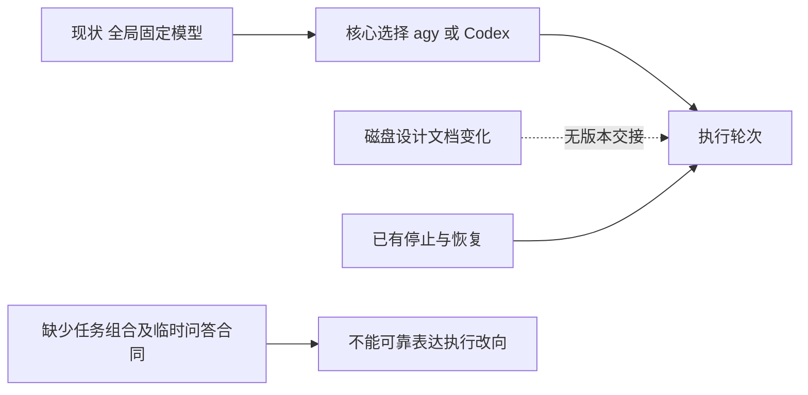
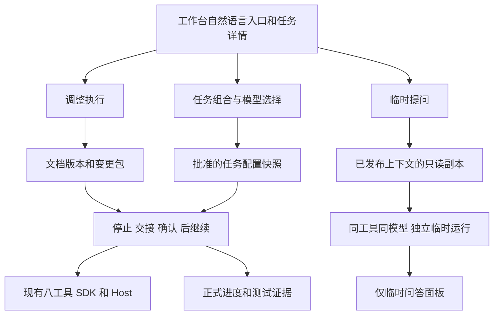
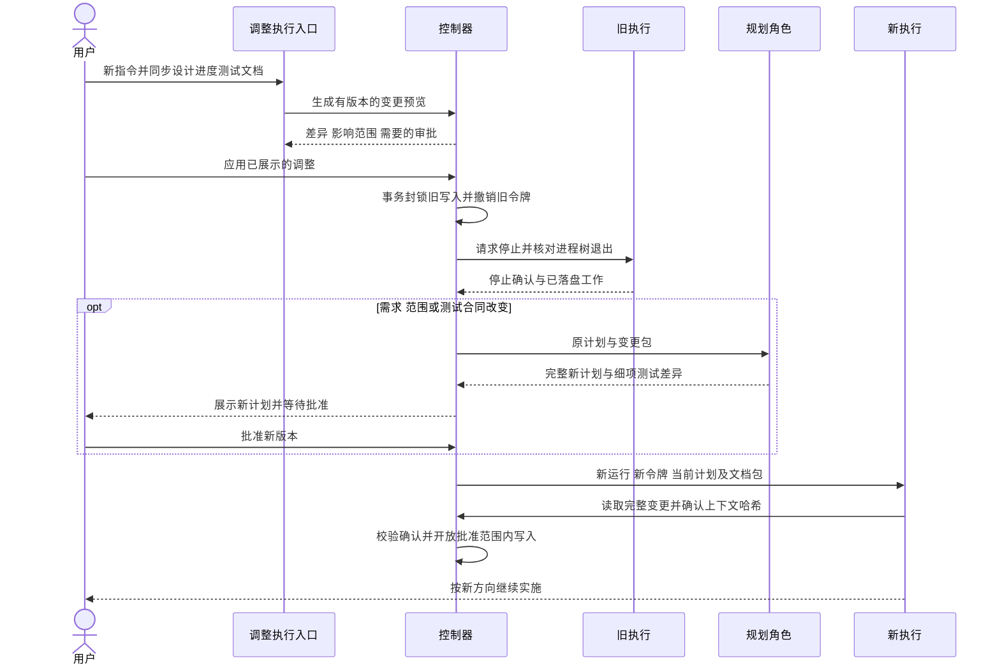
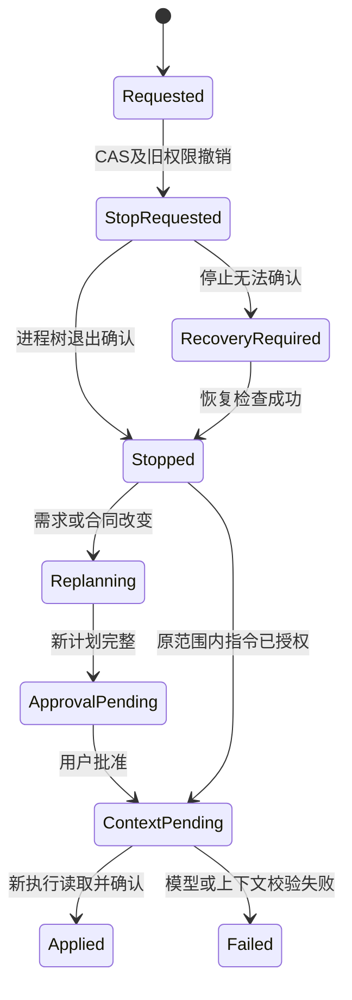
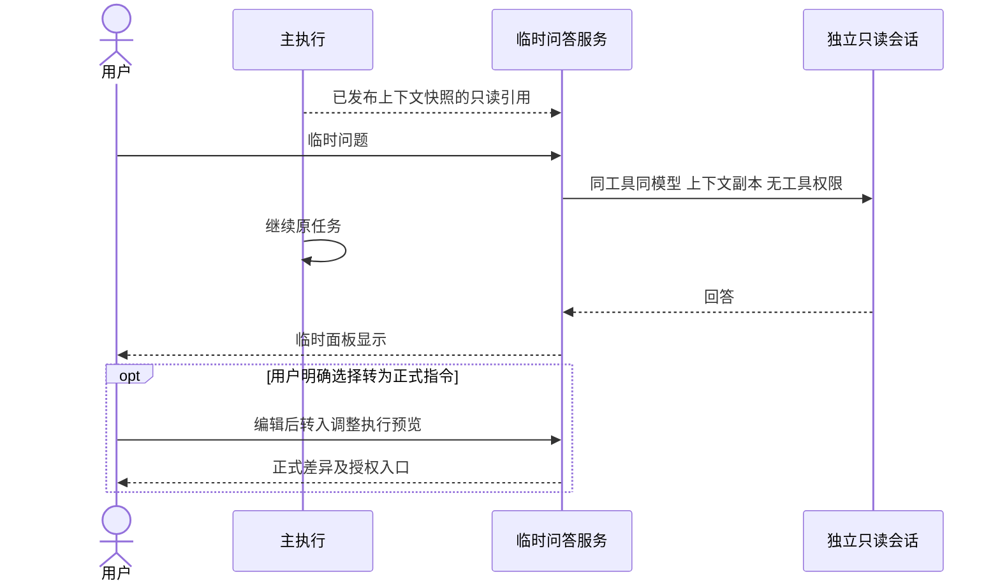
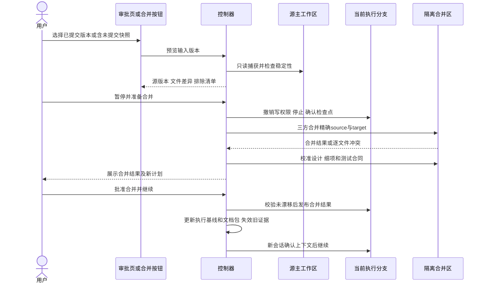

# DevFlow 通用平台完整开发执行合同（1.4）

任务：DevFlow v1.0 跨平台与八工具通用平台完整开发；唯一workflow_id：wf-508be4f4-4c5a-453c-9ac6-c6dafe717a08。

完整范围：88个叶子细项、13模块、13测试组、275个稳定用例。保留1.3全部78细项与237用例，新增P12的10细项和38用例；P11→P12→P08，最终安装、迁移、复核与发布候选包含全部功能。

**用户本轮选择：主工作区最新已提交版本。执行代码基线：6eb47cca18dc65397aab125e96eb329cecc344d2。** 原基线d5bc298ac5be27a28a9a641be8ef583486da2c1a仅作历史，不再用于创建执行分支。当前没有执行工作区或Run，批准后直接从新基线创建；未提交业务代码不引入，已批准1.4文档正文由P00-01带入。源工作区和父控制器保持原状。本次只更新设计/计划，不自动批准，不启动执行。

P00-02先创建受管脚本再bootstrap。所有阶段遵守leaf-v1范围、逐项文件证明、真实原始测试、人工验收后独立复核；最终本地提交与外部发布权限分离。

## 全部细项共同执行约束

以下约束适用于结构化 tasks 中的全部 88 项；每个细项的专属路径、实现、依赖、完成检查与测试引用保留在结构化合同中，正文不重复抄录。

必须保持：保持免登录自然语言入口、人工身份与worker权限分离、Run/快照证据绑定；保留6eb47cc布局和中断修复；禁止操作父控制器4810和原业务数据；不改变已确认八工具范围。

停止条件：真实代码基线/批准范围漂移或出现未授权副作用时停止对应动作并报告；真实认证所需账号/runner不可用时保存blocked证据，不填passed；未确认进程退出不释放租约，不擅自变更技术方案或跳过检查。

完成条件：核心行为实现、批准的原始测试与当前源码匹配；下列静态检查仅证明产物已写入，不能代替行为测试。

共同输入：批准的 1.4 全文、细项所属工作包与已完成前置输出；源码基线 6eb47cca18dc65397aab125e96eb329cecc344d2。

原工作区中并行产生的未提交界面修改保留原处；本任务仅在批准基线的新 worktree 开发，不覆盖、提交或重置源工作区的这些改动。


## 完整细项执行清单

### P00-01 冻结当前代码与方案输入

- 模块：P00；需求：AC-20, AC-35；前置：P00-02
- 输入：正文1.4、P00与已完成前置输出；使用共同输入基线。
- 文件/函数：scripts/release/capture-baseline.mjs, docs/plan/DevFlow跨平台通用工作流平台实施方案.md, docs/test/DevFlow八工具适配方案本机核查.md, docs/test/portable/baseline.json, docs/plan/DevFlow通用平台DevFlow执行计划.md, docs/design/DevFlow通用平台开发调研.md, docs/process/DevFlow通用平台开发进度.md, docs/test/DevFlow通用平台验收合同.md
- 核心算法：记录 6eb47cc、工作区 tree hash、所有纳入本计划的设计、执行、进度、测试输入文档的 SHA256；从本批准正文恢复 1.4 全文到执行 worktree。禁止提交或重置源工作区；记录原测试原始结果，后续开发不得借用历史通过状态。 1.4合并要求：冻结1.4完整设计、执行合同、进度与测试文档哈希；同一任务同一批准版本，禁止另建增量工作流；基线仍6eb47cc，不拷贝源工作区其他未提交修改。 1.4按用户本轮明确选择，源码起点冻结为6eb47cca18dc65397aab125e96eb329cecc344d2，直接从新已提交基线建立首次worktree；1.4批准正文文档单独带入，未提交业务代码排除。
- 保持：遵守正文全局保持要求。
- 输出与完成：实现本项行为并按正文全局完成条件核验产物及真实测试。
- 产物检查：[{"contains":"source_tree_hash","path":"scripts/release/capture-baseline.mjs"}]
- 测试：PF-UNIT, PF-INTEGRATION
- 停止条件：按正文全局停止条件阻塞并留证。

### P00-02 提供受管命令与隔离预览入口

- 模块：P00；需求：AC-19, AC-25, AC-28, AC-34；前置：无
- 输入：正文1.4、P00与已完成前置输出；使用共同输入基线。
- 文件/函数：scripts/devflow/verify.mjs, scripts/devflow/preview.mjs, playwright.config.ts, vitest.config.ts
- 核心算法：首先实现 Node 标准库启动器，动作固定 bootstrap/build/unit/integration/e2e/certification/preview；bootstrap 在本 worktree 执行 npm ci 并记录基线，build 执行 typecheck/test/build 与 Host 构建；测试动作保留真实退出码并把原始报告写 DEVFLOW_REPORT_PATH 和登记的 .reports 文件。preview 运行真实构建 API/Web，使用 DEVFLOW_PORT、DEVFLOW_DATA_DIR、DEVFLOW_IDENTITY，健康响应含 x-devflow-identity。不得占用正在承载本任务的 4810、写其数据库或停止原控制器；新工作树自举不覆盖父服务的 dist。
- 保持：遵守正文全局保持要求。
- 输出与完成：实现本项行为并按正文全局完成条件核验产物及真实测试。
- 产物检查：[{"contains":"DEVFLOW_REPORT_PATH","path":"scripts/devflow/verify.mjs"}]
- 测试：PF-UNIT, PF-INTEGRATION
- 停止条件：按正文全局停止条件阻塞并留证。

### P00-03 锁定跨平台构建工具链

- 模块：P00；需求：AC-29, AC-35；前置：P00-01, P00-02
- 输入：正文1.4、P00与已完成前置输出；使用共同输入基线。
- 文件/函数：scripts/release/lock-toolchains.mjs, build/toolchains.lock.json
- 核心算法：按照 1.3 的唯一算法从官方发行索引解析 Go 1.26 稳定补丁和 Git 稳定版；Node 固定 22.23.2，JS 锁文件作为基线。输出精确版本、URL、hash、六目标；记录真实下载错误，禁止 latest 浮动构建或虚构哈希。
- 保持：遵守正文全局保持要求。
- 输出与完成：实现本项行为并按正文全局完成条件核验产物及真实测试。
- 产物检查：[{"contains":"toolchains.lock.json","path":"scripts/release/lock-toolchains.mjs"}]
- 测试：PF-UNIT, PF-INTEGRATION
- 停止条件：按正文全局停止条件阻塞并留证。

### P00-04 生成可公开源码与排除清单

- 模块：P00；需求：AC-33, AC-35；前置：P00-01, P00-02
- 输入：正文1.4、P00与已完成前置输出；使用共同输入基线。
- 文件/函数：scripts/release/export-source.mjs, scripts/release/scan-public-source.mjs, build/public-source.json
- 核心算法：按白名单导出所有自有源码/锁/Skill/合成夹具/构建材料，排除当前 .devflow、凭据、历史个人截图、真实会话及本机路径；只扫描和导出，不删除私有资料。导出后在独立目录验证完整构建，输出带哈希 manifest。
- 保持：遵守正文全局保持要求。
- 输出与完成：实现本项行为并按正文全局完成条件核验产物及真实测试。
- 产物检查：[{"contains":"exportSource","path":"scripts/release/export-source.mjs"}]
- 测试：PF-UNIT, PF-INTEGRATION
- 停止条件：按正文全局停止条件阻塞并留证。

### P01-01 定义 v2 配置与单工具约束

- 模块：P01；需求：AC-09, AC-10, AC-11, AC-45, AC-46；前置：P00-01, P00-02, P00-03, P00-04
- 输入：正文1.4、P01与已完成前置输出；使用共同输入基线。
- 文件/函数：packages/contracts/src/config-v2.ts, packages/contracts/src/config.ts, packages/contracts/src/index.ts, packages/contracts/src/execution-spec.ts
- 核心算法：以 Zod 定义 Profile、四角色、Toolset、template revision 和 execution.mode；single-tool 校验所有启用 AI 节点及自定义角色只有一个 adapter ID，native-config/explicit 保留明确语义，未知字段和参数拒绝。 1.4合并要求：先按第16节定义WorkflowExecutionSpec与role/leaf绑定引用，以供后续P11实现，不只定义全局Profile。
- 保持：遵守正文全局保持要求。
- 输出与完成：实现本项行为并按正文全局完成条件核验产物及真实测试。
- 产物检查：[{"contains":"single-tool","path":"packages/contracts/src/config-v2.ts"}]
- 测试：PF-UNIT, PF-INTEGRATION
- 停止条件：按正文全局停止条件阻塞并留证。

### P01-02 持久化 Profile 修订和模型证据

- 模块：P01；需求：AC-11, AC-13, AC-15, AC-33；前置：P00-01, P00-02, P00-03, P00-04
- 输入：正文1.4、P01与已完成前置输出；使用共同输入基线。
- 文件/函数：packages/profiles/src/registry.ts, packages/profiles/src/resolve.ts, packages/store/src/store.ts
- 核心算法：事务保存 Profile revision；冻结 requestedModel/reportedModel/evidence/provider/endpoint 无密钥元信息及哈希；未报告显示未知，冲突报 MODEL_MISMATCH；新配置不改变旧 Run。
- 保持：遵守正文全局保持要求。
- 输出与完成：实现本项行为并按正文全局完成条件核验产物及真实测试。
- 产物检查：[{"contains":"ProfileRegistry","path":"packages/profiles/src/registry.ts"}]
- 测试：PF-UNIT, PF-INTEGRATION
- 停止条件：按正文全局停止条件阻塞并留证。

### P01-03 实现版本化适配器 SDK

- 模块：P01；需求：AC-10, AC-14, AC-51, AC-56；前置：P00-01, P00-02, P00-03, P00-04
- 输入：正文1.4、P01与已完成前置输出；使用共同输入基线。
- 文件/函数：packages/adapters/sdk/src/index.ts, packages/adapters/sdk/src/registry.ts, packages/adapters/sdk/src/interaction-capabilities.ts
- 核心算法：按 1.3 实现 probe/describe/resolveProfile/prepare/decode/finalize/resume、capabilities/optionsSchema 与 PreparedInvocation；适配器仅返回结构化程序调用，宿主统一启动，不能 detached 或自行选择其他模型。 1.4合并要求：SDK预留交互能力探针，不强制原生热注入；模型枚举与只读无工具能力必须按版本认证。
- 保持：遵守正文全局保持要求。
- 输出与完成：实现本项行为并按正文全局完成条件核验产物及真实测试。
- 产物检查：[{"contains":"AgentAdapter","path":"packages/adapters/sdk/src/index.ts"}]
- 测试：PF-UNIT, PF-INTEGRATION
- 停止条件：按正文全局停止条件阻塞并留证。

### P01-04 定义四角色结果与子测试执行合同

- 模块：P01；需求：AC-19, AC-20, AC-47, AC-48；前置：P00-01, P00-02, P00-03, P00-04
- 输入：正文1.4、P01与已完成前置输出；使用共同输入基线。
- 文件/函数：packages/contracts/src/node-run.ts, packages/contracts/src/agent-events.ts
- 核心算法：定义 NodeRun、check_execution_id、上下文绑定和结果 schema；测试提交仅能引用服务生成的报告 ID；明确运行/快照/Profile/权限绑定，禁止模型伪造人工确认或传 passed=true 完成测试。
- 保持：遵守正文全局保持要求。
- 输出与完成：实现本项行为并按正文全局完成条件核验产物及真实测试。
- 产物检查：[{"contains":"parent_node_run_id","path":"packages/contracts/src/node-run.ts"}]
- 测试：PF-UNIT, PF-INTEGRATION
- 停止条件：按正文全局停止条件阻塞并留证。

### P02-01 实现 Go Host JSONL 控制协议

- 模块：P02；需求：AC-26, AC-27；前置：P01-01, P01-02, P01-03, P01-04
- 输入：正文1.4、P02与已完成前置输出；使用共同输入基线。
- 文件/函数：host/devflow-host/main.go, host/devflow-host/go.mod, host/devflow-host/go.sum, packages/process/src/host-client.ts
- 核心算法：Go Host 统一 doctor/lock/run/stop/status/process-identity，保留 stdout/stderr 类型和 UTF8 分块；输出版本化身份；Node 客户端拒绝协议漂移。
- 保持：遵守正文全局保持要求。
- 输出与完成：实现本项行为并按正文全局完成条件核验产物及真实测试。
- 产物检查：[{"contains":"process-identity","path":"host/devflow-host/main.go"}]
- 测试：PF-UNIT, PF-INTEGRATION, PF-CERT
- 停止条件：按正文全局停止条件阻塞并留证。

### P02-02 实现 Windows Job 和单控制器锁

- 模块：P02；需求：AC-26, AC-27, AC-28；前置：P01-01, P01-02, P01-03, P01-04
- 输入：正文1.4、P02与已完成前置输出；使用共同输入基线。
- 文件/函数：host/devflow-host/process_windows.go, host/devflow-host/lock_windows.go
- 核心算法：使用 suspended 创建、分配 Job 后 resume，禁止 breakaway，kill-on-close；Mutex 绑定规范化数据目录；核对 PID+创建时间+Job 身份后停止整个进程树；不创建用户或修改账户 ACL。
- 保持：遵守正文全局保持要求。
- 输出与完成：实现本项行为并按正文全局完成条件核验产物及真实测试。
- 产物检查：[{"contains":"CreateJobObject","path":"host/devflow-host/process_windows.go"}]
- 测试：PF-UNIT, PF-INTEGRATION, PF-CERT
- 停止条件：按正文全局停止条件阻塞并留证。

### P02-03 实现 macOS/Linux 进程组与锁

- 模块：P02；需求：AC-26, AC-27, AC-28；前置：P01-01, P01-02, P01-03, P01-04
- 输入：正文1.4、P02与已完成前置输出；使用共同输入基线。
- 文件/函数：host/devflow-host/process_unix.go, host/devflow-host/lock_unix.go
- 核心算法：POSIX 宿主在受管进程组外；SIGTERM 后 5 秒 SIGKILL，flock 持有 fd；绑定 PID/PGID/启动时间/boot identity，不能确认残留时保持租约和 RECOVERY_REQUIRED，不声称等价于 Windows Job。
- 保持：遵守正文全局保持要求。
- 输出与完成：实现本项行为并按正文全局完成条件核验产物及真实测试。
- 产物检查：[{"contains":"SIGTERM","path":"host/devflow-host/process_unix.go"}]
- 测试：PF-UNIT, PF-INTEGRATION, PF-CERT
- 停止条件：按正文全局停止条件阻塞并留证。

### P02-04 解析跨平台路径与真实 CLI 入口

- 模块：P02；需求：AC-25, AC-34, AC-49, AC-56；前置：P01-01, P01-02, P01-03, P01-04
- 输入：正文1.4、P02与已完成前置输出；使用共同输入基线。
- 文件/函数：packages/platform/src/executable.ts, packages/platform/src/paths.ts, packages/platform/src/environment.ts
- 核心算法：实现显式路径→受管清单→当前PATH→系统用户PATH→官方目录的发现；解析 npm bin/native dependency 与 Cursor 版本目录，检查PE/ELF/Mach-O和CPU，处理OpenCode文本占位入口；路径按真实文件系统身份处理，不统一小写。
- 保持：遵守正文全局保持要求。
- 输出与完成：实现本项行为并按正文全局完成条件核验产物及真实测试。
- 产物检查：[{"contains":"EXECUTABLE_INVALID","path":"packages/platform/src/executable.ts"}]
- 测试：PF-UNIT, PF-INTEGRATION, PF-CERT
- 停止条件：按正文全局停止条件阻塞并留证。

### P02-05 接入 Host 与稳定服务启动器

- 模块：P02；需求：AC-26, AC-28, AC-34；前置：P01-01, P01-02, P01-03, P01-04
- 输入：正文1.4、P02与已完成前置输出；使用共同输入基线。
- 文件/函数：packages/service/src/launcher.ts, packages/process/src/controller-lock.ts, packages/process/src/manager.ts, packages/service/src/descriptor.ts, packages/service/src/bootstrap.ts
- 核心算法：替换强制 win32 控制器和 PowerShell 专用服务动作；私有 Node/Host 稳定 bootstrap、回环动态端口、系统打开浏览器；已有父 DevFlow 服务不在本轮原地升级，测试服务绑定新数据根。
- 保持：遵守正文全局保持要求。
- 输出与完成：实现本项行为并按正文全局完成条件核验产物及真实测试。
- 产物检查：[{"contains":"current.json","path":"packages/service/src/launcher.ts"}]
- 测试：PF-UNIT, PF-INTEGRATION, PF-CERT
- 停止条件：按正文全局停止条件阻塞并留证。

### P03-01 将运行调度改为 Profile 驱动

- 模块：P03；需求：AC-10, AC-14, AC-15, AC-19；前置：P02-01, P02-02, P02-03, P02-04, P02-05
- 输入：正文1.4、P03与已完成前置输出；使用共同输入基线。
- 文件/函数：packages/runtime/src/runtime.ts, packages/core/src/engine.ts, packages/scheduler/src/scheduler.ts
- 核心算法：移出 agy/Codex 参数分支，按冻结节点/Profile/Adapter版本生成执行上下文；保留任务租约、明确会话ID与业务结果判据；工作流调度不依赖发起客户端存活。 1.4合并要求：Run预留execution_spec_hash、bundle_hash、instruction_seq及execution_epoch；不得从全局默认重新计算已冻结任务。
- 保持：遵守正文全局保持要求。
- 输出与完成：实现本项行为并按正文全局完成条件核验产物及真实测试。
- 产物检查：[{"contains":"resolveProfile","path":"packages/runtime/src/runtime.ts"}]
- 测试：PF-UNIT, PF-INTEGRATION
- 停止条件：按正文全局停止条件阻塞并留证。

### P03-02 统一流式事件与厂商解码边界

- 模块：P03；需求：AC-19, AC-51；前置：P02-01, P02-02, P02-03, P02-04, P02-05
- 输入：正文1.4、P03与已完成前置输出；使用共同输入基线。
- 文件/函数：packages/adapters/sdk/src/jsonl.ts, packages/contracts/src/agent-events.ts, packages/presentation/src/activity.ts
- 核心算法：公共解码仅处理字节与JSONL，厂商事件语义留各适配器；覆盖半个UTF8、超长行、stderr/ANSI、重复终态、截断及迟到事件，未知终态不判成功。
- 保持：遵守正文全局保持要求。
- 输出与完成：实现本项行为并按正文全局完成条件核验产物及真实测试。
- 产物检查：[{"contains":"NormalizedEvent","path":"packages/adapters/sdk/src/jsonl.ts"}]
- 测试：PF-UNIT, PF-INTEGRATION
- 停止条件：按正文全局停止条件阻塞并留证。

### P03-03 实现受管 MCP 完成和测试结果提交

- 模块：P03；需求：AC-19, AC-21, AC-33, AC-47；前置：P02-01, P02-02, P02-03, P02-04, P02-05
- 输入：正文1.4、P03与已完成前置输出；使用共同输入基线。
- 文件/函数：packages/mcp/src/tools.ts, packages/core/src/test-results.ts, packages/runtime/src/recipe.ts
- 核心算法：增加通用能力/上下文/完成/测试结果/复核工具；严格验证Run token与角色，报告由服务读取并校验；测试进程不继承模型密钥，不允许 worker 修改Profile、模板或人工确认。
- 保持：遵守正文全局保持要求。
- 输出与完成：实现本项行为并按正文全局完成条件核验产物及真实测试。
- 产物检查：[{"contains":"devflow_submit_test_result","path":"packages/mcp/src/tools.ts"}]
- 测试：PF-UNIT, PF-INTEGRATION
- 停止条件：按正文全局停止条件阻塞并留证。

### P03-04 统一中止、恢复及任务交接

- 模块：P03；需求：AC-14, AC-20, AC-26, AC-27, AC-50；前置：P02-01, P02-02, P02-03, P02-04, P02-05
- 输入：正文1.4、P03与已完成前置输出；使用共同输入基线。
- 文件/函数：packages/runtime/src/recovery.ts, packages/runtime/src/errors.ts, packages/core/src/attention.ts
- 核心算法：恢复按Host真实进程身份和快照对账；停止撤销token后清理所有受管资源，清理未确认不释放租约；保留6eb47cc中断原因展示；会话超时保留进度和明确恢复包，不自动更换CLI或伪造完成。
- 保持：遵守正文全局保持要求。
- 输出与完成：实现本项行为并按正文全局完成条件核验产物及真实测试。
- 产物检查：[{"contains":"RECOVERY_REQUIRED","path":"packages/runtime/src/recovery.ts"}]
- 测试：PF-UNIT, PF-INTEGRATION
- 停止条件：按正文全局停止条件阻塞并留证。

### P04-01 Codex CLI 四角色执行适配

- 模块：P04；需求：AC-10, AC-11, AC-13, AC-21, AC-51, AC-54, AC-56；前置：P03-01, P03-02, P03-03, P03-04
- 输入：正文1.4、P04与已完成前置输出；使用共同输入基线。
- 文件/函数：packages/adapters/codex/src/index.ts, packages/adapters/codex/src/invocation.ts, packages/adapters/codex/src/events.ts, packages/adapters/codex/src/profile.ts, packages/adapters/codex/src/permissions.ts, registry/components/codex.json, tests/integration/adapters/codex.test.ts
- 核心算法：codex exec --json；--model；明确exec resume thread ID；ignore-user-config/rules+read-only+shell工具关闭；白名单回填原生模型连接。 完整实现probe/profile/invocation/events/permissions/result；planner/implementer/tester/reviewer按同一适配器不同上下文权限执行。复核与测试verify新会话只读；版本/权限/模型失败明确阻塞，不降级。
- 保持：遵守正文全局保持要求。
- 输出与完成：实现本项行为并按正文全局完成条件核验产物及真实测试。
- 产物检查：[{"contains":"AgentAdapter","path":"packages/adapters/codex/src/index.ts"}]
- 测试：PF-UNIT, PF-INTEGRATION, PF-CERT
- 停止条件：按正文全局停止条件阻塞并留证。

### P04-02 Antigravity CLI 四角色执行适配

- 模块：P04；需求：AC-10, AC-11, AC-13, AC-21, AC-51, AC-54, AC-56；前置：P03-01, P03-02, P03-03, P03-04
- 输入：正文1.4、P04与已完成前置输出；使用共同输入基线。
- 文件/函数：packages/adapters/agy/src/index.ts, packages/adapters/agy/src/invocation.ts, packages/adapters/agy/src/events.ts, packages/adapters/agy/src/profile.ts, packages/adapters/agy/src/permissions.ts, registry/components/agy.json, tests/integration/adapters/agy.test.ts
- 核心算法：agy -p --output-format stream-json；--model/--effort来自Profile；--conversation精确ID与项目绑定；init/step_update/result解析，默认拒绝PreToolUse；七Skill使用原生plugin。 完整实现probe/profile/invocation/events/permissions/result；planner/implementer/tester/reviewer按同一适配器不同上下文权限执行。复核与测试verify新会话只读；版本/权限/模型失败明确阻塞，不降级。
- 保持：遵守正文全局保持要求。
- 输出与完成：实现本项行为并按正文全局完成条件核验产物及真实测试。
- 产物检查：[{"contains":"AgentAdapter","path":"packages/adapters/agy/src/index.ts"}]
- 测试：PF-UNIT, PF-INTEGRATION, PF-CERT
- 停止条件：按正文全局停止条件阻塞并留证。

### P04-03 Grok Build 四角色执行适配

- 模块：P04；需求：AC-10, AC-11, AC-13, AC-21, AC-51, AC-54, AC-56；前置：P03-01, P03-02, P03-03, P03-04
- 输入：正文1.4、P04与已完成前置输出；使用共同输入基线。
- 文件/函数：packages/adapters/grok-build/src/index.ts, packages/adapters/grok-build/src/invocation.ts, packages/adapters/grok-build/src/events.ts, packages/adapters/grok-build/src/profile.ts, packages/adapters/grok-build/src/permissions.ts, registry/components/grok-build.json, tests/integration/adapters/grok-build.test.ts
- 核心算法：官方grok -p --output-format streaming-json --no-auto-update；模型/会话精确绑定，GROK_HOME隔离，关闭兼容配置导入与原生越权工具；不是调用另一个CLI里的Grok模型。 完整实现probe/profile/invocation/events/permissions/result；planner/implementer/tester/reviewer按同一适配器不同上下文权限执行。复核与测试verify新会话只读；版本/权限/模型失败明确阻塞，不降级。
- 保持：遵守正文全局保持要求。
- 输出与完成：实现本项行为并按正文全局完成条件核验产物及真实测试。
- 产物检查：[{"contains":"AgentAdapter","path":"packages/adapters/grok-build/src/index.ts"}]
- 测试：PF-UNIT, PF-INTEGRATION, PF-CERT
- 停止条件：按正文全局停止条件阻塞并留证。

### P04-04 Claude Code 四角色执行适配

- 模块：P04；需求：AC-10, AC-11, AC-13, AC-21, AC-51, AC-54, AC-56；前置：P03-01, P03-02, P03-03, P03-04
- 输入：正文1.4、P04与已完成前置输出；使用共同输入基线。
- 文件/函数：packages/adapters/claude-code/src/index.ts, packages/adapters/claude-code/src/invocation.ts, packages/adapters/claude-code/src/events.ts, packages/adapters/claude-code/src/profile.ts, packages/adapters/claude-code/src/permissions.ts, registry/components/claude-code.json, tests/integration/adapters/claude-code.test.ts
- 核心算法：claude -p --output-format stream-json --verbose；--tools空列表+strict-mcp-config；保留原生provider鉴权，解析permission denials，明确--resume。 完整实现probe/profile/invocation/events/permissions/result；planner/implementer/tester/reviewer按同一适配器不同上下文权限执行。复核与测试verify新会话只读；版本/权限/模型失败明确阻塞，不降级。
- 保持：遵守正文全局保持要求。
- 输出与完成：实现本项行为并按正文全局完成条件核验产物及真实测试。
- 产物检查：[{"contains":"AgentAdapter","path":"packages/adapters/claude-code/src/index.ts"}]
- 测试：PF-UNIT, PF-INTEGRATION, PF-CERT
- 停止条件：按正文全局停止条件阻塞并留证。

### P04-05 Kimi Code 四角色执行适配

- 模块：P04；需求：AC-10, AC-11, AC-13, AC-21, AC-51, AC-54, AC-56；前置：P03-01, P03-02, P03-03, P03-04
- 输入：正文1.4、P04与已完成前置输出；使用共同输入基线。
- 文件/函数：packages/adapters/kimi-code/src/index.ts, packages/adapters/kimi-code/src/invocation.ts, packages/adapters/kimi-code/src/events.ts, packages/adapters/kimi-code/src/profile.ts, packages/adapters/kimi-code/src/permissions.ts, registry/components/kimi-code.json, tests/integration/adapters/kimi-code.test.ts
- 核心算法：当前TypeScript版kimi -p --output-format stream-json，.kimi-code目录，--agent-file仅列本角色MCP；不把旧Python CLI当同协议，首发新会话交接。 完整实现probe/profile/invocation/events/permissions/result；planner/implementer/tester/reviewer按同一适配器不同上下文权限执行。复核与测试verify新会话只读；版本/权限/模型失败明确阻塞，不降级。
- 保持：遵守正文全局保持要求。
- 输出与完成：实现本项行为并按正文全局完成条件核验产物及真实测试。
- 产物检查：[{"contains":"AgentAdapter","path":"packages/adapters/kimi-code/src/index.ts"}]
- 测试：PF-UNIT, PF-INTEGRATION, PF-CERT
- 停止条件：按正文全局停止条件阻塞并留证。

### P04-06 Qoder CLI 四角色执行适配

- 模块：P04；需求：AC-10, AC-11, AC-13, AC-21, AC-51, AC-54, AC-56；前置：P03-01, P03-02, P03-03, P03-04
- 输入：正文1.4、P04与已完成前置输出；使用共同输入基线。
- 文件/函数：packages/adapters/qoder/src/index.ts, packages/adapters/qoder/src/invocation.ts, packages/adapters/qoder/src/events.ts, packages/adapters/qoder/src/profile.ts, packages/adapters/qoder/src/permissions.ts, registry/components/qoder.json, tests/integration/adapters/qoder.test.ts
- 核心算法：官方qoder -p --output-format stream-json；QODER_CONFIG_DIR隔离、dont_ask、deny原生工具/allow精确MCP；首发跨节点新会话；Windows arm64明确UNSUPPORTED_UPSTREAM。 完整实现probe/profile/invocation/events/permissions/result；planner/implementer/tester/reviewer按同一适配器不同上下文权限执行。复核与测试verify新会话只读；版本/权限/模型失败明确阻塞，不降级。
- 保持：遵守正文全局保持要求。
- 输出与完成：实现本项行为并按正文全局完成条件核验产物及真实测试。
- 产物检查：[{"contains":"AgentAdapter","path":"packages/adapters/qoder/src/index.ts"}]
- 测试：PF-UNIT, PF-INTEGRATION, PF-CERT
- 停止条件：按正文全局停止条件阻塞并留证。

### P04-07 OpenCode 四角色执行适配

- 模块：P04；需求：AC-10, AC-11, AC-13, AC-21, AC-51, AC-54, AC-56；前置：P03-01, P03-02, P03-03, P03-04
- 输入：正文1.4、P04与已完成前置输出；使用共同输入基线。
- 文件/函数：packages/adapters/opencode/src/index.ts, packages/adapters/opencode/src/invocation.ts, packages/adapters/opencode/src/events.ts, packages/adapters/opencode/src/profile.ts, packages/adapters/opencode/src/permissions.ts, registry/components/opencode.json, tests/integration/adapters/opencode.test.ts
- 核心算法：opencode run --format json --pure --agent devflow-managed；provider/model、--session、--dir；不连接用户serve，权限默认deny；解析npm平台native dependency。 完整实现probe/profile/invocation/events/permissions/result；planner/implementer/tester/reviewer按同一适配器不同上下文权限执行。复核与测试verify新会话只读；版本/权限/模型失败明确阻塞，不降级。
- 保持：遵守正文全局保持要求。
- 输出与完成：实现本项行为并按正文全局完成条件核验产物及真实测试。
- 产物检查：[{"contains":"AgentAdapter","path":"packages/adapters/opencode/src/index.ts"}]
- 测试：PF-UNIT, PF-INTEGRATION, PF-CERT
- 停止条件：按正文全局停止条件阻塞并留证。

### P04-08 Cursor Agent CLI 四角色执行适配

- 模块：P04；需求：AC-10, AC-11, AC-13, AC-21, AC-51, AC-54, AC-56；前置：P03-01, P03-02, P03-03, P03-04
- 输入：正文1.4、P04与已完成前置输出；使用共同输入基线。
- 文件/函数：packages/adapters/cursor-agent/src/index.ts, packages/adapters/cursor-agent/src/invocation.ts, packages/adapters/cursor-agent/src/events.ts, packages/adapters/cursor-agent/src/profile.ts, packages/adapters/cursor-agent/src/permissions.ts, registry/components/cursor-agent.json, tests/integration/adapters/cursor-agent.test.ts
- 核心算法：agent -p --output-format stream-json；--workspace、--model、精确--resume；不能用cursor编辑器替代；版本目录固化，Mcp精确allow与原生Shell/Read/Write/WebFetch deny。 完整实现probe/profile/invocation/events/permissions/result；planner/implementer/tester/reviewer按同一适配器不同上下文权限执行。复核与测试verify新会话只读；版本/权限/模型失败明确阻塞，不降级。
- 保持：遵守正文全局保持要求。
- 输出与完成：实现本项行为并按正文全局完成条件核验产物及真实测试。
- 产物检查：[{"contains":"AgentAdapter","path":"packages/adapters/cursor-agent/src/index.ts"}]
- 测试：PF-UNIT, PF-INTEGRATION, PF-CERT
- 停止条件：按正文全局停止条件阻塞并留证。

### P05-01 改写七个中立 Skill 的流程正文

- 模块：P05；需求：AC-05, AC-06, AC-47；前置：P04-01, P04-02, P04-03, P04-04, P04-05, P04-06, P04-07, P04-08
- 输入：正文1.4、P05与已完成前置输出；使用共同输入基线。
- 文件/函数：packages/skills/devflow-test/SKILL.md, packages/skills/devflow/SKILL.md, packages/skills/devflow-project-onboard/SKILL.md, packages/skills/devflow-plan/SKILL.md, packages/skills/devflow-execute/SKILL.md, packages/skills/devflow-review/SKILL.md, packages/skills/devflow-browser-accept/SKILL.md
- 核心算法：新增测试Skill，改写入口/接入/规划/实施/复核/浏览器Skill，使用实际能力上下文，不固定系统或模型；以角色权限与服务结果为准；原生工具权限不能只靠提示词。
- 保持：遵守正文全局保持要求。
- 输出与完成：实现本项行为并按正文全局完成条件核验产物及真实测试。
- 产物检查：[{"contains":"devflow_submit_test_result","path":"packages/skills/devflow-test/SKILL.md"}]
- 测试：PF-UNIT, PF-INTEGRATION, PF-E2E, PF-BROWSER
- 停止条件：按正文全局停止条件阻塞并留证。

### P05-02 编译并验证各客户端 Skill 产物

- 模块：P05；需求：AC-05, AC-06, AC-52；前置：P04-01, P04-02, P04-03, P04-04, P04-05, P04-06, P04-07, P04-08
- 输入：正文1.4、P05与已完成前置输出；使用共同输入基线。
- 文件/函数：packages/skill-compiler/src/index.ts, packages/skill-compiler/src/manifest.ts
- 核心算法：一份源码生成七种标准目录与Antigravity平面plugin产物，资源引用重写、frontmatter检查、完整manifest与内容hash；共享路径去重/引用计数，未知用户同名文件作为冲突，不覆盖。
- 保持：遵守正文全局保持要求。
- 输出与完成：实现本项行为并按正文全局完成条件核验产物及真实测试。
- 产物检查：[{"contains":"compileSkills","path":"packages/skill-compiler/src/index.ts"}]
- 测试：PF-UNIT, PF-INTEGRATION, PF-E2E, PF-BROWSER
- 停止条件：按正文全局停止条件阻塞并留证。

### P05-03 实现客户端配置安装事务

- 模块：P05；需求：AC-03, AC-04, AC-29, AC-32, AC-54, AC-56；前置：P04-01, P04-02, P04-03, P04-04, P04-05, P04-06, P04-07, P04-08
- 输入：正文1.4、P05与已完成前置输出；使用共同输入基线。
- 文件/函数：packages/clients/src/transaction.ts, packages/clients/src/runtime-sandbox.ts
- 核心算法：统一detect/locateConfig/render/diff/apply/verify/uninstall；保留JSONC/TOML注释与无关字段；哈希比较后原子替换，失败回滚，卸载只删仍受管文件；分别报告安装、加载、触发和授权。
- 保持：遵守正文全局保持要求。
- 输出与完成：实现本项行为并按正文全局完成条件核验产物及真实测试。
- 产物检查：[{"contains":"ClientInstaller","path":"packages/clients/src/transaction.ts"}]
- 测试：PF-UNIT, PF-INTEGRATION, PF-E2E, PF-BROWSER
- 停止条件：按正文全局停止条件阻塞并留证。

### P05-04 Codex CLI 入口集成安装

- 模块：P05；需求：AC-03, AC-04, AC-05, AC-06, AC-52, AC-54；前置：P04-01, P04-02, P04-03, P04-04, P04-05, P04-06, P04-07, P04-08
- 输入：正文1.4、P05与已完成前置输出；使用共同输入基线。
- 文件/函数：packages/clients/codex/src/index.ts, tests/integration/clients/codex.test.ts
- 核心算法：CODEX_HOME/config.toml 的 mcp_servers.devflow，用户Skill为~/.agents/skills。接入共用安装事务，安装全部七Skill与引用资源，真正MCP initialize/tools/list/doctor往返；新会话Skill触发另存结果，不用文件存在冒充就绪。
- 保持：遵守正文全局保持要求。
- 输出与完成：实现本项行为并按正文全局完成条件核验产物及真实测试。
- 产物检查：[{"contains":"ClientInstaller","path":"packages/clients/codex/src/index.ts"}]
- 测试：PF-UNIT, PF-INTEGRATION, PF-E2E, PF-BROWSER
- 停止条件：按正文全局停止条件阻塞并留证。

### P05-05 Antigravity CLI 入口集成安装

- 模块：P05；需求：AC-03, AC-04, AC-05, AC-06, AC-52, AC-54；前置：P04-01, P04-02, P04-03, P04-04, P04-05, P04-06, P04-07, P04-08
- 输入：正文1.4、P05与已完成前置输出；使用共同输入基线。
- 文件/函数：packages/clients/agy/src/index.ts, tests/integration/clients/agy.test.ts
- 核心算法：agy原生devflow plugin含MCP和平面Skill，使用agy plugin安装/发现，不套用其他工具配置目录。接入共用安装事务，安装全部七Skill与引用资源，真正MCP initialize/tools/list/doctor往返；新会话Skill触发另存结果，不用文件存在冒充就绪。
- 保持：遵守正文全局保持要求。
- 输出与完成：实现本项行为并按正文全局完成条件核验产物及真实测试。
- 产物检查：[{"contains":"ClientInstaller","path":"packages/clients/agy/src/index.ts"}]
- 测试：PF-UNIT, PF-INTEGRATION, PF-E2E, PF-BROWSER
- 停止条件：按正文全局停止条件阻塞并留证。

### P05-06 Grok Build 入口集成安装

- 模块：P05；需求：AC-03, AC-04, AC-05, AC-06, AC-52, AC-54；前置：P04-01, P04-02, P04-03, P04-04, P04-05, P04-06, P04-07, P04-08
- 输入：正文1.4、P05与已完成前置输出；使用共同输入基线。
- 文件/函数：packages/clients/grok-build/src/index.ts, tests/integration/clients/grok-build.test.ts
- 核心算法：GROK_HOME/config.toml的mcp_servers.devflow与同根skills。接入共用安装事务，安装全部七Skill与引用资源，真正MCP initialize/tools/list/doctor往返；新会话Skill触发另存结果，不用文件存在冒充就绪。
- 保持：遵守正文全局保持要求。
- 输出与完成：实现本项行为并按正文全局完成条件核验产物及真实测试。
- 产物检查：[{"contains":"ClientInstaller","path":"packages/clients/grok-build/src/index.ts"}]
- 测试：PF-UNIT, PF-INTEGRATION, PF-E2E, PF-BROWSER
- 停止条件：按正文全局停止条件阻塞并留证。

### P05-07 Claude Code 入口集成安装

- 模块：P05；需求：AC-03, AC-04, AC-05, AC-06, AC-52, AC-54；前置：P04-01, P04-02, P04-03, P04-04, P04-05, P04-06, P04-07, P04-08
- 输入：正文1.4、P05与已完成前置输出；使用共同输入基线。
- 文件/函数：packages/clients/claude-code/src/index.ts, tests/integration/clients/claude-code.test.ts
- 核心算法：claude mcp add --scope user，~/.claude/skills。接入共用安装事务，安装全部七Skill与引用资源，真正MCP initialize/tools/list/doctor往返；新会话Skill触发另存结果，不用文件存在冒充就绪。
- 保持：遵守正文全局保持要求。
- 输出与完成：实现本项行为并按正文全局完成条件核验产物及真实测试。
- 产物检查：[{"contains":"ClientInstaller","path":"packages/clients/claude-code/src/index.ts"}]
- 测试：PF-UNIT, PF-INTEGRATION, PF-E2E, PF-BROWSER
- 停止条件：按正文全局停止条件阻塞并留证。

### P05-08 Kimi Code 入口集成安装

- 模块：P05；需求：AC-03, AC-04, AC-05, AC-06, AC-52, AC-54；前置：P04-01, P04-02, P04-03, P04-04, P04-05, P04-06, P04-07, P04-08
- 输入：正文1.4、P05与已完成前置输出；使用共同输入基线。
- 文件/函数：packages/clients/kimi-code/src/index.ts, tests/integration/clients/kimi-code.test.ts
- 核心算法：KIMI_CODE_HOME/mcp.json的mcpServers.devflow与同根skills。接入共用安装事务，安装全部七Skill与引用资源，真正MCP initialize/tools/list/doctor往返；新会话Skill触发另存结果，不用文件存在冒充就绪。
- 保持：遵守正文全局保持要求。
- 输出与完成：实现本项行为并按正文全局完成条件核验产物及真实测试。
- 产物检查：[{"contains":"ClientInstaller","path":"packages/clients/kimi-code/src/index.ts"}]
- 测试：PF-UNIT, PF-INTEGRATION, PF-E2E, PF-BROWSER
- 停止条件：按正文全局停止条件阻塞并留证。

### P05-09 Qoder CLI 入口集成安装

- 模块：P05；需求：AC-03, AC-04, AC-05, AC-06, AC-52, AC-54；前置：P04-01, P04-02, P04-03, P04-04, P04-05, P04-06, P04-07, P04-08
- 输入：正文1.4、P05与已完成前置输出；使用共同输入基线。
- 文件/函数：packages/clients/qoder/src/index.ts, tests/integration/clients/qoder.test.ts
- 核心算法：QODER_CONFIG_DIR/settings.json，由qoder mcp add -s user管理，同根skills。接入共用安装事务，安装全部七Skill与引用资源，真正MCP initialize/tools/list/doctor往返；新会话Skill触发另存结果，不用文件存在冒充就绪。
- 保持：遵守正文全局保持要求。
- 输出与完成：实现本项行为并按正文全局完成条件核验产物及真实测试。
- 产物检查：[{"contains":"ClientInstaller","path":"packages/clients/qoder/src/index.ts"}]
- 测试：PF-UNIT, PF-INTEGRATION, PF-E2E, PF-BROWSER
- 停止条件：按正文全局停止条件阻塞并留证。

### P05-10 OpenCode 入口集成安装

- 模块：P05；需求：AC-03, AC-04, AC-05, AC-06, AC-52, AC-54；前置：P04-01, P04-02, P04-03, P04-04, P04-05, P04-06, P04-07, P04-08
- 输入：正文1.4、P05与已完成前置输出；使用共同输入基线。
- 文件/函数：packages/clients/opencode/src/index.ts, tests/integration/clients/opencode.test.ts
- 核心算法：opencode.json/jsonc的mcp.devflow，local command是数组，XDG配置根skills。接入共用安装事务，安装全部七Skill与引用资源，真正MCP initialize/tools/list/doctor往返；新会话Skill触发另存结果，不用文件存在冒充就绪。
- 保持：遵守正文全局保持要求。
- 输出与完成：实现本项行为并按正文全局完成条件核验产物及真实测试。
- 产物检查：[{"contains":"ClientInstaller","path":"packages/clients/opencode/src/index.ts"}]
- 测试：PF-UNIT, PF-INTEGRATION, PF-E2E, PF-BROWSER
- 停止条件：按正文全局停止条件阻塞并留证。

### P05-11 Cursor Agent CLI 入口集成安装

- 模块：P05；需求：AC-03, AC-04, AC-05, AC-06, AC-52, AC-54；前置：P04-01, P04-02, P04-03, P04-04, P04-05, P04-06, P04-07, P04-08
- 输入：正文1.4、P05与已完成前置输出；使用共同输入基线。
- 文件/函数：packages/clients/cursor-agent/src/index.ts, tests/integration/clients/cursor-agent.test.ts
- 核心算法：~/.cursor/mcp.json的mcpServers.devflow和~/.cursor/skills，处理共享别名。接入共用安装事务，安装全部七Skill与引用资源，真正MCP initialize/tools/list/doctor往返；新会话Skill触发另存结果，不用文件存在冒充就绪。
- 保持：遵守正文全局保持要求。
- 输出与完成：实现本项行为并按正文全局完成条件核验产物及真实测试。
- 产物检查：[{"contains":"ClientInstaller","path":"packages/clients/cursor-agent/src/index.ts"}]
- 测试：PF-UNIT, PF-INTEGRATION, PF-E2E, PF-BROWSER
- 停止条件：按正文全局停止条件阻塞并留证。

### P06-01 实现模板 schema 和 DAG 编译

- 模块：P06；需求：AC-16, AC-17；前置：P05-01, P05-02, P05-03, P05-04, P05-05, P05-06, P05-07, P05-08, P05-09, P05-10, P05-11
- 输入：正文1.4、P06与已完成前置输出；使用共同输入基线。
- 文件/函数：packages/workflow/src/compiler.ts, packages/workflow/src/schema.ts, templates/checked-development.yaml
- 核心算法：支持1.3全部节点类型、类型化条件、唯一入口、无环/可达/输出类型/角色能力/并行写检查；禁止eval。旧@1保留，新默认checked-development@2含测试角色。
- 保持：遵守正文全局保持要求。
- 输出与完成：实现本项行为并按正文全局完成条件核验产物及真实测试。
- 产物检查：[{"contains":"compileTemplate","path":"packages/workflow/src/compiler.ts"}]
- 测试：PF-UNIT, PF-INTEGRATION, PF-E2E, PF-BROWSER
- 停止条件：按正文全局停止条件阻塞并留证。

### P06-02 实现节点调度及测试 Agent 子执行

- 模块：P06；需求：AC-18, AC-19, AC-47, AC-48；前置：P05-01, P05-02, P05-03, P05-04, P05-05, P05-06, P05-07, P05-08, P05-09, P05-10, P05-11
- 输入：正文1.4、P06与已完成前置输出；使用共同输入基线。
- 文件/函数：packages/workflow/src/scheduler.ts, packages/workflow/src/checks.ts, packages/core/src/test-results.ts
- 核心算法：test-prepare补测后冻结，test-verify调用devflow_run_checks创建子checks，普通程序等待并回传报告；子执行不等待父成功、不占第二AI槽位；测试失败最多3轮修复并更新快照。
- 保持：遵守正文全局保持要求。
- 输出与完成：实现本项行为并按正文全局完成条件核验产物及真实测试。
- 产物检查：[{"contains":"parent_node_run_id","path":"packages/workflow/src/scheduler.ts"}]
- 测试：PF-UNIT, PF-INTEGRATION, PF-E2E, PF-BROWSER
- 停止条件：按正文全局停止条件阻塞并留证。

### P06-03 实现配置冻结与停止后切换

- 模块：P06；需求：AC-09, AC-14, AC-15, AC-20, AC-45, AC-46, AC-50；前置：P05-01, P05-02, P05-03, P05-04, P05-05, P05-06, P05-07, P05-08, P05-09, P05-10, P05-11
- 输入：正文1.4、P06与已完成前置输出；使用共同输入基线。
- 文件/函数：packages/workflow/src/reconfigure.ts, packages/profiles/src/bindings.ts
- 核心算法：新配置仅影响新任务；已有任务显式应用修订；运行中切工具先停进程/浏览器撤token并对账，跨工具仅传批准计划/快照/证据；single-tool全节点保持同adapter。 1.4合并要求：区分无变化恢复与正式改向；前者可明确ID恢复，后者按P11停止后新会话交接。
- 保持：遵守正文全局保持要求。
- 输出与完成：实现本项行为并按正文全局完成条件核验产物及真实测试。
- 产物检查：[{"contains":"profile_revision","path":"packages/workflow/src/reconfigure.ts"}]
- 测试：PF-UNIT, PF-INTEGRATION, PF-E2E, PF-BROWSER
- 停止条件：按正文全局停止条件阻塞并留证。

### P06-04 把总状态改为节点状态投影

- 模块：P06；需求：AC-16, AC-20；前置：P05-01, P05-02, P05-03, P05-04, P05-05, P05-06, P05-07, P05-08, P05-09, P05-10, P05-11
- 输入：正文1.4、P06与已完成前置输出；使用共同输入基线。
- 文件/函数：packages/workflow/src/projection.ts, packages/core/src/progress.ts, packages/presentation/src/activity.ts
- 核心算法：保留当前UI细项任务进度、执行侧栏、中断原因和旧API状态；由NodeRun投影RESEARCHING等总状态，join等待所有必需输入，代码变更逐级失效审批和报告。
- 保持：遵守正文全局保持要求。
- 输出与完成：实现本项行为并按正文全局完成条件核验产物及真实测试。
- 产物检查：[{"contains":"waiting_human","path":"packages/workflow/src/projection.ts"}]
- 测试：PF-UNIT, PF-INTEGRATION, PF-E2E, PF-BROWSER
- 停止条件：按正文全局停止条件阻塞并留证。

### P07-01 实现 MCP ToolGateway 注册与权限

- 模块：P07；需求：AC-21, AC-24, AC-33；前置：P06-01, P06-02, P06-03, P06-04
- 输入：正文1.4、P07与已完成前置输出；使用共同输入基线。
- 文件/函数：packages/tools/src/gateway.ts, packages/tools/src/registry.ts
- 核心算法：支持stdio和Streamable HTTP，保存tools/list schema hash与版本，权限取角色/Toolset/批准范围交集；schema漂移重验，凭据只按引用注入目标进程。
- 保持：遵守正文全局保持要求。
- 输出与完成：实现本项行为并按正文全局完成条件核验产物及真实测试。
- 产物检查：[{"contains":"ToolGateway","path":"packages/tools/src/gateway.ts"}]
- 测试：PF-UNIT, PF-INTEGRATION, PF-E2E, PF-BROWSER
- 停止条件：按正文全局停止条件阻塞并留证。

### P07-02 统一受管命令和 FileBroker 作用域

- 模块：P07；需求：AC-19, AC-21, AC-25, AC-33；前置：P06-01, P06-02, P06-03, P06-04
- 输入：正文1.4、P07与已完成前置输出；使用共同输入基线。
- 文件/函数：packages/tools/src/commands.ts, packages/workspace/src/broker.ts
- 核心算法：命令只由批准配方和结构化argv构造；业务worktree读写用现有broker与租约；测试环境与模型环境分离，报告真实采集，不允许原生shell绕过。
- 保持：遵守正文全局保持要求。
- 输出与完成：实现本项行为并按正文全局完成条件核验产物及真实测试。
- 产物检查：[{"contains":"approved-plan-only","path":"packages/tools/src/commands.ts"}]
- 测试：PF-UNIT, PF-INTEGRATION, PF-E2E, PF-BROWSER
- 停止条件：按正文全局停止条件阻塞并留证。

### P07-03 实现 Playwright 浏览器 Provider

- 模块：P07；需求：AC-22, AC-25；前置：P06-01, P06-02, P06-03, P06-04
- 输入：正文1.4、P07与已完成前置输出；使用共同输入基线。
- 文件/函数：packages/browsers/src/playwright.ts, packages/browsers/src/index.ts
- 核心算法：按1.3统一语义动作/locator合同实现Provider，独立Context、origin与输出目录，有头人工接管和截图证据；浏览器版本固定，不依赖本机Edge绝对路径。
- 保持：遵守正文全局保持要求。
- 输出与完成：实现本项行为并按正文全局完成条件核验产物及真实测试。
- 产物检查：[{"contains":"BrowserProvider","path":"packages/browsers/src/playwright.ts"}]
- 测试：PF-UNIT, PF-INTEGRATION, PF-E2E, PF-BROWSER
- 停止条件：按正文全局停止条件阻塞并留证。

### P07-04 迁移 OpenTabs Provider 和旧场景

- 模块：P07；需求：AC-23, AC-24；前置：P06-01, P06-02, P06-03, P06-04
- 输入：正文1.4、P07与已完成前置输出；使用共同输入基线。
- 文件/函数：packages/browsers/src/opentabs.ts, packages/runtime/src/browser.ts, packages/runtime/src/recipe.ts
- 核心算法：保留现有真实OpenTabs功能、整场景租约和只关闭本轮tab；把opentabs测试层映射browser，不能无损转换的旧场景显式保留provider绑定并重新验证后切换。
- 保持：遵守正文全局保持要求。
- 输出与完成：实现本项行为并按正文全局完成条件核验产物及真实测试。
- 产物检查：[{"contains":"BrowserProvider","path":"packages/browsers/src/opentabs.ts"}]
- 测试：PF-UNIT, PF-INTEGRATION, PF-E2E, PF-BROWSER
- 停止条件：按正文全局停止条件阻塞并留证。

### P11-01 定义任务组合和叶子绑定合同

- 模块：P11；需求：AC-57, AC-58, AC-59, AC-60；前置：P07-01, P07-02, P07-03, P07-04
- 输入：同一任务 1.4 完整设计第16节、当前叶子前置输出与已批准合同；共享 P01/P03/P06/P07 能力。
- 文件/函数：packages/contracts/src/execution-spec.ts, packages/contracts/src/config-v2.ts, packages/contracts/src/index.ts
- 核心算法：定义WorkflowExecutionSpec、role/leaf绑定、Profile revision快照；single-tool校验四角色、自定义节点、叶子与aside；未知模型参数拒绝。
- 保持：保持免登录、八工具及原58细项范围；不硬编码示例模型；保留人工审批和证据真实性；仅操作本任务隔离worktree。
- 输出与完成：实现所列业务行为，文件检查只作产物定位；对应原始行为测试必须通过，进度证据匹配当前快照与版本。
- 产物检查：[{"contains":"SINGLE_TOOL_BINDING_CONFLICT","path":"packages/contracts/src/execution-spec.ts"}]
- 测试：TC-UNIT, TC-INTEGRATION
- 停止条件：基线或范围漂移、进程停止未确认、文档/模型/上下文校验失败时停止相应动作并记录真实阻塞；不得降级工具、跳过权限或伪造测试。

### P11-02 实现组合解析与任务级配置隔离

- 模块：P11；需求：AC-57, AC-58, AC-59, AC-73；前置：P11-01
- 输入：同一任务 1.4 完整设计第16节、当前叶子前置输出与已批准合同；共享 P01/P03/P06/P07 能力。
- 文件/函数：packages/profiles/src/workflow-spec.ts, packages/profiles/src/resolve.ts, packages/profiles/src/registry.ts
- 核心算法：实现显式任务→组合模板→项目→安装默认的创建时解析；补齐tester/reviewer并展示；缓存按安装和账号配置指纹分区；全局更改不回写旧任务；精确模型不可用不回退。
- 保持：保持免登录、八工具及原58细项范围；不硬编码示例模型；保留人工审批和证据真实性；仅操作本任务隔离worktree。
- 输出与完成：实现所列业务行为，文件检查只作产物定位；对应原始行为测试必须通过，进度证据匹配当前快照与版本。
- 产物检查：[{"contains":"MODEL_UNAVAILABLE","path":"packages/profiles/src/workflow-spec.ts"}]
- 测试：TC-UNIT, TC-INTEGRATION
- 停止条件：基线或范围漂移、进程停止未确认、文档/模型/上下文校验失败时停止相应动作并记录真实阻塞；不得降级工具、跳过权限或伪造测试。

### P11-03 绑定节点与细项的执行身份

- 模块：P11；需求：AC-60, AC-62, AC-76；前置：P11-02
- 输入：同一任务 1.4 完整设计第16节、当前叶子前置输出与已批准合同；共享 P01/P03/P06/P07 能力。
- 文件/函数：packages/runtime/src/node-binding.ts, packages/core/src/engine.ts, packages/contracts/src/node-run.ts, packages/runtime/src/runtime.ts
- 核心算法：NodeRun冻结spec、plan、bundle、seq、epoch、profile和leaf；调度读取冻结快照；叶子tester按明确测试归属分组；不存在绑定时拒绝派发，不从最近任务补齐。
- 保持：保持免登录、八工具及原58细项范围；不硬编码示例模型；保留人工审批和证据真实性；仅操作本任务隔离worktree。
- 输出与完成：实现所列业务行为，文件检查只作产物定位；对应原始行为测试必须通过，进度证据匹配当前快照与版本。
- 产物检查：[{"contains":"execution_spec_hash","path":"packages/runtime/src/node-binding.ts"}]
- 测试：TC-UNIT, TC-INTEGRATION
- 停止条件：基线或范围漂移、进程停止未确认、文档/模型/上下文校验失败时停止相应动作并记录真实阻塞；不得降级工具、跳过权限或伪造测试。

### P11-04 扩展八工具的交互能力声明

- 模块：P11；需求：AC-59, AC-62, AC-69, AC-74；前置：P11-03
- 输入：同一任务 1.4 完整设计第16节、当前叶子前置输出与已批准合同；共享 P01/P03/P06/P07 能力。
- 文件/函数：packages/adapters/sdk/src/interaction-capabilities.ts, packages/adapters/codex/src/index.ts, packages/adapters/agy/src/index.ts, packages/adapters/grok-build/src/index.ts, packages/adapters/claude-code/src/index.ts, packages/adapters/kimi-code/src/index.ts, packages/adapters/qoder/src/index.ts, packages/adapters/opencode/src/index.ts, packages/adapters/cursor-agent/src/index.ts
- 核心算法：为八工具声明模型枚举/精确模型/恢复/并发/只读无工具/临时目录/取消能力，以锁定版本探针证实；正式改向统一Host停止后新会话，禁止宣称未知热注入或原生btw能力。
- 保持：保持免登录、八工具及原58细项范围；不硬编码示例模型；保留人工审批和证据真实性；仅操作本任务隔离worktree。
- 输出与完成：实现所列业务行为，文件检查只作产物定位；对应原始行为测试必须通过，进度证据匹配当前快照与版本。
- 产物检查：[{"contains":"readonlyNoTools","path":"packages/adapters/sdk/src/interaction-capabilities.ts"}]
- 测试：TC-UNIT, TC-INTEGRATION, TC-CERT
- 停止条件：基线或范围漂移、进程停止未确认、文档/模型/上下文校验失败时停止相应动作并记录真实阻塞；不得降级工具、跳过权限或伪造测试。

### P11-05 生成不可变三文档版本包

- 模块：P11；需求：AC-61, AC-63, AC-69；前置：P11-03
- 输入：同一任务 1.4 完整设计第16节、当前叶子前置输出与已批准合同；共享 P01/P03/P06/P07 能力。
- 文件/函数：packages/documents/src/bundle.ts, packages/contracts/src/document-bundle.ts
- 核心算法：按绑定仓库安全路径读取设计、进度、测试定义，双读哈希稳定性校验；内容寻址持久化、整包hash和来源；单文档2MiB整包8MiB明确拒绝，分页提供完整内容。
- 保持：保持免登录、八工具及原58细项范围；不硬编码示例模型；保留人工审批和证据真实性；仅操作本任务隔离worktree。
- 输出与完成：实现所列业务行为，文件检查只作产物定位；对应原始行为测试必须通过，进度证据匹配当前快照与版本。
- 产物检查：[{"contains":"DOCUMENT_BUSY","path":"packages/documents/src/bundle.ts"}]
- 测试：TC-UNIT, TC-INTEGRATION
- 停止条件：基线或范围漂移、进程停止未确认、文档/模型/上下文校验失败时停止相应动作并记录真实阻塞；不得降级工具、跳过权限或伪造测试。

### P11-06 生成设计变更及受影响细项差异

- 模块：P11；需求：AC-61, AC-64, AC-71；前置：P11-05
- 输入：同一任务 1.4 完整设计第16节、当前叶子前置输出与已批准合同；共享 P01/P03/P06/P07 能力。
- 文件/函数：packages/documents/src/change-set.ts, packages/documents/src/watch.ts
- 核心算法：基于上次批准包而非mtime生成新增/修改/删除/重命名diff；映射requirement/task/test IDs；监听仅提示，排除平台自身投影写回；版本冲突保留草稿并拒绝旧base。
- 保持：保持免登录、八工具及原58细项范围；不硬编码示例模型；保留人工审批和证据真实性；仅操作本任务隔离worktree。
- 输出与完成：实现所列业务行为，文件检查只作产物定位；对应原始行为测试必须通过，进度证据匹配当前快照与版本。
- 产物检查：[{"contains":"CHANGE_BASE_STALE","path":"packages/documents/src/change-set.ts"}]
- 测试：TC-UNIT, TC-INTEGRATION
- 停止条件：基线或范围漂移、进程停止未确认、文档/模型/上下文校验失败时停止相应动作并记录真实阻塞；不得降级工具、跳过权限或伪造测试。

### P11-07 约束进度与测试文档的权威来源

- 模块：P11；需求：AC-61, AC-66, AC-75, AC-76；前置：P11-06
- 输入：同一任务 1.4 完整设计第16节、当前叶子前置输出与已批准合同；共享 P01/P03/P06/P07 能力。
- 文件/函数：packages/documents/src/projections.ts, packages/core/src/progress.ts, packages/plans/src/export.ts
- 核心算法：开发与测试进度从事件和原始证据投影；手改完成或passed不能生成平台证明；设计和测试定义变更进入提案；显示文档版本、变更历史和增加后的任务分母。
- 保持：保持免登录、八工具及原58细项范围；不硬编码示例模型；保留人工审批和证据真实性；仅操作本任务隔离worktree。
- 输出与完成：实现所列业务行为，文件检查只作产物定位；对应原始行为测试必须通过，进度证据匹配当前快照与版本。
- 产物检查：[{"contains":"PROJECTION_STATE_CONFLICT","path":"packages/documents/src/projections.ts"}]
- 测试：TC-UNIT, TC-INTEGRATION
- 停止条件：基线或范围漂移、进程停止未确认、文档/模型/上下文校验失败时停止相应动作并记录真实阻塞；不得降级工具、跳过权限或伪造测试。

### P11-08 持久化正式调整及原子派发

- 模块：P11；需求：AC-62, AC-65, AC-71；前置：P11-06
- 输入：同一任务 1.4 完整设计第16节、当前叶子前置输出与已批准合同；共享 P01/P03/P06/P07 能力。
- 文件/函数：packages/core/src/execution-changes.ts, packages/contracts/src/execution-change.ts, packages/store/src/store.ts
- 核心算法：持久化ExecutionChange与单调instruction_seq，CAS校验workflow version；同事务写变更、epoch封锁和outbox；每变更唯一successor；同key同内容返回同结果，异内容冲突。
- 保持：保持免登录、八工具及原58细项范围；不硬编码示例模型；保留人工审批和证据真实性；仅操作本任务隔离worktree。
- 输出与完成：实现所列业务行为，文件检查只作产物定位；对应原始行为测试必须通过，进度证据匹配当前快照与版本。
- 产物检查：[{"contains":"CHANGE_IDEMPOTENCY_CONFLICT","path":"packages/core/src/execution-changes.ts"}]
- 测试：TC-UNIT, TC-INTEGRATION
- 停止条件：基线或范围漂移、进程停止未确认、文档/模型/上下文校验失败时停止相应动作并记录真实阻塞；不得降级工具、跳过权限或伪造测试。

### P11-09 停止旧执行并保存一致检查点

- 模块：P11；需求：AC-62, AC-65；前置：P11-08
- 输入：同一任务 1.4 完整设计第16节、当前叶子前置输出与已批准合同；共享 P01/P03/P06/P07 能力。
- 文件/函数：packages/runtime/src/change-stop.ts, packages/runtime/src/recovery.ts, packages/process/src/manager.ts, packages/workspace/src/files.ts
- 核心算法：FileBroker提交与epoch撤销同工作流临界区；先封锁新写，再停止已识别进程树；5秒后强制停止，失败保持租约；记录已完成写入与测试副作用，COMMITTING拒绝插入调整。
- 保持：保持免登录、八工具及原58细项范围；不硬编码示例模型；保留人工审批和证据真实性；仅操作本任务隔离worktree。
- 输出与完成：实现所列业务行为，文件检查只作产物定位；对应原始行为测试必须通过，进度证据匹配当前快照与版本。
- 产物检查：[{"contains":"STOP_NOT_CONFIRMED","path":"packages/runtime/src/change-stop.ts"}]
- 测试：TC-UNIT, TC-INTEGRATION
- 停止条件：基线或范围漂移、进程停止未确认、文档/模型/上下文校验失败时停止相应动作并记录真实阻塞；不得降级工具、跳过权限或伪造测试。

### P11-10 接入重新规划与变更审批

- 模块：P11；需求：AC-64, AC-70, AC-76；前置：P11-09
- 输入：同一任务 1.4 完整设计第16节、当前叶子前置输出与已批准合同；共享 P01/P03/P06/P07 能力。
- 文件/函数：packages/core/src/change-approval.ts, packages/core/src/engine.ts, packages/entry/src/intake.ts
- 核心算法：原范围内且结构合同不变的正式指令以展示后应用为授权；requirement/设计行为/测试标准/范围/绑定/权限变化启动绑定planner生成完整新版本后等待用户批准；保留同workflow与全部旧ID映射。
- 保持：保持免登录、八工具及原58细项范围；不硬编码示例模型；保留人工审批和证据真实性；仅操作本任务隔离worktree。
- 输出与完成：实现所列业务行为，文件检查只作产物定位；对应原始行为测试必须通过，进度证据匹配当前快照与版本。
- 产物检查：[{"contains":"CHANGE_REQUIRES_PLAN","path":"packages/core/src/change-approval.ts"}]
- 测试：TC-UNIT, TC-INTEGRATION
- 停止条件：基线或范围漂移、进程停止未确认、文档/模型/上下文校验失败时停止相应动作并记录真实阻塞；不得降级工具、跳过权限或伪造测试。

### P11-11 校验新执行读取收据与上下文确认

- 模块：P11；需求：AC-63, AC-65；前置：P11-10
- 输入：同一任务 1.4 完整设计第16节、当前叶子前置输出与已批准合同；共享 P01/P03/P06/P07 能力。
- 文件/函数：packages/core/src/context-ack.ts, packages/mcp/src/tools.ts, packages/runtime/src/runtime.ts
- 核心算法：新Run先只有上下文读取权限，记录完整分页收据；ack逐项校验epoch、plan/spec/bundle哈希和seq后才允许写入；120秒未确认暂停；迟到ack拒绝且不污染本轮状态。
- 保持：保持免登录、八工具及原58细项范围；不硬编码示例模型；保留人工审批和证据真实性；仅操作本任务隔离worktree。
- 输出与完成：实现所列业务行为，文件检查只作产物定位；对应原始行为测试必须通过，进度证据匹配当前快照与版本。
- 产物检查：[{"contains":"CONTEXT_STALE","path":"packages/core/src/context-ack.ts"}]
- 测试：TC-UNIT, TC-INTEGRATION
- 停止条件：基线或范围漂移、进程停止未确认、文档/模型/上下文校验失败时停止相应动作并记录真实阻塞；不得降级工具、跳过权限或伪造测试。

### P11-12 使变更后的测试验收证据正确失效

- 模块：P11；需求：AC-66, AC-76；前置：P11-11, P11-07
- 输入：同一任务 1.4 完整设计第16节、当前叶子前置输出与已批准合同；共享 P01/P03/P06/P07 能力。
- 文件/函数：packages/core/src/change-evidence.ts, packages/core/src/progress.ts, packages/evidence/src/parse.ts
- 核心算法：保留历史报告但撤销当前测试/验收/复核有效性；仅全依赖和文件哈希相同的未影响实现证明可带来源保留；修改细项及后继needs_revalidation，新snapshot重新验证。
- 保持：保持免登录、八工具及原58细项范围；不硬编码示例模型；保留人工审批和证据真实性；仅操作本任务隔离worktree。
- 输出与完成：实现所列业务行为，文件检查只作产物定位；对应原始行为测试必须通过，进度证据匹配当前快照与版本。
- 产物检查：[{"contains":"CHANGE_INVALIDATES_EVIDENCE","path":"packages/core/src/change-evidence.ts"}]
- 测试：TC-UNIT, TC-INTEGRATION
- 停止条件：基线或范围漂移、进程停止未确认、文档/模型/上下文校验失败时停止相应动作并记录真实阻塞；不得降级工具、跳过权限或伪造测试。

### P11-13 恢复中断的改向事务并拒绝迟到事件

- 模块：P11；需求：AC-65, AC-71, AC-75；前置：P11-12
- 输入：同一任务 1.4 完整设计第16节、当前叶子前置输出与已批准合同；共享 P01/P03/P06/P07 能力。
- 文件/函数：packages/runtime/src/change-recovery.ts, packages/runtime/src/recovery.ts, packages/presentation/src/activity.ts
- 核心算法：重启从outbox、lease、Host身份和change-successor唯一映射恢复；重复投递不创建第二写者；旧Run late result不得claim、finish或写当前证据；无法确认存活继续RECOVERY_REQUIRED。
- 保持：保持免登录、八工具及原58细项范围；不硬编码示例模型；保留人工审批和证据真实性；仅操作本任务隔离worktree。
- 输出与完成：实现所列业务行为，文件检查只作产物定位；对应原始行为测试必须通过，进度证据匹配当前快照与版本。
- 产物检查：[{"contains":"SUCCESSOR_ALREADY_BOUND","path":"packages/runtime/src/change-recovery.ts"}]
- 测试：TC-UNIT, TC-INTEGRATION
- 停止条件：基线或范围漂移、进程停止未确认、文档/模型/上下文校验失败时停止相应动作并记录真实阻塞；不得降级工具、跳过权限或伪造测试。

### P11-14 构造临时问答的一致只读上下文

- 模块：P11；需求：AC-67, AC-68；前置：P11-04, P11-07
- 输入：同一任务 1.4 完整设计第16节、当前叶子前置输出与已批准合同；共享 P01/P03/P06/P07 能力。
- 文件/函数：packages/asides/src/context.ts, packages/contracts/src/aside.ts
- 核心算法：从已发布bundle、进度和已完成可见消息取截止快照，排除半条流及隐藏思维；同活动implementer Profile，不存在时用冻结配置；无稳定代码快照时明示材料不足。
- 保持：保持免登录、八工具及原58细项范围；不硬编码示例模型；保留人工审批和证据真实性；仅操作本任务隔离worktree。
- 输出与完成：实现所列业务行为，文件检查只作产物定位；对应原始行为测试必须通过，进度证据匹配当前快照与版本。
- 产物检查：[{"contains":"published_event_seq","path":"packages/asides/src/context.ts"}]
- 测试：TC-UNIT, TC-INTEGRATION
- 停止条件：基线或范围漂移、进程停止未确认、文档/模型/上下文校验失败时停止相应动作并记录真实阻塞；不得降级工具、跳过权限或伪造测试。

### P11-15 实现临时会话权限与内容隔离

- 模块：P11；需求：AC-68, AC-69；前置：P11-14
- 输入：同一任务 1.4 完整设计第16节、当前叶子前置输出与已批准合同；共享 P01/P03/P06/P07 能力。
- 文件/函数：packages/asides/src/isolation.ts, packages/clients/src/runtime-sandbox.ts
- 核心算法：aside禁文件/shell/browser/MCP和主会话写入工具；独立受管临时目录，不持久化内容或请求体/内容hash；主events、prompt、摘要、文档与备份排除；清理仅验证所有权路径，上游日志边界如实说明。
- 保持：保持免登录、八工具及原58细项范围；不硬编码示例模型；保留人工审批和证据真实性；仅操作本任务隔离worktree。
- 输出与完成：实现所列业务行为，文件检查只作产物定位；对应原始行为测试必须通过，进度证据匹配当前快照与版本。
- 产物检查：[{"contains":"ASIDE_TOOL_DENIED","path":"packages/asides/src/isolation.ts"}]
- 测试：TC-UNIT, TC-INTEGRATION, TC-CERT
- 停止条件：基线或范围漂移、进程停止未确认、文档/模型/上下文校验失败时停止相应动作并记录真实阻塞；不得降级工具、跳过权限或伪造测试。

### P11-16 调度临时提问与资源释放

- 模块：P11；需求：AC-67, AC-68, AC-72；前置：P11-15
- 输入：同一任务 1.4 完整设计第16节、当前叶子前置输出与已批准合同；共享 P01/P03/P06/P07 能力。
- 文件/函数：packages/asides/src/service.ts, packages/scheduler/src/scheduler.ts
- 核心算法：同工具同模型独立会话，主执行不中断；无并发能力时仅旁路等待；每workflow1活动3排队全局2槽，120秒超时；内存30分钟TTL/断线60秒，取消只停止旁路，主流程失败计数不变。
- 保持：保持免登录、八工具及原58细项范围；不硬编码示例模型；保留人工审批和证据真实性；仅操作本任务隔离worktree。
- 输出与完成：实现所列业务行为，文件检查只作产物定位；对应原始行为测试必须通过，进度证据匹配当前快照与版本。
- 产物检查：[{"contains":"ASIDE_QUEUE_FULL","path":"packages/asides/src/service.ts"}]
- 测试：TC-UNIT, TC-INTEGRATION, TC-CERT
- 停止条件：基线或范围漂移、进程停止未确认、文档/模型/上下文校验失败时停止相应动作并记录真实阻塞；不得降级工具、跳过权限或伪造测试。

### P11-17 提供正式指令和临时问答接口

- 模块：P11；需求：AC-64, AC-69, AC-70, AC-71；前置：P11-13, P11-16
- 输入：同一任务 1.4 完整设计第16节、当前叶子前置输出与已批准合同；共享 P01/P03/P06/P07 能力。
- 文件/函数：apps/api/src/interaction-routes.ts, apps/api/src/server.ts, packages/mcp/src/tools.ts, packages/bridge/src/planner.ts, packages/cli/src/aside.ts, packages/cli/src/main.ts
- 核心算法：按16.8节实现spec/change预览与应用、状态读取、aside创建取消及独立内存流；校验同源、角色、workflow、expected version；worker不能提临时问题或伪造用户批准；保留旧API兼容。 旁路MCP仅注册到专用aside-client连接，不暴露给planner/worker主会话；CLI devflow btw只打开独立输入界面，不在argv或原聊天中接收问答正文。
- 保持：保持免登录、八工具及原58细项范围；不硬编码示例模型；保留人工审批和证据真实性；仅操作本任务隔离worktree。
- 输出与完成：实现所列业务行为，文件检查只作产物定位；对应原始行为测试必须通过，进度证据匹配当前快照与版本。
- 产物检查：[{"contains":"devflow_ask_aside","path":"apps/api/src/interaction-routes.ts"}]
- 测试：TC-UNIT, TC-INTEGRATION
- 停止条件：基线或范围漂移、进程停止未确认、文档/模型/上下文校验失败时停止相应动作并记录真实阻塞；不得降级工具、跳过权限或伪造测试。

### P11-18 交付任务搭配选择与细项覆盖界面

- 模块：P11；需求：AC-57, AC-58, AC-59, AC-60, AC-73；前置：P11-17
- 输入：同一任务 1.4 完整设计第16节、当前叶子前置输出与已批准合同；共享 P01/P03/P06/P07 能力。
- 文件/函数：apps/web/src/task-composer.tsx, apps/web/src/main.tsx, apps/web/src/style.css
- 核心算法：新建任务单工具/分阶段搭配、联动平台模型、tester/reviewer明确展开；计划批准页展示冻结配置与叶子覆盖差异；全局默认修改不影响已创建任务，任务卡显示真实绑定。
- 保持：保持免登录、八工具及原58细项范围；不硬编码示例模型；保留人工审批和证据真实性；仅操作本任务隔离worktree。
- 输出与完成：实现所列业务行为，文件检查只作产物定位；对应原始行为测试必须通过，进度证据匹配当前快照与版本。
- 产物检查：[{"contains":"本任务使用的组合","path":"apps/web/src/task-composer.tsx"}]
- 测试：TC-UNIT, TC-INTEGRATION, TC-E2E
- 停止条件：基线或范围漂移、进程停止未确认、文档/模型/上下文校验失败时停止相应动作并记录真实阻塞；不得降级工具、跳过权限或伪造测试。

### P11-19 交付执行调整与临时提问面板

- 模块：P11；需求：AC-61, AC-67, AC-70, AC-71, AC-75；前置：P11-18
- 输入：同一任务 1.4 完整设计第16节、当前叶子前置输出与已批准合同；共享 P01/P03/P06/P07 能力。
- 文件/函数：apps/web/src/execution-interactions.tsx, apps/web/src/execution-panel.tsx, apps/web/src/main.tsx, apps/web/src/style.css
- 核心算法：独立入口与发送动作；文档diff/受影响细项/生效时机/审批展示，saved-stopped-ack-applied阶段如实显示；临时内容内存显示与取消/清空，转正式需编辑预览；双tab冲突保留输入。 临时面板设置data-testid=devflow-aside-panel，确保与正式指令区独立。
- 保持：保持免登录、八工具及原58细项范围；不硬编码示例模型；保留人工审批和证据真实性；仅操作本任务隔离worktree。
- 输出与完成：实现所列业务行为，文件检查只作产物定位；对应原始行为测试必须通过，进度证据匹配当前快照与版本。
- 产物检查：[{"contains":"devflow-aside-panel","path":"apps/web/src/execution-interactions.tsx"}]
- 测试：TC-UNIT, TC-INTEGRATION, TC-E2E
- 停止条件：基线或范围漂移、进程停止未确认、文档/模型/上下文校验失败时停止相应动作并记录真实阻塞；不得降级工具、跳过权限或伪造测试。

### P11-20 统一七Skill文档迁移与完整交互测试

- 模块：P11；需求：AC-57, AC-58, AC-59, AC-60, AC-61, AC-62, AC-63, AC-64, AC-65, AC-66, AC-67, AC-68, AC-69, AC-70, AC-71, AC-72, AC-73, AC-74, AC-75, AC-76；前置：P11-19
- 输入：同一任务 1.4 完整设计第16节、当前叶子前置输出与已批准合同；共享 P01/P03/P06/P07 能力。
- 文件/函数：packages/skills/devflow/SKILL.md, packages/skills/devflow-plan/SKILL.md, packages/skills/devflow-execute/SKILL.md, packages/skills/devflow-test/SKILL.md, packages/skills/devflow-review/SKILL.md, packages/migrations/src/interaction.ts, tests/unit/task-composition.test.ts, tests/integration/execution-changes.test.ts, tests/integration/asides.test.ts, tests/e2e/task-interactions.spec.ts, tests/live/interaction-certification.ts, scripts/devflow/verify.mjs, docs/guide/使用指南.md, docs/process/DevFlow通用平台开发进度.md, docs/test/DevFlow通用平台验收合同.md
- 核心算法：在现有七Skill中路由配置、变更草案、上下文ack和临时问答，不增加第八Skill；迁移旧冻结任务为显式快照不猜历史模型；实现TC全部稳定用例及四必需目标八工具真实认证；汇总原始报告与当前hash，故障明确阻塞。
- 保持：保持免登录、八工具及原58细项范围；不硬编码示例模型；保留人工审批和证据真实性；仅操作本任务隔离worktree。
- 输出与完成：实现所列业务行为，文件检查只作产物定位；对应原始行为测试必须通过，进度证据匹配当前快照与版本。
- 产物检查：[{"contains":"devflow_preview_change","path":"packages/skills/devflow/SKILL.md"}]
- 测试：TC-UNIT, TC-INTEGRATION, TC-E2E, TC-CERT
- 停止条件：基线或范围漂移、进程停止未确认、文档/模型/上下文校验失败时停止相应动作并记录真实阻塞；不得降级工具、跳过权限或伪造测试。

### P12-01 定义代码输入与执行基线修订合同

- 模块：P12；需求：AC-77, AC-82；前置：P11-20
- 输入：同任务1.4第17节、P11停止/版本/上下文能力、已完成前置输出；源与目标必须使用精确身份及内容快照。
- 文件/函数：packages/contracts/src/workspace-sync.ts, packages/contracts/src/index.ts
- 核心算法：定义三输入模式、SourceSnapshot、WorkspaceSync、source lineage、original_plan_base/input_revision/execution_base；与plan、run、bundle、repo身份绑定，原始基线不丢。
- 保持：不修改源checkout的HEAD/分支/index/工作树；保留目标已提交和未提交工作；保留全部原78细项与237用例；不自动fetch/push或发布。
- 输出与完成：实现本项行为及对应真实Git/数据/浏览器断言；产物片段仅定位实现，不替代测试、人工验收与独立复核。
- 产物检查：[{"path":"packages/contracts/src/workspace-sync.ts","contains":"original_plan_base"}]
- 测试：WS-UNIT, WS-INTEGRATION
- 停止条件：源或目标漂移、进程退出未确认、文件类型或Git能力不支持、冲突未解决、合并结果/审批哈希不匹配时阻塞；不得静默覆盖或伪造完成。

### P12-02 读取源状态并生成稳定输入快照

- 模块：P12；需求：AC-77, AC-78, AC-86；前置：P12-01
- 输入：同任务1.4第17节、P11停止/版本/上下文能力、已完成前置输出；源与目标必须使用精确身份及内容快照。
- 文件/函数：packages/git/src/source-snapshot.ts, packages/git/src/git.ts
- 核心算法：只读捕获源HEAD、branch、index校验和及工作树，临时index与对象目录生成精确tree，未跟踪逐项勾选，排除保护/ignored路径；前后哈希不稳拒绝。
- 保持：不修改源checkout的HEAD/分支/index/工作树；保留目标已提交和未提交工作；保留全部原78细项与237用例；不自动fetch/push或发布。
- 输出与完成：实现本项行为及对应真实Git/数据/浏览器断言；产物片段仅定位实现，不替代测试、人工验收与独立复核。
- 产物检查：[{"path":"packages/git/src/source-snapshot.ts","contains":"SOURCE_CHANGED"}]
- 测试：WS-UNIT, WS-INTEGRATION
- 停止条件：源或目标漂移、进程退出未确认、文件类型或Git能力不支持、冲突未解决、合并结果/审批哈希不匹配时阻塞；不得静默覆盖或伪造完成。

### P12-03 暂停执行并保存目标工作检查点

- 模块：P12；需求：AC-79, AC-80；前置：P12-02
- 输入：同任务1.4第17节、P11停止/版本/上下文能力、已完成前置输出；源与目标必须使用精确身份及内容快照。
- 文件/函数：packages/git/src/target-checkpoint.ts, packages/runtime/src/change-stop.ts
- 核心算法：复用P11撤销epoch、Host停止和租约；目标提交/未提交文件保存可恢复检查点；拒绝未解决Git操作与漂移，不在用户工作树stash/reset。
- 保持：不修改源checkout的HEAD/分支/index/工作树；保留目标已提交和未提交工作；保留全部原78细项与237用例；不自动fetch/push或发布。
- 输出与完成：实现本项行为及对应真实Git/数据/浏览器断言；产物片段仅定位实现，不替代测试、人工验收与独立复核。
- 产物检查：[{"path":"packages/git/src/target-checkpoint.ts","contains":"TARGET_CHANGED"}]
- 测试：WS-UNIT, WS-INTEGRATION
- 停止条件：源或目标漂移、进程退出未确认、文件类型或Git能力不支持、冲突未解决、合并结果/审批哈希不匹配时阻塞；不得静默覆盖或伪造完成。

### P12-04 在隔离区域预合并与保留输入祖先

- 模块：P12；需求：AC-79, AC-81, AC-84；前置：P12-03
- 输入：同任务1.4第17节、P11停止/版本/上下文能力、已完成前置输出；源与目标必须使用精确身份及内容快照。
- 文件/函数：packages/git/src/workspace-merge.ts, packages/git/src/source-snapshot.ts
- 核心算法：用merge-tree生成候选tree和冲突记录；source私有输入按上一已接受输入形成lineage，重复输入no-op、撤回产生diff；保留source HEAD祖先，不强指定merge-base或allow-unrelated-histories。
- 保持：不修改源checkout的HEAD/分支/index/工作树；保留目标已提交和未提交工作；保留全部原78细项与237用例；不自动fetch/push或发布。
- 输出与完成：实现本项行为及对应真实Git/数据/浏览器断言；产物片段仅定位实现，不替代测试、人工验收与独立复核。
- 产物检查：[{"path":"packages/git/src/workspace-merge.ts","contains":"UNRELATED_HISTORY"}]
- 测试：WS-UNIT, WS-INTEGRATION
- 停止条件：源或目标漂移、进程退出未确认、文件类型或Git能力不支持、冲突未解决、合并结果/审批哈希不匹配时阻塞；不得静默覆盖或伪造完成。

### P12-05 展示冲突并校准同一任务计划

- 模块：P12；需求：AC-81, AC-83, AC-86；前置：P12-04
- 输入：同任务1.4第17节、P11停止/版本/上下文能力、已完成前置输出；源与目标必须使用精确身份及内容快照。
- 文件/函数：packages/core/src/sync-plan.ts, packages/core/src/change-approval.ts, packages/documents/src/change-set.ts
- 核心算法：逐文件冲突在integration树解决，禁全局ours/theirs；校准source代码及已批准设计文档、细项与测试；独立import_paths不扩大执行写权限；最终预览一次批准完整结果。
- 保持：不修改源checkout的HEAD/分支/index/工作树；保留目标已提交和未提交工作；保留全部原78细项与237用例；不自动fetch/push或发布。
- 输出与完成：实现本项行为及对应真实Git/数据/浏览器断言；产物片段仅定位实现，不替代测试、人工验收与独立复核。
- 产物检查：[{"path":"packages/core/src/sync-plan.ts","contains":"DOCUMENT_INPUT_CONFLICT"}]
- 测试：WS-UNIT, WS-INTEGRATION
- 停止条件：源或目标漂移、进程退出未确认、文件类型或Git能力不支持、冲突未解决、合并结果/审批哈希不匹配时阻塞；不得静默覆盖或伪造完成。

### P12-06 发布同步结果并恢复中断事务

- 模块：P12；需求：AC-80, AC-84；前置：P12-05
- 输入：同任务1.4第17节、P11停止/版本/上下文能力、已完成前置输出；源与目标必须使用精确身份及内容快照。
- 文件/函数：packages/runtime/src/workspace-sync.ts, packages/runtime/src/workspace-sync-recovery.ts, packages/store/src/store.ts
- 核心算法：保存逐repo持久intent，CAS校验source/target/result/plan；发布ref与文件时保持写屏障，全部对账后切execution_base；中途重启/取消/回滚仅按已知状态处理，未知额外修改不覆盖。
- 保持：不修改源checkout的HEAD/分支/index/工作树；保留目标已提交和未提交工作；保留全部原78细项与237用例；不自动fetch/push或发布。
- 输出与完成：实现本项行为及对应真实Git/数据/浏览器断言；产物片段仅定位实现，不替代测试、人工验收与独立复核。
- 产物检查：[{"path":"packages/runtime/src/workspace-sync.ts","contains":"SYNC_APPLY_INCOMPLETE"}]
- 测试：WS-UNIT, WS-INTEGRATION
- 停止条件：源或目标漂移、进程退出未确认、文件类型或Git能力不支持、冲突未解决、合并结果/审批哈希不匹配时阻塞；不得静默覆盖或伪造完成。

### P12-07 适配快照提交证据与完整复核范围

- 模块：P12；需求：AC-82, AC-83；前置：P12-06
- 输入：同任务1.4第17节、P11停止/版本/上下文能力、已完成前置输出；源与目标必须使用精确身份及内容快照。
- 文件/函数：packages/git/src/git.ts, packages/core/src/change-evidence.ts, packages/runtime/src/recovery.ts, packages/contracts/src/review-output.ts
- 核心算法：prepare/snapshot/matches/diff/commit/resume改用获批execution_base；保留source导入diff、target既有工作、冲突修复和新增diff供复核；内部检查点不算最终完成，真实合并使旧证据失效。
- 保持：不修改源checkout的HEAD/分支/index/工作树；保留目标已提交和未提交工作；保留全部原78细项与237用例；不自动fetch/push或发布。
- 输出与完成：实现本项行为及对应真实Git/数据/浏览器断言；产物片段仅定位实现，不替代测试、人工验收与独立复核。
- 产物检查：[{"path":"packages/git/src/git.ts","contains":"execution_base"}]
- 测试：WS-UNIT, WS-INTEGRATION
- 停止条件：源或目标漂移、进程退出未确认、文件类型或Git能力不支持、冲突未解决、合并结果/审批哈希不匹配时阻塞；不得静默覆盖或伪造完成。

### P12-08 提供源预览和主工作区同步接口

- 模块：P12；需求：AC-77, AC-80, AC-85；前置：P12-07
- 输入：同任务1.4第17节、P11停止/版本/上下文能力、已完成前置输出；源与目标必须使用精确身份及内容快照。
- 文件/函数：apps/api/src/workspace-sync-routes.ts, apps/api/src/server.ts, packages/mcp/src/tools.ts
- 核心算法：实现source-status、preview、prepare、apply、cancel；planner仅草案与查询，人工apply绑定sync/plan/source/target/result哈希；每请求幂等CAS，普通批准/恢复不隐式同步。
- 保持：不修改源checkout的HEAD/分支/index/工作树；保留目标已提交和未提交工作；保留全部原78细项与237用例；不自动fetch/push或发布。
- 输出与完成：实现本项行为及对应真实Git/数据/浏览器断言；产物片段仅定位实现，不替代测试、人工验收与独立复核。
- 产物检查：[{"path":"apps/api/src/workspace-sync-routes.ts","contains":"workspace-syncs"}]
- 测试：WS-UNIT, WS-INTEGRATION
- 停止条件：源或目标漂移、进程退出未确认、文件类型或Git能力不支持、冲突未解决、合并结果/审批哈希不匹配时阻塞；不得静默覆盖或伪造完成。

### P12-09 交付审批代码起点与合并按钮

- 模块：P12；需求：AC-77, AC-81, AC-85；前置：P12-08
- 输入：同任务1.4第17节、P11停止/版本/上下文能力、已完成前置输出；源与目标必须使用精确身份及内容快照。
- 文件/函数：apps/web/src/workspace-sync.tsx, apps/web/src/main.tsx, apps/web/src/execution-panel.tsx, apps/web/src/style.css
- 核心算法：审批页三模式显示版本与未提交排除，任务详情按钮预览→暂停准备→合并候选与修订计划→一次批准并继续；显示冲突和分repo状态、按钮失败保留草稿。
- 保持：不修改源checkout的HEAD/分支/index/工作树；保留目标已提交和未提交工作；保留全部原78细项与237用例；不自动fetch/push或发布。
- 输出与完成：实现本项行为及对应真实Git/数据/浏览器断言；产物片段仅定位实现，不替代测试、人工验收与独立复核。
- 产物检查：[{"path":"apps/web/src/workspace-sync.tsx","contains":"合并主工作区变更"}]
- 测试：WS-UNIT, WS-INTEGRATION, WS-E2E
- 停止条件：源或目标漂移、进程退出未确认、文件类型或Git能力不支持、冲突未解决、合并结果/审批哈希不匹配时阻塞；不得静默覆盖或伪造完成。

### P12-10 实现同步回归及六平台Git认证

- 模块：P12；需求：AC-77, AC-78, AC-79, AC-80, AC-81, AC-82, AC-83, AC-84, AC-85, AC-86；前置：P12-09
- 输入：同任务1.4第17节、P11停止/版本/上下文能力、已完成前置输出；源与目标必须使用精确身份及内容快照。
- 文件/函数：tests/unit/workspace-sync.test.ts, tests/integration/workspace-sync.test.ts, tests/e2e/workspace-sync.spec.ts, tests/certification/workspace-sync.ts, scripts/devflow/verify.mjs, packages/skills/devflow/SKILL.md, packages/skills/devflow-plan/SKILL.md, packages/skills/devflow-execute/SKILL.md, docs/guide/DevFlow通用平台安装与配置.md, docs/process/DevFlow通用平台开发进度.md, docs/test/DevFlow通用平台验收合同.md
- 核心算法：实现38个稳定WS用例，普通测试使用真实临时Git仓库与受控进程，六目标使用平台原生Git/Host；验证源index字节不变、二进制/删除/重命名、重复和撤回输入、多仓崩溃恢复，更新同任务文档及Skill。
- 保持：不修改源checkout的HEAD/分支/index/工作树；保留目标已提交和未提交工作；保留全部原78细项与237用例；不自动fetch/push或发布。
- 输出与完成：实现本项行为及对应真实Git/数据/浏览器断言；产物片段仅定位实现，不替代测试、人工验收与独立复核。
- 产物检查：[{"path":"tests/unit/workspace-sync.test.ts","contains":"WS-UNIT-source-modes"}]
- 测试：WS-UNIT, WS-INTEGRATION, WS-E2E, WS-CERT
- 停止条件：源或目标漂移、进程退出未确认、文件类型或Git能力不支持、冲突未解决、合并结果/审批哈希不匹配时阻塞；不得静默覆盖或伪造完成。

### P08-01 计算组件闭包并管理安装状态

- 模块：P08；需求：AC-01, AC-02, AC-03, AC-29, AC-55, AC-56；前置：P07-01, P07-02, P07-03, P07-04, P11-20, P12-10
- 输入：正文1.4、P08与已完成前置输出；使用共同输入基线。
- 文件/函数：packages/installer/src/plan.ts, packages/installer/src/runner.ts, packages/installer/src/manifest.ts
- 核心算法：按启用入口和实际角色求依赖闭包，single-tool只含所选一个AI CLI；锁URL/hash/CPU，处理发现/可启动/授权/MCP/Skill/工作流分层就绪，下载重试和幂等日志；不安装未选工具。
- 保持：遵守正文全局保持要求。
- 输出与完成：实现本项行为并按正文全局完成条件核验产物及真实测试。
- 产物检查：[{"contains":"NEEDS_USER_ACTION","path":"packages/installer/src/plan.ts"}]
- 测试：PF-UNIT, PF-INTEGRATION, PF-CERT
- 停止条件：按正文全局停止条件阻塞并留证。

### P08-02 交付 Windows 一行安装入口

- 模块：P08；需求：AC-01, AC-03, AC-25, AC-29, AC-36；前置：P07-01, P07-02, P07-03, P07-04, P11-20, P12-10
- 输入：正文1.4、P08与已完成前置输出；使用共同输入基线。
- 文件/函数：scripts/bootstrap/install.ps1, packages/installer/src/bootstrap-windows.ts
- 核心算法：支持PowerShell5.1，下载锁定release后固定tag/清单/hash，解压越界拒绝，使用私有Node启动向导；-Source源码构建使用同工具链；失败可恢复，不覆盖系统Node/CLI。
- 保持：遵守正文全局保持要求。
- 输出与完成：实现本项行为并按正文全局完成条件核验产物及真实测试。
- 产物检查：[{"contains":"DEVFLOW_HOME","path":"scripts/bootstrap/install.ps1"}]
- 测试：PF-UNIT, PF-INTEGRATION, PF-CERT
- 停止条件：按正文全局停止条件阻塞并留证。

### P08-03 交付 macOS/Linux 一行安装入口

- 模块：P08；需求：AC-01, AC-03, AC-25, AC-29, AC-36；前置：P07-01, P07-02, P07-03, P07-04, P11-20, P12-10
- 输入：正文1.4、P08与已完成前置输出；使用共同输入基线。
- 文件/函数：scripts/bootstrap/install.sh, packages/installer/src/bootstrap-posix.ts
- 核心算法：POSIX sh实现与Windows相同安装事务，计算macOS/XDG安装根，支持--source和non-interactive配置；无需用户预装Node/Go；Linux系统库/账号授权显式外部动作。
- 保持：遵守正文全局保持要求。
- 输出与完成：实现本项行为并按正文全局完成条件核验产物及真实测试。
- 产物检查：[{"contains":"DEVFLOW_HOME","path":"scripts/bootstrap/install.sh"}]
- 测试：PF-UNIT, PF-INTEGRATION, PF-CERT
- 停止条件：按正文全局停止条件阻塞并留证。

### P08-04 构建六平台运行包和便携依赖

- 模块：P08；需求：AC-01, AC-22, AC-35, AC-55；前置：P07-01, P07-02, P07-03, P07-04, P11-20, P12-10
- 输入：正文1.4、P08与已完成前置输出；使用共同输入基线。
- 文件/函数：scripts/release/build-platforms.mjs, scripts/release/build-git.mjs, registry/components/git.json, registry/components/playwright.json
- 核心算法：为六目标产出Node/API/Web/Host/SQLite ABI预构建包，配套Git runtime、browser cache、必要动态库与源码材料；不可用的上游CPU明确unsupported，不能交叉编译即标原生通过。
- 保持：遵守正文全局保持要求。
- 输出与完成：实现本项行为并按正文全局完成条件核验产物及真实测试。
- 产物检查：[{"contains":"compatibility.json","path":"scripts/release/build-platforms.mjs"}]
- 测试：PF-UNIT, PF-INTEGRATION, PF-CERT
- 停止条件：按正文全局停止条件阻塞并留证。

### P08-05 实现稳定 CLI 与安装维护命令

- 模块：P08；需求：AC-04, AC-10, AC-29, AC-32, AC-56；前置：P07-01, P07-02, P07-03, P07-04, P11-20, P12-10
- 输入：正文1.4、P08与已完成前置输出；使用共同输入基线。
- 文件/函数：packages/cli/src/main.ts, packages/installer/src/repair.ts
- 核心算法：实现setup/open/status/doctor/integrate八工具/profile/workflow/adapter/update/rollback/uninstall，所有路径指向受管当前版本；schema失败提供明确退出码；社区JSONRPC适配器按固定revision安装。
- 保持：遵守正文全局保持要求。
- 输出与完成：实现本项行为并按正文全局完成条件核验产物及真实测试。
- 产物检查：[{"contains":"integrate","path":"packages/cli/src/main.ts"}]
- 测试：PF-UNIT, PF-INTEGRATION, PF-CERT
- 停止条件：按正文全局停止条件阻塞并留证。

### P09-01 迁移旧配置及历史证据

- 模块：P09；需求：AC-08, AC-15, AC-31；前置：P08-01, P08-02, P08-03, P08-04, P08-05
- 输入：正文1.4、P09与已完成前置输出；使用共同输入基线。
- 文件/函数：packages/store/src/migrations/v2.ts, packages/profiles/src/migrate.ts
- 核心算法：维护模式排空并核实进程、SQLite在线备份，映射旧executor/reviewer为Profile且保持agy原模型；历史ID/seq/hash算法不重写；老worktree保持原址，新任务用新数据根。
- 保持：遵守正文全局保持要求。
- 输出与完成：实现本项行为并按正文全局完成条件核验产物及真实测试。
- 产物检查：[{"contains":"canonical_schema_version","path":"packages/store/src/migrations/v2.ts"}]
- 测试：PF-UNIT, PF-INTEGRATION, PF-E2E, PF-BROWSER, PF-CERT
- 停止条件：按正文全局停止条件阻塞并留证。

### P09-02 实现更新回滚和清理所有权

- 模块：P09；需求：AC-29, AC-30, AC-32；前置：P08-01, P08-02, P08-03, P08-04, P08-05
- 输入：正文1.4、P09与已完成前置输出；使用共同输入基线。
- 文件/函数：packages/installer/src/maintenance.ts, packages/service/src/maintenance.ts
- 核心算法：版本目录并存；运行对象不原地覆盖；接受业务写入前失败回滚，已写新数据则校验schema并拒绝有损降级；默认卸载保留项目/工作树/数据和用户CLI。
- 保持：遵守正文全局保持要求。
- 输出与完成：实现本项行为并按正文全局完成条件核验产物及真实测试。
- 产物检查：[{"contains":"current.json","path":"packages/installer/src/maintenance.ts"}]
- 测试：PF-UNIT, PF-INTEGRATION, PF-E2E, PF-BROWSER, PF-CERT
- 停止条件：按正文全局停止条件阻塞并留证。

### P09-03 交付安装向导和工具模型设置页

- 模块：P09；需求：AC-01, AC-02, AC-06, AC-07, AC-09, AC-10, AC-11, AC-45, AC-46；前置：P08-01, P08-02, P08-03, P08-04, P08-05
- 输入：正文1.4、P09与已完成前置输出；使用共同输入基线。
- 文件/函数：apps/web/src/settings/profiles.tsx, apps/web/src/settings/setup.tsx, apps/web/src/main.tsx, apps/api/src/server.ts
- 核心算法：真实API驱动八工具目录/原生模型/显式ID/四角色绑定、单工具与组合模式；为批准浏览器场景提供profile-settings-link、adapter-catalog、adapter-count、single-tool-mode、select-adapter-agy、save-role-bindings、bindings-saved、bindings-summary选择器。目录计数文本8；保存摘要用中文展示单工具及规划/实施/测试/复核：Antigravity；不要求用户JSON/token。
- 保持：遵守正文全局保持要求。
- 输出与完成：实现本项行为并按正文全局完成条件核验产物及真实测试。
- 产物检查：[{"contains":"adapter-catalog","path":"apps/web/src/settings/profiles.tsx"}]
- 测试：PF-UNIT, PF-INTEGRATION, PF-E2E, PF-BROWSER, PF-CERT
- 停止条件：按正文全局停止条件阻塞并留证。

### P09-04 交付模板与辅助工具设置页

- 模块：P09；需求：AC-16, AC-17, AC-21, AC-24；前置：P08-01, P08-02, P08-03, P08-04, P08-05
- 输入：正文1.4、P09与已完成前置输出；使用共同输入基线。
- 文件/函数：apps/web/src/settings/templates.tsx, apps/web/src/settings/tools.tsx, apps/api/src/server.ts
- 核心算法：支持节点增删/顺序/条件/角色/审批点与版本发布，错误现场定位；辅助工具页配置MCP与BrowserProvider；权限/API使用现有human通道CSRF/Origin验证，worker不可修改自己权限。
- 保持：遵守正文全局保持要求。
- 输出与完成：实现本项行为并按正文全局完成条件核验产物及真实测试。
- 产物检查：[{"contains":"template","path":"apps/web/src/settings/templates.tsx"}]
- 测试：PF-UNIT, PF-INTEGRATION, PF-E2E, PF-BROWSER, PF-CERT
- 停止条件：按正文全局停止条件阻塞并留证。

### P09-05 交付任务切换和维护界面

- 模块：P09；需求：AC-13, AC-14, AC-15, AC-19, AC-20, AC-30, AC-50, AC-56；前置：P08-01, P08-02, P08-03, P08-04, P08-05
- 输入：正文1.4、P09与已完成前置输出；使用共同输入基线。
- 文件/函数：apps/web/src/settings/workflow.tsx, apps/web/src/settings/maintenance.tsx, apps/web/src/execution-panel.tsx, apps/web/src/workbench.tsx, apps/web/src/style.css
- 核心算法：展示冻结配置、实际模型证据、测试原始报告、切换边界和安装状态；维护页显示更新差异/回滚/卸载范围；保留6eb47cc紧凑布局与独立执行侧栏，不降低日志可读性。
- 保持：遵守正文全局保持要求。
- 输出与完成：实现本项行为并按正文全局完成条件核验产物及真实测试。
- 产物检查：[{"contains":"profile_revision","path":"apps/web/src/settings/workflow.tsx"}]
- 测试：PF-UNIT, PF-INTEGRATION, PF-E2E, PF-BROWSER, PF-CERT
- 停止条件：按正文全局停止条件阻塞并留证。

### P09-06 实现完整用例与真实认证证据汇总

- 模块：P09；需求：AC-01, AC-02, AC-03, AC-04, AC-05, AC-06, AC-07, AC-08, AC-09, AC-10, AC-11, AC-12, AC-13, AC-14, AC-15, AC-16, AC-17, AC-18, AC-19, AC-20, AC-21, AC-22, AC-23, AC-24, AC-25, AC-26, AC-27, AC-28, AC-29, AC-30, AC-31, AC-32, AC-33, AC-34, AC-35, AC-36, AC-37, AC-38, AC-39, AC-40, AC-41, AC-42, AC-43, AC-44, AC-45, AC-46, AC-47, AC-48, AC-49, AC-50, AC-51, AC-52, AC-53, AC-54, AC-55, AC-56；前置：P08-01, P08-02, P08-03, P08-04, P08-05
- 输入：正文1.4、P09与已完成前置输出；使用共同输入基线。
- 文件/函数：scripts/certification/run.mjs, scripts/certification/import-evidence.mjs, tests/unit/portable.test.ts, tests/integration/portable-acceptance.test.ts, tests/e2e/portable.spec.ts, docs/test/portable/compatibility.json, tests/live/interaction-certification.ts
- 核心算法：实现56条AC、八工具x四必需目标32个单工具真实闭环、8循环组合xWindows x64/macOS arm64、六平台原生Host/安装；用合成Web工程、真实CLI及模型验证红→修复→绿和人工后复核。汇总真实原始报告/hash/CLI身份，skip/not_run/blocked不得计passed；缺账号或runner报明确资源阻塞，不削减开发功能或伪造认证。 1.4合并要求：将TC新增用例纳入完整验收，原PF用例全部保留；八工具四必需目标的临时问答及改向必须有真实证据。
- 保持：遵守正文全局保持要求。
- 输出与完成：实现本项行为并按正文全局完成条件核验产物及真实测试。
- 产物检查：[{"contains":"unsupported_upstream","path":"scripts/certification/run.mjs"}]
- 测试：PF-UNIT, PF-INTEGRATION, PF-E2E, PF-BROWSER, PF-CERT
- 停止条件：按正文全局停止条件阻塞并留证。

### P10-01 完成 Apache 开源材料和用户指南

- 模块：P10；需求：AC-33, AC-35, AC-36；前置：P09-01, P09-02, P09-03, P09-04, P09-05, P09-06
- 输入：正文1.4、P10与已完成前置输出；使用共同输入基线。
- 文件/函数：LICENSE, NOTICE, README.md, CONTRIBUTING.md, SECURITY.md, THIRD_PARTY_NOTICES.txt, docs/guide/DevFlow通用平台安装与配置.md, docs/process/DevFlow通用平台开发进度.md, docs/test/DevFlow通用平台验收合同.md
- 核心算法：写入Apache-2.0、NOTICE、贡献/安全指南/README、一行安装和八工具支持矩阵；第三方许可分别保留。只发布脱敏合成资料，用户不依赖开发者账号和私有包。 1.4合并要求：使用指南说明任务级组合、文档改向与临时问答；无全链路零留痕承诺。
- 保持：遵守正文全局保持要求。
- 输出与完成：实现本项行为并按正文全局完成条件核验产物及真实测试。
- 产物检查：[{"contains":"Apache License","path":"LICENSE"}]
- 测试：PF-UNIT, PF-INTEGRATION, PF-CERT
- 停止条件：按正文全局停止条件阻塞并留证。

### P10-02 交付公开构建与受保护认证流水线

- 模块：P10；需求：AC-33, AC-35, AC-36；前置：P09-01, P09-02, P09-03, P09-04, P09-05, P09-06
- 输入：正文1.4、P10与已完成前置输出；使用共同输入基线。
- 文件/函数：.github/workflows/release.yml, .github/workflows/ci.yml, .github/workflows/compatibility.yml, scripts/release/publish.mjs
- 核心算法：实现六目标构建、组件锁、SBOM、source/dependency-source、SHA256SUMS与attestation同一源码树绑定；公开PR无模型凭据，真实兼容性认证独立受保护任务；只允许已认证精确版本，fork安装源可覆盖。
- 保持：遵守正文全局保持要求。
- 输出与完成：实现本项行为并按正文全局完成条件核验产物及真实测试。
- 产物检查：[{"contains":"attestations","path":".github/workflows/release.yml"}]
- 测试：PF-UNIT, PF-INTEGRATION, PF-CERT
- 停止条件：按正文全局停止条件阻塞并留证。

### P10-03 验证完整发布候选与交付清单

- 模块：P10；需求：AC-01, AC-35, AC-36；前置：P09-01, P09-02, P09-03, P09-04, P09-05, P09-06, P12-10
- 输入：正文1.4、P10与已完成前置输出；使用共同输入基线。
- 文件/函数：scripts/release/verify-candidate.mjs, docs/test/portable/final-delivery.json, docs/guide/DevFlow通用平台发布与回滚.md
- 核心算法：从公开导出候选在干净环境构建，验证六平台包/七Skill/八适配器和一行安装脚本的同一release闭包；生成可审核的zephyrw/dev-flow发布候选。外部上传、仓库公开与正式release由单独人工发布动作触发；缺少真实多平台认证保持阻塞，不能把代码生成完当全部交付成功。 1.4发布候选必须包括审批代码选择和主工作区合并按钮全部WS证据。
- 保持：遵守正文全局保持要求。
- 输出与完成：实现本项行为并按正文全局完成条件核验产物及真实测试。
- 产物检查：[{"contains":"source_tree_hash","path":"scripts/release/verify-candidate.mjs"}]
- 测试：PF-UNIT, PF-INTEGRATION, PF-CERT
- 停止条件：按正文全局停止条件阻塞并留证。

## 完整设计

# DevFlow 跨平台通用工作流平台实施方案

版本：1.4　编制日期：2026-09-14　目标版本：DevFlow 1.0.0

发布仓库：<https://github.com/zephyrw/dev-flow>。本方案中的新增命令、接口、目录和发布资产均为实施合同，完成对应工作包并发布后生效；当前 0.2.0 源码尚不具备这些完整能力。

## 1. 结论与确定的产品范围

可行。采用“本地工作流服务 + 声明式流程模板 + 客户端安装适配器 + Agent 执行适配器 + 工具网关 + 跨平台进程宿主”的统一架构。保留现有 TypeScript、React、Fastify、SQLite、任务隔离和证据机制，将 Windows、Codex、agy、模型名称及 OpenTabs 从核心逻辑中移出。

这里的通用有五个明确含义：

1. 平台服务运行于 Windows、macOS、Linux，安装不依赖开发者当前机器。
2. 发起客户端、规划工具、实施工具、测试工具、复核工具、模型和辅助工具分别配置。八种指定 CLI 均交付入口集成和完整执行适配；Kimi Code 发起、Claude Code 使用其已配置模型实施属于正式验收场景。
3. 只安装八种工具中的任意一种，就能由该工具完成方案、实施、测试和新会话复核；不强制安装第二个 AI 工具。单工具与多工具组合共用同一引擎。
4. 流程节点、顺序、条件、审批点、角色绑定和工具集合通过模板配置；无需修改平台核心代码。新增未知 Agent 的协议差异由独立适配器处理。

5. 每个任务独立冻结工具与模型组合；支持执行中同步设计、进度和测试文档并改向，支持不进入主流程的临时问答。完整协议见第 16 节，同属本次 1.0 完整交付。

支持边界固定如下：

| 项目 | 1.0.0 交付要求 |
|---|---|
| 操作系统 | Windows 11 24H2 及以上；macOS 14 及以上；Ubuntu 24.04 LTS |
| CPU | 上述系统分别提供 x64、arm64 原生产物，共六种目标 |
| 必须交付的八种 Agent | Codex CLI、Antigravity CLI（agy）、Grok Build、Claude Code、当前 TypeScript 版 Kimi Code、Qoder CLI、OpenCode、Cursor Agent CLI |
| 旧流程兼容 | 八工具中的 Antigravity CLI（agy）同时承接现有流程与旧任务迁移，不新增第九个适配器 |
| 单工具完整流程 | 八种工具分别独立完成 planner、implementer、tester、reviewer 四角色；只安装所选一种 AI 工具 |
| 发起入口 | 八种 CLI 的 MCP + Skill；共享官方本地配置的 Codex 桌面客户端；DevFlow 本地网页 |
| 浏览器 | 默认 Playwright 管理的 Chromium；可配置 OpenTabs 连接已登录浏览器 |
| 外部工具 | MCP stdio、MCP Streamable HTTP；受控命令；独立 Agent 适配器 |
| 部署形态 | 当前系统用户运行的本地服务，监听回环地址，无 DevFlow 账号、注册和配对步骤 |
| 开源 | 平台自有源码、Skill、适配器、安装器、构建流程、测试和示例全部采用 Apache-2.0 |
| 分发 | GitHub Releases 提供安装脚本、平台压缩包、源代码、校验和、SBOM 与依赖源码材料 |

不把“通用”解释为任何只有 GUI、没有开放调用能力的软件都能自动接入。未提供程序接口的工具不能宣称支持后台实施；新增工具必须实现第 5 节适配器合同。Windows 32 位、旧 macOS、Alpine/musl、浏览器云端直接控制个人电脑以及多用户 SaaS 不列入 1.0.0 支持矩阵。

工具身份固定：`agy` 是 Antigravity CLI 的唯一适配器 ID、组件 ID 和命令入口，正式承担规划、实施、测试及复核；`grok-build` 指官方 Grok Build 的 `grok` 程序，不是把 Grok 模型接进另一工具；`cursor-agent` 指 Cursor 的 `agent` CLI，不能用编辑器 `cursor` 启动命令或 Bugbot 代替；`qoder` 指 Qoder CLI，兼容旧命令名必须先通过产品指纹检查。

平台自身提供六种原生产物。八工具全能力的必需交付目标固定为 Windows x64、macOS x64、macOS arm64、Linux x64。Windows arm64、Linux arm64 的第三方 CLI 按官方原生产物及认证矩阵开放；没有官方支持的格子显示 `UNSUPPORTED_UPSTREAM`，安装器拒绝该绑定，不能标为“通过”或偷偷换工具。目前已确认 Qoder 不支持 Windows arm64，这个格子固定排除，不列作实施悬项，也不阻止其他已认证工具在该系统使用。[Qoder 安装要求](https://docs.qoder.com/cli/installation)

### 一键安装的准确含义

一个命令启动安装向导，自动完成平台、运行时、所选组件、MCP 配置和 Skill 的安装与检查。用户只选择工具组合并完成第三方账号授权。已有有效登录自动复用；新的 OAuth 授权、订阅购买、API Key 提供不能由源码代办。

OpenTabs 官方安装要求用户在 Chrome 中加载扩展，因此不能将它定义为无人值守安装必需品。默认浏览器使用 Playwright；选择 OpenTabs 后，安装器自动配置服务并打开扩展设置页，扩展连接前明确显示 `NEEDS_USER_ACTION`。这是固定处理流程，不作为实现时的分支决策。[OpenTabs 安装说明](https://opentabs.dev/docs/install)、[Playwright 浏览器安装](https://playwright.dev/docs/browsers)

## 2. 当前源码核查结果

基于当前工作区实际内容审阅。Git HEAD 为 `2316d7d`，`package.json` 为 `0.2.0`，工作区存在用户正在进行的未提交修改；实施基线必须包含经过确认的这些修改，不能直接将 HEAD 当作完整最新代码。

| 当前位置 | 已核实的绑定 | 必须实施的改动 |
|---|---|---|
| `packages/contracts/src/config.ts:19` | `executor`、`reviewer`、`effort` 使用固定 `z.literal` | 替换为 Profile、角色绑定、能力和版本校验 |
| `packages/core/src/engine.ts:862` | `review ? "codex" : "agy"` 决定适配器 | 从冻结的流程节点和 Profile 获取适配器 |
| `packages/runtime/src/runtime.ts` | 执行直接写 agy 项目、hooks 和参数；复核直接拼 Codex 参数 | 调度统一 AgentAdapter，具体 CLI 细节全部移入适配器 |
| `packages/contracts/src/index.ts:258` | `Run.adapter` 只有 `agy`、`codex` | 改为注册的适配器 ID，记录适配器版本与 Profile 快照 |
| `packages/process/src/controller-lock.ts` | 启动明确要求 `win32` 和 Windows Host | 替换为六平台统一宿主及操作系统锁 |
| `host/DevFlow.WinHost` | `net10.0-windows`，Win32 Job Object 和 Mutex | 将已有 Windows 行为移植到 Go 宿主，增加 POSIX 驱动 |
| `packages/process/src/manager.ts` | 环境变量白名单偏 Windows；非 Windows 只停止直接子进程 | 分平台环境与进程组管理；结束整个受管进程组后才释放租约 |
| `packages/runtime/src/recovery.ts` | 直接调用 Windows `job-status` | 通过宿主按操作系统进程身份对账 |
| `packages/service/src/launcher.ts`、`descriptor.ts` | PowerShell 打开浏览器、获取启动时间；按源码目录找安装 | 稳定安装目录、平台打开动作、宿主身份和状态描述 |
| `packages/runtime/src/browser.ts` | BrowserGateway 直接连接 OpenTabs | BrowserProvider 注册表及统一浏览器动作合同 |
| `packages/plans/src/validate.ts`、contracts | 测试层含厂商品牌 `opentabs` | 改为 `browser`，工具选择放进执行绑定 |
| `scripts/setup.mjs` | 只往 Codex 目录复制六个 Skill，并使用正则修改 TOML | 增加 devflow-test，统一 Skill 编译、八客户端事务化配置安装，包含 Antigravity 原有安装迁移 |
| `packages/skills/devflow/SKILL.md` | 固定 Windows、指定模型及 Codex 重启说明 | 平台中立正文，客户端差异由生成器处理 |
| `packages/adapters/cursor/src/index.ts` | 只有禁用的占位类，模型仍固定 | 将占位实现替换为正式 `cursor-agent` 适配器，补齐 headless、权限、MCP、模型、Skill 与安装认证 |
| `package.json` | `private: true`，无发布包、安装分发和 license 字段 | 增加开源元信息、发布资产及构建流水线 |
| 仓库分发材料 | 未见根 LICENSE、README、GitHub Actions；本机无 Git remote | 补齐开源交付文件和 `zephyrw/dev-flow` 发布配置 |

本机还存在带个人路径的安装配置及历史真实测试截图、日志、项目材料。即使运行配置已被 `.gitignore` 排除，历史测试材料也不能直接公开。开源发布按第 12 节生成经过检查的完整源码快照。

本次核查只证明上述源码事实和官方接口依据，没有把旧测试数量当作新版验收结果。1.1 修订追加了本机 CLI 只读探针，1.2 修订统一了 Antigravity 工具身份，详见 `docs/test/DevFlow八工具适配方案本机核查.md`；版本、帮助参数、模型调用、MCP 往返、Skill 触发和完整闭环是不同证据等级。正式工具范围按用户要求使用 Antigravity CLI（agy）；Claude Code 在核查期间安装完成，2.1.270 的版本及帮助探针通过。Antigravity 属于正式八工具范围。

## 3. 已确定的技术架构



### 3.1 技术栈

| 层 | 确定实现 |
|---|---|
| 核心、安装器、MCP、适配器 | TypeScript，Node.js 22.23.2 私有运行时 |
| Web/API | 保留 React、Vite、Fastify、WebSocket |
| 持久化 | 保留 `better-sqlite3@13.0.3`、WAL、事务、outbox |
| 配置校验 | Zod；YAML/JSON 是同一内部结构的序列化形式 |
| 原生宿主 | Go 1.26 构建工具链，Windows 与 POSIX 分平台源码 |
| 浏览器 | 将当前锁文件中的 Playwright 1.63.0 提升为正式运行依赖并固定版本 |
| 构建 | Node 锁文件 + Go `go.mod/go.sum` + 六平台发布清单 |
| 安装入口 | Windows PowerShell 5.1 脚本；macOS/Linux POSIX shell 脚本 |

选择 Go 仅用于小型进程宿主：可交付独立二进制，用户不需要安装 Go 或 .NET；平台业务逻辑继续使用 TypeScript。移植当前 Windows 的 Job Object 行为，并先通过与现有 Host 相同的生命周期测试，才替换旧 Host。Go 1.26 的具体补丁版本在第一个工作包由官方发行索引解析、写入锁文件，后续构建只读该锁文件；这是安装器构建步骤，不留给实现者选择技术路线。[Go 1.26 发布说明](https://go.dev/doc/go1.26)

Node 22.23.2 的六种目标二进制已有官方下载产物。SQLite 原生扩展在 CI 上按此 Node ABI 和目标架构构建后随平台包分发，终端用户不运行 `node-gyp`，不需要 Python、Visual Studio 或 Xcode。[Node 22.23.2 下载档案](https://nodejs.org/en/download/archive/v22.23.2)

### 3.2 仓库结构

```text
apps/
  api/                         现有服务
  web/                         控制台、安装向导、Profile 与模板编辑
packages/
  contracts/                   v2 配置、模板、节点、事件合同
  core/                        调度、审批、证据与提交规则
  workflow/                    模板解析、DAG 校验和节点运行
  profiles/                    工具、模型、角色绑定与版本
  adapters/
    sdk/                       适配器接口、测试合同
    codex/ agy/ grok-build/ claude-code/
    kimi-code/ qoder/ opencode/ cursor-agent/
  clients/                     八客户端发现、配置合并与 Skill 安装
  skills/                      七个中立 Skill 的唯一源码
  skill-compiler/              各客户端产物生成、校验、版本清单
  tools/                       MCP 和命令执行网关
  browsers/                    Playwright 与 OpenTabs Provider
  platform/                    路径、可执行文件解析、环境变量
  installer/                   安装计划、组件锁、更新和回滚
  cli/ service/ process/       命令行、自动启动、宿主客户端
  store/ evidence/ git/ workspace/ scheduler/
host/devflow-host/             Go 宿主；windows、darwin、linux 驱动
registry/components/           官方组件安装描述，按工具和平台区分
templates/                     内置工作流模板与配置 schema
scripts/bootstrap/             install.ps1、install.sh
scripts/release/               构建、分发、源码导出、SBOM
.github/workflows/             CI、兼容性测试、发布
docs/guide/ docs/design/ docs/plan/ docs/test/
```

这些目录是同一仓库内部模块。1.0.0 不拆分为多个独立发布的 npm 库，也不要求 npm 包名可用；公开仓库和 GitHub Releases 就能完成全部分发。

## 4. 角色、模型与配置规则

### 4.1 分开表达客户端、Agent 工具和模型

- **Client**：用户输入需求的软件，例如 Kimi Code。负责入口 MCP 和 Skill，不拥有平台调度逻辑。
- **Agent Tool**：实际被服务启动的软件，例如 Claude Code。
- **Model**：传给该工具的模型 ID 或其原生配置选择。
- **Profile**：固定工具、模型选择、鉴权引用、参数和工具权限的一组具名配置。
- **Role Binding**：流程中 planner、implementer、tester、reviewer 角色引用哪个 Profile。
- **Toolset**：某节点可以使用哪些浏览器能力、MCP 服务、只读工具和已批准命令。

入口客户端不隐式成为执行器。网页发起时，服务按 planner 绑定启动规划 Agent；CLI 发起时，入口 Agent 先提交任务和上下文，由绑定的 planner 完成正式方案；入口和 planner 的 Profile 一致时，入口提交的方案可直接完成该节点，否则入口输出只作为材料，必须由绑定的 planner 提交正式结果。后续节点由服务独立调度。关闭发起客户端不取消已启动的工作流。


### 4.2 默认规则与单工具模式

安装向导默认使用 `single-tool`。已发现可用 CLI 时，由用户选定其中一个；未发现时默认安装 Kimi Code。选定的工具成为唯一 AI 组件依赖，四个角色初始指向同一个原生模型 Profile；未被选择的另外七个 CLI 不下载、不检查账号，也不参与完成条件。

`execution.mode` 只有 `single-tool`、`composed` 两个运行配置值，共用同一套调度与证据逻辑。`single-tool` 下，所有启用的 AI 节点绑定必须具有相同 `adapter_id`，包括模板增加的自定义角色；模型可以相同，也可以是同一 CLI 下的不同已验证模型。保存跨工具绑定时必须在同一事务中显式切到 `composed`，禁止后台静默改变模式。`composed` 允许逐角色选择八种工具中的任何已认证 Profile。

四角色的职责固定：

| 角色 | 必须产出的内容 | 权限 |
|---|---|---|
| planner | 需求边界、唯一实施方案、修改范围、测试配方、验收断言 | 读取项目，提交计划 |
| implementer | 代码及必要测试修改、进度、变更说明 | 在批准范围内经 FileBroker 修改文件 |
| tester | 检查及补齐测试，调用测试命令，读取真实报告，定位失败，提交测试结论 | 读取代码；只修改批准的测试文件；通过受管命令工具执行测试 |
| reviewer | 人工验收后读取冻结快照与原始报告，提交复核意见 | 只读，无审批、实施或测试修改权限 |

“单工具”指一个 AI 软件承担全部 AI 工作，不要求只有一个进程或永远复用同一会话。规划、实施、测试和复核分别记录 NodeRun；测试与复核使用新会话，服务直接给出批准计划、代码快照和证据引用。测试命令由该 AI 工具通过 MCP 发起，DevFlow 启动 npm、pytest、Maven 等普通测试程序并保存报告；这些普通程序不构成第二个 AI 工具。服务没有预置 Codex/GPT-6/agy 的兜底调用。

同工具同模型的新会话复核提供阶段和权限隔离，不能宣传为模型之间的独立交叉验证。默认模板保留人工验收后复核；用户通过模板配置取消复核时，结果清楚显示“未配置复核”，方案、实施和测试仍构成完整最小流程。

旧安装迁移使用 `composed`，保留现有 Codex 规划、agy 实施、Codex 复核及精确模型值，tester 初始绑定原实施 Profile。历史已冻结任务继续使用原兼容模板；新任务采用含测试角色的模板。迁移不替换用户的模型或浏览器。

### 4.3 唯一配置结构

下面是安装向导可以生成的完整核心示例：入口及规划 Kimi、实施和测试 Claude Code 继承其已配置模型、复核 Kimi。字段中的选择是产品运行配置，不是实施路线的备选项。

```yaml
schema_version: 2
execution:
  mode: composed
server:
  host: 127.0.0.1
  preferred_port: 4810
clients:
  kimi-code:
    enabled: true
profiles:
  kimi-native:
    adapter: kimi-code
    executable: {source: discovered, command: kimi}
    model: {source: native-config}
    auth: {source: native}
    options: {}
    toolset: managed-development
  claude-native:
    adapter: claude-code
    executable: {source: discovered, command: claude}
    model: {source: native-config}
    auth: {source: native}
    options: {}
    toolset: managed-development
bindings:
  planner: kimi-native
  implementer: claude-native
  tester: claude-native
  reviewer: kimi-native
browser:
  provider: playwright
  channel: chromium
  headed: true
workflow:
  template: checked-development
  revision: 2
toolsets:
  managed-development:
    broker: true
    native_agent_tools: false
    mcp_servers: []
    commands: approved-plan-only
    browser: approved-scenarios-only
```

单工具安装生成同一 schema，以下为只使用 Cursor Agent CLI 的完整核心配置：

```yaml
schema_version: 2
execution:
  mode: single-tool
server:
  host: 127.0.0.1
  preferred_port: 4810
clients:
  cursor-agent:
    enabled: true
profiles:
  cursor-native:
    adapter: cursor-agent
    executable: {source: discovered, command: agent}
    model: {source: native-config}
    auth: {source: native}
    options: {}
    toolset: managed-development
bindings:
  planner: cursor-native
  implementer: cursor-native
  tester: cursor-native
  reviewer: cursor-native
browser:
  provider: playwright
  channel: chromium
  headed: true
workflow:
  template: checked-development
  revision: 2
toolsets:
  managed-development:
    broker: true
    native_agent_tools: false
    mcp_servers: []
    commands: approved-plan-only
    browser: approved-scenarios-only
```

这里的 `cursor-agent` 可由向导替换为任何一个正式适配器 ID，并同步生成该 CLI 的 executable；模式、角色、测试和证据代码完全相同。安装依赖从启用的入口客户端及实际节点绑定求闭包，不能从适配器注册表求并集。单工具向导默认把入口一并设置为所选工具；网页入口不增加 AI 依赖。

指定模型时，UI 将 `model` 写为 `{source: explicit, id: 用户所填的精确 ID}`；继承时使用上例 `native-config`。两种字段形态是同一功能的明确配置语义。核心不得按厂商或模型系列写死模型枚举。

Claude Code 的模型支持原生别名或模型名称；自定义网关必须按 Claude Code 支持的协议与鉴权配置接入。仅填写一个 OpenAI-compatible URL 并不意味着 Claude Code 一定兼容。平台沿用该工具已配置且测试通过的连接，不把任意网关都显示为可用。[Claude Code 模型配置](https://code.claude.com/docs/en/model-config)

### 4.4 参数、模型发现与实际模型记录

1. 每个适配器提供 `optionsSchema`。只有声明支持的参数进入 UI，例如某工具的 effort；不存在的参数不显示，也不传入 CLI。
2. 有官方模型枚举接口的工具使用该接口，例如 `agy models`、`opencode models`、Cursor `agent models`、Grok `grok models`；无枚举接口时显示用户原生配置里的模型，并提供“输入模型 ID”。禁止用其他厂商的 `/models` 结果冒充此工具的能力列表。
3. 原生配置在创建 Run 时解析：保留模型选择器、provider、endpoint 的无密钥信息及配置哈希。工具内置的账号默认模型无法事先解析时，保留 `native-default` 语义，不伪造精确模型 ID。
4. 日志分别保存 `requestedModel`、`reportedModel` 和 `modelEvidence`。未报告的实际模型必须显示“工具未报告”；代理网关报告的模型只能称为网关/工具报告，不能证明后端真实权重。
5. 显式模型与工具报告冲突时，本轮失败，错误为 `MODEL_MISMATCH`。不自动降级、更换工具或切换付费来源。
6. 连接检查先执行不调用模型的版本、配置和 MCP 检查；用户点击“验证模型连接”才进行一轮有界的只读模型调用，结果与安装成功分别记录。

### 4.5 随时修改的生效规则

1.3 补充：任务级组合快照、执行中正式指令和文档调整以第 16 节为准。无变化恢复可用已验证的原会话；正式改向统一停止后新会话交接。全局配置修改不影响已有任务。

| 修改对象 | 固定生效规则 |
|---|---|
| 默认角色、模型、Toolset | 保存后立即供新工作流使用；已有工作流继续使用冻结版本 |
| 尚未开始的工作流 | 用户点击“应用最新配置”，生成新修订；若改变已批准的计划约束，重新审批 |
| 正在运行的工具或模型 | “停止并切换”：停止进程和浏览器、撤销 Run token、确认资源退出，再创建新 Run |
| 相同工具的连续执行 | 只有适配器版本、Profile、工作目录、模板和权限哈希全部相同且支持恢复时，才使用明确的会话 ID |
| 跨工具或模型切换 | 新建会话；使用批准计划、当前代码快照、进度和证据摘要交接，不搬运厂商私有会话 |
| 浏览器 Provider 切换 | 新增浏览器租约并重新执行该层验收；已有代码测试只在其输入未变化时保留 |
| 实施工具或模型切换 | 新 Run 重新冻结并执行验证；旧人工验收和复核不继承到新 Run |
| 工具版本更新 | 无活跃引用后安装并验证；旧 Run 继续绑定原版本或停止后切换 |
| Skill 或流程模板修改 | 生成新版本；运行中任务继续持有旧内容哈希 |

不提供跨 CLI 的“无损热切会话”承诺。用户随时能修改配置，切换执行在可验证的停止边界完成。

## 5. Agent 与客户端适配器合同

### 5.1 AgentAdapter

```typescript
interface AgentAdapter {
  id: string;
  version: string;
  probe(input: ProbeInput): Promise<ProbeResult>;
  describe(): AdapterDescriptor;
  resolveProfile(input: ProfileInput): Promise<ResolvedProfile>;
  prepare(input: RunContext): Promise<PreparedInvocation>;
  decode(input: RawChunk): NormalizedEvent[];
  finalize(input: ExitAndArtifacts): Promise<AgentResult>;
  resume(input: ResumeContext): Promise<PreparedInvocation>;
}
```

`PreparedInvocation` 只含结构化 executable、argv、cwd、env 引用、stdin、临时文件和预期协议；由统一宿主启动。适配器没有自行 detached 启动进程的权力。`resume` 不支持时返回 `RESUME_UNSUPPORTED`，引擎按第 4.5 节创建新会话。

统一能力字段：`headless`、`streaming`、`explicitModel`、`nativeModel`、`resumeById`、`mcp`、`toolAllowlist`、`readOnlyReview`、`structuredResult`、`reportedModel`、`supportedTargets`。每个能力有测试证据与工具版本，不以工具名称推断。

统一事件：`run.started`、`session.bound`、`model.reported`、`message.delta`、`tool.started`、`tool.finished`、`approval.required`、`artifact.created`、`run.completed`、`run.failed`、`run.cancelled`。JSONL 字节解码器从 agy 目录迁入公共协议模块，但八种正式 CLI 的事件解析器分别实现。


### 5.2 八个内置适配器

下表是确定的协议实现合同。argv 始终以数组生成，表中省略的 prompt 从结构化输入传入。所有工具均实现四角色，不能只提供“入口可配置”就标记支持。

| ID / 工具 | 正式非交互入口 | 模型与恢复合同 |
|---|---|---|
| `codex` / Codex CLI | `codex exec --json` | `--model`；按保存的 thread ID 使用 `exec resume`，禁止 `--last` |
| `agy` / Antigravity CLI | `agy -p <prompt> --output-format stream-json` | `--model`、`--effort` 来自 Profile；保存 conversation ID，按 `--conversation <id>` 恢复，显式绑定项目 |
| `grok-build` / Grok Build | `grok -p <prompt> --output-format streaming-json --no-auto-update` | `--model`；保存 session ID，使用 `--resume <id>`；版本探针为 `grok version` |
| `claude-code` / Claude Code | `claude -p <prompt> --output-format stream-json --verbose` | `--model`；明确 `--resume <id>`；解析 permission denials 与错误终态 |
| `kimi-code` / Kimi Code | `kimi -p <prompt> --output-format stream-json` | `--model`、`--agent-file`；当前 TypeScript 版；首发固定新会话交接 |
| `qoder` / Qoder CLI | `qoder -p <prompt> --output-format stream-json` | `--model`、`--cwd`；保存会话 ID，用 `--session-id <id>` 绑定；首发跨节点统一新会话 |
| `opencode` / OpenCode | `opencode run --format json --pure --agent devflow-managed` | `--model provider/model`；`--session <id>`；`--dir` 指向控制目录；每 Run 独立本地进程，不挂接用户服务器 |
| `cursor-agent` / Cursor Agent CLI | `agent -p <prompt> --output-format stream-json` | `--model`、`--workspace`；明确 `--resume <chatId>`；`cursor-agent` 别名须验证与 `agent` 同产品 |

协议依据：[Codex 非交互](https://learn.chatgpt.com/docs/non-interactive-mode)、[Grok Headless](https://docs.x.ai/build/cli/headless-scripting)、[Claude Headless](https://code.claude.com/docs/en/headless)、[Kimi 命令](https://www.kimi.com/code/docs/en/kimi-code-cli/reference/kimi-command)、[Qoder 脚本运行](https://docs.qoder.com/cli/run-in-scripts)、[OpenCode CLI](https://opencode.ai/docs/cli/)、[Cursor 参数](https://prod.cursor.com/docs/cli/reference/parameters)、[Antigravity CLI Headless](https://www.agy.dev/docs/cli/headless/)。

不能把 `stream-json` 当作所有 CLI 共用的事件 schema。Antigravity CLI 解析 init/step_update/result；Grok 的参数值是 `streaming-json`；OpenCode 的 `json` 是事件流。其余类型和终态字段按各工具原始夹具实现，未知事件保存为扩展事件，未知终态不得自动判成功。stdout/stderr 分离；ANSI、启动提示、插件日志和不完整 JSON 单独处理。

本机证据种子为 npm Codex 0.152.0、桌面 Codex 0.154.0-alpha.6.2、Claude Code 2.1.270、Cursor Agent 2026.08.11-e8db854、OpenCode 1.18.30、agy 1.2.2；它们的版本与参数探针不等于完整适配认证。Kimi 0.37.2 本次也复验了版本。其余 CLI 在 P04 从官方来源解析当时稳定版本，执行合同测试后将精确版本、产物 SHA、帮助文本和事件夹具写入 `components.lock.json`。锁版本是确定的构建步骤，不要求用户选择；认证失败必须在 P04 修复，不能静默减少八工具交付范围。alpha 构建只作为本机兼容样本，不作为默认发布版本。

CLI 的 `exit=0` 仅表示进程层结果。工作流成功必须另有服务端保存的完成声明、实际测试证据、当前模板要求的审批与复核结果。权限软拒绝、输出截断、缺失结果消息和错误码不能被自然语言“完成”覆盖。

八适配器共用 MCP 结果合同：`devflow_submit_result`、`devflow_submit_test_result`、`devflow_submit_review`。测试提交只能引用本 Run 已存在的真实命令报告 ID，不能由模型自填一个 `passed: true`。工具支持 JSON Schema 时增加校验；业务层始终执行服务端 schema 校验。格式错误只允许一次格式修正调用。

### 5.3 执行权限不能只写在 Skill 中

实施 Agent 运行在独立控制目录，通过 DevFlow FileBroker 和已批准命令修改业务 worktree。测试、构建和浏览器启动由服务执行，第三方 Agent 不直接持有任意业务目录 shell 权限。

- Claude Code：`--tools ""` 禁用原生工具；`--strict-mcp-config` 配合专用 MCP 文件，只暴露该 Run 的工具。不能把 `--allowedTools` 当作禁用其他工具的开关。
- Kimi Code：显式 `--agent-file` 中 `tools` 只列当前角色 MCP 工具，禁用 Agent、AgentSwarm、Bash、原生写入等不在列表内的能力。MCP 工具名称按真实注册结果生成；只允许该角色的精确集合。
- Grok Build：隔离 `GROK_HOME`，用 `--tools` 及 `--disallowed-tools` 删除原生工具，`--allow`/`--deny` 限制当前 MCP。关闭 Claude/Cursor 配置兼容导入、外部插件、hooks、memory、web-search 与 subagents。Skill 的 `allowed-tools` 在该工具中不负责授权，不能以它代替运行策略。[Grok CLI](https://docs.x.ai/build/cli/reference)、[Grok 权限](https://docs.x.ai/build/features/permissions)、[Grok Skills](https://docs.x.ai/build/features/skills-plugins-marketplaces)
- Qoder CLI：隔离 `QODER_CONFIG_DIR`，使用 `--permission-mode dont_ask`；为版本清单列出的原生工具逐项生成 deny，仅允许 `mcp__devflow__<tool>`。关闭外部插件、hooks 和子 Agent，未知新增原生工具使认证失败。不能将 `accept_edits` 或 `bypass_permissions` 用作默认受管权限。[Qoder 权限](https://docs.qoder.com/cli/permissions)、[Qoder MCP](https://docs.qoder.com/cli/mcp-servers)
- OpenCode：生成 `devflow-managed` Agent，`permission` 先默认 `"*":"deny"`，随后仅放行准确的 DevFlow MCP 名称；`--pure` 禁止外部插件，隔离配置禁用 share 与其他 MCP/Agent。不得使用 `--auto` 或连接用户已有 `serve` 进程。MCP 名称从实际发现结果生成，不假定遵循 Claude 的命名方式。[OpenCode Agents](https://opencode.ai/docs/agents/)、[OpenCode 配置](https://opencode.ai/docs/config/)
- Cursor Agent：在隔离的当前用户配置视图与控制工作区生成 `cli-config.json`/`.cursor/cli.json` 和 `.cursor/mcp.json`，deny 原生 Shell、Read、Write、WebFetch，allow 精确 `Mcp(devflow:<tool>)`。只启用本 Run MCP，检查其生效配置来源；不传 `--force`、`--yolo`、`--approve-mcps` 来跳过限制。按版本记录其他原生工具并默认拒绝，不把 `--mode plan` 当作全部权限控制。[Cursor 权限](https://prod.cursor.com/docs/cli/reference/permissions)、[Cursor MCP](https://prod.cursor.com/docs/cli/mcp)
- Antigravity CLI（agy）：沿用项目级隔离、专用 MCP 与已实现的默认拒绝 PreToolUse；将当前项目绑定和 hook 生成逻辑保留在 agy 适配器内。按节点角色生成精确工具白名单，未授权原生工具在执行前拒绝；不同角色不共享实施会话的写入权限，钩子格式与行为按版本认证。
- Codex：使用 `--ignore-user-config --ignore-rules --sandbox read-only`；生成 `features.shell_tool=false`、`features.unified_exec=false`、`approval_policy="never"`、`web_search="disabled"`，仅配置当前角色必需的 MCP，并通过 `mcp_servers.<id>.enabled_tools` 限制工具集合。只读沙箱限制原生补丁写入，实际业务修改由服务端 FileBroker 完成；不得将 sandbox 升级成全权限来解决接入问题。[Codex 配置参考](https://learn.chatgpt.com/docs/config-file/config-reference)

受管 Agent 所需 Skill 正文由服务从编译产物按节点角色直接注入启动上下文，并写入内容哈希，不要求额外放行原生文件读取才能获得指令。用户交互入口仍按原生 Skill 发现和触发机制工作。

配置隔离固定由 `ClientRuntimeSandbox` 构建：优先使用上表官方专用目录变量；没有独立目录开关的客户端使用仅对子进程生效的 HOME/USERPROFILE 视图与专用控制目录，绝不暂时改写用户全局配置。白名单复制模型/provider 非密钥字段，并通过该工具支持的凭据文件私有副本或单进程环境注入复用原生登录；相关文件权限限制为当前用户，Run 后清理。探针须同时证明原生鉴权可用、实际加载配置来源符合预期、没有夹带其他 MCP/hooks/plugins；否则该版本认证失败。操作系统凭据存储继续由原工具在当前用户身份下读取。

复核角色只获得读取冻结快照和原始证据的工具。用户原生配置中的模型与 provider 参数按白名单继承，原生全权限、hooks、项目插件不作为模型设置一起导入。使用“忽略用户配置”的参数时，必须补回已解析的 provider、endpoint、必要 model 选项和鉴权引用，避免丢失用户自己的模型接入。

八个正式适配器都必须通过“尝试原生 shell、写范围外文件、启动未授权 MCP、越权审批、读取其他工作流证据”的负向测试。能力检查失败的版本显示不可用于受管实施，不通过提示词降低要求。[Claude CLI 工具开关](https://code.claude.com/docs/en/cli-reference)、[Kimi 自定义 Agent 工具限制](https://www.kimi.com/code/docs/en/kimi-code-cli/customization/agents.html)

上述机制是工作流权限控制。平台运行于同一系统用户，不能将它描述为抵御恶意本地插件或恶意测试程序的操作系统安全沙箱；受管测试执行的仍是用户选择的项目代码。

### 5.4 ClientInstaller 与 Skill 安装

客户端安装与执行适配分离。`ClientInstaller` 固定提供 `detect / locateConfig / render / diff / apply / verify / uninstall`。


| 客户端 | 入口 MCP 安装位置 | Skill 产物 |
|---|---|---|
| Codex | `$CODEX_HOME/config.toml`，默认 `~/.codex/config.toml` 的 `mcp_servers.devflow` | `~/.agents/skills/devflow*`，保留 references、agents 元信息 |
| Antigravity CLI（agy） | 官方本地 `devflow` plugin，包内含 MCP 配置，使用 `agy plugin` 安装并核实生效状态 | 七个中立 Skill 编译为 agy 平面 `.md` 格式，随 plugin 附带全部引用资源 |
| Grok Build | `$GROK_HOME/config.toml`，默认 `~/.grok/config.toml` 的 `mcp_servers.devflow` | `$GROK_HOME/skills/devflow*`，默认 `~/.grok/skills` |
| Claude Code | `claude mcp add --scope user` 管理用户级 `devflow`，事务保存前后差异 | `~/.claude/skills/devflow*` |
| Kimi Code | `$KIMI_CODE_HOME/mcp.json`，默认 `~/.kimi-code/mcp.json` 的 `mcpServers.devflow` | `$KIMI_CODE_HOME/skills/devflow*`，隔离目录与系统 home 分开 |
| Qoder CLI | `$QODER_CONFIG_DIR/settings.json`，默认 `~/.qoder/settings.json`；用 `qoder mcp add -s user` 管理 `devflow` 并读回 | 同配置根 `skills/devflow*` |
| OpenCode | `~/.config/opencode/opencode.json` 或用户现有 `opencode.jsonc`；`mcp.devflow`，`type: local`，`command` 为 executable/argv 数组 | `~/.config/opencode/skills/devflow*`，尊重已设置的 XDG 配置根 |
| Cursor Agent | `~/.cursor/mcp.json` 的 `mcpServers.devflow`；CLI 与编辑器共享，使用 `agent mcp` 验证 | `~/.cursor/skills/devflow*`，处理其 `.agents`/`.claude` 兼容发现 |

新增客户端依据：[Antigravity Plugins 与 Skills](https://www.agy.dev/docs/cli/plugins/)、[Grok MCP](https://docs.x.ai/build/features/mcp-servers)、[Grok Skills](https://docs.x.ai/build/features/skills-plugins-marketplaces)、[Qoder MCP](https://docs.qoder.com/cli/mcp-servers)、[Qoder Skills](https://docs.qoder.com/cli/Skills)、[OpenCode MCP](https://opencode.ai/docs/mcp-servers/)、[OpenCode Skills](https://opencode.ai/docs/skills/)、[Cursor Skills](https://cursor.com/docs/skills)、[Cursor MCP](https://prod.cursor.com/docs/cli/mcp)。

所有 `~` 均以当前操作系统实际用户目录展开，目录变量按各厂商语义展开；Antigravity 通过其原生 plugin 安装机制管理入口，不能套用其他工具的目录变量或配置格式。安装发现先读取实际配置覆盖变量，再确定唯一写入位置，避免另写一个客户端不会加载的默认文件。

Codex 当前官方用户 Skill 目录是 `.agents/skills`，不能继续只复制到 `.codex/skills`。Kimi 新版与旧 Python CLI 的目录、参数和配置格式不同；检测到旧版时给出迁移说明，不悄悄改写其配置。[Codex Skill 目录](https://learn.chatgpt.com/docs/build-skills)、[Codex MCP 配置](https://learn.chatgpt.com/docs/extend/mcp?surface=cli)、[Kimi Skills](https://www.kimi.com/code/docs/en/kimi-code-cli/customization/skills.html)、[Kimi MCP](https://www.kimi.com/code/docs/en/kimi-code-cli/customization/mcp.html)、[Claude Skills](https://code.claude.com/docs/en/skills)、[agy Plugins 与 Skills](https://www.agy.dev/docs/cli/plugins/)

七个 Skill 继续只有一份核心源码：`devflow`、`devflow-project-onboard`、`devflow-plan`、`devflow-execute`、`devflow-test`、`devflow-review`、`devflow-browser-accept`。正文不写固定系统、模型、CLI 路径或安装目录；按 `devflow_capabilities`、`devflow_context` 获取实际角色与工具。`devflow-test` 负责测试设计检查、批准范围内补测、发起受管测试、读取报告和提交失败诊断。生成器处理 agy 平面文件、Codex 元数据以及不同客户端引用资源路径。Antigravity 使用上述平面 Skill 产物，其余七种 CLI 使用标准目录形式，通用正文不得依赖某个厂商专用 Skill 工具名称。

共享 `~/.agents/skills` 的发现别名需要按 canonical path 和内容哈希去重；同一受管版本重复出现时只保留一份有效入口。多个客户端引用同一物理目录时按客户端引用计数卸载，不能卸载 Codex 就删除 Cursor 等其他客户端正在使用的共享 Skill。不同内容的同名用户 Skill 按配置冲突处理。

Skill 及配置安装合同：

1. 先生成安装差异、备份、文件清单与哈希，再在临时目录渲染产物。
2. TOML/JSON/JSONC 通过保留注释的结构化解析和最小字段修改处理；不能沿用正则删除整段配置。
3. 同名 MCP 项或 Skill 由安装清单识别所有权。不是 DevFlow 管理或内容被用户修改时，向导展示差异并要求用户选择覆盖的文件；其余组件继续安装。
4. 各客户端修改通过临时文件、同目录原子替换和配置读回验证。失败恢复本次修改，不覆盖其他安装进程的变更；提交前比较原配置哈希。
5. 安装整个 Skill 目录，校验引用资源存在，不只复制 `SKILL.md`。
6. 升级比较上次受管哈希，卸载只移除仍属于本安装的文件和配置字段。
7. 配置写入不等于当前会话已加载。对新增 MCP 要求新建会话/客户端重载；Kimi 当前会话不会自动加入新 MCP，向导准确显示此状态。
8. `doctor` 校验文件、配置、MCP initialize/tools/list，并以只读 `devflow_doctor_context` 完成往返。真实客户端中的 Skill 触发另列验收，不凭文件存在宣称触发已验证。
9. 七个 Skill 在八种客户端逐一校验，共 56 个基础安装格子，其中包含 Antigravity plugin 的七个 Skill 产物。客户端名称、角色与模型无硬编码绑定，`devflow-test` 在任何单工具安装中都必须可用。
10. 只读发现命令按工具使用：Antigravity `agy plugin list` 检查插件加载，Grok `inspect --json`，OpenCode `debug skill`；无稳定机器可读 Skill 列表的工具，使用原生新会话触发合成任务，必须观察真实 `devflow_doctor_context` 调用事件。命令随锁定版本通过帮助/协议探针认证，不通过模型自述判断加载成功。

### 5.5 社区新增工具

`devflow adapter add <本地目录或固定 Git revision>` 安装独立适配器包。包必须包含 ID、协议版本、支持平台、options schema、安装配方、入口程序和契约测试夹具。安装来源及执行权限展示给用户后才启用。

社区适配器通过版本化 JSON-RPC stdio 与核心通信，实现 `probe / describe / prepare / decode / finalize`；按统一宿主受管运行，崩溃只影响当前 Run。拥有相同 ID 的版本并存，每个 Run 固定其中一个版本。它是本地可执行代码，不能称为沙箱插件。

只有更换模型、路径、参数、已支持工具或 MCP 服务时只需配置；接入全新 CLI 事件协议时必须有适配器实现。平台不会要求用户修改 `engine.ts` 或复制一套工作流。

## 6. 流程从固定状态迁移为可配置模板

### 6.1 模板模型

新增 `WorkflowTemplate`：`id / revision / name / inputs / nodes / edges / outputs / policy / content_hash`。节点类型固定为 `agent`、`command`、`checks`、`browser`、`human`、`snapshot`、`condition`、`join`、`artifact`、`commit`。用户以这些节点拼接流程；社区 Agent 扩展不需要新增节点类型。

模板编辑器提供节点增删、排序、连线、角色选择、Toolset 选择、审批开关和条件表达式。条件使用类型化比较、布尔组合和前序输出引用，禁止 `eval`、任意 JavaScript 或 shell 片段。

编译时检查：唯一入口、节点引用、无环、可达性、输出类型、Profile 存在、能力满足、并行写集合冲突、审批节点与所批准材料的绑定。失败不能发布模板。修复回路通过创建关联的新执行轮次实现，不在 DAG 中引入无界环；默认最多 3 个修复轮次，超限进入人工处理。

默认 `checked-development@2` 模板保留人工批准与验收位置，增加显式 tester：


用户能够发布删除、增加或移动节点的新模板。例如是否需要人工验收是显式模板属性，不能仍藏在核心的厂商专用 if/else 中。删除审批、复核或提交节点时，控制台明确显示本模板实际保证的内容；未配置的验证不会在结果上显示“已通过”。默认模板不删除任何当前门槛。

平台固定不变量与流程自由度分离：任何模板都不能冒用人工身份、接受跨 Run 证据、在已停止 Run 中继续写入、绕过工作目录范围、以退出码冒充测试结果或自动执行没有授权的发布动作。

### 6.2 节点运行与证据

新增 `NodeRun`，字段至少包括：

```text
id, workflow_id, template_revision, node_id, attempt,
status, profile_revision, toolset_hash, snapshot_id,
input_hash, output_ref, run_id, created_at, finished_at
```

状态为 `pending / ready / running / waiting_human / succeeded / failed / cancelled / blocked / skipped`。现有 `RESEARCHING`、`EXECUTING` 等中文进度及总状态成为节点状态投影；旧 API 迁移期间继续返回兼容总状态。

`agent` 节点的完成输出必须来自服务端业务工具确认。tester 分为 `test-prepare` 与 `test-verify` 两个节点：前者在批准范围内增补测试文件并提交测试清单；随后冻结代码及测试快照；后者只读调用 `devflow_run_checks` 发起正式测试并读取报告，不再修改文件。服务执行相应 `checks` 节点并回传报告；tester 提交结构化诊断后才允许进入人工验收。无 tester 的显式自定义模板可由服务直接执行 checks，但默认模板和单工具验收必须实际经过 tester。`checks` 节点由普通程序运行已批准测试，记录命令、cwd、环境摘要、退出码、结构化报告、文件哈希与快照哈希。单元、集成、E2E、浏览器层按项目适用性配置；不适用项必须在计划中明确说明，不能靠空测试报告跳过。失败交给相同绑定的 implementer 修复业务代码、tester 补测；形成新轮次并重新冻结，最多 3 次。测试报告未生成、只写了测试而未运行、测试进程超时或退出码与结构化报告冲突均失败。

默认模板的 `test-verify` 是 agent 节点。它调用 `devflow_run_checks` 时，由服务创建绑定其 `parent_node_run_id` 的 checks 子执行，继承同一 Run、快照和批准配方；该子执行不占用另一个 AI 槽位，也不等待父节点成功，避免相互等待。MCP 返回执行 ID，普通程序跟踪测试进程并提供 `devflow_get_check_result`；调用方等待/读取报告后提交测试结论。父节点只有在全部必需子执行真实通过且结论已提交后成功。测试运行期间没有 AI 轮询器。新增 `NodeRun.parent_node_run_id` 与 `check_execution_id`，绑定和幂等键在事务内创建。

`human` 节点绑定该节点的输入内容哈希，前序材料变更使其确认失效。`commit` 节点检查所有必需前序成功，绑定源码快照，保留现有提交前漂移检查与 `COMMIT_PARTIAL` 恢复规则。发布动作不随本地 commit 自动执行。

### 6.3 并发、事件与恢复

- 不同 worktree 可以并行；同一 worktree 的修改节点按写租约串行。
- 无写入、不同资源的节点可并行；join 等待其声明的全部必需输入，失败不能被同组成功覆盖。
- 浏览器租约覆盖整个验收场景；OpenTabs 按连接实例独占，Playwright 按独立 Context 并发。
- 通用调度器按资源标签计数，不再只区分 agy executor 和 Codex reviewer。
- 普通程序消费 CLI 事件并推送控制台；发起 Agent 不被当作轮询器。节点就绪时才启动对应 Agent。
- 平台崩溃后先检查宿主、进程身份、租约和文件快照；证据不足进入 `RECOVERY_REQUIRED`，不能因心跳过期自动判定安全。
- 网络重试复用 idempotency key。只读检查最多重试 3 次；有副作用步骤先核实是否已完成，不盲目重试。

## 7. 辅助工具和浏览器解耦

### 7.1 统一 ToolGateway

MCP server 注册项包含 `id / transport / command+argv 或 url / envRefs / headersRefs / version / required / allowedTools`。工具本身的 API Key 单独保管，配置只存引用。服务获取 tools/list 并固定工具 schema 哈希；版本或 schema 变化触发重新验证。

Toolset 引用允许的工具和参数约束，最终权限取 Toolset、节点角色、批准范围和当前 Run 授权的交集；因此复核角色即使复用实施 Profile 也得不到写入工具。Agent 只看见当前角色经 DevFlow 暴露的工具，不自动继承用户电脑上所有 MCP 服务。MCP 的 `readOnlyHint` 仅作为提示，不能当成授权依据；未经分类的外部工具按可能有副作用处理。

第一版直接支持 stdio 和 Streamable HTTP。OpenTabs 等已有客户端接入通过 Provider 转换为统一动作。对于任意新 MCP，只要使用上述标准传输和合法 schema，用户在设置页输入命令或 URL 即可注册；执行权限仍按 Toolset 配置。

### 7.2 BrowserProvider

接口固定为 `probe / createSession / navigate / locate / click / fill / select / assert / screenshot / console / close / reconcile`。场景数据使用语义动作和 locator，不直接写 `browser_click_element` 等 OpenTabs 专属名称。

默认 Provider 使用 Playwright 正式库，由服务执行固定场景。每个环境使用独立 Context、独立输出目录和已批准 origin；人工接管使用该工作流有头浏览器窗口，用户完成后继续同一验收会话。测试凭据不写进源代码和公共日志。

OpenTabs Provider 保留当前功能，执行前查询工具列表、校验必需 schema、登记本轮创建标签页，只关闭本轮标签页。它需要的浏览器扩展与用户登录状态独立检查，不能误伤用户原有标签页。

测试层迁移 `opentabs -> browser`；旧场景通过转换器转换成中立动作。无法无损转换的自定义工具调用仍保留为 `provider: opentabs` 的受支持旧场景，绑定 OpenTabs 运行；此类场景不允许直接切换到 Playwright 并声称等效，必须先编译成新场景并重新验收。

## 8. 跨平台进程、目录与环境

### 8.1 安装与数据目录

| 用途 | Windows | macOS | Linux |
|---|---|---|---|
| 安装根目录 | `%LOCALAPPDATA%\DevFlow` | `~/Library/Application Support/DevFlow` | `${XDG_DATA_HOME:-~/.local/share}/devflow` |
| 配置、状态、日志 | 安装根下 `data` | 同左 | 同左 |
| 公开命令 | 安装根下 `bin\devflow.cmd` | `~/.local/bin/devflow` | `~/.local/bin/devflow` |
| 版本程序 | `releases/<version>` | 同左 | 同左 |
| 私有运行时与组件 | `runtimes/<component>/<version>/<target>` | 同左 | 同左 |
| 业务 worktree | `data/worktrees/<workflow>/<repo>` | 同左 | 同左 |

`DEVFLOW_HOME` 是显式自定义安装根。默认目录由平台函数计算，不读取开发者的绝对路径。状态目录只允许本机文件系统，不放在网络盘或同步盘中依赖不可靠的 SQLite/文件锁语义。

安装根有稳定的 `bootstrap/dispatch.mjs` 与 `current.json`。终端 shim 调用私有 Node；MCP 配置直接写私有 Node 的绝对路径和 bootstrap 脚本的参数，避免 Windows `.cmd` 不能直接以 `shell:false` 启动的问题。bootstrap 按 `current.json` 选择服务版本，不依赖业务 cwd。

macOS 从 GUI 启动的程序常不继承终端 PATH，因此所有受管调用最终使用已验证的绝对 executable。发现顺序固定为显式配置、受管清单、当前 PATH、系统用户 PATH、官方安装目录；多个结果并存时展示版本与来源，保留用户已绑定的指纹。Windows npm shim 通过包 `bin` 映射解析到 Node + JS 或对应 native dependency，不能把所有 shim 一律当 JS。检查 PE/ELF/Mach-O 格式、CPU、真实长度、版本探针和帮助协议，才标记 `INVOCATION_READY`。

本机 OpenCode 案例必须转成回归夹具：`opencode-ai/bin/opencode.exe` 是 479 字节文本占位入口，但 `opencode-windows-x64/bin/opencode.exe` 是可运行的 1.18.30 原生产物。解析器只能沿受信任包元数据和受管组件映射定位真实平台文件，不任意猜路径。Cursor 也必须从包装器解析到确定版本目录内的运行时和 JS 入口，不能每次启动重新选择“最新”。禁止将未经解析的 shell 字符串塞入 executable。

只发现编辑器 `cursor` 而没有 Agent CLI 时，状态为 `AGENT_CLI_MISSING`，安装器自动补装所选 Agent 组件。原生入口无效时返回 `EXECUTABLE_INVALID` 并在安装事务中修复受管副本；对用户原装副本只报告发现结果，不静默覆盖。

### 8.2 Go 宿主职责

宿主提供 `doctor / lock / run / stop / status / process-identity`，使用版本化 JSONL 控制协议；stdout/stderr 以独立数据通道或带类型的 Base64 帧传递，保留 UTF-8 分块完整性。

| 能力 | Windows 驱动 | macOS/Linux 驱动 |
|---|---|---|
| 单控制器锁 | Named Mutex，基于规范化数据目录身份 | `flock` 持有锁文件描述符 |
| 启动 | suspended 创建进程，分配 Job 后 resume | `os/exec` + 独立进程组，宿主位于组外 |
| 子进程约束 | Job 不开放 breakaway，kill-on-close | 受管命令继承进程组，不允许业务配方自行 daemonize |
| 正常停止 | 撤销令牌、通知停止，然后终止整个 Job | SIGTERM 整组，5 秒后 SIGKILL 整组 |
| 控制器断连 | 管道 EOF，关闭/终止 Job | 管道 EOF，宿主终止所持进程组 |
| 宿主意外退出 | Job 句柄关闭触发系统终止 | 恢复时检查进程身份与组；无法证明清理完成就阻塞 |
| 身份 | PID、创建时间、可执行路径、Job 名称 | PID、PGID、启动时间、boot identity、可执行路径 |

不能声称 POSIX 进程组和 Windows Job Object 拥有完全相同的内核级保证。macOS 上宿主被 SIGKILL、子进程擅自脱离进程组等异常，以对账阻塞保证不提前重用资源；不根据 PID 单独发送 kill，防止 PID 复用误杀。

停止成功的判据是受管对象退出已经核实，而不是已经调用 `kill()`。停止超时显示具体残留身份，租约保持占用。宿主操作始终要求匹配 run ID 与启动身份，不能批量结束同名进程。

### 8.3 路径、环境和鉴权

- 路径身份使用 realpath、平台文件系统语义与持久化项目 ID。移除 `.toLowerCase()` 处理所有路径的做法；macOS 卷大小写能力需要探测，不按系统名直接假设。
- 统一覆盖空格、中文、Unicode 组合形式、长路径、符号链接和 Windows junction；保留现有禁止越界写的 FileBroker。
- 受保护目录扩展到 `.codex`、`.grok`、`.claude`、`.kimi-code`、`.qoder`、`.opencode`、`.cursor`、`.agents` 及 Antigravity 项目适配器维护的配置目录和各客户端配置实际解析路径。
- POSIX 进程补齐 HOME、PATH、TMPDIR、LANG/LC_ALL、SHELL；Windows 使用 USERPROFILE、APPDATA、LOCALAPPDATA、SystemRoot 等。环境继承采用按用途的白名单。
- 原生认证默认交给原工具读取。DevFlow 新增凭据使用操作系统凭据存储：Windows Credential Manager、macOS Keychain、Linux Secret Service；Linux 未安装 Secret Service 时只接受进程环境中的 key，不写明文替代文件。
- 原生 profile 中已有明文 token 不复制到日志、Git 或审计导出。需要隔离配置时通过受控临时凭据引用或单进程环境注入；临时文件为当前用户私有并在 Run 结束清理。
- Agent、测试进程、浏览器进程分别构建环境。模型密钥不传播到 npm 构建脚本和项目测试进程。

## 9. 一行安装和组件管理

### 9.1 发布后的固定入口

Windows PowerShell：

```powershell
irm https://github.com/zephyrw/dev-flow/releases/latest/download/install.ps1 | iex
```

macOS / Linux：

```sh
curl -fsSL https://github.com/zephyrw/dev-flow/releases/latest/download/install.sh | sh
```

这两个命令是同一安装系统的两个操作系统入口。当前不能将其当作已经上线的安装服务；P10 发布安装资产后再放入公共 README。

源码下载并解压到仓库目录后，一行安装入口固定为：

```powershell
powershell -NoProfile -ExecutionPolicy Bypass -File .\scripts\bootstrap\install.ps1 -Source .
```

```sh
sh ./scripts/bootstrap/install.sh --source .
```

`--source` 从当前源码构建，自动下载同一锁文件中的 Node 和 Go 构建工具链，执行 `npm ci`、类型检查、测试、前后端构建和本机 Host 构建；SQLite 扩展优先使用经过验证的精确 ABI 产物。若修改了原生扩展依赖而无法使用既定产物，安装器根据注册的本机工具链配方安装构建依赖，并准确报告系统授权需求。官方发布源码的标准路径必须不要求用户自行排查 `node-gyp`。

### 9.2 安装器执行顺序

1. 检测 OS、CPU、目标目录、磁盘空间、代理变量和当前安装。未知平台在写入前明确拒绝。
2. 从固定仓库 latest release 取得安装清单，将 release ID、tag 和清单哈希锁定为本次安装计划，后续所有下载用该 tag，避免途中更新导致混包。
3. 下载目标平台包与必需运行时，校验长度和 SHA-256；解压拒绝路径穿越、绝对路径和逃逸链接。下载失败退避重试 3 次，不切换不受信任镜像。
4. 安装器使用私有 Node 启动只监听回环地址的设置向导，自动打开浏览器。
5. 显示检测到的客户端及角色绑定。选择一个工具也可运行全部角色，选择 Kimi + Claude 时只安装这两个工具及共有依赖。
6. 根据组件依赖图计算安装闭包；展示组件、版本、下载来源、磁盘需求和需要用户完成的第三方授权动作。
7. 先装组件，再完成原生登录或凭据引用配置。已安装版本通过探针且与兼容版本匹配时复用；不一致时另装受管版本，不覆盖用户全局工具。
8. 生成并事务化安装 MCP + 七个 Skill，检查解析和 tools/list 往返。
9. 启动服务、运行离线自检、创建临时演示仓库进行无需模型的调度/文件/测试/浏览器回环验证。
10. 输出分别列明平台、组件、授权、客户端加载状态的安装报告，打开控制台。仍需外部授权的组件不显示为可运行。

安装向导可通过本地网页接收输入，不依赖被 pipe 占用的 shell stdin。无图形界面的 Linux 支持 `--non-interactive --config <安装配置文件>`，缺失必需凭据时以明确退出码停止，不能无限等待。

### 9.3 组件依赖与安装责任

| 组件 | 固定安装策略 |
|---|---|
| Node | 私有目录安装精确版本，与系统 Node 并存 |
| 平台 Web/API/Host/SQLite | 目标平台包内预构建，普通安装不编译 |
| Git | 优先复用通过功能探针的本机 Git；缺失时安装发布清单中的便携 Git runtime |
| Windows Git Bash | Kimi/Claude 需要时安装匹配架构的 Git for Windows 便携产物，配置明确的 shell 路径 |
| macOS/Linux Git runtime | 从官方 Git 源码在 CI 构建便携包，带必需动态库、相对 rpath、HTTPS helper、CA 路径和对应源码 |
| Codex CLI | 官方 `@openai/codex` npm 包及对应平台依赖，按精确版本装到受管前缀 |
| Antigravity CLI（agy） | 从官方安装来源取得认证原生产物，锁定版本、目标架构与产物哈希；沿用本机已核实的 agy 命令协议，不能复制开发者机器上的 exe 作为公共发行包 |
| Kimi Code | 官方 TypeScript `@moonshot-ai/kimi-code` npm 包；拒绝把旧 Python CLI 当同协议 |
| Grok Build | 从官方 `x.ai/cli/install.sh` 所指向的发行索引提取对应系统原生产物，锁定版本和哈希；不使用第三方同名 npm 包 |
| Qoder CLI | 官方 `@qoder-ai/qodercli` npm 包及官方平台依赖；检查版本对应的 `qoder` bin，不硬编码旧别名；拒绝 Windows arm64 |
| OpenCode | 官方 `opencode-ai` npm 包及平台 native dependency；验证 postinstall 结果与真实原生入口 |
| Cursor Agent CLI | 官方 `cursor.com/install` / Windows `cursor.com/install?win32=true` 对应发行索引，安装固定版本目录；独立于 Cursor 编辑器 |
| OpenTabs CLI | 从官方 npm 包取得锁定版本，作为可配置浏览器组件安装 |
| Claude Code | 从官方安装器/官方原生产物取得认证版本，安装到受管位置，停用该受管副本的自动更新 |
| Playwright Chromium | 安装匹配 Playwright 版本的浏览器到私有缓存，不依赖用户已有 Chrome |
| Linux 浏览器系统库 | 由 Playwright 官方依赖安装步骤计算并安装；确需系统权限时显示系统授权步骤并保持可恢复状态 |
| 业务项目运行时 | 项目配方声明版本和命令；现有 Java、数据库、私有 SDK 不冒充平台公共依赖自动捆绑 |

便携 Git 是独立组件，不与平台代码链接。其 GPL 许可、完整对应源码及构建材料与二进制一同发布；自有平台 license 不覆盖 Git。六个平台上的本地仓库创建、worktree、状态、diff、提交以及 HTTPS Git 访问都列入 Git runtime 验收。

组件清单字段：`id / version / target / upstream / download / sha256 / size / license / dependencies / installActions / probe / uninstallOwnership`。必须解析为结构化操作，不把远程返回的任意字符串当作 PowerShell 或 shell 执行。

新增配方来源：[Antigravity CLI](https://www.agy.dev/docs/cli/headless/)、[Grok Build 安装](https://docs.x.ai/build/overview)、[Qoder 安装](https://docs.qoder.com/cli/installation)、[OpenCode 安装](https://opencode.ai/docs/)、[Cursor Agent 安装](https://prod.cursor.com/docs/cli/installation)。官方入口用于发行认证时解析版本，普通用户安装时只消费已经锁定的精确产物。

自动更新只对受管副本关闭：Grok 加 `--no-auto-update`，Qoder 写其隔离配置 `general.enableAutoUpdate=false`；其他工具按已认证原生设置关闭。没有停用开关的包装器不参与受管启动，固定启动版本目录并核对前后指纹；文件被修改就使 Run 失败，不继续将其标作锁定版本。用户原装 CLI 的更新配置不改。

上游脚本只提供“安装最新”而不能固定版本时，发布阶段从上游官方产物定位到精确下载 URL 和哈希后写入清单；定位不到就使该组件发布认证失败，不能交付一个会随时漂移的安装配方。该失败由 P04/P08 修复后才能发布 1.0.0，不转交最终用户研究。

### 9.4 安装状态、退出码和幂等

安装状态持久化为 `DISCOVERED -> PLANNED -> DOWNLOADED -> INSTALLED -> CONFIGURED -> VERIFIED`。外部授权进入 `NEEDS_USER_ACTION`，本地安装失败进入 `FAILED`，并保留最后成功步骤。网络恢复或用户授权后继续同一 installation ID。

退出码：`0` 全部必需项就绪；`10` 需要用户完成账号/系统/扩展操作；`20` 下载或校验失败；`30` 配置冲突；`40` 不支持的平台或协议；`50` 服务健康检查失败。非交互模式必须遵守；交互向导根据同一状态显示中文消息。

重复执行安装不重复写 MCP、不复制嵌套 Skill、不重复创建快捷方式、不重置模型配置、不重复登录。不改变无关软件的系统 PATH、自动更新策略和凭据。

### 9.5 一行命令的信任边界

初始脚本信任明确的 GitHub 仓库及 HTTPS。SHA-256 校验用于确保清单与下载产物一致，不能把“同源下载的哈希”描述为独立身份认证。GitHub Actions 生成构建 provenance 和 artifact attestation，供发布验证和人工审计使用。

发布产物无需向公共仓库提供厂商模型 API Key。任何私有测试凭据只在维护者受控的兼容测试任务中短时注入，不在公开 PR 工作流中可用。

## 10. 控制台与接口交付

控制台保留需求输入、项目、计划、执行日志和进度，新增以下固定页面：

| 页面 | 用户操作与输出 |
|---|---|
| 安装向导 | 默认单工具，展示八种 CLI；选择后一次绑定四角色，只安装依赖闭包；切至组合模式后逐角色设置，完成官方授权与就绪检查 |
| 工具与模型 | 创建/复制/编辑 Profile，继承原生模型或填精确 ID，检查能力和连接 |
| 辅助工具 | 注册 MCP、选择允许工具、配置浏览器、检查扩展连接 |
| 工作流模板 | 编辑节点、审批点、角色、条件和边；校验、预览、发布版本 |
| 任务配置 | 显示该任务冻结的工具、模型选择、版本和模板；停止并切换 |
| 安装维护 | 检查更新、查看配置差异、修复、回滚和卸载 |

页面文案默认展示“规划工具”“实施工具”“测试工具”“复核工具”“浏览器验收”，具体工具名来自 Profile。不要在通用流程界面继续写死“Antigravity 执行”“GPT-6 复核”。用户不需要填写 JSON 或接触内部 token。

新增 REST 合同：

```text
GET    /api/capabilities
GET    /api/adapters
POST   /api/adapters/:id/probe
GET    /api/profiles
POST   /api/profiles
PUT    /api/profiles/:id                   If-Match: profile_revision
POST   /api/profiles/:id/verify
GET    /api/templates
POST   /api/templates/validate
POST   /api/templates/:id/publish
POST   /api/workflows/:id/reconfigure      If-Match: workflow_version
GET    /api/installations/:id
POST   /api/installations/:id/resume
POST   /api/maintenance/update
POST   /api/maintenance/rollback
```

入口 MCP 新增 `devflow_capabilities`、`devflow_doctor_context`；保持 `devflow_start` 的自然语言入口，增加可选 `client_id`、`profile_id` 和 `execution_mode`，未传则使用已保存默认配置。会话绑定键加入 client 类型和真实会话 ID；无法取得 ID 时使用工作流显式绑定，不以最近任务代替。

设置、安装、模板发布和人工确认只由本地 human API 执行，普通 planner/worker token 无权改自己的权限、模型和流程门槛。保留 Host、Origin、Fetch Metadata、CSRF 防护。端口 4810 被占用时，在 4811–4899 顺序选择空闲端口并写入实例描述；不关闭占用端口的其他程序。人类 origin 与实际端口一起生成。

提交节点优先使用项目已有 Git 作者配置。缺少作者身份时，首次项目设置收集用户姓名与邮箱并写项目级配置；不能写入开发者本人的身份，也不因安装平台自动改全局 Git 身份。

命令行固定提供：

```text
devflow setup
devflow open
devflow status
devflow doctor --json
devflow integrate codex
devflow integrate agy
devflow integrate grok-build
devflow integrate claude-code
devflow integrate kimi-code
devflow integrate qoder
devflow integrate opencode
devflow integrate cursor-agent
devflow profile list
devflow workflow validate <文件>
devflow adapter add <来源>
devflow update
devflow rollback
devflow uninstall
```

这些是可脚本化的同一控制面；日常用户在已配置客户端说“用 DevFlow 帮我……”即可进入，不要求重复执行项目注册命令。

## 11. 旧安装迁移、升级、回滚与卸载

### 11.1 v1 配置和数据迁移

1. 首先识别旧配置的真实 `storage_root` 和 worktree 根；记录配置、数据库、证据、worktree 和宿主清单。停止动作只针对本实例拥有的对象。
2. 进入维护模式并排空活动 Run。无法确认进程退出时不迁移；`COMMIT_PARTIAL` 必须先完成其专用恢复。
3. 使用 SQLite 备份 API 创建一致性备份，复制配置、证据索引和安装清单，并校验可读与哈希；不能只复制可能仍写入的 sqlite 主文件。
4. 创建新 v2 配置，原 `executor/reviewer/effort` 转为旧模型的精确 Profile；旧端口、OpenTabs、调度额度和超时完整保留。
5. 数据库增加迁移版本记录；现有 entity 数据保留，新增 `profile_revision`、`template_revision`、`node_run`、`adapter_install`、`installation`、`artifact_lease` 实体。
6. 保留历史 workflow ID、run ID、事件 seq、审批和证据的原始哈希，并记录 `canonical_schema_version`。历史验证继续使用旧规范化算法，新 Run 使用 v2；不能因字段迁移重算哈希后还声称保留了旧审批。新建兼容模板和状态投影，不修改历史原始证据。历史 `opentabs` 标签在读模型中映射为 browser。
7. 有尚未完成任务时，旧状态及工作树保留原位置，并写入显式 `legacy_roots`；新任务使用新的安装数据根。不能通过直接复制文件夹破坏 Git worktree 的反向路径。
8. 新服务只读打开迁移结果，检查项目映射、任务数量、事件末序号、证据哈希、工作树与会话绑定，再提交迁移事务。
9. 安装新客户端集成并启动新服务。迁移完成后保留旧备份；旧服务不能与新服务同时写同一数据库。

旧正在等待人工验收/复核的任务按冻结材料继续，前提是配置与快照一致；正在执行时中断的任务进入恢复状态并创建新 Run，不能将旧进程描述伪装成可恢复会话。

### 11.2 升级与回滚

升级先下载和验证新版本，再进入维护模式。活动 Run 排空、SQLite 一致性备份、新版本健康检查通过后，原子更新 `current.json`。服务版本、MCP 协议和配置 schema 的兼容关系写入发布清单；不兼容升级要求桥接器重连，给现有客户端返回明确重连提示。

版本目录与原生二进制按版本并存。Windows 正在运行的 Node、Go Host、SQLite 扩展不原地覆盖；通过引用计数/租约决定何时清理旧版本。客户端路径更新也是安装事务的一部分。

健康检查失败且新版本尚未接受业务写入时，自动恢复旧指针和备份。新版本已经产生业务数据后，回滚先导出新增事件与配置并进行版本兼容检查；如果 schema 不能被旧版读取，固定拒绝直接降级并保留数据，进入修复升级。不能为回滚静默丢弃新任务。

保留最近两个完整安装版本；数据库与证据备份按显式保留策略处理。卸载默认删除受管程序与集成配置，保留业务项目、worktree、数据库和证据。删除这些数据需要用户明确选择“同时删除 DevFlow 数据”，并显示所有解析后的目标路径。共享 Git、用户原装 CLI 和浏览器不随卸载删除。

## 12. 完全开源与发布规则

### 12.1 开源范围

根目录增加标准 `LICENSE`（Apache-2.0）、`NOTICE`、`README.md`、`CONTRIBUTING.md`、`SECURITY.md`。README 是开源仓库标准入口，其余设计、指南与测试材料仍放在 `docs`。

Apache-2.0 覆盖 DevFlow 自有代码、网页、适配器、Skill、安装器、模板和测试。第三方运行时、CLI、Git 与浏览器保留各自许可；闭源厂商工具由用户通过官方来源安装，平台不重新授权或公开其私有代码。平台不设置不开源的核心服务、私有授权接口或必须使用开发者账号的组件。[Apache-2.0 正文](https://www.apache.org/licenses/LICENSE-2.0)

维护者账号仅用于将源码和 GitHub Release 发布到 `zephyrw/dev-flow`。使用者可 fork 后自行构建、修改和发布；`release.repository` 从构建仓库的 GitHub owner/repo 自动生成，bootstrap 的安装源可由显式参数覆盖，不能将安装后运行依赖永久绑定维护者仓库。

### 12.2 公开源码导出

P00 建立公开导出白名单，包含全部实际源码、构建配置、依赖锁、所有 Skill、合成测试夹具及所需文档；从当前完整工作区快照生成发布源码。导出后执行构建和测试，确保没有遗漏“只存在本机”的必要脚本。

下列本机内容不进入公开产物：运行数据、模型凭据、真实业务材料、个人截图、原始会话日志、用户配置、缓存、私有绝对路径。现有真实联调材料保留本地，公开测试报告以合成工程重新生成，记录方法与结果而不泄漏原始材料。

对导出内容和拟发布历史执行密钥与路径扫描；发现疑似凭据先验证并清理，已经暴露的真实凭据先撤销。首次公开采用新仓库的干净公开初始快照，不推送本机旧历史。若用户提供的远端已有提交，新增正常提交保留远端历史，不执行强推；远端是否存在/是否可读由 P00 用维护者 GitHub 身份核实。

本次匿名浏览未取得该仓库页面，不能据此断言仓库不存在或已公开。实施动作固定为：检查已有仓库；不存在则创建同名公开仓库；为私有仓库则在内容检查通过后转公开；已有公共仓库则保留其历史继续发布。目标仓库名称没有留作后续选择。

### 12.3 发布产物

tag 固定以 `vMAJOR.MINOR.PATCH` 命名，第一版为 `v1.0.0`。每次 release 同时产生：

```text
install.ps1
install.sh
release.json
components.lock.json
SHA256SUMS
devflow-<version>-windows-x64.zip
devflow-<version>-windows-arm64.zip
devflow-<version>-darwin-x64.tar.gz
devflow-<version>-darwin-arm64.tar.gz
devflow-<version>-linux-x64.tar.gz
devflow-<version>-linux-arm64.tar.gz
devflow-<version>-source.tar.gz
devflow-<version>-dependency-sources.tar.gz
sbom.cdx.json
THIRD_PARTY_NOTICES.txt
compatibility.json
```

`release.json` 包含源码 commit、构建工具链版本、六种目标的 URL/字节数/SHA、schema 版本、组件锁哈希和兼容性证据索引。构建 attestation 绑定同一 commit。缺任意目标或要求的兼容性结果，不更新 stable/latest 安装入口。

公开 PR CI 不运行真实付费模型，也不能访问维护者凭据。真实 CLI 认证在受保护的兼容测试流程运行，日志先脱敏，再发布版本和结果摘要。README 同时展示平台安装状态与各适配器版本支持状态，不用一个总绿勾覆盖全部兼容性。

## 13. 可直接分配的实施工作包

1.4补充：P12（代码输入与主工作区合并）放在P11后、P08前。当前完整顺序为P00→P01→P02→P03→P04→P05→P06→P07→P11→P12→P08→P09→P10。后文1.3中P11直接进入P08的流程由本顺序取代。

1.3 在同一个任务中加入 P11（任务组合与执行交互），执行位置为 P07 之后、P08 之前；P08～P10 的交付必须包含它。新增细项与原细项共用一份合同、开发进度和测试进度，完整依赖以第 16.10 节和结构化合同为准。

工作包按下表依次合并。每个工作包均提交源码、对应测试、文档及验收证据；前置项未完成时不能以 UI 截图代替运行能力。扩展八工具及单工具完整闭环后，整体估算为 90 个工程人日，按一名熟悉现有仓库的开发者全职执行约 18 周；这是工作量预算，不是已验证的交付耗时。

| 编号 | 工作包 | 人日 | 前置 |
|---|---|---:|---|

| P00 | 完整基线、公开导出与组件锁 | 3 | 无 |
| P01 | v2 合同、四角色、单工具约束与适配器 SDK | 6 | P00 |
| P02 | Go 跨平台宿主与平台目录 | 8 | P01 |
| P03 | 通用 Agent 调度、事件和证据 | 7 | P02 |
| P04 | 八种 CLI 全角色认证与原有流程迁移 | 18 | P03 |
| P05 | 七 Skill 与八客户端集成安装 | 8 | P04 |
| P06 | 模板引擎、测试角色和配置切换 | 8 | P05 |
| P07 | 工具网关与浏览器 Provider | 6 | P06 |
| P08 | 六平台发布包和一键安装器 | 10 | P07 |
| P09 | 数据迁移、控制台、八工具完整验收 | 12 | P08 |
| P10 | 开源材料、正式发布与干净机器验证 | 4 | P09 |
| 合计 | 完整 1.0.0 交付 | 90 | 全部必需验收通过 |

### P00：建立可重复基线

实施项：

1. 记录当前 HEAD、工作区差异和未跟踪文件清单，确认正在修改的 UI、进度与运行修复进入实施基线；创建 `zxw/devflow-portable-platform` 分支，保留既有改动。
2. 执行当前 `npm run check`、已有 E2E，归档真实结果；已有失败先归因并固定重现，不能把它们当成新架构回归。
3. 新增 `scripts/release/export-source.mjs`，输出完整可构建源码白名单和内容 manifest，排除本机材料。
4. 创建 `build/toolchains.lock.json`：Node 22.23.2、当前精确 JS 锁文件、Go 1.26 的官方最新稳定补丁及 SHA；同时把 Git 官方最新稳定版本、源码校验和写入组件锁。解析结果必须提交，后续 CI 不动态升级。
5. 用 GitHub 身份核实指定仓库，按第 12.2 节准备公开仓库；该阶段不上传真实运行数据。

完成判据：另一个干净目录仅使用导出的源码就能复现基线构建；公共材料扫描无真实密钥和个人业务材料；生成的锁文件没有浮动版本字段。

### P01：合同与 Profile

修改 `packages/contracts`、新增 `packages/profiles`、`packages/adapters/sdk`：

1. 实现 v2 schema、Profile revision、planner/implementer/tester/reviewer 绑定、single-tool/composed 约束、能力描述与 `ResolvedProfile`。
2. 运行记录增加 `adapter_id/version`、`executable_fingerprint`、`requested_model`、`reported_model`、`profile_hash`、`toolset_hash`、`template_hash`。
3. 将 `Run.adapter` 从固定 union 改为注册 ID；将模型固定 literal 全部移出核心。
4. 实现 Profile 的原生配置白名单解析、显式模型、错误码、模型证据等级。
5. 实现适配器 fixture runner 和假 Agent 程序，不调用付费模型。

完成判据：三种不同 Profile 可以读写、冻结和比较；未知参数被拒绝；无实际模型报告时 UI 数据不伪造；核心代码不 import 厂商适配器内部文件。

### P02：平台宿主

新增 `host/devflow-host`，修改 `packages/process`、`packages/platform`、`packages/service`：

1. 实现带协议版本的 Host 通信，Windows Job 与 Mutex 行为逐项对齐旧 C# Host。
2. 实现 macOS/Linux 进程组、flock、控制管道 EOF、分阶段终止和启动身份校验。
3. 所有进程生命周期和锁调用改走 Host；删除运行时强制 `win32`。
4. 实现规范化目录、平台环境、原生 executable/npm bin 解析、打开默认浏览器和稳定 bootstrap。
5. 将 `recordController`、`reconcileProcesses` 改为跨平台身份合同。

完成判据：六平台原生测试均通过父子孙进程退出、双控制器竞争、崩溃恢复、PID 复用保护、中文和空格路径。旧 C# Host 仅在迁移测试中保留，正式发布包不依赖 .NET。

### P03：通用运行器

重构 `packages/runtime/src/runtime.ts`、`engine.ts`、bridge 和事件层：

1. runtime 只处理 Run 生命周期、权限、证据和宿主，不拼厂商 CLI 参数。
2. 八种正式 CLI 的流式解析器输出统一事件；公共 JSONL 解码覆盖截断 UTF-8、超大行、重复终态及异常 stderr。
3. 实现通用完成/测试/复核 MCP 工具，测试执行回传和结构化结果校验。
4. 普通程序驱动执行完成事件，取消发起 Agent 对长任务的监控职责。
5. 适配器崩溃、协议失败和 token 撤销全部进入一致的失败/停止路径。

完成判据：假 Agent 与已有 agy 可以用同一引擎执行；模型输出“成功”但缺失服务端证据时任务不能完成；停止后迟到事件不能改变任务结果。


### P04：八工具认证

实现 `codex / agy / grok-build / claude-code / kimi-code / qoder / opencode / cursor-agent` 八个正式适配器：

1. 按第 5.2 节分别实现非交互、模型继承与指定、会话、事件解析、专用 MCP、权限限制和完整终态判断。
2. 实现明确 ID 恢复：Codex、Antigravity、Grok、Claude、OpenCode、Cursor；Kimi 与 Qoder 的首发跨节点固定新会话交接。恢复探针失败时引擎仅能创建新会话，不猜最近 session。
3. 实现每种工具的四角色；tester 必须发起实际测试并读报告，reviewer 必须在新会话只读复核。
4. 核实官方安装来源，锁定精确版本、每目标产物、CPU、hash、原生配置隔离方式，生成 `registry/components` 和 `compatibility.json`。
5. 对每工具执行真实计划提交、最小代码修改、测试失败诊断与修复、测试通过、只读复核、停止、模型错误和权限拒绝测试。
6. 替换 Cursor 占位目录；添加 OpenCode placeholder、Cursor 编辑器误识别、Qoder 旧别名、Antigravity 项目及 conversation 错配夹具。

文件交付按适配器固定为 `src/index.ts`、`invocation.ts`、`events.ts`、`profile.ts`、`permissions.ts`、`fixtures/`，客户端安装位于 `packages/clients/<id>`；不得把差异放回核心 switch。

完成判据：八种工具在 Windows x64、macOS x64、macOS arm64、Linux x64 均能单独承担四角色；每项有真实版本和证据。额外 ARM 格子只按已认证官方支持开放，Qoder/Windows arm64 明确排除。任意必需工具格子失败则不得发布“八工具支持”，由本工作包修复；不能减少需求或让最终用户研究参数。

### P05：Skill 和入口

修改七个 Skill，新增 compiler 和八个 ClientInstaller：

1. 去除 Windows、固定模型、CODEX 专有会话环境及固定浏览器的流程指令，新增 devflow-test。
2. 将相对引用、平台扩展元数据和 agy 平面 Skill 编译规则显式化。
3. 安装 MCP 与全部引用文件，实现哈希清单、备份、冲突检查和卸载。
4. 检查同名历史 `.codex/skills` 与新目录；只自动迁移明确由旧 DevFlow 安装管理的副本，避免重复触发。
5. 给通用入口加入 client namespace，保留工作流 ID 和幂等键语义。

完成判据：八客户端新会话能发现七 Skill 并完成 MCP 往返，包含 Antigravity plugin 的加载与触发；重复安装无重复项；用户其他 Skill/MCP 字段保持原值；升级后旧引用不残留。

### P06：流程模板和切换

新增模板 schema、DAG 编译器、NodeRun 调度与 reconfigure：

1. 保留旧任务 `checked-development@1`；新建含 tester 的 `checked-development@2`，支持单工具和组合绑定。
2. 将现有状态转换分解为节点动作和总状态投影。
3. 实现 test-prepare / snapshot / test-verify 与 checks 回传、失败修复轮次、分支条件、join、显式审批和资源冲突检查。
4. 实现新任务默认、旧任务冻结、停止并切换及交接包。
5. 实现变更对下游快照、证据、验收和复核的失效传播。

完成判据：修改节点顺序、角色、审批点和工具集合都只修改模板；旧模板实例继续可恢复；跨工具切换不复用私有 session；修改代码后旧证据不能继续通过。

### P07：辅助工具和浏览器

1. 将 BrowserGateway 拆为 Provider 和通用调度网关。
2. 交付 Playwright、OpenTabs 两个 Provider，迁移旧场景并规范 `browser` 测试层。
3. 交付 MCP stdio/HTTP 注册、schema 哈希、Toolset 权限与凭据引用。
4. 实现 browser/command/MCP 资源生命周期与日志脱敏。
5. 用合成页面跑完自动验收与人工接管回环。

完成判据：没有 OpenTabs 的机器能够完成默认流程；已连接 OpenTabs 能执行迁移场景；注册新标准 MCP 不改核心；浏览器切换后重新获取其验收证据。

### P08：一键安装与发行包

1. 产出六平台 Node+API+Web+Host+SQLite 发布包，构建与附带 Git runtime。
2. 实现 `install.ps1/install.sh`、组件安装闭包、私有运行时、下载校验、可恢复安装日志。
3. 实现安装网页，默认 single-tool，按启用入口和角色计算依赖闭包；生成四角色 Profile、官方授权交接、八客户端 CLI/Skill/MCP 安装。
4. 实现无 GUI 安装配置输入、退出码和重新运行幂等性。
5. 源码安装使用相同组件锁和安装事务，构建结果也写安装 manifest。

完成判据：六平台无预装 Node/npm/.NET/Go、无任何 AI CLI 的干净环境均能启动安装并完成平台检查；模型授权状态单独显示；两次安装结果一致；下载中断恢复不损坏原安装。

### P09：迁移和联合验收

1. 实现第 11 节配置/数据迁移、版本化升级和回滚。
2. 完成第 10 节六个控制台页面及所有配置差异展示。
3. 使用 0.2.0 脱敏数据库夹具验证项目、历史任务、审批、事件和工作树引用迁移。
4. 执行第 14 节完整测试矩阵，归档每条要求的证据。
5. 逐项消除受管接口与实际权限、安装成功与组件可用、工具报告与真实测试之间的误判。

完成判据：全部验收条目有当前源码 commit 的证据；八种单工具闭环与 Kimi 发起 / Claude 实施及测试 / Kimi 复核闭环完成；当前旧工作流可迁移，历史证据可读且不被重写。

### P10：开源正式发布

1. 完成 LICENSE/NOTICE/依赖源码/SBOM/贡献指南/安全报告入口/README。
2. 在公开源码导出目录再次执行构建和测试，校验源码产物与二进制 provenance。
3. 发布 `v1.0.0` 的完整资产与兼容性清单，再验证两条公开一行安装命令。
4. 在新的 Windows 和 macOS 环境从公开地址分别选择八工具安装；每次环境只保留所选一种 AI CLI，使用独立于开发者的账号验证授权、Skill 触发与单工具闭环。
5. 更新 README 的安装与支持矩阵，记录版本、平台、已验证工具版本和已知明确限制。

完成判据：陌生用户无需开发者机器、配置文件、私有账号或私有包，即可从公开仓库构建并从一行命令安装。发布资料里没有只在本机存在的必要依赖。

## 14. 验收矩阵与阻断条件

### 14.1 平台测试

六个目标都运行单元、集成、宿主、安装、SQLite 和默认浏览器测试。原生运行测试必须有相同 CPU 架构的 runner；交叉编译产物存在不算运行通过。macOS arm64 结果不代替 Intel Mac，Windows Server runner 不单独代替 Windows 11 的最终用户安装验收。

GitHub Actions 承担公开构建及可用的原生矩阵；Windows 11 客户端行为在其原生验收机/VM 上执行同一脚本。由平台测试配方自动创建一次性工作目录，使用合成项目；不会上传本机业务数据。P00 登记 runner 与目标映射，P10 发布必须检查六目标证据完整。

### 14.2 功能验收清单

| ID | 场景 | 通过条件 |
|---|---|---|
| AC-01 | 干净安装 | 六目标无预装开发运行时，安装命令完成平台和所选 CLI/Skill/MCP 安装 |
| AC-02 | 未授权账号 | 平台已安装，组件明确显示需授权；授权后继续原安装，不重新下载 |
| AC-03 | 重复安装 | 连续执行两次无重复 MCP/Skill、无额外服务，无原生模型配置丢失 |
| AC-04 | 已有客户端 | 复用认证版本；与用户现有配置合并而非整文件覆盖 |
| AC-05 | Skill 完整性 | 七个 Skill 正文、引用文件和客户端扩展元信息齐全且路径有效 |
| AC-06 | Skill 真实触发 | 八客户端新会话自然语言触发入口、七 Skill 正确加载，返回有效工作流 ID；包含 Antigravity 原生 plugin 触发 |
| AC-07 | Kimi 发起 Claude 实施 | Kimi 中规划，Claude 原生配置模型实施与测试，Kimi 新会话复核 |
| AC-08 | 原有组合 | Codex 发起、agy 原指定模型实施、Codex 原指定模型复核保持有效 |
| AC-09 | 单工具基本合同 | 所有 AI 节点只引用一个 adapter；安装依赖只有该 CLI；四角色与模板完成条件完整有效 |
| AC-10 | 任意注册 Profile | 新 Profile 在 UI 绑定，核心无代码修改；不支持参数在保存前拒绝 |
| AC-11 | 显式模型 | 用户指定 ID 被原样传递；无效 ID 明确失败，不自动回退 |
| AC-12 | 自定义 Claude 连接 | 继承用户已验证的 provider/endpoint/model 与鉴权；隔离权限后仍能调用 |
| AC-13 | 实际模型未知 | 工具未报告时 UI 诚实显示，不能用 requestedModel 冒充 reportedModel |
| AC-14 | 运行中换工具 | 旧 Run 停止且资源清理；新 Run 使用新工具并重新验证，没有共享私有 session |
| AC-15 | 旧任务冻结 | 修改全局设置不影响已有任务；显式应用新版本才创建变更记录 |
| AC-16 | 模板可编排 | 调整顺序、节点、角色、审批点、条件和 Toolset 无需修改引擎 |
| AC-17 | 模板非法结构 | 环、不可达节点、类型错误、非法并行写与缺少能力均无法发布 |
| AC-18 | 超限修复 | 第 3 次修复仍失败后停下，保留错误和证据，不无限调用模型 |
| AC-19 | 正式测试证据 | Agent 说成功/exit=0 但测试缺失、截断或哈希错误时不可通过 |
| AC-20 | 证据失效 | 快照、Run、模板、Toolset 或必需前序输入变化，相关下游结果失效 |
| AC-21 | 权限边界 | 八 Agent 不能调用原生越权工具、审批自己或操作其他工作流 |
| AC-22 | 无 OpenTabs | 默认 Playwright 场景和人工接管完成，全部截图与断言绑定当前 Run |
| AC-23 | OpenTabs 连接 | 未加载扩展时准确报告；连接后运行旧场景，不关闭无关标签页 |
| AC-24 | MCP 更换 | 切换标准 MCP 服务无需修改核心；schema 漂移触发重新验证 |
| AC-25 | 中文/空格路径 | 安装根、用户目录、仓库目录包含中文和空格时全流程通过 |
| AC-26 | 进程停止 | 父子孙进程、控制器崩溃、重复停止与超时停止均不提前释放租约 |
| AC-27 | PID 复用 | 身份不匹配时拒绝 kill，不结束无关进程 |
| AC-28 | 锁与并发 | 双启动只有一个控制器；三个 worktree 不串端口/证据/浏览器标签页 |
| AC-29 | 安装故障 | 下载中断、错误 SHA、解压越界、磁盘不足、配置并发修改均可恢复且不损坏旧版 |
| AC-30 | 升级回滚 | 活跃版本不原地覆盖；发布前失败恢复；产生新数据后不静默降级丢数据 |
| AC-31 | 旧数据迁移 | 任务数量、事件序号、ID、审批、证据哈希与工作树关联保持一致 |
| AC-32 | 卸载 | 默认保留用户数据；删除配置只触及 DevFlow 管理且未被用户改写的项 |
| AC-33 | 密钥处理 | 日志、导出、MCP 配置展示和项目测试环境没有模型密钥 |
| AC-34 | GUI 启动环境 | macOS GUI 的最小 PATH 与 Windows npm shim 环境下均能定位实际程序 |
| AC-35 | 公开源码构建 | 独立目录从公开源码与锁文件构建成功，无开发者本机路径依赖 |
| AC-36 | 公开命令安装 | 两条 GitHub 安装命令使用同一稳定 release，下载、授权、集成和开启任务闭环通过 |

| ID | 场景 | 通过条件 |
|---|---|---|
| AC-37 | Codex 单工具闭环 | 只装 Codex CLI，完成方案、实施、失败测试修复、真实测试和新会话复核 |
| AC-38 | Antigravity 单工具闭环 | 只装 Antigravity CLI（agy），完成方案、实施、失败测试修复、真实测试和新会话复核，无其他 AI CLI 依赖 |
| AC-39 | Grok 单工具闭环 | 只装官方 Grok Build，调用 grok，完成相同四角色流程 |
| AC-40 | Claude 单工具闭环 | 只装 Claude Code，继承已配置模型，完成相同四角色流程 |
| AC-41 | Kimi 单工具闭环 | 只装当前 Kimi Code，完成相同四角色流程，无其他 AI CLI 依赖 |
| AC-42 | Qoder 单工具闭环 | 只装 Qoder CLI，完成相同四角色流程；工具身份与协议正确 |
| AC-43 | OpenCode 单工具闭环 | 只装 OpenCode，provider/model 正确，完成相同四角色流程 |
| AC-44 | Cursor 单工具闭环 | 只装 Cursor Agent CLI，可无编辑器；完成相同四角色流程 |
| AC-45 | 单工具约束 | 模板新增角色仍受单 adapter 约束；跨工具绑定要求显式保存 composed |
| AC-46 | 同工具不同模型 | 四角色使用同一 CLI 下不同可用模型，保持 single-tool；每节点保存各自模型证据 |
| AC-47 | 测试责任真实执行 | tester 发起受管命令并读取原始报告；没有报告、伪造 passed、零执行均拒绝 |
| AC-48 | 测试阶段隔离 | prepare 后冻结；verify 禁止写入；修复重新快照并使旧报告失效 |
| AC-49 | 原生入口发现 | OpenCode 文本占位入口判失败，正确平台原生文件可用；Cursor 编辑器不冒充 agent |
| AC-50 | 模式转换与工具切换 | 单工具改组合、组合改单工具均校验全节点绑定；活动 Run 按停止边界切换 |
| AC-51 | 事件协议隔离 | Grok streaming-json、OpenCode json、各工具 stream-json 分别解析；未知终态不判成功 |
| AC-52 | Skill 共享目录 | 共享目录按路径和内容去重、引用计数卸载；同名用户修改不被覆盖 |
| AC-53 | 跨工具交接 | 八工具循环组合均成功，handoff 只含平台材料，无私有会话穿越 |
| AC-54 | 配置隔离与原生鉴权 | 原生模型连接保留，专用配置来源可证明；原生 hooks/MCP/权限不随模型设置导入 |
| AC-55 | 上游架构不支持 | Qoder/Windows arm64 返回 UNSUPPORTED_UPSTREAM；不下载错误 CPU 包，不换工具，不计成功 |
| AC-56 | 版本漂移与安装分层 | 区分 discovered/launchable/authenticated/mcp-ready/skill-ready/workflow-ready；更新改变指纹后重新验证 |

AC-37～AC-44 在 Windows x64、macOS x64、macOS arm64、Linux x64 分别执行，共 32 个强制真实单工具闭环；每格用仅安装该 AI CLI 的一次性环境。平台普通运行时、Git、MCP 服务与测试程序不计入 AI CLI 数量。Windows arm64、Linux arm64 按认证的原生工具格子运行同样场景，明确排除项单独展示。Antigravity 完整执行 AC-38，并额外覆盖原有组合 AC-08；两项分别保存单工具与迁移证据。

跨工具矩阵固定生成：工具顺序为 `codex, agy, grok-build, claude-code, kimi-code, qoder, opencode, cursor-agent`；对 i=0…7，入口/planner 使用 i，implementer 使用 (i+1)%8，tester 使用 (i+2)%8，reviewer 使用 (i+3)%8，共 8 组，每工具覆盖四角色及交接。另保留 AC-07 的 Kimi→Claude→Kimi 和 AC-08 的旧组合。循环组合在 Windows x64 与 macOS arm64 完整执行；平台与协议 fixture 在六目标执行。这是固定覆盖合同，不用单一混合用例代替全部工具验证。

合成项目固定包含：可观察 UI 修改、一个预置失败用例、待实现逻辑、一条单元测试、一条 HTTP 集成测试、一个 Playwright 浏览器断言；应用使用私有 Node，不依赖业务数据库。验收要求提交方案、实施变化、tester 看见红色报告并触发修复、最终测试报告、人工确认后新会话复核。仅让模型输出一句话不算闭环。

### 14.3 证据文件

每次验收保存：源码 commit/工作树哈希、平台/CPU、组件版本/哈希、配置快照哈希、命令与退出码、脱敏事件、原始测试报告哈希、前后代码快照、安装事务 ID、人工确认记录。

`docs/test/跨平台验收矩阵.json` 按 `AC ID + target + adapter/version + execution mode + role/combination` 保存状态：`not_run / passed / failed / blocked / unsupported_upstream`。`not_run`、`blocked`、`unsupported_upstream` 不能进入成功统计。`unsupported_upstream` 只允许第 1 节定义的额外架构格子，不能用来豁免八工具在四个必需目标上的失败。正式发布要求全部必需格子为当前发布 commit 的 `passed`；修改相关代码后清除对应格子的历史通过状态。

真实日志与可公开摘要分离：私密材料留在本地或受控证据存储，公共仓库只包含合成材料和脱敏摘要。隐私处理不能让证据变成不可核对的手工结论。

## 15. 实施中必须保持的判断

1. **先解耦合同，再扩工具。** 只把模型 literal 改成 string 不能完成通用化。
2. **入口与执行分离，单工具同样完整。** Kimi 中调用 DevFlow MCP，由服务启动 Claude；不依赖 Kimi 内部支持“委派给 Claude”的私有功能。
3. **七个 Skill 是交付物。** 每个平台包与安装事务都包含它；文件存在、客户端加载、真实触发分别验证。
4. **安装便利不等于授权自动化。** 新机器必须使用用户自己的厂商账号，平台不携带开发者登录态。
5. **状态与证据由平台管理。** 工具切换、重试、恢复和模板调整不能绕过证据真实性。
6. **保持一套核心。** Windows/macOS/Linux 差异留在宿主、路径和安装配方；不创建三套业务工作流。
7. **发布能力以实际矩阵为准。** 本方案给出完整目标、实现责任和失败处理，不提前将尚未执行的跨平台测试写成成功。

最终交付标准：用户从 `zephyrw/dev-flow` 获取全部可构建源码，用一行命令安装，从八种工具中选择一种完成方案、实施、测试和复核，也能逐角色组合工具与模型；平台按实际依赖完成组件、MCP 和七个 Skill 集成。用户以后修改角色、工具、模型或流程模板，通过配置即可完成，已有任务按明确的版本和恢复规则继续。

## 16. 任务级工具模型组合、执行调整与临时提问（1.3 新增）

### 16.1 确定的产品行为与范围

本节属于同一个“DevFlow v1.0 跨平台与八工具通用平台完整开发”任务，工作流 ID 为 `wf-508be4f4-4c5a-453c-9ac6-c6dafe717a08`。与第 1～15 节共同构成 1.3 完整开发范围；不建立第二个实施任务，不缩减原 58 项细项、八工具、六目标产物、七 Skill 或真实验收范围。

用户所说的“任务”是工作台里的独立业务工作流 Workflow；开发清单里的细项称为 LeafTask。两者分开编号。每个 Workflow 可选择自己的工具与模型组合；同一 Workflow 还支持按 LeafTask 覆盖实施、测试绑定。跨阶段规划与独立复核仍由 Workflow 的角色绑定决定，避免把一个细项误当成全流程。

| 用户操作 | 确定行为 | 验收编号 |
|---|---|---|
| 任务 A 只用 agy | planner、implementer、tester、reviewer 均使用 agy；可用同一或不同已验证模型；复核新会话且只读 | AC-57 |
| 任务 B 用 Kimi 规划、Cursor 执行 | planner 绑定 kimi-code；implementer 绑定 cursor-agent；未单独指定时 tester 继承 implementer，reviewer 继承 planner；保存前展示四角色最终值 | AC-58 |
| 任务 C 使用 OpenCode 不同模型 | 模型保存完整 provider/model ID，不能丢失 provider 后按名字猜测 | AC-59 |
| 给某一开发细项换工具/模型 | 只覆盖该细项及其明确绑定的测试子执行；总任务审批、范围和证据仍统一管理 | AC-60 |
| 实施中增加要求 | “调整执行”展示正式指令、文档差异和受影响细项；旧运行停止后交给新运行 | AC-61～AC-66 |
| 实施中问一个临时问题 | “临时提问”独立回答，不中断主执行，不追加主会话或主任务记录 | AC-67～AC-70 |

“Kimi Code + Cursor 中的 Grok 4.6”只是用户说明组合方式的例子，不是默认配置或指定采购范围；`grok-build` 与 `cursor-agent + 某 Grok 模型` 是不同工具路径。只有当前 Cursor Agent CLI/账号确实可选并通过探针的模型才能标记可运行；编辑器模型列表不自动视为 CLI 能力。

### 16.2 现状、目标与修改边界



结论：已有 stop/recovery、FileBroker、细项进度、快照和证据失效机制可以复用；不能只增加输入框或向 stdin 发送一句“读最新文档”。证据位置：`packages/contracts/src/config.ts`、`packages/contracts/src/index.ts`、`packages/core/src/engine.ts`、`packages/runtime/src/runtime.ts`、`packages/entry/src/intake.ts`。1.3调研时工作区HEAD为b933cfb；1.4已按用户选择将本任务代码基线更新为`6eb47cca18dc65397aab125e96eb329cecc344d2`（主工作区已提交版本），不带入其他进行中的未提交修改；原始基线仅保留为历史。



结论：P01/P03/P06 的通用能力继续作为唯一基础，P11 在同一任务内增加任务配置、文档交接、控制命令与临时问答；P08 安装打包、P09 验收及 P10 交付统一包含 P11，不能先将缺少本节的版本标记为完整 1.0。

### 16.3 任务组合的冻结、继承与切换

新增 `WorkflowExecutionSpec`，字段固定为：`revision`、`mode`、`template_id/revision/hash`、`role_bindings`、`leaf_bindings`、`resolved_profiles`、`policy_hash`、`created_from`、`hash`。所有 Profile 引用同时保存 `id + revision` 与不可变解析快照；任务恢复不重新解析全局“当前默认”。

解析顺序固定：创建表单的显式选择覆盖所选组合模板，模板覆盖项目默认，项目默认覆盖安装默认；四角色补齐后一次性冻结。已创建任务不再动态继承上层。LeafTask 覆盖的优先级高于 Workflow 对应 implementer/tester；不允许叶子覆盖 planner、reviewer 或审批点。模板/全局 Profile 的后续编辑只影响未来创建的任务。

```json
{
  "schema_version": 1,
  "mode": "composed",
  "role_bindings": {
    "planner": {"profile_id": "user-kimi-planner", "profile_revision": 3},
    "implementer": {"profile_id": "user-cursor-implementer", "profile_revision": 2},
    "tester": {"profile_id": "user-cursor-implementer", "profile_revision": 2},
    "reviewer": {"profile_id": "user-kimi-planner", "profile_revision": 3}
  },
  "leaf_bindings": {},
  "created_from": "explicit-task-selection"
}
```

以上是结构示例，Profile 名称由用户创建，不预置虚假的账号或模型 ID。UI 逐行展示“阶段 → 平台/工具 → 模型 → 参数 → 可用状态”，保存前补齐实际 ID。所有启用角色、自定义 AI 节点、叶子绑定、临时问答都纳入 `single-tool` 校验；跨工具时用户在同一次保存中明确切换到 composed。单工具不等于单会话，测试和只读复核仍保留独立的角色权限。

模型选择复用第 4.4 节：缓存按 tool installation fingerprint、账号引用、provider/config fingerprint 分区，缓存最长 10 分钟；保存和启动时重新核对版本/配置指纹，失败显示具体原因。发现列表只证明“列出”，不能证明鉴权成功。显式模型验证失败返回 `MODEL_UNAVAILABLE`，不回退到 auto/default；报告模型与指定 ID 明确冲突返回 `MODEL_MISMATCH`。原生继承若不能解析精确模型，显示“继承原生配置，实际模型未报告”，不得冒充指定模型。

每个 NodeRun 冻结 tool installation、adapter/version、requested/reported model、Profile、角色、leaf ID、execution spec、plan revision、document bundle、instruction sequence、workspace 与权限哈希。若 tester 一次覆盖多个绑定不同的细项，按测试所声明的目标 Profile 分组为独立子执行；每个测试仅有一个明确负责的 tester，不能从多个细项任意选择。

修改尚未执行的绑定也生成 spec 新版本，已批准计划的绑定变化需重新展示并批准。活动执行中的任何平台/模型切换统一走“调整执行”，终止旧运行后启动新会话，禁止原地篡改正在运行的 Profile。历史节点和证据保留原绑定；未来节点使用新版本。成本和模型报告归属具体运行，不能整项任务只显示最后一次模型。

### 16.4 三文档的权威来源与版本包

`DocumentBundle` 包含三类材料：设计/实施合同、开发进度、测试定义与进度。平台保存每个文件的 repo ID、规范化相对路径、内容哈希、字节数、不可变内容引用、版本、生成来源；整包保存 `bundle_id/hash`、`plan_revision`、`progress_event_seq`、`test_definition_hash`、`snapshot_id` 和 `created_at`。

权威关系固定：已批准计划及冻结的设计文档定义“要做什么”；平台细项状态和当前证据定义“实际做到哪一步”；测试合同定义“需要验证什么”；原始测试报告和平台验收定义“是否通过”。用户编辑进度文档不能把未完成项变成已完成，编辑测试文档里的 passed 字样不能生成证据。识别这种编辑时保留其作为变更建议，并在预览中显示“文字状态与平台记录不一致”。

设计文件变化不自动获得执行授权。文件监听器只提示“检测到设计变化”，不自动改向；平台自己刷新进度/测试结果属于投影更新，不触发设计变更循环。采用文件来源和内容哈希识别，不能仅依赖文件名或 mtime。用户点击“同步文档”或在自然语言入口指定更新后，服务从绑定 worktree 读取选定路径，生成旧批准版本到当前稳定版本的逐文件 diff，覆盖新增、删除、重命名、需求编号、细项和测试定义变化。

读文件前后检查大小和哈希；连续两次读取不一致返回 `DOCUMENT_BUSY`，不打包半写入内容。拒绝跨仓路径、路径穿越与 symlink/junction 逃逸。每文档上限 2 MiB，整包 8 MiB；超出时在保存预览前列出文件和限制，不静默截断。模型上下文超限时使用服务分页读取，不只发送摘要。

`ChangeSet` 保存 `base_plan_revision/hash`、`target_bundle_hash`、全文差异引用、用户说明、受影响 requirement/task/test ID、取消与保留工作、spec 差异、范围差异。摘要是导航，完整批准正文和 diff 才是执行依据。新 Run 的启动上下文明确给出：新增什么、删除什么、哪些约束改变、已完成哪些工作仍有效、哪些必须返工、当前第一细项、必跑测试及三文档内容定位。

### 16.5 正式指令与立即改向协议

用户入口固定为“调整执行”。支持补充约束、设计已更新、调整平台/模型三种表单标签，它们最终都是正式 `ExecutionChange`。每次有 `change_id`、`idempotency_key`、`expected_workflow_version`、单调递增 `instruction_seq`、目标节点/细项与生效时机。默认“立即调整”；另一明确选项“当前细项结束后调整”只在用户主动选择时使用，不把普通聊天悄悄排到下一轮。



平台统一采用“中止旧轮次 → 新会话交接”，首发不依赖八工具是否支持热注入。日常无变化恢复仍按第 4.5 节使用已验证的精确会话 ID；发生正式改向一律新会话，减少旧指令残留。不同工具不能共享厂商私有会话，交接只通过 DevFlow 文档、工作区快照和结构化进度。

审批规则固定：纯执行约束且 requirement、scope、测试定义、审批策略、绑定均未改变时，服务可生成同计划修订下的正式指令预览；用户点击“应用调整”就是对该条明确内容的授权，不再重复弹窗。只要新增/删除需求、修改设计行为、测试标准、允许路径、依赖、工具绑定或权限，则必须由绑定的 planner 生成完整新计划并进入批准。不能用模型一句“这只是澄清”绕过结构差异检查；无法明确判为原范围内时采用新计划流程。用户输入“顺便做 X”不能只存聊天后直接执行。

停止算法：在工作流事务中 CAS 校验版本，保存变更与 outbox，递增 execution epoch、标记旧 Run 为 superseded、撤销写权限，再异步停止进程。FileBroker/ToolGateway/测试调度均以 epoch、run ID 和权限哈希校验；文件提交与封锁写入使用同一工作流临界区。已提交的完整文件修改保留；在途操作完成后进入 checkpoint，旧轮次不能再次提交。默认等待 5 秒，随后由 Host 终止已确认归属的进程树；无法确认退出则 `RECOVERY_REQUIRED`，仍占用写租约，不启动新写者。

旧轮次已经启动的测试/构建要等停止或完成并对账；已发生的外部副作用不能撤销，记录实际发生的动作，不宣称打断能回滚。临界的本地 commit 操作进入“提交后处理”并暂时拒绝新改向，返回 `COMMIT_IN_PROGRESS`，不在半提交事务中插入变更。COMMITTED 任务新增需求创建后续业务工作流，这是产品运行规则，不影响本次设计合并到原开发任务。

新执行初始只获得上下文读取权限。必须读完分页材料，并调用 `devflow_ack_context`，提交 `run_id/epoch/plan_hash/spec_hash/bundle_hash/instruction_seq`、受影响细项 ID 和下一步摘要。服务核对读取收据与哈希后才允许 FileBroker 写入；缺页或旧哈希返回 `CONTEXT_STALE`。ack 证明材料交付与身份匹配，不能证明模型理解完全正确，实际实现仍由测试和复核把关。连续 120 秒未确认时暂停该新运行并显示原因，不静默按旧计划继续。



这是 ExecutionChange 自身的持久状态，Workflow 仍由第 6 节节点投影，不为每个工具复制状态机。前端分别显示“调整已保存”“旧执行已停止”“新计划待批准”“新执行已确认”“正在执行新指令”，仅写入 stdin 或发送成功不能显示“已生效”。

并发规则：同工作流一次只处理一个立即调整；用户可在新变更预览中明确合并尚未批准的请求，原请求保留 superseded 关系；不能丢弃中间正式指令。旧基线提交返回 409 `CHANGE_BASE_STALE` 并给最新版本，用户编辑内容保留。双击用相同幂等键返回同一 change；不同内容复用键报冲突。工作流 epoch 隔离迟到 tool/result/ack，迟到日志可标记旧轮次，但不能更新当前进度。

### 16.6 三文档、进度与测试如何随改向更新

新需求生成新 requirement ID、新 LeafTask 与测试 ID；删除项保存取消原因和 superseded_by，不复用旧 ID。正在执行细项在 checkpoint 标记 interrupted，已提交变更仍存在，不能假装该细项从未开始。涉及设计或绑定变化的细项及依赖后继置 needs_revalidation；未受影响项的实现证明仅在文件哈希、需求版本、权限和依赖证明完全一致时可保留，并显示其来源修订。

测试通过、人工验收和独立复核在任何正式改向时统一失效；先保留历史事实，再按新上下文重新 freeze 与运行批准测试。进度面板分别统计“实现完成”和“本轮测试通过”，不把旧绿色结果迁入新一轮。新增任务引起分母变化时显示“原 8 项，新增 2 项，当前 10 项”，不能将进度下降误显示为故障。

开发进度文档由事件投影生成，含运行绑定、当前计划/文档版本、进行中细项、变更列表、阻塞、下次执行入口；测试进度文档含本轮测试定义、实际报告、历史失效原因、尚未执行和失败项。CLI MCP 与网页读取同一投影。文档更新、Workflow 版本、变更单和派发 outbox 在事务中持久化，文件导出使用临时文件加原子替换；导出失败不丢数据库事实，重试不会创建第二次调整。

### 16.7 临时提问：同工具同模型，独立只读上下文

交互名称为“临时提问”，控制台独立输入框支持 `/btw <问题>` 别名；CLI 提供 `devflow btw --workflow <id>` 打开独立问答界面，再在该界面输入问题。八客户端 Skill 可以提供该入口链接，但问题和答案不得通过原执行模型的普通 MCP 调用或聊天消息传递，否则客户端会把工具结果写入主上下文。不拦截或假定各厂商原生 /btw 通用；所有问题均在独立UI连接上进入同一个aside服务。

主执行继续运行。aside 默认绑定提问瞬间的活动 implementer Profile 精确修订，在隔离的新会话中使用同工具和同模型；没有活动 implementer 时使用任务已冻结的 implementer，并标注所依据的最后快照。single-tool 任务不会为回答临时问题偷偷调用第二种工具。当前工具不支持并发时仅临时问题等待空闲，主执行不被暂停；同工具鉴权/模型失败则明确失败，不借用其他平台。

输入只含提问时已发布的计划/文档包、细项进度、已完成的可见消息、工具结果摘要和已完成 checkpoint 的文件摘要；不读取模型隐藏思维链，不复制正在流式写出的半条消息，不把持续变化的工作树称为一致快照。UI 显示“根据 XX 时刻已发布进度回答”；没有稳定工作区快照时仍可回答流程问题，涉及未确认代码则说明材料不足。

aside 没有文件、shell、浏览器、外部 MCP、主会话发送、任务完成或状态修改工具，不能写文档或触发测试。只使用提供的上下文回答；实现中配置隔离和 Host 权限必须实际阻止原生工具，不能只靠提示词说“请勿修改”。主流程永远不消费 aside 回答，主上下文摘要器也不得把 aside 内容重新汇总进去。



持久性规则：DevFlow 的问题、答案和临时上下文仅留服务/页面内存，空闲 30 分钟、用户清空或任务页面关闭后取消并清理；连接异常保留最多 60 秒以便重连，服务重启不恢复。不写 Workflow events、计划、进度、测试、主 transcript、自动摘要、搜索索引、遥测或备份；HTTP 访问日志不记录请求体，错误日志不带内容，也不保存可逆内容哈希。旁路算力仅在独立资源账本记录 tool、token 数、耗时、错误代码，不保存问答内容，失败不计入主流程失败。

厂商 CLI 可能自行保存独立会话日志，模型服务端也可能按其政策保留请求。适配器必须把本机临时运行目录隔离、禁用可控历史并清理受管临时文件；无法禁止的上游保留在能力说明中如实显示。产品保证是“不进入 DevFlow 主流程和主会话”，不能声称全链路零留痕。异常重启扫尾只按受管目录所有权清理，不扫描或删除用户原生会话。

“转为正式指令”只把用户选定并可编辑的文本复制到调整预览，不自动复制整段问答历史；随后遵守 16.5 节授权与版本机制。关闭、失败或取消临时问答不更改主任务状态。每工作流最多一个活动 aside、最多三个排队问题；系统旁路槽位默认 2，主执行优先，超过队列限制立即显示繁忙。单问答超时 120 秒，人工取消立即撤销旁路令牌并只停止对应受管进程。

### 16.8 持久对象、API 与能力合同

复用当前 SQLite entities/events/dedup/outbox 存储，不在本任务引入第二套数据库或擅自改成 MySQL。新增实体 kind：`workflow_execution_spec`、`document_bundle`、`execution_change`、`context_ack`、`execution_checkpoint`；每个不可变对象用 workflow+revision 或内容哈希作为确定键，活跃指针在事务中 CAS 更新。问答内容不进入这些实体。取消/停止前后通过 outbox 恢复，不能在数据库事务内等待模型或进程退出。

核心不变量：每工作流最多一个有效写入 epoch；每个变更最多一个 successor Run；新 Run 未确认当前文档包前不能写；旧 Run 不能完成新细项或补交当前证据；side question 不能出现于主工作流事件与 prompt。重复调度先查稳定的 change→successor 关系，再启动进程；控制器重启通过 Host 身份、lease 和 outbox 对账，不能盲目重发生成两个写者。

| 接口 | 作用 | 权限与失败规则 |
|---|---|---|
| `GET /api/workflows/:id/execution-spec` | 读取任务四角色、叶子覆盖与实际冻结配置 | 本机只读；不返回密钥 |
| `POST /api/workflows/:id/execution-spec/preview` | 解析组合、模型与范围影响 | 只生成预览；不修改活动 Run |
| `POST /api/workflows/:id/changes/preview` | 指令与文档生成不可变差异预览 | workflow version、plan hash、目标路径必需 |
| `POST /api/workflows/:id/changes` | 应用用户已展示的正式调整 | 同源人工权限；模型入口仅提交草案，不能自行应用；幂等、CAS |
| `GET /api/workflows/:id/changes/:changeId` | 读取停止、审批、确认状态 | 明确区分 saved/stopped/acknowledged/applied |
| `POST /api/workflows/:id/asides` | 创建临时问题 | 独立 aside 权限和内存会话；响应 no-store |
| `DELETE /api/workflows/:id/asides/:asideId` | 取消并清理临时问题 | 校验浏览器会话及 workflow；不停止主执行 |
| `devflow_preview_change`、`devflow_submit_change` | 八客户端自然语言入口的变更草案 | 模型本身不能伪造人工批准；新合同走控制台确认 |
| `devflow_ack_context` | 新 worker 确认文档上下文 | 只允许本 Run，逐字段绑定哈希和 seq |
| `devflow_ask_aside`、`devflow_cancel_aside` | 专用旁路客户端协议，供独立问答UI使用 | 不注册到planner/worker主会话MCP；仅aside-client权限；禁止作为AI监工周期调用 |

网页复用既有本机免登录与 Host/Origin/CSRF 防护。入口身份与 worker token 严格区分；仅有 planner/worker 令牌不能调用人工批准。临时事件走独立内存 SSE/WS 通道，校验来源及所属 UI 会话，不能复用写入 Workflow events 的广播辅助函数。

SDK 扩展 `capabilities`：`modelCatalog`、`explicitModel`、`exactResume`、`concurrentSessions`、`readonlyNoTools`、`isolatedSessionStorage`、`nativeCancel`。这些是探针和认证结果，不是模型自报。正式改向要求 Host 停止与新会话启动，nativeCancel 只用于缩短停止耗时，仍需进程树停止确认；不因某工具缺少热注入而取消统一的调整入口。临时问答要求 readonlyNoTools 与受管隔离；无法满足的版本显示具体能力错误，并阻止该认证格标绿。

### 16.9 页面布局与自然语言入口

任务创建页默认展示“本任务使用的组合”，可用“一个工具完成全部”或“按阶段搭配”；每行平台选择后才加载该平台模型。模板仅用于填充，不与已有任务保持实时联动。“高级：按开发细项指定执行器”在细项计划生成后开放。模型 UI 标签和精确 ID 同时保留；不能仅保存显示名称。

```text
本任务：客户需求实现                       组合：按阶段搭配
规划      Kimi Code          已选择的模型
实施      Cursor Agent       已选择的模型
测试      同实施             已展开显示实际绑定
独立复核  同规划             新会话、只读

执行详情：正在处理 T-07 · Cursor Agent · 当前报告模型
[调整执行] [同步设计文档] [临时提问] [暂停]
正式调整：已停止旧执行 → 新计划待批准 → 新上下文已确认
设计版本、开发进度、测试进度：显示本轮版本与更新时间
```

“同步设计文档”打开同一个调整入口并自动预选变化文件；“临时提问”使用独立面板和发送按钮，不用一个输入框根据问号猜是否正式指令。执行区持续保留入口，规划/暂停/恢复/验证阶段按权限显示当前可用动作。离开详情再返回，正式调整从数据库恢复；临时问答不混入正式时间线。

正式主入口的自然语言示例：“这个任务只用 agy”“这个任务 Kimi 规划，Cursor 执行，模型用我选的这个”“第 T-07 项改用 OpenCode 的指定模型”“设计文档第 6 节增加了导出权限，请同步后调整执行”。临时问题“目前为什么先做数据库适配”在独立问答面板内输入；已经发给主模型的消息无法事后保证不进入其历史，入口必须在发送前明确分流。缺少模型时使用创建页已选择的精确配置；没有任何可解析配置时给出工具原生模型选择入口，不能凭示例推断账号里存在某模型。

### 16.10 合并后的开发顺序、验收与风险处置


P11 是原任务内的模块编号，放在 P07 后、P08 前执行；细项路径、输入、算法、完成检查、停止条件及测试 ID 全部进入同一份 leaf-v1 合同。P01 先定义共享字段，P03 预留 Run/epoch/上下文槽位，P04 声明能力，P05 增加入口说明，P06 配合冻结与细项绑定；不得先实现一套临时分支再整体重构。

本次新增验收 AC-57～AC-76：任务间组合隔离；跨工具规划执行；同平台不同模型；叶子覆盖；文档差异；停止顺序；上下文 ack；新计划审批；迟到/重复/重启；证据失效；临时问答上下文；主流程无污染；权限及上游日志边界；转正式指令；双浏览器冲突；并发与资源；迁移；四种必需平台上的八工具能力；可见状态；同一任务进度与发布门禁。完整用例见同任务测试合同，不接受只完成一个 UI happy path。

工程估算：P11 合计 15 个工程工作日，按 1 人串行、基础能力按合同完成计，属于原完整开发计划的增量工期；真实 CLI 账号/跨平台 runner 等待单列为外部阻塞，不伪装成已完成工作日。顺序为合同与配置 3 日、文档包与指令控制 5 日、临时问答 3 日、UI 与入口 2 日、集成和故障验证 2 日；原 P04/P09 认证时间仍保留，不以本估算替换。

主要失败处置：模型不可用阻止该绑定运行；文档读取不稳定不生成预览；停止未确认保留租约；上下文未确认不开放写权限；设计变化未批准不进入新实现；临时问答失败不暂停主任务；源码/配置基线变化停止派发并重新制定同一任务的新计划，不能提交用户未授权修改。外部发布仍须单独指令。

### 16.11 本次核对的官方资料与证据边界

核对日期：2026-09-14。以下仅用于确定适配设计，不代表本机真实模型执行已经通过。

- Cursor 官方 CLI 文档提供 model 参数、账号模型枚举、明确 chat ID 恢复及 workspace 参数；因此按 Cursor Agent 账号能力发现与精确 ID 绑定，而非预置 Grok 4.6。[Cursor CLI 参数](https://cursor.com/docs/cli/reference/parameters)
- OpenCode 官方 CLI 文档提供已配置 provider 的模型枚举、provider/model 标识和指定 session；因此模型键必须包含 provider，恢复必须显式 ID。[OpenCode CLI](https://opencode.ai/docs/cli/)
- Kimi Code 官方文档提供模型别名、非交互 stream-json；agent-file 与 resume 存在冲突约束，因此本次正式改向采用新会话交接，不拼接未经验证的恢复参数。[Kimi 命令](https://www.kimi.com/code/docs/en/kimi-code-cli/reference/kimi-command)
- Claude Code 官方 /btw 说明其侧问答可在主执行期间独立回答，不写主会话且无工具；DevFlow 采用这一交互语义，通过统一旁路实现八工具支持，不能据此声称其他 CLI 有原生 /btw。[Claude Code 临时提问](https://code.claude.com/docs/en/interactive-mode#side-questions-with-btw)


### 16.12 新增验收编号与完成断言

| 编号 | 必须证明的结果 |
|---|---|
| AC-57 | 两个任务配置不同工具，修改全局默认不改变任一冻结任务；single-tool覆盖全部AI节点 |
| AC-58 | Kimi规划与Cursor执行的绑定按任务保存，tester/reviewer默认值明确可见且可覆盖 |
| AC-59 | 同平台可用不同模型；provider不丢失，显式模型失败不回退，实际报告冲突阻止执行 |
| AC-60 | 叶子实施/测试覆盖只影响指定细项；测试多细项归属唯一，不能覆盖人工门禁 |
| AC-61 | 三文档以最后批准版本生成可核对diff，修改进度文字不能伪造完成 |
| AC-62 | 封锁旧写入先于停止；旧进程未确认退出时不启动新写者、不释放租约 |
| AC-63 | 新执行完整读取并确认当前包后才能写入；缺页、旧hash、超时均受阻 |
| AC-64 | 新需求、测试标准、范围、绑定变化必须生成完整新计划供用户批准 |
| AC-65 | 双击、重复投递、迟到结果及重启均不创建重复后继、不让旧轮次修改当前事实 |
| AC-66 | 正式改向使当前测试、验收与复核失效；历史结果可查但不能算当前通过 |
| AC-67 | 临时提问使用同工具同模型及已发布上下文；主执行继续，状态日期明确 |
| AC-68 | 问答canary不存在于主events、prompt、进度、测试、摘要或索引；只在内存旁路返回 |
| AC-69 | 旁路工具实际拒绝、临时目录受管清理；不声称供应商端零保留 |
| AC-70 | 转为正式指令必须经用户编辑预览和相应授权；不自动写入整个问答历史 |
| AC-71 | 双浏览器旧版本409可见且保留草稿；不覆盖另一条正式调整 |
| AC-72 | 旁路排队、120秒超时和取消只影响旁路；主写租约和失败计数不变 |
| AC-73 | 迁移保存旧任务原配置快照；历史未报告模型保持未知，不伪造新模型信息 |
| AC-74 | 八工具在四必需目标各有真实改向及旁路认证，32格全部当前版本通过 |
| AC-75 | UI明确区分保存、停止、等待批准、确认上下文、应用完成；不能提前显示已生效 |
| AC-76 | 当前1.4任务88项细项及275项用例统一计数，新功能未完成禁止进入完整交付 |


## 17. 审批前代码起点选择与合并主工作区（1.4 新增）

### 17.1 当前实现的准确行为

当前 `GitManager.prepare` 的 new_worktree 分支执行 `git worktree add -b <执行分支> <目录> <plan.baselines[repo]>`；已有工作区记录则直接复用。它不会先拉取远端，也不会合并源工作区当前 HEAD 或未提交修改。`Engine.run` 把批准计划的 baselines 传给 prepare；`snapshot/commit` 还假定执行 HEAD 等于旧 baseline 或服务记录的最终提交。所以目前直接手工往执行分支 merge 会触发 `BASELINE_CHANGED/INDEX_CHANGED`，不能把新增功能实现为只有一个调用 git merge 的按钮。

计划的设计正文通过 MCP 批准上下文交给执行模型；由本计划P00-01带入工作树。这个过程不是主工作区整份代码同步，不能据此声称最近的界面修复、代码提交或未提交文件已经进入执行分支。

本功能继续属于 `wf-508be4f4-4c5a-453c-9ac6-c6dafe717a08` 原任务，新增P12模块；原P00～P11全部保留，不建立第二个任务。按钮及审批选择是待开发功能，当前控制器在升级前仍按已有冻结基线执行。

### 17.2 一个产品设计，两个操作入口

审批页增加“执行代码起点”区；任务详情增加“合并主工作区变更”按钮。两处使用同一个 `WorkspaceSync` 协议。以下为用户可选的输入模式，不是交给开发者自行取舍的技术方案。

| UI选择 | 输入的精确定义 | 首次执行与已有执行分支的行为 |
|---|---|---|
| 保留已批准代码基线 | 当前计划冻结的精确commit | 保持原行为；源工作区变新只提醒，不自动拉入 |
| 主工作区最新已提交版本 | 点击预览时绑定源工作区的HEAD，不是执行时浮动的main | 首次执行从预览冻结的commit创建；已有执行分支保留既有工作后做三方合并 |
| 主工作区当前快照，包含未提交修改 | 冻结源HEAD加所选工作区文件内容，包含已暂存、未暂存、删除和明确选中的未跟踪文件 | 形成仅供本工作流使用的不可变输入提交，再与执行工作进行三方合并 |

“主工作区”指任务接入时绑定的源checkout，按repo ID和canonical common_git_dir标识，不按最近打开目录、分支名main或当前入口cwd猜测。预览同时显示源目录、源分支、源HEAD和执行分支，分支切换或仓库身份变化使预览过期。多个仓库分别指定输入，并作为一个同步批次共同冻结。

新建任务的默认行为仍是冻结创建时所选版本；已批准任务永远保留已批准基线，直到用户明确选择同步。发现源有新增提交时提示“源工作区较执行基线新增N个提交”，并提供“查看并合并”；普通批准/暂停/恢复不悄悄重新拉最新代码。

审批页显示选中版本和变更统计，按钮为“批准此版本并开始”。用户选择含未提交内容时，默认选中所有受支持的已跟踪变更，未跟踪文件逐项勾选；状态为ignored的缓存、日志、构建产物以及.devflow、凭据、.git等受保护内容不能打包。被排除文件必须列出原因，不能用“当前全部代码”掩盖实际排除范围。

任务详情按钮第一步只生成预览，不终止正在运行的模型；按下“暂停并准备合并”才撤销旧写权限、停止旧Run并生成最终目标检查点。最后显示完整合并结果和修订计划，用户按“批准合并并继续”一次授权这份确定结果；准备过程中的冲突、代码或文档调整反映在同一预览，不额外增加一次内容完全相同的批准。

### 17.3 必须保护源工作区与执行进度

源工作区是输入。同步不能在源checkout执行stash、reset、checkout、git add或普通git commit，不能替用户提交暂存区或改写主分支。快照使用临时index、独立对象目录及受管私有ref生成内部输入commit，保留原HEAD作为父提交；不会创建用户可见的主分支提交，也不自动push。必须在预览中说明生成了私有输入快照，其生命周期随任务证据保留。

“已暂存”和“未暂存”都表示源的变更，快照最终内容以用户磁盘工作树为准；原暂存区内容仅记录用于证明未被修改，不能先apply暂存diff再apply工作区diff造成重复。暂存与磁盘内容不同须在预览中提示。捕获HEAD、索引checksum、路径清单、文件mode/bytes/hash及删除事实；捕获前后再次核验。源被其他进程修改则 `SOURCE_CHANGED`，重建预览而非混合两时刻内容。

链接、submodule、LFS和自定义clean/smudge或merge driver首发按受管Git快照能力认证：支持的类型在能力清单中明确处理，未认证类型在预览前返回 `SOURCE_FILE_UNSUPPORTED` 并列路径；不能运行仓库自定义程序或静默丢内容。文本、二进制、权限位、重命名、删除和普通未跟踪文件纳入测试。独立临时index不会代替源index。

目标执行分支的未提交工作也要保留：停止旧Run后冻结完整target检查点，既有提交保留父链，未提交工作写为私有checkpoint commit；不假装它是测试通过或最终交付commit。拒绝尚未解决的用户原生Git合并/rebase、身份不明的writer及无法归属的工作树状态。已有目标改动不能因“换基线”被覆盖。

### 17.4 合并算法与冲突处理

输入由source snapshot commit和target checkpoint commit精确标识。存在共同祖先时用受管Git的 `merge-tree --write-tree` 进行三方合并，解析退出状态与完整冲突记录；使用Git自动计算共同祖先，不能将最近输入tree强行当merge-base。无共同历史返回 `UNRELATED_HISTORY`，不启用allow-unrelated-histories。没有目标工作时首次执行直接采用已冻结输入commit，不制造无意义的merge。

所有预合并结果、冲突文件和模型修复放在独立的受管integration工作树；正式执行分支在用户批准前不变。自定义merge drivers/hooks禁止自动执行；Git程序、配置与属性能力必须可核验。冲突按三方内容展示，禁止全局采用ours/theirs或静默丢文件。用户可在预览选择逐文件解决，或让该任务planner在明确的冲突文件范围内提出解决结果；解决后的差异和计划再交给用户一次批准。



同一来源的输入快照保存独立lineage：后续输入commit以已接受的上一输入commit为父，源HEAD出现尚未包含的新提交时再保留源HEAD父链，tree严格等于本次批准的源内容。这样源撤销此前未提交改动时，下一次快照会产生明确的撤销diff；不能每次都从源HEAD创建无关联的快照，导致反复同步无法识别撤回。输入模式从“含未提交”切成“仅已提交”引起的撤回也必须显示并随预览批准。

相同source tree、源提交祖先和输入模式重复同步且已被当前执行历史包含时返回no-op，不重复commit、不失效证据；只比较source HEAD不足以判断含未提交快照是否相同。merge必须基于真实输入commit祖先去重，不能机械重复应用patch。源不需要固定在最新HEAD直到执行时：批准的是预览显示的冻结版本。若用户在最后批准前想使用更新的源版本，必须点击刷新预览并重新校验，不能偷偷替换已展示内容。

### 17.5 执行基线、范围与复核不能被合并隐藏

区分三种字段：`original_plan_base`保存最初计划基线；`input_revision`保存每次批准引入的source commit/tree；`execution_base`保存当前允许运行与最终提交的精确父commit。它们不可互相覆盖。新版本的snapshot、matches、diff、commit、resume及反篡改检查全部校验execution_base和sync revision，不再永久要求HEAD等于最初baseline。

合并来源文件可能超出原开发任务允许路径；这不代表执行模型获得这些文件的任意后续修改权。同步有独立的、用户预览并批准的`import_paths`，模型后续写入仍受更新后计划的task paths限制。planner按候选合并快照校准实现路线、已实现细项、测试和设计；若源引入本次任务已经实现的功能，允许删除重复开发但必须写明旧→新细项映射，不能仅因上游文件存在就标记完成。

最终复核材料同时包含：每次输入变更source diff、合并前target工作、冲突解决diff、合并后任务新增diff和当前完整源码。只看execution_base之后的最后一段diff会漏掉合并带入的错误；复核不得因此省略任务原有改动或冲突解决。私有checkpoint/import/merge commit不是DevFlow最终COMMITTED，不获得人工验收或复核通过标记。

本任务的设计正文和导出文档也属于受版本控制的输入。源文件与已批准设计正文不同，必须显示“磁盘文档/已批准文档冲突”，校准为同一新版本后再批准；不能让源的旧设计覆盖刚提交的新设计，也不能用写文档步骤悄悄覆盖用户后来补充的要求。

### 17.6 发布、重启恢复与取消

持久`WorkspaceSync`状态为 `PREVIEW → STOPPING → CAPTURING_TARGET → MERGING → CONFLICTS或PLAN_PENDING → APPLYING → APPLIED`；故障转 `RECOVERY_REQUIRED`，用户放弃为CANCELLED。工作流共用第16节的epoch撤销、Host退出确认、outbox和上下文ack，不建立第二套模型调度器。

发布前CAS校验用户批准的source snapshot、target HEAD/tree/index、plan hash、merge tree和sync version；target在预览后被修改返回 `TARGET_CHANGED`，不能覆盖新工作。写入先保存recoverable intent，再更新执行分支引用及受管工作树；Git ref与文件系统不能被宣称是单个原子事务。只有所有受管repo完成并逐一核对tree、index、ref后，数据库事务才切换当前execution_base并标记APPLIED、开放新执行。文件更新期间一直保持写屏障。

中途崩溃按intent记录的每repo阶段及old/new ref恢复；不确定时保留现场和租约。回滚只允许目标仍匹配本sync已写入状态时用保存的checkpoint恢复；发现用户额外修改则暂停人工处理，不能强制reset。多仓批次任一未完成，整个Workflow不能恢复运行；明确显示哪些仓库已应用、哪些尚未应用，不能冒充跨仓原子成功。

取消预合并不改变源或目标；只有本次停止的原运行需要恢复时，沿原批准上下文经过恢复检查后新Run继续。取消已经发布的合并使用独立“撤销本次同步”预览，须以当前目标快照重新核对，不能无条件回退分支指针。回滚仍使旧证据失效。

任何实际代码合并/冲突修复都使测试、人工验收和独立复核失效；重新冻结、测试、验收和复核后才可最终提交。模板明确的CI输入验证不等于真实业务测试通过。执行器只在新execution_base、plan、bundle、sync ID全部确认后获得写权限。

### 17.7 接口、界面与执行门禁

| 接口或控件 | 行为 |
|---|---|
| 审批页“执行代码起点” | 展示冻结commit与源最新commit、未提交统计，三种输入模式和差异预览 |
| 详情页“合并主工作区变更” | 任意非最终提交临界阶段可生成预览，运行阶段明确提供暂停准备动作 |
| `GET /api/workflows/:id/source-status` | 只读返回每repo源与目标身份及ahead/dirty摘要，无隐式fetch |
| `POST /api/workflows/:id/workspace-syncs/preview` | 生成内容冻结的source预览及排除清单 |
| `POST /api/workflows/:id/workspace-syncs/:syncId/prepare` | 用户明确暂停准备，捕获target并合并候选 |
| `POST /api/workflows/:id/workspace-syncs/:syncId/apply` | 消费绑定sync/plan/source/target/result hash的人工批准并发布 |
| `POST /api/workflows/:id/workspace-syncs/:syncId/cancel` | 按当前阶段安全取消；已应用不隐式倒退 |
| planner MCP | 仅查询、预览及提交候选修订；不能自行批准导入主工作区或用worker token调用人工按钮 |

按钮实时显示待合并提交数、文件数、冲突数和最后同步版本。已有工作区以外的源只读；主工作区有改动不是自动阻塞所有执行，用户仍可明确保留原基线。源是本地checkout，“合并主工作区”不等于git pull，不自动fetch/push、改源分支或远端。需要先更新远端代码属于用户单独的源工作区操作。

### 17.8 同一任务内的开发顺序与验收

P12在P11后、P08前完成，统一纳入安装包、迁移、测试与开源交付。P12先定义源快照/执行基线合同，然后实现捕获与预合并、冲突与恢复、snapshot/commit兼容、API与UI、集成测试。增量估算8工程工作日，基于P11已完成且测试环境就绪；外部等待不计入通过状态。


| 新增验收 | 必须证明的结果 |
|---|---|
| AC-77 | 审批前选择旧基线/源已提交版/含未提交快照，均冻结精确输入，执行时不浮动 |
| AC-78 | 源HEAD、branch、index与工作树未被同步操作修改，未跟踪文件与排除清单明确 |
| AC-79 | 已有执行分支的提交和未提交工作保留，双方变更通过三方合并进入结果 |
| AC-80 | 同步与运行写入互斥，未确认停止不发布，目标漂移不覆盖 |
| AC-81 | 冲突逐文件可核对，取消不改原工作区；禁止全局ours/theirs |
| AC-82 | snapshot/commit/recovery使用新版execution_base，不能因合法同步误报BASELINE_CHANGED |
| AC-83 | 引入改动、冲突修复、任务新增均进入最终复核，旧证据失效后重测 |
| AC-84 | 重复同步no-op、崩溃恢复、部分多仓发布、回滚漂移均有确定安全状态 |
| AC-85 | 审批页与详情按钮真实可用，普通审批/恢复不自动同步，不替用户拉远端 |
| AC-86 | 设计文档与源代码共同冻结并校准，新设计不会被旧源文档覆盖 |

### 17.9 Git实现依据

Git官方说明merge-tree可生成三方合并tree而不改index和工作树，并能报告冲突；因此用于隔离预合并，不能把“输出了tree OID”单独当无冲突成功。[git-merge-tree](https://git-scm.com/docs/git-merge-tree)

临时index构造输入树，commit-tree创建带父关系的内部对象；发布引用需带期望旧值，不能把update-ref的原子性扩大解释为整个工作树或跨仓事务原子性。[git-read-tree](https://git-scm.com/docs/git-read-tree)、[git-commit-tree](https://git-scm.com/docs/git-commit-tree)、[git-update-ref](https://git-scm.com/docs/git-update-ref)


### 17.10 本任务本次代码输入选择

用户已明确选择“主工作区最新已提交版本”。已核实源checkout为D:/Code/system-handle，HEAD为`6eb47cca18dc65397aab125e96eb329cecc344d2`（6eb47cc，代码变更工作台重构、分支友好化与工作台交互视觉体验优化）。相对原d5bc298基线新增7个提交、涉及52个已跟踪文件；包括工作台布局、事件刷新、设计文档查看、暂停原因推断与自愈修复。

原任务当前尚无执行worktree或Run，因此本次直接把plan.baselines.main冻结为该commit，在批准后从它创建执行分支，不先创建旧分支再merge。未提交代码不带入；本次1.4设计与计划正文作为明确批准的文档材料由P00-01带入。没有操作源分支、暂存区、未提交代码或远端，也没有开始产品开发。以后HEAD推进仍使用本次冻结版本，需要再次选择更新后生成新修订。


## 本机核查输入原文

# DevFlow 八工具适配方案本机核查

核查日期：2026-09-14。对应 `docs/plan/DevFlow跨平台通用工作流平台实施方案.md` 1.2 修订。环境：Windows x64；源码基线 `2316d7d`，工作区有其他正在进行的修改。

本次完成源码、官方文档及本机版本/帮助参数核查，用于修正实施合同。没有实施八适配器，没有运行真实模型、测试 MCP 往返、安装新 Skill 或执行跨平台业务闭环，下面的“通过”仅表示所列探针通过。

## 1. 本机结果

| 工具 | 版本证据 | 实际检查 | 结果与范围 |
|---|---|---|---|
| Codex CLI | npm 包 0.152.0；桌面原生 CLI 0.154.0-alpha.6.2 | npm JS 入口的 `exec --help`；桌面 exe 的 `--version` | 通过；help 明确支持 json、model、resume、read-only、ignore-user-config/rules；临时 arg0 目录出现权限警告，不据此声称鉴权可用 |
| Antigravity CLI（agy） | 1.2.2 | `--version`、`--help` | 通过；print、stream-json、conversation、model、effort 可见；正式八工具中的 Antigravity CLI，命令入口为 agy |
| Claude Code | 2.1.270 | 安装完成后发现 npm claude 入口，运行 `--version`、`--help` | 通过；print、stream-json、verbose、model、resume、tools、strict-mcp-config、settings 可见 |
| OpenCode | 1.18.30 | npm 声明入口与平台实际 exe 分别检查；实际 exe 的 `--version`、`run --help`、`debug --help` | npm 入口启动失败；实际 Windows x64 exe 通过；format json、pure、agent、model、session、dir 与 debug skill 可见 |
| Cursor Agent CLI | 2026.08.11-e8db854 | `agent.ps1 --version`、`agent.ps1 --help`，读取包装器定位规则 | 通过；print、stream-json、model、resume、workspace、MCP 可见；这是 Agent CLI，独立于编辑器 cursor 命令 |
| Kimi Code | 0.37.2 | npm 安装元信息与 `kimi --version` | 版本通过；本次未重跑其完整 headless 协议 |
| Grok Build | 无本机版本证据 | 官方 headless、MCP、Skills、权限、安装文档核查 | 本机未测 |
| Qoder CLI | 无本机版本证据 | 官方 CLI、MCP、Skills、权限、安装文档核查 | 本机未测；官方明确 Windows arm64 不支持 |

## 2. 可复核的入口与命令

路径以 `<USER_HOME>` 表示实际用户目录，避免公共文档包含私人路径。这些是本次实际发现的本机位置，不是新安装器的固定路径。

| 工具 | 本机执行入口 | 参数 |
|---|---|---|
| npm Codex | Node + `<USER_HOME>/AppData/Roaming/npm/node_modules/@openai/codex/bin/codex.js` | `exec --help` |
| 桌面 Codex | `<USER_HOME>/AppData/Local/OpenAI/Codex/bin/bffc5354119c8421/codex.exe` | `--version` |
| Antigravity CLI（agy） | `<USER_HOME>/AppData/Local/agy/bin/agy.exe` | `--version`、`--help` |
| Claude Code | `<USER_HOME>/AppData/Roaming/npm/claude.ps1` | `--version`、`--help` |
| OpenCode 有效入口 | `<USER_HOME>/AppData/Roaming/npm/node_modules/opencode-ai/node_modules/opencode-windows-x64/bin/opencode.exe` | `--version`、`run --help`、`debug --help` |
| Cursor Agent | `<USER_HOME>/AppData/Local/cursor-agent/agent.ps1` | `--version`、`--help` |
| Kimi Code | `<USER_HOME>/AppData/Roaming/npm/kimi.ps1` | `--version` |

OpenCode 的 npm 声明入口 `opencode-ai/bin/opencode.exe` 实际为 479 字节文本文件，开头是 `echo "Error: opencode-ai's ...`，无法作为 Windows PE 执行；错误为“不是此操作系统平台的有效应用程序”。真实平台依赖中的 exe 能启动，因此只能判定当前 npm 入口有问题，不能判定 OpenCode 整体不可用。本次没有修改或重新安装用户的 OpenCode。

额外尝试的 Node 批量探针在当前执行环境中遭遇 `spawn EPERM`；本报告采用 PowerShell 直接调用上述入口取得的结果，不把该运行环境错误归为某一 CLI 的功能失败。

## 3. 已写入实施方案的修正

1. 八种工具分别实现适配器、客户端安装、原生模型继承、权限约束和真实终态解析；Antigravity CLI（agy）纳入正式八工具，并承担原有流程迁移。
2. 单工具模式绑定四角色，所有 AI 节点的 adapter 必须一致；测试 Agent 调普通测试程序不算第二个 AI 工具。
3. 增加 `devflow-test`，七个 Skill 在八客户端共 56 个基础安装格子；安装、发现、真实触发分别验证。
4. Grok 的 `streaming-json`、OpenCode 的 `--format json` 与各家的 `stream-json` 分别解析，不能共用一个厂商事件 schema。
5. 安装发现检查 executable 格式、CPU、实际版本与帮助协议，处理 npm 文本占位入口、重复版本、陈旧 PATH 和编辑器/Agent 混淆。
6. 单工具完整验收为八工具 × 四个必需目标，共 32 个真实闭环；本机只读探针不计入这些完成数。

## 4. 官方依据

| 工具 | 本次使用的主要资料 |
|---|---|
| Antigravity CLI（agy） | [Headless](https://www.agy.dev/docs/cli/headless/)、[Plugins 与 Skills](https://www.agy.dev/docs/cli/plugins/)、本机 1.2.2 help |
| Codex | [非交互模式](https://learn.chatgpt.com/docs/non-interactive-mode)、[Skills](https://learn.chatgpt.com/docs/build-skills) |
| Grok Build | [Headless](https://docs.x.ai/build/cli/headless-scripting)、[CLI](https://docs.x.ai/build/cli/reference)、[MCP](https://docs.x.ai/build/features/mcp-servers)、[Skills](https://docs.x.ai/build/features/skills-plugins-marketplaces) |
| Claude Code | [Headless](https://code.claude.com/docs/en/headless)、[CLI](https://code.claude.com/docs/en/cli-reference)、本机 2.1.270 help |
| Kimi Code | [命令参考](https://www.kimi.com/code/docs/en/kimi-code-cli/reference/kimi-command) |
| Qoder | [脚本运行](https://docs.qoder.com/cli/run-in-scripts)、[MCP](https://docs.qoder.com/cli/mcp-servers)、[Skills](https://docs.qoder.com/cli/Skills)、[安装及架构限制](https://docs.qoder.com/cli/installation) |
| OpenCode | [CLI](https://opencode.ai/docs/cli/)、[配置](https://opencode.ai/docs/config/)、[MCP](https://opencode.ai/docs/mcp-servers/)、本机 run/debug help |
| Cursor | [参数](https://prod.cursor.com/docs/cli/reference/parameters)、[安装](https://prod.cursor.com/docs/cli/installation)、[MCP](https://prod.cursor.com/docs/cli/mcp)、[Skills](https://cursor.com/docs/skills) |

最终支持状态以实施方案第 14 节对应发布 commit 的完整认证为准。当前本机结果不代表其他操作系统、其他 CLI 版本或账号配置已经通过。
