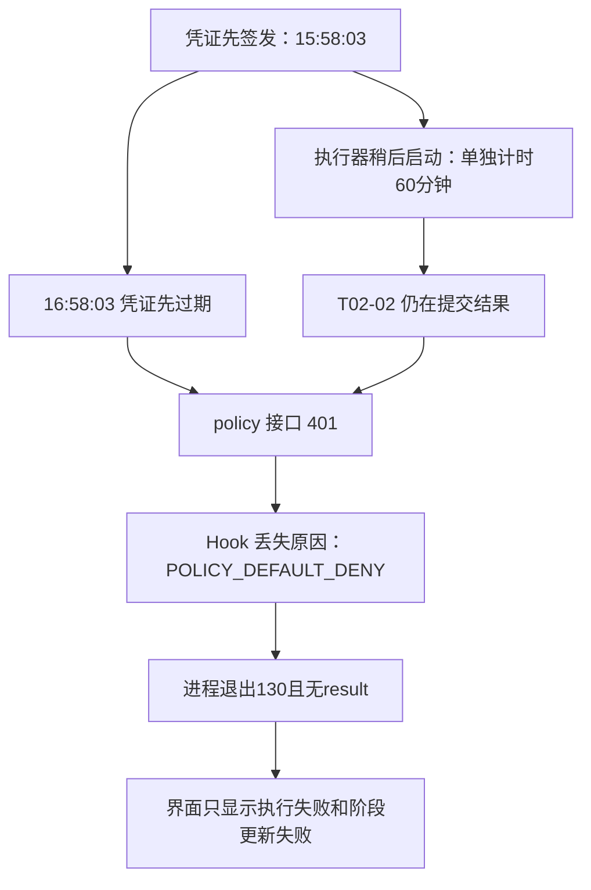
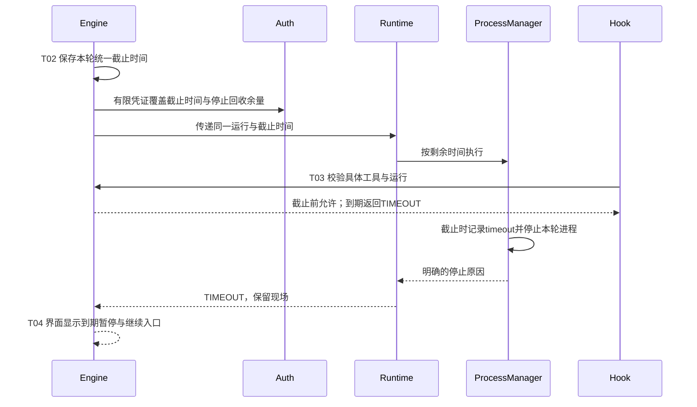
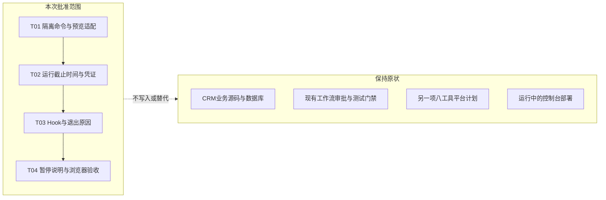
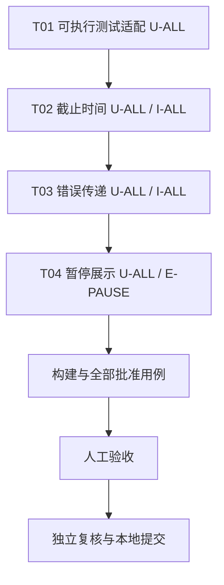
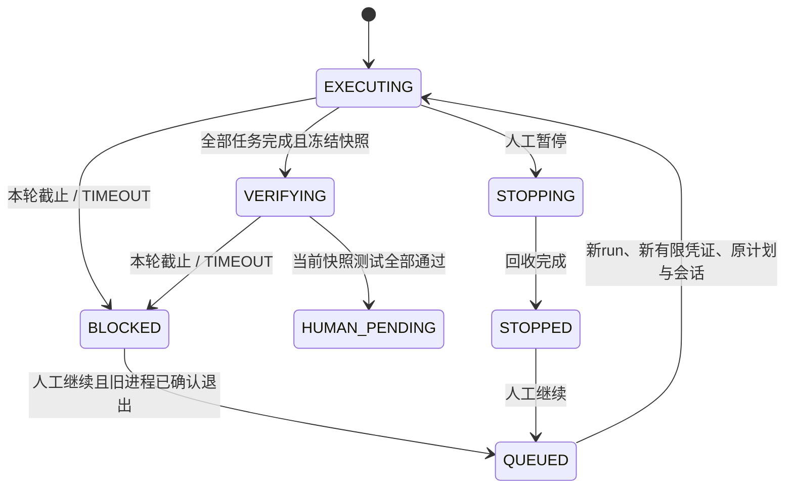

# DevFlow 阶段更新报错修复计划

结论：统一运行截止时间，避免worker凭证先于运行失效；保留Hook和进程的真实错误原因，界面明确显示“执行暂停”及继续入口。本轮只提交修复合同，批准后由执行器在独立worktree实施。

## 现状与根因

证据：原工作流事件3116/3120/3123/3124，凭证expires=2026-09-14T08:58:03.057Z，进程code=130。合成401经现行Hook产生POLICY_DEFAULT_DENY；没有result的130经observeAgy产生EXECUTION_FAILED。阶段迁移已成功落库，错误发生在之前。
保持：失败任务不能凭声明成为完成，未跑测试仍是0通过。

## 目标时序

T02将截止时间写入run，凭证只覆盖运行加有限回收余量；worker检查截止时间，余量不授予继续执行权限。T03传递固定安全错误码。达到既有60分钟时明确暂停，用户继续后创建新run；不增加自动重试或无限续期。

## 修改边界

仅DevFlow后端、Hook、进程适配与现有活动投影，外加本工作流执行测试适配。没有CRM源码或数据库写入、控制台部署或八工具平台实现。

## 任务依赖

按T01至T04依次实施；完成检查是实现定位辅助，最终需原始测试报告和人工验收。

## 状态语义

截止是明确的TIMEOUT阻塞，不是工作成功。保留手动继续、已核验实现与原任务分母；恢复沿用现有证据失效规则，重新跑当前快照测试。

## 需求
- R01：一个运行只有一个绝对截止时间，准备耗时计入预算，凭证不提前失效。
- R02：Hook拒绝、超时、人工停止分别可读，历史信息不足不得猜测。
- R03：保留安全隔离与证据门禁，旧run不可恢复权限，继续必须沿用已批准工作流规则。
- R04：提供可执行的固定命令、真实报告和隔离浏览器验收。

## 环境决定
项目配置保持56e7470c858200837c6968744df9f08155e9e55a1277477f4587fee57add398b。入口基线d5bc298ac5be27a28a9a641be8ef583486da2c1a，新worktree。主工作区并发出现25a1f919视觉改版提交，当前分支不覆盖；集成此变更时需重验。现有commands指向未落地的scripts/devflow/verify.mjs，T01补齐最小适配；不重新登记项目影响另一项待审批计划。preview只使用本工作流动态端口、独立数据目录和identity，不启动真实模型、CRM或现行4810控制器。

OpenTabs豁免理由：当前唯一固定场景portable-console只覆盖未来八工具设置，不对应本故障且基线尚未实现；改登记会改变另一计划配置哈希。使用真实Edge的Playwright隔离页面验收，结合真实Hook/API和进程集成测试覆盖本次端到端链路。此豁免随本计划审批。

## 实施合同
### T01 补齐本工作流的命令、报告与隔离预览适配
需求：R04；依赖：无；测试：U-ALL、I-CERT。
输入：已登记bootstrap/build/unit/integration/e2e/certification/preview命令，当前缺少verify.mjs；Node与锁文件均已存在。
文件：`scripts/devflow/verify.mjs`、`scripts/devflow/stage-preview.mjs`、`scripts/devflow/stage-playwright.config.ts`、`scripts/devflow/stage-certification.test.mjs`、`tests/unit/stage-adapter.test.ts`。
实现：实现verify.mjs固定子命令分派，不改变项目登记。bootstrap仅用npm ci --ignore-scripts=false按锁安装；build执行现有npm run build；unit执行tests/unit全部用例，integration执行本计划新增集成文件及已有hook.test.ts，均用Vitest JSON原始报告写DEVFLOW_REPORT_PATH，否则按已登记.report路径；e2e使用专用stage-playwright.config.ts，仅匹配run-deadline.spec.ts，Edge单worker和无重试，输出Playwright JSON；certification用node:test真实执行typecheck与git diff --check，输出原始JUnit。preview在DEVFLOW_PORT上启动真实buildServer+独立Engine和SQLite，状态只放DEVFLOW_DATA_DIR，设置x-devflow-identity=DEVFLOW_IDENTITY，使用真实dist/web静态资源；不得连接4810或读原数据库，预览不dispatch真实模型。缺dist则先正常构建，命令失败即失败。专用E2E使用DEVFLOW_BASE_URL连接该隔离预览，浏览器测试只路由合成故障API数据。预览退出正常关闭app/store；未提供隔离环境变量时拒绝启动。
完成：全部登记子命令可运行且报告来自真实测试；预览端口/状态/identity严格绑定本工作流。
保持：保持60分钟配置与人工继续语义；保留run/workflow隔离、撤销、批准范围、completion_checks、快照测试、人工验收和独立复核；不改CRM或另一项平台计划，不升级依赖、不部署控制台。
停止：发现需要修改批准路径外文件、放宽权限、改项目配置、触及CRM数据或现行控制台部署时停止并记录具体证据；不得用补字符串或伪造报告代替实现与验证。

### T02 统一本轮截止时间、凭证与超时停止原因
需求：R01、R03；依赖：T01；测试：U-ALL、I-ALL。
输入：60分钟凭证早于进程停止的复现；Run、Principal与ManagedProcess当前合同。
文件：`packages/contracts/src/index.ts`、`packages/core/src/auth.ts`、`packages/core/src/engine.ts`、`packages/runtime/src/runtime.ts`、`packages/process/src/manager.ts`、`tests/unit/run-deadline.test.ts`、`tests/integration/run-deadline.test.ts`。
实现：Engine.block同时给本次StateChanged附加脱敏的blocker.code/message，其他迁移不携带旧原因。Run增加可选deadline_at（Unix毫秒，旧记录兼容），执行run开始时只计算一次deadline=Date.now()+agent_minutes*60000并持久化。worker凭证有效期覆盖此截止时间加有限停止余量max(stop_seconds*1000,3000)，不使用无限期凭证或滑动续期。Engine.worker先校验原有身份与run状态，再对具有deadline_at的当前run校验Date.now()<deadline，否则抛TIMEOUT并拒绝新操作；旧run无字段保留原行为。LocalRuntime将相同deadline传给ProcessManager（新增可选deadline_at），准备耗时从预算扣除；启动前已到期就返回TIMEOUT，不启动进程。ProcessManager装定时器时按绝对deadline减Date.now，未提供字段继续timeout_ms相对语义；到期先记录termination_reason=timeout再停止。completion和lifecycle可选携带termination_reason；人工stop记录manual；首次停止原因胜出，已退出不改写，清理timer。恢复保持既有resumeApproved检查，复用原workflow/会话/批准计划但签发新run与有限凭证；旧run请求永远拒绝。测试用虚拟时钟/短时受管进程覆盖边界，不等待60分钟，不以退出码130判超时。
完成：截止前凭证不抢先过期，截止后新操作明确TIMEOUT；进程与凭证使用同一预算，人工停止与超时可区分，恢复与撤销行为不退化。
保持：保持60分钟配置与人工继续语义；保留run/workflow隔离、撤销、批准范围、completion_checks、快照测试、人工验收和独立复核；不改CRM或另一项平台计划，不升级依赖、不部署控制台。
停止：发现需要修改批准路径外文件、放宽权限、改项目配置、触及CRM数据或现行控制台部署时停止并记录具体证据；不得用补字符串或伪造报告代替实现与验证。

### T03 传递Hook鉴权原因及执行超时原因
需求：R02、R03；依赖：T02；测试：U-ALL、I-ALL。
输入：Hook非2xx默认拒绝；observeAgy无result时丢失停止原因；API现有error.code/message。
文件：`packages/bridge/src/hook.ts`、`packages/adapters/agy/src/session.ts`、`packages/runtime/src/errors.ts`、`tests/integration/hook.test.ts`、`tests/unit/run-failure.test.ts`、`tests/integration/run-failure.test.ts`。
实现：Hook仅对登记worker工具请求policy；仅在2xx且JSON.allowed===true且tool匹配时允许。非2xx读取限长JSON的白名单错误码：TIMEOUT=>POLICY_RUN_TIMEOUT，UNAUTHORIZED=>POLICY_UNAUTHORIZED，RUN_REVOKED=>POLICY_RUN_REVOKED；其余HTTP拒绝用固定POLICY_HTTP_ERROR，网络/超时/非法响应为POLICY_CHECK_FAILED。保持deny默认与现有permissionOverrides；不输出token、Authorization或任意响应全文。observeAgy优先处理显式timeout停止原因，抛TIMEOUT，说明本轮达到配置时限、现场保留并可继续；idle timeout也使用FlowError TIMEOUT。协议/CWD/模型不匹配等既有明确错误保留，不能被最后一次工具错误覆盖。无显式停止原因时保持现有分类，绝不把所有130或POLICY_UNAUTHORIZED归为模型登录过期。结构化失败详情带安全的退出码与原因；保持原始脱敏日志供查看。
完成：401、轮次撤销、运行到期、网络异常能区分且仍默认拒绝；到期退出不再退化成通用EXECUTION_FAILED或MODEL_AUTH。
保持：保持60分钟配置与人工继续语义；保留run/workflow隔离、撤销、批准范围、completion_checks、快照测试、人工验收和独立复核；不改CRM或另一项平台计划，不升级依赖、不部署控制台。
停止：发现需要修改批准路径外文件、放宽权限、改项目配置、触及CRM数据或现行控制台部署时停止并记录具体证据；不得用补字符串或伪造报告代替实现与验证。

### T04 显示明确暂停原因并验证完整恢复边界
需求：R02、R03、R04；依赖：T03；测试：U-ALL、E-PAUSE。
输入：Engine StateChanged现有payload、blocker、执行面板与恢复入口；T02/T03的TIMEOUT和policy原因。
文件：`packages/presentation/src/activity.ts`、`tests/unit/logs.test.ts`、`tests/e2e/run-deadline.spec.ts`、`docs/test/DevFlow阶段更新报错修复验证结果.md`。
实现：T02修改Engine.block/transition时给本次BLOCKED事件附加脱敏的blocker.code/message（仅本次已知阻塞，不把旧blocker带入其他状态）；本任务投影该事件为执行暂停，摘要使用具体安全原因。历史事件无原因保留执行已暂停等待处理，不从其他run猜原因。工具错误摘要保留任务ID并显示固定中文原因，不泄露原始凭证。E2E用真实Edge和实际构建页面，合成42细项/6已完成/81测试0通过及T02-02失败，断言到期暂停文案、明细保留、继续按钮存在且浏览器未自动调用恢复或审批接口；另测试人工停止与历史未知事件不误报超时。完整恢复正确性由I-ALL真实Engine集成验证。记录本分支当前快照的命令、原始报告、全部用例、图与限制至验证结果文档，不运行真实CRM恢复，不替用户验收。
完成：用户看得到到期暂停原因和继续入口，42/6与81/0统计未被失败事件改写；历史事件不编造原因；基线与新增回归通过。
保持：保持60分钟配置与人工继续语义；保留run/workflow隔离、撤销、批准范围、completion_checks、快照测试、人工验收和独立复核；不改CRM或另一项平台计划，不升级依赖、不部署控制台。
停止：发现需要修改批准路径外文件、放宽权限、改项目配置、触及CRM数据或现行控制台部署时停止并记录具体证据；不得用补字符串或伪造报告代替实现与验证。

## 测试合同
同一命令只运行一次，U-ALL汇集全部单元用例，I-ALL汇集Hook和运行集成用例。
### U-ALL
层：unit；命令：unit；超时：600秒。
用例：`DF-STAGE-U01 rejects missing isolated preview environment`；`DF-STAGE-U02 one deadline includes preparation time`；`DF-STAGE-U03 credential grace never authorizes expired run`；`DF-STAGE-U04 first termination reason wins`；`DF-STAGE-U05 policy reasons stay distinct from model auth`；`DF-STAGE-U06 timeout without result retains TIMEOUT`；`DF-STAGE-U07 exit 130 alone does not prove timeout`；`DF-STAGE-U08 blocked event explains timeout without inventing history`。
操作：用隔离临时目录调用适配器，删除必需的环境变量后启动preview。；虚拟时钟覆盖截止前1ms、到期0ms、余量窗口，模拟准备耗时及停止竞争。；对模拟ManagedProcess分别送入显式timeout、只有130、协议失败；校验脱敏分类。；投影含blocker及历史不含blocker的StateChanged，混合不同run。
断言：缺少端口、数据目录或identity即拒绝；不访问默认4810。；单一绝对截止时间；到期后工具拒绝；人工与timeout首因稳定。；超时保留TIMEOUT；不从130猜原因；无内部凭证泄漏。；暂停原因来自当前事件；旧历史使用中性文案；任务/测试计数不变。

### I-ALL
层：integration；命令：integration；超时：600秒。
用例：`DF-STAGE-I01 policy rejects at shared deadline before token expiry`；`DF-STAGE-I02 process timeout and manual stop remain distinct`；`DF-STAGE-I03 resumed run rejects old worker`；`DF-STAGE-I04 hook preserves policy failure categories`；`DF-STAGE-I05 hook rejects malformed or mismatched allow response`；`IT-09 Windows Hook preserves Chinese JSON and enforces live run revocation`。
操作：使用隔离SQLite及真实Engine/API，虚拟时钟注入60分钟截止；真实短时进程测试超时/人工停止；受控runtime执行恢复流程。；以真实Windows Hook进程连接随机端口模拟policy响应：401/403/TIMEOUT/500/非JSON/超时；重复原撤销回归。
断言：到期前允许，到期后TIMEOUT且无任务证明写入；只停止本run；新run/凭证有效，旧凭证和旧run拒绝；不自动提交或跳过测试。；全部失败为deny；固定安全原因准确；仅allowed且工具匹配的2xx允许。

### I-CERT
层：integration；命令：certification；超时：600秒。
用例：`test DF-STAGE-C01 typecheck and whitespace pass`。
操作：node:test测试真实调用npm run typecheck与git diff --check并检查返回码；Node内建JUnit报告写批准路径。
断言：两个实际命令都为0才通过，未运行和失败不能输出passed。

### E-PAUSE
层：e2e；命令：e2e；超时：600秒。
用例：`DF-STAGE-E01 timeout preserves progress and manual continuation`；`DF-STAGE-E02 manual and historical pauses are not mislabeled`。
操作：隔离预览中打开真实Edge页面，使用稳定合成工作流和事件，查看任务进度、执行日志、暂停提示与继续按钮。
断言：显示明确到期原因；仍为6/42和0/81；未自动恢复/审批；人工停止和无原因历史不显示编造的到期解释；保存截图与trace。
## 交付与当前状态
现有7项相关基线测试通过，隔离复现已完成；这不是修复后测试证据。计划批准后实施、构建、按合同验证，人工验收后由服务触发独立复核与本地提交。现行控制台的部署及CRM恢复不在此次自动实施范围；不得手改现有数据库状态来消除报错。
