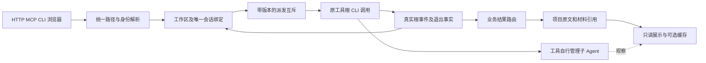
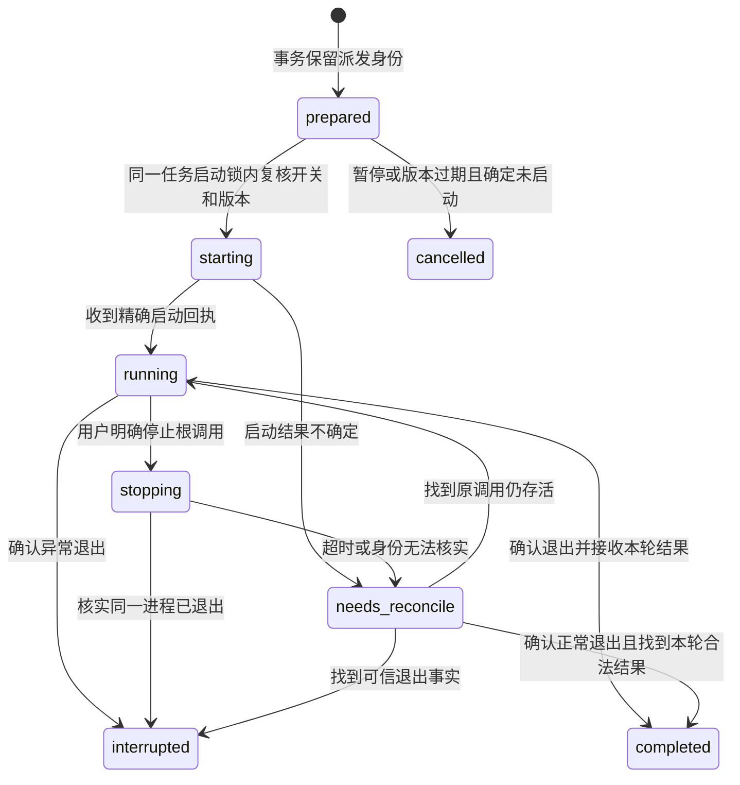
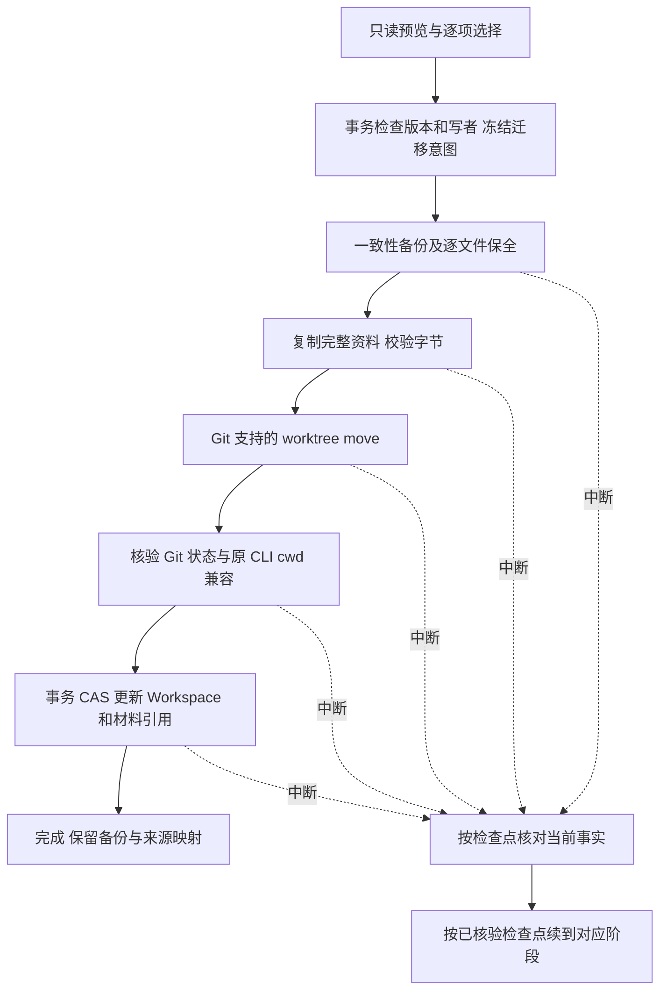
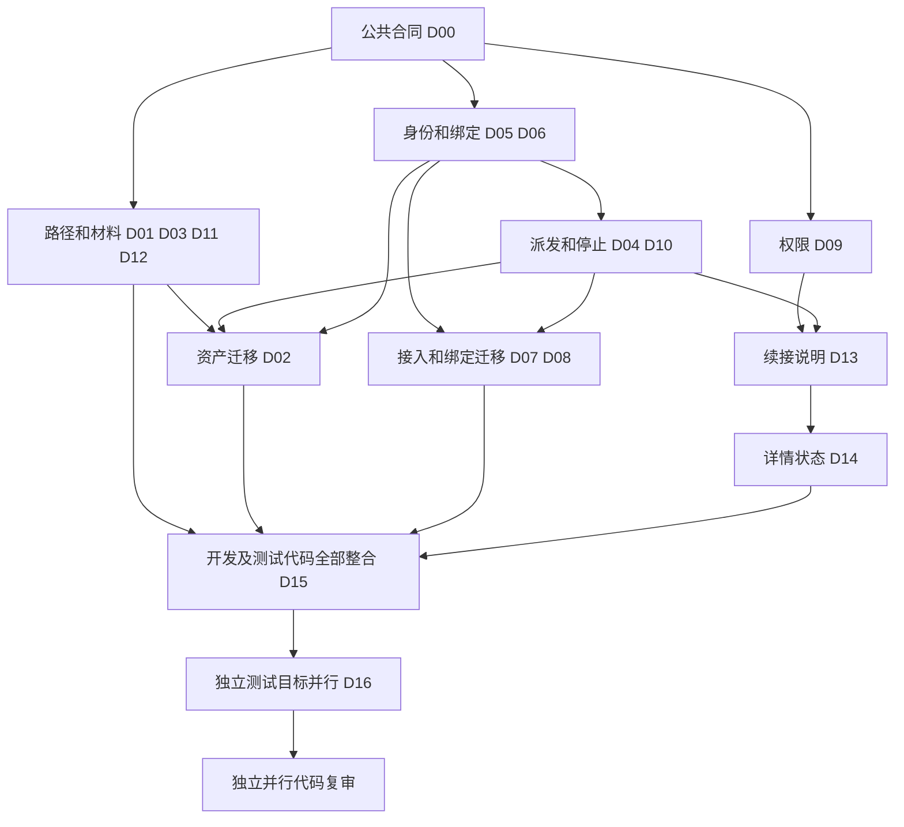

# DevFlow 项目工作区与 CLI 持久会话代码质量修复计划

日期：2026-09-21。状态：**整改设计已交付，开发、测试及真实 CLI 验证均待执行模型完成**。

本文关闭上一轮审查确认的 14 项代码问题，不宣称这些问题已经修复。主审和复审模型只检查代码质量；开发、测试代码、测试运行、故障定位和定向重跑全部由执行模型及其子 Agent 负责。本文中的“必须验证”是给执行模型的指令，不是本次规划已经完成的验证。

## 1. 执行依据、基线与边界

### 1.1 唯一实施依据

本文与 [原统一方案及开发计划](DevFlow项目工作区与原生可见会话统一方案及开发计划-20260920.md) 共同构成执行依据。原文的 `NV-R01–R14`、`NV-D00–D19`、`NV-U01–U11`、`NV-I01–I16`、`NV-E01–E18` 编号全部保留。本文将已发现缺陷细化为 `CW-F01–F14`，开发项为 `CW-D00–D16`，验证项为 `CW-U* / CW-I* / CW-E* / CW-L* / CW-R*`；不得用新编号取消原场景。

冲突处理顺序：用户后续明确指令 > 本文针对 14 项问题的具体修正 > 原计划其余条款。原计划中的桌面端方案已被 CLI 路线覆盖：`NV-R05` 与 `NV-E06/E07/E13` 继续延期，既不计通过，也不是本次阻塞条件。原计划本期保留 13 项需求、42 个测试场景。

执行模型必须完整读取这两份正式文件。禁止另建或改写 `implementation_plan.md`、客户端计划工件、局部实施方案来替代本文。允许在项目 `docs/process/` 下维护“执行进度（非计划）”：只记原编号、实际实现、测试状态和未完成原因。发现不可实施的技术冲突时，提交冲突章节、代码位置、具体事实和影响，暂停受影响部分交规划角色修订；其他独立任务继续。不因普通实现问题重复请求批准。

### 1.2 代码基线及工作目录

| 项目 | 本次调查值 | 执行要求 |
| --- | --- | --- |
| 计划所在主工作区 | `C:\Code\system-handle` | 本次仅新增本文；不能把此处直接覆盖到实现工作树 |
| 待整改实现工作树 | `C:\Code\system-handle-subagent-viz` | 开发从这里现有实现继续，先保全未提交内容 |
| 实现分支 | `zxw/subagent-conversation-ui-20260920` | 不重置、不清理、不重新创建同名分支 |
| 实现 HEAD | `df18ee4d357fa939645be16fd233a1162bddbebe` | 有已暂存、未暂存及未跟踪内容；只看 HEAD 不能代表审查对象 |
| 主工作区 HEAD | `004b2ea153a80f94007765e996d936db56d74c1c` | 存在后续模型/账号/轻量化改动；最终整合要保留两侧语义 |
| 主工作区原计划 SHA256 | `13857248AE3E97DCCB496F6506E8604D6A49FE6144EEB7CD12B2AC0F23C4262A` | 记录实际读取版本；实现工作树副本的完成声明不改变本文待整改事实 |

执行前读取 `git status --short`、`git diff --stat`、`git diff --cached --stat`、`git worktree list --porcelain`，记录当前实际状态。出现后续合法修改时按函数和调用链重新定位，不能强行恢复上述快照。禁止 `reset --hard`、`clean`、整仓格式化、覆盖用户配置、自动迁移真实任务或自动合并主分支。

本次抽样源码 SHA256（用于识别调查版本，不作为产品运行门槛）：

| 相对实现工作树的路径 | SHA256 |
| --- | --- |
| `packages/core/src/engine.ts` | `0E45F9912A3CE47D9B32A240DE9F55C53F18AABA36921E9F69841DFDC140FAE2` |
| `packages/git/src/delivery-coordinator.ts` | `A7EDC81C82EB3A6FF731EABCBB66CE803C6726CF55EE4F02CFF30A2092B992E8` |
| `scripts/migrate-project-assets.ts` | `2D7872E6C707F6532E47D5381A2FC179BBA5B6B51F995EDA3A78F5722F480C9E` |
| `scripts/migrate-cli-session-bindings.ts` | `875FD388E14630279BBFF7E8A244985B415D6D1EA6EF6A0D1A70AF3EA06D867D` |
| `apps/api/src/server.ts` | `B8653F2996DF278111690A1F0CF8107A9E72757AC3AC6D9FE1761EAC9D700F82` |

### 1.3 必须保持的产品语义

1. DevFlow 负责调度工具的根 CLI 调用、保存绑定、显示已有进度。工具内部的子 Agent 由工具管理；DevFlow 不逐个启动、停止、重试或接管子 Agent。
2. 默认使用用户选择的现有工作区。只有明确选择隔离开发才创建 worktree，位置归项目。`owned` 只说明创建来源，不能授权删除。
3. 正式计划、审核、整改和持久证据归任务实际项目工作区；平台保存引用与可重建缓存。不新增文档格式、材料完整性、测试证明或角色切换门槛。
4. 同任务、同工具、同实际模型及同身份域续接同一已确认根会话；角色、profile 名称、强度、Run 变化不单独产生新根。不同任务、账号、工具或工作区不能串绑。显式临时 aside 保持既有独立只读语义。
5. 停用自动调度与确认当前调用退出是两个条件。关闭网页不停止调用；停服务可能中断受管进程，但不能删除代码、CLI 历史及材料。
6. 原审批、两道质量复核、人工功能验收、返修计数、配额/账号机制不改。环境、身份、权限、缓存或测试运行故障不能计为一次代码质量失败。
7. 本文不授权部署、清理历史用户数据、停止生产服务或迁移真实任务。开发验证使用隔离实例；真实历史迁移仍要求逐任务明确选择。

## 2. 14 项问题与整改闭环

以下位置是审查时的函数落点，执行以当前函数为准，不依赖可能移动的行号。

| 问题 | 优先级、触发和后果 | 主要落点 | 开发项 | 原计划关联 |
| --- | --- | --- | --- | --- |
| CW-F01 | P1：交付合并成功后自动删 worktree/分支，原 CLI 的 cwd 随之消失 | `delivery-coordinator.ts` 的交付成功路径、cleanup | D01 | NV-R11/R13；D16；E15/E17 |
| CW-F02 | P1：迁移只改 Workspace.root，不移动 Git 工作树；多份正文写同一路径且只保留第一份 | `migrate-project-assets.ts` | D02 | NV-R14；D18；I15/E18 |
| CW-F03 | P1：从无 markdown 的 NativePlan 生成空正式计划；真实规划、审核和整改正文仍仅在平台目录 | `engine.ts`、`document-service.ts`、`plan-review.ts` | D03 | NV-R12；D17；I14/E16 |
| CW-F04 | P1：调度开关只写 API 记录，生产派发不消费；占用查询看不到实际 CLI | `cli-dispatch.ts`、`profile-runtime.ts`、Engine/outbox/recovery | D04 | NV-R09/R13；D08/D19；I08/E11 |
| CW-F05 | P1：旧 profile/purpose 指针优先于统一绑定，冲突被吞且继续双写 | `profile-runtime.ts`、`execution-session-store.ts` | D05 | NV-R03/R04/R07/R08；D03/D07/D11 |
| CW-F06 | P1：host/client/account/model 使用固定 default，实际模型、账号和配置域变化后复用错误根 | `profile-runtime.ts` 身份构造 | D06 | NV-R03/R04/R07/R10；D01/D03/D05/D06 |
| CW-F07 | P1：adopt 信任请求中的身份/目录，同一原生会话可被多个任务认领 | `server.ts`、`execution-session-store.ts` | D07 | NV-R07/R08/R09；D03/D07；I05/I08 |
| CW-F08 | P1：历史迁移硬编码 AGY/default、取首个候选，缺选择/CAS/真实 CLI 入口 | `migrate-cli-session-bindings.ts` | D08 | NV-R08/R14；D11；I11/E10 |
| CW-F09 | P1：移除 Kimi --plan 后，只读角色变成普通可写调用 | `sdk/src/invocation.ts`、Kimi adapter、profile-runtime probe | D09 | NV-R10；D13；I12/E14 |
| CW-F10 | P1：stop 的空操作被当成已退出；任一子会话回执能把整树标暂停并逐子 Agent 补停 | runtime/ProcessManager/`conversation-control.ts` | D10 | NV-R09/R13；D08/D19；原 §7.4 |
| CW-F11 | P2：预览和创建丢字段、ID/分支策略不一；从目录名猜 source_root | 创建 API/service、GitManager、`workspace-paths.ts` | D11 | NV-R02/R11；D02/D16；I13/E15 |
| CW-F12 | P2：项目内嵌套 worktree 被源扫描递归统计 | `fingerprint.ts`、`source-change.ts`、native observer | D12 | NV-R11；D16；U08/I13 |
| CW-F13 | P2：手动续接入口/参数错误，字符串转义会执行 shell 表达式，接管提示条件错误 | `resume-instructions.ts`、API | D13 | NV-R10/R13；D05/D06/D19；U11/E17 |
| CW-F14 | P2：切任务后绑定和命令仍来自上个任务，迟到响应可串页 | `CliSessionDetails.tsx`、`main.tsx` | D14 | NV-R07/R09；D10/D19；E11 |

根因及目标链路如下。修复必须接通真实入口，不能仅新增一个没有生产调用者的 helper。



## 3. 公共合同：CW-D00

负责人为执行主 Agent，先冻结本章类型与接口，再让独立开发并行。修改 `packages/contracts/src/session-binding.ts`、`packages/contracts/src/config.ts`、现有 Run/Workspace/创建请求合同、Store 读接口及对应调用方类型。公共导出文件由主 Agent 单独整合。不要建立第二套工作流、聊天数据库或常驻进程管理器。

### 3.1 会话身份、状态和唯一性

统一键的有序字段固定为：`workflow_id / adapter_id / host_id / client_scope_id / provider_account_scope / canonical_model_id / workspace_identity`。使用版本前缀及固定字段顺序的 JSON 数组序列化后 SHA256 作为键，禁止直接 `join('::')`。身份字段不得含密码、token、完整认证响应或密钥哈希。

- `host_id` 来自持久安装/宿主身份，不从 PID 或本次 Run 生成。`client_scope_id` 表示真实 CLI 会话存储/配置域，不能固定为 `default`；同工具不同存储域必须区分。
- `provider_account_scope` 来自工具可核验的非敏感 provider/account 标识或既有账号服务；凭据轮换但账号没变时应稳定。无法确认时保留 unknown 并列缺项，不能把路径名称当成账号证明。
- `canonical_model_id` 是实际已解析模型，不能拿 `native-config`、`default` 或显示昵称当实际模型。强度与角色不进键。
- `workspace_identity` 是按 repo_id 排序后的完整仓库映射的版本化摘要：规范 source_root、actual_cwd、Git common-dir 身份；全部路径经平台对应的大小写/realpath/Junction 规则规范化。不能只取第一份原始 root。
- `reserved` 允许尚无 `conversation_id`；`bound` 必须有精确根 ID；`needs_reconcile/unavailable` 可无 ID，但必须有具体原因及原 dispatch 引用，从 bound 转入时必须保留已知 ID；`retired` 不能派发。首次启动到 init 之间崩溃必须能表达“可能有原生会话但 ID 未知”。用状态可辨识 schema 表达，不以空字符串冒充有效 ID。
- 同一个原生根的所有权键为 `adapter_id / host_id / client_scope_id / provider_account_scope / conversation_id`，不含 workflow_id 和模型。用现有 Store 的专用 owner 索引实体和 `BEGIN IMMEDIATE` 事务约束一个根只能有一个任务所有者；迁移发现历史重复时报告冲突，不偷偷挑一个。无需另建会话数据库。
- 身份确认后根 ID 不可被普通更新覆盖；相同 ID 的重复事件幂等，不同根 init 是 `CONVERSATION_MISMATCH`。只有 adapter 已标明 parent/root 关系的事件才能判为子事件，不能把“ID 不同”一概当子 Agent。

为每个 workflow 记录绑定策略版本：未迁移旧任务继续明确的 legacy 兼容读取；新任务使用 unified。迁移成功后该任务使用 unified，不再运行双权威写入。部分迁移后，选中的身份使用新绑定；同键歧义中明确未选的旧根只保留非权威历史；其他未处理身份保存 migration_pending，命中时拒绝派发并继续 D08 预览，不能回退旧指针或创建替代根。无法解析的候选身份也保留缺项，不能据此断言某身份从未使用。一个 workflow 多个工具/模型不能因已有一个新绑定就全部跳过。

### 3.2 派发、占用与停止合同

复用既有 `workflow_dispatch_control`、Run、outbox、`process_record`、`cli_dispatch_record`。调度控制增加单调 revision/epoch，修改时 CAS。读取无记录时返回兼容默认视图，不落库、不产生事件。

`cli_dispatch_record` 最少冻结 `dispatch_id/run_id/workflow_id/control_revision/expected_conversation_id/host_id/process_identity/state/event_cursor/result_id`，并按 strategy 区分身份引用：unified 冻结 `binding_id/generation/binding_revision`；legacy 冻结 `legacy_source_ref/source_entity_version/resolved_identity`。legacy 只能通过只读兼容解析选择唯一可核验的旧根，不隐式创建 binding 或改变策略；两分支都走同一 owner/控制/占用/进程机制。legacy 根事件只写本轮 Run/dispatch 事实，旧来源保持只读；歧义、无精确 ID 或身份未知则不 spawn，转 D08。`process_identity` 含 PID、真实启动时间、Host 与既有 process_record ID。禁止继续用 `as any` 绕过 `hostId/host_id` 拼写或状态约束。

占用对外使用 `idle | active | unknown`，兼容布尔字段只能由此派生；`unknown` 不能派生为空闲。prepared/starting/running/stopping/needs_reconcile 均不能允许另一写者。历史 process_record 未被新表覆盖时必须参与保守判断。



completed/interrupted/cancelled 是终态；`needs_reconcile` 不能以超时自动释放或重发。正常退出但结果归属未知仍待核对；异常退出或确认停止进入 interrupted，不能把旧成功结果当本轮完成。找到合法结果只按原 result ID 补消费，不重新执行模型。图中完成不等同业务审批或人工验收完成。

仅关闭调度返回控制状态，不返回“进程已退出”。停止结果区分 `requested | confirmed_exited | confirmed_not_started | unknown | not_owned`。有调用者带精确 dispatch/process identity；只有同一进程退出事件或可核验历史事实才能 confirmed_exited。confirmed_not_started 只用于控制锁/事务内确认没有已认领 starting、在途准备进程或未核对旧 process/job 的场景，不能凭 active Map 空推断。确定没有调用或已退出后才能解除受管占用；无法枚举外部原工具写者时显示未知并要求用户明确交回，不凭空宣布空闲。

### 3.3 路径与材料合同

创建请求复用原 `request_id` 幂等键。固定候选 workflow ID 算法为 `wf-` 加 `SHA256('devflow:create:v1\n' + request_id)` 前 32 位十六进制；已有持久创建意图优先返回其中 ID。全入口使用同一服务，不各自造 UUID。相同 request_id 不同语义请求返回 `IDEMPOTENCY_CONFLICT`。

共享解析结果逐 repo 包含 `repo_id/source_root/actual_cwd/worktree_path/branch_name/path_source/path_policy_version`。仅 worktree 模式消费 worktree_path。路径优先级为请求明确值 → 已登记项目约定 → `<source_root>/.worktrees/<workflow_id>/<repo_id>`。单仓库简写在入口规范化成同一 repo 映射；多仓库禁止一个路径复用给多个 repo。

项目约定在 `packages/contracts/src/index.ts` 的 `Project.repositories[]` 新增可选 `worktree_base_path`：它是该 repo 的 worktree 基目录，目标追加 `<workflow_id>/<repo_id>`；已有明确配置导入时转换为此字段。不得根据扫描到同名目录推断约定。请求 `worktree_path` 是完整最终路径，不再追加。全局 `Config.workspace_root` 只保留历史兼容识别，不参与新默认值。

同一 Project 合同增量增加 `primary_repo_id`（单 repo 可默认为唯一项；多 repo 必须沿已有明确映射，缺失时相关定位报歧义）及 `repositories[].material_paths?: {plan_dir, review_dir, repair_dir, process_dir, evidence_dir}`，目录为经校验的项目相对路径。指定原文/design_ref.file_ref、模型依项目规则提交的实际 locator 仍优先；不建设自然语言 AGENTS 规则解析器。旧项目兼容读不能为补这两个字段自动写库。

正式材料引用沿用现有材料条目，增量字段为 `repo_id/workspace_id/path/kind/revision/source_hash/cache_path/status`；`path` 是项目相对路径，外部已有合法 locator 保留原类型。不要把外部 URL 当成本地可写路径。source_hash、迁移和防覆盖 hash 均为原始字节 SHA256；design_ref.content_hash 保持现有 LF 规范化文本算法，两者不混用。hash 用于定位/防覆盖，不作为质量通过凭证。

### 3.4 API、错误及只读原则

沿用现有鉴权和任务授权；所有 mutation 检查 URL workflow 与对象所有者一致。跨任务对象返回既有不可访问语义，不能泄露其会话/路径。所有 GET、preview、命令查看不得启动模型、创建绑定、增加 revision、写迁移检查点或启动调度。

用于 CAS 的版本必须由只读 API 明确返回，前端不从时间戳猜测：session-bindings 列表返回 workflow_version、binding revisions、binding_strategy 及 pending 摘要；dispatch-control GET 返回 workflow_id、revision、dispatch_enabled、writer_state。现有 dispatch-control POST 固定输入 `{request_id,expected_control_revision,dispatch_enabled,reason?}`，响应为持久后的控制状态和 replayed；同请求重放先于版本校验。preview/repair/资产迁移响应同样返回下一次操作所需的版本，不要求调用者直接读取 SQLite。

| 语义 | 处理与失败后允许的状态 |
| --- | --- |
| `SESSION_IDENTITY_UNRESOLVED` | 当前正式调用的身份缺项；列非敏感缺项，不 spawn、不新根、不增质量失败次数 |
| `SESSION_IDENTITY_UNVERIFIABLE` | adopt/迁移缺可信来源；不生成 bound，保留原记录 |
| `CONVERSATION_MISMATCH` | 原始事件保留诊断，绑定不改，本轮不推进 |
| `SESSION_ALREADY_OWNED` | 原生根已被其他任务认领；双方不改 |
| `REVISION_CONFLICT / IDEMPOTENCY_CONFLICT` | 返回冲突及可安全重取的资源版本；不“最后写入胜出” |
| `DISPATCH_DISABLED / WORKFLOW_NOT_RUNNABLE` | 停用/STOPPED/人工等待等既有业务状态禁止派发；不消费为已成功执行 |
| `PROCESS_IDENTITY_UNKNOWN` | 保留占用未知，不能自动重启/误杀/放开手动启动 |
| `READ_ONLY_UNSUPPORTED` | 工具缺真实只读能力，该角色不 spawn；可写角色不受无关限制 |
| `WORKSPACE_PATH_CONFLICT / MATERIAL_CONFLICT` | 不覆盖双方；说明精确路径和恢复操作 |
| `MIGRATION_STALE / MIGRATION_NEEDS_RECONCILE` | 重新预览或依据检查点恢复；不能改根后直接报完成 |
| `RESUME_UNSUPPORTED` | 返回原因和已知 ID/cwd；无可执行命令，不编造 flags |

错误码接入现有 FlowError/响应映射，不返回包含密钥的原工具 stderr。必要 HTTP 映射：输入 400、授权沿用原规则、版本/占用/归属冲突 409、当前能力或身份不可用 422；内部非预期异常保留既有 500 路径。

## 4. 项目资产与路径修复

### CW-D01：交付保留工作树和分支（关闭 F01）

依赖 D00；主要文件 `packages/git/src/delivery-coordinator.ts`，并追踪 Engine 任务移除、维护、卸载的同类调用。

1. 从成功合并/交付、移除任务、停用及卸载路径移除 worktree remove、branch delete 和项目材料递归删除。正常交付记录结果后结束；不把 cleanup 改成异步继续删除。
2. 保留既有单独清理功能，但必须由独立明确清理请求触发：精确 workspace ID、Git 登记路径、分支、预览版本和本次选择缺一不可。`owned`、`.worktrees` 前缀、`devflow/` 分支名均不构成用户清理意图。旧 `/cleanup/retry` 无本次新选择时只能读状态，不能借旧失败记录继续删；默认模板移除 `cleanup_owned_workspace` 自动步骤。历史 `CLEANUP_PENDING` 若已有全部成功整合回执，恢复为“交付已完成、工作树保留”，不重试清理、不重跑模型。部分仓库尚未整合则保留原冲突/部分完成流程。
3. 清理前重新核对活动/未知写者、HEAD/index、暂存/未暂存/未跟踪内容及忽略但需保留的材料引用。有唯一证据或用户变更时拒绝执行并列具体原因，不用 `--force` 绕过。不要在本次整改调用真实清理。
4. 成功/失败/合并冲突都保留原 cwd；交付后的相对材料仍指向这份 worktree，不能悄悄改到源根。分支可正常被用户原工具继续使用。

完成输出：正常流程没有自动删除调用链，显式清理依然可区分。必须验证 U01、I01、E01、L03。

### CW-D11：预览与创建共用确定路径（关闭 F11）

依赖 D00；主要文件 `packages/git/src/workspace-paths.ts`、GitManager 所在文件、`packages/core/src/create-workflow.ts`、`apps/api/src/server.ts`、现有 MCP/CLI 创建 handler、网页创建表单、配置及安装器。

1. 将 `request_id`、单 repo 的 `worktree_path`、多 repo 路径映射传到底层创建请求。禁止 API 预览接受字段而创建丢弃。旧调用未带新字段时按共享默认解析，不要求必须先调用 preview。
2. preview 纯读，使用 D00 稳定 ID，返回完整逐 repo 路径及分支。创建重新检查当前 Git/common-dir、父目录、现有目录、分支冲突、配置版本；校验成功后把解析结果冻结到创建意图，再创建。若 preview 后配置/目录变更导致结果不同，返回冲突供重取，不换位置完成。
3. 分支名生成同样只有一个实现：新建缺省固定为 `devflow/<workflow_id>/<repo_id>`，历史创建意图不改名。preview、Git prepare、恢复使用同一冻结值，不能分别拼接。不能把本文的开发分支 `zxw/...` 写死为用户项目分支策略。
4. `findRealSourceRoot` 不再截取 `.worktrees` 字符串。优先 Workspace 已确认 source_root，再用已登记 Project repo 对应 Git common-dir 和 `git worktree list --porcelain` 核对。自定义/同级 linked worktree 也必须回到原项目映射；无法确定返回明确缺项，不猜祖先。
5. 校验目标现存祖先的 realpath、Junction/符号链接、大小写与 Git 注册；禁止 `.git`、平台安装/私有缓存元数据位置和覆盖现存内容。DevFlow 源码仓库本身是用户项目时，其正常 `.worktrees/` 合法。明确绝对外部项目约定可用，不可误当平台缓存。
6. 新缺省嵌套路径通过 Git 查询实际 `info/exclude` 路径，幂等追加忽略规则，保留原字节/换行及用户条目，不修改项目 `.gitignore` 或 index。已有跟踪内容占用目标/保留前缀时报告冲突，不忽略隐藏它。
7. UI 展示服务返回的逐 repo 真实目标；去掉硬编码示例作为实际值的行为。失败/重试不创建第二份 worktree，也不移走旧 worktree。

完成输出：preview/create/legacy prepare/recovery 共用 resolver 与 frozen intent。必须验证 U11、I11、E01，并运行 R01/R08 的受影响目标。

### CW-D12：源扫描排除已登记子工作树（关闭 F12）

依赖 D11；主要文件 `packages/workspace/src/fingerprint.ts`、`packages/core/src/source-change.ts`、`packages/evidence/src/native-execution-observer.ts` 及调用这些扫描器的快照入口。

1. 在共享工作区上下文中，依据 Workspace 映射与 Git 登记生成“当前扫描根内的其他已登记 worktree”规范相对路径集合，注入 fingerprint/源变更/快照/native observer。同一调用不得自行猜 `.worktrees` 名称。
2. 排除按规范路径边界匹配，不按字符串前缀；`foo` 不能排除 `foobar`。扫描当前任务 worktree 时仍扫描它自身文件，只排除它内部其他登记工作树。source_root 外的 sibling worktree不影响源扫描。
3. 保留既有排除项、隐藏文件策略和 symlink/Junction 防递归规则；不把全部同名 `.worktrees*` 用户目录排除。Git ignore 不替代扫描器排除。
4. 创建/迁移工作树后使工作区扫描上下文失效并重算；恢复入口同样获取映射。中途出现注册变更按现有快照一致性机制重取，不混合前后两种根计算源变更。
5. D02 的受限迁移备份另有独立“已登记备份子树”集合；所有后续扫描、Git snapshot/提交文件集、搜索及附件读取排除该精确子树，不能只本轮排除，更不能笼统隐藏 docs/process。工作树排除与备份排除分别有来源。迁移结束或重启不使备份重新作为普通输入暴露。

完成输出：子工作树内编辑不会触发源根变更，源根真实修改仍被发现。必须验证 U12、I12、E01。

### CW-D03：把正式正文接入项目原件链（关闭 F03）

依赖 D00、D11 的路径合同；主要文件 `packages/core/src/document-service.ts`、`project-materials.ts`、`plan-review.ts`、`engine.ts`，以及材料读取、review bridge、handoff、deliveryReportFiles、附件/维护和网页文件入口的调用方。

1. 确认实际数据形状：native planner 返回 `{ markdown, plan: NativePlan }`，NativePlan 本身没有 markdown。禁止从 `plan.markdown ?? ''` 写正式文件。删除 Engine 中这一生成空原件的路径，禁止为通过检查给 schema 塞一个无来源的 markdown。
2. 已有用户正式计划优先只引用。新规划正文来自本轮真实 `result.markdown`；如果模型已经写了项目文件，则通过经校验 locator 与内容版本引用该原件，不再用数据库重写。审核、整改的完整正文在各自结果 handler 接入同一项目材料服务，不仅实现 helper。
3. 定位优先级固定：本次明确路径 → 项目文档规范/已登记报告配置 → 原计划 §4.4 缺省。缺省计划为 `docs/plan/<workflow_id>/plan.md`，审核为 `review-<run_id>.md`，整改为 `repair-<run_id>.md`；沿用既有项目命名时不强制重命名。不同 Run/修订不能挤进同一无版本临时文件。
4. 已存在文件只允许在明确获准修订且 expected hash 相同的情况下更新；否则保存同目录带 Run/revision 的新版本并报告冲突，原文保留。空正文不得创建/覆盖正式计划；确有必要正文缺失时保留原结果并提示该项澄清。
5. 只读 review 的模型没有代码写权限。结果处理器仅获预先解析的审核文件输出授权，用项目内受限路径保存完整返回正文；检查路径穿越、符号链接/父目录变化、现有文件冲突。不要以“要存报告”为由将 reviewer 切成可写。
6. 业务结果路由/下角色意图先按现有事务提交，并在同事务保存材料 locator、完整正文引用、预期字节 hash 及幂等 material-write outbox；正文沿用本轮已持久结果，不依赖可能丢失的内存。恢复只重试资料写入，不重复业务路由。pending 的必要正文可从已保存本轮结果读取并标来源，不能拿旧正文冒充新修订，不把所有附件变门禁。项目写失败显示位置/错误，不抹掉审查结论、不增加质量失败计数。缓存失败不能跳过项目保存；项目原件成功但缓存失败时仍返回原件。
7. `readPlanMaterial`、review/handoff prompt、前端文件入口统一先读项目 locator，再读明确标注来源的旧唯一平台原件；两者都缺失时返回 missing/unreadable，不能拼接一个替代正式计划。prompt 应包含真实路径及必要正文，平台离线仍可从该路径阅读。
8. `exportDocuments` 只做可选进度/摘要，不再覆盖正式计划。异步附件归档继续非阻塞。维护/卸载不得沿 locator 删除项目原件；尚未迁移的旧平台唯一正式材料不能当可清理缓存。

完成输出：规划、两道审查、整改、后续续接均能读项目完整原文；相对引用支持工作区迁移。必须验证 U03、I03、E02、L03，并运行 R02/R09。

### CW-D02：可恢复的逐任务资产迁移（关闭 F02）

依赖 D01/D03/D11/D12，以及 D04/D06/D10 提供写者和 CLI cwd 校验；主要文件 `scripts/migrate-project-assets.ts`、拟新增 `packages/core/src/project-asset-migration.ts`、现有 Store 只读抽象、API/MCP repair 入口。脚本只作参数/输出适配，业务算法放 core。

**预览**：只处理指定 workflow 与 workspace ID。独立脚本用 `better-sqlite3(file, { readonly: true, fileMustExist: true })` 及只读 query 接口，不能 `new Store()`，因为 Store 构造会 mkdir/runMigrations。预览不生成临时文件、检查点或审计事件。读取工作树 Git 注册/HEAD/index/状态及所有已引用材料，并清点历史 `documents/reviews/native-runs/deliveries` 中该任务独有原件；区分正式原件、可重建缓存、未知归属。native-runs 中 prompt/schema/遥测不能全部冒充证据。未知归属只列出，不自动迁移或删除。

**预览输出**：源版本/digest、目标路径、每份文件的 source→target 一对一映射、bytes/hash、冲突、writer 状态、CLI cwd 兼容状态及迁移资格。保留历史目录层次/文档类型/版本/文件名，必要时以 source-kind/run/revision 构成确定子目录；不同来源映射到同一路径时在预览阶段报告冲突，禁止 first-file-wins。只有同目标同字节可标记可复用，不覆盖异内容。多仓库材料必须有唯一 repo/workspace 归属，不能取列表首项。工具移动 cwd 的能力未知或不支持时禁止进入 move；可单独选择“仅保全文档”，但不能计为 worktree 迁移完成。Git 只读命令使用 `GIT_OPTIONAL_LOCKS=0`，不得在 preview 中刷新 index 或生成快照。

**应用输入**：`workflow_id/workspace_id/request_id/expected_workspace_version/expected_preview_digest/selected_material_ids/target_root`。不提供全库默认 apply；未知/活动写者、过期版本、含歧义文件映射时拒绝。同 request_id 同请求返回已有进度，异请求体返回冲突。

入口固定为 `POST /api/workflows/:id/project-assets/migration-preview`（只读，输入 workspace_id、可选明确 target_root）、`.../migrate`（上述应用输入）、`.../migration-resume`（request_id、migration_id、expected_migration_revision）、`.../migration-rollback-preview`（只读，migration_id）和 `.../migration-rollback`（request_id、migration_id、expected_migration_revision、rollback_preview_digest）。响应均含 workflow/workspace、migration ID（预览未创建操作时为空）、阶段、replayed、冲突及逐文件映射。一个申请只移动一个 workspace；多 repo 分别选择申请，不暗中扩范围。resume 不得改原选择/路径，rollback 要重算其只读预览。

脚本固定 `preview --db <file> --workflow <id> --workspace <id>`；应用/恢复/回退固定对应子命令加 `--api-base <隔离或用户选择的本机服务地址> --request-file <JSON文件>`，复用现有控制台鉴权，不把凭据放参数/JSON/输出。preview 是独立只读 reader，mutation 通过已运行服务调用同一 core，以获得真实进程/写者事实，禁止脚本直接打开可写 DB 绕过调度控制。没有服务/鉴权时明确失败，不降级为离线强改库。所有 mutation 先鉴权，再按 operation/request_id/请求摘要查询既有结果，之后才做首次申请的版本检查；未完成同请求返回/恢复原操作，不能开第二份迁移。

迁移按以下持久阶段执行，每个外部步骤先写意图、完成后写事实；SQLite 事务不能包住文件复制或 Git 命令：



阶段合同：

1. `prepared`：事务再次检查 control/工作区/绑定 revision 和 writer；冻结选项、源快照、目标和精确备份 locator。迁移期间禁止该任务自动派发，保留迁移前开关；完成后也不自动打开，交用户明确继续。
2. `backed_up`：在 apply 阶段通过 SQLite backup API 保存一致性备份，不直接复制活动 sqlite 忽略 WAL；并备份受影响配置、HEAD/分支、Git index、暂存/未暂存差异、未跟踪及需保留的 ignored 原件。二进制文件保留字节，不只留文本 diff。备份放不参与移动的原来源根 `<source_root>/docs/process/<workflow_id>/migration-backup/<migration_id>/`，采用可校验清单；真实凭据不写入文档，数据库备份本身沿用受限文件权限且不纳入提交。备份目录从本轮源清单排除，防止递归；配置与数据库快照不得作为正文/附件向模型输出。Git index 的副本只能在明确回滚同一工作树且验证一致后使用，不能覆盖运行中的用户索引。
   写备份前按 Git 实际 exclude 路径追加仅覆盖该精确备份子树的规则，已被跟踪或无法安全排除则拒绝此对象；保留原 exclude 内容。登记备份永久受 D12 的独立排除集合保护，不能由普通搜索/附件/提交入口读取。备份路径自身不能位于待移动 root 内；不满足则预览报告冲突而非换回平台缓存。
3. `materials_copied`：复制所有明确选择的原件，逐个确认目标 hash/长度；来源不删除。若同时移动 worktree，先在旧 worktree 内按最终项目相对路径独占写入材料，随后由 Git move 整体带走；不能提前填充最终 target_root 导致 Git move 目标非空。清单同时记录 copy_destination 与 final_destination，并预检旧工作树内及最终路径两侧冲突。仅保全文档时直接写明确选中的项目工作区。任何文件失败保持未完成，重试只续未完成/相同字节项。不得把迁移后文件数写成固定一份。
   每文件先持久化 copy 意图（migration/file ID、temp/final 路径、预期 hash/字节数），在同目录写该迁移拥有的临时文件，完整写入、flush/fsync 并核对后以不会覆盖目标的方式发布，再记完成。恢复区分自有不完整 temp、已完整发布但未记账、用户抢先写的目标：前者重写自有 temp，中者校验后补记，后者冲突保留。禁止普通 rename 覆盖已有目标；发布采用本地文件系统支持的原子 no-replace/link 语义，不支持时在预览报告该对象不可安全发布，不退化为覆盖。相同字节用户文件可复用，但不能据此获得删除它的授权。
4. `worktree_moved`：仅对 Git 登记且支持移动的 linked worktree 使用 Git 自身 move；移动前后核验 common-dir、登记路径、HEAD/分支、index、工作区状态。主工作树、submodule/锁定等 Git 不支持的情形返回具体 unsupported；不执行目录强搬、删除重建或冒充成功。目标应处于同一 Git 管理关系；跨设备失败保留检查点交恢复，不手写 `.git` 元数据。
5. `verified`：比较源快照中原有文件与目标实际状态；新增文件只允许是冻结清单中的材料及迁移说明，不能因预期新增材料误判用户文件丢失。验证原 CLI 精确会话能在目标 cwd 使用且读取项目材料；只读元数据足够时不跑额外 prompt。必须实际调用才能确认的工具，在预览中列明核验调用范围并由该次明确迁移选择包含；未获选择则不 move。未知不能标为通过，也不能自动建立新会话代替。
   如果需要真实续接核验，它是迁移意图内已明确授权的一次只读维护调用：固定 `verification_id=<migration_id>:cwd-check`，冻结旧精确 ID、已核验 target cwd、权限与 prompt；复用统一持久 dispatch/ProcessManager 和所有权核验，增加 `operation=asset_migration_verify` 分支，只能关联该活动迁移意图，不走普通“目标无 binding 则新建根”选择，也不能用来执行其他任务阶段。此特定分支允许在该任务业务派发关闭时核验，其余占用/身份规则全部保留。确认核验调用退出及结果归属后才进入 CAS；启动不确定保持 needs_reconcile，同请求恢复不得自动重发 prompt。当前工具不支持此只读维护调用时，该工具实际调用核验路线不可用，应在预览拒绝 move。
6. `committed`：事务 CAS 检查最初 workspace/绑定及材料版本仍一致后，再更新 Workspace.root、当前材料相对引用、迁移映射及与本工作区关联的绑定身份。会话 ID 保持原值，根所有权索引在同一事务核对。历史 Run/cwd/旧证据记录保留原事实，另附迁移映射，不重写历史。到此才可计为迁移完成。

**恢复与回退**：copy 完成而 move 未完成时不改 root；move 完成而 DB 未提交时根据 Git 两端登记及已冻结 hash 识别已移动，继续核验/CAS，不第二次 move。DB 已提交但回执丢失时返回同一完成结果。任何一端有新用户变更、额外文件、分支/index 变化或绑定版本变化，进入 `needs_reconcile`，保留两端和备份，不能自动覆盖/移回。回退同样是显式请求，重新预览并验证“迁移后未产生新变更”，经 Git 支持的反向 move 和 CAS 恢复当前引用；不删除新增文件、不抹掉旧迁移事实。备份的保留与清理由独立明确操作决定。

完成输出：同一 core 服务具有真实可调用 preview/apply/resume/rollback 路径；脚本 CLI 带明确子命令与必填 ID，API/MCP 同合同。必须验证 U02、I02、E03、L04。

## 5. 会话与受管调用修复

### CW-D06：在复用前解析真实身份（关闭 F06）

依赖 D00；主要文件 `packages/adapters/sdk/src/interface.ts`、AGY/Codex adapter 及元数据读取器、`packages/runtime/src/profile-runtime.ts`、现有账号/配置解析服务。复用账号服务，不能重新读取并输出整份密钥文件。

新增 adapter 只读方法 `resolveSessionIdentity({ frozenProfile, resolvedExecutable, effectiveEnvironment, workspace })`，返回 verified identity 或缺项列表；每项事实附来源与非敏感配置输入指纹。

1. 从本次实际 executable、prefixArgs、允许的环境及配置优先级确定有效 CLI 存储域。不能探测 PATH 中另一份安装后用于当前进程。读取限定字段/文件大小，不扫描全部历史正文。
2. explicit 模型按当前工具已核验别名规则解析；native-config 从实际有效 CLI 配置读取。残留的 profile.modelId 不是 native-config 模型证据。
3. 使用可靠的 provider/account 身份；确实没有账号概念的提供方可返回带依据的“无账号域”，不能将读取失败当匿名账号。同账号换 token 键稳定；不同账号/存储域键不同。
4. unknown 时只阻止该次正式调用，按既有 BLOCKED/运行错误机制返回 `SESSION_IDENTITY_UNRESOLVED`，指出具体缺项和安全恢复入口。禁止填 default、另发探针 prompt、擅自改 explicit、换账号或新建根。其他身份完整的任务继续。
5. 缓存只有在当前配置来源仍可读且输入指纹未变时可复用。配置变更或读取失败均不可拿旧解析结果当当前事实。绑定保存的模型只是历史事实。
6. 启动后若 CLI init 可报告实际模型/cwd/provider，应与冻结身份核对。实际 B 与预期 A 不同则保存观察事实、阻止本轮推进并停止本次受管调用；不把 B 登记到 A 的键。没有报告时维持 unknown，不从模型自然语言自述补造身份。
7. 权限/强度继续是本轮配置，不进复用键；若工具不能在同根执行本轮权限，返回具体能力错误，不为复用而放宽权限。

完成输出：所有新统一绑定来自同一 resolver；D05/D07/D08/D13 不再各自默认化身份。必须验证 U06、I06、E05、L01/L02。

### CW-D05：统一绑定为唯一会话选择来源（关闭 F05）

依赖 D00/D06；主要文件 `packages/core/src/execution-session-store.ts`、`packages/runtime/src/profile-runtime.ts`、runtime/round-intent/quality/waiting 的 continuation 调用链。

1. 为 unified 策略任务删除“旧 conversationToResume 优先、新 binding 兜底”的选择方式。只从 D06 当前身份键查 binding。旧 conversation/native_conversation 不再接受该任务运行期写入；Run.conversation_id 只记当轮事实。
2. 绑定 bound→精确 resume；reserved 且无不确定调用→首次正常调用；unavailable/needs_reconcile/retired→具体错误。真正第一次使用新身份才创建 reserved。存在未处理旧候选时不能把“新 binding 不存在”当创建新会话授权。
3. 未迁移旧任务保持显式 legacy 兼容策略，不在升级时全库切换；采用 §3.2 legacy dispatch 身份引用分支，唯一可核验旧根允许正常续接且不隐式迁移。若候选有歧义、缺精确 ID 或身份不明，不按 purpose/列表顺序/最近 ID 擅选，转 D08 的逐任务预览。明确迁移后唯一权威为 unified；部分迁移的 migration_pending 身份不能新建根或回旧路径。
4. continuation 必须属于当前 workflow，核对 source_run；其 ID 与当前绑定相同可直接作为来源。A→B→A 时 B 仅提供增量材料，A 仍用原 A 根；无法解释的差异拒绝本次运行。补入 A 上次看到以后真实新增的计划修订、反馈、结果和未完成项，不生成替代计划。
5. `confirmRootInit` 在同步事务中核对 dispatch/run/binding revision/generation、进程来源、根事件类型、预期 ID 和可核验模型/cwd；首次合法根同时写 binding、Run 事实、dispatch 及反查/owner 索引。重复相同事件幂等；不同根报错，不能 catch 后继续推进。
6. 子事件必须有工具提供的关系语义；普通不同 ID 不能自动视为子 Agent。子完成不结束根轮次。旧 Run/代次晚到事件只记旧事实，不覆写当前 binding/latest_run，不路由到新轮次。
7. generation 仅随明确的新根选择增长，不能由重启/profile/角色变化增长。历史代次与 ID 反查保留；当前键、by-id、owner 索引同事务更新，避免半写。CAS 冲突不自动用最新 revision 重试覆盖。

完成输出：规划、两道复核、执行、整改、新批次均能沿真实调用链验证精确根和权限。必须验证 U05、I05、L01/L02、R03/R04/R05。

### CW-D04：调度控制接入所有真实派发点（关闭 F04）

依赖 D00/D05/D06，和 D10 共用负责人；主要文件 `packages/runtime/src/cli-dispatch.ts`、`profile-runtime.ts`、`runtime.ts`、`packages/core/src/engine.ts`、`recovery.ts`、Store/outbox 及 API。

统一服务至少提供 `checkDispatchEligibility / prepareDispatch / claimStarting / observeProcess / observeRootInit / finishDispatch / readInvocationOccupancy / reconcileDispatch`。原 ProcessManager 继续负责进程，不新造并行进程池。

| 生产调用点 | 必须接入的检查 |
| --- | --- |
| Engine.dispatch、consumeOutbox | 在占执行名额/写租约前检查开关及既有可运行状态；关闭任务不持续抢占资源 |
| planning、implement、quality_review、repair、merge_conflict | 冻结 Run 后全部经统一服务，不留特殊阶段直接 spawn 的旁路 |
| ProfileRuntime.invoke | 参数/能力准备后登记；启动前最终检查并认领 |
| LocalRuntime legacy execute/review/diagnose | 同一调度控制和进程记录；不能只修新 profile 路径 |
| 恢复、配额重试、waiting 继续 | 不解除 STOPPED/手动接管，不向禁用任务自动重发 |
| 会话详情/手动续接说明 | 同一占用查询，兼顾旧 process_record 和未确认 Host 事实 |

固定启动算法：

1. 沿原业务规则生成冻结 Run、权限、输入和增量；完成身份/绑定/参数准备，没有模型请求。
2. `BEGIN IMMEDIATE` 内重读 workflow/Run/control 及对应 strategy 身份引用：unified 检查 binding，legacy 检查冻结的 source_ref/version/resolved_identity；检查当前阶段、开关、CAS、owner 和占用。把原 outbox 与唯一 `dispatch_id = 'cli:' + run_id` 关联并写 prepared。同 Run 同摘要幂等，异摘要冲突。legacy 不得为了满足必填 binding 而隐式迁移或填假 ID。
3. 启动前在同一 workflow 控制器启动锁中，事务把 prepared 认领为 starting，保存 control revision 和 process 登记意图。暂停/停止控制也使用同一锁及数据库 CAS。提交是“已被接受启动”的边界；此前关闭则不启动，此后关闭则把这次视为已接受且仍占用。
4. 事务提交后立即交原 ProcessManager.start，无额外异步间隙。不得把 spawn/await 放在 SQLite 事务里。进程回执→running；根 init 第一时间持久化；结果和退出各自按同 dispatch 更新。
5. 关闭调度只禁止之后的认领。prepared 可保留待明确继续，或仅在确定未 spawn 时标 cancelled；starting 后无回执不能 cancelled，而应 needs_reconcile。不得声称数据库和 OS spawn 可以跨崩溃原子完成。
6. 重复 outbox、结果先到/退出先到、回传重试按 Run/dispatch/result ID 去重，业务消费最多一次；缺 optional attachments 不延迟业务结果。
7. 恢复先核实既有 Host/job/process/结构化输出：starting 不确定不能重发；已退出未消费只补消费原结果；已消费不再推进。PID/启动时间/host 不明时保留 unknown；无新表记录但有旧非终态 process_record 仍占用。
8. 显式 aside 维持独立只读与原有授权，不占正式绑定、不改变正式开关，也不能借 aside 继续正式任务。所有查询不应创建 dispatch。

完成输出：API 开关真的控制下一次根调用，当前调用占用与真实进程一致；所有恢复分支守同一规则。必须验证 U04、I04、E04、R03/R04/R07。

### CW-D10：停止根调用并等待可信退出（关闭 F10）

依赖 D04；主要文件 `packages/process/src/manager.ts`、runtime、`packages/core/src/conversation-control.ts`、Engine.stop/recovery、控制 API 与界面。只有既有 Host 回执不足时才增量改 `host/DevFlow.WinHost/Program.cs` 的 job/status 事实，不增驻留监督服务。

1. ProcessManager.stop 返回实际请求/确认状态，active Map 缺项不代表退出。先核对持久 process identity，再请求只停止该任务拥有的根调用/Host job；PID 已复用不误杀。stdout EOF、wrapper 退出、发送 stop 成功均不能单独证明原调用及其受管 job 已退出。
2. 暂停事务先关闭 dispatch 并增 revision，沿用原 prior_stage、run_stop/STOPPING 并撤销旧回传权限；随后对精确根 dispatch 停止一次。准备/检查进程仅限原系统已明确拥有的范围。
3. 确认同一进程退出才写 interrupted 和既有 STOPPED/managed_invocation_exited。无 Run 的排队任务、仅 prepared 未认领任务，在同一控制锁/事务确认无在途准备进程和未核对旧 process/job 后返回 confirmed_not_started，允许进入 STOPPED，文案为“当前没有受管调用”，不能假称某进程已退出。超时/权限不足/Host 状态丢失保持 STOPPING 或恢复待核对；提示“后续派发已停用，当前调用退出待确认”。兼容 agent_stopped 不可解释成全部工具子 Agent 已停止。
4. 删除 conversation-control 对 child attempt 的循环补停，以及“任一节点退出就把全部节点标暂停”的聚合。不能从任意 child 回退到 workflow 当前 Run 后无条件 exited。根只停一次；子状态沿用原工具最后事件，未知如实显示，迟到 spawn 仅观察。
5. 重复停止按 request_id 幂等刷新同一操作，不重复业务阶段或计数。用户明确继续前核对旧写者；仅把开关打开不能绕过未确认进程。
6. 正常服务关闭先置实例级 `accepting_dispatch=false`，关闭新 claim；异步 prepare 返回后启动前也检查此状态。ProcessManager 进入 closing 后拒绝 start，再停止已拥有调用、保存确认或待核对事实；关闭期间 completion/outbox 只落事实不启动下一轮。不将所有普通重启任务永久改成手动停用。启动先恢复核对旧记录，再按各任务持久开关处理；用户明确停用/暂停过的任务保持，崩溃后不确定调用不自动重发。不能误杀用户独立开启的 CLI。
7. 手动交回是明确动作：检查原 CLI 写者/会话/cwd/配置与外部代码变化。工具无法检测全部外部写者时保留该限制和用户交回声明，不自称自动证实；不 reset、不复跑旧轮次、不自动审批/验收。

完成输出：关调度、请求停止、确认退出三个事实可区分，子 Agent 仍由原工具管理。必须验证 U10、I10、E04、L03。

### CW-D07：核验外部会话后再 adopt（关闭 F07）

依赖 D00/D04/D05/D06；主要文件 `execution-session-store.ts`、SDK identity verifier、AGY/Codex 精确元数据读取器、`apps/api/src/server.ts`、`packages/mcp/src/tools.ts` 已有规划接入入口。

请求固定为：`request_id / expected_workflow_version / expected_binding_revision / profile_ref:{id,revision} / workspace_id / conversation_id`。workflow 来自路由/可信 MCP 上下文；expected_binding_revision=0 表示预期无绑定。删除请求中可伪造的 host/account/model/workspace_identity/root 等权威输入。会话 ID 是 opaque string，工具自己校验格式，拒绝空值/控制字符/超长值，不统一强制 UUID。

1. 服务器先核对访问权限与 workflow 归属，再查询 `(workflow_id, operation, request_id)` 幂等记录：同正文已成功直接返回原结果，异正文冲突，执行中/未完成返回原操作状态；仅首次申请才检查当前 task/profile/workspace 版本和核验身份。不能让成功请求自身改变的 revision 导致丢回执重试失败。已成功结果仍须权限检查，但不重新申请所有权。
2. verifier 只接受两类来源：该服务已登记受管 Run/dispatch 的精确根 init；指定 CLI 域内、按精确 ID 找到的可核验工具记录。不接受用户 JSON 的 verified、模型自述、最近会话或文件存在本身。
3. Codex 元数据如只给 ID/cwd 而无历史账号/模型，缺项保持未知，不能用当前登录身份补造。AGY 加密/锁定/未公开字段不可读时返回 `SESSION_IDENTITY_UNVERIFIABLE`；不解密、不克隆、不接桌面、不额外发 prompt。
4. 读工具元数据在事务外；写事务内再核对其摘要、workflow/profile/workspace/binding 版本与 writer。任务尚未启动或已关闭派发且调用确定退出才可接入。活动/未知 writer 不可接管。
5. 核对跨 workflow 的原生 owner 索引。只能新建尚未绑定的槽或幂等确认同一绑定；已有根或 cwd 变更须走 repair，adopt 不能偷做迁移。
6. 同一事务写 binding/by-id/owner 索引及幂等结果。相同 request_id 同正文重放不加 revision；异正文、过期 CAS、竞争所有权返回冲突。
7. 成功只返回 binding/replayed/workflow_version，不发模型、不批准/继续任务。外部已完成规划的结果按既有结果合同只接收一次，不能接入后再派一次规划。Run token 只服务它自己的 workflow/Run，不能调用控制台操作认领任意会话。

完成输出：HTTP/MCP 共用验证和事务，不同入口不能绕过。必须验证 U07、I07、E06、L05。

### CW-D08：逐任务旧绑定预览、应用及回退（关闭 F08）

依赖 D05/D06/D07；主要文件 `scripts/migrate-cli-session-bindings.ts`、拟新增 `packages/core/src/session-binding-repair.ts`、Store query/CAS 和 API/MCP 接线。

固定控制台入口：`POST /api/workflows/:id/session-bindings/repair-preview`、`.../repair`、`.../repair-rollback`；preview 使用 POST 仍必须无副作用，输入 `{expected_workflow_version}`。rollback 输入 `{request_id,migration_id,expected_workflow_version,expected_binding_revisions:[{binding_id,revision}]}`，migration 必须属于该 workflow，revision 清单覆盖整个原补丁，不可只回一半。响应返回 operation/migration ID、status、replayed 和受影响 binding IDs。脚本固定 `preview/apply/rollback` 子命令，必填 `--workflow`，缺省不得全库 apply；不自动从当前库补齐请求者未提供的预期版本。读取数据库方式遵守 D02 的只读 reader，所有写算法共用 core。

脚本 preview 的其他必填参数为 `--db`、`--expected-workflow-version`；apply/rollback 的其他必填参数为 `--api-base`、`--request-file`，请求文件遵循本节合同。mutation 只调用已运行服务的授权入口，不离线写库，沿 D02 处理服务/鉴权不可用。命令处理器与 API 共享请求 schema，防止 CLI 放松必填版本或绕过候选验证。

1. 预览读取该任务全部 conversation/native_conversation/相关 agy_project、Run init、冻结配置、Workspace 与新 binding；保留每个 source_ref/profile/run_id。按已核验原生身份去重，同身份多个引用保留来源；不同工具、模型、账号、根 ID 不合并。
2. 候选状态固定 `verified/ambiguous/unverifiable/missing_session/already_bound/conflict`。同目标键多个根列为歧义等待明确选择；不同模型可各选一个。缺历史工具/模型/目录不能填 AGY/default/primary。已有一个 binding 只标该候选 already_bound，其他候选继续展示。
3. 预览返回 `workflow_id/workflow_version/source_digest/candidates/writer_state/requires_dispatch_disabled`；candidate 含稳定 candidate_id、来源引用、精确 ID、解析身份、原因、expected_binding_revision。digest 覆盖本次相关旧实体、Run/profile/Workspace、新绑定及元数据来源版本。
4. apply 请求只收 `request_id/expected_workflow_version/source_digest/selections:[{candidate_id,expected_binding_revision}]`。先鉴权并按 D07 顺序检查 operation/request_id/正文摘要；已成功同体直接重放，执行中返回原状态，异体冲突。仅首次申请才重算权威预览，摘要/CAS 改变返回 `MIGRATION_STALE`；不接受应用时另塞任意 ID。无法核验不能因用户选择就变成 verified。rollback 使用相同幂等顺序，避免自身已修改版本导致重放失败。
5. 已关闭调度且调用静止后，一次选择在一个事务内应用；任一候选失效则本次全不写。记录最小迁移补丁、旧存在/不存在事实、新版本、源引用、策略和 migration_pending 变化；按 §3.1 处理部分迁移。未选同键根只作历史，其他未处理身份保留 pending；不删旧实体，不搬 worktree，不写 CLI 数据库，不自动恢复运行。
6. 显式 rollback 只回退该迁移补丁（包括本次策略/未决标记变化）并 CAS 检查完整当前版本。绑定已被后续 Run 使用或有新修改则拒绝回退，保留现状，不覆盖其他任务或恢复整库。浏览器入口由 D14 在现有会话详情内接入，不另建连接向导。

完成输出：真实可调用逐任务修复入口，无全库默认迁移；unknown/歧义不会变成随意选择的根。必须验证 U08、I08、E06、R07。

## 6. 权限、手动续接与客户端修复

### CW-D09：Kimi 只读角色在启动前校验能力（关闭 F09）

依赖 D00；主要文件 SDK `interface.ts/invocation.ts/base-adapter.ts`、`packages/adapters/kimi/src/adapter.ts`、profile-runtime、`packages/contracts/src/runtime-failure.ts` 及界面错误分类。

1. 为逐轮权限能力返回 `verified/unsupported/unknown`，绑定实际 executable/version/参数方案。ProfileRuntime 必须消费 probe/能力结果，不能忽略后继续普通调用。
2. 当前已知 Kimi headless 方案的 `--plan` 与 `-p` 不兼容。planning/quality_review/aside 固定在 spawn 前返回 `READ_ONLY_UNSUPPORTED`，说明当前无已验证等效方案；不能重新加入冲突 flag，不能只提示词要求不要写，不能悄悄发普通可写调用。
3. Kimi 写入角色保持原 stream-json、`--session`、模型和 prompt 合同。未知新版本不按“版本更高”自动放行；后续确认了真实权限方案才能增受支持分支。
4. 能力拒绝不能留下活动 writer/starting 记录、代码改动、自动返修或额度重试；任务配置/原会话/质量计数保留。恢复用原明确继续动作。
5. AGY、Codex 与另外六种 adapter 按各自已有角色/权限参数分别回归。工具身份解析与只读权限是不同能力，不能用“能观察子 Agent”证明只读受限。

完成输出：没有只读角色静默扩大权限的旁路。必须验证 U09、I09、E05、L05、R07。

### CW-D13：生成可离线使用的精确交互续接说明（关闭 F13）

依赖 D04/D06/D09/D10；主要文件 SDK `resume-instructions.ts/interface.ts/registry.ts/launch.ts`、各 adapter、API resume-instructions 路由与前端。

1. 生成器输入是已核验 binding、对应 profile revision、实际原工具 executable/version、可复现 CLI 配置域和占用事实；不能只拿 adapter 名拼命令。GET 全程只读，不发 prompt。
2. 本期 AGY/Codex 目标合同沿原计划：AGY `--conversation <exact-id>`；Codex 交互 `resume <exact-id>`，禁止 `exec resume/--last/fork`。其余六工具的当前源码只证明非交互调用，不证明去掉 print 参数后必然支持 TUI；按下表核对实际安装的帮助和定向场景后才提供对应能力分支。无法确认固定返回 `RESUME_UNSUPPORTED`，禁止 default switch 套统一 --resume。
3. native-config 不传 `--model default`；只有已确认真实模型且该会话续接确有明确模型选择要求才按 adapter 合法参数传入。需要特定 CLI home 时只传 adapter 允许的非敏感环境项到新子进程；不能改父 shell/全局配置。配置域不可复现则不生成可执行脚本。
4. 不复制 Run token、临时 prompt/schema、平台回传 env 或整个 prefixArgs。解析 shim 到原工具实际 `.exe`，或独立 `node.exe + 原工具安装脚本`；不得依赖 DevFlow 私有 runtime/临时文件，不经 `.cmd/cmd /c` 二次解析。无法这样解析的安装形态返回明确 unsupported。
5. 响应固定携带 `workflow_id/binding_id/binding_revision/conversation_id/cwd/target_shell/status/reason/executable/args/safe_env/copy_script/managed_writer_state/dispatch_enabled/observed_at`。status 为 supported/unsupported/identity_unverified；不可执行状态不带 copy_script。reserved/unavailable/retired 不给可运行命令。
6. 自动复制脚本本期唯一 shell 为 `powershell-windows`，界面标识 Windows PowerShell。其他 shell 返回 unsupported，不声称同字符串适用于 bash/cmd。
7. 为兼容 Windows PowerShell 5.1 的 native 参数传递，脚本使用 `.NET ProcessStartInfo`：设置 FileName、WorkingDirectory、UseShellExecute=false，不重定向标准输入输出。ProcessStartInfo 默认继承父环境，因此先从子环境删除 DevFlow 明确拥有的运行期回传变量（按现有注入器的所有权清单，不清空全部用户环境），再设置允许的非敏感配置域变量；父环境不改。Process.Start 后 WaitForExit，传回 CLI 退出码，不关闭用户父 shell。必须验证 TUI 继承当前终端可交互；删 token 不等于已禁用强制 Hook，后者仍按第 10 条处理。
8. PowerShell 源码中所有字符串用单引号字面量，内部单引号双写；Arguments 使用独立 Windows argv 编码器，每参数加双引号：紧邻双引号前的 n 个反斜杠编码为 2n+1 个，参数尾 n 个编码为 2n 个，其余保留。禁止 JSON.stringify、Invoke-Expression、eval、拼接 shell 片段。拒绝 NUL/换行/控制字符；Unicode、空格、引号、`$()`、反引号、`%`、`&` 只能作为字面参数。
9. 手动启动条件必须同时满足 dispatch=false、受管根已确认退出、绑定/cwd/配置可用。active/unknown 或调度仍开启时禁用可执行脚本复制，但可查看事实。提示不能写成“停用调度或确认退出”。脚本只由用户复制运行，不自动启动或保存新项目脚本。
10. D19 的平台离线继续仍必须实现：只对 DevFlow 自己注入的失效 MCP/token/Hook 提供退出/禁用办法，保留用户已有配置。不得要求平台在线才能读取计划、普通开发、运行测试或本地提交。不能把一条能打开会话的命令当成整项离线开发已验证。

完成输出：准确可执行的受支持版本脚本及明确不支持分支；本次不凭文档确认任何新 CLI 版本能力。必须验证 U13、I13、E07、L03/L05。

| 工具 | 当前源码/原计划可确认的参数事实 | 执行模型核验及生成要求 |
| --- | --- | --- |
| AGY | 原计划精确 `--conversation <ID>` | 核对实际 executable/version，并完成 L03 交互续接 |
| Codex | 生产路径为 exec resume；原计划目标是交互 resume | 手动脚本使用 `resume <ID>`，不得复制生产 exec 参数；完成 L03 |
| Claude Code | 当前非交互 `--print ... --resume <ID>` | 核对实际帮助前不推断交互入口 |
| Grok Build | 当前非交互 `-p ... --resume <ID>` | 核对前不直接删除 -p 宣称交互可用 |
| Kimi Code | 当前非交互 `-p ... --session <ID>` | `--conversation` 错误；交互入口未核对则 unsupported |
| Qoder | 当前非交互 `--print ... --resume <ID>` | 核对实际版本的交互入口后才生成 |
| OpenCode | 当前非交互 `run ... --session <ID>` | 不猜“删 run 即交互”，未核对则 unsupported |
| Cursor Agent | 实际 Agent binary，当前非交互 `--print ... --resume <ID>` | 不用桌面 cursor；核对真实 Agent 安装的交互入口 |

帮助只能证明选项形状，权限/精确续接/TUI 行为仍由真实定向验证证明，fixture 不改变真实能力状态。

### CW-D14：会话详情以当前任务和绑定为归属（关闭 F14）

依赖 D00/D04/D13 的响应合同；主要文件 `apps/web/src/components/CliSessionDetails.tsx`、`CurrentRuntime.tsx`、`apps/web/src/main.tsx` 的缓存任务切换与组件挂载。

1. 挂载 key 使用 workflow.id；组件仍在 workflowId 变化时清空 bindings、selection、resumeInfo、control、错误和复制提示。
2. 每组请求用 AbortController 加递增 generation；提交状态前核对 workflow_id/binding_id/generation。abort 不能代替归属检查。resume effect 同时依赖 workflowId 和 selectedBindingId。
3. 请求开始、错误、404/409、选择失效立即清掉旧脚本。渲染和复制只能使用同一个身份匹配的 resumeInfo，删除 `bindings[0]` 与旧命令混用的 fallback。
4. 默认选当前 Run 的实际 binding ID；无当前绑定且仅一个合法绑定才自动选中；多个历史模型时要求显式选择，不能把第一条当当前会话。
5. dispatch mutation 捕获点击时 workflow、expected revision 和 request_id，忙时禁用；切任务后旧响应不得更新新页面。失败显示错误，不乐观宣称已停用。
6. 复制只在 D13 条件与当前选择均满足时启用；await clipboard 成功才提示，失败显示失败；卸载取消提示定时器。既有事件使占用/绑定失效时立即刷新，查询失败仅显示旧快照而非安全空闲。
7. 在现有 CliSessionDetails 增加最小操作：接入已有 CLI ID、旧绑定修复预览/候选选择/应用/取消、查看迁移及显式回退。profile/workspace 从已有任务对象选择，不让用户填 host/account/root 权威字段。资产迁移同样在已有任务资料/工作区区域提供预览/选择/应用/恢复入口，调用 D02 服务，不另建管理平台。切任务清空旧候选、摘要、选择和待确认操作；所有 mutation 继承同一归属/generation/CAS 保护。执行负责人 A/B 提供数据与 handler，C 接 UI，主 Agent 合并公共 API。

完成输出：快速切任务、迟到响应、多个绑定、错误恢复均不串命令/目录/开关。必须验证 U14、I14、E07。

## 7. 开发整合与分工：CW-D15

### 7.1 工作拆分

执行主 Agent 在 D00 冻结合同后，将独立开发和测试代码交给三个子 Agent 并行。下表是职责分配，不是要求 DevFlow 新增子 Agent 调度功能。使用原工具自身子 Agent 能力；平台只观察可用信息。

| 负责人 | 开发范围与输出 | 允许主改的文件 | 公共文件协调 |
| --- | --- | --- | --- |
| 执行主 Agent | D00/D15；合同、入口整合、冲突处理、文档安装同步 | contracts、Store、engine.ts、server.ts、MCP tools、公共 index/配置 | 公共文件只由此人写；子 Agent 返回必要补丁和接口需求，不能并发覆盖 |
| A：项目资产 | D01/D02/D03/D11/D12 及其测试代码 | git、workspace、project-materials/document-service/plan-review、资产迁移 core/script、evidence scanner | Engine/API/安装器接线由主 Agent 整合；与 B 同步移动后绑定 CAS |
| B：会话与调用 | D04/D05/D07/D08/D10 及测试代码 | cli-dispatch、profile-runtime/runtime、execution-session-store、process、recovery、conversation-control、绑定迁移 core/script | D06 SDK 接口由 C 提供；公共类型/API 与主 Agent 对接 |
| C：工具与界面 | D06/D09/D13/D14 及测试代码 | SDK、各 adapter、CliSessionDetails/CurrentRuntime/main.tsx | profile-runtime 使用 C 提供的方法，由 B 接线；不各写一套身份/权限判断 |

所有开发工作在已保全的实现工作树继续，按文件所有权协作；不另造替代产品分支或自动切换现有工作树。共享文件只有一个写者。若子 Agent 使用独立 checkout，其变更必须白名单整合，不能复制全部目录、配置和生成物。



图中依赖是接口/整合依赖。上游合同已冻结时下游可以先写实现和测试代码，不必等待整个模块完成才开工。只有同文件写入、Host 构建、共享账号或同一工作树迁移存在真实冲突时局部串行。

### 7.2 必须同步的调用链与文档

1. 主 Agent 搜索全部 `processes.start / ProcessManager.start / conversation / native_conversation / cleanupWorkspaces / worktree remove / Workspace.root / readPlanMaterial / fingerprint / generateResumeInstructions` 调用点，逐项接入或说明其确属无关非模型准备进程。不能只因单测 helper 通过就认为生产入口修好。
2. 在 Store 增量提供 `getVersioned` 和事务内 `compareAndPut`，用 `entities.version` 而非业务 updated_at 做 CAS；更新失败不自动覆盖。readonly reader 不继承有写入副作用的构造器。
3. installer/config/template/项目 Skills/指南同步：默认现有工作区、项目 worktree、原件优先、CLI root 与子 Agent 边界、停用/退出区别、离线续接；移除本期必须桌面可见、自动清理、新建平台正文、每角色新根等旧指导。不要修改用户已安装的原工具配置来测试安装器，使用临时 home。
4. 保持已有 HTTP/MCP/CLI 入口可用；新增字段有明确兼容默认。新增 repair/迁移脚本必须有真正的命令分派、参数校验、stdout 结构化摘要、非零失败退出码；不能仅 export 函数就写“CLI 可用”。
5. 主工作区后续 model/account/轻量化代码合入时，以本计划行为合同解决冲突：保留冻结 Run 配置、账号事实、质量计数、附件非阻塞等语义。先整合源码和测试代码，不覆盖 live dist/配置；本文不授权发布或直接合并。
6. 统一错误码使用 §3.4，不在各 adapter/前端再造语义相同但名字不同的状态。需保留旧外部错误码时做明确兼容映射，不能靠字符串包含判断权限/身份失败。

## 8. 执行模型验证总合同：CW-D16

先完成正式计划中的全部开发任务，包括功能实现、端到端接线、异常与边界处理及测试代码，再进入单元、集成和 E2E 测试阶段。将独立测试目标分配给多个子 Agent 并行执行，各子 Agent 每条命令只指定一个测试类、文件或用例，并负责相关问题的定位、修复和重跑。某个目标失败不阻塞其他无关目标；不同测试层之间不设固定先后顺序。仅有真实依赖或共享资源冲突的目标需要协调、隔离或局部串行。禁止无筛选的全量命令、全库通配符和一次拼接多个测试目标；受影响回归也按独立目标分派并行，不因局部修改重跑整个套件。

### 8.1 隔离环境与资源归属

1. 以实现工作树的 `package.json`/锁文件为准：当前 pnpm 11.7.0、Node >=22.23.2、Vitest 4.1.11。先检查实际工具版本和依赖是否齐全，不擅自升级依赖或改锁文件排除测试问题。
2. 所有修改性验证只用合成 Git 仓库、独立 SQLite、专用 CLI 会话及隔离配置域。夹具至少含 source、两个 linked worktree、多 repo（primary 非列表首项）、暂存/未暂存/未跟踪/ignored 文件和二进制证据。凭据只经现有安全认证机制使用，不复制进计划/报告。
3. 复用 `tests/helpers/test-isolation.ts`：每个并行目标指定不同 `DEVFLOW_TEST_RUN_DIR` 和 `DEVFLOW_TEST_PORT`。默认 lane 端口分别 14821/14822/14823；执行前检查空闲，冲突时从 14824 起取第一个可用端口并记录实际值，不能终止占用者。生产端口 4810 禁止。
4. 每次目标根固定为 `<实现工作树>/.cache/cw-repair/<本次run-id>/<target-id>`；target-id 是单个测试文件/场景标识，不是整组共享目录。DB/storage/worktrees/inputs/native-sessions/reports/downloads/trace 都在此根内。测试 helper 必须拒绝工作树根、生产 `.devflow`、真实认证目录和越界路径。清理只能对本次精确临时根，先验证绝对路径归属，不能删除上级 `.cache`。
5. Playwright 使用该实现工作树的 config 和 `tests/e2e/fixture-server.ts`，设置 `DEVFLOW_REUSE_SERVER=0`；不复用真实服务。fixture-server 会删除其配置的测试 DB，因此路径隔离验证必须先于启动。浏览器走真实页面/API/Store/Git，不用全业务 mock 替代。
6. fixture CLI 可用于确定性 init/子事件/错误/崩溃/计数注入；只在测试注入入口配置，不将 fixture 变成正式 adapter 默认值。它证明协议和路由，不能证明真实 AGY/Codex 权限、会话或交互能力。
7. Host 构建输出由主 Agent 统一准备一次，再供独立测试使用；不得多个 Agent 同时写 `dist/host`。需要编译 Host 时执行单独 `pnpm build:host`，先确认该路径未被实际生产进程使用。Node/类型/Web 构建同样由主 Agent整合后运行，不覆盖生产部署目录。
8. 真实 CLI 测试使用独立测试配置域与明确模型，保留原全局设置；共享同一原生账号/存储域的可写场景局部串行。另一工具或另一完全隔离场景可并行。网络/额度/登录问题列 blocked，不换模型掩盖失败。
9. 当前 `tests/live/agy-resume-stop.ts` 存在硬编码用户安装路径、模型和共享 `.cache/live-agy`，不能原样当新验证入口执行。D15 将公共真实 CLI 夹具参数化，或新增本章列出的专用脚本；原硬编码脚本不作为证明。

PowerShell 中每个目标的环境设置示例（下一条命令只运行一个目标）：

```powershell
$env:DEVFLOW_TEST_RUN_DIR = 'C:\Code\system-handle-subagent-viz\.cache\cw-repair\<run-id>\CW-I04'
$env:DEVFLOW_TEST_PORT = '14822'
$env:DEVFLOW_REUSE_SERVER = '0'
pnpm exec vitest run tests/integration/cli-dispatch-recovery.test.ts
```

`<run-id>` 必须替换为本次唯一值，不能照抄尖括号。不同目标替换 target-id；同一失败目标的重跑是否保留数据库由用例自己明确控制，不能误用上一测试现场。不得把例子复制成循环全库运行器。

### 8.2 单元场景：每个子场景都要写断言

下表每行是一份单目标文件中的必备场景组，行内编号均须实现。拒绝分支除错误码外，还断言“不写绑定/不 spawn/不覆盖用户文件”等相关副作用；不能只断言 helper 返回字符串。

| ID / 问题 | 准备与操作 | 必须断言 |
| --- | --- | --- |
| CW-U01 / F01 | ①完整整合回执触发完成；②仅 owned/前缀满足时调用 cleanup；③历史 CLEANUP_PENDING 恢复；④部分 repo 冲突 | ①无删除调用/outbox，目录引用保留；②无本次选择不能删；③交付成功且不重跑；④不提前宣称全交付 |
| CW-U02 / F02 | ①只读旧 schema 预览；②3 版计划+2 审核+同 basename 异内容；③缺 source 映射；④同请求重复/异体；⑤每阶段恢复判定 | ①无迁移/mkdir/event；②一对一映射无首项丢失；③歧义不可 move；④幂等或冲突；⑤两端冲突/新增用户内容都进入待核对 |
| CW-U03 / F03 | ①NativePlan 无 markdown、result 有完整正文；②已有用户原计划与 DB 不同；③项目约定优先；④同名审核异内容；⑤遍历/Junction/空正文 | ①完整正文来源正确；②原件字节不变；③无多余默认副本；④新版本完整保留且代码权限不放开；⑤不越界、不写空正式文档 |
| CW-U04 / F04 | ①控制开关 CAS/幂等；②STOPPED 但开关 true；③同 Run 重复 prepare/claim；④prepared/starting 两个关开关时点；⑤旧 process_record 仍活动；⑥重复结果和退出 | ①同请求不加版、异体冲突；②拒绝；③仅一个 dispatch；④未认领不启动/已认领仍占用；⑤active/unknown 不空闲；⑥业务消费最多一次，终态不倒退 |
| CW-U05 / F05 | ①旧规划 P/审核 Q、统一 P；②角色/强度/profile 改变；③A→B→A；④重复 init/不同根/子 init；⑤旧代次迟到；⑥各状态有/无 ID schema；⑦索引更新事务异常 | ①只选 P、旧表只读；②键不变；③回 A 根；④幂等/拒绝/子不替根；⑤当前事实不变；⑥reserved 可无 ID、bound 必须有 ID，needs_reconcile/unavailable 依 §3.1；⑦绑定与索引一起回滚 |
| CW-U06 / F06 | ①native-config A/B/A；②账号读失败；③同账号 token 轮换与换账号；④同路径大小写/Junction和不同域；⑤缓存失效；⑥init 报模型 B 而期待 A | ①两个模型键且回原 A；②不造 default/不 probe prompt；③前者稳定后者不同且无凭据持久化；④规范等价正确；⑤不信旧缓存；⑥保留观察但不绑定错模型/推进 |
| CW-U07 / F07 | ①合法核验；②错工具/账号/cwd/模型；③加密不可读/只有文件存在；④跨任务同原生 ID；⑤同请求重放与异体；⑥过期版本/改 cwd/控制字符 | ①唯一 bound；②③精确拒绝且无半写；④owner 唯一；⑤重放不加 revision/异体冲突；⑥不借 adopt 覆盖根/工作区 |
| CW-U08 / F08 | ①所有旧引用含 AGY/Codex/多模型；②同身份重复来源；③相同键多个根；④已有部分新绑定；⑤未知字段；⑥非法候选/陈旧摘要 | ①全列出且不硬编码；②去重留来源；③显式歧义；④仅该项 already_bound；⑤无 default；⑥拒绝而非自动重取后应用 |
| CW-U09 / F09 | ①Kimi 已知 unsupported 的 planning/review/aside；②可写角色；③未知版本；④其他 adapter 权限方案 | ①spawn 前拒绝、无普通写参数；②session/模型/stream 参数保持；③不擅自放行；④权限分别保留，不将 probe 观察能力当执行只读 |
| CW-U10 / F10 | ①active Map 空但持久未结束；②PID 重用；③stop accepted 但超时；④1 根+多个子节点+迟到 child；⑤重复 stop | ①unknown；②不误杀；③不写 exited/STOPPED；④根仅停一次、子状态不伪造；⑤同操作无重复阶段/计数 |
| CW-U11 / F11 | ①显式/项目/缺省路径；②同 request 与 repo 顺序变化；③自定义 sibling worktree；④Junction/大小写/已跟踪目录；⑤合法 DevFlow 源码项目；⑥原 exclude | ①优先级确定；②ID/路径/分支稳定；③只认映射；④拒绝冲突；⑤普通项目内 worktree 不误拒；⑥幂等追加且旧字节/index 不变 |
| CW-U12 / F12 | ①登记子树单独改；②未登记同名目录/.worktrees-other 改；③sibling；④扫描自身；⑤路径前缀和大小写 | ①源指纹不变、子指纹变；②源码变化仍检出；③无越界排除；④自身代码保留；⑤按目录边界而非 startsWith |
| CW-U13 / F13 | ①8 adapter 能力分支；②native-config/unknown；③reserved/retired/unknown writer；④全套特殊字符与控制字符；⑤私有 env/脚本路径 | ①精确交互入口或 unsupported；②无 model default；③无可执行脚本；④编码逐字/控制字符拒绝；⑤无 token/schema、无 cmd/eval、无 DevFlow 私有运行依赖 |
| CW-U14 / F14 | ①A→B→A 响应乱序；②多绑定且当前 Run 不在首项；③404/409/网络错误；④切页中 mutation 返回；⑤clipboard 失败/卸载 | ①归属和 generation 匹配才更新；②选当前或明确未选；③旧脚本清空；④B 不被 A 开关响应改写；⑤不假报复制、定时器取消 |

本章细化后新增的边界也必须落入对应文件，不能只在正文描述：

- U03：中文 CRLF 原计划与 LF 规范化 design hash 同时存在，断言 source_hash 按原始字节、旧文件不被重写换行。
- U05：init 前崩溃的无 ID needs_reconcile/unavailable 带原因和原 dispatch 合法但不可派发，bound 无 ID 仍非法。
- U08：部分迁移后分别请求已迁模型、未迁模型和同键明确未选历史根；仅已迁身份可续，pending 不可旧指针/新根兜底；回退同步还原策略和未决标记。
- U10：无 Run 排队任务、prepared 未认领且无其他调用→confirmed_not_started/STOPPED；active Map 空但旧 starting/process 未核实→unknown；两者不能混淆。
- U13/U14：父环境遗留平台回传变量时子环境去除、父环境保留；切任务同时清空 repair/资产迁移预览和待应用选择。

### 8.3 集成场景：必须穿过真实生产调用链

Git/SQLite/API/Engine/进程事实使用真实实现。协议 fixture 只代替外部模型回复及指定故障，不能把待验证的 resolver、Store 事务、派发门面或 API 整体 mock 掉。

| ID / 问题 | 操作与故障注入 | 必须断言与保全 |
| --- | --- | --- |
| CW-I01 / F01 | ①真实干净已合并 worktree 交付；②两 repo 部分合并冲突；③独立清理仅选一个对象；④预览后新增文件/推进分支；⑤CLEANUP_PENDING 重启 | ①Git 注册/目录/分支仍在；②两份现场均在；③未选对象不变；④旧预览拒绝且无 force/stash/reset；⑤不删、不再次派发 |
| CW-I02 / F02 | ①真实 linked worktree 含三类 dirty 和 ignored 二进制材料，apply；②同任务多文件与另一未选任务；③每检查点前后进程中断；④copy 成功未记账、move 成功未记账；⑤move 后 CAS 冲突；⑥锁定/子模块不支持；⑦迁移后用户新增再回退；⑧活跃 WAL 并发其他任务写；⑨cwd 未知与仅保全文档 | ①Git 实际新 root/HEAD/分支/index/原字节一致；②全部选定完整且另任务不变；③④重启同 request 无重复副作用；⑤保留新现场/旧引用/检查点，不盲移回；⑥无普通文件搬移兜底；⑦不覆盖；⑧一致备份可读且不回滚别人写入；⑨未知不 move，文档操作不冒充全部完成 |
| CW-I03 / F03 | ①Engine 原生规划→DocumentService→API/bridge；②两道审核及整改；③缓存不可写；④项目不可写；⑤原件新缓存旧；⑥多 repo primary 非首项；⑦删隔离缓存后读报告；⑧维护旧唯一材料 | ①正文与 locator 一致非空；②每份完整独立；③项目仍保存/读取，路由正常；④保存失败如实且结论不丢/计数不变；⑤优先项目标版本；⑥只写正确工作区；⑦原件可读；⑧不把唯一原件清为缓存 |
| CW-I04 / F04 | ①真实 API 关开关后触发 queue/outbox/配额重试/recovery；②合成 CLI 正在运行时查看占用；③prepared、starting 无回执、init 后、结果未消费、消费未收尾五个窗口崩溃；④planning/implement/review/repair/merge_conflict 及 legacy 三入口分别派发；⑤关闭和 claim 并发 | ①计数文件无新增正式启动；②关闭后仍占用直到确认退出；③不确定不重发、原结果只消费一次；④全部有同合同 dispatch 无旁路；⑤只能“先关闭则不认领”或“已认领仍占用”，无虚假空闲 |
| CW-I05 / F05 | ①导入旧 P/Q 与统一 P，实际 ProfileRuntime 规划→两道复核；②fixture 根 init 后阻塞结果，用第二 DB 连接读；③运行期间 CAS/adopt 与旧回调竞争；④A→B→A/同模型不同 role；⑤显式 aside | ①实际 argv 均指 P、旧指针无新增写入；②结果前 binding/Run/dispatch 已一致保存根；③不能绑定 A 实际跑 B；④精确根/增量/阶段正确；⑤aside 独立只读、不覆盖正式根 |
| CW-I06 / F06 | ①隔离配置 A/B/A 与账号切换经真实 resolver→binding→invocation；②删除/损坏配置；③scope 变化；④实际模型 mismatch | ①只按实际身份复用；②无第二 CLI，原绑定不变且别任务可运行；③不续旧域根；④保留观察，拒绝结果路由，不增加质量失败 |
| CW-I07 / F07 | ①两个真实 DB 连接并发 adopt 同 ID 到 A/B；②adopt 与派发竞争；③真实 HTTP/MCP 合法规划接入并重复结果；④错误 workflow token/控制台使用模型 token；⑤元数据仅 ID/cwd | ①仅一合法 owner；②活动/未知拒绝，无 TOCTOU 双写；③不再规划、结果一次；④沿用鉴权拒绝不泄露；⑤缺模型/账号则 unverifiable，不能写 bound |
| CW-I08 / F08 | ①preview→取消；②改变源实体/profile/workspace 后用旧 digest apply；③多选其中一项并发失效；④同请求重复；⑤事务中途异常；⑥显式回退及后续新 Run 后回退；⑦真实脚本无 workflow/preview/apply | ①DB/文件/状态零写；②③整次不写；④一份迁移记录且旧 ID 不变；⑤索引一起回滚；⑥仅补丁回退/后续使用后拒绝；⑦CLI 真可调用、缺参非零、无全库默认应用 |
| CW-I09 / F09 | ①真实 runtime 对 Kimi planning/review/aside；②普通执行；③另一工具任务同时运行；④能力拒绝后的恢复 | ①无进程/no writer/无代码写/计数不变；②参数权限维持；③不被无关错误阻塞；④配置/会话保留，明确继续原阶段，不自动返修或换工具 |
| CW-I10 / F10 | ①真实合成根进程及受管子进程，另一个无关进程；②仅 Host wrapper/输出流断开；③status 查询失败/超时；④PID 创建时间不一致；⑤重复暂停→重启→提前继续 | ①仅精确受管范围停止并核实，无关进程存活；②③不假确认，重启仍待核对；④不误杀；⑤状态幂等持久且未退出不派新调用；原工具 child 展示不被批量改终态 |
| CW-I11 / F11 | ①HTTP/MCP/旧新服务同输入分别预览创建；②预览后项目配置变；③保存意图后配置变；④Git add 后 DB 记录前中断重试；⑤默认 dirty/busy；⑥多 repo/自定义 worktree 来源；⑦安装临时配置 | ①Git 注册=cwd=预览分支/路径；②陈旧预览冲突；③冻结路径不换；④仅一个 worktree；⑤保留改动、busy 不另开隔离；⑥repo 映射正确；⑦无新全局托管根、旧配置可定位 |
| CW-I12 / F12 | ①真实 source-change/native observer/current-delivery/搜索/快照各入口只改登记子树；②再改源代码；③扫描中移动/新增登记；④注销登记但保留普通文件；⑤自定义嵌套路径 | ①均无源输入漂移；②都能发现真实改动；③登记变化不能保存混合指纹；④不被过期排除缓存隐藏；⑤不是只修缺省 .worktrees |
| CW-I13 / F13 | ①生成脚本在 Windows PowerShell 5.1 调用原生 argv 回显夹具；②空格/单双引号/尾反斜杠/Unicode/$()/反引号/%/&；③带注入哨兵；④safe_env/cwd；⑤resume GET 各状态；⑥配置域不可复现 | ①②逐项 argv 与输入完全相等；③哨兵未执行；④cwd 正确且父 shell 环境不变、无敏感注入；⑤DB/进程零变更，不合格无脚本；⑥明确不支持；回显程序只证明编码，不能冒充真实 TUI |
| CW-I14 / F14 | ①真实 API 的 A/B 任务与多绑定，代理延迟 A 响应；②A mutation 中切 B；③绑定失效/占用事件；④权限/网络错误 | ①B 从不显示/复制 A 的 ID/cwd/脚本；②请求属于点击时任务且不改 B；③复制立即禁用/刷新；④不残留旧可执行命令或假空闲 |

必须补入上述集成目标的恢复及竞争子场景：

| 目标 | 额外准备/操作 | 不可省略的断言 |
| --- | --- | --- |
| I02 | CRLF 中文计划、二进制证据；复制到一半退出；发布成功未记账；用户抢先创建 final | 原字节保全；只恢复本迁移 temp；完整 final 补记不重复；异内容用户文件不覆盖 |
| I02/I12 | source_root 内生成受限备份，迁移结束后重启再扫描/搜索/快照/选提交文件；旁边有普通 docs/process 文档 | 精确备份子树持续排除且不可作为附件读；普通文档仍正常纳入；Git exclude 不覆盖原条目 |
| I02 | 已授权维护核验启动后丢回执、核验结果到达未保存、未确认退出时请求提交 | verification ID 固定；不重复 prompt；unknown 保留占用；未退出不得 CAS root；不创建新绑定/会话 |
| I03 | 业务结果事务完成、项目正文尚未落盘时崩溃 | 重启从 material-write outbox 完整保存；不二次路由；pending 读取本轮正文并标来源 |
| I04/I05 | 未迁移 legacy 唯一可信根与不可核验根两个样本；执行同一生产派发门面 | 前者正常续根但无隐式 unified 迁移，后者零 spawn；两者都服从开关/owner/占用 |
| I04 | 结果未消费窗口分别为正常退出有效结果、异常退出、正常退出但结果归属未知 | 分别 completed 且补消费一次、interrupted 不推进、needs_reconcile 不重发 |
| I07/I08 | adopt/apply/rollback 事务成功但丢失 HTTP 响应，用原 request/body/revision 重试 | 鉴权后幂等结果先于当前版本检查，返回原结果不误报 stale、不增 revision |
| I08 | 只迁 A 模型，B 尚 pending；分别运行 A/B，再尝试回退 | A 用新权威；B 不走 legacy/不新根；使用后回退冲突保留后续事实 |
| I10 | 无 Run/仅 prepared 的暂停；正常服务 close 与异步 prepare 返回、当前 completion 同时发生 | 无进程可停止完成；closing 后零新增 spawn；普通重启不永久篡改用户开关，原关闭状态保持 |
| I13 | 父 PowerShell 预置过期 DevFlow 回传 env，再执行回显脚本 | 子进程移除平台所有变量但保留用户环境；父 env 不变，强制 Hook 退出另外由 L03 验证 |
| I14/E06/E07 | 切页时旧候选/旧 digest/旧 mutation 响应迟到 | 不能将 A 的接入/迁移选择提交到 B；前端重取版本后必须重新显示当前选择，不能自动套用旧同意 |

所有迁移脚本还须分别运行“缺参失败、只读预览、选定应用、同请求恢复”的真实 CLI 参数入口用例；DB/服务不可达时不自动切换到全库/默认数据库。

### 8.4 浏览器 E2E：真实页面、API 和数据库

浏览器故障注入只能延迟/断开指定请求或使隔离目录故障；不替换整条业务响应为固定通过。需要等待时用具体事件/状态断言，不能固定 sleep 后截图就判通过。

**CW-E01：创建、扫描、交付及保留（F01/F11/F12；NV-E01/E02/E15）。**

1. 准备没有项目约定的 repo A、有自定义约定的 repo B、一个已有 sibling worktree，均有真实 Git 登记；另准备 source dirty/busy 样本。
2. 浏览器默认现有工作区创建两任务，检查实际 cwd、各自绑定及无平台伪项目；busy 样本显示原有占用语义，不自动改 worktree 模式。
3. 分别明确选择缺省/项目约定/单次显式 worktree 路径，查看服务预览；提交时故意丢一次响应再用同 request 重试。断言只有一个任务/worktree，页面路径、Git 登记、实际进程 cwd 一致。
4. 修改子工作树文件，源目录任务输入不变；再改源根文件必须显示 SOURCE_CHANGED。暂停/继续仍使用该 task 的根和 cwd。
5. 完成隔离任务的原审批/人工确认及交付，检查完成页、磁盘、worktree list 和分支都保留。原 CLI 可以进入该 cwd。不得仅以页面文字“已保留”代替磁盘断言。

**CW-E02：项目正文与缓存失效（F03；NV-E16）。**

1. 一任务引用已有正式计划，另一任务生成新完整 native 计划；走规划、两道审核、整改，浏览器打开每份原件。
2. 对照实际项目文件全文、版本及 locator；旧计划字节不变、新计划非空、两道审核均完整且不覆盖。primary repo 非首项也写对位置。
3. 使隔离缓存目录不可写/移除指定缓存，再刷新正文/报告入口；仍读项目原件，业务阶段/质量计数不变。
4. 单独制造项目文档输出冲突/不可写，显示具体失败和保留版本；不能将审查结论丢弃或扩大 reviewer 代码权限。恢复夹具权限只限测试目录。

**CW-E03：历史资产逐任务迁移（F02；NV-E18）。**

1. 隔离 DB 准备两个历史任务，多版正文、二进制证据和 dirty linked worktree。浏览器预览 A，核对完整文件映射及冲突/CLI cwd 资格；取消后 DB/目录字节及数量无变化。
2. 明确选 A 的一个 workspace 和材料；观察迁移阶段；在 copy 完成、move 完成及 CAS 前分别由独立用例中断隔离进程后重开页面/恢复同 request。
3. 完成后 Git 注册、实际目录、文档入口和新 locator 一致；HEAD/index/用户文件保留；B 完全不变。目标被用户新增修改的用例必须保持待核对，不自动回滚。
4. cwd 能力未知的用例明确禁止 move；仅文档保全不能显示 worktree 已迁移。真实 CLI 正向由 L04 验证，浏览器 fixture 不替代。

**CW-E04：停用调度、暂停和重启（F04/F10；NV-E08/E09/E11）。**

1. 启动可观察的隔离长调用，关闭浏览器再打开：调用不变、无新增根、恢复本轮进度。
2. 关闭自动调度：页面显示关闭，但当前调用仍运行且复制接管脚本不可用。再次请求下一阶段，计数夹具无新进程。
3. 明确停止根调用：等待精确退出事实后显示可接管；失败分支令状态查询不可用，必须显示“退出待确认”，不能伪 STOPPED 或批量改变 child 状态。
4. 重启隔离服务、刷新页面，停用/STOPPED 保持；明确继续一次只派一次原阶段/根。停止与 claim 并发用例必须符合 §5 边界，无虚假空闲窗口。

**CW-E05：身份与权限错误（F06/F09；NV-E14）。**

1. native-config 未解析、账号来源不可读、根丢失、实际模型不符、Kimi readonly unsupported 各独立样本，浏览器触发该阶段。
2. 页面显示具体错误和缺项，保留原 profile/根/项目；无 default 模型、无新根、无降权限、无换工具、无质检失败计数、无自动返修。
3. 修正隔离配置后明确继续，按正常能力和身份再解析；另一无关工具任务保持可用。真实版本支持由 L01/L02/L05 单独确认。

**CW-E06：已有会话接入与旧绑定修复（F07/F08；NV-E10）。**

1. 准备 AGY/Codex、两个模型、同键多根、不可核验来源、已迁移部分候选；页面预览必须全部分辨工具/模型/精确 ID/cwd/限制。
2. 取消零写入；仅选合法候选应用，刷新仍保留原 CLI ID 与停止状态，未选和另一任务不变。陈旧版本/非法候选/跨任务 ID 显示冲突，不跳过错误项假成功。
3. 同请求重试得到同结果；显式回退只撤该补丁；使用新绑定产生后续 Run 后再回退必须拒绝。采用已有规划结果不能重新派规划。

**CW-E07：切任务与手动说明（F13/F14；NV-E11/E17）。**

1. A/B 任务使用不同模型/目录/会话，A 页面请求延迟；快速 A→B→A 并切绑定，检查每次正文、cwd、ID、脚本同源，旧响应不能覆盖新选择。
2. A 停用请求发出后切 B，B 开关不被 A 响应改变。当前 Run 不在绑定列表首项时选中真实当前绑定；没有当前且多个时不自动选首项。
3. 占用 active/unknown、查询失败、绑定变更时不能复制旧脚本；clipboard 拒绝时不能显示成功。
4. 合格时显示 Windows PowerShell 与准确参数，复制内容与当前响应相等、无敏感信息。离线实际执行及交回由 L03 负责，本 E2E 不能替它计通过。

### 8.5 真实 CLI 验证：不能用 fixture 替代

先由执行模型按实际 executable 核对版本和 `--help`，保存非敏感版本/参数事实；不将 help 中出现一个选项等同完整能力通过。以下正向用例须使用真实 AGY/Codex CLI，真实模型轮次及真实原生持久 ID。某版本不支持或环境不可用时分别记 unsupported/blocked，说明具体未完成子步骤；拒绝分支通过不能写成正向续接通过。

真实用例共用合成工程：`src/marker.txt`、一个读取 marker 的单目标测试、用户指定 `docs/plan/original.md`、待保留的 staged/unstaged/untracked 文件。Git 提交只在合成仓库本地，不 push；实际工具账号/模型遵循已配置授权，不自动切换账号消费额度。

**CW-L01：AGY 精确同根与权限（NV-E04/E05/E14）。**

1. 通过真实隔离 Engine/适配器创建专用 AGY 正式任务，记录实际 executable/version、已解析模型/配置域、cwd、workflow/Run/dispatch/root ID；不要写凭据。让第一轮写专用随机标记到允许文件。
2. 第一轮 init 到达而结果未完成时，检查第二个 DB 连接已可读到同一根 ID；结束后核对原工具持久记录及文件结果。模型回答“我用了某 ID”不算身份事实。
3. 第二轮从平台发送增量要求修改同文件；核对命令使用第一轮精确 ID，CLI 报告同根、实际改动只在该 cwd。反馈/整改/新批次分别续原根，不能按 purpose 新建。
4. 在专用可用模型 A/B 之间切换再切回 A；A 的第二次调用必须回 A 原根并获得中间任务增量。只有一个可用模型时将 A/B/A 子项记 blocked，不能换字符串 fixture 冒充真实验证。
5. 只读角色按当前版本能力运行：在合成目录让工具尝试一次预定代码写入，必须有工具层拒绝/约束事实且代码字节保持；仅提示词自觉不写不足以证明权限。工具无法兑现同根只读时应明确拒绝该调用，不能汇报只读正向通过。
6. 不产生桌面连接、伪项目资源或 DevFlow 自管子 Agent。网页关闭/观察流断开不改变本轮 CLI；恢复只补显示，不新建根。

**CW-L02：Codex 规划、复核和模型切回（NV-E03/E05/E14）。**

1. 通过真实隔离 Engine 创建规划调用，完成原计划所需正文；保存根 init 并核对实际 CLI 记录、cwd 与文件。
2. 经用户审批语义的隔离测试输入推进执行/第一道复核/人工确认/第二道复核。规划模型后续两道复核续用其精确规划根，执行模型使用自己对应根；若配置同实际模型则按统一键复用，不按 profile/purpose 拆根。
3. 校验首轮与 resume 的权限参数及实际只读约束，使用 L01 的专用写入探针方法，不能为了续会话扩大权限；质量阶段及审批仍按原路由。
4. 有两个已授权可用模型时验证 A/B/A；同一模型改强度和 profile 名不新根；不同任务不能认领同一根。能力限制照实记录，不能自动 fork 后声称同会话。
5. 真实 CLI 缺根、配置域变化或 model mismatch 时走具体错误，不无声新建；fixture 故障分支与真实观察分别记录来源。

**CW-L03：停服后原 CLI 独立开发，再明确交回（AGY、Codex 各执行一次；NV-E11/E17）。**

1. 使用 L01/L02 专用任务的已保存真实根与项目正文，开启一轮可停止的受管调用。
2. 在隔离平台关闭后续派发，确认仍显示当前占用；明确停止根调用，待 ProcessManager/Host 对精确身份确认退出。若 unknown，本用例停在该子项并记录限制，不能同时开第二写者。
3. 读取并保存当次 resume 说明，检查精确 ID、真实 cwd、实际原工具入口、Windows PowerShell 目标和安全环境；关闭隔离 DevFlow 服务，确认相应端口不再提供服务。不得停止生产 4810。
4. 仅禁用本次隔离任务由 DevFlow 注入的失效回传配置，保留用户已有 MCP/Hook/权限。AGY 与 Codex 分别执行生成的交互脚本，实际进入原工具交互入口；不能用非交互 exec 返回结果替代交互接管。
5. 核对原生会话精确 ID、原 cwd 和前轮专用上下文；在原 CLI 内直接阅读 `docs/plan/original.md` 和审核/整改原件，修改指定 marker，执行一个指定测试目标并在合成仓库本地提交。确认这些操作不访问在线 DevFlow API、不要求有效 Run token；其他用户文件和配置保留。
6. 正常退出手动 CLI。重启隔离 DevFlow，开关仍关闭、不自动派发、不 reset 或覆盖手动提交。明确交回后只发送一次原阶段所需增量，接原精确根；不重跑之前步骤，不自动批准或验收。
7. 核对 worktree/分支、材料、CLI 历史在服务停止和交付完成后仍存在。TUI 无法在验证环境实际进入时，将交互子项记 blocked；参数回显通过不替代它。

**CW-L04：已验证支持迁 cwd 的原会话迁移（NV-E18）。**

1. 为当前 AGY/Codex 版本分别判断迁 cwd 是否有可靠支持。没有支持或无法核验时，验证预览禁止移动、仅保全文档可独立执行，明确该工具正向迁移未通过。
2. 支持者建立专用 linked worktree 会话、完整 dirty/index/ignored 样本和项目材料；停止写者后使用真实迁移入口预览并选定一个对象，不直接调用内部 helper 绕过身份/版本检查。
3. 迁移完成后核对 Git/common-dir/HEAD/branch/index/原始文件字节及当前 locator；按原 ID 从新 cwd 续接，读取计划并只改指定新位置文件。
4. 原根 ID 必须保持，原路径不能继续被误写；不能新建会话或复制历史宣称迁移成功。另一个任务/工作树/账号不受影响，平台旧原件和备份保留。

**CW-L05：工具能力、外部接入和 shell 的真实边界（NV-I05/I12/E14/E17）。**

1. 有可信元数据的专用外部 CLI 会话走 HTTP/MCP adopt，验证不重派已完成规划；精确绑定及原生 owner 唯一。AGY 无受管来源且必要元数据不可读时必须拒绝，确认未写 bound、未 clone、未发核验 prompt、未连接桌面。
2. 当前 Kimi 只读不支持场景只做版本/能力检查和真实 runtime 拒绝；无模型启动、无代码写入，不要求先让模型破坏文件才能判定防护正确。可写入口及其 session 参数单独回归。
3. AGY/Codex 的实际安装形态必须通过生成脚本进入正确交互入口并返回退出码；Windows PowerShell 5.1 的编码用 I13 哨兵验证，另在可用的 pwsh 上复验不会改变语义。其他六工具逐一核对参数/权限生成；未安装/未验证交互版本必须显示 unsupported，不能拿名称猜 flag。
4. 保留用户原工具配置快照的非敏感摘要，检查测试结束未改其全局 home、默认模型或 MCP。无法独立配置且会触碰真实全局状态时记环境阻塞，不用生产用户会话实验。

### 8.6 受影响旧功能回归

每行中的每个文件都分别运行；不是把整行拼进一条命令。以下必要回归不得因为新测试覆盖了相似 helper 就删除。新增缺失文件时以真实旧业务入口编写，不将“原文件不存在”当可跳过理由。

| ID | 单目标文件（相对实现工作树） | 必须保留的断言 |
| --- | --- | --- |
| CW-R01 | `tests/integration/devflow-v2-create.test.ts`；`devflow-v2-create-recovery.test.ts` | 默认现有目录、显式 worktree、幂等和中断恢复；不重置 dirty/busy |
| CW-R02 | `tests/integration/plan-review.test.ts`；`plan-review-native.test.ts`；`tests/e2e/plan-review.spec.ts` | 审批仍由用户；已有规划接入不重复派发；正式原计划保留 |
| CW-R03 | `tests/integration/review-pause-resume.test.ts`；`recovery.test.ts`；`progress-recovery.test.ts`；`tests/e2e/review-pause-resume.spec.ts` | 暂停不自启，根/角色/Run 对应，旧结果不推进新阶段 |
| CW-R04 | `tests/integration/devflow-v2-quality-flow.test.ts`；`round-result-routing.test.ts`；`repair-review.test.ts` | need_planner/need_user/unclear、两道复核、返修和人工确认不变；环境/材料错误不计质量失败 |
| CW-R05 | `tests/integration/devflow-v2-aside.test.ts`；`tests/e2e/devflow-v2-aside.spec.ts` | 显式 aside 独立只读、不占正式根、不借临时提问继续正式派发 |
| CW-R06 | `tests/integration/devflow-v2-merge-conflict.test.ts`；`devflow-v2-merge.test.ts` | 合并目标正确，部分回执/功能影响/人工复验仍保留，完成不删工作树 |
| CW-R07 | `tests/integration/devflow-v2-adapters.test.ts`；`legacy-review-telemetry.test.ts` | 八 adapter 参数与权限、旧事件归属、模型/账号事实正确；真实能力和遥测能力不混淆 |
| CW-R08 | `tests/integration/devflow-v2-git.test.ts`；`tests/e2e/source-change.spec.ts`；`tests/integration/source-change.test.ts` | 工作树创建/Git 注册/exclude、源变更、快照均采用真实映射；无误删除/输入污染 |
| CW-R09 | `tests/integration/attachment-archive-refresh.test.ts`（本 worktree 缺失，需新增承接原计划场景）；`tests/unit/maintenance.test.ts` | 附件异步且非阻塞；项目原件可读；平台保留/卸载不删唯一原件/迁移备份或沿 locator 删除 |

### 8.7 文件落点和单目标命令

下表是执行目标，不是已经存在/执行成功的声明。标“新增”的文件由对应开发负责人在 D15 前完成。其余为本工作树已有目标，扩充而非删掉原用例。U14 使用已有 jsdom + React createRoot/act 在 `.test.ts` 中测试真实组件，不为此引入新测试框架。

| 场景 | 文件 | 状态/负责人 |
| --- | --- | --- |
| U01 | `tests/unit/delivery-workspace-retention.test.ts` | 新增，A |
| U02 | `tests/unit/project-asset-migration.test.ts` | 扩充，A |
| U03 | `tests/unit/project-materials.test.ts` | 扩充，A |
| U04 | `tests/unit/cli-dispatch.test.ts` | 扩充，B |
| U05/U07 | `tests/unit/cli-session-binding.test.ts` | 扩充，B |
| U06 | `tests/unit/cli-session-identity.test.ts` | 新增，C |
| U08 | `tests/unit/cli-session-repair-preview.test.ts` | 新增，B |
| U09 | `tests/unit/cli-invocation.test.ts` | 扩充，C |
| U10 | `tests/unit/conversation-control.test.ts` | 扩充，B |
| U11 | `tests/unit/workspace-paths.test.ts` | 扩充，A |
| U12 | `tests/unit/registered-worktree-fingerprint.test.ts` | 新增，A |
| U13 | `tests/unit/cli-resume-instructions.test.ts` | 新增，C |
| U14 | `tests/unit/cli-session-details.test.ts` | 新增，C |
| I01 | `tests/integration/project-workspace-ownership.test.ts` | 扩充，A |
| I02 | `tests/integration/project-asset-migration-recovery.test.ts` | 新增，A |
| I03 | `tests/integration/project-material-ownership.test.ts` | 扩充，A |
| I04 | `tests/integration/cli-dispatch-recovery.test.ts` | 扩充，B |
| I05 | `tests/integration/cli-session-lifecycle.test.ts` | 扩充，B |
| I06 | `tests/integration/cli-session-identity.test.ts` | 新增，C |
| I07 | `tests/integration/cli-session-adoption.test.ts` | 扩充，B |
| I08 | `tests/integration/cli-session-migration.test.ts` | 扩充，B |
| I09 | `tests/integration/cli-readonly-capability.test.ts` | 新增，C |
| I10 | `tests/integration/conversation-control.test.ts` | 扩充，B |
| I11 | `tests/integration/workspace-preview-create.test.ts` | 新增，A |
| I12 | `tests/integration/registered-worktree-source-change.test.ts` | 新增，A |
| I13 | `tests/integration/cli-resume-powershell.test.ts` | 新增，C |
| I14/E07 | `tests/e2e/cli-session-scope-and-resume.spec.ts` | 新增，C；同文件可承载真实 API 和浏览器竞态 |
| E01 | `tests/e2e/project-workspace-retention.spec.ts` | 新增，A |
| E02 | `tests/e2e/project-materials.spec.ts` | 新增，A |
| E03 | `tests/e2e/project-asset-migration.spec.ts` | 新增，A |
| E04 | `tests/e2e/cli-dispatch-handoff.spec.ts` | 新增，B |
| E05 | `tests/e2e/cli-identity-permissions.spec.ts` | 新增，C |
| E06 | `tests/e2e/cli-session-adoption-repair.spec.ts` | 新增，B |
| L01–L05 | `tests/live/cli-project-continuity.ts` | 新增，主 Agent 整合 A/B/C 的真实工具步骤 |

运行模式固定如下，每次替换为表中**一个实际文件**。测试命令不能用目录/通配符/两个文件拼接；单文件特别大时用 `-t` 或 `--grep` 精确选一个具名场景，保留未运行项待其负责人继续。

```powershell
pnpm exec vitest run tests/unit/cli-session-binding.test.ts
```

```powershell
pnpm exec vitest run tests/integration/project-asset-migration-recovery.test.ts
```

```powershell
pnpm exec playwright test tests/e2e/cli-session-scope-and-resume.spec.ts
```

真实 CLI helper 的参数合同由 D15 按以下固定形式实现：必填 `--adapter`、`--case`、`--workspace`、`--run-dir`、`--profile-file`、`--port`；case 枚举 `lifecycle/handoff/migration/capability`，每条命令只处理一个工具的一个场景。profile-file 是隔离的非敏感工具/模型配置引用，不嵌入凭据；run-dir 必须通过 §8.1 路径保护。helper 不在模块 import 时启动 CLI，不串跑其他 case，不使用固定用户路径或固定模型。

```powershell
pnpm exec tsx tests/live/cli-project-continuity.ts --adapter agy --case handoff --workspace '<本次合成项目绝对路径>' --run-dir '<本次隔离目标根>' --profile-file '<本次非敏感profile文件>' --port 14823
```

上述占位符执行前须替换为本次生成且已校验的绝对路径。handoff 的交互段须在真实终端按 L03 操作，helper 可准备/读取事实，不能用 `exec` 模式替代交互。执行环境无法控制 TUI 时明确停在该子项；不得报告整条通过。

整合后的静态检查由主 Agent 各运行一次 `pnpm typecheck`、`pnpm build`；修改 Host 时另运行一次 `pnpm build:host`。这是编译/构建检查，不是无筛选测试套件。禁止 `pnpm test`、`pnpm test:unit`、`pnpm test:integration`、无文件的 `playwright test`、`pnpm check` 及批量拼接运行器。发现失败后只修相关问题并重跑该目标及有实际调用链影响的目标；不为“保险”反复跑整个范围。

## 9. 原计划 42 个本期场景的保留映射

本表帮助执行模型避免只修 14 个症状而丢原流程；不在 DevFlow 里建立验收映射数据库或证明门槛。映射到同一新目标的原场景必须仍包含其具体断言，不能只复制一个 PASS 到多行。

| 原单元场景 | 本文负责验证 |
| --- | --- |
| NV-U01 | U11、I11、E01：默认/多仓库/dirty/busy |
| NV-U02 | U11、I11、R07；另在现有项目清理预览目标保留伪项目/用户配置保护 |
| NV-U03 | U05/U06/U07、L01/L02 |
| NV-U04 | U05/U07、I05/I07 |
| NV-U05 | U04/U10、I04/I10 |
| NV-U06 | U05、I04/I05、R04/R07：子事件、旧结果、重复提交及附件 |
| NV-U07 | U06/U09/U13、I09/I13、L05 |
| NV-U08 | U01/U11/U12、I01/I11/I12 |
| NV-U09 | U03、I03、E02、R09 |
| NV-U10 | U02、I02、E03 |
| NV-U11 | U04/U10/U13/U14、I13、E04/E07 |

| 原集成场景 | 本文负责验证 |
| --- | --- |
| NV-I01 | I11、E01：HTTP/MCP/旧新创建入口且无伪项目 |
| NV-I02 | I11/I12、R01/R08：dirty/busy/显式 worktree/源变更 |
| NV-I03 | I05、R02/R04、L02：规划修订与两道复核 |
| NV-I04 | I05、R04、L01：执行/整改/后续批次 |
| NV-I05 | I07、E06、L05：合法接入与越权/不可核验拒绝 |
| NV-I06 | I04/I05/I10、E04：各启动/结果崩溃窗口 |
| NV-I07 | I11、R07、下述保留场景 S01：用户配置与历史清理预览 |
| NV-I08 | I04/I07/I10、E04、L03：手动接管互斥/旧回调 |
| NV-I09 | I03、E04、R09、L01：网页/流关闭、遥测/附件故障 |
| NV-I10 | R04/R06、I05：规划协助/用户澄清/冲突与结果意图 |
| NV-I11 | I08、E06：旧绑定迁移/取消/回退/CAS |
| NV-I12 | I07/I09/I13、E05、R07、L05：鉴权/只读/八工具 |
| NV-I13 | I01/I11/I12、E01、R01/R08：预览/创建/恢复/交付/安装 |
| NV-I14 | I03、E02、R09：完整材料链与失败 |
| NV-I15 | I02、E03、L04：资产迁移和各阶段故障 |
| NV-I16 | I13、L03：两种原 CLI 停服独立开发与重接 |

| 原 E2E 场景 | 本文负责验证 |
| --- | --- |
| NV-E01 | E01：默认目录连续两个任务，各有会话 |
| NV-E02 | E01/E04：显式 worktree 开发、暂停、续接 |
| NV-E03 | L02：真实 Codex 规划与复核 |
| NV-E04 | L01：真实 AGY 两轮实际改文件 |
| NV-E05 | I05、L01/L02：A/B/A、角色/任务区分、后续批次 |
| NV-E08 | E04、L01：关闭/重开网页与流中断 |
| NV-E09 | E04、R03：执行/复核暂停重启明确继续 |
| NV-E10 | E06：旧绑定预览取消冲突与应用 |
| NV-E11 | E04/E07、L03：无双写的手动接管与交回 |
| NV-E12 | 下述 S01：空测试伪项目和有用户会话项目只读预览 |
| NV-E14 | E05、L05：能力/身份/会话丢失不静默降级 |
| NV-E15 | E01：缺省和项目约定工作树、源扫描、交付保留 |
| NV-E16 | E02、L03：项目正文/证据和缓存故障 |
| NV-E17 | L03：AGY/Codex 各自完整离线开发、定向测试、本地提交及重接 |
| NV-E18 | E03、L04：历史资产迁移、冲突、中断与原 CLI 核验 |

`NV-E06/E07/E13` 明确延期，不执行、不计通过、不以 CLI 记录替代桌面能力。

**S01 保留场景的具体补充（不是新需求）**：扩充 `tests/integration/project-workspace-ownership.test.ts` 和新增 E01 的同文件用例，使用临时工具配置分别准备①空且有可核验平台来源的测试伪项目，②含用户会话/配置/引用的项目，③归属未知同名目录。通过真实预览 API/浏览器查看候选，只有①可列为候选；②③不得作为自动清理对象。预览前后比较 CLI 配置文件原字节、项目/session 数量、DB 版本和目录状态，全部不变；不发模型，不删目录，不为本计划开启桌面 Sidecar。实际清理继续是独立选择，不能在安装/升级/完成路径自动执行。

## 10. 失败处理、执行回执与独立代码复审

### 10.1 测试负责人如何处理失败

1. 先定位是实现错误、测试夹具错误、环境/认证/额度/版本能力问题还是无关基线失败。保存最小可复现命令和脱敏错误，不把它们统称代码质量不通过。
2. 范围内代码问题由对应负责人修复，涉及公共文件通知主 Agent 整合；受影响目标定向重跑，其他独立目标继续。不得改断言为接受空正文、default 身份、虚假退出、错误 cwd 或默默新根。
3. 超出本文合同的必要技术变化，提交精确冲突条款/源码事实给规划角色修订；不得临时改路线或删验收项。测试条件缺失记录 blocked，不能把 skip/mock/unsupported 计为原正向通过。
4. 编译/构建若遇无关原有错误，记录具体文件/错误，隔离确认本改动；不扩成无授权全仓重构。不改变锁文件/全局工具版本来掩盖失败。
5. 不在测试结束时清理用户原 CLI 会话或真实项目。合成资源按本次精确根处理；为排查保留的失败目录/进程先记录归属，清理时仍核对 PID/创建时间/路径。

### 10.2 执行回执格式

执行主 Agent 汇总即可，不要求复审模型重验测试记录，也不增加产品门槛。事实记录放项目 `docs/process/`，最少包含：

| 字段 | 应写内容 |
| --- | --- |
| 基线 | 实际工作树/分支/HEAD、既有修改保全方式、读取的两份计划版本 |
| 修复 | CW-F01–F14 → 相关 D 项 → 实际函数/文件；未完成项及原因 |
| 自测 | 场景 ID、单目标命令、隔离根/端口、通过/失败/blocked/延期；真实 CLI 与 fixture 分开 |
| 重跑 | 失败根因、实际修改、定向重跑的目标及结果；不写泛化“全部通过” |
| 真实 CLI | 工具版本、实际入口、身份核验来源、精确 ID 的受限本地引用、已完成/未完成步骤；无凭据 |
| 保留状态 | 用户文件、工作树、配置、旧材料/迁移备份是否保留；未发布、未迁移真实数据等实际边界 |

可以将精确会话 ID 保留在受限本地进度事实中，公开展示仅用必要摘要；认证文件、数据库内容、原生聊天全文不附入代码审查材料。文档/report 不用于自动解锁下一角色。

### 10.3 复审只看代码质量

执行完成后，由独立于相应实现的三个只读子 Agent 并行复审：

- 资产域：F01/F02/F03/F11/F12，检查文件/Git/事务顺序、保全、恢复、原件链及扫描入口。
- 会话运行域：F04/F05/F06/F10，检查唯一权威、真实身份、spawn/停止竞态、崩溃恢复、根/子边界。
- API/工具/界面域：F07/F08/F09/F13/F14，检查归属与 CAS、迁移范围、权限能力、参数转义和客户端响应归属。

主审去重后检查跨域接线：移动 cwd 后 binding/CAS、关闭调度到实际 start、init 到结果归属、原件到 review/handoff、API 状态到复制按钮。复审检查当前实现和测试代码是否覆盖必要分支，但**不重新运行测试、不追查执行声明、不审计报告真实性，不代用户签功能验收**。发现代码问题按同编号返回可执行修复意见，不能仅凭“已改好”关闭。

### 10.4 完成判定

本文的整改开发完成需：14 项实际代码缺陷均关闭；生产调用链接通；必要测试代码与定向验证由执行模型完成或具体列出外部阻塞；原计划 42 个本期场景没有被删除/弱化；桌面延期项不混入当前结果；用户数据/配置/worktree/CLI 历史完整保留。

有正向真实 CLI 子项因能力/环境无法完成时，准确表述“代码已整改，某工具某能力验证未完成”，不能称端到端全部通过。发布、真实迁移、历史清理、人工功能验收仍分别按原授权流程处理，本文不替这些操作作批准。

## 11. 本次规划交付记录

- 已只读复核目标 worktree 的关键实现、原计划和现有测试隔离设施，收敛 14 项整改合同、依赖、分工与验证要求。
- 本次只新增此正式修复计划；未修改产品源码、测试代码或原计划，未运行产品测试、真实 CLI 模型、迁移、清理或部署。
- 文档检查已完成：14 个问题、17 个开发/整合/验证任务编号齐全，原 11 个单元、16 个集成、15 个本期 E2E 场景共 42 项映射齐全；4 个 Mermaid 图通过本地语法解析，代码围栏配对且无行尾空白，原计划 SHA256 与调查值一致。
- 本文表中的命令、场景和预期是执行模型的待办。文档结构/引用检查不等同开发验证、工具能力证明或人工验收。
