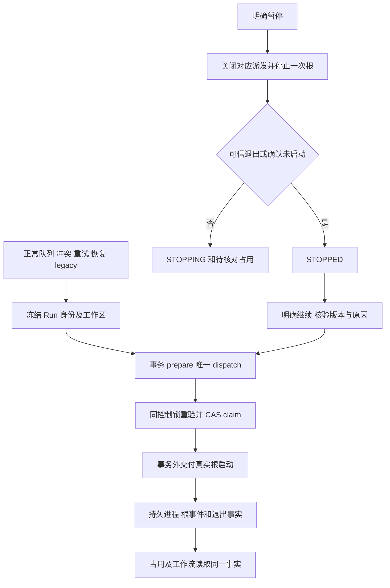

# DevFlow 项目工作区与 CLI 持久会话第二轮代码复审整改及计划复盘

日期：2026-09-21。状态：**代码复审未通过；本轮不提交、不合并；交执行模型按本文及原计划整改。**

本文只记代码事实和修复合同。本轮未运行产品测试、真实模型 CLI、迁移或清理操作，未审计执行模型的测试报告；下列验证均为执行模型后续必须完成的工作，不能理解为本轮已验证通过。

## 1. 执行依据、基线和范围

<!-- devflow-plan-authority:v1 -->

本文是以下两份正式计划的补充，保留所有原要求、任务和验证编号，不另起产品方案：

- [原统一方案](DevFlow项目工作区与原生可见会话统一方案及开发计划-20260920.md)。桌面端可见会话继续延期，当前走 CLI；原延期项不因本文重新进入本期。
- [第一轮代码质量修复计划](DevFlow项目工作区与CLI持久会话代码质量修复计划-20260921.md)，下文简称“旧整改计划”。其中 `CW-F01–F14`、`CW-D00–D16` 和全部 `CW-U/I/E/L/R` 验证仍有效。本文的 `CW2-*` 用于区分第二轮事实及补充反例，不替代旧编号。

执行模型须完整读取三份文件，记录路径及实际 hash。禁止额外创建、改写 `implementation_plan.md`、客户端计划工件或局部替代方案。仅维护“执行进度（非计划）”：原编号→实际实现→验证情况→未完成原因。技术事实与合同冲突时提交原章节及代码位置，由规划角色正式修订受阻部分；其余独立工作继续，不能自行换成降级方案或删验证项。

| 对象 | 本轮读取事实 |
| --- | --- |
| 实现工作树 | `C:\Code\system-handle-subagent-viz` |
| 实现分支 / HEAD | `zxw/subagent-conversation-ui-20260920` / `df18ee4d357fa939645be16fd233a1162bddbebe` |
| 审查对象 | 上述目录当前完整文件，包含暂存、未暂存和未跟踪实现；不是仅审 HEAD |
| 主工作区 | `C:\Code\system-handle`，`main`，HEAD `004b2ea153a80f94007765e996d936db56d74c1c` |
| 主工作区现场 | 存在独立 AGY 账号整改等未提交修改；不得覆盖、暂存或纳入本次实现提交 |
| 旧整改计划一致性 | 两个工作区文件逐字相同，SHA256：`D4AD23C721E14E0FC8A113C9CD2E95CC69D789B5D10069D0C1D93CBB4879DBA0` |
| 本次文档位置 | 主工作区 `docs/plan`；没有修改实现工作树或旧计划 |

后续开发继续在上述实现工作树；开始时检查是否有其他模型正在写同一文件，保留所有现有修改。禁止 reset、stash 全现场、全仓格式化、删除现有 worktree、覆盖运行数据库或迁移真实用户任务。下面引用行号是本轮快照定位，实施时同时按函数名定位。

继续遵守产品边界：DevFlow 只做轻量调度、绑定、状态与材料引用；子 Agent 由原 CLI 管理。不得新增常驻监督模型、逐子 Agent 补停/补建、桌面宿主控制或隐藏模型探测。停止/卸载 DevFlow 后，原工具仍能使用原项目、工作树和材料。附件可选且不新增路由或审核门槛。

## 2. 结论和逐项问题

本轮去重为 **19 个修复项：14 个 P1，5 个 P2**。多个独立故障窗口放在同一项时，以下算法和验证仍分别列出，不能修一个症状便关闭整项。

### 2.1 已改善的部分必须保留

| 原问题 | 本轮确认的改进 | 尚不能据此关闭的原因 |
| --- | --- | --- |
| CW-F01 | 正常整合在 `delivery-coordinator.ts:488` 完成，不再自动 cleanup；旧无明确选择的 cleanup/retry 不再直接删 | 显式清理的批准快照、写者/原件保护和单工作区选择仍不完整，见 CW2-F07 |
| CW-F03 | `runPlanning` 现在确实写入完整 markdown，旧空 NativePlan 项目副本已移除 | 原件定位、覆盖保护、失败恢复、审核/整改读取未贯通，见 CW2-F04 |
| CW-F09 | Kimi 只读角色在构造调用时抛 `READ_ONLY_UNSUPPORTED`，早于进程启动；原静默可写缺陷已修 | 保留原定向权限回归；本轮没有声称真实 CLI 权限验证已完成 |
| CW-F11 | request_id 产生稳定 workflow ID；HTTP 创建传递显式路径字段 | 预览/创建/旧入口仍不一致，见 CW2-F05 |
| CW-F13 | Codex 已改交互 `resume <ID>`；未验证的六工具返回 unsupported；主脚本增加 PS 字面量和 CRT argv 编码 | 最终复制仍回退危险字符串；入口、配置域和环境不准确，见 CW2-F17/F18 |
| CW-F14 | workflow key、重置、Abort 和 generation 已修原跨任务串页，复制成功提示等待 clipboard | 同任务跨 binding 的 mutation 刷新仍串数据，见 CW2-F19 |

### 2.2 问题登记与代码依据

| ID / 级别 | 确定触发、后果和代码位置 | 原计划要求 / 本文开发项 |
| --- | --- | --- |
| CW2-F01 / P1 | 有历史正文的 linked worktree 迁移时，先创建并填充最终 target，再 `git worktree move` 到该已存在目录，正常迁移失败；同请求只返回旧阶段。[复制与移动](C:/Code/system-handle-subagent-viz/packages/core/src/project-asset-migration.ts:326) | CW-F02，D02 第 3 步及恢复；CW2-D02 |
| CW2-F02 / P1 | 不能移动但有资料时仍 eligible；只检查旧 root 存在便无条件改 DB root。`backed_up` 只有 manifest，没有真实备份；无 CAS、选择过滤、no-replace、resume/rollback。[虚假提交](C:/Code/system-handle-subagent-viz/packages/core/src/project-asset-migration.ts:369)、[备份阶段](C:/Code/system-handle-subagent-viz/packages/core/src/project-asset-migration.ts:305) | CW-F02，D02 全状态机；CW2-D02 |
| CW2-F03 / P1 | 资产脚本 preview 构造可写 Store；apply 写死版本、空 digest 并离线改库，API/MCP 未接迁移服务；原 DB-only 导出仍可被调用。[CLI 入口](C:/Code/system-handle-subagent-viz/scripts/migrate-project-assets.ts:175)、[旧写入旁路](C:/Code/system-handle-subagent-viz/scripts/migrate-project-assets.ts:99) | CW-F02，D02 脚本合同；CW2-D02/D00 |
| CW2-F04 / P1 | 规划直接覆盖首 workspace 的默认文件；不读 primary/locator/expected hash，材料写失败把成功规划改为失败。审核只猜路径，hash 改变后回退旧缓存；整改和报告仍平台定位。[写入](C:/Code/system-handle-subagent-viz/packages/core/src/engine.ts:2592)、[计划读取](C:/Code/system-handle-subagent-viz/packages/core/src/plan-review.ts:42)、[整改正文](C:/Code/system-handle-subagent-viz/packages/core/src/engine.ts:3240)、[报告读取](C:/Code/system-handle-subagent-viz/packages/core/src/engine.ts:4304) | CW-F03，D03/I03/E02；CW2-D03 |
| CW2-F05 / P2 | 相同新项目/request，preview 默认 repo=primary，create 默认 main，目标不同；existing linked workspace 预览变主根而创建保留选中根。配置、source_root、MCP/旧入口也未归一。[预览](C:/Code/system-handle-subagent-viz/apps/api/src/server.ts:267)、[创建](C:/Code/system-handle-subagent-viz/packages/core/src/create-workflow.ts:168)、[来源推断](C:/Code/system-handle-subagent-viz/packages/git/src/workspace-paths.ts:63) | CW-F11，D11/I11；CW2-D01 |
| CW2-F06 / P2 | source-change 第一次计算传排除，结束复核裸算；有登记嵌套树便无改动也报 SOURCE_CHANGED。observer/delivery/search 仍遗漏。[不一致复核](C:/Code/system-handle-subagent-viz/packages/core/src/source-change.ts:124) | CW-F12，D12 所有调用点；CW2-D01 |
| CW2-F07 / P1 | 清理 API 只收 ID 再从当前 DB 重建 root/branch，未核验用户批准的路径、分支及 preview_version；无实际写者/唯一原件核查。只选多仓库中的一个又被“必须全部”拒绝。[API](C:/Code/system-handle-subagent-viz/apps/api/src/server.ts:704)、[执行清理](C:/Code/system-handle-subagent-viz/packages/git/src/delivery-coordinator.ts:519) | CW-F01，D01 第 2/3 项；CW2-D01 |
| CW2-F08 / P1 | 真实模型调用仍直接 processes.start，dispatch helper 没有生产调用；实际运行时占用表仍空。outbox 冲突先于开关检查执行，能绕过停用。[真实启动](C:/Code/system-handle-subagent-viz/packages/runtime/src/profile-runtime.ts:704)、[outbox](C:/Code/system-handle-subagent-viz/packages/core/src/engine.ts:2271)、[占用](C:/Code/system-handle-subagent-viz/packages/runtime/src/cli-dispatch.ts:322) | CW-F04，D04 生产调用表和 §3.2；CW2-D04 |
| CW2-F09 / P1 | 所有正式调用直接 getOrCreate，没有 legacy/pending 策略；旧任务会新建根或报不可续接。根绑定冲突被空 catch 吞掉，仍写旧权威表。[选择](C:/Code/system-handle-subagent-viz/packages/runtime/src/profile-runtime.ts:594)、[吞错](C:/Code/system-handle-subagent-viz/packages/runtime/src/profile-runtime.ts:767) | CW-F05，D05 第 1–7 项；CW2-D05 |
| CW2-F10 / P1 | 无 adapter 真实身份 resolver。native-config 只认两个额外 env，正常 CLI 配置模型读不到；explicit 仍填 default-account 等，切账号后混键；只取首仓库/父环境。[身份](C:/Code/system-handle-subagent-viz/packages/adapters/sdk/src/identity.ts:18)、[调用上下文](C:/Code/system-handle-subagent-viz/packages/runtime/src/profile-runtime.ts:566) | CW-F06，D06；CW2-D05 |
| CW2-F11 / P1 | ProcessManager 已可返回 unknown，但 LocalRuntime 丢掉结果，Engine 无条件 STOPPED/agent_stopped=true；重启后旧进程未知也被宣告停止。[Engine](C:/Code/system-handle-subagent-viz/packages/core/src/engine.ts:2165)、[返回值丢失](C:/Code/system-handle-subagent-viz/packages/runtime/src/runtime.ts:1448) | CW-F10，D10/§3.2；CW2-D04 |
| CW2-F12 / P1 | stop 新写 dispatch=false，原继续/recover/retryReview 只排队、不解除暂停，任务长期 QUEUED；不是页面没有刷新。[暂停](C:/Code/system-handle-subagent-viz/packages/core/src/engine.ts:2143)、[恢复](C:/Code/system-handle-subagent-viz/packages/runtime/src/recovery.ts:234)、[按钮](C:/Code/system-handle-subagent-viz/apps/web/src/main.tsx:2607) | CW-F10，D10/E04/L03；CW2-D04，新增回归 |
| CW2-F13 / P1 | adopt 直接用客户端身份字段生成 key；标准新 DTO 反而落 default/空 cwd；关闭调度后 active/unknown 仍允许，revision=0 绕已有绑定检查，多记录非事务写。[store](C:/Code/system-handle-subagent-viz/packages/core/src/execution-session-store.ts:208)、[错误门禁](C:/Code/system-handle-subagent-viz/apps/api/src/server.ts:384) | CW-F07，D07；CW2-D06 |
| CW2-F14 / P1 | repair 将缺事实的历史会话硬标 AGY/default/verified，写空 cwd；一个 Codex 旧根也能迁成错误 AGY 根。[候选](C:/Code/system-handle-subagent-viz/packages/core/src/session-binding-repair.ts:171)、[空路径](C:/Code/system-handle-subagent-viz/packages/core/src/session-binding-repair.ts:378) | CW-F08，D08 第 1–3 项；CW2-D06 |
| CW2-F15 / P1 | repair 未核查实际 writer/selection revision，同键多选后项覆盖；rollback 的空 revision 清单可绕检查删除后续已使用 binding，索引未原子恢复。[apply](C:/Code/system-handle-subagent-viz/packages/core/src/session-binding-repair.ts:315)、[rollback](C:/Code/system-handle-subagent-viz/packages/core/src/session-binding-repair.ts:474) | CW-F08，D08 第 4–6 项/I08；CW2-D06 |
| CW2-F16 / P2 | binding 脚本 preview 用可写 Store；apply/rollback POST 不带现有 API 要求的 Origin，正常入口固定 403。[脚本](C:/Code/system-handle-subagent-viz/scripts/migrate-cli-session-bindings.ts:188)、[写请求](C:/Code/system-handle-subagent-viz/scripts/migrate-cli-session-bindings.ts:214)、[同源钩子](C:/Code/system-handle-subagent-viz/apps/api/src/server.ts:127) | CW-F08，D08 入口/只读合同；CW2-D06/D00 |
| CW2-F17 / P1 | 不满足接管门禁时 copy_script 缺失，但 UI 仍复制 command_line；允许第二写者，也把只适于 CRT argv 的双引号内容当 PowerShell 源码，`$()` 等可被解释。[复制兜底](C:/Code/system-handle-subagent-viz/apps/web/src/components/CliSessionDetails.tsx:213)、[无条件旧命令](C:/Code/system-handle-subagent-viz/packages/adapters/sdk/src/resume-instructions.ts:162) | CW-F13，D13 第 5/8/9 项，D14；CW2-D07 |
| CW2-F18 / P2 | 续接脚本硬编码 PATH 工具，不带实际安装和配置域；未禁止 retired/unavailable；清错 env，遗留真实 RUN_TOKEN/BASE_URL；exit 关闭用户 shell。[生成器](C:/Code/system-handle-subagent-viz/packages/adapters/sdk/src/resume-instructions.ts:118)、[子环境/exit](C:/Code/system-handle-subagent-viz/packages/adapters/sdk/src/resume-instructions.ts:79) | CW-F13，D13 第 1/3/4/5/7 项；CW2-D07 |
| CW2-F19 / P2 | 同任务 A 绑定点停用后切 B，旧 mutation 的 A 说明仅比 workflow generation，覆盖 B 页面；repair 后又默认 list[0]。[迟到响应](C:/Code/system-handle-subagent-viz/apps/web/src/components/CliSessionDetails.tsx:189) | CW-F14，D14 第 2–6 项；CW2-D07 |

上述结论是具体当前代码行为，不推断执行模型是否读过计划、是否跑过某份测试，也不把外部网络/账号/额度问题计为实现缺陷。

## 3. 共同合同与执行分工：CW2-D00

### 3.1 必须接通的入口与最终读者

| 生产起点 | 唯一处理链 | 必须到达的事实/读者 | 必须关闭的旁路 |
| --- | --- | --- | --- |
| HTTP/MCP/CLI 创建及创建预览 | 同一个创建意图解析器→GitManager | 实际 cwd、source_root、分支、页面预览完全一致 | handler 自行 default repo、页面自算、旧 GitManager 忽略配置 |
| Engine 正常调度、冲突 outbox、重试、恢复、legacy | 统一受管派发门面→ProcessManager | dispatch、Run、真实进程、occupancy 同源 | 在门面外直接启动模型；只有队列预检查 |
| stop→明确继续/交回 | 根停止结果→持久控制原因→明确恢复事务 | 工作流状态和原阶段唯一下一次派发 | void stop、任一子节点回执确认整树、自动恢复打开用户关闭开关 |
| 规划/两道审核/整改/报告与证据发布 | 正式正文+locator+材料 outbox | 原件 reader、附件/导出、原工具离线读取 | 首仓库默认覆盖、仅平台 publish/read |
| 资产迁移 preview/apply/resume/rollback | readonly reader 或已运行服务→唯一迁移 core | Git/文件事实核验→数据库 CAS→项目引用 | 脚本 DB-only apply、仅 manifest 备份、直接库写 |
| adopt/repair/apply/rollback | 外部严格 DTO→内部核验对象→共享事务服务 | binding、owner/by-id、策略、Run、幂等结果 | 信任兼容身份字段、硬编码 verified、空 revision 清单 |
| 详情→选择绑定→停用→复制 | 可信启动描述+实时占用→当前选择说明 | 实际 clipboard、原工具 TUI | command_line fallback、adapter-name-only 生成器 |

### 3.2 公共实现约束

1. Store 新增明确的版本读取和比较写接口，返回 SQLite `entities.version`。不要把实体 JSON 中不存在的 `.version ?? 1` 当数据库版本。CAS 必须在同一同步事务内重读比较；`BEGIN IMMEDIATE` 不能包 await、Git、复制或模型启动。冲突返回既有 409 错误语义，不部分写入。
2. 为离线预览提供独立 readonly reader：数据库必须已存在，readonly/fileMustExist 打开；不调用 Store 构造、runMigrations、设置 WAL、mkdir 或创建表；不支持的 schema 只读报错并关闭句柄。预览当前写者无法确证时返回 unknown，不能因调度关闭写 idle。
3. mutation 先完成现有身份鉴权，再按 operation/workflow/request_id/规范化请求 hash 查幂等结果；同正文返回同结果/同未完成操作，异正文 409；首次请求才检查最新版本。最终结果与对应 DB 修改同事务提交。未完成迁移返回可恢复状态，不能冒称 completed。
4. 外部 DTO 严格校验，版本、选择和身份引用必填；删除兼容“权威身份”输入。内部核验结果用不同类型，只能由解析器/verifier 构造。HTTP/MCP/脚本共用服务，不复制算法。
5. 两个迁移脚本共用现有本机控制台请求合同：当前 `human` 信任本机用户并拒绝任何 Authorization，并不存在需要新建的控制台登录/Bearer。mutation 从已选择服务的可信配置取得 `human_origin`，使用受支持的本机 Host、精确 Origin 和 JSON，不携带 Authorization，不关闭 CSRF、不拿模型 token。配置地址不是已选择的本机服务就拒绝；缺配置/服务或现有 Host/Origin 校验失败明确报错，不离线改库，也不新增登录机制。
6. 同一 workflow 的派发 claim、停用、adopt、迁移/回退用同一短期控制互斥和数据库版本合同。互斥只覆盖核验/claim/交付启动，不跨模型运行持锁。崩溃后以持久 starting/unknown 阻止重复派发，不能用进程内锁充当跨重启事实。
7. 子 Agent 只是原工具观测节点；生命周期控制只向根受管调用发一次。迁移的只读 cwd 核验仅按旧 D02 指定的维护 dispatch 特例，不能开普通业务旁路。

本补充对控制 CAS 的新增字段固定如下，不能让各入口自行命名：adopt、repair、repair-rollback 及资产 apply/resume/rollback 的 mutation schema 增加必填 `expected_control_revision`；各 preview 响应增加 `control_revision`，值取同次读取的持久控制版本；dispatch-control GET 仍返回原字段 `revision`，调用者把它映射到 expected_control_revision。session-bindings 列表按旧 §3.4 返回版本信封，而非裸数组：`workflow_id/workflow_version/binding_strategy/migration_pending/bindings/current_binding_id?`。新增字段由同一 contracts 导出，API/MCP/脚本/页面一起更新；未知字段和缺必填字段按本组输入合同返回400，不改其他无关路由的错误映射。

### 3.3 并行所有权

| 负责人 | 工作及允许直接编辑范围 | 对外接口/资源归属 |
| --- | --- | --- |
| 主执行 Agent | 公共 contracts、Store、server.ts、engine.ts、create-workflow.ts、MCP/CLI 公共注册、最终整合；CW2-D00/D08 | 公共文件唯一写入者；A/B/C 提供明确修改片段或接口需求，由主 Agent 整合；不让三个 Agent 同时写这些文件 |
| A：项目资产 | CW2-D01/D02/D03；git 路径/交付、fingerprint/source-change、project-materials/document-service/plan-review、资产脚本及对应测试 | 创建意图、scan context、材料 locator/outbox、迁移服务。自己的合成 Git 仓库/DB/端口/临时根 |
| B：运行与绑定 | CW2-D04/D05 的运行接线、CW2-D06 的 binding/repair；runtime/process/core 会话文件及对应测试 | 派发门面、停止回执、绑定策略、adopt/repair 服务；独立进程 fixture/Host/DB |
| C：适配器与页面 | CW2-D05 的 adapter 身份与启动描述、CW2-D07、binding 迁移脚本客户端及对应测试 | 与 B 共用固定身份接口；resume DTO、页面绑定选择；独立浏览器/端口/CLI 合成项目 |

公共类型先由主 Agent 落定并通知 A/B/C；不等待所有模块完成才让无关开发开始。真实依赖（如 C 的复制占用依赖 B）先用固定接口完成代码，整合后验证生产链。共享构建产物由主 Agent 一次构建或为测试分配独立输出；各 Agent 不覆写彼此 DB、端口、fixture、日志。开发之外的独立测试和最终只读复审也按 A/B/C 三域并行。

## 4. 路径、清理和扫描：CW2-D01

关闭 CW2-F05/F06/F07，保留旧 D01/D11/D12。

1. 抽出唯一创建意图服务，输入 request_id、真实项目引用、workspace_mode、明确 workspace/repo 选择和显式路径映射。单仓库未给 repo ID 时固定使用创建现有默认 `main`，预览/HTTP/MCP/CLI 全一致；已有 Project 则用其真实 repo ID，不能覆盖成 main。项目配置只由服务端读取，客户端不得伪装 `project_configured_path`。
2. 输出固定 workflow_id、项目/config revision、每个 repo 的 current_root/source_root/common_dir/target_root/branch 及意图 digest。existing_workspace 的 current/target 保持用户所选 linked root；source_root 由已确认映射加 Git common-dir/登记核验。无法唯一确定时返回明确冲突，不能取 Git 列表第一条或截目录名猜来源。
3. 新建目标优先级保持原 D11：明确路径→项目 worktree_base_path→source_root/.worktrees/workflow/repo；预览只读。首次创建尚未持久化意图时重算并比预览 digest/版本，配置或分支变更返回预览过期；旧入口未预览则现场解析、核验后冻结。已有同请求创建意图的恢复使用已冻结路径/分支，只核验请求一致及实际 Git 现场，不能因当前配置变化重算目标或再建第二树。页面直接消费服务输出，MCP/旧 GitManager 入口传全字段；Git exclude 只修改实际本地 exclude，失败不得假报已隔离。
4. `ScanContext` 至少含规范化当前根、Git common-dir、经实际 Git 登记核验的子树排除集、持久登记的备份排除集及摘要。同一次 source-change 的首次计算与最终比较使用**同一份冻结上下文**；若登记集合自身变化，返回源上下文变化，不把两种范围的 hash 比较。
5. 所有 fingerprint、snapshot、source-change、native observer、current-delivery、FileBroker 搜索显式消费该上下文。当前扫描根不可排除；失效 Store 登记不能排除后来变成普通代码的目录；路径比较使用平台正确的 realpath/common-dir 和分隔边界，不对所有 OS 无条件 lowercase。嵌套、空格、Unicode、junction/链接须防止越界和递归。
6. 显式清理增加真正只读 preview：返回用户将删除的 workspace ID、Git 登记绝对路径、branch、HEAD/index/内容及材料摘要、workflow/workspace/control version、writer 状态。执行 DTO 必须携带该精确选择和摘要；执行前重新核验，任何变更返回冲突。只处理用户选择的集合，不要求选全部工作区。
7. 清理仍需成功整合回执、原件无唯一未保全内容、无 active/unknown 写者。保留未跟踪、ignored 需保留原件及用户变化；不凭 owned/前缀/status干净判删除安全，不用 force。删除默认模板的自动 cleanup 步骤；启动恢复处理历史“已整合但 CLEANUP_PENDING”为完成且保留，不触发模型或删除。真实用户清理由独立明确请求决定，本次执行仅在合成仓库验证。

## 5. 资产迁移：CW2-D02

关闭 CW2-F01/F02/F03。旧 D02 的所有备份、文件保全、原 CLI cwd、故障窗口及回退合同继续有效；下面明确本轮必须补齐的生产行为。

### 5.1 模式、预览与入口

- 模式固定 `materials_only` 或 `move_worktree`，由本次明确选择决定。前者始终保留 root/分支/绑定 cwd；后者仅适用 Git 支持移动的登记 linked worktree。主树、locked、submodule 等不支持的对象列出原因，不能因为有材料就允许更新 root。
- preview 收精确 workflow/workspace，读取全部历史 locator、规划/两道审核/整改/证据/交付引用和平台历史正文。按原件来源去重，不按文件名吞内容；每条提供 ID、repo、source、hash/字节数、copy_destination、final_destination、冲突及必要 cwd 核验方式。项目已有原件不能被平台缓存反向覆盖。
- digest 覆盖选择依据、源文件、Git HEAD/index/分支/状态、工作区/绑定/control/config 实际版本、模式/目标与核验授权。记录实际 writer；unknown 不可 apply。`selected_material_ids` 精确控制迁移集合，未知/重复 ID 拒绝；未选文件保持原处。
- API/MCP/UI 接入同一个 preview/apply/resume/rollback 服务。资产脚本 preview 固定必填 `--db --workflow --workspace`；mutation 固定 `--api-base --request-file`，请求文件含完整选择/版本/digest。删除旧 `applyProjectAssetMigration` 的写库算法；若须兼容导出名，只抛明确“使用服务 mutation”错误，不能继续产生副作用。

### 5.2 阶段完成事实（不是写入一个 status 就算完成）

| 阶段 | 必须真正完成后才可记录的事实 |
| --- | --- |
| prepared | 同控制锁/事务重验所有版本和 writer idle；保存规范请求 hash、模式、选择、源/Git快照、备份 locator，阻止业务派发；不恢复开关 |
| backed_up | SQLite backup API 的一致性备份（含 WAL 已提交事实），以及影响到的配置、HEAD/分支/index、暂存/未暂存、未跟踪和需保留 ignored 的原字节；清单校验完成。manifest 本身不是备份 |
| materials_copied | 逐文件意图→自有同目录 temp→完整写入/flush/校验→原子 no-replace→持久完成；既有用户目标不同字节则冲突；同字节仅复用，不取得删除权 |
| worktree_moved | move 模式只在**旧 worktree**内发布所选相对材料，最终 target 仍不存在，再调用 Git move；核验两端 Git 登记/common-dir/HEAD/index/内容；materials_only 明确跳过此阶段 |
| verified | 源原有字节和预期新增集合一致、索引/分支不变、材料全可读；move 模式完成原精确 CLI 根在目标 cwd 的可信核验，未知不通过；不能只 existsSync |
| committed | 同步事务 CAS workspace/binding/材料/control 等冻结版本及根 owner，更新当前引用和迁移映射，保持 conversation ID；历史 Run/cwd/证据不改；提交幂等结果 |

备份固定在不随该 worktree 移动的原 source_root/docs/process/workflow/migration-backup/migration 下。保持旧 D02 的实际 exclude、受限权限和独立扫描排除；不得把数据库/凭据备份送给模型、加入附件或提交。无安全备份位置或文件系统 no-replace 能力时拒绝该对象，不回退平台目录或普通覆盖。

### 5.3 崩溃、恢复与回退

1. 同 request/hash 的未完成请求进入原操作的恢复器；异正文复用 ID 返回冲突。resume 明确引用 migration ID 和当前检查点版本。阶段外部动作前写意图，之后核实事实；不在 SQLite 事务里等待 Git/文件/CLI。
2. 复制中断重写本操作自有 temp；文件已发布但未记账时核 hash/字节补记；用户抢先创建不同目标时保留双方并 needs_reconcile。不得因为 temp/target 存在便当成功。
3. Git 已 move、DB 未提交：读两端登记识别只发生一次 move，继续 verify/CAS，不再 move。DB 已提交回执丢失：返回原结果，不再写 revision。原件/HEAD/index/目标/绑定任一漂移：needs_reconcile，不强移回或重建。
4. rollback 是单独明确请求，重新 preview 并核对操作后无新使用/变更；按 Git 支持反向 move 和 CAS 恢复当前引用及所有索引。不能整库还原覆盖其他任务，不能删除用户新增文件；备份和历史迁移事实保留。无法安全回退就给具体冲突及两端位置。
5. cwd 兼容若需真实 CLI 调用，仅允许旧 D02 的 `operation=asset_migration_verify`，固定 verification_id、旧精确 session ID、只读权限及冻结目标；不能新建根。启动不确定保持待核对，同请求恢复不再发 prompt。不支持核验的工具对 move 返回具体 unsupported，materials_only 仍可单独选择。
6. 迁移完成或安全回退均保持停止。迁移后的“继续”复用现有明确继续入口，请求携带本次 `migration_id` 和 expected_control_revision；按 §7 第8项核验终态、维护调用已退出及版本后，仅解除本次 migration 原因。未完成/needs_reconcile/核验调用 unknown 不可解除；保留独立 user_disabled 等其他原因。

## 6. 项目材料端到端归属：CW2-D03

关闭 CW2-F04。生产修改点包括 Engine 规划、两道 review/repair、DocumentService、计划读取、报告/导出/附件定位；只改 project-materials helper 不算完成。

1. 每个正式材料的 locator 至少固定 workflow、repo_id、workspace_id、工作区 revision、类型、业务 revision/run/round、relative_path、hash/字节数及来源。材料归属先已有用户指定原件/引用，再项目 material_paths，再明确 primary repo 的默认相对路径；多仓库不能取数组首项。所有相对路径在真实目标根下校验，拒绝穿越、绝对注入或链接越界。
2. 模型结果成功后，在同事务保存完整正文引用、业务结果和材料写 outbox；模型成功与文件落盘分别记录。项目写失败标材料 pending/具体错误，保留正文并可重试；不要将同一模型结果改判失败、自动再发规划/返修。下一阶段需要正文时，按第4项读取精确绑定的本轮持久结果，不把 pending 伪装成已发布原件，也不因可恢复的材料写入故障增加业务门槛。
3. 新文件使用独占 no-replace 发布；已有原件只有明确更新意图和 expected_hash 匹配才可更新，否则保存新版本并显示冲突。相同 revision 重试不能覆盖用户修改；同一 round 不同 run 的报告不得共享会被覆盖的路径。平台缓存可以重建，不能成为唯一正式正文。
4. 所有 reader 按 locator 去精确 repo/workspace。原件存在但 hash/归属变动返回原件冲突，不静默读旧平台内容。当前文件尚未发布且对应 outbox 为 pending 时，可读取与该 Run/revision/hash 精确绑定的本轮持久正文，标记来源 `result_pending`；这不是旧缓存回退，不能掩盖或覆盖已存在的冲突原件。除此之外，只有“历史记录确无项目原件 locator”的明确兼容分支可回退平台并返回来源事实。不能遍历所有 workspace 猜默认文件。
5. 计划审核、自检、两道代码审核、整改正文、证据与报告、导出/附件均贯通相同 locator。恢复 outbox 只补写材料，不重复业务状态迁移或模型调用。平台缓存目录不可用/移走后仍可从项目原件读到本任务材料；保留历史记录和用户目录结构。

## 7. 派发、停止及明确恢复：CW2-D04

关闭 CW2-F08/F11/F12。保留旧 D04/D10；以下所有步骤落在生产调用链。



1. 唯一派发门面消费冻结的 workflow/Run/profile/身份/策略/workspace map/purpose。生产模型 `ProcessManager.start` 只能从此门面到达；ProfileRuntime、legacy LocalRuntime、冲突 outbox、重试、recover 和维护核验各入口必须接入。普通 shell/check/browser 进程保持自身合同，不能错误套成模型根。
2. `prepare` 在事务里确认业务状态、控制原因、writer idle、会话策略及该 Run 尚无 dispatch；建立稳定 dispatch ID。重复请求返回同一 dispatch。`claimStarting` 必须 CAS 当前 prepared、control revision 和 Run version；unified 分支另核验 binding 状态/generation/revision，legacy 分支核验 `legacy_source_ref/source_entity_version/resolved_identity`，不能要求旧任务先生成统一 binding，也不能无条件 set starting。
3. claim 与交给 ProcessManager.start 在同 workflow 短期控制锁下连续完成；spawn 是事务外动作。claim 先于停用获胜则记录该正在启动的占用，随后停用不能报告 idle，并可按停止合同处理；停用先获胜则不 spawn。准备参数期间开关变化也在最后 claim 被拦。进程记录携带 dispatch ID、真实根 PID/创建时间、Host/job 所有权及冻结 cwd。
4. 启动/根 init/终止/错误回调均关联本 dispatch。根 init 走 D05 事务；冲突不是普通子 Agent ID。启动抛错且确认未创建进程使用原状态 `cancelled`，另记录 `confirmed_not_started` 和失败原因；不新增 failed-not-started 状态。可能已交付而未知必须 needs_reconcile。服务启动/恢复实际调用 reconcile；unknown 不转 idle，不重发同 Run。
5. occupancy 读取 dispatch **以及**历史 process_record/Host 尚未核实的事实，包含 prepared/starting/running/stopping/needs_reconcile 和 legacy。新表为空不代表空闲；调度关闭不代表退出。结束状态仅由可信终止/未启动事实解除占用。
6. `ProcessManager.stop → LocalRuntime.stop → Engine.stop` 返回并消费带 dispatch/进程身份的统一 StopResult。confirmed_exited/事务确认 never-started 可结束；unknown/not_owned/仅已发送停止请求保持 STOPPING。内存 Map 空、wrapper 退出或子节点事件都不足以证明原根/后代已退出。只停本次拥有的根一次，子 Agent 状态只观测，不能通过 fallback runId 逐个补停。
7. 控制事实增加明确原因集合，至少区分 `user_disabled`、`workflow_pause`、`manual_handoff`、`migration`，保留各原因的产生 request/revision（migration 还含 migration_id）；有效 dispatch_enabled 由是否存在禁止原因导出。旧记录 false 但没有原因集合时，保守映射为 user_disabled，并在明确 mutation 时持久化，不能把缺集合当空集合自动开启。不能把一个布尔值同时当暂停、独立停用和迁移锁。
8. 原“继续”按钮/recover 明确解除其 `workflow_pause`；明确交回解除其 `manual_handoff`；独立“开启调度”只能解除用户选择的 `user_disabled`。迁移后明确继续携带 migration_id，只在对应操作已 committed/安全 rolled_back、维护核验确认退出且版本匹配时解除该 migration 原因；未决迁移不得解除。所有明确恢复在同一事务核验根退出、绑定或legacy来源、workspace/Run/control版本及原业务阶段，解除对应原因并唯一入队；仍有其他禁止原因则不假装恢复。retryReview/feedback 只沿其明确动作授权恢复相应暂停，不能取消独立停用。
9. quota 自动恢复、服务重启和定时 reconcile **不解除用户原因**。`resumeApproved` 的调用方必须明确区分用户继续与自动恢复，不能在函数里无条件设 true。重复继续/回执丢失只返回同一结果，原阶段只派一次；不重跑已完成审核。

## 8. 会话选择、身份与根确认：CW2-D05

关闭 CW2-F09/F10；B 负责运行/存储，C 负责 adapter 身份及启动描述，主 Agent 负责公共类型。

### 8.1 保留旧任务且禁止隐式换根

- 新任务显式使用 `binding_strategy=unified`；升级旧任务缺策略时只推导为 legacy，不能读取时自动落新 binding。旧候选尚未核验/部分 repair 时标 migration_pending，阻止误建新根。
- legacy 只读核验唯一可信旧根并经统一派发门面续接；多候选/矛盾/缺身份返回明确待修复。不能首项选择，不能把“统一键不存在”当“本任务从未有过会话”。
- unified 按完整键及状态取绑定：reserved 仅由合法首启 dispatch 使用；bound 才可精确续接；unavailable/retired 明确拒绝，需原计划允许的显式动作恢复；新模型真实键不同才按新绑定规则，不以角色/purpose/profile 名拆根。
- 根 init 事务验证 workflow/Run/dispatch、当前进程来源和可信完整身份。unified 核验 binding revision/generation及owner，binding/owner/by-id/Run/dispatch一次提交；legacy 核验冻结旧来源引用、实体版本和真实身份，只提交Run/dispatch及已核验所有权事实，不隐式造binding/by-id。相同 init 幂等，不重复加revision；不同根返回CONVERSATION_MISMATCH并终止本轮正常完成路径，保留诊断和占用核对。
- 删除 ProfileRuntime 中吞绑定错误和 unified 旧权威表双写。历史表可保留只读或明确非权威投影，不参与 unified 选择；任何投影失败不反向改根。不能把任意不同 init 都当子 Agent 忽略。

### 8.2 身份必须来自实际启动上下文

1. 先解析本轮真实安装入口及环境，再解析身份，再作绑定选择，最后构造模型参数并 claim。共享 `ResolvedCliLaunch` 包含独立实际 executable、固定可信原工具 prefix、安装/版本、有效配置域和允许 env；ProfileRuntime、verifier、手动脚本共用。不得让身份看父 process.env，而实际 spawn 用另一个 CLI home/env。
2. 各 adapter 实现只读 resolver，输入冻结 profile revision、ResolvedCliLaunch、完整且按 repo_id 排序的规范 workspace map。模型规则固定：explicit 使用冻结真实模型 ID；native-config 读取该安装及环境实际生效配置/可靠原生元数据，按该工具的真实优先级解析。`DEVFLOW_RESOLVED_MODEL`/`CLI_DEFAULT_MODEL` 不能取代配置读取，`default` 不能是模型或账号事实。
3. host 使用稳定本地主机身份；client scope 由实际安装/配置域规范化身份确定；account 取可靠 provider/account 的非敏感稳定事实。unknown 要列 missing_fields/source，不得填 local-machine/user-default-scope/default-account。日志及文档禁止凭据；不哈希 token 冒充稳定账号身份。
4. 本工作树**没有**主工作区的 `packages/agy-accounts`。本轮不能把“调用已有账号服务”当可执行依赖，也不能整包合入主工作区正在整改的账号代码。C 在 adapter 边界实现本地只读 `SessionIdentitySource`；可复用本工作树已存在的可信元数据解码与配置读取，缺字段返回 unresolved。后续账号模块可实现同一接口，不改变绑定键。不得为补身份额外发模型 prompt、登录或切账号。
5. 本期不宣称任何尚无可靠字段来源的工具支持 adopt/迁移；确实无法核验时返回 SESSION_IDENTITY_UNRESOLVED/UNVERIFIABLE，保留原数据。这不允许把所有 native-config 一律禁用来“修好”：原计划受支持的 AGY/Codex 路径必须实现真实配置读取，并由执行模型按对应真实版本验证。若其已安装版本客观不暴露所需字段，提交具体字段/版本/读取证据给规划角色修订该受阻能力，不能自行伪造或扩展权限。
6. workspace identity 包含已确认 source/current roots、repo/common-dir 和完整映射；使用真实路径及平台大小写语义。profile revision 是来源，不是随意拆根的维度。init 中可核验的模型/账号/cwd 与冻结值冲突时停止确认，不悄悄另建 key。
7. aside 保持独立只读合同；不创建正式 binding、不被正式根状态污染，也不能为规避 resolver 改成可写或指定假模型。未知能力明确不可用。

## 9. Adopt、历史修复及脚本：CW2-D06

关闭 CW2-F13/F14/F15/F16。HTTP/MCP/CLI 必须共用同一服务与严格 schema。

### 9.1 Adopt

1. HTTP workflow只来自路由，MCP来自可信任务上下文。外部请求固定为 `{request_id,expected_workflow_version,expected_control_revision,expected_binding_revision,profile_ref:{id,revision},workspace_id,conversation_id}`；内部对象再附可信workflow。禁止客户端提供 adapter/host/account/model/root/source 作为权威；兼容字段明确拒绝，不悄悄接受后忽略导致调用方误判。
2. 服务端读取冻结 profile、权威 workspace map、D05 身份；原工具只读 verifier 查精确 ID 的归属、模型/配置域和 cwd。无可核验元数据就不可接入，不能仅检查 ID 格式/文件存在，也不发额外 prompt 来试错。
3. 独立停用与实际 writer idle **两者同时满足**才允许已启动任务接入未绑定槽或幂等确认同根；任何 active/unknown 拒绝。adopt不替换已有根，显式换根走repair。按旧 D07 的尚未启动新任务例外处理时，也必须事务证明从未启动；不能用当前空 Map 证明。
4. 在同控制锁/事务重验版本、owner、当前绑定状态。expected_binding_revision=0 只表示键不存在；存在即冲突。owner 唯一域来自可信事实，客户端变 account/scope 不能绕过。同 ID 不允许借 adopt 改 cwd；需要移动走资产迁移。
5. 原子提交 binding、owner/by-id、策略及幂等结果；重复请求 replayed=true；任一失败不留半个绑定或索引。

### 9.2 历史候选与 apply

1. 枚举旧 conversation/native_conversation、冻结 Run/profile、workspace 及现有 binding 的全部相关来源；保存来源引用与实际实体版本。同根多引用可归并，但去重键包含可信 adapter/host/client/account/ID，不只模型名或 ID 字符串。
2. 用 D05/D06.1 的同一 resolver/verifier 确认候选，不硬编码 AGY/default，不因候选只有一个就 verified。无法读取/无法定位标 unverifiable；同目标键多个不同根标 ambiguous；owner 已属于别的任务标 conflict。可信 workspace_root/source_root/repo/map 必须完整随候选进入 binding。
3. source_digest 包含所有候选来源及其版本、profile/Run/workspace/control/binding 版本与身份，不只是 ID/status。writer 来自实际 occupancy；预览只读，无 UI 第一项自动选择。
4. apply 请求明确 source_digest、expected workflow/control 版本及逐项 candidate_id、expected_binding_revision。每目标键最多选一个根；同根重复来源合并，跨键同根冲突拒绝。ambiguous 只有在用户明确选定其中一个**本身已核验**的根且排除其余后可处理；unverifiable/conflict 不可 apply。
5. 同控制锁和一个事务重读 writer idle/调度关闭、全部摘要/版本、owner 与选择。记录完整 patch：绑定和所有索引、策略/pending 的前后值、应用后实际 revision、基线使用记录。更新幂等结果也在事务内。未选历史候选保留；部分修复不能无条件把全任务 migration_pending 清空。

### 9.3 Rollback

1. 必填 migration ID、request ID、expected workflow/control version，binding revision 清单必须**精确覆盖整个 patch 的受影响集合**，不得为空、遗漏、重复或混入别的 binding。
2. 事务内校验 patch 所属 workflow、未回退、应用后版本/索引/策略仍匹配、writer idle、调度关闭，且无任何后续 Run/dispatch 使用这些绑定。缺 binding 也是冲突，不能跳过。不得仅以 revision 恰好相同证明未使用。
3. 原子恢复原根、目录、策略/pending及owner/by-id业务关系，撤销本patch新建的业务关系；提交产生新的单调revision/generation，不把旧版本原样写回造成ABA。被撤销的新绑定保留版本/历史识别事实，不让旧CAS重新有效；保留迁移历史并提交幂等回执。任一新使用或漂移返回冲突，不删当前活跃绑定，不整库回滚。

### 9.4 CLI

binding preview 固定必填 `--db --workflow --expected-workflow-version`，readonly reader；mutation 使用 `apply/rollback --workflow --api-base --request-file` 经 D00 控制台客户端，workflow与请求对象归属必须一致。禁止默认 DB、可选 workflow/version、缺 Origin 的请求和脚本直接 Store 写入。import 模块只定义函数，不解析 argv、不打开 DB。stdout 只输出非敏感结构化结果，错误非零退出；不吞 403/409，也不自动换请求 ID重试。

## 10. 手动续接与页面：CW2-D07

关闭 CW2-F17/F18/F19，保留已修跨任务和 Kimi 只读行为。

1. 删除外部 DTO/生成器/组件的 executable `command_line` 兼容路径；可展示结构化 executable/args/cwd 事实，但不提供可执行拼接字符串。按钮与 handler 都只接受当前归属匹配的 copy_script。调度开、writer active/unknown、迁移未完成/待核对、绑定非 bound、cwd/身份/配置不可用时，响应无 copy_script，页面不能复制兜底。
2. 生成器必须接受 D05 的可信 ResolvedCliLaunch 与 bound binding、profile revision、当前控制/占用快照；删除仅 adapter 名就能生成的重载和默认 idle/dispatch=false。找不到可信启动描述返回 identity_unverified/unsupported，不猜 PATH。
3. AGY/Codex 仍按旧 D13 的精确交互参数；native-config 不加 model default。真实 shim 解析为独立原工具 exe 或独立 node+原工具安装脚本；不能依赖 DevFlow 私有 runtime/temp 文件、cmd/Invoke-Expression、生产临时 prompt/schema/prefix。未知安装形态拒绝生成，不绕 shell。
4. 将生产注入器拥有的 env 名称抽成共享清单，至少覆盖本轮实际 `DEVFLOW_RUN_TOKEN`、`DEVFLOW_BASE_URL`、RUN_ID 等真实回传项；子进程删除这些后设置 adapter 允许的非敏感配置域。清单不包含用户自有变量；不能只删不存在的近似名字，也不能清空整个环境。
5. 保留 ProcessStartInfo 字符串单引号、独立 CRT 参数编码、不重定向 TUI 输入输出。拒绝全部规定的控制字符；恶意 shell 形状只按字面 argv 到达。执行后设置可查看的退出结果（如 `$global:LASTEXITCODE`），返回父 PowerShell，禁止 `exit` 结束用户终端；不修改父 cwd/env。
6. workflow generation 与 binding/request generation 分开。选择变更立即清空说明并递增；每个 await（包括 res.json/clipboard）之后核对 workflow ID、binding ID、binding revision、请求 generation 和响应归属。abort 仅辅助，不能代替身份比较。
7. dispatch mutation 只刷新当前控制事实并使**当前选择**的 effect 重新请求说明，不继续用点击时捕获的 A 直接 setResumeInfo。repair/adopt/rollback 同样失效当前说明；有实际 Run binding 则选择它；无当前根且唯一合法 binding 才自动选，否则保持未选。删除 list[0] 回退。
8. render、按钮 disabled 与 copy handler 共用同一 eligibility 判断；占用/绑定事件和查询错误立即使可执行内容失效。clipboard 拒绝显示失败；组件卸载/切换清理定时器。平台离线时原 CLI 不依赖 DevFlow 回传 Hook/MCP，按旧 D13.10 仅禁用 DevFlow 自己注入的失效集成，保留用户配置。

## 11. 执行模型验证：CW2-D08

### 11.1 总规则与资源

先完成正式计划中的全部开发任务，包括功能实现、端到端接线、异常与边界处理及测试代码，再进入单元、集成和 E2E 测试阶段。将独立测试目标分配给多个子 Agent 并行执行，各子 Agent 每条命令只指定一个测试类、文件或用例，并负责相关问题的定位、修复和重跑。某个目标失败不阻塞其他无关目标；不同测试层之间不设固定先后顺序。仅有真实依赖或共享资源冲突的目标需要协调、隔离或局部串行。禁止无筛选的全量命令、全库通配符和一次拼接多个测试目标；受影响回归也按独立目标分派并行，不因局部修改重跑整个套件。

沿用旧 §8.1 的隔离资源与安全路径要求。各目标独立临时根、数据库、端口、合成 Git 项目和调用日志；只用合成/明确指定的验证会话。严禁真实任务 DB、用户已有会话批量迁移、生产工作树清理、账号自动切换。测试删除前解析绝对路径并检查在本目标临时根内。敏感配置只在运行时引用，不写正文、截图、stdout 或 Git。

下表的目标均由执行模型实现/扩充。集成层必须从实际 API/Engine/ProfileRuntime/CLI 子命令进入，只 mock 最外层可控原 CLI/OS 边界，不能 mock 掉本项所修生产服务。真实 Git move 用合成真实 Git 仓库；CLI能力仍需要旧 L 项真实工具验证。fixture 只证明程序分支，不能证明实际工具能力。

### 11.2 每项最小反例和必要断言

| 验证 ID / 目标文件 / 负责人 | 必须实现的独立用例与断言 |
| --- | --- |
| CW2-T01；`tests/integration/project-asset-migration-recovery.test.ts`；A | linked worktree+两份不同历史正文，经真实服务 apply；观察 Git move 前最终 target 不存在，copy 在旧树，结束 target 是同 common-dir/HEAD/index 的登记树，两份字节均在正确相对路径，旧 session ID 保留。断在 copy 后、move 后、DB commit 后分别同请求恢复：move 一次、root 只在核验后改、结果幂等。完成后仍停用，明确迁移后继续才唯一派发；user_disabled仍保留，核验unknown不能继续 |
| CW2-T02；同上；A | 分开验证 materials_only 主树不改 root；move 主树/locked/不支持对象拒绝且 DB不动；selected ID只处理所选；版本漂移409；目标抢写不同字节不覆盖；真实备份可读且含暂存/未暂存/二进制/ignored/WAL数据；copy-temp/发布未记账窗口恢复；后续用户变更阻止回退。每个子场景独立目标，不只断言 status 字符串 |
| CW2-T03；新增 `tests/integration/project-asset-migration-cli.test.ts`；A | 实际启动脚本子命令：缺参数非零；不存在 DB不创建父目录/文件；旧 schema不迁移；已有 DB实体和字节不变，句柄释放；apply/resume/rollback通过隔离 HTTP服务且调用同core；服务停用/鉴权失败不离线写。调用旧导出不得再改 root；API/MCP精确选择同结果 |
| CW2-T04；`tests/integration/project-material-ownership.test.ts`；A | 从 Engine 规划、两道审核、整改和报告发布进入：primary是第二仓库、自定义原件路径、已有修改目标、同revision重试、同round不同run分别检查正文/locator/不覆盖。文件写失败后模型成功事实不变、不再调用模型，outbox恢复一次。结果事务后发布前崩溃，重启reader读精确本轮正文并标result_pending，不重复业务路由。reader原件变更报告冲突；移走平台缓存仍从项目读到所有原件；历史无locator才明确回退 |
| CW2-T05；`tests/integration/workspace-preview-create.test.ts`；A | 同request未给repo的preview与实际create逐字段一致；existing linked root不变；项目配置、单repo显式路径、多repo映射通过HTTP/MCP/旧GitManager一致；preview前后FS/DB无变；配置/分支在首次意图保存前变则409而非另选路径；意图已保存后改项目配置再恢复，仍只创建冻结原目标一次；模糊source拒绝 |
| CW2-T06；`tests/integration/registered-worktree-source-change.test.ts`；A | source内建立真实登记的非默认名称子worktree且有文件，未改动的source-change preview成功而非SOURCE_CHANGED；子树单独变化不影响主扫描，主树真实变化被识别；同次前后使用同context。覆盖observer/current-delivery/search/snapshot；失效登记后的普通目录仍计入；当前根不被排除；备份从搜索/附件中排除 |
| CW2-T07；`tests/integration/project-workspace-ownership.test.ts`；A | 正常整合/任务移除/旧cleanup-retry不删除。两个repo只选择一个精确预览可清理它、另一个留存；路径/分支/preview/workflow版本任一漂移拒绝；active/unknown、暂存/未跟踪/唯一ignored原件拒绝；默认模板和历史完成恢复不自动清理。仅合成仓库实际remove |
| CW2-T08；`tests/integration/cli-dispatch-recovery.test.ts`；B | 通过Engine→真实ProfileRuntime→可控假CLI进程跑正常、outbox merge_conflict、retry、recover、legacy路径；开关关闭spawn=0且outbox不误delivered；运行时occupancy非idle。暂停在参数准备后claim前，关闭后仍spawn=0；反向先claim则显示starting非idle。服务重建后starting无PID、已spawn无回执、旧process_record未知均不重复spawn；明确退出才idle |
| CW2-T09；`tests/integration/cli-session-lifecycle.test.ts`；B | 只有可信旧conversation的legacy任务续原ID、不新增binding/root；旧多候选或pending不建根；unified unavailable/retired不启动；profile/角色切换同真实键复用。根init重复revision不增；不同根、旧generation、别的进程来源均拒绝，Run/dispatch不完成且索引不半写；不再靠旧表双写选根 |
| CW2-T10；`tests/integration/cli-session-identity.test.ts`；C+B | 使用真实resolver的隔离配置fixture，不设置两个DevFlow模型env：native-config解析正确，配置优先级和实际spawn env一致；explicit换账号/CLI home/安装或完整repo映射不误复用。缺字段具体报错且无spawn，无default；init身份冲突不改根。aside不写正式绑定且保持只读。AGY账号服务不存在时不崩溃/不导入主工作区模块 |
| CW2-T11；`tests/integration/conversation-control.test.ts`；B | Engine.stop真实链返回unknown/not_owned/仅请求后仍STOPPING且不可复制；重建ProcessManager内存空但持久活跃不可STOPPED；精确退出和确认未启动才STOPPED。断言根stop一次、子Agent没有控制调用；wrapper结束但Host根未确认仍占用；错误不能空catch清事实 |
| CW2-T12；新增 `tests/integration/cli-pause-resume.test.ts`；B | 原recover链暂停→明确继续→原阶段只spawn一次；重复request同结果；retryReview/feedback按动作恢复。另有user_disabled时继续不解除它；quota自动恢复/服务重启不打开用户关闭；manual handoff需明确交回；根unknown时拒绝继续；control/Run/绑定版本竞态409。旧false无原因集合保守保持关闭；迁移成功/安全回退后明确继续只解除指定migration原因，未完成/核验unknown不得解除 |
| CW2-T13；`tests/integration/cli-session-adoption.test.ts`；B | 用新最小DTO经HTTP/MCP成功核验真实fixture身份和cwd；加入伪造adapter/account/root字段400；未知元数据不可接入；dispatch关闭但active/unknown仍409；revision0遇已有binding409。两个任务同根并发仅一个成功；任一索引写故障全部回滚；同请求回放和异正文冲突；换已有根或同ID变cwd拒绝 |
| CW2-T14；`tests/integration/cli-session-migration.test.ts`；B | 单个Codex旧根保持Codex及真实模型/cwd，绝无agy/default；多旧来源合并但不同根不丢；每个来源版本变动影响digest；未知标unverifiable且apply失败；正常apply后的resume GET能读取非空真实cwd |
| CW2-T15；同上；B | apply时writer active/unknown、开关开、stale selection revision、同键选两根分别拒绝且全库相关记录不变；注入事务中途错误无半patch。rollback空/漏/多/错revision清单拒绝；apply后跑一次Run即禁止回退；可回退时binding/owner/by-id/策略/pending业务关系原子恢复且版本单调，回退前旧CAS不重新有效，重复请求不再改版本；别的workflow不能回退 |
| CW2-T16；新增 `tests/integration/cli-session-migration-cli.test.ts`；C | 子进程跑preview验证只读和必填参数；actual API启用原CSRF/human合同，合法apply/rollback含正确Host/Origin/JSON且不带Authorization成功进入service；无/错Origin或携带模型Authorization被403拒绝且DB不动；stdout无凭据，argv/import无副作用，409不被脚本吞掉/自动换ID |
| CW2-T17；`tests/unit/cli-session-details.test.ts` 与 `tests/integration/cli-resume-powershell.test.ts`（分别单目标）；C | bound但dispatch开、writer active/unknown、身份错分别无copy_script；UI按钮/handler不调用clipboard，即使fixture故意提供旧command_line也不可兜底。合格脚本将空格/Unicode/引号/反斜杠/`$()`/反引号/百分号/&逐字传给argv接收fixture；无副文件/表达式执行，控制字符拒绝 |
| CW2-T18；`tests/integration/cli-resume-powershell.test.ts`；C | 非PATH exe、npm shim可解析的独立node入口、特定CLI home传递正确；不可复现域/retired/unavailable无脚本。子env没有真实RUN_TOKEN/BASE_URL等注入项，用户env和父cwd不变；假CLI非零退出后父PS继续执行哨兵命令并保留退出结果。TUI和DevFlow离线行为另由真实L项确认 |
| CW2-T19；`tests/e2e/cli-session-scope-and-resume.spec.ts`；C | 真实页面同workflow A选中→dispatch POST延迟→切B→A GET迟到，始终显示/复制B或保持不可复制；res.json阶段再切换也不串；repair/rollback刷新不选list[0]。快速跨workflow旧场景继续通过；404/409/查询失败/clipboard拒绝清旧脚本且提示真实结果 |

所有行中多个场景须分别具名，例如 `CW2-T12 user resume dispatches original stage once`，可用 `-t`/`--grep` 单独运行；不得用一句“覆盖边界”代替具体断言。旧单元测试继续覆盖纯算法，但**直接调用 helper 的通过不替代上述生产入口用例**。

### 11.3 浏览器、真实 CLI 和旧功能回归

- A 执行旧 `CW-E01/E02/E03`：页面创建/预览/整合保留→材料原件→迁移预览/选择/apply/故障resume/明确rollback。新增断言当前源/目标/选择与 API 一致，部分选择不变成全部；材料 pending 不自动返修。
- B 执行旧 `CW-E04/E06`：页面停用/暂停/原继续/手动交回→真实派发状态；adopt/repair 的精确候选和版本冲突；空回退清单、后续已用 binding 禁回退。所有控制使用真实 API/DB，不能只 mock fetch 画按钮。
- C 执行旧 `CW-E05/E07` 与 CW2-T19：权限/身份显示、同任务及跨任务竞态、复制门禁和剪贴板内容；Kimi READ_ONLY_UNSUPPORTED 不能导致可写重试，原 writable 流程保持。
- 真实工具仍执行旧 `CW-L01–L05` 的全部对应子项：AGY/Codex精确根复用、模型/配置域区分、只读能力、暂停及明确恢复、真实终端TUI交互、停止DevFlow后的读计划/开发/定向测试/本地提交、真实cwd迁移兼容。每条命令只一个工具一个case；只用合成项目/明确验证会话。未安装、不支持、额度/网络受阻分别记录，不拿fixture或帮助输出当行为通过。
- 受影响旧功能回归保留旧 `CW-R01–R09` 和原统一方案42个本期场景的映射，按旧 §9 逐项分派。新增原因集合要覆盖 quota/restart/review/recovery；新增 locator 要覆盖附件/导出；新增扫描上下文要覆盖delivery与source-change。不要重跑与本轮无调用关系的整个仓库。
- 本轮未新确认任何 CLI 版本能力。D05 所需真实配置/元数据能力若客观缺失，只阻塞对应能力并提交技术事实，其他独立测试继续；不能把未验证能力写成支持，也不能把环境失败计作代码质量问题。

### 11.4 固定运行方式和完成界限

下面是执行命令形状，每次只一个真实文件；同文件很大时加一个明确 case 过滤。不得拼接两个目标、用通配符或执行无筛选全套。

```powershell
pnpm exec vitest run tests/integration/cli-pause-resume.test.ts
```

```powershell
pnpm exec vitest run tests/integration/project-asset-migration-recovery.test.ts -t 'CW2-T01'
```

```powershell
pnpm exec playwright test tests/e2e/cli-session-scope-and-resume.spec.ts --grep 'CW2-T19'
```

真实 CLI helper 仍按旧 §8.7 的 `--adapter --case --workspace --run-dir --profile-file --port` 合同逐项调用，不增加一次跑所有工具的入口。必须检查过滤实际命中用例，零用例不是通过。

主执行 Agent 整合后各做一次 `pnpm typecheck`、`pnpm build`；修改 Host 才追加一次 `pnpm build:host`。失败定位相关改动/既有问题，修复后只重跑相关目标。禁止 `pnpm test`、无筛选 test:unit/test:integration/playwright 或 `pnpm check`。编译成功不能代替业务集成验证。

执行回执只汇总实际变更、各负责人定向验证结果和未关闭事项，不要求额外过程证明。最后按 A/B/C 三域分派只读复审，检查原问题、旧旁路和新回归；主审去重并检查跨域连接。复审不重跑执行模型测试、不审计报告真实性，也不因“已按建议改好”便关闭缺陷。

## 12. 为什么上一份详细计划执行后仍有问题

### 12.1 能由代码证实的原因

1. **不是计划版本不一致。** 两处旧计划正文和 hash 相同。前述19项均能找到旧条款；Git move顺序、真实备份、完整CAS、禁止假身份、生产派发、根停止、继续只派一次、复制门禁早已明确。
2. **新增名称没有形成生产行为。** cli-dispatch 有 prepare/claim/finish，但 ProfileRuntime 仍直接 start；project-materials 有 helper，但 Engine/DocumentService/reader仍各自处理；repair有transaction，但必要的版本/写者条件在事务中没有检查；backed_up标签没有备份事实。这是实现接线未完成，不能算需求不明确。
3. **旧路径没有被真正收口。** 资产脚本保留 DB-only 导出，unified 路径继续双写旧表，前端继续 command_line 兜底。只新增正确分支不足以阻止旧分支继续被调用。
4. **成对操作只改了一侧。** stop写false但continue不解除；source-change前半排除但最终复核裸算；API脚本增加POST但没接现有同源hook；workflow请求保护没有覆盖同workflow的binding刷新。这些是代码中可重复推导的回归，不是对执行过程的猜测。
5. **部分现有测试源码覆盖层级过低。** 本轮读取到 dispatch集成文件直接调用manager、材料集成文件直接调用helper、迁移单测采用非Git目录并断言旧脚本行为。它们可以验证局部函数，但不会经过本轮断开的Engine/ProfileRuntime/Git/API/UI链。这里只评价测试代码能覆盖什么，不推断其是否运行、结果是否真实。

### 12.2 规划责任及本次具体改进

| 上份计划的不足 | 本次改进 | 不能据此免除的原实现要求 |
| --- | --- | --- |
| 文件较长，算法/接线/验证分散；容易把“写了模块”与“生产闭环完成”混淆 | §3.1 将入口→唯一服务→持久事实→最终读者及旧旁路放同一表；19项绑定实际入口反例 | 旧D04/D15早已要求接线，不能称以前没要求 |
| 公共文件整合责任写过，但未把成对入口列到同一修复单元 | pause/continue、preview/create、首次/结束scan、生成/复制明确作为同一个合同 | 不能只补一侧便关闭原ID |
| 部分“复用现有服务”没充分区分主工作区与目标分支的能力 | 明确目标不存在agy-accounts；只读adapter接口不依赖未合并主线账号工程 | 不能填default掩盖缺实现；也不能擅自合入其他任务 |
| 完成表容易被阶段名/transaction外壳满足 | §5.2逐阶段列实际文件/Git/DB事实，§9列事务必须消费的每项版本和后续使用条件 | status/注释/类型不构成行为完成 |
| 虽要求集成，但验证例子仍可能被理解为helper级调用足够 | CW2-T01–T19写明真实起点、不可mock的链、反例和最后断言；原验证不删除 | 不能用fixture证明真实CLI或用帮助证明TUI/权限 |

规划模型负责把设计做成确定、可执行的合同；本轮也承认原计划在呈现和分支能力依赖上仍可更精确。**详细计划不能保证任何执行模型机械执行后必然零缺陷。** 正确闭环是落实到生产链、完成有区分力的定向验证、再做独立代码复审；不是继续堆同义条款，也不是增加测试报告审计或新的审批平台。

## 13. 交付及下一次提交/合并条件

本轮已完成三个独立代码域的只读复审并统一去重；发现问题后只新增本文，未替执行模型修产品代码、运行产品测试、提交或合并。

执行模型完成开发及验证后，下一轮主审逐条检查 CW2-F01–F19 和旧未关闭项；已经修好的行为作为回归保护，不重复报告为原问题未修。仍有实现缺陷则继续给精确修复意见，环境未验证项如实区分。

仅在代码质量问题关闭且执行侧必要开发验证完成后，才沿用户原授权提交并合入主工作区。提交必须以实际worktree修改建立文件白名单，排除运行数据、凭据、备份和其他任务改动；当前大量未提交内容不能直接 `git add -A`。主工作区当时的dirty现场和其他Agent修改先重新核对，冲突只处理本任务相关范围，不为合并覆盖/清空现场。保留实现worktree、分支及项目材料，合并不附带清理。
