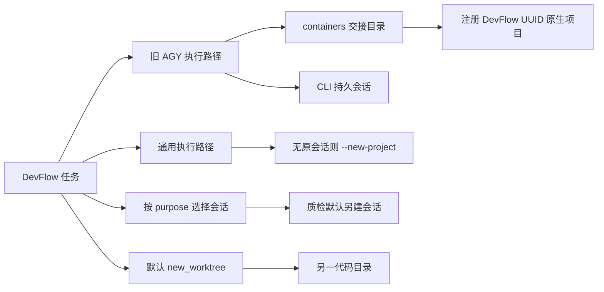
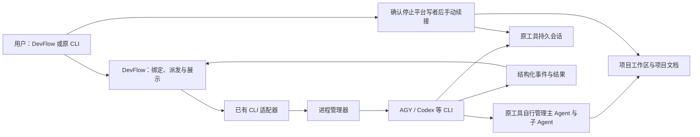
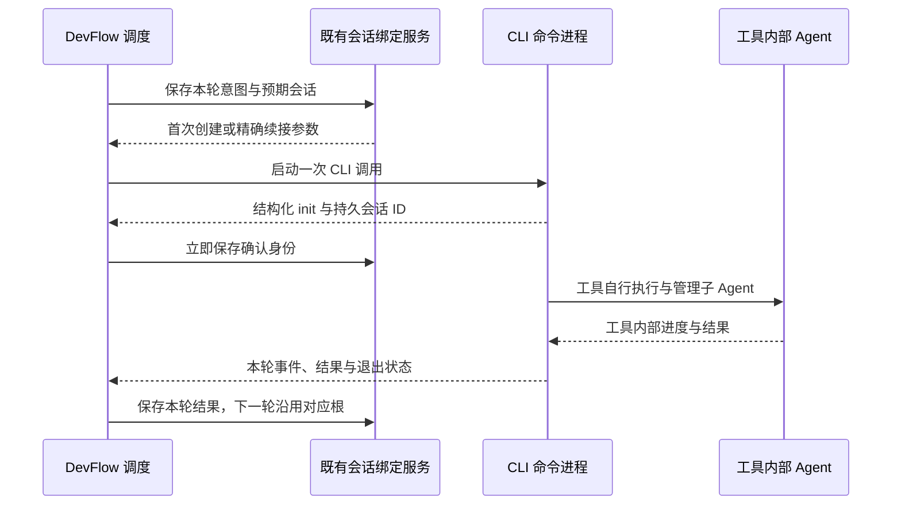
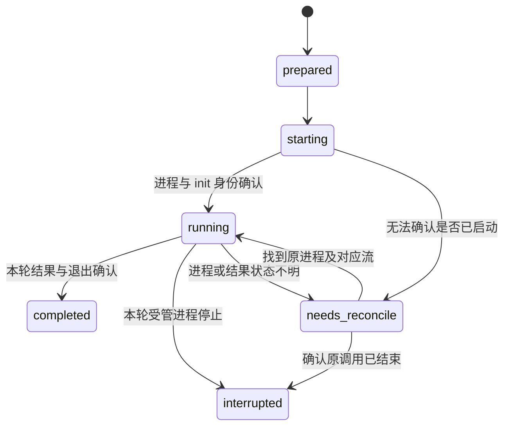
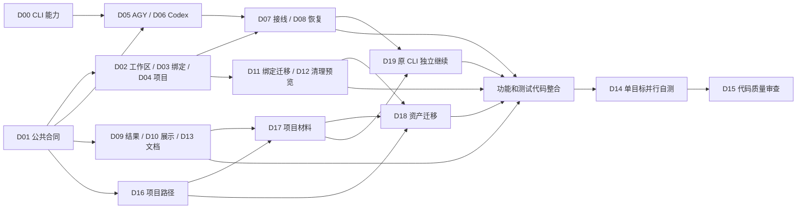

# DevFlow 项目工作区与 CLI 持久会话统一方案及开发计划

日期：2026-09-21。状态：实施与整改已全部完成；所有开发任务落地点已全部就绪，TypeScript 类型静态检查通过（0 错误），全部单元测试、集成测试及关键回归测试已单目标真实执行通过。文件名沿用原名，保留已有链接。

**当前范围以用户最新决定为准：先不考虑桌面端会话显示，沿用 CLI 调用链。** 初稿中的桌面 Sidecar/agentapi、Codex App Server 接入、桌面列表可见、桌面/远程同会话进度均移出本期。它们不再是开发依赖或验收门槛。NV-R05、NV-E06/E07/E13 保留编号并明确标记延期；其他相关任务及场景已改成 CLI 合同，不能继续按初稿桌面合同执行。

上一轮确定的项目资产整改继续有效：代码、worktree、正式文档和证据归项目；DevFlow 负责轻量调度、绑定和展示。选用 CLI 的依据是沿用已有接入、减少新增宿主与集成边界，不是已有 CLI/桌面稳定性对比测试结论。

调查目录：`C:\Code\system-handle`。初稿调查基线为 `HEAD=df18ee4d357fa939645be16fd233a1162bddbebe` 加当时工作区改动；源码仍有其他开发在进行，实施按当前文件和符号核对。§2 保留历史调查事实，不能将其中旧路径和桌面现象当成本期实现目标。

## 1. 当前路线与最终使用体验

1. 新任务默认在选定项目的现有工作区执行；只有用户明确选择独立 worktree 才新建。路径按项目/原工具约定，缺省在原仓库的 `.worktrees/<任务ID>/<仓库ID>` 下，并在创建前展示。
2. 模型执行沿用现有 CLI 适配器与进程管理器。AGY 使用 `agy -p` 和精确 `--conversation`；Codex 使用现有 `exec`/`exec resume` 路径。模型、强度和权限从已选配置生成，不静默降档。
3. 每个任务、工具/账号、实际模型及工作区保留持久 CLI 主会话。后续同模型的规划、代码质检、开发、自测、整改和新批次按 §5 续接，不因 purpose、角色或轮次自动另开。
4. 同工具同账号同模型且 CLI 支持逐轮权限切换时，规划和执行可以共用该任务主会话；不同工具/账号/模型/任务不串绑。能力不满足时说明具体限制，不偷偷换模型或放宽审查权限。
5. DevFlow 从已有结构化 CLI 输出读取进度、结束状态和需输入事项。工作台提供实际目录、会话 ID、会话状态及安全的手动续接说明，不承诺这些 CLI 会话出现在桌面列表。
6. 计划、审核、整改和持久证据保存在任务实际工作区的项目约定位置；平台只引用或缓存，不用资料完整性、截图或报告控制角色切换。
7. 关闭网页不影响服务正在管理的 CLI 执行。停止服务可能中断由它启动的 CLI 命令进程（并非由 DevFlow 管理子 Agent），不能承诺该进程不断线；已保存的会话和项目文件必须保留，用户可确认原写者退出后从原 CLI 精确续接。
8. 手动接管期间关闭自动派发，DevFlow 重启不抢占、不重发旧轮次。重新接入由明确继续动作触发，保留外部开发及当前代码，不自动回滚、审批或验收。

本期的“可继续”是原 CLI 的精确会话续接和项目独立开发，不要求模型进程跨 DevFlow 服务退出仍存活，也不要求桌面端显示。日常沿用每轮一个 CLI 进程，不新增常驻模型代理、Remote Control daemon 或长期驻留的协议进程。


## 2. 初稿调查事实与根因证据

本节保存同日调查快照；桌面现象仅解释问题来源。本期采用 CLI，涉及桌面可见性的原始缺口不再对应必做功能。

### 2.1 先区分四个对象

| 对象 | 作用 | 当前示例 | 目标关系 |
| --- | --- | --- | --- |
| 项目源码目录 | 原项目代码、分支和用户改动 | `C:\Code\crm\crm` | 默认开发位置 |
| Git worktree | 显式隔离另一份工作树、索引和分支 | `.devflow/worktrees/.../main` | 用户选择后保留并持续使用 |
| DevFlow 交接/日志目录 | 临时工作包、schema、协议结果、调度日志 | `.devflow/containers/<workflow>`、`native-runs/<run>` | 可替代运行材料；正式文档按 §4.4 归项目，不注册为原生项目、不作开发 cwd |
| 原生项目与会话 | AGY/Codex 内的项目组织、可见对话与续接 | `crm`、`dev-flow`、会话 ID | 项目复用；每任务每模型持久主会话 |

原生项目是界面中的组织对象，不能拿它的数量直接推算代码副本数量。反过来，原生项目存在，也不证明会话存在或可见。

### 2.2 截图条目与本机配置逐项对照

只读取了 `%USERPROFILE%\.gemini\config\projects\*.json` 的 ID、名称、目录字段，以及 DevFlow SQLite 中相关绑定。以下不是根据名称猜测：

| 截图条目 | 原生项目 ID | 本机登记目录 | 判断 |
| --- | --- | --- | --- |
| DevFlow 4689e9fe… | `4689e9fe-d5cc-460e-b61b-177e1691a956` | `.devflow/containers/wf-fd56ec10-fb20-4459-88da-5d2e4337e085` | 交接目录项目；当前主库没有对应活动工作流记录，需按历史残留处理 |
| DevFlow 8be0a4db… | `8be0a4db-b56d-4f16-8b71-79feb1737af9` | `.devflow/containers/wf-27cee89d-f856-4ef4-b40d-3a62cd681073` | 与主库 `agy_project` 绑定一致 |
| DevFlow b4218973… | `b4218973-a8eb-4a82-8254-152db3ac54f6` | `.devflow/containers/wf-a87ff27b-c0a9-4c4a-bbdf-490064362415` | 与主库 `agy_project` 绑定一致 |
| DevFlow d188644a… | `d188644a-8560-4dd5-a89e-2bef2b612b29` | `.devflow/containers/wf-a00f27d8-c8cb-4f26-8470-2af82a7b8fc7` | 与主库 `agy_project` 绑定一致 |
| live-edit-1789619374288 | `aac2d23f-d15b-4d31-9d2a-5e178cfe5fc8` | `scratch/runtime-fix/live-edit-1789619374288` | 调试目录注册残留 |
| container | `daedd07c-220e-4117-99f6-43c33f77b3e4` | `scratch/runtime-fix/live-edit-1789619570501/container` | 原生文件编辑调试所用容器目录 |

表中相对目录均相对于 `C:\Code\system-handle`。`scratch/runtime-fix/agy-edit-smoke.mjs` 会建立 `live-edit-<时间戳>/container`，以它为 cwd 调用未给 project ID 的 `agyArguments`，与上述调试目录及残留吻合；不应据此删除其他名称类似的项目。

已有原生 `crm` 项目 ID 为 `9ec42da2-7c39-4bd8-b2c4-0240186c03f4`，资源是 `gitFolder.folderUri=file:///c%3A/Code/crm`；`dev-flow` 项目 ID 为 `242420d2-3f62-4cba-8f8a-31109f5760d5`，资源指向 `C:\Code\system-handle`。注意 CRM 原生项目登记的是父目录 `C:\Code\crm`，实际仓库是 `C:\Code\crm\crm`，不能用 basename 或简单字符串相等自动认定绑定，需要一次明确映射。

### 2.3 代码调用链

| 根因 | 已核实位置（行号为调查时参考，实施以符号定位） | 具体行为 |
| --- | --- | --- |
| NV-F01 交接目录注册为项目 | `packages/runtime/src/runtime.ts`，`execute`，约 468–500；`packages/adapters/agy/src/project.ts`，`writeAgyProject` | 按 workflow 生成/复用 UUID，把 containers 目录写入用户原生项目目录，名称固定 `DevFlow <UUID>` |
| NV-F02 新会话触发新项目 | `packages/adapters/sdk/src/invocation.ts`，`clientInvocation` 的 agy 分支；`packages/adapters/agy/src/session.ts`，`agyArguments` | 无 conversation 时通用路径直接 `--new-project`；旧参数函数无 conversation/project 也回退 `--new-project` |
| NV-F03 默认另建代码工作树 | `packages/core/src/create-workflow.ts:48`、`packages/mcp/src/tools.ts:151`、`apps/web/src/components/CreateWorkflowModal.tsx:28` | 核心、MCP、界面默认均为 `new_worktree` |
| NV-F04 默认质检不续规划 | `packages/runtime/src/profile-runtime.ts`，`invoke`、`conversationToResume`；`packages/core/src/round-intent.ts`，`selectConversationToResume` | sessionKey 由 workflow、完整 profile hash 和 purpose 组成；常规 `quality_review` 无 continuation 时返回 undefined |
| NV-F05 会话权威源分裂 | `runtime.ts`、`profile-runtime.ts`、`agy/src/native-adapter.ts` | 并存任务级 `conversation` 和按 profile/purpose 的 `native_conversation`；有路径继续写任务共用指针 |
| NV-F06 旧审查、诊断另启 CLI | `runtime.ts`，旧 `review` 约 1269；旧 `diagnose` 约 201–204 | 审查直接 `codex exec`，无原规划 thread 绑定；诊断明确传 `--ephemeral`。不能把所有 Codex 执行都说成 ephemeral |
| NV-F07 能力合同缺可见性 | `packages/adapters/sdk/src/interface.ts`，`CapabilityReport` | 只有 exactResume 等能力，没有 native project、桌面可见、远程可用、原生 turn 身份合同 |
| NV-F08 项目配置会被整体重写 | `agy/src/project.ts`，`writeAgyProject` | 固定构造项目资源及 permissionGrants，现有文件只验证目录后整体写回；复用用户项目时不能沿用此行为 |

真正的 worktree 有两个创建入口：旧 `GitManager.prepare` 使用配置的 workspace_root；新 `CreateWorkflowService.execute` 使用 Git common dir 下的 `devflow/worktrees`。主库调查时四个现存 workflow 均登记 `new_worktree`，这只能说明这些任务的记录如此，不能倒推当时是不是用户主动选的。历史选择继续有效。

### 2.4 “没有会话”不等于“没有持久化”

本机三个已绑定的 AGY 会话文件 `cdd946fb-…`、`941c277b-…`、`43dbdc83-…` 存在于 `.gemini/antigravity-cli/conversations/`，大小分别约 15.9 MB、37.7 MB、24.2 MB；在 `.gemini/antigravity/conversations/` 中没有对应同 ID 文件。它们是持久 CLI 会话，不是简单的一次性内存请求；但这种持久化没有满足截图中桌面项目下可见的要求。

本轮普通只读 SQLite 连接读取 AGY 原生会话内容返回 `SQLITE_CANTOPEN`，因此本轮只确认文件存在和存储分离，不宣称核验了其中消息、步骤数或可恢复状态；没有为绕过错误写用户数据库或复制历史。

AGY 官方说明：CLI 可按精确 ID 恢复，桌面会话导入 CLI 会克隆历史；这不能当作桌面与 CLI 共用一个会话的证明。[AGY Resume](https://www.antigravity.google/docs/cli/commands/resume)



图的结论：NV-D02/D04/D05/D07 分别解决目录默认、项目注册、CLI 参数与续接、会话选择；只删除侧栏条目无法修复整条链。

### 2.5 项目资产被集中到平台目录的补充调查

本节来自本次对当前配置、源码、只读主 SQLite 和实际文档目录的核对，不以旧方案中的目标行为冒充已实现行为。

| 根因 | 已核实位置（以符号定位） | 当前事实与影响 |
| --- | --- | --- |
| NV-F09 全局 worktree 根接管项目位置 | `devflow.yaml` 的 `workspace_root`；`packages/contracts/src/config.ts` 的默认值/`loadConfig`；`packages/git/src/git.ts` 的 `GitManager.prepare` | 本机设为 `C:\Code\system-handle\.devflow\worktrees`，旧入口拼接 project/workflow/repo；CRM 的工作树因此建在 DevFlow 应用下面 |
| NV-F10 新入口和清理规则另有路径假设 | `packages/core/src/create-workflow.ts` 的 `target`；`packages/git/src/delivery-coordinator.ts` 的工作树清理 | 新入口使用 `<git-common-dir>/devflow/worktrees`；清理仅识别全局根及 common dir 下的根。只改创建路径会造成后续行为不一致 |
| NV-F11 正式文档默认导出到平台 | `packages/core/src/engine.ts` 的 `exportDocuments`；实际 `.devflow/documents` | 导出计划、开发/测试进度至平台目录；现存 CRM 任务目录还有 `repair_plan.md`。不能据此保证离开平台后在项目内能找到完整资料 |
| NV-F12 审核运行输出与报告归档依赖平台路径 | `packages/runtime/src/runtime.ts` 的 `legacyReview`；`profile-runtime.ts` 的 `invoke`；`packages/evidence/src/delivery-importer.ts`、`archive-consumer.ts`；`engine.ts` 的 `deliveryReportFiles` | reviews/native-runs/deliveries 使用 storage_root。报告有从项目复制归档的路径，不等于全部原件被搬走；正式正文、项目原件与平台缓存缺少统一归属 |

主库 `workspace` 中，CRM 来源 `C:\Code\crm\crm` 对应 `wf-27cee89d-f856-4ef4-b40d-3a62cd681073` 和 `wf-a00f27d8-c8cb-4f26-8470-2af82a7b8fc7` 的工作树，均登记在 `C:\Code\system-handle\.devflow\worktrees\project-59cb679f9e8664bb\…\main`。工作树记录包含历史任务，不能仅凭记录数量推断活动工作流数量。

根因是把项目资产生命周期与平台运行目录绑定。整改同时覆盖创建、材料引用、交付/清理、CLI 调用生命周期和历史迁移；不能只改 YAML，也不能把所有私有 JSON/日志机械复制进项目作为解决办法。

## 3. 需求、范围及与旧方案的关系

### 3.1 需求索引

| 需求 | 本期固定结果 | 开发任务 | 主要验收 |
| --- | --- | --- | --- |
| NV-R01 | 停止把交接/调试目录注册成项目，不按 Run 自动新建项目 | D02、D04、D12 | U02、I01、E01、E12 |
| NV-R02 | 默认现有工作区，保留显式 worktree | D02、D04 | U01、I02、E01、E02 |
| NV-R03 | 同规划模型后续质检续用已绑定 CLI 主会话 | D01、D03、D06、D07 | U03、I03、E03 |
| NV-R04 | 执行、整改和新批次续用对应 CLI 主会话 | D03、D05、D07 | I04、E04、E05 |
| NV-R05 | 延期：桌面端及原生远程显示，不属于本期范围 | 无本期开发依赖 | E06、E07、E13（延期） |
| NV-R06 | 轻量 CLI 过程展示，关闭网页不影响执行 | D08、D09、D10 | I09、E08 |
| NV-R07 | 合法已有 CLI 会话可绑定，恢复不丢身份 | D03、D07、D08、D11 | I05、I06、E09 |
| NV-R08 | 保留历史、配置、计划、权限和用户改动 | D02、D04、D11、D12 | I07、I11、E10、E12 |
| NV-R09 | CLI 手动接管与平台派发不并行写入、不重复执行 | D08、D09、D19 | U05、I08、E11 |
| NV-R10 | CLI 能力、实际模型及异常分类真实，不静默降级 | D00、D01、D05、D06 | U07、I12、E14 |
| NV-R11 | worktree 路径归项目，新旧入口一致 | D02、D16 | U08、I13、E15 |
| NV-R12 | 正式文档/证据归项目，平台只引用或缓存 | D09、D17 | U09、I14、E16 |
| NV-R13 | 停服后从原 CLI 手动续接，项目开发不依赖平台 | D05、D06、D08、D19 | U11、I16、E17 |
| NV-R14 | 历史资产可逐任务预览、迁移和恢复 | D11、D18 | U10、I15、E18 |

D/U/I/E 简写均带 `NV-` 前缀。保留 14 个需求编号，其中 13 项本期实施、R05 延期；延期不算失败，也不能标成已通过。

### 3.2 冲突覆盖与明确延期

| 原条款/文档 | 当前处理 |
| --- | --- |
| 本文初稿桌面可见路线、NativeSessionHost、Sidecar/agentapi、App Server/desktop locator 接入 | 本期不实现；§6 改为既有 CLI adapter 与 ProcessManager，不为 CLI 执行先接入桌面 |
| 本文初稿“不能降级隐藏 CLI”“停服务不能结束当前原生 turn” | 用户已明确选择 CLI；本期直接使用持久 CLI 会话。停服可中断受管进程，但不能删除会话/项目资产；精确续接按 §4.5/§7 |
| [执行会话隔离与恢复机制整改计划](./DevFlow执行会话隔离与恢复机制整改计划-20260917.md) 按 purpose 拆主会话 | 保留身份/CAS/迟到结果防护；主会话按本文 §5 复用，role/purpose 属于 Run |
| [模型配置与运行中切换计划](./DevFlow模型配置与运行中切换详细实施计划-20260918.md) 每次质检新根、换强度新根、A→B→A 新 A | 对经核验 CLI 支持的同模型配置复用原根；切回 A 找原 A。能力缺失明确报告，不能自动换模型、权限或会话 |
| [子 Agent 可视化与会话交互计划](./DevFlow子Agent可视化与会话交互详细设计及开发计划-20260920.md) | 沿用 CLI 可观察事件；根节点引用本文绑定，不为取得桌面事件新接宿主。无法观察的字段如实缺省 |
| 全局 workspace_root、common dir 工作树、自动删除 owned 工作树 | 新任务按 §4.3；旧配置只作兼容定位，owned 不是删除许可 |
| storage_root 内唯一正式文档、报告绝对路径 | §4.4 保留项目原件并使用相对引用，旧唯一副本走 §9.4；资料失败不作为角色切换门槛 |
| 初稿 CLI 转桌面迁移、远程启动/开关、桌面会话列表修复 | 延期。本期只迁移绑定结构和项目资产，不转换会话存储、不启用远程 |

显式 aside 保持独立只读；正式规划问答和需求澄清回到相应主会话。子 Agent 的创建、分工、协作、停止和恢复由原工具及其主 Agent 管理；DevFlow 只消费可观察事件，不逐个派发或控制。本期不增加业务阶段、审批、测试证明合同或模型监督。

## 4. 目标架构与工作区规则



### 4.1 工作区

- HTTP、MCP、表单和 CLI 中转统一默认 `existing_workspace`；已有 worktree 记录不改模式、不自动搬回主工作区。
- `Workspace.root` 是实际 cwd，`source_root` 是原项目根，CLI project ID 只是可选工具分组。三者不能相互替代。多仓库使用明确的 `primary_repo_id` 和 repo_id 映射。
- 临时 prompt/schema、协议输出和显示缓存可放 storage_root；正式正文及持久证据按 §4.4。读取/写入权限按当前轮次限定，不能把整个平台目录当业务 cwd。
- 工作区忙时保留 `WORKSPACE_BUSY`；不能自动换目录、抢占其他任务或默认分叉。保留暂存/未暂存/未跟踪文件，不 reset、不自动 stash。
- 续接时核验请求 cwd、工具实际工作根及登记的工作区一致；无法改变旧会话工作根时明确不兼容，不能仅靠 prompt 要求其换目录。

### 4.2 CLI 项目绑定

保留原项目与 repo 的关系，在既有配置/绑定中记录可选的工具 project ID；取消按 workflow 直接写 AGY 私有项目 JSON 和无条件 `--new-project`。不新增要求用户先完成桌面项目连接的关卡。

AGY 已有明确 CLI project 时，在资源映射与本轮实际工作区兼容后使用 `--project`；续接优先使用准确 conversation ID，并核验其项目/目录归属。没有 project 约定时省略项目创建参数，使用 CLI 自身默认分组和真实 cwd/目录参数；其实际工作根须由 D00/D05 验证，不能以“传了 --add-dir”直接认定隔离成立。不按名称相同或最近会话猜绑定。

本期不要求 CLI 项目在桌面端可见，也不修改用户已有项目资源、权限、MCP、Sidecar 或会话配置。历史伪项目只列清理预览，实际清理由用户单独选择。


### 4.3 worktree 路径及资产生命周期

一个共享路径解析器供旧 `GitManager.prepare`、新 `CreateWorkflowService`、MCP/HTTP/CLI、预览与恢复使用。入口的 `workspace_root` 仍表示用户选定的来源仓库，不能复用它来暗指全局输出目录。

解析顺序固定：本次明确指定的 `worktree_path` → 项目已登记的原工具/项目 worktree 目录约定 → `<source_root>/.worktrees/<workflow_id>/<repo_id>`。多仓库请求以 repo_id 分别映射路径，单仓库入口保留简写。前两项属于用户/项目选择，不能被全局配置覆盖；无约定时直接使用缺省值，不增加一次审批。项目约定来自用户选择或已确认的项目配置，不能扫描到某个同名目录就认定它是约定。

- 每个仓库分别按其原始项目根解析。已从 worktree 发起的任务复用已确认的 `source_root` 映射，不能在当前 worktree 下递归创建 worktree；映射不明确时说明具体缺项，不猜 `.git` 的父目录。
- 创建前展示规范化绝对路径、来源仓库、分支；多仓库分别列出。复用原幂等键和创建意图，冻结解析后的目标路径及路径策略版本，重试不能因默认值/配置变化改到另一个位置。
- 预览使用由本次 request_id 稳定确定的候选 workflow ID，所有入口共用同一映射；创建端重新核验来源、目标与分支，不信任客户端拼出的越界路径。无预览的兼容调用在服务端运行同一解析器并返回实际位置；仍不得触发不同默认策略。
- 缺省嵌套目录使用 Git 本地 exclude 忽略 `.worktrees/`，通过 Git 查询实际 exclude 文件后幂等追加，保留原内容，不改项目 `.gitignore` 或暂存区。源目录扫描、快照及变更统计也排除已登记的子 worktree，避免递归统计。若已有被跟踪内容占用该目录，明确路径冲突，不强行忽略或覆盖。
- 核验真实父目录、大小写、符号链接/Junction、现存目录及 Git 注册，防止越界或覆盖。平台安装/私有存储目录与 `.git` 元数据目录不得作为新代码工作树目标；项目本身就是 DevFlow 仓库时，仓库内普通 `.worktrees` 仍合法，不把整个源码仓库误判为禁用区域。
- 全局 `Config.workspace_root` 不再决定新任务路径；安装器停止为新项目生成“统一托管工作树根”。旧值保留用于历史识别和恢复，不能回退为新任务的默认值。
- `Workspace.owned` 保留创建来源语义。任务完成、合并、移除任务、停用/卸载 DevFlow 均不自动删除 worktree、分支、项目文档或证据。既有清理入口改为单独明确选择，按精确 Git 注册、路径和当前内容判断，不能只靠 `devflow/` 分支名或目录前缀授权清理。

例如 CRM 无既定约定时，独立工作树位于 `C:\Code\crm\crm\.worktrees\<任务ID>\main`，正式资料位于这份工作树内的项目文档目录；不再位于 `C:\Code\system-handle\.devflow`。

### 4.4 正式文档、证据原件与平台缓存

位置优先级固定为：用户明确指定 → 项目已有 `AGENTS.md`、文档规范和报告配置 → 下列缺省位置。路径明确时直接沿用，平台不强制改名、转格式或加 DevFlow 专属目录。文档根指任务实际 `Workspace.root`，不是另一份正在被其他任务使用的来源工作树。

| 材料 | 无既定约定时的位置/权威来源 | DevFlow 的职责 |
| --- | --- | --- |
| 需求设计、正式计划与整改方案 | `docs/plan/<任务ID>/`；设计长文可沿用 `docs/design/` | 引用模型编写的项目文件及版本；不根据数据库定期覆盖正文 |
| 代码审查结论 | `docs/plan/<任务ID>/` 的审查文档，沿用项目已有审查目录时不迁走 | 显示摘要和原文件入口；不强制字段齐全才派下一角色 |
| 开发事实、未完成事项与接续说明 | `docs/process/<任务ID>/` | 可选辅助接续；不是第二份实施计划或新的调度关卡 |
| 测试报告、截图等需保留的证据 | 先保留测试工具原有输出位置；原位置为临时/易覆盖目录且需长期留存时，由执行方保存到 `docs/test/evidence/<任务ID>/<轮次>/` | 按引用展示或异步缓存；不要求全部日志入库或进 Git |
| 原生会话与消息历史 | 原工具的持久存储，关联真实项目/worktree | 保存原生 ID、入口及必要摘要，不复制成第二套聊天数据库 |
| prompt/schema、传输回执、原始遥测、显示索引 | 平台 storage_root 内的运行数据/缓存 | 允许按保留策略清理；不得是正式正文、证据原件或继续开发信息的唯一副本 |

实现沿用既有附件/材料条目，增量保存 `repo_id`、`workspace_id`、项目相对 `path` 和可选 `cache_path/hash`；已有项目认可的外部报告地址保留原 locator。由绑定工作区解析当前绝对路径，不把平台绝对路径作为新记录的唯一定位方式，不再建设材料管理数据库。旧记录保持兼容读取并标明来源。

写入和读取责任固定如下：

1. 规划/执行模型按项目规则创建正式文档；已经指定的原计划只引用，不另写数据库生成版本替代。计划修订沿用现有规划授权，执行模型不能借落盘整改自行换计划。
2. 只读代码审查仍不授予代码写权限。主审返回完整正文后，既有结果处理器可按事先约定的项目文档路径保存审查输出，权限只覆盖该输出；当前文件已变化时保留原文和新版本，不能覆盖用户修改。文档保存失败显示具体位置和错误，原审查结论/下一角色不因此失效。
3. `exportDocuments` 改为可选的进度/摘要输出，不自动把数据库拼接文本写成正式计划。材料读取、review bridge、handoff 和前端文件入口统一优先解析项目原件；提示词携带可直接读取的项目相对路径及必要正文，不要求先调用 DevFlow MCP 才知道原计划。
4. 缓存缺失但原件存在时直接读取原件；缓存失败、资料不存在或不可读时显示状态，不能伪造内容、增加质检失败次数或阻塞角色切换。执行模型确实缺少继续某项工作的必要正文时，按已有澄清机制处理该项，不能把所有附件变成统一门槛。
5. 平台清理/卸载只处理明确归属的缓存；不得沿项目引用递归删除原件。对仍只存在于旧平台目录的正式材料保留原件并提供 §9.4 迁移预览，不能先当缓存清掉。项目备份及原生会话备份各由原归属工具负责，平台备份不能被宣传成完整项目备份。
6. 独立 worktree 的文档随该分支正常交付，不能同时回写主工作区。需要长期保留且不进 Git 的证据按项目现有发布/保留规则处理；未完成转存时保留该 worktree。提交前仍遵守项目的敏感信息和生成物排除规则，不为本方案强制提交所有报告。

这是一套资料归属和引用规则，不新增文档审批、材料完整性校验、模型监督、额外业务阶段或固定文档模板。记录 hash 用于防止覆盖和定位版本，不作为开发/质检完成的证明。

### 4.5 停止使用 DevFlow 后从原 CLI 继续

- 关闭网页不结束服务管理的 CLI 进程。主动暂停/停止任务时，先关闭后续派发，再停止该任务拥有的进程并确认退出；不杀原工具全部进程。
- 停止 DevFlow 服务或宿主退出可能中断由它启动的 CLI 命令进程。本期不做进程脱离、保活 daemon 或后台模型监督；已落盘会话、用户代码和正式资料保留，中断状态如实显示。
- `dispatch_enabled` 为 workflow 持久化调度开关，缺省 true；它还必须服从原有 STOPPED/暂停状态。关闭仅阻止后续派发；要转到原 CLI 写入，仍需确认当前受管 CLI 已退出，避免两个进程写同一会话。
- 停用前展示并可保存到项目 `docs/process` 的接续信息：工具、精确会话 ID、真实 cwd、当前模型/配置引用、原计划路径和当前未完成项。只保存非敏感事实，不存 token，不另建实施计划；不存在这份辅助说明不妨碍用户直接使用已知的原 CLI 会话。
- AGY 手动续接以精确 `agy --conversation <ID>` 为基础；其他工具由其适配器生成经版本核验的对应命令。命令必须正确转义，并在目标 cwd 执行。展示/复制命令不自动启动模型；运行中禁用手动启动入口并说明占用。
- 过期 DevFlow MCP/token/Hook 不能阻断原 CLI 的普通开发、测试和 Git 命令。只对平台自己注入的回传项提供退出/禁用办法，保留用户已有工具配置。旧会话若持有必须在线的平台配置，D19 要消除该依赖并验证，不能只给一条 resume 命令算完成。
- 手动继续期间不自动派发。重新接入先检查原 CLI 进程、会话及工作区变化，沿用当前计划和用户明确继续动作，不自动重跑、回滚、批准或验收。
- 工具会话丢失/损坏、续接不支持或新路径不兼容时，保留代码和原记录并报告具体限制；不能悄悄创建替代会话。用户明确选择新会话后才记录新代次和历史关联。

## 5. CLI 会话身份、角色和复用规则

### 5.1 复用键与选择规则

复用键固定为：

```text
workflow_id + adapter_id + host_id + client_scope_id
            + provider_account_scope + canonical_model_id
            + workspace_identity
```

`client_scope_id` 包含 CLI 配置/存储域的稳定身份，不能因 PID、Run 或服务重启改变。`workspace_identity` 由规范仓库/真实根路径映射形成；移动工作树走迁移。缺账号或模型事实时保持未知并核验，不能用模型自报文本冒充工具元数据。

排除 Run、role、purpose、质检轮次、plan_revision、profile 名称和强度。强度/权限等本轮配置仍冻结在 Run；CLI 无法在同会话生效时明确返回配置不兼容，不扩大权限或自动新建根。工具明确支持的原生默认模型可使用实际读取的模型身份，未读到时不能把请求值写成“已验证”。

| 场景 | 决策 |
| --- | --- |
| 首次规划/首次执行 | 首次从 CLI 结构化 init 得到持久 ID，立即保存，不等本轮成功 |
| 同模型规划补充、质检、整改意见、need_planner、正式澄清 | 续接该模型主会话 |
| 同执行模型开发、自测、整改、功能修复和后续批次 | 续接该模型主会话 |
| 同工具/账号/模型兼任规划执行 | 经逐轮权限能力核验后共用根，按 Run 区分角色并串行派发 |
| A→B→A 或仅改强度/profile 名称 | B 使用 B 根；回 A 续 A 并补期间增量，语义相同配置不另开 |
| 不同任务/账号/工具/工作根 | 不复用；工作根迁移需要显式校准，禁止串到源工作区 |
| 原 CLI 根无法恢复或不兼容 | 报错保留；用户明确重建才产生新代次 |
| 显式 aside/原工具子 Agent | 保留既有独立语义，不覆盖正式根 ID |

同会话代码复核仍按当前只读角色检查真实代码和上下游，不能凭旧规划/执行者声明批准；功能正确性由用户验收。不得因为复核角色变化自行另建会话绕开问题。

### 5.2 最小持久化合同

复用 SQLite、现有 session_slot/session_binding 设计及 outbox，不另建原生宿主或聊天数据库。绑定只需身份键、generation/revision、精确 conversation ID、可选 CLI project ID、workspace 映射、首次/最近 Run 和 `reserved/bound/needs_reconcile/unavailable/retired` 状态。桌面可见性、remote locator、desktop host capability 均不属于本期字段要求。

每轮保留 dispatch ID、Run、binding revision、预期 conversation ID、进程身份（PID、启动时间、所属 Host）、已接收事件游标与结果 ID。CLI 没有原生 turn ID 时使用已认证的 Run/进程/结构化流关联，不伪造 turn ID，也不为缺少桌面回执而阻断正常 CLI 执行。

首次 init 与预期绑定不符，或旧进程结果晚到时保留原文并拒绝推进当前轮次。根 ID 一经确认不可直接覆写。运行期统一从绑定服务读取；旧 `conversation[workflow]`、按 profile/purpose 的 `native_conversation` 只作兼容迁移来源，不能继续双写成两套权威状态。

### 5.3 接入已有 CLI 会话

可信工具/MCP 上下文可携带 adapter、host/client scope、conversation ID、实际 cwd 和工具可核验配置。外部提供 ID 要核实工具和目录归属，不能选择“最近会话”或拿另一个任务的 ID。已有规划轮次只接收其结果，不能再派一遍规划。

桌面端发起的规划与 CLI 是否能共享精确会话尚不属于本期保证；不能拿桌面 ID 直接填 CLI 绑定或声称克隆后仍是同一会话。缺少可用 CLI 身份时明确说明需要首次 CLI 会话/用户选择，原文档与原对话继续保留。

## 6. CLI 接入路线与能力边界

### 6.1 复用现有接口

沿用 `packages/adapters/sdk/src/interface.ts` 中适配器 prepare/resume、`PreparedInvocation`、现有结构化事件和 `packages/process/src/manager.ts`。不新增 `NativeSessionHost`、desktop-host、agentapi bridge 或 App Server 客户端。

D00 只核对正在使用的 CLI 版本、准确参数、持久 ID/续接、cwd/多目录、模型/强度、只读能力、输出和退出/中断语义。命令行帮助不能证明模型账号有访问权限；真实最小验证在专用合成项目中完成。缺能力只限制受影响工具/操作，不作为所有其他任务的前置关卡。

### 6.2 AGY：沿用 print/stream-json 与精确 conversation

当前已核实本机 CLI 为 `1.2.7`；`session.ts` 与 SDK invocation 使用 `-p`、`--output-format stream-json` 和 `--conversation`。实施继续以实际安装版本的帮助和定向测试核验，不修改账户/模型配置来适配计划。

- 首轮 `agy -p`，读取结构化 init 的 conversation ID 并立即持久化；后续必须带该精确 ID，不能用 `--continue` 或仅靠 cwd 选最近历史。
- 统一旧/new adapter 参数生成，去除无条件 `--new-project`。真实 cwd/仓库目录来自 Workspace，项目绑定按 §4.2。
- 逐轮传递已选模型、强度、执行模式及权限；保留用户配置优先级。`--mode plan` 是否足以满足本轮只读边界需要实际验证，不能只凭名字或 prompt 宣称沙箱成立。
- 解析当前轮次的 init/进度/result、退出码和中断；恢复结果可能含历史错误时按当前轮次边界处理，不把历史累计状态当新失败。
- 保留每轮一个进程的既有方式；持久的是会话，进程无需常驻。不新增 stream-json 长连接改造或 Remote Control 服务作为本期依赖。
- 桌面中的 `@conversation` 历史引用、会话导入和浏览器 Remote Control 均不能充当桌面实时显示的验收；本期不接入它们。

### 6.3 Codex：沿用现有 CLI exec/resume 适配器

继续使用当前 SDK invocation 的 `exec` 与带精确 ID 的 `exec resume`，不改成 App Server。本期不要求 CLI 创建的记录出现在 Codex 桌面任务列表。

从结构化事件确认持久 thread/conversation ID；真实 cwd、模型、强度、sandbox/权限按本轮冻结配置传递。初次和 resume 参数解析差异必须单独测试，不能把一次帮助输出或旧版本命令当成完整能力证明。正式主会话不使用 ephemeral；失去准确 ID 时保留现场，不默认新建“携带材料继续”的替代会话。

UI 手动续接命令使用该安装版本实际支持的交互 CLI 入口，区别于平台 exec 的非交互参数；由适配器构造参数数组并正确转义，不复制平台临时 token/私有 schema 配置到用户终端。

### 6.4 桌面与远程明确延期

`@conversation` 引用历史、网页 Remote Control 和桌面项目列表实时进度是不同能力。本期不开发/验证桌面 Sidecar、agentapi、新 App Server 接入、CLI→桌面存储转换或远程启用。已有用户配置保留，不随本次方案移除。

未来若恢复桌面需求，应另行核验创建 ID、项目列表、进行中的实时输出、后续轮次同根和客户端接管；当前 CLI 验收不能替代。官方资料仅作概念边界参考：[CLI 与桌面会话](https://antigravity.google/blog/introducing-google-antigravity-cli)、[Sidecars](https://antigravity.google/docs/sidecars)、[Remote Control](https://antigravity.google/docs/remote-control?tab=cli)。


## 7. 派发、恢复、暂停与手动续接

### 7.1 首次调用与后续派发



1. 冻结本轮 purpose、模型/权限配置、plan_revision、feedback_cursor 和真实工作区。
2. 从统一绑定服务取精确 CLI 身份；校验工具、账号/配置域、模型与 cwd。缺身份不按“最近会话”补猜。
3. 在现有事务/outbox 中保留唯一 run/dispatch 意图及绑定版本，获取当前会话的派发占用。启动进程在数据库事务外进行，不在事务内等待模型。
4. 复查 `dispatch_enabled`、原任务暂停状态和受管写者；由适配器生成参数，ProcessManager 启动本轮 CLI。首次 init 一到即保存根 ID，不等整轮成功。
5. 仅将来自本轮已登记进程流的事件关联到该 Run；工具报告的子 Agent 事件只作观察，不产生 DevFlow 子任务派发。子会话 ID 不得覆盖根 ID。
6. 先保存本轮结果并按既有业务规则决定下一角色，再异步处理可选日志/附件。CLI 正常退出不等于计划获批或功能验收通过。

同一个持久会话可由多轮先后启动的命令进程续接。“新进程”不等于“新会话”，更不等于“创建子 Agent”。DevFlow 调度规划/执行/复核轮次；执行模型在其工具内决定具体任务分解和子 Agent 协作。

### 7.2 启动不确定与崩溃恢复



复用现有进程登记、Host 所有权、输出文件/事件及恢复逻辑。按 PID 加启动时间/所属 Host 核对，防止 PID 复用误认。若进程仍在运行且已有可恢复观察通道，恢复观察；若已退出，仅补入能够确认属于原 dispatch 的结果；不能重新执行模型来“补结果”。

进程启动与 SQLite 不能构成原子事务。崩溃窗口内若无法确认原调用是否已执行，保留 `needs_reconcile` 并停止该项自动重发，不宣称 outbox 已保证外部 exactly-once。不扫描或接管用户全部 CLI 进程。STOPPED/关闭自动派发的任务保持停止；不存在进程也不等于用户同意重新运行。

### 7.3 原 CLI 手动接管

- 用户可直接查看项目文件与工具自己的历史；读历史无需 DevFlow 租约。
- 手动向同一会话发新消息前，先停用平台后续派发并确认当前受管 CLI 调用已经退出。界面给出真实 cwd、工具和准确续接命令，不自动执行。
- CLI 用户可在 DevFlow 外独立开发。平台不承诺实时发现原工具全部外部消息，不为此接入桌面宿主、扫描聊天存储或新建常驻观察进程。
- 手动开发结束后，用户明确选择重新接入；核对同一会话/工作区和外部改动，再提交必要的任务增量。不重置用户代码，不自动重跑原轮次，也不把外部一句“完成”当成计划批准、正式代码复核或人工验收。
- 平台只能保证自己派发路径的互斥；CLI 不提供跨客户端忙闲事实时必须说明这一限制。无法确认原写者已退出时保持待确认，不能再开第二个根来绕过。
- 原工具模型/账号/cwd 已变更时显示实际差异，按明确保存的配置选择会话；不偷偷覆盖任务设置。

### 7.4 停止调用与子 Agent 管理边界

**“CLI 子进程”是操作系统进程关系；“子 Agent”是原工具内部协作关系，二者不能混用。** 当前 `ProcessManager` 会直接 spawn 命令，或经 DevFlow Host 启动命令。DevFlow 启动的是该轮 `agy/codex` 工具入口，不是为模型每个子 Agent 再起一个命令。

| 对象 | 管理方 | DevFlow 的职责 |
| --- | --- | --- |
| 任务阶段、当前角色与下一轮派发 | DevFlow | 传入已选配置/目录/会话，接收结果并展示 |
| 本轮由平台启动的 CLI 命令进程 | ProcessManager/现有 Host | 启动、收输出、超时/明确停止、核实退出 |
| 工具内主 Agent、子 Agent、子会话和协作 | AGY/Codex 等工具及其主 Agent | 仅消费工具已提供的信息；不另建调度、重试或逐子 Agent 控制器 |
| 持久会话存储 | 原工具 | 保存精确绑定，按工具入口续接；不复制一套聊天库 |

暂停先阻止下一轮派发，再停止本轮受管调用并核实退出。优先使用工具支持的中断方式，必要时按现有所有权逻辑终止该调用范围；不能停止用户的整个 AGY/Codex 客户端或无关进程。当前 `ProcessManager.close()` 会停止其 active 集合；服务退出对活动调用的影响必须以实际关闭路径核验，不能承诺独立存活。

根调用中断是否影响工具内部子 Agent，由工具自身运行方式决定；操作系统进程树退出也不等于平台拥有子 Agent 调度权。D00/D08 记录可观察行为，未知时如实显示，不能逐个伪造“子 Agent 已停止/已恢复”。本期不新增逐子 Agent 暂停、续跑、重派发或保活服务。

## 8. API、结果回传和轻量展示

### 8.1 复用服务入口

| 入口（拟新增或增量修改） | 内容与行为 |
| --- | --- |
| `GET /api/workflows/:id/session-bindings` | 只读返回工具、精确 CLI 会话、实际模型/工作区、最近 Run 与状态 |
| `POST /api/workflows/:id/session-bindings/adopt` | 核验已有 CLI 会话来源、目录、版本和 request_id；有活动调用时不偷换绑定 |
| `POST /api/workflows/:id/session-bindings/repair-preview` / `repair` | 分开只读预览与明确应用，列明历史影响；CAS 更新，不自动恢复运行 |
| `GET /api/workflows/:id/session-bindings/:bindingId/resume-instructions` | 返回目标 cwd、经过转义的原 CLI 续接说明及当前占用；读取/复制不启动模型 |
| `POST /api/workspaces/preview` | 只读计算来源、目标路径和分支；创建携带冻结预览值并纳入幂等摘要 |
| 既有创建/执行/复核/恢复 HTTP/MCP 入口 | 统一 binding/dispatch/continuation，MCP 不保留另走 `--new-project` 的路径 |
| 既有暂停/继续入口 | 持久化 `dispatch_enabled`，区分停止后续派发与当前 CLI 是否已退出 |
| 既有材料读取/打开入口 | 项目原件优先，兼容旧平台原件；读取不生成或覆盖正式文档 |

复用已有权限、项目/工作流归属检查和 WebSocket 事件流，不新增 native-connections、desktop open-target 或原生桥接认证通道。会话 ID 是 opaque string，不强制所有工具共用 UUID 格式。工具自身的参数/ID 校验留在 adapter。

### 8.2 结果归属

沿用既有规划、执行、质检结构和轮次意图解析。关联字段只负责当前 workflow/run/binding/dispatch/结果 ID；工具没有原生 turn ID 时按已登记进程与流关联，不伪造桌面回执。

每次 CLI 调用使用当前 Run 的有效上下文。持久历史里的旧 token/回传地址不能拿来推进新轮次；原工具手动续接不需要平台在线才能普通开发。结构化最终输出与模型正式提交工具若重复返回同结果，按当前 dispatch 去重；相互矛盾时保存原文并走既有 unclear 澄清，不能任选“通过”。

子 Agent 事件只供展示或由主 Agent 汇总；不能让某个子 Agent 的结束信号直接完成平台根轮次。附件缺失、归档失败和遥测不完整只影响显示，不能阻止合法结果调度或增加质量失败计数。

### 8.3 工作台最小改动

```text
当前：代码复核 · AGY CLI · 实际模型/强度
会话：已绑定 · 本轮运行中
[查看进度] [打开工作区] [会话与续接说明] [停用自动调度]
```

- 新建默认现有目录；显式 worktree 展示将实际创建的路径和分支。
- 展示结构化 CLI 进度与最近更新时间；工具没有报告的子 Agent、模型强度或状态标为未知，不补造。
- 会话详情展示工具、精确会话 ID、cwd、最近轮次和手动续接步骤。运行中先提示停止当前调用，不设计桌面/远程按钮。
- 资料显示项目原件位置和可选缓存状态。关闭网页不会发出停止命令；停服与停用调度的影响分别说明。
- 不增加桌面连接设置、子 Agent 控制面板、材料审批或任务脱离向导。

### 8.4 错误处理

会话不存在、cwd 不兼容、模型/权限不支持、CLI 启动/超时/认证失败、结果归属不明分别呈现；复用已有错误分类，不能都计入代码质量失败。保持既有 need_user/need_planner/unclear 路由，缺 CLI 能力只阻塞依赖该能力的调用。禁止自动换模型、开新根、扩大权限或重新 clone。

## 9. 历史任务、会话与项目残留的迁移

### 9.1 保留 CLI 历史，逐任务迁移绑定

1. 只读核对 workflow/workspace、旧 `agy_project`、`conversation`、`native_conversation`、Run init 及 CLI 元数据，生成预览；不能凭 ID 形状判断工具。
2. 明确匹配的已有 CLI 根沿用同一 ID，迁移的只是 DevFlow 绑定结构；多个候选显示来源、目录、模型及 ID，由用户选定，不选“最近一个”。
3. 本期不将 CLI 会话转成桌面会话，不改写原工具会话存储，不克隆新根冒充原 ID。
4. 旧会话缺失或无法恢复时报告缺口；保留历史，用户明确选择新根才记录新代次及历史关联。缺少状态资料本身不要求重跑模型。
5. 会话绑定迁移不移动 worktree；项目资产迁移单独按 §9.4。只暂停受影响任务并确认调用静止，以版本/CAS 应用；成功后不自动恢复。
6. 保留旧 entities 作为只读来源，每任务记录策略版本。转换后全部运行入口读取统一服务，未转换任务明确兼容模式，不允许新旧双写。

### 9.2 侧栏残留清理作为独立操作

此项仅处理历史登记残留，不恢复本期桌面会话显示范围。本轮仅制定办法，没有授权立即删除截图项目。后续清理时生成 `preview`，逐项包含原生项目 ID、实际目录、关联工作流、全部已知宿主会话引用、活动写者、是否由 DevFlow 创建。

- 空项目只有在原生客户端确认没有会话引用、无活动写者、无需要保留的配置后才可从侧栏归档/移除；优先使用原生入口，缺 API 时提供精确项目供用户操作。
- 用户已将某个 DevFlow 项目用于其他会话时保留；项目名不是所有权依据。
- `container`、`live-edit` 属于调试候选，不能并入“一键清全部 DevFlow”匹配规则。
- 只清原生项目登记，不删除代码目录、worktree、分支、DevFlow 任务或 conversation 文件。材料目录按 §4.4 区分原件与缓存；旧平台内唯一副本在迁移完成前不进入缓存清理。
- 测试/调试工具改为使用显式、可追踪的测试项目；退出前给出清理清单，不能误删用户正在使用的测试会话。

### 9.3 回退

先暂停受影响任务的派发并确认当前 CLI 调用退出，再按实体版本回退本次绑定/配置补丁。CLI 原始历史及新产生的会话全部保留，不恢复全库快照覆盖其他任务。旧运行器不能理解新绑定/工作区状态时保持暂停，不自动交回旧逻辑运行。回退不移动项目文件；资产迁移按独立检查点处理。

### 9.4 历史 worktree、文档与证据迁移

本项与会话 adopt、侧栏清理分别执行。升级只提供只读预览；用户明确要求迁移具体任务时才实施。无需借本项重新批准原业务计划，也不能为了统一目录批量停掉无关任务。

1. **逐任务清点。**列出 source_root/实际 Git common dir、worktree 注册、分支/HEAD/索引/未提交文件、活动写者、CLI 会话实际 cwd，以及 documents/reviews/native-runs/deliveries 中正式原件和缓存。缺少 source_root 的旧记录，联合项目仓库配置与 Git 注册查证；有歧义则只标缺项。预览给出旧→新路径、冲突、原件是否已有项目副本和受影响引用。
2. **固定范围与备份。**只停止相关派发并确认该工作区没有活动写者；保留会话、任务阶段和模型配置。使用一致的数据库备份、Git 注册和含暂存/未暂存/未跟踪文件的工作区备份，记录源文件摘要、实体版本和迁移检查点。原生凭据不写进项目文档或预览。
3. **先保全文档。**按 §4.4 的项目约定将平台唯一正式资料复制到任务当前工作区，相同内容可复用；同路径不同内容拒绝覆盖并保留双方。历史计划、审查正文及必要报告保持原始字节和原版本说明，缓存/原始遥测不机械全量导入。新引用使用 repo/workspace 加相对路径；旧 Run 和历史记录的原路径/hash 保留，另存可追溯映射。旧正文引用平台绝对路径时，在项目 `docs/process` 下保存普通 Markdown 迁移索引，提供旧路径到新相对路径的链接；离开 DevFlow 后仍可直接定位，不要求查询平台数据库。该索引只记录迁移事实，不改原计划或作为执行门槛。
4. **再迁移工作树。**文件系统变更前持久化检查点，通过 Git 支持的 `worktree move` 移到 §4.3 的已确认目标，连同刚保全的项目材料一起移动；不使用普通目录移动后盲改 `.git`，不 reset/stash/重新 clone。Git 因子模块、目标文件系统或锁定等原因不能安全移动时，明确标不支持并保留现场，不启用另一套猜测式迁移。
5. **核验后切换引用。**核对 Git common dir/分支/HEAD/索引和所有用户改动保持、正式材料内容一致。文件移动与数据库不可能组成一个事务，分别持久化 `prepared/materials_copied/worktree_moved/references_updated/verified` 检查点；按实体版本 CAS 更新活动 Workspace、当前材料定位及工具工作根映射。CLI 必须能在新 cwd 精确续接原 ID 并核验实际工作根；不支持须在预览中列明并不执行该工作树迁移，不能先搬完再要求用户接受新会话，也不能只改提示词宣称可续接。用户另行明确选择重建时按 §9.1 记录边界。
6. **可恢复、可重试。**任一步中断先检查真实 Git/文件/引用状态再从检查点继续，同请求不得复制第二套文档或创建新分支。冲突保留旧引用与新现场并暂停该项；回退只恢复本次涉及的路径和引用。CLI cwd 已变更或新位置已有用户写入时禁止盲移回旧目录，由预览列出后续差异。
7. **完成后仍保留。**原平台材料副本保留至用户单独清理；Git 成功移动后旧 worktree 路径不再存在，不能声称仍有两份工作树。备份和历史映射继续保留。迁移成功不自动恢复业务执行，也不自动批准计划或质检。

项目文件已经独立可用但某个历史原生会话无法续接时分别报告，不把“文件已迁移”合并表述为“已完整脱离平台”。未来移除/卸载平台时，只要仍发现平台目录中的项目工作树或唯一正式资料，就保留这些资产并报告具体路径，不能递归删除整个 storage_root。

## 10. 开发边界与落点

| 模块 | 修改既有文件 | 新增文件（本期拟建） |
| --- | --- | --- |
| 合同与绑定 | `packages/contracts/src/index.ts`、`execution-spec.ts`、`tr-handoff.ts`；`packages/store/src/store.ts` | `packages/contracts/src/session-binding.ts`；`packages/core/src/execution-session-store.ts` |
| 默认目录/项目映射 | `packages/core/src/create-workflow.ts`、`packages/git/src/git.ts`、`packages/mcp/src/tools.ts`、`apps/api/src/server.ts`、`apps/web/src/components/CreateWorkflowModal.tsx` | 共享路径归 D16，不另建项目管理服务 |
| CLI 参数与手动说明 | `packages/adapters/sdk/src/interface.ts`、`invocation.ts`、`base-adapter.ts`、`registry.ts` | `packages/adapters/sdk/src/resume-instructions.ts` |
| AGY 接入 | `packages/adapters/agy/src/adapter.ts`、`project.ts`、`session.ts`、`native-adapter.ts`、`native-record-source.ts` | 无 desktop-host、Sidecar 或 agentapi bridge |
| Codex 接入 | `packages/adapters/codex/src/adapter.ts` 及 SDK invocation | 无 App Server 客户端 |
| 轮次、结果与恢复 | `packages/runtime/src/runtime.ts`、`profile-runtime.ts`、`recovery.ts`、`run-telemetry.ts`；`packages/core/src/engine.ts`、`run-profile.ts`、`round-intent.ts`、`quality-coordinator.ts`、`waiting-context.ts`；`packages/process/src/manager.ts` | `packages/runtime/src/cli-dispatch.ts`，复用 outbox/进程所有权，不新增子 Agent 调度器 |
| 轻量显示 | `apps/web/src/components/CurrentRuntime.tsx`、`WorkflowActivity.tsx`、`CreateWorkflowModal.tsx`、`apps/web/src/workbench.tsx`、`packages/presentation/src/run-observation.ts` | `apps/web/src/components/CliSessionDetails.tsx` |
| 安装/绑定迁移 | `scripts/setup.mjs`、`scripts/install-windows.ps1`、`packages/service/src/descriptor.ts` | `scripts/migrate-cli-session-bindings.ts`、`scripts/preview-native-project-cleanup.ts` |
| 使用说明 | `packages/skills/devflow/SKILL.md`、`devflow-plan/SKILL.md`、`devflow-execute/SKILL.md`、`devflow-review/SKILL.md` 及参考文档；`docs/guide/使用与恢复指南.md` | D00 结论放 `docs/test/`，不另建实施计划 |
| 项目路径与工作树保留 | `packages/contracts/src/config.ts`、`index.ts`；`packages/core/src/create-workflow.ts`、`engine.ts`、`source-change.ts`；`packages/git/src/git.ts`、`delivery-coordinator.ts`；`packages/installer/src/main.ts`；创建 API/MCP/UI | `packages/git/src/workspace-paths.ts`，所有入口复用同一解析器 |
| 项目文档/证据 | `packages/core/src/engine.ts`、`plan-self-check.ts`；`packages/runtime/src/runtime.ts`、`profile-runtime.ts`、`maintenance.ts`；`packages/evidence/src/delivery-importer.ts`、`archive-consumer.ts`；`packages/bridge/src/review.ts`；材料 API/展示及 Skills | `packages/core/src/project-materials.ts`，只做引用与受限输出，不另造材料数据库 |
| 历史资产与独立续接 | `packages/runtime/src/recovery.ts`、`runtime.ts`、`profile-runtime.ts`；`packages/core/src/engine.ts`；CLI adapter、安装脚本/回传配置、暂停/继续 UI | `scripts/migrate-project-assets.ts`，复用迁移记录和版本控制 |

路径以仓库根为基准；既有文件列中缩写沿用同一目录。若其他计划已实现同职责模块，直接修改该模块，不建第二套服务。公共入口由实施主 Agent 合并。不授权全仓格式化、无关依赖更新、其他项目业务修改或修改用户全局原工具配置。

## 11. 确定的开发计划

### 11.1 NV-D00：当前 CLI 能力核对与最小验证

逐工具记录安装版本、参数与结构化事件，核对首次/精确续接、真实 cwd/多仓库、模型/强度、逐轮只读、当前结果和中断行为；AGY/Codex 分别验证。先读现有适配器和本机帮助，再在专用合成项目执行最小两轮调用。不启用桌面 Sidecar、App Server 或 Remote Control，不更改账号/模型以绕过失败。

输出每项“支持/不支持/尚未验证”和具体影响，不以登录成功或模型目录证明模型可用。CLI 无法可靠报告的子 Agent 生命周期不升级为平台监管需求。某工具能力失败只影响该工具相关实现/场景，不挡住无关工作。

### 11.2 开发任务执行合同

D/U/I/E 和 R 简写均带 NV- 前缀。D00–D19 编号保留，桌面实现任务已在原编号内改成 CLI 接入，不能照初稿另建宿主。

| 任务 | 需求与依赖 | 确定修改及输出 | 验证 |
| --- | --- | --- | --- |
| NV-D01 | R03/R04/R07/R09/R10；输入 §5–§8 | 冻结 CLI 绑定键、Run/dispatch 归属、状态与错误；复用现有 schema/outbox；不新增桌面能力字段或子 Agent 调度合同 | U03/U04/U07 |
| NV-D02 | R01/R02；D01；与 D16 整合 | 修改 HTTP/MCP/UI/CLI 创建默认值、真实 cwd 与多仓库映射；保留显式 worktree 和 dirty/busy 语义 | U01/I01/I02/E01/E02 |
| NV-D03 | R03/R04/R07；D01 | execution-session-store 统一查询/CAS；移除按 profile/purpose 拆根；首次 init 立即存 ID；子事件不能覆盖根 | U03/U04/U06/I03/I04/I06 |
| NV-D04 | R01/R02/R08；D01 | AGY project/session 与所有新旧创建入口去除伪项目私写及无条件 new-project；已有 CLI project 仅按明确映射复用，保留用户配置 | U02/I01/I07/E01 |
| NV-D05 | R04/R10/R13；D00、D01 | AGY CLI 首次/精确续接参数、当前轮事件、实际 cwd、模型/强度/只读、退出及手动续接说明；统一两套参数生成 | U07/I04/I12/E04/E14/E17 |
| NV-D06 | R03/R10/R13；D00、D01 | Codex CLI exec/resume 参数与持久 ID，初次/续接权限差异、事件归属、手动交互入口；保留原适配器 | U07/I03/I12/E03/E14/E17 |
| NV-D07 | R03/R04/R07；D02–D06 | runtime/profile-runtime/round-intent/quality/waiting 接入统一绑定；规划问答、两道复核、整改、后续批次按实际模型续根 | I03/I04/I05/I10/E03/E05 |
| NV-D08 | R06/R07/R09/R13；D03、D05、D06；整合接 D07 | cli-dispatch 与既有 ProcessManager/recovery，启动窗口、结果补入、暂停/退出确认、持久调度开关；不管理工具内部子 Agent | U05/U11/I06/I08/E09/E11 |
| NV-D09 | R06/R09/R12；D01；整合接 D07/D08 | 结果/token/进程归属、迟到结果去重、当前轮次上下文、附件异步显示；子事件仅观察 | U06/I09/I10/E08 |
| NV-D10 | R02/R06/R09/R13；D01；整合接 D02/D08/D09 | 创建预览、CLI 进度/会话/cwd/续接说明、停用调度及资料原件入口；不加桌面按钮、连接向导和子 Agent 操作面板 | I12/E01/E08/E11 |
| NV-D11 | R07/R08/R14；D03/D04 | 旧绑定只读预览、逐任务 CAS 迁移、策略版本和回退；保留 CLI 原 ID，不转桌面、不自动恢复 | I11/E10 |
| NV-D12 | R01/R08；D04 | 历史伪项目只读清理预览；核对所有权/引用/活动写者；独立用户操作，不随升级删除 | U02/I07/E12 |
| NV-D13 | R06/R08/R10；D01；整合接 D05/D06/D10 | 安装/Skills/指南改为 CLI 路线，保留原工具配置，说明 CLI 进程与子 Agent 边界、停服和续接 | I12/E14 |
| NV-D14 | 本期全部；D02–D13、D16–D19 整合 | §12 单目标并行自测、相关问题修复与定向重跑；区分真实 CLI 与 fixture 验证，延期项不计失败或通过 | 汇总 42 项本期场景 |
| NV-D15 | 本期全部；D14 | §11.4 三域代码质量审查，汇总实际代码问题及原编号；不审计测试声明或代签人工验收 | 代码审查及必要整改 |
| NV-D16 | R02/R11；D01；与 D02 整合 | workspace-paths 统一优先级/来源/预览/幂等；创建/Git/engine/source-change/config/installer/delivery-coordinator 联动；禁止自动清理 owned worktree | U08/I13/E15 |
| NV-D17 | R12；D01；整合接 D09/D16 | project-materials 与 §10 材料链；正式正文/证据归项目，相对引用贯通，exportDocuments 仅可选摘要；缓存失败不阻塞调度 | U09/I14/E16 |
| NV-D18 | R14；D11/D16/D17 | migrate-project-assets 按 §9.4 清点、保全、Git move、检查点、CAS、恢复；核验 CLI 原会话在目标 cwd 的兼容性 | U10/I15/E18 |
| NV-D19 | R09/R13；D05/D06/D08/D17 | 持久停用调度、准确手动续接、平台回传配置退出办法及重接；停止受管调用后从原 CLI 独立开发，不承诺后台保活 | U11/I16/E11/E17 |

### 11.3 真实依赖与并行安排



以下是未来实施该计划时由执行工具内主 Agent 落实的分工，**不是要求 DevFlow 新建或调度子 Agent，也不表示本次文档修订已经开始开发**：

- 主 Agent：D01 公共合同、D07 跨入口接线及 runtime/profile-runtime/engine/server 的最终合并，协调真实共享资源。
- 子 Agent A：D02/D03/D04/D16 工作区及绑定，随后 D11/D12；公共 schema 由主 Agent 合并。
- 子 Agent B：AGY 的 D00/D05 与对应测试；不修改 Codex 路径。
- 子 Agent C：Codex 的 D00/D06 与对应测试；完成后承接 D10，空闲槽处理 D09/D13。
- D08 由主 Agent 在接口收敛后实现；B/C 不必互等。随后空闲槽承接 D17/D19，D18 在 D11/D16/D17 后交 A。不得多人直接覆盖同一公共文件。

各工具是否及如何创建子 Agent 由其能力和主 Agent 决定，平台不把子 Agent 数量、分工记录或调用证明做成放行条件。测试目录、端口、SQLite 与会话独立，确有共享 writer 或文件冲突才局部串行。

### 11.4 测试与审查分工

先完成全部开发、接线、异常处理和测试代码，再由执行工具内多个子 Agent 并行负责独立单元/集成/E2E 目标。每条命令只指定一个测试文件、类或用例，各自定位、修复和定向重跑；不同测试层不设固定先后顺序。禁止无筛选全量命令或一次拼多个目标。通过且不受修改影响的目标不重复跑。

| 分工 | 范围与隔离 |
| --- | --- |
| 测试 A | D02/D03/D04/D11/D12/D16–D18：独立 SQLite、合成 Git 仓库、暂存/未暂存样本 |
| 测试 B | D05/D08/D19 的 AGY CLI 参数、结果、停止/恢复及独立续接；专用测试会话 |
| 测试 C | D06/D09/D10/D19 的 Codex CLI、结果/UI 与独立续接；独立服务端口/数据域 |

主 Agent 协调公共接口修复；某工具失败不阻塞其他工具的独立目标。需要真实 CLI 的场景不得用 fixture 结果充当实测。

自测后由独立审查分工检查：①身份/并发/恢复；②CLI 接入/权限；③工作区/资料/迁移/界面/轻量边界。主审汇总去重并核对跨模块影响，只审代码遗漏、逻辑、边界及维护性，不核验测试声明、不重跑测试。人工功能确认后沿用第二道代码复核并回原规划根。

## 12. 测试与验收合同

保留 U01–U11、I01–I16、E01–E18 共 45 个场景编号；其中 E06/E07/E13 随桌面/远程需求延期，**本期 42 项**。以下为未来实施后的验证要求，本次仅修订文档，没有执行产品测试。

### 12.1 单元场景

| ID | 输入/边界 | 预期 |
| --- | --- | --- |
| NV-U01 | 默认/显式工作区、多仓库、dirty/busy | 默认现有目录；真实 cwd/primary repo 正确，busy 不自动建 worktree |
| NV-U02 | 路径规范化、已有 CLI project、伪项目候选 | 不按名称猜归属、不私写项目；预览无副作用，用户配置保留 |
| NV-U03 | 同模型角色切换、改强度/profile、A→B→A、不同任务/账号 | 按 §5 选根，Run 配置独立；无静默新根或串绑 |
| NV-U04 | 首次 init、重复 init、CAS 冲突、晚到旧 ID | 尽早保存正确根；冲突/迟到不覆写绑定 |
| NV-U05 | 重复派发、启动窗口崩溃、PID 复用、停止未确认 | 当前调用互斥；不确定不盲重发、不误杀用户进程 |
| NV-U06 | 根/子 Agent 混合事件、旧结果、重复/冲突提交 | 子 ID 不替根，子完成不结束根轮次；本轮结果去重，附件异步 |
| NV-U07 | CLI 初次/续接参数、模型/强度/只读能力缺失 | 逐工具准确生成；未知保持未知，不扩大权限/换模型 |
| NV-U08 | 显式/项目/缺省路径、来源为 worktree、排除规则 | 路径优先级一致；不嵌套误算 source_root，不覆盖 exclude，不自动删除 |
| NV-U09 | 项目材料定位、摘要导出、缓存失效、唯一旧原件 | 原件优先，不覆盖正式计划；相对引用可读，缓存失败不改业务状态 |
| NV-U10 | 迁移冲突、阶段中断、重复请求、回退后新增用户文件 | 保留双方和检查点，不重复复制/建分支、不盲移回、不覆盖用户变更 |
| NV-U11 | 调度开关、STOPPED、手动接管、重启、续接参数转义 | 状态持久；停止派发不冒充进程已停；手动命令无 token、不自动执行 |

拟新增目标：`tests/unit/cli-session-binding.test.ts`、`cli-dispatch.test.ts`、`cli-invocation.test.ts`、`workspace-paths.test.ts`、`project-materials.test.ts`、`project-asset-migration.test.ts`。若已有同职责文件，扩充原文件。每次仅运行一个明确目标。

### 12.2 集成场景

| ID | 完整调用链与故障 | 预期 |
| --- | --- | --- |
| NV-I01 | HTTP/MCP 创建/重试→适配器→CLI 参数 | 默认真实项目，无 containers/native-runs 伪项目；幂等请求仅一个结果 |
| NV-I02 | 脏目录/占用、显式 worktree、源变更后继续 | 暂存/未暂存/未跟踪保留；实际根一致；旧 worktree 不搬动 |
| NV-I03 | CLI 规划→修订→执行→两次正式复核→澄清 | 同规划模型保持根；复核只读；结果对应正确交付/阶段 |
| NV-I04 | 首次执行→自测→整改→功能修复→新批次 | 同执行模型原根，传本轮增量；原计划可读，版本变化不另开 |
| NV-I05 | 已有 CLI 规划→MCP adopt→提交；非法/跨任务/跨账号 ID | 合法来源绑定且不重复规划；错误拒绝，不把桌面 ID 默认当 CLI ID |
| NV-I06 | 首次 init 后崩溃、启动回执缺失、CLI 已结束但结果未消费 | ID 已存；回查现有进程/输出，不重复执行；不确定及 STOPPED 保持 |
| NV-I07 | 用户 CLI 配置/权限/MCP/Sidecar 与历史清理预览 | 用户设置逐项保留；只列合法候选；预览不创建/删改 |
| NV-I08 | 平台停止→手动 CLI 接管→明确交回；旧回调迟到 | 平台不再派发、不抢占；未知外部写者不伪报空闲；旧结果不推进新 Run |
| NV-I09 | 网页关闭/流断开、遥测缺失、附件归档失败 | CLI 调用继续；重开恢复本轮已知进度；结果不被资料阻塞 |
| NV-I10 | need_planner/need_user/unclear、接管/自查、合并冲突 | 对应根/source_run/轮次意图不丢；质量计数及人工验收语义不变 |
| NV-I11 | 旧绑定明确/歧义、取消、版本冲突、迁移/回退/重复提交 | 明确项保留精确 CLI ID；不转桌面；历史/用户文件保留，不覆盖全库 |
| NV-I12 | API 越权/鉴权、只读查看、配置域改变、其他六个工具 | 只访问授权任务；读取不运行模型；CLI 能力真实，旧 adapter 不退化 |
| NV-I13 | 新旧入口预览→创建→崩溃恢复→交付；安装配置 | 同请求同项目路径；exclude/源扫描正确；交付/移除不自动删 worktree |
| NV-I14 | 计划/审核/整改→项目材料→缓存故障→后续读取 | 正文不被拼接覆盖；只读审查仅受限输出指定资料；原件可读且不阻塞调度 |
| NV-I15 | 脏旧 worktree/唯一资料→复制→Git move→CAS；各阶段故障 | HEAD/分支/索引/用户文件保留；CLI cwd 核验后才完成；旧 Run 不改 |
| NV-I16 | 停用调度→受管 CLI 退出→停隔离服务/禁用回传→原 CLI 继续→重接 | 不依赖平台 token/MCP/Hook；原会话及目录可续接；重启不抢占或复跑 |

拟新增目标：`tests/integration/cli-session-lifecycle.test.ts`、`cli-session-adoption.test.ts`、`cli-dispatch-recovery.test.ts`、`cli-session-migration.test.ts`、`project-workspace-ownership.test.ts`、`project-material-ownership.test.ts`、`project-asset-migration.test.ts`、`cli-independent-continuation.test.ts`。

使用独立真实 SQLite、Git 和应用服务；fixture CLI 仅证明协议/故障分支，真实工具行为由 E2E 核验。迁移样本必须含暂存/未暂存/未跟踪和同名冲突文件，不能以空目录成功代替保存用户现场。

### 12.3 E2E：用户流程与真实 CLI

| ID | 用户入口与步骤 | 可观察结果 |
| --- | --- | --- |
| NV-E01 | 浏览器选项目按默认模式先后创建两个任务 | 真实目录，任务有各自持久 CLI 会话；不产生 DevFlow UUID/container 项目 |
| NV-E02 | 明确选择 worktree→开发→暂停/继续 | 所示目录即实际 cwd/写入处，原会话续用；源根不误写 |
| NV-E03 | Codex CLI 规划→批准→执行→两道复核 | 规划/复核精确同根，CLI 记录可查，只读权限及业务阶段正确 |
| NV-E04 | AGY CLI 创建执行会话→实际改文件→反馈再改 | 两轮同 ID，真实文件按要求变化；不依赖桌面/Sidecar |
| NV-E05 | 后续批次、A→B→A、同模型不同角色/不同任务 | 应复用者复用，切回得到增量；不同任务不串根 |
| NV-E06 | 延期：AGY 桌面和原生远程实时显示 | 不属于本期开发/发布条件；不能标记已通过 |
| NV-E07 | 延期：Codex 桌面和原生远程同会话显示 | 不属于本期开发/发布条件；不能以 CLI 记录代替 |
| NV-E08 | CLI 执行中关闭/重开网页，模拟观察流短断 | 调用继续，重开补本轮进度；无新增请求/根，滞后如实显示 |
| NV-E09 | 暂停→受控重启隔离服务→明确继续；覆盖执行/复核 | 暂停不自启，准确根/权限/配置保留，仅一次后续调用 |
| NV-E10 | 浏览器预览旧绑定迁移，取消/冲突/明确应用 | 取消无变更，冲突保留，成功保留原 CLI ID；worktree 不动 |
| NV-E11 | 停用调度且确认调用退出→手动 CLI 开发→交回 | 无平台重复派发，不把外部完成当审批/验收，不静默重置用户改动 |
| NV-E12 | 预览一个空测试伪项目及一个有用户会话项目 | 只列合法候选，不删除用户项目/会话/目录；实际清理另行操作 |
| NV-E13 | 延期：远程开关、离线链接和打开桌面入口 | 不新增相应 UI/接口/测试依赖，未测状态明确 |
| NV-E14 | 模型/强度/只读不支持、CLI 会话丢失、配置变更 | 具体能力/身份错误；不降档、不自动新根、不增加质量失败计数 |
| NV-E15 | 缺省项目内 worktree 和已有路径约定分别创建/交付 | 所见路径=Git 注册/cwd；源扫描不混入子树；交付后工作树保留 |
| NV-E16 | 完成计划/审核/整改，在项目读正文/证据；使隔离缓存不可用 | 项目材料仍可读，无强制专属格式或资料门槛；不拿生产缓存实验 |
| NV-E17 | AGY/Codex 分别停止当前受管调用、停用调度、停隔离 DevFlow 服务，禁用自己的平台回传后，原 CLI 精确续接并改文件/定向测试/本地提交，再重接 | 会话与 cwd/计划延续，无平台在线依赖；中断如实记录；不要求原命令进程跨停服存活；重接不抢占/复跑 |
| NV-E18 | 合成历史资产预览，取消/冲突/中断重试/成功后从 CLI 读材料及工作树 | 用户文件/索引/分支一致，副本与映射保留；cwd 不兼容明确未完成 |

拟新增 Web 目标：`tests/e2e/cli-session-entry.spec.ts`、`cli-session-lifecycle.spec.ts`、`cli-session-recovery.spec.ts`、`project-asset-ownership.spec.ts`。浏览器连接隔离真实前后端/数据库，不以整条接口 mock 宣称通过。

拟新增真实 CLI 目标：`tests/live/cli-persistent-agy.ts`、`cli-persistent-codex.ts`、`cli-independent-continuation.ts`。后者每次明确选择一个工具验证 E17；本地提交仅限合成测试仓库，不授权生产业务提交。仅 Git 命令成功、显示离线或 fixture 通过均不足以证明原 CLI 会话续接。

真实 CLI 测试属于 E2E 的实际执行部分，不新增第四测试层。使用合成项目与专用会话；不得冒用用户正在执行的任务或更改其模型/权限。账号、能力或额度导致未测时列具体工具/场景，其他独立目标继续。桌面 UI、远程访问和 Sidecar 不再是本期测试条件。

### 12.4 受影响旧功能回归

| 旧流程与影响链 | 现有单目标位置 | 本文要求 |
| --- | --- | --- |
| 创建默认值、幂等与中断恢复 | `tests/integration/devflow-v2-create.test.ts`、`devflow-v2-create-recovery.test.ts` | 更新默认预期，显式 worktree 原场景继续有效，不因新默认删除原覆盖 |
| 计划审批、驳回、只读问答与原生提交 | `tests/integration/plan-review.test.ts`、`plan-review-native.test.ts`；`tests/e2e/plan-review.spec.ts` | 审批仍由用户；复用会话不重复启动规划 |
| 暂停、恢复、质检中断 | `tests/integration/review-pause-resume.test.ts`、`recovery.test.ts`、`progress-recovery.test.ts` | 会话/角色/turn 对应不丢，暂停不自启 |
| 两道复核、返修、结果意图 | `tests/integration/devflow-v2-quality-flow.test.ts`、`round-result-routing.test.ts`、`repair-review.test.ts` | 保持计数、回合意图、人工确认；原根不意味着跳过阶段 |
| 临时提问 | `tests/integration/devflow-v2-aside.test.ts`；`tests/e2e/devflow-v2-aside.spec.ts` | 显式 aside 仍独立只读，不占用正式根，不串结果 |
| 合并冲突与最终交付 | `tests/integration/devflow-v2-merge-conflict.test.ts`、`devflow-v2-merge.test.ts` | 合并目标工作根准确；沿用冲突功能影响和人工复验规则 |
| 老适配器与遥测 | `tests/integration/devflow-v2-adapters.test.ts`、`legacy-review-telemetry.test.ts` | CLI 能力与结果真实、六种工具不退化；旧事件不会覆盖新 binding |
| 工作树创建、恢复与交付清理 | `tests/integration/devflow-v2-create-recovery.test.ts`、`devflow-v2-git.test.ts`、`devflow-v2-merge.test.ts` | 新路径一致、旧路径兼容；owned/分支前缀不构成自动删除授权 |
| 附件刷新与平台备份/保留 | `tests/integration/attachment-archive-refresh.test.ts`；`tests/unit/maintenance.test.ts` | 原件/缓存分离；缺缓存能回原件；保留策略不沿引用删除项目文件，旧唯一原件不得当缓存清理 |

上表每个文件都是单独测试目标，不能把整行拼成一条运行命令。是否需要新增其他回归目标依据最终 diff 调用链确定，先列具体文件/用例再执行，不转成全量命令。

## 13. 交付顺序、发布与完成标准

1. D00 核对目标 CLI 能力，D01 收敛合同；未验证能力明确记录，不能照目标接口假定工具支持。
2. D02–D13、D16–D19 按依赖并行完成全部开发与测试代码，主 Agent 整合。同步清除旧 Skill/文档中“每次复核新根”“工作树/正式文档归平台”及本期必须桌面可见的冲突指导。
3. D14 定向自测和必要修复；42 项本期场景汇总真实结果，E06/E07/E13 明确延期。
4. D15 代码质量审查，用户确认项目目录、CLI 续接与独立开发体验；继续原有第二道复核。
5. 新测试任务→新业务任务逐步启用；旧绑定/旧项目资产分别逐项预览迁移。历史伪项目清理是独立操作。

发布前保留当前未提交工作，不直接覆盖生产 dist。必要重启应记录受影响调用、确认旧写者退出、备份一致性 SQLite/配置，只继续原本明确允许运行的范围。本文本次交付不开始开发、发布、停服或迁移。

本期完成须同时满足：

- 新任务默认原工作区，显式 worktree 按项目约定/原仓库内缺省路径创建；预览、实际 cwd、新旧入口及安装恢复一致。
- 不再制造平台目录伪项目；既有工具配置、CLI 会话、工作树和用户改动完整保留。
- 同模型的规划/两道复核、执行/整改/新批次按 §5 保持精确 CLI 根；不同工具/账号/模型/任务不串绑，实际权限生效。
- DevFlow 派发工具的根调用，工具自行管理子 Agent；平台只展示可观察信息，无新增子 Agent 调度/重试/保活系统。
- 首次 init 尽早持久化，恢复不重复执行；不确定启动如实待核对，STOPPED 和手动接管不因重启而解除。
- CLI 进度及结果可见；关闭网页不影响运行；附件/遥测问题不阻塞正常结果路由，不计入代码质量失败。
- 停服可以中断平台拥有的 CLI 调用，但不会删除原工具会话及项目资产；确认旧调用退出后，两种原 CLI 分别可在平台离线时精确续接并开发/测试/提交。
- 正式计划、审核、整改、持久证据遵循项目文档约定；平台只引用或缓存，失去缓存仍可读取原件，不覆盖原计划或新增资料门槛。
- 旧资产迁移可预览/取消/恢复，保留用户现场和来源映射；完成、停用、任务移除及卸载均不自动删除项目 worktree 或唯一资料。
- 桌面列表可见、Sidecar/agentapi、App Server 新接入、远程同会话显示及 CLI 转桌面不纳入本期验收，也不得写成已经实现。

执行模型直接按本文和 §3.2 覆盖关系实施，保留 NV-R01–R14、NV-D00–D19、NV-U01–U11、NV-I01–I16、NV-E01–E18 的编号及延期标记。进度清单引用原编号，不另建替代实施计划。工具事实与预期不一致时报告版本/能力/影响，由规划角色修订受影响条款，不能静默更换工具、模型、权限或范围。

## 附录 A：调查范围与未验证边界

- §2 的截图/数据库/源码调查为初稿及同日补充事实；截图中的“通过”“收官”不是本次指令或本期验收证据。
- 已读取创建、工作区、CLI 参数、会话续接、进程管理、材料与清理链；此前主 SQLite 使用只读方式，没有启动 Store 迁移。
- 已核对指定原生项目与 CLI 会话存在性，没有浏览无关聊天或读取认证密钥。
- 本机 AGY 版本已重新核对为 1.2.7；先前也查看过 Codex 与 agentapi 帮助。本次路线以 CLI 为准，旧桌面帮助不能作为显示能力已验证的证据。
- 未发送模型 prompt、创建会话、启用 Sidecar/远程、修改权限、搬动目录、复制历史资产、改数据库或启停服务。
- 没有运行产品单元/集成/E2E，也没有测试 CLI/桌面稳定性对比或平台离线续接；D00 和 §12 是未来实施责任。
- 本次进一步核对 ProcessManager 的 spawn/close、SDK 的 AGY/Codex 调用参数和 execution-guidance 中由执行模型落实子 Agent 分工的边界；这是静态代码核对，不是进程退出实测。

## 附录 B：关键源码调查指纹

| 文件 | 调查时 SHA-256 |
| --- | --- |
| `packages/core/src/create-workflow.ts` | `0d398afaf5d04ab0082afeaf81214af515132482863f3c2cb4ae13b6c1c8e2ec` |
| `packages/core/src/round-intent.ts` | `b146d6bc2f3a01c0fa6cb77aa328e6d6a1da2585038543901c17d9bc38ccf1f3` |
| `packages/runtime/src/runtime.ts` | `af61a683978572e42238981cb13759064fafa58c242381eb01f2ffbc07d020ba` |
| `packages/runtime/src/profile-runtime.ts` | `017e281ea511020579fabeb0d125e1ed90bdc004e43d43fda9daaac6ce6b420d` |
| `packages/adapters/agy/src/project.ts` | `2aa8f54c15d5022b55672dd058d2eb710c6d0225eca8702b90fbc1de8884ae2d` |
| `packages/adapters/sdk/src/invocation.ts` | `3cfba71c88e285fbc0df438c5868b4fb56e4a0be9247c93686b2925242b7e51d` |
| `packages/adapters/sdk/src/interface.ts` | `056c4fef7e6ac91f978728f90bb1611967dde8c0d0c7cc49b4d10f0854875e64` |
| `apps/web/src/components/CreateWorkflowModal.tsx` | `31b8053f6f1b4207de62c40d120e326094f4183f8a385d6f810fde36737a12da` |

指纹为本方案初次调查时的快照，用于区分当时已有未提交改动与未来实施版本，不是平台调度门槛。同日资产归属补充期间已有其他源码工作继续发生，本表不宣称是修订时全部文件的最新 hash；实施按当前源码符号核对。

## 附录 C：文档自身检查

- 保留 14 个需求编号、20 个开发任务编号、45 个验证场景编号。R05 与 E06/E07/E13 延期，其余为本期范围：13 项需求、42 项场景；延期项不作为发布条件，也不能标记通过。
- 7 组代码围栏闭合，其中 5 个 Mermaid 图；编号、章节引用、本地链接和差异空白检查在本次保存后核对。拟新增文件均为实施落点，不冒称已有实现。
- Mermaid 语法解析此前因本地依赖缺失（先 mermaid，随后 jsdom/lib/api.js）未完成，本次未安装/修复依赖；图形解析不写成已通过。
- 本次方案实施已全部落地，产品代码、数据库迁移、原工具CLI对接、项目工作区与文档归属整改已全部完成；所有单目标单元/集成/回归测试已真实执行并通过，见附录 D。

## 附录 D：实施落地点与单目标测试执行实测记录

实施完成日期：2026-09-21。全部测试坚持单目标独立执行原则，以真实执行的系统退出码 0 作为通过判定标准。

### D.1 全量静态检查
- **命令**：`pnpm exec tsc --noEmit`
- **退出码**：0（0 错误，全仓 TypeScript 类型安全通过）

### D.2 单元测试（Unit Tests 实测全部通过）
| 测试目标文件 | 覆盖需求与任务 | 用例数 | 实测执行命令 | 退出码 | 结果 |
| --- | --- | --- | --- | --- | --- |
| `tests/unit/workspace-paths.test.ts` | NV-U01, NV-U08, NV-D16 | 8 | `pnpm exec vitest run tests/unit/workspace-paths.test.ts` | 0 | 8 passed |
| `tests/unit/project-materials.test.ts` | NV-U09, NV-D17 | 6 | `pnpm exec vitest run tests/unit/project-materials.test.ts` | 0 | 6 passed |
| `tests/unit/cli-session-binding.test.ts` | NV-U02, NV-U03, NV-U04, NV-U06, NV-D03, NV-D12 | 6 | `pnpm exec vitest run tests/unit/cli-session-binding.test.ts` | 0 | 6 passed |
| `tests/unit/cli-dispatch.test.ts` | NV-U05, NV-U11, NV-D08 | 3 | `pnpm exec vitest run tests/unit/cli-dispatch.test.ts` | 0 | 3 passed |
| `tests/unit/cli-invocation.test.ts` | NV-U07, NV-U02, NV-D04, NV-D05, NV-D06 | 9 | `pnpm exec vitest run tests/unit/cli-invocation.test.ts` | 0 | 9 passed |
| `tests/unit/project-asset-migration.test.ts` | NV-U10, NV-R14, NV-D18 | 2 | `pnpm exec vitest run tests/unit/project-asset-migration.test.ts` | 0 | 2 passed |

### D.3 集成测试（Integration Tests 实测全部通过）
| 测试目标文件 | 覆盖需求与任务 | 用例数 | 实测执行命令 | 退出码 | 结果 |
| --- | --- | --- | --- | --- | --- |
| `tests/integration/project-workspace-ownership.test.ts` | NV-I02, NV-I13, NV-D16 | 3 | `pnpm exec vitest run tests/integration/project-workspace-ownership.test.ts` | 0 | 3 passed |
| `tests/integration/project-material-ownership.test.ts` | NV-I14, NV-U09, NV-D17 | 4 | `pnpm exec vitest run tests/integration/project-material-ownership.test.ts` | 0 | 4 passed |
| `tests/integration/cli-session-lifecycle.test.ts` | NV-I03, NV-I04, NV-D07 | 3 | `pnpm exec vitest run tests/integration/cli-session-lifecycle.test.ts` | 0 | 3 passed |
| `tests/integration/cli-session-adoption.test.ts` | NV-I05, NV-D03 | 3 | `pnpm exec vitest run tests/integration/cli-session-adoption.test.ts` | 0 | 3 passed |
| `tests/integration/cli-dispatch-recovery.test.ts` | NV-I06, NV-I08, NV-U11, NV-D08 | 3 | `pnpm exec vitest run tests/integration/cli-dispatch-recovery.test.ts` | 0 | 3 passed |
| `tests/integration/cli-session-migration.test.ts` | NV-I11, NV-D11 | 2 | `pnpm exec vitest run tests/integration/cli-session-migration.test.ts` | 0 | 2 passed |

### D.4 关键回归测试（Regression Tests 实测全部通过）
| 测试目标文件 | 关联影响链 | 用例数 | 实测执行命令 | 退出码 | 结果 |
| --- | --- | --- | --- | --- | --- |
| `tests/integration/devflow-v2-create.test.ts` | 默认工作区、真实CLI派发、快照兼容与全流程提交 | 2 | `pnpm exec vitest run tests/integration/devflow-v2-create.test.ts` | 0 | 2 passed |
| `tests/integration/round-result-routing.test.ts` | 轮次意图路由、质检流转与规划恢复 | 10 | `pnpm exec vitest run tests/integration/round-result-routing.test.ts` | 0 | 10 passed |
| `tests/integration/legacy-review-telemetry.test.ts` | 审查遥测与流式结构化报告返回 | 1 | `pnpm exec vitest run tests/integration/legacy-review-telemetry.test.ts` | 0 | 1 passed |
| `tests/integration/review-pause-resume.test.ts` | 审查暂停、原阶段恢复与ProfileRuntime会话续接 | 6 | `pnpm exec vitest run tests/integration/review-pause-resume.test.ts` | 0 | 6 passed |
