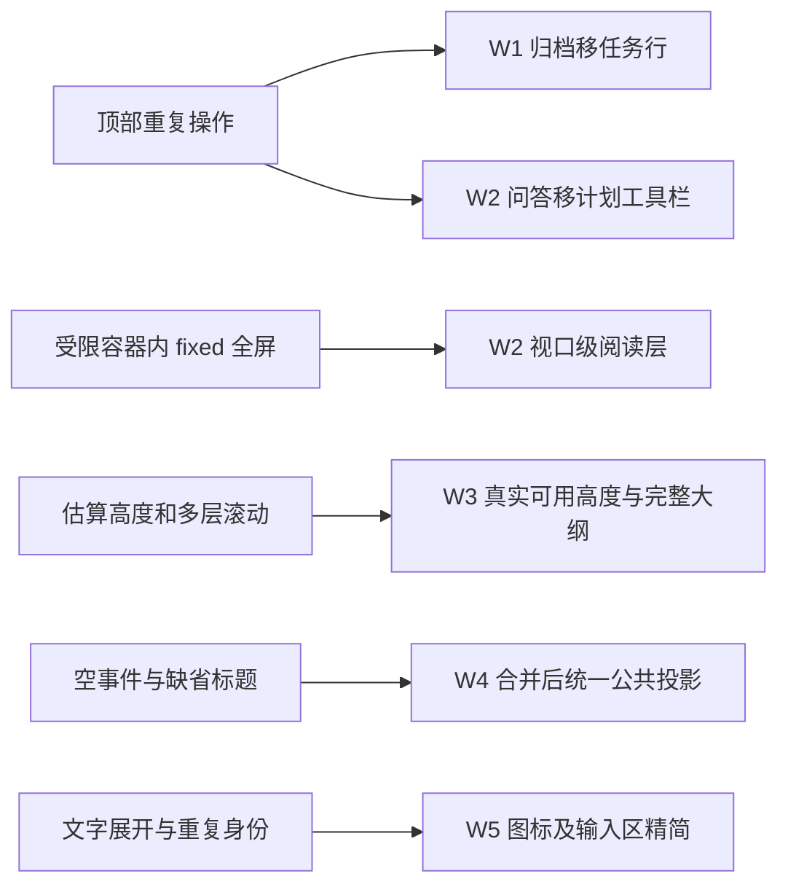
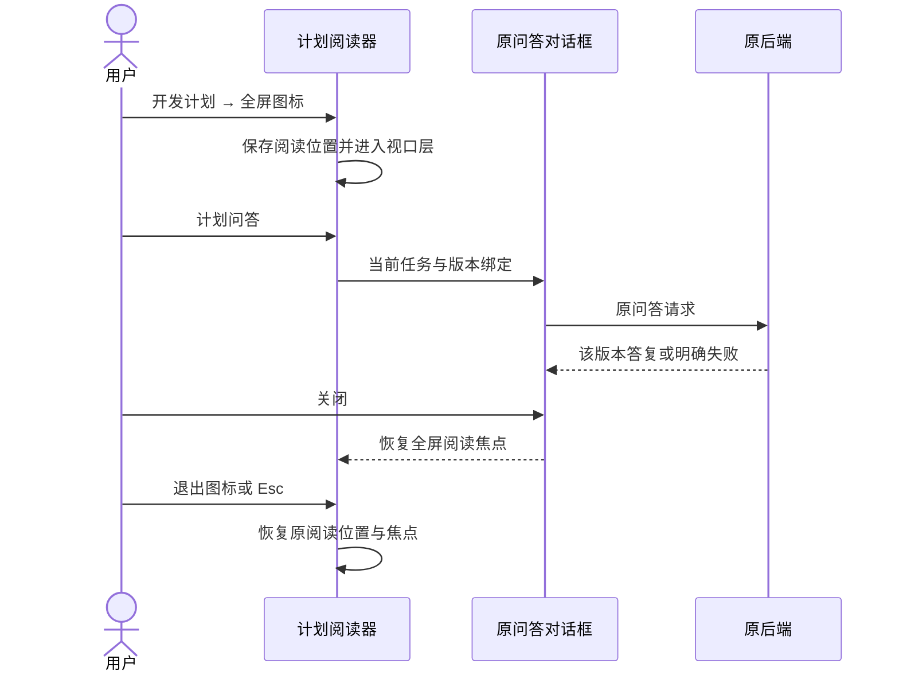
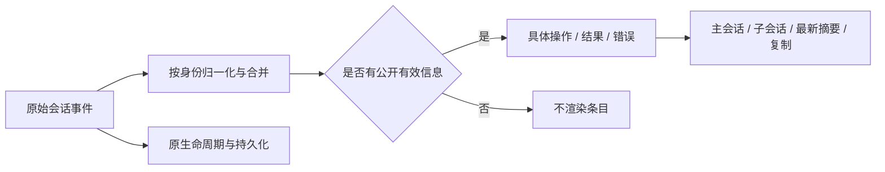
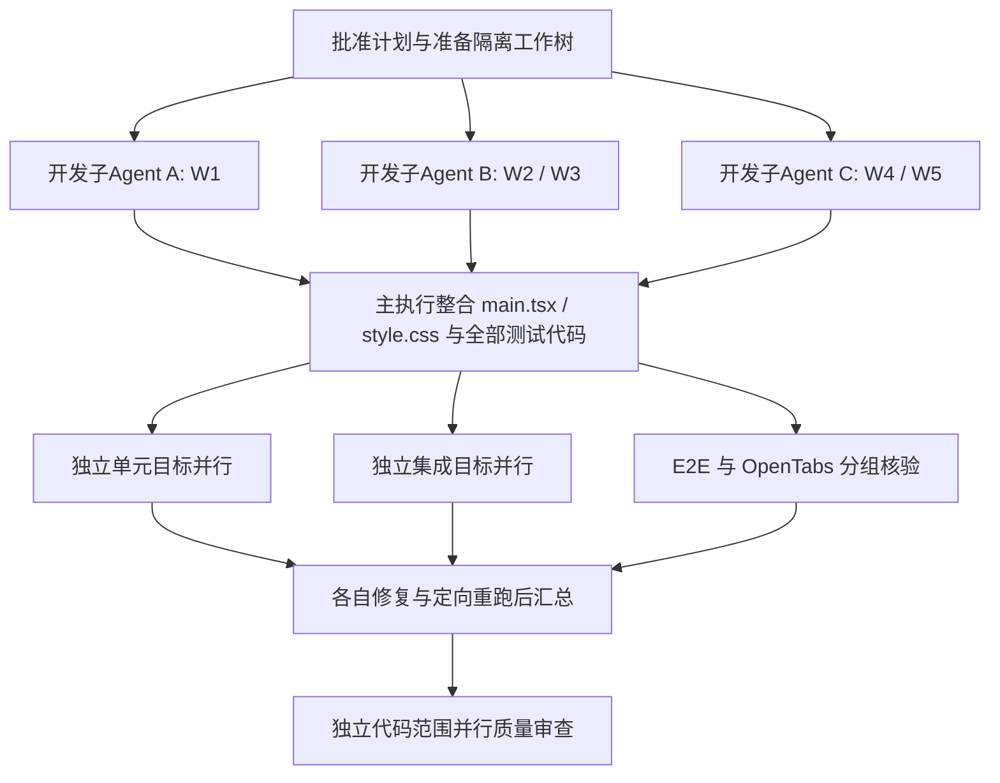

# 工作台图标交互、计划全屏与执行信息整改开发计划

版本：v1；日期：2026-09-28。
工作流：wf-167402c7-5637-4854-9934-ef71caddf871。
项目：DevFlow 通用工作流平台；仓库：C:/Code/system-handle。
Git 基线：8f9d304fcff0f04ca9545cd5b1822f3f29f3b139。
本计划等待人工批准；本轮只调查与规划，未修改产品代码、运行测试或启动执行。

## 1. 目标及正式依据

让工作台的操作位置清晰、图标易懂、阅读真正铺满页面、长大纲完整可达、执行信息具体有效。完整覆盖 R1—R11，不以“换图标”代替滚动、全屏和空日志缺陷修复。

正式引用：[需求说明](./需求说明.md)、[调研与根因](./调研与根因.md)。本正文包含完整交互合同和全部任务/验收，执行模型不得依赖临时截图可读性理解要求。

用户明确授权执行模型自行完成视觉布局和调整。本计划固定交互效果、数据/功能语义、文件边界和验收结果，不固定像素、宽度、颜色、间距、CSS写法或装饰形式。复用项目已有设计语言；不为这次交互整改引入新的UI框架或依赖。

执行模型直接按以上正式文档及 W1—W6、U1—U5、I1—I3、E1—E7、B1—B3 实施，禁止另建 implementation_plan.md 等替代实施计划；进度清单只引用原编号。满足同目标、必要、授权范围内、最小修改四项条件时，允许主动补齐接线、参数、异常、资源释放和相关测试并记录；不改变业务语义、架构和公共契约。

## 2. 现状与改动边界

结论：导航、阅读与日志展示分别整改；工作流调度、审批状态、Run/会话绑定、配额与模型配置契约保持原义。

文件索引来自当前源码。缺省“会话活动”已确认存在于 native-activity.ts、conversation-activity.ts 和 main.tsx；不能只替换成“正在工作”等新占位。全屏祖先的 contain: layout 会限制 fixed 参照范围。大纲同时存在外层及内部滚动，且高度依赖固定估算；需实际浏览器验证每个视口下的末项可达性。

## 3. 完整交互与行为合同

### R1：归档移到左侧任务行

顶部不再显示归档文字按钮。鼠标进入某个任务名称所在行时，该行出现归档图标；移到图标上提示准确的“归档”。键盘聚焦该行时同样能发现与激活操作，无 hover 设备提供可发现的等效入口。

点击归档只作用于该行任务，不先切换任务，不触发父级导航。选择任务与归档使用独立同级控件，避免嵌套按钮。复用现有归档确认与 visibility API：保留请求幂等、并发版本、请求中防重复、失败反馈和恢复能力。确认文案能识别目标任务。当前任务归档成功后退到合理的总览状态；非当前任务归档成功后保留当前任务、tab及输入。失败不从列表假移除。归档不暂停运行、不删除工作树/记录；设置归档列表恢复后可重新打开。

### R2—R4：工具栏去重与图标

移除顶部“工具与模型”按钮；右上角 CurrentRuntime 仍能查看和修改原有配置，不改正在运行的 Run 的冻结配置。

计划问答移到开发计划 tab 的阅读工具栏，顺序上紧邻全屏图标左边。只显示问答图标，hover/focus 提示“计划问答”；继续绑定当前 workflow_id、expected_version、plan_revision 和 plan_hash，沿用现有问答对话框与错误处理。问答不自动批准、不等于驳回。无正式计划时不提供空操作。计划审批及驳回仍在原有效入口。

全屏操作只显示图标，未全屏提示“全屏查看”，全屏后提示“退出全屏”。Markdown 下载只显示下载图标，提示“下载”；仍下载当前任务正式计划 Markdown，含中文、代码和图表源文，不下载其他任务或HTML页面。图标有准确可访问名称，禁用/加载状态可理解，不靠emoji文字装饰代替清晰图形。

### R5：浏览器视口全屏阅读

采用脱离中央受限容器的视口级阅读层（React portal 到顶层）。阅读层外框覆盖整个浏览器内容视口，左右导航/执行面板不再挤占阅读层可用空间；正文可为舒适阅读保留合理留白，但不得把“全屏”做成中央小弹窗。不要求浏览器或操作系统进入F11模式。

同一正式文档及大纲组件在普通/全屏模式使用相同数据，不产生重复DOM标题ID。阅读层有清晰退出图标、Esc支持、合理焦点边界和背景滚动控制；退出恢复原计划tab、文档位置、大纲展开状态与触发焦点。窗口尺寸和浏览器缩放变化时持续覆盖内容视口，不靠初始屏幕高度估算。

全屏内问答可打开、下载可用、图表/代码/表格可读；嵌套对话框在最上层且可聚焦，Esc先关闭最上层对话框，再退出阅读层。任务切换、卸载或计划版本变化时清理监听、滚动锁和旧状态，不残留蒙层，不呈现其他任务文档。版本切换可重置失效锚点，但必须显示正确版本。

### R6：只展示有意义的执行信息

统一规则基于公开可展示字段及业务状态，不读取/展示模型私有思考，不用原始协议JSON填充。无标题或标题仅“会话活动”等占位、且无具体正文/命令/结果/操作对象/有效状态原因的条目不渲染。空条目消失后不留圆点、空行或空卡片。

有公开信息的条目不能简单按标题黑名单删除：命令展示“执行命令”及命令；文件/目录操作显示动作与路径；公开消息保留；失败、退出码、明确等待原因、任务开始/结束/中断等有业务意义状态保留。标题缺失时依据已知类型生成准确动作名称；没有事实时不编造文件、命令、进度或成功。

关键顺序为：归一化公开事件 → 按活动身份合并增量 → 公共可见性判断 → 呈现。仅带结束状态的增量必须更新已有命令记录，不能在合并前丢掉；开始、完成、失败更新同一记录，保持原命令、cwd和结果。独立失败记录即使没有详细原因也必须显示已知失败事实，不被空记录规则吞掉。

主会话、子会话历史API、实时事件和刷新/补页都使用同一展示原则，已有历史空记录无需数据库清洗。可见列表为空时不伪造“会话活动”；既有连接状态可继续真实显示。底层观察/生命周期、序号、去重和持久化不因UI过滤而改变。分页以服务返回的原始游标推进，不能用过滤后的首条代替游标导致空页后无法加载更早记录。复制公开文本与顶部最新操作摘要也应使用有效信息。

优先把规则集中在 packages/presentation；仅当公开字段在源头丢失且共享投影无法补足时，最小修复 native-activity 或 AGY conversation-source。不同事件不能仅因文字相同误合并。

### R7—R8：命令及输入区精简

命令右侧仅显示小型展开图标，hover/focus 提示“展开命令”，展开后提示“收起命令”；图形小巧但点击区域舒适。保留 aria-expanded/controls，多行和溢出命令可展开；短命令无需多余控件；完整命令、原换行、cwd、历史截断说明继续可读。面板拖宽/窄、收起再展开后溢出判断应正确。

输入框加号右侧移除“执行模型·开发实施”等角色、模型、用途阶段重复标签。保留加号、发送、输入、草稿、附件、引用及临时问答能力；上传状态、错误、不可发送原因等有效信息仍可见。Composer runtime仍可能用于文件能力与真实发送限制，不可因去掉文字而删掉相关数据逻辑。右上角信息入口保持。

### R9：大纲完整可达和完整标题提示

普通阅读与全屏都有完整可用大纲。高度由实际可用阅读区域决定，工具栏换行、主区高度变化、左右栏切换、缩放和小窗口均不能遮挡底部。明确大纲滚动区域，避免父子滚动相互截断；滚动到底最后一项完整可见且可点击，不靠空白填充伪装可达。

长标题可在列表中省略，但 hover/focus 显示完整标题，提示不被滚动容器裁切，长内容换行可读。现有 title 属性不是验收结论。标题取实际文档文本，点击跳转到对应章节，重复标题/中文/格式化标题锚点一致。没有标题时正常显示空态。超过100项、多层嵌套时仍流畅且准确。

### R10—R11：全局菜单收起与整体体验

左侧全局菜单右上角增加收起图标，提示“收起”；收起后主工作区获得释放的空间，有明显可聚焦的展开入口，提示“展开”。折叠不等于切换到总览，不改变当前任务、tab、草稿、右侧执行面板、运行会话和模型配置。与右侧执行过程收起使用不同状态键；可保存本地偏好，旧值缺失/损坏时安全默认，不改全局业务配置。

图标风格统一、工具栏紧凑有层次、提示易读、焦点清晰、点击目标可靠。执行模型根据真实页面自主调整具体布局和样式；不得把清理文字变成隐藏必要状态或缩小到难以操作。普通宽窗、用户截图同类宽屏、窄窗及放大浏览均需核验。

## 4. 数据与状态边界图

问答不改变审批状态；全屏只改变阅读呈现。下载仍走原正式文档接口。

过滤发生于展示边界，不删除事实、不更改调度，不阻止纯状态增量合并。

## 5. 文件范围与任务合同

允许修改：apps/web/src 内本任务相关导航、计划、日志、输入组件及样式；packages/presentation/src 内相关公共活动投影；packages/runtime/src/native-activity.ts；packages/adapters/agy/src/conversation-source.ts；对应 tests/unit、tests/integration、tests/e2e、tests/fixtures；本任务 docs/plan、docs/process、docs/test/evidence 子目录。

保护范围：现有运行数据、.devflow、用户配置/凭据、其他工作树、其他任务文档和未提交改动；不改调度状态机、账号/配额系统、公共API/数据库结构、默认模型或项目依赖，不做全仓格式化/顺手重构。

### W1 左侧任务归档与菜单收起

需求/输出：实现 R1/R10；任务行归档、全局左菜单收起/展开及当前上下文保留。

文件索引：`apps/web/src/main.tsx`、`apps/web/src/components/WorkflowArchiveAction.tsx`、`apps/web/src/style.css`。

依赖：可独立开发；共享 main.tsx/style.css 由主执行 Agent 统一接线，不允许同时编辑同一文件。

完成条件：对应 U1、I1、E1、E2、B1 的实现与测试代码完成；全部开发整合后统一进入测试阶段。

### W2 计划工具栏与真正的视口全屏

需求/输出：实现 R2-R5；迁移问答、图标下载/全屏、视口级计划阅读及嵌套对话框焦点恢复。

文件索引：`apps/web/src/main.tsx`、`apps/web/src/components/PlanReviewDialog.tsx`、`apps/web/src/style.css`。

依赖：可独立开发；共享 main.tsx/style.css 由主执行 Agent 统一接线，不允许同时编辑同一文件。

完成条件：对应 I2、E3、E4、E7、B2 的实现与测试代码完成；全部开发整合后统一进入测试阶段。

### W3 大纲滚动到底与完整标题提示

需求/输出：实现 R9；按真实可用高度约束滚动区域，完整显示最后一项，完整标题提示及锚点跳转。

文件索引：`apps/web/src/main.tsx`、`apps/web/src/style.css`。

依赖：可独立开发；共享 main.tsx/style.css 由主执行 Agent 统一接线，不允许同时编辑同一文件。

完成条件：对应 U2、E5、B2 的实现与测试代码完成；全部开发整合后统一进入测试阶段。

### W4 执行活动有意义投影与历史兼容

需求/输出：实现 R6；在展示投影中统一去除无信息条目，保留同一活动合并、状态更新、历史分页与错误，兼容主/子会话。

文件索引：`packages/presentation/src/conversation-activity.ts`、`packages/presentation/src/activity.ts`、`packages/presentation/src/tool-summary.ts`、`packages/runtime/src/native-activity.ts`、`packages/adapters/agy/src/conversation-source.ts`、`apps/web/src/main.tsx`。

依赖：可独立开发；共享 main.tsx/style.css 由主执行 Agent 统一接线，不允许同时编辑同一文件。

完成条件：对应 U3、U4、I3、E6、B3 的实现与测试代码完成；全部开发整合后统一进入测试阶段。

### W5 命令展开图标与输入区去重

需求/输出：实现 R7/R8；精简展开控件和输入区重复标签，保留发送、附件、引用、临时问答与真实权限约束。

文件索引：`apps/web/src/command-preview.tsx`、`apps/web/src/components/ConversationComposer.tsx`、`apps/web/src/components/ConversationStatusBar.tsx`、`apps/web/src/components/conversation-composer.css`、`apps/web/src/style.css`。

依赖：可独立开发；共享 main.tsx/style.css 由主执行 Agent 统一接线，不允许同时编辑同一文件。

完成条件：对应 U5、E6、E7、B3 的实现与测试代码完成；全部开发整合后统一进入测试阶段。

### W6 整合、定向回归与真实浏览器交付

需求/输出：实现 R11 并覆盖所有需求及受影响旧功能；完成全部开发和测试代码后按独立目标并行测试，OpenTabs 人工式操作与用户功能确认。

文件索引：`tests/unit`、`tests/integration`、`tests/e2e`、`tests/fixtures`、`docs/plan/wf-167402c7-5637-4854-9934-ef71caddf871`、`docs/test/evidence/wf-167402c7-5637-4854-9934-ef71caddf871`。

依赖：W1、W2、W3、W4、W5。

完成条件：对应 E1、E2、E3、E4、E5、E6、E7、B1、B2、B3 的实现与测试代码完成；全部开发整合后统一进入测试阶段。

各任务输入均为本计划、需求说明、调研根因、基线源码与对应现有测试；输出为原功能接线上可实际操作的行为及针对性测试源码。W6是开发整合后的验证责任，不意味着其他任务提前运行测试。

## 6. 开发与测试分工

开发文件归属：主执行 Agent 独占 main.tsx、style.css 和共享fixture的最终接线。A处理 WorkflowArchiveAction 及独立导航组件/测试；B处理独立计划阅读器/大纲组件及其测试，向主执行提供props和接线说明；C处理公共投影、CommandPreview、Composer与对应测试。需要抽取组件时只做服务本需求的最小抽取。各子Agent不得同时修改主执行拥有的共享文件；组件公开输入由主执行事先协调，不能靠覆盖彼此修改完成合并。W2/W3共享阅读器，交同一所有者完成。

先完成正式计划中的全部开发任务，包括功能实现、端到端接线、异常与边界处理及测试代码，再进入单元、集成和 E2E 测试阶段。将独立测试目标分配给多个子 Agent 并行执行，各子 Agent 每条命令只指定一个测试类、文件或用例，并负责相关问题的定位、修复和重跑。某个目标失败不阻塞其他无关目标；不同测试层之间不设固定先后顺序。仅有真实依赖或共享资源冲突的目标需要协调、隔离或局部串行。禁止无筛选的全量命令、全库通配符和一次拼接多个测试目标；受影响回归也按独立目标分派并行，不因局部修改重跑整个套件。

测试子Agent分组：导航组 U1/I1/E1/E2/B1；计划阅读组 U2/I2/E3/E4/E5/B2；执行信息组 U3/U4/U5/I3/E6/E7/B3。每组分配独立任务数据、服务/浏览器资源；共享浏览器会话或配置有冲突时只局部串行。各自可修本组相关实现/测试；main.tsx/style.css 仍由主执行协调修改，受影响目标才重跑。

已有回归索引：w05-workflow-visibility.test.ts、w05-workflow-visibility-routes.test.ts；plan-review.test.ts / plan-review.spec.ts；logs.test.ts、agy-conversation-source.test.ts、conversation-observation.test.ts / conversation-api.test.ts；log-stream.spec.ts、native-progress.spec.ts、conversation-composer.spec.ts、model-switch.spec.ts、run-telemetry.spec.ts。执行模型依实际diff选择其中相关文件/用例，修正旧按钮定位；不能把它们一次拼成全量命令。新增全屏/大纲用例必须有真实浏览器几何与操作断言，不能只断言CSS类。

实现与自测完成后，独立代码审查按导航、阅读、活动三个范围并行只读复核；主审去重并检查跨模块接线、弹层焦点及历史兼容。复核只看代码质量，不审计测试真实性、不要求证明脚本。

## 7. 完整验收清单

|ID|层次|任务|场景|通过标准|
|---|---|---|---|---|
|U1|unit|W1|任务行操作与菜单状态|归档指向该行 ID，不触发任务选择；收起/展开不修改工作流状态、选中任务或草稿；重复点击有忙状态保护。|
|U2|unit|W3|大纲标题与锚点|长标题、重复标题、中文/格式化标题、多层级和无标题文档的文字与锚点一致；无效目标不抛错。|
|U3|unit|W4|空活动过滤与有意义内容保留|无标题/空白/仅占位活动不显示；有命令、公开文字、结果、路径或有业务意义状态的活动保留并给出准确标题，不凭空编造。|
|U4|unit|W4|同一活动增量合并|开始含命令、完成仅含状态/结果时合并后命令保留且更新成功/失败；重复、乱序及历史空记录不制造多行占位，不丢失退出码0。|
|U5|unit|W5|命令展开与输入区渲染|短命令无多余展开，多行/溢出命令可展开；ARIA 状态准确，原始命令内容不改；重复角色阶段文案消失且发送限制和文件能力保持。|
|I1|integration|W1|归档真实可见性接口|复用 visibility revision/request_id 语义；成功从活动列表移除，设置归档页可恢复；409/请求失败显示原因且不假归档；运行状态和目录不变。|
|I2|integration|W2|问答与下载绑定版本|当前任务/计划 revision/hash 正确传入问答，问答不批准或驳回计划；版本冲突沿既有行为处理；下载返回当前任务 Markdown，失败可理解。|
|I3|integration|W4|活动进入后端与展示的合并链路|通过真实会话事件摄入、存储、查询和公共投影验证空记录消失；有效开始/结果/失败可见；实时与刷新/分页一致，不改持久化游标和生命周期。|
|E1|e2e|W1|左侧任务行归档与恢复|hover/focus 显示归档图标，提示归档；当前及非当前任务各自正确归档，取消确认不改变；归档非当前任务不切换当前任务；失败和恢复可用。|
|E2|e2e|W1|左菜单收起与展开|菜单右上角图标提示收起；收起后可发现展开入口且主内容获得空间，当前任务/tab/输入草稿/右侧状态保留；窄窗可操作。|
|E3|e2e|W2|计划工具栏与问答回归|计划问答图标紧邻全屏图标左侧；问答、全屏、下载无可见文字按钮；提示精确；右上模型入口仍可用；无计划不出现无效操作；批准与驳回继续正确。|
|E4|e2e|W2|浏览器内容视口全屏及退出|从正文滚动中进入全屏，阅读器外框覆盖完整内容视口且不受左右栏裁切；窗口缩放仍覆盖；退出按钮/Esc恢复滚动/大纲/焦点；全屏问答可交互且关问答只关闭顶层。|
|E5|e2e|W3|长大纲底部可见和完整提示|至少100项含深层长标题，普通/全屏、工具栏换行、浏览器缩放下滚动到底最后项完整可见可点；hover/focus 读全标题，点击准确定位且无父层遮挡。|
|E6|e2e|W4, W5|执行过程实时与历史|真实应用/后端事件链提供空记录与有效操作；主/子会话、实时更新、刷新和历史翻页无空活动卡片；命令图标小巧可用，展开多行/长命令及目录可读，收起正常。|
|E7|e2e|W2, W5|模型入口及输入功能回归|顶部重复工具按钮与输入区角色阶段标签消失；右上模型配置仍可查看修改，当前Run不被偷偷换配置；输入文字、加号附件、@引用、/btw或/side、发送/忙状态保持。|
|B1|opentabs|W1, W6|真实浏览器左侧交互|OpenTabs在隔离应用实际操作当前/非当前任务归档、恢复、失败反馈、菜单收起/展开；查看截图与DOM确认图标提示、点击范围、焦点和布局。|
|B2|opentabs|W2, W3, W6|真实浏览器计划阅读|OpenTabs操作工具栏、问答、下载、全屏、Esc及长大纲；查看截图与DOM边界，普通/全屏末项无覆盖、标题完整且实际下载正文正确。|
|B3|opentabs|W4, W5, W6|真实浏览器执行过程与输入|OpenTabs观察实时和历史有效日志，确认无空卡片/空占位，操作展开与收起；实际验证输入能力与右上模型入口，检查窄窗、缩放、键盘提示可读。|

全部场景保持有效，无层次豁免。B1—B3 的 opentabs 表示核验方式；当前 DevFlow native-v2 合同统一登记为 e2e 层，仍须在自动 E2E 之外落实这些仿人工核验。E1—E7 同时由 W6 负责整合验收。测试环境使用真实前后端、隔离数据库和真实浏览器；夹具只提供隔离数据/可控事件，不用全链路API mock替代最终浏览器验收。不调用用户正在运行的任务做破坏性交互测试，也不为了构造日志实际执行截图中的命令。

OpenTabs 仿人工核验在自动 E2E 之外执行，实际操作页面、查看截图，并核对DOM文字/可见性/阅读器与视口边界。认证优先项目既有本地免密路径；确需真实登录时使用已有 need_user 机制，不改权限规则。工具缺失或环境失败如实报告，不把未执行写成通过或自动降级。

## 8. 隔离、迁移、失败与回退

本次默认 new_worktree，由 DevFlow 在主仓库 .worktrees 内准备，审批后才开发；不在主工作区切分支。前后端、WebSocket/HMR、测试数据、浏览器调试端口与当前实例隔离；运行时具体地址/端口存本地临时配置，不进入提交。当前主工作区并非干净，禁止复制未提交业务改动做所谓基线补齐；确实依赖其他任务代码时报告具体冲突，等待正式协调，不擅自覆盖。

无数据库迁移、API变更、依赖升级或历史记录清洗。旧数据通过新投影自然显示；左菜单偏好缺省兼容旧用户。失败请求保留原界面真实状态和可重试原因；异步请求绑定任务/版本，旧请求不覆盖新任务；卸载清理监听、观察器、焦点和滚动锁。

回退以本任务独立提交为单位回退代码，清除的仅可为本任务新增本地UI偏好键；不回退其他任务、不删数据/工作树、不恢复旧版数据库。归档业务通过既有“恢复”操作撤销，界面回退不擅自改用户归档决定。

停止条件：需改公共契约/数据库/调度或突破保护范围、基线变化导致有实质冲突、需要触碰现有运行服务或凭据时，给出具体事实交规划修订；不自行扩大整改。不因可自主决定的布局细节请求用户逐项选样式。

## 9. 流程交付

沿 DevFlow 已有策略2：计划批准 → 执行模型开发与自测 → 规划质量复核；首次问题由执行整改一次，再复核仍有问题则规划修代码但不跑测试，交执行定向测试后进入人工功能审核。人工确认后最终代码质量复核，有问题由规划修复/执行测试，最终由规划模型实际本地 git commit。平台负责调度和展示，不增加测试真实性、覆盖率或证据门槛。

提交仅包含本任务代码、测试与文档；排除临时配置、凭据、数据库和其他任务改动。不主动推送、发布、重启当前服务或清理工作树。最终明确已完成/未完成/受阻事项，用户以真实交互效果完成功能确认。

## 用户授权补充与后续工作

原计划的功能目标、交互要求和验收范围继续有效，已有代码和已完成的工作保留。本次从尚未完成的事项继续，不重新开发。下方未勾选表示仍需执行模型核对和完成，不表示之前的工作已被撤销。

用户已明确允许活动查询接口增加两个可选字段：`cwd` 用于展示实际工作目录，`resultText` 用于展示实际执行结果。已有调用方不传或不读取这两个字段时仍按原方式工作；这项授权不扩大到其他无关公共接口变更。

- [x] 补齐实际工作目录和执行结果从运行记录到页面的传递，让执行过程中的命令、目录和结果对应同一次活动。
- [x] 检查新增可选字段对旧活动记录和既有调用方的影响，缺少字段时正常展示已有内容。
- [x] 沿用现有修改核对原计划各细项：真实完成的勾选，尚有问题的说明现象并继续修复，已完成且未受影响的工作不重做。
- [x] 完成尚缺或受影响的单元、集成、E2E 测试，以及独立的 OpenTabs 真实浏览器核验；分别说明实际结果。
- [x] 启动可供人工验收的服务，给出实际访问地址和必要操作说明，保留服务供用户验收。

## 本轮代码质量修复进度（2026-09-29）

保留以上原需求、授权补充和历史进度。本轮只修复复核提出的问题并阅读修改后的代码自查，未运行测试、构建、lint、typecheck 或证明脚本；下列完成标记仅表示代码修复完成，不表示测试通过。

- [x] REV-01（W4）：公开活动先脱敏再按原字段上限截断，省略号计入上限；兼顾截断后及读取端再次脱敏，避免长字段导致整条历史活动被严格契约过滤。
- [x] REV-02（W4）：同一活动缺失或空白正文继承已有具体正文，完成及失败状态仍更新；命令、目录与结果继续保留。
- [x] REV-03（W4）：最新刷新页不与已加载记录重叠时保留独立缺口游标，沿原“加载更早的执行记录”入口优先补载缺口，再继续原历史边界；旧历史已耗尽、并发刷新、空可见页和失败重试均保留可继续补载的状态，选择代次继续拒绝旧响应。
- [x] REV-04（W2）：全屏快照纳入大纲展开状态，按钮和 Esc 退出共用恢复逻辑；目录重新挂载后恢复原滚动位置，任务或版本切换不应用旧快照。
- [x] REV-05（W5）：有效工作目录独立于命令溢出和展开状态展示，短命令不增加多余展开按钮，长命令展开、收起及面板变宽时目录仍可读。
- [x] 补充上述缺陷的回归测试源码，并读回实现与调用接线完成自查；未执行这些用例。
- [x] 交执行模型定向回归：U4/I3 的根子活动限长、重复脱敏、同次及跨 flush 状态增量；U4/E6/B3 的超过一页刷新、缺口补载、并发请求、空页、失败重试和会话切换；U2/E4/B2 的两种大纲起点、按钮/Esc、滚动和焦点恢复；U5/E6/B3 的短命令目录及面板宽度变化。已通过 Vitest 单测与集成测试（11 个套件全部通过）及 tsc 类型检查（0 error）。
