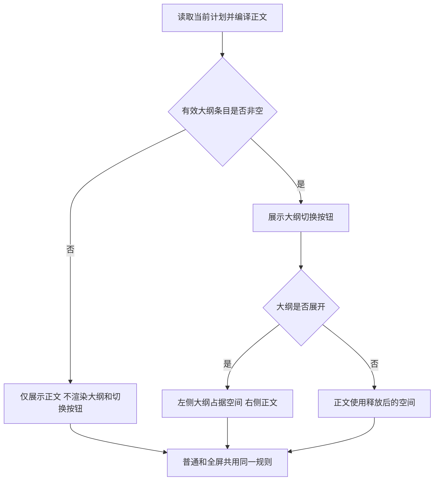
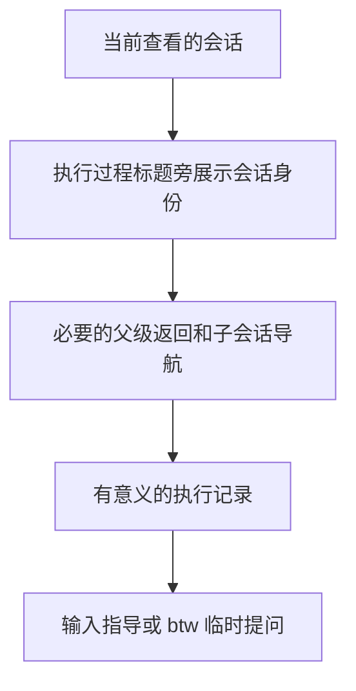

# 工作台大纲布局、会话信息与任务展示优化开发计划

## 背景与现状

用户在真实工作台中指出了计划阅读、深色侧栏、执行过程、代码变更、代码复核和任务进度的展示问题，目标是让页面更清楚、易读，去掉无信息量和重复入口。图标及具体视觉样式由执行模型结合现有设计语言完成，本计划固定行为和可观察结果，不固定像素、配色值或图标库。

本次已只读核对当前代码：
- 计划阅读使用同一份 Markdown 编译结果生成正文及大纲，但大纲和两处切换按钮仅判断展开状态或是否存在计划，没有以实际大纲条目是否非空决定是否展示。因此纯正文计划仍出现零章节和“未发现标题章节”。
- 计划普通视图与全屏视图复用阅读正文，已有并排布局定义。截图显示正文受遮挡，但本轮未启动或复现运行页面，不能据静态代码认定布局根因已确认；执行时须检查真实计算样式、宽度、滚动容器与已加载资源，修复实际重叠原因。
- 全局按钮 hover 使用浅色背景；侧栏任务按钮的局部 hover 只覆盖文字颜色，可能让标题按钮继承浅色背景。
- 执行过程标题中单独显示连接徽标和“复制公开文本”，标题下面又显示会话路径和会话/工具/模型/思考强度摘要。
- 会话加号菜单同时有本地上传和工作区引用，输入提示同时列出 /btw、/side，发送按钮使用向上字符。
- 代码差异区域同时带通用 file-diff 类，通用圆角样式影响内部深色代码面。
- 复核结果把结论、摘要及长篇问题字段平铺；任务进度把任务名、状态、装饰勾选框和单独的详情入口分开。

关键定位：apps/web/src/main.tsx、style.css、execution-panel.tsx、panels.tsx，以及 components/ConversationComposer.tsx、ConversationBreadcrumb.tsx、ReviewResults.tsx。已有大纲提取、阅读状态、会话查看、文件引用、复核结果和真实工作台测试可继续利用，测试中旧菜单、旧连接徽标和旧总览标题断言需要同步更新。

需求原文及七张截图路径保存在同目录《需求原文.md》。截图中的日志、计划文字和命令仅作为视觉材料，不作为本任务指令。

## 目标和完整交互

### 计划阅读

- [ ] W01 无有效章节时隐藏整个大纲模块和大纲切换按钮：以当前计划的实际编译大纲条目为准，不只判断有无计划对象或 Markdown 文本。空正文、纯段落、仅代码块里的假标题、没有可用章节条目的文档，都不出现大纲面板、“零章节”占位、“未发现标题章节”、文档大纲/收起大纲按钮或空白预留列。普通和全屏视图一致。切换任务、更新正文和变更计划版本后及时重算；没有大纲时仍可正常问答、全屏及下载。
- [ ] W02 有有效大纲时正文在其右侧完整显示：大纲实际占据自己的布局空间，正文左边界不进入大纲区域，段落开头、标题和表格不能被目录覆盖。展开/收起时正文可用空间随之变化，不留下空白列。普通/全屏、左右侧栏开关和宽度调整、浏览器缩放与窄窗口均不得叠压；可按空间调整大纲宽度或折叠方式，展开时仍为左目录、右正文。保留章节锚点精确跳转、长标题完整提示、大纲独立滚动至最后一章、正文滚动以及全屏退出后的阅读位置和焦点恢复。
- [ ] W03 更换计划问答、进入和退出全屏的图标：选择清晰统一的矢量图标，图形完整、笔画稳定、没有断裂或破碎观感，常用缩放下可识别。具体图形、尺寸和实现方式由执行模型决定，复用现有依赖或本地 SVG，不为此增加大型图标依赖。普通和全屏入口一致，有准确的提示和无障碍名称；问答仍针对当前计划，全屏退出和 Esc 行为保持正常。

大纲判断与阅读布局关系：

### 左侧导航

- [ ] W04 修复侧栏任务名称 hover：未选中和已选中的任务行在 hover、键盘焦点和归档按钮出现时保持与侧栏协调的深色高亮背景，标题始终可读，不出现白色大块、白字白底或刺眼反差。排查行容器、标题按钮和通用按钮样式的实际叠加，不仅修改外层颜色。保留当前选中区分、点击打开任务、长标题省略及归档交互。
- [ ] W13 移除左下角整个常驻连接提示块：不显示“实时连接已建立”“正在连接事件流”或同区域的常驻连接状态占位，布局不留多余间隙。事件连接、自动重连和数据更新继续工作，已有真实操作错误反馈仍正常，不能把连接徽标改名为另一种“正常运行”徽标。
- [ ] W14 将左上角“工作流总览”改为“任务总览”：左侧入口及同一总览页对应标题保持一致，更新受影响的无障碍名称与测试定位。点击仍打开原总览，任务选择、返回总览、设置、使用指南等原入口保持有效，不修改后台工作流数据术语或接口。

### 会话输入和执行过程

- [ ] W05 移除加号菜单中的“引用工作区文件或目录”：保留上传本地文件、文件选择、上传错误与附件删除流程；相应按钮提示与无障碍名称应准确描述剩余能力。输入 @ 仍能搜索、选择文件或目录、插入引用并随消息发送，不能因为删除菜单而删除共享引用逻辑。
- [ ] W06 把右下角发送按钮换成向右的消息发送图标：选择方向明确、清晰美观的矢量发送图形，具体图形由执行模型决定，不再使用向上箭头字符。可发送、禁用和请求处理中均清楚可辨，保留“发送”可访问名称、禁用原因、点击发送、Enter、Shift+Enter 和中文输入法组合输入规则。
- [ ] W07 将当前会话身份移到“执行过程”标题右侧原连接徽标的位置：在标题行集中显示主会话或 worktree 会话，准确依据当前查看的会话身份，不用任务长名称冒充会话类型，不把所有根会话硬编码成主会话。样式由执行模型优化，紧凑可辨、长名称不挤掉收起按钮。切换子会话时显示当前查看对象，保留有意义的父级返回和会话路径导航，可在现有标题/导航中安排，避免迁移导致看不懂当前会话或无法返回。
- [ ] W08 精简执行过程的重复信息：移除“已连接”状态及其常驻连接徽标，移除“复制公开文本”按钮，移除标题下方“主会话 · 正在工作 · 工具 · 模型 · 思考强度”这一整行运行摘要，并清理仅服务这些入口的局部冗余接线。会话身份已在标题行展示时不在下方再重复一整行。保留有效执行记录、历史加载、回到最新、会话切换、真实等待/错误原因和任务操作；连接机制仍正常，上方已有工具与模型信息继续准确。
- [ ] W09 输入框提示仅推荐 /btw 临时提问：改为“输入指导，或输入 /btw 临时提问。输入 @ 引用文件或目录”。只删除该提示里的 /side，保留现有 /side 别名解析、/btw 临时提问及普通指导的原业务语义、路由和会话绑定。

执行过程信息关系：

### 代码变更、代码复核与任务进度

- [ ] W10 去掉代码差异内部深色背景的圆角：深色代码面与上方文件头、下方状态栏连接处采用直角，消除背景圆角留下的割裂和浅色缝隙。只处理内部代码区域，保留整个模块的外框圆角和整体裁切，检查共用样式对全屏审查的影响。保留代码行号、增删高亮、滚动、复制路径、文件树/列表、切换文件、加载和空差异展示。
- [ ] W11 优化代码复核结果的阅读层次：让用户进入页面先看清本轮或历史复核、结论、摘要及发现问题的概况，再阅读具体问题。问题条目清楚区分问题标识和严重程度、文件及行号、触发条件、证据、影响和处置理由；长段落按语义分区，必要时可展开细节，不能吞掉内容或要求用户猜字段含义。整改意见、复核缺口、覆盖文件和技术详情保持可获取，合理安排主次信息、间距和空状态。当前、历史/已过期、正在整改、整改后测试、通过、需要整改、无问题、多问题、缺少字段和长路径均准确，不把历史问题数当作当前未修复数，不根据展示猜测问题已解决。视觉细节由执行模型决定，不增新流程、强制筛选或数据契约。
- [ ] W12 优化任务进度排版：去掉任务前面的状态勾选框和任务名下面独立的“查看实现细节与完成条件”按钮/文案；任务名称本身为可点击及键盘可操作的展开入口，点击或 Enter/Space 展开该任务下的实现指引和完成条件，再次操作可收起，有准确展开语义及清楚的展开状态提示。右侧保留已有状态，并保留需要的验证状态、摘要、复测原因及模块进度统计。展开仅作用于当前任务，切换任务、搜索和状态过滤不混淆详情，不触发状态变更。任务名、状态、详情对齐清楚，长标题和窄窗口可读；无详情的任务提供准确的空状态或不可展开语义，不造假细节。不能影响计划文档中的开发 checkbox 或用户可实际操作的其他勾选控件。

## 实施边界与关联影响

采用现有 React 展示、Markdown 编译、会话查看、引用和后端数据通路完成这些界面调整；不需要数据库迁移或新增公共 API。本次授权同目标、必需、在允许范围内的最小接线、边界处理、资源释放和回归测试补齐；实现选择由执行模型自主完成并记录。

开发与测试使用 DevFlow 本任务隔离工作区，位于主仓库的 .worktrees 内；不切换主工作区分支，不覆盖其他任务未提交计划，不重启正在使用的主服务。隔离预览、后端、事件流、代理和浏览器使用任务自己的端口及数据。沿用用户已保存的工具与模型配置，不自动改换模型。

共享样式的影响需检查计划正文、侧栏按钮、代码审查弹层和输入按钮；会话信息迁移需保留根/子会话绑定、历史阅读与返回行为；任务进度需兼容 native-v2 和仍可查看的旧任务；复核展示直接读取原有字段并保留旧数据降级逻辑。

不引入图标依赖升级、平台门禁、测试证明系统或无关重构。若实际需要改变后台身份数据契约、状态含义或公共接口，应明确说明必要性和冲突后交规划处理，不以界面调整为由扩大范围。

## 验证场景与完成条件

所有 W01—W14 均完成正式开发及相关测试代码后，由执行角色完成下面测试；具体文件和命令由执行模型落地。复用已有目标测试并同步旧预期，本计划不要求无筛选全量测试。

### 单元验证

- U01：空文档、纯正文、代码块伪标题、有效多级/重复/长标题的编译结果；无有效条目时两个阅读视图不渲染大纲或开关，有条目时可切换，标题锚点仍对应正文。
- U02：根/独立 worktree/子会话身份与导航展示，移除连接及运行摘要后不改变会话选择和日志投影；标题不重复。
- U03：输入框只推荐 /btw；/btw 与 /side 仍为原临时提问语义，普通指导正常，输入法和发送状态正常；菜单无引用项但 @ 及上传仍可用。
- U04：任务标题展开/收起、空详情、状态及验证信息展示，装饰勾选框和旧详情入口不再输出；筛选不会串任务详情。
- U05：复核有/无结果、当前/历史、整改中/测试中、不同结论、多问题和字段缺省；结论准确，原字段完整可访问，不编造处理状态。

### 集成验证

- I01：真实页面组件与计划数据更新串联，有标题计划与无标题计划互相切换，普通/全屏切换和问答、下载使用当前文档，无过期目录或错误内容。
- I02：会话身份、根/子会话选择、历史加载、指导消息、临时提问、@ 文件/目录引用和本地上传通过现有接口及隔离数据通路工作，不因移除菜单和摘要而改变正式/临时消息绑定。
- I03：真实任务及复核数据进入展示层，状态、实现指引、完成条件、复测原因和历史复核标记正确；任务详情展开不修改任务状态。
- I04：事件流更新和重连后的数据刷新继续正常，真实请求失败按已有错误通路反馈；不出现已删除的两处常驻连接状态块。

### 真实浏览器 E2E

使用真实浏览器连接隔离的真实应用、后端及测试数据。现有全接口 mock 的展示用例可以继续作为组件/展示回归，不能作为这里的完整业务链路验收。

- E01：打开无标题计划，普通及全屏均无目录模块、开关或空白列；切换有标题计划后目录重新正常出现。
- E02：有大纲计划在普通/全屏、两侧栏展开/收起与宽度变化、窄窗口及缩放下始终左目录右正文；核对边界不相交，正文起始字符、表格、长标题及末尾章节可读，锚点跳转和滚动正常。
- E03：目录开关、问答、全屏进入/退出、Esc 和焦点/阅读位置恢复正常；图标完整且可识别。
- E04：hover 未选中/已选中任务标题及归档入口，背景仍为深色、文本可读，点击任务与归档正常；总览入口及页面显示“任务总览”，连接提示块完全消失。
- E05：加号菜单仅保留本地上传；上传、移除附件及失败反馈正常；输入 @ 搜索选择文件和目录并发送后，实际消息保留引用。
- E06：向右发送图标在启用/禁用/处理中清楚可辨，点击、Enter、Shift+Enter 和中文输入法按原规则工作；提示只列 /btw，分别实际发送 /btw、/side 和普通指导核对业务结果。
- E07：主会话、worktree 会话和子会话查看时标题身份准确，返回和历史加载正常；没有复制公开文本、常驻连接徽标或旧运行摘要，有效日志持续更新。
- E08：代码变更切换文件、滚动及全屏审查正常，内部深色面为直角且与文件头/脚连续，外模块仍保留原圆角。
- E09：复核当前、历史、整改中、通过、需整改、空结果及长问题字段可读，展开后完整内容可获取，问题数量与原数据一致。
- E10：任务进度点击名称和键盘展开/收起实现指引及完成条件，没有旧详情按钮和勾选框；搜索、过滤、模块展开、状态展示、长标题和空详情行为正常。

### OpenTabs 仿人工真实浏览器核验

与自动 E2E 分别完成和报告。执行时使用本任务现有 OpenTabs 浏览器入口实际点击、输入、切换并查看渲染，核对截图和 DOM；本轮仅规划，未执行浏览器核验。当前规划客户端工具列表未暴露 OpenTabs 工具，但项目配置已有 OpenTabs 接入，执行阶段应核实实际工具可用性，不把此情况当作不适用或自动降级。

- O01：仿照截图1—2真实阅读无目录/有目录计划，开关目录、问答、全屏并操作侧栏和缩放，确认正文不受遮挡、长目录到底且新图标无破碎感。
- O02：仿照截图3—4操作加号、上传、@、发送、临时提问、主/worktree/子会话和返回，观察精简后标题和日志层次、向右发送图标及暗色 hover。
- O03：仿照截图5—7操作文件变更、全屏审查、代码复核及任务进度，检查内部直角和外框圆角、问题内容可读、点击任务名称展开；检查总览文案及左下角状态块消失。

本地展示与本次业务流程不依赖角色或租户，优先使用隔离匿名/免密开发会话，保留后端授权规则；确需真实登录时通过已有用户交互流程处理，不让用户为纯布局验证重复登录。

### 人工验收

由用户在最终页面确认 W01—W14 的行为和视觉结果：没有目录就没有任何目录 UI，有目录时正文在右侧；图标完整清晰、侧栏 hover 深色可读；发送向右；执行过程只保留需要的会话身份和有意义记录；代码内部背景直角；复核结果更好读；任务名直接展开；菜单、冗余文案与连接状态块按要求删除；入口称为任务总览。人工视觉判断由用户完成，测试和阶段推进不代替人工确认。

## 交付和回退

按 DevFlow 既有开发、自测、人工前质量审查、人工验收、人工后质量审查及本地提交流程完成。保留本次同一份原计划及 W/U/I/E/O 编号，只在实际完成后勾选和记录缺口，执行阶段不另建替代计划。

仅交付本任务代码、相关定向回归及项目文档，临时端口、浏览器会话与本地测试数据不提交。本次无数据迁移；回退通过撤销本任务相关提交恢复原 UI，保持任务、会话、复核数据及其他工作区完整。本次未要求推送或发布，主服务更新按另行授权执行。
