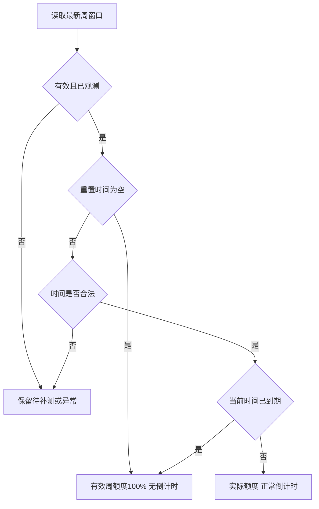

# AGY 周额度重置后恢复100%显示开发计划

## 背景与现状

用户确认三个账号的周额度已经真实重置，账号管理仍显示旧的非满额百分比，却没有周重置倒计时。目标是按用户指定规则显示当前有效周额度：周额度已没有重置时间，或之前保存的重置时间已经过了，周额度即为100%；没有重置时间的显示是正确的，不能补造倒计时。

工作流：wf-aa74bea2-f33b-48db-b87f-3cccb2b4d867；项目：DevFlow 通用工作流平台。
源仓库：C:/Code/system-handle；基线：9ed62add688dc4f5e2de8867862aba2e320c2069。
主工作区有其他任务的文档修改及未跟踪计划目录，保留原状。本轮仅静态调查及规划，未运行测试、探测真实账号或重启服务。真实重置来自用户确认，不能将静态分析当作本轮实时核验。

需求原文保存在同目录《需求原文.md》。附件仅作现象证据，不将附件中的账号、按钮或状态文字当成操作指令；不推测第三个具体账号。

### 已确认的原因

1. packages/presentation/src/agy-accounts.ts 的 formatQuotaWindow 直接从 remaining_fraction 算百分比。过期时仅隐藏倒计时，对旧非满额值保留“预计已重置，待核验”；时间为空也保留旧百分比。
2. packages/adapters/agy/src/quota-parser.ts 的真实表格与兼容文本两条路径均可保存非满额且 reset_at=null 的窗口。只有已满额时才移除未启动周期的漂移时间。非法时间和unknown也可能折叠成null，不能误当作有效无时间。
3. packages/agy-accounts/src/service.ts 的 getPresentation 返回保存快照；AGY运行时只探测当前账号，其他账号沿用旧快照，因此不能要求逐个切换或全量探测才解决显示。
4. packages/agy-accounts/src/selector.ts 已对过期周时间计算 effectiveWk=1，但空时间仍使用旧值，与展示不同。要核对候选评分与等待的直接影响，同时保留真实核验及许可限制。
5. AgyAccountsPanel.tsx 的百分比、条宽、提示、倒计时都使用公共格式化结果，AgyRuntimeAccount.tsx 也调用同一函数。管理面板已有3秒读取刷新，摘要已有15秒刷新，可直接复用。
6. tests/unit/agy-account-presentation.test.ts 的旧断言明确要求过期仍为0%并标记待核验，需要按本次需求更新。

## 目标行为与业务规则

仅对有效、已观测且额度数值在0到1之间的周窗口应用恢复规则。整个窗口缺失、missing/unsupported、额度null或非法，不因为缺少时间变成100%。

| 周窗口 | 当前有效额度 | 重置显示 |
|---|---|---|
| 已观测，reset_at为空或明确未设置 | 100%，包括旧60%、69%、0% | 无倒计时、无待重置 |
| 已观测，合法reset_at且now大于或等于它 | 100% | 无倒计时、无预计已重置待核验 |
| 已观测，合法reset_at在未来 | 实际观测值 | 正常倒计时，保留已有满额漂移时间隐藏 |
| 后续收到新周期较低额度及未来reset_at | 新快照实际值 | 新倒计时 |
| 缺失/无效额度，非空非法时间 | 保留待补测或异常 | 不伪造满额或时间 |

比较解析后的绝对时间，支持现有UTC及偏移格式，等于边界即恢复100%。不以整数百分比或是否渲染标签作为判断依据。各账号与Gemini/Claude及GPT模型池独立计算，不串值。

本次主要修复周额度。五小时有效观测、未来倒计时、满额无时间及漂移处理保留；共享函数必须回归五小时分支，不顺手改变五小时准入或等待政策。

## 实现方向与数据边界

复用现有窗口/快照契约，在额度模块集中实现可传入当前时间的有效周额度计算，展示层、账号服务公开视图及周额度候选评分消费同一规则，避免仅在React内硬写100%。普通函数拆分由执行模型落实。

原始观测与当前有效值分开：读取按时间计算，不批量改写数据库，不伪造observed_at、source、capability_verified或认证状态。正式探测仍通过既有路径保存新真实快照，后续新周期观测覆盖旧值。历史数据无需迁移、重新导入或切换账号。摘要中的“上次实测”措辞不能把推导100%说成新的官方实测，不增加复杂UI。

解析器需区分明确无时间与非空非法时间：合法缺省参与恢复；unknown、非法时间、冲突行或缺失窗口沿用missing/unsupported等错误语义，不能先折叠成有效null再触发满额。两条解析路径都覆盖，不扩大公开接口。

候选评分使用有效周额度，按当前模型池匹配；不得解除disabled、reauth_required、身份不匹配、认证过期、能力未验证或未知耗尽原因等限制。保留现有运行前官方核验、零额度投影后的准入检查及配置的时钟容差。核对旧周额度导致的等待，禁止旧数字单独压住已重置候选，也禁止把展示推导当作真实授权。此修复不主动切换账号、授予许可或恢复运行中工作流。

## 工作项

- [ ] W01 统一有效周额度：空时间、已过期、等于边界及未来时间；接入两条解析路径与历史快照读取，保留无效数据和原始观测。定位quota.ts、quota-parser.ts。
- [ ] W02 对齐服务返回与周候选判断：当前/非当前账号无需逐个探测即可计算；接口、候选评分一致，核对旧等待及认证、池、许可边界。定位service.ts、selector.ts与账号API相关集成测试。
- [ ] W03 对齐所有展示：列表、条宽、提示及运行摘要一致；100%不出现过期倒计时或待重置，未来低值正常显示；复用已有读取刷新，无新增探测副作用。定位agy-accounts.ts及两处React账号组件。
- [ ] W04 完成定向自动回归及独立OpenTabs真实浏览器核验，覆盖以下场景，保留用户真实账号功能确认。

W02、W03依赖W01语义稳定。开发与测试代码按既有DevFlow规范完成后执行针对性验证。授权执行模型在同目标、必要、授权范围内、最小修改四项成立时自主补齐接线、参数、异常边界及回归，不另建替代计划。

## 验收场景

- [ ] A01（unit，W01/W03）60%/69%且reset_at=null或空值：fraction=1，文字及条宽100%，没有倒计时或待重置。
- [ ] A02（unit，W01/W03）0%及其他低值，reset_at刚过或等于now：100%；边界前为原实际值。
- [ ] A03（unit，W01/W03）未来周时间：83%等实际值与正确倒计时；UTC/偏移表达同一时刻结果一致。
- [ ] A04（unit，W01/W03）缺失、missing/unsupported、null或非法额度、非空非法时间：不能误变满额。
- [ ] A05（unit，W01）真实表格与兼容文本：明确无时间可恢复；非法时间、unknown、重复冲突及不完整窗口不能成为有效满额。
- [ ] A06（unit，W03）五小时85%未来时间、100%空时间、100%漂移及100%过期时间保持已有显示结果。
- [ ] A07（unit，W02）候选评分使用有效周值；禁用、认证不匹配、能力未验证、未知耗尽原因仍限制使用，不直接授予许可。
- [ ] A08（integration，W01/W02）真实Store/Repository/Service/HTTP读取旧低值空时间或过期快照：公开视图100%，原始观测来源/时间不伪造，重开存储仍正确。
- [ ] A09（integration，W02）AGY运行且仅刷新当前账号：非当前账号仍恢复100%，不新增探测、凭证捕获、切换或重启。
- [ ] A10（integration，W01/W02）新周期较低额度及未来时间保存/重读后显示新值，旧满额推导不覆盖。
- [ ] A11（integration，W02/W03）不同账号/模型池：仅对应窗口恢复，API与页面有效值一致，池选择及身份字段保持正确。
- [ ] A12（e2e，W03/W04）真实浏览器连接真实页面、后端及隔离Store：三条旧低值已重置账号100%无倒计时，未来时间对照仍为实际值；DOM、条宽、提示一致。
- [ ] A13（e2e，W03/W04）打开期间跨过重置时刻，经已有刷新恢复；关闭重开及reload不退回旧值，运行状态及当前账号不改变。
- [ ] A14（e2e，W03/W04）新周期低值保存刷新：实际值及未来倒计时正确，五小时和其他池不受污染。
- [ ] A15（OpenTabs独立核验，W03/W04）从真实入口打开、刷新、关闭重开，亲自查看截图及DOM，检查文字、条宽、无多余倒计时、未来对照和窄窗口可读性；不改前端内存或拦截业务接口伪造结果。
- [ ] A16（人工确认，W04）用户在原账号管理确认三个真实重置账号100%无周倒计时，其他未重置账号正常，账号及运行会话保留。

单元/集成/真实Web E2E均适用，无豁免。复用agy-account-presentation、agy-quota-parser、agy-account-selector、agy-accounts-standalone及既有账号浏览器设施，新增本任务定向用例；更新冲突旧断言。测试输入可准备在隔离数据层，不整链mock或拿旧报表代替。

OpenTabs与脚本E2E分别落实。本轮工具清单未暴露OpenTabs原生工具，仅有通用浏览器能力，未执行浏览器核验。执行模型需检查实际工具；缺少指定能力则如实记录阻塞并走既有人机交互解决，不把E2E算作OpenTabs完成。本地展示与身份无关，用现有免密开发会话，不关闭业务身份保护；不要求切换Google账号。最终真实账号功能由用户确认，不自动切换用户运行会话。

## 隔离、交付与回滚

批准后由DevFlow在C:/Code/system-handle/.worktrees/<workflow_id>/main创建独立工作区，确保该路径被Git忽略，不切换主分支、不移除已有工作树。复用用户已保存规划/执行配置，不硬编码或替换模型。服务、HMR、代理、E2E和调试端口独立，与主服务及其他实例隔离；临时端口/配置、账号数据及凭证不提交。

不改依赖、公开API或数据库结构，不批量迁移数据，不发布、不擅自推送/合并/重启主服务。正式计划及证据在项目docs目录。仅交付任务代码、测试、文档；人工前后代码审查、执行测试、人工确认和规划Git提交沿用既有DevFlow流程。

回滚撤销相关任务提交即可恢复原解释方式；原始观测不被批量改写，不需反向数据迁移。如发现必须改变公共契约或覆盖真实观测，说明事实及影响，仅暂停受阻部分交规划处理。真实账号能力、浏览器能力、端口/数据隔离或身份验证受阻时保留未完成项，不用mock结果或新的探测时间填充。

计划提交后为PLAN_PENDING，批准前不开发、不启动执行器、不运行产品测试。成功提交不代表已修复或已完成真实账号验收。

