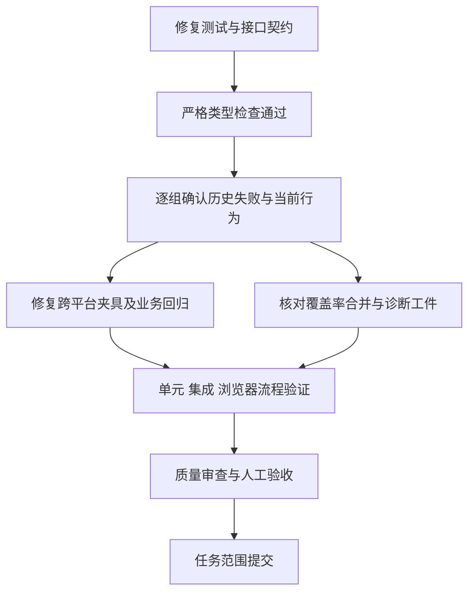

# DevFlow GitHub Actions 故障修复计划

## 背景与现状

### 2026-10-10 续修状态

最新 [CI 37907706871](https://github.com/zephyrw/dev-flow/actions/runs/37907706871) 检查源码 `bd54915ca41e0aa51be5a523ecc275cf2c09633c`。四个平台的安装、类型检查、生产构建和浏览器安装均成功，失败发生在独立测试目标及覆盖率合并。Windows 有 100 个失败目标，macOS 两种架构各 101 个，Linux 有 96 个；不能沿用 10 月 8 日的局部验证声称这些目标通过。T05–T08 重新打开，沿用本计划继续修复。

已定位的共因包括 CI 隔离端口与测试固定 Origin 不一致、未登记计划原件或当前 Run 的正向夹具、旧质量流程及浏览器控件契约、macOS 临时路径与进程创建时间格式差异。已复现并修复的产品问题包括旧项目投影导致页面崩溃、发送到过期会话根、登录错误脱敏后丢失分类、陈旧执行失败接管记录误派规划模型、Cursor 实际目录混入未列出的默认模型。终端颜色控制序列导致错误被当成二进制省略，覆盖率合并改为逐份合并转换后的 Istanbul 报告，并保留失败传播和累计计数。

当前候选在 `.worktrees/ci-latest-20261010` 的 `zxw/ci-latest-20261010` 分支。诊断结果只用于定位，正式全项目类型检查、生产构建、受影响单目标测试及 OpenTabs 分别完成后更新结果；四平台最终状态以修复提交的实际 CI 为准。本轮未改变主服务、主数据库或凭据。

续修还确认了两个产品问题：外部计划首次进入原生会话时，用户反馈被误当作已有会话续聊而丢失首次交接材料；会话提交收到 HTTP 409 时，事件回调产生未处理的 Promise 拒绝。首次输入现携带正式交接材料，后续输入保留用户原文与原会话；提交错误由所属交互显示，草稿和附件保留。相应原生集成与浏览器回归分别验证，尚未完成的浏览器目标保持待验证。

覆盖率验证已执行真实 runner：两个独立 Vitest 目标生成报告并累计合并；目标失败、超时导致缺失报告，以及后续目标成功均不会清除失败。128 MiB 堆限制下逐份合并 128 份大报告通过，损坏报告和缺失计数仍拒绝。此项通过不代表全部浏览器目标或 macOS/Linux 的实际 CI 通过。

旧质量策略的轻量终审提交另有实际锁归属缺陷：复核 Run 持有工作区读锁，却用另一个临时 ID 申请提交写锁，触发 `WORKSPACE_BUSY`。现由当前复核 Run 升级，并同时锁定独立工作树与集成目标；仅释放本次新增写锁。九个正式冲突回归验证真实双边内容保留、当前 Run 既有锁保留及其他 Run 拒绝。前端普通页面刷新也清除后端已不再返回的暂态 queue，避免人工验收已就绪仍显示“检查主工作区”；未变化页面及较老版本响应仍沿用原保护。

诊断期间还有“全部断言通过但进程失败”的遥测目标：历史 Run 夹具缺少 `started_at`，会话观察器产生未处理异常。已按完整 Run 契约补齐夹具，并用文本和 JSON 两种报告确认进程正常退出。待答指导夹具通过正式会话事件建立当前 Run 的归属，正向续接验证原文不加包装；缺失归属仍拒绝并回滚反馈与回执。

续修复核发现会话树默认接口只返回活动根的节点与尝试，不代表未返回的历史主根已消失。发送前先查询用户正在查看的根，仅明确 404 时回退到活动根；其他读取错误阻止提交。通过正式接口的双根回归验证查询范围、当前 generation 与已消失投影的回退，不能用人工构造的双根节点列表代替真实接口契约。

附件浏览器验证区分原生适配器能力：新独立会话实际读取上传文件并核对字节数与 SHA256；不支持独立附件输入的既有 Codex 续聊保持拒绝，不把用户文字改写成路径提示。受控 CLI 的读取证据位于实际运行工作树，独立问答工作包没有主项目副本字段，不能因主仓库找不到该证据误判附件未读。

### 2026-10-11 本机最终验证

- 锁定工具链为 Node 22.23.2、pnpm 11.7.0。最终 `pnpm typecheck` 正常零退出，包含新增双根接口回归及最后的冲突夹具修改；`node --check tests/fixtures/native-cli.mjs` 通过。
- 正式生产构建通过，`build_revision=workspace-56e38a1df71c772699aa`，源码摘要 `56e38a1df71c772699aac7f7facf28abc7349df72df583363900844b07113856`，前端 `index-Blnf6dEQ.js`。之后仅修改测试与本计划，产品构建仍适用于最终候选。
- CI、交接和提交回归队列 16 个目标通过；接手的运行时尾部 10 个目标通过。另一组运行时 31 个单文件目标、206 个测试通过；单元/安装等队列 38 个目标、429 个测试通过，仅保留一个原有 Windows 平台不适用的 POSIX symlink 用例跳过。新会话根接口回归使用正式 Fastify 路由与隔离 SQLite，三个用例通过。
- 27 个浏览器单文件目标全部通过。最终发送修订重跑了相关目标；其中五个使用 `CI=true` 的 Chromium，其他本机正式配置使用 Windows Edge。两者均不能代替 Linux/macOS 或 GitHub runner 的实际结果。OpenTabs 使用最新构建的独立实例检查审批后队列清除、合法会话原文输入、独立提问列表错误恢复及质量策略 2 的模型角色锁定，临时故障已撤销。
- 质量策略 2 冲突浏览器回归保留当前 `planner_commit` 契约：实际吸收固定上游提交、保留双方正文与历史、执行真实 Node 定向检查并提交。旧 `merge_conflict_resolution` 断言不适用于这个策略；旧策略的冲突、锁归属和交付仍有独立回归。仅重测的受控执行器先读取内容，避免相同字节重写触发证据失效；历史证据全量保留且新增真实通过结果。

本会话用户已经要求提交应提交的变更并推送。本轮仅按文件提交隔离候选，再推送修复分支验证 GitHub 共享四平台 CI；不把上述本机结果称为远端通过。远端检查和交付仍在进行，T08 保持未完成，主服务、数据库、配置、凭据和其他工作树未改变。

用户要求查看 DevFlow 项目 GitHub workflow 中的报错，查明原因，并使用 DevFlow 工作流修复。对应仓库为 zephyrw/dev-flow。本次调查读取了 GitHub Actions 最近 16 次运行列表、最近两次及 10 月 5 日、10 月 4 日、9 月 30 日的任务步骤，读取最新 Windows/Linux、10 月 4 日 Linux 与 9 月 30 日 Linux/macOS 任务日志；另读取 9 月 30 日 Linux 的 results.json。主工作区在调查前后均无 Git 改动。

### 2026-10-08 初次调查确认的阻塞

最新运行 [37737840972](https://github.com/zephyrw/dev-flow/actions/runs/37737840972) 与前一次 [37735635756](https://github.com/zephyrw/dev-flow/actions/runs/37735635756) 的四个平台均已成功安装依赖，在 pnpm typecheck 失败，后续构建、浏览器安装和测试步骤被跳过。当前本地同一提交的 tsc --noEmit 也复现了相同错误。不能把这些跳过的步骤称为已验证通过。

1. AGY 测试夹具落后于当前契约：probeUsage 返回缺少 raw_output；额度窗口的 duration_minutes 推断为一般 number，不能赋给 300/10080 字面量契约；ModelCatalog 缺 scopeHash，调用 private persistCatalog 且 CatalogScopeInput 缺 executablePath；Workflow 使用不存在的 revision/goal 字段并缺当前必需字段；AgyWorkflowBridge 构造缺 ProcessManager。
2. 模型切换测试直接操作可能缺失的 runtime，用两个必选参数替换单参数 stop；用户指导测试使用不合法的 reasoning.mode=none；AGY 单元测试不完整的 AuthHostPort 和 LimitedCliHandle 替身通过强制断言伪装成完整接口。
3. TypeScript 测试导入 scripts/ci/run-targets.mjs、owned-processes.mjs，但仓库没有相应声明，严格模式报告 TS7016，并使回调丢失上下文类型。10 月 4 日运行已经存在此问题，后续修改没有消除它。

### 被当前类型错误遮住的历史失败

[9 月 30 日运行](https://github.com/zephyrw/dev-flow/actions/runs/36676348468)曾通过类型检查与构建，Linux 结果记录包含 342 个目标，多个 Playwright 和 Vitest 目标失败，coverage_merge_exit_code=1。

- macOS install-skills 的 node:test 中十项失败，日志明确显示 Symlink or junction forbidden: /var。测试 fixture 使用未经 realpath 解析的 tmpdir；安装器逐层检查绝对路径祖先，因 macOS 系统临时目录包含 /var 链接而在业务校验前被拒绝。现有 tests/helpers.ts 已使用 realpathSync(tmpdir())，该 node:test fixture 尚未同步。
- 浏览器日志包括旧控件/布局定位不到、点击超时和接口预期状态不一致。当前项目已经更换任务创建弹窗、模型设置入口和部分侧栏交互，历史测试仍引用旧路径和控件。具体失败可能包含夹具契约失效、陈旧选择器或真实产品缺陷，不能仅凭“找不到元素”归为同一根因。必须在隔离环境逐组确认，并保留原业务断言。
- 历史诊断被大量“敏感认证操作”占位掩盖，覆盖率合并末尾出现 Last few GCs 后非零退出。内存压力是待复现的原因，尚未确认完整 OOM 原因；当前已有 processingConcurrency=1、disableConsoleIntercept 和重复状态折叠修复，不能因为历史日志而重复引入同类修改。当前集成测试有仅检查配置字符串、人工构造失败数组的断言，不能代替 runner/merge 真实验证。
- 历史 artifact 只上传一个结果文件，没有可读覆盖率与浏览器诊断工件；最新运行因类型检查提前结束尚未生成测试结果。应核对隐藏目录上传规则、实际生成位置和缺失原因，不能把“上传成功”视作覆盖率完整。

## 目标与完成边界

恢复严格类型检查，让测试真实验证当前接口与用户操作流程；修复本次 CI 故障涉及的测试/产品/平台问题，保留四个平台、单目标执行、覆盖率合并、进程归属回收和发布对同一源码提交的校验。不得通过删除失败场景、skip、恒真断言、关闭 strict、泛化 any、放宽路径安全或 continue-on-error 把失败变绿。

执行由 DevFlow 在主仓库 .worktrees/ 下创建隔离工作区，保持当前主分支和本地 4810 服务、数据库、配置、凭据及其他 workflow。正式计划原件保持单份，执行时逐项更新真实完成状态。沿用用户已配置规划/执行模型，不自行改全局默认。

本次不新增业务数据库表、不迁移生产数据、不更换依赖技术栈。主要涉及测试契约、跨平台测试环境、CI 运行器/报告和必要的同目标产品修复。路径仅用于定位，执行者可修复完成本目标所必需的关联调用及回归。

## 开发任务

- [x] T01：修复 AGY probe、额度、模型目录、Workflow 和 bridge 夹具。按当前正式类型构造有效数据，模型目录通过受支持的作用域/公开入口或现有测试工具建立，避免暴露 private 接口。补齐真实依赖替身；保持同类并发、混类拒绝、原账号与会话保护、未知额度语义和模型强度语义。
- [x] T02：修复模型切换、用户指导、账号修复测试的 runtime、reasoning 和取消句柄契约。完整替身应能观察取消、结果和资源释放；保留“先停自身占用再验证目标模型”与重试不重复恢复的业务检查。
- [x] T03：为 CI JavaScript 模块建立与真实导出匹配的类型边界，使 TypeScript 能检查 runner 结果、进程身份、流输出和选项。保留严格类型检查，不用全局通配 any 掩盖错误；核对新增声明不会作为运行代码发布。
- [x] T04：修复 macOS skill 安装测试的系统临时目录初始化，以已解析物理路径构造归属明确的 fixture。保留安装器对用户注入的 symlink/junction、目标目录逃逸、备份冲突和回滚的拒绝，不放开所有祖先链接；先确认实际用户安装路径是否同样受影响，如受影响在相同安全边界内修复。
- [x] T05：按历史失败结果逐组复现当前浏览器与集成失败，区分测试过期和真实产品缺陷。同步任务创建、设置/模型核验、暂停恢复、会话/附件、验收/复核、账号额度、子任务展示所需夹具与选择器；恢复正式业务结果断言。被前置失败遮住的后续断言必须继续验证。陈旧产品行为不应为迎合测试而恢复；若当前正式业务契约存在不可兼容冲突，记录原场景与事实交规划角色。
- [x] T06：复现代表性覆盖率目标和真实报告合并，确认当前输出、内存、缺失或损坏报告及退出码行为。聚合改为逐份合并同一 Vitest provider 转换后的 Istanbul JSON，避免同时保留全部 V8 blob；保留累计覆盖范围、失败传播和目标结果，不仅增加超时或关闭覆盖率。保留已实现的进程归属回收、背压、跨块脱敏和重复状态折叠。
- [x] T07：修复或补齐本次相关 CI 诊断工件与结果摘要，使类型检查失败、单目标失败、合并失败均有可区分的原因。仅上传已脱敏且明确列出的结果、覆盖率和必要浏览器诊断；核对隐藏目录与路径，不扫描或上传真实配置、账户数据、环境文件和令牌。以实际 runner/merge 集成验证替换空洞的失败传播检查，保留既有发布门槛。
- [ ] T08：验证所有本次修复和受影响流程，完成质量整改及人工验收交接后，按 DevFlow 规则提交任务变更。记录通过、失败、跳过、未执行与平台限制；不把本地 Windows 验证称为四平台 CI 已通过，也不自动推送、触发付费外部模型测试或发布。

## 功能逻辑与关联影响

先消除契约编译错误，再定位和整批修复被遮蔽的运行时失败。为每组失败保留原始业务意图，重用已有隔离测试数据和可控 CLI fixture；完整用户业务 E2E 连接真实应用、后端和测试数据库，路由全 mock 的展示测试只算展示回归，不能代替真实业务链路。

跨平台路径以测试所有权和物理根目录为依据，保留 link/越界拒绝。清理仅覆盖本次测试自己创建的目录和身份已确认的进程；任何无法确认归属的资源不得盲目删除或终止。新环境端口与主服务及兄弟实例隔离，临时配置和端口不提交。

CI 汇总应分别显示目标失败、缺失结果、清理未确认、覆盖率合并失败；诊断保持脱敏，正常文件名、目标、退出状态与非敏感错误能够定位。四平台及 Release 引用 quality.yml 的共享关系保持不变；必须继续以同一解析提交构建、校验候选产物并在全部通过后生成草稿。

## 验证与验收

- A01 单元：额度窗口有效值/缺失值、同类并发与混类拒绝、取消句柄生命周期、严格类型边界；原模型/账号/会话不被改写。
- A02 单元：安装路径在解析后的系统临时根中成功，用户目标链接和备份链接仍拒绝，失败回滚正确；macOS 实际环境结果与其他平台分开记录。
- A03 单元：CI 单目标成功/非零/超时/输出异常/清理未确认的返回值正确；脱敏跨块、背压和重复状态折叠不丢正常诊断，失败不会因后续成功被覆盖。
- A04 集成：AGY probe → 额度保存 → 模型目录 → 执行配置 → 准入/恢复，模型切换先停自身占用、目标核验失败可重试、指导用途正确。使用隔离真实服务/Store 与可控 CLI，不访问真实账户凭据。
- A05 集成：真实 runner 调用有效目标并产出结果及覆盖率报告，两个独立目标覆盖能真实合并；缺失或损坏报告、失败目标、清理未确认均非零，失败摘要和 artifact 路径对应实际产物。验证覆盖率完整性、资源使用和生成失败原因，配置字符串不算结果验证。
- A06 E2E：真实浏览器连接隔离应用及后端，从创建任务/保留草稿、计划显示、模型核验/切换、暂停恢复、附件与会话历史、验收/复核、账号额度和受影响子任务入口到可见结果；刷新后状态一致、失败不会伪装成功。将历史失败按具体目标重新核对，展示 mock 测试另行报告。
- A07 E2E：CLI skill 安装/升级/回滚及 CI target 选择与报告链路，确认 Windows/Linux/macOS 两种架构共享逻辑不被削减。无法在本机验证的平台如实保持待验证；未经用户另行授权不推送或重跑 GitHub jobs。
- A08 OpenTabs：额外操作隔离真实控制台的创建、设置/模型核验、暂停恢复、执行侧栏与人工验收入口，查看截图和 DOM，检查数据、按钮状态与遮挡；身份无关本地场景免密，使用测试 CLI/数据。此项与自动浏览器 E2E 分别记录；工具缺失属于阻塞，不自动免除。

人工验收检查：能查看明确错误及恢复结果，模型配置/额度数据保留真实语义；任务创建与暂停恢复可操作，计划/会话/附件与验收入口正常；CI 仍对真实失败返回失败，报告可定位且不泄露敏感数据。仅当本轮任务的必需验证完成才提交；四平台 GitHub 最终绿灯需修复提交推送后实际运行确认，此时尚未获推送授权。

## 回滚与停止条件

代码变更通过任务隔离提交可回退，测试 fixture 与报告限定在任务临时目录，不触碰主服务/数据库，无生产迁移。若涉及配置或数据库写入、真实付费调用、发布/推送、无法确认资源归属或正式业务范围冲突，仅停止相应受阻部分并说明原因；继续不依赖它的任务。测试环境不可用不能改为跳过后宣称完成。保留原计划未完成项与已完成且未受影响的验证结果。
