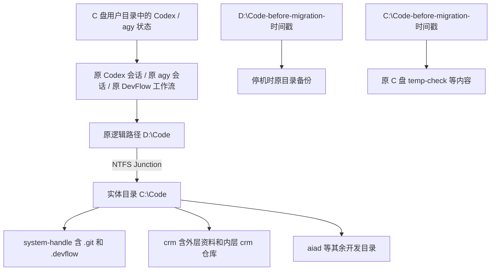

> **执行方式已更新（2026-09-15）：** 用户已将原目录改名为 `D:\Code-Origin`，并明确要求直接修改 DevFlow 的 C 盘路径。本文中的 D 盘目录联接切换方式已取消；最终状态、修改与验收以 [DevFlow C 盘路径迁移执行记录](../process/DevFlow-C盘路径迁移执行记录-20260915.md) 为准。不要继续执行本文中的旧联接切换脚本。
# 开发项目从 D 盘迁移到 C 盘方案

> 编制日期：2026-09-15。适用电脑：当前 Windows 开发机。\
> 本文交付的是迁移方案；本次未移动目录、暂停或恢复任务、修改会话数据库或运行迁移命令。\
> 现场状态采集于当日约 15:00—15:15（北京时间），执行迁移时必须重新冻结现场清单。

## 1. 确定采用的方案

**将整个 `D:\Code` 完整冷复制到 `C:\Code`，校验后把原 `D:\Code` 改名保留，再建立 `D:\Code → C:\Code` 的 NTFS 目录联接（Junction）。已有项目、会话和 DevFlow 工作流继续使用原来的 D 盘路径。**

迁移完成后，源代码、`.git`、依赖、构建产物、DevFlow 数据库和执行 worktree 的实体文件都位于 C 盘；旧路径通过联接访问这些文件。联接支持同一电脑上的不同本地卷，具体行为依据 [Microsoft 的目录联接说明](https://learn.microsoft.com/en-us/windows/win32/fileio/hard-links-and-junctions)。

本次同时完成三项兼容处理：

1. **DevFlow 的存储和执行目录配置固定为原 D 盘绝对路径**，保留现有 agy 项目目录 URI 和服务实例标识。
2. **首次回到 DevFlow 时明确指定原工作流 ID**，避免真实路径变化造成原会话绑定键失配后误建新任务。
3. **启动和关闭 DevFlow 服务统一从 C 盘实体安装目录执行**；业务工作区仍沿用 D 盘路径，进程身份核验依据新启动记录进行。

旧路径联接长期保留。当前项目不同时以 C、D 两个路径登记为两个项目，也不同时打开两套代理任务操作同一仓库。将历史会话中的目录文字全部改成 C 盘，不属于本次迁移的完成条件。

### 1.1 最终目录关系



### 1.2 能保证的范围与验证边界

- 通过完整复制、清单和哈希验证，确认代码、未提交修改、Git 元数据和流程持久化数据没有遗漏。
- 通过保留旧路径，降低会话、脚本和绝对路径失效的风险。
- 已核对当前 DevFlow 源码，本文给出了对应兼容措施；迁移后的启动和恢复仍须按验收表实测。
- Codex 官方说明了会话与本地工作区/worktree 的关联，但没有承诺任意目录移动或 Windows 联接下所有会话都能无感续跑。因此，“文件完整”“历史可见”“原会话能继续执行”分别验收，不能互相代替。参见 [Codex worktree 文档](https://learn.chatgpt.com/docs/environments/git-worktrees)。
- 迁移能减少本目录树在机械盘上的文件读写；不能保证 CPU、内存、网络或目录外数据库造成的卡顿一并消失。D 盘仍需保留盘符及联接入口。

## 2. 本机已核实的事实

### 2.1 目录与空间

`D:\Code` 当前有 11 个一级目录，全部纳入迁移，不仅复制 Git 已跟踪文件：

```text
agent
ai_office_assist
ai-native
aiad
crm
cwos-agent-assist
cwos-sso
finance-enterprise-mini
research
system-handle
temp-check
```

- `C:\Code` **已经存在**，且包含 `temp-check`；与 D 盘同名目录必须分别保留，不合并、不覆盖。本文先整体保留原 C 盘目录，再创建新的空 `C:\Code`。
- 采集时 C 盘可用空间约 **85.7 GiB**，D 盘可用约 **904.4 GiB**。这是瞬时值，不是迁移容量证明。
- 为避免调研阶段增加机械盘负担，本次没有遍历所有依赖计算总大小，也没有做全盘哈希。
- 当前环境读取物理磁盘类型和卷信息返回“拒绝访问”；C 盘是否为 SSD、两盘是否满足 NTFS 联接条件，在执行前通过 Windows 磁盘管理核实。条件不满足就不切换目录，不在迁移中临时更改分区或格式化。

### 2.2 DevFlow 的真实布局

**两个项目共用 `D:\Code\system-handle\.devflow\devflow.sqlite` 中的工作台状态。只迁移 CRM 代码不能迁走完整流程。**

| 项目 | 原项目 ID | 仓库与执行方式 |
|---|---|---|
| 当前项目 | `project-4b84075106c10a29` | `D:\Code\system-handle`；当前开发任务在独立 worktree 中 |
| CRM | `project-59cb679f9e8664bb` | `D:\Code\crm\crm`；使用现有工作区 `existing_workspace` |

| 工作流 | ID | 本次只读快照 |
|---|---|---|
| DevFlow 通用平台开发 | `wf-508be4f4-4c5a-453c-9ac6-c6dafe717a08` | `STOPPED`，版本 203；环境记录 `ready`、修订 9 |
| CRM 低代码开发 | `wf-9fe59b2c-e9cb-4ddd-aa9e-07dd05d3f2e3` | `STOPPED`，版本 267；环境记录 `stopped`、修订 7 |
| 历史阶段报错修复 | `wf-203cb2b8-aff1-4da5-9a22-495dcacafe4a` | `COMMITTED`，版本 158；保留历史，不恢复执行 |

这里的 `ready` 是数据库记录，不代表进程当前仍健康。调研时 `127.0.0.1:4810` 连接被拒绝，且 `.devflow\maintenance.lock` 当时被其他进程占用；**不能据此认定已经安全停机，也不能直接删除维护锁。**

实际 Git worktree 包括：

```text
D:\Code\system-handle
D:\Code\system-handle\.devflow\worktrees\project-4b84075106c10a29\wf-508be4f4-4c5a-453c-9ac6-c6dafe717a08\main
D:\Code\system-handle\.devflow\worktrees\project-4b84075106c10a29\wf-203cb2b8-aff1-4da5-9a22-495dcacafe4a\main
D:\Code\crm\crm
```

采集时主仓库 HEAD 为 `e8f5dfc135d24ca4337a0888df13392595e333c8`，有多项已修改和未跟踪文件。通用平台执行 worktree 的 HEAD 为 `6eb47cca18dc65397aab125e96eb329cecc344d2`；CRM 的 HEAD 为 `4f683629c646731a1ddbf99960561acc7de6b772`，分支为 `feature-zxw`。这些值用来说明工作区确实不同；正式比对以停机后重新采集的值为准。

### 2.3 会话实际存放在哪里

| 内容 | 当前实际位置 | 迁移措施 |
|---|---|---|
| Codex 会话、线程索引和数据库 | `C:\Users\yckj4798\.codex` | 原地保留，停机备份；不修改内部数据库 |
| Codex 桌面用户数据 | `C:\Users\yckj4798\AppData\Roaming\Codex` | 备份原地数据 |
| Codex 商店包用户状态 | `C:\Users\yckj4798\AppData\Local\Packages\OpenAI.Codex_2p2nqsd0c76g0` | 备份可用的 `LocalState`、`LocalCache`、`RoamingState`、`Settings`；不复制或重装程序包 |
| agy CLI 会话数据库 | `C:\Users\yckj4798\.gemini\antigravity-cli\conversations` | 原地保留、停机备份 |
| agy 项目目录绑定 | `C:\Users\yckj4798\.gemini\config\projects` | 保留原项目 ID 和 D 盘目录 URI |
| 其他 agy/Antigravity 状态 | `.gemini\antigravity`、`.gemini\antigravity-ide`、`AppData\Roaming\Antigravity` | 一并备份现有状态，不假设 CLI 目录涵盖全部历史 |
| DevFlow 任务、证据、容器和 worktree | `D:\Code\system-handle\.devflow` | 整体冷复制到 C 盘，继续通过 D 盘逻辑路径访问 |

只读检查确认：Codex `state_5.sqlite` 的 `threads` 表保存 `cwd`、`project_id`、`rollout_path` 等字段，已有线程引用 `\\?\D:\Code\...`。**移动代码与删除会话历史不是一回事；风险在于原会话引用的路径是否继续可用。**

当前 DevFlow 对应的 agy 绑定如下，执行时重新读取后冻结：

| 工作流 | agy project ID | agy conversation ID |
|---|---|---|
| 通用平台开发 | `cd1a0cea-1000-4c18-85f4-3b0dfae8f0fd` | `ad2f8571-465c-4736-8d43-e165753d09e8` |
| CRM 开发 | `5072ae4f-7cf1-4202-ac4f-e6c4b2293aac` | `f0a1b326-17f3-4c24-a83f-5c268d931fb0` |

两者的 agy `folderUri` 均指向原来的 `D:/Code/system-handle/.devflow/containers/<workflow_id>`。

## 3. 为什么要保留逻辑路径

### 3.1 项目识别与会话绑定不是同一个判断

`packages/entry/src/intake.ts` 会实时解析当前目录及已登记仓库的 `common_dir`。保留联接后，两者可同时解析到 C 盘，因此**不能简单断言项目 ID 必然变化**。

但同文件第 55—57 行的会话绑定键包含解析后的仓库路径。D 盘真实路径变成 C 盘后，旧 `entry_binding` 的键不会自动相同。恢复入口必须显式给出原 `workflow_id`，并使用 `intent=continue`；正常入口会为本次会话建立新绑定，沿用原任务，不需要手工改 SQL。

### 3.2 必须固定 DevFlow 的存储路径

当前 `devflow.yaml` 中：

```yaml
storage_root: .devflow
workspace_root: .devflow/worktrees
```

相对路径根据配置文件所在目录展开。Node 加载模块及不同启动入口可能解析到 C 盘。这样即使访问的是同一批文件，传给 agy 的目录 URI 也可能从 D 变 C。

`packages/adapters/agy/src/project.ts` 会严格校验同一个项目 ID 的 `folderUri`，不一致会报 `PROJECT_BINDING_MISMATCH`。`packages/service/src/launcher.ts` 又用存储路径生成服务实例标识。

因此在**目标副本**中确定改成：

```yaml
storage_root: 'D:\Code\system-handle\.devflow'
workspace_root: 'D:\Code\system-handle\.devflow\worktrees'
```

其余配置原样保留，尤其保留 `host.executable` 的原 D 盘值、端口、模型和 OpenTabs 设置。这两个字段只改变路径表达方式，在联接生效后仍指向 C 盘实体文件。`devflow.yaml` 当前受 `.gitignore` 排除；该变更记录在迁移审计中，不借机更新业务计划或执行基线。

不修改数据库中的 `project.repositories.path`、`workspace.root`、`common_dir`、计划哈希、快照或审批。项目配置整体参与审批哈希，直接全库替换 D 为 C 会引入 `PROJECT_CONFIG_CHANGED` 等问题。

### 3.3 快照和证据按实际规则处理

经核对 `packages/git/src/git.ts`，快照内容包含工作区 ID、baseline、branch、tree、文件哈希及环境修订；**不能说仅真实路径变化就必然改变快照 ID**。

但是环境重建、依赖重装、业务文件修改会影响有效证据。本次保留所有原证据作为历史；恢复后由原有门禁判断是否仍有效。需要重测时重测，不能修改环境修订或数据库标志让旧测试冒充当前通过。

### 3.4 暂停任务后仍须关闭服务

`Engine.stop()` 明确记录 `services_retained: true`。控制器重启还可能重新调度队列或模型重试，所以“关网页”“关 Codex”或“4810 暂时不通”都不等于流程已停稳。

必须分别确认：工作流暂停、开发环境停止、控制器退出、模型和测试子进程退出、维护程序退出、文件无写入。处于 `COMMITTING` / `COMMIT_PARTIAL` 的任务先通过既有提交恢复流程处理，不能强行改成 `STOPPED`。

## 4. 迁移前准备与放行条件

由操作者在独立 PowerShell 7 窗口执行迁移，不使用即将关闭的 Codex 终端。工作目录设在用户目录，不能停留在 `D:\Code`、`C:\Code` 或其子目录。

### 4.1 固定本次迁移名称

以下变量在本次操作的同一 PowerShell 会话中复用；将值记入审计文件，以便重开窗口后恢复。目录名自动带时间戳，没有需要临场选择的命名项。

```powershell
$ErrorActionPreference = 'Stop'
$migrationStamp = Get-Date -Format 'yyyyMMdd-HHmmss'
$migrationSource = 'D:\Code'
$migrationTarget = 'C:\Code'
$migrationOriginalD = "D:\Code-before-migration-$migrationStamp"
$migrationOriginalC = "C:\Code-before-migration-$migrationStamp"
$migrationAudit = "D:\Code-migration-backup-$migrationStamp"
Set-Location -LiteralPath $env:USERPROFILE
New-Item -ItemType Directory -Path $migrationAudit | Out-Null
```

正式运行前必须确认这些路径准确、父目录可写，三个带时间戳的目录均不存在。复制全用户状态可能包含凭据；审计和备份仅限本机原用户及管理员访问，不提交到 Git，不上传，不把 `.env` 或密钥内容写入报告。

### 4.2 形成一次性清单

在停写后生成 `inventory.json`、`repositories.json`、`links.json`、`files-sha256.csv`、`workflow-baseline.json`，保存在 `$migrationAudit`：

1. 枚举 `D:\Code` 全部普通文件、隐藏文件、空目录、重解析点；**遍历时不进入重解析点**，只记录链接类型和目标。
2. 普通文件记录相对路径、长度、SHA-256；链接另行记录，不将它们当目标文件展开。
3. 记录所有仓库根和嵌套仓库，包含 `.git` 为普通文件的 linked worktree、submodule；不能只检查 11 个一级目录。
4. 对每个原仓库和 worktree 记录 HEAD、分支、`git status --porcelain=v1 --untracked-files=all`、`git ls-files --stage`、worktree 清单及 `.git` 指针。可设置 `GIT_OPTIONAL_LOCKS=0` 避免可选索引刷新。
5. 记录 `.git/objects/info/alternates`、Git LFS、submodule、pnpm/npm 链接、Python 虚拟环境、IDE 工作区、Docker bind mount、WSL 挂载、Maven/Gradle 缓存是否引用目录树外路径。只记录配置位置及必要路径，不采集秘密值。
6. 记录 DevFlow 的原项目/工作流/工作区 ID、状态、计划与审批哈希、任务进度、conversation、环境修订、证据数量和文件哈希。
7. 记录 Codex 当前项目、活跃线程 ID、归档线程数量以及相应会话文件；记录 agy 项目 ID 和明确的 conversation ID。
8. 盘点 Codex 自动化、agy 后台任务、任务计划程序和 IDE 自动启动行为；停机窗口内禁止它们重新启动本目录的写入。保留原调度与开关，迁移后恢复原设置。

采用低并发遍历与哈希，不同时启动构建、索引或杀毒全扫。完整校验耗时纳入维护窗口，不承诺固定分钟数。

### 4.3 空间与特殊文件门禁

- C 盘为空间峰值预留：待复制普通文件的逻辑总大小，加硬链接展开与文件系统分配开销；完成后仍至少保留 **30 GiB 且不少于 C 盘容量 15%** 的余量，取两者较大值。这是本方案的容量策略。
- 原 `C:\Code` 改名不会释放空间，也不额外复制一份；它已经占用的空间不能算作可用空间。
- 用户状态备份写入 D 盘的 `$migrationAudit`；核对 D 盘剩余空间足够。
- 普通硬链接跨卷复制后可能成为独立文件；按逻辑大小计算容量。遇到必须依赖硬链接关系的项目，先完成关系保留验证再切换。
- 目录联接和符号链接保留链接本身；指向 `D:\Code` 内部的绝对链接在最终根联接下继续解析到 C 盘。指向目录树外机械盘的链接记录为剩余 IO 来源。
- EFS 加密文件、云占位文件、不可读文件、不支持的重解析点、循环链接等，任一未验证就不切换；不得把复制失败当作可以忽略的缓存。

## 5. 停机与冷备份

按以下顺序操作，并保留状态证据：

1. 保存所有 IDE、Codex、agy 中尚未落盘的编辑；等正在写文件的代理回合安全结束，再停止会话执行。不要通过提交、stash、reset 或重新 clone 来“清理”工作区。
2. 如存在正在运行的安装/更新，等待正常完成。当前发现过维护锁被占用，必须核对其所属进程及安装日志；不能直接删锁或边安装边迁移。
3. 工作台恢复可访问后核实本次状态。原来 `STOPPED` 的两个任务保持暂停；仍在执行或排队的任务通过现有控制台“暂停”处理。原待审批任务保留待审批；历史已完成任务保持完成。
4. 通过现有工作台停止每个开发环境，确认对应 Host、Java、Node/Vite、测试浏览器和 agy 子进程退出；不按进程名批量杀死所有 `node.exe` 或 `java.exe`。
5. 在旧目录仍有效时运行原服务停止脚本：

   ```powershell
   & 'D:\Code\system-handle\scripts\stop-devflow.ps1'
   ```

   脚本会检查 PID、启动时间、可执行文件和入口路径。若校验失败或记录缺失，先核对实际所属进程，禁止删除记录来绕过校验。

6. 停止其他 `D:\Code` 项目的本地开发服务、文件观察器、Git 客户端后台操作和本地数据库写入。数据库数据目录若位于本次树内，也必须按数据库自身规则干净关闭；不操作远端共享业务库。
7. 退出 Codex、agy、Antigravity 及相关 IDE；退出可能占用目录的终端和文件管理器窗口。确认后台 MCP、自动化及托盘进程不再写入。
8. 确认 4810 无原服务监听，迁移范围内无写入，未遗留实际运行的安装/更新。完成第 4 节清单。
9. 在所有相关应用退出后，将第 2.3 节的用户状态目录完整冷备到 `$migrationAudit`。复制必须保留隐藏项、必要 ACL 和链接；每项都有日志、成功状态和校验结果。

**SQLite 规则：** `.sqlite` / `.db` 文件以及当时存在的 `-wal`、`-shm`、`-journal` 必须作为同一停写时间点的文件集保存。不要热拷贝主库后忽略 WAL，也不要为“清理”而删除 WAL。冷复制在没有事务进行时才安全，依据 [SQLite 官方备份与日志一致性说明](https://www.sqlite.org/howtocorrupt.html)。

存在文件占用、清单变化、源文件无法读取或备份失败，就停留在本阶段。此时没有改动 D 盘正式路径，可以解决问题后重新冻结清单。

## 6. 冷复制和切换

### 6.1 保留原 C 盘目录

先检查实际路径，防止把未知联接或已有备份当作普通目录操作：

```powershell
if (Test-Path -LiteralPath $migrationOriginalC) { throw 'C 盘备份目录已存在' }
if (Test-Path -LiteralPath $migrationOriginalD) { throw 'D 盘备份目录已存在' }
$migrationSourceItem = Get-Item -LiteralPath $migrationSource -Force
$migrationTargetItem = Get-Item -LiteralPath $migrationTarget -Force
if ($migrationSourceItem.FullName -ine 'D:\Code' -or
    $migrationTargetItem.FullName -ine 'C:\Code') { throw '源或目标路径不匹配' }
if (($migrationSourceItem.Attributes -band [IO.FileAttributes]::ReparsePoint) -or
    ($migrationTargetItem.Attributes -band [IO.FileAttributes]::ReparsePoint)) {
    throw '源或目标已是链接，现场与方案不符，停止切换'
}
Rename-Item -LiteralPath $migrationTarget -NewName (Split-Path $migrationOriginalC -Leaf)
New-Item -ItemType Directory -Path $migrationTarget | Out-Null
```

这会保留原 C 盘 `temp-check`。迁移后的 `C:\Code\temp-check` 来自原 D 盘同名目录，原 C 盘内容在 `$migrationOriginalC\temp-check`，两者有明确来源。

### 6.2 完整复制到新空目录

```powershell
& robocopy.exe $migrationSource $migrationTarget /E /COPY:DATS /DCOPY:DAT /SJ /SL /R:1 /W:1 /MT:2 /NP "/LOG:$migrationAudit\code-copy.log"
$migrationCopyExit = $LASTEXITCODE
if ($migrationCopyExit -ge 8) { throw "复制失败，Robocopy 退出码 $migrationCopyExit" }
```

`/SJ /SL` 复制联接和符号链接本身；`/E` 包括空目录。参数及退出码含义见 [Robocopy 官方文档](https://learn.microsoft.com/en-us/windows-server/administration/windows-commands/robocopy)。退出码小于 8 仍须检查差异与日志，不能单独作为一致性验收。

- 复制 `.git`、`.devflow`、`.env`、未跟踪文件、忽略文件、`node_modules`、`dist`、Host 二进制、虚拟环境和现有构建缓存。不能用 Git 文件列表作为复制范围。
- 不使用 `/MOVE`、`/MOV`、`/MIR` 或 `/PURGE`。本次复制目标必须为空，不删除或镜像覆盖用户已有目录。
- 不把 `/XJ` 当作完整迁移方案：它会跳过联接，可能漏掉 pnpm 等依赖入口。
- 复制失败后不直接在半成品上继续开发。确认源仍停写，可继续补齐；最终必须重新完整对照冻结清单。

### 6.3 切换前静态校验

1. 对照冻结清单逐项检查目标普通文件的长度和 SHA-256；相对路径、空目录和链接目标也必须一致。记录源读取失败和目标额外文件，任何无法解释的差异均不放行。
2. 在原路径切换前，目标 worktree 的 `.git` 可能仍指向旧 D 盘。**此阶段只做不跟随链接的文件检查，不能运行目标副本的 Git 写操作、启动项目或打开目标副本中的 agy/Codex 会话。**
3. 在独立验证副本上打开 SQLite 做 `PRAGMA integrity_check`，结果应为 `ok`。验证副本连同 WAL 一起复制；不要用带自动建表、恢复和调度逻辑的 DevFlow `Store`/服务来检查备份。
4. 清单一致后，将目标 `C:\Code\system-handle\devflow.yaml` 的 `storage_root`、`workspace_root` 改为第 3.2 节指定的 D 盘绝对路径。对变更前后配置单独计算哈希、保存仅这两个字段的差异；其余内容必须一致。
5. 校验该 YAML 的解析结果：两项均为指定的 D 盘绝对路径；原端口、模型、Host、OpenTabs 配置均保留。

### 6.4 原 D 盘改名并建立联接

再次确认源目录仍是原普通目录、源清单未变化、所有写入者已退出、备份目标不存在，然后执行：

```powershell
$migrationSourceItem = Get-Item -LiteralPath $migrationSource -Force
if ($migrationSourceItem.FullName -ine 'D:\Code' -or
    ($migrationSourceItem.Attributes -band [IO.FileAttributes]::ReparsePoint)) {
    throw 'D 盘源目录身份已变化'
}
if (Test-Path -LiteralPath $migrationOriginalD) { throw 'D 盘备份目录已存在' }
Rename-Item -LiteralPath $migrationSource -NewName (Split-Path $migrationOriginalD -Leaf)
try {
    New-Item -ItemType Junction -Path $migrationSource -Target $migrationTarget | Out-Null
} catch {
    if (-not (Test-Path -LiteralPath $migrationSource)) {
        Rename-Item -LiteralPath $migrationOriginalD -NewName 'Code'
    }
    throw
}
Get-Item -LiteralPath 'D:\Code' -Force | Format-List FullName,LinkType,Target
```

预期 `LinkType` 为 `Junction`，目标为 `C:\Code`。若创建失败且自动回退未完成，保持所有应用关闭，按第 9 节恢复原路径。

原 D 盘目录保留为停机时备份；它包含的 `.git`、联接和绝对路径仍可能指向正式 `D:\Code`。**不要在备份目录中打开 IDE、运行 Git、启动服务或恢复代理会话**，否则可能间接操作 C 盘正式数据。备份检查使用不跟随链接的文件读取。

## 7. 分层验收与恢复

### 7.1 文件系统与 Git：先验收，后启动服务

```powershell
node -e 'const fs=require("node:fs"); console.log(fs.realpathSync("D:/Code/system-handle")); console.log(fs.realpathSync("D:/Code/crm/crm"));'
git -C 'D:\Code\system-handle' worktree list --porcelain
git -C 'D:\Code\crm\crm' worktree list --porcelain
```

预期 Node 输出分别为 C 盘对应目录。然后对清单中的每个原仓库和 worktree 验证：

- HEAD、分支、暂存区条目与全部未提交修改相同；无新增 `prunable` / 丢失 worktree。
- `.git` 指针和 `git rev-parse --git-common-dir` 可解析到 C 盘实体仓库。
- CRM 继续位于原内层仓库、原分支；外层资料仓库不被当作产品仓库。
- 联接的两条路径读取同一文件得到相同哈希；最终目标不落回 `$migrationOriginalD`。
- Codex/agy 所需原逻辑目录可以访问，必要写权限与迁移前等价。

保留旧路径后通常不需要 `git worktree repair`。如果检查显示连接损坏，停止后续启动：先备份 Git 元数据，再使用 Git 官方 `worktree repair` 对清单中的原逻辑路径修复并重做比对；不使用 `prune`、`reset` 或重建任务工作区。修复行为依据 [Git worktree 官方文档](https://git-scm.com/docs/git-worktree)。

### 7.2 DevFlow 服务：保留 D 盘存储身份，从 C 盘启动程序

从独立终端启动已复制的现有构建：

```powershell
& 'C:\Code\system-handle\scripts\open-devflow.ps1'
```

首次不重新安装依赖、不重新构建、不运行“安装或更新”，避免迁移和代码升级混在一起。必须已完成第 3.2 节配置固定。

核对：

1. `http://127.0.0.1:4810/api/health` 返回原 DevFlow 服务；实例标识与原逻辑存储路径相符。
2. 配置实际解析的存储位置仍为 `D:\Code\system-handle\.devflow`，其实体路径为 C 盘。只运行一个控制器，禁止另一套进程通过 C 盘数据库路径另开同一 SQLite。
3. 原两个 project、三个 workflow 和三个 workspace 均可找到；计划、审批、任务进度、会话 ID 与冻结清单一致。控制器产生新的进程记录和正常恢复事件允许单独审计。
4. 原 `STOPPED` 工作流保持暂停；环境显示依据恢复事实校准，不把旧 `ready` 当作有效进程证明。
5. 直接打开原任务链接查看历史：
   - [通用平台原工作流](http://localhost:4810/?workflow=wf-508be4f4-4c5a-453c-9ac6-c6dafe717a08)
   - [CRM 原工作流](http://localhost:4810/?workflow=wf-9fe59b2c-e9cb-4ddd-aa9e-07dd05d3f2e3)
6. 抽查计划文档、进度、原始测试报告和证据文件均可打开；历史已完成任务保持原状态。

服务停止使用：

```powershell
& 'C:\Code\system-handle\scripts\stop-devflow.ps1'
```

原因是 Node 模块入口可能记录为 C 盘，而旧 D 盘停止脚本会按 D 盘入口字符串核验并拒绝停止。启停前读取 `controller-process.json` 的实际入口；必须与脚本预期一致，不能绕过身份检查。新快捷方式使用上述 C 盘脚本。原 Codex MCP 的 D 盘 `args` 和 `cwd` 仍通过联接可达；配置固定后应指向同一服务实例，不另建服务。

### 7.3 Codex：恢复原线程

1. 打开原 Codex 安装，先查看原项目及原线程；不先新增同仓库的 C 盘项目，不删除原 D 盘项目。
2. 对通用平台、CRM 和至少一个其他项目，确认历史对话可读、线程 ID 保留，目录仍可访问。
3. 在原线程执行只读目录检查和 Git 状态读取；核对实体路径落在 C 盘。
4. 对写入能力在独立迁移探针目录做一次可回滚的临时文件创建、读取和删除，探针不进入业务文件或 DevFlow 合同；不得通过清空正式文件验证。
5. 若沙箱因真实路径 C 盘而拒绝写入，通过应用正常权限设置只增加相应 C 盘项目实体目录，并保留旧 D 盘访问。重启该线程后复验；不全局关闭沙箱，不直接改内部线程表。
6. 若原线程没有显示，先查原项目、归档记录及用户目录是否正确；保持备份，停止会写文件的操作。不能把“新建聊天可以打开 C 盘”算作原会话恢复成功。

Codex 用户目录已经在 C 盘，本次没有迁移它们的实际位置。`.codex` 数据库、JSONL、全局状态和自动化文件仅做冷备份，不全局替换路径字符串。

### 7.4 agy：区分普通会话与 DevFlow 托管会话

普通 agy 会话从原 D 盘项目入口打开，使用原项目 ID 与明确的 conversation ID 恢复。已核对当前 `agy --help` 支持 `--project` 和 `--conversation`；不用指向最近记录的 `--continue`，也不用 `--new-project`。

DevFlow 托管会话由工作台恢复，不能另外在终端启动同一 conversation。必须核对：

- `agy_project.id` 仍为原 ID；对应 `folderUri` 仍是原 D 盘容器路径。
- `conversation.id` 沿用冻结清单；新执行事件证明恢复了该 conversation。
- 没有 `PROJECT_BINDING_MISMATCH`，没有为了消除报错新建 agy 项目或清空 conversation。
- `.gemini` 原历史、配置和关联目录均可读。

### 7.5 明确绑定原 DevFlow 工作流后再继续

首次通过 Codex 回到 DevFlow，使用正常入口明确指定下列信息：

| 项目 | working_directory | project_id | workflow_id | intent |
|---|---|---|---|---|
| 通用平台 | `D:\Code\system-handle` | `project-4b84075106c10a29` | `wf-508be4f4-4c5a-453c-9ac6-c6dafe717a08` | `continue` |
| CRM | `D:\Code\crm\crm` | `project-59cb679f9e8664bb` | `wf-9fe59b2c-e9cb-4ddd-aa9e-07dd05d3f2e3` | `continue` |

入口中的 `conversation_id` 使用当前 Codex 线程的实际 ID，不使用 agy conversation ID。其余必填字段沿用原任务合同，不改任务复杂度或 workspace_mode。

此步骤通过正常入口恢复绑定，不创建第二个工作流、不重新登记项目、不提交新计划。若界面提示新建/首次接入，先停止，核对原数据库、project ID 和仓库解析结果。

迁移静态验收通过后，**再由用户在工作台按原任务恢复流程点击“继续”**。原来待审批或暂停的任务不能因为磁盘迁移被自动执行。

恢复顺序固定为：先通用平台任务验证一次恢复入口、原 conversation 和环境启动，再 CRM，最后其他独立项目。每个阶段确认无迁移路径错误才进入下一个阶段。真实恢复会产生新 run 和环境记录，应保留这些记录，不追求 run ID 或全部数据库字节保持不变。

无需为证明迁移成功而完成整个业务开发。恢复成功的证据应至少覆盖：原任务身份、原会话、原代码修改、一个正常的工具读取/写入动作、开发环境启动和原有状态机继续工作。业务测试及人工验收仍执行原合同。

## 8. 验收表与性能确认

| 验收项 | 通过标准 |
|---|---|
| 复制完整性 | 普通文件 SHA-256、链接清单、目录清单一致；仅允许已记录的两个配置字段变更 |
| 原 C 盘内容 | 原 `C:\Code` 完整保存在时间戳目录，原 `temp-check` 可找到 |
| 路径落点 | `D:\Code` 为指向 `C:\Code` 的 Junction，关键目录 realpath 为 C 盘 |
| Git | 原 HEAD、分支、暂存区、未提交修改与 worktree 关系保留 |
| 数据库 | 冷备和验证副本完整；SQLite integrity_check 为 `ok` |
| Codex | 原线程历史和 ID 保留，原线程可以访问并按正常权限写入迁移后的工作区 |
| agy | 原项目和 conversation 可继续，DevFlow 项目目录绑定无变化 |
| DevFlow | 原项目/工作流/审批/进度/证据均可读；未误建任务；原暂停状态受到尊重 |
| 真实续跑 | 用户恢复后沿用原任务、会话和代码成果，服务可启动，无迁移路径错误 |
| 原有业务失败 | 与冻结日志比较，区分迁移新增故障和迁移前已存在的构建/测试错误 |
| 性能 | 同一项目、同一操作、相近进程负载下，比较迁移前后耗时与磁盘活动 |
| 回滚 | 原 D 盘数据、用户状态备份、清单和日志都存在，未提前清理 |

性能验证使用原有一次代表性操作，例如 Git 状态扫描、前端增量构建或启动 CRM 开发环境，记录冷启动与热缓存条件。在任务管理器/资源监视器中核对 C 盘承担主要项目文件 IO，D 盘不再持续进行本项目的大量读写。

若仍卡顿，依据实际 IO 路径检查目录树外 Maven/Gradle/npm/pnpm 缓存、Docker/WSL 虚拟磁盘、本地数据库、日志和系统内存压力。它们不在 `D:\Code` 内时，不会因本次复制自动迁移。此类优化安排在本次验收后单独处理，避免扩大回滚范围。

## 9. 回滚方案

### 9.1 切换前失败

D 盘正式路径尚未变动：保留失败副本和日志，将新 `C:\Code` 改名为 `C:\Code-failed-<本次时间戳>`，再把 `$migrationOriginalC` 改回 `C:\Code`。执行前确认两者都是预期普通目录、目标名不存在。恢复原应用即可；不删除半成品来掩盖问题。

### 9.2 已切换，但没有产生新的业务修改

1. 按第 5 节重新停写。即使只做了启动验收，C 盘数据库和会话可能已有新记录，也先冷备当前 C 盘数据和当前用户状态。
2. 确认 `D:\Code` 确实是本次联接且目标为 `C:\Code`，`$migrationOriginalD` 是预期原目录。
3. **仅改名联接入口**为 `D:\Code-link-disabled-<本次时间戳>`，保留它以便核查；不要递归删除联接。
4. 将 `$migrationOriginalD` 改回 `D:\Code`。原 D 盘路径恢复，保留暂停状态。
5. 将当前 C 盘副本改名保留后，把 `$migrationOriginalC` 恢复为 `C:\Code`。先核对所有目标名不存在，绝不覆盖。
6. 用户状态默认保留最新完整版本；只有确证用户状态损坏或出现不兼容绑定时，才在应用全部退出后恢复对应冷备。恢复前保留最新状态，禁止用旧备份无差别覆盖新会话。
7. 从 D 盘恢复原启停脚本，重新验收原任务和 Git 状态。保存迁移尝试及失败原因。

### 9.3 已产生新的业务修改或新的流程进度

**不能直接把最初的 D 盘备份恢复为正式目录，否则会丢失迁移后的工作。**

固定采取以下回退步骤：

1. 停止全部写入，冷备最新 C 盘正式代码、DevFlow 状态和用户会话状态。
2. 将最新 `C:\Code` 完整冷复制到新的普通目录 `D:\Code-rollback-stage-<时间戳>`，使用第 6.2 节相同的复制与链接规则。
3. 不跟随暂存副本中的链接，核对普通文件哈希、链接、SQLite 验证副本和最新业务清单。复制期间原 `D:\Code` 仍指向 C，不能在暂存目录启动 Git 或服务。
4. 将原 `D:\Code` 联接改名停用，再将新的回滚暂存目录改为 `D:\Code`。此时恢复的是**最新进度**；最初 `$migrationOriginalD` 继续保留。
5. 保留当前 C 盘副本，按需恢复原 C 盘目录名；用户会话使用最新完整状态。
6. 恢复 D 盘启停入口并执行第 7 节相同的验证。原 D 盘绝对存储配置此时直接指向实体目录，无须修改业务计划和 baseline。

整个回滚不使用跨 Shell 拼接删除命令，不执行 `Remove-Item -Recurse D:\Code`、`rd /s` 或指向联接的镜像删除。每次改名前都核对绝对路径、普通目录/链接类型和目标不存在。

## 10. 保留期和后续日常使用

- 原 D 盘备份至少保留 **14 天**，且须完成一次 Windows 重启、Codex/agy 原会话续用及两个 DevFlow 项目的正常恢复验收。
- 原 C 盘 `temp-check` 与迁移审计、用户状态备份单独保留；未核对来源和内容前不清理。
- 清理原 D 盘备份是后续独立操作，必须再次核对目标与恢复需求；本方案不安排自动删除。
- `D:\Code → C:\Code` 联接长期保留，不随备份保留期届满而删除。
- 当前项目继续从原 D 盘入口打开，以维持会话与工具路径习惯；这些读写实际落在 C 盘。文件管理器可以查看 C 盘实体目录，但不启动第二套针对同仓库的开发代理。
- 备份软件只选择 C 盘实体目录作为正式代码源，并识别 D 盘联接，避免重复备份和循环。
- 以后如确需让所有旧会话显示为 C 盘路径，再单独验证应用支持的项目重定位功能；不批量编辑 Codex/agy 私有数据库或改写历史审批证据。

## 11. 本次核查依据

### 本地实现与现场证据

- `packages/entry/src/intake.ts`：真实路径解析、已有仓库匹配、会话绑定键、显式 workflow 续用。
- `packages/git/src/git.ts`：已有 workspace 复用、baseline、worktree 和快照组成。
- `packages/workspace/src/files.ts`：工作区真实路径与链接访问限制；迁移不放宽安全边界。
- `packages/adapters/agy/src/project.ts`、`packages/runtime/src/runtime.ts`：agy project folderUri 严格绑定与 conversation 恢复。
- `packages/contracts/src/config.ts`、`packages/service/src/launcher.ts`：配置相对路径解析和服务实例标识。
- `packages/core/src/engine.ts`、`apps/api/src/main.ts`：暂停保留服务、配置哈希、控制器重启恢复与调度。
- `scripts/stop-devflow.ps1`：按入口路径、PID、启动时间核验所属进程。
- 当前 `.devflow\devflow.sqlite` 只读查询、Git worktree 清单、`.codex\state_5.sqlite` 只读结构与 cwd 查询、agy 本机 `--help` 和项目目录绑定文件。

### 官方资料

- [Microsoft：Hard links and junctions](https://learn.microsoft.com/en-us/windows/win32/fileio/hard-links-and-junctions)
- [Microsoft：Robocopy](https://learn.microsoft.com/en-us/windows-server/administration/windows-commands/robocopy)
- [SQLite：备份、WAL 与损坏风险](https://www.sqlite.org/howtocorrupt.html)
- [Git：worktree 管理与 repair](https://git-scm.com/docs/git-worktree)
- [OpenAI：Codex worktree 与会话关联](https://learn.chatgpt.com/docs/environments/git-worktrees)

**完成定义：代码实体位于 C 盘；旧路径仍可用；原 Codex/agy 会话和 DevFlow 工作流通过分层验收；已有修改与进度保留；回滚材料齐全。**
