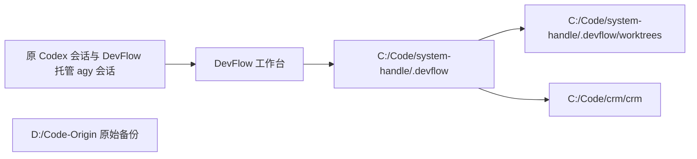

# DevFlow C 盘路径迁移执行记录

> 完成时间：2026-09-15 19:01（Asia/Shanghai）。本记录采用用户最终指定的“直接修改 DevFlow 路径”方式，替代原迁移方案中的 D 盘目录联接方式。

## 1. 最终状态

- 正式代码和 DevFlow 数据位于 `C:\Code`。
- 用户已将原目录改名为 `D:\Code-Origin`；本次保留该目录，没有建立或重建 `D:\Code`。
- 用户已手动调整普通 Codex / agy 会话目录。本次处理 DevFlow 运行配置、数据库引用、托管会话及工作流 Git 元数据。
- DevFlow 已从 C 盘启动，控制器 PID 为 `32160`，入口为 `C:\Code\system-handle\dist\apps\api\src\main.js`。
- 工作台地址：[http://localhost:4810](http://localhost:4810)。服务健康检查正常。
- 两个开发任务保持暂停；未启动执行器、重新批准计划、创建第二个工作流或提交业务代码。

## 2. 原工作流状态

| 工作流 | 状态 | 工作流版本 | 计划版本 |
|---|---|---:|---:|
| [通用平台：wf-508be4f4-4c5a-453c-9ac6-c6dafe717a08](http://localhost:4810/?workflow=wf-508be4f4-4c5a-453c-9ac6-c6dafe717a08) | STOPPED | 224 | 3 |
| [CRM：wf-9fe59b2c-e9cb-4ddd-aa9e-07dd05d3f2e3](http://localhost:4810/?workflow=wf-9fe59b2c-e9cb-4ddd-aa9e-07dd05d3f2e3) | STOPPED | 279 | 2 |
| 历史任务：wf-203cb2b8-aff1-4da5-9a22-495dcacafe4a | COMMITTED | 158 | 1 |

保留原有 2 个 project、3 个 workflow、3 个 workspace、3 个 agy project、3 个托管 conversation、6 份计划和 4 条审批。任务、测试、快照、分支和基线编号没有重建。

## 3. 具体修改

### 配置与路径

共调整 18 个文件，修改前均备份：

- 主安装的 `devflow.yaml`：`storage_root`、`workspace_root` 和 `host.executable` 使用 C 盘绝对路径。
- 两个工作流的 `.git` 指针及主仓库 `.git/worktrees/*/gitdir`，共 4 个 Git 路径文件。
- 3 个工作流容器的 MCP 配置、PowerShell 编码 Hook 和 `handoff.json`，共 9 个文件；Hook 解码后更新桥接器路径并重新编码。
- 3 个 DevFlow 专用 agy 项目配置：原 project ID 不变，容器 `folderUri` 改为 `file:///C:/Code/...`。
- 用户 Codex 配置中的 `mcp_servers.devflow` 启动参数和工作目录；保留其他设置及用户在迁移期间新增的配置。

另将通用平台工作流已有的 `node_modules` 依赖链接指向 `C:\Code\system-handle\node_modules`。没有创建 D 盘兼容入口。

### 数据库及校验关系

在服务停止期间冷备原 SQLite 数据库，通过事务更新 537 条实体记录中的目录引用和对应摘要关系。主要覆盖仓库根、Git common directory、环境数据目录、CRM `.env` 文件位置、证据文件位置和入口上下文。

项目路径参与 DevFlow 的项目配置摘要。为保持等价的目录迁移可继续使用原合同，使用 DevFlow 自身的校验代码重算 2 个项目摘要和 6 个计划摘要，并同步已有审批、工作流及浏览器场景的摘要引用。业务要求、修改范围、任务与测试清单、计划版本均未改变；4 条审批的原始 `proof`、`approved_at` 和 `revision` 保持不变，没有生成新的审批。

原始摘要和迁移后摘要的 8 组映射保存在审计文件中，可与修改前数据库逐项比较。历史事件表和原始日志保留当时记录，因此其中出现 D 盘路径属于历史内容，不作为当前运行目录使用。

### Git 所有者恢复

管理员复制导致部分仓库目录和 Git 元数据的所有者变为 Administrators，Git 因此拒绝访问。逐项核对 `D:\Code-Origin` 后，将 9 个对应目录/文件的所有者恢复为原来的 `AD\YCKJ4798`。最终检查保留现有访问权限和 Codex 保护规则。

自动审批曾拒绝新增用户级 `safe.directory` 的操作，该命令没有执行。最终通过恢复复制前的原始所有者解决问题，没有新增 Git 全局信任项。

## 4. 验收结果

| 检查 | 结果 |
|---|---|
| SQLite 修改前、修改后和服务启动后快照 | integrity_check 均为 ok |
| 原事件记录 | 32,591 条完整保留；启动后仍一致 |
| 原 tokens / dedup / outbox | 静态验收时 46 / 10 / 14 条全部一致 |
| 原始证据文件 | 122 份存在且 SHA-256 与记录一致 |
| 当前运行路径 | 24 处存在，均使用 C 盘 |
| 工作流仓库 | CRM 和两个工作流 worktree 的 HEAD、分支、暂存区、未提交状态与冻结记录一致 |
| 主仓库 | HEAD、分支、暂存区保留；期间出现的 13 项 pnpm 等并行修改已单独记录并保留 |
| DevFlow 实际组件 | 3 次项目配置校验、3 个工作区 Git 解析、3 次 FileBroker 文件读取通过 |
| 浏览器场景 | 5 个场景的项目摘要绑定通过 |
| 工作台 HTTP 接口 | 25 次检查通过，含原工作流、历史、9 份文档及证据下载 |
| Codex 工作流入口 | 5 条原会话通过正常 devflow_start / continue 入口成功打开原工作流 |
| 服务启动后的数据库 | 1,014 条原实体与迁移后预期一致；仅新增 5 条 C 盘入口绑定，总绑定数 10 |
| 控制器错误日志 | 与原始备份内容一致，没有新增错误 |
| 旧根路径 | D:\Code 不存在 |

实际的业务环境重启、模型继续执行、完整业务测试及人工验收没有在本次迁移中触发。用户可在原工作流页面按原流程点击“继续”；这不等同于业务任务已经完成。

## 5. 备份与审计

- 原始项目备份：`D:\Code-Origin`。
- 原 C 盘目录备份：`C:\Code-before-migration-20260915-160000`。
- 全部迁移审计：`D:\Code-migration-backup-20260915-160000`。
- 本次直接路径迁移审计子目录：`D:\Code-migration-backup-20260915-160000\direct-path-relocation-20260915-183300`。

关键证据：

- `before.sqlite`、`cold-before/`：本次路径调整前的数据库备份。
- `files-before/`：18 个文件的原始副本。
- `relocation-draft.json`、`applied.json`：具体修改、文件摘要与项目/计划摘要映射。
- `owner-restoration.json`、`owner-restoration-first-seven.json`：原始所有者恢复记录。
- `static-verification.json`：Git、运行路径、数据库及 122 份证据验证。
- `main-status-delta.json`：迁移期间主仓库已有的其他修改。
- `live-verification.json`：服务、组件、原工作流和会话绑定验证。
- `after-service-start.sqlite`、`final-state-verification.json`：恢复服务后的完整快照与一致性检查。

保留原项目及审计备份至少 14 天，并在重启电脑、原会话续用及两个工作流真实恢复通过后再另行决定清理。没有自动清理任务。

## 6. 后续使用与边界

- 从 C 盘脚本启停服务：`C:\Code\system-handle\scripts\open-devflow.ps1`、`C:\Code\system-handle\scripts\stop-devflow.ps1`。
- Codex 的 DevFlow MCP 配置已改为 C 盘。如果已打开的客户端仍缓存旧启动参数，在下一次重开 Codex 后加载新配置；HTTP/MCP 服务入口和 5 条原绑定已实际验证。
- 原方案中的目录联接切换及其旧回滚步骤已不适用于现在的直接路径方式，不应继续执行旧切换脚本。
- 本轮按用户最终要求只处理 DevFlow 及其直接关联项，没有继续改写其他项目或普通会话的配置，也没有重新验收其他项目的依赖链接。
- 回退本次路径修改前，必须先停止 DevFlow 并备份最新数据库与文件；若已产生新进度，不得用本次旧快照直接覆盖。