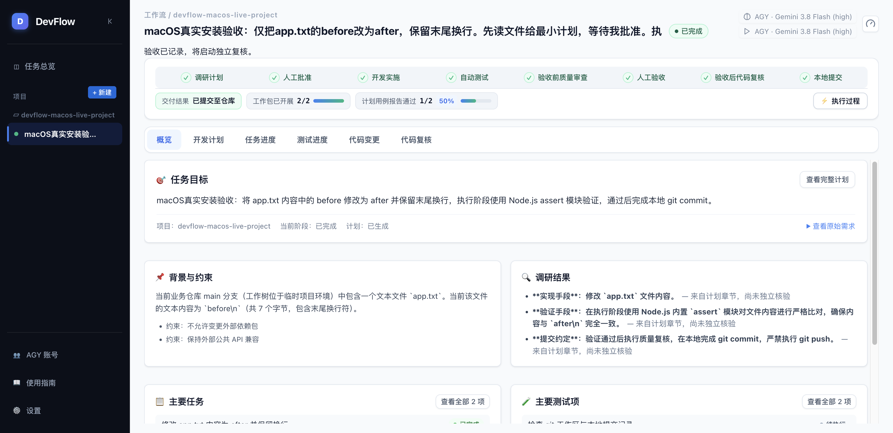
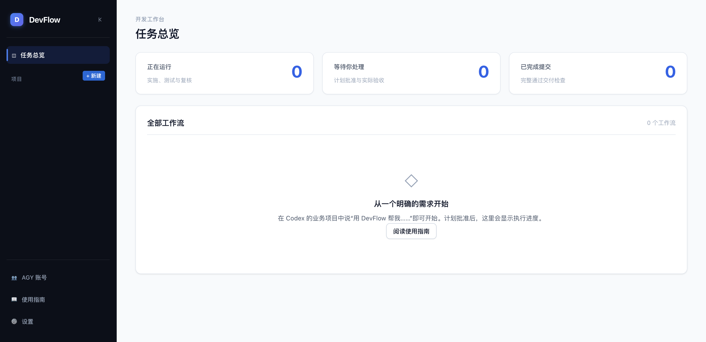

# macOS 一行安装与真实 AGY 任务验收

验收日期：2026-10-08。测试主机：macOS 27.0.1（26A434），Apple Silicon / `darwin-arm64`。源码基线：`734ec687f6a1c8cad3b08b1d74725ec0fd3e04c9`，加本次尚未提交的修复。构建工具链：Node.js 22.23.2、pnpm 11.7.0。原本机 Node 22.22.2 未达到源码构建要求，因此使用临时工具链；成品安装使用包内 Node。

## 结论与范围

- **公开一行安装当前不可用**：实际执行 README 中的命令返回 HTTP 404、非零退出码。GitHub Releases API 返回空列表，OpenTabs 查看发布页面也没有 Release。README 已说明该入口尚未上线，本次未推送或发布。
- **本地最终完整包的 Bash 安装通过**：用最终生成的成品及原始发布引导脚本，重放下载、manifest/归档摘要校验、安全解压、发布身份校验、内置 Node、安装器、服务启动和稳定命令入口。仅下载传输由受限本地资源重放代替，四个资源仍按正式 GitHub URL 请求并校验；此结果不能替代公开下载验收。
- **真实 AGY 完整任务通过**：使用本机已登录的 AGY 1.3.1、Gemini 3.8 Flash (high)，通过 OpenTabs 操作 Chrome 创建任务、选择并验证模型、批准计划、人工验收，完成最终复核、本地提交和源仓库整合。真实任务使用 Keychain 身份修复后的隔离完整包；最终另行重建并验证了进程停止修复和 Bash 物理路径修复。
- 本次只证明上述 macOS arm64 主机与 AGY 路径。没有认证 macOS Intel、Linux、Windows 或其他客户端；没有认证 macOS 账号池导入、轮换或跨账号恢复。

公开命令：

```bash
bash -o pipefail -c 'curl -fsSL https://github.com/zephyrw/dev-flow/releases/latest/download/install.sh | bash'
```

## 发现与修复

| 问题 | 原因与修复 | 验证 |
|---|---|---|
| Bash 3.2 错误路径报未定义变量 | 变量后紧接中文标点，被解析为变量名的一部分；使用 `${变量}`，并补齐脚本执行权限 | 22 项 Bash 参数、退出码、归档与入口测试通过 |
| 显示安装成功但未创建安装目录 | macOS 临时目录 `/var/...` 是 `/private/var/...` 的别名；ESM 入口判断未命中，安装器没有执行；引导脚本使用 `pwd -P` | 新增符号链接路径 ESM 入口回归；完整成品 Bash 安装退出 0，`devflow status` 确认 installed/running 都为 0.2.0 |
| macOS 成品归档被安全解压拒绝 | Node 22 macOS 原生递归复制仍保留嵌套符号链接；使用带 filter 的复制路径物化文件 | 最终归档没有链接或特殊文件，候选包验证通过 |
| 候选检查误判第三方源码包含私钥 | 只凭 PEM 开头标记判断，把解析器中的字符串字面量当作私钥；检查实际编码载荷 | LF、CRLF、转义换行及无载荷标记回归通过 |
| 候选检查拒绝系统临时目录 | 安全目录检查遇到 `/var` 别名；验证脚本先解析临时目录真实路径 | 最终候选验证通过 |
| 无效发布身份仍创建安装目录 | 目录初始化与加锁早于身份校验；调整为校验通过后写入 | 身份错误不得创建安装状态的候选断言通过 |
| 升级时旧版自有 MCP 配置冲突 | 配置引用旧版本 Node/bridge；只允许匹配旧版自有配置时迁移，保留用户自改条目 | Codex、AGY、OpenCode 升级及拒绝覆盖测试通过 |
| 本机 AGY 已登录却无法启动任务 | 身份探测未识别 macOS Keychain；只读 `gemini / antigravity` 条目，解码原生格式并对稳定 subject/email 哈希；macOS 配置目录使用 `.gemini/antigravity-cli` | 真实模型访问与完整任务通过；刷新、换账号、缺失/锁定/格式错误回归通过 |
| 受管模型成功后仍报进程退出未确认 | macOS 进程组退出期间可短暂返回 EPERM；保持保守存活判断及原有截止时间，继续确认到 ESRCH | 2 项存活判断测试、6 项进程管理集成测试通过 |
| 浏览器回归夹具显示完成但没交付修改 | 夹具未实现当前 planner_commit；新增真实 git add/commit；跟进双步审批和统一指导输入，保留工作树交付约定 | 浏览器完整流程与 45 项原生交付、规划提交集成测试通过 |

macOS 账号池的凭据导入/自动轮换仍明确返回 `unsupported_platform` / `auth_host_capability_unavailable`。本次复用本机登录，不把该 Windows 能力标注为 macOS 已支持。凭据没有输出或写入报告。

## 真实任务证据

业务仓库：`/private/tmp/devflow-macos-live-project`，源分支 `main`；需求仅将 `app.txt` 从 `before\n` 修改为 `after\n`，用 Node 内置 assert 严格检查，然后本地提交，不推送。

- 工作流：`wf-27da5db6bb62b4a6646f0c0b0e4601d6`。
- 状态：`COMPLETED`；UI 显示八阶段全部完成、已提交至仓库。
- 实际运行依次为 `planning`、`implement`、人工前 `quality_review`、人工后 `quality_review`、`planner_commit`。
- 本地交付提交：`5bdd9c37b7fe3142bab3fbdb9ed8f1166715ef3b`，消息 `Update app.txt content from before to after with trailing newline`。
- 独立读取源仓库 `HEAD:app.txt`，严格确认内容是 `after\n`，源仓库工作区干净，工作树保留。
- 页面计划用例报告为 1/2：文件内容断言已有执行报告；另一项是提交记录检查，提交后以源仓库 Git 对象独立核对。没有伪造第二份执行测试报告。





## 最终检查

| 检查 | 结果 |
|---|---|
| `pnpm typecheck` | 通过，覆盖源码与测试类型 |
| `pnpm build` | 通过，包含最终修复 |
| 受影响安装、身份、进程测试 | 79 项通过后，新增 Bash 入口回归所在文件 22 项全部通过；合计不同用例 80 项通过 |
| 原生交付、规划提交相关集成测试 | 45 项通过 |
| `tests/e2e/devflow-v2-workbench.spec.ts` | 1 项通过；真实子进程、指导续修、复核、提交和源仓库内容断言 |
| PowerShell 引导测试 | 13 项明确跳过，本机无 PowerShell，不能作为 Windows 通过 |
| `pnpm release:build` / `pnpm release:verify` | 通过 |
| 正式标签及源码 SHA 下的 `validate-candidate.mjs dist/release` | 通过；日志中的错误身份/不可写客户端目录为预期负向测试 |
| 完整 Bash 安装与 `devflow status` | 均退出 0；服务运行版本 0.2.0，安装端口 14828 |
| OpenTabs 真实 Chrome 流程 | 通过；创建、模型验证、计划审批、验收、最终完成及截图 |
| `git diff --check` | 通过 |

最终成品：`dist/release/devflow-v0.2.0-darwin-arm64.tar.gz`，101342170 字节，SHA-256 `facf538da30d31242e62c2979d6e30f588ef50de17e6fd5f4919210648f16ae0`。该包基于工作区修复构建，未上传 GitHub。

原始日志、API 记录、隔离安装和测试数据库在 `.cache/macos-install-20261008/`。保留真实任务工作台于 `http://localhost:14823/?workflow=wf-27da5db6bb62b4a6646f0c0b0e4601d6`，多余隔离安装服务停止；数据库、工作树及用户凭据保留。完整 Bash 安装测试临时改动的 `.zshrc` 和用户命令入口均已恢复。
