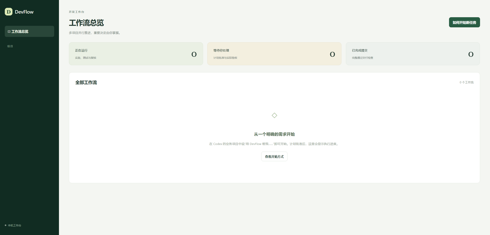

# 免登录改版验证报告

日期：2026-09-11。用户授权：取消控制台通行密钥，恢复完整测试，复核后本地提交。当前服务地址：[DevFlow](http://localhost:4810)。

## 实际使用方式

双击项目目录中的“打开 DevFlow.vbs”，或在服务运行时直接打开控制台。页面直接显示工作流总览，没有登录、注册、配对或通行密钥步骤。

在 Codex 的业务项目中说“用 DevFlow 帮我……”。首次项目接入由 Codex 调查；用户看懂计划后点击批准，实操通过后点击验收。内部令牌由程序管理，用户无需填写。



## 修改内容

- 删除浏览器 WebAuthn 注册、登录、验证与退出流程，移除相关依赖及会话 Cookie。
- 批准和验收改为同源按钮请求，仍绑定页面展示的计划版本、内容哈希、代码快照和环境版本。旧页面、重复提交或状态不符会被拒绝；原计划和验收记录继续沿用。
- 本地启动器直接打开控制台。旧 `pair` 命令只提示打开地址，不再生成配对密钥，也不再出现内置 SQLite 实验性警告。
- 将此前的 SQLite 驱动替换纳入此次验证：使用固定版本 `better-sqlite3@13.0.3`，保留数据库路径、表结构、WAL、事务及在线备份。
- 修复空工作台遗留的“登记项目”按钮；该按钮此前误入反馈弹窗，现统一显示自然语言开始说明。
- 图表解析改为分别限制依赖初始化（60 秒）和实际语法解析（30 秒），避免 Windows 冷加载被误判为非法 Mermaid。非法语法仍拒绝。
- 修复 PowerShell 7 自动解析 JSON 日期后丢失时间精度、时区导致的停止误判，保留 PID、创建时间、可执行文件及安装入口的归属检查。

## 测试结果

| 范围 | 结果与证据 |
|---|---|
| 全量单元/集成回归 | **62/62 通过**，覆盖事务、版本、权限、快照、证据、停止、修复、worktree、环境、多仓提交与恢复。[原始报告](evidence/no-login-20260911/vitest-full.json) |
| 补充统一入口回归 | **1/1 通过**，首次接入、会话续接、重复请求、新需求和不同 worktree 正确区分。[原始报告](evidence/no-login-20260911/vitest-intake.json) |
| 浏览器 E2E | **4/4 通过**：连续日志、空工作台入口、批准→实施→反馈重测→验收→提交、刷新及深链接恢复。[原始报告](evidence/no-login-20260911/e2e.json) |
| 真实 agy 模型与输出 | 请求及返回模型均为 `gemini-3.7-flash-high`，流式返回测试标记，退出码 0。[模型摘要](evidence/no-login-20260911/agy-model.json) |
| 真实 MCP 信息传递 | 计划内独有随机标记经 MCP 读取，完成修改、任务声明、冻结、测试和完成报告，页面能显示标记及工具日志。[摘要](evidence/no-login-20260911/agy-mcp.json) |
| 正式执行器路径 | 使用生产构建中的 `LocalRuntime`，真实 agy 执行后进入 `HUMAN_PENDING`；测试通过且日志在结束前可见。[摘要](evidence/no-login-20260911/agy-production.json) |
| 会话恢复与中途停止 | 明确会话 ID 恢复前轮标记；可见输出后停止耗时 **162 ms**，进程树剩余进程数为 0。[摘要](evidence/no-login-20260911/agy-resume-stop.json) |
| 真实 GPT-6 复核 | `gpt-6-astra` 经只读 MCP 检查已验收 E2E 夹具，返回 **pass**，身份及快照往返一致。[摘要](evidence/no-login-20260911/codex-accepted.json)、[结构化报告](evidence/no-login-20260911/codex-review.json) |
| 缺失验收的反向检查 | 对未验收夹具返回 **incomplete**，未因源码检查通过而跳过验收条件。[摘要](evidence/no-login-20260911/codex-without-acceptance.json) |
| OpenTabs 真实浏览器 | 实际控制台直接打开，无密钥弹窗；点击开始入口正确展示自然语言说明。[动作记录](evidence/no-login-20260911/console-opentabs.json)、[说明截图](evidence/no-login-20260911/start-help.png) |
| OpenTabs 场景执行 | 本机测试页面实际输入、点击、断言通过，场景结束释放浏览器租约。[动作证据](evidence/no-login-20260911/opentabs-gateway.json) |
| 多项目/多 worktree | 同项目双 worktree 加另一项目，3 套环境、6 个不同端口、3 个真实浏览器场景均通过，数据没有串用。[摘要](evidence/no-login-20260911/parallel-environments.json) |
| SQLite | 原生模块加载、中文数据读写、事务回滚、在线备份及原路径恢复均通过；详见全量报告中的 state、maintenance 用例。 |
| 本机启动与恢复 | 正式安装目录下启动、3 个并发启动请求复用单实例、进程重启后免登录访问通过；PowerShell 5.1 与 7 均实际启停成功。测试时正式工作流列表为空。[摘要](evidence/no-login-20260911/service-lifecycle.json) |
| 构建 | TypeScript 类型检查、后端、Vite 前端、Windows Host 构建通过。Host 最终构建 0 警告、0 错误。 |

总计 **63 项单元/集成测试及 4 项 E2E 通过，0 失败、0 跳过**。63 项来自完整回归 62 项与新增入口测试 1 项，两份原始报告分别保存，不把它们伪装成同一次运行。真实模型测试使用临时演示仓库和现有官方登录，未修改业务项目。

重现主要测试命令：

```powershell
npm run typecheck
npm test
npm run build
npm run test:e2e
node scripts/live-agy-probe.mjs
npm run test:live:resume-stop
npm run test:live:agy
npm run test:live:agy -- --production-runtime
npm run test:live:opentabs
node --import tsx tests/live/parallel-browser.ts
```

真实 Codex 适配器测试使用 `tests/live/codex-review.ts`，参数指向本轮 agy 摘要或已验收的 E2E 夹具。E2E 执行与复核的确定性适配器是测试夹具；真实 agy 与 GPT-6 结果已单独列出。

## 提交前代码复核

本轮由实现者复查实际补丁及相关调用链，没有将“测试夹具得到 GPT-6 pass”宣称为 DevFlow 源码独立复核通过。上次独立代理复核记录保留在原文档中，适用范围不扩大到本轮。

- 检查 WebAuthn 入口、会话 Cookie、配对生成、依赖和界面的移除是否一致；旧配对数据不再参与访问判断，旧登录接口返回不存在。
- 检查 HTTP 与 WebSocket 的 Host、Origin、Fetch Metadata、JSON 类型和模型令牌隔离；服务配置仍仅绑定 `127.0.0.1`。控制台按本机可信用户设计，不提供独立人类身份认证或恶意本机程序隔离。
- 检查批准、验收的绑定比对、状态机和一次性确认记录清理；未改变证据、快照、复核及精确提交门禁。
- 检查 SQLite 同步调用与备份 Promise、原有 SQL 及事务边界；更换驱动没有删除或重建用户数据库。
- 检查取消测试中的时序：停止应等待准备清理，测试夹具需先释放受控异步步骤；补齐调度器新增仓库身份检查所需的夹具数据。没有跳过失败断言。
- 实际浏览器复查发现空工作台错误入口并修复；实际重启复查发现 PowerShell 日期兼容问题并修复。相关复测均通过，未发现本轮阻止提交的问题。

## 证据与边界

当前证据和源码摘要清单见 [验证清单](验证清单.json)。证据文件按原始字节保存并记录 SHA-256；源码摘要统一将 CRLF 转为 LF，避免 Git 换行约定造成误判。

本轮恢复了代码与真实集成验证，不代表替用户完成所有业务项目的接入及实操验收，也没有执行电脑物理重启。服务进程重启、数据库恢复和中断状态的检查分别有上述证据。发布没有触发。

首次测试中的取消/仓库身份夹具问题及图表冷加载超时均已解决并复测。构建工具首次受执行环境 `EPERM` 限制时改用允许子进程的执行方式；Host 构建先遇到运行中程序文件占用，停止本安装服务后构建成功，再恢复服务。前端构建仍有大体积资源提示，E2E 和实际浏览器加载均通过。
