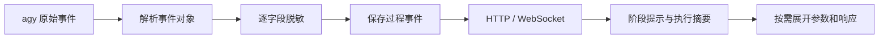
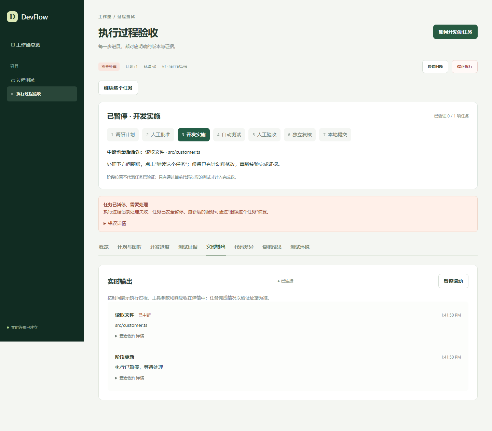

# 执行报错与实时过程修复记录

本记录保留故障初次修复时的验证现场。后续界面、细项统计与 CRM 当前状态以[用户界面与细项进度整改验证](用户界面与细项进度整改验证.md)为准。

2026-09-14。本轮针对 CRM 工作流运行中断、原始参数刷屏、当前阶段不清楚三个问题做局部修复。

## 故障原因与修复

失败发生在运行 `run-02da3168-1b0c-4827-bd8e-17dfd4add8f4` 的第 198 步。agy 发送的原始事件是有效 JSON；DevFlow 把整个事件序列化后执行字符串脱敏，再解析回对象，替换破坏了转义边界，抛出与截图一致的 `position 1652` 错误。

改为递归处理对象中的字符串值，再进行 JSON 序列化。工具响应里嵌套的 JSON 字符串也单独解析、脱敏、序列化。原始事件回放使用 137 字节分块，299 条事件全部通过；旧实现同一份数据失败一次，新实现零次。未将用户原始源码或凭据复制到报告中。

源码搜索此前会遍历 Maven `target` 等产物目录，把 class 文件当成文本。现在跳过常见编译目录并检测二进制内容；直接读取二进制文件返回可理解的错误。已保存的事件在 HTTP 和 WebSocket 输出前也重新脱敏，二进制正文显示为省略提示。原始运行文件保留用于排障，不作为日常界面的默认正文。

## 界面变化

- 所有任务页顶部固定展示七个阶段，并突出当前阶段；中断时回溯最后有效阶段。
- 显示已验证任务数、最近操作和下一步提示。阶段位置不等同于所有任务已完成。
- 读取文件、搜索源码、修改文件、运行测试等显示中文摘要；参数和响应默认折叠，搜索参数不直接展示在主时间线。
- 模型对外回复使用 Markdown 显示；内部任务输入不作为对话正文展示。
- 中断前没有结束的操作显示“已中断”，不会继续显示“进行中”。
- 保留持续推送、事件去重、旧 HTTP 响应合并和跟随最新输出功能。

## 验证

| 检查 | 结果 |
|---|---|
| 全部单元、集成回归 | 66 / 66 通过 |
| 实时输出浏览器回归 | 2 / 2 通过，包括跨页阶段提示、参数折叠、中断状态和旧快照合并 |
| 原故障运行回放 | 299 条事件，旧实现失败一次，新实现零失败 |
| TypeScript 与前后端构建 | 通过；前端保留原有分包体积提示 |
| 真实本机控制台 | 307 条历史事件正常显示，二进制内容隐藏，准确显示开发实施阶段与 0 / 12 已验证任务 |
| 真实工作流恢复 | 通过原恢复接口核实进程并重新排队，保留第 1 版批准计划；恢复后已进入 EXECUTING，收到新运行的 agy 过程事件 |

证据：[回放统计](evidence/incident-20260914/replay.json)、[回归统计](evidence/incident-20260914/tests.json)、[控制台检查](evidence/incident-20260914/console.json)、[恢复检查](evidence/incident-20260914/recovery.json)。

恢复仅表示开发任务继续执行。CRM 的开发完成、测试通过、人工验收和最终复核仍由原工作流的证据与状态门禁控制，本轮没有替用户确认业务验收。
