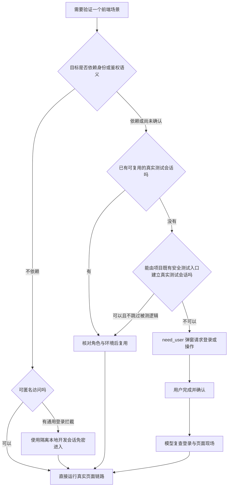

# 本地免密与认证策略规范

> 本规范指导执行模型在前端真实浏览器核验中，合理选择认证策略，避免在普通本地开发场景下不必要地打扰用户，同时严格捍卫安全鉴权与角色隔离的真实性。

---

## 1. 认证策略决策流程

---

## 2. 策略优先级与合规矩阵

| 场景类型 | 允许且推荐的策略 | 严厉禁止的做法 |
|---|---|---|
| **DevFlow 自身工作台** | 直接访问隔离本地工作台，默认无需账号登录。 | 强制要求登录模型厂商、外部平台才能查看普通页面。 |
| **业务页面支持匿名访问** | 直接匿名访问，无需登录。 | 为“仪式感”强制要求用户登录。 |
| **页面受通用登录拦截，但目标功能与身份/权限无关** | 使用本地专用、最小权限的免密开发会话（Dev Session）。 | 全局关闭鉴权中间件；在代码里写 `if (isLocal) return true;`；Mock 整条业务接口。 |
| **被测目标涉及角色权限、租户隔离、数据范围、过期机制** | 使用具备对应角色的真实测试账号/Session 走完整鉴权逻辑。 | 使用拥有全权限的超级管理员跳过权限判断；冒充权限测试通过。 |
| **涉及企业 SSO、微信扫码、MFA 二次认证或真实凭证** | 暂停当前执行，发出 `need_user` 交互弹窗请求人工协助。 | 要求用户在弹窗输入密码/验证码；将明文凭证写入提示词或日志。 |

---

## 3. 业务项目免密会话实现要求

当被测业务系统缺少安全免密入口且需要补齐时，须遵循以下约束：

1. **环境与网络约束**：
   - 仅在开发与测试模式（如 `NODE_ENV=development` / `test`）下显式启用。
   - 仅监听并绑定本机回环地址（`127.0.0.1`）。
   - 生产模式（`production`）必须彻底禁用，且必须具备防止生产启用的回归测试。
2. **最小权限与真实鉴权**：
   - 生成的会话身份仅包含当前场景所需的最小角色与权限。
   - 鉴权代码与中间件照常执行，严禁全局短路绕过。
3. **隔离与敏感信息防护**：
   - 临时测试会话、密钥与 Cookie 仅保存在未跟踪的本地临时目录或内存中，绝对不能提交到仓库。
   - 不能随意向浏览器的 `localStorage` 中强行写入假伪造 Token 来假装测试通过。

---

## 4. Cookie 隔离与串扰防范

1. **RFC 6265 边界**：
   - 同一主机的 Cookie **不按端口隔离**。即使端口不同，同一域名/IP 下的 Cookie 仍可能相互影响。
2. **防串扰措施**：
   - 优先使用独立测试浏览器 Profile 或独立的浏览器连接。
   - 若只能共享浏览器，本地测试会话应使用带有实例标识或独立命名空间的 Cookie 名称（如 `session_worktree_A`），并在测试完成后精准清理自己创建的会话。
   - 绝对不要执行清除全站 Cookie 的操作，避免影响用户已打开的日常工作页面。
